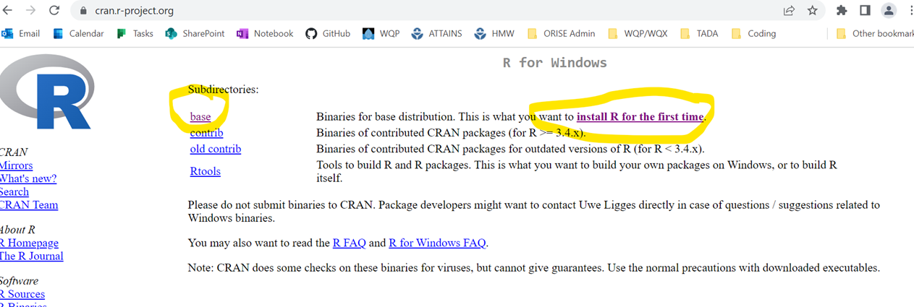
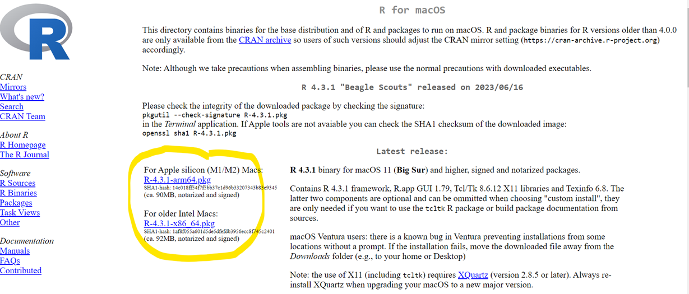
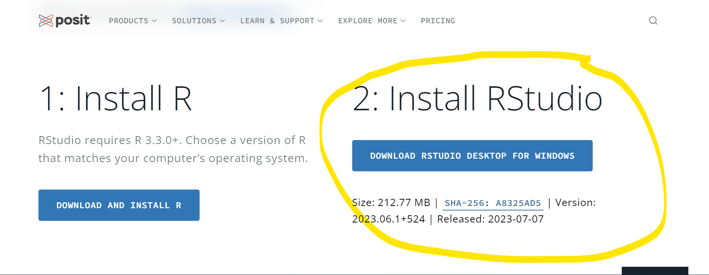

## Welcome to EPATADA: Tools for Automated Data Analysis!

[](https://lifecycle.r-lib.org/articles/stages.html#experimental)

[](https://github.com/USEPA/EPATADA/actions/workflows/R-CMD-check.yaml)

Tools for Automated Data Analysis, or TADA, is being developed to help States, Tribes (i.e., Tribal Nations, Pueblos, Bands, Rancherias, Communities, Colonies, Towns, Indians, Villages), federal partners, and any other [Water Quality Portal (WQP)](https://www.waterqualitydata.us/) users (e.g. researchers) efficiently compile and evaluate WQP data collected from water quality monitoring sites. TADA is both a stand-alone R package, and a building block to support development of the [TADA R Shiny application](https://github.com/USEPA/TADAShiny). We encourage you to read this package's [LICENSE](https://usepa.github.io/EPATADA/LICENSE.html) and [README](https://usepa.github.io/EPATADA/index.html) files (you are here).

-   How to use TADA:

    -   [Function Reference](https://usepa.github.io/EPATADA/reference/index.html)

    -   Example Workflow 1: [Water Quality Portal Data Discovery and Cleaning](https://usepa.github.io/EPATADA/articles/TADAModule1.html) (Beginner)

    -   Example Workflow 2: [2023 Shepherdstown Training](https://usepa.github.io/EPATADA/articles/TADATrainingShepherdstown.html) (Advanced)

-   [How to Contribute](https://usepa.github.io/EPATADA/articles/CONTRIBUTING.html)

    -   We encourage stakeholders to test the functionality and provide feedback. Moreover, open source software provides an avenue for water quality data originators and users to develop and share code, and we welcome your contributions! We hope to build a collaborative community dedicated to this effort where TADA users and contributors can discover, share and build the functionality over time.

-   More information on how TADA leverages the [WQX QAQC Service](https://usepa.github.io/EPATADA/articles/WQXValidationService.html)

-   [More about the TADA Project](https://www.epa.gov/waterdata/TADA)

## Installation

You must first have R and R Studio installed to use the TADA R Package (see instructions below if needed). Our team is actively developing TADA, therefore we highly recommend that you update the TADA R Package and all of its dependency libraries each time you use the package. You can install and/or update the [TADA R Package](https://github.com/USEPA/EPATADA) and all dependencies by running:

```{r}
if(!"remotes"%in%installed.packages()){
install.packages("remotes")
}

remotes::install_github("USEPA/EPATADA", ref = "develop", dependencies = TRUE, force = TRUE)
```

The TADA R Shiny application can be run [on the web](https://rconnect-public.epa.gov/TADAShiny/) (R and R Studio install not required), or within R Studio. Run the following code within R Studio to install or update and run the most recent version of the [TADA R Shiny](https://github.com/USEPA/TADAShiny) application:

```{r}
if(!"remotes"%in%installed.packages()){
install.packages("remotes")
}

remotes::install_github("USEPA/TADAShiny", ref = "develop", dependencies = TRUE, force = TRUE)

TADAShiny::run_app()
```

### Recommended Citation:

```         
Mullin, C.A., Marler, H., Greif, J., Hinman, E., Wong, K., Healy, K., Willi, K., Brousil, M., Bousquin, J., 2025, EPATADA: Tools for Automated Data Analysis, https://usepa.github.io/EPATADA/
```

## Water Quality Portal

In 2012, the WQP was deployed by the U.S. Geological Survey (USGS), the U.S. Environmental Protection Agency (USEPA), and the National Water Quality Monitoring Council to combine and serve water-quality data from numerous sources in a standardized format. The WQP holds over 420 million water quality sample results from over 1000 federal, state, tribal and other partners, and is the nation's largest source for single point of access for water-quality data. Participating organizations submit their data to the WQP using the EPA's Water Quality Exchange (WQX), a framework designed to map their data holdings to a common data structure.

## Install R and R Studio

1.  To download R: Go to <https://cran.r-project.org/> and click the link that describes your computer operating system in the first box in the menu entitled "Download and Install R".
2.  Clicking your operating system will take you to a new page, which looks slightly different for PC (first image) and Macs (second image):





3.  Download the program by clicking the appropriate link for your system, and click through the installer windows on your computer, accepting all defaults.

4.  Next, go to the following link to download RStudio: <https://posit.co/download/rstudio-desktop/>, scroll down a little, and click download RStudio.



3.  Again, download the installer, click through the prompts, and accept the defaults.

## Open-Source Code Policy

Effective August 8, 2016, the [OMB Mandate: M-16-21; Federal Source Code Policy: Achieving Efficiency, Transparency, and Innovation through Reusable and Open Source Software](https://obamawhitehouse.archives.gov/sites/default/files/omb/memoranda/2016/m_16_21.pdf) applies to new custom-developed code created or procured by EPA consistent with the scope and applicability requirements of Office of Management and Budget's (OMB's) Federal Source Code Policy. In general, it states that all new custom-developed code by Federal Agencies should be made available and reusable as open-source code.

The EPA specific implementation of OMB Mandate M-16-21 is addressed in the [System Life Cycle Management Procedure](https://www.epa.gov/irmpoli8/policy-procedures-and-guidance-system-life-cycle-management-slcm). EPA has chosen to use GitHub as its version control system as well as its inventory of open-source code projects. EPA uses GitHub to inventory its custom-developed, open-source code and generate the necessary metadata file that is then posted to code.gov for broad reuse in compliance with OMB Mandate M-16-21.

If you have any questions or want to read more, check out the [EPA Open Source Project Repo](https://www.epa.gov/developers/open-source-software-and-code-repositories) and [EPA's Interim Open Source Software Policy](https://www.epa.gov/sites/default/files/2018-02/documents/interim_oss_policy_final.pdf).

## License

All contributions to this project will be released under the CCO-1.0 license file dedication. By submitting a pull request or issue, you are agreeing to comply with this waiver of copyright interest.

## Disclaimer

This United States Environmental Protection Agency (EPA) GitHub project code is provided on an "as is" basis and the user assumes responsibility for its use. EPA has relinquished control of the information and no longer has responsibility to protect the integrity, confidentiality, or availability of the information. Any reference to specific commercial products, processes, or services by service mark, trademark, manufacturer, or otherwise, does not constitute or imply their endorsement, recommendation or favoring by EPA. The EPA seal and logo shall not be used in any manner to imply endorsement of any commercial product or activity by EPA or the United States Government.

## Contact

If you have any questions, please reach out to the TADA Team at mywaterway\@epa.gov.
