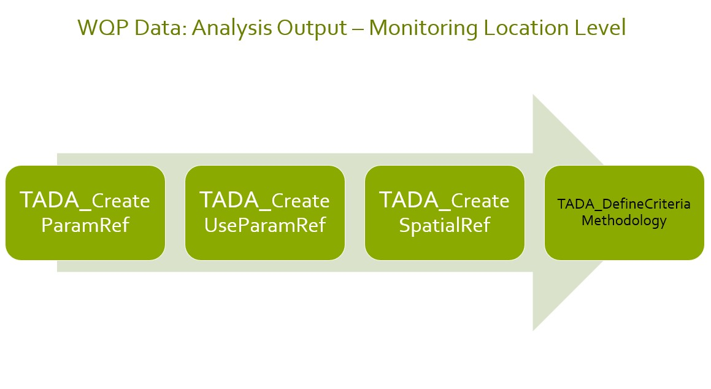
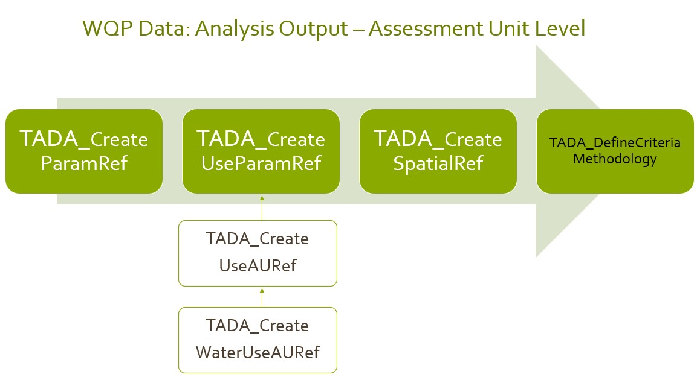

# Example Module 3 Workflow

## Welcome!

Thank you for your interest in Tools for Automated Data Analysis (TADA).
TADA is an open-source tool set built in the R programming language. The
EPATADA R Package is still under development. New functionality is added
weekly, and sometimes we need to make bug fixes in response to user
feedback. We appreciate your feedback, patience, and interest in these
helpful tools. If you are interested in contributing to TADA
development, more information is available
[here](https://usepa.github.io/EPATADA/articles/CONTRIBUTING.html). We
welcome collaboration with external partners!

## Install and load packages

First, install and load the remotes package specifying the repo. This is
needed before installing the EPATADA R package because it is only
available on GitHub.

``` r
install.packages("remotes",
  repos = "http://cran.us.r-project.org"
)
library(remotes)
```

Next, install and load the EPATADA R Package using the remotes package.
Dependency packages will also be downloaded automatically from CRAN. You
may be prompted in the console to update dependencies. It is recommended
to update all dependencies (enter 1 into the console).

``` r
remotes::install_github("USEPA/EPATADA",
  ref = "develop",
  dependencies = TRUE
)
# remotes::install_github("USGS-R/dataRetrieval", dependencies=TRUE)
```

Finally, use the **library()** function to load the TADA R Package into
your R session.

``` r
library(EPATADA)
```

All EPATADA R package functions have their own individual help pages
(see [Function
Reference](https://usepa.github.io/EPATADA/reference/index.html)). Users
can also access function help pages from RStudio by entering
`?[name of TADA function]` into the console (example below).

``` r
# Access help page for TADA_DataRetrieval
?TADA_DataRetrieval
```

## Module 3 Functions in TADA

Disclaimer: The EPATADA Module 3 functions were designed to: (1) assist
users with associating Water Quality Portal monitoring locations with
assessment units and designated uses from ATTAINS and (2) compare Water
Quality Portal results with numeric water quality criteria. EPATADA
functions do not constitute current EPA policy or regulatory
requirements. Organizations may choose to use EPATADA as a a tool in
their decision making processes. Use of EPATADA is not required.

## Introduction to TADA Module 3

This [RMarkdown](https://yihui.org/rmarkdown/) document walks users
through how to create WQP and ATTAINS crosswalks that are needed to
define and capture organization specific water quality analysis criteria
and methodologies. This is a continuation of an example TADA workflow
which began with ExampleMod2Workflow.Rmd.

Specifically, this vignette provides an overview of three functions that
can assist users with:

- Creating a crosswalk (reference table) between ATTAINS parameter names
  and WQP/TADA characteristic names/TADA comparable data identifier.

- Creating a crosswalk (reference table) of all unique combinations of
  ATTAINS uses and parameters applicable to your analysis needs.

- Define and summarize your spatial level of analysis for uses and
  parameters to locations(monitoring locations or assessment units) and
  capture any unique site-specific WQS criteria.

These functions are designed to be flexible so users from states,
tribes, or territories can input organization-specific information and
link it information from ATTAINS. While TADA functions can help generate
these crosswalks and fill in some values, users must review and modify
the tables generated in each step to ensure accuracy. The TADA team has
also incorporated national recommended Clean Water Act (CWA) EPA 304(a)
numeric criteria for optional use in Module 3 functions that has been
filled out and reviewed by the TADA team. This allows users to analyze
their data against the EPA 304(a) criteria; and to easily compare
results when when using EPA 304(a) criteria vs. their own state or
tribe’s criteria.

## Getting Started

First, we will load example reference tables (crosswalks) created for
TADA workflow example purposes. These are (1) a ML to AU crosswalk and
(2) a Uses to AU crosswalk. If you would like to learn how these
reference tables were created, see the ExampleMod2Workflow vignette.

``` r
# import example data set, example AUML crosswalk and example uses to AU crosswalk.
# extract ATTAINS_crosswalk data frame from the list
utils::data(Data_MT_AUMLRef)
Final.MT.AUMLRef <- Data_MT_AUMLRef$ATTAINS_crosswalk
utils::data(Data_MT_AU_UsesRef)
MT.AU_UsesRef <- Data_MT_AU_UsesRef
```

### Get WQP Monitoring Data in Montana Using TADA_DataRetrieval()

Let’s start with an example data frame that has already been through the
data cleaning, wrangling, harmonization, handling of censored data,
removal of suspect results, and other important TADA Module 1 functions.
This process should be completed by users before utilizing Module 2 or 3
functions, so we will go through some minimal cleaning with an example
data set from Montana. Get bacteria and pH data from Missoula County,
Montana.

``` r
# get MT data
tada.MT <- TADA_DataRetrieval(
  startDate = "2020-01-01",
  endDate = "2022-12-31",
  statecode = "MT",
  characteristicName = c(
    "Escherichia",
    "Escherichia coli",
    "pH"
  ),
  countycode = "Missoula County",
  ask = FALSE
)

# clean up data set (minimal)
tada.MT.clean <- tada.MT |>
  TADA_RunKeyFlagFunctions() |>
  TADA_SimpleCensoredMethods() |>
  TADA_HarmonizeSynonyms()
```

    ##                Flag_Column Result Count
    ## 1 TADA.SampleFraction.Flag          135

``` r
# remove intermediate objects
rm(tada.MT)

# if you cannot run TADA_DataRetrieval query, the example data set can be loaded by uncommenting the code below

# tada.MT.clean <- Data_MT_MissoulaCounty
```

This example will focus only on Montana. The remainder of this vignette
will walk through how to fill out two crosswalk tables
(TADA_ParametersForAnalysis and TADA_UsesForAnalysis) that are needed
before we can start assigning applicable criteria and methodologies
information for this specific ATTAINS organization (MTDEQ).

## ATTAINS Domains and Allowable Values

A crosswalk between TADA characteristics and ATTAINS parameters is
needed before we can integrate information from these two data sets.
Before creating the TADA/WQP CharacteristicName and ATTAINS parameter
crosswalk table (TADA_ParametersForAnalysis), let’s review all the
unique TADA.ComparableDataIdentifiers (characteristic, fraction and
speciation combinations) in the example data. How many results are
available for each within the example data set?

``` r
# create table with counts of TADA.ComparableDataIdentifiers
TADA_FieldValuesTable(tada.MT.clean, field = "TADA.ComparableDataIdentifier")
```

    ##                                  Value Count
    ## 1                    PH_NONE_NONE_NONE   280
    ## 2 ESCHERICHIA COLI_NONE_NONE_CFU/100ML   146

In this vignette, we will crosswalk each of these
TADA.ComparableDataIdentifiers to ATTAINS parameter names. ATTAINS has
multiple domains, including the parameter names domain, that have
allowable values. Using the R package rExpertQuery, which provides
functions for downloading tidy data from the ATTAINS public web services
(<https://github.com/USEPA/rExpertQuery>), we can review all ATTAINS
domains (see example below).

``` r
# return ATTAINS parameter domain values
TADA_TableExport(rExpertQuery::EQ_DomainValues("param_name"))
```

    ## [1] "EQ_DomainValues: For param_name the values in the 'name' column of the function output are the allowable values for rExpert Query functions."

In the next section, we will review which parameters have been listed in
ATTAINS in the past for a specific organization. In order to select a
specific organization in the TADA_ParametersForAnalysis() function, we
need to identify the organization id used in ATTAINS. The organization
id for Montana is “MTDEQ”.

``` r
# return ATTAINS organization domain values
TADA_TableExport(rExpertQuery::EQ_DomainValues("org_id"))
```

    ## [1] "EQ_DomainValues: For org_id the values in the 'code' column of the function output are the allowable values for rExpert Query functions."

## TADA_ParametersForAnalysis() Basics

ATTAINS Parameter Names are more general than the TADA Comparable Data
Identifiers. Therefore, we recommend users provide a crosswalk between
each TADA.ComparableDataIdentifier and ATTAINS.ParameterName.
TADA_ParametersForAnalysis() creates a template which includes all
TADA.ComparableDataIdentifiers from the TADA data frame and provides a
blank column, “ATTAINS.ParameterName” for users to input the
corresponding ATTAINS parameter name.

TADA_ParametersForAnalysis() includes an argument input ‘auto_assign’ to
assist users in finding an alias name between TADA Characteristic Names
to ATTAINS Parameter Name, if one is found. It is important to note that
even with these exact matches, there are additional complexities related
to fraction, speciation and units that may be unique to your
organization. For example, some organizations may consider Total
Nitrogen, Nitrate/Nitrite, and Ammonia all to match the ATTAINS
parameter “Nitrogen”, while others may consider only some
fraction/speciation combinations analogous to the ATTAINS parameter
“Nitrogen”.

Setting “excel = TRUE” in TADA_ParametersForAnalysis tells the function
to create an Excel spreadsheet of the reference table for review and
editing. The excel output includes logic to help a user select ATTAINS
parameter names that have been used in the past by the selected
organization. If users do not want to work in Excel, they can use “excel
= FALSE” to return a data frame. The data frame can be edited directly
in R if desired, although there are no TADA-specific functions designed
to facilitate this.

When using TADA_ParametersForAnalysis(), users should specify the
organization(s) of interest in the “org_id” argument. This ensures that
the correct number of rows will be created in the reference table. When
“excel = TRUE”, specifying the organization(s) also creates a separate
tab in the Excel file which contains the parameter names used in prior
assessment cycles by the specified ATTAINS organization(s). This will
allow users to decide whether to continue to use the same ATTAINS
parameter names from prior assessments that their organizations(s) have
used in the past, or to use other valid parameter names from the entire
ATTAINS domain list.

Keep in mind that only parameter names previously entered in ATTAINS by
the selected organization(s) will be returned. Many organization only
input parameters that are causes in ATTAINS. This means that
TADA_ParametersForAnalysis() may not return all parameters required by
an organization’s assessment methodology if some parameters have never
been listed as a cause. If there is not a suitable ATTAINS parameter
name to match a TADA.ComparableDataIdentifier, users should contact the
ATTAINS team (attains@epa.gov) for assistance.

For our first example, we will specify Montana’s organization identifier
(“MTDEQ”) as our ATTAINS organization identifier of interest. By
default, auto_assign = “None” which will not populate any entries for
the ATTAINS.ParameterName column, and users will need to manually fill
this crosswalk out.

``` r
# create TADA parameter reference table for specified organization
MT.ParamRef.None <- TADA_ParametersForAnalysis(
  tada.MT.clean,
  org_id = c("MTDEQ"),
  auto_assign = "None",
  excel = FALSE
  # uncomment to run the excel file
  # excel = TRUE, overwrite = TRUE
)
```

    ## [1] "EQ_DomainValues: For org_id the values in the 'code' column of the function output are the allowable values for rExpert Query functions."

``` r
TADA_TableExport(MT.ParamRef.None)
```

#### Auto_assign Options

Now, let’s see what happens we we use auto_assign = ‘All’ to
autopopulate exact matches. The auto assignment will create exact
matches based on the entire list of allowable ATTAINS parameters. This
means that parameter names your organization has not previously record
in ATTAINS may be included in the assignments.

``` r
# create TADA parameter reference table for specified organization
MT.ParamRef.All <- TADA_ParametersForAnalysis(
  tada.MT.clean,
  org_id = c("MTDEQ"),
  auto_assign = "All",
  excel = FALSE
  # excel = TRUE, overwrite = TRUE
)

TADA_TableExport(MT.ParamRef.All)
```

Another option is to set auto_assign = ‘Org’. This limits the exact
matches returned to only ATTAINS.ParameterNames the selected
organization has used in the past.

``` r
# create TADA parameter reference table for specified organization
MT.ParamRef.Org <- TADA_ParametersForAnalysis(
  tada.MT.clean,
  org_id = c("MTDEQ"),
  auto_assign = "Org",
  excel = FALSE
  # uncomment excel = TRUE, overwrite = TRUE to run the excel file
  # excel = TRUE, overwrite = TRUE
)

TADA_TableExport(MT.ParamRef.Org)
```

#### Manual Parameter Crosswalk

The code chunk below demonstrates how the parameter reference table can
be modified in R. Once modifications are complete, we can re-run
TADA_ParametersForAnalysis using the modified parameter reference table
as the input for “paramRef”. This will update the
ATTAINS.FlagParameterName column in the parameter reference table (see
example below). This column provides information about whether or not
the organization specified in the “ATTAINS.OrganizationIdentifier”
column has listed this parameter as a cause in prior assessment cycles.
It also flags rows where the TADA.ComparableDataIdentifier as not been
assigned an ATTAINS parameter name.

``` r
# only run the code chunks below if you make edits to the excel file. Please note you must open and save the excel file at least once to reflect all Excel formula based values.

# downloads_path <- file.path(Sys.getenv("USERPROFILE"), "Downloads", "myfileRef.xlsx")
# ParamRef <- openxlsx::read.xlsx(downloads_path, sheet = "CreateParamRef")

# MT.ParamRef_Excel <- TADA_ParametersForAnalysis(
#   Data_NCTC,
#   org_names = c("MTDEQ"),
#   paramRef = ParamRef,
#   excel = TRUE, overwrite = TRUE
#   )

ParamRef <- MT.ParamRef.None |>
  dplyr::mutate(ATTAINS.ParameterName = dplyr::case_when(
    grepl("PH_NONE_NONE_NONE", TADA.ComparableDataIdentifier) ~ "PH",
    grepl("ESCHERICHIA COLI", TADA.ComparableDataIdentifier) ~ "ESCHERICHIA COLI (E. COLI)"
  )) |>
  dplyr::bind_rows(data.frame(TADA.ComparableDataIdentifier = "PH_NONE_NONE_NONE", ATTAINS.ParameterName = "PH, HIGH", ATTAINS.OrganizationIdentifier = "MTDEQ"))

MT.ParamRef.Manual <- TADA_ParametersForAnalysis(
  tada.MT.clean,
  org_id = c("MTDEQ"),
  paramRef = ParamRef,
  excel = FALSE
  # uncomment excel = TRUE, overwrite = TRUE to run the excel file
  # excel = TRUE, overwrite = TRUE
)

TADA_TableExport(MT.ParamRef.Manual)
```

#### Provide a User Supplied paramRef

We can now save and reuse MT.ParamRef_Manual as the user-supplied
paramRef argument input in TADA_ParametersForAnalysis(). When this
reference file is used for the next assessment or analysis cycle, this
function will determine if any new WQX characteristic names are included
in the TADA data frame and add additional rows to the crosswalk if
needed.

``` r
MT.ParamRef.user.supplied <- TADA_ParametersForAnalysis(
  tada.MT.clean,
  org_id = c("MTDEQ"),
  paramRef = MT.ParamRef.Manual,
  excel = FALSE
  # uncomment excel = TRUE, overwrite = TRUE to run the excel file
  # excel = TRUE, overwrite = TRUE
)

TADA_TableExport(MT.ParamRef.user.supplied)
```

#### Review, Save and Re-Use paramRef

Once the parameter reference table has been reviewed and modified, it
can be saved and reused for analysis of future TADA data frames. This
process is useful to help identify if new WQP characteristics (or new
fraction/speciations) are being queried in your most up to date WQP
query and to allow you to review how to handle these new additions.

If new WQP characteristics (or new fraction/speciations) do show up,
your user supplied ‘paramRef’ is prioritized over the ‘auto_assign’
argument inputs. The auto_assign option will allow you to fill in any
remaining blank ATTAINS.ParameterName that you have not filled in but
will not replace any cross walk that you have defined in your user
supplied crosswalk. In our case, since each unique
TADA.ComparableDataIdentifier was cross walked to an
ATTAINS.ParameterName in the user supplied ’MT.ParamRef_user_supplied,
this table will be the same.

``` r
MT.ParamRef.Final <- TADA_ParametersForAnalysis(
  tada.MT.clean,
  org_id = c("MTDEQ"),
  paramRef = MT.ParamRef.user.supplied,
  auto_assign = "All",
  excel = FALSE
  # uncomment excel = TRUE, overwrite = TRUE to run the excel file
  # excel = TRUE, overwrite = TRUE
)

# Test if the two data frames are same or not.
identical(MT.ParamRef.Final[1:4], MT.ParamRef.user.supplied[1:4])
```

    ## [1] TRUE

``` r
TADA_TableExport(MT.ParamRef.Final)
```

Remove intermediate variable, we will keep only the crosswalk tables
that are relevant for the remaining workflow.

``` r
rm(ParamRef, MT.ParamRef.All, MT.ParamRef.Manual, MT.ParamRef.None, MT.ParamRef.Org, MT.ParamRef.user.supplied)
```

## TADA_UsesForAnalysis() Basics

Our first example will pull in all prior ATTAINS uses (ATTAINS.UseNames)
and parameter names (ATTAINS.ParameterName) from the specified ATTAINS
organization (defined by the org_id function argument for
TADA_UsesForAnalysis), which in this case is “MTDEQ” (Montana) using
ExpertQuery web services. Users will review the output and choose which
ATTAINS.UseName(s) are applicable to their analysis. Later in the data
analysis process, users will be asked to define criteria and
methodologies that is applicable to each ATTAINS use name and parameter
name labeled as “Include”. If an ATTAINS.UseName is not applicable,
users should choose “Exclude” for that ATTAINS parameter name and use
name.

#### Manual Uses to Parameter Assignment

Any ATTAINS parameter name(s) that have not been used by an organization
in prior assessment cycles, will not have any associated prior use
names. In this case, users must manually assign the appropriate
ATTAINS.UseName under the column ‘ATTAINS.UseName’. They may need to add
additional rows if the parameter applies to multiples uses. Users can
also choose to ‘auto_assign’ all unique ATTAINS.UseName by
ATTAINS.OrganizationName to any ATTAINS.ParameterName missing a use name
associated with it.

In the example below, we can see “PH” and “ESCHERICHIA COLI (E. COLI)”
as the ATTAINS.ParameterNames that were assessed in prior assessment
cycles for MTDEQ (see ATTAINS.FlagUseName column in NCTC_usesRef). “PH,
HIGH” was not listed in ATTAINS for MTDEQ in the prior assessment cycle,
but was included as a parameter name MTDEQ would like to assess for in
this current assessment cycle. Thus, the ATTAINS.UseName is left blank
for “PH, HIGH”.

``` r
MT.usesRef.Manual <- TADA_UsesForAnalysis(
  tada.MT.clean,
  org_id = c("MTDEQ"),
  paramRef = MT.ParamRef.Final,
  auto_assign = FALSE,
  excel = FALSE
  # uncomment excel = TRUE, overwrite = TRUE to run the excel file
  # excel = TRUE, overwrite = TRUE
)

TADA_TableExport(MT.usesRef.Manual)
```

If desired, a user can manually assign “PH, HIGH” to any applicable uses
(disclaimer: this is for demonstration purposes only and does not
reflect MTDEQ’s criteria and assessment process).

``` r
add.data <- data.frame(
  "ATTAINS.OrganizationIdentifier" = "MTDEQ",
  "ATTAINS.ParameterName" = rep("PH, HIGH", 2),
  "ATTAINS.UseName" = c(
    "Aquatic Life",
    "Agriculture"
  )
)
```

The output of this will not reflect changes to the ATTAINS.FlagUseName
column. To do so, we need to re run TADA_UsesForAnalysis() with usesRef
= add_data as an argument input.

``` r
usesRef <- MT.usesRef.Manual |>
  dplyr::left_join(add.data, by = c("ATTAINS.OrganizationIdentifier", "ATTAINS.ParameterName"), keep = FALSE) |>
  dplyr::mutate(ATTAINS.UseName = dplyr::coalesce(ATTAINS.UseName.x, ATTAINS.UseName.y)) |>
  dplyr::select(-c(ATTAINS.UseName.x, ATTAINS.UseName.y)) |>
  dplyr::mutate(IncludeOrExclude = "Include")

# PH will now reflect the changes
MT.usesRef.Manual.Update <- TADA_UsesForAnalysis(
  tada.MT.clean,
  paramRef = MT.ParamRef.Final,
  usesRef = usesRef, # Edits were made to usesRef, updates flag column
  org_id = c("MTDEQ"),
  auto_assign = FALSE,
  excel = FALSE
  # uncomment excel = TRUE, overwrite = TRUE to run the excel file
  # excel = TRUE, overwrite = TRUE
)

TADA_TableExport(MT.usesRef.Manual.Update)
```

#### Auto_assign Option

Alternatively, we can choose to assign all unique use names found in
your current usesRef table, by your organization to those
ATTAINS.ParameterName without any associated ATTAINS.UseName. Users will
need to review this assignment carefully, choose include or exclude
appropriately, and include additional rows as needed if there are more
ATTAINS.UseName applicable for that ATTAINS.ParameterName that was not
captured by the auto_assign method.

``` r
# uses will come from the user supplied reference table produced in ExampleMod2Workflow.Rmd
utils::data(Data_MT_AU_UsesRef_Water)

MT.usesRef.AutoAssign <- TADA_UsesForAnalysis(
  tada.MT.clean,
  org_id = c("MTDEQ"),
  paramRef = MT.ParamRef.Final,
  auto_assign = TRUE,
  excel = FALSE
  # uncomment excel = TRUE, overwrite = TRUE to run the excel file
  # excel = TRUE, overwrite = TRUE
)
TADA_TableExport(MT.usesRef.AutoAssign)
```

#### User has completed a Use to AU crosswalk

Now, if a user has completed assignments of uses to AUs in the
recommended ExampleMod2Workflow.Rmd, they need to provide this as a
AU_UsesRef argument input. This will help to ensure that the uses are
applicable to your most recent assessment/analysis needs. These uses are
extracted based on the uses to water type assignments in your AU_UsesRef
and joined to an internal parameter and water type extraction from
rExpertQuery to assign any new uses to parameters.

``` r
MT.usesRef.with.AU_UsesRef <- TADA_UsesForAnalysis(
  tada.MT.clean,
  org_id = c("MTDEQ"),
  paramRef = MT.ParamRef.Final,
  AU_UsesRef = Data_MT_AU_UsesRef_Water, # uses will come from the user supplied reference table produced in ExampleMod2Workflow.Rmd
  auto_assign = TRUE,
  excel = FALSE
  # excel = TRUE, overwrite = TRUE
)
```

#### Provide a User Supplied usesRef

Users can also choose to supply their own usesRef as an argument input.
This may be useful if your organization has made significant changes to
use names in the current cycle (cannot be retrieved from the prior
ATTAINS assessment cycle) or if there are just additional use names that
were unable to be retrieved from the prior assessment cycle.

(Note: TADA functions leverages the ATTAINS assessment profiles which
will not reflect any submitted use name changes to ATTAINS until the
next assessment cycle is approved. In addition, it may not be possible
to retrieve every use and parameter name combination from ATTAINS as it
is dependent on what information each organization has submitted to
ATTAINS.)

In this example, let’s use a filled out criteria table for MTDEQ and
extract the use and parameters from their crosswalk.

We can see that MTDEQ has additional rows for E. Coli that was unable to
be retrieved from ATTAINS. We also see PH was not found in the user
supplied usesRef table. We will assume MTDEQ has forgotten to include PH
in their table and showcase the importance of considering all readily
available data from your WQP data retrieval that you may need to
consider for analysis.

``` r
# Load the example MTDEQ criteria table
criteria_table <- system.file("extdata", "criteria_table.rda", package = "EPATADA")

load(criteria_table)

MT.UseParam.user.supplied <- dplyr::select(criteria_table, ATTAINS.OrganizationIdentifier, TADA.ComparableDataIdentifier, TADA.CharacteristicName, ATTAINS.ParameterName, ATTAINS.UseName)

MT.usesRef.user.supplied.edit <- TADA_UsesForAnalysis(
  tada.MT.clean,
  org_id = c("MTDEQ"),
  paramRef = MT.ParamRef.Final,
  usesRef = MT.UseParam.user.supplied,
  auto_assign = TRUE,
  excel = FALSE
  # uncomment excel = TRUE, overwrite = TRUE to run the excel file
  # excel = TRUE, overwrite = TRUE
)

TADA_TableExport(MT.usesRef.user.supplied.edit)
```

#### Review, Save and Re-Use usesRef

Once the uses to parameter reference table has been reviewed and
modified, it can be saved and reused for analysis of future TADA data
frames. This process is useful to help identify if any new WQP
characteristics (or new fraction/speciations) are being queried in your
most up to date WQP query and to allow you to review how to handle
assigning ATTAINS uses to these new additions.

If new WQP characteristics (or new fraction/speciations) do show up,
your user supplied ‘usesRef’ is prioritized over the ‘auto_assign’
argument inputs. Thus, the auto_assign option will allow you to fill in
any remaining blank ATTAINS.UseName to an ATTAINS.ParameterName that you
have not filled in but will not replace any cross walk that you have
defined in your user supplied crosswalk.

``` r
MT.usesRef.Final <- TADA_UsesForAnalysis(
  tada.MT.clean,
  org_id = c("MTDEQ"),
  paramRef = MT.ParamRef.Final,
  usesRef = MT.usesRef.user.supplied.edit,
  auto_assign = "All",
  excel = FALSE
  # uncomment excel = TRUE, overwrite = TRUE to run the excel file
  # excel = TRUE, overwrite = TRUE
)

# Test if the two data frames are same or not.
identical(MT.usesRef.Final[1:5], MT.usesRef.user.supplied.edit[1:5])
```

    ## [1] TRUE

``` r
TADA_TableExport(MT.usesRef.Final)
```

remove intermediate variable, keep only the crosswalk table that we will
continue to use in the workflow.

``` r
rm(MT.usesRef.AutoAssign, MT.UseParam.user.supplied, MT.usesRef.Manual, MT.usesRef.Manual.Update)
```

## TADA_MLSummary(): Create and Define Spatial Reference Tables

We can define your WQP data set on either an assessment unit level
summary or monitoring location sites level. Please refer to EPATADA
Module 2 for more information on the geospatial functions to assist with
assessment unit and monitoring location overlay.

The general workflow of running module 3 functions for CWA water quality
data analysis is shown below.



Monitoring Location Summary



Assessment Unit Level Summary

### Define Spatial Summary by Monitoring Location (ML)

Let’s start off with a ML summary of MTDEQ data frame. By default, we
will only display rows for parameters and uses for a ML if it contains
data collected for that TADA.CharacteristicName in your WQP data query.
If you would like to display all information even for sites with no WQP
data, please choose displayNA = TRUE

``` r
MT.MLSummaryRef.ML <- TADA_MLSummary(
  .data = tada.MT.clean,
  usesRef = MT.usesRef.Final,
  org_id = "MTDEQ",
  displayNA = TRUE,
  excel = FALSE
  # excel = TRUE, overwrite = TRUE
)

TADA_TableExport(MT.MLSummaryRef.ML)
```

### Define Spatial Summary by Monitoring Location (AU)

Now let’s compare this to the AU level of summary. To provide the ML to
AU level of summary, this requires an AUML crosswalk and an AU_UsesRef,
we recommend you to review the ExampleMod2Workflow vignette for more in
depth information on this crosswalk. We will load these example
reference tables into this vignette.

We now have all assignments of ATTAINS Uses, ATTAINS Parameters, and WQP
Monitoring Location Sites to each AU defined. Users can do a final
review to ensure all assignments are correct.

Note: By default, we will only display rows for parameters and uses for
a ML if it contains data collected for that TADA.CharacteristicName in
your WQP data query. If you would like to display all information even
for sites with no WQP data, please choose displayNA = TRUE

``` r
# Load the dataset
utils::data("Data_MT_AU_UsesRef_Water", package = "EPATADA")

MT.MLSummaryRef.AU <- TADA_MLSummary(
  .data = tada.MT.clean,
  usesRef = MT.usesRef.Final,
  AU_UsesRef = Data_MT_AU_UsesRef_Water, # uses will come from the user supplied reference table produced in ExampleMod2Workflow.Rmd
  AUMLRef = Final.MT.AUMLRef,
  org_id = "MTDEQ",
  displayNA = FALSE,
  excel = FALSE
  # excel = TRUE, overwrite = TRUE
)

TADA_TableExport(MT.MLSummaryRef.AU)
```

### Assign site-specific spatial criteria

We can apply any unique spatial criteria on a monitoring location sites
level. This view allows us to determine whether there are certain sites
that needs a unique site-specific criteria, certain water types, or
certain combination of characteristics that have site-specific criteria.
Let’s go through an example of how a user may modify this table.

``` r
MT.MLSummaryRef.AU2 <- MT.MLSummaryRef.AU |>
  dplyr::mutate(
    UniqueSpatialCriteria = dplyr::case_when(
      MonitoringLocationIdentifier == "MTVOLWQM_WQX-CLEARWATERR_1" ~ "Example Site Specific"
    )
  )

TADA_TableExport(MT.MLSummaryRef.AU2)
```

Compare the nrow for each of the ML versus AU level of summary. The AU
level of summary is further filtered down by the AU to ML crosswalk, the
use to AU crosswalk, and the use to parameter crosswalk based on what
TADA.ComparableDataIdentifier has been collected at those sites and
taking into consideration of what parameter(s) and use(s) have been
assessed for each assessment unit. (Note: Would users find it useful to
still include a parameter and use for a site even if the site does not
contain that TADA.ComparableDataIdentifier - the ATTAINS.ParameterName?
This could be included in the final summary table and labeled as NA or
insufficient data.)

``` r
nrow(MT.MLSummaryRef.AU)
nrow(MT.MLSummaryRef.ML)
```

## TADA DefineCriteriaMethodology()

Now, lets get to generating the criteria and methodology file for MTDEQ
to fill out. We will showcase how this table will be generated for the
first time using the recommended step-by-step workflow and showcase how
a user can go about updating their criteria and methodology file as
needed.

First, let’s show how our step-by-step process all come together. Users
will need to fill out this template that is generated. It is highly
recommended to export this to the excel spreadsheet to show the
allowable values and easy interface for inputs to the table.

``` r
MT.CriteriaMethods <- TADA_DefineCriteriaMethodology(
  .data = tada.MT.clean,
  org_id = "MTDEQ",
  MLSummaryRef = MT.MLSummaryRef.ML,
  excel = FALSE
  # excel = TRUE, overwrite = TRUE
)

TADA_TableExport(MT.CriteriaMethods)
```

Now, if MTDEQ, already has a filled out/partially filled out criteria
methods table, let’s provide this as an argument input. criteria_table
is an example of a criteria table that has been filled out by a few R8
states and tribes.

Note: Whenever a criteriaMethods argument input value is provided, users
will be warned if there are additional WQP characteristics (or
TADA.ComparableDataIdentifier - see argument input uniqueDataId =
TRUE/FALSE in the R documentation for more information) that are not
captured in their user supplied table. Thus, auto_assign defaults to
TRUE even if it is specified as FALSE.

``` r
MT.CriteriaMethods.user.supplied <- TADA_DefineCriteriaMethodology(
  .data = tada.MT.clean,
  org_id = "MTDEQ",
  MLSummaryRef = NULL,
  criteriaMethods = criteria_table,
  excel = FALSE
  # excel = TRUE, overwrite = TRUE
)

TADA_TableExport(MT.CriteriaMethods.user.supplied)
```

You can append EPA304(a) recommended standards by specifying “USEPA” as
part of org_id (if there is one found for a TADA.CharacteristicName)

``` r
MT.CriteriaMethods.user.supplied2 <- TADA_DefineCriteriaMethodology(
  .data = tada.MT.clean,
  org_id = c("MTDEQ", "USEPA"),
  MLSummaryRef = NULL,
  criteriaMethods = criteria_table,
  displayUniqueId = TRUE,
  excel = FALSE
  # excel = TRUE, overwrite = TRUE
)

TADA_TableExport(MT.CriteriaMethods.user.supplied2)
```

#### Review, Save and Re-Use Criteria and Methodology Table

Once the criteria and methodology table has been reviewed and modified,
it can be saved and reused for analysis of future TADA data frames. This
process is useful to help identify if any new WQP characteristics (or
new fraction/speciations) are being queried in your most up to date WQP
query and to allow you to determine if an assessment magnitude value
should be developed.

For our example, we will use MT.CriteriaMethods_User_Supplied2 and fill
in the remaining blank PH magnitude values with a range between 6.5 and
8.5 as MTDEQ criteria of interest.

``` r
# We will fill in PH magnitude values for this example
MT.CriteriaMethods.Final <- MT.CriteriaMethods.user.supplied2 |>
  dplyr::mutate(MagnitudeValueLower = dplyr::case_when(
    grepl("PH_NONE_NONE_NONE", TADA.ComparableDataIdentifier) & ATTAINS.OrganizationIdentifier == "MTDEQ" ~ 6.5,
    TRUE ~ MagnitudeValueLower
  )) |>
  dplyr::mutate(MagnitudeValueUpper = dplyr::case_when(
    grepl("PH_NONE_NONE_NONE", TADA.ComparableDataIdentifier) & ATTAINS.OrganizationIdentifier == "MTDEQ" ~ 8.5,
    TRUE ~ MagnitudeValueUpper
  ))

TADA_TableExport(MT.CriteriaMethods.Final)
```

We will supply this final crosswalk table to be reused and validated.

``` r
MT.CriteriaMethods.Final2 <- TADA_DefineCriteriaMethodology(
  .data = tada.MT.clean,
  org_id = "MTDEQ",
  MLSummaryRef = NULL,
  criteriaMethods = MT.CriteriaMethods.Final,
  displayUniqueId = TRUE,
  excel = FALSE
  # excel = TRUE, overwrite = TRUE
)

TADA_TableExport(MT.CriteriaMethods.Final2)
```
