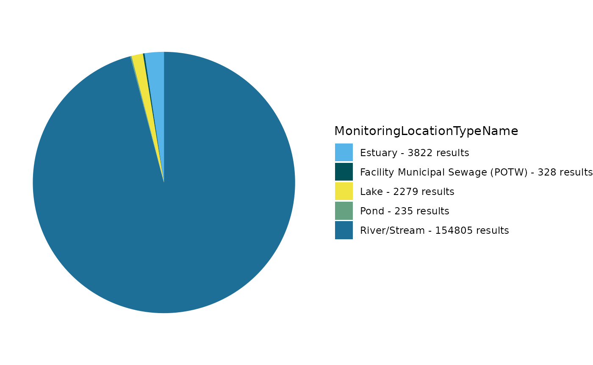
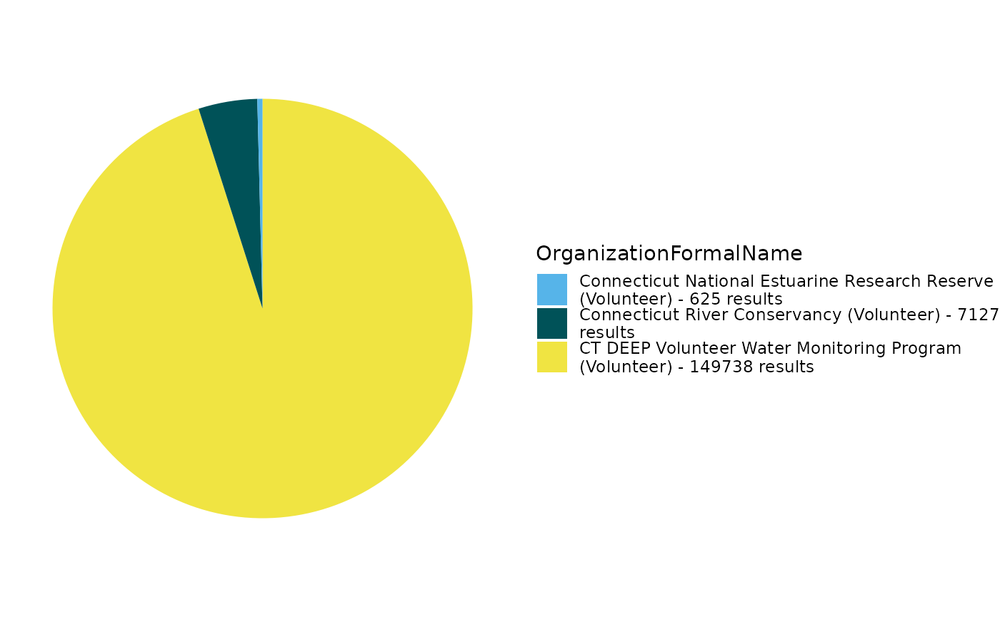
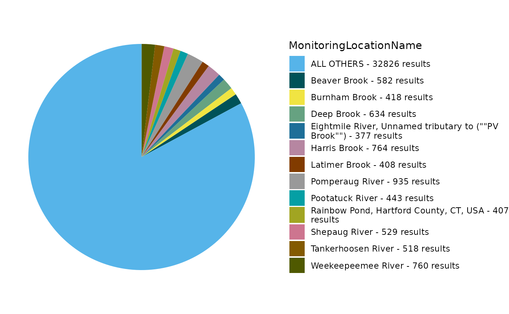

# Participatory (Volunteer) Scientists are Monitoring Waters and Sharing Data via EPA's Water Quality eXchange (WQX)

## Install and Load the EPATADA R Package

First, install and load the remotes package specifying the repo. This is
needed before installing EPATADA because it is only available on GitHub
(not CRAN).

``` r
install.packages("remotes")
# Load the remotes library
library(remotes)
```

Next, install and load TADA using the remotes package. TADA R Package
dependencies will also be downloaded automatically from CRAN with the
TADA install. You may be prompted in the console to update dependency
packages that have more recent versions available. If you see this
prompt, it is recommended to update all of them (enter 1 into the
console).

``` r
remotes::install_github("USEPA/EPATADA",
  ref = "develop",
  dependencies = TRUE
)
```

Finally, use the **library()** function to load the TADA R Package into
your R session.

``` r
library(EPATADA)
```

#### Find volunteer data in WQX

Let’s explore [participatory science water
projects](https://www.epa.gov/participatory-science/participatory-science-water-projects)
using the Water Quality eXchange (WQX), Water Quality Portal (WQP), and
the EPATADA R Package. To start, let’s find volunteer monitoring
organizations who have submitted data to EPA’s Water Quality eXchange
(WQX) by reviewing the `organization` domain table available
[here](https://www.epa.gov/waterdata/storage-and-retrieval-and-water-quality-exchange-domain-services-and-downloads).

``` r
# Get the WQX organizations domain
organizations <- read.csv(url("https://cdx.epa.gov/wqx/download/DomainValues/Organization.CSV"))

# Subset to include only "Volunteer" organizations and exclude WQX test/training orgs
volunteer_orgs <- subset(
  organizations,
  Type == "Volunteer" &
    !grepl("training",
      Name,
      ignore.case = TRUE
    ) &
    !grepl("test",
      Name,
      ignore.case = TRUE
    ) &
    !grepl("\\*",
      Name,
      ignore.case = TRUE
    )
)

unique(volunteer_orgs$Name)
```

Generate a list of 5 random organization IDs:

``` r
random_volunteer_orgIDs <- sample(volunteer_orgs$ID, size = 5)
```

Prepare list for use in `TADA_DataRetrieval`:

``` r
unlist(random_volunteer_orgIDs)
```

Query the Water Quality Portal (WQP) using `TADA_DataRetrieval` and the
5 random volunteer organizations IDs. We will look for any data
available from 2015 to present.

``` r
volunteer_data <- TADA_DataRetrieval(
  startDate = "2015-01-01",
  organization = random_volunteer_orgIDs,
  ask = FALSE,
  applyautoclean = TRUE
)
```

#### Retrieve data from WQP

Alternatively, choose 5 volunteer monitoring organizations and query
WQP. We will move forward with this example of volunteer organizations
in CT:

``` r
selected_orgs <-
  c(
    "CONNRIVERCONSERVANCY",
    "CT_NERR",
    "BANTAMLAKE_WQX",
    "CTVOLMON",
    "CT_NERR"
  )

volunteer_data <- EPATADA::TADA_DataRetrieval(
  organization = selected_orgs,
  ask = FALSE,
  applyautoclean = TRUE
)
```

``` r
utils::data("Data_Participatory_Scientists", package = "EPATADA")

volunteer_data <- Data_Participatory_Scientists
```

#### Explore and refine results

Review volunteer monitoring projects in WQX:

``` r
unique(volunteer_data$ProjectName)
```

    ##  [1] "Riffle Bioassessment by Volunteers Program"                                                                                                                                                                                       
    ##  [2] "Volunteer Stream Temperature Monitoring Network"                                                                                                                                                                                  
    ##  [3] "CRC and Affiliate Monitoring"                                                                                                                                                                                                     
    ##  [4] "Connecticut Lake Watch"                                                                                                                                                                                                           
    ##  [5] "CRC Cyanobacteria 2025"                                                                                                                                                                                                           
    ##  [6] "Ecoli2025"                                                                                                                                                                                                                        
    ##  [7] "CRC 2019 Bacteria Monitoring"                                                                                                                                                                                                     
    ##  [8] "Chicopee Four Rivers Watershed Council 2019"                                                                                                                                                                                      
    ##  [9] "Deerfield River Watershed Association 2019"                                                                                                                                                                                       
    ## [10] "Connecticut River Conservancy/Connecticut River Watershed Council 2012-2018"                                                                                                                                                      
    ## [11] "2019 Anguilla Brook Watershed Bacteria Source Trackdown"                                                                                                                                                                          
    ## [12] "2012 Flat Brook Trackdown Survey"                                                                                                                                                                                                 
    ## [13] "Connecticut River Conservancy 2020"                                                                                                                                                                                               
    ## [14] "Fort River Watershed Asssociation 2020"                                                                                                                                                                                           
    ## [15] "Deerfield River Watershed Association 2020"                                                                                                                                                                                       
    ## [16] "Chicopee 4River Watershed Council 2020"                                                                                                                                                                                           
    ## [17] "Pomperaug River Watershed Based Plan Implementation Groundwork: Additional Water Quality Monitoring, Agricultural Outreach, BMP Implementation Design and Landowner Agreements to Address Bacteria Impairments. EPA RFA No. 21059"
    ## [18] "Still River Watershed Pollution Trackdown Survey. CTDEEP Contract No. 17-06"                                                                                                                                                      
    ## [19] "Connecticut River Conservancy 2021"                                                                                                                                                                                               
    ## [20] "Chicopee 4 Rivers Watershed Council 2021"                                                                                                                                                                                         
    ## [21] "Deerfield River Watershed Association 2021"                                                                                                                                                                                       
    ## [22] "Connecticut River Conservancy 2022"                                                                                                                                                                                               
    ## [23] "Deerfield River Watershed Association 2022"                                                                                                                                                                                       
    ## [24] "Chicopee 4 Rivers Watershed Council 2022"                                                                                                                                                                                         
    ## [25] "Clean Up Sound & Harbors (CUSH) volunteer water monitoring program"                                                                                                                                                               
    ## [26] "CT Harbor Watch water monitoring program"

Generate pie chart:

``` r
EPATADA::TADA_FieldValuesPie(volunteer_data, field = "MonitoringLocationTypeName")
```



Review and remove sites if coordinates are imprecise or outside US:

``` r
volunteer_data <- EPATADA::TADA_FlagCoordinates(volunteer_data,
  clean_outsideUSA = "remove",
  clean_imprecise = TRUE,
  flaggedonly = FALSE
)
```

Use `TADA_OverviewMap` to generate a map:

``` r
EPATADA::TADA_OverviewMap(volunteer_data)
```

Review and remove duplicate results if present:

``` r
volunteer_data <- EPATADA::TADA_FindPotentialDuplicatesSingleOrg(volunteer_data)
```

    ## TADA_FindPotentialDuplicatesSingleOrg: 355 groups of potentially duplicated results found in dataset. These have been placed into duplicate groups in the TADA.SingleOrgDupGroupID column and the function randomly selected one result from each group to represent a single, unduplicated value. Selected values are indicated in the TADA.SingleOrgDup.Flag as 'Unique', while duplicates are flagged as 'Duplicate' for easy filtering.

``` r
volunteer_data <- dplyr::filter(volunteer_data, TADA.SingleOrgDup.Flag == "Unique")
```

Prepare censored (nondetects and overdetects) results for analysis:

``` r
volunteer_data <- EPATADA::TADA_SimpleCensoredMethods(
  volunteer_data,
  nd_method = "multiplier",
  nd_multiplier = 0.5,
  od_method = "as-is",
  od_multiplier = "null"
)
```

    ## TADA_IDCensoredData: No censored data detected in your dataframe. Returning input dataframe with new column TADA.CensoredData.Flag set to Uncensored

    ## Cannot apply simple censored methods to dataframe with no censored data results. Returning input dataframe.

Run key TADA quality control flagging functions and remove suspect
results:

``` r
volunteer_data <- EPATADA::TADA_RunKeyFlagFunctions(
  volunteer_data,
  clean = TRUE
)
```

    ## TADA_FindQCActivities: Quality control samples have been removed or were not present in the input dataframe. Returning dataframe with TADA.ActivityType.Flag column for tracking.

Flag results above and below thresholds. Review carefully and consider
removing.

``` r
volunteer_data <- EPATADA::TADA_FlagAboveThreshold(volunteer_data,
  clean = FALSE,
  flaggedonly = FALSE
)
```

    ## TADA_FlagAboveThreshold: Returning the dataframe with flags. Counts:  NA - Not Available: 3153, Pass: 34449, Suspect: 1999

``` r
volunteer_data <- EPATADA::TADA_FlagBelowThreshold(volunteer_data,
  clean = FALSE,
  flaggedonly = FALSE
)
```

    ## TADA_FlagBelowThreshold: Returning the dataframe with flags. Counts:  NA - Not Available: 3153, Pass: 35930, Suspect: 518

Harmonize synonyms if found:

``` r
volunteer_data <- EPATADA::TADA_HarmonizeSynonyms(volunteer_data)
```

Generate table:

``` r
EPATADA::TADA_FieldValuesTable(volunteer_data, field = "ActivityTypeCode")
```

    ##            Value Count
    ## 1 Sample-Routine 35904
    ## 2  Field Msr/Obs  3697

Generate pie chart:

``` r
EPATADA::TADA_FieldValuesPie(volunteer_data, field = "OrganizationFormalName")
```



Generate pie chart:

``` r
EPATADA::TADA_FieldValuesPie(volunteer_data, field = "MonitoringLocationName")
```



Remove non-numeric results:

``` r
volunteer_data <- EPATADA::TADA_ConvertSpecialChars(
  volunteer_data,
  col = "TADA.ResultMeasureValue",
  clean = TRUE
)
```

Review the number of sites and records for each characteristic:

``` r
EPATADA::TADA_SummarizeColumn(volunteer_data)
```

    ## # A tibble: 23 × 3
    ##    TADA.CharacteristicName              n_sites n_records
    ##    <chr>                                  <int>     <int>
    ##  1 AMMONIA                                   15       244
    ##  2 CHLOROPHYLL A                              4       144
    ##  3 CONDUCTANCE                               15       149
    ##  4 COUNT                                    808     23121
    ##  5 DEPTH, SECCHI DISK DEPTH                  41       474
    ##  6 DISSOLVED OXYGEN (DO)                     15       589
    ##  7 ENTEROCOCCUS                              15       115
    ##  8 ESCHERICHIA COLI                         420      9182
    ##  9 FECAL COLIFORM                            16       128
    ## 10 INORGANIC NITROGEN (NO2, NO3, & NH3)      15       269
    ## # ℹ 13 more rows

Filter data to review a single characteristic:

``` r
ecoli <- dplyr::filter(
  volunteer_data,
  TADA.ComparableDataIdentifier %in% c(
    "ESCHERICHIA COLI_NONE_NONE_CFU/100ML"
  )
)
```

Generate scatter plot for E. coli:

``` r
EPATADA::TADA_GroupedScatterplot(ecoli)
```

    ## TADA_GroupedScatterplot: No 'groups' selected for MonitoringLocationName. There are 396 MonitoringLocationNames in the TADA dataframe. The top four MonitoringLocationNames by number of results will be plotted: Sunderland Boat Ramp; CT River at Barton Cove Boat Ramp (now MA-CTR_122.5); DCR/UMASS boat dock and Oxbow/Easthampton Boat Ramp.

Filter to a single site and continue exploring E. coli:

``` r
ecoli <- dplyr::filter(
  ecoli,
  TADA.MonitoringLocationIdentifier %in% c(
    "CONNRIVERCONSERVANCY-WILLIAMS_.92"
  )
)
```

Let’s check if any results are above the EPA 304A recommended maximum
criteria magnitude (see: [2012 Recreational Water Quality Criteria Fact
Sheet](https://www.epa.gov/sites/default/files/2015-10/documents/rec-factsheet-2012.pdf)).

[![EPA 2012 recreational water quality criteria (RWQC) recommendations
for protecting human health in all coastal and non-coastal waters
designated for primary contact recreation use. EPA provides two sets of
recommended criteria. The RWQC consist of three components: magnitude,
duration and frequency. The magnitude of the bacterial indicators are
described by both a geometric mean (GM) and a statistical threshold
value (STV) for the bacteria samples. The waterbody GM should not be
greater than the selected GM magnitude in any 30-day interval. The STV
approximates the 90th percentile of the water quality distribution and
is intended to be a value that should not be exceeded by more than 10
percent of the samples in the same 30-day interval. The table summarizes
the magnitude component of the
recommendations.](images/bacteria.png)](chrome-extension://efaidnbmnnnibpcajpcglclefindmkaj/https://www.epa.gov/sites/default/files/2015-10/documents/rec-factsheet-2012.pdf)

If interested, you can find other state, tribal, and EPA 304A criteria
in [EPA’s Criteria Search
Tool](https://www.epa.gov/wqs-tech/state-specific-water-quality-standards-effective-under-clean-water-act-cwa).

Let’s check if any individual results exceed 320 CFU/100mL (the
magnitude component of the EPA recommendation 2 criteria for ESCHERICHIA
COLI).

``` r
# add column with comparison to criteria mag (excursions)
ecoli <- ecoli |>
  dplyr::mutate(meets_criteria_mag = ifelse(TADA.ResultMeasureValue <= 320, "Yes", "No"))

# review subset
ecoli_subset_review <- ecoli |>
  dplyr::select(
    MonitoringLocationIdentifier, OrganizationFormalName, ActivityStartDate, TADA.ResultMeasureValue,
    meets_criteria_mag
  )

EPATADA::TADA_TableExport(ecoli_subset_review)
```

Generate stats table. Review percentiles. Less than 5% of results fall
above ~19 CFU/100mL and over 98% of results fall below ~2185 CFU/100m

``` r
EPATADA::TADA_TableExport(EPATADA::TADA_Stats(ecoli))
```

Generate a scatterplot. One result value is above the threshold.

``` r
EPATADA::TADA_Scatterplot(ecoli, id_cols = "TADA.ComparableDataIdentifier") |>
  plotly::add_lines(
    y = 320,
    x = c(min(ecoli$ActivityStartDate), max(ecoli$ActivityStartDate)),
    inherit = FALSE,
    showlegend = FALSE,
    line = list(color = "red"),
    hoverinfo = "none"
  )
```

Generate a histogram.

``` r
EPATADA::TADA_Histogram(ecoli, id_cols = "TADA.ComparableDataIdentifier")
```

`TADA_Boxplot` can be useful for identifying skewness and percentiles.

``` r
EPATADA::TADA_Boxplot(ecoli, id_cols = "TADA.ComparableDataIdentifier")
```

Check out other example R workflows designed to work with WQP data under
the [Articles](https://usepa.github.io/EPATADA/) tab on the EPATADA
package website.
