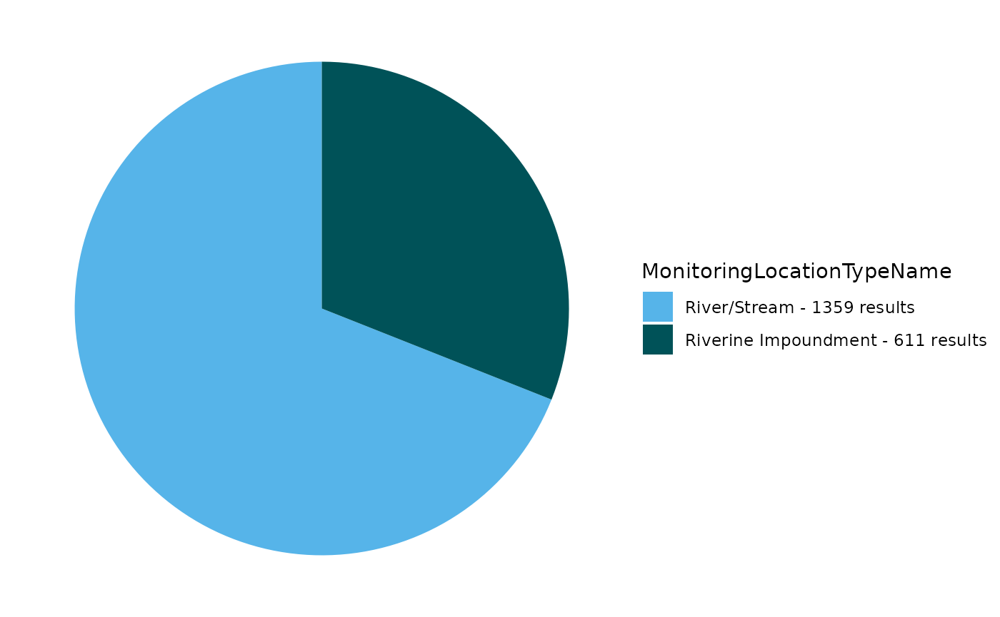
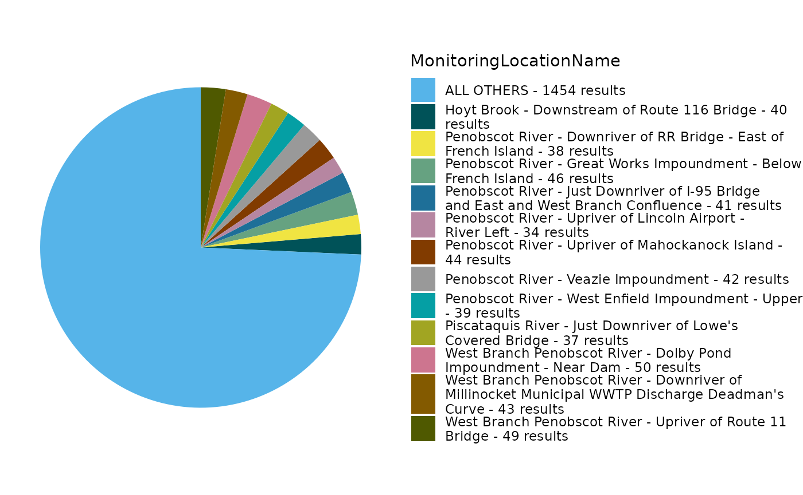

# An Example TADA Workflow Using Penobscot Nation Data

## Install and Load the EPATADA R Package

First, install and load the remotes package specifying the repo. This is
needed before installing EPATADA because it is only available on GitHub
(not CRAN).

``` r
install.packages("remotes")
# Load the remotes library
library(remotes)
```

Next, install and load TADA using the remotes package. TADA R Package
dependencies will also be downloaded automatically from CRAN with the
TADA install. You may be prompted in the console to update dependency
packages that have more recent versions available. If you see this
prompt, it is recommended to update all of them (enter 1 into the
console).

``` r
remotes::install_github("USEPA/EPATADA",
  ref = "develop",
  dependencies = TRUE
)
```

Finally, use the **library()** function to load the TADA R Package into
your R session.

``` r
library(EPATADA)
```

## Retrieve Penobscot Nation data

To start, let’s find Penobscot Nation water monitoring data that was
submitted to EPA’s Water Quality eXchange. We are interested in Class B
waters only. In this example, we already have a list of the Monitoring
Location Identifiers that represent Class B waters. We can use this list
of locations to query the WQP. In addition, we are interested in E. Coli
data and can specify that in the characteristicName filter.

``` r
df_raw <- TADA_DataRetrieval(
  siteid = c(
    "PENOBSCOTINDIANNATIONDNR-130-BM1",
    "PENOBSCOTINDIANNATIONDNR-4-CH1",
    "PENOBSCOTINDIANNATIONDNR-5-DC1",
    "PENOBSCOTINDIANNATIONDNR-6-DP1",
    "PENOBSCOTINDIANNATIONDNR-76-DP3",
    "PENOBSCOTINDIANNATIONDNR-13-EM1",
    "PENOBSCOTINDIANNATIONDNR-14-EM2",
    "PENOBSCOTINDIANNATIONDNR-15-GB1",
    "PENOBSCOTINDIANNATIONDNR-16-GB2",
    "PENOBSCOTINDIANNATIONDNR-17-GB3",
    "PENOBSCOTINDIANNATIONDNR-18-GF1",
    "PENOBSCOTINDIANNATIONDNR-19-GF2",
    "PENOBSCOTINDIANNATIONDNR-113-GW1",
    "PENOBSCOTINDIANNATIONDNR-114-GW2",
    "PENOBSCOTINDIANNATIONDNR-115-GW3",
    "PENOBSCOTINDIANNATIONDNR-129-GWTR1",
    "PENOBSCOTINDIANNATIONDNR-20-LE1",
    "PENOBSCOTINDIANNATIONDNR-21-LE2",
    "PENOBSCOTINDIANNATIONDNR-22-LE3",
    "PENOBSCOTINDIANNATIONDNR-23-LI1",
    "PENOBSCOTINDIANNATIONDNR-24-LT1",
    "PENOBSCOTINDIANNATIONDNR-25-MD1",
    "PENOBSCOTINDIANNATIONDNR-26-MD2",
    "PENOBSCOTINDIANNATIONDNR-27-MI1",
    "PENOBSCOTINDIANNATIONDNR-28-MI2",
    "PENOBSCOTINDIANNATIONDNR-29-MI3",
    "PENOBSCOTINDIANNATIONDNR-30-MS1",
    "PENOBSCOTINDIANNATIONDNR-31-MW1",
    "PENOBSCOTINDIANNATIONDNR-32-MW2",
    "PENOBSCOTINDIANNATIONDNR-33-NL1",
    "PENOBSCOTINDIANNATIONDNR-117-OR1",
    "PENOBSCOTINDIANNATIONDNR-34-OT1",
    "PENOBSCOTINDIANNATIONDNR-35-OT2",
    "PENOBSCOTINDIANNATIONDNR-36-OT3",
    "PENOBSCOTINDIANNATIONDNR-37-PA1",
    "PENOBSCOTINDIANNATIONDNR-38-PA2",
    "PENOBSCOTINDIANNATIONDNR-39-PA3",
    "PENOBSCOTINDIANNATIONDNR-40-PA4",
    "PENOBSCOTINDIANNATIONDNR-41-PI1",
    "PENOBSCOTINDIANNATIONDNR-42-PI2",
    "PENOBSCOTINDIANNATIONDNR-43-PI3",
    "PENOBSCOTINDIANNATIONDNR-44-PS1",
    "PENOBSCOTINDIANNATIONDNR-46-SH2",
    "PENOBSCOTINDIANNATIONDNR-47-SL1",
    "PENOBSCOTINDIANNATIONDNR-81-TCOS1",
    "PENOBSCOTINDIANNATIONDNR-87-THOB",
    "PENOBSCOTINDIANNATIONDNR-135-TPIR14",
    "PENOBSCOTINDIANNATIONDNR-105-TPIR15",
    "PENOBSCOTINDIANNATIONDNR-123-TPIR16",
    "PENOBSCOTINDIANNATIONDNR-100-TPIR3",
    "PENOBSCOTINDIANNATIONDNR-103-TPIR6",
    "PENOBSCOTINDIANNATIONDNR-104-TPIR9",
    "PENOBSCOTINDIANNATIONDNR-86-TPOB",
    "PENOBSCOTINDIANNATIONDNR-91-TPUS1",
    "PENOBSCOTINDIANNATIONDNR-92-TPUS2",
    "PENOBSCOTINDIANNATIONDNR-131-VZI1",
    "PENOBSCOTINDIANNATIONDNR-132-VZTR1",
    "PENOBSCOTINDIANNATIONDNR-48-WB1",
    "PENOBSCOTINDIANNATIONDNR-49-WBU1",
    "PENOBSCOTINDIANNATIONDNR-50-WD1",
    "PENOBSCOTINDIANNATIONDNR-51-WD2",
    "PENOBSCOTINDIANNATIONDNR-75-WD3",
    "PENOBSCOTINDIANNATIONDNR-52-WE1",
    "PENOBSCOTINDIANNATIONDNR-53-WE2",
    "PENOBSCOTINDIANNATIONDNR-54-WE3",
    "PENOBSCOTINDIANNATIONDNR-56-WL1"
  ),
  characteristicName = "Escherichia coli",
  maxrecs = 350000,
  ask = FALSE,
  applyautoclean = TRUE
)
```

    ## Checking what data is available. This may take a moment.

    ## Downloading WQP query results. This may take some time depending upon the query size.

    ## c("PENOBSCOTINDIANNATIONDNR-130-BM1", "PENOBSCOTINDIANNATIONDNR-4-CH1", "PENOBSCOTINDIANNATIONDNR-5-DC1", "PENOBSCOTINDIANNATIONDNR-6-DP1", "PENOBSCOTINDIANNATIONDNR-76-DP3", "PENOBSCOTINDIANNATIONDNR-13-EM1", "PENOBSCOTINDIANNATIONDNR-14-EM2", "PENOBSCOTINDIANNATIONDNR-15-GB1", "PENOBSCOTINDIANNATIONDNR-16-GB2", "PENOBSCOTINDIANNATIONDNR-17-GB3", "PENOBSCOTINDIANNATIONDNR-18-GF1", "PENOBSCOTINDIANNATIONDNR-19-GF2", "PENOBSCOTINDIANNATIONDNR-113-GW1", "PENOBSCOTINDIANNATIONDNR-114-GW2", "PENOBSCOTINDIANNATIONDNR-115-GW3", 
    ## "PENOBSCOTINDIANNATIONDNR-129-GWTR1", "PENOBSCOTINDIANNATIONDNR-20-LE1", "PENOBSCOTINDIANNATIONDNR-21-LE2", "PENOBSCOTINDIANNATIONDNR-22-LE3", "PENOBSCOTINDIANNATIONDNR-23-LI1", "PENOBSCOTINDIANNATIONDNR-24-LT1", "PENOBSCOTINDIANNATIONDNR-25-MD1", "PENOBSCOTINDIANNATIONDNR-26-MD2", "PENOBSCOTINDIANNATIONDNR-27-MI1", "PENOBSCOTINDIANNATIONDNR-28-MI2", "PENOBSCOTINDIANNATIONDNR-29-MI3", "PENOBSCOTINDIANNATIONDNR-30-MS1", "PENOBSCOTINDIANNATIONDNR-31-MW1", "PENOBSCOTINDIANNATIONDNR-32-MW2", "PENOBSCOTINDIANNATIONDNR-33-NL1", 
    ## "PENOBSCOTINDIANNATIONDNR-117-OR1", "PENOBSCOTINDIANNATIONDNR-34-OT1", "PENOBSCOTINDIANNATIONDNR-35-OT2", "PENOBSCOTINDIANNATIONDNR-36-OT3", "PENOBSCOTINDIANNATIONDNR-37-PA1", "PENOBSCOTINDIANNATIONDNR-38-PA2", "PENOBSCOTINDIANNATIONDNR-39-PA3", "PENOBSCOTINDIANNATIONDNR-40-PA4", "PENOBSCOTINDIANNATIONDNR-41-PI1", "PENOBSCOTINDIANNATIONDNR-42-PI2", "PENOBSCOTINDIANNATIONDNR-43-PI3", "PENOBSCOTINDIANNATIONDNR-44-PS1", "PENOBSCOTINDIANNATIONDNR-46-SH2", "PENOBSCOTINDIANNATIONDNR-47-SL1", "PENOBSCOTINDIANNATIONDNR-81-TCOS1", 
    ## "PENOBSCOTINDIANNATIONDNR-87-THOB", "PENOBSCOTINDIANNATIONDNR-135-TPIR14", "PENOBSCOTINDIANNATIONDNR-105-TPIR15", "PENOBSCOTINDIANNATIONDNR-123-TPIR16", "PENOBSCOTINDIANNATIONDNR-100-TPIR3", "PENOBSCOTINDIANNATIONDNR-103-TPIR6", "PENOBSCOTINDIANNATIONDNR-104-TPIR9", "PENOBSCOTINDIANNATIONDNR-86-TPOB", "PENOBSCOTINDIANNATIONDNR-91-TPUS1", "PENOBSCOTINDIANNATIONDNR-92-TPUS2", "PENOBSCOTINDIANNATIONDNR-131-VZI1", "PENOBSCOTINDIANNATIONDNR-132-VZTR1", "PENOBSCOTINDIANNATIONDNR-48-WB1", "PENOBSCOTINDIANNATIONDNR-49-WBU1", 
    ## "PENOBSCOTINDIANNATIONDNR-50-WD1", "PENOBSCOTINDIANNATIONDNR-51-WD2", "PENOBSCOTINDIANNATIONDNR-75-WD3", "PENOBSCOTINDIANNATIONDNR-52-WE1", "PENOBSCOTINDIANNATIONDNR-53-WE2", "PENOBSCOTINDIANNATIONDNR-54-WE3", "PENOBSCOTINDIANNATIONDNR-56-WL1")Escherichia coli

    ## Data successfully downloaded. Running TADA_AutoClean function.

    ## TADA_Autoclean: creating TADA-specific columns.

    ## TADA_Autoclean: handling special characters and coverting TADA.ResultMeasureValue and TADA.DetectionQuantitationLimitMeasure.MeasureValue value fields to numeric.

    ## TADA_Autoclean: converting TADA.LatitudeMeasure and TADA.LongitudeMeasure fields to numeric.

    ## TADA_Autoclean: harmonizing synonymous unit names (m and meters) to m.

    ## TADA_Autoclean: updating deprecated (i.e. retired) characteristic names.

    ## No deprecated characteristic names found in dataset.

    ## TADA_Autoclean: harmonizing result and depth units.

    ## TADA_Autoclean: creating TADA.ComparableDataIdentifier field for use when generating visualizations and analyses.

    ## NOTE: This version of the TADA package is designed to work with numeric data with media name: 'WATER'. TADA_AutoClean does not currently remove (filter) data with non-water media types. If desired, the user must make this specification on their own outside of package functions. Example: dplyr::filter(.data, TADA.ActivityMediaName == 'WATER')

## Explore and refine results

Review unique monitoring projects:

``` r
unique(df_raw$ProjectName)
```

    ## [1] "Baseline Water Quality Monitoring"   "Penobscot River Restoration Project"

Generate pie chart:

``` r
EPATADA::TADA_FieldValuesPie(df_raw, field = "MonitoringLocationTypeName")
```



Use `TADA_OverviewMap` to generate a map:

``` r
EPATADA::TADA_OverviewMap(df_raw)
```

Review and remove duplicate results if present:

``` r
df_flag <- EPATADA::TADA_FindPotentialDuplicatesSingleOrg(df_raw)
```

    ## TADA_FindPotentialDuplicatesSingleOrg: 13 groups of potentially duplicated results found in dataset. These have been placed into duplicate groups in the TADA.SingleOrgDupGroupID column and the function randomly selected one result from each group to represent a single, unduplicated value. Selected values are indicated in the TADA.SingleOrgDup.Flag as 'Unique', while duplicates are flagged as 'Duplicate' for easy filtering.

Select a small number of columns to review duplicates:

``` r
TADA_TableExport(subset(
  df_flag,
  TADA.SingleOrgDupGroupID != "Not a duplicate",
  select = c(ResultIdentifier,
             ActivityStartDate,
             TADA.ActivityMediaName,
             TADA.MonitoringLocationIdentifier,
             TADA.CharacteristicName,
             TADA.ResultMeasureValue,
             TADA.ResultMeasure.MeasureUnitCode,
             ResultAnalyticalMethod.MethodName)
))
```

Remove duplicates:

``` r
df_clean <- dplyr::filter(df_flag, TADA.SingleOrgDup.Flag == "Unique")
```

Run key TADA quality control flagging functions. Review carefully and
consider removing flagged results.

``` r
df_flag <- EPATADA::TADA_RunKeyFlagFunctions(
  df_clean,
  clean = FALSE
)
```

    ## All characteristic/fraction combinations are valid in your dataframe. Returning input dataframe with TADA.SampleFraction.Flag column for tracking.

    ## TADA_FlagSpeciation: All characteristic/method speciation combinations are valid in your dataframe. Returning input dataframe with TADA.MethodSpeciation.Flag column for tracking.

    ## TADA_FindQCActivities: Quality control samples have been removed or were not present in the input dataframe. Returning dataframe with TADA.ActivityType.Flag column for tracking.

    ## TADA_FlagMeasureQualifierCode: Dataframe does not include any information (all NAs) in MeasureQualifierCode.

Flag results above and below thresholds. Review carefully and consider
removing.

``` r
df_flag <- EPATADA::TADA_FlagAboveThreshold(df_flag,
  clean = FALSE,
  flaggedonly = FALSE
)
```

    ## TADA_FlagAboveThreshold: Returning the dataframe with flags. Counts:  Pass: 1932, Suspect: 25

``` r
df_flag <- EPATADA::TADA_FlagBelowThreshold(df_flag,
  clean = FALSE,
  flaggedonly = FALSE
)
```

    ## TADA_FlagBelowThreshold: No data below the WQX Lower Threshold was found in your dataframe. Returning the input dataframe with TADA.ResultValueBelowLowerThreshold.Flag column for tracking. Counts:  Pass: 1957

For now, let’s assume we reviewed the flagged results and want to move
forward with all of them:

``` r
df_clean <- df_flag
```

Harmonize synonyms if found:

``` r
df_clean <- EPATADA::TADA_HarmonizeSynonyms(df_clean)
```

Generate table:

``` r
EPATADA::TADA_FieldValuesTable(df_clean, field = "ActivityTypeCode")
```

    ##            Value Count
    ## 1 Sample-Routine  1957

Generate pie chart:

``` r
EPATADA::TADA_FieldValuesPie(df_clean, field = "MonitoringLocationName")
```



Remove non-numeric results:

``` r
df_clean <- EPATADA::TADA_ConvertSpecialChars(
  df_clean,
  col = "TADA.ResultMeasureValue",
  clean = TRUE
)
```

Review the number of sites and records for each characteristic:

``` r
EPATADA::TADA_TableExport(EPATADA::TADA_SummarizeColumn(df_clean, col = "TADA.CharacteristicName"))
```

Generate statistics for each Monitoring Location:

``` r
EPATADA::TADA_TableExport(EPATADA::TADA_Stats(df_clean, 
                                     group_cols = c("TADA.ComparableDataIdentifier",
                                                    "TADA.MonitoringLocationIdentifier")))
```

    ## TADA_IDCensoredData: No censored data detected in your dataframe. Returning input dataframe with new column TADA.CensoredData.Flag set to Uncensored

Generate scatter plot for E. coli (top four monitoring location by
number of results will be displayed):

``` r
EPATADA::TADA_GroupedScatterplot(df_clean, 
                                 group_col = "MonitoringLocationName")
```

    ## TADA_GroupedScatterplot: No 'groups' selected for MonitoringLocationName. There are 65 MonitoringLocationNames in the TADA dataframe. The top four MonitoringLocationNames by number of results will be plotted: West Branch Penobscot River - Dolby Pond Impoundment - Near Dam; West Branch Penobscot River - Upriver of Route 11 Bridge; Penobscot River - Great Works Impoundment - Below French Island and Penobscot River - Upriver of Mahockanock Island.

Filter to a single site and continue exploring E. coli:

``` r
df_singleML <- dplyr::filter(
  df_clean,
  TADA.MonitoringLocationIdentifier %in% c(
    "PENOBSCOTINDIANNATIONDNR-123-TPIR16"
  )
)

EPATADA::TADA_Scatterplot(df_singleML)
```

## Analyze Data Against Available Thresholds (Criteria Magnitude)

Let’s check if any results are above the EPA 304A recommended maximum
criteria magnitude (see: [2012 Recreational Water Quality Criteria Fact
Sheet](https://www.epa.gov/sites/default/files/2015-10/documents/rec-factsheet-2012.pdf)).

[![EPA 2012 recreational water quality criteria (RWQC) recommendations
for protecting human health in all coastal and non-coastal waters
designated for primary contact recreation use. EPA provides two sets of
recommended criteria. The RWQC consist of three components: magnitude,
duration and frequency. The magnitude of the bacterial indicators are
described by both a geometric mean (GM) and a statistical threshold
value (STV) for the bacteria samples. The waterbody GM should not be
greater than the selected GM magnitude in any 30-day interval. The STV
approximates the 90th percentile of the water quality distribution and
is intended to be a value that should not be exceeded by more than 10
percent of the samples in the same 30-day interval. The table summarizes
the magnitude component of the
recommendations.](images/bacteria.png)](chrome-extension://efaidnbmnnnibpcajpcglclefindmkaj/https://www.epa.gov/sites/default/files/2015-10/documents/rec-factsheet-2012.pdf)

If interested, you can find other state, tribal, and EPA 304A criteria
in [EPA’s Criteria Search
Tool](https://www.epa.gov/wqs-tech/state-specific-water-quality-standards-effective-under-clean-water-act-cwa).

Let’s check if any individual results exceed 320 CFU/100mL (the
magnitude component of the EPA recommendation 2 criteria for ESCHERICHIA
COLI).

Add column with comparison to criteria mag (excursions):

``` r
df_singleML <- df_singleML |>
  dplyr::mutate(meets_criteria_mag = ifelse(TADA.ResultMeasureValue <= 320, "Yes", "No"))

unique(df_singleML$meets_criteria_mag)
```

    ## [1] "Yes" "No"

Review a table of the results:

``` r
# review subset
df_clean_subset_review <- df_singleML |>
  dplyr::select(
    MonitoringLocationIdentifier, MonitoringLocationName,
    OrganizationFormalName, ActivityStartDate, TADA.ResultMeasureValue,
    TADA.ResultMeasure.MeasureUnitCode, meets_criteria_mag
  )

EPATADA::TADA_TableExport(df_clean_subset_review)
```

Generate stats table. Review percentiles. Less than 5% of results fall
above 23.4 CFU/100mL and over 98% of results fall below 1310 CFU/100m

``` r
EPATADA::TADA_TableExport(EPATADA::TADA_Stats(df_singleML))
```

    ## TADA_IDCensoredData: No censored data detected in your dataframe. Returning input dataframe with new column TADA.CensoredData.Flag set to Uncensored

Generate a scatterplot. Three result values are above the threshold.

``` r
EPATADA::TADA_Scatterplot(df_singleML, id_cols = "TADA.ComparableDataIdentifier") |>
  plotly::add_lines(
    y = 320,
    x = c(min(df_singleML$ActivityStartDate), max(df_singleML$ActivityStartDate)),
    inherit = FALSE,
    showlegend = FALSE,
    line = list(color = "red"),
    hoverinfo = "none"
  )
```

Generate a histogram.

``` r
EPATADA::TADA_Histogram(df_singleML, id_cols = "TADA.ComparableDataIdentifier")
```

`TADA_Boxplot` can be useful for identifying skewness and percentiles.

``` r
EPATADA::TADA_Boxplot(df_singleML, id_cols = "TADA.ComparableDataIdentifier")
```

## Analyze Data Against Full Criteria (Magnitude, Duration, Frequency)

Now, let’s look at **Maine’s Water Quality Standards for Class B**
surface waters. Two different criteria can be assessed using E. Coli
data:

The magnitude components of these criteria are:

- 64 CFU/100 ML OR MPN/100 ML for Primary Contact Recreation

- 236 CFU/100 ML OR MPN/100 ML for Secondary Contact Recreation

This information is available in [EPA’s Criteria Search
Tool](https://www.epa.gov/wqs-tech/state-specific-water-quality-standards-effective-under-clean-water-act-cwa).
Additional details specific to
[Maine](https://www.epa.gov/wqs-tech/water-quality-standards-regulations-maine)
are available.

We can pull this information into R using the
TADA_DefineCriteriaMethodology() function:

``` r
ME_criteria_ecoli = TADA_DefineCriteriaMethodology(df_singleML, org_id = "MEDEP", auto_assign = TRUE)
```

    ## TADA_DefineCriteriaMethodology: auto_assign = TRUE was selected but no MLSummaryRef. Generating TADA_MLSummary with default assignment.

    ## TADA_DefineCriteriaMethodology: auto_assign = TRUE was selected. Running TADA_ParametersForAnalysis with default assignment.

    ## TADA_DefineCriteriaMethodology: auto_assign = TRUE was selected. Running TADA_UsesForAnalysis with default assignment.

    ## TADA_UsesForAnalysis: auto_assign == TRUE was selected, assigning all unique ATTAINS.UseName, by ATTAINS.OrganizationIdentifier, to any ATTAINS.ParameterName that an organization have not done assessments for in prior ATTAINS cycle. Please review carefully and Exclude rows as needed.

    ## 

    ## Warning in TADA_DefineCriteriaMethodology:  There are 1 TADA.CharacteristicName units that do not match with the CST autoassign MagnitudeUnit values. Converting these MagnitudeUnit Values from the CST to match the TADA.ResultMeasure.MeasureUnitCode in your dataframe. Please review these conversions.

    ## TADA_DefineCriteriaMethodology: displayUniqueId == FALSE was selected, TADA.ComparableDataIdentifier is converted to NA and duplicated rows are removed. Users are recommended to fill out any applicable combinations of Characteristic, Fraction and Speciation for analysis.

Filter output to include only Class B waters:

``` r
ME_criteria_ecoli_classB = unique(subset(ME_criteria_ecoli,
       CST.Use == "FRESH SURFACE WATERS - CLASS B"))

TADA_TableExport(ME_criteria_ecoli_classB)
```

In this table, both criteria have been applied by MEDEP to assess
PRIMARY CONTACT RECREATION and SECONDARY CONTACT RECREATION designated
uses in the past.

When reviewing the table, you’ll notice that additional detail is needed
to perform a complete water quality assessment. This information is
available on pg. 3 of the [WQS
documentation](https://www.epa.gov/sites/production/files/2014-12/documents/mewqs-mrsa-465.pdf#page=4)
(links to these documents are included in ME_criteria_ecoli_classB).
This detailed methodology can be added manually to the TADA Criteria and
Methods template (e.g., ME_criteria_ecoli_classB).

For simplicity, let’s focus on finding and added a few critical
components: the DurationValue, DurationUnit, DurationMethod, FreqValue,
FreqMethod, SeasonStartDate, and SeasonEndDate.

- DurationValue: The numeric value component of the length of time in
  which a waterbody can be exposed to a magnitude of a parameter without
  negatively impacting its designated use.

- DurationUnit: The units component of the length of time in which a
  waterbody can be exposed to a magnitude of a parameter without
  negatively impacting its designated use.

- DurationMethod: The specific aggregation calculation of samples that
  are collected during a duration period. FreqValue Optional User
  Supplied Criteria The numeric value of how often a magnitude value can
  be exceeded before being considered impaired.

- FreqMethod: How often a magnitude value can be exceeded percentage or
  number of times a magnitude value can be exceeded over a specified
  duration period.

- SeasonStartDate: The start date of the season in which assessments are
  done for during a calendar year.

- SeasonEndDate: The end date of the season in which assessments are
  done for during a calendar year.

``` r
ME_criteria_ecoli_classB_final <- ME_criteria_ecoli_classB |>
  dplyr::mutate(
    DurationValue  = 90,
    DurationUnit   = "n-day",
    DurationMethod = dplyr::if_else(dplyr::row_number() <= 2, "geometric mean", "arithmetic max"),
    FreqValue      = dplyr::if_else(dplyr::row_number() <= 2, NA_real_, 10),
    FreqMethod     = dplyr::if_else(dplyr::row_number() <= 2, NA_character_, "percentile"),
    SeasonStartDate = "4/15/2025",
    SeasonEndDate   = "10/31/2025"
  )

TADA_TableExport(ME_criteria_ecoli_classB_final)
```

You may notice the rows repeat the two criteria. This is because the
same two criteria are used to assess primary and secondary contact
recreation. For Class B waters (both primary and secondary recreational
uses), the Escherichia coli (E. coli) criteria are as follows:

Between April 15th and October 31st, the number of E. coli bacteria in
Class B waters may not exceed:

1.  A geometric mean of 64 CFU or MPN per 100 milliliters over a 90-day
    interval.

2.  236 CFU or MPN per 100 milliliters in more than 10% of the samples
    in any 90-day interval.

This information is outlined in the document under §465. Standards for
classification of fresh surface waters, subsection 3(B). If either of
these criteria are not met, then a waterbody is considered impaired.

The EPATADA R package does not yet contain the functionality to assess
data against WQS. We are currently working on that functionality - in
the future, we will be able to analyze data using the information
provided in a Criteria and Methods Template (e.g.,
ME_criteria_ecoli_classB_final). We are also working on an R Shiny
application that will take this Criteria and Methods Template as an
input and perform the analysis. Stay tuned for these new features!

In the meantime, here is an example workflow to perform the analysis in
this example. This analysis will run if a minimum of 3 samples are
available in any 90-day period for each year.

``` r
# -----------------------------------------------------------------------------
# Class B assessment
# - TADA.CharacteristicName == "ESCHERICHIA COLI"
# - Date: ActivityStartDate
# - Units: uses TADA.ResultMeasure.MeasureUnitCode (expects MPN/100 mL)
# - Windows: 90-day rolling, within Apr 15–Oct 31
# -----------------------------------------------------------------------------
assess_ecoli_classB <- function(
  data,
  gm_limit           = 64,   # geometric mean limit (per 100 mL)
  single_limit       = 236,  # threshold for percentile check
  season_start_month = 4,
  season_start_day   = 15,
  season_end_month   = 10,
  season_end_day     = 31,
  window_days        = 90,
  min_n_geomean      = 3,    # minimum samples for criterion A
  min_n_exceed       = 3,    # minimum samples for criterion B (p90)
  zero_offset        = 0.5,  # offset for zeros -> log transform
  quantile_type      = 1     # quantile type for p90 (type=1 is order-statistic)
) {
  df <- data |>
    dplyr::filter(`TADA.CharacteristicName` == "ESCHERICHIA COLI") |>
    dplyr::transmute(
      site       = as.character(`TADA.MonitoringLocationIdentifier`),
      site_name  = `TADA.MonitoringLocationName`,
      date       = as.Date(ActivityStartDate),  # strictly ActivityStartDate
      value      = suppressWarnings(as.numeric(`TADA.ResultMeasureValue`))
    ) |>
    dplyr::filter(!is.na(site), !is.na(date), !is.na(value)) |>
    dplyr::arrange(site, date)

  if (nrow(df) == 0) {
    stop("No rows available after filtering to ESCHERICHIA COLI with non-missing site/date/value.")
  }

  season_bounds <- function(y) {
    list(
      start = lubridate::make_date(y, season_start_month, season_start_day),
      end   = lubridate::make_date(y, season_end_month, season_end_day)
    )
  }

  windows <- df |>
    dplyr::mutate(season_year = lubridate::year(date)) |>
    dplyr::group_by(site, site_name, season_year) |>
    dplyr::group_modify(~{
      y  <- .y$season_year[[1]]
      sb <- season_bounds(y)
      wd <- as.integer(window_days)

      # All window end dates fully inside the season
      w_end_seq <- seq(sb$start + lubridate::days(wd - 1), sb$end, by = "day")
      if (length(w_end_seq) == 0) return(tibble::tibble())

      # Season-filtered data for this group
      season_dat <- .x |>
        dplyr::filter(date >= sb$start, date <= sb$end) |>
        dplyr::arrange(date)

      # If no samples in-season, return skeleton
      if (nrow(season_dat) == 0) {
        return(tibble::tibble(
          window_start = w_end_seq - lubridate::days(wd - 1),
          window_end   = w_end_seq,
          n            = 0L,
          geomean      = NA_real_,
          p90          = NA_real_,
          pass_A       = NA,
          pass_B       = NA
        ))
      }

      dts  <- season_dat$date
      vals <- season_dat$value
      logs <- log(pmax(vals, zero_offset))

      m       <- length(w_end_seq)
      n_vec   <- integer(m)
      gm_vec  <- rep(NA_real_, m)
      p90_vec <- rep(NA_real_, m)
      pass_A  <- rep(NA, m)
      pass_B  <- rep(NA, m)

      # Two-pointer over sample rows [L..R]
      L <- 1L
      R <- 0L
      n_samples <- length(dts)

      for (i in seq_len(m)) {
        w_end   <- w_end_seq[i]
        w_start <- w_end - lubridate::days(wd - 1)

        while (R < n_samples && dts[R + 1L] <= w_end) R <- R + 1L
        while (L <= R && dts[L] < w_start) L <- L + 1L

        if (L <= R) {
          idx_range <- L:R
          nwin <- length(idx_range)
          n_vec[i] <- nwin

          # Criterion A: geometric mean
          if (nwin >= min_n_geomean) {
            gm <- exp(mean(logs[idx_range]))
            gm_vec[i] <- gm
            pass_A[i] <- gm <= gm_limit
          } else {
            gm_vec[i] <- NA_real_
            pass_A[i] <- NA
          }

          # Criterion B: 90th percentile (type = quantile_type)
          if (nwin >= min_n_exceed) {
            p90 <- as.numeric(stats::quantile(vals[idx_range], probs = 0.9, type = quantile_type, names = FALSE))
            p90_vec[i] <- p90
            pass_B[i] <- p90 <= single_limit
          } else {
            p90_vec[i] <- NA_real_
            pass_B[i] <- NA
          }
        } else {
          n_vec[i]  <- 0L
          gm_vec[i] <- NA_real_
          p90_vec[i] <- NA_real_
          pass_A[i] <- NA
          pass_B[i] <- NA
        }
      }

      tibble::tibble(
        window_start = w_end_seq - lubridate::days(wd - 1),
        window_end   = w_end_seq,
        n            = n_vec,
        geomean      = gm_vec,
        p90          = p90_vec,
        pass_A       = pass_A,
        pass_B       = pass_B
      )
    }) |>
    dplyr::ungroup()

  summary <- windows |>
    dplyr::group_by(site, site_name, season_year) |>
    dplyr::summarise(
      n_windows    = dplyr::n(),
      n_eval_A     = sum(!is.na(pass_A)),
      n_eval_B     = sum(!is.na(pass_B)),
      any_fail_A   = any(pass_A == FALSE, na.rm = TRUE),
      any_fail_B   = any(pass_B == FALSE, na.rm = TRUE),
      attain_A     = ifelse(n_eval_A > 0, !any_fail_A, NA),
      attain_B     = ifelse(n_eval_B > 0, !any_fail_B, NA),
      overall_bool = dplyr::case_when(
        is.na(attain_A) & is.na(attain_B) ~ NA,
        is.na(attain_A)                   ~ attain_B,
        is.na(attain_B)                   ~ attain_A,
        TRUE                              ~ (attain_A & attain_B)
      ),
      overall_attainment = ifelse(
        is.na(overall_bool), NA_character_,
        ifelse(overall_bool, "meeting", "not meeting")
      ),
      worst_geomean = if (all(is.na(geomean))) NA_real_ else max(geomean, na.rm = TRUE),
      worst_p90     = if (all(is.na(p90)))     NA_real_ else max(p90,     na.rm = TRUE),
      .groups = "drop"
    ) |>
    dplyr::select(-overall_bool)

  list(windows = windows, summary = summary)
}

# Example:
res <- assess_ecoli_classB(df_singleML)
TADA_TableExport(head(res$windows))
```

``` r
TADA_TableExport(res$summary)
```

Disclaimer: This example workflow is not meant to be representative of
Penobscot Nation’s or Maine’s assessment process.
