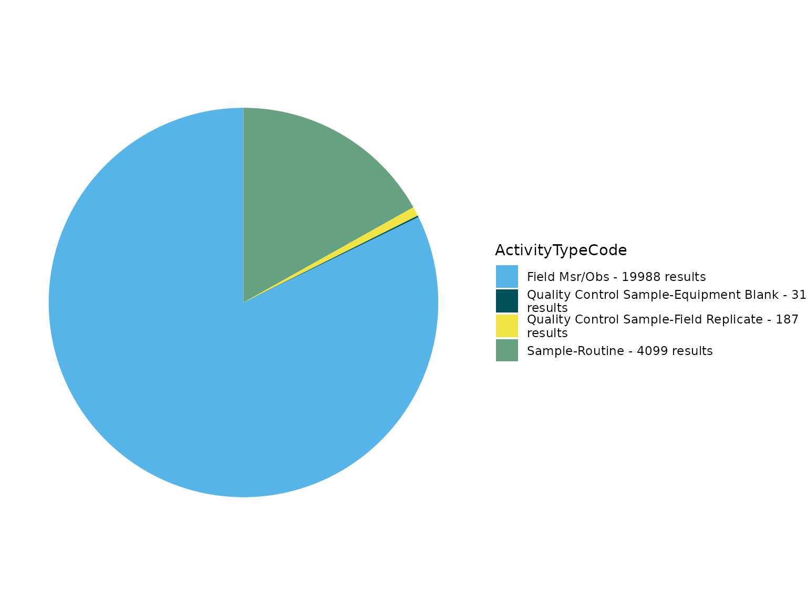
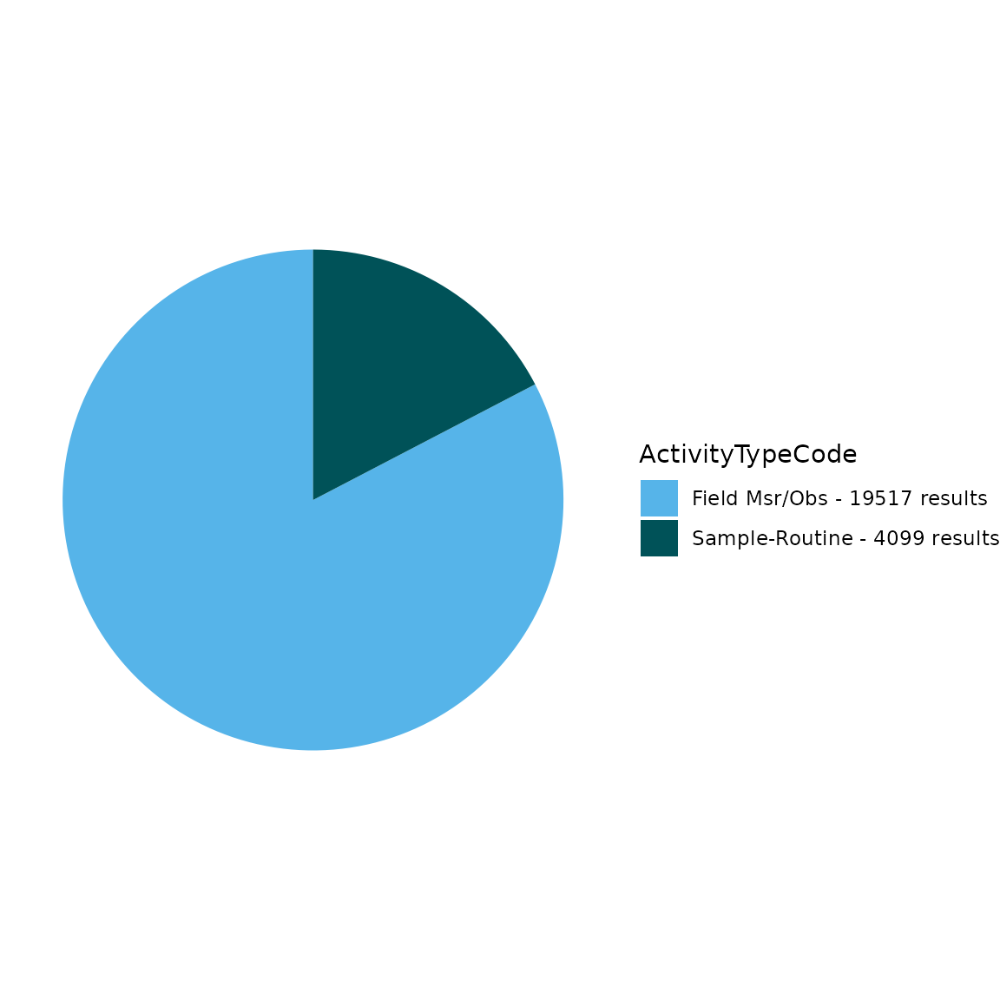
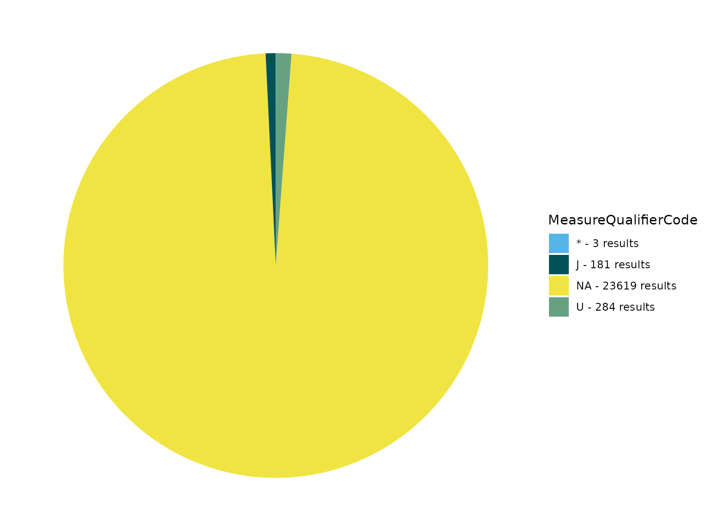
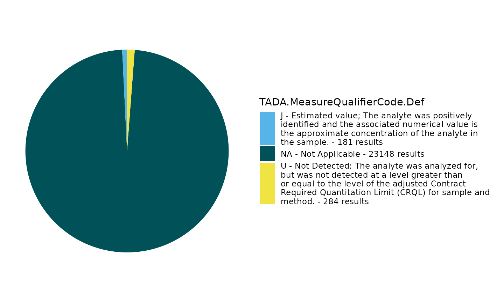
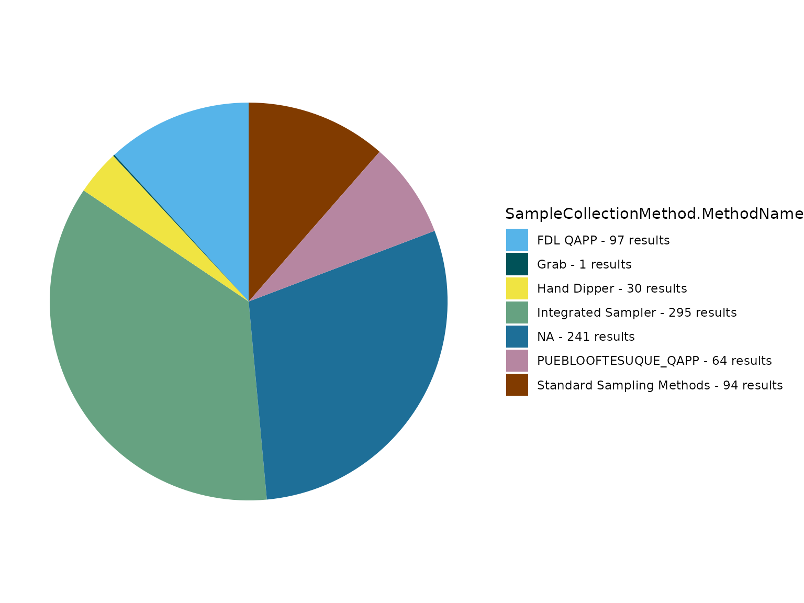

# TADA Module 1: Water Quality Portal Data Discovery and Cleaning

## Overview

This vignette walks through how to use the TADA R Package to discover
and clean (i.e., wrangle, Quality Assure and Quality Control (QAQC), and
harmonize) [Water Quality Portal
(WQP)](https://www.waterqualitydata.us/) data from multiple
organizations.

## Install and load packages

First, install and load the remotes package specifying the repo. This is
needed before installing EPATADA because it is only available on GitHub
(not CRAN).

``` r
install.packages("remotes",
  repos = "http://cran.us.r-project.org"
)
library(remotes)
```

Next, install and load EPATADA using the remotes package. USGS’s
dataRetrieval and other TADA R Package dependencies will also be
downloaded automatically from CRAN with the TADA install. If desired,
the development version of dataRetrieval can be downloaded directly from
GitHub (un-comment).

``` r
remotes::install_github("USEPA/EPATADA",
  ref = "develop",
  dependencies = TRUE
)
# remotes::install_github("USGS-R/dataRetrieval", dependencies=TRUE)
```

Finally, use the **library()** function to load the TADA R Package into
your R session.

``` r
library(EPATADA)
```

## TADA_DataRetrieval

WQP data is retrieved and processed for compatibility with TADA. This
function, **TADA_DataRetrieval**, builds on USGS’s dataRetrieval R
package functions. It joins three WQP profiles: Site, Sample Results
(physical/chemical metadata), and Project. In addition, it changes all
data in the Characteristic, Speciation, Fraction, and Unit fields to
uppercase and addresses result values that include special characters.

This function accepts the same inputs as the dataRetrieval `readWQPdata`
function. `readWQPdata` does not restrict the characteristics pulled
from [Water Quality Portal (WQP)](https://www.waterqualitydata.us/).

Data retrieval filters include:

- startDate

- endDate

- characteristicName

- sampleMedia

- siteType

- statecode (see list of possible state and territory abbreviations
  [here](https://www2.census.gov/geo/docs/reference/state.txt))

- countycode

- siteid

- organization

- project

- huc

- characteristicType

- providers

In addition to these filters, TADA_DataRetrieval accepts additional
geospatial-related filters that are not included in the dataRetrieval
`readWQPdata` function:

- aoi_sf

- tribal_area_type

- tribe_name_parcel (Note: The TADA_TribalOptions function can be used
  to narrow down options for use with this tribe_name_parcel filter
  option. See ?TADA_TribalOptions for more info).

After data is downloaded using the filters above, the default
TADA_DataRetrieval function also automatically runs the
**TADA_AutoClean** function. If desired, users can set applyautoclean =
FALSE in their TADA_DataRetrieval calls. In this example, we will set
**applyautoclean** **= FALSE** and run it as a separate step in the
workflow.

Tips:

1.  All the query filters for the WQP work as an AND but within the
    fields there are ORs. For example:

    - Characteristics: If you choose pH & DO - it’s an OR. This means
      you will retrieve both pH OR DO data if available.

    - States: Similarly, if you choose VA and IL, it’s an OR. This means
      you will retrieve both VA OR IL data if available.

    - Combinations of fields are ANDs, such as State/VA AND
      Characteristic/DO”. This means you will receive all DO data
      available in VA.

    - “Characteristic” and “Characteristic Type” also work as an AND.
      This means that the Characteristic must fall within the
      CharacteristicGroup if both filters are being used, if not you
      will get an error.

2.  The “siteid” is a general term WQP uses to describe both Site IDs
    from USGS databases and Monitoring Location Identifiers (from WQX).
    Each monitoring location in the Water Quality Portal (WQP) has a
    unique Monitoring Location Identifier, regardless of the database
    from which it derives. The Monitoring Location Identifier from the
    WQP is the concatenated Organization Identifier plus the Site ID
    number. Site IDs that only include a number are only unique
    identifiers for monitoring locations within USGS NWIS or EPA’s WQX
    databases separately.

3.  The aoi_sf and tribal arguments are meant to be used on their own.
    For example, if both an aoi_sf argument and tribal information are
    provided an error is returned because it’s unclear what the priority
    location should be for the query. Similarly, aoi_sf and
    tribal_area_type are not meant to be used with location-related
    filters (e.g., statecode, siteid). In these instances a warning is
    returned but the query proceeds by using only the aoi_sf or
    tribal_area_type information.

Additional resources:

- Review function documentation by entering the following code into the
  console: ?TADA_DataRetrieval

- [Introduction to the dataRetrieval
  package](https://doi-usgs.github.io/dataRetrieval/)

- [Water Quality Portal Web Services
  Guide](https://www.waterqualitydata.us/webservices_documentation/)

- [dataRetrieval
  Tutorial](https://waterdata.usgs.gov/blog/dataretrieval/)

Use the code below to download data from the WQP using
TADA_DataRetrieval. Edit the code chunk below to define your own WQP
query inputs.

Downloads using TADA_DataRetrieval will have the same columns each time,
but be aware that data are uploaded to the Water Quality Portal by
individual organizations, which may or may not follow the same
conventions. Data and metadata quality are not guaranteed! Carefully
explore data to make sure it meets your quality assurance requirements.

Note: TADA_DataRetrieval (by leveraging dataRetrieval), automatically
converts the date times to UTC. It also automatically converts field
formats to dates, datetimes, and numerics based on a standard algorithm.

Enter ?TADA_DataRetrieval into the console to review example queries and
additional information.

This example includes monitoring data collected from Jan 2018 to Jan
2019 by six organizations: 1) Red Lake Band of Chippewa Indians, 2) Sac
& Fox Nation, 3) Pueblo of Pojoaque, 4) Minnesota Chippewa Tribe (Fond
du Lac Band), 5) Pueblo of Tesuque, and 6) The Chickasaw Nation.

``` r
TADAProfile <- TADA_DataRetrieval(organization = c("REDLAKE_WQX", "SFNOES_WQX", "PUEBLO_POJOAQUE", "FONDULAC_WQX", "PUEBLOOFTESUQUE", "CNENVSER"), startDate = "2018-01-01", endDate = "2019-01-01", applyautoclean = FALSE, ask = FALSE)
```

    ## [1] "Downloading WQP query results. This may take some time depending upon the query size."
    ## $startDate
    ## [1] "2018-01-01"
    ## 
    ## $organization
    ## [1] "REDLAKE_WQX"     "SFNOES_WQX"      "PUEBLO_POJOAQUE" "FONDULAC_WQX"   
    ## [5] "PUEBLOOFTESUQUE" "CNENVSER"       
    ## 
    ## $endDate
    ## [1] "2019-01-01"

We will move forward with this example in the remainder of the vignette.

We will first use a subset of this example to demonstrate using new
TADA_DataRetrieval options that allow for **spatial** or
**tribe-specific** queries:

Focusing just on the “PUEBLO_POJOAQUE” organization, rerun the example
above:

``` r
TADAProfile_single <- TADA_DataRetrieval(
  organization = "PUEBLO_POJOAQUE",
  startDate = "2018-01-01",
  endDate = "2019-01-01",
  applyautoclean = FALSE,
  ask = FALSE
)
```

    ## [1] "Downloading WQP query results. This may take some time depending upon the query size."
    ## $startDate
    ## [1] "2018-01-01"
    ## 
    ## $organization
    ## [1] "PUEBLO_POJOAQUE"
    ## 
    ## $endDate
    ## [1] "2019-01-01"

The same results can now be obtained using a combination of the
tribal_area_type and tribe_name_parcel arguments. Both must be used
together. The tribal_area_type argument indicates which one of [four
layer
datasets](https://geopub.epa.gov/arcgis/rest/services/EMEF/Tribal/MapServer)
(“Alaska Native Allotments”, “American Indian Reservations”,
“Off-reservation Trust Lands”, or “Oklahoma Tribal Statistical Areas”)
of tribal land data to query within. Note that “Alaska Native Villages”
and “Virginia Federally Recognized Tribes” layers will not return a
successful query. These four tribal_area_type layer options include
multiple tribes. Therefore, tribe_name_parcel is where users can enter
the specific name of the tribal land of interest as listed in the layer.
In this example for Pueblo of Pojoaque, running
TADA_TribalOptions(“American Indian Reservations”) could be used here to
determine the correct spelling for this argument, “Pueblo of Pojoaque,
New Mexico”, as listed in the TRIBE_NAME column.

``` r
# Review TRIBE_NAME column to get name format for the TADA_DataRetrieval tribe_name_parcel function input
TRIBE_NAME <- TADA_TribalOptions("American Indian Reservations")

TADAProfile_tribal <- TADA_DataRetrieval(
  tribal_area_type = "American Indian Reservations",
  tribe_name_parcel = "Pueblo of Pojoaque, New Mexico",
  startDate = "2018-01-01",
  endDate = "2019-01-01",
  applyautoclean = FALSE,
  ask = FALSE
)

# They are equivalent:
all.equal(data.frame(TADAProfile_single), data.frame(TADAProfile_tribal))
```

Additionally, the aoi_sf argument can be used to provide an sf spatial
object as a query filter. We can match the output of the two short
Pueblo of Pojoaque examples above, using tigris::native_areas to acquire
Census Bureau spatial data:

``` r
TADAProfile_spatial <- TADA_DataRetrieval(
  aoi_sf = tigris::native_areas() |> dplyr::filter(NAMELSAD == "Pueblo of Pojoaque"),
  startDate = "2018-01-01",
  endDate = "2019-01-01",
  applyautoclean = FALSE,
  ask = FALSE
)

all.equal(data.frame(TADAProfile_single), data.frame(TADAProfile_spatial))
```

**Note**: In this example the output data is identical from these three
input methods. However, in some instances this may not be the case. This
is because the tribal_area_type method is based on spatial data and so
spatial boundaries must be taken into account when comparing query
results. The same applies when using aoi_sf results.

Let’s repeat this process for Red Lake Band of Chippewa Indians. In this
case, we will get additional observations from other organizations who
are sampling with the tribal boundary. This is one great benefit of this
query option! There is additional data available that may be useful but
is missed if only the organization query filter is used.

``` r
TADAProfile_single_2 <- TADA_DataRetrieval(
  organization = "REDLAKE_WQX",
  startDate = "2018-01-01",
  endDate = "2019-01-01",
  applyautoclean = FALSE,
  ask = FALSE
)

TADAProfile_tribal_2 <- TADA_DataRetrieval(
  tribal_area_type = "American Indian Reservations",
  tribe_name_parcel = "Red Lake Band of Chippewa Indians, Minnesota",
  startDate = "2018-01-01",
  endDate = "2019-01-01",
  applyautoclean = FALSE,
  ask = FALSE
)

# Review unique organizations
unique(TADAProfile_single_2$OrganizationFormalName)
unique(TADAProfile_tribal_2$OrganizationFormalName)
```

## USGS dataRetrieval

Uncomment below (optional) if you would like to review differences
between the profiles you would get using USGS’s readWQPdata vs. EPA’s
TADA_DataRetrieval (compare dataRetrieval_example to TADAProfile). The
profiles are different because TADA_DataRetrieval automatically joins in
data from multiple WQP profiles, and does some additional data cleaning
as part of the data retrieval process.

``` r
# dataRetrieval_example <- dataRetrieval::readWQPdata(organization = c("REDLAKE_WQX", "SFNOES_WQX", "PUEBLO_POJOAQUE", "FONDULAC_WQX", "PUEBLOOFTESUQUE", "CNENVSER"), startDate = "2018-01-01", endDate = "2019-01-01", ignore_attributes = TRUE)
```

## Big Data Queries

If you need to download a large amount of data from across a large area,
the TADA_DataRetrieval function now handles this automatically. Whereas
in the past there was a second function (TADA_BigDataRetrieval) to do
this, the standard TADA_DataRetrieval function now checks the number of
results in each query and uses similar methods as TADA_BigDataRetrieval
when necessary.

The function does multiple synchronous data calls to the WQP
(waterqualitydata.us). It uses the WQP summary service to limit the
sites downloaded to only those with relevant data. It pulls back data
from set number of stations at a time and then joins the data back
together to produce a single TADA compatible dataframe as the output.

Users can leverage the new **maxrecs** function input for
TADA_DataRetrieval to specify the maximum number of records to query at
once (i.e., without breaking into smaller queries). The default is
250000 records.

TADA_DataRetrieval now also prompts the user (when ask = TRUE) to
confirm that they want to download the dataset. As part of this prompt
the expected number of rows of data are provided to help in making the
decision. As the downloads occur, a progress bar is shown as well.

See ?TADA_DataRetrieval for more details. WARNING, some of the examples
below can take multiple HOURS to run. The total run time depends on your
query inputs.

``` r
# AK_AL_WaterTemp <- TADA_DataRetrieval(startDate = "2000-01-01", endDate = "2022-12-31", characteristicName = "Temperature, water", statecode = c("AK","AL"))
#
# AllWaterTemp <- TADA_DataRetrieval(characteristicName = "Temperature, water")
#
# AllPhosphorus <- TADA_DataRetrieval(characteristicName = "Phosphorus")
#
# AllCT <- TADA_DataRetrieval(statecode = "CT")
```

## Filter data based on media type

Some TADA users are interested in using WQP data for surface water only
or for analysis of some non-water data. The **TADA_MediaFilter**
function can assist in identifying results of interest. Multiple columns
are used to identify groundwater results as different organizations may
populate different combinations of fields in order to identify a result
as groundwater.

This function identifies surface water, groundwater, and sediment
results. Users can specify whether all results should be returned with a
new column, *TADA.Media.Flag*, identifying if the result should be
included in further analysis or if only results that should be in
included are returned.

The defaults are to include surface water, exclude groundwater and
sediment, and to return only the results that should be used for
analysis (clean = TRUE). This is shown in the active example below. If
you would like to see all results with the *TADA.Media.Flag* column, you
can uncomment the example where clean = FALSE.

If you are not interested in using **TADA_MediaFilter**, but would like
to filter by activity media, uncomment the example to filter for water
data only by using dplyr::filter() with TADA.ActivityMediaName.

``` r
# Filter to retain only results for use in analysis
TADAProfile <- TADA_MediaFilter(TADAProfile,
  clean = TRUE,
  surface_water = FALSE,
  ground_water = TRUE,
  sediment = TRUE,
  other = TRUE
)

# Add TADA.Media.Flag column to identify which results should be used for analysis
# TADAProfile <- TADA_MediaFilter(TADAProfile, clean = FALSE)

# Remove data for non-water media types, alternate workflow without using TADA_MediaFilter()
# TADAProfile <- dplyr::filter(TADAProfile, TADA.ActivityMediaName == "WATER")
```

## TADA_AutoClean

Now **TADA_AutoClean** can be run on a smaller dataset after unnecessary
results have been removed. It performs the following functions on the
data retrieved from the WQP:

- **TADA_ConvertSpecialChars** - converts result value columns to
  numeric and flags non-numeric values that could not be converted.

- **TADA_ConvertResultUnits** - unifies result units for easier quality
  control and review

- **TADA_ConvertDepthUnits** - converts depth units to a consistent unit
  (meters).

- **TADA_IDCensoredData** - categorizes detection limit data and
  identifies mismatches in result detection condition and result
  detection limit type.

- Other helpful actions - converts important text columns to all
  upper-case letters, removes exact duplicates, and uses WQX format
  rules to harmonize specific NWIS metadata conventions (e.g. move
  characteristic speciation from the TADA.ResultMeasure.MeasureUnitCode
  column to the TADA.MethodSpeciationName column)

As a general rule, TADA functions do not change any contents in the
WQP-served columns. Instead, they add new columns with the prefix
“TADA.” The following columns are numeric versions of their WQP origins:

    -   TADA.ResultMeasureValue

    -   TADA.DetectionQuantitationLimitMeasure.MeasureValue

    -   TADA.LatitudeMeasure

    -   TADA.LongitudeMeasure

These functions also add the columns
TADA.ResultMeasureValueDataTypes.Flag and
TADA.DetectionQuantitationLimitMeasure.MeasureValueDataTypes.Flag, which
provide information about the result values that is needed to address
censored data later on (i.e., nondetections). Specifically, these new
columns flag if special characters are included in result values, and
specifies what the special characters are.

``` r
# run TADA_AutoClean on filtered dataset to convert special characters, result units, and depth units and identify censored data.

TADAProfile <- TADA_AutoClean(TADAProfile)
```

    ## [1] "TADA_Autoclean: creating TADA-specific columns."
    ## [1] "TADA_Autoclean: harmonizing dissolved oxygen characterisic name to DISSOLVED OXYGEN SATURATION if unit is % or % SATURATN."
    ## [1] "TADA_Autoclean: handling special characters and coverting TADA.ResultMeasureValue and TADA.DetectionQuantitationLimitMeasure.MeasureValue value fields to numeric."
    ## [1] "TADA_Autoclean: converting TADA.LatitudeMeasure and TADA.LongitudeMeasure fields to numeric."
    ## [1] "TADA_Autoclean: harmonizing synonymous unit names (m and meters) to m."
    ## [1] "TADA_Autoclean: updating deprecated (i.e. retired) characteristic names."

    ## [1] "TADA_Autoclean: harmonizing result and depth units."
    ## [1] "TADA_Autoclean: creating TADA.ComparableDataIdentifier field for use when generating visualizations and analyses."
    ## [1] "NOTE: This version of the TADA package is designed to work with numeric data with media name: 'WATER'. TADA_AutoClean does not currently remove (filter) data with non-water media types. If desired, the user must make this specification on their own outside of package functions. Example: dplyr::filter(.data, TADA.ActivityMediaName == 'WATER')"

Review all column names in the TADA Profile to familiarize yourself with
the dataset after TADA_AutoClean has added additional TADA prefixed
columns. **TADA_SummarizeColumn** summarizes the data set based on the
user specified column and returns a dataframe displaying the number of
sites and number of records for each unique value in the specified
column. The example below uses TADA.CharacteristicName.

``` r
# View column names for TADAProfile
colnames(TADAProfile)
```

    ##   [1] "ResultIdentifier"                                                 
    ##   [2] "ActivityTypeCode"                                                 
    ##   [3] "ActivityMediaName"                                                
    ##   [4] "TADA.ActivityMediaName"                                           
    ##   [5] "ActivityMediaSubdivisionName"                                     
    ##   [6] "CountryCode"                                                      
    ##   [7] "StateCode"                                                        
    ##   [8] "CountyCode"                                                       
    ##   [9] "MonitoringLocationName"                                           
    ##  [10] "TADA.MonitoringLocationName"                                      
    ##  [11] "MonitoringLocationTypeName"                                       
    ##  [12] "TADA.MonitoringLocationTypeName"                                  
    ##  [13] "MonitoringLocationDescriptionText"                                
    ##  [14] "LatitudeMeasure"                                                  
    ##  [15] "TADA.LatitudeMeasure"                                             
    ##  [16] "LongitudeMeasure"                                                 
    ##  [17] "TADA.LongitudeMeasure"                                            
    ##  [18] "HorizontalCoordinateReferenceSystemDatumName"                     
    ##  [19] "HUCEightDigitCode"                                                
    ##  [20] "MonitoringLocationIdentifier"                                     
    ##  [21] "TADA.MonitoringLocationIdentifier"                                
    ##  [22] "ResultSampleFractionText"                                         
    ##  [23] "TADA.ResultSampleFractionText"                                    
    ##  [24] "CharacteristicName"                                               
    ##  [25] "TADA.CharacteristicName"                                          
    ##  [26] "SubjectTaxonomicName"                                             
    ##  [27] "SampleTissueAnatomyName"                                          
    ##  [28] "MethodSpeciationName"                                             
    ##  [29] "TADA.MethodSpeciationName"                                        
    ##  [30] "TADA.ComparableDataIdentifier"                                    
    ##  [31] "ActivityStartDate"                                                
    ##  [32] "ActivityStartTime.Time"                                           
    ##  [33] "ActivityStartTime.TimeZoneCode"                                   
    ##  [34] "ActivityStartDateTime"                                            
    ##  [35] "ResultMeasureValue"                                               
    ##  [36] "ResultMeasure.MeasureUnitCode"                                    
    ##  [37] "TADA.ResultMeasureValue"                                          
    ##  [38] "TADA.ResultMeasure.MeasureUnitCode"                               
    ##  [39] "TADA.WQXResultUnitConversion"                                     
    ##  [40] "ResultValueTypeName"                                              
    ##  [41] "TADA.ResultMeasureValueDataTypes.Flag"                            
    ##  [42] "ResultDetectionConditionText"                                     
    ##  [43] "DetectionQuantitationLimitTypeName"                               
    ##  [44] "DetectionQuantitationLimitMeasure.MeasureValue"                   
    ##  [45] "DetectionQuantitationLimitMeasure.MeasureUnitCode"                
    ##  [46] "TADA.DetectionQuantitationLimitMeasure.MeasureValue"              
    ##  [47] "TADA.DetectionQuantitationLimitMeasure.MeasureUnitCode"           
    ##  [48] "TADA.DetectionQuantitationLimitMeasure.MeasureValueDataTypes.Flag"
    ##  [49] "ResultDepthHeightMeasure.MeasureValue"                            
    ##  [50] "TADA.ResultDepthHeightMeasure.MeasureValue"                       
    ##  [51] "TADA.ResultDepthHeightMeasure.MeasureValueDataTypes.Flag"         
    ##  [52] "ResultDepthHeightMeasure.MeasureUnitCode"                         
    ##  [53] "TADA.ResultDepthHeightMeasure.MeasureUnitCode"                    
    ##  [54] "ResultDepthAltitudeReferencePointText"                            
    ##  [55] "ActivityRelativeDepthName"                                        
    ##  [56] "ActivityDepthHeightMeasure.MeasureValue"                          
    ##  [57] "TADA.ActivityDepthHeightMeasure.MeasureValue"                     
    ##  [58] "TADA.ActivityDepthHeightMeasure.MeasureValueDataTypes.Flag"       
    ##  [59] "ActivityDepthHeightMeasure.MeasureUnitCode"                       
    ##  [60] "TADA.ActivityDepthHeightMeasure.MeasureUnitCode"                  
    ##  [61] "ActivityTopDepthHeightMeasure.MeasureValue"                       
    ##  [62] "TADA.ActivityTopDepthHeightMeasure.MeasureValue"                  
    ##  [63] "TADA.ActivityTopDepthHeightMeasure.MeasureValueDataTypes.Flag"    
    ##  [64] "ActivityTopDepthHeightMeasure.MeasureUnitCode"                    
    ##  [65] "TADA.ActivityTopDepthHeightMeasure.MeasureUnitCode"               
    ##  [66] "ActivityBottomDepthHeightMeasure.MeasureValue"                    
    ##  [67] "TADA.ActivityBottomDepthHeightMeasure.MeasureValue"               
    ##  [68] "TADA.ActivityBottomDepthHeightMeasure.MeasureValueDataTypes.Flag" 
    ##  [69] "ActivityBottomDepthHeightMeasure.MeasureUnitCode"                 
    ##  [70] "TADA.ActivityBottomDepthHeightMeasure.MeasureUnitCode"            
    ##  [71] "ResultTimeBasisText"                                              
    ##  [72] "StatisticalBaseCode"                                              
    ##  [73] "ResultFileUrl"                                                    
    ##  [74] "ResultAnalyticalMethod.MethodName"                                
    ##  [75] "ResultAnalyticalMethod.MethodDescriptionText"                     
    ##  [76] "ResultAnalyticalMethod.MethodIdentifier"                          
    ##  [77] "ResultAnalyticalMethod.MethodIdentifierContext"                   
    ##  [78] "ResultAnalyticalMethod.MethodUrl"                                 
    ##  [79] "SampleCollectionMethod.MethodIdentifier"                          
    ##  [80] "SampleCollectionMethod.MethodIdentifierContext"                   
    ##  [81] "SampleCollectionMethod.MethodName"                                
    ##  [82] "SampleCollectionMethod.MethodDescriptionText"                     
    ##  [83] "SampleCollectionEquipmentName"                                    
    ##  [84] "MeasureQualifierCode"                                             
    ##  [85] "ResultStatusIdentifier"                                           
    ##  [86] "ResultCommentText"                                                
    ##  [87] "ActivityCommentText"                                              
    ##  [88] "HydrologicCondition"                                              
    ##  [89] "HydrologicEvent"                                                  
    ##  [90] "DataQuality.PrecisionValue"                                       
    ##  [91] "DataQuality.BiasValue"                                            
    ##  [92] "DataQuality.ConfidenceIntervalValue"                              
    ##  [93] "DataQuality.UpperConfidenceLimitValue"                            
    ##  [94] "DataQuality.LowerConfidenceLimitValue"                            
    ##  [95] "SamplingDesignTypeCode"                                           
    ##  [96] "LaboratoryName"                                                   
    ##  [97] "ResultLaboratoryCommentText"                                      
    ##  [98] "ActivityIdentifier"                                               
    ##  [99] "OrganizationIdentifier"                                           
    ## [100] "OrganizationFormalName"                                           
    ## [101] "ProjectName"                                                      
    ## [102] "ProjectDescriptionText"                                           
    ## [103] "ProjectIdentifier"                                                
    ## [104] "ProjectFileUrl"                                                   
    ## [105] "QAPPApprovedIndicator"                                            
    ## [106] "QAPPApprovalAgencyName"                                           
    ## [107] "AquiferName"                                                      
    ## [108] "AquiferTypeName"                                                  
    ## [109] "LocalAqfrName"                                                    
    ## [110] "ConstructionDateText"                                             
    ## [111] "WellDepthMeasure.MeasureValue"                                    
    ## [112] "WellDepthMeasure.MeasureUnitCode"                                 
    ## [113] "WellHoleDepthMeasure.MeasureValue"                                
    ## [114] "WellHoleDepthMeasure.MeasureUnitCode"                             
    ## [115] "ActivityDepthAltitudeReferencePointText"                          
    ## [116] "ActivityEndDate"                                                  
    ## [117] "ActivityEndTime.Time"                                             
    ## [118] "ActivityEndTime.TimeZoneCode"                                     
    ## [119] "ActivityEndDateTime"                                              
    ## [120] "ActivityConductingOrganizationText"                               
    ## [121] "SampleAquifer"                                                    
    ## [122] "ActivityLocation.LatitudeMeasure"                                 
    ## [123] "ActivityLocation.LongitudeMeasure"                                
    ## [124] "ResultWeightBasisText"                                            
    ## [125] "ResultTemperatureBasisText"                                       
    ## [126] "ResultParticleSizeBasisText"                                      
    ## [127] "USGSPCode"                                                        
    ## [128] "BinaryObjectFileName"                                             
    ## [129] "BinaryObjectFileTypeCode"                                         
    ## [130] "AnalysisStartDate"                                                
    ## [131] "ResultDetectionQuantitationLimitUrl"                              
    ## [132] "LabSamplePreparationUrl"                                          
    ## [133] "ActivityStartTime.TimeZoneCode_offset"                            
    ## [134] "ActivityEndTime.TimeZoneCode_offset"                              
    ## [135] "SourceMapScaleNumeric"                                            
    ## [136] "HorizontalAccuracyMeasure.MeasureValue"                           
    ## [137] "HorizontalAccuracyMeasure.MeasureUnitCode"                        
    ## [138] "HorizontalCollectionMethodName"                                   
    ## [139] "VerticalMeasure.MeasureValue"                                     
    ## [140] "VerticalMeasure.MeasureUnitCode"                                  
    ## [141] "VerticalAccuracyMeasure.MeasureValue"                             
    ## [142] "VerticalAccuracyMeasure.MeasureUnitCode"                          
    ## [143] "VerticalCollectionMethodName"                                     
    ## [144] "VerticalCoordinateReferenceSystemDatumName"                       
    ## [145] "FormationTypeText"                                                
    ## [146] "ProjectMonitoringLocationWeightingUrl"                            
    ## [147] "DrainageAreaMeasure.MeasureValue"                                 
    ## [148] "DrainageAreaMeasure.MeasureUnitCode"                              
    ## [149] "ContributingDrainageAreaMeasure.MeasureValue"                     
    ## [150] "ContributingDrainageAreaMeasure.MeasureUnitCode"                  
    ## [151] "ProviderName"                                                     
    ## [152] "LastUpdated"

``` r
# Review the number of sites and number of records for each CharacteristicName in TADAProfile
TADAProfile_CharSummary <- TADA_SummarizeColumn(TADAProfile, "TADA.CharacteristicName")

# View TADAProfile_CharSummary
TADAProfile_CharSummary
```

    ## # A tibble: 104 × 3
    ##    TADA.CharacteristicName       n_sites n_records
    ##    <chr>                           <int>     <int>
    ##  1 .ALPHA.-ENDOSULFAN                  6         7
    ##  2 .ALPHA.-HEXACHLOROCYCLOHEXANE       6         7
    ##  3 .BETA.-ENDOSULFAN                   6         7
    ##  4 .BETA.-HEXACHLOROCYCLOHEXANE        6         7
    ##  5 .DELTA.-HEXACHLOROCYCLOHEXANE       6         7
    ##  6 ALDRIN                              6         7
    ##  7 ALKALINITY, TOTAL                 128       692
    ##  8 ALPHA PARTICLE                      6        14
    ##  9 ALUMINUM                            6         7
    ## 10 AMMONIA-NITROGEN                   83       328
    ## # ℹ 94 more rows

## Invalid coordinates

Review station locations and summary information using the
**TADA_OverviewMap** function. **TADA_OverviewMap** counts the number of
unique results, characteristics, and organizations at each monitoring
location in the dataset and creates a tidy map for reviewing summary
stats spatially. Larger point sizes indicate more results collected at a
given site, while darker blue colors indicate more unique
characteristics collected at the site. Users may click on a site to view
a pop-up with this summary information, including the number of
organizations that reported results at that site. This map may inform a
user’s decision to remove/correct sites that are outside the US.

``` r
TADA_OverviewMap(TADAProfile)
```

The **TADA_FlagCoordinates** function identifies and flags potentially
invalid coordinate data. While its functionality is showcased here, it
is always important to review any invalid outputs before cleaning to
reduce the risk of leaving out usable data/sites.

Allowable values for clean_outsideUSA are “no”, “remove”, or “change
sign”. The default is “no” which flags latitude and longitude
coordinates outside the USA. Assigning clean_outsideUSA = “remove” will
remove rows of data with coordinates outside the USA. And assigning
clean_outsideUSA = “change sign” will flip the sign of latitude or
longitude coordinates flagged as outside the USA. The “change sign”
option should only be used when it is known that coordinates were
entered with the wrong sign in WQX; additionally, the data owner should
fix these incorrect coordinates in the raw data through the WQX - for
assistance email the WQX help desk: WQX@epa.gov

Allowable values for clean_imprecise are TRUE or FALSE. The default is
FALSE which flags rows of data with invalid or imprecise coordinates
without removing them. Assigning clean_imprecise = TRUE will remove rows
of data with invalid or imprecise coordinates.

Allowable values for flaggedonly are TRUE or FALSE. The default is FALSE
which keeps all rows of data regardless of flag status. Assigning
flaggedonly = TRUE filters the dataframe to show only rows of data which
are flagged.

When clean_outsideUSA = “no” and/or clean_imprecise = FALSE, a column
will be appended titled “TADA.InvalidCoordinates.Flag” with the
following flags (if relevant to dataframe):

- If the latitude is less than zero, the row will be flagged with
  “LAT_OutsideUSA”. (Exception for American Samoa)

- If the longitude is greater than zero AND less than 145, the row will
  be flagged as “LONG_OutsideUSA”. (Exceptions for Guam and the Northern
  Mariana Islands)

- If the latitude or longitude contains the string, “999”, the row will
  be flagged as invalid.

- Finally, precision can be measured by the number of decimal places in
  the latitude and longitude provided. If either does not have any
  numbers to the right of the decimal point, the row will be flagged as
  “Imprecise”.

``` r
# flag only
TADAProfileClean1 <- TADA_FlagCoordinates(TADAProfile, clean_outsideUSA = "no", clean_imprecise = FALSE, flaggedonly = FALSE)

# review unique flags in TADAProfileClean1
unique(TADAProfileClean1$TADA.SuspectCoordinates.Flag)

# review unique MonitoringLocationIdentifiers in your flag dataframe
unique(TADAProfileClean1$MonitoringLocationIdentifier)

Unique_SuspectCoordinateFlags <- TADAProfileClean1 |>
  dplyr::select(
    "MonitoringLocationIdentifier",
    "MonitoringLocationName",
    "TADA.SuspectCoordinates.Flag",
    "OrganizationIdentifier",
    "TADA.LongitudeMeasure",
    "TADA.LatitudeMeasure",
    "MonitoringLocationTypeName",
    "CountryCode",
    "StateCode",
    "CountyCode",
    "HUCEightDigitCode",
    "MonitoringLocationDescriptionText",
    "ProjectName",
    "ProjectIdentifier",
    "OrganizationFormalName"
  ) |>
  dplyr::distinct()

Unique_SuspectCoordinateFlags

# if needed, un-comment below to change the sign for all data for sites flagged as outside the USA. You can also set clean_imprecise = TRUE if you want to remove sites with imprecise lat/longs. Enter ?TADA_FlagCoordinates into the console for more details.

# TADAProfileClean1 <- TADA_FlagCoordinates(TADAProfile, clean_outsideUSA = "change sign", clean_imprecise = TRUE, flaggedonly = FALSE)
```

## Depth unit conversions

The **TADA_ConvertDepthUnits** function converts depth units to a
consistent unit. Depth values and units are most commonly associated
with lake data, and are populated in the *ActivityDepthHeightMeasure*,
*ActivityTopDepthHeightMeasure*, *ActivityBottomDepthHeightMeasure*, and
*ResultDepthHeightMeasure* Result Value/Unit columns.

Allowable values for ‘unit’ are either ‘m’ (meter), ‘ft’ (feet), or ‘in’
(inch). ‘unit’ accepts only one allowable value as an input. Default is
unit = “m”.

Note that upon download using **TADA_DataRetrieval**, all depth columns
are converted to meters by default. However, the user may choose to run
the **TADA_ConvertDepthUnits** function on their dataset to convert to
another unit. See function documentation for additional input options by
entering the following code in the console: ?TADA_ConvertDepthUnits

``` r
# converts all depth profile data to meters
TADAProfileClean1 <- TADA_ConvertDepthUnits(TADAProfileClean1,
  unit = "ft",
  transform = TRUE
)
```

## Continuous (time series) data

Continuous data may (or may not) be suitable for integration with
discrete water quality data for analyses. Therefore, the
**TADA_FlagContinuousData** function was developed to flag rows with
continuous data.

See function documentation for additional details by entering the
following code in the console: ?TADA_FlagContinuousData

``` r
TADAProfileClean1 <- TADA_FlagContinuousData(TADAProfileClean1,
  clean = FALSE,
  flaggedonly = FALSE,
  time_difference = 4
)

# uncomment below to create a dataframe of only the continuous data

# TADAProfile_onlycont <- TADA_FlagContinuousData(TADAProfileClean1, clean = FALSE, flaggedonly = TRUE, time_difference = 4)
```

## WQX Quality Assurance and Quality Control (QAQC) Service Result Flags

Run the following result functions to address suspect method, fraction,
speciation, and unit metadata by characteristic. The default is clean =
TRUE, which will remove suspect results. You can change this to clean =
FALSE to flag results, but not remove them.

See documentation for more details:

- ?**TADA_FlagMethod**

  - When clean = FALSE, this function adds the following column to your
    dataframe: TADA.AnalyticalMethod.Flag. This column flags invalid
    TADA.CharacteristicName, ResultAnalyticalMethod/MethodIdentifier,
    and ResultAnalyticalMethod/MethodIdentifierContext combinations in
    your dataframe either “NonStandardized”, “Suspect”, or “Pass”.

  - When clean = TRUE, “Suspect” rows are removed from the dataframe and
    no column will be appended.

  - When flaggedonly = TRUE, the dataframe is filtered to only the rows
    flagged as “Suspect”; default is flaggedonly = FALSE.

- ?**TADA_FlagSpeciation**

  - When clean = “none”, this function adds the following column to your
    dataframe: TADA.MethodSpeciation.Flag. This column flags each
    TADA.CharacteristicName and MethodSpeciationName combination in your
    dataframe as either “NonStandardized”,

    “Suspect”, or “Pass”.

  - When clean = “suspect_only”, only “Suspect” rows are removed from
    the dataframe. Default is clean = “suspect_only”.

  - When clean = “nonstandardized_only”, only “NonStandardized” rows are
    removed from the dataframe.

  - When clean = “both”, “Invalid” and “NonStandardized” rows are
    removed from the dataframe.

  - When clean = “none”, no rows are removed from the dataframe.

  - When flaggedonly = TRUE, the dataframe is filtered to only the rows
    flagged as “Suspect” or “NonStandardized”; default is flaggedonly =
    FALSE.

- ?**TADA_FlagResultUnit**

  - When clean = FALSE, the following column will be added to your
    dataframe: TADA.ResultUnit.Flag. This column flags each
    TADA.CharacteristicName, TADA.ActivityMediaName, and
    TADA.ResultMeasure.MeasureUnitCode combination in your dataframe as
    either “NonStandardized”, “Invalid”, or “Valid”.

  - When clean = TRUE, “Suspect” rows are removed from the dataframe and
    no column will be appended.

  - When flaggedonly = TRUE, the dataframe is filtered to only the rows
    flagged as “Suspect”; default is flaggedonly = FALSE.

- ?**TADA_FlagFraction**

  - When clean = FALSE, this function adds the following column to your
    dataframe: TADA.SampleFraction.Flag. This column flags each
    TADA.CharacteristicName and TADA.ResultSampleFractionText
    combination in your dataframe as either “NonStandardized”,
    “Suspect”, or “Pass”.
  - When clean = TRUE, “Suspect” rows are removed from the dataframe and
    no column will be appended.
  - When flaggedonly = TRUE, the dataframe is filtered to only the rows
    flagged as “Suspect”; default is flaggedonly = FALSE.

``` r
TADAProfileClean2 <- TADA_FlagMethod(TADAProfileClean1, clean = TRUE)

TADAProfileClean2 <- TADA_FlagFraction(TADAProfileClean2, clean = TRUE)

TADAProfileClean2 <- TADA_FlagSpeciation(TADAProfileClean2, clean = "suspect_only")

TADAProfileClean2 <- TADA_FlagResultUnit(TADAProfileClean2, clean = "suspect_only")
```

## WQX national upper and lower thresholds

Run the following code to flag or remove results that are above or below
the national upper and lower bound for each characteristic and unit
combination. See documentation for more details:

- ?**TADA_FlagAboveThreshold**

  - When clean = FALSE, the following column is added to your dataframe:
    TADA.ResultValueAboveUpperThreshold.Flag. This column flags rows
    with data that are above the upper WQX threshold. The default is
    clean = FALSE.

  - When clean = TRUE, data that is above the upper WQX threshold is
    removed from the dataframe.

  - When flaggedonly = TRUE, the dataframe is filtered to only the rows
    flagged as above the upper WQX threshold; default is flaggedonly =
    FALSE.

- ?**TADA_FlagBelowThreshold**

  - When clean = FALSE, the following column is added to your dataframe:
    TADA.ResultValueBelowLowerThreshold.Flag. This column flags rows
    with data that are below the lower WQX threshold. The default is
    clean = FALSE.

  - When clean = TRUE, data that is below the lower WQX threshold is
    removed from the dataframe.

  - When flaggedonly = TRUE, the dataframe is filtered to only the rows
    flagged as below the lower WQX threshold; default is flaggedonly =
    FALSE.

``` r
TADAProfileClean3 <- TADA_FlagAboveThreshold(TADAProfileClean2, clean = TRUE)

TADAProfileClean3 <- TADA_FlagBelowThreshold(TADAProfileClean3, clean = TRUE)
```

``` r
rm(TADAProfileClean1, TADAProfile_CharSummary)
```

## Potential duplicates

Sometimes multiple organizations submit the exact same data to Water
Quality Portal (WQP), which can affect water quality analyses and
assessments. Similarly, organizations occasionally submit the same data
multiple times to the Portal. The following functions check for and
identify data that may be duplicates based on date, time,
characteristic, result value, and a distance buffer. Each pair or group
of potential duplicate rows is flagged with a unique ID. For more
information, review the documentation by entering the following into the
console:

- ?**TADA_FindPotentialDuplicatesSingleOrg**

``` r
TADAProfileClean3 <- TADA_FindPotentialDuplicatesSingleOrg(TADAProfileClean3)
```

    ## [1] "TADA_FindPotentialDuplicatesSingleOrg: 148 groups of potentially duplicated results found in dataset. These have been placed into duplicate groups in the TADA.SingleOrgDupGroupID column and the function randomly selected one result from each group to represent a single, unduplicated value. Selected values are indicated in the TADA.SingleOrgDup.Flag as 'Unique', while duplicates are flagged as 'Duplicate' for easy filtering."

``` r
# filter to keep only unique rows using TADA.SingleOrgDup.Flag
TADAProfileClean3 <- dplyr::filter(
  TADAProfileClean3,
  TADA.SingleOrgDup.Flag == "Unique"
)
```

- ?**TADA_FindPotentialDuplicatesMultipleOrgs**

``` r
TADAProfileClean3 <- TADA_FindPotentialDuplicatesMultipleOrgs(
  TADAProfileClean3,
  dist_buffer = 100,
  org_hierarchy = "none"
)

# filter to keep only unique rows using TADA.ResultSelectedMultipleOrgs
TADAProfileClean3 <- dplyr::filter(
  TADAProfileClean3,
  TADA.ResultSelectedMultipleOrgs == "Y"
)
```

## Review QAPP information

The **TADA_FindQAPPApproval** function checks data for an approved QAPP.

This function checks to see if there is any information in the column
“QAPPApprovedIndicator”. Some organizations submit data for this field
to indicate if the data produced has an approved Quality Assurance
Project Plan (QAPP) or not. In this field, Y indicates yes, N indicates
no.

This function has three default inputs: clean = TRUE, cleanNA = FALSE,
and flaggedonly = FALSE. These defaults remove rows of data where the
QAPPApprovedIndicator equals “N”.

Users could alternatively remove both Ns and NAs using the inputs clean
= TRUE, cleanNA = TRUE, and flaggedonly = FALSE.

Additionally, users could filter to show only Ns and NAs by using the
inputs clean = FALSE, cleanNA = FALSE, and flaggedonly = TRUE.

If clean = FALSE, cleanNA = FALSE, and flaggedonly = FALSE, the function
will not do anything.

``` r
TADAProfileClean3 <- TADA_FindQAPPApproval(TADAProfileClean3, clean = FALSE, cleanNA = FALSE)
```

    ## [1] "Data is flagged but not removed because clean and cleanNA were FALSE"

The **TADA_FindQAPPDoc** function checks to see if a QAPP Doc is
Available

This function checks data submitted under the “ProjectFileUrl” column to
determine if a QAPP document is available to review. When clean = FALSE,
a column will be appended to flag results that do have an associated
QAPP document URL provided. When clean = TRUE, rows that do not have an
associated QAPP document are removed from the dataframe and no column
will be appended. When flaggedonly = TRUE, the dataframe is filtered to
show only rows that do not have an associated QAPP document. The
defaults are clean = FALSE and flaggedonly = FALSE. This function should
only be used to remove data if an accompanying QAPP document is required
to use data in assessments.

``` r
TADAProfileClean3 <- TADA_FindQAPPDoc(TADAProfileClean3,
  clean = FALSE
)
```

    ## [1] "No QAPP document url data found in your dataframe. Returning input dataframe with TADA.QAPPDocAvailable column for tracking."

## Full Dataframe Filtering

In this section a TADA user will want to review the unique values in
specific fields and may choose to remove data with particular values.

To start, review the list of common fields used for filtering, and the
number of unique values in each field using the **TADA_FieldCounts**
function.

This function returns counts for you entire dataframe for each of the
following fields (if populated, columns that are populated only with NAs
are not included in the output):

- *ActivityTypeCode*

- *TADA.ActivityMediaName*

- *ActivityMediaSubdivisionName*

- *ActivityCommentText*

- *MonitoringLocationTypeName*

- *StateCode*

- *OrganizationFormalName*

- *TADA.CharacteristicName*

- *HydrologicCondition*

- *HydrologicEvent*

- *BiologicalIntentName*

- *MeasureQualifierCode*

- *ActivityGroup*

- *AssemblageSampledName*

- *ProjectName*

- *CharacteristicNameUserSupplied*

- *DetectionQuantitationLimitTypeName*

- *SampleTissueAnatomyName*

- *LaboratoryName*

``` r
# multiple options

# print table to console
TADA_FieldCounts(TADAProfileClean3)
```

    ##                             Fields Count
    ## 1    TADA.ComparableDataIdentifier   122
    ## 2          TADA.CharacteristicName    99
    ## 3             SubjectTaxonomicName    13
    ## 4           OrganizationFormalName     6
    ## 5           TADA.ActivityType.Flag     3
    ## 6  TADA.MonitoringLocationTypeName     3
    ## 7        ActivityRelativeDepthName     3
    ## 8     ActivityMediaSubdivisionName     2
    ## 9           ResultStatusIdentifier     2
    ## 10             ResultValueTypeName     2
    ## 11          TADA.ActivityMediaName     1

``` r
# create object of table
fieldCounts_Table <- TADA_FieldCounts(TADAProfileClean3)
```

Next, choose a field from the list generated above to view a summary
table or pie chart of the counts of unique values in that field using
**TADA_FieldValuesTable** or **TADA_FieldValuesPie**. We’ll start with
*ActivityTypeCode*.

``` r
TADA_FieldValuesTable(TADAProfileClean3, field = "ActivityTypeCode")
```

    ##                                    Value Count
    ## 1                          Field Msr/Obs 19988
    ## 2                         Sample-Routine  4099
    ## 3 Quality Control Sample-Field Replicate   187
    ## 4 Quality Control Sample-Equipment Blank    31

``` r
TADA_FieldValuesPie(TADAProfileClean3, field = "ActivityTypeCode")
```



``` r
rm(TADAProfileClean2, fieldCounts_Table)
```

The *ActivityTypeCode* field has multiple unique values. Before we
remove the QC samples/measurements from this dataset to prepare for
analyses, lets review flagged Quality Control (QC) values using the
**TADA_FindQCActivities** function, which adds a new TADA
*TADA.ActivityType.Flag* column.

For example, the new *QC_replicate* flag in **TADA.ActivityType.Flag**
column indicates that the flagged rows include any of the following
replicate values: - *Quality Control Field Replicate Habitat
Assessment* - *Quality Control Field Replicate Msr/Obs* - *Quality
Control Field Replicate Portable Data Logger* - *Quality Control Field
Replicate Sample-Composite* - *Quality Control Sample-Field Replicate*

See WQX domain file to review all the **ActivityTypeCode** allowable
values: <https://cdx.epa.gov/wqx/download/DomainValues/ActivityType.CSV>

``` r
# Review flagged QC samples using the TADA_FindQCActivities function:
# enter ?TADA_FindQCActivities into the console for more information
TADAProfileClean3a <- TADA_FindQCActivities(TADAProfileClean3,
  clean = FALSE,
  flaggedonly = TRUE
)

# Filter to review only data where the TADA.ActivityType.Flag = "QC_replicate"
TADAProfileClean3a <- dplyr::filter(TADAProfileClean3a, TADA.ActivityType.Flag == "QC_replicate")
```

Now, let’s run **TADA_PairReplicates** to see if any replicates in this
dataframe can be paired with their original (parent)
samples/measurements.

We found over 100 replicates in this dataframe that have a paired parent
sample/measurement (based on a 10-minute time window, which can be
adjusted if desired). Enter ?TADA_PairReplicates into the console for
more details.

What are replicate samples and how are they used in water analyses?

Replicate field samples are samples taken to assess the reproducibility
of the sampling technique or analytical method. They are independently
carried through all the steps of the sampling and measurement process in
an identical manner to their associated routine field sample and used to
measure the precision of the total sampling method.

Theoretically, the analysis of a replicate field sample should yield a
very similar result as its associated routine field sample. If the
results are not the same or acceptably similar, it could signal possible
contamination or other issues in the sampling chain. However, water
quality can vary at very small scales. So, the field replicate can mix
up analytical precision with small scale variability. Field replicates
tell you the potential for your method to yield the same results at a
single time and place, to the extent that you are actually in exactly
the same place, and the few seconds (or any defined time window) from
one sample to the next does not matter, and the water isn’t moving. Be
careful about labeling data as imprecise or bad based on this alone.

Users of TADA have noted that it would be useful to incorporate
replicate field samples into water quality data analysis by (a) flagging
routine field sample measurements whose associated replicate field
sample measurements are outside of a user-defined window of precision
(relative percent difference or absolute difference) and/or (b)
averaging or randomly replacing routine field sample measurements with
their associated replicate field sample measurements.

For now, users can perform these subsequent analyses outside of TADA. A
two-stage data-quality-indicator, where low values should be within the
absolute difference limit and high values within the Relative Percent
Difference (RPD) limit, may be appropriate. RPD is the calculated
difference (RPD) between the routine sample result and its associated
replicate sample result. For example, if the RPD/CV exceeds 20% some
water quality, analysts consider that to be a potentially concerning
lack of precision, especially for non-particulate analytes. However,
depending on the characteristic being analyzed and the sampling method,
acceptable RPDs can vary widely. Therefore, it is best for the user to
define their own level of RPD acceptability. In addition, a tiered
approach may be more appropriate, where the widely used 20% RPD for
measurements can be used for results above XX-times the detection limit,
but also an absolute difference approach can be used for those
result-values near the detection limit, or lower than the detection
limit (e.g., phosphorus). An absolute difference approach is more
appropriate when implementing RPD for samples close to the detection
limit, as even small absolute differences might show up as large
relative percent differences that “fail” the 20% RPD test.

For example, when nutrient concentrations are close to detection limit,
it becomes impossible to have a low RPD. In this scenario, high RPDs are
acceptable because if you stand back and look at ALL the data, and not
just the replicates, these data may be agreeing perfectly well that
nutrients are very low. DO NOT throw out data if RPD is \>20%, unless
you have good reason, or you will potentially bias your data toward high
concentrations. QA procedures should not bias statistical analyses of
the data. Note that a modest error in a measurement will have a much
smaller effect than implementing a QA process that builds in bias.

``` r
# Run TADA_PairReplicates to add new TADA.ReplicateSampleID column
TADAProfileClean3b <- TADA_PairReplicates(TADAProfileClean3)

# Review unique values in TADA.ReplicateSampleID
unique(TADAProfileClean3b$TADA.ReplicateSampleID)
```

    ##   [1] NA                 "STORET-738677181" "STORET-738677182"
    ##   [4] "STORET-738677872" "STORET-738678004" "STORET-738678005"
    ##   [7] "STORET-738678052" "STORET-738678053" "STORET-738678066"
    ##  [10] "STORET-738678728" "STORET-738678722" "STORET-738679070"
    ##  [13] "STORET-738679883" "STORET-738679884" "STORET-738680635"
    ##  [16] "STORET-738681838" "STORET-738681839" "STORET-738681567"
    ##  [19] "STORET-738681566" "STORET-738681582" "STORET-738681583"
    ##  [22] "STORET-738681742" "STORET-738681741" "STORET-738682016"
    ##  [25] "STORET-738683894" "STORET-738683895" "STORET-738684233"
    ##  [28] "STORET-738684234" "STORET-738684637" "STORET-738684635"
    ##  [31] "STORET-738684636" "STORET-738684858" "STORET-738684859"
    ##  [34] "STORET-738685617" "STORET-738685618" "STORET-738685619"
    ##  [37] "STORET-738687020" "STORET-738687096" "STORET-738687162"
    ##  [40] "STORET-738688568" "STORET-738689666" "STORET-738689761"
    ##  [43] "STORET-738690356" "STORET-738690360" "STORET-738690508"
    ##  [46] "STORET-738690893" "STORET-738691579" "STORET-738691571"
    ##  [49] "STORET-738691593" "STORET-738691651" "STORET-738691793"
    ##  [52] "STORET-738691845" "STORET-738691902" "STORET-738691903"
    ##  [55] "STORET-738691940" "STORET-738692026" "STORET-738692088"
    ##  [58] "STORET-738692119" "STORET-738692301" "Orphan"          
    ##  [61] "STORET-954146116" "STORET-954146117" "STORET-954146118"
    ##  [64] "STORET-954146119" "STORET-954146120" "STORET-954146122"
    ##  [67] "STORET-954146123" "STORET-954146124" "STORET-954146125"
    ##  [70] "STORET-954146126" "STORET-954146127" "STORET-954146129"
    ##  [73] "STORET-954146163" "STORET-954146164" "STORET-954146165"
    ##  [76] "STORET-954146167" "STORET-954146168" "STORET-974501819"
    ##  [79] "STORET-974501818" "STORET-974501815" "STORET-974501820"
    ##  [82] "STORET-974501816" "STORET-974495554" "STORET-974498873"
    ##  [85] "STORET-974498871" "STORET-974498869" "STORET-974498870"
    ##  [88] "STORET-974498874" "STORET-974510302" "STORET-974510305"
    ##  [91] "STORET-974510304" "STORET-974510301" "STORET-974510303"
    ##  [94] "STORET-974508583" "STORET-974502340" "STORET-974502342"
    ##  [97] "STORET-974502339" "STORET-974502341" "STORET-974502344"
    ## [100] "STORET-974502345" "STORET-974502192" "STORET-974502193"
    ## [103] "STORET-974502194" "STORET-974502195" "STORET-974502196"
    ## [106] "STORET-974502198" "STORET-974502199" "STORET-974506891"
    ## [109] "STORET-974504800" "STORET-974504801" "STORET-974504802"
    ## [112] "STORET-974504803" "STORET-974504805" "STORET-974506247"
    ## [115] "STORET-974506248" "STORET-974506249" "STORET-974506251"
    ## [118] "STORET-974506252" "STORET-974506253" "STORET-974512254"
    ## [121] "STORET-974512255" "STORET-974512260" "STORET-974512256"
    ## [124] "STORET-974512258" "STORET-974512257" "STORET-974512261"
    ## [127] "STORET-974515119" "STORET-974515116" "STORET-974515115"
    ## [130] "STORET-974515120" "STORET-974515117" "STORET-974515118"
    ## [133] "STORET-974515122" "STORET-974514935" "STORET-974514940"
    ## [136] "STORET-974514939" "STORET-974514941" "STORET-974514938"

``` r
# Filter df to include only unique values that are paired replicate samples (parent-result and child-replicate).

# Exclude NAs
TADAProfileClean3b <- TADAProfileClean3b[!is.na(TADAProfileClean3b$TADA.ReplicateSampleID), ]
# Exclude orphans
TADAProfileClean3b <- dplyr::filter(TADAProfileClean3b, TADA.ReplicateSampleID != "Orphan")

# Review unique values in TADA.ReplicateSampleID
unique(TADAProfileClean3b$TADA.ReplicateSampleID)
```

    ##   [1] "STORET-738677181" "STORET-738677182" "STORET-738677872"
    ##   [4] "STORET-738678004" "STORET-738678005" "STORET-738678052"
    ##   [7] "STORET-738678053" "STORET-738678066" "STORET-738678728"
    ##  [10] "STORET-738678722" "STORET-738679070" "STORET-738679883"
    ##  [13] "STORET-738679884" "STORET-738680635" "STORET-738681838"
    ##  [16] "STORET-738681839" "STORET-738681567" "STORET-738681566"
    ##  [19] "STORET-738681582" "STORET-738681583" "STORET-738681742"
    ##  [22] "STORET-738681741" "STORET-738682016" "STORET-738683894"
    ##  [25] "STORET-738683895" "STORET-738684233" "STORET-738684234"
    ##  [28] "STORET-738684637" "STORET-738684635" "STORET-738684636"
    ##  [31] "STORET-738684858" "STORET-738684859" "STORET-738685617"
    ##  [34] "STORET-738685618" "STORET-738685619" "STORET-738687020"
    ##  [37] "STORET-738687096" "STORET-738687162" "STORET-738688568"
    ##  [40] "STORET-738689666" "STORET-738689761" "STORET-738690356"
    ##  [43] "STORET-738690360" "STORET-738690508" "STORET-738690893"
    ##  [46] "STORET-738691579" "STORET-738691571" "STORET-738691593"
    ##  [49] "STORET-738691651" "STORET-738691793" "STORET-738691845"
    ##  [52] "STORET-738691902" "STORET-738691903" "STORET-738691940"
    ##  [55] "STORET-738692026" "STORET-738692088" "STORET-738692119"
    ##  [58] "STORET-738692301" "STORET-954146116" "STORET-954146117"
    ##  [61] "STORET-954146118" "STORET-954146119" "STORET-954146120"
    ##  [64] "STORET-954146122" "STORET-954146123" "STORET-954146124"
    ##  [67] "STORET-954146125" "STORET-954146126" "STORET-954146127"
    ##  [70] "STORET-954146129" "STORET-954146163" "STORET-954146164"
    ##  [73] "STORET-954146165" "STORET-954146167" "STORET-954146168"
    ##  [76] "STORET-974501819" "STORET-974501818" "STORET-974501815"
    ##  [79] "STORET-974501820" "STORET-974501816" "STORET-974495554"
    ##  [82] "STORET-974498873" "STORET-974498871" "STORET-974498869"
    ##  [85] "STORET-974498870" "STORET-974498874" "STORET-974510302"
    ##  [88] "STORET-974510305" "STORET-974510304" "STORET-974510301"
    ##  [91] "STORET-974510303" "STORET-974508583" "STORET-974502340"
    ##  [94] "STORET-974502342" "STORET-974502339" "STORET-974502341"
    ##  [97] "STORET-974502344" "STORET-974502345" "STORET-974502192"
    ## [100] "STORET-974502193" "STORET-974502194" "STORET-974502195"
    ## [103] "STORET-974502196" "STORET-974502198" "STORET-974502199"
    ## [106] "STORET-974506891" "STORET-974504800" "STORET-974504801"
    ## [109] "STORET-974504802" "STORET-974504803" "STORET-974504805"
    ## [112] "STORET-974506247" "STORET-974506248" "STORET-974506249"
    ## [115] "STORET-974506251" "STORET-974506252" "STORET-974506253"
    ## [118] "STORET-974512254" "STORET-974512255" "STORET-974512260"
    ## [121] "STORET-974512256" "STORET-974512258" "STORET-974512257"
    ## [124] "STORET-974512261" "STORET-974515119" "STORET-974515116"
    ## [127] "STORET-974515115" "STORET-974515120" "STORET-974515117"
    ## [130] "STORET-974515118" "STORET-974515122" "STORET-974514935"
    ## [133] "STORET-974514940" "STORET-974514939" "STORET-974514941"
    ## [136] "STORET-974514938"

Now, let’s remove QC samples/measurements from the dataframe.

``` r
# Remove flagged QC samples using the TADA_FindQCActivities function:
TADAProfileClean4 <- TADA_FindQCActivities(TADAProfileClean3,
  clean = TRUE
)
```

    ## [1] "TADA_FindQCActivities: Quality control samples have been removed or were not present in the input dataframe. Returning dataframe with TADA.ActivityType.Flag column for tracking."

``` r
# regenerate table and pie chart
TADA_FieldValuesTable(TADAProfileClean4, "ActivityTypeCode")
```

    ##            Value Count
    ## 1  Field Msr/Obs 19988
    ## 2 Sample-Routine  4099

``` r
TADA_FieldValuesPie(TADAProfileClean4, "ActivityTypeCode")
```



We’ve completed our review of the ActivityTypeCode.

``` r
rm(TADAProfileClean3, TADAProfileClean3a, TADAProfileClean3b)
```

Now, let’s move on to a different field and see if there are any values
that we want to remove.

In this next example, there are multiple MeasureQualifierCode values to
review.

``` r
TADA_FieldValuesPie(TADAProfileClean4, "MeasureQualifierCode")
```



MeasureQualifierCode definitions are available
[here](https://cdx.epa.gov/wqx/download/DomainValues/ResultMeasureQualifier.CSV).

In this example, we show how to use the function
**TADA_FlagMeasureQualifierCode** to add MeasureQualifierCode
definitions and flag and/or remove rows with specific codes under
MeasureQualifierCode that are categorized as “SUSPECT”.

See ?TADA_FlagMeasureQualifierCode for more information.

``` r
# flag only
Review_TADAProfileClean4 <- TADA_FlagMeasureQualifierCode(TADAProfileClean4,
  clean = FALSE,
  flaggedonly = TRUE,
  define = TRUE
)
# Review_TADAProfileClean4 is empty because we did not find any Suspect samples

TADAProfileClean4 <- TADA_FlagMeasureQualifierCode(TADAProfileClean4,
  clean = TRUE
)

# regenerate table and pie chart
TADA_FieldValuesPie(TADAProfileClean4, field = "TADA.MeasureQualifierCode.Def")
```



``` r
rm(Review_TADAProfileClean4)
```

## Censored data

Censored data are measurements for which the true value is not known,
but we can estimate the value based on lower or upper detection
conditions and limit types. TADA fills missing *TADA.ResultMeasureValue*
and *TADA.ResultMeasure.MeasureUnitCode* values with values and units
from *TADA.DetectionQuantitationLimitMeasure.MeasureValue* and
*TADA.DetectionQuantitationLimitMeasure.MeasureUnitCode*, respectively,
using the TADA_IDCensoredData function.

- **TADA_IDCensoredData** - categorizes detection limit data and
  identifies mismatches in result detection condition and result
  detection limit type. This function runs within the
  TADA_SimpleCensoredMethods function.

In other words, detection limit information is copied and pasted into
the result value column when the original value is NA and detection
limit information is available. The two columns TADA focuses on to
define and flag censored data are *ResultDetectionConditionText* and
*DetectionQuantitationLimitTypeName*.

The TADA package currently has functions that summarize censored data
incidence in the dataset and perform simple substitutions of censored
data values, including x times the detection limit and random selection
of a value between 0 and the detection limit. The user may specify the
methods used for non-detects and over-detects separately in the input to
the **TADA_SimpleCensoredMethods** function.

All censored data functions depend first on the **TADA_IDCensoredData**
utility function, which assigns a *TADA.CensoredData.Flag* to all data
records and identifies over-detects from non-detects using the
*ResultDetectionConditionText* and *DetectionQuantitationLimitTypeName*.
This utility function is automatically run within the TADA_DataRetrieval
function and produces the *TADA.CensoredData.Flag* column. All records
receive one of the following classifications: - Uncensored - Not filled
with detection limit value; a detection. - Non-Detect - Left-censored -
Over-Detect - Right-censored - Other Condition/Limit Populated -
detection condition or limit type are ambiguous or not associated with a
lower/upper detection limit. - Conflict between Condition and Limit -
detection condition and limit type for a single record do not agree,
e.g. one suggests over-detect and the other suggests non-detect. -
Detection condition or detection limit is not documented in TADA
reference tables. - detection condition or limit type is not
characterized in the TADA reference tables, which are based on WQX
domain tables. - Detection condition is missing and required for
censored data ID. - Result needs more information before being
categorized.

The **TADA_SimpleCensoredMethods** function also adds a
*TADA.MeasureQualifierCode.Def* column which contains the
*MeasureQualifierCode* concatenated with the WQX definition for each
qualifier code. This provides additional information to the user which
may assist in deciding which records to retain for analysis.

The next step we take in this example is to perform simple conversions
to the censored data in the dataset: we keep over-detects as is (no
conversion made) and convert non-detect values to 0.5 times the
detection limit (half the detection limit). Please review
**?TADA_Stats** and **?TADA_SimpleCensoredMethods** for more
information.

``` r
TADAProfileClean4 <- TADA_SimpleCensoredMethods(TADAProfileClean4,
  nd_method = "multiplier",
  nd_multiplier = 0.5,
  od_method = "as-is",
  od_multiplier = "null"
)
```

    ## [1] "TADA_IDCensoredData: There are 22 results in your dataframe that are missing ResultDetectionConditionText. TADA requires BOTH ResultDetectionConditionText and DetectionQuantitationLimitTypeName fields to be populated in order to categorize censored data."

Next, review unique values within the *TADA.CensoredData.Flag*,
*DetectionQuantitationLimitTypeName*, and *ResultDetectionConditionText*
columns.

``` r
# review unique values
unique(TADAProfileClean4$TADA.CensoredData.Flag)
```

    ## [1] "Uncensored"                                                       
    ## [2] "Non-Detect"                                                       
    ## [3] "Detection condition is missing and required for censored data ID."

``` r
unique(TADAProfileClean4$DetectionQuantitationLimitTypeName)
```

    ## [1] NA                             "Lower Reporting Limit"       
    ## [3] "Method Detection Level"       "Practical Quantitation Limit"
    ## [5] "Upper Quantitation Limit"

``` r
unique(TADAProfileClean4$ResultDetectionConditionText)
```

    ## [1] NA                                   "Not Detected at Reporting Limit"   
    ## [3] "Present Below Quantification Limit" "Not Detected"

Also, review the *TADA.ResultMeasureValueDataTypes.Flag* to see if any
NAs or NDs (non-detects) remain.

``` r
unique(TADAProfileClean4$TADA.ResultMeasureValueDataTypes.Flag)
```

    ## [1] "Numeric"                                                   
    ## [2] "Result Value/Unit Estimated from Detection Limit"          
    ## [3] "Result Value/Unit Cannot Be Estimated From Detection Limit"
    ## [4] "Text"                                                      
    ## [5] "NA - Not Available"

Count how many NAs remain in the TADA.ResultMeasureValue.

``` r
sum(is.na(TADAProfileClean4$TADA.ResultMeasureValue))
```

    ## [1] 494

Filter down to only include data that is numeric in the
“TADA.ResultMeasureValue” column. This removes data where the
TADA.ResultMeasureValueDataTypes.Flag = “Text” or “NA - Not Available”.

``` r
TADAProfileClean5 <- TADA_ConvertSpecialChars(TADAProfileClean4, col = "TADA.ResultMeasureValue", clean = TRUE)
```

Double check to make sure no NAs or NDs remain.

``` r
unique(TADAProfileClean5$TADA.ResultMeasureValueDataTypes.Flag)
```

    ## [1] "Numeric"                                         
    ## [2] "Result Value/Unit Estimated from Detection Limit"

``` r
nrow(TADAProfileClean4) - nrow(TADAProfileClean5)
```

    ## [1] 494

``` r
sum(is.na(TADAProfileClean5$TADA.ResultMeasureValue))
```

    ## [1] 0

``` r
rm(TADAProfileClean4)
```

## Convert synonymous characteristic, fraction, speciation, and unit values to a consistent convention based on user-defined/TADA standards

The **TADA_GetSynonymRef** function generates a synonym reference table
that is specific to the input dataframe. Users can review how their
input data relates to standard TADA values for the following elements:

- *TADA.CharacteristicName*

- *TADA.ResultSampleFractionText*

- *TADA.MethodSpeciationName*

- *TADA.ResultMeasure.MeasureUnitCode*

Users can also edit the reference file to meet their needs if desired.
The download argument can be used to save the harmonization file to your
current working directory when download = TRUE, the default is download
= FALSE.

The **TADA_HarmonizeSynonyms** function then compares the input
dataframe to the TADA Synonym Reference Table and makes conversions
where target characteristics/fractions/speciations/units are provided.
This function also appends a column called TADA.Harmonized.Flag,
indicating which results had metadata changed/converted in this
function. The purpose of this function is to make similar data
consistent and therefore easier to compare and analyze.

Here are some examples of how the TADA_HarmonizeSynonyms function can be
used:

1.  *TADA.ResultSampleFractionText* specifies forms of constituents. In
    some cases, a single *TADA.CharacteristicName* will have both
    “Total” and “Dissolved” forms specified, which should not be
    combined. In these cases, each *TADA.CharacteristicName* and
    *TADA.ResultSampleFractionText* combination is given a different
    identifier. This identifier can be used later on to identify
    comparable data groups for calculating statistics and creating
    figures for each combination.

2.  Some variables have different names but represent the same
    constituent (e.g., “Total Kjeldahl nitrogen (Organic N & NH3)” and
    “Kjeldahl nitrogen”). The **TADA_HarmonizeSynonyms** function gives
    a consistent name (and identifier) to synonyms.

``` r
UniqueHarmonizationRef <- TADA_GetSynonymRef(TADAProfileClean5)

TADAProfileClean5 <- TADA_HarmonizeSynonyms(TADAProfileClean5,
  ref = UniqueHarmonizationRef
)
```

``` r
rm(UniqueHarmonizationRef)
```

## Total Nitrogen and Total Phosphorus Calculations

This section covers summing nutrient subspecies to estimate total
nitrogen and phosphorus. This can be a challenging endeavor because some
subspecies/compounds overlap in total nutrient calculations. Thus,
**TADA_CalculateTotalNP** uses the [Nutrient Aggregation
logic](https://echo.epa.gov/trends/loading-tool/resources/nutrient-aggregation)
to add together specific subspecies to obtain a total. TADA adds one
more equation to the mix: total particulate nitrogen + total dissolved
nitrogen. The function uses as many subspecies as possible to calculate
a total for each given site, date, and depth group, but it will estimate
total nitrogen with whatever subspecies are present. This function
creates NEW total nutrient measurements (total nitrogen unfiltered as N
and total phosphorus unfiltered as P) and adds them to the dataframe.

Users can use the default summation worksheet (see
**TADA_GetNutrientSummationRef**) or customize it to suit their needs.
The function also requires a daily aggregation value, either minimum,
maximum, or mean. The default is ‘max’, which means that if multiple
measurements of the same subspecies-fraction-speciation-unit occur on
the same day at the same site and depth, the function will pick the
maximum value to use in summation calculations.

``` r
TADAProfileClean6 <- TADA_CalculateTotalNP(TADAProfileClean5, daily_agg = "max")
```

``` r
rm(TADAProfileClean5)
```

## Parameter Level Filtering

In this section, you can select a single parameter, and review the
unique values in specified fields. You may then choose to remove
particular values by filtering.

To start, review the list of parameters in the dataframe using the
**TADA_FieldValuesTable** function.

Enter ?TADA_FieldValuesTable into the console for more information.

``` r
TADA_FieldValuesTable(TADAProfileClean6, field = "TADA.CharacteristicName")
```

    ##                                             Value Count
    ## 1                           DISSOLVED OXYGEN (DO)  3575
    ## 2                                              PH  3572
    ## 3                                     TEMPERATURE  3564
    ## 4                                    CONDUCTIVITY  2723
    ## 5                                       TURBIDITY  1229
    ## 6                   TOTAL PHOSPHORUS, MIXED FORMS   822
    ## 7                     DISSOLVED OXYGEN SATURATION   727
    ## 8                          TOTAL DISSOLVED SOLIDS   724
    ## 9                            SPECIFIC CONDUCTANCE   690
    ## 10                                          DEPTH   481
    ## 11                            BAROMETRIC PRESSURE   391
    ## 12                                       SALINITY   379
    ## 13                                           FLOW   363
    ## 14                       DEPTH, SECCHI DISK DEPTH   331
    ## 15                                   STREAM STAGE   317
    ## 16      TOTAL KJELDAHL NITROGEN (ORGANIC N & NH3)   315
    ## 17                                        NITRATE   244
    ## 18        CHLOROPHYLL A, CORRECTED FOR PHEOPHYTIN   236
    ## 19                                       CHLORIDE   227
    ## 20                    TOTAL NITROGEN, MIXED FORMS   224
    ## 21            TRANSPARENCY, SECCHI TUBE WITH DISK   212
    ## 22                               ESCHERICHIA COLI   188
    ## 23                                 ORTHOPHOSPHATE   186
    ## 24                              NITRATE + NITRITE   160
    ## 25                         TOTAL SUSPENDED SOLIDS   148
    ## 26        CONDITION CLASS (DISSOLVED OXYGEN (DO))   129
    ## 27                            TEMPERATURE, SAMPLE   124
    ## 28                                        SULFATE   119
    ## 29                                        NITRITE   114
    ## 30                                TURBIDITY FIELD    99
    ## 31                               HARDNESS, CA, MG    98
    ## 32                                       AMMONIUM    93
    ## 33                                       NITROGEN    93
    ## 34                        DISSOLVED OXYGEN UPTAKE    82
    ## 35                                         COPPER    58
    ## 36                                       CHROMIUM    52
    ## 37                                        MERCURY    52
    ## 38                                   PHEOPHYTIN A    52
    ## 39                                 APPARENT COLOR    49
    ## 40                                  CHLOROPHYLL A    49
    ## 41                                        ARSENIC    41
    ## 42                      VOLATILE SUSPENDED SOLIDS    38
    ## 43                                        CADMIUM    37
    ## 44                                           LEAD    37
    ## 45                                         NICKEL    37
    ## 46                                       SELENIUM    37
    ## 47                                           ZINC    37
    ## 48                              DEPTH, SNOW COVER    33
    ## 49                            HARDNESS, CARBONATE    29
    ## 50                                           IRON    29
    ## 51                                  ICE THICKNESS    28
    ## 52 BIOCHEMICAL OXYGEN DEMAND, STANDARD CONDITIONS    23
    ## 53                         CHEMICAL OXYGEN DEMAND    23
    ## 54                                       FLUORIDE    23
    ## 55                                        SILICON    23
    ## 56                                 TOTAL HARDNESS    23
    ## 57                                          COUNT    20
    ## 58                                      MANGANESE    19
    ## 59                                     PERIPHYTON     7
    ## 60                             .ALPHA.-ENDOSULFAN     6
    ## 61                  .ALPHA.-HEXACHLOROCYCLOHEXANE     6
    ## 62                              .BETA.-ENDOSULFAN     6
    ## 63                   .BETA.-HEXACHLOROCYCLOHEXANE     6
    ## 64                  .DELTA.-HEXACHLOROCYCLOHEXANE     6
    ## 65                                         ALDRIN     6
    ## 66                                 ALPHA PARTICLE     6
    ## 67                                       ALUMINUM     6
    ## 68                                      BERYLLIUM     6
    ## 69 BHC, .BETA.-BHC & .GAMMA.-BHC MIX, UNSPECIFIED     6
    ## 70                                          BORON     6
    ## 71                                        CALCIUM     6
    ## 72                                      CHLORDANE     6
    ## 73                                         COBALT     6
    ## 74                                       DIELDRIN     6
    ## 75                             ENDOSULFAN SULFATE     6
    ## 76                                         ENDRIN     6
    ## 77                                ENDRIN ALDEHYDE     6
    ## 78                                     HEPTACHLOR     6
    ## 79                             HEPTACHLOR EPOXIDE     6
    ## 80                                      MAGNESIUM     6
    ## 81                                   METHOXYCHLOR     6
    ## 82                                     MOLYBDENUM     6
    ## 83                                       P,P'-DDD     6
    ## 84                                       P,P'-DDE     6
    ## 85                                       P,P'-DDT     6
    ## 86                                      POTASSIUM     6
    ## 87                                         SILVER     6
    ## 88                                         SODIUM     6
    ## 89                                       THALLIUM     6
    ## 90                                      TOXAPHENE     6
    ## 91                                        URANIUM     6
    ## 92                                       VANADIUM     6
    ## 93                                     RADIUM-226     5
    ## 94                                     RADIUM-228     5
    ## 95                                        TRITIUM     5
    ## 96                                 ORGANIC CARBON     4
    ## 97                                         BARIUM     3

Next, we can revisit the **TADA_FieldCounts** function at the
characteristic level to review how many unique allowable values are
included within each of the following fields:

- *ActivityCommentText*

- *ActivityTypeCode*

- *TADA.ActivityMediaName*

- *ActivityMediaSubdivisionName*

- *MeasureQualifierCode*

- *MonitoringLocationTypeName*

- *HydrologicCondition*

- *HydrologicEvent*

- *ResultStatusIdentifier*

- *MethodQualifierTypeName*

- *ResultCommentText*

- *ResultLaboratoryCommentText*

- *TADA.ResultMeasure.MeasureUnitCode*

- *TADA.ResultSampleFractionText*

- *ResultTemperatureBasisText*

- *ResultValueTypeName*

- *ResultWeightBasisText*

- *SampleCollectionEquipmentName*

- *LaboratoryName*

- *MethodDescriptionText*

- *ResultParticleSizeBasisText*

- *SampleCollectionMethod.MethodIdentifier*

- *SampleCollectionMethod.MethodIdentifierContext*

- *SampleCollectionMethod.MethodName*

- *DataQuality.BiasValue*

- *MethodSpeciationName*

- *ResultAnalyticalMethod.MethodName*

- *ResultAnalyticalMethod.MethodIdentifier*

- *ResultAnalyticalMethod.MethodIdentifierContext*

- *AssemblageSampledName*

- *DetectionQuantitationLimitTypeName*

``` r
TADA_FieldCounts(TADAProfileClean6, display = "most", characteristicName = "TOTAL PHOSPHORUS, MIXED FORMS")
```

    ##                                            Fields Count
    ## 1               TADA.MonitoringLocationIdentifier   129
    ## 2                          MonitoringLocationName   129
    ## 3                     TADA.MonitoringLocationName   129
    ## 4                               ProjectIdentifier    12
    ## 5                                     ProjectName    12
    ## 6                               HUCEightDigitCode     9
    ## 7                               ResultCommentText     8
    ## 8         SampleCollectionMethod.MethodIdentifier     7
    ## 9               SampleCollectionMethod.MethodName     7
    ## 10   SampleCollectionMethod.MethodDescriptionText     6
    ## 11 SampleCollectionMethod.MethodIdentifierContext     5
    ## 12                  SampleCollectionEquipmentName     5
    ## 13                         ProjectDescriptionText     5
    ## 14                         OrganizationIdentifier     4
    ## 15                         OrganizationFormalName     4
    ## 16        ResultAnalyticalMethod.MethodIdentifier     4
    ## 17              ResultAnalyticalMethod.MethodName     4
    ## 18                                 LaboratoryName     4
    ## 19             DetectionQuantitationLimitTypeName     4
    ## 20                      ActivityRelativeDepthName     3
    ## 21                         ResultStatusIdentifier     3
    ## 22 ResultAnalyticalMethod.MethodIdentifierContext     3
    ## 23   ResultAnalyticalMethod.MethodDescriptionText     3
    ## 24              MonitoringLocationDescriptionText     3
    ## 25   HorizontalCoordinateReferenceSystemDatumName     3
    ## 26                         QAPPApprovalAgencyName     3
    ## 27                TADA.MonitoringLocationTypeName     3
    ## 28                               ActivityTypeCode     2
    ## 29                         TADA.ActivityType.Flag     2
    ## 30                   ActivityMediaSubdivisionName     2
    ## 31                   ResultDetectionConditionText     2
    ## 32                            ResultValueTypeName     2
    ## 33                                   ProviderName     2
    ## 34             TADA.CharacteristicNameAssumptions     2
    ## 35                  TADA.MeasureQualifierCode.Def     2
    ## 36                         TADA.ActivityMediaName     1
    ## 37                        TADA.CharacteristicName     1
    ## 38                      TADA.MethodSpeciationName     1
    ## 39                  TADA.ResultSampleFractionText     1
    ## 40                  TADA.ComparableDataIdentifier     1

Selecting a parameter generates the list above, which is subset by the
selected parameter. The list includes fields you may want to review, and
the number of unique values in each field.

Next, choose a field from the list.

Review the WQX domain files for definitions:
<https://www.epa.gov/waterdata/storage-and-retrieval-and-water-quality-exchange-domain-services-and-downloads>

Now, we’ll use **TADA_FieldValuesTable** and **TADA_FieldValuesPie** at
the characteristic-level to review a column of interest.

``` r
# In this example we review values from the SampleCollectionMethod.MethodName field
TADA_FieldValuesTable(TADAProfileClean6, field = "SampleCollectionMethod.MethodName", characteristicName = "TOTAL PHOSPHORUS, MIXED FORMS")
```

    ##                       Value Count
    ## 1        Integrated Sampler   295
    ## 2                        NA   241
    ## 3                  FDL QAPP    97
    ## 4 Standard Sampling Methods    94
    ## 5      PUEBLOOFTESUQUE_QAPP    64
    ## 6               Hand Dipper    30
    ## 7                      Grab     1

``` r
TADA_FieldValuesPie(TADAProfileClean6, field = "SampleCollectionMethod.MethodName", characteristicName = "TOTAL PHOSPHORUS, MIXED FORMS")
```



Review unique TADA.ComparableDataIdentifier’s.

``` r
unique(TADAProfileClean6$TADA.ComparableDataIdentifier)
```

    ##   [1] "ARSENIC_TOTAL_NA_UG/L"                                         
    ##   [2] "CHLORIDE_TOTAL_NA_UG/L"                                        
    ##   [3] "NITRATE + NITRITE_FILTERED_AS N_MG/L"                          
    ##   [4] "DISSOLVED OXYGEN (DO)_NONE_NONE_MG/L"                          
    ##   [5] "PH_NONE_NONE_NONE"                                             
    ##   [6] "TEMPERATURE_NA_NA_DEG C"                                       
    ##   [7] "TURBIDITY_NA_NA_NTU"                                           
    ##   [8] "AMMONIUM_UNFILTERED_AS N_MG/L"                                 
    ##   [9] "NITRATE_UNFILTERED_AS N_MG/L"                                  
    ##  [10] "FLOW_NA_NA_CFS"                                                
    ##  [11] "ESCHERICHIA COLI_NA_NA_CFU/100ML"                              
    ##  [12] "ESCHERICHIA COLI_UNFILTERED_NA_MPN"                            
    ##  [13] "NITRITE_UNFILTERED_AS N_MG/L"                                  
    ##  [14] "ORTHOPHOSPHATE_UNFILTERED_AS P_UG/L"                           
    ##  [15] "DEPTH_NA_NA_M"                                                 
    ##  [16] "DISSOLVED OXYGEN SATURATION_NONE_NONE_%"                       
    ##  [17] "SPECIFIC CONDUCTANCE_NA_NA_US/CM"                              
    ##  [18] "TOTAL DISSOLVED SOLIDS_NA_NA_UG/L"                             
    ##  [19] "SALINITY_NA_NA_PSS"                                            
    ##  [20] "SULFATE_TOTAL_NA_UG/L"                                         
    ##  [21] "BIOCHEMICAL OXYGEN DEMAND, STANDARD CONDITIONS_TOTAL_NA_UG/L"  
    ##  [22] "FLUORIDE_TOTAL_NA_UG/L"                                        
    ##  [23] "IRON_TOTAL_NA_UG/L"                                            
    ##  [24] "MANGANESE_TOTAL_NA_UG/L"                                       
    ##  [25] "SILICON_TOTAL_NA_UG/L"                                         
    ##  [26] "HARDNESS, CARBONATE_TOTAL_NA_UG/L"                             
    ##  [27] "TOTAL HARDNESS_TOTAL_NA_MG/L"                                  
    ##  [28] "CHEMICAL OXYGEN DEMAND_TOTAL_NA_UG/L"                          
    ##  [29] "CHROMIUM_TOTAL_NA_UG/L"                                        
    ##  [30] "COPPER_TOTAL_NA_UG/L"                                          
    ##  [31] "TURBIDITY_UNFILTERED_NA_NTU"                                   
    ##  [32] "TOTAL PHOSPHORUS, MIXED FORMS_UNFILTERED_AS P_UG/L"            
    ##  [33] "CHLOROPHYLL A, CORRECTED FOR PHEOPHYTIN_SUSPENDED_NA_UG/L"     
    ##  [34] "CONDUCTIVITY_NA_NA_US/CM"                                      
    ##  [35] "DEPTH, SECCHI DISK DEPTH_NA_NA_M"                              
    ##  [36] "STREAM STAGE_NA_NA_M"                                          
    ##  [37] "TRANSPARENCY, SECCHI TUBE WITH DISK_NA_NA_IN"                  
    ##  [38] "ICE THICKNESS_NA_NA_IN"                                        
    ##  [39] "DEPTH, SNOW COVER_NA_NA_IN"                                    
    ##  [40] "ORTHOPHOSPHATE_FILTERED_AS P_UG/L"                             
    ##  [41] "BAROMETRIC PRESSURE_NA_NA_G/M2"                                
    ##  [42] "TOTAL DISSOLVED SOLIDS_TOTAL_NA_UG/L"                          
    ##  [43] "TOTAL KJELDAHL NITROGEN (ORGANIC N & NH3)_UNFILTERED_AS N_MG/L"
    ##  [44] "CHLOROPHYLL A_NA_NA_UG/L"                                      
    ##  [45] "COUNT_NA_NA_COUNT"                                             
    ##  [46] "ARSENIC_DISSOLVED_NA_UG/L"                                     
    ##  [47] "LEAD_DISSOLVED_NA_UG/L"                                        
    ##  [48] "THALLIUM_DISSOLVED_NA_UG/L"                                    
    ##  [49] "URANIUM_DISSOLVED_NA_UG/L"                                     
    ##  [50] "ALUMINUM_DISSOLVED_NA_UG/L"                                    
    ##  [51] "BERYLLIUM_DISSOLVED_NA_UG/L"                                   
    ##  [52] "BORON_DISSOLVED_NA_UG/L"                                       
    ##  [53] "CADMIUM_DISSOLVED_NA_UG/L"                                     
    ##  [54] "COBALT_DISSOLVED_NA_UG/L"                                      
    ##  [55] "COPPER_DISSOLVED_NA_UG/L"                                      
    ##  [56] "IRON_DISSOLVED_NA_UG/L"                                        
    ##  [57] "MAGNESIUM_DISSOLVED_NA_UG/L"                                   
    ##  [58] "MOLYBDENUM_DISSOLVED_NA_UG/L"                                  
    ##  [59] "NICKEL_DISSOLVED_NA_UG/L"                                      
    ##  [60] "POTASSIUM_DISSOLVED_NA_UG/L"                                   
    ##  [61] "SILVER_DISSOLVED_NA_UG/L"                                      
    ##  [62] "SODIUM_DISSOLVED_NA_UG/L"                                      
    ##  [63] "VANADIUM_DISSOLVED_NA_UG/L"                                    
    ##  [64] "CALCIUM_DISSOLVED_NA_UG/L"                                     
    ##  [65] "ZINC_DISSOLVED_NA_UG/L"                                        
    ##  [66] "HARDNESS, CARBONATE_NA_AS CACO3_UG/L"                          
    ##  [67] "SELENIUM_TOTAL_NA_UG/L"                                        
    ##  [68] "MERCURY_TOTAL_NA_UG/L"                                         
    ##  [69] "P,P'-DDD_TOTAL_NA_UG/L"                                        
    ##  [70] "P,P'-DDE_TOTAL_NA_UG/L"                                        
    ##  [71] "P,P'-DDT_TOTAL_NA_UG/L"                                        
    ##  [72] "ALDRIN_TOTAL_NA_UG/L"                                          
    ##  [73] ".ALPHA.-HEXACHLOROCYCLOHEXANE_TOTAL_NA_UG/L"                   
    ##  [74] ".BETA.-HEXACHLOROCYCLOHEXANE_TOTAL_NA_UG/L"                    
    ##  [75] "CHLORDANE_TOTAL_NA_UG/L"                                       
    ##  [76] ".DELTA.-HEXACHLOROCYCLOHEXANE_TOTAL_NA_UG/L"                   
    ##  [77] "DIELDRIN_TOTAL_NA_UG/L"                                        
    ##  [78] ".ALPHA.-ENDOSULFAN_TOTAL_NA_UG/L"                              
    ##  [79] ".BETA.-ENDOSULFAN_TOTAL_NA_UG/L"                               
    ##  [80] "ENDOSULFAN SULFATE_TOTAL_NA_UG/L"                              
    ##  [81] "ENDRIN_TOTAL_NA_UG/L"                                          
    ##  [82] "ENDRIN ALDEHYDE_TOTAL_NA_UG/L"                                 
    ##  [83] "BHC, .BETA.-BHC & .GAMMA.-BHC MIX, UNSPECIFIED_TOTAL_NA_UG/L"  
    ##  [84] "HEPTACHLOR_TOTAL_NA_UG/L"                                      
    ##  [85] "HEPTACHLOR EPOXIDE_TOTAL_NA_UG/L"                              
    ##  [86] "METHOXYCHLOR_TOTAL_NA_UG/L"                                    
    ##  [87] "TOXAPHENE_TOTAL_NA_UG/L"                                       
    ##  [88] "ALPHA PARTICLE_NA_NA_PCI/L"                                    
    ##  [89] "RADIUM-228_NA_NA_PCI/L"                                        
    ##  [90] "TRITIUM_NA_NA_PCI/L"                                           
    ##  [91] "RADIUM-226_NA_NA_PCI/L"                                        
    ##  [92] "BARIUM_DISSOLVED_NA_UG/L"                                      
    ##  [93] "MANGANESE_DISSOLVED_NA_UG/L"                                   
    ##  [94] "NITRATE + NITRITE_UNFILTERED_AS N_MG/L"                        
    ##  [95] "NITROGEN_TOTAL_NA_MG/L"                                        
    ##  [96] "TOTAL SUSPENDED SOLIDS_NON-FILTERABLE (PARTICLE)_NA_UG/L"      
    ##  [97] "ORGANIC CARBON_DISSOLVED_NA_UG/L"                              
    ##  [98] "VOLATILE SUSPENDED SOLIDS_TOTAL_NA_UG/L"                       
    ##  [99] "CONDITION CLASS (DISSOLVED OXYGEN (DO))_NA_NA_%"               
    ## [100] "TEMPERATURE, SAMPLE_NA_NA_DEG C"                               
    ## [101] "DISSOLVED OXYGEN UPTAKE_NA_NA_UG/L"                            
    ## [102] "TURBIDITY FIELD_NA_NA_NTU"                                     
    ## [103] "PHEOPHYTIN A_TOTAL_NA_UG/L"                                    
    ## [104] "NICKEL_TOTAL_NA_UG/L"                                          
    ## [105] "LEAD_TOTAL_NA_UG/L"                                            
    ## [106] "CHLOROPHYLL A_UNFILTERED_NA_UG/L"                              
    ## [107] "CADMIUM_TOTAL_NA_UG/L"                                         
    ## [108] "ZINC_TOTAL_NA_UG/L"                                            
    ## [109] "HARDNESS, CA, MG_TOTAL_NA_MG/L"                                
    ## [110] "MERCURY_DISSOLVED_NA_UG/L"                                     
    ## [111] "APPARENT COLOR_TOTAL_NA_PCU"                                   
    ## [112] "PERIPHYTON_NA_NA_G/M2"                                         
    ## [113] "TOTAL NITROGEN, MIXED FORMS_UNFILTERED_AS N_MG/L"

Filter dataframe and generate scatterplots for each selected
TADA.ComparableDataIdentifier:

``` r
TADAProfileClean6_filtered <- TADAProfileClean6[
  TADAProfileClean6$TADA.ComparableDataIdentifier %in%
    c(
      "ARSENIC_TOTAL_NA_UG/L",
      "DISSOLVED OXYGEN (DO)_NONE_NONE_MG/L",
      "PH_NONE_NONE_NONE",
      "TEMPERATURE_NA_NA_DEG C",
      "IRON_TOTAL_NA_UG/L",
      "SELENIUM_TOTAL_NA_UG/L",
      "MERCURY_DISSOLVED_NA_UG/L",
      "ORTHOPHOSPHATE_UNFILTERED_AS P_UG/L"
    ),
]

TADA_Scatterplot(TADAProfileClean6_filtered, id_cols = c("TADA.ComparableDataIdentifier"))
```

    ## $`ARSENIC TOTAL UG/L`
    ## 
    ## $`DISSOLVED OXYGEN (DO) NONE NONE MG/L`
    ## 
    ## $`IRON TOTAL UG/L`
    ## 
    ## $`MERCURY DISSOLVED UG/L`
    ## 
    ## $`ORTHOPHOSPHATE UNFILTERED AS P UG/L`
    ## 
    ## $`PH NONE NONE NONE`
    ## 
    ## $`SELENIUM TOTAL UG/L`
    ## 
    ## $`TEMPERATURE DEG C`

Choose two from TADAProfileClean6 and generate scatterplot:

``` r
TADA_TwoCharacteristicScatterplot(TADAProfileClean6, id_cols = "TADA.ComparableDataIdentifier", groups = c("TOTAL NITROGEN, MIXED FORMS_UNFILTERED_AS N_MG/L", "TOTAL PHOSPHORUS, MIXED FORMS_UNFILTERED_AS P_UG/L"))
```

Now we will summarize results for a single comparable data group using
the TADA.ComparableDataIdentifier (i.e., comparable characteristic,
unit, speciation, and fraction combination) using **TADA_Histogram** and
**TADA_Boxplot**. Note that users may generate a list output of multiple
plots if their input dataset has more than one unique comparable data
group.

``` r
# review TADA.ComparableDataIdentifier
unique(TADAProfileClean6$TADA.ComparableDataIdentifier)
```

    ##   [1] "ARSENIC_TOTAL_NA_UG/L"                                         
    ##   [2] "CHLORIDE_TOTAL_NA_UG/L"                                        
    ##   [3] "NITRATE + NITRITE_FILTERED_AS N_MG/L"                          
    ##   [4] "DISSOLVED OXYGEN (DO)_NONE_NONE_MG/L"                          
    ##   [5] "PH_NONE_NONE_NONE"                                             
    ##   [6] "TEMPERATURE_NA_NA_DEG C"                                       
    ##   [7] "TURBIDITY_NA_NA_NTU"                                           
    ##   [8] "AMMONIUM_UNFILTERED_AS N_MG/L"                                 
    ##   [9] "NITRATE_UNFILTERED_AS N_MG/L"                                  
    ##  [10] "FLOW_NA_NA_CFS"                                                
    ##  [11] "ESCHERICHIA COLI_NA_NA_CFU/100ML"                              
    ##  [12] "ESCHERICHIA COLI_UNFILTERED_NA_MPN"                            
    ##  [13] "NITRITE_UNFILTERED_AS N_MG/L"                                  
    ##  [14] "ORTHOPHOSPHATE_UNFILTERED_AS P_UG/L"                           
    ##  [15] "DEPTH_NA_NA_M"                                                 
    ##  [16] "DISSOLVED OXYGEN SATURATION_NONE_NONE_%"                       
    ##  [17] "SPECIFIC CONDUCTANCE_NA_NA_US/CM"                              
    ##  [18] "TOTAL DISSOLVED SOLIDS_NA_NA_UG/L"                             
    ##  [19] "SALINITY_NA_NA_PSS"                                            
    ##  [20] "SULFATE_TOTAL_NA_UG/L"                                         
    ##  [21] "BIOCHEMICAL OXYGEN DEMAND, STANDARD CONDITIONS_TOTAL_NA_UG/L"  
    ##  [22] "FLUORIDE_TOTAL_NA_UG/L"                                        
    ##  [23] "IRON_TOTAL_NA_UG/L"                                            
    ##  [24] "MANGANESE_TOTAL_NA_UG/L"                                       
    ##  [25] "SILICON_TOTAL_NA_UG/L"                                         
    ##  [26] "HARDNESS, CARBONATE_TOTAL_NA_UG/L"                             
    ##  [27] "TOTAL HARDNESS_TOTAL_NA_MG/L"                                  
    ##  [28] "CHEMICAL OXYGEN DEMAND_TOTAL_NA_UG/L"                          
    ##  [29] "CHROMIUM_TOTAL_NA_UG/L"                                        
    ##  [30] "COPPER_TOTAL_NA_UG/L"                                          
    ##  [31] "TURBIDITY_UNFILTERED_NA_NTU"                                   
    ##  [32] "TOTAL PHOSPHORUS, MIXED FORMS_UNFILTERED_AS P_UG/L"            
    ##  [33] "CHLOROPHYLL A, CORRECTED FOR PHEOPHYTIN_SUSPENDED_NA_UG/L"     
    ##  [34] "CONDUCTIVITY_NA_NA_US/CM"                                      
    ##  [35] "DEPTH, SECCHI DISK DEPTH_NA_NA_M"                              
    ##  [36] "STREAM STAGE_NA_NA_M"                                          
    ##  [37] "TRANSPARENCY, SECCHI TUBE WITH DISK_NA_NA_IN"                  
    ##  [38] "ICE THICKNESS_NA_NA_IN"                                        
    ##  [39] "DEPTH, SNOW COVER_NA_NA_IN"                                    
    ##  [40] "ORTHOPHOSPHATE_FILTERED_AS P_UG/L"                             
    ##  [41] "BAROMETRIC PRESSURE_NA_NA_G/M2"                                
    ##  [42] "TOTAL DISSOLVED SOLIDS_TOTAL_NA_UG/L"                          
    ##  [43] "TOTAL KJELDAHL NITROGEN (ORGANIC N & NH3)_UNFILTERED_AS N_MG/L"
    ##  [44] "CHLOROPHYLL A_NA_NA_UG/L"                                      
    ##  [45] "COUNT_NA_NA_COUNT"                                             
    ##  [46] "ARSENIC_DISSOLVED_NA_UG/L"                                     
    ##  [47] "LEAD_DISSOLVED_NA_UG/L"                                        
    ##  [48] "THALLIUM_DISSOLVED_NA_UG/L"                                    
    ##  [49] "URANIUM_DISSOLVED_NA_UG/L"                                     
    ##  [50] "ALUMINUM_DISSOLVED_NA_UG/L"                                    
    ##  [51] "BERYLLIUM_DISSOLVED_NA_UG/L"                                   
    ##  [52] "BORON_DISSOLVED_NA_UG/L"                                       
    ##  [53] "CADMIUM_DISSOLVED_NA_UG/L"                                     
    ##  [54] "COBALT_DISSOLVED_NA_UG/L"                                      
    ##  [55] "COPPER_DISSOLVED_NA_UG/L"                                      
    ##  [56] "IRON_DISSOLVED_NA_UG/L"                                        
    ##  [57] "MAGNESIUM_DISSOLVED_NA_UG/L"                                   
    ##  [58] "MOLYBDENUM_DISSOLVED_NA_UG/L"                                  
    ##  [59] "NICKEL_DISSOLVED_NA_UG/L"                                      
    ##  [60] "POTASSIUM_DISSOLVED_NA_UG/L"                                   
    ##  [61] "SILVER_DISSOLVED_NA_UG/L"                                      
    ##  [62] "SODIUM_DISSOLVED_NA_UG/L"                                      
    ##  [63] "VANADIUM_DISSOLVED_NA_UG/L"                                    
    ##  [64] "CALCIUM_DISSOLVED_NA_UG/L"                                     
    ##  [65] "ZINC_DISSOLVED_NA_UG/L"                                        
    ##  [66] "HARDNESS, CARBONATE_NA_AS CACO3_UG/L"                          
    ##  [67] "SELENIUM_TOTAL_NA_UG/L"                                        
    ##  [68] "MERCURY_TOTAL_NA_UG/L"                                         
    ##  [69] "P,P'-DDD_TOTAL_NA_UG/L"                                        
    ##  [70] "P,P'-DDE_TOTAL_NA_UG/L"                                        
    ##  [71] "P,P'-DDT_TOTAL_NA_UG/L"                                        
    ##  [72] "ALDRIN_TOTAL_NA_UG/L"                                          
    ##  [73] ".ALPHA.-HEXACHLOROCYCLOHEXANE_TOTAL_NA_UG/L"                   
    ##  [74] ".BETA.-HEXACHLOROCYCLOHEXANE_TOTAL_NA_UG/L"                    
    ##  [75] "CHLORDANE_TOTAL_NA_UG/L"                                       
    ##  [76] ".DELTA.-HEXACHLOROCYCLOHEXANE_TOTAL_NA_UG/L"                   
    ##  [77] "DIELDRIN_TOTAL_NA_UG/L"                                        
    ##  [78] ".ALPHA.-ENDOSULFAN_TOTAL_NA_UG/L"                              
    ##  [79] ".BETA.-ENDOSULFAN_TOTAL_NA_UG/L"                               
    ##  [80] "ENDOSULFAN SULFATE_TOTAL_NA_UG/L"                              
    ##  [81] "ENDRIN_TOTAL_NA_UG/L"                                          
    ##  [82] "ENDRIN ALDEHYDE_TOTAL_NA_UG/L"                                 
    ##  [83] "BHC, .BETA.-BHC & .GAMMA.-BHC MIX, UNSPECIFIED_TOTAL_NA_UG/L"  
    ##  [84] "HEPTACHLOR_TOTAL_NA_UG/L"                                      
    ##  [85] "HEPTACHLOR EPOXIDE_TOTAL_NA_UG/L"                              
    ##  [86] "METHOXYCHLOR_TOTAL_NA_UG/L"                                    
    ##  [87] "TOXAPHENE_TOTAL_NA_UG/L"                                       
    ##  [88] "ALPHA PARTICLE_NA_NA_PCI/L"                                    
    ##  [89] "RADIUM-228_NA_NA_PCI/L"                                        
    ##  [90] "TRITIUM_NA_NA_PCI/L"                                           
    ##  [91] "RADIUM-226_NA_NA_PCI/L"                                        
    ##  [92] "BARIUM_DISSOLVED_NA_UG/L"                                      
    ##  [93] "MANGANESE_DISSOLVED_NA_UG/L"                                   
    ##  [94] "NITRATE + NITRITE_UNFILTERED_AS N_MG/L"                        
    ##  [95] "NITROGEN_TOTAL_NA_MG/L"                                        
    ##  [96] "TOTAL SUSPENDED SOLIDS_NON-FILTERABLE (PARTICLE)_NA_UG/L"      
    ##  [97] "ORGANIC CARBON_DISSOLVED_NA_UG/L"                              
    ##  [98] "VOLATILE SUSPENDED SOLIDS_TOTAL_NA_UG/L"                       
    ##  [99] "CONDITION CLASS (DISSOLVED OXYGEN (DO))_NA_NA_%"               
    ## [100] "TEMPERATURE, SAMPLE_NA_NA_DEG C"                               
    ## [101] "DISSOLVED OXYGEN UPTAKE_NA_NA_UG/L"                            
    ## [102] "TURBIDITY FIELD_NA_NA_NTU"                                     
    ## [103] "PHEOPHYTIN A_TOTAL_NA_UG/L"                                    
    ## [104] "NICKEL_TOTAL_NA_UG/L"                                          
    ## [105] "LEAD_TOTAL_NA_UG/L"                                            
    ## [106] "CHLOROPHYLL A_UNFILTERED_NA_UG/L"                              
    ## [107] "CADMIUM_TOTAL_NA_UG/L"                                         
    ## [108] "ZINC_TOTAL_NA_UG/L"                                            
    ## [109] "HARDNESS, CA, MG_TOTAL_NA_MG/L"                                
    ## [110] "MERCURY_DISSOLVED_NA_UG/L"                                     
    ## [111] "APPARENT COLOR_TOTAL_NA_PCU"                                   
    ## [112] "PERIPHYTON_NA_NA_G/M2"                                         
    ## [113] "TOTAL NITROGEN, MIXED FORMS_UNFILTERED_AS N_MG/L"

``` r
# filter dataframe to only "TOTAL PHOSPHORUS, MIXED FORMS"
TADAProfileCleanTP <- dplyr::filter(
  TADAProfileClean6,
  TADA.ComparableDataIdentifier == "TOTAL PHOSPHORUS, MIXED FORMS_UNFILTERED_AS P_UG/L"
)

# generate stats table
TADAProfileCleanTP_stats <- TADA_Stats(TADAProfileCleanTP)
```

    ## [1] "Note: Your dataset contains TADA-generated total nutrient results, which have fewer columns populated with metadata. This might affect how groups are displayed in the stats table."

``` r
TADAProfileCleanTP_stats
```

    ## # A tibble: 1 × 23
    ##   TADA.ComparableDataIdentif…¹ Location_Count Measurement_Count Non_Detect_Count
    ##   <chr>                                 <int>             <int>            <int>
    ## 1 TOTAL PHOSPHORUS, MIXED FOR…            129               822                1
    ## # ℹ abbreviated name: ¹​TADA.ComparableDataIdentifier
    ## # ℹ 19 more variables: Non_Detect_Pct <dbl>, Non_Detect_Lvls <int>,
    ## #   Over_Detect_Count <int>, Over_Detect_Pct <dbl>, UpperFence <dbl>,
    ## #   LowerFence <dbl>, Min <dbl>, Mean <dbl>, Max <dbl>, Percentile_5th <dbl>,
    ## #   Percentile_10th <dbl>, Percentile_15th <dbl>, Percentile_25th <dbl>,
    ## #   Percentile_50th_Median <dbl>, Percentile_75th <dbl>, Percentile_85th <dbl>,
    ## #   Percentile_95th <dbl>, Percentile_98th <dbl>, ND_Estimation_Method <chr>

``` r
# generate a histogram
TP_Histogram <- TADA_Histogram(TADAProfileCleanTP,
  id_cols =
    "TADA.ComparableDataIdentifier"
)

# view histogram
TP_Histogram
```

Generate interactive box plot.

``` r
TP_Boxplot <- TADA_Boxplot(TADAProfileCleanTP,
  id_cols =
    "TADA.ComparableDataIdentifier"
)

TP_Boxplot
```

## Retain TADA Required Columns

Now we can review the “TADA” prefixed columns we have added to the data
set. If we are satisfied with the conversions, filtering, flagging, etc.
and the resulting “TADA” columns, we can use the **TADA_RetainRequired**
function to remove any columns that are not required or used as filters
in the TADA workflow. This reduces the size of the dataframe.

``` r
TADAProfileClean7 <- TADA_RetainRequired(TADAProfileClean6)
```

    ## [1] "TADA_RetainRequired: removing columns not required for TADA workflow if they contain only NAs."
    ## [1] "The following column(s) were removed as they contained only NAs and are not required for the TADA workflow: ActivityDepthAltitudeReferencePointText, SampleAquifer, ResultWeightBasisText, ResultTemperatureBasisText, ResultParticleSizeBasisText, USGSPCode, BinaryObjectFileName, BinaryObjectFileTypeCode, LabSamplePreparationUrl, HorizontalAccuracyMeasure.MeasureValue, HorizontalAccuracyMeasure.MeasureUnitCode, VerticalMeasure.MeasureValue, VerticalMeasure.MeasureUnitCode, VerticalAccuracyMeasure.MeasureValue, VerticalAccuracyMeasure.MeasureUnitCode, VerticalCollectionMethodName, VerticalCoordinateReferenceSystemDatumName, FormationTypeText, ProjectMonitoringLocationWeightingUrl, DrainageAreaMeasure.MeasureValue, DrainageAreaMeasure.MeasureUnitCode, ContributingDrainageAreaMeasure.MeasureValue and ContributingDrainageAreaMeasure.MeasureUnitCode."
    ## [1] "TADA_RetainRequired: checking required columns for non-NA values."
    ## [1] "TADA_RetainRequired: TADA Required column(s) SampleTissueAnatomyName, ResultDepthAltitudeReferencePointText, ResultTimeBasisText, StatisticalBaseCode, ResultFileUrl, ResultAnalyticalMethod.MethodUrl, HydrologicCondition, HydrologicEvent, DataQuality.PrecisionValue, DataQuality.BiasValue, DataQuality.ConfidenceIntervalValue, SamplingDesignTypeCode, ResultLaboratoryCommentText, ProjectFileUrl, AquiferName, AquiferTypeName, LocalAqfrName, ConstructionDateText, WellDepthMeasure.MeasureValue, WellDepthMeasure.MeasureUnitCode, WellHoleDepthMeasure.MeasureValue and WellHoleDepthMeasure.MeasureUnitCode contain only NA values. This may impact other TADA functions."
    ## [1] "TADA_RetainRequired: removing columns not required for TADA workflow including original columns that have been replaced with TADA prefix duplicates."
    ## [1] "TADA_RetainRequired: The following non-required columns were removed: ActivityEndDate, ActivityEndTime.Time, ActivityEndTime.TimeZoneCode, ActivityEndDateTime, ActivityConductingOrganizationText, ActivityLocation.LatitudeMeasure, ActivityLocation.LongitudeMeasure, AnalysisStartDate, ResultDetectionQuantitationLimitUrl, ActivityStartTime.TimeZoneCode_offset, ActivityEndTime.TimeZoneCode_offset, SourceMapScaleNumeric, HorizontalCollectionMethodName, ProviderName and LastUpdated."

## TADA Shiny Application

Finally, take a look at an alternative workflow, TADA Shiny Module 1:
Data Discovery and Cleaning. This is a Shiny application that runs many
of the TADA functions covered in this document behind a graphical user
interface. The shiny application queries the WQP, contains maps and data
visualizations, flags suspect data results, handles censored data, and
more. You can launch it using the code below.

DRAFT [Module 1](https://rconnect-public.epa.gov/TADAShiny/) is also
currently hosted on the web with minimal server memory/storage
allocated.

``` r
# download TADA Shiny repository
remotes::install_github("USEPA/TADAShiny",
  ref = "develop",
  dependencies = TRUE
)

# launch the app locally.
TADAShiny::run_app()
```

## Download this Article from GitHub

Go to:
<https://github.com/USEPA/EPATADA/blob/develop/vignettes/TADAModule1.Rmd>


Click the highlighted icon to download TADAModule1.Rmd from GitHub. Open
this file in R Studio to follow along. Alternatively, you can copy and
paste desired lines of code from here into your own script. Note: You
must have a GitHub account to download TADAModule1.Rmd from GitHub.
