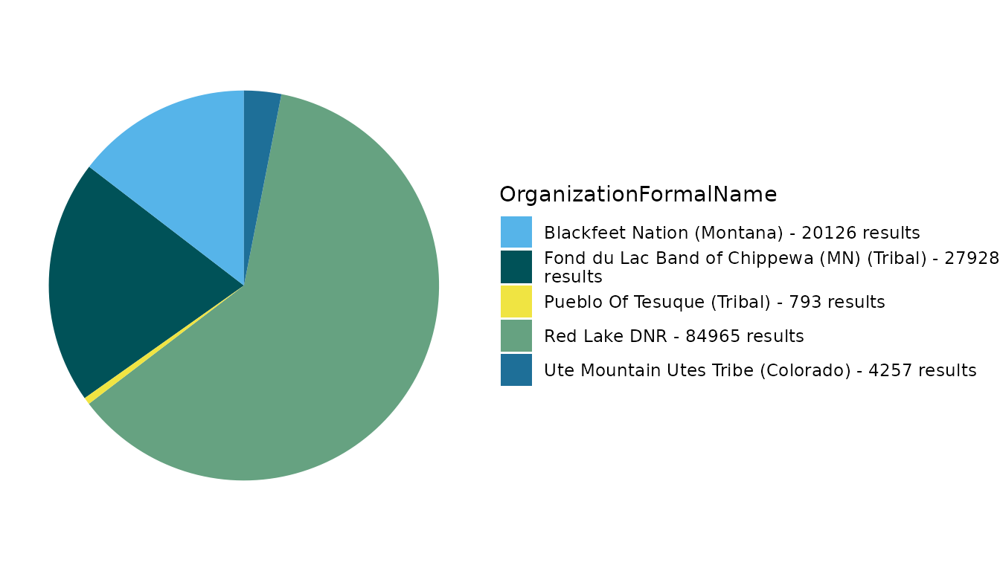

# TADA Module 1: Training for Intermediate/Advanced R Users

## Welcome!

Thank you for your interest in Tools for Automated Data Analysis (TADA).
TADA is an open-source tool set built in the R programming language and
available for anyone to download and edit to their specific needs. This
**TADA Module 1: Training for Intermediate/Advanced R Users** RMarkdown
document ([learn more about RMarkdown](https://yihui.org/rmarkdown/))
walks through how to download the TADA R package from GitHub, access and
parameterize several important functions with a sample dataframe, and
create basic visualizations.

The workflow is similar to a funnel: at each decision point, data that
fail QC checks are removed from the core dataframe and placed in a
separate dataframe, while data that pass are carried into the next step.
At the end of the QC checks, the user should be confident that their
data are properly documented and applicable to the analysis at hand.

**Note: TADA is still under development. New functionality is added
weekly, and sometimes we need to make bug fixes in response to tester
and user feedback. We appreciate your feedback, patience, and interest
in these helpful tools.**

## Customize or contribute

TADA is housed in a repository on
[GitHub](https://github.com/USEPA/EPATADA). Users desiring to review the
base code and customize the package for their own purposes may:

- Clone the repository using Git

- Open the repository using GitHub Desktop, or

- Download a zip file of the repository to their desktop.

Interested in contributing to the TADA package? The TADA team highly
encourages input and development from users. Check out the
[Contributing](https://usepa.github.io/EPATADA/articles/CONTRIBUTING.html)
page on the TADA GitHub site for guidance on collaboration conventions.

## Install and load packages

First, install and load the remotes package specifying the repo. This is
needed before installing EPATADA because it is only available on GitHub
(not CRAN).

``` r
install.packages("remotes",
  repos = "http://cran.us.r-project.org"
)
library(remotes)
```

Next, install and load EPATADA using the remotes package. USGS’s
dataRetrieval and other TADA R Package dependencies will also be
downloaded automatically from CRAN with the TADA install. If desired,
the development version of dataRetrieval can be downloaded directly from
GitHub (un-comment).

``` r
remotes::install_github("USEPA/EPATADA",
  ref = "develop",
  dependencies = TRUE
)
# remotes::install_github("USGS-R/dataRetrieval", dependencies=TRUE)
```

Finally, use the **library()** function to load the TADA R Package into
your R session.

``` r
library(EPATADA)
```

## Help pages

All TADA R package functions have their own individual help pages,
listed on the [Function
reference](https://usepa.github.io/EPATADA/reference/index.html) page on
the GitHub site. Users can also access the help page for a given
function in R or RStudio using the following format (example below):
`?[name of TADA function]`

``` r
?TADA_DataRetrieval
```

## Upload data

Now let’s start using the TADA R package functions. The first step is to
bring a dataframe into the R environment. TADA is designed to work with
[Water Quality Portal](https://www.waterqualitydata.us/) (WQP) data.
This means that all of its functions will look for WQP column names and
create new TADA-specific columns based on these elements. Users may
upload their own custom dataframe into R for use with TADA by ensuring
their column names and data formats (e.g. numeric, character) align with
WQP profiles.

If you are interested in reviewing the column headers and formats
required to run TADA, use the function below.

``` r
template <- TADA_GetTemplate()
template
```

    ##  [1] ResultIdentifier                                 
    ##  [2] ActivityTypeCode                                 
    ##  [3] ActivityMediaName                                
    ##  [4] ActivityMediaSubdivisionName                     
    ##  [5] CountryCode                                      
    ##  [6] StateCode                                        
    ##  [7] CountyCode                                       
    ##  [8] MonitoringLocationName                           
    ##  [9] MonitoringLocationTypeName                       
    ## [10] MonitoringLocationDescriptionText                
    ## [11] LatitudeMeasure                                  
    ## [12] LongitudeMeasure                                 
    ## [13] HorizontalCoordinateReferenceSystemDatumName     
    ## [14] HUCEightDigitCode                                
    ## [15] MonitoringLocationIdentifier                     
    ## [16] ResultSampleFractionText                         
    ## [17] CharacteristicName                               
    ## [18] SubjectTaxonomicName                             
    ## [19] SampleTissueAnatomyName                          
    ## [20] MethodSpeciationName                             
    ## [21] ActivityStartDate                                
    ## [22] ActivityStartTime.Time                           
    ## [23] ActivityStartTime.TimeZoneCode                   
    ## [24] ActivityStartDateTime                            
    ## [25] ResultMeasureValue                               
    ## [26] ResultMeasure.MeasureUnitCode                    
    ## [27] ResultValueTypeName                              
    ## [28] ResultDetectionConditionText                     
    ## [29] DetectionQuantitationLimitTypeName               
    ## [30] DetectionQuantitationLimitMeasure.MeasureValue   
    ## [31] DetectionQuantitationLimitMeasure.MeasureUnitCode
    ## [32] ResultDepthHeightMeasure.MeasureValue            
    ## [33] ResultDepthHeightMeasure.MeasureUnitCode         
    ## [34] ResultDepthAltitudeReferencePointText            
    ## [35] ActivityRelativeDepthName                        
    ## [36] ActivityDepthHeightMeasure.MeasureValue          
    ## [37] ActivityDepthHeightMeasure.MeasureUnitCode       
    ## [38] ActivityTopDepthHeightMeasure.MeasureValue       
    ## [39] ActivityTopDepthHeightMeasure.MeasureUnitCode    
    ## [40] ActivityBottomDepthHeightMeasure.MeasureValue    
    ## [41] ActivityBottomDepthHeightMeasure.MeasureUnitCode 
    ## [42] ResultTimeBasisText                              
    ## [43] StatisticalBaseCode                              
    ## [44] ResultFileUrl                                    
    ## [45] ResultAnalyticalMethod.MethodName                
    ## [46] ResultAnalyticalMethod.MethodDescriptionText     
    ## [47] ResultAnalyticalMethod.MethodIdentifier          
    ## [48] ResultAnalyticalMethod.MethodIdentifierContext   
    ## [49] ResultAnalyticalMethod.MethodUrl                 
    ## [50] SampleCollectionMethod.MethodIdentifier          
    ## [51] SampleCollectionMethod.MethodIdentifierContext   
    ## [52] SampleCollectionMethod.MethodName                
    ## [53] SampleCollectionMethod.MethodDescriptionText     
    ## [54] SampleCollectionEquipmentName                    
    ## [55] MeasureQualifierCode                             
    ## [56] ResultStatusIdentifier                           
    ## [57] ResultCommentText                                
    ## [58] ActivityCommentText                              
    ## [59] HydrologicCondition                              
    ## [60] HydrologicEvent                                  
    ## [61] DataQuality.PrecisionValue                       
    ## [62] DataQuality.BiasValue                            
    ## [63] DataQuality.ConfidenceIntervalValue              
    ## [64] DataQuality.UpperConfidenceLimitValue            
    ## [65] DataQuality.LowerConfidenceLimitValue            
    ## [66] SamplingDesignTypeCode                           
    ## [67] LaboratoryName                                   
    ## [68] ResultLaboratoryCommentText                      
    ## [69] ActivityIdentifier                               
    ## [70] OrganizationIdentifier                           
    ## [71] OrganizationFormalName                           
    ## [72] ProjectName                                      
    ## [73] ProjectDescriptionText                           
    ## [74] ProjectIdentifier                                
    ## [75] ProjectFileUrl                                   
    ## [76] QAPPApprovedIndicator                            
    ## [77] QAPPApprovalAgencyName                           
    ## [78] AquiferName                                      
    ## [79] AquiferTypeName                                  
    ## [80] LocalAqfrName                                    
    ## [81] ConstructionDateText                             
    ## [82] WellDepthMeasure.MeasureValue                    
    ## [83] WellDepthMeasure.MeasureUnitCode                 
    ## [84] WellHoleDepthMeasure.MeasureValue                
    ## [85] WellHoleDepthMeasure.MeasureUnitCode             
    ## <0 rows> (or 0-length row.names)

`TADA_DataRetrieval` is built upon USGS’s
[`dataRetrieval::readWQPdata`](https://rdrr.io/pkg/dataRetrieval/man/readWQPdata.html)
and
[`dataRetrieval::whatWQPsites`](https://rdrr.io/pkg/dataRetrieval/man/wqpSpecials.html)
functions within the dataRetrieval package, which uses web service calls
to bring WQP data into the R environment. Additionally,
`TADA_DataRetrieval` performs some basic quality control checks via
`TADA_AutoClean` on the data using new TADA-specific columns to preserve
the original dataframe:

- Converts key character columns to ALL CAPS for easier harmonization
  and validation.

- Identifies different classes of result values (numeric, text,
  percentage, comma-separated numeric, greater than/less than, numbers
  preceded by a tilde, etc.) and converts values to numeric where
  feasible.

- Unifies result and depth units to common units to improve ease of data
  harmonization. See
  [`?TADA_ConvertResultUnits`](https://usepa.github.io/EPATADA/reference/TADA_ConvertResultUnits.md)
  and
  [`?TADA_ConvertDepthUnits`](https://usepa.github.io/EPATADA/reference/TADA_ConvertDepthUnits.md)
  for more information on these processes. These functions can also be
  run separately if the user wishes to convert result or depth values to
  different units.

Let’s give it a try. Setting applyautoclean to TRUE in
`TADA:TADA_DataRetrieval` means that the basic quality control steps
described above are run. See
[`?TADA_AutoClean`](https://usepa.github.io/EPATADA/reference/TADA_AutoClean.md)
for more details. `TADA_DataRetrieval` follows similar parameterization
to the dataRetrieval package function
[`dataRetrieval::readWQPdata`](https://rdrr.io/pkg/dataRetrieval/man/readWQPdata.html),
but check out the [help
page](https://usepa.github.io/EPATADA/reference/TADA_DataRetrieval.html)
or enter
[`?TADA_DataRetrieval`](https://usepa.github.io/EPATADA/reference/TADA_DataRetrieval.md)
into the console for more information about input parameters and to see
several examples.

``` r
# download example data
# dataset_0  <- TADA_DataRetrieval(
#   organization = c("REDLAKE_WQX",
#                    "SFNOES_WQX",
#                    "PUEBLO_POJOAQUE",
#                    "FONDULAC_WQX",
#                    "PUEBLOOFTESUQUE",
#                    "CNENVSER"),
#   startDate = "2018-01-01",
#   endDate = "2023-01-01")

# For brevity, we'll skip pinging the WQP and instead load the example dataframe:
dataset_0 <- Data_6Tribes_5y
```

Let’s take a look at all of the TADA-created columns:

``` r
names(dataset_0)[grepl("TADA.", names(dataset_0))]
```

    ##  [1] "TADA.ActivityMediaName"                                           
    ##  [2] "TADA.MonitoringLocationName"                                      
    ##  [3] "TADA.MonitoringLocationTypeName"                                  
    ##  [4] "TADA.LatitudeMeasure"                                             
    ##  [5] "TADA.LongitudeMeasure"                                            
    ##  [6] "TADA.MonitoringLocationIdentifier"                                
    ##  [7] "TADA.ResultSampleFractionText"                                    
    ##  [8] "TADA.CharacteristicName"                                          
    ##  [9] "TADA.MethodSpeciationName"                                        
    ## [10] "TADA.ComparableDataIdentifier"                                    
    ## [11] "TADA.ResultMeasureValue"                                          
    ## [12] "TADA.ResultMeasure.MeasureUnitCode"                               
    ## [13] "TADA.WQXResultUnitConversion"                                     
    ## [14] "TADA.ResultMeasureValueDataTypes.Flag"                            
    ## [15] "TADA.DetectionQuantitationLimitMeasure.MeasureValue"              
    ## [16] "TADA.DetectionQuantitationLimitMeasure.MeasureUnitCode"           
    ## [17] "TADA.DetectionQuantitationLimitMeasure.MeasureValueDataTypes.Flag"
    ## [18] "TADA.ResultDepthHeightMeasure.MeasureValue"                       
    ## [19] "TADA.ResultDepthHeightMeasure.MeasureValueDataTypes.Flag"         
    ## [20] "TADA.ResultDepthHeightMeasure.MeasureUnitCode"                    
    ## [21] "TADA.ActivityDepthHeightMeasure.MeasureValue"                     
    ## [22] "TADA.ActivityDepthHeightMeasure.MeasureValueDataTypes.Flag"       
    ## [23] "TADA.ActivityDepthHeightMeasure.MeasureUnitCode"                  
    ## [24] "TADA.ActivityTopDepthHeightMeasure.MeasureValue"                  
    ## [25] "TADA.ActivityTopDepthHeightMeasure.MeasureValueDataTypes.Flag"    
    ## [26] "TADA.ActivityTopDepthHeightMeasure.MeasureUnitCode"               
    ## [27] "TADA.ActivityBottomDepthHeightMeasure.MeasureValue"               
    ## [28] "TADA.ActivityBottomDepthHeightMeasure.MeasureValueDataTypes.Flag" 
    ## [29] "TADA.ActivityBottomDepthHeightMeasure.MeasureUnitCode"

Currently, the `TADA_DataRetrieval` function combines three WQP data
profiles: Sample Results (Physical/Chemical), Site data, and Project
data. This ensures that all important quality control columns are
included in the dataframe.

**Note:** USGS and EPA are working together to create WQP 3.0 data
profiles. Once released (coming in 2025), one data profile will contain
the columns critical to TADA, removing the need to combine profiles in
this first step. This will simplify the steps needed to upload a custom
or WQP GUI-downloaded dataframe into the R package. However, column
names are changing in the new WQP 3.0 data profiles. This will impact
the `TADA_DataRetrieval` function. The WQP and TADA teams are available
to assist with cross walking the old to new column names when the time
comes.

## Initial data review

Now that we’ve pulled the data into the R session, let’s take a look at
it. Note that any column names with the “TADA.” prefix were generated
from the `TADA_DataRetrieval` function.

First, always good to take a look at the dataframe dimensions.

**Question 1: What are the dimensions of your dataframe?**

``` r
dim(dataset_0) # returns x and of x (as the numbers of rows and columns respectively)
```

    ## [1] 135932    152

Before we start filtering and flagging our data, let’s create a function
(`dimCheck`) that performs dimension checks between the results that
pass each filter or QC flag check (and are retained) and those that do
not (and are removed). These dimension checks ensure that the total
number of rows in the original input dataframe (`all_result_num`) equal
the the total number of rows added up between the passing (`pass_data`)
and removed (`fail_data`) dataframes.

``` r
# defining a dimension check function that compares removed and retained data dimensions against the initial data input
dimCheck <- function(all_result_num, pass_data, fail_data, checkName) {
  # check result numbers after split
  final_result_num <- dim(pass_data)[1] + dim(fail_data)[1]

  # always good to do a dimension check
  if (!all_result_num == final_result_num) {
    print(paste0("Help! Results do not add up between dataframe and removed after ", checkName, " check."))
  } else {
    print(paste0("Good to go. Zero results created or destroyed in ", checkName, " check."))
  }
}

# let's first get the total number of rows in the dataframe.
all_result_num <- dim(dataset_0)[1]
```

Next, we can use the
[`TADA_FieldCounts()`](https://usepa.github.io/EPATADA/reference/TADA_FieldCounts.md)
function to see how many unique values are contained within each column
of the dataframe. The function can either return all column counts,
most, or just the key columns. We’ll try the input with
`display = "key"` and `display = "all"`. Enter `?TADA_FieldCounts()`
into the console for more information on this function.

**Question 2: Which column should have a unique value in every row and
why?**

``` r
key_counts <- TADA_FieldCounts(dataset_0, display = "key")

key_counts
```

    ##                             Fields Count
    ## 1             SubjectTaxonomicName   278
    ## 2    TADA.ComparableDataIdentifier   223
    ## 3          TADA.CharacteristicName   147
    ## 4           OrganizationFormalName     6
    ## 5  TADA.MonitoringLocationTypeName     5
    ## 6           TADA.ActivityMediaName     3
    ## 7     ActivityMediaSubdivisionName     3
    ## 8        ActivityRelativeDepthName     3
    ## 9              ResultValueTypeName     3
    ## 10          ResultStatusIdentifier     2

``` r
all_counts <- TADA_FieldCounts(dataset_0, display = "all")

all_counts
```

    ##                                                                Fields  Count
    ## 1                                                    ResultIdentifier 135932
    ## 2                                             TADA.ResultMeasureValue  40875
    ## 3                                                  ResultMeasureValue  37488
    ## 4                                                  ActivityIdentifier  19180
    ## 5                                 ResultDetectionQuantitationLimitUrl  12311
    ## 6                                               ActivityStartDateTime  11989
    ## 7                                                         LastUpdated   6683
    ## 8                                              ActivityStartTime.Time   3737
    ## 9                          TADA.ResultDepthHeightMeasure.MeasureValue   3608
    ## 10                              ResultDepthHeightMeasure.MeasureValue   3519
    ## 11                                                ActivityEndDateTime   1026
    ## 12                                               ActivityEndTime.Time   1001
    ## 13                                                ActivityCommentText    805
    ## 14                                                  ActivityStartDate    756
    ## 15                                                  AnalysisStartDate    619
    ## 16                                                  ResultCommentText    385
    ## 17                TADA.DetectionQuantitationLimitMeasure.MeasureValue    377
    ## 18                     DetectionQuantitationLimitMeasure.MeasureValue    373
    ## 19                            ActivityDepthHeightMeasure.MeasureValue    321
    ## 20                       TADA.ActivityDepthHeightMeasure.MeasureValue    318
    ## 21                                               SubjectTaxonomicName    278
    ## 22                                  ActivityLocation.LongitudeMeasure    272
    ## 23                                   ActivityLocation.LatitudeMeasure    269
    ## 24                                       MonitoringLocationIdentifier    227
    ## 25                                  TADA.MonitoringLocationIdentifier    227
    ## 26                                      TADA.ComparableDataIdentifier    223
    ## 27                                             MonitoringLocationName    222
    ## 28                                        TADA.MonitoringLocationName    222
    ## 29                                                   LongitudeMeasure    218
    ## 30                                              TADA.LongitudeMeasure    218
    ## 31                                                    LatitudeMeasure    215
    ## 32                                               TADA.LatitudeMeasure    214
    ## 33                                                 CharacteristicName    148
    ## 34                                            TADA.CharacteristicName    147
    ## 35                              DataQuality.UpperConfidenceLimitValue     95
    ## 36                            ResultAnalyticalMethod.MethodIdentifier     74
    ## 37                                  ResultAnalyticalMethod.MethodName     73
    ## 38                                                    ActivityEndDate     68
    ## 39                              DataQuality.LowerConfidenceLimitValue     64
    ## 40                      ActivityBottomDepthHeightMeasure.MeasureValue     55
    ## 41                 TADA.ActivityBottomDepthHeightMeasure.MeasureValue     54
    ## 42                                      ResultMeasure.MeasureUnitCode     44
    ## 43                       ResultAnalyticalMethod.MethodDescriptionText     42
    ## 44                                                        ProjectName     30
    ## 45                                                  ProjectIdentifier     30
    ## 46                                 TADA.ResultMeasure.MeasureUnitCode     22
    ## 47                                             ProjectDescriptionText     18
    ## 48                                                         CountyCode     15
    ## 49                                                  HUCEightDigitCode     15
    ## 50                                  SampleCollectionMethod.MethodName     15
    ## 51                                  MonitoringLocationDescriptionText     14
    ## 52                            SampleCollectionMethod.MethodIdentifier     14
    ## 53                  DetectionQuantitationLimitMeasure.MeasureUnitCode     13
    ## 54                     ResultAnalyticalMethod.MethodIdentifierContext     13
    ## 55                       SampleCollectionMethod.MethodDescriptionText     13
    ## 56             TADA.DetectionQuantitationLimitMeasure.MeasureUnitCode     11
    ## 57                                      SampleCollectionEquipmentName     11
    ## 58                                               MethodSpeciationName     10
    ## 59                                          TADA.MethodSpeciationName      9
    ## 60                              TADA.ResultMeasureValueDataTypes.Flag      9
    ## 61                                               MeasureQualifierCode      9
    ## 62                                                     LaboratoryName      9
    ## 63                                           ResultSampleFractionText      7
    ## 64                                      TADA.ResultSampleFractionText      7
    ## 65                                       ResultDetectionConditionText      7
    ## 66                                 DetectionQuantitationLimitTypeName      7
    ## 67                     SampleCollectionMethod.MethodIdentifierContext      7
    ## 68                                                   ActivityTypeCode      6
    ## 69                                             OrganizationIdentifier      6
    ## 70                                             OrganizationFormalName      6
    ## 71                                         MonitoringLocationTypeName      5
    ## 72                                    TADA.MonitoringLocationTypeName      5
    ## 73                                             QAPPApprovalAgencyName      5
    ## 74                                                          StateCode      4
    ## 75                                     ActivityStartTime.TimeZoneCode      4
    ## 76                              ActivityStartTime.TimeZoneCode_offset      4
    ## 77         TADA.ActivityDepthHeightMeasure.MeasureValueDataTypes.Flag      4
    ## 78                                              QAPPApprovedIndicator      4
    ## 79                                                  ActivityMediaName      3
    ## 80                                             TADA.ActivityMediaName      3
    ## 81                                       ActivityMediaSubdivisionName      3
    ## 82                                                ResultValueTypeName      3
    ## 83  TADA.DetectionQuantitationLimitMeasure.MeasureValueDataTypes.Flag      3
    ## 84                           ResultDepthHeightMeasure.MeasureUnitCode      3
    ## 85                                          ActivityRelativeDepthName      3
    ## 86                         ActivityDepthHeightMeasure.MeasureUnitCode      3
    ## 87   TADA.ActivityBottomDepthHeightMeasure.MeasureValueDataTypes.Flag      3
    ## 88                                                StatisticalBaseCode      3
    ## 89                                       ActivityEndTime.TimeZoneCode      3
    ## 90                                ActivityEndTime.TimeZoneCode_offset      3
    ## 91                                                        CountryCode      2
    ## 92                       HorizontalCoordinateReferenceSystemDatumName      2
    ## 93                                       TADA.WQXResultUnitConversion      2
    ## 94           TADA.ResultDepthHeightMeasure.MeasureValueDataTypes.Flag      2
    ## 95                         ActivityTopDepthHeightMeasure.MeasureValue      2
    ## 96                    TADA.ActivityTopDepthHeightMeasure.MeasureValue      2
    ## 97      TADA.ActivityTopDepthHeightMeasure.MeasureValueDataTypes.Flag      2
    ## 98                      ActivityTopDepthHeightMeasure.MeasureUnitCode      2
    ## 99                   ActivityBottomDepthHeightMeasure.MeasureUnitCode      2
    ## 100                                            ResultStatusIdentifier      2
    ## 101                                ActivityConductingOrganizationText      2
    ## 102                                             SourceMapScaleNumeric      2
    ## 103                                    HorizontalCollectionMethodName      2
    ## 104                     TADA.ResultDepthHeightMeasure.MeasureUnitCode      1
    ## 105                   TADA.ActivityDepthHeightMeasure.MeasureUnitCode      1
    ## 106                TADA.ActivityTopDepthHeightMeasure.MeasureUnitCode      1
    ## 107             TADA.ActivityBottomDepthHeightMeasure.MeasureUnitCode      1
    ## 108                                                      ProviderName      1

**Question 3: How many unique ‘TADA.ActivityMediaName’ values exist in
your dataframe? Are there any media types that are not water?**

TADA is currently designed to accommodate water data from the WQP. Let’s
ensure that we remove all non-water data first.

``` r
# remove data with media type that is not water
removed <- dataset_0 |>
  dplyr::filter(!TADA.ActivityMediaName %in% c("WATER")) |>
  dplyr::mutate(TADA.RemovalReason = "Activity media is not water.")

# what other media types exist in dataframe?
unique(removed$TADA.ActivityMediaName)
```

    ## [1] "BIOLOGICAL" "AIR"

``` r
# clean dataframe containing only water
dataset <- dataset_0 |> dplyr::filter(TADA.ActivityMediaName %in% c("WATER"))

dimCheck(all_result_num, dataset, removed, checkName = "Activity Media")
```

    ## [1] "Good to go. Zero results created or destroyed in Activity Media check."

Two additional helper functions one can use at any step in the process
are
[`TADA_FieldValuesTable()`](https://usepa.github.io/EPATADA/reference/TADA_FieldValuesTable.md)
and
[`TADA_FieldValuesPie()`](https://usepa.github.io/EPATADA/reference/TADA_FieldValuesPie.md).
These functions create a summary table and pie chart (respectively) of
all the unique values in a given column. Let’s give it a try on
OrganizationFormalName, which is a WQP column naming the organization
that supplied the result.

``` r
TADA_FieldValuesPie(dataset, field = "OrganizationFormalName")
```



``` r
org_counts <- TADA_FieldValuesTable(dataset, field = "OrganizationFormalName")

org_counts
```

    ##                                             Value Count
    ## 1                                    Red Lake DNR 85740
    ## 2               Fond du Lac Band of Chippewa (MN) 22945
    ## 3                     Sac and Fox Nation (Tribal)  9943
    ## 4                      Pueblo Of Tesuque (Tribal)  6798
    ## 5 Chickasaw Nation Environmental Service (Tribal)  4946
    ## 6                              Pueblo of Pojoaque  1101

**Question 4: When might a user choose to view a column’s unique values
as a table rather than in a pie chart?**

We can take a quick look at some of the TADA-created columns that review
result value types. Because TADA is intended to work with numeric data,
at this point, it would be good to remove those result values that are
NA without any detection limit info, or contain text or special
characters that cannot be converted to numeric. Note that TADA will fill
in missing values with detection limit values and units with the
`TADA_IDCensoredData` if the ResultDetectionConditionText and
DetectionQuantitationLimitType fields are populated. See
[`?TADA_ConvertSpecialChars`](https://usepa.github.io/EPATADA/reference/TADA_ConvertSpecialChars.md)
for more details on result value types and handling and
[`?TADA_IDCensoredData`](https://usepa.github.io/EPATADA/reference/TADA_IDCensoredData.md)
for details on censored data preparation.

First, we can run `TADA_IDCensoredData` to fill in as many NA/missing
values as possible. We can use `TADA_FieldValuesPie` to view the
censored data flags identified in the dataframe and their relative
frequency. `TADA_IDCensoredData` sorts result values into detection
limit categories (e.g. non-detect, over-detect) based on populated
values in the ResultDetectionConditionText and
DetectionQuantitationLimitTypeName columns.

You can find the reference tables used to make these decisions in
[`TADA_GetDetCondRef()`](https://usepa.github.io/EPATADA/reference/TADA_GetDetCondRef.md)
and
[`TADA_GetDetLimitRef()`](https://usepa.github.io/EPATADA/reference/TADA_GetDetLimitRef.md)
functions. In some cases, results are missing detection limit/condition
info, or there is a conflict in the detection limit and condition. The
user may want to remove problematic detection limit data before
proceeding. We can also filter for the “problem” data by
TADA.CensoredData.Flag and review the unique reasons for data removal.

``` r
dataset <- TADA_IDCensoredData(dataset)

TADA_FieldValuesPie(dataset, field = "TADA.CensoredData.Flag")
```


``` r
problem_censored <- dataset |>
  dplyr::filter(!TADA.CensoredData.Flag %in% c("Non-Detect", "Over-Detect", "Other", "Uncensored")) |>
  dplyr::mutate(TADA.RemovalReason = "Detection limit information contains errors or missing information.")

# Let's take a look at the problematic data that we filtered out (if any)
check <- unique(problem_censored[, c("TADA.CharacteristicName", "ResultDetectionConditionText", "DetectionQuantitationLimitTypeName", "TADA.CensoredData.Flag")])

TADA_TableExport(check)

dataset <- dataset |> dplyr::filter(TADA.CensoredData.Flag %in% c("Non-Detect", "Over-Detect", "Other", "Uncensored"))

# Let's take a look at the removed data
removed <- plyr::rbind.fill(removed, problem_censored)

# dimension check
dimCheck(all_result_num, dataset, removed, checkName = "Censored Data")
```

Next, we can take a look at the data types present and filter out any
non-allowable types.

``` r
# take a look at datatypes
flag.datatypes <- TADA_FieldValuesTable(dataset, field = "TADA.ResultMeasureValueDataTypes.Flag")

# Numeric or numeric-coerced data types
rv_datatypes <- unique(subset(dataset, !is.na(dataset$TADA.ResultMeasureValue))$TADA.ResultMeasureValueDataTypes.Flag)

# Non-numeric data types coerced to NA
na_rv_datatypes <- unique(subset(dataset, is.na(dataset$TADA.ResultMeasureValue))$TADA.ResultMeasureValueDataTypes.Flag)
```

``` r
# these are all of the NOT allowable data types in the dataset.
incompatible_datatype <- dataset |>
  dplyr::filter(!dataset$TADA.ResultMeasureValueDataTypes.Flag %in% c("Numeric", "Less Than", "Greater Than", "Approximate Value", "Percentage", "Comma-Separated Numeric", "Numeric Range - Averaged", "Result Value/Unit Copied from Detection Limit")) |>
  dplyr::mutate(TADA.RemovalReason = "Result value type cannot be converted to numeric or no detection limit values provided.")

# take a look at the difficult data types - do they make sense?
check <- unique(incompatible_datatype[, c("TADA.CharacteristicName", "ResultMeasureValue", "TADA.ResultMeasureValue", "ResultMeasure.MeasureUnitCode", "TADA.ResultMeasure.MeasureUnitCode", "TADA.ResultMeasureValueDataTypes.Flag", "DetectionQuantitationLimitMeasure.MeasureValue", "TADA.DetectionQuantitationLimitMeasure.MeasureValue", "DetectionQuantitationLimitMeasure.MeasureUnitCode", "TADA.DetectionQuantitationLimitMeasure.MeasureUnitCode")])

TADA_TableExport(check)
```

Then we can take a closer look at the removed results and run another
dimension check on the data set.

``` r
# filter data set to include allowable data types
dataset <- dataset |> dplyr::filter(dataset$TADA.ResultMeasureValueDataTypes.Flag %in% c("Numeric", "Less Than", "Greater Than", "Approximate Value", "Percentage", "Comma-Separated Numeric", "Numeric Range - Averaged", "Result Value/Unit Copied from Detection Limit"))

# create dataframe to includ all removed results
removed <- plyr::rbind.fill(removed, incompatible_datatype)

# dimension check
dimCheck(all_result_num, dataset, removed, checkName = "Result Format")
```

    ## [1] "Good to go. Zero results created or destroyed in Result Format check."

## Data flagging

We’ve taken a quick look at the raw dataframe and split off some data
that are not compatible with TADA, now let’s run through some quality
control checks. The most important ones to run to ensure your dataframe
is ready for subsequent steps are
[`TADA_FlagFraction()`](https://usepa.github.io/EPATADA/reference/TADA_FlagFraction.md),
[`TADA_FlagSpeciation()`](https://usepa.github.io/EPATADA/reference/TADA_FlagSpeciation.md),
[`TADA_FlagResultUnit()`](https://usepa.github.io/EPATADA/reference/TADA_FlagResultUnit.md),
and
[`TADA_FindQCActivities()`](https://usepa.github.io/EPATADA/reference/TADA_FindQCActivities.md).
With the exception of
[`TADA_FindQCActivities()`](https://usepa.github.io/EPATADA/reference/TADA_FindQCActivities.md),
these flagging functions leverage WQX’s [QAQC Validation
Table](https://cdx.epa.gov/wqx/download/DomainValues/QAQCCharacteristicValidation.CSV).
See the [WQX QAQC Service User
Guide](https://usepa.github.io/EPATADA/articles/WQXValidationService.html)
for more details on how TADA leverages the validation table to flag
potentially suspect data.
[`TADA_FindQCActivities()`](https://usepa.github.io/EPATADA/reference/TADA_FindQCActivities.md)
uses a TADA-specific domain table users can review with
[`TADA_GetActivityTypeRef()`](https://usepa.github.io/EPATADA/reference/TADA_GetActivityTypeRef.md).
All QAQC tables are frequently updated in the package to ensure they
match the latest version on the web.

Bring the QAQC Validation Table into your R session to view or save with
the following command:

``` r
qaqc_ref <- TADA_GetWQXCharValRef()

unique(qaqc_ref[["Type"]])
```

    ## [1] "CharacteristicFraction"   "CharacteristicMethod"    
    ## [3] "CharacteristicSpeciation" "CharacteristicUnit"

**Question 5: What do you think the Type column in the qaqc_ref data
frame indicates?**

TADA joins this validation table to the data and uses the “Pass” and
“Suspect” labels in the TADA.WQXVal.Flag column to create easily
understandable flagging columns for each function. Let’s run these four
flagging functions.

``` r
dataset_flags <- TADA_FlagFraction(dataset, clean = FALSE, flaggedonly = FALSE)
dataset_flags <- TADA_FlagSpeciation(dataset_flags, clean = "none", flaggedonly = FALSE)
dataset_flags <- TADA_FlagResultUnit(dataset_flags, clean = "none", flaggedonly = FALSE)
dataset_flags <- TADA_FindQCActivities(dataset_flags, clean = FALSE, flaggedonly = FALSE)

dimCheck(all_result_num, dataset_flags, removed, checkName = "Run Flag Functions")
```

    ## [1] "Good to go. Zero results created or destroyed in Run Flag Functions check."

**Question 6: Did any warnings or messages appear in the console after
running these flagging functions? What do they say?**

Now that we’ve run all the key flagging functions, let’s take a look at
the results and make some decisions.

``` r
TADA_FieldValuesPie(dataset_flags, field = "TADA.SampleFraction.Flag")
```


``` r
TADA_FieldValuesPie(dataset_flags, field = "TADA.MethodSpeciation.Flag")
```


``` r
TADA_FieldValuesPie(dataset_flags, field = "TADA.ResultUnit.Flag")
```


``` r
TADA_FieldValuesPie(dataset_flags, field = "TADA.ActivityType.Flag")
```


Any results flagged as “Suspect” are recognized in the QAQC Validation
Table as having some data quality issue. “NonStandardized” means that
the format has not been fully vetted or processed, while “Pass” confirms
that the characteristic combination is widely recognized as correctly
formatted. Let’s add any suspect results to the removed dataframe for
later review.

**Note: if you find any errors in the QAQC Validation Table, please
contact the WQX Help Desk at WQX@epa.gov to help correct it. Thanks in
advance!**

``` r
# grab all the flagged results from the four functions
problem_flagged <- dataset_flags |>
  dplyr::filter(TADA.SampleFraction.Flag == "Suspect" | TADA.MethodSpeciation.Flag == "Suspect" | TADA.ResultUnit.Flag == "Suspect" | !TADA.ActivityType.Flag %in% ("Non_QC")) |>
  dplyr::mutate(TADA.RemovalReason = "Invalid Unit, Method, Speciation, or Activity Type.")

dataset_flags <- dataset_flags |> dplyr::filter(!ResultIdentifier %in% problem_flagged$ResultIdentifier)

# create dataframe of removed results
removed <- plyr::rbind.fill(removed, problem_flagged)

# remove df no longer needed
rm(problem_flagged)

# dimension check
dimCheck(all_result_num, dataset_flags, removed, checkName = "Filter Flag Functions")
```

    ## [1] "Good to go. Zero results created or destroyed in Filter Flag Functions check."

**Question 7: Are there any other metadata columns that you review and
filter in your workflow?**

We’ve finished running the recommended flagging functions and removing
results that do not pass QC checks. Let’s look at the breakdown of these
data in the removed object.

``` r
removal <- TADA_FieldValuesTable(removed, field = "TADA.RemovalReason")

removal
```

    ##                                                                                     Value
    ## 1                                     Invalid Unit, Method, Speciation, or Activity Type.
    ## 2 Result value type cannot be converted to numeric or no detection limit values provided.
    ## 3                                                            Activity media is not water.
    ## 4                     Detection limit information contains errors or missing information.
    ##   Count
    ## 1 49455
    ## 2  7619
    ## 3  4459
    ## 4    15

You can review any other columns of interest and create custom domain
tables of your “Valid” and “Invalid” criteria using R or Excel. Also
check out some of the other flagging functions available in TADA:

- `?TADA_FindNearbySites()`

- `?TADA_FindPotentialDuplicatesMultipleOrgs()`

- `?TADA_FindPotentialDuplicatesSingleOrg()`

- `?TADA_FindQAPPApproval()`

- `?TADA_FindQAPPDoc()`

- `?TADA_FlagAboveThreshold()`

- `?TADA_FlagBelowThreshold()`

- `?TADA_FlagContinuousData()`

- `?TADA_FlagCoordinates()`

- `?TADA_FlagMeasureQualifierCode()`

- `?TADA_FlagMethod()`

Please let us know of other flagging functions you think would have
broad appeal in the TADA package or need assistance
brainstorming/developing.

## Censored data handling

We have already identified, flagged, and in some cases removed
problematic detection limit data from our dataframe, but that doesn’t
keep them from being difficult. Because we do not know the result value
with adequate precision, water quality data users often set non-detect
values to some number below the reported detection limit. TADA contains
some simple methods for handling detection limits: users may multiply
the detection limit by some number between 0 and 1, or convert the
detection limit value to a random number between 0 and the detection
limit. More complex detection limit estimation requiring regression
models (Maximum Likelihood, Kaplan-Meier, Robust Regression on Order
Statistics) or similar must be performed outside of the current version
of TADA (though future development is planned).

**Question 8: How would you parameterize
[`TADA_SimpleCensoredMethods()`](https://usepa.github.io/EPATADA/reference/TADA_SimpleCensoredMethods.md)
to make non-detect values equal to the provided detection limit? What
would you need to change in the example below?**

``` r
dataset_cens <- TADA_SimpleCensoredMethods(dataset_flags,
  nd_method = "multiplier",
  nd_multiplier = 0.5,
  od_method = "as-is"
)
```

Let’s take a look at how the censored data handling function affects the
`TADA.ResultMeasureValueDataTypes.Flag` column.

First, we can look use `TADA_FieldValuesTable` to look at the
TADA.ResultMeasureValueDataTypes.Flag column in data set before we ran
`TADA_SimpleCensoredMethods`.

``` r
# before
TADA_FieldValuesTable(dataset_flags, field = "TADA.ResultMeasureValueDataTypes.Flag")
```

    ##                                           Value Count
    ## 1                                       Numeric 73536
    ## 2                                    Percentage   745
    ## 3 Result Value/Unit Copied from Detection Limit    48
    ## 4                      Numeric Range - Averaged    33
    ## 5                                     Less Than    19
    ## 6                                  Greater Than     3

Then we can use `TADA_FieldValuesTable` again to look at the same column
after `TADA_SimpleCensoredMethods`.

``` r
# after
TADA_FieldValuesTable(dataset_cens, field = "TADA.ResultMeasureValueDataTypes.Flag")
```

    ##                                              Value Count
    ## 1                                          Numeric 73526
    ## 2                                       Percentage   745
    ## 3 Result Value/Unit Estimated from Detection Limit    58
    ## 4                         Numeric Range - Averaged    33
    ## 5                                        Less Than    19
    ## 6                                     Greater Than     3

**Question 9: Is there a difference between the first and second
tables?**

If you’d like to start thinking about using statistical methods to
estimate detection limit values, check out the
[`?TADA_Stats`](https://usepa.github.io/EPATADA/reference/TADA_Stats.md)
function, which accepts user-defined data groupings (or defaults to
TADA.ComparableDataIdentifier to determine measurement count, location
count, censored data stats, min, max, and percentile stats, and suggests
non-detect estimation methods based on the number of results, % of data
frame censored, and number of censoring levels (detection limits). The
decision tree used in the function was outlined in a [National Nonpoint
Source Tech
Memo](https://www.epa.gov/sites/default/files/2016-05/documents/tech_notes_10_jun2014_r.pdf).

## Data exploration

How are you feeling about your test dataframe? Does it seem ready for
the next step(s) in your analyses? There’s probably a lot more you’d
like to look at/filter out before you’re ready to say: QC complete.
Let’s first check out characteristics in the dataframe using `dplyr`
functions and pipes.

``` r
# get table of characteristics with number of results, sites, and organizations
dataset_cens_summary <- dataset_cens |>
  dplyr::group_by(TADA.CharacteristicName) |>
  dplyr::summarise(Result_Count = length(ResultIdentifier), Site_Count = length(unique(TADA.MonitoringLocationIdentifier)), Org_Count = length(unique(OrganizationIdentifier))) |>
  dplyr::arrange(desc(Result_Count))
```

You may see a characteristic that you’d like to investigate further in
isolation.
[`TADA_FieldValuesPie()`](https://usepa.github.io/EPATADA/reference/TADA_FieldValuesPie.md)
will also produce summary pie charts for a given column *within* a
specific characteristic. Let’s take a look.

``` r
# go ahead and pick a characteristic name from the table generated above. I picked dissolved oxygen (DO) amd selected OrganizationFormalName as the field to see the relative contribution of each org to DO results
TADA_FieldValuesPie(dataset_cens, field = "OrganizationFormalName", characteristicName = "DISSOLVED OXYGEN (DO)")
```


We can view the site locations using a TADA mapping function. In this
map, the circles indicate monitoring locations in the data set; their
size corresponds to the number of results collected at that site, while
the darker the circle, the more characteristics were sampled at that
site.

``` r
TADA_OverviewMap(dataset_cens)
```

Out of curiosity, let’s take a look at a breakdown of these monitoring
location types. Do they all indicate surface water samples? Depending
upon your program’s goals and methods, you might want to filter out some
of the types you see.

``` r
TADA_FieldValuesPie(dataset_cens, field = "TADA.MonitoringLocationTypeName")
```


One of the next big steps is data harmonization: translating and
aggregating synonyms, combining multiple forms/species of certain
characteristics, etc. We won’t get to that in this demo (more details
can be found here: [TADA Module 1: Water Quality Portal Data Discovery
and Cleaning](https://usepa.github.io/EPATADA/articles/TADAModule1.html)
or
[TADA_HarmonizeSynonyms()](https://usepa.github.io/EPATADA/reference/TADA_HarmonizeSynonyms.html)),
but for now we can start looking at data distributions within a single
characteristic-speciation-fraction-unit using the plotting functions
[`TADA_Histogram()`](https://usepa.github.io/EPATADA/reference/TADA_Histogram.md)
and
[`TADA_Boxplot()`](https://usepa.github.io/EPATADA/reference/TADA_Boxplot.md).
We can also view a stats table using `TADA_Stats`.

Let’s first take a look at the column TADA.ComparableDataIdentifier,
which breaks down characteristics into groups by name, fraction,
speciation, and unit. These four columns are important to evaluate
together to ensure the plotted data are sufficiently similar to appear
on a single plot together: it doesn’t make sense to plot characteristics
with different units or fractions in the same distribution.

``` r
# trusty field values table - lets just look at the first few entries with the most associated records
compid <- TADA_FieldValuesTable(dataset_cens, field = "TADA.ComparableDataIdentifier")
```

Now that we have an idea for what the TADA.ComparableDataIdentifier
looks like, we can check out how it is used to plot distinct
characteristic groups.

``` r
# Look at a histogram, boxplot, and stats for TADA.ComparableDataIdentifier(s) of your choice.
comp_data_id <- "PH_NONE_NONE_NONE"

plot_data <- subset(dataset_cens, dataset_cens$TADA.ComparableDataIdentifier %in% comp_data_id)
```

**Question 10: How does selecting the different options on the left side
of the histogram change the data displayed? When might you want to use a
histogram vs. a boxplot?**

Let’s take a look at the histogram and boxplot for the comparable data
identifier we selected.

``` r
TADA_Histogram(plot_data, id_cols = "TADA.ComparableDataIdentifier")
```

``` r
TADA_Boxplot(plot_data, id_cols = "TADA.ComparableDataIdentifier")
```

``` r
stats <- TADA_Stats(plot_data)
```

We can also explore depth profiles for selected characteristics at
specific site on a single date. There are a few functions that can help
with this. First we can use `TADA_FlagDepthCategory` to place results
into various depth categories (surface, middle, and bottom).

``` r
dataset_depth <- TADA_FlagDepthCategory(dataset_cens)
```

We can also use another function, `TADA_IDDepthProfiles` to identify
location/date/characteristic combinations in the data set that can be
used for depth profile plots or analysis. The default number of values
required to identify a location/date/characteristic as a depth profile
is 2, but this can be changed by the user. We will specify a larger
value, 5, so that any depth profiles identified will have results from
at least 5 different depths.

``` r
depth_profile_id <- TADA_IDDepthProfiles(dataset_depth, nvalue = 5)
```

**Question 11: How can TADA_IDDepthProfiles() help users use
TADA_DepthProfilePlot most efficiently?**

Now, we can use `TADA_DepthProfilePlot` to plot up to three
characteristics against depth. In this example, we will look at pH,
secchi depth, and pH.

``` r
TADA_DepthProfilePlot(dataset_cens,
  groups = c(
    "TEMPERATURE, WATER_NONE_NONE_DEG C",
    "DEPTH, SECCHI DISK DEPTH_NONE_NONE_M",
    "PH_NONE_NONE_NONE"
  ),
  location = "REDLAKE_WQX-ANKE",
  activity_date = "2018-10-04",
  depthcat = TRUE,
  surfacevalue = 2,
  bottomvalue = 2,
  unit = "m"
)
```

Finally, we can download our PASS and FAIL data sets together into an
Excel spreadsheet.

``` r
dataset_and_removed <- dplyr::bind_rows(dataset_cens, removed)

# Un-comment to download Excel spreadsheet to your working directory
# install.packages(writexl)
# library(writexl)
# writexl::write_xlsx(dataset_and_removed, "NCTCShepherdstownData.xlsx")
```

## TADA R Shiny Modules

Finally, take a look at an alternative workflow for QC’ing WQP data:
TADA Shiny Module 1: Data Discovery and Cleaning. This is a Shiny
application that runs many of the TADA functions covered in this
training document behind a graphical user interface. The shiny
application queries the WQP, contains maps and data visualizations,
flags suspect data results, handles censored data, and more. You can
launch it using the code below.

``` r
# download TADA Shiny repository
remotes::install_github("USEPA/TADAShiny", ref = "develop", dependencies = TRUE)

# launch the app locally.
TADAShiny::run_app()
```

The [TADA Module 1 R Shiny
App](https://rconnect-public.epa.gov/TADAShiny/) is also currently
hosted on the web.
