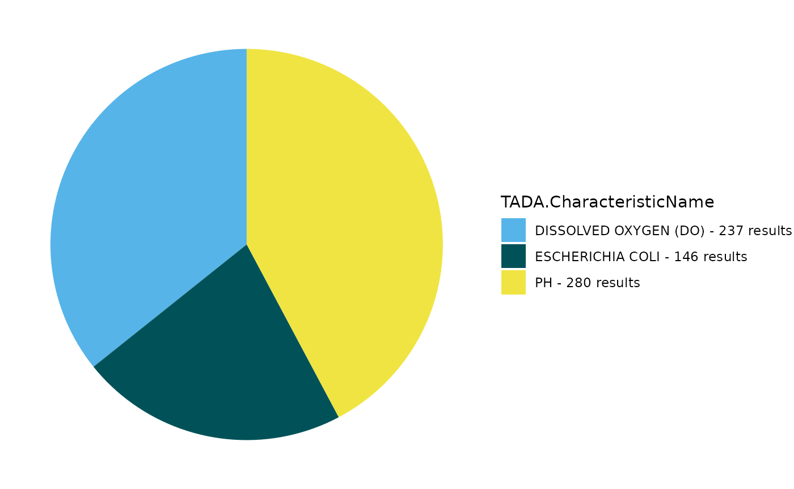

# TADA R8 Demo January 2026

## Overview and Setup

**Welcome!**

Thank you for your interest in Tools for Automated Data Analysis (TADA).
TADA is an open-source tool set built in the R programming language.
This [RMarkdown](https://bookdown.org/yihui/rmarkdown/) document walks
users through how to download the TADA R package from GitHub, access and
parameterize several important functions, and create basic
visualizations with a sample data set.

**Note:** TADA is still under development. New functionality is added
weekly, and sometimes we need to make bug fixes in response to tester
and user feedback. We appreciate your feedback, patience, and interest
in these helpful tools.

If you are interested in contributing to TADA development, more
information is available at:

[Contributing](https://usepa.github.io/EPATADA/articles/CONTRIBUTING.html)

We welcome collaboration with external partners.

Install and load packages

First, install and load the remotes package specifying the repo. This is
needed before installing TADA because it is only available on GitHub.

``` r
install.packages("remotes",
  repos = "http://cran.us.r-project.org"
)
library(remotes)
```

Next, install and load TADA using the remotes package. TADA R Package
dependencies will also be downloaded automatically from CRAN with the
TADA install. You may be prompted in the console to update dependency
packages that have more recent versions available. If you see this
prompt, it is recommended to update all of them (enter 1 into the
console).

``` r
remotes::install_github("USEPA/EPATADA",
  ref = "develop",
  dependencies = TRUE
)
```

Finally, use the library() function to load the TADA R Package into your
R session.

``` r
library(EPATADA)
```

Help pages

All TADA R package functions have their own individual help pages,
listed on the Function reference page on the TADA GitHub site. Users can
also access the help page for a given function in R or RStudio using the
following format (example below): ?\[name of TADA function\].

``` r
# Access help page for TADA_DataRetrieval
?TADA_DataRetrieval
```

### A) Retrieving, filtering and cleaning data from the WQP

Query the WQP using TADA_DataRetrieval. TADA_AutoClean is a powerful
function that runs as part of TADA_DataRetrieval when applyautoclean =
TRUE. It performs a variety of tasks, for example:

1.  creating new “TADA” prefixed columns and and capitalizing their
    contents to reduce case sensitivity issues,

2.  converts special characters in value columns,

3.  converts latitude and longitude values to numeric,

4.  replaces “meters” with “m”,

5.  replaces deprecated characteristic names with current WQX names,

6.  harmonizes result and detection limit units,

7.  harmonizes depth units to meters, and

8.  creates the column TADA.ComparableDataIdentifier by concatenating
    characteristic name, result sample fraction, method speciation, and
    result measure unit.

In this example, we will get dissolved oxygen concentration, Escherichia
coli, and pH data from January 2020 to December 2022 (two years) from
Missoula County, Montana.

``` r
tada.MT <- TADA_DataRetrieval(
  startDate = "2020-01-01",
  endDate = "2022-12-31",
  statecode = "MT",
  characteristicName = c(
    "Dissolved oxygen (DO)",
    "Escherichia coli",
    "pH"
  ),
  countycode = "Missoula County",
  applyautoclean = TRUE,
  ask = FALSE
)
```

    ## [1] "Downloading WQP query results. This may take some time depending upon the query size."
    ## $statecode
    ## [1] "US:30"
    ## 
    ## $startDate
    ## [1] "2020-01-01"
    ## 
    ## $countycode
    ## [1] "Missoula County"
    ## 
    ## $characteristicName
    ## [1] "Dissolved oxygen (DO)" "Escherichia coli"      "pH"                   
    ## 
    ## $endDate
    ## [1] "2022-12-31"
    ## 
    ## [1] "Data successfully downloaded. Running TADA_AutoClean function."
    ## [1] "TADA_Autoclean: creating TADA-specific columns."
    ## [1] "TADA_Autoclean: harmonizing dissolved oxygen characterisic name to DISSOLVED OXYGEN SATURATION if unit is % or % SATURATN."
    ## [1] "TADA_Autoclean: handling special characters and coverting TADA.ResultMeasureValue and TADA.DetectionQuantitationLimitMeasure.MeasureValue value fields to numeric."
    ## [1] "TADA_Autoclean: converting TADA.LatitudeMeasure and TADA.LongitudeMeasure fields to numeric."
    ## [1] "TADA_Autoclean: harmonizing synonymous unit names (m and meters) to m."
    ## [1] "TADA_Autoclean: updating deprecated (i.e. retired) characteristic names."
    ## [1] "No deprecated characteristic names found in dataset."
    ## [1] "TADA_Autoclean: harmonizing result and depth units."
    ## [1] "TADA_Autoclean: creating TADA.ComparableDataIdentifier field for use when generating visualizations and analyses."
    ## [1] "NOTE: This version of the TADA package is designed to work with numeric data with media name: 'WATER'. TADA_AutoClean does not currently remove (filter) data with non-water media types. If desired, the user must make this specification on their own outside of package functions. Example: dplyr::filter(.data, TADA.ActivityMediaName == 'WATER')"

#### Flag, clean, and visualize

Now, let’s use EPATADA functions to review, visualize, and whittle the
returned WQP data down to include only results that are applicable to
our water quality analysis and area of interest.

Create a pie chart to display the count of results for each
TADA.CharacteristicName.

``` r
TADA_FieldValuesPie(
  tada.MT,
  field = "TADA.CharacteristicName",
  characteristicName = "null"
)
```



TADA is primarily designed to accommodate water data from the WQP. Let’s
see what activity media types are represented in the data set.

Are there any media types that are not water?

``` r
# Create table with count for each ActivityMediaName
media <- TADA_FieldValuesTable(
  tada.MT,
  field = "ActivityMediaName"
)

DT::datatable(media, fillContainer = TRUE)
```

Create an overview map. For each site, we can view the measurement
count, visit count and characteristic counts along with the site ID,
site name, and organization name.

``` r
TADA_OverviewMap(tada.MT)
```

Let’s take a quick look at all unique values in the
MonitoringLocationIdentifier column and see how how many results are
associated with each.

``` r
# use TADA_FieldValuesTable to create a table of the number of results per MonitoringLocationIdentifier
sites <- TADA_FieldValuesTable(
  tada.MT,
  field = "MonitoringLocationIdentifier"
)

DT::datatable(sites, fillContainer = TRUE)
```

What about OrganizationFormalName?

``` r
# use TADA_FieldValuesTable to create a table of the number of results per MonitoringLocationIdentifier
orgs <- TADA_FieldValuesTable(
  tada.MT,
  field = "OrganizationFormalName",
)

DT::datatable(orgs, fillContainer = TRUE)
```

Next, let’s check if the dataset contains potential duplicate results
from within a single organization or from within multiple organizations
(such as when two or more organizations monitor the same location and
may submit duplicate results).

If potential duplicates from multiple organizations are found, you can
choose to prioritize results from one organization over another, this
can be done using the org_hierarchy argument in
`TADA_FindPotentialDuplicatesMultipleOrgs`.

``` r
# find duplicates from single org
tada.MT.singleorg.dups <- TADA_FindPotentialDuplicatesSingleOrg(tada.MT)
```

    ## [1] "TADA_FindPotentialDuplicatesSingleOrg: 18 groups of potentially duplicated results found in dataset. These have been placed into duplicate groups in the TADA.SingleOrgDupGroupID column and the function randomly selected one result from each group to represent a single, unduplicated value. Selected values are indicated in the TADA.SingleOrgDup.Flag as 'Unique', while duplicates are flagged as 'Duplicate' for easy filtering."

``` r
# Review organizations. You can select one to prioritize in TADA_FindPotentialDuplicatesMultipleOrgs
unique(tada.MT.singleorg.dups$OrganizationIdentifier)
```

    ## [1] "USGS-MT"      "USGS-CO"      "NARS_WQX"     "MDEQ_WQ_WQX"  "TSWQC_WQX"   
    ## [6] "MTWTRSHD_WQX" "MTVOLWQM_WQX"

``` r
unique(tada.MT.singleorg.dups$OrganizationFormalName)
```

    ## [1] "USGS Montana Water Science Center"           
    ## [2] "USGS Colorado Water Science Center"          
    ## [3] "EPA National Aquatic Resources Survey (NARS)"
    ## [4] "Montana DEQ WQPB"                            
    ## [5] "Tri-State Water Quality Council"             
    ## [6] "Montana Watershed"                           
    ## [7] "Montana Volunteer Water Quality Monitoring"

``` r
# find duplicates across multiple orgs
tada.MT.multipleorgs.dups <- TADA_FindPotentialDuplicatesMultipleOrgs(
  tada.MT.singleorg.dups
)
```

    ## [1] "Data after CRS assignment:"
    ##    TADA.MonitoringLocationIdentifier
    ## 1                      USGS-12334550
    ## 2                      USGS-12340500
    ## 3                      USGS-12340000
    ## 4               USGS-463828114364600
    ## 5               USGS-470202113592200
    ## 6              NARS_WQX-NWC_MT-10248
    ## 7              NARS_WQX-NWC_MT-10184
    ## 8             MDEQ_WQ_WQX-C04CKFKR05
    ## 9             MDEQ_WQ_WQX-C04KNDYC04
    ## 10            MDEQ_WQ_WQX-C04KNDYC02
    ## 11            MDEQ_WQ_WQX-C04KNDYC54
    ## 12            MDEQ_WQ_WQX-C04KNDYC57
    ## 13            MDEQ_WQ_WQX-C04KNDYC62
    ## 14            MDEQ_WQ_WQX-C04KNDYC01
    ## 15                TSWQC_WQX-CFRPO-12
    ## 16              TSWQC_WQX-CFRPO-15.5
    ## 17                TSWQC_WQX-CFRPO-18
    ## 18                TSWQC_WQX-CFRPO-22
    ## 19            MTWTRSHD_WQX-COMBITR02
    ## 20            MDEQ_WQ_WQX-C05BITRR02
    ## 21            MDEQ_WQ_WQX-C05BITRR34
    ## 22            MDEQ_WQ_WQX-C05BITRR13
    ## 23            MDEQ_WQ_WQX-C05LOWFC03
    ## 24            MDEQ_WQ_WQX-C10GLCRC06
    ## 25               TSWQC_WQX-CFRPO-22B
    ## 26              MTWTRSHD_WQX-HOLLAND
    ## 27            MTWTRSHD_WQX-LINDBERGH
    ## 28            MTVOLWQM_WQX-CLEARWR_1
    ## 29          MTVOLWQM_WQX-MORRELLC-04
    ## 30            MTVOLWQM_WQX-SEELEY_10
    ## 31            MTVOLWQM_WQX-SEELEY_11
    ## 32            MTVOLWQM_WQX-SEELEY_12
    ## 33            MTVOLWQM_WQX-SEELEY_13
    ## 34             MTVOLWQM_WQX-SEELEY_2
    ## 35             MTVOLWQM_WQX-SEELEY_3
    ## 36             MTVOLWQM_WQX-SEELEY_6
    ## 37             MTVOLWQM_WQX-SEELEY_9
    ## 38            MTVOLWQM_WQX-SEELEYLKM
    ## 39               MTVOLWQM_WQX-ALVA_3
    ## 40            MTVOLWQM_WQX-BIG SKY_3
    ## 41        MTVOLWQM_WQX-CLEARWATERR_1
    ## 42       MTVOLWQM_WQX-CLEARWATERR_10
    ## 43               MTVOLWQM_WQX-INEZ_4
    ## 44               MTVOLWQM_WQX-INEZ_5
    ## 45               MTVOLWQM_WQX-INEZ_6
    ## 46          MTVOLWQM_WQX-MORRELLC-01
    ## 47             MTVOLWQM_WQX-PLACID_3
    ## 48             MTVOLWQM_WQX-PLACID_5
    ## 49             MTVOLWQM_WQX-PLACID_6
    ## 50             MTVOLWQM_WQX-SALMON_5
    ## 51             MTVOLWQM_WQX-SALMON_6
    ## 52             MTVOLWQM_WQX-SALMON_7
    ## 53             MTVOLWQM_WQX-SALMON_8
    ## 54             MTVOLWQM_WQX-SEELEY_1
    ## 55             MTVOLWQM_WQX-SEELEY_4
    ## 56             MTVOLWQM_WQX-SEELEY_5
    ## 57             MTVOLWQM_WQX-SEELEY_7
    ## 58             MTVOLWQM_WQX-SEELEY_8
    ##                                   TADA.MonitoringLocationName
    ## 1                                                        <NA>
    ## 2                                                        <NA>
    ## 3                                                        <NA>
    ## 4                                                        <NA>
    ## 5                                                        <NA>
    ## 6                                                NWC_MT-10248
    ## 7                                                NWC_MT-10184
    ## 8              CLARK FORK RIVER AT KONA BRIDGE FISHING ACCESS
    ## 9  KENNEDY CREEK ABOVE MOUTH, UPSTREAM OF NINEMILE CREEK ROAD
    ## 10     KENNEDY CREEK 2 MILES ABOVE MOUTH BELOW MINING COMPLEX
    ## 11                    KENNEDY CREEK DOWNSTREAM OF NUGGET MINE
    ## 12           KENNEDY CREEK JUST DOWNSTREAM OF LOST CABIN MINE
    ## 13                  KENNEDY CREEK DOWNSTREAM OF HAUTILLA MINE
    ## 14                     KENNEDY CREEK UPSTREAM OF FR ROAD 5507
    ## 15                                 CLARK FORK RIVER AT BONITA
    ## 16                            CLARK FORK RIVER ABOVE MISSOULA
    ## 17                            CLARK FORK RIVER BELOW MISSOULA
    ## 18                                  CLARK FORK RIVER AT HUSON
    ## 19                       BITTERROOT RIVER AT BUCKHOUSE BRIDGE
    ## 20                       BITTERROOT RIVER AT BUCKHOUSE BRIDGE
    ## 21                          BITTERROOT RIVER ABOVE LOLO CREEK
    ## 22                 BITTERROOT RIVER BELOW TWO CHANNEL SECTION
    ## 23                  LOLO CREEK WF 900 FT BELOW W LEE CREEK RD
    ## 24                    GLACIER CREEK AT GLACIER LAKE TRAILHEAD
    ## 25                                  CLARK FORK RIVER AT HUSON
    ## 26                                  HOLLAND LAKE AT DEEP SITE
    ## 27                                LINDBERGH LAKE AT DEEP SITE
    ## 28               CLEARWATER RIVER AT RIVERVIEW/DOGTOWN BRIDGE
    ## 29                   MORRELL CREEK AT MT83 BRIDGE, NEAR MOUTH
    ## 30                            SEELEY LAKE AT DEER CREEK INLET
    ## 31                     SEELEY LAKE NEAR FOREST SERVICE CABINS
    ## 32                          SEELEY LAKE AT SEELEY CREEK INLET
    ## 33                             SEELEY LAKE AT S BAY NEAR DOCK
    ## 34                             SEELEY LAKE AT SW BAY OFF C ST
    ## 35                               SEELEY LAKE AT MONTANA PINES
    ## 36                 SEELEY LAKE AT RANGER STATION (RICE CREEK)
    ## 37                      SEELEY LAKE AT CLEARWATER RIVER INLET
    ## 38                                   SEELEY LAKE MIDDLE BASIN
    ## 39                        LAKE ALVA AT CAMPGROUND BOAT LAUNCH
    ## 40      BIG SKY LAKE (FISH LAKE) AT BOAT LAUNCH BY FISH CREEK
    ## 41                     CLEARWATER RIVER AT MOUTH AT HWY 200 E
    ## 42                CLEARWATER RIVER AT HWY 83 ABOVE RAINY LAKE
    ## 43                  LAKE INEZ OFF HWY 83 LOWER E SIDE OF LAKE
    ## 44                       LAKE INEZ OFF HELMS RD S END OF LAKE
    ## 45                  LAKE INEZ AT BOAT LAUNCH ON N END OF LAKE
    ## 46                       MORRELL CREEK AT AIRPORT ROAD BRIDGE
    ## 47                      PLACID LAKE AT PLACID LAKE CAMPGROUND
    ## 48                           PLACID LAKE OFF PLACID LAKE RD S
    ## 49           PLACID LAKE AT PLACID LK RD S BRIDGE (VAUGHN CK)
    ## 50                     SALMON LAKE NEAR HWY 83, N BOAT LAUNCH
    ## 51                 SALMON LAKE AT UPPER STATE PARK CAMPGROUND
    ## 52                 SALMON LAKE AT LOWER STATE PARK CAMPGROUND
    ## 53                  SALMON LAKE AT SOUTHERN PULLOFF OF HWY 83
    ## 54                                   SEELEY LAKE AT SOUTH BAY
    ## 55             SEELEY LAKE AT SL CAMPGROUND NEAR RIVER OUTLET
    ## 56                           SEELEY LAKE AT TAMARACK'S RESORT
    ## 57             SEELEY LAKE AT N END OF RIVER POINT CAMPGROUND
    ## 58               SEELEY LAKE AT S END OF BIG LARCH CAMPGROUND
    ##    TADA.LongitudeMeasure TADA.LatitudeMeasure
    ## 1              -113.8140             46.82591
    ## 2              -113.9321             46.87676
    ## 3              -113.7563             46.89941
    ## 4              -114.6128             46.64111
    ## 5              -113.9894             47.03389
    ## 6              -113.7437             47.54247
    ## 7              -113.6899             47.40631
    ## 8              -114.1513             46.89890
    ## 9              -114.4911             47.12308
    ## 10             -114.4784             47.13241
    ## 11             -114.4463             47.14579
    ## 12             -114.4451             47.14740
    ## 13             -114.4427             47.15102
    ## 14             -114.4224             47.16489
    ## 15             -113.5886             46.71770
    ## 16             -113.9757             46.86430
    ## 17             -114.0620             46.87450
    ## 18             -114.3429             47.03330
    ## 19             -114.0531             46.83194
    ## 20             -114.0541             46.83012
    ## 21             -114.0636             46.75559
    ## 22             -114.0456             46.69060
    ## 23             -114.5529             46.68958
    ## 24             -113.7928             47.38133
    ## 25             -114.2874             47.01060
    ## 26             -113.5996             47.44784
    ## 27             -113.7355             47.38825
    ## 28             -113.4906             47.16593
    ## 29             -113.4653             47.14588
    ## 30             -113.5297             47.20860
    ## 31             -113.5196             47.19705
    ## 32             -113.4895             47.17984
    ## 33             -113.4805             47.17403
    ## 34             -113.4924             47.17333
    ## 35             -113.5077             47.19337
    ## 36             -113.5219             47.21285
    ## 37             -113.5268             47.21183
    ## 38             -113.5045             47.18636
    ## 39             -113.5848             47.32309
    ## 40             -113.3824             47.11166
    ## 41             -113.3820             47.00000
    ## 42             -113.5880             47.34700
    ## 43             -113.5613             47.27849
    ## 44             -113.5687             47.27148
    ## 45             -113.5690             47.29438
    ## 46             -113.4693             47.17322
    ## 47             -113.5045             47.11858
    ## 48             -113.5188             47.10775
    ## 49             -113.5026             47.11501
    ## 50             -113.4239             47.10886
    ## 51             -113.4002             47.09444
    ## 52             -113.3944             47.08636
    ## 53             -113.3847             47.07165
    ## 54             -113.4816             47.17368
    ## 55             -113.5152             47.18986
    ## 56             -113.5124             47.20358
    ## 57             -113.5142             47.18813
    ## 58             -113.4909             47.18108
    ##    HorizontalCoordinateReferenceSystemDatumName epsg      lat       lon
    ## 1                                         NAD83 4269 46.82591 -113.8140
    ## 2                                         NAD83 4269 46.87676 -113.9321
    ## 3                                         NAD83 4269 46.89941 -113.7563
    ## 4                                         NAD83 4269 46.64111 -114.6128
    ## 5                                         NAD83 4269 47.03389 -113.9894
    ## 6                                         NAD83 4269 47.54247 -113.7437
    ## 7                                         NAD83 4269 47.40631 -113.6899
    ## 8                                         NAD83 4269 46.89890 -114.1513
    ## 9                                         NAD27 4267 47.12308 -114.4911
    ## 10                                        NAD27 4267 47.13241 -114.4784
    ## 11                                        NAD83 4269 47.14579 -114.4463
    ## 12                                        NAD83 4269 47.14740 -114.4451
    ## 13                                        NAD83 4269 47.15102 -114.4427
    ## 14                                        NAD27 4267 47.16489 -114.4224
    ## 15                                        UNKWN 4326 46.71770 -113.5886
    ## 16                                        UNKWN 4326 46.86430 -113.9757
    ## 17                                        UNKWN 4326 46.87450 -114.0620
    ## 18                                        UNKWN 4326 47.03330 -114.3429
    ## 19                                        NAD83 4269 46.83194 -114.0531
    ## 20                                        NAD83 4269 46.83012 -114.0541
    ## 21                                        NAD83 4269 46.75559 -114.0636
    ## 22                                        UNKWN 4326 46.69060 -114.0456
    ## 23                                        NAD83 4269 46.68958 -114.5529
    ## 24                                        NAD83 4269 47.38133 -113.7928
    ## 25                                        UNKWN 4326 47.01060 -114.2874
    ## 26                                        NAD83 4269 47.44784 -113.5996
    ## 27                                        NAD83 4269 47.38825 -113.7355
    ## 28                                        WGS84 4326 47.16593 -113.4906
    ## 29                                        WGS84 4326 47.14588 -113.4653
    ## 30                                        WGS84 4326 47.20860 -113.5297
    ## 31                                        WGS84 4326 47.19705 -113.5196
    ## 32                                        WGS84 4326 47.17984 -113.4895
    ## 33                                        WGS84 4326 47.17403 -113.4805
    ## 34                                        WGS84 4326 47.17333 -113.4924
    ## 35                                        WGS84 4326 47.19337 -113.5077
    ## 36                                        WGS84 4326 47.21285 -113.5219
    ## 37                                        WGS84 4326 47.21183 -113.5268
    ## 38                                        UNKWN 4326 47.18636 -113.5045
    ## 39                                        WGS84 4326 47.32309 -113.5848
    ## 40                                        WGS84 4326 47.11166 -113.3824
    ## 41                                        WGS84 4326 47.00000 -113.3820
    ## 42                                        WGS84 4326 47.34700 -113.5880
    ## 43                                        WGS84 4326 47.27849 -113.5613
    ## 44                                        WGS84 4326 47.27148 -113.5687
    ## 45                                        WGS84 4326 47.29438 -113.5690
    ## 46                                        WGS84 4326 47.17322 -113.4693
    ## 47                                        WGS84 4326 47.11858 -113.5045
    ## 48                                        WGS84 4326 47.10775 -113.5188
    ## 49                                        WGS84 4326 47.11501 -113.5026
    ## 50                                        WGS84 4326 47.10886 -113.4239
    ## 51                                        WGS84 4326 47.09444 -113.4002
    ## 52                                        WGS84 4326 47.08636 -113.3944
    ## 53                                        WGS84 4326 47.07165 -113.3847
    ## 54                                        WGS84 4326 47.17368 -113.4816
    ## 55                                        WGS84 4326 47.18986 -113.5152
    ## 56                                        WGS84 4326 47.20358 -113.5124
    ## 57                                        WGS84 4326 47.18813 -113.5142
    ## 58                                        WGS84 4326 47.18108 -113.4909
    ## [1] "Processing CRS: NAD27"
    ## [1] "Processing CRS: NAD83"
    ## [1] "Processing CRS: UNKWN"
    ## [1] "Processing CRS: WGS84"

    ## [1] "TADA_FindNearbySites: No org_hierarchy supplied by user. Organization will not be taken into account during metadata selection."
    ## [1] "No duplicate results detected. Returning input dataframe with duplicate flagging columns set to 'N'."

We will select to keep only unique samples from
`TADA_FindPotentialDuplicatesSingleOrg` where TADA.SingleOrgDup.Flag
equals “Unique”.

``` r
tada.MT.clean <- tada.MT.multipleorgs.dups |>
  dplyr::filter(TADA.SingleOrgDup.Flag == "Unique") |>
  dplyr::filter(TADA.ResultSelectedMultipleOrgs == "Y")
```

Remove intermediate variables in R by using ‘rm()’. In the remainder of
this workshop, we will work with the clean data set.

``` r
to_rm <- c("tada.MT.nearby.flag.dups","tada.MT.nearby","tada.MT.filter")
rm(list = to_rm[to_rm %in% ls()])
```

Censored data are measurements for which the true value is not known,
but we can estimate the value based on known lower or upper detection
conditions and limit types. TADA fills missing *TADA.ResultMeasureValue*
and *TADA.ResultMeasure.MeasureUnitCode* values with values and units
from *TADA.DetectionQuantitationLimitMeasure.MeasureValue* and
*TADA.DetectionQuantitationLimitMeasure.MeasureUnitCode*, respectively,
using the `TADA_AutoClean` function.

The TADA package currently has functions that summarize censored data
incidence in the dataset and perform simple substitutions of censored
data values, including x times the detection limit and random selection
of a value between 0 and the detection limit. The user may specify the
methods used for non-detects and over-detects separately in the input to
the `TADA_SimpleCensoredMethods` function. The next step we take in this
example is to perform simple conversions to the censored data in the
dataset: we keep over-detects as is (no conversion made) and convert
non-detect values to 0.5 times the detection limit (half the detection
limit).

In this example, no censored data results were found. The input
tada.MT.clean data is returned.

``` r
tada.MT.clean <- TADA_SimpleCensoredMethods(
  tada.MT.clean,
  nd_method = "multiplier",
  nd_multiplier = 0.5,
  od_method = "as-is",
  od_multiplier = "null"
)
```

    ## [1] "TADA_FlagMeasureQualifierCode: Dataframe does not include any information (all NAs) in MeasureQualifierCode."
    ## [1] "TADA_IDCensoredData: No censored data detected in your dataframe. Returning input dataframe with new column TADA.CensoredData.Flag set to Uncensored"
    ## [1] "Cannot apply simple censored methods to dataframe with no censored data results. Returning input dataframe."

`TADA_FindQCActivities` identifies results with QA/QC identifies results
with QA/QC ActivityTypeCodes. When clean = TRUE, it removes QA/QC
results.

``` r
tada.MT.clean <- TADA_FindQCActivities(tada.MT.clean, clean = TRUE)
```

    ## [1] "TADA_FindQCActivities: Quality control samples have been removed or were not present in the input dataframe. Returning dataframe with TADA.ActivityType.Flag column for tracking."

TADA_RunKeyFlagFunctions is a shortcut function to run important TADA
flagging functions. See ?function documentation for TADA_FlagResultUnit,
TADA_FlagFraction, TADA_FlagMeasureQualifierCode, and
TADA_FlagSpeciation for more information.

``` r
tada.MT.clean <- TADA_RunKeyFlagFunctions(
  tada.MT.clean,
  clean = TRUE
)
```

    ## [1] "TADA_FindQCActivities: Quality control samples have been removed or were not present in the input dataframe. Returning dataframe with TADA.ActivityType.Flag column for tracking."
    ## [1] "TADA_FlagMeasureQualifierCode: Dataframe does not include any information (all NAs) in MeasureQualifierCode."

The functions TADA_FlagAboveThreshold and TADA_FlagBelowThreshold are
used to flag results falling above and below the WQX national
thresholds, respectively. When clean = TRUE, the flagged results are
removed from the TADA data frame.

``` r
tada.MT.clean <- TADA_FlagAboveThreshold(tada.MT.clean, clean = TRUE, flaggedonly = FALSE)

tada.MT.clean <- TADA_FlagBelowThreshold(tada.MT.clean, clean = TRUE, flaggedonly = FALSE)
```

### B) Create an Assessment Unit/WQP Monitoring Location crosswalk.

The **`TADA_CreateAUMLCrosswalk`** function efficiently creates a
crosswalk between ATTAINS assessment units and WQP monitoring locations.
It uses three prioritized data sources:

1.  **User-Supplied Crosswalk:** An optional crosswalk provided by the
    user (e.g., see example **`user.supplied.cw`** in next code chunk).

2.  **ATTAINS Crosswalk:** Utilizes **`TADA_GetATTAINSAUMLCrosswalk`**
    to incorporate crosswalk information stored by participating
    organizations in ATTAINS. There may not be an ATTAINS crosswalk
    available for all organizations as storing this information in
    ATTAINS is optional for states and some tribes are still in the
    process of developing their crosswalks.

3.  **ATTAINS Catchments/Geospatial Join:** Employs
    **`TADA_CreateATTAINSAUMLCrosswalk`** to connect monitoring
    locations to assessment units using ATTAINS catchments through a
    geospatial join. This function converts WQP monitoring locations
    into a geospatial sf object and associates them with their
    intersecting NHDPlus high resolution catchments containing
    [entity-defined assessment units in
    ATTAINS](https://www.epa.gov/waterdata/integrated-reporting-georeferencing-pilot-report).

**Process**

- The function prioritizes these sources in the order listed. It
  automatically attempts to assign unassigned monitoring locations using
  the next available data source. For example, if any monitoring
  locations remain unassigned after checking the user-supplied
  crosswalk, the function will check the ATTAINS crosswalk, then the
  geospatial join, as needed.

For demonstration purposes, let’s assume we know for sure this
MonitoringLocationIdentifier, “MTWTRSHD_WQX-COMBITR02” should be
associated with the AssessmentUnitIdentifier “MT76M001_020”. Let’s
create a crosswalk to assign “MTWTRSHD_WQX-COMBITR02” to the assessment
unit “MT76M001_020” and give it the WaterType “RIVER”.

#### Define a user supplied crosswalk of Assessment Units and Monitoring Location(s)

``` r
# user would like to associate this MonitoringLocationIdentifier to this AU.
user.supplied.cw <- data.frame(
  AssessmentUnitIdentifier = "MT76M001_020",
  MonitoringLocationIdentifier = "MTWTRSHD_WQX-COMBITR02",
  WaterType = "RIVER"
)

DT::datatable(user.supplied.cw, fillContainer = TRUE)
```

#### Run `TADA_GetATTAINSCrosswalk`

Now, let’s check to see if MTDEQ has submitted a prior crosswalk to
ATTAINS for the assessment unit identifier “MT76M001_020”.

Does our TADA data frame contain any of these monitoring locations?

``` r
ATTAINS.cw <- TADA_GetATTAINSAUMLCrosswalk(
  org_id = "MTDEQ"
) |>
  dplyr::filter(ATTAINS.AssessmentUnitIdentifier == "MT76M001_020")
```

    ## [1] "TADA_GetATTAINSAUMLCrosswalk: There are 5530 monitoring location identifiers associated with assessment units for MTDEQ in ATTAINS."

``` r
any(unique(tada.MT.clean$MonitoringLocationIdentifier) %in% ATTAINS.cw$ATTAINS.MonitoringLocationIdentifier)
```

    ## [1] FALSE

#### Run `TADA_CreateAUMLCrosswalk`

We are uncertain about any other assignments of assessment units to
monitoring locations. Let’s match the monitoring locations catchments
overlay from tada.MT.clean with assessment units catchments with a
geospatial join from ATTAINS by using TADA_CreateATTAINSAUMLCrosswalk to
identify which assessment units intersect with each monitoring location.

Recall, TADA_CreateATTAINSAUMLCrosswalk prioritizes the user supplied
crosswalk, user.supplied.cw. If any monitoring locations remain
unassigned after checking the user-supplied crosswalk, the function will
check the ATTAINS crosswalk (see ATTAINS.cw above), then lastly, the
geospatial join, as needed.

``` r
# make AU assignments for unassigned MLs
MT.AUMLRef <- TADA_CreateAUMLCrosswalk(tada.MT.clean, 
                         au_ref = user.supplied.cw, 
                         org_id = "MTDEQ", 
                         fill_ATTAINS_catch = TRUE, 
                         return_nearest = TRUE, 
                         batch_upload = FALSE)
```

    ## [1] "TADA_CreateAUMLCrosswalk: fetching ATTAINS geospatial data for assessment units in the user-supplied crosswalk."

    ## [1] "TADA_CreateAUMLCrosswalk: checking for crosswalk in ATTAINS."
    ## [1] "TADA_CreateAUMLCrosswalk: There are 5530 MonitoringLocation records in ATTAINS for MTDEQ."
    ## [1] "TADA_CreateAUMLCrosswalk: crosswalk from ATTAINS has been imported."
    ## [1] "TADA_CreateAUMLCrosswalk: fetching ATTAINS geospatial data for assessment units from the ATTAINS crosswalk."
    ## [1] "TADA_CreateAUMLCrosswalk: checking to see if any unmatched monitoring locations remain in the original TADA data frame."
    ## [1] "TADA_CreateAUMLCrosswalk: using TADA_CreateATTAINSAUMLCrosswalk to match remaining monitoring locations to ATTAINS assessment units using a spatial join (EPA snapshot of NHDPlus HR catchments associated with entity submitted assessment unit features). Also returning USGS snapshot of NHDPlus V2 HR for monitoring locations not near any ATTAINS assessment unit."
    ## [1] "Data after CRS assignment:"
    ##      ResultIdentifier ActivityTypeCode TADA.ActivityType.Flag ActivityMediaName
    ## 1   STORET-1040685378   Sample-Routine                 Non_QC             Water
    ## 2   STORET-1040687033   Sample-Routine                 Non_QC             Water
    ## 3    STORET-853106056    Field Msr/Obs                 Non_QC             Water
    ## 4    STORET-853106057    Field Msr/Obs                 Non_QC             Water
    ## 5    STORET-853106079    Field Msr/Obs                 Non_QC             Water
    ## 6    STORET-853106080    Field Msr/Obs                 Non_QC             Water
    ## 7    STORET-853106102    Field Msr/Obs                 Non_QC             Water
    ## 8    STORET-853106103    Field Msr/Obs                 Non_QC             Water
    ## 9    STORET-854534698    Field Msr/Obs                 Non_QC             Water
    ## 10   STORET-854534699    Field Msr/Obs                 Non_QC             Water
    ## 11   STORET-854534706    Field Msr/Obs                 Non_QC             Water
    ## 12   STORET-854534707    Field Msr/Obs                 Non_QC             Water
    ## 13   STORET-854534714    Field Msr/Obs                 Non_QC             Water
    ## 14   STORET-854534715    Field Msr/Obs                 Non_QC             Water
    ## 15   STORET-860762751    Field Msr/Obs                 Non_QC             Water
    ## 16   STORET-860762752    Field Msr/Obs                 Non_QC             Water
    ## 17   STORET-860762774    Field Msr/Obs                 Non_QC             Water
    ## 18   STORET-860762775    Field Msr/Obs                 Non_QC             Water
    ## 19   STORET-860762797    Field Msr/Obs                 Non_QC             Water
    ## 20   STORET-860762798    Field Msr/Obs                 Non_QC             Water
    ## 21   STORET-900281886    Field Msr/Obs                 Non_QC             Water
    ## 22   STORET-900281887    Field Msr/Obs                 Non_QC             Water
    ## 23   STORET-900281940    Field Msr/Obs                 Non_QC             Water
    ## 24   STORET-900281941    Field Msr/Obs                 Non_QC             Water
    ## 25   STORET-928748539    Field Msr/Obs                 Non_QC             Water
    ## 26   STORET-928748540    Field Msr/Obs                 Non_QC             Water
    ## 27   STORET-928748568    Field Msr/Obs                 Non_QC             Water
    ## 28   STORET-928748569    Field Msr/Obs                 Non_QC             Water
    ## 29   STORET-928749107    Field Msr/Obs                 Non_QC             Water
    ## 30   STORET-928749329    Field Msr/Obs                 Non_QC             Water
    ## 31   STORET-928749554    Field Msr/Obs                 Non_QC             Water
    ## 32   STORET-928749662    Field Msr/Obs                 Non_QC             Water
    ## 33   STORET-928749852    Field Msr/Obs                 Non_QC             Water
    ## 34   STORET-928749979    Field Msr/Obs                 Non_QC             Water
    ## 35   STORET-933175444    Field Msr/Obs                 Non_QC             Water
    ## 36   STORET-933175445    Field Msr/Obs                 Non_QC             Water
    ## 37   STORET-933175454    Field Msr/Obs                 Non_QC             Water
    ## 38   STORET-933175455    Field Msr/Obs                 Non_QC             Water
    ## 39   STORET-933175464    Field Msr/Obs                 Non_QC             Water
    ## 40   STORET-933175465    Field Msr/Obs                 Non_QC             Water
    ## 41   STORET-933175474    Field Msr/Obs                 Non_QC             Water
    ## 42   STORET-933175475    Field Msr/Obs                 Non_QC             Water
    ## 43   STORET-951767870    Field Msr/Obs                 Non_QC             Water
    ## 44   STORET-951768053    Field Msr/Obs                 Non_QC             Water
    ## 45   STORET-962666076    Field Msr/Obs                 Non_QC             Water
    ## 46   STORET-962666080    Field Msr/Obs                 Non_QC             Water
    ## 47   STORET-962666084    Field Msr/Obs                 Non_QC             Water
    ## 48   STORET-962666089    Field Msr/Obs                 Non_QC             Water
    ## 49   STORET-962666099    Field Msr/Obs                 Non_QC             Water
    ## 50   STORET-962666104    Field Msr/Obs                 Non_QC             Water
    ## 51   STORET-962666108    Field Msr/Obs                 Non_QC             Water
    ## 52   STORET-962666119    Field Msr/Obs                 Non_QC             Water
    ## 53   STORET-962666123    Field Msr/Obs                 Non_QC             Water
    ## 54   STORET-962666134    Field Msr/Obs                 Non_QC             Water
    ## 55   STORET-962666138    Field Msr/Obs                 Non_QC             Water
    ## 56   STORET-962666144    Field Msr/Obs                 Non_QC             Water
    ## 57   STORET-962666153    Field Msr/Obs                 Non_QC             Water
    ## 58   STORET-962666157    Field Msr/Obs                 Non_QC             Water
    ## 59   STORET-962666163    Field Msr/Obs                 Non_QC             Water
    ## 60   STORET-962666172    Field Msr/Obs                 Non_QC             Water
    ## 61   STORET-962666176    Field Msr/Obs                 Non_QC             Water
    ## 62   STORET-962666180    Field Msr/Obs                 Non_QC             Water
    ## 63   STORET-962666191    Field Msr/Obs                 Non_QC             Water
    ## 64   STORET-962666195    Field Msr/Obs                 Non_QC             Water
    ## 65   STORET-962666205    Field Msr/Obs                 Non_QC             Water
    ## 66   STORET-962666210    Field Msr/Obs                 Non_QC             Water
    ## 67   STORET-962666214    Field Msr/Obs                 Non_QC             Water
    ## 68   STORET-962666219    Field Msr/Obs                 Non_QC             Water
    ## 69   STORET-962666228    Field Msr/Obs                 Non_QC             Water
    ## 70   STORET-962666233    Field Msr/Obs                 Non_QC             Water
    ## 71   STORET-962666237    Field Msr/Obs                 Non_QC             Water
    ## 72   STORET-962666241    Field Msr/Obs                 Non_QC             Water
    ## 73   STORET-962666246    Field Msr/Obs                 Non_QC             Water
    ## 74   STORET-962666250    Field Msr/Obs                 Non_QC             Water
    ## 75   STORET-962666256    Field Msr/Obs                 Non_QC             Water
    ## 76   STORET-962666265    Field Msr/Obs                 Non_QC             Water
    ## 77   STORET-962666269    Field Msr/Obs                 Non_QC             Water
    ## 78   STORET-962666273    Field Msr/Obs                 Non_QC             Water
    ## 79   STORET-962666278    Field Msr/Obs                 Non_QC             Water
    ## 80   STORET-962666282    Field Msr/Obs                 Non_QC             Water
    ## 81   STORET-962666287    Field Msr/Obs                 Non_QC             Water
    ## 82   STORET-962666291    Field Msr/Obs                 Non_QC             Water
    ## 83   STORET-962666296    Field Msr/Obs                 Non_QC             Water
    ## 84   STORET-962666306    Field Msr/Obs                 Non_QC             Water
    ## 85   STORET-962666310    Field Msr/Obs                 Non_QC             Water
    ## 86   STORET-962666317    Field Msr/Obs                 Non_QC             Water
    ## 87   STORET-962666325    Field Msr/Obs                 Non_QC             Water
    ## 88   STORET-962666329    Field Msr/Obs                 Non_QC             Water
    ## 89   STORET-962666333    Field Msr/Obs                 Non_QC             Water
    ## 90   STORET-962666339    Field Msr/Obs                 Non_QC             Water
    ## 91   STORET-962666348    Field Msr/Obs                 Non_QC             Water
    ## 92   STORET-962666352    Field Msr/Obs                 Non_QC             Water
    ## 93   STORET-962666356    Field Msr/Obs                 Non_QC             Water
    ## 94   STORET-962666362    Field Msr/Obs                 Non_QC             Water
    ## 95   STORET-962666371    Field Msr/Obs                 Non_QC             Water
    ## 96   STORET-962666375    Field Msr/Obs                 Non_QC             Water
    ## 97   STORET-962666379    Field Msr/Obs                 Non_QC             Water
    ## 98   STORET-962666388    Field Msr/Obs                 Non_QC             Water
    ## 99   STORET-962671479    Field Msr/Obs                 Non_QC             Water
    ## 100  STORET-962671490    Field Msr/Obs                 Non_QC             Water
    ## 101  STORET-962671497    Field Msr/Obs                 Non_QC             Water
    ## 102  STORET-962671505    Field Msr/Obs                 Non_QC             Water
    ## 103  STORET-962671516    Field Msr/Obs                 Non_QC             Water
    ## 104  STORET-962671520    Field Msr/Obs                 Non_QC             Water
    ## 105  STORET-962671531    Field Msr/Obs                 Non_QC             Water
    ## 106  STORET-962671535    Field Msr/Obs                 Non_QC             Water
    ## 107  STORET-962671546    Field Msr/Obs                 Non_QC             Water
    ## 108  STORET-962671550    Field Msr/Obs                 Non_QC             Water
    ## 109  STORET-962671561    Field Msr/Obs                 Non_QC             Water
    ## 110  STORET-962671569    Field Msr/Obs                 Non_QC             Water
    ## 111  STORET-962671576    Field Msr/Obs                 Non_QC             Water
    ## 112  STORET-962671586    Field Msr/Obs                 Non_QC             Water
    ## 113  STORET-962671593    Field Msr/Obs                 Non_QC             Water
    ## 114  STORET-962671602    Field Msr/Obs                 Non_QC             Water
    ## 115  STORET-962671611    Field Msr/Obs                 Non_QC             Water
    ## 116  STORET-962671616    Field Msr/Obs                 Non_QC             Water
    ## 117  STORET-962671627    Field Msr/Obs                 Non_QC             Water
    ## 118  STORET-962671631    Field Msr/Obs                 Non_QC             Water
    ## 119  STORET-962671641    Field Msr/Obs                 Non_QC             Water
    ## 120  STORET-962671646    Field Msr/Obs                 Non_QC             Water
    ## 121  STORET-962671654    Field Msr/Obs                 Non_QC             Water
    ## 122  STORET-962671661    Field Msr/Obs                 Non_QC             Water
    ## 123  STORET-962671669    Field Msr/Obs                 Non_QC             Water
    ## 124  STORET-962671676    Field Msr/Obs                 Non_QC             Water
    ## 125  STORET-962671681    Field Msr/Obs                 Non_QC             Water
    ## 126  STORET-962671691    Field Msr/Obs                 Non_QC             Water
    ## 127  STORET-962671696    Field Msr/Obs                 Non_QC             Water
    ## 128  STORET-962671706    Field Msr/Obs                 Non_QC             Water
    ## 129  STORET-962671714    Field Msr/Obs                 Non_QC             Water
    ## 130  STORET-962671721    Field Msr/Obs                 Non_QC             Water
    ## 131  STORET-962671732    Field Msr/Obs                 Non_QC             Water
    ## 132  STORET-962671740    Field Msr/Obs                 Non_QC             Water
    ## 133  STORET-962671747    Field Msr/Obs                 Non_QC             Water
    ## 134  STORET-962671751    Field Msr/Obs                 Non_QC             Water
    ## 135  STORET-962671762    Field Msr/Obs                 Non_QC             Water
    ## 136  STORET-962671766    Field Msr/Obs                 Non_QC             Water
    ## 137  STORET-962671770    Field Msr/Obs                 Non_QC             Water
    ## 138  STORET-962671781    Field Msr/Obs                 Non_QC             Water
    ## 139  STORET-962671785    Field Msr/Obs                 Non_QC             Water
    ## 140  STORET-962671790    Field Msr/Obs                 Non_QC             Water
    ## 141  STORET-962671800    Field Msr/Obs                 Non_QC             Water
    ## 142  STORET-962671804    Field Msr/Obs                 Non_QC             Water
    ## 143  STORET-962671814    Field Msr/Obs                 Non_QC             Water
    ## 144  STORET-962671819    Field Msr/Obs                 Non_QC             Water
    ## 145  STORET-962671824    Field Msr/Obs                 Non_QC             Water
    ## 146  STORET-962671833    Field Msr/Obs                 Non_QC             Water
    ## 147  STORET-962671838    Field Msr/Obs                 Non_QC             Water
    ## 148  STORET-962671849    Field Msr/Obs                 Non_QC             Water
    ## 149  STORET-962671853    Field Msr/Obs                 Non_QC             Water
    ## 150  STORET-962671861    Field Msr/Obs                 Non_QC             Water
    ## 151  STORET-962671868    Field Msr/Obs                 Non_QC             Water
    ## 152  STORET-962671874    Field Msr/Obs                 Non_QC             Water
    ## 153  STORET-962671883    Field Msr/Obs                 Non_QC             Water
    ## 154  STORET-965453031    Field Msr/Obs                 Non_QC             Water
    ## 155  STORET-965453589    Field Msr/Obs                 Non_QC             Water
    ## 156  STORET-968882358    Field Msr/Obs                 Non_QC             Water
    ## 157  STORET-968882359    Field Msr/Obs                 Non_QC             Water
    ## 158  STORET-968882368    Field Msr/Obs                 Non_QC             Water
    ## 159  STORET-968882369    Field Msr/Obs                 Non_QC             Water
    ## 160  STORET-968882378    Field Msr/Obs                 Non_QC             Water
    ## 161  STORET-968882379    Field Msr/Obs                 Non_QC             Water
    ## 162  STORET-968882388    Field Msr/Obs                 Non_QC             Water
    ## 163  STORET-968882389    Field Msr/Obs                 Non_QC             Water
    ## 164  STORET-968882398    Field Msr/Obs                 Non_QC             Water
    ## 165  STORET-968882399    Field Msr/Obs                 Non_QC             Water
    ## 166  STORET-968882408    Field Msr/Obs                 Non_QC             Water
    ## 167  STORET-968882409    Field Msr/Obs                 Non_QC             Water
    ## 168  STORET-969014384   Sample-Routine                 Non_QC             Water
    ## 169  STORET-969014392   Sample-Routine                 Non_QC             Water
    ## 170  STORET-969014398   Sample-Routine                 Non_QC             Water
    ## 171  STORET-969014406   Sample-Routine                 Non_QC             Water
    ## 172  STORET-969014610   Sample-Routine                 Non_QC             Water
    ## 173  STORET-969014618   Sample-Routine                 Non_QC             Water
    ## 174  STORET-969014638   Sample-Routine                 Non_QC             Water
    ## 175  STORET-969014644   Sample-Routine                 Non_QC             Water
    ## 176  STORET-969014658   Sample-Routine                 Non_QC             Water
    ## 177  STORET-969014666   Sample-Routine                 Non_QC             Water
    ## 178  STORET-969014672   Sample-Routine                 Non_QC             Water
    ## 179  STORET-969014680   Sample-Routine                 Non_QC             Water
    ## 180  STORET-969014688   Sample-Routine                 Non_QC             Water
    ## 181  STORET-969014696   Sample-Routine                 Non_QC             Water
    ## 182  STORET-969014702   Sample-Routine                 Non_QC             Water
    ## 183  STORET-969014710   Sample-Routine                 Non_QC             Water
    ## 184  STORET-969014718   Sample-Routine                 Non_QC             Water
    ## 185  STORET-969014726   Sample-Routine                 Non_QC             Water
    ## 186  STORET-969014732   Sample-Routine                 Non_QC             Water
    ## 187  STORET-969014740   Sample-Routine                 Non_QC             Water
    ## 188  STORET-969014748   Sample-Routine                 Non_QC             Water
    ## 189  STORET-969014756   Sample-Routine                 Non_QC             Water
    ## 190  STORET-969014762   Sample-Routine                 Non_QC             Water
    ## 191  STORET-969014770   Sample-Routine                 Non_QC             Water
    ## 192  STORET-969014778   Sample-Routine                 Non_QC             Water
    ## 193  STORET-969014786   Sample-Routine                 Non_QC             Water
    ## 194  STORET-969014792   Sample-Routine                 Non_QC             Water
    ## 195  STORET-969014800   Sample-Routine                 Non_QC             Water
    ## 196  STORET-969014808   Sample-Routine                 Non_QC             Water
    ## 197  STORET-969014816   Sample-Routine                 Non_QC             Water
    ## 198  STORET-969014822   Sample-Routine                 Non_QC             Water
    ## 199  STORET-969014830   Sample-Routine                 Non_QC             Water
    ## 200  STORET-969014838   Sample-Routine                 Non_QC             Water
    ## 201  STORET-969014846   Sample-Routine                 Non_QC             Water
    ## 202  STORET-969014852   Sample-Routine                 Non_QC             Water
    ## 203  STORET-969014860   Sample-Routine                 Non_QC             Water
    ## 204  STORET-969014868   Sample-Routine                 Non_QC             Water
    ## 205  STORET-969014876   Sample-Routine                 Non_QC             Water
    ## 206  STORET-969014882   Sample-Routine                 Non_QC             Water
    ## 207  STORET-969014890   Sample-Routine                 Non_QC             Water
    ## 208  STORET-971722152   Sample-Routine                 Non_QC             Water
    ## 209  STORET-971722154   Sample-Routine                 Non_QC             Water
    ## 210  STORET-971722156   Sample-Routine                 Non_QC             Water
    ## 211  STORET-971722158   Sample-Routine                 Non_QC             Water
    ## 212  STORET-971722204   Sample-Routine                 Non_QC             Water
    ## 213  STORET-971722206   Sample-Routine                 Non_QC             Water
    ## 214  STORET-971722208   Sample-Routine                 Non_QC             Water
    ## 215  STORET-971722210   Sample-Routine                 Non_QC             Water
    ## 216  STORET-971722216   Sample-Routine                 Non_QC             Water
    ## 217  STORET-971722222   Sample-Routine                 Non_QC             Water
    ## 218  STORET-971722232   Sample-Routine                 Non_QC             Water
    ## 219  STORET-971722234   Sample-Routine                 Non_QC             Water
    ## 220  STORET-971722248   Sample-Routine                 Non_QC             Water
    ## 221  STORET-971722254   Sample-Routine                 Non_QC             Water
    ## 222  STORET-971722260   Sample-Routine                 Non_QC             Water
    ## 223  STORET-971722262   Sample-Routine                 Non_QC             Water
    ## 224  STORET-971722324   Sample-Routine                 Non_QC             Water
    ## 225  STORET-971722330   Sample-Routine                 Non_QC             Water
    ## 226  STORET-971722340   Sample-Routine                 Non_QC             Water
    ## 227  STORET-971722346   Sample-Routine                 Non_QC             Water
    ## 228  STORET-971722352   Sample-Routine                 Non_QC             Water
    ## 229  STORET-971722358   Sample-Routine                 Non_QC             Water
    ## 230  STORET-971722364   Sample-Routine                 Non_QC             Water
    ## 231  STORET-971722370   Sample-Routine                 Non_QC             Water
    ## 232  STORET-971722372   Sample-Routine                 Non_QC             Water
    ## 233  STORET-971722374   Sample-Routine                 Non_QC             Water
    ## 234  STORET-971722378   Sample-Routine                 Non_QC             Water
    ## 235  STORET-971722382   Sample-Routine                 Non_QC             Water
    ## 236  STORET-971722384   Sample-Routine                 Non_QC             Water
    ## 237  STORET-971722389   Sample-Routine                 Non_QC             Water
    ## 238  STORET-971722399   Sample-Routine                 Non_QC             Water
    ## 239  STORET-971722410   Sample-Routine                 Non_QC             Water
    ## 240  STORET-971722416   Sample-Routine                 Non_QC             Water
    ## 241  STORET-971722418   Sample-Routine                 Non_QC             Water
    ## 242  STORET-971722458   Sample-Routine                 Non_QC             Water
    ## 243  STORET-971722460   Sample-Routine                 Non_QC             Water
    ## 244  STORET-971722466   Sample-Routine                 Non_QC             Water
    ## 245  STORET-971722468   Sample-Routine                 Non_QC             Water
    ## 246  STORET-971722472   Sample-Routine                 Non_QC             Water
    ## 247  STORET-971722474   Sample-Routine                 Non_QC             Water
    ## 248  STORET-971722478   Sample-Routine                 Non_QC             Water
    ## 249  STORET-971722480   Sample-Routine                 Non_QC             Water
    ## 250  STORET-971722500   Sample-Routine                 Non_QC             Water
    ## 251  STORET-971722506   Sample-Routine                 Non_QC             Water
    ## 252  STORET-971722510   Sample-Routine                 Non_QC             Water
    ## 253  STORET-971722516   Sample-Routine                 Non_QC             Water
    ## 254  STORET-971722550   Sample-Routine                 Non_QC             Water
    ## 255  STORET-971722552   Sample-Routine                 Non_QC             Water
    ## 256  STORET-971722554   Sample-Routine                 Non_QC             Water
    ## 257  STORET-971722556   Sample-Routine                 Non_QC             Water
    ## 258  STORET-971722558   Sample-Routine                 Non_QC             Water
    ## 259  STORET-971722560   Sample-Routine                 Non_QC             Water
    ## 260  STORET-971722562   Sample-Routine                 Non_QC             Water
    ## 261  STORET-971722564   Sample-Routine                 Non_QC             Water
    ## 262  STORET-971722566   Sample-Routine                 Non_QC             Water
    ## 263  STORET-971722568   Sample-Routine                 Non_QC             Water
    ## 264  STORET-971722574   Sample-Routine                 Non_QC             Water
    ## 265  STORET-971722576   Sample-Routine                 Non_QC             Water
    ## 266  STORET-971722578   Sample-Routine                 Non_QC             Water
    ## 267  STORET-971722580   Sample-Routine                 Non_QC             Water
    ## 268  STORET-971722582   Sample-Routine                 Non_QC             Water
    ## 269  STORET-971722584   Sample-Routine                 Non_QC             Water
    ## 270  STORET-971722612   Sample-Routine                 Non_QC             Water
    ## 271  STORET-971722618   Sample-Routine                 Non_QC             Water
    ## 272  STORET-971722620   Sample-Routine                 Non_QC             Water
    ## 273  STORET-971722622   Sample-Routine                 Non_QC             Water
    ## 274  STORET-971722624   Sample-Routine                 Non_QC             Water
    ## 275  STORET-971722646   Sample-Routine                 Non_QC             Water
    ## 276  STORET-971722652   Sample-Routine                 Non_QC             Water
    ## 277  STORET-971722654   Sample-Routine                 Non_QC             Water
    ## 278  STORET-971722656   Sample-Routine                 Non_QC             Water
    ## 279  STORET-971722660   Sample-Routine                 Non_QC             Water
    ## 280  STORET-971722666   Sample-Routine                 Non_QC             Water
    ## 281  STORET-971722672   Sample-Routine                 Non_QC             Water
    ## 282  STORET-971722674   Sample-Routine                 Non_QC             Water
    ## 283  STORET-971722676   Sample-Routine                 Non_QC             Water
    ## 284  STORET-971722682   Sample-Routine                 Non_QC             Water
    ## 285  STORET-971722690   Sample-Routine                 Non_QC             Water
    ## 286  STORET-971722694   Sample-Routine                 Non_QC             Water
    ## 287  STORET-971722696   Sample-Routine                 Non_QC             Water
    ## 288  STORET-971722698   Sample-Routine                 Non_QC             Water
    ## 289  STORET-971722700   Sample-Routine                 Non_QC             Water
    ## 290  STORET-971722702   Sample-Routine                 Non_QC             Water
    ## 291  STORET-971722704   Sample-Routine                 Non_QC             Water
    ## 292  STORET-971722706   Sample-Routine                 Non_QC             Water
    ## 293  STORET-971722708   Sample-Routine                 Non_QC             Water
    ## 294  STORET-971722710   Sample-Routine                 Non_QC             Water
    ## 295  STORET-971722712   Sample-Routine                 Non_QC             Water
    ##     TADA.ActivityMediaName ActivityMediaSubdivisionName CountryCode StateCode
    ## 1                    WATER                         <NA>          US        30
    ## 2                    WATER                         <NA>          US        30
    ## 3                    WATER                Surface Water          US        30
    ## 4                    WATER                Surface Water          US        30
    ## 5                    WATER                Surface Water          US        30
    ## 6                    WATER                Surface Water          US        30
    ## 7                    WATER                Surface Water          US        30
    ## 8                    WATER                Surface Water          US        30
    ## 9                    WATER                Surface Water          US        30
    ## 10                   WATER                Surface Water          US        30
    ## 11                   WATER                Surface Water          US        30
    ## 12                   WATER                Surface Water          US        30
    ## 13                   WATER                Surface Water          US        30
    ## 14                   WATER                Surface Water          US        30
    ## 15                   WATER                Surface Water          US        30
    ## 16                   WATER                Surface Water          US        30
    ## 17                   WATER                Surface Water          US        30
    ## 18                   WATER                Surface Water          US        30
    ## 19                   WATER                Surface Water          US        30
    ## 20                   WATER                Surface Water          US        30
    ## 21                   WATER                Surface Water          US        30
    ## 22                   WATER                Surface Water          US        30
    ## 23                   WATER                Surface Water          US        30
    ## 24                   WATER                Surface Water          US        30
    ## 25                   WATER                Surface Water          US        30
    ## 26                   WATER                Surface Water          US        30
    ## 27                   WATER                Surface Water          US        30
    ## 28                   WATER                Surface Water          US        30
    ## 29                   WATER                Surface Water          US        30
    ## 30                   WATER                Surface Water          US        30
    ## 31                   WATER                Surface Water          US        30
    ## 32                   WATER                Surface Water          US        30
    ## 33                   WATER                Surface Water          US        30
    ## 34                   WATER                Surface Water          US        30
    ## 35                   WATER                Surface Water          US        30
    ## 36                   WATER                Surface Water          US        30
    ## 37                   WATER                Surface Water          US        30
    ## 38                   WATER                Surface Water          US        30
    ## 39                   WATER                Surface Water          US        30
    ## 40                   WATER                Surface Water          US        30
    ## 41                   WATER                Surface Water          US        30
    ## 42                   WATER                Surface Water          US        30
    ## 43                   WATER                Surface Water          US        30
    ## 44                   WATER                Surface Water          US        30
    ## 45                   WATER                Surface Water          US        30
    ## 46                   WATER                Surface Water          US        30
    ## 47                   WATER                Surface Water          US        30
    ## 48                   WATER                Surface Water          US        30
    ## 49                   WATER                Surface Water          US        30
    ## 50                   WATER                Surface Water          US        30
    ## 51                   WATER                Surface Water          US        30
    ## 52                   WATER                Surface Water          US        30
    ## 53                   WATER                Surface Water          US        30
    ## 54                   WATER                Surface Water          US        30
    ## 55                   WATER                Surface Water          US        30
    ## 56                   WATER                Surface Water          US        30
    ## 57                   WATER                Surface Water          US        30
    ## 58                   WATER                Surface Water          US        30
    ## 59                   WATER                Surface Water          US        30
    ## 60                   WATER                Surface Water          US        30
    ## 61                   WATER                Surface Water          US        30
    ## 62                   WATER                Surface Water          US        30
    ## 63                   WATER                Surface Water          US        30
    ## 64                   WATER                Surface Water          US        30
    ## 65                   WATER                Surface Water          US        30
    ## 66                   WATER                Surface Water          US        30
    ## 67                   WATER                Surface Water          US        30
    ## 68                   WATER                Surface Water          US        30
    ## 69                   WATER                Surface Water          US        30
    ## 70                   WATER                Surface Water          US        30
    ## 71                   WATER                Surface Water          US        30
    ## 72                   WATER                Surface Water          US        30
    ## 73                   WATER                Surface Water          US        30
    ## 74                   WATER                Surface Water          US        30
    ## 75                   WATER                Surface Water          US        30
    ## 76                   WATER                Surface Water          US        30
    ## 77                   WATER                Surface Water          US        30
    ## 78                   WATER                Surface Water          US        30
    ## 79                   WATER                Surface Water          US        30
    ## 80                   WATER                Surface Water          US        30
    ## 81                   WATER                Surface Water          US        30
    ## 82                   WATER                Surface Water          US        30
    ## 83                   WATER                Surface Water          US        30
    ## 84                   WATER                Surface Water          US        30
    ## 85                   WATER                Surface Water          US        30
    ## 86                   WATER                Surface Water          US        30
    ## 87                   WATER                Surface Water          US        30
    ## 88                   WATER                Surface Water          US        30
    ## 89                   WATER                Surface Water          US        30
    ## 90                   WATER                Surface Water          US        30
    ## 91                   WATER                Surface Water          US        30
    ## 92                   WATER                Surface Water          US        30
    ## 93                   WATER                Surface Water          US        30
    ## 94                   WATER                Surface Water          US        30
    ## 95                   WATER                Surface Water          US        30
    ## 96                   WATER                Surface Water          US        30
    ## 97                   WATER                Surface Water          US        30
    ## 98                   WATER                Surface Water          US        30
    ## 99                   WATER                Surface Water          US        30
    ## 100                  WATER                Surface Water          US        30
    ## 101                  WATER                Surface Water          US        30
    ## 102                  WATER                Surface Water          US        30
    ## 103                  WATER                Surface Water          US        30
    ## 104                  WATER                Surface Water          US        30
    ## 105                  WATER                Surface Water          US        30
    ## 106                  WATER                Surface Water          US        30
    ## 107                  WATER                Surface Water          US        30
    ## 108                  WATER                Surface Water          US        30
    ## 109                  WATER                Surface Water          US        30
    ## 110                  WATER                Surface Water          US        30
    ## 111                  WATER                Surface Water          US        30
    ## 112                  WATER                Surface Water          US        30
    ## 113                  WATER                Surface Water          US        30
    ## 114                  WATER                Surface Water          US        30
    ## 115                  WATER                Surface Water          US        30
    ## 116                  WATER                Surface Water          US        30
    ## 117                  WATER                Surface Water          US        30
    ## 118                  WATER                Surface Water          US        30
    ## 119                  WATER                Surface Water          US        30
    ## 120                  WATER                Surface Water          US        30
    ## 121                  WATER                Surface Water          US        30
    ## 122                  WATER                Surface Water          US        30
    ## 123                  WATER                Surface Water          US        30
    ## 124                  WATER                Surface Water          US        30
    ## 125                  WATER                Surface Water          US        30
    ## 126                  WATER                Surface Water          US        30
    ## 127                  WATER                Surface Water          US        30
    ## 128                  WATER                Surface Water          US        30
    ## 129                  WATER                Surface Water          US        30
    ## 130                  WATER                Surface Water          US        30
    ## 131                  WATER                Surface Water          US        30
    ## 132                  WATER                Surface Water          US        30
    ## 133                  WATER                Surface Water          US        30
    ## 134                  WATER                Surface Water          US        30
    ## 135                  WATER                Surface Water          US        30
    ## 136                  WATER                Surface Water          US        30
    ## 137                  WATER                Surface Water          US        30
    ## 138                  WATER                Surface Water          US        30
    ## 139                  WATER                Surface Water          US        30
    ## 140                  WATER                Surface Water          US        30
    ## 141                  WATER                Surface Water          US        30
    ## 142                  WATER                Surface Water          US        30
    ## 143                  WATER                Surface Water          US        30
    ## 144                  WATER                Surface Water          US        30
    ## 145                  WATER                Surface Water          US        30
    ## 146                  WATER                Surface Water          US        30
    ## 147                  WATER                Surface Water          US        30
    ## 148                  WATER                Surface Water          US        30
    ## 149                  WATER                Surface Water          US        30
    ## 150                  WATER                Surface Water          US        30
    ## 151                  WATER                Surface Water          US        30
    ## 152                  WATER                Surface Water          US        30
    ## 153                  WATER                Surface Water          US        30
    ## 154                  WATER                Surface Water          US        30
    ## 155                  WATER                Surface Water          US        30
    ## 156                  WATER                Surface Water          US        30
    ## 157                  WATER                Surface Water          US        30
    ## 158                  WATER                Surface Water          US        30
    ## 159                  WATER                Surface Water          US        30
    ## 160                  WATER                Surface Water          US        30
    ## 161                  WATER                Surface Water          US        30
    ## 162                  WATER                Surface Water          US        30
    ## 163                  WATER                Surface Water          US        30
    ## 164                  WATER                Surface Water          US        30
    ## 165                  WATER                Surface Water          US        30
    ## 166                  WATER                Surface Water          US        30
    ## 167                  WATER                Surface Water          US        30
    ## 168                  WATER                Surface Water          US        30
    ## 169                  WATER                Surface Water          US        30
    ## 170                  WATER                Surface Water          US        30
    ## 171                  WATER                Surface Water          US        30
    ## 172                  WATER                Surface Water          US        30
    ## 173                  WATER                Surface Water          US        30
    ## 174                  WATER                Surface Water          US        30
    ## 175                  WATER                Surface Water          US        30
    ## 176                  WATER                Surface Water          US        30
    ## 177                  WATER                Surface Water          US        30
    ## 178                  WATER                Surface Water          US        30
    ## 179                  WATER                Surface Water          US        30
    ## 180                  WATER                Surface Water          US        30
    ## 181                  WATER                Surface Water          US        30
    ## 182                  WATER                Surface Water          US        30
    ## 183                  WATER                Surface Water          US        30
    ## 184                  WATER                Surface Water          US        30
    ## 185                  WATER                Surface Water          US        30
    ## 186                  WATER                Surface Water          US        30
    ## 187                  WATER                Surface Water          US        30
    ## 188                  WATER                Surface Water          US        30
    ## 189                  WATER                Surface Water          US        30
    ## 190                  WATER                Surface Water          US        30
    ## 191                  WATER                Surface Water          US        30
    ## 192                  WATER                Surface Water          US        30
    ## 193                  WATER                Surface Water          US        30
    ## 194                  WATER                Surface Water          US        30
    ## 195                  WATER                Surface Water          US        30
    ## 196                  WATER                Surface Water          US        30
    ## 197                  WATER                Surface Water          US        30
    ## 198                  WATER                Surface Water          US        30
    ## 199                  WATER                Surface Water          US        30
    ## 200                  WATER                Surface Water          US        30
    ## 201                  WATER                Surface Water          US        30
    ## 202                  WATER                Surface Water          US        30
    ## 203                  WATER                Surface Water          US        30
    ## 204                  WATER                Surface Water          US        30
    ## 205                  WATER                Surface Water          US        30
    ## 206                  WATER                Surface Water          US        30
    ## 207                  WATER                Surface Water          US        30
    ## 208                  WATER                Surface Water          US        30
    ## 209                  WATER                Surface Water          US        30
    ## 210                  WATER                Surface Water          US        30
    ## 211                  WATER                Surface Water          US        30
    ## 212                  WATER                Surface Water          US        30
    ## 213                  WATER                Surface Water          US        30
    ## 214                  WATER                Surface Water          US        30
    ## 215                  WATER                Surface Water          US        30
    ## 216                  WATER                Surface Water          US        30
    ## 217                  WATER                Surface Water          US        30
    ## 218                  WATER                Surface Water          US        30
    ## 219                  WATER                Surface Water          US        30
    ## 220                  WATER                Surface Water          US        30
    ## 221                  WATER                Surface Water          US        30
    ## 222                  WATER                Surface Water          US        30
    ## 223                  WATER                Surface Water          US        30
    ## 224                  WATER                Surface Water          US        30
    ## 225                  WATER                Surface Water          US        30
    ## 226                  WATER                Surface Water          US        30
    ## 227                  WATER                Surface Water          US        30
    ## 228                  WATER                Surface Water          US        30
    ## 229                  WATER                Surface Water          US        30
    ## 230                  WATER                Surface Water          US        30
    ## 231                  WATER                Surface Water          US        30
    ## 232                  WATER                Surface Water          US        30
    ## 233                  WATER                Surface Water          US        30
    ## 234                  WATER                Surface Water          US        30
    ## 235                  WATER                Surface Water          US        30
    ## 236                  WATER                Surface Water          US        30
    ## 237                  WATER                Surface Water          US        30
    ## 238                  WATER                Surface Water          US        30
    ## 239                  WATER                Surface Water          US        30
    ## 240                  WATER                Surface Water          US        30
    ## 241                  WATER                Surface Water          US        30
    ## 242                  WATER                Surface Water          US        30
    ## 243                  WATER                Surface Water          US        30
    ## 244                  WATER                Surface Water          US        30
    ## 245                  WATER                Surface Water          US        30
    ## 246                  WATER                Surface Water          US        30
    ## 247                  WATER                Surface Water          US        30
    ## 248                  WATER                Surface Water          US        30
    ## 249                  WATER                Surface Water          US        30
    ## 250                  WATER                Surface Water          US        30
    ## 251                  WATER                Surface Water          US        30
    ## 252                  WATER                Surface Water          US        30
    ## 253                  WATER                Surface Water          US        30
    ## 254                  WATER                Surface Water          US        30
    ## 255                  WATER                Surface Water          US        30
    ## 256                  WATER                Surface Water          US        30
    ## 257                  WATER                Surface Water          US        30
    ## 258                  WATER                Surface Water          US        30
    ## 259                  WATER                Surface Water          US        30
    ## 260                  WATER                Surface Water          US        30
    ## 261                  WATER                Surface Water          US        30
    ## 262                  WATER                Surface Water          US        30
    ## 263                  WATER                Surface Water          US        30
    ## 264                  WATER                Surface Water          US        30
    ## 265                  WATER                Surface Water          US        30
    ## 266                  WATER                Surface Water          US        30
    ## 267                  WATER                Surface Water          US        30
    ## 268                  WATER                Surface Water          US        30
    ## 269                  WATER                Surface Water          US        30
    ## 270                  WATER                Surface Water          US        30
    ## 271                  WATER                Surface Water          US        30
    ## 272                  WATER                Surface Water          US        30
    ## 273                  WATER                Surface Water          US        30
    ## 274                  WATER                Surface Water          US        30
    ## 275                  WATER                Surface Water          US        30
    ## 276                  WATER                Surface Water          US        30
    ## 277                  WATER                Surface Water          US        30
    ## 278                  WATER                Surface Water          US        30
    ## 279                  WATER                Surface Water          US        30
    ## 280                  WATER                Surface Water          US        30
    ## 281                  WATER                Surface Water          US        30
    ## 282                  WATER                Surface Water          US        30
    ## 283                  WATER                Surface Water          US        30
    ## 284                  WATER                Surface Water          US        30
    ## 285                  WATER                Surface Water          US        30
    ## 286                  WATER                Surface Water          US        30
    ## 287                  WATER                Surface Water          US        30
    ## 288                  WATER                Surface Water          US        30
    ## 289                  WATER                Surface Water          US        30
    ## 290                  WATER                Surface Water          US        30
    ## 291                  WATER                Surface Water          US        30
    ## 292                  WATER                Surface Water          US        30
    ## 293                  WATER                Surface Water          US        30
    ## 294                  WATER                Surface Water          US        30
    ## 295                  WATER                Surface Water          US        30
    ##     CountyCode                                MonitoringLocationName
    ## 1          063                                          NWC_MT-10248
    ## 2          063                                          NWC_MT-10184
    ## 3          063               Kennedy Creek downstream of Nugget Mine
    ## 4          063               Kennedy Creek downstream of Nugget Mine
    ## 5          063      Kennedy Creek just downstream of Lost Cabin Mine
    ## 6          063      Kennedy Creek just downstream of Lost Cabin Mine
    ## 7          063             Kennedy Creek downstream of Hautilla Mine
    ## 8          063             Kennedy Creek downstream of Hautilla Mine
    ## 9          063               Kennedy Creek downstream of Nugget Mine
    ## 10         063               Kennedy Creek downstream of Nugget Mine
    ## 11         063      Kennedy Creek just downstream of Lost Cabin Mine
    ## 12         063      Kennedy Creek just downstream of Lost Cabin Mine
    ## 13         063             Kennedy Creek downstream of Hautilla Mine
    ## 14         063             Kennedy Creek downstream of Hautilla Mine
    ## 15         063               Kennedy Creek downstream of Nugget Mine
    ## 16         063               Kennedy Creek downstream of Nugget Mine
    ## 17         063      Kennedy Creek just downstream of Lost Cabin Mine
    ## 18         063      Kennedy Creek just downstream of Lost Cabin Mine
    ## 19         063             Kennedy Creek downstream of Hautilla Mine
    ## 20         063             Kennedy Creek downstream of Hautilla Mine
    ## 21         063                     Bitterroot River above Lolo Creek
    ## 22         063                     Bitterroot River above Lolo Creek
    ## 23         063                     Bitterroot River above Lolo Creek
    ## 24         063                     Bitterroot River above Lolo Creek
    ## 25         063                     Bitterroot River above Lolo Creek
    ## 26         063                     Bitterroot River above Lolo Creek
    ## 27         063                     Bitterroot River above Lolo Creek
    ## 28         063                     Bitterroot River above Lolo Creek
    ## 29         063             Lolo Creek WF 900 ft below W Lee Creek Rd
    ## 30         063               Glacier Creek at Glacier Lake trailhead
    ## 31         063             Lolo Creek WF 900 ft below W Lee Creek Rd
    ## 32         063               Glacier Creek at Glacier Lake trailhead
    ## 33         063             Lolo Creek WF 900 ft below W Lee Creek Rd
    ## 34         063               Glacier Creek at Glacier Lake trailhead
    ## 35         063                             Clark Fork River at Huson
    ## 36         063                             Clark Fork River at Huson
    ## 37         063                             Clark Fork River at Huson
    ## 38         063                             Clark Fork River at Huson
    ## 39         063                             Clark Fork River at Huson
    ## 40         063                             Clark Fork River at Huson
    ## 41         063                             Clark Fork River at Huson
    ## 42         063                             Clark Fork River at Huson
    ## 43         063               Glacier Creek at Glacier Lake trailhead
    ## 44         063               Glacier Creek at Glacier Lake trailhead
    ## 45         063                             Holland Lake at deep site
    ## 46         063                             Holland Lake at deep site
    ## 47         063                             Holland Lake at deep site
    ## 48         063                             Holland Lake at deep site
    ## 49         063                             Holland Lake at deep site
    ## 50         063                             Holland Lake at deep site
    ## 51         063                             Holland Lake at deep site
    ## 52         063                             Holland Lake at deep site
    ## 53         063                             Holland Lake at deep site
    ## 54         063                             Holland Lake at deep site
    ## 55         063                             Holland Lake at deep site
    ## 56         063                             Holland Lake at deep site
    ## 57         063                             Holland Lake at deep site
    ## 58         063                             Holland Lake at deep site
    ## 59         063                             Holland Lake at deep site
    ## 60         063                             Holland Lake at deep site
    ## 61         063                             Holland Lake at deep site
    ## 62         063                             Holland Lake at deep site
    ## 63         063                             Holland Lake at deep site
    ## 64         063                             Holland Lake at deep site
    ## 65         063                             Holland Lake at deep site
    ## 66         063                             Holland Lake at deep site
    ## 67         063                             Holland Lake at deep site
    ## 68         063                             Holland Lake at deep site
    ## 69         063                             Holland Lake at deep site
    ## 70         063                             Holland Lake at deep site
    ## 71         063                             Holland Lake at deep site
    ## 72         063                             Holland Lake at deep site
    ## 73         063                             Holland Lake at deep site
    ## 74         063                             Holland Lake at deep site
    ## 75         063                             Holland Lake at deep site
    ## 76         063                             Holland Lake at deep site
    ## 77         063                             Holland Lake at deep site
    ## 78         063                             Holland Lake at deep site
    ## 79         063                             Holland Lake at deep site
    ## 80         063                             Holland Lake at deep site
    ## 81         063                             Holland Lake at deep site
    ## 82         063                             Holland Lake at deep site
    ## 83         063                             Holland Lake at deep site
    ## 84         063                             Holland Lake at deep site
    ## 85         063                             Holland Lake at deep site
    ## 86         063                             Holland Lake at deep site
    ## 87         063                             Holland Lake at deep site
    ## 88         063                             Holland Lake at deep site
    ## 89         063                             Holland Lake at deep site
    ## 90         063                             Holland Lake at deep site
    ## 91         063                             Holland Lake at deep site
    ## 92         063                             Holland Lake at deep site
    ## 93         063                             Holland Lake at deep site
    ## 94         063                             Holland Lake at deep site
    ## 95         063                             Holland Lake at deep site
    ## 96         063                             Holland Lake at deep site
    ## 97         063                             Holland Lake at deep site
    ## 98         063                             Holland Lake at deep site
    ## 99         063                           Lindbergh Lake at deep site
    ## 100        063                           Lindbergh Lake at deep site
    ## 101        063                           Lindbergh Lake at deep site
    ## 102        063                           Lindbergh Lake at deep site
    ## 103        063                           Lindbergh Lake at deep site
    ## 104        063                           Lindbergh Lake at deep site
    ## 105        063                           Lindbergh Lake at deep site
    ## 106        063                           Lindbergh Lake at deep site
    ## 107        063                           Lindbergh Lake at deep site
    ## 108        063                           Lindbergh Lake at deep site
    ## 109        063                           Lindbergh Lake at deep site
    ## 110        063                           Lindbergh Lake at deep site
    ## 111        063                           Lindbergh Lake at deep site
    ## 112        063                           Lindbergh Lake at deep site
    ## 113        063                           Lindbergh Lake at deep site
    ## 114        063                           Lindbergh Lake at deep site
    ## 115        063                           Lindbergh Lake at deep site
    ## 116        063                           Lindbergh Lake at deep site
    ## 117        063                           Lindbergh Lake at deep site
    ## 118        063                           Lindbergh Lake at deep site
    ## 119        063                           Lindbergh Lake at deep site
    ## 120        063                           Lindbergh Lake at deep site
    ## 121        063                           Lindbergh Lake at deep site
    ## 122        063                           Lindbergh Lake at deep site
    ## 123        063                           Lindbergh Lake at deep site
    ## 124        063                           Lindbergh Lake at deep site
    ## 125        063                           Lindbergh Lake at deep site
    ## 126        063                           Lindbergh Lake at deep site
    ## 127        063                           Lindbergh Lake at deep site
    ## 128        063                           Lindbergh Lake at deep site
    ## 129        063                           Lindbergh Lake at deep site
    ## 130        063                           Lindbergh Lake at deep site
    ## 131        063                           Lindbergh Lake at deep site
    ## 132        063                           Lindbergh Lake at deep site
    ## 133        063                           Lindbergh Lake at deep site
    ## 134        063                           Lindbergh Lake at deep site
    ## 135        063                           Lindbergh Lake at deep site
    ## 136        063                           Lindbergh Lake at deep site
    ## 137        063                           Lindbergh Lake at deep site
    ## 138        063                           Lindbergh Lake at deep site
    ## 139        063                           Lindbergh Lake at deep site
    ## 140        063                           Lindbergh Lake at deep site
    ## 141        063                           Lindbergh Lake at deep site
    ## 142        063                           Lindbergh Lake at deep site
    ## 143        063                           Lindbergh Lake at deep site
    ## 144        063                           Lindbergh Lake at deep site
    ## 145        063                           Lindbergh Lake at deep site
    ## 146        063                           Lindbergh Lake at deep site
    ## 147        063                           Lindbergh Lake at deep site
    ## 148        063                           Lindbergh Lake at deep site
    ## 149        063                           Lindbergh Lake at deep site
    ## 150        063                           Lindbergh Lake at deep site
    ## 151        063                           Lindbergh Lake at deep site
    ## 152        063                           Lindbergh Lake at deep site
    ## 153        063                           Lindbergh Lake at deep site
    ## 154        063             Lolo Creek WF 900 ft below W Lee Creek Rd
    ## 155        063             Lolo Creek WF 900 ft below W Lee Creek Rd
    ## 156        063                             Clark Fork River at Huson
    ## 157        063                             Clark Fork River at Huson
    ## 158        063                             Clark Fork River at Huson
    ## 159        063                             Clark Fork River at Huson
    ## 160        063                             Clark Fork River at Huson
    ## 161        063                             Clark Fork River at Huson
    ## 162        063                             Clark Fork River at Huson
    ## 163        063                             Clark Fork River at Huson
    ## 164        063                             Clark Fork River at Huson
    ## 165        063                             Clark Fork River at Huson
    ## 166        063                             Clark Fork River at Huson
    ## 167        063                             Clark Fork River at Huson
    ## 168        063          Clearwater River at Riverview/Dogtown Bridge
    ## 169        063          Clearwater River at Riverview/Dogtown Bridge
    ## 170        063          Clearwater River at Riverview/Dogtown Bridge
    ## 171        063          Clearwater River at Riverview/Dogtown Bridge
    ## 172        063              Morrell Creek at MT83 Bridge, near mouth
    ## 173        063              Morrell Creek at MT83 Bridge, near mouth
    ## 174        063              Morrell Creek at MT83 Bridge, near mouth
    ## 175        063              Morrell Creek at MT83 Bridge, near mouth
    ## 176        063                       Seeley Lake at Deer Creek Inlet
    ## 177        063                       Seeley Lake at Deer Creek Inlet
    ## 178        063                       Seeley Lake at Deer Creek Inlet
    ## 179        063                       Seeley Lake at Deer Creek Inlet
    ## 180        063                Seeley Lake near Forest Service Cabins
    ## 181        063                Seeley Lake near Forest Service Cabins
    ## 182        063                Seeley Lake near Forest Service Cabins
    ## 183        063                Seeley Lake near Forest Service Cabins
    ## 184        063                     Seeley Lake at Seeley Creek Inlet
    ## 185        063                     Seeley Lake at Seeley Creek Inlet
    ## 186        063                     Seeley Lake at Seeley Creek Inlet
    ## 187        063                     Seeley Lake at Seeley Creek Inlet
    ## 188        063                        Seeley Lake at S Bay near Dock
    ## 189        063                        Seeley Lake at S Bay near Dock
    ## 190        063                        Seeley Lake at S Bay near Dock
    ## 191        063                        Seeley Lake at S Bay near Dock
    ## 192        063                        Seeley Lake at SW bay off C St
    ## 193        063                        Seeley Lake at SW bay off C St
    ## 194        063                        Seeley Lake at SW bay off C St
    ## 195        063                        Seeley Lake at SW bay off C St
    ## 196        063                          Seeley Lake at Montana Pines
    ## 197        063                          Seeley Lake at Montana Pines
    ## 198        063                          Seeley Lake at Montana Pines
    ## 199        063                          Seeley Lake at Montana Pines
    ## 200        063            Seeley Lake at Ranger Station (Rice Creek)
    ## 201        063            Seeley Lake at Ranger Station (Rice Creek)
    ## 202        063            Seeley Lake at Ranger Station (Rice Creek)
    ## 203        063            Seeley Lake at Ranger Station (Rice Creek)
    ## 204        063                 Seeley Lake at Clearwater River Inlet
    ## 205        063                 Seeley Lake at Clearwater River Inlet
    ## 206        063                 Seeley Lake at Clearwater River Inlet
    ## 207        063                 Seeley Lake at Clearwater River Inlet
    ## 208        063                   Lake Alva at Campground Boat Launch
    ## 209        063                   Lake Alva at Campground Boat Launch
    ## 210        063                   Lake Alva at Campground Boat Launch
    ## 211        063                   Lake Alva at Campground Boat Launch
    ## 212        063 Big Sky Lake (Fish Lake) at Boat Launch by Fish Creek
    ## 213        063 Big Sky Lake (Fish Lake) at Boat Launch by Fish Creek
    ## 214        063 Big Sky Lake (Fish Lake) at Boat Launch by Fish Creek
    ## 215        063 Big Sky Lake (Fish Lake) at Boat Launch by Fish Creek
    ## 216        063                Clearwater River at mouth at Hwy 200 E
    ## 217        063                Clearwater River at mouth at Hwy 200 E
    ## 218        063                Clearwater River at mouth at Hwy 200 E
    ## 219        063                Clearwater River at mouth at Hwy 200 E
    ## 220        063           Clearwater River at Hwy 83 above Rainy Lake
    ## 221        063           Clearwater River at Hwy 83 above Rainy Lake
    ## 222        063           Clearwater River at Hwy 83 above Rainy Lake
    ## 223        063           Clearwater River at Hwy 83 above Rainy Lake
    ## 224        063             Lake Inez off Hwy 83 lower E side of lake
    ## 225        063             Lake Inez off Hwy 83 lower E side of lake
    ## 226        063             Lake Inez off Hwy 83 lower E side of lake
    ## 227        063             Lake Inez off Hwy 83 lower E side of lake
    ## 228        063                  Lake Inez off Helms Rd S end of lake
    ## 229        063                  Lake Inez off Helms Rd S end of lake
    ## 230        063                  Lake Inez off Helms Rd S end of lake
    ## 231        063                  Lake Inez off Helms Rd S end of lake
    ## 232        063             Lake Inez at Boat Launch on N end of lake
    ## 233        063             Lake Inez at Boat Launch on N end of lake
    ## 234        063             Lake Inez at Boat Launch on N end of lake
    ## 235        063             Lake Inez at Boat Launch on N end of lake
    ## 236        063                  Morrell Creek at Airport Road Bridge
    ## 237        063                  Morrell Creek at Airport Road Bridge
    ## 238        063              Morrell Creek at MT83 Bridge, near mouth
    ## 239        063              Morrell Creek at MT83 Bridge, near mouth
    ## 240        063              Morrell Creek at MT83 Bridge, near mouth
    ## 241        063              Morrell Creek at MT83 Bridge, near mouth
    ## 242        063                 Placid Lake at Placid Lake Campground
    ## 243        063                 Placid Lake at Placid Lake Campground
    ## 244        063                 Placid Lake at Placid Lake Campground
    ## 245        063                 Placid Lake at Placid Lake Campground
    ## 246        063                 Placid Lake at Placid Lake Campground
    ## 247        063                 Placid Lake at Placid Lake Campground
    ## 248        063                 Placid Lake at Placid Lake Campground
    ## 249        063                 Placid Lake at Placid Lake Campground
    ## 250        063                      Placid Lake off Placid Lake Rd S
    ## 251        063                      Placid Lake off Placid Lake Rd S
    ## 252        063                      Placid Lake off Placid Lake Rd S
    ## 253        063      Placid Lake at Placid Lk Rd S Bridge (Vaughn Ck)
    ## 254        063                Salmon Lake near Hwy 83, N Boat Launch
    ## 255        063                Salmon Lake near Hwy 83, N Boat Launch
    ## 256        063                Salmon Lake near Hwy 83, N Boat Launch
    ## 257        063                Salmon Lake near Hwy 83, N Boat Launch
    ## 258        063            Salmon Lake at upper State Park Campground
    ## 259        063            Salmon Lake at upper State Park Campground
    ## 260        063            Salmon Lake at upper State Park Campground
    ## 261        063            Salmon Lake at upper State Park Campground
    ## 262        063            Salmon Lake at lower State Park Campground
    ## 263        063            Salmon Lake at lower State Park Campground
    ## 264        063            Salmon Lake at lower State Park Campground
    ## 265        063            Salmon Lake at lower State Park Campground
    ## 266        063             Salmon Lake at southern pulloff of Hwy 83
    ## 267        063             Salmon Lake at southern pulloff of Hwy 83
    ## 268        063             Salmon Lake at southern pulloff of Hwy 83
    ## 269        063             Salmon Lake at southern pulloff of Hwy 83
    ## 270        063                              Seeley Lake at south bay
    ## 271        063                              Seeley Lake at south bay
    ## 272        063                              Seeley Lake at south bay
    ## 273        063                              Seeley Lake at south bay
    ## 274        063                              Seeley Lake at south bay
    ## 275        063        Seeley Lake at SL Campground near river outlet
    ## 276        063        Seeley Lake at SL Campground near river outlet
    ## 277        063        Seeley Lake at SL Campground near river outlet
    ## 278        063        Seeley Lake at SL Campground near river outlet
    ## 279        063        Seeley Lake at SL Campground near river outlet
    ## 280        063                      Seeley Lake at Tamarack's Resort
    ## 281        063                      Seeley Lake at Tamarack's Resort
    ## 282        063                      Seeley Lake at Tamarack's Resort
    ## 283        063                      Seeley Lake at Tamarack's Resort
    ## 284        063            Seeley Lake at Ranger Station (Rice Creek)
    ## 285        063            Seeley Lake at Ranger Station (Rice Creek)
    ## 286        063            Seeley Lake at Ranger Station (Rice Creek)
    ## 287        063            Seeley Lake at Ranger Station (Rice Creek)
    ## 288        063        Seeley Lake at N end of River Point Campground
    ## 289        063        Seeley Lake at N end of River Point Campground
    ## 290        063        Seeley Lake at N end of River Point Campground
    ## 291        063        Seeley Lake at N end of River Point Campground
    ## 292        063          Seeley Lake at S end of Big Larch Campground
    ## 293        063          Seeley Lake at S end of Big Larch Campground
    ## 294        063          Seeley Lake at S end of Big Larch Campground
    ## 295        063          Seeley Lake at S end of Big Larch Campground
    ##                               TADA.MonitoringLocationName
    ## 1                                            NWC_MT-10248
    ## 2                                            NWC_MT-10184
    ## 3                 KENNEDY CREEK DOWNSTREAM OF NUGGET MINE
    ## 4                 KENNEDY CREEK DOWNSTREAM OF NUGGET MINE
    ## 5        KENNEDY CREEK JUST DOWNSTREAM OF LOST CABIN MINE
    ## 6        KENNEDY CREEK JUST DOWNSTREAM OF LOST CABIN MINE
    ## 7               KENNEDY CREEK DOWNSTREAM OF HAUTILLA MINE
    ## 8               KENNEDY CREEK DOWNSTREAM OF HAUTILLA MINE
    ## 9                 KENNEDY CREEK DOWNSTREAM OF NUGGET MINE
    ## 10                KENNEDY CREEK DOWNSTREAM OF NUGGET MINE
    ## 11       KENNEDY CREEK JUST DOWNSTREAM OF LOST CABIN MINE
    ## 12       KENNEDY CREEK JUST DOWNSTREAM OF LOST CABIN MINE
    ## 13              KENNEDY CREEK DOWNSTREAM OF HAUTILLA MINE
    ## 14              KENNEDY CREEK DOWNSTREAM OF HAUTILLA MINE
    ## 15                KENNEDY CREEK DOWNSTREAM OF NUGGET MINE
    ## 16                KENNEDY CREEK DOWNSTREAM OF NUGGET MINE
    ## 17       KENNEDY CREEK JUST DOWNSTREAM OF LOST CABIN MINE
    ## 18       KENNEDY CREEK JUST DOWNSTREAM OF LOST CABIN MINE
    ## 19              KENNEDY CREEK DOWNSTREAM OF HAUTILLA MINE
    ## 20              KENNEDY CREEK DOWNSTREAM OF HAUTILLA MINE
    ## 21                      BITTERROOT RIVER ABOVE LOLO CREEK
    ## 22                      BITTERROOT RIVER ABOVE LOLO CREEK
    ## 23                      BITTERROOT RIVER ABOVE LOLO CREEK
    ## 24                      BITTERROOT RIVER ABOVE LOLO CREEK
    ## 25                      BITTERROOT RIVER ABOVE LOLO CREEK
    ## 26                      BITTERROOT RIVER ABOVE LOLO CREEK
    ## 27                      BITTERROOT RIVER ABOVE LOLO CREEK
    ## 28                      BITTERROOT RIVER ABOVE LOLO CREEK
    ## 29              LOLO CREEK WF 900 FT BELOW W LEE CREEK RD
    ## 30                GLACIER CREEK AT GLACIER LAKE TRAILHEAD
    ## 31              LOLO CREEK WF 900 FT BELOW W LEE CREEK RD
    ## 32                GLACIER CREEK AT GLACIER LAKE TRAILHEAD
    ## 33              LOLO CREEK WF 900 FT BELOW W LEE CREEK RD
    ## 34                GLACIER CREEK AT GLACIER LAKE TRAILHEAD
    ## 35                              CLARK FORK RIVER AT HUSON
    ## 36                              CLARK FORK RIVER AT HUSON
    ## 37                              CLARK FORK RIVER AT HUSON
    ## 38                              CLARK FORK RIVER AT HUSON
    ## 39                              CLARK FORK RIVER AT HUSON
    ## 40                              CLARK FORK RIVER AT HUSON
    ## 41                              CLARK FORK RIVER AT HUSON
    ## 42                              CLARK FORK RIVER AT HUSON
    ## 43                GLACIER CREEK AT GLACIER LAKE TRAILHEAD
    ## 44                GLACIER CREEK AT GLACIER LAKE TRAILHEAD
    ## 45                              HOLLAND LAKE AT DEEP SITE
    ## 46                              HOLLAND LAKE AT DEEP SITE
    ## 47                              HOLLAND LAKE AT DEEP SITE
    ## 48                              HOLLAND LAKE AT DEEP SITE
    ## 49                              HOLLAND LAKE AT DEEP SITE
    ## 50                              HOLLAND LAKE AT DEEP SITE
    ## 51                              HOLLAND LAKE AT DEEP SITE
    ## 52                              HOLLAND LAKE AT DEEP SITE
    ## 53                              HOLLAND LAKE AT DEEP SITE
    ## 54                              HOLLAND LAKE AT DEEP SITE
    ## 55                              HOLLAND LAKE AT DEEP SITE
    ## 56                              HOLLAND LAKE AT DEEP SITE
    ## 57                              HOLLAND LAKE AT DEEP SITE
    ## 58                              HOLLAND LAKE AT DEEP SITE
    ## 59                              HOLLAND LAKE AT DEEP SITE
    ## 60                              HOLLAND LAKE AT DEEP SITE
    ## 61                              HOLLAND LAKE AT DEEP SITE
    ## 62                              HOLLAND LAKE AT DEEP SITE
    ## 63                              HOLLAND LAKE AT DEEP SITE
    ## 64                              HOLLAND LAKE AT DEEP SITE
    ## 65                              HOLLAND LAKE AT DEEP SITE
    ## 66                              HOLLAND LAKE AT DEEP SITE
    ## 67                              HOLLAND LAKE AT DEEP SITE
    ## 68                              HOLLAND LAKE AT DEEP SITE
    ## 69                              HOLLAND LAKE AT DEEP SITE
    ## 70                              HOLLAND LAKE AT DEEP SITE
    ## 71                              HOLLAND LAKE AT DEEP SITE
    ## 72                              HOLLAND LAKE AT DEEP SITE
    ## 73                              HOLLAND LAKE AT DEEP SITE
    ## 74                              HOLLAND LAKE AT DEEP SITE
    ## 75                              HOLLAND LAKE AT DEEP SITE
    ## 76                              HOLLAND LAKE AT DEEP SITE
    ## 77                              HOLLAND LAKE AT DEEP SITE
    ## 78                              HOLLAND LAKE AT DEEP SITE
    ## 79                              HOLLAND LAKE AT DEEP SITE
    ## 80                              HOLLAND LAKE AT DEEP SITE
    ## 81                              HOLLAND LAKE AT DEEP SITE
    ## 82                              HOLLAND LAKE AT DEEP SITE
    ## 83                              HOLLAND LAKE AT DEEP SITE
    ## 84                              HOLLAND LAKE AT DEEP SITE
    ## 85                              HOLLAND LAKE AT DEEP SITE
    ## 86                              HOLLAND LAKE AT DEEP SITE
    ## 87                              HOLLAND LAKE AT DEEP SITE
    ## 88                              HOLLAND LAKE AT DEEP SITE
    ## 89                              HOLLAND LAKE AT DEEP SITE
    ## 90                              HOLLAND LAKE AT DEEP SITE
    ## 91                              HOLLAND LAKE AT DEEP SITE
    ## 92                              HOLLAND LAKE AT DEEP SITE
    ## 93                              HOLLAND LAKE AT DEEP SITE
    ## 94                              HOLLAND LAKE AT DEEP SITE
    ## 95                              HOLLAND LAKE AT DEEP SITE
    ## 96                              HOLLAND LAKE AT DEEP SITE
    ## 97                              HOLLAND LAKE AT DEEP SITE
    ## 98                              HOLLAND LAKE AT DEEP SITE
    ## 99                            LINDBERGH LAKE AT DEEP SITE
    ## 100                           LINDBERGH LAKE AT DEEP SITE
    ## 101                           LINDBERGH LAKE AT DEEP SITE
    ## 102                           LINDBERGH LAKE AT DEEP SITE
    ## 103                           LINDBERGH LAKE AT DEEP SITE
    ## 104                           LINDBERGH LAKE AT DEEP SITE
    ## 105                           LINDBERGH LAKE AT DEEP SITE
    ## 106                           LINDBERGH LAKE AT DEEP SITE
    ## 107                           LINDBERGH LAKE AT DEEP SITE
    ## 108                           LINDBERGH LAKE AT DEEP SITE
    ## 109                           LINDBERGH LAKE AT DEEP SITE
    ## 110                           LINDBERGH LAKE AT DEEP SITE
    ## 111                           LINDBERGH LAKE AT DEEP SITE
    ## 112                           LINDBERGH LAKE AT DEEP SITE
    ## 113                           LINDBERGH LAKE AT DEEP SITE
    ## 114                           LINDBERGH LAKE AT DEEP SITE
    ## 115                           LINDBERGH LAKE AT DEEP SITE
    ## 116                           LINDBERGH LAKE AT DEEP SITE
    ## 117                           LINDBERGH LAKE AT DEEP SITE
    ## 118                           LINDBERGH LAKE AT DEEP SITE
    ## 119                           LINDBERGH LAKE AT DEEP SITE
    ## 120                           LINDBERGH LAKE AT DEEP SITE
    ## 121                           LINDBERGH LAKE AT DEEP SITE
    ## 122                           LINDBERGH LAKE AT DEEP SITE
    ## 123                           LINDBERGH LAKE AT DEEP SITE
    ## 124                           LINDBERGH LAKE AT DEEP SITE
    ## 125                           LINDBERGH LAKE AT DEEP SITE
    ## 126                           LINDBERGH LAKE AT DEEP SITE
    ## 127                           LINDBERGH LAKE AT DEEP SITE
    ## 128                           LINDBERGH LAKE AT DEEP SITE
    ## 129                           LINDBERGH LAKE AT DEEP SITE
    ## 130                           LINDBERGH LAKE AT DEEP SITE
    ## 131                           LINDBERGH LAKE AT DEEP SITE
    ## 132                           LINDBERGH LAKE AT DEEP SITE
    ## 133                           LINDBERGH LAKE AT DEEP SITE
    ## 134                           LINDBERGH LAKE AT DEEP SITE
    ## 135                           LINDBERGH LAKE AT DEEP SITE
    ## 136                           LINDBERGH LAKE AT DEEP SITE
    ## 137                           LINDBERGH LAKE AT DEEP SITE
    ## 138                           LINDBERGH LAKE AT DEEP SITE
    ## 139                           LINDBERGH LAKE AT DEEP SITE
    ## 140                           LINDBERGH LAKE AT DEEP SITE
    ## 141                           LINDBERGH LAKE AT DEEP SITE
    ## 142                           LINDBERGH LAKE AT DEEP SITE
    ## 143                           LINDBERGH LAKE AT DEEP SITE
    ## 144                           LINDBERGH LAKE AT DEEP SITE
    ## 145                           LINDBERGH LAKE AT DEEP SITE
    ## 146                           LINDBERGH LAKE AT DEEP SITE
    ## 147                           LINDBERGH LAKE AT DEEP SITE
    ## 148                           LINDBERGH LAKE AT DEEP SITE
    ## 149                           LINDBERGH LAKE AT DEEP SITE
    ## 150                           LINDBERGH LAKE AT DEEP SITE
    ## 151                           LINDBERGH LAKE AT DEEP SITE
    ## 152                           LINDBERGH LAKE AT DEEP SITE
    ## 153                           LINDBERGH LAKE AT DEEP SITE
    ## 154             LOLO CREEK WF 900 FT BELOW W LEE CREEK RD
    ## 155             LOLO CREEK WF 900 FT BELOW W LEE CREEK RD
    ## 156                             CLARK FORK RIVER AT HUSON
    ## 157                             CLARK FORK RIVER AT HUSON
    ## 158                             CLARK FORK RIVER AT HUSON
    ## 159                             CLARK FORK RIVER AT HUSON
    ## 160                             CLARK FORK RIVER AT HUSON
    ## 161                             CLARK FORK RIVER AT HUSON
    ## 162                             CLARK FORK RIVER AT HUSON
    ## 163                             CLARK FORK RIVER AT HUSON
    ## 164                             CLARK FORK RIVER AT HUSON
    ## 165                             CLARK FORK RIVER AT HUSON
    ## 166                             CLARK FORK RIVER AT HUSON
    ## 167                             CLARK FORK RIVER AT HUSON
    ## 168          CLEARWATER RIVER AT RIVERVIEW/DOGTOWN BRIDGE
    ## 169          CLEARWATER RIVER AT RIVERVIEW/DOGTOWN BRIDGE
    ## 170          CLEARWATER RIVER AT RIVERVIEW/DOGTOWN BRIDGE
    ## 171          CLEARWATER RIVER AT RIVERVIEW/DOGTOWN BRIDGE
    ## 172              MORRELL CREEK AT MT83 BRIDGE, NEAR MOUTH
    ## 173              MORRELL CREEK AT MT83 BRIDGE, NEAR MOUTH
    ## 174              MORRELL CREEK AT MT83 BRIDGE, NEAR MOUTH
    ## 175              MORRELL CREEK AT MT83 BRIDGE, NEAR MOUTH
    ## 176                       SEELEY LAKE AT DEER CREEK INLET
    ## 177                       SEELEY LAKE AT DEER CREEK INLET
    ## 178                       SEELEY LAKE AT DEER CREEK INLET
    ## 179                       SEELEY LAKE AT DEER CREEK INLET
    ## 180                SEELEY LAKE NEAR FOREST SERVICE CABINS
    ## 181                SEELEY LAKE NEAR FOREST SERVICE CABINS
    ## 182                SEELEY LAKE NEAR FOREST SERVICE CABINS
    ## 183                SEELEY LAKE NEAR FOREST SERVICE CABINS
    ## 184                     SEELEY LAKE AT SEELEY CREEK INLET
    ## 185                     SEELEY LAKE AT SEELEY CREEK INLET
    ## 186                     SEELEY LAKE AT SEELEY CREEK INLET
    ## 187                     SEELEY LAKE AT SEELEY CREEK INLET
    ## 188                        SEELEY LAKE AT S BAY NEAR DOCK
    ## 189                        SEELEY LAKE AT S BAY NEAR DOCK
    ## 190                        SEELEY LAKE AT S BAY NEAR DOCK
    ## 191                        SEELEY LAKE AT S BAY NEAR DOCK
    ## 192                        SEELEY LAKE AT SW BAY OFF C ST
    ## 193                        SEELEY LAKE AT SW BAY OFF C ST
    ## 194                        SEELEY LAKE AT SW BAY OFF C ST
    ## 195                        SEELEY LAKE AT SW BAY OFF C ST
    ## 196                          SEELEY LAKE AT MONTANA PINES
    ## 197                          SEELEY LAKE AT MONTANA PINES
    ## 198                          SEELEY LAKE AT MONTANA PINES
    ## 199                          SEELEY LAKE AT MONTANA PINES
    ## 200            SEELEY LAKE AT RANGER STATION (RICE CREEK)
    ## 201            SEELEY LAKE AT RANGER STATION (RICE CREEK)
    ## 202            SEELEY LAKE AT RANGER STATION (RICE CREEK)
    ## 203            SEELEY LAKE AT RANGER STATION (RICE CREEK)
    ## 204                 SEELEY LAKE AT CLEARWATER RIVER INLET
    ## 205                 SEELEY LAKE AT CLEARWATER RIVER INLET
    ## 206                 SEELEY LAKE AT CLEARWATER RIVER INLET
    ## 207                 SEELEY LAKE AT CLEARWATER RIVER INLET
    ## 208                   LAKE ALVA AT CAMPGROUND BOAT LAUNCH
    ## 209                   LAKE ALVA AT CAMPGROUND BOAT LAUNCH
    ## 210                   LAKE ALVA AT CAMPGROUND BOAT LAUNCH
    ## 211                   LAKE ALVA AT CAMPGROUND BOAT LAUNCH
    ## 212 BIG SKY LAKE (FISH LAKE) AT BOAT LAUNCH BY FISH CREEK
    ## 213 BIG SKY LAKE (FISH LAKE) AT BOAT LAUNCH BY FISH CREEK
    ## 214 BIG SKY LAKE (FISH LAKE) AT BOAT LAUNCH BY FISH CREEK
    ## 215 BIG SKY LAKE (FISH LAKE) AT BOAT LAUNCH BY FISH CREEK
    ## 216                CLEARWATER RIVER AT MOUTH AT HWY 200 E
    ## 217                CLEARWATER RIVER AT MOUTH AT HWY 200 E
    ## 218                CLEARWATER RIVER AT MOUTH AT HWY 200 E
    ## 219                CLEARWATER RIVER AT MOUTH AT HWY 200 E
    ## 220           CLEARWATER RIVER AT HWY 83 ABOVE RAINY LAKE
    ## 221           CLEARWATER RIVER AT HWY 83 ABOVE RAINY LAKE
    ## 222           CLEARWATER RIVER AT HWY 83 ABOVE RAINY LAKE
    ## 223           CLEARWATER RIVER AT HWY 83 ABOVE RAINY LAKE
    ## 224             LAKE INEZ OFF HWY 83 LOWER E SIDE OF LAKE
    ## 225             LAKE INEZ OFF HWY 83 LOWER E SIDE OF LAKE
    ## 226             LAKE INEZ OFF HWY 83 LOWER E SIDE OF LAKE
    ## 227             LAKE INEZ OFF HWY 83 LOWER E SIDE OF LAKE
    ## 228                  LAKE INEZ OFF HELMS RD S END OF LAKE
    ## 229                  LAKE INEZ OFF HELMS RD S END OF LAKE
    ## 230                  LAKE INEZ OFF HELMS RD S END OF LAKE
    ## 231                  LAKE INEZ OFF HELMS RD S END OF LAKE
    ## 232             LAKE INEZ AT BOAT LAUNCH ON N END OF LAKE
    ## 233             LAKE INEZ AT BOAT LAUNCH ON N END OF LAKE
    ## 234             LAKE INEZ AT BOAT LAUNCH ON N END OF LAKE
    ## 235             LAKE INEZ AT BOAT LAUNCH ON N END OF LAKE
    ## 236                  MORRELL CREEK AT AIRPORT ROAD BRIDGE
    ## 237                  MORRELL CREEK AT AIRPORT ROAD BRIDGE
    ## 238              MORRELL CREEK AT MT83 BRIDGE, NEAR MOUTH
    ## 239              MORRELL CREEK AT MT83 BRIDGE, NEAR MOUTH
    ## 240              MORRELL CREEK AT MT83 BRIDGE, NEAR MOUTH
    ## 241              MORRELL CREEK AT MT83 BRIDGE, NEAR MOUTH
    ## 242                 PLACID LAKE AT PLACID LAKE CAMPGROUND
    ## 243                 PLACID LAKE AT PLACID LAKE CAMPGROUND
    ## 244                 PLACID LAKE AT PLACID LAKE CAMPGROUND
    ## 245                 PLACID LAKE AT PLACID LAKE CAMPGROUND
    ## 246                 PLACID LAKE AT PLACID LAKE CAMPGROUND
    ## 247                 PLACID LAKE AT PLACID LAKE CAMPGROUND
    ## 248                 PLACID LAKE AT PLACID LAKE CAMPGROUND
    ## 249                 PLACID LAKE AT PLACID LAKE CAMPGROUND
    ## 250                      PLACID LAKE OFF PLACID LAKE RD S
    ## 251                      PLACID LAKE OFF PLACID LAKE RD S
    ## 252                      PLACID LAKE OFF PLACID LAKE RD S
    ## 253      PLACID LAKE AT PLACID LK RD S BRIDGE (VAUGHN CK)
    ## 254                SALMON LAKE NEAR HWY 83, N BOAT LAUNCH
    ## 255                SALMON LAKE NEAR HWY 83, N BOAT LAUNCH
    ## 256                SALMON LAKE NEAR HWY 83, N BOAT LAUNCH
    ## 257                SALMON LAKE NEAR HWY 83, N BOAT LAUNCH
    ## 258            SALMON LAKE AT UPPER STATE PARK CAMPGROUND
    ## 259            SALMON LAKE AT UPPER STATE PARK CAMPGROUND
    ## 260            SALMON LAKE AT UPPER STATE PARK CAMPGROUND
    ## 261            SALMON LAKE AT UPPER STATE PARK CAMPGROUND
    ## 262            SALMON LAKE AT LOWER STATE PARK CAMPGROUND
    ## 263            SALMON LAKE AT LOWER STATE PARK CAMPGROUND
    ## 264            SALMON LAKE AT LOWER STATE PARK CAMPGROUND
    ## 265            SALMON LAKE AT LOWER STATE PARK CAMPGROUND
    ## 266             SALMON LAKE AT SOUTHERN PULLOFF OF HWY 83
    ## 267             SALMON LAKE AT SOUTHERN PULLOFF OF HWY 83
    ## 268             SALMON LAKE AT SOUTHERN PULLOFF OF HWY 83
    ## 269             SALMON LAKE AT SOUTHERN PULLOFF OF HWY 83
    ## 270                        SEELEY LAKE AT S BAY NEAR DOCK
    ## 271                        SEELEY LAKE AT S BAY NEAR DOCK
    ## 272                        SEELEY LAKE AT S BAY NEAR DOCK
    ## 273                        SEELEY LAKE AT S BAY NEAR DOCK
    ## 274                        SEELEY LAKE AT S BAY NEAR DOCK
    ## 275        SEELEY LAKE AT SL CAMPGROUND NEAR RIVER OUTLET
    ## 276        SEELEY LAKE AT SL CAMPGROUND NEAR RIVER OUTLET
    ## 277        SEELEY LAKE AT SL CAMPGROUND NEAR RIVER OUTLET
    ## 278        SEELEY LAKE AT SL CAMPGROUND NEAR RIVER OUTLET
    ## 279        SEELEY LAKE AT SL CAMPGROUND NEAR RIVER OUTLET
    ## 280                      SEELEY LAKE AT TAMARACK'S RESORT
    ## 281                      SEELEY LAKE AT TAMARACK'S RESORT
    ## 282                      SEELEY LAKE AT TAMARACK'S RESORT
    ## 283                      SEELEY LAKE AT TAMARACK'S RESORT
    ## 284            SEELEY LAKE AT RANGER STATION (RICE CREEK)
    ## 285            SEELEY LAKE AT RANGER STATION (RICE CREEK)
    ## 286            SEELEY LAKE AT RANGER STATION (RICE CREEK)
    ## 287            SEELEY LAKE AT RANGER STATION (RICE CREEK)
    ## 288        SEELEY LAKE AT N END OF RIVER POINT CAMPGROUND
    ## 289        SEELEY LAKE AT N END OF RIVER POINT CAMPGROUND
    ## 290        SEELEY LAKE AT N END OF RIVER POINT CAMPGROUND
    ## 291        SEELEY LAKE AT N END OF RIVER POINT CAMPGROUND
    ## 292          SEELEY LAKE AT S END OF BIG LARCH CAMPGROUND
    ## 293          SEELEY LAKE AT S END OF BIG LARCH CAMPGROUND
    ## 294          SEELEY LAKE AT S END OF BIG LARCH CAMPGROUND
    ## 295          SEELEY LAKE AT S END OF BIG LARCH CAMPGROUND
    ##      MonitoringLocationTypeName TADA.MonitoringLocationTypeName
    ## 1   Wetland Palustrine-Forested     WETLAND PALUSTRINE-FORESTED
    ## 2   Wetland Palustrine-Emergent     WETLAND PALUSTRINE-EMERGENT
    ## 3                  River/Stream                    RIVER/STREAM
    ## 4                  River/Stream                    RIVER/STREAM
    ## 5                  River/Stream                    RIVER/STREAM
    ## 6                  River/Stream                    RIVER/STREAM
    ## 7                  River/Stream                    RIVER/STREAM
    ## 8                  River/Stream                    RIVER/STREAM
    ## 9                  River/Stream                    RIVER/STREAM
    ## 10                 River/Stream                    RIVER/STREAM
    ## 11                 River/Stream                    RIVER/STREAM
    ## 12                 River/Stream                    RIVER/STREAM
    ## 13                 River/Stream                    RIVER/STREAM
    ## 14                 River/Stream                    RIVER/STREAM
    ## 15                 River/Stream                    RIVER/STREAM
    ## 16                 River/Stream                    RIVER/STREAM
    ## 17                 River/Stream                    RIVER/STREAM
    ## 18                 River/Stream                    RIVER/STREAM
    ## 19                 River/Stream                    RIVER/STREAM
    ## 20                 River/Stream                    RIVER/STREAM
    ## 21                 River/Stream                    RIVER/STREAM
    ## 22                 River/Stream                    RIVER/STREAM
    ## 23                 River/Stream                    RIVER/STREAM
    ## 24                 River/Stream                    RIVER/STREAM
    ## 25                 River/Stream                    RIVER/STREAM
    ## 26                 River/Stream                    RIVER/STREAM
    ## 27                 River/Stream                    RIVER/STREAM
    ## 28                 River/Stream                    RIVER/STREAM
    ## 29                 River/Stream                    RIVER/STREAM
    ## 30                 River/Stream                    RIVER/STREAM
    ## 31                 River/Stream                    RIVER/STREAM
    ## 32                 River/Stream                    RIVER/STREAM
    ## 33                 River/Stream                    RIVER/STREAM
    ## 34                 River/Stream                    RIVER/STREAM
    ## 35                 River/Stream                    RIVER/STREAM
    ## 36                 River/Stream                    RIVER/STREAM
    ## 37                 River/Stream                    RIVER/STREAM
    ## 38                 River/Stream                    RIVER/STREAM
    ## 39                 River/Stream                    RIVER/STREAM
    ## 40                 River/Stream                    RIVER/STREAM
    ## 41                 River/Stream                    RIVER/STREAM
    ## 42                 River/Stream                    RIVER/STREAM
    ## 43                 River/Stream                    RIVER/STREAM
    ## 44                 River/Stream                    RIVER/STREAM
    ## 45                         Lake                            LAKE
    ## 46                         Lake                            LAKE
    ## 47                         Lake                            LAKE
    ## 48                         Lake                            LAKE
    ## 49                         Lake                            LAKE
    ## 50                         Lake                            LAKE
    ## 51                         Lake                            LAKE
    ## 52                         Lake                            LAKE
    ## 53                         Lake                            LAKE
    ## 54                         Lake                            LAKE
    ## 55                         Lake                            LAKE
    ## 56                         Lake                            LAKE
    ## 57                         Lake                            LAKE
    ## 58                         Lake                            LAKE
    ## 59                         Lake                            LAKE
    ## 60                         Lake                            LAKE
    ## 61                         Lake                            LAKE
    ## 62                         Lake                            LAKE
    ## 63                         Lake                            LAKE
    ## 64                         Lake                            LAKE
    ## 65                         Lake                            LAKE
    ## 66                         Lake                            LAKE
    ## 67                         Lake                            LAKE
    ## 68                         Lake                            LAKE
    ## 69                         Lake                            LAKE
    ## 70                         Lake                            LAKE
    ## 71                         Lake                            LAKE
    ## 72                         Lake                            LAKE
    ## 73                         Lake                            LAKE
    ## 74                         Lake                            LAKE
    ## 75                         Lake                            LAKE
    ## 76                         Lake                            LAKE
    ## 77                         Lake                            LAKE
    ## 78                         Lake                            LAKE
    ## 79                         Lake                            LAKE
    ## 80                         Lake                            LAKE
    ## 81                         Lake                            LAKE
    ## 82                         Lake                            LAKE
    ## 83                         Lake                            LAKE
    ## 84                         Lake                            LAKE
    ## 85                         Lake                            LAKE
    ## 86                         Lake                            LAKE
    ## 87                         Lake                            LAKE
    ## 88                         Lake                            LAKE
    ## 89                         Lake                            LAKE
    ## 90                         Lake                            LAKE
    ## 91                         Lake                            LAKE
    ## 92                         Lake                            LAKE
    ## 93                         Lake                            LAKE
    ## 94                         Lake                            LAKE
    ## 95                         Lake                            LAKE
    ## 96                         Lake                            LAKE
    ## 97                         Lake                            LAKE
    ## 98                         Lake                            LAKE
    ## 99                         Lake                            LAKE
    ## 100                        Lake                            LAKE
    ## 101                        Lake                            LAKE
    ## 102                        Lake                            LAKE
    ## 103                        Lake                            LAKE
    ## 104                        Lake                            LAKE
    ## 105                        Lake                            LAKE
    ## 106                        Lake                            LAKE
    ## 107                        Lake                            LAKE
    ## 108                        Lake                            LAKE
    ## 109                        Lake                            LAKE
    ## 110                        Lake                            LAKE
    ## 111                        Lake                            LAKE
    ## 112                        Lake                            LAKE
    ## 113                        Lake                            LAKE
    ## 114                        Lake                            LAKE
    ## 115                        Lake                            LAKE
    ## 116                        Lake                            LAKE
    ## 117                        Lake                            LAKE
    ## 118                        Lake                            LAKE
    ## 119                        Lake                            LAKE
    ## 120                        Lake                            LAKE
    ## 121                        Lake                            LAKE
    ## 122                        Lake                            LAKE
    ## 123                        Lake                            LAKE
    ## 124                        Lake                            LAKE
    ## 125                        Lake                            LAKE
    ## 126                        Lake                            LAKE
    ## 127                        Lake                            LAKE
    ## 128                        Lake                            LAKE
    ## 129                        Lake                            LAKE
    ## 130                        Lake                            LAKE
    ## 131                        Lake                            LAKE
    ## 132                        Lake                            LAKE
    ## 133                        Lake                            LAKE
    ## 134                        Lake                            LAKE
    ## 135                        Lake                            LAKE
    ## 136                        Lake                            LAKE
    ## 137                        Lake                            LAKE
    ## 138                        Lake                            LAKE
    ## 139                        Lake                            LAKE
    ## 140                        Lake                            LAKE
    ## 141                        Lake                            LAKE
    ## 142                        Lake                            LAKE
    ## 143                        Lake                            LAKE
    ## 144                        Lake                            LAKE
    ## 145                        Lake                            LAKE
    ## 146                        Lake                            LAKE
    ## 147                        Lake                            LAKE
    ## 148                        Lake                            LAKE
    ## 149                        Lake                            LAKE
    ## 150                        Lake                            LAKE
    ## 151                        Lake                            LAKE
    ## 152                        Lake                            LAKE
    ## 153                        Lake                            LAKE
    ## 154                River/Stream                    RIVER/STREAM
    ## 155                River/Stream                    RIVER/STREAM
    ## 156                River/Stream                    RIVER/STREAM
    ## 157                River/Stream                    RIVER/STREAM
    ## 158                River/Stream                    RIVER/STREAM
    ## 159                River/Stream                    RIVER/STREAM
    ## 160                River/Stream                    RIVER/STREAM
    ## 161                River/Stream                    RIVER/STREAM
    ## 162                River/Stream                    RIVER/STREAM
    ## 163                River/Stream                    RIVER/STREAM
    ## 164                River/Stream                    RIVER/STREAM
    ## 165                River/Stream                    RIVER/STREAM
    ## 166                River/Stream                    RIVER/STREAM
    ## 167                River/Stream                    RIVER/STREAM
    ## 168                        Lake                            LAKE
    ## 169                        Lake                            LAKE
    ## 170                        Lake                            LAKE
    ## 171                        Lake                            LAKE
    ## 172                River/Stream                    RIVER/STREAM
    ## 173                River/Stream                    RIVER/STREAM
    ## 174                River/Stream                    RIVER/STREAM
    ## 175                River/Stream                    RIVER/STREAM
    ## 176                        Lake                            LAKE
    ## 177                        Lake                            LAKE
    ## 178                        Lake                            LAKE
    ## 179                        Lake                            LAKE
    ## 180                        Lake                            LAKE
    ## 181                        Lake                            LAKE
    ## 182                        Lake                            LAKE
    ## 183                        Lake                            LAKE
    ## 184                        Lake                            LAKE
    ## 185                        Lake                            LAKE
    ## 186                        Lake                            LAKE
    ## 187                        Lake                            LAKE
    ## 188                        Lake                            LAKE
    ## 189                        Lake                            LAKE
    ## 190                        Lake                            LAKE
    ## 191                        Lake                            LAKE
    ## 192                        Lake                            LAKE
    ## 193                        Lake                            LAKE
    ## 194                        Lake                            LAKE
    ## 195                        Lake                            LAKE
    ## 196                        Lake                            LAKE
    ## 197                        Lake                            LAKE
    ## 198                        Lake                            LAKE
    ## 199                        Lake                            LAKE
    ## 200                        Lake                            LAKE
    ## 201                        Lake                            LAKE
    ## 202                        Lake                            LAKE
    ## 203                        Lake                            LAKE
    ## 204                        Lake                            LAKE
    ## 205                        Lake                            LAKE
    ## 206                        Lake                            LAKE
    ## 207                        Lake                            LAKE
    ## 208                        Lake                            LAKE
    ## 209                        Lake                            LAKE
    ## 210                        Lake                            LAKE
    ## 211                        Lake                            LAKE
    ## 212                        Lake                            LAKE
    ## 213                        Lake                            LAKE
    ## 214                        Lake                            LAKE
    ## 215                        Lake                            LAKE
    ## 216                River/Stream                    RIVER/STREAM
    ## 217                River/Stream                    RIVER/STREAM
    ## 218                River/Stream                    RIVER/STREAM
    ## 219                River/Stream                    RIVER/STREAM
    ## 220                River/Stream                    RIVER/STREAM
    ## 221                River/Stream                    RIVER/STREAM
    ## 222                River/Stream                    RIVER/STREAM
    ## 223                River/Stream                    RIVER/STREAM
    ## 224                        Lake                            LAKE
    ## 225                        Lake                            LAKE
    ## 226                        Lake                            LAKE
    ## 227                        Lake                            LAKE
    ## 228                        Lake                            LAKE
    ## 229                        Lake                            LAKE
    ## 230                        Lake                            LAKE
    ## 231                        Lake                            LAKE
    ## 232                        Lake                            LAKE
    ## 233                        Lake                            LAKE
    ## 234                        Lake                            LAKE
    ## 235                        Lake                            LAKE
    ## 236                River/Stream                    RIVER/STREAM
    ## 237                River/Stream                    RIVER/STREAM
    ## 238                River/Stream                    RIVER/STREAM
    ## 239                River/Stream                    RIVER/STREAM
    ## 240                River/Stream                    RIVER/STREAM
    ## 241                River/Stream                    RIVER/STREAM
    ## 242                        Lake                            LAKE
    ## 243                        Lake                            LAKE
    ## 244                        Lake                            LAKE
    ## 245                        Lake                            LAKE
    ## 246                        Lake                            LAKE
    ## 247                        Lake                            LAKE
    ## 248                        Lake                            LAKE
    ## 249                        Lake                            LAKE
    ## 250                        Lake                            LAKE
    ## 251                        Lake                            LAKE
    ## 252                        Lake                            LAKE
    ## 253                        Lake                            LAKE
    ## 254                        Lake                            LAKE
    ## 255                        Lake                            LAKE
    ## 256                        Lake                            LAKE
    ## 257                        Lake                            LAKE
    ## 258                        Lake                            LAKE
    ## 259                        Lake                            LAKE
    ## 260                        Lake                            LAKE
    ## 261                        Lake                            LAKE
    ## 262                        Lake                            LAKE
    ## 263                        Lake                            LAKE
    ## 264                        Lake                            LAKE
    ## 265                        Lake                            LAKE
    ## 266                        Lake                            LAKE
    ## 267                        Lake                            LAKE
    ## 268                        Lake                            LAKE
    ## 269                        Lake                            LAKE
    ## 270                        Lake                            LAKE
    ## 271                        Lake                            LAKE
    ## 272                        Lake                            LAKE
    ## 273                        Lake                            LAKE
    ## 274                        Lake                            LAKE
    ## 275                        Lake                            LAKE
    ## 276                        Lake                            LAKE
    ## 277                        Lake                            LAKE
    ## 278                        Lake                            LAKE
    ## 279                        Lake                            LAKE
    ## 280                        Lake                            LAKE
    ## 281                        Lake                            LAKE
    ## 282                        Lake                            LAKE
    ## 283                        Lake                            LAKE
    ## 284                        Lake                            LAKE
    ## 285                        Lake                            LAKE
    ## 286                        Lake                            LAKE
    ## 287                        Lake                            LAKE
    ## 288                        Lake                            LAKE
    ## 289                        Lake                            LAKE
    ## 290                        Lake                            LAKE
    ## 291                        Lake                            LAKE
    ## 292                        Lake                            LAKE
    ## 293                        Lake                            LAKE
    ## 294                        Lake                            LAKE
    ## 295                        Lake                            LAKE
    ##                                                                                                                                       MonitoringLocationDescriptionText
    ## 1                                                                                                                                                                  <NA>
    ## 2                                                                                                                                                                  <NA>
    ## 3                                                                                             Kennedy Creek downstream of Nugget Mine, upstream of irrigation diversion
    ## 4                                                                                             Kennedy Creek downstream of Nugget Mine, upstream of irrigation diversion
    ## 5                                                                                                                      Kennedy Creek just downstream of Lost Cabin Mine
    ## 6                                                                                                                      Kennedy Creek just downstream of Lost Cabin Mine
    ## 7                                                                                                                             Kennedy Creek downstream of Hautilla Mine
    ## 8                                                                                                                             Kennedy Creek downstream of Hautilla Mine
    ## 9                                                                                             Kennedy Creek downstream of Nugget Mine, upstream of irrigation diversion
    ## 10                                                                                            Kennedy Creek downstream of Nugget Mine, upstream of irrigation diversion
    ## 11                                                                                                                     Kennedy Creek just downstream of Lost Cabin Mine
    ## 12                                                                                                                     Kennedy Creek just downstream of Lost Cabin Mine
    ## 13                                                                                                                            Kennedy Creek downstream of Hautilla Mine
    ## 14                                                                                                                            Kennedy Creek downstream of Hautilla Mine
    ## 15                                                                                            Kennedy Creek downstream of Nugget Mine, upstream of irrigation diversion
    ## 16                                                                                            Kennedy Creek downstream of Nugget Mine, upstream of irrigation diversion
    ## 17                                                                                                                     Kennedy Creek just downstream of Lost Cabin Mine
    ## 18                                                                                                                     Kennedy Creek just downstream of Lost Cabin Mine
    ## 19                                                                                                                            Kennedy Creek downstream of Hautilla Mine
    ## 20                                                                                                                            Kennedy Creek downstream of Hautilla Mine
    ## 21                                                         Bitterroot River above Lolo Creek, below the confluence of Sin-Tin-Tin-Em-Ska Creek (1.5 mi. d/s C05BITRR14)
    ## 22                                                         Bitterroot River above Lolo Creek, below the confluence of Sin-Tin-Tin-Em-Ska Creek (1.5 mi. d/s C05BITRR14)
    ## 23                                                         Bitterroot River above Lolo Creek, below the confluence of Sin-Tin-Tin-Em-Ska Creek (1.5 mi. d/s C05BITRR14)
    ## 24                                                         Bitterroot River above Lolo Creek, below the confluence of Sin-Tin-Tin-Em-Ska Creek (1.5 mi. d/s C05BITRR14)
    ## 25                                                         Bitterroot River above Lolo Creek, below the confluence of Sin-Tin-Tin-Em-Ska Creek (1.5 mi. d/s C05BITRR14)
    ## 26                                                         Bitterroot River above Lolo Creek, below the confluence of Sin-Tin-Tin-Em-Ska Creek (1.5 mi. d/s C05BITRR14)
    ## 27                                                         Bitterroot River above Lolo Creek, below the confluence of Sin-Tin-Tin-Em-Ska Creek (1.5 mi. d/s C05BITRR14)
    ## 28                                                         Bitterroot River above Lolo Creek, below the confluence of Sin-Tin-Tin-Em-Ska Creek (1.5 mi. d/s C05BITRR14)
    ## 29                                                                                                                            Lolo Creek WF 900 ft below W Lee Creek Rd
    ## 30                                                                                                                              Glacier Creek at Glacier Lake trailhead
    ## 31                                                                                                                            Lolo Creek WF 900 ft below W Lee Creek Rd
    ## 32                                                                                                                              Glacier Creek at Glacier Lake trailhead
    ## 33                                                                                                                            Lolo Creek WF 900 ft below W Lee Creek Rd
    ## 34                                                                                                                              Glacier Creek at Glacier Lake trailhead
    ## 35                                                                                                                                   Three miles upstream from CFRPO-22
    ## 36                                                                                                                                   Three miles upstream from CFRPO-22
    ## 37                                                                                                                                   Three miles upstream from CFRPO-22
    ## 38                                                                                                                                   Three miles upstream from CFRPO-22
    ## 39                                                                                                                                   Three miles upstream from CFRPO-22
    ## 40                                                                                                                                   Three miles upstream from CFRPO-22
    ## 41                                                                                                                                   Three miles upstream from CFRPO-22
    ## 42                                                                                                                                   Three miles upstream from CFRPO-22
    ## 43                                                                                                                              Glacier Creek at Glacier Lake trailhead
    ## 44                                                                                                                              Glacier Creek at Glacier Lake trailhead
    ## 45                                                         located 15 miles north of Seeley Lake in Missoula County. Some previous data has been uploaded as HOLLAND01.
    ## 46                                                         located 15 miles north of Seeley Lake in Missoula County. Some previous data has been uploaded as HOLLAND01.
    ## 47                                                         located 15 miles north of Seeley Lake in Missoula County. Some previous data has been uploaded as HOLLAND01.
    ## 48                                                         located 15 miles north of Seeley Lake in Missoula County. Some previous data has been uploaded as HOLLAND01.
    ## 49                                                         located 15 miles north of Seeley Lake in Missoula County. Some previous data has been uploaded as HOLLAND01.
    ## 50                                                         located 15 miles north of Seeley Lake in Missoula County. Some previous data has been uploaded as HOLLAND01.
    ## 51                                                         located 15 miles north of Seeley Lake in Missoula County. Some previous data has been uploaded as HOLLAND01.
    ## 52                                                         located 15 miles north of Seeley Lake in Missoula County. Some previous data has been uploaded as HOLLAND01.
    ## 53                                                         located 15 miles north of Seeley Lake in Missoula County. Some previous data has been uploaded as HOLLAND01.
    ## 54                                                         located 15 miles north of Seeley Lake in Missoula County. Some previous data has been uploaded as HOLLAND01.
    ## 55                                                         located 15 miles north of Seeley Lake in Missoula County. Some previous data has been uploaded as HOLLAND01.
    ## 56                                                         located 15 miles north of Seeley Lake in Missoula County. Some previous data has been uploaded as HOLLAND01.
    ## 57                                                         located 15 miles north of Seeley Lake in Missoula County. Some previous data has been uploaded as HOLLAND01.
    ## 58                                                         located 15 miles north of Seeley Lake in Missoula County. Some previous data has been uploaded as HOLLAND01.
    ## 59                                                         located 15 miles north of Seeley Lake in Missoula County. Some previous data has been uploaded as HOLLAND01.
    ## 60                                                         located 15 miles north of Seeley Lake in Missoula County. Some previous data has been uploaded as HOLLAND01.
    ## 61                                                         located 15 miles north of Seeley Lake in Missoula County. Some previous data has been uploaded as HOLLAND01.
    ## 62                                                         located 15 miles north of Seeley Lake in Missoula County. Some previous data has been uploaded as HOLLAND01.
    ## 63                                                         located 15 miles north of Seeley Lake in Missoula County. Some previous data has been uploaded as HOLLAND01.
    ## 64                                                         located 15 miles north of Seeley Lake in Missoula County. Some previous data has been uploaded as HOLLAND01.
    ## 65                                                         located 15 miles north of Seeley Lake in Missoula County. Some previous data has been uploaded as HOLLAND01.
    ## 66                                                         located 15 miles north of Seeley Lake in Missoula County. Some previous data has been uploaded as HOLLAND01.
    ## 67                                                         located 15 miles north of Seeley Lake in Missoula County. Some previous data has been uploaded as HOLLAND01.
    ## 68                                                         located 15 miles north of Seeley Lake in Missoula County. Some previous data has been uploaded as HOLLAND01.
    ## 69                                                         located 15 miles north of Seeley Lake in Missoula County. Some previous data has been uploaded as HOLLAND01.
    ## 70                                                         located 15 miles north of Seeley Lake in Missoula County. Some previous data has been uploaded as HOLLAND01.
    ## 71                                                         located 15 miles north of Seeley Lake in Missoula County. Some previous data has been uploaded as HOLLAND01.
    ## 72                                                         located 15 miles north of Seeley Lake in Missoula County. Some previous data has been uploaded as HOLLAND01.
    ## 73                                                         located 15 miles north of Seeley Lake in Missoula County. Some previous data has been uploaded as HOLLAND01.
    ## 74                                                         located 15 miles north of Seeley Lake in Missoula County. Some previous data has been uploaded as HOLLAND01.
    ## 75                                                         located 15 miles north of Seeley Lake in Missoula County. Some previous data has been uploaded as HOLLAND01.
    ## 76                                                         located 15 miles north of Seeley Lake in Missoula County. Some previous data has been uploaded as HOLLAND01.
    ## 77                                                         located 15 miles north of Seeley Lake in Missoula County. Some previous data has been uploaded as HOLLAND01.
    ## 78                                                         located 15 miles north of Seeley Lake in Missoula County. Some previous data has been uploaded as HOLLAND01.
    ## 79                                                         located 15 miles north of Seeley Lake in Missoula County. Some previous data has been uploaded as HOLLAND01.
    ## 80                                                         located 15 miles north of Seeley Lake in Missoula County. Some previous data has been uploaded as HOLLAND01.
    ## 81                                                         located 15 miles north of Seeley Lake in Missoula County. Some previous data has been uploaded as HOLLAND01.
    ## 82                                                         located 15 miles north of Seeley Lake in Missoula County. Some previous data has been uploaded as HOLLAND01.
    ## 83                                                         located 15 miles north of Seeley Lake in Missoula County. Some previous data has been uploaded as HOLLAND01.
    ## 84                                                         located 15 miles north of Seeley Lake in Missoula County. Some previous data has been uploaded as HOLLAND01.
    ## 85                                                         located 15 miles north of Seeley Lake in Missoula County. Some previous data has been uploaded as HOLLAND01.
    ## 86                                                         located 15 miles north of Seeley Lake in Missoula County. Some previous data has been uploaded as HOLLAND01.
    ## 87                                                         located 15 miles north of Seeley Lake in Missoula County. Some previous data has been uploaded as HOLLAND01.
    ## 88                                                         located 15 miles north of Seeley Lake in Missoula County. Some previous data has been uploaded as HOLLAND01.
    ## 89                                                         located 15 miles north of Seeley Lake in Missoula County. Some previous data has been uploaded as HOLLAND01.
    ## 90                                                         located 15 miles north of Seeley Lake in Missoula County. Some previous data has been uploaded as HOLLAND01.
    ## 91                                                         located 15 miles north of Seeley Lake in Missoula County. Some previous data has been uploaded as HOLLAND01.
    ## 92                                                         located 15 miles north of Seeley Lake in Missoula County. Some previous data has been uploaded as HOLLAND01.
    ## 93                                                         located 15 miles north of Seeley Lake in Missoula County. Some previous data has been uploaded as HOLLAND01.
    ## 94                                                         located 15 miles north of Seeley Lake in Missoula County. Some previous data has been uploaded as HOLLAND01.
    ## 95                                                         located 15 miles north of Seeley Lake in Missoula County. Some previous data has been uploaded as HOLLAND01.
    ## 96                                                         located 15 miles north of Seeley Lake in Missoula County. Some previous data has been uploaded as HOLLAND01.
    ## 97                                                         located 15 miles north of Seeley Lake in Missoula County. Some previous data has been uploaded as HOLLAND01.
    ## 98                                                         located 15 miles north of Seeley Lake in Missoula County. Some previous data has been uploaded as HOLLAND01.
    ## 99  located in the headwaters of the Swan Range on the eastern side of the Mission Mountain Range south of Condon. Some previous data has been uploaded as LINDBERGH01.
    ## 100 located in the headwaters of the Swan Range on the eastern side of the Mission Mountain Range south of Condon. Some previous data has been uploaded as LINDBERGH01.
    ## 101 located in the headwaters of the Swan Range on the eastern side of the Mission Mountain Range south of Condon. Some previous data has been uploaded as LINDBERGH01.
    ## 102 located in the headwaters of the Swan Range on the eastern side of the Mission Mountain Range south of Condon. Some previous data has been uploaded as LINDBERGH01.
    ## 103 located in the headwaters of the Swan Range on the eastern side of the Mission Mountain Range south of Condon. Some previous data has been uploaded as LINDBERGH01.
    ## 104 located in the headwaters of the Swan Range on the eastern side of the Mission Mountain Range south of Condon. Some previous data has been uploaded as LINDBERGH01.
    ## 105 located in the headwaters of the Swan Range on the eastern side of the Mission Mountain Range south of Condon. Some previous data has been uploaded as LINDBERGH01.
    ## 106 located in the headwaters of the Swan Range on the eastern side of the Mission Mountain Range south of Condon. Some previous data has been uploaded as LINDBERGH01.
    ## 107 located in the headwaters of the Swan Range on the eastern side of the Mission Mountain Range south of Condon. Some previous data has been uploaded as LINDBERGH01.
    ## 108 located in the headwaters of the Swan Range on the eastern side of the Mission Mountain Range south of Condon. Some previous data has been uploaded as LINDBERGH01.
    ## 109 located in the headwaters of the Swan Range on the eastern side of the Mission Mountain Range south of Condon. Some previous data has been uploaded as LINDBERGH01.
    ## 110 located in the headwaters of the Swan Range on the eastern side of the Mission Mountain Range south of Condon. Some previous data has been uploaded as LINDBERGH01.
    ## 111 located in the headwaters of the Swan Range on the eastern side of the Mission Mountain Range south of Condon. Some previous data has been uploaded as LINDBERGH01.
    ## 112 located in the headwaters of the Swan Range on the eastern side of the Mission Mountain Range south of Condon. Some previous data has been uploaded as LINDBERGH01.
    ## 113 located in the headwaters of the Swan Range on the eastern side of the Mission Mountain Range south of Condon. Some previous data has been uploaded as LINDBERGH01.
    ## 114 located in the headwaters of the Swan Range on the eastern side of the Mission Mountain Range south of Condon. Some previous data has been uploaded as LINDBERGH01.
    ## 115 located in the headwaters of the Swan Range on the eastern side of the Mission Mountain Range south of Condon. Some previous data has been uploaded as LINDBERGH01.
    ## 116 located in the headwaters of the Swan Range on the eastern side of the Mission Mountain Range south of Condon. Some previous data has been uploaded as LINDBERGH01.
    ## 117 located in the headwaters of the Swan Range on the eastern side of the Mission Mountain Range south of Condon. Some previous data has been uploaded as LINDBERGH01.
    ## 118 located in the headwaters of the Swan Range on the eastern side of the Mission Mountain Range south of Condon. Some previous data has been uploaded as LINDBERGH01.
    ## 119 located in the headwaters of the Swan Range on the eastern side of the Mission Mountain Range south of Condon. Some previous data has been uploaded as LINDBERGH01.
    ## 120 located in the headwaters of the Swan Range on the eastern side of the Mission Mountain Range south of Condon. Some previous data has been uploaded as LINDBERGH01.
    ## 121 located in the headwaters of the Swan Range on the eastern side of the Mission Mountain Range south of Condon. Some previous data has been uploaded as LINDBERGH01.
    ## 122 located in the headwaters of the Swan Range on the eastern side of the Mission Mountain Range south of Condon. Some previous data has been uploaded as LINDBERGH01.
    ## 123 located in the headwaters of the Swan Range on the eastern side of the Mission Mountain Range south of Condon. Some previous data has been uploaded as LINDBERGH01.
    ## 124 located in the headwaters of the Swan Range on the eastern side of the Mission Mountain Range south of Condon. Some previous data has been uploaded as LINDBERGH01.
    ## 125 located in the headwaters of the Swan Range on the eastern side of the Mission Mountain Range south of Condon. Some previous data has been uploaded as LINDBERGH01.
    ## 126 located in the headwaters of the Swan Range on the eastern side of the Mission Mountain Range south of Condon. Some previous data has been uploaded as LINDBERGH01.
    ## 127 located in the headwaters of the Swan Range on the eastern side of the Mission Mountain Range south of Condon. Some previous data has been uploaded as LINDBERGH01.
    ## 128 located in the headwaters of the Swan Range on the eastern side of the Mission Mountain Range south of Condon. Some previous data has been uploaded as LINDBERGH01.
    ## 129 located in the headwaters of the Swan Range on the eastern side of the Mission Mountain Range south of Condon. Some previous data has been uploaded as LINDBERGH01.
    ## 130 located in the headwaters of the Swan Range on the eastern side of the Mission Mountain Range south of Condon. Some previous data has been uploaded as LINDBERGH01.
    ## 131 located in the headwaters of the Swan Range on the eastern side of the Mission Mountain Range south of Condon. Some previous data has been uploaded as LINDBERGH01.
    ## 132 located in the headwaters of the Swan Range on the eastern side of the Mission Mountain Range south of Condon. Some previous data has been uploaded as LINDBERGH01.
    ## 133 located in the headwaters of the Swan Range on the eastern side of the Mission Mountain Range south of Condon. Some previous data has been uploaded as LINDBERGH01.
    ## 134 located in the headwaters of the Swan Range on the eastern side of the Mission Mountain Range south of Condon. Some previous data has been uploaded as LINDBERGH01.
    ## 135 located in the headwaters of the Swan Range on the eastern side of the Mission Mountain Range south of Condon. Some previous data has been uploaded as LINDBERGH01.
    ## 136 located in the headwaters of the Swan Range on the eastern side of the Mission Mountain Range south of Condon. Some previous data has been uploaded as LINDBERGH01.
    ## 137 located in the headwaters of the Swan Range on the eastern side of the Mission Mountain Range south of Condon. Some previous data has been uploaded as LINDBERGH01.
    ## 138 located in the headwaters of the Swan Range on the eastern side of the Mission Mountain Range south of Condon. Some previous data has been uploaded as LINDBERGH01.
    ## 139 located in the headwaters of the Swan Range on the eastern side of the Mission Mountain Range south of Condon. Some previous data has been uploaded as LINDBERGH01.
    ## 140 located in the headwaters of the Swan Range on the eastern side of the Mission Mountain Range south of Condon. Some previous data has been uploaded as LINDBERGH01.
    ## 141 located in the headwaters of the Swan Range on the eastern side of the Mission Mountain Range south of Condon. Some previous data has been uploaded as LINDBERGH01.
    ## 142 located in the headwaters of the Swan Range on the eastern side of the Mission Mountain Range south of Condon. Some previous data has been uploaded as LINDBERGH01.
    ## 143 located in the headwaters of the Swan Range on the eastern side of the Mission Mountain Range south of Condon. Some previous data has been uploaded as LINDBERGH01.
    ## 144 located in the headwaters of the Swan Range on the eastern side of the Mission Mountain Range south of Condon. Some previous data has been uploaded as LINDBERGH01.
    ## 145 located in the headwaters of the Swan Range on the eastern side of the Mission Mountain Range south of Condon. Some previous data has been uploaded as LINDBERGH01.
    ## 146 located in the headwaters of the Swan Range on the eastern side of the Mission Mountain Range south of Condon. Some previous data has been uploaded as LINDBERGH01.
    ## 147 located in the headwaters of the Swan Range on the eastern side of the Mission Mountain Range south of Condon. Some previous data has been uploaded as LINDBERGH01.
    ## 148 located in the headwaters of the Swan Range on the eastern side of the Mission Mountain Range south of Condon. Some previous data has been uploaded as LINDBERGH01.
    ## 149 located in the headwaters of the Swan Range on the eastern side of the Mission Mountain Range south of Condon. Some previous data has been uploaded as LINDBERGH01.
    ## 150 located in the headwaters of the Swan Range on the eastern side of the Mission Mountain Range south of Condon. Some previous data has been uploaded as LINDBERGH01.
    ## 151 located in the headwaters of the Swan Range on the eastern side of the Mission Mountain Range south of Condon. Some previous data has been uploaded as LINDBERGH01.
    ## 152 located in the headwaters of the Swan Range on the eastern side of the Mission Mountain Range south of Condon. Some previous data has been uploaded as LINDBERGH01.
    ## 153 located in the headwaters of the Swan Range on the eastern side of the Mission Mountain Range south of Condon. Some previous data has been uploaded as LINDBERGH01.
    ## 154                                                                                                                           Lolo Creek WF 900 ft below W Lee Creek Rd
    ## 155                                                                                                                           Lolo Creek WF 900 ft below W Lee Creek Rd
    ## 156                                                                                                                                  Three miles upstream from CFRPO-22
    ## 157                                                                                                                                  Three miles upstream from CFRPO-22
    ## 158                                                                                                                                  Three miles upstream from CFRPO-22
    ## 159                                                                                                                                  Three miles upstream from CFRPO-22
    ## 160                                                                                                                                  Three miles upstream from CFRPO-22
    ## 161                                                                                                                                  Three miles upstream from CFRPO-22
    ## 162                                                                                                                                  Three miles upstream from CFRPO-22
    ## 163                                                                                                                                  Three miles upstream from CFRPO-22
    ## 164                                                                                                                                  Three miles upstream from CFRPO-22
    ## 165                                                                                                                                  Three miles upstream from CFRPO-22
    ## 166                                                                                                                                  Three miles upstream from CFRPO-22
    ## 167                                                                                                                                  Three miles upstream from CFRPO-22
    ## 168                                                                                                                                                                <NA>
    ## 169                                                                                                                                                                <NA>
    ## 170                                                                                                                                                                <NA>
    ## 171                                                                                                                                                                <NA>
    ## 172                                            LWE of Morrell Creek immediately below the bridge on Montana Highway 83, just downstream of the Double Arrow golf course
    ## 173                                            LWE of Morrell Creek immediately below the bridge on Montana Highway 83, just downstream of the Double Arrow golf course
    ## 174                                            LWE of Morrell Creek immediately below the bridge on Montana Highway 83, just downstream of the Double Arrow golf course
    ## 175                                            LWE of Morrell Creek immediately below the bridge on Montana Highway 83, just downstream of the Double Arrow golf course
    ## 176                                                                                                                                                                <NA>
    ## 177                                                                                                                                                                <NA>
    ## 178                                                                                                                                                                <NA>
    ## 179                                                                                                                                                                <NA>
    ## 180                                                                                                                                                                <NA>
    ## 181                                                                                                                                                                <NA>
    ## 182                                                                                                                                                                <NA>
    ## 183                                                                                                                                                                <NA>
    ## 184                                                                                                                                                                <NA>
    ## 185                                                                                                                                                                <NA>
    ## 186                                                                                                                                                                <NA>
    ## 187                                                                                                                                                                <NA>
    ## 188                                                                                                                                                                <NA>
    ## 189                                                                                                                                                                <NA>
    ## 190                                                                                                                                                                <NA>
    ## 191                                                                                                                                                                <NA>
    ## 192                                                                                                                                                                <NA>
    ## 193                                                                                                                                                                <NA>
    ## 194                                                                                                                                                                <NA>
    ## 195                                                                                                                                                                <NA>
    ## 196                                                                                                                                                                <NA>
    ## 197                                                                                                                                                                <NA>
    ## 198                                                                                                                                                                <NA>
    ## 199                                                                                                                                                                <NA>
    ## 200                                                                                                                                                                <NA>
    ## 201                                                                                                                                                                <NA>
    ## 202                                                                                                                                                                <NA>
    ## 203                                                                                                                                                                <NA>
    ## 204                                                                                                                                                                <NA>
    ## 205                                                                                                                                                                <NA>
    ## 206                                                                                                                                                                <NA>
    ## 207                                                                                                                                                                <NA>
    ## 208                                                                                                                                                                <NA>
    ## 209                                                                                                                                                                <NA>
    ## 210                                                                                                                                                                <NA>
    ## 211                                                                                                                                                                <NA>
    ## 212                                                                                                                                                                <NA>
    ## 213                                                                                                                                                                <NA>
    ## 214                                                                                                                                                                <NA>
    ## 215                                                                                                                                                                <NA>
    ## 216                                                                                                                                                                <NA>
    ## 217                                                                                                                                                                <NA>
    ## 218                                                                                                                                                                <NA>
    ## 219                                                                                                                                                                <NA>
    ## 220                                                                                                                                                                <NA>
    ## 221                                                                                                                                                                <NA>
    ## 222                                                                                                                                                                <NA>
    ## 223                                                                                                                                                                <NA>
    ## 224                                                                                                                                                                <NA>
    ## 225                                                                                                                                                                <NA>
    ## 226                                                                                                                                                                <NA>
    ## 227                                                                                                                                                                <NA>
    ## 228                                                                                                                                                                <NA>
    ## 229                                                                                                                                                                <NA>
    ## 230                                                                                                                                                                <NA>
    ## 231                                                                                                                                                                <NA>
    ## 232                                                                                                                                                                <NA>
    ## 233                                                                                                                                                                <NA>
    ## 234                                                                                                                                                                <NA>
    ## 235                                                                                                                                                                <NA>
    ## 236                                                                       LWE of Morrell Creek immediately above the bridge on Airport Road, adjacent to Seeley-Swan HS
    ## 237                                                                       LWE of Morrell Creek immediately above the bridge on Airport Road, adjacent to Seeley-Swan HS
    ## 238                                            LWE of Morrell Creek immediately below the bridge on Montana Highway 83, just downstream of the Double Arrow golf course
    ## 239                                            LWE of Morrell Creek immediately below the bridge on Montana Highway 83, just downstream of the Double Arrow golf course
    ## 240                                            LWE of Morrell Creek immediately below the bridge on Montana Highway 83, just downstream of the Double Arrow golf course
    ## 241                                            LWE of Morrell Creek immediately below the bridge on Montana Highway 83, just downstream of the Double Arrow golf course
    ## 242                                                                                                                                                                <NA>
    ## 243                                                                                                                                                                <NA>
    ## 244                                                                                                                                                                <NA>
    ## 245                                                                                                                                                                <NA>
    ## 246                                                                                                                                                                <NA>
    ## 247                                                                                                                                                                <NA>
    ## 248                                                                                                                                                                <NA>
    ## 249                                                                                                                                                                <NA>
    ## 250                                                                                                                                                                <NA>
    ## 251                                                                                                                                                                <NA>
    ## 252                                                                                                                                                                <NA>
    ## 253                                                                                                                                                                <NA>
    ## 254                                                                                                                                                                <NA>
    ## 255                                                                                                                                                                <NA>
    ## 256                                                                                                                                                                <NA>
    ## 257                                                                                                                                                                <NA>
    ## 258                                                                                                                                                                <NA>
    ## 259                                                                                                                                                                <NA>
    ## 260                                                                                                                                                                <NA>
    ## 261                                                                                                                                                                <NA>
    ## 262                                                                                                                                                                <NA>
    ## 263                                                                                                                                                                <NA>
    ## 264                                                                                                                                                                <NA>
    ## 265                                                                                                                                                                <NA>
    ## 266                                                                                                                                                                <NA>
    ## 267                                                                                                                                                                <NA>
    ## 268                                                                                                                                                                <NA>
    ## 269                                                                                                                                                                <NA>
    ## 270                                                                                                                                                                <NA>
    ## 271                                                                                                                                                                <NA>
    ## 272                                                                                                                                                                <NA>
    ## 273                                                                                                                                                                <NA>
    ## 274                                                                                                                                                                <NA>
    ## 275                                                                                                                                                                <NA>
    ## 276                                                                                                                                                                <NA>
    ## 277                                                                                                                                                                <NA>
    ## 278                                                                                                                                                                <NA>
    ## 279                                                                                                                                                                <NA>
    ## 280                                                                                                                                                                <NA>
    ## 281                                                                                                                                                                <NA>
    ## 282                                                                                                                                                                <NA>
    ## 283                                                                                                                                                                <NA>
    ## 284                                                                                                                                                                <NA>
    ## 285                                                                                                                                                                <NA>
    ## 286                                                                                                                                                                <NA>
    ## 287                                                                                                                                                                <NA>
    ## 288                                                                                                                                                                <NA>
    ## 289                                                                                                                                                                <NA>
    ## 290                                                                                                                                                                <NA>
    ## 291                                                                                                                                                                <NA>
    ## 292                                                                                                                                                                <NA>
    ## 293                                                                                                                                                                <NA>
    ## 294                                                                                                                                                                <NA>
    ## 295                                                                                                                                                                <NA>
    ##     LatitudeMeasure TADA.LatitudeMeasure LongitudeMeasure TADA.LongitudeMeasure
    ## 1          47.54247             47.54247       -113.74374             -113.7437
    ## 2         47.406308             47.40631      -113.689906             -113.6899
    ## 3          47.14579             47.14579       -114.44627             -114.4463
    ## 4          47.14579             47.14579       -114.44627             -114.4463
    ## 5           47.1474             47.14740       -114.44515             -114.4451
    ## 6           47.1474             47.14740       -114.44515             -114.4451
    ## 7          47.15102             47.15102        -114.4427             -114.4427
    ## 8          47.15102             47.15102        -114.4427             -114.4427
    ## 9          47.14579             47.14579       -114.44627             -114.4463
    ## 10         47.14579             47.14579       -114.44627             -114.4463
    ## 11          47.1474             47.14740       -114.44515             -114.4451
    ## 12          47.1474             47.14740       -114.44515             -114.4451
    ## 13         47.15102             47.15102        -114.4427             -114.4427
    ## 14         47.15102             47.15102        -114.4427             -114.4427
    ## 15         47.14579             47.14579       -114.44627             -114.4463
    ## 16         47.14579             47.14579       -114.44627             -114.4463
    ## 17          47.1474             47.14740       -114.44515             -114.4451
    ## 18          47.1474             47.14740       -114.44515             -114.4451
    ## 19         47.15102             47.15102        -114.4427             -114.4427
    ## 20         47.15102             47.15102        -114.4427             -114.4427
    ## 21        46.755586             46.75559      -114.063614             -114.0636
    ## 22        46.755586             46.75559      -114.063614             -114.0636
    ## 23        46.755586             46.75559      -114.063614             -114.0636
    ## 24        46.755586             46.75559      -114.063614             -114.0636
    ## 25        46.755586             46.75559      -114.063614             -114.0636
    ## 26        46.755586             46.75559      -114.063614             -114.0636
    ## 27        46.755586             46.75559      -114.063614             -114.0636
    ## 28        46.755586             46.75559      -114.063614             -114.0636
    ## 29         46.68958             46.68958       -114.55295             -114.5529
    ## 30         47.38133             47.38133        -113.7928             -113.7928
    ## 31         46.68958             46.68958       -114.55295             -114.5529
    ## 32         47.38133             47.38133        -113.7928             -113.7928
    ## 33         46.68958             46.68958       -114.55295             -114.5529
    ## 34         47.38133             47.38133        -113.7928             -113.7928
    ## 35          47.0106             47.01060       -114.28742             -114.2874
    ## 36          47.0106             47.01060       -114.28742             -114.2874
    ## 37          47.0106             47.01060       -114.28742             -114.2874
    ## 38          47.0106             47.01060       -114.28742             -114.2874
    ## 39          47.0106             47.01060       -114.28742             -114.2874
    ## 40          47.0106             47.01060       -114.28742             -114.2874
    ## 41          47.0106             47.01060       -114.28742             -114.2874
    ## 42          47.0106             47.01060       -114.28742             -114.2874
    ## 43         47.38133             47.38133        -113.7928             -113.7928
    ## 44         47.38133             47.38133        -113.7928             -113.7928
    ## 45         47.44784             47.44784       -113.59959             -113.5996
    ## 46         47.44784             47.44784       -113.59959             -113.5996
    ## 47         47.44784             47.44784       -113.59959             -113.5996
    ## 48         47.44784             47.44784       -113.59959             -113.5996
    ## 49         47.44784             47.44784       -113.59959             -113.5996
    ## 50         47.44784             47.44784       -113.59959             -113.5996
    ## 51         47.44784             47.44784       -113.59959             -113.5996
    ## 52         47.44784             47.44784       -113.59959             -113.5996
    ## 53         47.44784             47.44784       -113.59959             -113.5996
    ## 54         47.44784             47.44784       -113.59959             -113.5996
    ## 55         47.44784             47.44784       -113.59959             -113.5996
    ## 56         47.44784             47.44784       -113.59959             -113.5996
    ## 57         47.44784             47.44784       -113.59959             -113.5996
    ## 58         47.44784             47.44784       -113.59959             -113.5996
    ## 59         47.44784             47.44784       -113.59959             -113.5996
    ## 60         47.44784             47.44784       -113.59959             -113.5996
    ## 61         47.44784             47.44784       -113.59959             -113.5996
    ## 62         47.44784             47.44784       -113.59959             -113.5996
    ## 63         47.44784             47.44784       -113.59959             -113.5996
    ## 64         47.44784             47.44784       -113.59959             -113.5996
    ## 65         47.44784             47.44784       -113.59959             -113.5996
    ## 66         47.44784             47.44784       -113.59959             -113.5996
    ## 67         47.44784             47.44784       -113.59959             -113.5996
    ## 68         47.44784             47.44784       -113.59959             -113.5996
    ## 69         47.44784             47.44784       -113.59959             -113.5996
    ## 70         47.44784             47.44784       -113.59959             -113.5996
    ## 71         47.44784             47.44784       -113.59959             -113.5996
    ## 72         47.44784             47.44784       -113.59959             -113.5996
    ## 73         47.44784             47.44784       -113.59959             -113.5996
    ## 74         47.44784             47.44784       -113.59959             -113.5996
    ## 75         47.44784             47.44784       -113.59959             -113.5996
    ## 76         47.44784             47.44784       -113.59959             -113.5996
    ## 77         47.44784             47.44784       -113.59959             -113.5996
    ## 78         47.44784             47.44784       -113.59959             -113.5996
    ## 79         47.44784             47.44784       -113.59959             -113.5996
    ## 80         47.44784             47.44784       -113.59959             -113.5996
    ## 81         47.44784             47.44784       -113.59959             -113.5996
    ## 82         47.44784             47.44784       -113.59959             -113.5996
    ## 83         47.44784             47.44784       -113.59959             -113.5996
    ## 84         47.44784             47.44784       -113.59959             -113.5996
    ## 85         47.44784             47.44784       -113.59959             -113.5996
    ## 86         47.44784             47.44784       -113.59959             -113.5996
    ## 87         47.44784             47.44784       -113.59959             -113.5996
    ## 88         47.44784             47.44784       -113.59959             -113.5996
    ## 89         47.44784             47.44784       -113.59959             -113.5996
    ## 90         47.44784             47.44784       -113.59959             -113.5996
    ## 91         47.44784             47.44784       -113.59959             -113.5996
    ## 92         47.44784             47.44784       -113.59959             -113.5996
    ## 93         47.44784             47.44784       -113.59959             -113.5996
    ## 94         47.44784             47.44784       -113.59959             -113.5996
    ## 95         47.44784             47.44784       -113.59959             -113.5996
    ## 96         47.44784             47.44784       -113.59959             -113.5996
    ## 97         47.44784             47.44784       -113.59959             -113.5996
    ## 98         47.44784             47.44784       -113.59959             -113.5996
    ## 99         47.38825             47.38825       -113.73553             -113.7355
    ## 100        47.38825             47.38825       -113.73553             -113.7355
    ## 101        47.38825             47.38825       -113.73553             -113.7355
    ## 102        47.38825             47.38825       -113.73553             -113.7355
    ## 103        47.38825             47.38825       -113.73553             -113.7355
    ## 104        47.38825             47.38825       -113.73553             -113.7355
    ## 105        47.38825             47.38825       -113.73553             -113.7355
    ## 106        47.38825             47.38825       -113.73553             -113.7355
    ## 107        47.38825             47.38825       -113.73553             -113.7355
    ## 108        47.38825             47.38825       -113.73553             -113.7355
    ## 109        47.38825             47.38825       -113.73553             -113.7355
    ## 110        47.38825             47.38825       -113.73553             -113.7355
    ## 111        47.38825             47.38825       -113.73553             -113.7355
    ## 112        47.38825             47.38825       -113.73553             -113.7355
    ## 113        47.38825             47.38825       -113.73553             -113.7355
    ## 114        47.38825             47.38825       -113.73553             -113.7355
    ## 115        47.38825             47.38825       -113.73553             -113.7355
    ## 116        47.38825             47.38825       -113.73553             -113.7355
    ## 117        47.38825             47.38825       -113.73553             -113.7355
    ## 118        47.38825             47.38825       -113.73553             -113.7355
    ## 119        47.38825             47.38825       -113.73553             -113.7355
    ## 120        47.38825             47.38825       -113.73553             -113.7355
    ## 121        47.38825             47.38825       -113.73553             -113.7355
    ## 122        47.38825             47.38825       -113.73553             -113.7355
    ## 123        47.38825             47.38825       -113.73553             -113.7355
    ## 124        47.38825             47.38825       -113.73553             -113.7355
    ## 125        47.38825             47.38825       -113.73553             -113.7355
    ## 126        47.38825             47.38825       -113.73553             -113.7355
    ## 127        47.38825             47.38825       -113.73553             -113.7355
    ## 128        47.38825             47.38825       -113.73553             -113.7355
    ## 129        47.38825             47.38825       -113.73553             -113.7355
    ## 130        47.38825             47.38825       -113.73553             -113.7355
    ## 131        47.38825             47.38825       -113.73553             -113.7355
    ## 132        47.38825             47.38825       -113.73553             -113.7355
    ## 133        47.38825             47.38825       -113.73553             -113.7355
    ## 134        47.38825             47.38825       -113.73553             -113.7355
    ## 135        47.38825             47.38825       -113.73553             -113.7355
    ## 136        47.38825             47.38825       -113.73553             -113.7355
    ## 137        47.38825             47.38825       -113.73553             -113.7355
    ## 138        47.38825             47.38825       -113.73553             -113.7355
    ## 139        47.38825             47.38825       -113.73553             -113.7355
    ## 140        47.38825             47.38825       -113.73553             -113.7355
    ## 141        47.38825             47.38825       -113.73553             -113.7355
    ## 142        47.38825             47.38825       -113.73553             -113.7355
    ## 143        47.38825             47.38825       -113.73553             -113.7355
    ## 144        47.38825             47.38825       -113.73553             -113.7355
    ## 145        47.38825             47.38825       -113.73553             -113.7355
    ## 146        47.38825             47.38825       -113.73553             -113.7355
    ## 147        47.38825             47.38825       -113.73553             -113.7355
    ## 148        47.38825             47.38825       -113.73553             -113.7355
    ## 149        47.38825             47.38825       -113.73553             -113.7355
    ## 150        47.38825             47.38825       -113.73553             -113.7355
    ## 151        47.38825             47.38825       -113.73553             -113.7355
    ## 152        47.38825             47.38825       -113.73553             -113.7355
    ## 153        47.38825             47.38825       -113.73553             -113.7355
    ## 154        46.68958             46.68958       -114.55295             -114.5529
    ## 155        46.68958             46.68958       -114.55295             -114.5529
    ## 156         47.0106             47.01060       -114.28742             -114.2874
    ## 157         47.0106             47.01060       -114.28742             -114.2874
    ## 158         47.0106             47.01060       -114.28742             -114.2874
    ## 159         47.0106             47.01060       -114.28742             -114.2874
    ## 160         47.0106             47.01060       -114.28742             -114.2874
    ## 161         47.0106             47.01060       -114.28742             -114.2874
    ## 162         47.0106             47.01060       -114.28742             -114.2874
    ## 163         47.0106             47.01060       -114.28742             -114.2874
    ## 164         47.0106             47.01060       -114.28742             -114.2874
    ## 165         47.0106             47.01060       -114.28742             -114.2874
    ## 166         47.0106             47.01060       -114.28742             -114.2874
    ## 167         47.0106             47.01060       -114.28742             -114.2874
    ## 168       47.165934             47.16593      -113.490619             -113.4906
    ## 169       47.165934             47.16593      -113.490619             -113.4906
    ## 170       47.165934             47.16593      -113.490619             -113.4906
    ## 171       47.165934             47.16593      -113.490619             -113.4906
    ## 172       47.145885             47.14588      -113.465302             -113.4653
    ## 173       47.145885             47.14588      -113.465302             -113.4653
    ## 174       47.145885             47.14588      -113.465302             -113.4653
    ## 175       47.145885             47.14588      -113.465302             -113.4653
    ## 176       47.208598             47.20860      -113.529745             -113.5297
    ## 177       47.208598             47.20860      -113.529745             -113.5297
    ## 178       47.208598             47.20860      -113.529745             -113.5297
    ## 179       47.208598             47.20860      -113.529745             -113.5297
    ## 180       47.197047             47.19705      -113.519591             -113.5196
    ## 181       47.197047             47.19705      -113.519591             -113.5196
    ## 182       47.197047             47.19705      -113.519591             -113.5196
    ## 183       47.197047             47.19705      -113.519591             -113.5196
    ## 184       47.179844             47.17984      -113.489499             -113.4895
    ## 185       47.179844             47.17984      -113.489499             -113.4895
    ## 186       47.179844             47.17984      -113.489499             -113.4895
    ## 187       47.179844             47.17984      -113.489499             -113.4895
    ## 188       47.174026             47.17403      -113.480546             -113.4805
    ## 189       47.174026             47.17403      -113.480546             -113.4805
    ## 190       47.174026             47.17403      -113.480546             -113.4805
    ## 191       47.174026             47.17403      -113.480546             -113.4805
    ## 192       47.173334             47.17333      -113.492424             -113.4924
    ## 193       47.173334             47.17333      -113.492424             -113.4924
    ## 194       47.173334             47.17333      -113.492424             -113.4924
    ## 195       47.173334             47.17333      -113.492424             -113.4924
    ## 196       47.193367             47.19337      -113.507714             -113.5077
    ## 197       47.193367             47.19337      -113.507714             -113.5077
    ## 198       47.193367             47.19337      -113.507714             -113.5077
    ## 199       47.193367             47.19337      -113.507714             -113.5077
    ## 200       47.212854             47.21285      -113.521901             -113.5219
    ## 201       47.212854             47.21285      -113.521901             -113.5219
    ## 202       47.212854             47.21285      -113.521901             -113.5219
    ## 203       47.212854             47.21285      -113.521901             -113.5219
    ## 204       47.211833             47.21183      -113.526833             -113.5268
    ## 205       47.211833             47.21183      -113.526833             -113.5268
    ## 206       47.211833             47.21183      -113.526833             -113.5268
    ## 207       47.211833             47.21183      -113.526833             -113.5268
    ## 208       47.323087             47.32309      -113.584782             -113.5848
    ## 209       47.323087             47.32309      -113.584782             -113.5848
    ## 210       47.323087             47.32309      -113.584782             -113.5848
    ## 211       47.323087             47.32309      -113.584782             -113.5848
    ## 212        47.11166             47.11166      -113.382449             -113.3824
    ## 213        47.11166             47.11166      -113.382449             -113.3824
    ## 214        47.11166             47.11166      -113.382449             -113.3824
    ## 215        47.11166             47.11166      -113.382449             -113.3824
    ## 216              47             47.00000         -113.382             -113.3820
    ## 217              47             47.00000         -113.382             -113.3820
    ## 218              47             47.00000         -113.382             -113.3820
    ## 219              47             47.00000         -113.382             -113.3820
    ## 220          47.347             47.34700         -113.588             -113.5880
    ## 221          47.347             47.34700         -113.588             -113.5880
    ## 222          47.347             47.34700         -113.588             -113.5880
    ## 223          47.347             47.34700         -113.588             -113.5880
    ## 224       47.278491             47.27849      -113.561261             -113.5613
    ## 225       47.278491             47.27849      -113.561261             -113.5613
    ## 226       47.278491             47.27849      -113.561261             -113.5613
    ## 227       47.278491             47.27849      -113.561261             -113.5613
    ## 228       47.271475             47.27148      -113.568658             -113.5687
    ## 229       47.271475             47.27148      -113.568658             -113.5687
    ## 230       47.271475             47.27148      -113.568658             -113.5687
    ## 231       47.271475             47.27148      -113.568658             -113.5687
    ## 232       47.294375             47.29438      -113.568958             -113.5690
    ## 233       47.294375             47.29438      -113.568958             -113.5690
    ## 234       47.294375             47.29438      -113.568958             -113.5690
    ## 235       47.294375             47.29438      -113.568958             -113.5690
    ## 236       47.173221             47.17322      -113.469291             -113.4693
    ## 237       47.173221             47.17322      -113.469291             -113.4693
    ## 238       47.145885             47.14588      -113.465302             -113.4653
    ## 239       47.145885             47.14588      -113.465302             -113.4653
    ## 240       47.145885             47.14588      -113.465302             -113.4653
    ## 241       47.145885             47.14588      -113.465302             -113.4653
    ## 242       47.118584             47.11858      -113.504465             -113.5045
    ## 243       47.118584             47.11858      -113.504465             -113.5045
    ## 244       47.118584             47.11858      -113.504465             -113.5045
    ## 245       47.118584             47.11858      -113.504465             -113.5045
    ## 246       47.118584             47.11858      -113.504465             -113.5045
    ## 247       47.118584             47.11858      -113.504465             -113.5045
    ## 248       47.118584             47.11858      -113.504465             -113.5045
    ## 249       47.118584             47.11858      -113.504465             -113.5045
    ## 250       47.107751             47.10775       -113.51876             -113.5188
    ## 251       47.107751             47.10775       -113.51876             -113.5188
    ## 252       47.107751             47.10775       -113.51876             -113.5188
    ## 253       47.115008             47.11501      -113.502564             -113.5026
    ## 254       47.108858             47.10886      -113.423881             -113.4239
    ## 255       47.108858             47.10886      -113.423881             -113.4239
    ## 256       47.108858             47.10886      -113.423881             -113.4239
    ## 257       47.108858             47.10886      -113.423881             -113.4239
    ## 258       47.094443             47.09444      -113.400204             -113.4002
    ## 259       47.094443             47.09444      -113.400204             -113.4002
    ## 260       47.094443             47.09444      -113.400204             -113.4002
    ## 261       47.094443             47.09444      -113.400204             -113.4002
    ## 262       47.086361             47.08636       -113.39436             -113.3944
    ## 263       47.086361             47.08636       -113.39436             -113.3944
    ## 264       47.086361             47.08636       -113.39436             -113.3944
    ## 265       47.086361             47.08636       -113.39436             -113.3944
    ## 266       47.071654             47.07165      -113.384687             -113.3847
    ## 267       47.071654             47.07165      -113.384687             -113.3847
    ## 268       47.071654             47.07165      -113.384687             -113.3847
    ## 269       47.071654             47.07165      -113.384687             -113.3847
    ## 270       47.173675             47.17403      -113.481566             -113.4805
    ## 271       47.173675             47.17403      -113.481566             -113.4805
    ## 272       47.173675             47.17403      -113.481566             -113.4805
    ## 273       47.173675             47.17403      -113.481566             -113.4805
    ## 274       47.173675             47.17403      -113.481566             -113.4805
    ## 275       47.189861             47.18986      -113.515167             -113.5152
    ## 276       47.189861             47.18986      -113.515167             -113.5152
    ## 277       47.189861             47.18986      -113.515167             -113.5152
    ## 278       47.189861             47.18986      -113.515167             -113.5152
    ## 279       47.189861             47.18986      -113.515167             -113.5152
    ## 280       47.203581             47.20358      -113.512364             -113.5124
    ## 281       47.203581             47.20358      -113.512364             -113.5124
    ## 282       47.203581             47.20358      -113.512364             -113.5124
    ## 283       47.203581             47.20358      -113.512364             -113.5124
    ## 284       47.212854             47.21285      -113.521901             -113.5219
    ## 285       47.212854             47.21285      -113.521901             -113.5219
    ## 286       47.212854             47.21285      -113.521901             -113.5219
    ## 287       47.212854             47.21285      -113.521901             -113.5219
    ## 288       47.188128             47.18813      -113.514231             -113.5142
    ## 289       47.188128             47.18813      -113.514231             -113.5142
    ## 290       47.188128             47.18813      -113.514231             -113.5142
    ## 291       47.188128             47.18813      -113.514231             -113.5142
    ## 292       47.181081             47.18108      -113.490904             -113.4909
    ## 293       47.181081             47.18108      -113.490904             -113.4909
    ## 294       47.181081             47.18108      -113.490904             -113.4909
    ## 295       47.181081             47.18108      -113.490904             -113.4909
    ##     HorizontalCoordinateReferenceSystemDatumName HUCEightDigitCode
    ## 1                                          NAD83          17010211
    ## 2                                          NAD83          17010211
    ## 3                                          NAD83          17010204
    ## 4                                          NAD83          17010204
    ## 5                                          NAD83          17010204
    ## 6                                          NAD83          17010204
    ## 7                                          NAD83          17010204
    ## 8                                          NAD83          17010204
    ## 9                                          NAD83          17010204
    ## 10                                         NAD83          17010204
    ## 11                                         NAD83          17010204
    ## 12                                         NAD83          17010204
    ## 13                                         NAD83          17010204
    ## 14                                         NAD83          17010204
    ## 15                                         NAD83          17010204
    ## 16                                         NAD83          17010204
    ## 17                                         NAD83          17010204
    ## 18                                         NAD83          17010204
    ## 19                                         NAD83          17010204
    ## 20                                         NAD83          17010204
    ## 21                                         NAD83          17010205
    ## 22                                         NAD83          17010205
    ## 23                                         NAD83          17010205
    ## 24                                         NAD83          17010205
    ## 25                                         NAD83          17010205
    ## 26                                         NAD83          17010205
    ## 27                                         NAD83          17010205
    ## 28                                         NAD83          17010205
    ## 29                                         NAD83          17010205
    ## 30                                         NAD83          17010211
    ## 31                                         NAD83          17010205
    ## 32                                         NAD83          17010211
    ## 33                                         NAD83          17010205
    ## 34                                         NAD83          17010211
    ## 35                                         UNKWN          17010204
    ## 36                                         UNKWN          17010204
    ## 37                                         UNKWN          17010204
    ## 38                                         UNKWN          17010204
    ## 39                                         UNKWN          17010204
    ## 40                                         UNKWN          17010204
    ## 41                                         UNKWN          17010204
    ## 42                                         UNKWN          17010204
    ## 43                                         NAD83          17010211
    ## 44                                         NAD83          17010211
    ## 45                                         NAD83          17010211
    ## 46                                         NAD83          17010211
    ## 47                                         NAD83          17010211
    ## 48                                         NAD83          17010211
    ## 49                                         NAD83          17010211
    ## 50                                         NAD83          17010211
    ## 51                                         NAD83          17010211
    ## 52                                         NAD83          17010211
    ## 53                                         NAD83          17010211
    ## 54                                         NAD83          17010211
    ## 55                                         NAD83          17010211
    ## 56                                         NAD83          17010211
    ## 57                                         NAD83          17010211
    ## 58                                         NAD83          17010211
    ## 59                                         NAD83          17010211
    ## 60                                         NAD83          17010211
    ## 61                                         NAD83          17010211
    ## 62                                         NAD83          17010211
    ## 63                                         NAD83          17010211
    ## 64                                         NAD83          17010211
    ## 65                                         NAD83          17010211
    ## 66                                         NAD83          17010211
    ## 67                                         NAD83          17010211
    ## 68                                         NAD83          17010211
    ## 69                                         NAD83          17010211
    ## 70                                         NAD83          17010211
    ## 71                                         NAD83          17010211
    ## 72                                         NAD83          17010211
    ## 73                                         NAD83          17010211
    ## 74                                         NAD83          17010211
    ## 75                                         NAD83          17010211
    ## 76                                         NAD83          17010211
    ## 77                                         NAD83          17010211
    ## 78                                         NAD83          17010211
    ## 79                                         NAD83          17010211
    ## 80                                         NAD83          17010211
    ## 81                                         NAD83          17010211
    ## 82                                         NAD83          17010211
    ## 83                                         NAD83          17010211
    ## 84                                         NAD83          17010211
    ## 85                                         NAD83          17010211
    ## 86                                         NAD83          17010211
    ## 87                                         NAD83          17010211
    ## 88                                         NAD83          17010211
    ## 89                                         NAD83          17010211
    ## 90                                         NAD83          17010211
    ## 91                                         NAD83          17010211
    ## 92                                         NAD83          17010211
    ## 93                                         NAD83          17010211
    ## 94                                         NAD83          17010211
    ## 95                                         NAD83          17010211
    ## 96                                         NAD83          17010211
    ## 97                                         NAD83          17010211
    ## 98                                         NAD83          17010211
    ## 99                                         NAD83          17010211
    ## 100                                        NAD83          17010211
    ## 101                                        NAD83          17010211
    ## 102                                        NAD83          17010211
    ## 103                                        NAD83          17010211
    ## 104                                        NAD83          17010211
    ## 105                                        NAD83          17010211
    ## 106                                        NAD83          17010211
    ## 107                                        NAD83          17010211
    ## 108                                        NAD83          17010211
    ## 109                                        NAD83          17010211
    ## 110                                        NAD83          17010211
    ## 111                                        NAD83          17010211
    ## 112                                        NAD83          17010211
    ## 113                                        NAD83          17010211
    ## 114                                        NAD83          17010211
    ## 115                                        NAD83          17010211
    ## 116                                        NAD83          17010211
    ## 117                                        NAD83          17010211
    ## 118                                        NAD83          17010211
    ## 119                                        NAD83          17010211
    ## 120                                        NAD83          17010211
    ## 121                                        NAD83          17010211
    ## 122                                        NAD83          17010211
    ## 123                                        NAD83          17010211
    ## 124                                        NAD83          17010211
    ## 125                                        NAD83          17010211
    ## 126                                        NAD83          17010211
    ## 127                                        NAD83          17010211
    ## 128                                        NAD83          17010211
    ## 129                                        NAD83          17010211
    ## 130                                        NAD83          17010211
    ## 131                                        NAD83          17010211
    ## 132                                        NAD83          17010211
    ## 133                                        NAD83          17010211
    ## 134                                        NAD83          17010211
    ## 135                                        NAD83          17010211
    ## 136                                        NAD83          17010211
    ## 137                                        NAD83          17010211
    ## 138                                        NAD83          17010211
    ## 139                                        NAD83          17010211
    ## 140                                        NAD83          17010211
    ## 141                                        NAD83          17010211
    ## 142                                        NAD83          17010211
    ## 143                                        NAD83          17010211
    ## 144                                        NAD83          17010211
    ## 145                                        NAD83          17010211
    ## 146                                        NAD83          17010211
    ## 147                                        NAD83          17010211
    ## 148                                        NAD83          17010211
    ## 149                                        NAD83          17010211
    ## 150                                        NAD83          17010211
    ## 151                                        NAD83          17010211
    ## 152                                        NAD83          17010211
    ## 153                                        NAD83          17010211
    ## 154                                        NAD83          17010205
    ## 155                                        NAD83          17010205
    ## 156                                        UNKWN          17010204
    ## 157                                        UNKWN          17010204
    ## 158                                        UNKWN          17010204
    ## 159                                        UNKWN          17010204
    ## 160                                        UNKWN          17010204
    ## 161                                        UNKWN          17010204
    ## 162                                        UNKWN          17010204
    ## 163                                        UNKWN          17010204
    ## 164                                        UNKWN          17010204
    ## 165                                        UNKWN          17010204
    ## 166                                        UNKWN          17010204
    ## 167                                        UNKWN          17010204
    ## 168                                        WGS84          17010203
    ## 169                                        WGS84          17010203
    ## 170                                        WGS84          17010203
    ## 171                                        WGS84          17010203
    ## 172                                        WGS84          17010203
    ## 173                                        WGS84          17010203
    ## 174                                        WGS84          17010203
    ## 175                                        WGS84          17010203
    ## 176                                        WGS84          17010203
    ## 177                                        WGS84          17010203
    ## 178                                        WGS84          17010203
    ## 179                                        WGS84          17010203
    ## 180                                        WGS84          17010203
    ## 181                                        WGS84          17010203
    ## 182                                        WGS84          17010203
    ## 183                                        WGS84          17010203
    ## 184                                        WGS84          17010203
    ## 185                                        WGS84          17010203
    ## 186                                        WGS84          17010203
    ## 187                                        WGS84          17010203
    ## 188                                        WGS84          17010203
    ## 189                                        WGS84          17010203
    ## 190                                        WGS84          17010203
    ## 191                                        WGS84          17010203
    ## 192                                        WGS84          17010203
    ## 193                                        WGS84          17010203
    ## 194                                        WGS84          17010203
    ## 195                                        WGS84          17010203
    ## 196                                        WGS84          17010203
    ## 197                                        WGS84          17010203
    ## 198                                        WGS84          17010203
    ## 199                                        WGS84          17010203
    ## 200                                        WGS84          17010203
    ## 201                                        WGS84          17010203
    ## 202                                        WGS84          17010203
    ## 203                                        WGS84          17010203
    ## 204                                        WGS84          17010203
    ## 205                                        WGS84          17010203
    ## 206                                        WGS84          17010203
    ## 207                                        WGS84          17010203
    ## 208                                        WGS84          17010203
    ## 209                                        WGS84          17010203
    ## 210                                        WGS84          17010203
    ## 211                                        WGS84          17010203
    ## 212                                        WGS84          17010203
    ## 213                                        WGS84          17010203
    ## 214                                        WGS84          17010203
    ## 215                                        WGS84          17010203
    ## 216                                        WGS84          17010203
    ## 217                                        WGS84          17010203
    ## 218                                        WGS84          17010203
    ## 219                                        WGS84          17010203
    ## 220                                        WGS84          17010203
    ## 221                                        WGS84          17010203
    ## 222                                        WGS84          17010203
    ## 223                                        WGS84          17010203
    ## 224                                        WGS84          17010203
    ## 225                                        WGS84          17010203
    ## 226                                        WGS84          17010203
    ## 227                                        WGS84          17010203
    ## 228                                        WGS84          17010203
    ## 229                                        WGS84          17010203
    ## 230                                        WGS84          17010203
    ## 231                                        WGS84          17010203
    ## 232                                        WGS84          17010203
    ## 233                                        WGS84          17010203
    ## 234                                        WGS84          17010203
    ## 235                                        WGS84          17010203
    ## 236                                        WGS84          17010203
    ## 237                                        WGS84          17010203
    ## 238                                        WGS84          17010203
    ## 239                                        WGS84          17010203
    ## 240                                        WGS84          17010203
    ## 241                                        WGS84          17010203
    ## 242                                        WGS84          17010203
    ## 243                                        WGS84          17010203
    ## 244                                        WGS84          17010203
    ## 245                                        WGS84          17010203
    ## 246                                        WGS84          17010203
    ## 247                                        WGS84          17010203
    ## 248                                        WGS84          17010203
    ## 249                                        WGS84          17010203
    ## 250                                        WGS84          17010203
    ## 251                                        WGS84          17010203
    ## 252                                        WGS84          17010203
    ## 253                                        WGS84          17010203
    ## 254                                        WGS84          17010203
    ## 255                                        WGS84          17010203
    ## 256                                        WGS84          17010203
    ## 257                                        WGS84          17010203
    ## 258                                        WGS84          17010203
    ## 259                                        WGS84          17010203
    ## 260                                        WGS84          17010203
    ## 261                                        WGS84          17010203
    ## 262                                        WGS84          17010203
    ## 263                                        WGS84          17010203
    ## 264                                        WGS84          17010203
    ## 265                                        WGS84          17010203
    ## 266                                        WGS84          17010203
    ## 267                                        WGS84          17010203
    ## 268                                        WGS84          17010203
    ## 269                                        WGS84          17010203
    ## 270                                        WGS84          17010203
    ## 271                                        WGS84          17010203
    ## 272                                        WGS84          17010203
    ## 273                                        WGS84          17010203
    ## 274                                        WGS84          17010203
    ## 275                                        WGS84          17010203
    ## 276                                        WGS84          17010203
    ## 277                                        WGS84          17010203
    ## 278                                        WGS84          17010203
    ## 279                                        WGS84          17010203
    ## 280                                        WGS84          17010203
    ## 281                                        WGS84          17010203
    ## 282                                        WGS84          17010203
    ## 283                                        WGS84          17010203
    ## 284                                        WGS84          17010203
    ## 285                                        WGS84          17010203
    ## 286                                        WGS84          17010203
    ## 287                                        WGS84          17010203
    ## 288                                        WGS84          17010203
    ## 289                                        WGS84          17010203
    ## 290                                        WGS84          17010203
    ## 291                                        WGS84          17010203
    ## 292                                        WGS84          17010203
    ## 293                                        WGS84          17010203
    ## 294                                        WGS84          17010203
    ## 295                                        WGS84          17010203
    ##     MonitoringLocationIdentifier
    ## 1          NARS_WQX-NWC_MT-10248
    ## 2          NARS_WQX-NWC_MT-10184
    ## 3         MDEQ_WQ_WQX-C04KNDYC54
    ## 4         MDEQ_WQ_WQX-C04KNDYC54
    ## 5         MDEQ_WQ_WQX-C04KNDYC57
    ## 6         MDEQ_WQ_WQX-C04KNDYC57
    ## 7         MDEQ_WQ_WQX-C04KNDYC62
    ## 8         MDEQ_WQ_WQX-C04KNDYC62
    ## 9         MDEQ_WQ_WQX-C04KNDYC54
    ## 10        MDEQ_WQ_WQX-C04KNDYC54
    ## 11        MDEQ_WQ_WQX-C04KNDYC57
    ## 12        MDEQ_WQ_WQX-C04KNDYC57
    ## 13        MDEQ_WQ_WQX-C04KNDYC62
    ## 14        MDEQ_WQ_WQX-C04KNDYC62
    ## 15        MDEQ_WQ_WQX-C04KNDYC54
    ## 16        MDEQ_WQ_WQX-C04KNDYC54
    ## 17        MDEQ_WQ_WQX-C04KNDYC57
    ## 18        MDEQ_WQ_WQX-C04KNDYC57
    ## 19        MDEQ_WQ_WQX-C04KNDYC62
    ## 20        MDEQ_WQ_WQX-C04KNDYC62
    ## 21        MDEQ_WQ_WQX-C05BITRR34
    ## 22        MDEQ_WQ_WQX-C05BITRR34
    ## 23        MDEQ_WQ_WQX-C05BITRR34
    ## 24        MDEQ_WQ_WQX-C05BITRR34
    ## 25        MDEQ_WQ_WQX-C05BITRR34
    ## 26        MDEQ_WQ_WQX-C05BITRR34
    ## 27        MDEQ_WQ_WQX-C05BITRR34
    ## 28        MDEQ_WQ_WQX-C05BITRR34
    ## 29        MDEQ_WQ_WQX-C05LOWFC03
    ## 30        MDEQ_WQ_WQX-C10GLCRC06
    ## 31        MDEQ_WQ_WQX-C05LOWFC03
    ## 32        MDEQ_WQ_WQX-C10GLCRC06
    ## 33        MDEQ_WQ_WQX-C05LOWFC03
    ## 34        MDEQ_WQ_WQX-C10GLCRC06
    ## 35           TSWQC_WQX-CFRPO-22B
    ## 36           TSWQC_WQX-CFRPO-22B
    ## 37           TSWQC_WQX-CFRPO-22B
    ## 38           TSWQC_WQX-CFRPO-22B
    ## 39           TSWQC_WQX-CFRPO-22B
    ## 40           TSWQC_WQX-CFRPO-22B
    ## 41           TSWQC_WQX-CFRPO-22B
    ## 42           TSWQC_WQX-CFRPO-22B
    ## 43        MDEQ_WQ_WQX-C10GLCRC06
    ## 44        MDEQ_WQ_WQX-C10GLCRC06
    ## 45          MTWTRSHD_WQX-HOLLAND
    ## 46          MTWTRSHD_WQX-HOLLAND
    ## 47          MTWTRSHD_WQX-HOLLAND
    ## 48          MTWTRSHD_WQX-HOLLAND
    ## 49          MTWTRSHD_WQX-HOLLAND
    ## 50          MTWTRSHD_WQX-HOLLAND
    ## 51          MTWTRSHD_WQX-HOLLAND
    ## 52          MTWTRSHD_WQX-HOLLAND
    ## 53          MTWTRSHD_WQX-HOLLAND
    ## 54          MTWTRSHD_WQX-HOLLAND
    ## 55          MTWTRSHD_WQX-HOLLAND
    ## 56          MTWTRSHD_WQX-HOLLAND
    ## 57          MTWTRSHD_WQX-HOLLAND
    ## 58          MTWTRSHD_WQX-HOLLAND
    ## 59          MTWTRSHD_WQX-HOLLAND
    ## 60          MTWTRSHD_WQX-HOLLAND
    ## 61          MTWTRSHD_WQX-HOLLAND
    ## 62          MTWTRSHD_WQX-HOLLAND
    ## 63          MTWTRSHD_WQX-HOLLAND
    ## 64          MTWTRSHD_WQX-HOLLAND
    ## 65          MTWTRSHD_WQX-HOLLAND
    ## 66          MTWTRSHD_WQX-HOLLAND
    ## 67          MTWTRSHD_WQX-HOLLAND
    ## 68          MTWTRSHD_WQX-HOLLAND
    ## 69          MTWTRSHD_WQX-HOLLAND
    ## 70          MTWTRSHD_WQX-HOLLAND
    ## 71          MTWTRSHD_WQX-HOLLAND
    ## 72          MTWTRSHD_WQX-HOLLAND
    ## 73          MTWTRSHD_WQX-HOLLAND
    ## 74          MTWTRSHD_WQX-HOLLAND
    ## 75          MTWTRSHD_WQX-HOLLAND
    ## 76          MTWTRSHD_WQX-HOLLAND
    ## 77          MTWTRSHD_WQX-HOLLAND
    ## 78          MTWTRSHD_WQX-HOLLAND
    ## 79          MTWTRSHD_WQX-HOLLAND
    ## 80          MTWTRSHD_WQX-HOLLAND
    ## 81          MTWTRSHD_WQX-HOLLAND
    ## 82          MTWTRSHD_WQX-HOLLAND
    ## 83          MTWTRSHD_WQX-HOLLAND
    ## 84          MTWTRSHD_WQX-HOLLAND
    ## 85          MTWTRSHD_WQX-HOLLAND
    ## 86          MTWTRSHD_WQX-HOLLAND
    ## 87          MTWTRSHD_WQX-HOLLAND
    ## 88          MTWTRSHD_WQX-HOLLAND
    ## 89          MTWTRSHD_WQX-HOLLAND
    ## 90          MTWTRSHD_WQX-HOLLAND
    ## 91          MTWTRSHD_WQX-HOLLAND
    ## 92          MTWTRSHD_WQX-HOLLAND
    ## 93          MTWTRSHD_WQX-HOLLAND
    ## 94          MTWTRSHD_WQX-HOLLAND
    ## 95          MTWTRSHD_WQX-HOLLAND
    ## 96          MTWTRSHD_WQX-HOLLAND
    ## 97          MTWTRSHD_WQX-HOLLAND
    ## 98          MTWTRSHD_WQX-HOLLAND
    ## 99        MTWTRSHD_WQX-LINDBERGH
    ## 100       MTWTRSHD_WQX-LINDBERGH
    ## 101       MTWTRSHD_WQX-LINDBERGH
    ## 102       MTWTRSHD_WQX-LINDBERGH
    ## 103       MTWTRSHD_WQX-LINDBERGH
    ## 104       MTWTRSHD_WQX-LINDBERGH
    ## 105       MTWTRSHD_WQX-LINDBERGH
    ## 106       MTWTRSHD_WQX-LINDBERGH
    ## 107       MTWTRSHD_WQX-LINDBERGH
    ## 108       MTWTRSHD_WQX-LINDBERGH
    ## 109       MTWTRSHD_WQX-LINDBERGH
    ## 110       MTWTRSHD_WQX-LINDBERGH
    ## 111       MTWTRSHD_WQX-LINDBERGH
    ## 112       MTWTRSHD_WQX-LINDBERGH
    ## 113       MTWTRSHD_WQX-LINDBERGH
    ## 114       MTWTRSHD_WQX-LINDBERGH
    ## 115       MTWTRSHD_WQX-LINDBERGH
    ## 116       MTWTRSHD_WQX-LINDBERGH
    ## 117       MTWTRSHD_WQX-LINDBERGH
    ## 118       MTWTRSHD_WQX-LINDBERGH
    ## 119       MTWTRSHD_WQX-LINDBERGH
    ## 120       MTWTRSHD_WQX-LINDBERGH
    ## 121       MTWTRSHD_WQX-LINDBERGH
    ## 122       MTWTRSHD_WQX-LINDBERGH
    ## 123       MTWTRSHD_WQX-LINDBERGH
    ## 124       MTWTRSHD_WQX-LINDBERGH
    ## 125       MTWTRSHD_WQX-LINDBERGH
    ## 126       MTWTRSHD_WQX-LINDBERGH
    ## 127       MTWTRSHD_WQX-LINDBERGH
    ## 128       MTWTRSHD_WQX-LINDBERGH
    ## 129       MTWTRSHD_WQX-LINDBERGH
    ## 130       MTWTRSHD_WQX-LINDBERGH
    ## 131       MTWTRSHD_WQX-LINDBERGH
    ## 132       MTWTRSHD_WQX-LINDBERGH
    ## 133       MTWTRSHD_WQX-LINDBERGH
    ## 134       MTWTRSHD_WQX-LINDBERGH
    ## 135       MTWTRSHD_WQX-LINDBERGH
    ## 136       MTWTRSHD_WQX-LINDBERGH
    ## 137       MTWTRSHD_WQX-LINDBERGH
    ## 138       MTWTRSHD_WQX-LINDBERGH
    ## 139       MTWTRSHD_WQX-LINDBERGH
    ## 140       MTWTRSHD_WQX-LINDBERGH
    ## 141       MTWTRSHD_WQX-LINDBERGH
    ## 142       MTWTRSHD_WQX-LINDBERGH
    ## 143       MTWTRSHD_WQX-LINDBERGH
    ## 144       MTWTRSHD_WQX-LINDBERGH
    ## 145       MTWTRSHD_WQX-LINDBERGH
    ## 146       MTWTRSHD_WQX-LINDBERGH
    ## 147       MTWTRSHD_WQX-LINDBERGH
    ## 148       MTWTRSHD_WQX-LINDBERGH
    ## 149       MTWTRSHD_WQX-LINDBERGH
    ## 150       MTWTRSHD_WQX-LINDBERGH
    ## 151       MTWTRSHD_WQX-LINDBERGH
    ## 152       MTWTRSHD_WQX-LINDBERGH
    ## 153       MTWTRSHD_WQX-LINDBERGH
    ## 154       MDEQ_WQ_WQX-C05LOWFC03
    ## 155       MDEQ_WQ_WQX-C05LOWFC03
    ## 156          TSWQC_WQX-CFRPO-22B
    ## 157          TSWQC_WQX-CFRPO-22B
    ## 158          TSWQC_WQX-CFRPO-22B
    ## 159          TSWQC_WQX-CFRPO-22B
    ## 160          TSWQC_WQX-CFRPO-22B
    ## 161          TSWQC_WQX-CFRPO-22B
    ## 162          TSWQC_WQX-CFRPO-22B
    ## 163          TSWQC_WQX-CFRPO-22B
    ## 164          TSWQC_WQX-CFRPO-22B
    ## 165          TSWQC_WQX-CFRPO-22B
    ## 166          TSWQC_WQX-CFRPO-22B
    ## 167          TSWQC_WQX-CFRPO-22B
    ## 168       MTVOLWQM_WQX-CLEARWR_1
    ## 169       MTVOLWQM_WQX-CLEARWR_1
    ## 170       MTVOLWQM_WQX-CLEARWR_1
    ## 171       MTVOLWQM_WQX-CLEARWR_1
    ## 172     MTVOLWQM_WQX-MORRELLC-04
    ## 173     MTVOLWQM_WQX-MORRELLC-04
    ## 174     MTVOLWQM_WQX-MORRELLC-04
    ## 175     MTVOLWQM_WQX-MORRELLC-04
    ## 176       MTVOLWQM_WQX-SEELEY_10
    ## 177       MTVOLWQM_WQX-SEELEY_10
    ## 178       MTVOLWQM_WQX-SEELEY_10
    ## 179       MTVOLWQM_WQX-SEELEY_10
    ## 180       MTVOLWQM_WQX-SEELEY_11
    ## 181       MTVOLWQM_WQX-SEELEY_11
    ## 182       MTVOLWQM_WQX-SEELEY_11
    ## 183       MTVOLWQM_WQX-SEELEY_11
    ## 184       MTVOLWQM_WQX-SEELEY_12
    ## 185       MTVOLWQM_WQX-SEELEY_12
    ## 186       MTVOLWQM_WQX-SEELEY_12
    ## 187       MTVOLWQM_WQX-SEELEY_12
    ## 188       MTVOLWQM_WQX-SEELEY_13
    ## 189       MTVOLWQM_WQX-SEELEY_13
    ## 190       MTVOLWQM_WQX-SEELEY_13
    ## 191       MTVOLWQM_WQX-SEELEY_13
    ## 192        MTVOLWQM_WQX-SEELEY_2
    ## 193        MTVOLWQM_WQX-SEELEY_2
    ## 194        MTVOLWQM_WQX-SEELEY_2
    ## 195        MTVOLWQM_WQX-SEELEY_2
    ## 196        MTVOLWQM_WQX-SEELEY_3
    ## 197        MTVOLWQM_WQX-SEELEY_3
    ## 198        MTVOLWQM_WQX-SEELEY_3
    ## 199        MTVOLWQM_WQX-SEELEY_3
    ## 200        MTVOLWQM_WQX-SEELEY_6
    ## 201        MTVOLWQM_WQX-SEELEY_6
    ## 202        MTVOLWQM_WQX-SEELEY_6
    ## 203        MTVOLWQM_WQX-SEELEY_6
    ## 204        MTVOLWQM_WQX-SEELEY_9
    ## 205        MTVOLWQM_WQX-SEELEY_9
    ## 206        MTVOLWQM_WQX-SEELEY_9
    ## 207        MTVOLWQM_WQX-SEELEY_9
    ## 208          MTVOLWQM_WQX-ALVA_3
    ## 209          MTVOLWQM_WQX-ALVA_3
    ## 210          MTVOLWQM_WQX-ALVA_3
    ## 211          MTVOLWQM_WQX-ALVA_3
    ## 212       MTVOLWQM_WQX-BIG SKY_3
    ## 213       MTVOLWQM_WQX-BIG SKY_3
    ## 214       MTVOLWQM_WQX-BIG SKY_3
    ## 215       MTVOLWQM_WQX-BIG SKY_3
    ## 216   MTVOLWQM_WQX-CLEARWATERR_1
    ## 217   MTVOLWQM_WQX-CLEARWATERR_1
    ## 218   MTVOLWQM_WQX-CLEARWATERR_1
    ## 219   MTVOLWQM_WQX-CLEARWATERR_1
    ## 220  MTVOLWQM_WQX-CLEARWATERR_10
    ## 221  MTVOLWQM_WQX-CLEARWATERR_10
    ## 222  MTVOLWQM_WQX-CLEARWATERR_10
    ## 223  MTVOLWQM_WQX-CLEARWATERR_10
    ## 224          MTVOLWQM_WQX-INEZ_4
    ## 225          MTVOLWQM_WQX-INEZ_4
    ## 226          MTVOLWQM_WQX-INEZ_4
    ## 227          MTVOLWQM_WQX-INEZ_4
    ## 228          MTVOLWQM_WQX-INEZ_5
    ## 229          MTVOLWQM_WQX-INEZ_5
    ## 230          MTVOLWQM_WQX-INEZ_5
    ## 231          MTVOLWQM_WQX-INEZ_5
    ## 232          MTVOLWQM_WQX-INEZ_6
    ## 233          MTVOLWQM_WQX-INEZ_6
    ## 234          MTVOLWQM_WQX-INEZ_6
    ## 235          MTVOLWQM_WQX-INEZ_6
    ## 236     MTVOLWQM_WQX-MORRELLC-01
    ## 237     MTVOLWQM_WQX-MORRELLC-01
    ## 238     MTVOLWQM_WQX-MORRELLC-04
    ## 239     MTVOLWQM_WQX-MORRELLC-04
    ## 240     MTVOLWQM_WQX-MORRELLC-04
    ## 241     MTVOLWQM_WQX-MORRELLC-04
    ## 242        MTVOLWQM_WQX-PLACID_3
    ## 243        MTVOLWQM_WQX-PLACID_3
    ## 244        MTVOLWQM_WQX-PLACID_3
    ## 245        MTVOLWQM_WQX-PLACID_3
    ## 246        MTVOLWQM_WQX-PLACID_3
    ## 247        MTVOLWQM_WQX-PLACID_3
    ## 248        MTVOLWQM_WQX-PLACID_3
    ## 249        MTVOLWQM_WQX-PLACID_3
    ## 250        MTVOLWQM_WQX-PLACID_5
    ## 251        MTVOLWQM_WQX-PLACID_5
    ## 252        MTVOLWQM_WQX-PLACID_5
    ## 253        MTVOLWQM_WQX-PLACID_6
    ## 254        MTVOLWQM_WQX-SALMON_5
    ## 255        MTVOLWQM_WQX-SALMON_5
    ## 256        MTVOLWQM_WQX-SALMON_5
    ## 257        MTVOLWQM_WQX-SALMON_5
    ## 258        MTVOLWQM_WQX-SALMON_6
    ## 259        MTVOLWQM_WQX-SALMON_6
    ## 260        MTVOLWQM_WQX-SALMON_6
    ## 261        MTVOLWQM_WQX-SALMON_6
    ## 262        MTVOLWQM_WQX-SALMON_7
    ## 263        MTVOLWQM_WQX-SALMON_7
    ## 264        MTVOLWQM_WQX-SALMON_7
    ## 265        MTVOLWQM_WQX-SALMON_7
    ## 266        MTVOLWQM_WQX-SALMON_8
    ## 267        MTVOLWQM_WQX-SALMON_8
    ## 268        MTVOLWQM_WQX-SALMON_8
    ## 269        MTVOLWQM_WQX-SALMON_8
    ## 270        MTVOLWQM_WQX-SEELEY_1
    ## 271        MTVOLWQM_WQX-SEELEY_1
    ## 272        MTVOLWQM_WQX-SEELEY_1
    ## 273        MTVOLWQM_WQX-SEELEY_1
    ## 274        MTVOLWQM_WQX-SEELEY_1
    ## 275        MTVOLWQM_WQX-SEELEY_4
    ## 276        MTVOLWQM_WQX-SEELEY_4
    ## 277        MTVOLWQM_WQX-SEELEY_4
    ## 278        MTVOLWQM_WQX-SEELEY_4
    ## 279        MTVOLWQM_WQX-SEELEY_4
    ## 280        MTVOLWQM_WQX-SEELEY_5
    ## 281        MTVOLWQM_WQX-SEELEY_5
    ## 282        MTVOLWQM_WQX-SEELEY_5
    ## 283        MTVOLWQM_WQX-SEELEY_5
    ## 284        MTVOLWQM_WQX-SEELEY_6
    ## 285        MTVOLWQM_WQX-SEELEY_6
    ## 286        MTVOLWQM_WQX-SEELEY_6
    ## 287        MTVOLWQM_WQX-SEELEY_6
    ## 288        MTVOLWQM_WQX-SEELEY_7
    ## 289        MTVOLWQM_WQX-SEELEY_7
    ## 290        MTVOLWQM_WQX-SEELEY_7
    ## 291        MTVOLWQM_WQX-SEELEY_7
    ## 292        MTVOLWQM_WQX-SEELEY_8
    ## 293        MTVOLWQM_WQX-SEELEY_8
    ## 294        MTVOLWQM_WQX-SEELEY_8
    ## 295        MTVOLWQM_WQX-SEELEY_8
    ##                   TADA.MonitoringLocationIdentifier
    ## 1                             NARS_WQX-NWC_MT-10248
    ## 2                             NARS_WQX-NWC_MT-10184
    ## 3                            MDEQ_WQ_WQX-C04KNDYC54
    ## 4                            MDEQ_WQ_WQX-C04KNDYC54
    ## 5                            MDEQ_WQ_WQX-C04KNDYC57
    ## 6                            MDEQ_WQ_WQX-C04KNDYC57
    ## 7                            MDEQ_WQ_WQX-C04KNDYC62
    ## 8                            MDEQ_WQ_WQX-C04KNDYC62
    ## 9                            MDEQ_WQ_WQX-C04KNDYC54
    ## 10                           MDEQ_WQ_WQX-C04KNDYC54
    ## 11                           MDEQ_WQ_WQX-C04KNDYC57
    ## 12                           MDEQ_WQ_WQX-C04KNDYC57
    ## 13                           MDEQ_WQ_WQX-C04KNDYC62
    ## 14                           MDEQ_WQ_WQX-C04KNDYC62
    ## 15                           MDEQ_WQ_WQX-C04KNDYC54
    ## 16                           MDEQ_WQ_WQX-C04KNDYC54
    ## 17                           MDEQ_WQ_WQX-C04KNDYC57
    ## 18                           MDEQ_WQ_WQX-C04KNDYC57
    ## 19                           MDEQ_WQ_WQX-C04KNDYC62
    ## 20                           MDEQ_WQ_WQX-C04KNDYC62
    ## 21                           MDEQ_WQ_WQX-C05BITRR34
    ## 22                           MDEQ_WQ_WQX-C05BITRR34
    ## 23                           MDEQ_WQ_WQX-C05BITRR34
    ## 24                           MDEQ_WQ_WQX-C05BITRR34
    ## 25                           MDEQ_WQ_WQX-C05BITRR34
    ## 26                           MDEQ_WQ_WQX-C05BITRR34
    ## 27                           MDEQ_WQ_WQX-C05BITRR34
    ## 28                           MDEQ_WQ_WQX-C05BITRR34
    ## 29                           MDEQ_WQ_WQX-C05LOWFC03
    ## 30                           MDEQ_WQ_WQX-C10GLCRC06
    ## 31                           MDEQ_WQ_WQX-C05LOWFC03
    ## 32                           MDEQ_WQ_WQX-C10GLCRC06
    ## 33                           MDEQ_WQ_WQX-C05LOWFC03
    ## 34                           MDEQ_WQ_WQX-C10GLCRC06
    ## 35                              TSWQC_WQX-CFRPO-22B
    ## 36                              TSWQC_WQX-CFRPO-22B
    ## 37                              TSWQC_WQX-CFRPO-22B
    ## 38                              TSWQC_WQX-CFRPO-22B
    ## 39                              TSWQC_WQX-CFRPO-22B
    ## 40                              TSWQC_WQX-CFRPO-22B
    ## 41                              TSWQC_WQX-CFRPO-22B
    ## 42                              TSWQC_WQX-CFRPO-22B
    ## 43                           MDEQ_WQ_WQX-C10GLCRC06
    ## 44                           MDEQ_WQ_WQX-C10GLCRC06
    ## 45                             MTWTRSHD_WQX-HOLLAND
    ## 46                             MTWTRSHD_WQX-HOLLAND
    ## 47                             MTWTRSHD_WQX-HOLLAND
    ## 48                             MTWTRSHD_WQX-HOLLAND
    ## 49                             MTWTRSHD_WQX-HOLLAND
    ## 50                             MTWTRSHD_WQX-HOLLAND
    ## 51                             MTWTRSHD_WQX-HOLLAND
    ## 52                             MTWTRSHD_WQX-HOLLAND
    ## 53                             MTWTRSHD_WQX-HOLLAND
    ## 54                             MTWTRSHD_WQX-HOLLAND
    ## 55                             MTWTRSHD_WQX-HOLLAND
    ## 56                             MTWTRSHD_WQX-HOLLAND
    ## 57                             MTWTRSHD_WQX-HOLLAND
    ## 58                             MTWTRSHD_WQX-HOLLAND
    ## 59                             MTWTRSHD_WQX-HOLLAND
    ## 60                             MTWTRSHD_WQX-HOLLAND
    ## 61                             MTWTRSHD_WQX-HOLLAND
    ## 62                             MTWTRSHD_WQX-HOLLAND
    ## 63                             MTWTRSHD_WQX-HOLLAND
    ## 64                             MTWTRSHD_WQX-HOLLAND
    ## 65                             MTWTRSHD_WQX-HOLLAND
    ## 66                             MTWTRSHD_WQX-HOLLAND
    ## 67                             MTWTRSHD_WQX-HOLLAND
    ## 68                             MTWTRSHD_WQX-HOLLAND
    ## 69                             MTWTRSHD_WQX-HOLLAND
    ## 70                             MTWTRSHD_WQX-HOLLAND
    ## 71                             MTWTRSHD_WQX-HOLLAND
    ## 72                             MTWTRSHD_WQX-HOLLAND
    ## 73                             MTWTRSHD_WQX-HOLLAND
    ## 74                             MTWTRSHD_WQX-HOLLAND
    ## 75                             MTWTRSHD_WQX-HOLLAND
    ## 76                             MTWTRSHD_WQX-HOLLAND
    ## 77                             MTWTRSHD_WQX-HOLLAND
    ## 78                             MTWTRSHD_WQX-HOLLAND
    ## 79                             MTWTRSHD_WQX-HOLLAND
    ## 80                             MTWTRSHD_WQX-HOLLAND
    ## 81                             MTWTRSHD_WQX-HOLLAND
    ## 82                             MTWTRSHD_WQX-HOLLAND
    ## 83                             MTWTRSHD_WQX-HOLLAND
    ## 84                             MTWTRSHD_WQX-HOLLAND
    ## 85                             MTWTRSHD_WQX-HOLLAND
    ## 86                             MTWTRSHD_WQX-HOLLAND
    ## 87                             MTWTRSHD_WQX-HOLLAND
    ## 88                             MTWTRSHD_WQX-HOLLAND
    ## 89                             MTWTRSHD_WQX-HOLLAND
    ## 90                             MTWTRSHD_WQX-HOLLAND
    ## 91                             MTWTRSHD_WQX-HOLLAND
    ## 92                             MTWTRSHD_WQX-HOLLAND
    ## 93                             MTWTRSHD_WQX-HOLLAND
    ## 94                             MTWTRSHD_WQX-HOLLAND
    ## 95                             MTWTRSHD_WQX-HOLLAND
    ## 96                             MTWTRSHD_WQX-HOLLAND
    ## 97                             MTWTRSHD_WQX-HOLLAND
    ## 98                             MTWTRSHD_WQX-HOLLAND
    ## 99                           MTWTRSHD_WQX-LINDBERGH
    ## 100                          MTWTRSHD_WQX-LINDBERGH
    ## 101                          MTWTRSHD_WQX-LINDBERGH
    ## 102                          MTWTRSHD_WQX-LINDBERGH
    ## 103                          MTWTRSHD_WQX-LINDBERGH
    ## 104                          MTWTRSHD_WQX-LINDBERGH
    ## 105                          MTWTRSHD_WQX-LINDBERGH
    ## 106                          MTWTRSHD_WQX-LINDBERGH
    ## 107                          MTWTRSHD_WQX-LINDBERGH
    ## 108                          MTWTRSHD_WQX-LINDBERGH
    ## 109                          MTWTRSHD_WQX-LINDBERGH
    ## 110                          MTWTRSHD_WQX-LINDBERGH
    ## 111                          MTWTRSHD_WQX-LINDBERGH
    ## 112                          MTWTRSHD_WQX-LINDBERGH
    ## 113                          MTWTRSHD_WQX-LINDBERGH
    ## 114                          MTWTRSHD_WQX-LINDBERGH
    ## 115                          MTWTRSHD_WQX-LINDBERGH
    ## 116                          MTWTRSHD_WQX-LINDBERGH
    ## 117                          MTWTRSHD_WQX-LINDBERGH
    ## 118                          MTWTRSHD_WQX-LINDBERGH
    ## 119                          MTWTRSHD_WQX-LINDBERGH
    ## 120                          MTWTRSHD_WQX-LINDBERGH
    ## 121                          MTWTRSHD_WQX-LINDBERGH
    ## 122                          MTWTRSHD_WQX-LINDBERGH
    ## 123                          MTWTRSHD_WQX-LINDBERGH
    ## 124                          MTWTRSHD_WQX-LINDBERGH
    ## 125                          MTWTRSHD_WQX-LINDBERGH
    ## 126                          MTWTRSHD_WQX-LINDBERGH
    ## 127                          MTWTRSHD_WQX-LINDBERGH
    ## 128                          MTWTRSHD_WQX-LINDBERGH
    ## 129                          MTWTRSHD_WQX-LINDBERGH
    ## 130                          MTWTRSHD_WQX-LINDBERGH
    ## 131                          MTWTRSHD_WQX-LINDBERGH
    ## 132                          MTWTRSHD_WQX-LINDBERGH
    ## 133                          MTWTRSHD_WQX-LINDBERGH
    ## 134                          MTWTRSHD_WQX-LINDBERGH
    ## 135                          MTWTRSHD_WQX-LINDBERGH
    ## 136                          MTWTRSHD_WQX-LINDBERGH
    ## 137                          MTWTRSHD_WQX-LINDBERGH
    ## 138                          MTWTRSHD_WQX-LINDBERGH
    ## 139                          MTWTRSHD_WQX-LINDBERGH
    ## 140                          MTWTRSHD_WQX-LINDBERGH
    ## 141                          MTWTRSHD_WQX-LINDBERGH
    ## 142                          MTWTRSHD_WQX-LINDBERGH
    ## 143                          MTWTRSHD_WQX-LINDBERGH
    ## 144                          MTWTRSHD_WQX-LINDBERGH
    ## 145                          MTWTRSHD_WQX-LINDBERGH
    ## 146                          MTWTRSHD_WQX-LINDBERGH
    ## 147                          MTWTRSHD_WQX-LINDBERGH
    ## 148                          MTWTRSHD_WQX-LINDBERGH
    ## 149                          MTWTRSHD_WQX-LINDBERGH
    ## 150                          MTWTRSHD_WQX-LINDBERGH
    ## 151                          MTWTRSHD_WQX-LINDBERGH
    ## 152                          MTWTRSHD_WQX-LINDBERGH
    ## 153                          MTWTRSHD_WQX-LINDBERGH
    ## 154                          MDEQ_WQ_WQX-C05LOWFC03
    ## 155                          MDEQ_WQ_WQX-C05LOWFC03
    ## 156                             TSWQC_WQX-CFRPO-22B
    ## 157                             TSWQC_WQX-CFRPO-22B
    ## 158                             TSWQC_WQX-CFRPO-22B
    ## 159                             TSWQC_WQX-CFRPO-22B
    ## 160                             TSWQC_WQX-CFRPO-22B
    ## 161                             TSWQC_WQX-CFRPO-22B
    ## 162                             TSWQC_WQX-CFRPO-22B
    ## 163                             TSWQC_WQX-CFRPO-22B
    ## 164                             TSWQC_WQX-CFRPO-22B
    ## 165                             TSWQC_WQX-CFRPO-22B
    ## 166                             TSWQC_WQX-CFRPO-22B
    ## 167                             TSWQC_WQX-CFRPO-22B
    ## 168                          MTVOLWQM_WQX-CLEARWR_1
    ## 169                          MTVOLWQM_WQX-CLEARWR_1
    ## 170                          MTVOLWQM_WQX-CLEARWR_1
    ## 171                          MTVOLWQM_WQX-CLEARWR_1
    ## 172                        MTVOLWQM_WQX-MORRELLC-04
    ## 173                        MTVOLWQM_WQX-MORRELLC-04
    ## 174                        MTVOLWQM_WQX-MORRELLC-04
    ## 175                        MTVOLWQM_WQX-MORRELLC-04
    ## 176                          MTVOLWQM_WQX-SEELEY_10
    ## 177                          MTVOLWQM_WQX-SEELEY_10
    ## 178                          MTVOLWQM_WQX-SEELEY_10
    ## 179                          MTVOLWQM_WQX-SEELEY_10
    ## 180                          MTVOLWQM_WQX-SEELEY_11
    ## 181                          MTVOLWQM_WQX-SEELEY_11
    ## 182                          MTVOLWQM_WQX-SEELEY_11
    ## 183                          MTVOLWQM_WQX-SEELEY_11
    ## 184                          MTVOLWQM_WQX-SEELEY_12
    ## 185                          MTVOLWQM_WQX-SEELEY_12
    ## 186                          MTVOLWQM_WQX-SEELEY_12
    ## 187                          MTVOLWQM_WQX-SEELEY_12
    ## 188 [MTVOLWQM_WQX-SEELEY_13, MTVOLWQM_WQX-SEELEY_1]
    ## 189 [MTVOLWQM_WQX-SEELEY_13, MTVOLWQM_WQX-SEELEY_1]
    ## 190 [MTVOLWQM_WQX-SEELEY_13, MTVOLWQM_WQX-SEELEY_1]
    ## 191 [MTVOLWQM_WQX-SEELEY_13, MTVOLWQM_WQX-SEELEY_1]
    ## 192                           MTVOLWQM_WQX-SEELEY_2
    ## 193                           MTVOLWQM_WQX-SEELEY_2
    ## 194                           MTVOLWQM_WQX-SEELEY_2
    ## 195                           MTVOLWQM_WQX-SEELEY_2
    ## 196                           MTVOLWQM_WQX-SEELEY_3
    ## 197                           MTVOLWQM_WQX-SEELEY_3
    ## 198                           MTVOLWQM_WQX-SEELEY_3
    ## 199                           MTVOLWQM_WQX-SEELEY_3
    ## 200                           MTVOLWQM_WQX-SEELEY_6
    ## 201                           MTVOLWQM_WQX-SEELEY_6
    ## 202                           MTVOLWQM_WQX-SEELEY_6
    ## 203                           MTVOLWQM_WQX-SEELEY_6
    ## 204                           MTVOLWQM_WQX-SEELEY_9
    ## 205                           MTVOLWQM_WQX-SEELEY_9
    ## 206                           MTVOLWQM_WQX-SEELEY_9
    ## 207                           MTVOLWQM_WQX-SEELEY_9
    ## 208                             MTVOLWQM_WQX-ALVA_3
    ## 209                             MTVOLWQM_WQX-ALVA_3
    ## 210                             MTVOLWQM_WQX-ALVA_3
    ## 211                             MTVOLWQM_WQX-ALVA_3
    ## 212                          MTVOLWQM_WQX-BIG SKY_3
    ## 213                          MTVOLWQM_WQX-BIG SKY_3
    ## 214                          MTVOLWQM_WQX-BIG SKY_3
    ## 215                          MTVOLWQM_WQX-BIG SKY_3
    ## 216                      MTVOLWQM_WQX-CLEARWATERR_1
    ## 217                      MTVOLWQM_WQX-CLEARWATERR_1
    ## 218                      MTVOLWQM_WQX-CLEARWATERR_1
    ## 219                      MTVOLWQM_WQX-CLEARWATERR_1
    ## 220                     MTVOLWQM_WQX-CLEARWATERR_10
    ## 221                     MTVOLWQM_WQX-CLEARWATERR_10
    ## 222                     MTVOLWQM_WQX-CLEARWATERR_10
    ## 223                     MTVOLWQM_WQX-CLEARWATERR_10
    ## 224                             MTVOLWQM_WQX-INEZ_4
    ## 225                             MTVOLWQM_WQX-INEZ_4
    ## 226                             MTVOLWQM_WQX-INEZ_4
    ## 227                             MTVOLWQM_WQX-INEZ_4
    ## 228                             MTVOLWQM_WQX-INEZ_5
    ## 229                             MTVOLWQM_WQX-INEZ_5
    ## 230                             MTVOLWQM_WQX-INEZ_5
    ## 231                             MTVOLWQM_WQX-INEZ_5
    ## 232                             MTVOLWQM_WQX-INEZ_6
    ## 233                             MTVOLWQM_WQX-INEZ_6
    ## 234                             MTVOLWQM_WQX-INEZ_6
    ## 235                             MTVOLWQM_WQX-INEZ_6
    ## 236                        MTVOLWQM_WQX-MORRELLC-01
    ## 237                        MTVOLWQM_WQX-MORRELLC-01
    ## 238                        MTVOLWQM_WQX-MORRELLC-04
    ## 239                        MTVOLWQM_WQX-MORRELLC-04
    ## 240                        MTVOLWQM_WQX-MORRELLC-04
    ## 241                        MTVOLWQM_WQX-MORRELLC-04
    ## 242                           MTVOLWQM_WQX-PLACID_3
    ## 243                           MTVOLWQM_WQX-PLACID_3
    ## 244                           MTVOLWQM_WQX-PLACID_3
    ## 245                           MTVOLWQM_WQX-PLACID_3
    ## 246                           MTVOLWQM_WQX-PLACID_3
    ## 247                           MTVOLWQM_WQX-PLACID_3
    ## 248                           MTVOLWQM_WQX-PLACID_3
    ## 249                           MTVOLWQM_WQX-PLACID_3
    ## 250                           MTVOLWQM_WQX-PLACID_5
    ## 251                           MTVOLWQM_WQX-PLACID_5
    ## 252                           MTVOLWQM_WQX-PLACID_5
    ## 253                           MTVOLWQM_WQX-PLACID_6
    ## 254                           MTVOLWQM_WQX-SALMON_5
    ## 255                           MTVOLWQM_WQX-SALMON_5
    ## 256                           MTVOLWQM_WQX-SALMON_5
    ## 257                           MTVOLWQM_WQX-SALMON_5
    ## 258                           MTVOLWQM_WQX-SALMON_6
    ## 259                           MTVOLWQM_WQX-SALMON_6
    ## 260                           MTVOLWQM_WQX-SALMON_6
    ## 261                           MTVOLWQM_WQX-SALMON_6
    ## 262                           MTVOLWQM_WQX-SALMON_7
    ## 263                           MTVOLWQM_WQX-SALMON_7
    ## 264                           MTVOLWQM_WQX-SALMON_7
    ## 265                           MTVOLWQM_WQX-SALMON_7
    ## 266                           MTVOLWQM_WQX-SALMON_8
    ## 267                           MTVOLWQM_WQX-SALMON_8
    ## 268                           MTVOLWQM_WQX-SALMON_8
    ## 269                           MTVOLWQM_WQX-SALMON_8
    ## 270 [MTVOLWQM_WQX-SEELEY_13, MTVOLWQM_WQX-SEELEY_1]
    ## 271 [MTVOLWQM_WQX-SEELEY_13, MTVOLWQM_WQX-SEELEY_1]
    ## 272 [MTVOLWQM_WQX-SEELEY_13, MTVOLWQM_WQX-SEELEY_1]
    ## 273 [MTVOLWQM_WQX-SEELEY_13, MTVOLWQM_WQX-SEELEY_1]
    ## 274 [MTVOLWQM_WQX-SEELEY_13, MTVOLWQM_WQX-SEELEY_1]
    ## 275                           MTVOLWQM_WQX-SEELEY_4
    ## 276                           MTVOLWQM_WQX-SEELEY_4
    ## 277                           MTVOLWQM_WQX-SEELEY_4
    ## 278                           MTVOLWQM_WQX-SEELEY_4
    ## 279                           MTVOLWQM_WQX-SEELEY_4
    ## 280                           MTVOLWQM_WQX-SEELEY_5
    ## 281                           MTVOLWQM_WQX-SEELEY_5
    ## 282                           MTVOLWQM_WQX-SEELEY_5
    ## 283                           MTVOLWQM_WQX-SEELEY_5
    ## 284                           MTVOLWQM_WQX-SEELEY_6
    ## 285                           MTVOLWQM_WQX-SEELEY_6
    ## 286                           MTVOLWQM_WQX-SEELEY_6
    ## 287                           MTVOLWQM_WQX-SEELEY_6
    ## 288                           MTVOLWQM_WQX-SEELEY_7
    ## 289                           MTVOLWQM_WQX-SEELEY_7
    ## 290                           MTVOLWQM_WQX-SEELEY_7
    ## 291                           MTVOLWQM_WQX-SEELEY_7
    ## 292                           MTVOLWQM_WQX-SEELEY_8
    ## 293                           MTVOLWQM_WQX-SEELEY_8
    ## 294                           MTVOLWQM_WQX-SEELEY_8
    ## 295                           MTVOLWQM_WQX-SEELEY_8
    ##                                                                                TADA.NearbySites.Flag
    ## 1                                              No nearby sites detected using input buffer distance.
    ## 2                                              No nearby sites detected using input buffer distance.
    ## 3                                              No nearby sites detected using input buffer distance.
    ## 4                                              No nearby sites detected using input buffer distance.
    ## 5                                              No nearby sites detected using input buffer distance.
    ## 6                                              No nearby sites detected using input buffer distance.
    ## 7                                              No nearby sites detected using input buffer distance.
    ## 8                                              No nearby sites detected using input buffer distance.
    ## 9                                              No nearby sites detected using input buffer distance.
    ## 10                                             No nearby sites detected using input buffer distance.
    ## 11                                             No nearby sites detected using input buffer distance.
    ## 12                                             No nearby sites detected using input buffer distance.
    ## 13                                             No nearby sites detected using input buffer distance.
    ## 14                                             No nearby sites detected using input buffer distance.
    ## 15                                             No nearby sites detected using input buffer distance.
    ## 16                                             No nearby sites detected using input buffer distance.
    ## 17                                             No nearby sites detected using input buffer distance.
    ## 18                                             No nearby sites detected using input buffer distance.
    ## 19                                             No nearby sites detected using input buffer distance.
    ## 20                                             No nearby sites detected using input buffer distance.
    ## 21                                             No nearby sites detected using input buffer distance.
    ## 22                                             No nearby sites detected using input buffer distance.
    ## 23                                             No nearby sites detected using input buffer distance.
    ## 24                                             No nearby sites detected using input buffer distance.
    ## 25                                             No nearby sites detected using input buffer distance.
    ## 26                                             No nearby sites detected using input buffer distance.
    ## 27                                             No nearby sites detected using input buffer distance.
    ## 28                                             No nearby sites detected using input buffer distance.
    ## 29                                             No nearby sites detected using input buffer distance.
    ## 30                                             No nearby sites detected using input buffer distance.
    ## 31                                             No nearby sites detected using input buffer distance.
    ## 32                                             No nearby sites detected using input buffer distance.
    ## 33                                             No nearby sites detected using input buffer distance.
    ## 34                                             No nearby sites detected using input buffer distance.
    ## 35                                             No nearby sites detected using input buffer distance.
    ## 36                                             No nearby sites detected using input buffer distance.
    ## 37                                             No nearby sites detected using input buffer distance.
    ## 38                                             No nearby sites detected using input buffer distance.
    ## 39                                             No nearby sites detected using input buffer distance.
    ## 40                                             No nearby sites detected using input buffer distance.
    ## 41                                             No nearby sites detected using input buffer distance.
    ## 42                                             No nearby sites detected using input buffer distance.
    ## 43                                             No nearby sites detected using input buffer distance.
    ## 44                                             No nearby sites detected using input buffer distance.
    ## 45                                             No nearby sites detected using input buffer distance.
    ## 46                                             No nearby sites detected using input buffer distance.
    ## 47                                             No nearby sites detected using input buffer distance.
    ## 48                                             No nearby sites detected using input buffer distance.
    ## 49                                             No nearby sites detected using input buffer distance.
    ## 50                                             No nearby sites detected using input buffer distance.
    ## 51                                             No nearby sites detected using input buffer distance.
    ## 52                                             No nearby sites detected using input buffer distance.
    ## 53                                             No nearby sites detected using input buffer distance.
    ## 54                                             No nearby sites detected using input buffer distance.
    ## 55                                             No nearby sites detected using input buffer distance.
    ## 56                                             No nearby sites detected using input buffer distance.
    ## 57                                             No nearby sites detected using input buffer distance.
    ## 58                                             No nearby sites detected using input buffer distance.
    ## 59                                             No nearby sites detected using input buffer distance.
    ## 60                                             No nearby sites detected using input buffer distance.
    ## 61                                             No nearby sites detected using input buffer distance.
    ## 62                                             No nearby sites detected using input buffer distance.
    ## 63                                             No nearby sites detected using input buffer distance.
    ## 64                                             No nearby sites detected using input buffer distance.
    ## 65                                             No nearby sites detected using input buffer distance.
    ## 66                                             No nearby sites detected using input buffer distance.
    ## 67                                             No nearby sites detected using input buffer distance.
    ## 68                                             No nearby sites detected using input buffer distance.
    ## 69                                             No nearby sites detected using input buffer distance.
    ## 70                                             No nearby sites detected using input buffer distance.
    ## 71                                             No nearby sites detected using input buffer distance.
    ## 72                                             No nearby sites detected using input buffer distance.
    ## 73                                             No nearby sites detected using input buffer distance.
    ## 74                                             No nearby sites detected using input buffer distance.
    ## 75                                             No nearby sites detected using input buffer distance.
    ## 76                                             No nearby sites detected using input buffer distance.
    ## 77                                             No nearby sites detected using input buffer distance.
    ## 78                                             No nearby sites detected using input buffer distance.
    ## 79                                             No nearby sites detected using input buffer distance.
    ## 80                                             No nearby sites detected using input buffer distance.
    ## 81                                             No nearby sites detected using input buffer distance.
    ## 82                                             No nearby sites detected using input buffer distance.
    ## 83                                             No nearby sites detected using input buffer distance.
    ## 84                                             No nearby sites detected using input buffer distance.
    ## 85                                             No nearby sites detected using input buffer distance.
    ## 86                                             No nearby sites detected using input buffer distance.
    ## 87                                             No nearby sites detected using input buffer distance.
    ## 88                                             No nearby sites detected using input buffer distance.
    ## 89                                             No nearby sites detected using input buffer distance.
    ## 90                                             No nearby sites detected using input buffer distance.
    ## 91                                             No nearby sites detected using input buffer distance.
    ## 92                                             No nearby sites detected using input buffer distance.
    ## 93                                             No nearby sites detected using input buffer distance.
    ## 94                                             No nearby sites detected using input buffer distance.
    ## 95                                             No nearby sites detected using input buffer distance.
    ## 96                                             No nearby sites detected using input buffer distance.
    ## 97                                             No nearby sites detected using input buffer distance.
    ## 98                                             No nearby sites detected using input buffer distance.
    ## 99                                             No nearby sites detected using input buffer distance.
    ## 100                                            No nearby sites detected using input buffer distance.
    ## 101                                            No nearby sites detected using input buffer distance.
    ## 102                                            No nearby sites detected using input buffer distance.
    ## 103                                            No nearby sites detected using input buffer distance.
    ## 104                                            No nearby sites detected using input buffer distance.
    ## 105                                            No nearby sites detected using input buffer distance.
    ## 106                                            No nearby sites detected using input buffer distance.
    ## 107                                            No nearby sites detected using input buffer distance.
    ## 108                                            No nearby sites detected using input buffer distance.
    ## 109                                            No nearby sites detected using input buffer distance.
    ## 110                                            No nearby sites detected using input buffer distance.
    ## 111                                            No nearby sites detected using input buffer distance.
    ## 112                                            No nearby sites detected using input buffer distance.
    ## 113                                            No nearby sites detected using input buffer distance.
    ## 114                                            No nearby sites detected using input buffer distance.
    ## 115                                            No nearby sites detected using input buffer distance.
    ## 116                                            No nearby sites detected using input buffer distance.
    ## 117                                            No nearby sites detected using input buffer distance.
    ## 118                                            No nearby sites detected using input buffer distance.
    ## 119                                            No nearby sites detected using input buffer distance.
    ## 120                                            No nearby sites detected using input buffer distance.
    ## 121                                            No nearby sites detected using input buffer distance.
    ## 122                                            No nearby sites detected using input buffer distance.
    ## 123                                            No nearby sites detected using input buffer distance.
    ## 124                                            No nearby sites detected using input buffer distance.
    ## 125                                            No nearby sites detected using input buffer distance.
    ## 126                                            No nearby sites detected using input buffer distance.
    ## 127                                            No nearby sites detected using input buffer distance.
    ## 128                                            No nearby sites detected using input buffer distance.
    ## 129                                            No nearby sites detected using input buffer distance.
    ## 130                                            No nearby sites detected using input buffer distance.
    ## 131                                            No nearby sites detected using input buffer distance.
    ## 132                                            No nearby sites detected using input buffer distance.
    ## 133                                            No nearby sites detected using input buffer distance.
    ## 134                                            No nearby sites detected using input buffer distance.
    ## 135                                            No nearby sites detected using input buffer distance.
    ## 136                                            No nearby sites detected using input buffer distance.
    ## 137                                            No nearby sites detected using input buffer distance.
    ## 138                                            No nearby sites detected using input buffer distance.
    ## 139                                            No nearby sites detected using input buffer distance.
    ## 140                                            No nearby sites detected using input buffer distance.
    ## 141                                            No nearby sites detected using input buffer distance.
    ## 142                                            No nearby sites detected using input buffer distance.
    ## 143                                            No nearby sites detected using input buffer distance.
    ## 144                                            No nearby sites detected using input buffer distance.
    ## 145                                            No nearby sites detected using input buffer distance.
    ## 146                                            No nearby sites detected using input buffer distance.
    ## 147                                            No nearby sites detected using input buffer distance.
    ## 148                                            No nearby sites detected using input buffer distance.
    ## 149                                            No nearby sites detected using input buffer distance.
    ## 150                                            No nearby sites detected using input buffer distance.
    ## 151                                            No nearby sites detected using input buffer distance.
    ## 152                                            No nearby sites detected using input buffer distance.
    ## 153                                            No nearby sites detected using input buffer distance.
    ## 154                                            No nearby sites detected using input buffer distance.
    ## 155                                            No nearby sites detected using input buffer distance.
    ## 156                                            No nearby sites detected using input buffer distance.
    ## 157                                            No nearby sites detected using input buffer distance.
    ## 158                                            No nearby sites detected using input buffer distance.
    ## 159                                            No nearby sites detected using input buffer distance.
    ## 160                                            No nearby sites detected using input buffer distance.
    ## 161                                            No nearby sites detected using input buffer distance.
    ## 162                                            No nearby sites detected using input buffer distance.
    ## 163                                            No nearby sites detected using input buffer distance.
    ## 164                                            No nearby sites detected using input buffer distance.
    ## 165                                            No nearby sites detected using input buffer distance.
    ## 166                                            No nearby sites detected using input buffer distance.
    ## 167                                            No nearby sites detected using input buffer distance.
    ## 168                                            No nearby sites detected using input buffer distance.
    ## 169                                            No nearby sites detected using input buffer distance.
    ## 170                                            No nearby sites detected using input buffer distance.
    ## 171                                            No nearby sites detected using input buffer distance.
    ## 172                                            No nearby sites detected using input buffer distance.
    ## 173                                            No nearby sites detected using input buffer distance.
    ## 174                                            No nearby sites detected using input buffer distance.
    ## 175                                            No nearby sites detected using input buffer distance.
    ## 176                                            No nearby sites detected using input buffer distance.
    ## 177                                            No nearby sites detected using input buffer distance.
    ## 178                                            No nearby sites detected using input buffer distance.
    ## 179                                            No nearby sites detected using input buffer distance.
    ## 180                                            No nearby sites detected using input buffer distance.
    ## 181                                            No nearby sites detected using input buffer distance.
    ## 182                                            No nearby sites detected using input buffer distance.
    ## 183                                            No nearby sites detected using input buffer distance.
    ## 184                                            No nearby sites detected using input buffer distance.
    ## 185                                            No nearby sites detected using input buffer distance.
    ## 186                                            No nearby sites detected using input buffer distance.
    ## 187                                            No nearby sites detected using input buffer distance.
    ## 188 This monitoring location was grouped with other nearby site(s). Metadata were selected randomly.
    ## 189 This monitoring location was grouped with other nearby site(s). Metadata were selected randomly.
    ## 190 This monitoring location was grouped with other nearby site(s). Metadata were selected randomly.
    ## 191 This monitoring location was grouped with other nearby site(s). Metadata were selected randomly.
    ## 192                                            No nearby sites detected using input buffer distance.
    ## 193                                            No nearby sites detected using input buffer distance.
    ## 194                                            No nearby sites detected using input buffer distance.
    ## 195                                            No nearby sites detected using input buffer distance.
    ## 196                                            No nearby sites detected using input buffer distance.
    ## 197                                            No nearby sites detected using input buffer distance.
    ## 198                                            No nearby sites detected using input buffer distance.
    ## 199                                            No nearby sites detected using input buffer distance.
    ## 200                                            No nearby sites detected using input buffer distance.
    ## 201                                            No nearby sites detected using input buffer distance.
    ## 202                                            No nearby sites detected using input buffer distance.
    ## 203                                            No nearby sites detected using input buffer distance.
    ## 204                                            No nearby sites detected using input buffer distance.
    ## 205                                            No nearby sites detected using input buffer distance.
    ## 206                                            No nearby sites detected using input buffer distance.
    ## 207                                            No nearby sites detected using input buffer distance.
    ## 208                                            No nearby sites detected using input buffer distance.
    ## 209                                            No nearby sites detected using input buffer distance.
    ## 210                                            No nearby sites detected using input buffer distance.
    ## 211                                            No nearby sites detected using input buffer distance.
    ## 212                                            No nearby sites detected using input buffer distance.
    ## 213                                            No nearby sites detected using input buffer distance.
    ## 214                                            No nearby sites detected using input buffer distance.
    ## 215                                            No nearby sites detected using input buffer distance.
    ## 216                                            No nearby sites detected using input buffer distance.
    ## 217                                            No nearby sites detected using input buffer distance.
    ## 218                                            No nearby sites detected using input buffer distance.
    ## 219                                            No nearby sites detected using input buffer distance.
    ## 220                                            No nearby sites detected using input buffer distance.
    ## 221                                            No nearby sites detected using input buffer distance.
    ## 222                                            No nearby sites detected using input buffer distance.
    ## 223                                            No nearby sites detected using input buffer distance.
    ## 224                                            No nearby sites detected using input buffer distance.
    ## 225                                            No nearby sites detected using input buffer distance.
    ## 226                                            No nearby sites detected using input buffer distance.
    ## 227                                            No nearby sites detected using input buffer distance.
    ## 228                                            No nearby sites detected using input buffer distance.
    ## 229                                            No nearby sites detected using input buffer distance.
    ## 230                                            No nearby sites detected using input buffer distance.
    ## 231                                            No nearby sites detected using input buffer distance.
    ## 232                                            No nearby sites detected using input buffer distance.
    ## 233                                            No nearby sites detected using input buffer distance.
    ## 234                                            No nearby sites detected using input buffer distance.
    ## 235                                            No nearby sites detected using input buffer distance.
    ## 236                                            No nearby sites detected using input buffer distance.
    ## 237                                            No nearby sites detected using input buffer distance.
    ## 238                                            No nearby sites detected using input buffer distance.
    ## 239                                            No nearby sites detected using input buffer distance.
    ## 240                                            No nearby sites detected using input buffer distance.
    ## 241                                            No nearby sites detected using input buffer distance.
    ## 242                                            No nearby sites detected using input buffer distance.
    ## 243                                            No nearby sites detected using input buffer distance.
    ## 244                                            No nearby sites detected using input buffer distance.
    ## 245                                            No nearby sites detected using input buffer distance.
    ## 246                                            No nearby sites detected using input buffer distance.
    ## 247                                            No nearby sites detected using input buffer distance.
    ## 248                                            No nearby sites detected using input buffer distance.
    ## 249                                            No nearby sites detected using input buffer distance.
    ## 250                                            No nearby sites detected using input buffer distance.
    ## 251                                            No nearby sites detected using input buffer distance.
    ## 252                                            No nearby sites detected using input buffer distance.
    ## 253                                            No nearby sites detected using input buffer distance.
    ## 254                                            No nearby sites detected using input buffer distance.
    ## 255                                            No nearby sites detected using input buffer distance.
    ## 256                                            No nearby sites detected using input buffer distance.
    ## 257                                            No nearby sites detected using input buffer distance.
    ## 258                                            No nearby sites detected using input buffer distance.
    ## 259                                            No nearby sites detected using input buffer distance.
    ## 260                                            No nearby sites detected using input buffer distance.
    ## 261                                            No nearby sites detected using input buffer distance.
    ## 262                                            No nearby sites detected using input buffer distance.
    ## 263                                            No nearby sites detected using input buffer distance.
    ## 264                                            No nearby sites detected using input buffer distance.
    ## 265                                            No nearby sites detected using input buffer distance.
    ## 266                                            No nearby sites detected using input buffer distance.
    ## 267                                            No nearby sites detected using input buffer distance.
    ## 268                                            No nearby sites detected using input buffer distance.
    ## 269                                            No nearby sites detected using input buffer distance.
    ## 270 This monitoring location was grouped with other nearby site(s). Metadata were selected randomly.
    ## 271 This monitoring location was grouped with other nearby site(s). Metadata were selected randomly.
    ## 272 This monitoring location was grouped with other nearby site(s). Metadata were selected randomly.
    ## 273 This monitoring location was grouped with other nearby site(s). Metadata were selected randomly.
    ## 274 This monitoring location was grouped with other nearby site(s). Metadata were selected randomly.
    ## 275                                            No nearby sites detected using input buffer distance.
    ## 276                                            No nearby sites detected using input buffer distance.
    ## 277                                            No nearby sites detected using input buffer distance.
    ## 278                                            No nearby sites detected using input buffer distance.
    ## 279                                            No nearby sites detected using input buffer distance.
    ## 280                                            No nearby sites detected using input buffer distance.
    ## 281                                            No nearby sites detected using input buffer distance.
    ## 282                                            No nearby sites detected using input buffer distance.
    ## 283                                            No nearby sites detected using input buffer distance.
    ## 284                                            No nearby sites detected using input buffer distance.
    ## 285                                            No nearby sites detected using input buffer distance.
    ## 286                                            No nearby sites detected using input buffer distance.
    ## 287                                            No nearby sites detected using input buffer distance.
    ## 288                                            No nearby sites detected using input buffer distance.
    ## 289                                            No nearby sites detected using input buffer distance.
    ## 290                                            No nearby sites detected using input buffer distance.
    ## 291                                            No nearby sites detected using input buffer distance.
    ## 292                                            No nearby sites detected using input buffer distance.
    ## 293                                            No nearby sites detected using input buffer distance.
    ## 294                                            No nearby sites detected using input buffer distance.
    ## 295                                            No nearby sites detected using input buffer distance.
    ##     TADA.NearbySiteGroup ResultSampleFractionText TADA.ResultSampleFractionText
    ## 1                     NA                     <NA>                          <NA>
    ## 2                     NA                     <NA>                          <NA>
    ## 3                     NA                     <NA>                          <NA>
    ## 4                     NA                     <NA>                          <NA>
    ## 5                     NA                     <NA>                          <NA>
    ## 6                     NA                     <NA>                          <NA>
    ## 7                     NA                     <NA>                          <NA>
    ## 8                     NA                     <NA>                          <NA>
    ## 9                     NA                     <NA>                          <NA>
    ## 10                    NA                     <NA>                          <NA>
    ## 11                    NA                     <NA>                          <NA>
    ## 12                    NA                     <NA>                          <NA>
    ## 13                    NA                     <NA>                          <NA>
    ## 14                    NA                     <NA>                          <NA>
    ## 15                    NA                     <NA>                          <NA>
    ## 16                    NA                     <NA>                          <NA>
    ## 17                    NA                     <NA>                          <NA>
    ## 18                    NA                     <NA>                          <NA>
    ## 19                    NA                     <NA>                          <NA>
    ## 20                    NA                     <NA>                          <NA>
    ## 21                    NA                     <NA>                          <NA>
    ## 22                    NA                     <NA>                          <NA>
    ## 23                    NA                     <NA>                          <NA>
    ## 24                    NA                     <NA>                          <NA>
    ## 25                    NA                     <NA>                          <NA>
    ## 26                    NA                     <NA>                          <NA>
    ## 27                    NA                     <NA>                          <NA>
    ## 28                    NA                     <NA>                          <NA>
    ## 29                    NA                     <NA>                          <NA>
    ## 30                    NA                     <NA>                          <NA>
    ## 31                    NA                     <NA>                          <NA>
    ## 32                    NA                     <NA>                          <NA>
    ## 33                    NA                     <NA>                          <NA>
    ## 34                    NA                     <NA>                          <NA>
    ## 35                    NA                     <NA>                          <NA>
    ## 36                    NA                     <NA>                          <NA>
    ## 37                    NA                     <NA>                          <NA>
    ## 38                    NA                     <NA>                          <NA>
    ## 39                    NA                     <NA>                          <NA>
    ## 40                    NA                     <NA>                          <NA>
    ## 41                    NA                     <NA>                          <NA>
    ## 42                    NA                     <NA>                          <NA>
    ## 43                    NA                     <NA>                          <NA>
    ## 44                    NA                     <NA>                          <NA>
    ## 45                    NA                     <NA>                          <NA>
    ## 46                    NA                     <NA>                          <NA>
    ## 47                    NA                     <NA>                          <NA>
    ## 48                    NA                     <NA>                          <NA>
    ## 49                    NA                     <NA>                          <NA>
    ## 50                    NA                     <NA>                          <NA>
    ## 51                    NA                     <NA>                          <NA>
    ## 52                    NA                     <NA>                          <NA>
    ## 53                    NA                     <NA>                          <NA>
    ## 54                    NA                     <NA>                          <NA>
    ## 55                    NA                     <NA>                          <NA>
    ## 56                    NA                     <NA>                          <NA>
    ## 57                    NA                     <NA>                          <NA>
    ## 58                    NA                     <NA>                          <NA>
    ## 59                    NA                     <NA>                          <NA>
    ## 60                    NA                     <NA>                          <NA>
    ## 61                    NA                     <NA>                          <NA>
    ## 62                    NA                     <NA>                          <NA>
    ## 63                    NA                     <NA>                          <NA>
    ## 64                    NA                     <NA>                          <NA>
    ## 65                    NA                     <NA>                          <NA>
    ## 66                    NA                     <NA>                          <NA>
    ## 67                    NA                     <NA>                          <NA>
    ## 68                    NA                     <NA>                          <NA>
    ## 69                    NA                     <NA>                          <NA>
    ## 70                    NA                     <NA>                          <NA>
    ## 71                    NA                     <NA>                          <NA>
    ## 72                    NA                     <NA>                          <NA>
    ## 73                    NA                     <NA>                          <NA>
    ## 74                    NA                     <NA>                          <NA>
    ## 75                    NA                     <NA>                          <NA>
    ## 76                    NA                     <NA>                          <NA>
    ## 77                    NA                     <NA>                          <NA>
    ## 78                    NA                     <NA>                          <NA>
    ## 79                    NA                     <NA>                          <NA>
    ## 80                    NA                     <NA>                          <NA>
    ## 81                    NA                     <NA>                          <NA>
    ## 82                    NA                     <NA>                          <NA>
    ## 83                    NA                     <NA>                          <NA>
    ## 84                    NA                     <NA>                          <NA>
    ## 85                    NA                     <NA>                          <NA>
    ## 86                    NA                     <NA>                          <NA>
    ## 87                    NA                     <NA>                          <NA>
    ## 88                    NA                     <NA>                          <NA>
    ## 89                    NA                     <NA>                          <NA>
    ## 90                    NA                     <NA>                          <NA>
    ## 91                    NA                     <NA>                          <NA>
    ## 92                    NA                     <NA>                          <NA>
    ## 93                    NA                     <NA>                          <NA>
    ## 94                    NA                     <NA>                          <NA>
    ## 95                    NA                     <NA>                          <NA>
    ## 96                    NA                     <NA>                          <NA>
    ## 97                    NA                     <NA>                          <NA>
    ## 98                    NA                     <NA>                          <NA>
    ## 99                    NA                     <NA>                          <NA>
    ## 100                   NA                     <NA>                          <NA>
    ## 101                   NA                     <NA>                          <NA>
    ## 102                   NA                     <NA>                          <NA>
    ## 103                   NA                     <NA>                          <NA>
    ## 104                   NA                     <NA>                          <NA>
    ## 105                   NA                     <NA>                          <NA>
    ## 106                   NA                     <NA>                          <NA>
    ## 107                   NA                     <NA>                          <NA>
    ## 108                   NA                     <NA>                          <NA>
    ## 109                   NA                     <NA>                          <NA>
    ## 110                   NA                     <NA>                          <NA>
    ## 111                   NA                     <NA>                          <NA>
    ## 112                   NA                     <NA>                          <NA>
    ## 113                   NA                     <NA>                          <NA>
    ## 114                   NA                     <NA>                          <NA>
    ## 115                   NA                     <NA>                          <NA>
    ## 116                   NA                     <NA>                          <NA>
    ## 117                   NA                     <NA>                          <NA>
    ## 118                   NA                     <NA>                          <NA>
    ## 119                   NA                     <NA>                          <NA>
    ## 120                   NA                     <NA>                          <NA>
    ## 121                   NA                     <NA>                          <NA>
    ## 122                   NA                     <NA>                          <NA>
    ## 123                   NA                     <NA>                          <NA>
    ## 124                   NA                     <NA>                          <NA>
    ## 125                   NA                     <NA>                          <NA>
    ## 126                   NA                     <NA>                          <NA>
    ## 127                   NA                     <NA>                          <NA>
    ## 128                   NA                     <NA>                          <NA>
    ## 129                   NA                     <NA>                          <NA>
    ## 130                   NA                     <NA>                          <NA>
    ## 131                   NA                     <NA>                          <NA>
    ## 132                   NA                     <NA>                          <NA>
    ## 133                   NA                     <NA>                          <NA>
    ## 134                   NA                     <NA>                          <NA>
    ## 135                   NA                     <NA>                          <NA>
    ## 136                   NA                     <NA>                          <NA>
    ## 137                   NA                     <NA>                          <NA>
    ## 138                   NA                     <NA>                          <NA>
    ## 139                   NA                     <NA>                          <NA>
    ## 140                   NA                     <NA>                          <NA>
    ## 141                   NA                     <NA>                          <NA>
    ## 142                   NA                     <NA>                          <NA>
    ## 143                   NA                     <NA>                          <NA>
    ## 144                   NA                     <NA>                          <NA>
    ## 145                   NA                     <NA>                          <NA>
    ## 146                   NA                     <NA>                          <NA>
    ## 147                   NA                     <NA>                          <NA>
    ## 148                   NA                     <NA>                          <NA>
    ## 149                   NA                     <NA>                          <NA>
    ## 150                   NA                     <NA>                          <NA>
    ## 151                   NA                     <NA>                          <NA>
    ## 152                   NA                     <NA>                          <NA>
    ## 153                   NA                     <NA>                          <NA>
    ## 154                   NA                     <NA>                          <NA>
    ## 155                   NA                     <NA>                          <NA>
    ## 156                   NA                     <NA>                          <NA>
    ## 157                   NA                     <NA>                          <NA>
    ## 158                   NA                     <NA>                          <NA>
    ## 159                   NA                     <NA>                          <NA>
    ## 160                   NA                     <NA>                          <NA>
    ## 161                   NA                     <NA>                          <NA>
    ## 162                   NA                     <NA>                          <NA>
    ## 163                   NA                     <NA>                          <NA>
    ## 164                   NA                     <NA>                          <NA>
    ## 165                   NA                     <NA>                          <NA>
    ## 166                   NA                     <NA>                          <NA>
    ## 167                   NA                     <NA>                          <NA>
    ## 168                   NA                     <NA>                          <NA>
    ## 169                   NA                     <NA>                          <NA>
    ## 170                   NA                     <NA>                          <NA>
    ## 171                   NA                     <NA>                          <NA>
    ## 172                   NA                     <NA>                          <NA>
    ## 173                   NA                     <NA>                          <NA>
    ## 174                   NA                     <NA>                          <NA>
    ## 175                   NA                     <NA>                          <NA>
    ## 176                   NA                     <NA>                          <NA>
    ## 177                   NA                     <NA>                          <NA>
    ## 178                   NA                     <NA>                          <NA>
    ## 179                   NA                     <NA>                          <NA>
    ## 180                   NA                     <NA>                          <NA>
    ## 181                   NA                     <NA>                          <NA>
    ## 182                   NA                     <NA>                          <NA>
    ## 183                   NA                     <NA>                          <NA>
    ## 184                   NA                     <NA>                          <NA>
    ## 185                   NA                     <NA>                          <NA>
    ## 186                   NA                     <NA>                          <NA>
    ## 187                   NA                     <NA>                          <NA>
    ## 188                    1                     <NA>                          <NA>
    ## 189                    1                     <NA>                          <NA>
    ## 190                    1                     <NA>                          <NA>
    ## 191                    1                     <NA>                          <NA>
    ## 192                   NA                     <NA>                          <NA>
    ## 193                   NA                     <NA>                          <NA>
    ## 194                   NA                     <NA>                          <NA>
    ## 195                   NA                     <NA>                          <NA>
    ## 196                   NA                     <NA>                          <NA>
    ## 197                   NA                     <NA>                          <NA>
    ## 198                   NA                     <NA>                          <NA>
    ## 199                   NA                     <NA>                          <NA>
    ## 200                   NA                     <NA>                          <NA>
    ## 201                   NA                     <NA>                          <NA>
    ## 202                   NA                     <NA>                          <NA>
    ## 203                   NA                     <NA>                          <NA>
    ## 204                   NA                     <NA>                          <NA>
    ## 205                   NA                     <NA>                          <NA>
    ## 206                   NA                     <NA>                          <NA>
    ## 207                   NA                     <NA>                          <NA>
    ## 208                   NA                     <NA>                          <NA>
    ## 209                   NA                     <NA>                          <NA>
    ## 210                   NA                     <NA>                          <NA>
    ## 211                   NA                     <NA>                          <NA>
    ## 212                   NA                     <NA>                          <NA>
    ## 213                   NA                     <NA>                          <NA>
    ## 214                   NA                     <NA>                          <NA>
    ## 215                   NA                     <NA>                          <NA>
    ## 216                   NA                     <NA>                          <NA>
    ## 217                   NA                     <NA>                          <NA>
    ## 218                   NA                     <NA>                          <NA>
    ## 219                   NA                     <NA>                          <NA>
    ## 220                   NA                     <NA>                          <NA>
    ## 221                   NA                     <NA>                          <NA>
    ## 222                   NA                     <NA>                          <NA>
    ## 223                   NA                     <NA>                          <NA>
    ## 224                   NA                     <NA>                          <NA>
    ## 225                   NA                     <NA>                          <NA>
    ## 226                   NA                     <NA>                          <NA>
    ## 227                   NA                     <NA>                          <NA>
    ## 228                   NA                     <NA>                          <NA>
    ## 229                   NA                     <NA>                          <NA>
    ## 230                   NA                     <NA>                          <NA>
    ## 231                   NA                     <NA>                          <NA>
    ## 232                   NA                     <NA>                          <NA>
    ## 233                   NA                     <NA>                          <NA>
    ## 234                   NA                     <NA>                          <NA>
    ## 235                   NA                     <NA>                          <NA>
    ## 236                   NA                     <NA>                          <NA>
    ## 237                   NA                     <NA>                          <NA>
    ## 238                   NA                     <NA>                          <NA>
    ## 239                   NA                     <NA>                          <NA>
    ## 240                   NA                     <NA>                          <NA>
    ## 241                   NA                     <NA>                          <NA>
    ## 242                   NA                     <NA>                          <NA>
    ## 243                   NA                     <NA>                          <NA>
    ## 244                   NA                     <NA>                          <NA>
    ## 245                   NA                     <NA>                          <NA>
    ## 246                   NA                     <NA>                          <NA>
    ## 247                   NA                     <NA>                          <NA>
    ## 248                   NA                     <NA>                          <NA>
    ## 249                   NA                     <NA>                          <NA>
    ## 250                   NA                     <NA>                          <NA>
    ## 251                   NA                     <NA>                          <NA>
    ## 252                   NA                     <NA>                          <NA>
    ## 253                   NA                     <NA>                          <NA>
    ## 254                   NA                     <NA>                          <NA>
    ## 255                   NA                     <NA>                          <NA>
    ## 256                   NA                     <NA>                          <NA>
    ## 257                   NA                     <NA>                          <NA>
    ## 258                   NA                     <NA>                          <NA>
    ## 259                   NA                     <NA>                          <NA>
    ## 260                   NA                     <NA>                          <NA>
    ## 261                   NA                     <NA>                          <NA>
    ## 262                   NA                     <NA>                          <NA>
    ## 263                   NA                     <NA>                          <NA>
    ## 264                   NA                     <NA>                          <NA>
    ## 265                   NA                     <NA>                          <NA>
    ## 266                   NA                     <NA>                          <NA>
    ## 267                   NA                     <NA>                          <NA>
    ## 268                   NA                     <NA>                          <NA>
    ## 269                   NA                     <NA>                          <NA>
    ## 270                    1                     <NA>                          <NA>
    ## 271                    1                     <NA>                          <NA>
    ## 272                    1                     <NA>                          <NA>
    ## 273                    1                     <NA>                          <NA>
    ## 274                    1                     <NA>                          <NA>
    ## 275                   NA                     <NA>                          <NA>
    ## 276                   NA                     <NA>                          <NA>
    ## 277                   NA                     <NA>                          <NA>
    ## 278                   NA                     <NA>                          <NA>
    ## 279                   NA                     <NA>                          <NA>
    ## 280                   NA                     <NA>                          <NA>
    ## 281                   NA                     <NA>                          <NA>
    ## 282                   NA                     <NA>                          <NA>
    ## 283                   NA                     <NA>                          <NA>
    ## 284                   NA                     <NA>                          <NA>
    ## 285                   NA                     <NA>                          <NA>
    ## 286                   NA                     <NA>                          <NA>
    ## 287                   NA                     <NA>                          <NA>
    ## 288                   NA                     <NA>                          <NA>
    ## 289                   NA                     <NA>                          <NA>
    ## 290                   NA                     <NA>                          <NA>
    ## 291                   NA                     <NA>                          <NA>
    ## 292                   NA                     <NA>                          <NA>
    ## 293                   NA                     <NA>                          <NA>
    ## 294                   NA                     <NA>                          <NA>
    ## 295                   NA                     <NA>                          <NA>
    ##     TADA.SampleFraction.Flag    CharacteristicName TADA.CharacteristicName
    ## 1               Not Reviewed                    pH                      PH
    ## 2               Not Reviewed                    pH                      PH
    ## 3               Not Reviewed Dissolved oxygen (DO)   DISSOLVED OXYGEN (DO)
    ## 4               Not Reviewed                    pH                      PH
    ## 5               Not Reviewed Dissolved oxygen (DO)   DISSOLVED OXYGEN (DO)
    ## 6               Not Reviewed                    pH                      PH
    ## 7               Not Reviewed Dissolved oxygen (DO)   DISSOLVED OXYGEN (DO)
    ## 8               Not Reviewed                    pH                      PH
    ## 9               Not Reviewed Dissolved oxygen (DO)   DISSOLVED OXYGEN (DO)
    ## 10              Not Reviewed                    pH                      PH
    ## 11              Not Reviewed Dissolved oxygen (DO)   DISSOLVED OXYGEN (DO)
    ## 12              Not Reviewed                    pH                      PH
    ## 13              Not Reviewed Dissolved oxygen (DO)   DISSOLVED OXYGEN (DO)
    ## 14              Not Reviewed                    pH                      PH
    ## 15              Not Reviewed Dissolved oxygen (DO)   DISSOLVED OXYGEN (DO)
    ## 16              Not Reviewed                    pH                      PH
    ## 17              Not Reviewed Dissolved oxygen (DO)   DISSOLVED OXYGEN (DO)
    ## 18              Not Reviewed                    pH                      PH
    ## 19              Not Reviewed Dissolved oxygen (DO)   DISSOLVED OXYGEN (DO)
    ## 20              Not Reviewed                    pH                      PH
    ## 21              Not Reviewed Dissolved oxygen (DO)   DISSOLVED OXYGEN (DO)
    ## 22              Not Reviewed                    pH                      PH
    ## 23              Not Reviewed Dissolved oxygen (DO)   DISSOLVED OXYGEN (DO)
    ## 24              Not Reviewed                    pH                      PH
    ## 25              Not Reviewed Dissolved oxygen (DO)   DISSOLVED OXYGEN (DO)
    ## 26              Not Reviewed                    pH                      PH
    ## 27              Not Reviewed Dissolved oxygen (DO)   DISSOLVED OXYGEN (DO)
    ## 28              Not Reviewed                    pH                      PH
    ## 29              Not Reviewed                    pH                      PH
    ## 30              Not Reviewed                    pH                      PH
    ## 31              Not Reviewed                    pH                      PH
    ## 32              Not Reviewed                    pH                      PH
    ## 33              Not Reviewed                    pH                      PH
    ## 34              Not Reviewed                    pH                      PH
    ## 35              Not Reviewed Dissolved oxygen (DO)   DISSOLVED OXYGEN (DO)
    ## 36              Not Reviewed                    pH                      PH
    ## 37              Not Reviewed Dissolved oxygen (DO)   DISSOLVED OXYGEN (DO)
    ## 38              Not Reviewed                    pH                      PH
    ## 39              Not Reviewed Dissolved oxygen (DO)   DISSOLVED OXYGEN (DO)
    ## 40              Not Reviewed                    pH                      PH
    ## 41              Not Reviewed Dissolved oxygen (DO)   DISSOLVED OXYGEN (DO)
    ## 42              Not Reviewed                    pH                      PH
    ## 43              Not Reviewed                    pH                      PH
    ## 44              Not Reviewed                    pH                      PH
    ## 45              Not Reviewed Dissolved oxygen (DO)   DISSOLVED OXYGEN (DO)
    ## 46              Not Reviewed Dissolved oxygen (DO)   DISSOLVED OXYGEN (DO)
    ## 47              Not Reviewed Dissolved oxygen (DO)   DISSOLVED OXYGEN (DO)
    ## 48              Not Reviewed Dissolved oxygen (DO)   DISSOLVED OXYGEN (DO)
    ## 49              Not Reviewed Dissolved oxygen (DO)   DISSOLVED OXYGEN (DO)
    ## 50              Not Reviewed Dissolved oxygen (DO)   DISSOLVED OXYGEN (DO)
    ## 51              Not Reviewed Dissolved oxygen (DO)   DISSOLVED OXYGEN (DO)
    ## 52              Not Reviewed Dissolved oxygen (DO)   DISSOLVED OXYGEN (DO)
    ## 53              Not Reviewed Dissolved oxygen (DO)   DISSOLVED OXYGEN (DO)
    ## 54              Not Reviewed Dissolved oxygen (DO)   DISSOLVED OXYGEN (DO)
    ## 55              Not Reviewed Dissolved oxygen (DO)   DISSOLVED OXYGEN (DO)
    ## 56              Not Reviewed Dissolved oxygen (DO)   DISSOLVED OXYGEN (DO)
    ## 57              Not Reviewed Dissolved oxygen (DO)   DISSOLVED OXYGEN (DO)
    ## 58              Not Reviewed Dissolved oxygen (DO)   DISSOLVED OXYGEN (DO)
    ## 59              Not Reviewed Dissolved oxygen (DO)   DISSOLVED OXYGEN (DO)
    ## 60              Not Reviewed Dissolved oxygen (DO)   DISSOLVED OXYGEN (DO)
    ## 61              Not Reviewed Dissolved oxygen (DO)   DISSOLVED OXYGEN (DO)
    ## 62              Not Reviewed Dissolved oxygen (DO)   DISSOLVED OXYGEN (DO)
    ## 63              Not Reviewed Dissolved oxygen (DO)   DISSOLVED OXYGEN (DO)
    ## 64              Not Reviewed Dissolved oxygen (DO)   DISSOLVED OXYGEN (DO)
    ## 65              Not Reviewed Dissolved oxygen (DO)   DISSOLVED OXYGEN (DO)
    ## 66              Not Reviewed Dissolved oxygen (DO)   DISSOLVED OXYGEN (DO)
    ## 67              Not Reviewed Dissolved oxygen (DO)   DISSOLVED OXYGEN (DO)
    ## 68              Not Reviewed Dissolved oxygen (DO)   DISSOLVED OXYGEN (DO)
    ## 69              Not Reviewed Dissolved oxygen (DO)   DISSOLVED OXYGEN (DO)
    ## 70              Not Reviewed Dissolved oxygen (DO)   DISSOLVED OXYGEN (DO)
    ## 71              Not Reviewed Dissolved oxygen (DO)   DISSOLVED OXYGEN (DO)
    ## 72              Not Reviewed Dissolved oxygen (DO)   DISSOLVED OXYGEN (DO)
    ## 73              Not Reviewed Dissolved oxygen (DO)   DISSOLVED OXYGEN (DO)
    ## 74              Not Reviewed Dissolved oxygen (DO)   DISSOLVED OXYGEN (DO)
    ## 75              Not Reviewed Dissolved oxygen (DO)   DISSOLVED OXYGEN (DO)
    ## 76              Not Reviewed Dissolved oxygen (DO)   DISSOLVED OXYGEN (DO)
    ## 77              Not Reviewed Dissolved oxygen (DO)   DISSOLVED OXYGEN (DO)
    ## 78              Not Reviewed Dissolved oxygen (DO)   DISSOLVED OXYGEN (DO)
    ## 79              Not Reviewed Dissolved oxygen (DO)   DISSOLVED OXYGEN (DO)
    ## 80              Not Reviewed Dissolved oxygen (DO)   DISSOLVED OXYGEN (DO)
    ## 81              Not Reviewed Dissolved oxygen (DO)   DISSOLVED OXYGEN (DO)
    ## 82              Not Reviewed Dissolved oxygen (DO)   DISSOLVED OXYGEN (DO)
    ## 83              Not Reviewed Dissolved oxygen (DO)   DISSOLVED OXYGEN (DO)
    ## 84              Not Reviewed Dissolved oxygen (DO)   DISSOLVED OXYGEN (DO)
    ## 85              Not Reviewed Dissolved oxygen (DO)   DISSOLVED OXYGEN (DO)
    ## 86              Not Reviewed Dissolved oxygen (DO)   DISSOLVED OXYGEN (DO)
    ## 87              Not Reviewed Dissolved oxygen (DO)   DISSOLVED OXYGEN (DO)
    ## 88              Not Reviewed Dissolved oxygen (DO)   DISSOLVED OXYGEN (DO)
    ## 89              Not Reviewed Dissolved oxygen (DO)   DISSOLVED OXYGEN (DO)
    ## 90              Not Reviewed Dissolved oxygen (DO)   DISSOLVED OXYGEN (DO)
    ## 91              Not Reviewed Dissolved oxygen (DO)   DISSOLVED OXYGEN (DO)
    ## 92              Not Reviewed Dissolved oxygen (DO)   DISSOLVED OXYGEN (DO)
    ## 93              Not Reviewed Dissolved oxygen (DO)   DISSOLVED OXYGEN (DO)
    ## 94              Not Reviewed Dissolved oxygen (DO)   DISSOLVED OXYGEN (DO)
    ## 95              Not Reviewed Dissolved oxygen (DO)   DISSOLVED OXYGEN (DO)
    ## 96              Not Reviewed Dissolved oxygen (DO)   DISSOLVED OXYGEN (DO)
    ## 97              Not Reviewed Dissolved oxygen (DO)   DISSOLVED OXYGEN (DO)
    ## 98              Not Reviewed Dissolved oxygen (DO)   DISSOLVED OXYGEN (DO)
    ## 99              Not Reviewed Dissolved oxygen (DO)   DISSOLVED OXYGEN (DO)
    ## 100             Not Reviewed Dissolved oxygen (DO)   DISSOLVED OXYGEN (DO)
    ## 101             Not Reviewed Dissolved oxygen (DO)   DISSOLVED OXYGEN (DO)
    ## 102             Not Reviewed Dissolved oxygen (DO)   DISSOLVED OXYGEN (DO)
    ## 103             Not Reviewed Dissolved oxygen (DO)   DISSOLVED OXYGEN (DO)
    ## 104             Not Reviewed Dissolved oxygen (DO)   DISSOLVED OXYGEN (DO)
    ## 105             Not Reviewed Dissolved oxygen (DO)   DISSOLVED OXYGEN (DO)
    ## 106             Not Reviewed Dissolved oxygen (DO)   DISSOLVED OXYGEN (DO)
    ## 107             Not Reviewed Dissolved oxygen (DO)   DISSOLVED OXYGEN (DO)
    ## 108             Not Reviewed Dissolved oxygen (DO)   DISSOLVED OXYGEN (DO)
    ## 109             Not Reviewed Dissolved oxygen (DO)   DISSOLVED OXYGEN (DO)
    ## 110             Not Reviewed Dissolved oxygen (DO)   DISSOLVED OXYGEN (DO)
    ## 111             Not Reviewed Dissolved oxygen (DO)   DISSOLVED OXYGEN (DO)
    ## 112             Not Reviewed Dissolved oxygen (DO)   DISSOLVED OXYGEN (DO)
    ## 113             Not Reviewed Dissolved oxygen (DO)   DISSOLVED OXYGEN (DO)
    ## 114             Not Reviewed Dissolved oxygen (DO)   DISSOLVED OXYGEN (DO)
    ## 115             Not Reviewed Dissolved oxygen (DO)   DISSOLVED OXYGEN (DO)
    ## 116             Not Reviewed Dissolved oxygen (DO)   DISSOLVED OXYGEN (DO)
    ## 117             Not Reviewed Dissolved oxygen (DO)   DISSOLVED OXYGEN (DO)
    ## 118             Not Reviewed Dissolved oxygen (DO)   DISSOLVED OXYGEN (DO)
    ## 119             Not Reviewed Dissolved oxygen (DO)   DISSOLVED OXYGEN (DO)
    ## 120             Not Reviewed Dissolved oxygen (DO)   DISSOLVED OXYGEN (DO)
    ## 121             Not Reviewed Dissolved oxygen (DO)   DISSOLVED OXYGEN (DO)
    ## 122             Not Reviewed Dissolved oxygen (DO)   DISSOLVED OXYGEN (DO)
    ## 123             Not Reviewed Dissolved oxygen (DO)   DISSOLVED OXYGEN (DO)
    ## 124             Not Reviewed Dissolved oxygen (DO)   DISSOLVED OXYGEN (DO)
    ## 125             Not Reviewed Dissolved oxygen (DO)   DISSOLVED OXYGEN (DO)
    ## 126             Not Reviewed Dissolved oxygen (DO)   DISSOLVED OXYGEN (DO)
    ## 127             Not Reviewed Dissolved oxygen (DO)   DISSOLVED OXYGEN (DO)
    ## 128             Not Reviewed Dissolved oxygen (DO)   DISSOLVED OXYGEN (DO)
    ## 129             Not Reviewed Dissolved oxygen (DO)   DISSOLVED OXYGEN (DO)
    ## 130             Not Reviewed Dissolved oxygen (DO)   DISSOLVED OXYGEN (DO)
    ## 131             Not Reviewed Dissolved oxygen (DO)   DISSOLVED OXYGEN (DO)
    ## 132             Not Reviewed Dissolved oxygen (DO)   DISSOLVED OXYGEN (DO)
    ## 133             Not Reviewed Dissolved oxygen (DO)   DISSOLVED OXYGEN (DO)
    ## 134             Not Reviewed Dissolved oxygen (DO)   DISSOLVED OXYGEN (DO)
    ## 135             Not Reviewed Dissolved oxygen (DO)   DISSOLVED OXYGEN (DO)
    ## 136             Not Reviewed Dissolved oxygen (DO)   DISSOLVED OXYGEN (DO)
    ## 137             Not Reviewed Dissolved oxygen (DO)   DISSOLVED OXYGEN (DO)
    ## 138             Not Reviewed Dissolved oxygen (DO)   DISSOLVED OXYGEN (DO)
    ## 139             Not Reviewed Dissolved oxygen (DO)   DISSOLVED OXYGEN (DO)
    ## 140             Not Reviewed Dissolved oxygen (DO)   DISSOLVED OXYGEN (DO)
    ## 141             Not Reviewed Dissolved oxygen (DO)   DISSOLVED OXYGEN (DO)
    ## 142             Not Reviewed Dissolved oxygen (DO)   DISSOLVED OXYGEN (DO)
    ## 143             Not Reviewed Dissolved oxygen (DO)   DISSOLVED OXYGEN (DO)
    ## 144             Not Reviewed Dissolved oxygen (DO)   DISSOLVED OXYGEN (DO)
    ## 145             Not Reviewed Dissolved oxygen (DO)   DISSOLVED OXYGEN (DO)
    ## 146             Not Reviewed Dissolved oxygen (DO)   DISSOLVED OXYGEN (DO)
    ## 147             Not Reviewed Dissolved oxygen (DO)   DISSOLVED OXYGEN (DO)
    ## 148             Not Reviewed Dissolved oxygen (DO)   DISSOLVED OXYGEN (DO)
    ## 149             Not Reviewed Dissolved oxygen (DO)   DISSOLVED OXYGEN (DO)
    ## 150             Not Reviewed Dissolved oxygen (DO)   DISSOLVED OXYGEN (DO)
    ## 151             Not Reviewed Dissolved oxygen (DO)   DISSOLVED OXYGEN (DO)
    ## 152             Not Reviewed Dissolved oxygen (DO)   DISSOLVED OXYGEN (DO)
    ## 153             Not Reviewed Dissolved oxygen (DO)   DISSOLVED OXYGEN (DO)
    ## 154             Not Reviewed                    pH                      PH
    ## 155             Not Reviewed                    pH                      PH
    ## 156             Not Reviewed Dissolved oxygen (DO)   DISSOLVED OXYGEN (DO)
    ## 157             Not Reviewed                    pH                      PH
    ## 158             Not Reviewed Dissolved oxygen (DO)   DISSOLVED OXYGEN (DO)
    ## 159             Not Reviewed                    pH                      PH
    ## 160             Not Reviewed Dissolved oxygen (DO)   DISSOLVED OXYGEN (DO)
    ## 161             Not Reviewed                    pH                      PH
    ## 162             Not Reviewed Dissolved oxygen (DO)   DISSOLVED OXYGEN (DO)
    ## 163             Not Reviewed                    pH                      PH
    ## 164             Not Reviewed Dissolved oxygen (DO)   DISSOLVED OXYGEN (DO)
    ## 165             Not Reviewed                    pH                      PH
    ## 166             Not Reviewed Dissolved oxygen (DO)   DISSOLVED OXYGEN (DO)
    ## 167             Not Reviewed                    pH                      PH
    ## 168             Not Reviewed      Escherichia coli        ESCHERICHIA COLI
    ## 169             Not Reviewed      Escherichia coli        ESCHERICHIA COLI
    ## 170             Not Reviewed      Escherichia coli        ESCHERICHIA COLI
    ## 171             Not Reviewed      Escherichia coli        ESCHERICHIA COLI
    ## 172             Not Reviewed      Escherichia coli        ESCHERICHIA COLI
    ## 173             Not Reviewed      Escherichia coli        ESCHERICHIA COLI
    ## 174             Not Reviewed      Escherichia coli        ESCHERICHIA COLI
    ## 175             Not Reviewed      Escherichia coli        ESCHERICHIA COLI
    ## 176             Not Reviewed      Escherichia coli        ESCHERICHIA COLI
    ## 177             Not Reviewed      Escherichia coli        ESCHERICHIA COLI
    ## 178             Not Reviewed      Escherichia coli        ESCHERICHIA COLI
    ## 179             Not Reviewed      Escherichia coli        ESCHERICHIA COLI
    ## 180             Not Reviewed      Escherichia coli        ESCHERICHIA COLI
    ## 181             Not Reviewed      Escherichia coli        ESCHERICHIA COLI
    ## 182             Not Reviewed      Escherichia coli        ESCHERICHIA COLI
    ## 183             Not Reviewed      Escherichia coli        ESCHERICHIA COLI
    ## 184             Not Reviewed      Escherichia coli        ESCHERICHIA COLI
    ## 185             Not Reviewed      Escherichia coli        ESCHERICHIA COLI
    ## 186             Not Reviewed      Escherichia coli        ESCHERICHIA COLI
    ## 187             Not Reviewed      Escherichia coli        ESCHERICHIA COLI
    ## 188             Not Reviewed      Escherichia coli        ESCHERICHIA COLI
    ## 189             Not Reviewed      Escherichia coli        ESCHERICHIA COLI
    ## 190             Not Reviewed      Escherichia coli        ESCHERICHIA COLI
    ## 191             Not Reviewed      Escherichia coli        ESCHERICHIA COLI
    ## 192             Not Reviewed      Escherichia coli        ESCHERICHIA COLI
    ## 193             Not Reviewed      Escherichia coli        ESCHERICHIA COLI
    ## 194             Not Reviewed      Escherichia coli        ESCHERICHIA COLI
    ## 195             Not Reviewed      Escherichia coli        ESCHERICHIA COLI
    ## 196             Not Reviewed      Escherichia coli        ESCHERICHIA COLI
    ## 197             Not Reviewed      Escherichia coli        ESCHERICHIA COLI
    ## 198             Not Reviewed      Escherichia coli        ESCHERICHIA COLI
    ## 199             Not Reviewed      Escherichia coli        ESCHERICHIA COLI
    ## 200             Not Reviewed      Escherichia coli        ESCHERICHIA COLI
    ## 201             Not Reviewed      Escherichia coli        ESCHERICHIA COLI
    ## 202             Not Reviewed      Escherichia coli        ESCHERICHIA COLI
    ## 203             Not Reviewed      Escherichia coli        ESCHERICHIA COLI
    ## 204             Not Reviewed      Escherichia coli        ESCHERICHIA COLI
    ## 205             Not Reviewed      Escherichia coli        ESCHERICHIA COLI
    ## 206             Not Reviewed      Escherichia coli        ESCHERICHIA COLI
    ## 207             Not Reviewed      Escherichia coli        ESCHERICHIA COLI
    ## 208             Not Reviewed      Escherichia coli        ESCHERICHIA COLI
    ## 209             Not Reviewed      Escherichia coli        ESCHERICHIA COLI
    ## 210             Not Reviewed      Escherichia coli        ESCHERICHIA COLI
    ## 211             Not Reviewed      Escherichia coli        ESCHERICHIA COLI
    ## 212             Not Reviewed      Escherichia coli        ESCHERICHIA COLI
    ## 213             Not Reviewed      Escherichia coli        ESCHERICHIA COLI
    ## 214             Not Reviewed      Escherichia coli        ESCHERICHIA COLI
    ## 215             Not Reviewed      Escherichia coli        ESCHERICHIA COLI
    ## 216             Not Reviewed      Escherichia coli        ESCHERICHIA COLI
    ## 217             Not Reviewed      Escherichia coli        ESCHERICHIA COLI
    ## 218             Not Reviewed      Escherichia coli        ESCHERICHIA COLI
    ## 219             Not Reviewed      Escherichia coli        ESCHERICHIA COLI
    ## 220             Not Reviewed      Escherichia coli        ESCHERICHIA COLI
    ## 221             Not Reviewed      Escherichia coli        ESCHERICHIA COLI
    ## 222             Not Reviewed      Escherichia coli        ESCHERICHIA COLI
    ## 223             Not Reviewed      Escherichia coli        ESCHERICHIA COLI
    ## 224             Not Reviewed      Escherichia coli        ESCHERICHIA COLI
    ## 225             Not Reviewed      Escherichia coli        ESCHERICHIA COLI
    ## 226             Not Reviewed      Escherichia coli        ESCHERICHIA COLI
    ## 227             Not Reviewed      Escherichia coli        ESCHERICHIA COLI
    ## 228             Not Reviewed      Escherichia coli        ESCHERICHIA COLI
    ## 229             Not Reviewed      Escherichia coli        ESCHERICHIA COLI
    ## 230             Not Reviewed      Escherichia coli        ESCHERICHIA COLI
    ## 231             Not Reviewed      Escherichia coli        ESCHERICHIA COLI
    ## 232             Not Reviewed      Escherichia coli        ESCHERICHIA COLI
    ## 233             Not Reviewed      Escherichia coli        ESCHERICHIA COLI
    ## 234             Not Reviewed      Escherichia coli        ESCHERICHIA COLI
    ## 235             Not Reviewed      Escherichia coli        ESCHERICHIA COLI
    ## 236             Not Reviewed      Escherichia coli        ESCHERICHIA COLI
    ## 237             Not Reviewed      Escherichia coli        ESCHERICHIA COLI
    ## 238             Not Reviewed      Escherichia coli        ESCHERICHIA COLI
    ## 239             Not Reviewed      Escherichia coli        ESCHERICHIA COLI
    ## 240             Not Reviewed      Escherichia coli        ESCHERICHIA COLI
    ## 241             Not Reviewed      Escherichia coli        ESCHERICHIA COLI
    ## 242             Not Reviewed      Escherichia coli        ESCHERICHIA COLI
    ## 243             Not Reviewed      Escherichia coli        ESCHERICHIA COLI
    ## 244             Not Reviewed      Escherichia coli        ESCHERICHIA COLI
    ## 245             Not Reviewed      Escherichia coli        ESCHERICHIA COLI
    ## 246             Not Reviewed      Escherichia coli        ESCHERICHIA COLI
    ## 247             Not Reviewed      Escherichia coli        ESCHERICHIA COLI
    ## 248             Not Reviewed      Escherichia coli        ESCHERICHIA COLI
    ## 249             Not Reviewed      Escherichia coli        ESCHERICHIA COLI
    ## 250             Not Reviewed      Escherichia coli        ESCHERICHIA COLI
    ## 251             Not Reviewed      Escherichia coli        ESCHERICHIA COLI
    ## 252             Not Reviewed      Escherichia coli        ESCHERICHIA COLI
    ## 253             Not Reviewed      Escherichia coli        ESCHERICHIA COLI
    ## 254             Not Reviewed      Escherichia coli        ESCHERICHIA COLI
    ## 255             Not Reviewed      Escherichia coli        ESCHERICHIA COLI
    ## 256             Not Reviewed      Escherichia coli        ESCHERICHIA COLI
    ## 257             Not Reviewed      Escherichia coli        ESCHERICHIA COLI
    ## 258             Not Reviewed      Escherichia coli        ESCHERICHIA COLI
    ## 259             Not Reviewed      Escherichia coli        ESCHERICHIA COLI
    ## 260             Not Reviewed      Escherichia coli        ESCHERICHIA COLI
    ## 261             Not Reviewed      Escherichia coli        ESCHERICHIA COLI
    ## 262             Not Reviewed      Escherichia coli        ESCHERICHIA COLI
    ## 263             Not Reviewed      Escherichia coli        ESCHERICHIA COLI
    ## 264             Not Reviewed      Escherichia coli        ESCHERICHIA COLI
    ## 265             Not Reviewed      Escherichia coli        ESCHERICHIA COLI
    ## 266             Not Reviewed      Escherichia coli        ESCHERICHIA COLI
    ## 267             Not Reviewed      Escherichia coli        ESCHERICHIA COLI
    ## 268             Not Reviewed      Escherichia coli        ESCHERICHIA COLI
    ## 269             Not Reviewed      Escherichia coli        ESCHERICHIA COLI
    ## 270             Not Reviewed      Escherichia coli        ESCHERICHIA COLI
    ## 271             Not Reviewed      Escherichia coli        ESCHERICHIA COLI
    ## 272             Not Reviewed      Escherichia coli        ESCHERICHIA COLI
    ## 273             Not Reviewed      Escherichia coli        ESCHERICHIA COLI
    ## 274             Not Reviewed      Escherichia coli        ESCHERICHIA COLI
    ## 275             Not Reviewed      Escherichia coli        ESCHERICHIA COLI
    ## 276             Not Reviewed      Escherichia coli        ESCHERICHIA COLI
    ## 277             Not Reviewed      Escherichia coli        ESCHERICHIA COLI
    ## 278             Not Reviewed      Escherichia coli        ESCHERICHIA COLI
    ## 279             Not Reviewed      Escherichia coli        ESCHERICHIA COLI
    ## 280             Not Reviewed      Escherichia coli        ESCHERICHIA COLI
    ## 281             Not Reviewed      Escherichia coli        ESCHERICHIA COLI
    ## 282             Not Reviewed      Escherichia coli        ESCHERICHIA COLI
    ## 283             Not Reviewed      Escherichia coli        ESCHERICHIA COLI
    ## 284             Not Reviewed      Escherichia coli        ESCHERICHIA COLI
    ## 285             Not Reviewed      Escherichia coli        ESCHERICHIA COLI
    ## 286             Not Reviewed      Escherichia coli        ESCHERICHIA COLI
    ## 287             Not Reviewed      Escherichia coli        ESCHERICHIA COLI
    ## 288             Not Reviewed      Escherichia coli        ESCHERICHIA COLI
    ## 289             Not Reviewed      Escherichia coli        ESCHERICHIA COLI
    ## 290             Not Reviewed      Escherichia coli        ESCHERICHIA COLI
    ## 291             Not Reviewed      Escherichia coli        ESCHERICHIA COLI
    ## 292             Not Reviewed      Escherichia coli        ESCHERICHIA COLI
    ## 293             Not Reviewed      Escherichia coli        ESCHERICHIA COLI
    ## 294             Not Reviewed      Escherichia coli        ESCHERICHIA COLI
    ## 295             Not Reviewed      Escherichia coli        ESCHERICHIA COLI
    ##     SubjectTaxonomicName SampleTissueAnatomyName MethodSpeciationName
    ## 1                   <NA>                    <NA>                 <NA>
    ## 2                   <NA>                    <NA>                 <NA>
    ## 3                   <NA>                    <NA>                 <NA>
    ## 4                   <NA>                    <NA>                 <NA>
    ## 5                   <NA>                    <NA>                 <NA>
    ## 6                   <NA>                    <NA>                 <NA>
    ## 7                   <NA>                    <NA>                 <NA>
    ## 8                   <NA>                    <NA>                 <NA>
    ## 9                   <NA>                    <NA>                 <NA>
    ## 10                  <NA>                    <NA>                 <NA>
    ## 11                  <NA>                    <NA>                 <NA>
    ## 12                  <NA>                    <NA>                 <NA>
    ## 13                  <NA>                    <NA>                 <NA>
    ## 14                  <NA>                    <NA>                 <NA>
    ## 15                  <NA>                    <NA>                 <NA>
    ## 16                  <NA>                    <NA>                 <NA>
    ## 17                  <NA>                    <NA>                 <NA>
    ## 18                  <NA>                    <NA>                 <NA>
    ## 19                  <NA>                    <NA>                 <NA>
    ## 20                  <NA>                    <NA>                 <NA>
    ## 21                  <NA>                    <NA>                 <NA>
    ## 22                  <NA>                    <NA>                 <NA>
    ## 23                  <NA>                    <NA>                 <NA>
    ## 24                  <NA>                    <NA>                 <NA>
    ## 25                  <NA>                    <NA>                 <NA>
    ## 26                  <NA>                    <NA>                 <NA>
    ## 27                  <NA>                    <NA>                 <NA>
    ## 28                  <NA>                    <NA>                 <NA>
    ## 29                  <NA>                    <NA>                 <NA>
    ## 30                  <NA>                    <NA>                 <NA>
    ## 31                  <NA>                    <NA>                 <NA>
    ## 32                  <NA>                    <NA>                 <NA>
    ## 33                  <NA>                    <NA>                 <NA>
    ## 34                  <NA>                    <NA>                 <NA>
    ## 35                  <NA>                    <NA>                 <NA>
    ## 36                  <NA>                    <NA>                 <NA>
    ## 37                  <NA>                    <NA>                 <NA>
    ## 38                  <NA>                    <NA>                 <NA>
    ## 39                  <NA>                    <NA>                 <NA>
    ## 40                  <NA>                    <NA>                 <NA>
    ## 41                  <NA>                    <NA>                 <NA>
    ## 42                  <NA>                    <NA>                 <NA>
    ## 43                  <NA>                    <NA>                 <NA>
    ## 44                  <NA>                    <NA>                 <NA>
    ## 45                  <NA>                    <NA>                 <NA>
    ## 46                  <NA>                    <NA>                 <NA>
    ## 47                  <NA>                    <NA>                 <NA>
    ## 48                  <NA>                    <NA>                 <NA>
    ## 49                  <NA>                    <NA>                 <NA>
    ## 50                  <NA>                    <NA>                 <NA>
    ## 51                  <NA>                    <NA>                 <NA>
    ## 52                  <NA>                    <NA>                 <NA>
    ## 53                  <NA>                    <NA>                 <NA>
    ## 54                  <NA>                    <NA>                 <NA>
    ## 55                  <NA>                    <NA>                 <NA>
    ## 56                  <NA>                    <NA>                 <NA>
    ## 57                  <NA>                    <NA>                 <NA>
    ## 58                  <NA>                    <NA>                 <NA>
    ## 59                  <NA>                    <NA>                 <NA>
    ## 60                  <NA>                    <NA>                 <NA>
    ## 61                  <NA>                    <NA>                 <NA>
    ## 62                  <NA>                    <NA>                 <NA>
    ## 63                  <NA>                    <NA>                 <NA>
    ## 64                  <NA>                    <NA>                 <NA>
    ## 65                  <NA>                    <NA>                 <NA>
    ## 66                  <NA>                    <NA>                 <NA>
    ## 67                  <NA>                    <NA>                 <NA>
    ## 68                  <NA>                    <NA>                 <NA>
    ## 69                  <NA>                    <NA>                 <NA>
    ## 70                  <NA>                    <NA>                 <NA>
    ## 71                  <NA>                    <NA>                 <NA>
    ## 72                  <NA>                    <NA>                 <NA>
    ## 73                  <NA>                    <NA>                 <NA>
    ## 74                  <NA>                    <NA>                 <NA>
    ## 75                  <NA>                    <NA>                 <NA>
    ## 76                  <NA>                    <NA>                 <NA>
    ## 77                  <NA>                    <NA>                 <NA>
    ## 78                  <NA>                    <NA>                 <NA>
    ## 79                  <NA>                    <NA>                 <NA>
    ## 80                  <NA>                    <NA>                 <NA>
    ## 81                  <NA>                    <NA>                 <NA>
    ## 82                  <NA>                    <NA>                 <NA>
    ## 83                  <NA>                    <NA>                 <NA>
    ## 84                  <NA>                    <NA>                 <NA>
    ## 85                  <NA>                    <NA>                 <NA>
    ## 86                  <NA>                    <NA>                 <NA>
    ## 87                  <NA>                    <NA>                 <NA>
    ## 88                  <NA>                    <NA>                 <NA>
    ## 89                  <NA>                    <NA>                 <NA>
    ## 90                  <NA>                    <NA>                 <NA>
    ## 91                  <NA>                    <NA>                 <NA>
    ## 92                  <NA>                    <NA>                 <NA>
    ## 93                  <NA>                    <NA>                 <NA>
    ## 94                  <NA>                    <NA>                 <NA>
    ## 95                  <NA>                    <NA>                 <NA>
    ## 96                  <NA>                    <NA>                 <NA>
    ## 97                  <NA>                    <NA>                 <NA>
    ## 98                  <NA>                    <NA>                 <NA>
    ## 99                  <NA>                    <NA>                 <NA>
    ## 100                 <NA>                    <NA>                 <NA>
    ## 101                 <NA>                    <NA>                 <NA>
    ## 102                 <NA>                    <NA>                 <NA>
    ## 103                 <NA>                    <NA>                 <NA>
    ## 104                 <NA>                    <NA>                 <NA>
    ## 105                 <NA>                    <NA>                 <NA>
    ## 106                 <NA>                    <NA>                 <NA>
    ## 107                 <NA>                    <NA>                 <NA>
    ## 108                 <NA>                    <NA>                 <NA>
    ## 109                 <NA>                    <NA>                 <NA>
    ## 110                 <NA>                    <NA>                 <NA>
    ## 111                 <NA>                    <NA>                 <NA>
    ## 112                 <NA>                    <NA>                 <NA>
    ## 113                 <NA>                    <NA>                 <NA>
    ## 114                 <NA>                    <NA>                 <NA>
    ## 115                 <NA>                    <NA>                 <NA>
    ## 116                 <NA>                    <NA>                 <NA>
    ## 117                 <NA>                    <NA>                 <NA>
    ## 118                 <NA>                    <NA>                 <NA>
    ## 119                 <NA>                    <NA>                 <NA>
    ## 120                 <NA>                    <NA>                 <NA>
    ## 121                 <NA>                    <NA>                 <NA>
    ## 122                 <NA>                    <NA>                 <NA>
    ## 123                 <NA>                    <NA>                 <NA>
    ## 124                 <NA>                    <NA>                 <NA>
    ## 125                 <NA>                    <NA>                 <NA>
    ## 126                 <NA>                    <NA>                 <NA>
    ## 127                 <NA>                    <NA>                 <NA>
    ## 128                 <NA>                    <NA>                 <NA>
    ## 129                 <NA>                    <NA>                 <NA>
    ## 130                 <NA>                    <NA>                 <NA>
    ## 131                 <NA>                    <NA>                 <NA>
    ## 132                 <NA>                    <NA>                 <NA>
    ## 133                 <NA>                    <NA>                 <NA>
    ## 134                 <NA>                    <NA>                 <NA>
    ## 135                 <NA>                    <NA>                 <NA>
    ## 136                 <NA>                    <NA>                 <NA>
    ## 137                 <NA>                    <NA>                 <NA>
    ## 138                 <NA>                    <NA>                 <NA>
    ## 139                 <NA>                    <NA>                 <NA>
    ## 140                 <NA>                    <NA>                 <NA>
    ## 141                 <NA>                    <NA>                 <NA>
    ## 142                 <NA>                    <NA>                 <NA>
    ## 143                 <NA>                    <NA>                 <NA>
    ## 144                 <NA>                    <NA>                 <NA>
    ## 145                 <NA>                    <NA>                 <NA>
    ## 146                 <NA>                    <NA>                 <NA>
    ## 147                 <NA>                    <NA>                 <NA>
    ## 148                 <NA>                    <NA>                 <NA>
    ## 149                 <NA>                    <NA>                 <NA>
    ## 150                 <NA>                    <NA>                 <NA>
    ## 151                 <NA>                    <NA>                 <NA>
    ## 152                 <NA>                    <NA>                 <NA>
    ## 153                 <NA>                    <NA>                 <NA>
    ## 154                 <NA>                    <NA>                 <NA>
    ## 155                 <NA>                    <NA>                 <NA>
    ## 156                 <NA>                    <NA>                 <NA>
    ## 157                 <NA>                    <NA>                 <NA>
    ## 158                 <NA>                    <NA>                 <NA>
    ## 159                 <NA>                    <NA>                 <NA>
    ## 160                 <NA>                    <NA>                 <NA>
    ## 161                 <NA>                    <NA>                 <NA>
    ## 162                 <NA>                    <NA>                 <NA>
    ## 163                 <NA>                    <NA>                 <NA>
    ## 164                 <NA>                    <NA>                 <NA>
    ## 165                 <NA>                    <NA>                 <NA>
    ## 166                 <NA>                    <NA>                 <NA>
    ## 167                 <NA>                    <NA>                 <NA>
    ## 168                 <NA>                    <NA>                 <NA>
    ## 169                 <NA>                    <NA>                 <NA>
    ## 170                 <NA>                    <NA>                 <NA>
    ## 171                 <NA>                    <NA>                 <NA>
    ## 172                 <NA>                    <NA>                 <NA>
    ## 173                 <NA>                    <NA>                 <NA>
    ## 174                 <NA>                    <NA>                 <NA>
    ## 175                 <NA>                    <NA>                 <NA>
    ## 176                 <NA>                    <NA>                 <NA>
    ## 177                 <NA>                    <NA>                 <NA>
    ## 178                 <NA>                    <NA>                 <NA>
    ## 179                 <NA>                    <NA>                 <NA>
    ## 180                 <NA>                    <NA>                 <NA>
    ## 181                 <NA>                    <NA>                 <NA>
    ## 182                 <NA>                    <NA>                 <NA>
    ## 183                 <NA>                    <NA>                 <NA>
    ## 184                 <NA>                    <NA>                 <NA>
    ## 185                 <NA>                    <NA>                 <NA>
    ## 186                 <NA>                    <NA>                 <NA>
    ## 187                 <NA>                    <NA>                 <NA>
    ## 188                 <NA>                    <NA>                 <NA>
    ## 189                 <NA>                    <NA>                 <NA>
    ## 190                 <NA>                    <NA>                 <NA>
    ## 191                 <NA>                    <NA>                 <NA>
    ## 192                 <NA>                    <NA>                 <NA>
    ## 193                 <NA>                    <NA>                 <NA>
    ## 194                 <NA>                    <NA>                 <NA>
    ## 195                 <NA>                    <NA>                 <NA>
    ## 196                 <NA>                    <NA>                 <NA>
    ## 197                 <NA>                    <NA>                 <NA>
    ## 198                 <NA>                    <NA>                 <NA>
    ## 199                 <NA>                    <NA>                 <NA>
    ## 200                 <NA>                    <NA>                 <NA>
    ## 201                 <NA>                    <NA>                 <NA>
    ## 202                 <NA>                    <NA>                 <NA>
    ## 203                 <NA>                    <NA>                 <NA>
    ## 204                 <NA>                    <NA>                 <NA>
    ## 205                 <NA>                    <NA>                 <NA>
    ## 206                 <NA>                    <NA>                 <NA>
    ## 207                 <NA>                    <NA>                 <NA>
    ## 208                 <NA>                    <NA>                 <NA>
    ## 209                 <NA>                    <NA>                 <NA>
    ## 210                 <NA>                    <NA>                 <NA>
    ## 211                 <NA>                    <NA>                 <NA>
    ## 212                 <NA>                    <NA>                 <NA>
    ## 213                 <NA>                    <NA>                 <NA>
    ## 214                 <NA>                    <NA>                 <NA>
    ## 215                 <NA>                    <NA>                 <NA>
    ## 216                 <NA>                    <NA>                 <NA>
    ## 217                 <NA>                    <NA>                 <NA>
    ## 218                 <NA>                    <NA>                 <NA>
    ## 219                 <NA>                    <NA>                 <NA>
    ## 220                 <NA>                    <NA>                 <NA>
    ## 221                 <NA>                    <NA>                 <NA>
    ## 222                 <NA>                    <NA>                 <NA>
    ## 223                 <NA>                    <NA>                 <NA>
    ## 224                 <NA>                    <NA>                 <NA>
    ## 225                 <NA>                    <NA>                 <NA>
    ## 226                 <NA>                    <NA>                 <NA>
    ## 227                 <NA>                    <NA>                 <NA>
    ## 228                 <NA>                    <NA>                 <NA>
    ## 229                 <NA>                    <NA>                 <NA>
    ## 230                 <NA>                    <NA>                 <NA>
    ## 231                 <NA>                    <NA>                 <NA>
    ## 232                 <NA>                    <NA>                 <NA>
    ## 233                 <NA>                    <NA>                 <NA>
    ## 234                 <NA>                    <NA>                 <NA>
    ## 235                 <NA>                    <NA>                 <NA>
    ## 236                 <NA>                    <NA>                 <NA>
    ## 237                 <NA>                    <NA>                 <NA>
    ## 238                 <NA>                    <NA>                 <NA>
    ## 239                 <NA>                    <NA>                 <NA>
    ## 240                 <NA>                    <NA>                 <NA>
    ## 241                 <NA>                    <NA>                 <NA>
    ## 242                 <NA>                    <NA>                 <NA>
    ## 243                 <NA>                    <NA>                 <NA>
    ## 244                 <NA>                    <NA>                 <NA>
    ## 245                 <NA>                    <NA>                 <NA>
    ## 246                 <NA>                    <NA>                 <NA>
    ## 247                 <NA>                    <NA>                 <NA>
    ## 248                 <NA>                    <NA>                 <NA>
    ## 249                 <NA>                    <NA>                 <NA>
    ## 250                 <NA>                    <NA>                 <NA>
    ## 251                 <NA>                    <NA>                 <NA>
    ## 252                 <NA>                    <NA>                 <NA>
    ## 253                 <NA>                    <NA>                 <NA>
    ## 254                 <NA>                    <NA>                 <NA>
    ## 255                 <NA>                    <NA>                 <NA>
    ## 256                 <NA>                    <NA>                 <NA>
    ## 257                 <NA>                    <NA>                 <NA>
    ## 258                 <NA>                    <NA>                 <NA>
    ## 259                 <NA>                    <NA>                 <NA>
    ## 260                 <NA>                    <NA>                 <NA>
    ## 261                 <NA>                    <NA>                 <NA>
    ## 262                 <NA>                    <NA>                 <NA>
    ## 263                 <NA>                    <NA>                 <NA>
    ## 264                 <NA>                    <NA>                 <NA>
    ## 265                 <NA>                    <NA>                 <NA>
    ## 266                 <NA>                    <NA>                 <NA>
    ## 267                 <NA>                    <NA>                 <NA>
    ## 268                 <NA>                    <NA>                 <NA>
    ## 269                 <NA>                    <NA>                 <NA>
    ## 270                 <NA>                    <NA>                 <NA>
    ## 271                 <NA>                    <NA>                 <NA>
    ## 272                 <NA>                    <NA>                 <NA>
    ## 273                 <NA>                    <NA>                 <NA>
    ## 274                 <NA>                    <NA>                 <NA>
    ## 275                 <NA>                    <NA>                 <NA>
    ## 276                 <NA>                    <NA>                 <NA>
    ## 277                 <NA>                    <NA>                 <NA>
    ## 278                 <NA>                    <NA>                 <NA>
    ## 279                 <NA>                    <NA>                 <NA>
    ## 280                 <NA>                    <NA>                 <NA>
    ## 281                 <NA>                    <NA>                 <NA>
    ## 282                 <NA>                    <NA>                 <NA>
    ## 283                 <NA>                    <NA>                 <NA>
    ## 284                 <NA>                    <NA>                 <NA>
    ## 285                 <NA>                    <NA>                 <NA>
    ## 286                 <NA>                    <NA>                 <NA>
    ## 287                 <NA>                    <NA>                 <NA>
    ## 288                 <NA>                    <NA>                 <NA>
    ## 289                 <NA>                    <NA>                 <NA>
    ## 290                 <NA>                    <NA>                 <NA>
    ## 291                 <NA>                    <NA>                 <NA>
    ## 292                 <NA>                    <NA>                 <NA>
    ## 293                 <NA>                    <NA>                 <NA>
    ## 294                 <NA>                    <NA>                 <NA>
    ## 295                 <NA>                    <NA>                 <NA>
    ##     TADA.MethodSpeciationName TADA.MethodSpeciation.Flag
    ## 1                        <NA>               Not Reviewed
    ## 2                        <NA>               Not Reviewed
    ## 3                        <NA>               Not Reviewed
    ## 4                        <NA>               Not Reviewed
    ## 5                        <NA>               Not Reviewed
    ## 6                        <NA>               Not Reviewed
    ## 7                        <NA>               Not Reviewed
    ## 8                        <NA>               Not Reviewed
    ## 9                        <NA>               Not Reviewed
    ## 10                       <NA>               Not Reviewed
    ## 11                       <NA>               Not Reviewed
    ## 12                       <NA>               Not Reviewed
    ## 13                       <NA>               Not Reviewed
    ## 14                       <NA>               Not Reviewed
    ## 15                       <NA>               Not Reviewed
    ## 16                       <NA>               Not Reviewed
    ## 17                       <NA>               Not Reviewed
    ## 18                       <NA>               Not Reviewed
    ## 19                       <NA>               Not Reviewed
    ## 20                       <NA>               Not Reviewed
    ## 21                       <NA>               Not Reviewed
    ## 22                       <NA>               Not Reviewed
    ## 23                       <NA>               Not Reviewed
    ## 24                       <NA>               Not Reviewed
    ## 25                       <NA>               Not Reviewed
    ## 26                       <NA>               Not Reviewed
    ## 27                       <NA>               Not Reviewed
    ## 28                       <NA>               Not Reviewed
    ## 29                       <NA>               Not Reviewed
    ## 30                       <NA>               Not Reviewed
    ## 31                       <NA>               Not Reviewed
    ## 32                       <NA>               Not Reviewed
    ## 33                       <NA>               Not Reviewed
    ## 34                       <NA>               Not Reviewed
    ## 35                       <NA>               Not Reviewed
    ## 36                       <NA>               Not Reviewed
    ## 37                       <NA>               Not Reviewed
    ## 38                       <NA>               Not Reviewed
    ## 39                       <NA>               Not Reviewed
    ## 40                       <NA>               Not Reviewed
    ## 41                       <NA>               Not Reviewed
    ## 42                       <NA>               Not Reviewed
    ## 43                       <NA>               Not Reviewed
    ## 44                       <NA>               Not Reviewed
    ## 45                       <NA>               Not Reviewed
    ## 46                       <NA>               Not Reviewed
    ## 47                       <NA>               Not Reviewed
    ## 48                       <NA>               Not Reviewed
    ## 49                       <NA>               Not Reviewed
    ## 50                       <NA>               Not Reviewed
    ## 51                       <NA>               Not Reviewed
    ## 52                       <NA>               Not Reviewed
    ## 53                       <NA>               Not Reviewed
    ## 54                       <NA>               Not Reviewed
    ## 55                       <NA>               Not Reviewed
    ## 56                       <NA>               Not Reviewed
    ## 57                       <NA>               Not Reviewed
    ## 58                       <NA>               Not Reviewed
    ## 59                       <NA>               Not Reviewed
    ## 60                       <NA>               Not Reviewed
    ## 61                       <NA>               Not Reviewed
    ## 62                       <NA>               Not Reviewed
    ## 63                       <NA>               Not Reviewed
    ## 64                       <NA>               Not Reviewed
    ## 65                       <NA>               Not Reviewed
    ## 66                       <NA>               Not Reviewed
    ## 67                       <NA>               Not Reviewed
    ## 68                       <NA>               Not Reviewed
    ## 69                       <NA>               Not Reviewed
    ## 70                       <NA>               Not Reviewed
    ## 71                       <NA>               Not Reviewed
    ## 72                       <NA>               Not Reviewed
    ## 73                       <NA>               Not Reviewed
    ## 74                       <NA>               Not Reviewed
    ## 75                       <NA>               Not Reviewed
    ## 76                       <NA>               Not Reviewed
    ## 77                       <NA>               Not Reviewed
    ## 78                       <NA>               Not Reviewed
    ## 79                       <NA>               Not Reviewed
    ## 80                       <NA>               Not Reviewed
    ## 81                       <NA>               Not Reviewed
    ## 82                       <NA>               Not Reviewed
    ## 83                       <NA>               Not Reviewed
    ## 84                       <NA>               Not Reviewed
    ## 85                       <NA>               Not Reviewed
    ## 86                       <NA>               Not Reviewed
    ## 87                       <NA>               Not Reviewed
    ## 88                       <NA>               Not Reviewed
    ## 89                       <NA>               Not Reviewed
    ## 90                       <NA>               Not Reviewed
    ## 91                       <NA>               Not Reviewed
    ## 92                       <NA>               Not Reviewed
    ## 93                       <NA>               Not Reviewed
    ## 94                       <NA>               Not Reviewed
    ## 95                       <NA>               Not Reviewed
    ## 96                       <NA>               Not Reviewed
    ## 97                       <NA>               Not Reviewed
    ## 98                       <NA>               Not Reviewed
    ## 99                       <NA>               Not Reviewed
    ## 100                      <NA>               Not Reviewed
    ## 101                      <NA>               Not Reviewed
    ## 102                      <NA>               Not Reviewed
    ## 103                      <NA>               Not Reviewed
    ## 104                      <NA>               Not Reviewed
    ## 105                      <NA>               Not Reviewed
    ## 106                      <NA>               Not Reviewed
    ## 107                      <NA>               Not Reviewed
    ## 108                      <NA>               Not Reviewed
    ## 109                      <NA>               Not Reviewed
    ## 110                      <NA>               Not Reviewed
    ## 111                      <NA>               Not Reviewed
    ## 112                      <NA>               Not Reviewed
    ## 113                      <NA>               Not Reviewed
    ## 114                      <NA>               Not Reviewed
    ## 115                      <NA>               Not Reviewed
    ## 116                      <NA>               Not Reviewed
    ## 117                      <NA>               Not Reviewed
    ## 118                      <NA>               Not Reviewed
    ## 119                      <NA>               Not Reviewed
    ## 120                      <NA>               Not Reviewed
    ## 121                      <NA>               Not Reviewed
    ## 122                      <NA>               Not Reviewed
    ## 123                      <NA>               Not Reviewed
    ## 124                      <NA>               Not Reviewed
    ## 125                      <NA>               Not Reviewed
    ## 126                      <NA>               Not Reviewed
    ## 127                      <NA>               Not Reviewed
    ## 128                      <NA>               Not Reviewed
    ## 129                      <NA>               Not Reviewed
    ## 130                      <NA>               Not Reviewed
    ## 131                      <NA>               Not Reviewed
    ## 132                      <NA>               Not Reviewed
    ## 133                      <NA>               Not Reviewed
    ## 134                      <NA>               Not Reviewed
    ## 135                      <NA>               Not Reviewed
    ## 136                      <NA>               Not Reviewed
    ## 137                      <NA>               Not Reviewed
    ## 138                      <NA>               Not Reviewed
    ## 139                      <NA>               Not Reviewed
    ## 140                      <NA>               Not Reviewed
    ## 141                      <NA>               Not Reviewed
    ## 142                      <NA>               Not Reviewed
    ## 143                      <NA>               Not Reviewed
    ## 144                      <NA>               Not Reviewed
    ## 145                      <NA>               Not Reviewed
    ## 146                      <NA>               Not Reviewed
    ## 147                      <NA>               Not Reviewed
    ## 148                      <NA>               Not Reviewed
    ## 149                      <NA>               Not Reviewed
    ## 150                      <NA>               Not Reviewed
    ## 151                      <NA>               Not Reviewed
    ## 152                      <NA>               Not Reviewed
    ## 153                      <NA>               Not Reviewed
    ## 154                      <NA>               Not Reviewed
    ## 155                      <NA>               Not Reviewed
    ## 156                      <NA>               Not Reviewed
    ## 157                      <NA>               Not Reviewed
    ## 158                      <NA>               Not Reviewed
    ## 159                      <NA>               Not Reviewed
    ## 160                      <NA>               Not Reviewed
    ## 161                      <NA>               Not Reviewed
    ## 162                      <NA>               Not Reviewed
    ## 163                      <NA>               Not Reviewed
    ## 164                      <NA>               Not Reviewed
    ## 165                      <NA>               Not Reviewed
    ## 166                      <NA>               Not Reviewed
    ## 167                      <NA>               Not Reviewed
    ## 168                      <NA>               Not Reviewed
    ## 169                      <NA>               Not Reviewed
    ## 170                      <NA>               Not Reviewed
    ## 171                      <NA>               Not Reviewed
    ## 172                      <NA>               Not Reviewed
    ## 173                      <NA>               Not Reviewed
    ## 174                      <NA>               Not Reviewed
    ## 175                      <NA>               Not Reviewed
    ## 176                      <NA>               Not Reviewed
    ## 177                      <NA>               Not Reviewed
    ## 178                      <NA>               Not Reviewed
    ## 179                      <NA>               Not Reviewed
    ## 180                      <NA>               Not Reviewed
    ## 181                      <NA>               Not Reviewed
    ## 182                      <NA>               Not Reviewed
    ## 183                      <NA>               Not Reviewed
    ## 184                      <NA>               Not Reviewed
    ## 185                      <NA>               Not Reviewed
    ## 186                      <NA>               Not Reviewed
    ## 187                      <NA>               Not Reviewed
    ## 188                      <NA>               Not Reviewed
    ## 189                      <NA>               Not Reviewed
    ## 190                      <NA>               Not Reviewed
    ## 191                      <NA>               Not Reviewed
    ## 192                      <NA>               Not Reviewed
    ## 193                      <NA>               Not Reviewed
    ## 194                      <NA>               Not Reviewed
    ## 195                      <NA>               Not Reviewed
    ## 196                      <NA>               Not Reviewed
    ## 197                      <NA>               Not Reviewed
    ## 198                      <NA>               Not Reviewed
    ## 199                      <NA>               Not Reviewed
    ## 200                      <NA>               Not Reviewed
    ## 201                      <NA>               Not Reviewed
    ## 202                      <NA>               Not Reviewed
    ## 203                      <NA>               Not Reviewed
    ## 204                      <NA>               Not Reviewed
    ## 205                      <NA>               Not Reviewed
    ## 206                      <NA>               Not Reviewed
    ## 207                      <NA>               Not Reviewed
    ## 208                      <NA>               Not Reviewed
    ## 209                      <NA>               Not Reviewed
    ## 210                      <NA>               Not Reviewed
    ## 211                      <NA>               Not Reviewed
    ## 212                      <NA>               Not Reviewed
    ## 213                      <NA>               Not Reviewed
    ## 214                      <NA>               Not Reviewed
    ## 215                      <NA>               Not Reviewed
    ## 216                      <NA>               Not Reviewed
    ## 217                      <NA>               Not Reviewed
    ## 218                      <NA>               Not Reviewed
    ## 219                      <NA>               Not Reviewed
    ## 220                      <NA>               Not Reviewed
    ## 221                      <NA>               Not Reviewed
    ## 222                      <NA>               Not Reviewed
    ## 223                      <NA>               Not Reviewed
    ## 224                      <NA>               Not Reviewed
    ## 225                      <NA>               Not Reviewed
    ## 226                      <NA>               Not Reviewed
    ## 227                      <NA>               Not Reviewed
    ## 228                      <NA>               Not Reviewed
    ## 229                      <NA>               Not Reviewed
    ## 230                      <NA>               Not Reviewed
    ## 231                      <NA>               Not Reviewed
    ## 232                      <NA>               Not Reviewed
    ## 233                      <NA>               Not Reviewed
    ## 234                      <NA>               Not Reviewed
    ## 235                      <NA>               Not Reviewed
    ## 236                      <NA>               Not Reviewed
    ## 237                      <NA>               Not Reviewed
    ## 238                      <NA>               Not Reviewed
    ## 239                      <NA>               Not Reviewed
    ## 240                      <NA>               Not Reviewed
    ## 241                      <NA>               Not Reviewed
    ## 242                      <NA>               Not Reviewed
    ## 243                      <NA>               Not Reviewed
    ## 244                      <NA>               Not Reviewed
    ## 245                      <NA>               Not Reviewed
    ## 246                      <NA>               Not Reviewed
    ## 247                      <NA>               Not Reviewed
    ## 248                      <NA>               Not Reviewed
    ## 249                      <NA>               Not Reviewed
    ## 250                      <NA>               Not Reviewed
    ## 251                      <NA>               Not Reviewed
    ## 252                      <NA>               Not Reviewed
    ## 253                      <NA>               Not Reviewed
    ## 254                      <NA>               Not Reviewed
    ## 255                      <NA>               Not Reviewed
    ## 256                      <NA>               Not Reviewed
    ## 257                      <NA>               Not Reviewed
    ## 258                      <NA>               Not Reviewed
    ## 259                      <NA>               Not Reviewed
    ## 260                      <NA>               Not Reviewed
    ## 261                      <NA>               Not Reviewed
    ## 262                      <NA>               Not Reviewed
    ## 263                      <NA>               Not Reviewed
    ## 264                      <NA>               Not Reviewed
    ## 265                      <NA>               Not Reviewed
    ## 266                      <NA>               Not Reviewed
    ## 267                      <NA>               Not Reviewed
    ## 268                      <NA>               Not Reviewed
    ## 269                      <NA>               Not Reviewed
    ## 270                      <NA>               Not Reviewed
    ## 271                      <NA>               Not Reviewed
    ## 272                      <NA>               Not Reviewed
    ## 273                      <NA>               Not Reviewed
    ## 274                      <NA>               Not Reviewed
    ## 275                      <NA>               Not Reviewed
    ## 276                      <NA>               Not Reviewed
    ## 277                      <NA>               Not Reviewed
    ## 278                      <NA>               Not Reviewed
    ## 279                      <NA>               Not Reviewed
    ## 280                      <NA>               Not Reviewed
    ## 281                      <NA>               Not Reviewed
    ## 282                      <NA>               Not Reviewed
    ## 283                      <NA>               Not Reviewed
    ## 284                      <NA>               Not Reviewed
    ## 285                      <NA>               Not Reviewed
    ## 286                      <NA>               Not Reviewed
    ## 287                      <NA>               Not Reviewed
    ## 288                      <NA>               Not Reviewed
    ## 289                      <NA>               Not Reviewed
    ## 290                      <NA>               Not Reviewed
    ## 291                      <NA>               Not Reviewed
    ## 292                      <NA>               Not Reviewed
    ## 293                      <NA>               Not Reviewed
    ## 294                      <NA>               Not Reviewed
    ## 295                      <NA>               Not Reviewed
    ##        TADA.ComparableDataIdentifier ActivityStartDate ActivityStartTime.Time
    ## 1                      PH_NA_NA_NONE        2021-07-11                   <NA>
    ## 2                      PH_NA_NA_NONE        2021-07-28                   <NA>
    ## 3   DISSOLVED OXYGEN (DO)_NA_NA_MG/L        2020-06-04               13:33:00
    ## 4                      PH_NA_NA_NONE        2020-06-04               13:33:00
    ## 5   DISSOLVED OXYGEN (DO)_NA_NA_MG/L        2020-06-04               14:15:00
    ## 6                      PH_NA_NA_NONE        2020-06-04               14:15:00
    ## 7   DISSOLVED OXYGEN (DO)_NA_NA_MG/L        2020-06-04               15:35:00
    ## 8                      PH_NA_NA_NONE        2020-06-04               15:35:00
    ## 9   DISSOLVED OXYGEN (DO)_NA_NA_MG/L        2020-08-06               03:43:00
    ## 10                     PH_NA_NA_NONE        2020-08-06               03:43:00
    ## 11  DISSOLVED OXYGEN (DO)_NA_NA_MG/L        2020-08-06               16:45:00
    ## 12                     PH_NA_NA_NONE        2020-08-06               16:45:00
    ## 13  DISSOLVED OXYGEN (DO)_NA_NA_MG/L        2020-08-06               17:55:00
    ## 14                     PH_NA_NA_NONE        2020-08-06               17:55:00
    ## 15  DISSOLVED OXYGEN (DO)_NA_NA_MG/L        2020-09-23               02:25:00
    ## 16                     PH_NA_NA_NONE        2020-09-23               02:25:00
    ## 17  DISSOLVED OXYGEN (DO)_NA_NA_MG/L        2020-09-23               15:23:00
    ## 18                     PH_NA_NA_NONE        2020-09-23               15:23:00
    ## 19  DISSOLVED OXYGEN (DO)_NA_NA_MG/L        2020-09-23               16:45:00
    ## 20                     PH_NA_NA_NONE        2020-09-23               16:45:00
    ## 21  DISSOLVED OXYGEN (DO)_NA_NA_MG/L        2021-05-06               09:50:00
    ## 22                     PH_NA_NA_NONE        2021-05-06               09:50:00
    ## 23  DISSOLVED OXYGEN (DO)_NA_NA_MG/L        2021-06-04               12:30:00
    ## 24                     PH_NA_NA_NONE        2021-06-04               12:30:00
    ## 25  DISSOLVED OXYGEN (DO)_NA_NA_MG/L        2021-08-06               08:49:00
    ## 26                     PH_NA_NA_NONE        2021-08-06               08:49:00
    ## 27  DISSOLVED OXYGEN (DO)_NA_NA_MG/L        2021-09-02               09:28:00
    ## 28                     PH_NA_NA_NONE        2021-09-02               09:28:00
    ## 29                     PH_NA_NA_NONE        2021-08-16               16:13:00
    ## 30                     PH_NA_NA_NONE        2021-08-27               18:04:00
    ## 31                     PH_NA_NA_NONE        2021-09-13               15:05:00
    ## 32                     PH_NA_NA_NONE        2021-09-21               12:36:00
    ## 33                     PH_NA_NA_NONE        2021-10-12               13:03:00
    ## 34                     PH_NA_NA_NONE        2021-10-19               11:45:00
    ## 35  DISSOLVED OXYGEN (DO)_NA_NA_MG/L        2021-08-16               10:15:00
    ## 36                     PH_NA_NA_NONE        2021-08-16               10:15:00
    ## 37  DISSOLVED OXYGEN (DO)_NA_NA_MG/L        2021-08-30               09:30:00
    ## 38                     PH_NA_NA_NONE        2021-08-30               09:30:00
    ## 39  DISSOLVED OXYGEN (DO)_NA_NA_MG/L        2021-09-16               10:00:00
    ## 40                     PH_NA_NA_NONE        2021-09-16               10:00:00
    ## 41  DISSOLVED OXYGEN (DO)_NA_NA_MG/L        2021-09-29               10:30:00
    ## 42                     PH_NA_NA_NONE        2021-09-29               10:30:00
    ## 43                     PH_NA_NA_NONE        2022-06-27               12:01:00
    ## 44                     PH_NA_NA_NONE        2022-08-16               17:41:00
    ## 45  DISSOLVED OXYGEN (DO)_NA_NA_MG/L        2020-07-29               12:46:00
    ## 46  DISSOLVED OXYGEN (DO)_NA_NA_MG/L        2020-07-29               12:47:00
    ## 47  DISSOLVED OXYGEN (DO)_NA_NA_MG/L        2020-07-29               12:47:00
    ## 48  DISSOLVED OXYGEN (DO)_NA_NA_MG/L        2020-07-29               12:48:00
    ## 49  DISSOLVED OXYGEN (DO)_NA_NA_MG/L        2020-07-29               12:49:00
    ## 50  DISSOLVED OXYGEN (DO)_NA_NA_MG/L        2020-07-29               12:50:00
    ## 51  DISSOLVED OXYGEN (DO)_NA_NA_MG/L        2020-07-29               12:50:00
    ## 52  DISSOLVED OXYGEN (DO)_NA_NA_MG/L        2020-07-29               12:51:00
    ## 53  DISSOLVED OXYGEN (DO)_NA_NA_MG/L        2020-07-29               12:52:00
    ## 54  DISSOLVED OXYGEN (DO)_NA_NA_MG/L        2020-07-29               12:52:00
    ## 55  DISSOLVED OXYGEN (DO)_NA_NA_MG/L        2020-07-29               12:53:00
    ## 56  DISSOLVED OXYGEN (DO)_NA_NA_MG/L        2020-07-29               12:54:00
    ## 57  DISSOLVED OXYGEN (DO)_NA_NA_MG/L        2020-07-29               12:54:00
    ## 58  DISSOLVED OXYGEN (DO)_NA_NA_MG/L        2020-07-29               12:55:00
    ## 59  DISSOLVED OXYGEN (DO)_NA_NA_MG/L        2020-07-29               12:56:00
    ## 60  DISSOLVED OXYGEN (DO)_NA_NA_MG/L        2020-07-29               12:57:00
    ## 61  DISSOLVED OXYGEN (DO)_NA_NA_MG/L        2020-07-29               12:59:00
    ## 62  DISSOLVED OXYGEN (DO)_NA_NA_MG/L        2020-07-29               13:00:00
    ## 63  DISSOLVED OXYGEN (DO)_NA_NA_MG/L        2020-07-29               13:01:00
    ## 64  DISSOLVED OXYGEN (DO)_NA_NA_MG/L        2020-07-29               13:02:00
    ## 65  DISSOLVED OXYGEN (DO)_NA_NA_MG/L        2020-07-29               13:03:00
    ## 66  DISSOLVED OXYGEN (DO)_NA_NA_MG/L        2020-07-29               13:04:00
    ## 67  DISSOLVED OXYGEN (DO)_NA_NA_MG/L        2020-07-29               13:05:00
    ## 68  DISSOLVED OXYGEN (DO)_NA_NA_MG/L        2020-07-29               13:05:00
    ## 69  DISSOLVED OXYGEN (DO)_NA_NA_MG/L        2020-07-29               13:06:00
    ## 70  DISSOLVED OXYGEN (DO)_NA_NA_MG/L        2020-07-29               13:07:00
    ## 71  DISSOLVED OXYGEN (DO)_NA_NA_MG/L        2021-07-28               12:47:00
    ## 72  DISSOLVED OXYGEN (DO)_NA_NA_MG/L        2021-07-28               12:47:00
    ## 73  DISSOLVED OXYGEN (DO)_NA_NA_MG/L        2021-07-28               12:48:00
    ## 74  DISSOLVED OXYGEN (DO)_NA_NA_MG/L        2021-07-28               12:48:00
    ## 75  DISSOLVED OXYGEN (DO)_NA_NA_MG/L        2021-07-28               12:49:00
    ## 76  DISSOLVED OXYGEN (DO)_NA_NA_MG/L        2021-07-28               12:50:00
    ## 77  DISSOLVED OXYGEN (DO)_NA_NA_MG/L        2021-07-28               12:50:00
    ## 78  DISSOLVED OXYGEN (DO)_NA_NA_MG/L        2021-07-28               12:50:00
    ## 79  DISSOLVED OXYGEN (DO)_NA_NA_MG/L        2021-07-28               12:51:00
    ## 80  DISSOLVED OXYGEN (DO)_NA_NA_MG/L        2021-07-28               12:52:00
    ## 81  DISSOLVED OXYGEN (DO)_NA_NA_MG/L        2021-07-28               12:53:00
    ## 82  DISSOLVED OXYGEN (DO)_NA_NA_MG/L        2021-07-28               12:54:00
    ## 83  DISSOLVED OXYGEN (DO)_NA_NA_MG/L        2021-07-28               12:54:00
    ## 84  DISSOLVED OXYGEN (DO)_NA_NA_MG/L        2021-07-28               12:56:00
    ## 85  DISSOLVED OXYGEN (DO)_NA_NA_MG/L        2021-07-28               12:57:00
    ## 86  DISSOLVED OXYGEN (DO)_NA_NA_MG/L        2021-07-28               12:58:00
    ## 87  DISSOLVED OXYGEN (DO)_NA_NA_MG/L        2021-07-28               12:59:00
    ## 88  DISSOLVED OXYGEN (DO)_NA_NA_MG/L        2021-07-28               13:00:00
    ## 89  DISSOLVED OXYGEN (DO)_NA_NA_MG/L        2021-07-28               13:00:00
    ## 90  DISSOLVED OXYGEN (DO)_NA_NA_MG/L        2021-07-28               13:01:00
    ## 91  DISSOLVED OXYGEN (DO)_NA_NA_MG/L        2021-07-28               13:02:00
    ## 92  DISSOLVED OXYGEN (DO)_NA_NA_MG/L        2021-07-28               13:03:00
    ## 93  DISSOLVED OXYGEN (DO)_NA_NA_MG/L        2021-07-28               13:04:00
    ## 94  DISSOLVED OXYGEN (DO)_NA_NA_MG/L        2021-07-28               13:06:00
    ## 95  DISSOLVED OXYGEN (DO)_NA_NA_MG/L        2021-07-28               13:07:00
    ## 96  DISSOLVED OXYGEN (DO)_NA_NA_MG/L        2021-07-28               13:08:00
    ## 97  DISSOLVED OXYGEN (DO)_NA_NA_MG/L        2021-07-28               13:09:00
    ## 98  DISSOLVED OXYGEN (DO)_NA_NA_MG/L        2021-07-28               13:10:00
    ## 99  DISSOLVED OXYGEN (DO)_NA_NA_MG/L        2020-07-29               10:27:00
    ## 100 DISSOLVED OXYGEN (DO)_NA_NA_MG/L        2020-07-29               10:27:00
    ## 101 DISSOLVED OXYGEN (DO)_NA_NA_MG/L        2020-07-29               10:28:00
    ## 102 DISSOLVED OXYGEN (DO)_NA_NA_MG/L        2020-07-29               10:29:00
    ## 103 DISSOLVED OXYGEN (DO)_NA_NA_MG/L        2020-07-29               10:31:00
    ## 104 DISSOLVED OXYGEN (DO)_NA_NA_MG/L        2020-07-29               10:32:00
    ## 105 DISSOLVED OXYGEN (DO)_NA_NA_MG/L        2020-07-29               10:33:00
    ## 106 DISSOLVED OXYGEN (DO)_NA_NA_MG/L        2020-07-29               10:33:00
    ## 107 DISSOLVED OXYGEN (DO)_NA_NA_MG/L        2020-07-29               10:34:00
    ## 108 DISSOLVED OXYGEN (DO)_NA_NA_MG/L        2020-07-29               10:35:00
    ## 109 DISSOLVED OXYGEN (DO)_NA_NA_MG/L        2020-07-29               10:35:00
    ## 110 DISSOLVED OXYGEN (DO)_NA_NA_MG/L        2020-07-29               10:37:00
    ## 111 DISSOLVED OXYGEN (DO)_NA_NA_MG/L        2020-07-29               10:37:00
    ## 112 DISSOLVED OXYGEN (DO)_NA_NA_MG/L        2020-07-29               10:38:00
    ## 113 DISSOLVED OXYGEN (DO)_NA_NA_MG/L        2020-07-29               10:39:00
    ## 114 DISSOLVED OXYGEN (DO)_NA_NA_MG/L        2020-07-29               10:39:00
    ## 115 DISSOLVED OXYGEN (DO)_NA_NA_MG/L        2020-07-29               10:40:00
    ## 116 DISSOLVED OXYGEN (DO)_NA_NA_MG/L        2020-07-29               10:41:00
    ## 117 DISSOLVED OXYGEN (DO)_NA_NA_MG/L        2020-07-29               10:41:00
    ## 118 DISSOLVED OXYGEN (DO)_NA_NA_MG/L        2020-07-29               10:42:00
    ## 119 DISSOLVED OXYGEN (DO)_NA_NA_MG/L        2020-07-29               10:43:00
    ## 120 DISSOLVED OXYGEN (DO)_NA_NA_MG/L        2020-07-29               10:44:00
    ## 121 DISSOLVED OXYGEN (DO)_NA_NA_MG/L        2020-07-29               10:44:00
    ## 122 DISSOLVED OXYGEN (DO)_NA_NA_MG/L        2020-07-29               10:45:00
    ## 123 DISSOLVED OXYGEN (DO)_NA_NA_MG/L        2020-07-29               10:46:00
    ## 124 DISSOLVED OXYGEN (DO)_NA_NA_MG/L        2020-07-29               10:46:00
    ## 125 DISSOLVED OXYGEN (DO)_NA_NA_MG/L        2020-07-29               10:47:00
    ## 126 DISSOLVED OXYGEN (DO)_NA_NA_MG/L        2020-07-29               10:47:00
    ## 127 DISSOLVED OXYGEN (DO)_NA_NA_MG/L        2020-07-29               10:48:00
    ## 128 DISSOLVED OXYGEN (DO)_NA_NA_MG/L        2021-07-28               10:45:00
    ## 129 DISSOLVED OXYGEN (DO)_NA_NA_MG/L        2021-07-28               10:46:00
    ## 130 DISSOLVED OXYGEN (DO)_NA_NA_MG/L        2021-07-28               10:46:00
    ## 131 DISSOLVED OXYGEN (DO)_NA_NA_MG/L        2021-07-28               10:47:00
    ## 132 DISSOLVED OXYGEN (DO)_NA_NA_MG/L        2021-07-28               10:47:00
    ## 133 DISSOLVED OXYGEN (DO)_NA_NA_MG/L        2021-07-28               10:48:00
    ## 134 DISSOLVED OXYGEN (DO)_NA_NA_MG/L        2021-07-28               10:48:00
    ## 135 DISSOLVED OXYGEN (DO)_NA_NA_MG/L        2021-07-28               10:49:00
    ## 136 DISSOLVED OXYGEN (DO)_NA_NA_MG/L        2021-07-28               10:49:00
    ## 137 DISSOLVED OXYGEN (DO)_NA_NA_MG/L        2021-07-28               10:50:00
    ## 138 DISSOLVED OXYGEN (DO)_NA_NA_MG/L        2021-07-28               10:51:00
    ## 139 DISSOLVED OXYGEN (DO)_NA_NA_MG/L        2021-07-28               10:52:00
    ## 140 DISSOLVED OXYGEN (DO)_NA_NA_MG/L        2021-07-28               10:52:00
    ## 141 DISSOLVED OXYGEN (DO)_NA_NA_MG/L        2021-07-28               10:53:00
    ## 142 DISSOLVED OXYGEN (DO)_NA_NA_MG/L        2021-07-28               10:53:00
    ## 143 DISSOLVED OXYGEN (DO)_NA_NA_MG/L        2021-07-28               10:54:00
    ## 144 DISSOLVED OXYGEN (DO)_NA_NA_MG/L        2021-07-28               10:54:00
    ## 145 DISSOLVED OXYGEN (DO)_NA_NA_MG/L        2021-07-28               10:55:00
    ## 146 DISSOLVED OXYGEN (DO)_NA_NA_MG/L        2021-07-28               10:55:00
    ## 147 DISSOLVED OXYGEN (DO)_NA_NA_MG/L        2021-07-28               10:56:00
    ## 148 DISSOLVED OXYGEN (DO)_NA_NA_MG/L        2021-07-28               10:57:00
    ## 149 DISSOLVED OXYGEN (DO)_NA_NA_MG/L        2021-07-28               10:57:00
    ## 150 DISSOLVED OXYGEN (DO)_NA_NA_MG/L        2021-07-28               10:58:00
    ## 151 DISSOLVED OXYGEN (DO)_NA_NA_MG/L        2021-07-28               10:58:00
    ## 152 DISSOLVED OXYGEN (DO)_NA_NA_MG/L        2021-07-28               10:59:00
    ## 153 DISSOLVED OXYGEN (DO)_NA_NA_MG/L        2021-07-28               10:59:00
    ## 154                    PH_NA_NA_NONE        2022-06-26               13:20:00
    ## 155                    PH_NA_NA_NONE        2022-08-05               09:30:00
    ## 156 DISSOLVED OXYGEN (DO)_NA_NA_MG/L        2022-07-15               13:45:00
    ## 157                    PH_NA_NA_NONE        2022-07-15               13:45:00
    ## 158 DISSOLVED OXYGEN (DO)_NA_NA_MG/L        2022-08-01               13:30:00
    ## 159                    PH_NA_NA_NONE        2022-08-01               13:30:00
    ## 160 DISSOLVED OXYGEN (DO)_NA_NA_MG/L        2022-08-16               10:30:00
    ## 161                    PH_NA_NA_NONE        2022-08-16               10:30:00
    ## 162 DISSOLVED OXYGEN (DO)_NA_NA_MG/L        2022-08-28               10:00:00
    ## 163                    PH_NA_NA_NONE        2022-08-28               10:00:00
    ## 164 DISSOLVED OXYGEN (DO)_NA_NA_MG/L        2022-09-18               15:00:00
    ## 165                    PH_NA_NA_NONE        2022-09-18               15:00:00
    ## 166 DISSOLVED OXYGEN (DO)_NA_NA_MG/L        2022-09-28               14:30:00
    ## 167                    PH_NA_NA_NONE        2022-09-28               14:30:00
    ## 168 ESCHERICHIA COLI_NA_NA_CFU/100ML        2022-07-11               00:00:00
    ## 169 ESCHERICHIA COLI_NA_NA_CFU/100ML        2022-08-15               10:00:00
    ## 170 ESCHERICHIA COLI_NA_NA_CFU/100ML        2022-09-06               12:15:00
    ## 171 ESCHERICHIA COLI_NA_NA_CFU/100ML        2022-09-20               11:40:00
    ## 172 ESCHERICHIA COLI_NA_NA_CFU/100ML        2022-07-11               00:00:00
    ## 173 ESCHERICHIA COLI_NA_NA_CFU/100ML        2022-08-15               09:38:00
    ## 174 ESCHERICHIA COLI_NA_NA_CFU/100ML        2022-09-06               12:30:00
    ## 175 ESCHERICHIA COLI_NA_NA_CFU/100ML        2022-09-20               08:16:00
    ## 176 ESCHERICHIA COLI_NA_NA_CFU/100ML        2022-07-11               00:00:00
    ## 177 ESCHERICHIA COLI_NA_NA_CFU/100ML        2022-08-15               09:25:00
    ## 178 ESCHERICHIA COLI_NA_NA_CFU/100ML        2022-09-06               09:19:00
    ## 179 ESCHERICHIA COLI_NA_NA_CFU/100ML        2022-09-20               09:40:00
    ## 180 ESCHERICHIA COLI_NA_NA_CFU/100ML        2022-07-11               00:00:00
    ## 181 ESCHERICHIA COLI_NA_NA_CFU/100ML        2022-08-15               09:40:00
    ## 182 ESCHERICHIA COLI_NA_NA_CFU/100ML        2022-09-06               09:03:00
    ## 183 ESCHERICHIA COLI_NA_NA_CFU/100ML        2022-09-20               09:20:00
    ## 184 ESCHERICHIA COLI_NA_NA_CFU/100ML        2022-07-11               00:00:00
    ## 185 ESCHERICHIA COLI_NA_NA_CFU/100ML        2022-08-15               10:10:00
    ## 186 ESCHERICHIA COLI_NA_NA_CFU/100ML        2022-09-06               11:17:00
    ## 187 ESCHERICHIA COLI_NA_NA_CFU/100ML        2022-09-20               10:50:00
    ## 188 ESCHERICHIA COLI_NA_NA_CFU/100ML        2022-07-11               00:00:00
    ## 189 ESCHERICHIA COLI_NA_NA_CFU/100ML        2022-08-15               10:10:00
    ## 190 ESCHERICHIA COLI_NA_NA_CFU/100ML        2022-09-06               11:34:00
    ## 191 ESCHERICHIA COLI_NA_NA_CFU/100ML        2022-09-20               11:00:00
    ## 192 ESCHERICHIA COLI_NA_NA_CFU/100ML        2022-07-11               00:00:00
    ## 193 ESCHERICHIA COLI_NA_NA_CFU/100ML        2022-08-15               10:20:00
    ## 194 ESCHERICHIA COLI_NA_NA_CFU/100ML        2022-09-06               11:47:00
    ## 195 ESCHERICHIA COLI_NA_NA_CFU/100ML        2022-09-20               11:15:00
    ## 196 ESCHERICHIA COLI_NA_NA_CFU/100ML        2022-07-11               00:00:00
    ## 197 ESCHERICHIA COLI_NA_NA_CFU/100ML        2022-08-15               08:40:00
    ## 198 ESCHERICHIA COLI_NA_NA_CFU/100ML        2022-09-06               10:26:00
    ## 199 ESCHERICHIA COLI_NA_NA_CFU/100ML        2022-09-20               10:20:00
    ## 200 ESCHERICHIA COLI_NA_NA_CFU/100ML        2022-07-11               00:00:00
    ## 201 ESCHERICHIA COLI_NA_NA_CFU/100ML        2022-08-15               09:05:00
    ## 202 ESCHERICHIA COLI_NA_NA_CFU/100ML        2022-09-06               09:50:00
    ## 203 ESCHERICHIA COLI_NA_NA_CFU/100ML        2022-09-20               10:05:00
    ## 204 ESCHERICHIA COLI_NA_NA_CFU/100ML        2022-07-11               00:00:00
    ## 205 ESCHERICHIA COLI_NA_NA_CFU/100ML        2022-08-15               09:15:00
    ## 206 ESCHERICHIA COLI_NA_NA_CFU/100ML        2022-09-06               09:32:00
    ## 207 ESCHERICHIA COLI_NA_NA_CFU/100ML        2022-09-20               09:50:00
    ## 208 ESCHERICHIA COLI_NA_NA_CFU/100ML        2021-06-07               09:04:00
    ## 209 ESCHERICHIA COLI_NA_NA_CFU/100ML        2021-07-22               09:02:00
    ## 210 ESCHERICHIA COLI_NA_NA_CFU/100ML        2021-09-01               11:05:00
    ## 211 ESCHERICHIA COLI_NA_NA_CFU/100ML        2021-09-21               11:38:00
    ## 212 ESCHERICHIA COLI_NA_NA_CFU/100ML        2021-06-07               09:21:00
    ## 213 ESCHERICHIA COLI_NA_NA_CFU/100ML        2021-07-22               09:15:00
    ## 214 ESCHERICHIA COLI_NA_NA_CFU/100ML        2021-09-01               09:20:00
    ## 215 ESCHERICHIA COLI_NA_NA_CFU/100ML        2021-09-21               09:24:00
    ## 216 ESCHERICHIA COLI_NA_NA_CFU/100ML        2021-06-07               09:37:00
    ## 217 ESCHERICHIA COLI_NA_NA_CFU/100ML        2021-07-22               08:59:00
    ## 218 ESCHERICHIA COLI_NA_NA_CFU/100ML        2021-09-01               09:40:00
    ## 219 ESCHERICHIA COLI_NA_NA_CFU/100ML        2021-09-21               09:57:00
    ## 220 ESCHERICHIA COLI_NA_NA_CFU/100ML        2021-06-07               12:01:00
    ## 221 ESCHERICHIA COLI_NA_NA_CFU/100ML        2021-07-22               09:13:00
    ## 222 ESCHERICHIA COLI_NA_NA_CFU/100ML        2021-09-01               11:12:00
    ## 223 ESCHERICHIA COLI_NA_NA_CFU/100ML        2021-09-21               11:45:00
    ## 224 ESCHERICHIA COLI_NA_NA_CFU/100ML        2021-06-07               08:47:00
    ## 225 ESCHERICHIA COLI_NA_NA_CFU/100ML        2021-07-22               08:28:00
    ## 226 ESCHERICHIA COLI_NA_NA_CFU/100ML        2021-09-01               10:50:00
    ## 227 ESCHERICHIA COLI_NA_NA_CFU/100ML        2021-09-21               11:25:00
    ## 228 ESCHERICHIA COLI_NA_NA_CFU/100ML        2021-06-07               08:39:00
    ## 229 ESCHERICHIA COLI_NA_NA_CFU/100ML        2021-07-22               08:17:00
    ## 230 ESCHERICHIA COLI_NA_NA_CFU/100ML        2021-09-01               10:43:00
    ## 231 ESCHERICHIA COLI_NA_NA_CFU/100ML        2021-09-21               11:20:00
    ## 232 ESCHERICHIA COLI_NA_NA_CFU/100ML        2021-06-07               08:55:00
    ## 233 ESCHERICHIA COLI_NA_NA_CFU/100ML        2021-07-22               08:41:00
    ## 234 ESCHERICHIA COLI_NA_NA_CFU/100ML        2021-09-01               10:57:00
    ## 235 ESCHERICHIA COLI_NA_NA_CFU/100ML        2021-09-21               11:31:00
    ## 236 ESCHERICHIA COLI_NA_NA_CFU/100ML        2021-06-07               09:56:00
    ## 237 ESCHERICHIA COLI_NA_NA_CFU/100ML        2021-09-01               09:41:00
    ## 238 ESCHERICHIA COLI_NA_NA_CFU/100ML        2021-06-07               08:32:00
    ## 239 ESCHERICHIA COLI_NA_NA_CFU/100ML        2021-07-22               09:37:00
    ## 240 ESCHERICHIA COLI_NA_NA_CFU/100ML        2021-09-01               09:34:00
    ## 241 ESCHERICHIA COLI_NA_NA_CFU/100ML        2021-09-21               09:41:00
    ## 242 ESCHERICHIA COLI_NA_NA_CFU/100ML        2021-06-07               08:41:00
    ## 243 ESCHERICHIA COLI_NA_NA_CFU/100ML        2021-06-07               08:56:00
    ## 244 ESCHERICHIA COLI_NA_NA_CFU/100ML        2021-07-22               08:30:00
    ## 245 ESCHERICHIA COLI_NA_NA_CFU/100ML        2021-07-22               08:41:00
    ## 246 ESCHERICHIA COLI_NA_NA_CFU/100ML        2021-09-01               08:40:00
    ## 247 ESCHERICHIA COLI_NA_NA_CFU/100ML        2021-09-01               08:53:00
    ## 248 ESCHERICHIA COLI_NA_NA_CFU/100ML        2021-09-21               08:50:00
    ## 249 ESCHERICHIA COLI_NA_NA_CFU/100ML        2021-09-21               09:00:00
    ## 250 ESCHERICHIA COLI_NA_NA_CFU/100ML        2021-06-07               08:49:00
    ## 251 ESCHERICHIA COLI_NA_NA_CFU/100ML        2021-07-22               08:34:00
    ## 252 ESCHERICHIA COLI_NA_NA_CFU/100ML        2021-09-01               08:46:00
    ## 253 ESCHERICHIA COLI_NA_NA_CFU/100ML        2021-09-21               09:07:00
    ## 254 ESCHERICHIA COLI_NA_NA_CFU/100ML        2021-06-07               08:52:00
    ## 255 ESCHERICHIA COLI_NA_NA_CFU/100ML        2021-07-22               08:35:00
    ## 256 ESCHERICHIA COLI_NA_NA_CFU/100ML        2021-09-01               09:17:00
    ## 257 ESCHERICHIA COLI_NA_NA_CFU/100ML        2021-09-21               09:37:00
    ## 258 ESCHERICHIA COLI_NA_NA_CFU/100ML        2021-06-07               08:59:00
    ## 259 ESCHERICHIA COLI_NA_NA_CFU/100ML        2021-07-22               08:43:00
    ## 260 ESCHERICHIA COLI_NA_NA_CFU/100ML        2021-09-01               09:23:00
    ## 261 ESCHERICHIA COLI_NA_NA_CFU/100ML        2021-09-21               09:44:00
    ## 262 ESCHERICHIA COLI_NA_NA_CFU/100ML        2021-06-07               09:03:00
    ## 263 ESCHERICHIA COLI_NA_NA_CFU/100ML        2021-07-22               08:47:00
    ## 264 ESCHERICHIA COLI_NA_NA_CFU/100ML        2021-09-01               09:28:00
    ## 265 ESCHERICHIA COLI_NA_NA_CFU/100ML        2021-09-21               09:48:00
    ## 266 ESCHERICHIA COLI_NA_NA_CFU/100ML        2021-06-07               09:08:00
    ## 267 ESCHERICHIA COLI_NA_NA_CFU/100ML        2021-07-22               08:55:00
    ## 268 ESCHERICHIA COLI_NA_NA_CFU/100ML        2021-09-01               09:36:00
    ## 269 ESCHERICHIA COLI_NA_NA_CFU/100ML        2021-09-21               09:52:00
    ## 270 ESCHERICHIA COLI_NA_NA_CFU/100ML        2021-06-07               08:39:00
    ## 271 ESCHERICHIA COLI_NA_NA_CFU/100ML        2021-07-22               08:50:00
    ## 272 ESCHERICHIA COLI_NA_NA_CFU/100ML        2021-09-01               08:28:00
    ## 273 ESCHERICHIA COLI_NA_NA_CFU/100ML        2021-09-21               08:51:00
    ## 274 ESCHERICHIA COLI_NA_NA_CFU/100ML        2021-10-19               09:09:00
    ## 275 ESCHERICHIA COLI_NA_NA_CFU/100ML        2021-06-07               09:15:00
    ## 276 ESCHERICHIA COLI_NA_NA_CFU/100ML        2021-07-22               09:15:00
    ## 277 ESCHERICHIA COLI_NA_NA_CFU/100ML        2021-09-01               08:48:00
    ## 278 ESCHERICHIA COLI_NA_NA_CFU/100ML        2021-09-21               09:14:00
    ## 279 ESCHERICHIA COLI_NA_NA_CFU/100ML        2021-10-19               08:50:00
    ## 280 ESCHERICHIA COLI_NA_NA_CFU/100ML        2021-06-07               08:04:00
    ## 281 ESCHERICHIA COLI_NA_NA_CFU/100ML        2021-07-22               08:27:00
    ## 282 ESCHERICHIA COLI_NA_NA_CFU/100ML        2021-09-01               10:26:00
    ## 283 ESCHERICHIA COLI_NA_NA_CFU/100ML        2021-09-21               11:05:00
    ## 284 ESCHERICHIA COLI_NA_NA_CFU/100ML        2021-06-07               08:35:00
    ## 285 ESCHERICHIA COLI_NA_NA_CFU/100ML        2021-07-22               08:20:00
    ## 286 ESCHERICHIA COLI_NA_NA_CFU/100ML        2021-09-01               10:31:00
    ## 287 ESCHERICHIA COLI_NA_NA_CFU/100ML        2021-09-21               11:11:00
    ## 288 ESCHERICHIA COLI_NA_NA_CFU/100ML        2021-06-07               09:04:00
    ## 289 ESCHERICHIA COLI_NA_NA_CFU/100ML        2021-07-22               09:03:00
    ## 290 ESCHERICHIA COLI_NA_NA_CFU/100ML        2021-09-01               08:40:00
    ## 291 ESCHERICHIA COLI_NA_NA_CFU/100ML        2021-09-21               09:03:00
    ## 292 ESCHERICHIA COLI_NA_NA_CFU/100ML        2021-06-07               08:05:00
    ## 293 ESCHERICHIA COLI_NA_NA_CFU/100ML        2021-07-22               08:40:00
    ## 294 ESCHERICHIA COLI_NA_NA_CFU/100ML        2021-09-01               09:03:00
    ## 295 ESCHERICHIA COLI_NA_NA_CFU/100ML        2021-09-21               08:43:00
    ##     ActivityStartTime.TimeZoneCode ActivityStartDateTime ResultMeasureValue
    ## 1                             <NA>                  <NA>               7.83
    ## 2                             <NA>                  <NA>               7.42
    ## 3                              MDT   2020-06-04 19:33:00              11.17
    ## 4                              MDT   2020-06-04 19:33:00               7.59
    ## 5                              MDT   2020-06-04 20:15:00              11.16
    ## 6                              MDT   2020-06-04 20:15:00               7.59
    ## 7                              MDT   2020-06-04 21:35:00              11.07
    ## 8                              MDT   2020-06-04 21:35:00               7.98
    ## 9                              MDT   2020-08-06 09:43:00               8.75
    ## 10                             MDT   2020-08-06 09:43:00               7.53
    ## 11                             MDT   2020-08-06 22:45:00               9.05
    ## 12                             MDT   2020-08-06 22:45:00               7.49
    ## 13                             MDT   2020-08-06 23:55:00               8.78
    ## 14                             MDT   2020-08-06 23:55:00               7.47
    ## 15                             MDT   2020-09-23 08:25:00               9.72
    ## 16                             MDT   2020-09-23 08:25:00               7.98
    ## 17                             MDT   2020-09-23 21:23:00               9.55
    ## 18                             MDT   2020-09-23 21:23:00               7.89
    ## 19                             MDT   2020-09-23 22:45:00               9.48
    ## 20                             MDT   2020-09-23 22:45:00               8.24
    ## 21                             MDT   2021-05-06 15:50:00              12.53
    ## 22                             MDT   2021-05-06 15:50:00               7.65
    ## 23                             MDT   2021-06-04 18:30:00               9.82
    ## 24                             MDT   2021-06-04 18:30:00               6.57
    ## 25                             MDT   2021-08-06 14:49:00                7.6
    ## 26                             MDT   2021-08-06 14:49:00               7.56
    ## 27                             MDT   2021-09-02 15:28:00               8.73
    ## 28                             MDT   2021-09-02 15:28:00               7.59
    ## 29                             MDT   2021-08-16 22:13:00               8.21
    ## 30                             MDT   2021-08-28 00:04:00               8.26
    ## 31                             MDT   2021-09-13 21:05:00               8.19
    ## 32                             MDT   2021-09-21 18:36:00               8.37
    ## 33                             MDT   2021-10-12 19:03:00               8.64
    ## 34                             MDT   2021-10-19 17:45:00               8.58
    ## 35                             MST   2021-08-16 17:15:00               7.67
    ## 36                             MST   2021-08-16 17:15:00               8.08
    ## 37                             MST   2021-08-30 16:30:00               8.98
    ## 38                             MST   2021-08-30 16:30:00               8.08
    ## 39                             MST   2021-09-16 17:00:00               8.91
    ## 40                             MST   2021-09-16 17:00:00               7.92
    ## 41                             MST   2021-09-29 17:30:00               9.09
    ## 42                             MST   2021-09-29 17:30:00               7.87
    ## 43                             MDT   2022-06-27 18:01:00               7.91
    ## 44                             MDT   2022-08-16 23:41:00               8.04
    ## 45                             MDT   2020-07-29 18:46:00                6.4
    ## 46                             MDT   2020-07-29 18:47:00               7.26
    ## 47                             MDT   2020-07-29 18:47:00                7.3
    ## 48                             MDT   2020-07-29 18:48:00               7.31
    ## 49                             MDT   2020-07-29 18:49:00               8.28
    ## 50                             MDT   2020-07-29 18:50:00               8.93
    ## 51                             MDT   2020-07-29 18:50:00               9.67
    ## 52                             MDT   2020-07-29 18:51:00              10.05
    ## 53                             MDT   2020-07-29 18:52:00              10.18
    ## 54                             MDT   2020-07-29 18:52:00               10.2
    ## 55                             MDT   2020-07-29 18:53:00              10.24
    ## 56                             MDT   2020-07-29 18:54:00              10.18
    ## 57                             MDT   2020-07-29 18:54:00              10.05
    ## 58                             MDT   2020-07-29 18:55:00               9.74
    ## 59                             MDT   2020-07-29 18:56:00               9.32
    ## 60                             MDT   2020-07-29 18:57:00               8.21
    ## 61                             MDT   2020-07-29 18:59:00                6.7
    ## 62                             MDT   2020-07-29 19:00:00               5.91
    ## 63                             MDT   2020-07-29 19:01:00               5.13
    ## 64                             MDT   2020-07-29 19:02:00               4.92
    ## 65                             MDT   2020-07-29 19:03:00               4.86
    ## 66                             MDT   2020-07-29 19:04:00               4.79
    ## 67                             MDT   2020-07-29 19:05:00               4.57
    ## 68                             MDT   2020-07-29 19:05:00               4.51
    ## 69                             MDT   2020-07-29 19:06:00               4.14
    ## 70                             MDT   2020-07-29 19:07:00               0.19
    ## 71                             MDT   2021-07-28 18:47:00                7.6
    ## 72                             MDT   2021-07-28 18:47:00               7.61
    ## 73                             MDT   2021-07-28 18:48:00               7.62
    ## 74                             MDT   2021-07-28 18:48:00               7.64
    ## 75                             MDT   2021-07-28 18:49:00               8.93
    ## 76                             MDT   2021-07-28 18:50:00               9.58
    ## 77                             MDT   2021-07-28 18:50:00              10.05
    ## 78                             MDT   2021-07-28 18:50:00               10.6
    ## 79                             MDT   2021-07-28 18:51:00               11.3
    ## 80                             MDT   2021-07-28 18:52:00              11.22
    ## 81                             MDT   2021-07-28 18:53:00               11.2
    ## 82                             MDT   2021-07-28 18:54:00              10.76
    ## 83                             MDT   2021-07-28 18:54:00              10.49
    ## 84                             MDT   2021-07-28 18:56:00               9.58
    ## 85                             MDT   2021-07-28 18:57:00               8.51
    ## 86                             MDT   2021-07-28 18:58:00               7.34
    ## 87                             MDT   2021-07-28 18:59:00               6.68
    ## 88                             MDT   2021-07-28 19:00:00               6.34
    ## 89                             MDT   2021-07-28 19:00:00               6.24
    ## 90                             MDT   2021-07-28 19:01:00               5.75
    ## 91                             MDT   2021-07-28 19:02:00               5.45
    ## 92                             MDT   2021-07-28 19:03:00               4.98
    ## 93                             MDT   2021-07-28 19:04:00                4.4
    ## 94                             MDT   2021-07-28 19:06:00               3.47
    ## 95                             MDT   2021-07-28 19:07:00               1.91
    ## 96                             MDT   2021-07-28 19:08:00               1.56
    ## 97                             MDT   2021-07-28 19:09:00               0.99
    ## 98                             MDT   2021-07-28 19:10:00               0.64
    ## 99                             MDT   2020-07-29 16:27:00               7.57
    ## 100                            MDT   2020-07-29 16:27:00               7.61
    ## 101                            MDT   2020-07-29 16:28:00               7.66
    ## 102                            MDT   2020-07-29 16:29:00               7.67
    ## 103                            MDT   2020-07-29 16:31:00               7.67
    ## 104                            MDT   2020-07-29 16:32:00                8.1
    ## 105                            MDT   2020-07-29 16:33:00               8.63
    ## 106                            MDT   2020-07-29 16:33:00               9.08
    ## 107                            MDT   2020-07-29 16:34:00               9.43
    ## 108                            MDT   2020-07-29 16:35:00               9.78
    ## 109                            MDT   2020-07-29 16:35:00               9.64
    ## 110                            MDT   2020-07-29 16:37:00               8.84
    ## 111                            MDT   2020-07-29 16:37:00               8.74
    ## 112                            MDT   2020-07-29 16:38:00               8.51
    ## 113                            MDT   2020-07-29 16:39:00               8.13
    ## 114                            MDT   2020-07-29 16:39:00               7.71
    ## 115                            MDT   2020-07-29 16:40:00               7.22
    ## 116                            MDT   2020-07-29 16:41:00               7.02
    ## 117                            MDT   2020-07-29 16:41:00               6.85
    ## 118                            MDT   2020-07-29 16:42:00               6.75
    ## 119                            MDT   2020-07-29 16:43:00               6.61
    ## 120                            MDT   2020-07-29 16:44:00               6.52
    ## 121                            MDT   2020-07-29 16:44:00               6.51
    ## 122                            MDT   2020-07-29 16:45:00               6.44
    ## 123                            MDT   2020-07-29 16:46:00                6.2
    ## 124                            MDT   2020-07-29 16:46:00               6.07
    ## 125                            MDT   2020-07-29 16:47:00               5.93
    ## 126                            MDT   2020-07-29 16:47:00               5.63
    ## 127                            MDT   2020-07-29 16:48:00               3.99
    ## 128                            MDT   2021-07-28 16:45:00               7.84
    ## 129                            MDT   2021-07-28 16:46:00               7.86
    ## 130                            MDT   2021-07-28 16:46:00               7.84
    ## 131                            MDT   2021-07-28 16:47:00               7.81
    ## 132                            MDT   2021-07-28 16:47:00               8.22
    ## 133                            MDT   2021-07-28 16:48:00               8.51
    ## 134                            MDT   2021-07-28 16:48:00              10.44
    ## 135                            MDT   2021-07-28 16:49:00              10.69
    ## 136                            MDT   2021-07-28 16:49:00              10.98
    ## 137                            MDT   2021-07-28 16:50:00              10.41
    ## 138                            MDT   2021-07-28 16:51:00               9.47
    ## 139                            MDT   2021-07-28 16:52:00                8.8
    ## 140                            MDT   2021-07-28 16:52:00               8.73
    ## 141                            MDT   2021-07-28 16:53:00                8.3
    ## 142                            MDT   2021-07-28 16:53:00               7.86
    ## 143                            MDT   2021-07-28 16:54:00               7.53
    ## 144                            MDT   2021-07-28 16:54:00               7.49
    ## 145                            MDT   2021-07-28 16:55:00               7.46
    ## 146                            MDT   2021-07-28 16:55:00               7.51
    ## 147                            MDT   2021-07-28 16:56:00               7.21
    ## 148                            MDT   2021-07-28 16:57:00               7.18
    ## 149                            MDT   2021-07-28 16:57:00               6.98
    ## 150                            MDT   2021-07-28 16:58:00               6.85
    ## 151                            MDT   2021-07-28 16:58:00                6.7
    ## 152                            MDT   2021-07-28 16:59:00               6.64
    ## 153                            MDT   2021-07-28 16:59:00               6.66
    ## 154                            MDT   2022-06-26 19:20:00               8.11
    ## 155                            MDT   2022-08-05 15:30:00               7.47
    ## 156                            MST   2022-07-15 20:45:00               7.99
    ## 157                            MST   2022-07-15 20:45:00               7.91
    ## 158                            MST   2022-08-01 20:30:00              50.18
    ## 159                            MST   2022-08-01 20:30:00               7.97
    ## 160                            MST   2022-08-16 17:30:00              87.86
    ## 161                            MST   2022-08-16 17:30:00               7.95
    ## 162                            MST   2022-08-28 17:00:00              57.78
    ## 163                            MST   2022-08-28 17:00:00               7.89
    ## 164                            MST   2022-09-18 22:00:00              12.83
    ## 165                            MST   2022-09-18 22:00:00               8.38
    ## 166                            MST   2022-09-28 21:30:00              12.31
    ## 167                            MST   2022-09-28 21:30:00                8.1
    ## 168                            MDT   2022-07-11 06:00:00                 77
    ## 169                            MDT   2022-08-15 16:00:00                 73
    ## 170                            MDT   2022-09-06 18:15:00                117
    ## 171                            MDT   2022-09-20 17:40:00                 16
    ## 172                            MDT   2022-07-11 06:00:00                 20
    ## 173                            MDT   2022-08-15 15:38:00                  5
    ## 174                            MDT   2022-09-06 18:30:00                  0
    ## 175                            MDT   2022-09-20 14:16:00                  6
    ## 176                            MDT   2022-07-11 06:00:00                  2
    ## 177                            MDT   2022-08-15 15:25:00                  0
    ## 178                            MDT   2022-09-06 15:19:00                  2
    ## 179                            MDT   2022-09-20 15:40:00                  0
    ## 180                            MDT   2022-07-11 06:00:00                  1
    ## 181                            MDT   2022-08-15 15:40:00                  0
    ## 182                            MDT   2022-09-06 15:03:00                  1
    ## 183                            MDT   2022-09-20 15:20:00                  0
    ## 184                            MDT   2022-07-11 06:00:00                  2
    ## 185                            MDT   2022-08-15 16:10:00                  6
    ## 186                            MDT   2022-09-06 17:17:00                  1
    ## 187                            MDT   2022-09-20 16:50:00                  4
    ## 188                            MDT   2022-07-11 06:00:00                  3
    ## 189                            MDT   2022-08-15 16:10:00                  7
    ## 190                            MDT   2022-09-06 17:34:00                  3
    ## 191                            MDT   2022-09-20 17:00:00                  3
    ## 192                            MDT   2022-07-11 06:00:00                  4
    ## 193                            MDT   2022-08-15 16:20:00                  9
    ## 194                            MDT   2022-09-06 17:47:00                  2
    ## 195                            MDT   2022-09-20 17:15:00                  1
    ## 196                            MDT   2022-07-11 06:00:00                  0
    ## 197                            MDT   2022-08-15 14:40:00                  1
    ## 198                            MDT   2022-09-06 16:26:00                  1
    ## 199                            MDT   2022-09-20 16:20:00                  2
    ## 200                            MDT   2022-07-11 06:00:00                  1
    ## 201                            MDT   2022-08-15 15:05:00                  6
    ## 202                            MDT   2022-09-06 15:50:00                  2
    ## 203                            MDT   2022-09-20 16:05:00                  0
    ## 204                            MDT   2022-07-11 06:00:00                  3
    ## 205                            MDT   2022-08-15 15:15:00                  3
    ## 206                            MDT   2022-09-06 15:32:00                  0
    ## 207                            MDT   2022-09-20 15:50:00                  0
    ## 208                            MDT   2021-06-07 15:04:00                  1
    ## 209                            MDT   2021-07-22 15:02:00                  4
    ## 210                            MDT   2021-09-01 17:05:00                  0
    ## 211                            MDT   2021-09-21 17:38:00                  0
    ## 212                            MDT   2021-06-07 15:21:00                  0
    ## 213                            MDT   2021-07-22 15:15:00                  4
    ## 214                            MDT   2021-09-01 15:20:00                  6
    ## 215                            MDT   2021-09-21 15:24:00                  6
    ## 216                            MDT   2021-06-07 15:37:00                  3
    ## 217                            MDT   2021-07-22 14:59:00                  0
    ## 218                            MDT   2021-09-01 15:40:00                  0
    ## 219                            MDT   2021-09-21 15:57:00                  4
    ## 220                            MDT   2021-06-07 18:01:00                  1
    ## 221                            MDT   2021-07-22 15:13:00                 12
    ## 222                            MDT   2021-09-01 17:12:00                  7
    ## 223                            MDT   2021-09-21 17:45:00                  1
    ## 224                            MDT   2021-06-07 14:47:00                  0
    ## 225                            MDT   2021-07-22 14:28:00                  0
    ## 226                            MDT   2021-09-01 16:50:00                  2
    ## 227                            MDT   2021-09-21 17:25:00                  0
    ## 228                            MDT   2021-06-07 14:39:00                  7
    ## 229                            MDT   2021-07-22 14:17:00                 19
    ## 230                            MDT   2021-09-01 16:43:00                  4
    ## 231                            MDT   2021-09-21 17:20:00                  6
    ## 232                            MDT   2021-06-07 14:55:00                  1
    ## 233                            MDT   2021-07-22 14:41:00                  1
    ## 234                            MDT   2021-09-01 16:57:00                  1
    ## 235                            MDT   2021-09-21 17:31:00                 59
    ## 236                            MDT   2021-06-07 15:56:00                 24
    ## 237                            MDT   2021-09-01 15:41:00                  3
    ## 238                            MDT   2021-06-07 14:32:00                 34
    ## 239                            MDT   2021-07-22 15:37:00                 17
    ## 240                            MDT   2021-09-01 15:34:00                  1
    ## 241                            MDT   2021-09-21 15:41:00                  7
    ## 242                            MDT   2021-06-07 14:41:00                  0
    ## 243                            MDT   2021-06-07 14:56:00                  1
    ## 244                            MDT   2021-07-22 14:30:00                  1
    ## 245                            MDT   2021-07-22 14:41:00                  0
    ## 246                            MDT   2021-09-01 14:40:00                  0
    ## 247                            MDT   2021-09-01 14:53:00                  0
    ## 248                            MDT   2021-09-21 14:50:00                  0
    ## 249                            MDT   2021-09-21 15:00:00                  0
    ## 250                            MDT   2021-06-07 14:49:00                  0
    ## 251                            MDT   2021-07-22 14:34:00                  0
    ## 252                            MDT   2021-09-01 14:46:00                  0
    ## 253                            MDT   2021-09-21 15:07:00                  0
    ## 254                            MDT   2021-06-07 14:52:00                  4
    ## 255                            MDT   2021-07-22 14:35:00                  7
    ## 256                            MDT   2021-09-01 15:17:00                  0
    ## 257                            MDT   2021-09-21 15:37:00                  0
    ## 258                            MDT   2021-06-07 14:59:00                  3
    ## 259                            MDT   2021-07-22 14:43:00                 20
    ## 260                            MDT   2021-09-01 15:23:00                  0
    ## 261                            MDT   2021-09-21 15:44:00                  0
    ## 262                            MDT   2021-06-07 15:03:00                  2
    ## 263                            MDT   2021-07-22 14:47:00                  0
    ## 264                            MDT   2021-09-01 15:28:00                  0
    ## 265                            MDT   2021-09-21 15:48:00                  0
    ## 266                            MDT   2021-06-07 15:08:00                  0
    ## 267                            MDT   2021-07-22 14:55:00                  2
    ## 268                            MDT   2021-09-01 15:36:00                  0
    ## 269                            MDT   2021-09-21 15:52:00                  0
    ## 270                            MDT   2021-06-07 14:39:00                  1
    ## 271                            MDT   2021-07-22 14:50:00                 27
    ## 272                            MDT   2021-09-01 14:28:00                  2
    ## 273                            MDT   2021-09-21 14:51:00                  1
    ## 274                            MDT   2021-10-19 15:09:00                  0
    ## 275                            MDT   2021-06-07 15:15:00                  1
    ## 276                            MDT   2021-07-22 15:15:00                  7
    ## 277                            MDT   2021-09-01 14:48:00                  0
    ## 278                            MDT   2021-09-21 15:14:00                  1
    ## 279                            MDT   2021-10-19 14:50:00                  0
    ## 280                            MDT   2021-06-07 14:04:00                  0
    ## 281                            MDT   2021-07-22 14:27:00                 25
    ## 282                            MDT   2021-09-01 16:26:00                  2
    ## 283                            MDT   2021-09-21 17:05:00                  1
    ## 284                            MDT   2021-06-07 14:35:00                 11
    ## 285                            MDT   2021-07-22 14:20:00                  6
    ## 286                            MDT   2021-09-01 16:31:00                 15
    ## 287                            MDT   2021-09-21 17:11:00                  1
    ## 288                            MDT   2021-06-07 15:04:00                  2
    ## 289                            MDT   2021-07-22 15:03:00                  2
    ## 290                            MDT   2021-09-01 14:40:00                  0
    ## 291                            MDT   2021-09-21 15:03:00                  1
    ## 292                            MDT   2021-06-07 14:05:00                  0
    ## 293                            MDT   2021-07-22 14:40:00                  6
    ## 294                            MDT   2021-09-01 15:03:00                  1
    ## 295                            MDT   2021-09-21 14:43:00                  0
    ##     ResultMeasure.MeasureUnitCode TADA.ResultMeasureValue
    ## 1                            None                    7.83
    ## 2                            None                    7.42
    ## 3                            mg/L                   11.17
    ## 4                            None                    7.59
    ## 5                            mg/L                   11.16
    ## 6                            None                    7.59
    ## 7                            mg/L                   11.07
    ## 8                            None                    7.98
    ## 9                            mg/L                    8.75
    ## 10                           None                    7.53
    ## 11                           mg/L                    9.05
    ## 12                           None                    7.49
    ## 13                           mg/L                    8.78
    ## 14                           None                    7.47
    ## 15                           mg/L                    9.72
    ## 16                           None                    7.98
    ## 17                           mg/L                    9.55
    ## 18                           None                    7.89
    ## 19                           mg/L                    9.48
    ## 20                           None                    8.24
    ## 21                           mg/L                   12.53
    ## 22                           None                    7.65
    ## 23                           mg/L                    9.82
    ## 24                           None                    6.57
    ## 25                           mg/L                    7.60
    ## 26                           None                    7.56
    ## 27                           mg/L                    8.73
    ## 28                           None                    7.59
    ## 29                           None                    8.21
    ## 30                           None                    8.26
    ## 31                           None                    8.19
    ## 32                           None                    8.37
    ## 33                           None                    8.64
    ## 34                           None                    8.58
    ## 35                           mg/L                    7.67
    ## 36                           None                    8.08
    ## 37                           mg/L                    8.98
    ## 38                           None                    8.08
    ## 39                           mg/L                    8.91
    ## 40                           None                    7.92
    ## 41                           mg/L                    9.09
    ## 42                           None                    7.87
    ## 43                           None                    7.91
    ## 44                           None                    8.04
    ## 45                           mg/L                    6.40
    ## 46                           mg/L                    7.26
    ## 47                           mg/L                    7.30
    ## 48                           mg/L                    7.31
    ## 49                           mg/L                    8.28
    ## 50                           mg/L                    8.93
    ## 51                           mg/L                    9.67
    ## 52                           mg/L                   10.05
    ## 53                           mg/L                   10.18
    ## 54                           mg/L                   10.20
    ## 55                           mg/L                   10.24
    ## 56                           mg/L                   10.18
    ## 57                           mg/L                   10.05
    ## 58                           mg/L                    9.74
    ## 59                           mg/L                    9.32
    ## 60                           mg/L                    8.21
    ## 61                           mg/L                    6.70
    ## 62                           mg/L                    5.91
    ## 63                           mg/L                    5.13
    ## 64                           mg/L                    4.92
    ## 65                           mg/L                    4.86
    ## 66                           mg/L                    4.79
    ## 67                           mg/L                    4.57
    ## 68                           mg/L                    4.51
    ## 69                           mg/L                    4.14
    ## 70                           mg/L                    0.19
    ## 71                           mg/L                    7.60
    ## 72                           mg/L                    7.61
    ## 73                           mg/L                    7.62
    ## 74                           mg/L                    7.64
    ## 75                           mg/L                    8.93
    ## 76                           mg/L                    9.58
    ## 77                           mg/L                   10.05
    ## 78                           mg/L                   10.60
    ## 79                           mg/L                   11.30
    ## 80                           mg/L                   11.22
    ## 81                           mg/L                   11.20
    ## 82                           mg/L                   10.76
    ## 83                           mg/L                   10.49
    ## 84                           mg/L                    9.58
    ## 85                           mg/L                    8.51
    ## 86                           mg/L                    7.34
    ## 87                           mg/L                    6.68
    ## 88                           mg/L                    6.34
    ## 89                           mg/L                    6.24
    ## 90                           mg/L                    5.75
    ## 91                           mg/L                    5.45
    ## 92                           mg/L                    4.98
    ## 93                           mg/L                    4.40
    ## 94                           mg/L                    3.47
    ## 95                           mg/L                    1.91
    ## 96                           mg/L                    1.56
    ## 97                           mg/L                    0.99
    ## 98                           mg/L                    0.64
    ## 99                           mg/L                    7.57
    ## 100                          mg/L                    7.61
    ## 101                          mg/L                    7.66
    ## 102                          mg/L                    7.67
    ## 103                          mg/L                    7.67
    ## 104                          mg/L                    8.10
    ## 105                          mg/L                    8.63
    ## 106                          mg/L                    9.08
    ## 107                          mg/L                    9.43
    ## 108                          mg/L                    9.78
    ## 109                          mg/L                    9.64
    ## 110                          mg/L                    8.84
    ## 111                          mg/L                    8.74
    ## 112                          mg/L                    8.51
    ## 113                          mg/L                    8.13
    ## 114                          mg/L                    7.71
    ## 115                          mg/L                    7.22
    ## 116                          mg/L                    7.02
    ## 117                          mg/L                    6.85
    ## 118                          mg/L                    6.75
    ## 119                          mg/L                    6.61
    ## 120                          mg/L                    6.52
    ## 121                          mg/L                    6.51
    ## 122                          mg/L                    6.44
    ## 123                          mg/L                    6.20
    ## 124                          mg/L                    6.07
    ## 125                          mg/L                    5.93
    ## 126                          mg/L                    5.63
    ## 127                          mg/L                    3.99
    ## 128                          mg/L                    7.84
    ## 129                          mg/L                    7.86
    ## 130                          mg/L                    7.84
    ## 131                          mg/L                    7.81
    ## 132                          mg/L                    8.22
    ## 133                          mg/L                    8.51
    ## 134                          mg/L                   10.44
    ## 135                          mg/L                   10.69
    ## 136                          mg/L                   10.98
    ## 137                          mg/L                   10.41
    ## 138                          mg/L                    9.47
    ## 139                          mg/L                    8.80
    ## 140                          mg/L                    8.73
    ## 141                          mg/L                    8.30
    ## 142                          mg/L                    7.86
    ## 143                          mg/L                    7.53
    ## 144                          mg/L                    7.49
    ## 145                          mg/L                    7.46
    ## 146                          mg/L                    7.51
    ## 147                          mg/L                    7.21
    ## 148                          mg/L                    7.18
    ## 149                          mg/L                    6.98
    ## 150                          mg/L                    6.85
    ## 151                          mg/L                    6.70
    ## 152                          mg/L                    6.64
    ## 153                          mg/L                    6.66
    ## 154                          None                    8.11
    ## 155                          None                    7.47
    ## 156                          mg/L                    7.99
    ## 157                          None                    7.91
    ## 158                          mg/L                   50.18
    ## 159                          None                    7.97
    ## 160                          mg/L                   87.86
    ## 161                          None                    7.95
    ## 162                          mg/L                   57.78
    ## 163                          None                    7.89
    ## 164                          mg/L                   12.83
    ## 165                          None                    8.38
    ## 166                          mg/L                   12.31
    ## 167                          None                    8.10
    ## 168                     cfu/100mL                   77.00
    ## 169                     cfu/100mL                   73.00
    ## 170                     cfu/100mL                  117.00
    ## 171                     cfu/100mL                   16.00
    ## 172                     cfu/100mL                   20.00
    ## 173                     cfu/100mL                    5.00
    ## 174                     cfu/100mL                    0.00
    ## 175                     cfu/100mL                    6.00
    ## 176                     cfu/100mL                    2.00
    ## 177                     cfu/100mL                    0.00
    ## 178                     cfu/100mL                    2.00
    ## 179                     cfu/100mL                    0.00
    ## 180                     cfu/100mL                    1.00
    ## 181                     cfu/100mL                    0.00
    ## 182                     cfu/100mL                    1.00
    ## 183                     cfu/100mL                    0.00
    ## 184                     cfu/100mL                    2.00
    ## 185                     cfu/100mL                    6.00
    ## 186                     cfu/100mL                    1.00
    ## 187                     cfu/100mL                    4.00
    ## 188                     cfu/100mL                    3.00
    ## 189                     cfu/100mL                    7.00
    ## 190                     cfu/100mL                    3.00
    ## 191                     cfu/100mL                    3.00
    ## 192                     cfu/100mL                    4.00
    ## 193                     cfu/100mL                    9.00
    ## 194                     cfu/100mL                    2.00
    ## 195                     cfu/100mL                    1.00
    ## 196                     cfu/100mL                    0.00
    ## 197                     cfu/100mL                    1.00
    ## 198                     cfu/100mL                    1.00
    ## 199                     cfu/100mL                    2.00
    ## 200                     cfu/100mL                    1.00
    ## 201                     cfu/100mL                    6.00
    ## 202                     cfu/100mL                    2.00
    ## 203                     cfu/100mL                    0.00
    ## 204                     cfu/100mL                    3.00
    ## 205                     cfu/100mL                    3.00
    ## 206                     cfu/100mL                    0.00
    ## 207                     cfu/100mL                    0.00
    ## 208                     cfu/100mL                    1.00
    ## 209                     cfu/100mL                    4.00
    ## 210                     cfu/100mL                    0.00
    ## 211                     cfu/100mL                    0.00
    ## 212                     cfu/100mL                    0.00
    ## 213                     cfu/100mL                    4.00
    ## 214                     cfu/100mL                    6.00
    ## 215                     cfu/100mL                    6.00
    ## 216                     cfu/100mL                    3.00
    ## 217                     cfu/100mL                    0.00
    ## 218                     cfu/100mL                    0.00
    ## 219                     cfu/100mL                    4.00
    ## 220                     cfu/100mL                    1.00
    ## 221                     cfu/100mL                   12.00
    ## 222                     cfu/100mL                    7.00
    ## 223                     cfu/100mL                    1.00
    ## 224                     cfu/100mL                    0.00
    ## 225                     cfu/100mL                    0.00
    ## 226                     cfu/100mL                    2.00
    ## 227                     cfu/100mL                    0.00
    ## 228                     cfu/100mL                    7.00
    ## 229                     cfu/100mL                   19.00
    ## 230                     cfu/100mL                    4.00
    ## 231                     cfu/100mL                    6.00
    ## 232                     cfu/100mL                    1.00
    ## 233                     cfu/100mL                    1.00
    ## 234                     cfu/100mL                    1.00
    ## 235                     cfu/100mL                   59.00
    ## 236                     cfu/100mL                   24.00
    ## 237                     cfu/100mL                    3.00
    ## 238                     cfu/100mL                   34.00
    ## 239                     cfu/100mL                   17.00
    ## 240                     cfu/100mL                    1.00
    ## 241                     cfu/100mL                    7.00
    ## 242                     cfu/100mL                    0.00
    ## 243                     cfu/100mL                    1.00
    ## 244                     cfu/100mL                    1.00
    ## 245                     cfu/100mL                    0.00
    ## 246                     cfu/100mL                    0.00
    ## 247                     cfu/100mL                    0.00
    ## 248                     cfu/100mL                    0.00
    ## 249                     cfu/100mL                    0.00
    ## 250                     cfu/100mL                    0.00
    ## 251                     cfu/100mL                    0.00
    ## 252                     cfu/100mL                    0.00
    ## 253                     cfu/100mL                    0.00
    ## 254                     cfu/100mL                    4.00
    ## 255                     cfu/100mL                    7.00
    ## 256                     cfu/100mL                    0.00
    ## 257                     cfu/100mL                    0.00
    ## 258                     cfu/100mL                    3.00
    ## 259                     cfu/100mL                   20.00
    ## 260                     cfu/100mL                    0.00
    ## 261                     cfu/100mL                    0.00
    ## 262                     cfu/100mL                    2.00
    ## 263                     cfu/100mL                    0.00
    ## 264                     cfu/100mL                    0.00
    ## 265                     cfu/100mL                    0.00
    ## 266                     cfu/100mL                    0.00
    ## 267                     cfu/100mL                    2.00
    ## 268                     cfu/100mL                    0.00
    ## 269                     cfu/100mL                    0.00
    ## 270                     cfu/100mL                    1.00
    ## 271                     cfu/100mL                   27.00
    ## 272                     cfu/100mL                    2.00
    ## 273                     cfu/100mL                    1.00
    ## 274                     cfu/100mL                    0.00
    ## 275                     cfu/100mL                    1.00
    ## 276                     cfu/100mL                    7.00
    ## 277                     cfu/100mL                    0.00
    ## 278                     cfu/100mL                    1.00
    ## 279                     cfu/100mL                    0.00
    ## 280                     cfu/100mL                    0.00
    ## 281                     cfu/100mL                   25.00
    ## 282                     cfu/100mL                    2.00
    ## 283                     cfu/100mL                    1.00
    ## 284                     cfu/100mL                   11.00
    ## 285                     cfu/100mL                    6.00
    ## 286                     cfu/100mL                   15.00
    ## 287                     cfu/100mL                    1.00
    ## 288                     cfu/100mL                    2.00
    ## 289                     cfu/100mL                    2.00
    ## 290                     cfu/100mL                    0.00
    ## 291                     cfu/100mL                    1.00
    ## 292                     cfu/100mL                    0.00
    ## 293                     cfu/100mL                    6.00
    ## 294                     cfu/100mL                    1.00
    ## 295                     cfu/100mL                    0.00
    ##     TADA.ResultMeasure.MeasureUnitCode TADA.WQXResultUnitConversion
    ## 1                                 NONE                      Convert
    ## 2                                 NONE                      Convert
    ## 3                                 MG/L                      Convert
    ## 4                                 NONE                      Convert
    ## 5                                 MG/L                      Convert
    ## 6                                 NONE                      Convert
    ## 7                                 MG/L                      Convert
    ## 8                                 NONE                      Convert
    ## 9                                 MG/L                      Convert
    ## 10                                NONE                      Convert
    ## 11                                MG/L                      Convert
    ## 12                                NONE                      Convert
    ## 13                                MG/L                      Convert
    ## 14                                NONE                      Convert
    ## 15                                MG/L                      Convert
    ## 16                                NONE                      Convert
    ## 17                                MG/L                      Convert
    ## 18                                NONE                      Convert
    ## 19                                MG/L                      Convert
    ## 20                                NONE                      Convert
    ## 21                                MG/L                      Convert
    ## 22                                NONE                      Convert
    ## 23                                MG/L                      Convert
    ## 24                                NONE                      Convert
    ## 25                                MG/L                      Convert
    ## 26                                NONE                      Convert
    ## 27                                MG/L                      Convert
    ## 28                                NONE                      Convert
    ## 29                                NONE                      Convert
    ## 30                                NONE                      Convert
    ## 31                                NONE                      Convert
    ## 32                                NONE                      Convert
    ## 33                                NONE                      Convert
    ## 34                                NONE                      Convert
    ## 35                                MG/L                      Convert
    ## 36                                NONE                      Convert
    ## 37                                MG/L                      Convert
    ## 38                                NONE                      Convert
    ## 39                                MG/L                      Convert
    ## 40                                NONE                      Convert
    ## 41                                MG/L                      Convert
    ## 42                                NONE                      Convert
    ## 43                                NONE                      Convert
    ## 44                                NONE                      Convert
    ## 45                                MG/L                      Convert
    ## 46                                MG/L                      Convert
    ## 47                                MG/L                      Convert
    ## 48                                MG/L                      Convert
    ## 49                                MG/L                      Convert
    ## 50                                MG/L                      Convert
    ## 51                                MG/L                      Convert
    ## 52                                MG/L                      Convert
    ## 53                                MG/L                      Convert
    ## 54                                MG/L                      Convert
    ## 55                                MG/L                      Convert
    ## 56                                MG/L                      Convert
    ## 57                                MG/L                      Convert
    ## 58                                MG/L                      Convert
    ## 59                                MG/L                      Convert
    ## 60                                MG/L                      Convert
    ## 61                                MG/L                      Convert
    ## 62                                MG/L                      Convert
    ## 63                                MG/L                      Convert
    ## 64                                MG/L                      Convert
    ## 65                                MG/L                      Convert
    ## 66                                MG/L                      Convert
    ## 67                                MG/L                      Convert
    ## 68                                MG/L                      Convert
    ## 69                                MG/L                      Convert
    ## 70                                MG/L                      Convert
    ## 71                                MG/L                      Convert
    ## 72                                MG/L                      Convert
    ## 73                                MG/L                      Convert
    ## 74                                MG/L                      Convert
    ## 75                                MG/L                      Convert
    ## 76                                MG/L                      Convert
    ## 77                                MG/L                      Convert
    ## 78                                MG/L                      Convert
    ## 79                                MG/L                      Convert
    ## 80                                MG/L                      Convert
    ## 81                                MG/L                      Convert
    ## 82                                MG/L                      Convert
    ## 83                                MG/L                      Convert
    ## 84                                MG/L                      Convert
    ## 85                                MG/L                      Convert
    ## 86                                MG/L                      Convert
    ## 87                                MG/L                      Convert
    ## 88                                MG/L                      Convert
    ## 89                                MG/L                      Convert
    ## 90                                MG/L                      Convert
    ## 91                                MG/L                      Convert
    ## 92                                MG/L                      Convert
    ## 93                                MG/L                      Convert
    ## 94                                MG/L                      Convert
    ## 95                                MG/L                      Convert
    ## 96                                MG/L                      Convert
    ## 97                                MG/L                      Convert
    ## 98                                MG/L                      Convert
    ## 99                                MG/L                      Convert
    ## 100                               MG/L                      Convert
    ## 101                               MG/L                      Convert
    ## 102                               MG/L                      Convert
    ## 103                               MG/L                      Convert
    ## 104                               MG/L                      Convert
    ## 105                               MG/L                      Convert
    ## 106                               MG/L                      Convert
    ## 107                               MG/L                      Convert
    ## 108                               MG/L                      Convert
    ## 109                               MG/L                      Convert
    ## 110                               MG/L                      Convert
    ## 111                               MG/L                      Convert
    ## 112                               MG/L                      Convert
    ## 113                               MG/L                      Convert
    ## 114                               MG/L                      Convert
    ## 115                               MG/L                      Convert
    ## 116                               MG/L                      Convert
    ## 117                               MG/L                      Convert
    ## 118                               MG/L                      Convert
    ## 119                               MG/L                      Convert
    ## 120                               MG/L                      Convert
    ## 121                               MG/L                      Convert
    ## 122                               MG/L                      Convert
    ## 123                               MG/L                      Convert
    ## 124                               MG/L                      Convert
    ## 125                               MG/L                      Convert
    ## 126                               MG/L                      Convert
    ## 127                               MG/L                      Convert
    ## 128                               MG/L                      Convert
    ## 129                               MG/L                      Convert
    ## 130                               MG/L                      Convert
    ## 131                               MG/L                      Convert
    ## 132                               MG/L                      Convert
    ## 133                               MG/L                      Convert
    ## 134                               MG/L                      Convert
    ## 135                               MG/L                      Convert
    ## 136                               MG/L                      Convert
    ## 137                               MG/L                      Convert
    ## 138                               MG/L                      Convert
    ## 139                               MG/L                      Convert
    ## 140                               MG/L                      Convert
    ## 141                               MG/L                      Convert
    ## 142                               MG/L                      Convert
    ## 143                               MG/L                      Convert
    ## 144                               MG/L                      Convert
    ## 145                               MG/L                      Convert
    ## 146                               MG/L                      Convert
    ## 147                               MG/L                      Convert
    ## 148                               MG/L                      Convert
    ## 149                               MG/L                      Convert
    ## 150                               MG/L                      Convert
    ## 151                               MG/L                      Convert
    ## 152                               MG/L                      Convert
    ## 153                               MG/L                      Convert
    ## 154                               NONE                      Convert
    ## 155                               NONE                      Convert
    ## 156                               MG/L                      Convert
    ## 157                               NONE                      Convert
    ## 158                               MG/L                      Convert
    ## 159                               NONE                      Convert
    ## 160                               MG/L                      Convert
    ## 161                               NONE                      Convert
    ## 162                               MG/L                      Convert
    ## 163                               NONE                      Convert
    ## 164                               MG/L                      Convert
    ## 165                               NONE                      Convert
    ## 166                               MG/L                      Convert
    ## 167                               NONE                      Convert
    ## 168                          CFU/100ML                      Convert
    ## 169                          CFU/100ML                      Convert
    ## 170                          CFU/100ML                      Convert
    ## 171                          CFU/100ML                      Convert
    ## 172                          CFU/100ML                      Convert
    ## 173                          CFU/100ML                      Convert
    ## 174                          CFU/100ML                      Convert
    ## 175                          CFU/100ML                      Convert
    ## 176                          CFU/100ML                      Convert
    ## 177                          CFU/100ML                      Convert
    ## 178                          CFU/100ML                      Convert
    ## 179                          CFU/100ML                      Convert
    ## 180                          CFU/100ML                      Convert
    ## 181                          CFU/100ML                      Convert
    ## 182                          CFU/100ML                      Convert
    ## 183                          CFU/100ML                      Convert
    ## 184                          CFU/100ML                      Convert
    ## 185                          CFU/100ML                      Convert
    ## 186                          CFU/100ML                      Convert
    ## 187                          CFU/100ML                      Convert
    ## 188                          CFU/100ML                      Convert
    ## 189                          CFU/100ML                      Convert
    ## 190                          CFU/100ML                      Convert
    ## 191                          CFU/100ML                      Convert
    ## 192                          CFU/100ML                      Convert
    ## 193                          CFU/100ML                      Convert
    ## 194                          CFU/100ML                      Convert
    ## 195                          CFU/100ML                      Convert
    ## 196                          CFU/100ML                      Convert
    ## 197                          CFU/100ML                      Convert
    ## 198                          CFU/100ML                      Convert
    ## 199                          CFU/100ML                      Convert
    ## 200                          CFU/100ML                      Convert
    ## 201                          CFU/100ML                      Convert
    ## 202                          CFU/100ML                      Convert
    ## 203                          CFU/100ML                      Convert
    ## 204                          CFU/100ML                      Convert
    ## 205                          CFU/100ML                      Convert
    ## 206                          CFU/100ML                      Convert
    ## 207                          CFU/100ML                      Convert
    ## 208                          CFU/100ML                      Convert
    ## 209                          CFU/100ML                      Convert
    ## 210                          CFU/100ML                      Convert
    ## 211                          CFU/100ML                      Convert
    ## 212                          CFU/100ML                      Convert
    ## 213                          CFU/100ML                      Convert
    ## 214                          CFU/100ML                      Convert
    ## 215                          CFU/100ML                      Convert
    ## 216                          CFU/100ML                      Convert
    ## 217                          CFU/100ML                      Convert
    ## 218                          CFU/100ML                      Convert
    ## 219                          CFU/100ML                      Convert
    ## 220                          CFU/100ML                      Convert
    ## 221                          CFU/100ML                      Convert
    ## 222                          CFU/100ML                      Convert
    ## 223                          CFU/100ML                      Convert
    ## 224                          CFU/100ML                      Convert
    ## 225                          CFU/100ML                      Convert
    ## 226                          CFU/100ML                      Convert
    ## 227                          CFU/100ML                      Convert
    ## 228                          CFU/100ML                      Convert
    ## 229                          CFU/100ML                      Convert
    ## 230                          CFU/100ML                      Convert
    ## 231                          CFU/100ML                      Convert
    ## 232                          CFU/100ML                      Convert
    ## 233                          CFU/100ML                      Convert
    ## 234                          CFU/100ML                      Convert
    ## 235                          CFU/100ML                      Convert
    ## 236                          CFU/100ML                      Convert
    ## 237                          CFU/100ML                      Convert
    ## 238                          CFU/100ML                      Convert
    ## 239                          CFU/100ML                      Convert
    ## 240                          CFU/100ML                      Convert
    ## 241                          CFU/100ML                      Convert
    ## 242                          CFU/100ML                      Convert
    ## 243                          CFU/100ML                      Convert
    ## 244                          CFU/100ML                      Convert
    ## 245                          CFU/100ML                      Convert
    ## 246                          CFU/100ML                      Convert
    ## 247                          CFU/100ML                      Convert
    ## 248                          CFU/100ML                      Convert
    ## 249                          CFU/100ML                      Convert
    ## 250                          CFU/100ML                      Convert
    ## 251                          CFU/100ML                      Convert
    ## 252                          CFU/100ML                      Convert
    ## 253                          CFU/100ML                      Convert
    ## 254                          CFU/100ML                      Convert
    ## 255                          CFU/100ML                      Convert
    ## 256                          CFU/100ML                      Convert
    ## 257                          CFU/100ML                      Convert
    ## 258                          CFU/100ML                      Convert
    ## 259                          CFU/100ML                      Convert
    ## 260                          CFU/100ML                      Convert
    ## 261                          CFU/100ML                      Convert
    ## 262                          CFU/100ML                      Convert
    ## 263                          CFU/100ML                      Convert
    ## 264                          CFU/100ML                      Convert
    ## 265                          CFU/100ML                      Convert
    ## 266                          CFU/100ML                      Convert
    ## 267                          CFU/100ML                      Convert
    ## 268                          CFU/100ML                      Convert
    ## 269                          CFU/100ML                      Convert
    ## 270                          CFU/100ML                      Convert
    ## 271                          CFU/100ML                      Convert
    ## 272                          CFU/100ML                      Convert
    ## 273                          CFU/100ML                      Convert
    ## 274                          CFU/100ML                      Convert
    ## 275                          CFU/100ML                      Convert
    ## 276                          CFU/100ML                      Convert
    ## 277                          CFU/100ML                      Convert
    ## 278                          CFU/100ML                      Convert
    ## 279                          CFU/100ML                      Convert
    ## 280                          CFU/100ML                      Convert
    ## 281                          CFU/100ML                      Convert
    ## 282                          CFU/100ML                      Convert
    ## 283                          CFU/100ML                      Convert
    ## 284                          CFU/100ML                      Convert
    ## 285                          CFU/100ML                      Convert
    ## 286                          CFU/100ML                      Convert
    ## 287                          CFU/100ML                      Convert
    ## 288                          CFU/100ML                      Convert
    ## 289                          CFU/100ML                      Convert
    ## 290                          CFU/100ML                      Convert
    ## 291                          CFU/100ML                      Convert
    ## 292                          CFU/100ML                      Convert
    ## 293                          CFU/100ML                      Convert
    ## 294                          CFU/100ML                      Convert
    ## 295                          CFU/100ML                      Convert
    ##     TADA.ResultUnit.Flag ResultValueTypeName
    ## 1                   Pass              Actual
    ## 2                   Pass              Actual
    ## 3                   Pass              Actual
    ## 4                   Pass              Actual
    ## 5                   Pass              Actual
    ## 6                   Pass              Actual
    ## 7                   Pass              Actual
    ## 8                   Pass              Actual
    ## 9                   Pass              Actual
    ## 10                  Pass              Actual
    ## 11                  Pass              Actual
    ## 12                  Pass              Actual
    ## 13                  Pass              Actual
    ## 14                  Pass              Actual
    ## 15                  Pass              Actual
    ## 16                  Pass              Actual
    ## 17                  Pass              Actual
    ## 18                  Pass              Actual
    ## 19                  Pass              Actual
    ## 20                  Pass              Actual
    ## 21                  Pass              Actual
    ## 22                  Pass              Actual
    ## 23                  Pass              Actual
    ## 24                  Pass              Actual
    ## 25                  Pass              Actual
    ## 26                  Pass              Actual
    ## 27                  Pass              Actual
    ## 28                  Pass              Actual
    ## 29                  Pass              Actual
    ## 30                  Pass              Actual
    ## 31                  Pass              Actual
    ## 32                  Pass              Actual
    ## 33                  Pass              Actual
    ## 34                  Pass              Actual
    ## 35                  Pass              Actual
    ## 36                  Pass              Actual
    ## 37                  Pass              Actual
    ## 38                  Pass              Actual
    ## 39                  Pass              Actual
    ## 40                  Pass              Actual
    ## 41                  Pass              Actual
    ## 42                  Pass              Actual
    ## 43                  Pass              Actual
    ## 44                  Pass              Actual
    ## 45                  Pass              Actual
    ## 46                  Pass              Actual
    ## 47                  Pass              Actual
    ## 48                  Pass              Actual
    ## 49                  Pass              Actual
    ## 50                  Pass              Actual
    ## 51                  Pass              Actual
    ## 52                  Pass              Actual
    ## 53                  Pass              Actual
    ## 54                  Pass              Actual
    ## 55                  Pass              Actual
    ## 56                  Pass              Actual
    ## 57                  Pass              Actual
    ## 58                  Pass              Actual
    ## 59                  Pass              Actual
    ## 60                  Pass              Actual
    ## 61                  Pass              Actual
    ## 62                  Pass              Actual
    ## 63                  Pass              Actual
    ## 64                  Pass              Actual
    ## 65                  Pass              Actual
    ## 66                  Pass              Actual
    ## 67                  Pass              Actual
    ## 68                  Pass              Actual
    ## 69                  Pass              Actual
    ## 70                  Pass              Actual
    ## 71                  Pass              Actual
    ## 72                  Pass              Actual
    ## 73                  Pass              Actual
    ## 74                  Pass              Actual
    ## 75                  Pass              Actual
    ## 76                  Pass              Actual
    ## 77                  Pass              Actual
    ## 78                  Pass              Actual
    ## 79                  Pass              Actual
    ## 80                  Pass              Actual
    ## 81                  Pass              Actual
    ## 82                  Pass              Actual
    ## 83                  Pass              Actual
    ## 84                  Pass              Actual
    ## 85                  Pass              Actual
    ## 86                  Pass              Actual
    ## 87                  Pass              Actual
    ## 88                  Pass              Actual
    ## 89                  Pass              Actual
    ## 90                  Pass              Actual
    ## 91                  Pass              Actual
    ## 92                  Pass              Actual
    ## 93                  Pass              Actual
    ## 94                  Pass              Actual
    ## 95                  Pass              Actual
    ## 96                  Pass              Actual
    ## 97                  Pass              Actual
    ## 98                  Pass              Actual
    ## 99                  Pass              Actual
    ## 100                 Pass              Actual
    ## 101                 Pass              Actual
    ## 102                 Pass              Actual
    ## 103                 Pass              Actual
    ## 104                 Pass              Actual
    ## 105                 Pass              Actual
    ## 106                 Pass              Actual
    ## 107                 Pass              Actual
    ## 108                 Pass              Actual
    ## 109                 Pass              Actual
    ## 110                 Pass              Actual
    ## 111                 Pass              Actual
    ## 112                 Pass              Actual
    ## 113                 Pass              Actual
    ## 114                 Pass              Actual
    ## 115                 Pass              Actual
    ## 116                 Pass              Actual
    ## 117                 Pass              Actual
    ## 118                 Pass              Actual
    ## 119                 Pass              Actual
    ## 120                 Pass              Actual
    ## 121                 Pass              Actual
    ## 122                 Pass              Actual
    ## 123                 Pass              Actual
    ## 124                 Pass              Actual
    ## 125                 Pass              Actual
    ## 126                 Pass              Actual
    ## 127                 Pass              Actual
    ## 128                 Pass              Actual
    ## 129                 Pass              Actual
    ## 130                 Pass              Actual
    ## 131                 Pass              Actual
    ## 132                 Pass              Actual
    ## 133                 Pass              Actual
    ## 134                 Pass              Actual
    ## 135                 Pass              Actual
    ## 136                 Pass              Actual
    ## 137                 Pass              Actual
    ## 138                 Pass              Actual
    ## 139                 Pass              Actual
    ## 140                 Pass              Actual
    ## 141                 Pass              Actual
    ## 142                 Pass              Actual
    ## 143                 Pass              Actual
    ## 144                 Pass              Actual
    ## 145                 Pass              Actual
    ## 146                 Pass              Actual
    ## 147                 Pass              Actual
    ## 148                 Pass              Actual
    ## 149                 Pass              Actual
    ## 150                 Pass              Actual
    ## 151                 Pass              Actual
    ## 152                 Pass              Actual
    ## 153                 Pass              Actual
    ## 154                 Pass              Actual
    ## 155                 Pass              Actual
    ## 156                 Pass              Actual
    ## 157                 Pass              Actual
    ## 158                 Pass              Actual
    ## 159                 Pass              Actual
    ## 160                 Pass              Actual
    ## 161                 Pass              Actual
    ## 162                 Pass              Actual
    ## 163                 Pass              Actual
    ## 164                 Pass              Actual
    ## 165                 Pass              Actual
    ## 166                 Pass              Actual
    ## 167                 Pass              Actual
    ## 168                 Pass              Actual
    ## 169                 Pass              Actual
    ## 170                 Pass              Actual
    ## 171                 Pass              Actual
    ## 172                 Pass              Actual
    ## 173                 Pass              Actual
    ## 174                 Pass              Actual
    ## 175                 Pass              Actual
    ## 176                 Pass              Actual
    ## 177                 Pass              Actual
    ## 178                 Pass              Actual
    ## 179                 Pass              Actual
    ## 180                 Pass              Actual
    ## 181                 Pass              Actual
    ## 182                 Pass              Actual
    ## 183                 Pass              Actual
    ## 184                 Pass              Actual
    ## 185                 Pass              Actual
    ## 186                 Pass              Actual
    ## 187                 Pass              Actual
    ## 188                 Pass              Actual
    ## 189                 Pass              Actual
    ## 190                 Pass              Actual
    ## 191                 Pass              Actual
    ## 192                 Pass              Actual
    ## 193                 Pass              Actual
    ## 194                 Pass              Actual
    ## 195                 Pass              Actual
    ## 196                 Pass              Actual
    ## 197                 Pass              Actual
    ## 198                 Pass              Actual
    ## 199                 Pass              Actual
    ## 200                 Pass              Actual
    ## 201                 Pass              Actual
    ## 202                 Pass              Actual
    ## 203                 Pass              Actual
    ## 204                 Pass              Actual
    ## 205                 Pass              Actual
    ## 206                 Pass              Actual
    ## 207                 Pass              Actual
    ## 208                 Pass              Actual
    ## 209                 Pass              Actual
    ## 210                 Pass              Actual
    ## 211                 Pass              Actual
    ## 212                 Pass              Actual
    ## 213                 Pass              Actual
    ## 214                 Pass              Actual
    ## 215                 Pass              Actual
    ## 216                 Pass              Actual
    ## 217                 Pass              Actual
    ## 218                 Pass              Actual
    ## 219                 Pass              Actual
    ## 220                 Pass              Actual
    ## 221                 Pass              Actual
    ## 222                 Pass              Actual
    ## 223                 Pass              Actual
    ## 224                 Pass              Actual
    ## 225                 Pass              Actual
    ## 226                 Pass              Actual
    ## 227                 Pass              Actual
    ## 228                 Pass              Actual
    ## 229                 Pass              Actual
    ## 230                 Pass              Actual
    ## 231                 Pass              Actual
    ## 232                 Pass              Actual
    ## 233                 Pass              Actual
    ## 234                 Pass              Actual
    ## 235                 Pass              Actual
    ## 236                 Pass              Actual
    ## 237                 Pass              Actual
    ## 238                 Pass              Actual
    ## 239                 Pass              Actual
    ## 240                 Pass              Actual
    ## 241                 Pass              Actual
    ## 242                 Pass              Actual
    ## 243                 Pass              Actual
    ## 244                 Pass              Actual
    ## 245                 Pass              Actual
    ## 246                 Pass              Actual
    ## 247                 Pass              Actual
    ## 248                 Pass              Actual
    ## 249                 Pass              Actual
    ## 250                 Pass              Actual
    ## 251                 Pass              Actual
    ## 252                 Pass              Actual
    ## 253                 Pass              Actual
    ## 254                 Pass              Actual
    ## 255                 Pass              Actual
    ## 256                 Pass              Actual
    ## 257                 Pass              Actual
    ## 258                 Pass              Actual
    ## 259                 Pass              Actual
    ## 260                 Pass              Actual
    ## 261                 Pass              Actual
    ## 262                 Pass              Actual
    ## 263                 Pass              Actual
    ## 264                 Pass              Actual
    ## 265                 Pass              Actual
    ## 266                 Pass              Actual
    ## 267                 Pass              Actual
    ## 268                 Pass              Actual
    ## 269                 Pass              Actual
    ## 270                 Pass              Actual
    ## 271                 Pass              Actual
    ## 272                 Pass              Actual
    ## 273                 Pass              Actual
    ## 274                 Pass              Actual
    ## 275                 Pass              Actual
    ## 276                 Pass              Actual
    ## 277                 Pass              Actual
    ## 278                 Pass              Actual
    ## 279                 Pass              Actual
    ## 280                 Pass              Actual
    ## 281                 Pass              Actual
    ## 282                 Pass              Actual
    ## 283                 Pass              Actual
    ## 284                 Pass              Actual
    ## 285                 Pass              Actual
    ## 286                 Pass              Actual
    ## 287                 Pass              Actual
    ## 288                 Pass              Actual
    ## 289                 Pass              Actual
    ## 290                 Pass              Actual
    ## 291                 Pass              Actual
    ## 292                 Pass              Actual
    ## 293                 Pass              Actual
    ## 294                 Pass              Actual
    ## 295                 Pass              Actual
    ##     TADA.ResultMeasureValueDataTypes.Flag
    ## 1                                 Numeric
    ## 2                                 Numeric
    ## 3                                 Numeric
    ## 4                                 Numeric
    ## 5                                 Numeric
    ## 6                                 Numeric
    ## 7                                 Numeric
    ## 8                                 Numeric
    ## 9                                 Numeric
    ## 10                                Numeric
    ## 11                                Numeric
    ## 12                                Numeric
    ## 13                                Numeric
    ## 14                                Numeric
    ## 15                                Numeric
    ## 16                                Numeric
    ## 17                                Numeric
    ## 18                                Numeric
    ## 19                                Numeric
    ## 20                                Numeric
    ## 21                                Numeric
    ## 22                                Numeric
    ## 23                                Numeric
    ## 24                                Numeric
    ## 25                                Numeric
    ## 26                                Numeric
    ## 27                                Numeric
    ## 28                                Numeric
    ## 29                                Numeric
    ## 30                                Numeric
    ## 31                                Numeric
    ## 32                                Numeric
    ## 33                                Numeric
    ## 34                                Numeric
    ## 35                                Numeric
    ## 36                                Numeric
    ## 37                                Numeric
    ## 38                                Numeric
    ## 39                                Numeric
    ## 40                                Numeric
    ## 41                                Numeric
    ## 42                                Numeric
    ## 43                                Numeric
    ## 44                                Numeric
    ## 45                                Numeric
    ## 46                                Numeric
    ## 47                                Numeric
    ## 48                                Numeric
    ## 49                                Numeric
    ## 50                                Numeric
    ## 51                                Numeric
    ## 52                                Numeric
    ## 53                                Numeric
    ## 54                                Numeric
    ## 55                                Numeric
    ## 56                                Numeric
    ## 57                                Numeric
    ## 58                                Numeric
    ## 59                                Numeric
    ## 60                                Numeric
    ## 61                                Numeric
    ## 62                                Numeric
    ## 63                                Numeric
    ## 64                                Numeric
    ## 65                                Numeric
    ## 66                                Numeric
    ## 67                                Numeric
    ## 68                                Numeric
    ## 69                                Numeric
    ## 70                                Numeric
    ## 71                                Numeric
    ## 72                                Numeric
    ## 73                                Numeric
    ## 74                                Numeric
    ## 75                                Numeric
    ## 76                                Numeric
    ## 77                                Numeric
    ## 78                                Numeric
    ## 79                                Numeric
    ## 80                                Numeric
    ## 81                                Numeric
    ## 82                                Numeric
    ## 83                                Numeric
    ## 84                                Numeric
    ## 85                                Numeric
    ## 86                                Numeric
    ## 87                                Numeric
    ## 88                                Numeric
    ## 89                                Numeric
    ## 90                                Numeric
    ## 91                                Numeric
    ## 92                                Numeric
    ## 93                                Numeric
    ## 94                                Numeric
    ## 95                                Numeric
    ## 96                                Numeric
    ## 97                                Numeric
    ## 98                                Numeric
    ## 99                                Numeric
    ## 100                               Numeric
    ## 101                               Numeric
    ## 102                               Numeric
    ## 103                               Numeric
    ## 104                               Numeric
    ## 105                               Numeric
    ## 106                               Numeric
    ## 107                               Numeric
    ## 108                               Numeric
    ## 109                               Numeric
    ## 110                               Numeric
    ## 111                               Numeric
    ## 112                               Numeric
    ## 113                               Numeric
    ## 114                               Numeric
    ## 115                               Numeric
    ## 116                               Numeric
    ## 117                               Numeric
    ## 118                               Numeric
    ## 119                               Numeric
    ## 120                               Numeric
    ## 121                               Numeric
    ## 122                               Numeric
    ## 123                               Numeric
    ## 124                               Numeric
    ## 125                               Numeric
    ## 126                               Numeric
    ## 127                               Numeric
    ## 128                               Numeric
    ## 129                               Numeric
    ## 130                               Numeric
    ## 131                               Numeric
    ## 132                               Numeric
    ## 133                               Numeric
    ## 134                               Numeric
    ## 135                               Numeric
    ## 136                               Numeric
    ## 137                               Numeric
    ## 138                               Numeric
    ## 139                               Numeric
    ## 140                               Numeric
    ## 141                               Numeric
    ## 142                               Numeric
    ## 143                               Numeric
    ## 144                               Numeric
    ## 145                               Numeric
    ## 146                               Numeric
    ## 147                               Numeric
    ## 148                               Numeric
    ## 149                               Numeric
    ## 150                               Numeric
    ## 151                               Numeric
    ## 152                               Numeric
    ## 153                               Numeric
    ## 154                               Numeric
    ## 155                               Numeric
    ## 156                               Numeric
    ## 157                               Numeric
    ## 158                               Numeric
    ## 159                               Numeric
    ## 160                               Numeric
    ## 161                               Numeric
    ## 162                               Numeric
    ## 163                               Numeric
    ## 164                               Numeric
    ## 165                               Numeric
    ## 166                               Numeric
    ## 167                               Numeric
    ## 168                               Numeric
    ## 169                               Numeric
    ## 170                               Numeric
    ## 171                               Numeric
    ## 172                               Numeric
    ## 173                               Numeric
    ## 174                               Numeric
    ## 175                               Numeric
    ## 176                               Numeric
    ## 177                               Numeric
    ## 178                               Numeric
    ## 179                               Numeric
    ## 180                               Numeric
    ## 181                               Numeric
    ## 182                               Numeric
    ## 183                               Numeric
    ## 184                               Numeric
    ## 185                               Numeric
    ## 186                               Numeric
    ## 187                               Numeric
    ## 188                               Numeric
    ## 189                               Numeric
    ## 190                               Numeric
    ## 191                               Numeric
    ## 192                               Numeric
    ## 193                               Numeric
    ## 194                               Numeric
    ## 195                               Numeric
    ## 196                               Numeric
    ## 197                               Numeric
    ## 198                               Numeric
    ## 199                               Numeric
    ## 200                               Numeric
    ## 201                               Numeric
    ## 202                               Numeric
    ## 203                               Numeric
    ## 204                               Numeric
    ## 205                               Numeric
    ## 206                               Numeric
    ## 207                               Numeric
    ## 208                               Numeric
    ## 209                               Numeric
    ## 210                               Numeric
    ## 211                               Numeric
    ## 212                               Numeric
    ## 213                               Numeric
    ## 214                               Numeric
    ## 215                               Numeric
    ## 216                               Numeric
    ## 217                               Numeric
    ## 218                               Numeric
    ## 219                               Numeric
    ## 220                               Numeric
    ## 221                               Numeric
    ## 222                               Numeric
    ## 223                               Numeric
    ## 224                               Numeric
    ## 225                               Numeric
    ## 226                               Numeric
    ## 227                               Numeric
    ## 228                               Numeric
    ## 229                               Numeric
    ## 230                               Numeric
    ## 231                               Numeric
    ## 232                               Numeric
    ## 233                               Numeric
    ## 234                               Numeric
    ## 235                               Numeric
    ## 236                               Numeric
    ## 237                               Numeric
    ## 238                               Numeric
    ## 239                               Numeric
    ## 240                               Numeric
    ## 241                               Numeric
    ## 242                               Numeric
    ## 243                               Numeric
    ## 244                               Numeric
    ## 245                               Numeric
    ## 246                               Numeric
    ## 247                               Numeric
    ## 248                               Numeric
    ## 249                               Numeric
    ## 250                               Numeric
    ## 251                               Numeric
    ## 252                               Numeric
    ## 253                               Numeric
    ## 254                               Numeric
    ## 255                               Numeric
    ## 256                               Numeric
    ## 257                               Numeric
    ## 258                               Numeric
    ## 259                               Numeric
    ## 260                               Numeric
    ## 261                               Numeric
    ## 262                               Numeric
    ## 263                               Numeric
    ## 264                               Numeric
    ## 265                               Numeric
    ## 266                               Numeric
    ## 267                               Numeric
    ## 268                               Numeric
    ## 269                               Numeric
    ## 270                               Numeric
    ## 271                               Numeric
    ## 272                               Numeric
    ## 273                               Numeric
    ## 274                               Numeric
    ## 275                               Numeric
    ## 276                               Numeric
    ## 277                               Numeric
    ## 278                               Numeric
    ## 279                               Numeric
    ## 280                               Numeric
    ## 281                               Numeric
    ## 282                               Numeric
    ## 283                               Numeric
    ## 284                               Numeric
    ## 285                               Numeric
    ## 286                               Numeric
    ## 287                               Numeric
    ## 288                               Numeric
    ## 289                               Numeric
    ## 290                               Numeric
    ## 291                               Numeric
    ## 292                               Numeric
    ## 293                               Numeric
    ## 294                               Numeric
    ## 295                               Numeric
    ##     TADA.ResultValueAboveUpperThreshold.Flag
    ## 1                                       Pass
    ## 2                                       Pass
    ## 3                         NA - Not Available
    ## 4                                       Pass
    ## 5                         NA - Not Available
    ## 6                                       Pass
    ## 7                         NA - Not Available
    ## 8                                       Pass
    ## 9                         NA - Not Available
    ## 10                                      Pass
    ## 11                        NA - Not Available
    ## 12                                      Pass
    ## 13                        NA - Not Available
    ## 14                                      Pass
    ## 15                        NA - Not Available
    ## 16                                      Pass
    ## 17                        NA - Not Available
    ## 18                                      Pass
    ## 19                        NA - Not Available
    ## 20                                      Pass
    ## 21                        NA - Not Available
    ## 22                                      Pass
    ## 23                        NA - Not Available
    ## 24                                      Pass
    ## 25                        NA - Not Available
    ## 26                                      Pass
    ## 27                        NA - Not Available
    ## 28                                      Pass
    ## 29                                      Pass
    ## 30                                      Pass
    ## 31                                      Pass
    ## 32                                      Pass
    ## 33                                      Pass
    ## 34                                      Pass
    ## 35                        NA - Not Available
    ## 36                                      Pass
    ## 37                        NA - Not Available
    ## 38                                      Pass
    ## 39                        NA - Not Available
    ## 40                                      Pass
    ## 41                        NA - Not Available
    ## 42                                      Pass
    ## 43                                      Pass
    ## 44                                      Pass
    ## 45                        NA - Not Available
    ## 46                        NA - Not Available
    ## 47                        NA - Not Available
    ## 48                        NA - Not Available
    ## 49                        NA - Not Available
    ## 50                        NA - Not Available
    ## 51                        NA - Not Available
    ## 52                        NA - Not Available
    ## 53                        NA - Not Available
    ## 54                        NA - Not Available
    ## 55                        NA - Not Available
    ## 56                        NA - Not Available
    ## 57                        NA - Not Available
    ## 58                        NA - Not Available
    ## 59                        NA - Not Available
    ## 60                        NA - Not Available
    ## 61                        NA - Not Available
    ## 62                        NA - Not Available
    ## 63                        NA - Not Available
    ## 64                        NA - Not Available
    ## 65                        NA - Not Available
    ## 66                        NA - Not Available
    ## 67                        NA - Not Available
    ## 68                        NA - Not Available
    ## 69                        NA - Not Available
    ## 70                        NA - Not Available
    ## 71                        NA - Not Available
    ## 72                        NA - Not Available
    ## 73                        NA - Not Available
    ## 74                        NA - Not Available
    ## 75                        NA - Not Available
    ## 76                        NA - Not Available
    ## 77                        NA - Not Available
    ## 78                        NA - Not Available
    ## 79                        NA - Not Available
    ## 80                        NA - Not Available
    ## 81                        NA - Not Available
    ## 82                        NA - Not Available
    ## 83                        NA - Not Available
    ## 84                        NA - Not Available
    ## 85                        NA - Not Available
    ## 86                        NA - Not Available
    ## 87                        NA - Not Available
    ## 88                        NA - Not Available
    ## 89                        NA - Not Available
    ## 90                        NA - Not Available
    ## 91                        NA - Not Available
    ## 92                        NA - Not Available
    ## 93                        NA - Not Available
    ## 94                        NA - Not Available
    ## 95                        NA - Not Available
    ## 96                        NA - Not Available
    ## 97                        NA - Not Available
    ## 98                        NA - Not Available
    ## 99                        NA - Not Available
    ## 100                       NA - Not Available
    ## 101                       NA - Not Available
    ## 102                       NA - Not Available
    ## 103                       NA - Not Available
    ## 104                       NA - Not Available
    ## 105                       NA - Not Available
    ## 106                       NA - Not Available
    ## 107                       NA - Not Available
    ## 108                       NA - Not Available
    ## 109                       NA - Not Available
    ## 110                       NA - Not Available
    ## 111                       NA - Not Available
    ## 112                       NA - Not Available
    ## 113                       NA - Not Available
    ## 114                       NA - Not Available
    ## 115                       NA - Not Available
    ## 116                       NA - Not Available
    ## 117                       NA - Not Available
    ## 118                       NA - Not Available
    ## 119                       NA - Not Available
    ## 120                       NA - Not Available
    ## 121                       NA - Not Available
    ## 122                       NA - Not Available
    ## 123                       NA - Not Available
    ## 124                       NA - Not Available
    ## 125                       NA - Not Available
    ## 126                       NA - Not Available
    ## 127                       NA - Not Available
    ## 128                       NA - Not Available
    ## 129                       NA - Not Available
    ## 130                       NA - Not Available
    ## 131                       NA - Not Available
    ## 132                       NA - Not Available
    ## 133                       NA - Not Available
    ## 134                       NA - Not Available
    ## 135                       NA - Not Available
    ## 136                       NA - Not Available
    ## 137                       NA - Not Available
    ## 138                       NA - Not Available
    ## 139                       NA - Not Available
    ## 140                       NA - Not Available
    ## 141                       NA - Not Available
    ## 142                       NA - Not Available
    ## 143                       NA - Not Available
    ## 144                       NA - Not Available
    ## 145                       NA - Not Available
    ## 146                       NA - Not Available
    ## 147                       NA - Not Available
    ## 148                       NA - Not Available
    ## 149                       NA - Not Available
    ## 150                       NA - Not Available
    ## 151                       NA - Not Available
    ## 152                       NA - Not Available
    ## 153                       NA - Not Available
    ## 154                                     Pass
    ## 155                                     Pass
    ## 156                       NA - Not Available
    ## 157                                     Pass
    ## 158                       NA - Not Available
    ## 159                                     Pass
    ## 160                       NA - Not Available
    ## 161                                     Pass
    ## 162                       NA - Not Available
    ## 163                                     Pass
    ## 164                       NA - Not Available
    ## 165                                     Pass
    ## 166                       NA - Not Available
    ## 167                                     Pass
    ## 168                                     Pass
    ## 169                                     Pass
    ## 170                                     Pass
    ## 171                                     Pass
    ## 172                                     Pass
    ## 173                                     Pass
    ## 174                                     Pass
    ## 175                                     Pass
    ## 176                                     Pass
    ## 177                                     Pass
    ## 178                                     Pass
    ## 179                                     Pass
    ## 180                                     Pass
    ## 181                                     Pass
    ## 182                                     Pass
    ## 183                                     Pass
    ## 184                                     Pass
    ## 185                                     Pass
    ## 186                                     Pass
    ## 187                                     Pass
    ## 188                                     Pass
    ## 189                                     Pass
    ## 190                                     Pass
    ## 191                                     Pass
    ## 192                                     Pass
    ## 193                                     Pass
    ## 194                                     Pass
    ## 195                                     Pass
    ## 196                                     Pass
    ## 197                                     Pass
    ## 198                                     Pass
    ## 199                                     Pass
    ## 200                                     Pass
    ## 201                                     Pass
    ## 202                                     Pass
    ## 203                                     Pass
    ## 204                                     Pass
    ## 205                                     Pass
    ## 206                                     Pass
    ## 207                                     Pass
    ## 208                                     Pass
    ## 209                                     Pass
    ## 210                                     Pass
    ## 211                                     Pass
    ## 212                                     Pass
    ## 213                                     Pass
    ## 214                                     Pass
    ## 215                                     Pass
    ## 216                                     Pass
    ## 217                                     Pass
    ## 218                                     Pass
    ## 219                                     Pass
    ## 220                                     Pass
    ## 221                                     Pass
    ## 222                                     Pass
    ## 223                                     Pass
    ## 224                                     Pass
    ## 225                                     Pass
    ## 226                                     Pass
    ## 227                                     Pass
    ## 228                                     Pass
    ## 229                                     Pass
    ## 230                                     Pass
    ## 231                                     Pass
    ## 232                                     Pass
    ## 233                                     Pass
    ## 234                                     Pass
    ## 235                                     Pass
    ## 236                                     Pass
    ## 237                                     Pass
    ## 238                                     Pass
    ## 239                                     Pass
    ## 240                                     Pass
    ## 241                                     Pass
    ## 242                                     Pass
    ## 243                                     Pass
    ## 244                                     Pass
    ## 245                                     Pass
    ## 246                                     Pass
    ## 247                                     Pass
    ## 248                                     Pass
    ## 249                                     Pass
    ## 250                                     Pass
    ## 251                                     Pass
    ## 252                                     Pass
    ## 253                                     Pass
    ## 254                                     Pass
    ## 255                                     Pass
    ## 256                                     Pass
    ## 257                                     Pass
    ## 258                                     Pass
    ## 259                                     Pass
    ## 260                                     Pass
    ## 261                                     Pass
    ## 262                                     Pass
    ## 263                                     Pass
    ## 264                                     Pass
    ## 265                                     Pass
    ## 266                                     Pass
    ## 267                                     Pass
    ## 268                                     Pass
    ## 269                                     Pass
    ## 270                                     Pass
    ## 271                                     Pass
    ## 272                                     Pass
    ## 273                                     Pass
    ## 274                                     Pass
    ## 275                                     Pass
    ## 276                                     Pass
    ## 277                                     Pass
    ## 278                                     Pass
    ## 279                                     Pass
    ## 280                                     Pass
    ## 281                                     Pass
    ## 282                                     Pass
    ## 283                                     Pass
    ## 284                                     Pass
    ## 285                                     Pass
    ## 286                                     Pass
    ## 287                                     Pass
    ## 288                                     Pass
    ## 289                                     Pass
    ## 290                                     Pass
    ## 291                                     Pass
    ## 292                                     Pass
    ## 293                                     Pass
    ## 294                                     Pass
    ## 295                                     Pass
    ##     TADA.ResultValueBelowLowerThreshold.Flag ResultDetectionConditionText
    ## 1                                       Pass                         <NA>
    ## 2                                       Pass                         <NA>
    ## 3                         NA - Not Available                         <NA>
    ## 4                                       Pass                         <NA>
    ## 5                         NA - Not Available                         <NA>
    ## 6                                       Pass                         <NA>
    ## 7                         NA - Not Available                         <NA>
    ## 8                                       Pass                         <NA>
    ## 9                         NA - Not Available                         <NA>
    ## 10                                      Pass                         <NA>
    ## 11                        NA - Not Available                         <NA>
    ## 12                                      Pass                         <NA>
    ## 13                        NA - Not Available                         <NA>
    ## 14                                      Pass                         <NA>
    ## 15                        NA - Not Available                         <NA>
    ## 16                                      Pass                         <NA>
    ## 17                        NA - Not Available                         <NA>
    ## 18                                      Pass                         <NA>
    ## 19                        NA - Not Available                         <NA>
    ## 20                                      Pass                         <NA>
    ## 21                        NA - Not Available                         <NA>
    ## 22                                      Pass                         <NA>
    ## 23                        NA - Not Available                         <NA>
    ## 24                                      Pass                         <NA>
    ## 25                        NA - Not Available                         <NA>
    ## 26                                      Pass                         <NA>
    ## 27                        NA - Not Available                         <NA>
    ## 28                                      Pass                         <NA>
    ## 29                                      Pass                         <NA>
    ## 30                                      Pass                         <NA>
    ## 31                                      Pass                         <NA>
    ## 32                                      Pass                         <NA>
    ## 33                                      Pass                         <NA>
    ## 34                                      Pass                         <NA>
    ## 35                        NA - Not Available                         <NA>
    ## 36                                      Pass                         <NA>
    ## 37                        NA - Not Available                         <NA>
    ## 38                                      Pass                         <NA>
    ## 39                        NA - Not Available                         <NA>
    ## 40                                      Pass                         <NA>
    ## 41                        NA - Not Available                         <NA>
    ## 42                                      Pass                         <NA>
    ## 43                                      Pass                         <NA>
    ## 44                                      Pass                         <NA>
    ## 45                        NA - Not Available                         <NA>
    ## 46                        NA - Not Available                         <NA>
    ## 47                        NA - Not Available                         <NA>
    ## 48                        NA - Not Available                         <NA>
    ## 49                        NA - Not Available                         <NA>
    ## 50                        NA - Not Available                         <NA>
    ## 51                        NA - Not Available                         <NA>
    ## 52                        NA - Not Available                         <NA>
    ## 53                        NA - Not Available                         <NA>
    ## 54                        NA - Not Available                         <NA>
    ## 55                        NA - Not Available                         <NA>
    ## 56                        NA - Not Available                         <NA>
    ## 57                        NA - Not Available                         <NA>
    ## 58                        NA - Not Available                         <NA>
    ## 59                        NA - Not Available                         <NA>
    ## 60                        NA - Not Available                         <NA>
    ## 61                        NA - Not Available                         <NA>
    ## 62                        NA - Not Available                         <NA>
    ## 63                        NA - Not Available                         <NA>
    ## 64                        NA - Not Available                         <NA>
    ## 65                        NA - Not Available                         <NA>
    ## 66                        NA - Not Available                         <NA>
    ## 67                        NA - Not Available                         <NA>
    ## 68                        NA - Not Available                         <NA>
    ## 69                        NA - Not Available                         <NA>
    ## 70                        NA - Not Available                         <NA>
    ## 71                        NA - Not Available                         <NA>
    ## 72                        NA - Not Available                         <NA>
    ## 73                        NA - Not Available                         <NA>
    ## 74                        NA - Not Available                         <NA>
    ## 75                        NA - Not Available                         <NA>
    ## 76                        NA - Not Available                         <NA>
    ## 77                        NA - Not Available                         <NA>
    ## 78                        NA - Not Available                         <NA>
    ## 79                        NA - Not Available                         <NA>
    ## 80                        NA - Not Available                         <NA>
    ## 81                        NA - Not Available                         <NA>
    ## 82                        NA - Not Available                         <NA>
    ## 83                        NA - Not Available                         <NA>
    ## 84                        NA - Not Available                         <NA>
    ## 85                        NA - Not Available                         <NA>
    ## 86                        NA - Not Available                         <NA>
    ## 87                        NA - Not Available                         <NA>
    ## 88                        NA - Not Available                         <NA>
    ## 89                        NA - Not Available                         <NA>
    ## 90                        NA - Not Available                         <NA>
    ## 91                        NA - Not Available                         <NA>
    ## 92                        NA - Not Available                         <NA>
    ## 93                        NA - Not Available                         <NA>
    ## 94                        NA - Not Available                         <NA>
    ## 95                        NA - Not Available                         <NA>
    ## 96                        NA - Not Available                         <NA>
    ## 97                        NA - Not Available                         <NA>
    ## 98                        NA - Not Available                         <NA>
    ## 99                        NA - Not Available                         <NA>
    ## 100                       NA - Not Available                         <NA>
    ## 101                       NA - Not Available                         <NA>
    ## 102                       NA - Not Available                         <NA>
    ## 103                       NA - Not Available                         <NA>
    ## 104                       NA - Not Available                         <NA>
    ## 105                       NA - Not Available                         <NA>
    ## 106                       NA - Not Available                         <NA>
    ## 107                       NA - Not Available                         <NA>
    ## 108                       NA - Not Available                         <NA>
    ## 109                       NA - Not Available                         <NA>
    ## 110                       NA - Not Available                         <NA>
    ## 111                       NA - Not Available                         <NA>
    ## 112                       NA - Not Available                         <NA>
    ## 113                       NA - Not Available                         <NA>
    ## 114                       NA - Not Available                         <NA>
    ## 115                       NA - Not Available                         <NA>
    ## 116                       NA - Not Available                         <NA>
    ## 117                       NA - Not Available                         <NA>
    ## 118                       NA - Not Available                         <NA>
    ## 119                       NA - Not Available                         <NA>
    ## 120                       NA - Not Available                         <NA>
    ## 121                       NA - Not Available                         <NA>
    ## 122                       NA - Not Available                         <NA>
    ## 123                       NA - Not Available                         <NA>
    ## 124                       NA - Not Available                         <NA>
    ## 125                       NA - Not Available                         <NA>
    ## 126                       NA - Not Available                         <NA>
    ## 127                       NA - Not Available                         <NA>
    ## 128                       NA - Not Available                         <NA>
    ## 129                       NA - Not Available                         <NA>
    ## 130                       NA - Not Available                         <NA>
    ## 131                       NA - Not Available                         <NA>
    ## 132                       NA - Not Available                         <NA>
    ## 133                       NA - Not Available                         <NA>
    ## 134                       NA - Not Available                         <NA>
    ## 135                       NA - Not Available                         <NA>
    ## 136                       NA - Not Available                         <NA>
    ## 137                       NA - Not Available                         <NA>
    ## 138                       NA - Not Available                         <NA>
    ## 139                       NA - Not Available                         <NA>
    ## 140                       NA - Not Available                         <NA>
    ## 141                       NA - Not Available                         <NA>
    ## 142                       NA - Not Available                         <NA>
    ## 143                       NA - Not Available                         <NA>
    ## 144                       NA - Not Available                         <NA>
    ## 145                       NA - Not Available                         <NA>
    ## 146                       NA - Not Available                         <NA>
    ## 147                       NA - Not Available                         <NA>
    ## 148                       NA - Not Available                         <NA>
    ## 149                       NA - Not Available                         <NA>
    ## 150                       NA - Not Available                         <NA>
    ## 151                       NA - Not Available                         <NA>
    ## 152                       NA - Not Available                         <NA>
    ## 153                       NA - Not Available                         <NA>
    ## 154                                     Pass                         <NA>
    ## 155                                     Pass                         <NA>
    ## 156                       NA - Not Available                         <NA>
    ## 157                                     Pass                         <NA>
    ## 158                       NA - Not Available                         <NA>
    ## 159                                     Pass                         <NA>
    ## 160                       NA - Not Available                         <NA>
    ## 161                                     Pass                         <NA>
    ## 162                       NA - Not Available                         <NA>
    ## 163                                     Pass                         <NA>
    ## 164                       NA - Not Available                         <NA>
    ## 165                                     Pass                         <NA>
    ## 166                       NA - Not Available                         <NA>
    ## 167                                     Pass                         <NA>
    ## 168                                     Pass                         <NA>
    ## 169                                     Pass                         <NA>
    ## 170                                     Pass                         <NA>
    ## 171                                     Pass                         <NA>
    ## 172                                     Pass                         <NA>
    ## 173                                     Pass                         <NA>
    ## 174                                     Pass                         <NA>
    ## 175                                     Pass                         <NA>
    ## 176                                     Pass                         <NA>
    ## 177                                     Pass                         <NA>
    ## 178                                     Pass                         <NA>
    ## 179                                     Pass                         <NA>
    ## 180                                     Pass                         <NA>
    ## 181                                     Pass                         <NA>
    ## 182                                     Pass                         <NA>
    ## 183                                     Pass                         <NA>
    ## 184                                     Pass                         <NA>
    ## 185                                     Pass                         <NA>
    ## 186                                     Pass                         <NA>
    ## 187                                     Pass                         <NA>
    ## 188                                     Pass                         <NA>
    ## 189                                     Pass                         <NA>
    ## 190                                     Pass                         <NA>
    ## 191                                     Pass                         <NA>
    ## 192                                     Pass                         <NA>
    ## 193                                     Pass                         <NA>
    ## 194                                     Pass                         <NA>
    ## 195                                     Pass                         <NA>
    ## 196                                     Pass                         <NA>
    ## 197                                     Pass                         <NA>
    ## 198                                     Pass                         <NA>
    ## 199                                     Pass                         <NA>
    ## 200                                     Pass                         <NA>
    ## 201                                     Pass                         <NA>
    ## 202                                     Pass                         <NA>
    ## 203                                     Pass                         <NA>
    ## 204                                     Pass                         <NA>
    ## 205                                     Pass                         <NA>
    ## 206                                     Pass                         <NA>
    ## 207                                     Pass                         <NA>
    ## 208                                     Pass                         <NA>
    ## 209                                     Pass                         <NA>
    ## 210                                     Pass                         <NA>
    ## 211                                     Pass                         <NA>
    ## 212                                     Pass                         <NA>
    ## 213                                     Pass                         <NA>
    ## 214                                     Pass                         <NA>
    ## 215                                     Pass                         <NA>
    ## 216                                     Pass                         <NA>
    ## 217                                     Pass                         <NA>
    ## 218                                     Pass                         <NA>
    ## 219                                     Pass                         <NA>
    ## 220                                     Pass                         <NA>
    ## 221                                     Pass                         <NA>
    ## 222                                     Pass                         <NA>
    ## 223                                     Pass                         <NA>
    ## 224                                     Pass                         <NA>
    ## 225                                     Pass                         <NA>
    ## 226                                     Pass                         <NA>
    ## 227                                     Pass                         <NA>
    ## 228                                     Pass                         <NA>
    ## 229                                     Pass                         <NA>
    ## 230                                     Pass                         <NA>
    ## 231                                     Pass                         <NA>
    ## 232                                     Pass                         <NA>
    ## 233                                     Pass                         <NA>
    ## 234                                     Pass                         <NA>
    ## 235                                     Pass                         <NA>
    ## 236                                     Pass                         <NA>
    ## 237                                     Pass                         <NA>
    ## 238                                     Pass                         <NA>
    ## 239                                     Pass                         <NA>
    ## 240                                     Pass                         <NA>
    ## 241                                     Pass                         <NA>
    ## 242                                     Pass                         <NA>
    ## 243                                     Pass                         <NA>
    ## 244                                     Pass                         <NA>
    ## 245                                     Pass                         <NA>
    ## 246                                     Pass                         <NA>
    ## 247                                     Pass                         <NA>
    ## 248                                     Pass                         <NA>
    ## 249                                     Pass                         <NA>
    ## 250                                     Pass                         <NA>
    ## 251                                     Pass                         <NA>
    ## 252                                     Pass                         <NA>
    ## 253                                     Pass                         <NA>
    ## 254                                     Pass                         <NA>
    ## 255                                     Pass                         <NA>
    ## 256                                     Pass                         <NA>
    ## 257                                     Pass                         <NA>
    ## 258                                     Pass                         <NA>
    ## 259                                     Pass                         <NA>
    ## 260                                     Pass                         <NA>
    ## 261                                     Pass                         <NA>
    ## 262                                     Pass                         <NA>
    ## 263                                     Pass                         <NA>
    ## 264                                     Pass                         <NA>
    ## 265                                     Pass                         <NA>
    ## 266                                     Pass                         <NA>
    ## 267                                     Pass                         <NA>
    ## 268                                     Pass                         <NA>
    ## 269                                     Pass                         <NA>
    ## 270                                     Pass                         <NA>
    ## 271                                     Pass                         <NA>
    ## 272                                     Pass                         <NA>
    ## 273                                     Pass                         <NA>
    ## 274                                     Pass                         <NA>
    ## 275                                     Pass                         <NA>
    ## 276                                     Pass                         <NA>
    ## 277                                     Pass                         <NA>
    ## 278                                     Pass                         <NA>
    ## 279                                     Pass                         <NA>
    ## 280                                     Pass                         <NA>
    ## 281                                     Pass                         <NA>
    ## 282                                     Pass                         <NA>
    ## 283                                     Pass                         <NA>
    ## 284                                     Pass                         <NA>
    ## 285                                     Pass                         <NA>
    ## 286                                     Pass                         <NA>
    ## 287                                     Pass                         <NA>
    ## 288                                     Pass                         <NA>
    ## 289                                     Pass                         <NA>
    ## 290                                     Pass                         <NA>
    ## 291                                     Pass                         <NA>
    ## 292                                     Pass                         <NA>
    ## 293                                     Pass                         <NA>
    ## 294                                     Pass                         <NA>
    ## 295                                     Pass                         <NA>
    ##     DetectionQuantitationLimitTypeName
    ## 1               Method Detection Level
    ## 2               Method Detection Level
    ## 3                                 <NA>
    ## 4                                 <NA>
    ## 5                                 <NA>
    ## 6                                 <NA>
    ## 7                                 <NA>
    ## 8                                 <NA>
    ## 9                                 <NA>
    ## 10                                <NA>
    ## 11                                <NA>
    ## 12                                <NA>
    ## 13                                <NA>
    ## 14                                <NA>
    ## 15                                <NA>
    ## 16                                <NA>
    ## 17                                <NA>
    ## 18                                <NA>
    ## 19                                <NA>
    ## 20                                <NA>
    ## 21                                <NA>
    ## 22                                <NA>
    ## 23                                <NA>
    ## 24                                <NA>
    ## 25                                <NA>
    ## 26                                <NA>
    ## 27                                <NA>
    ## 28                                <NA>
    ## 29                                <NA>
    ## 30                                <NA>
    ## 31                                <NA>
    ## 32                                <NA>
    ## 33                                <NA>
    ## 34                                <NA>
    ## 35                                <NA>
    ## 36                                <NA>
    ## 37                                <NA>
    ## 38                                <NA>
    ## 39                                <NA>
    ## 40                                <NA>
    ## 41                                <NA>
    ## 42                                <NA>
    ## 43                                <NA>
    ## 44                                <NA>
    ## 45                                <NA>
    ## 46                                <NA>
    ## 47                                <NA>
    ## 48                                <NA>
    ## 49                                <NA>
    ## 50                                <NA>
    ## 51                                <NA>
    ## 52                                <NA>
    ## 53                                <NA>
    ## 54                                <NA>
    ## 55                                <NA>
    ## 56                                <NA>
    ## 57                                <NA>
    ## 58                                <NA>
    ## 59                                <NA>
    ## 60                                <NA>
    ## 61                                <NA>
    ## 62                                <NA>
    ## 63                                <NA>
    ## 64                                <NA>
    ## 65                                <NA>
    ## 66                                <NA>
    ## 67                                <NA>
    ## 68                                <NA>
    ## 69                                <NA>
    ## 70                                <NA>
    ## 71                                <NA>
    ## 72                                <NA>
    ## 73                                <NA>
    ## 74                                <NA>
    ## 75                                <NA>
    ## 76                                <NA>
    ## 77                                <NA>
    ## 78                                <NA>
    ## 79                                <NA>
    ## 80                                <NA>
    ## 81                                <NA>
    ## 82                                <NA>
    ## 83                                <NA>
    ## 84                                <NA>
    ## 85                                <NA>
    ## 86                                <NA>
    ## 87                                <NA>
    ## 88                                <NA>
    ## 89                                <NA>
    ## 90                                <NA>
    ## 91                                <NA>
    ## 92                                <NA>
    ## 93                                <NA>
    ## 94                                <NA>
    ## 95                                <NA>
    ## 96                                <NA>
    ## 97                                <NA>
    ## 98                                <NA>
    ## 99                                <NA>
    ## 100                               <NA>
    ## 101                               <NA>
    ## 102                               <NA>
    ## 103                               <NA>
    ## 104                               <NA>
    ## 105                               <NA>
    ## 106                               <NA>
    ## 107                               <NA>
    ## 108                               <NA>
    ## 109                               <NA>
    ## 110                               <NA>
    ## 111                               <NA>
    ## 112                               <NA>
    ## 113                               <NA>
    ## 114                               <NA>
    ## 115                               <NA>
    ## 116                               <NA>
    ## 117                               <NA>
    ## 118                               <NA>
    ## 119                               <NA>
    ## 120                               <NA>
    ## 121                               <NA>
    ## 122                               <NA>
    ## 123                               <NA>
    ## 124                               <NA>
    ## 125                               <NA>
    ## 126                               <NA>
    ## 127                               <NA>
    ## 128                               <NA>
    ## 129                               <NA>
    ## 130                               <NA>
    ## 131                               <NA>
    ## 132                               <NA>
    ## 133                               <NA>
    ## 134                               <NA>
    ## 135                               <NA>
    ## 136                               <NA>
    ## 137                               <NA>
    ## 138                               <NA>
    ## 139                               <NA>
    ## 140                               <NA>
    ## 141                               <NA>
    ## 142                               <NA>
    ## 143                               <NA>
    ## 144                               <NA>
    ## 145                               <NA>
    ## 146                               <NA>
    ## 147                               <NA>
    ## 148                               <NA>
    ## 149                               <NA>
    ## 150                               <NA>
    ## 151                               <NA>
    ## 152                               <NA>
    ## 153                               <NA>
    ## 154                               <NA>
    ## 155                               <NA>
    ## 156                               <NA>
    ## 157                               <NA>
    ## 158                               <NA>
    ## 159                               <NA>
    ## 160                               <NA>
    ## 161                               <NA>
    ## 162                               <NA>
    ## 163                               <NA>
    ## 164                               <NA>
    ## 165                               <NA>
    ## 166                               <NA>
    ## 167                               <NA>
    ## 168              Lower Reporting Limit
    ## 169              Lower Reporting Limit
    ## 170              Lower Reporting Limit
    ## 171              Lower Reporting Limit
    ## 172              Lower Reporting Limit
    ## 173              Lower Reporting Limit
    ## 174              Lower Reporting Limit
    ## 175              Lower Reporting Limit
    ## 176              Lower Reporting Limit
    ## 177              Lower Reporting Limit
    ## 178              Lower Reporting Limit
    ## 179              Lower Reporting Limit
    ## 180              Lower Reporting Limit
    ## 181              Lower Reporting Limit
    ## 182              Lower Reporting Limit
    ## 183              Lower Reporting Limit
    ## 184              Lower Reporting Limit
    ## 185              Lower Reporting Limit
    ## 186              Lower Reporting Limit
    ## 187              Lower Reporting Limit
    ## 188              Lower Reporting Limit
    ## 189              Lower Reporting Limit
    ## 190              Lower Reporting Limit
    ## 191              Lower Reporting Limit
    ## 192              Lower Reporting Limit
    ## 193              Lower Reporting Limit
    ## 194              Lower Reporting Limit
    ## 195              Lower Reporting Limit
    ## 196              Lower Reporting Limit
    ## 197              Lower Reporting Limit
    ## 198              Lower Reporting Limit
    ## 199              Lower Reporting Limit
    ## 200              Lower Reporting Limit
    ## 201              Lower Reporting Limit
    ## 202              Lower Reporting Limit
    ## 203              Lower Reporting Limit
    ## 204              Lower Reporting Limit
    ## 205              Lower Reporting Limit
    ## 206              Lower Reporting Limit
    ## 207              Lower Reporting Limit
    ## 208              Lower Reporting Limit
    ## 209              Lower Reporting Limit
    ## 210              Lower Reporting Limit
    ## 211              Lower Reporting Limit
    ## 212              Lower Reporting Limit
    ## 213              Lower Reporting Limit
    ## 214              Lower Reporting Limit
    ## 215              Lower Reporting Limit
    ## 216              Lower Reporting Limit
    ## 217              Lower Reporting Limit
    ## 218              Lower Reporting Limit
    ## 219              Lower Reporting Limit
    ## 220              Lower Reporting Limit
    ## 221              Lower Reporting Limit
    ## 222              Lower Reporting Limit
    ## 223              Lower Reporting Limit
    ## 224              Lower Reporting Limit
    ## 225              Lower Reporting Limit
    ## 226              Lower Reporting Limit
    ## 227              Lower Reporting Limit
    ## 228              Lower Reporting Limit
    ## 229              Lower Reporting Limit
    ## 230              Lower Reporting Limit
    ## 231              Lower Reporting Limit
    ## 232              Lower Reporting Limit
    ## 233              Lower Reporting Limit
    ## 234              Lower Reporting Limit
    ## 235              Lower Reporting Limit
    ## 236              Lower Reporting Limit
    ## 237              Lower Reporting Limit
    ## 238              Lower Reporting Limit
    ## 239              Lower Reporting Limit
    ## 240              Lower Reporting Limit
    ## 241              Lower Reporting Limit
    ## 242              Lower Reporting Limit
    ## 243              Lower Reporting Limit
    ## 244              Lower Reporting Limit
    ## 245              Lower Reporting Limit
    ## 246              Lower Reporting Limit
    ## 247              Lower Reporting Limit
    ## 248              Lower Reporting Limit
    ## 249              Lower Reporting Limit
    ## 250              Lower Reporting Limit
    ## 251              Lower Reporting Limit
    ## 252              Lower Reporting Limit
    ## 253              Lower Reporting Limit
    ## 254              Lower Reporting Limit
    ## 255              Lower Reporting Limit
    ## 256              Lower Reporting Limit
    ## 257              Lower Reporting Limit
    ## 258              Lower Reporting Limit
    ## 259              Lower Reporting Limit
    ## 260              Lower Reporting Limit
    ## 261              Lower Reporting Limit
    ## 262              Lower Reporting Limit
    ## 263              Lower Reporting Limit
    ## 264              Lower Reporting Limit
    ## 265              Lower Reporting Limit
    ## 266              Lower Reporting Limit
    ## 267              Lower Reporting Limit
    ## 268              Lower Reporting Limit
    ## 269              Lower Reporting Limit
    ## 270              Lower Reporting Limit
    ## 271              Lower Reporting Limit
    ## 272              Lower Reporting Limit
    ## 273              Lower Reporting Limit
    ## 274              Lower Reporting Limit
    ## 275              Lower Reporting Limit
    ## 276              Lower Reporting Limit
    ## 277              Lower Reporting Limit
    ## 278              Lower Reporting Limit
    ## 279              Lower Reporting Limit
    ## 280              Lower Reporting Limit
    ## 281              Lower Reporting Limit
    ## 282              Lower Reporting Limit
    ## 283              Lower Reporting Limit
    ## 284              Lower Reporting Limit
    ## 285              Lower Reporting Limit
    ## 286              Lower Reporting Limit
    ## 287              Lower Reporting Limit
    ## 288              Lower Reporting Limit
    ## 289              Lower Reporting Limit
    ## 290              Lower Reporting Limit
    ## 291              Lower Reporting Limit
    ## 292              Lower Reporting Limit
    ## 293              Lower Reporting Limit
    ## 294              Lower Reporting Limit
    ## 295              Lower Reporting Limit
    ##     DetectionQuantitationLimitMeasure.MeasureValue
    ## 1                                             <NA>
    ## 2                                             <NA>
    ## 3                                             <NA>
    ## 4                                             <NA>
    ## 5                                             <NA>
    ## 6                                             <NA>
    ## 7                                             <NA>
    ## 8                                             <NA>
    ## 9                                             <NA>
    ## 10                                            <NA>
    ## 11                                            <NA>
    ## 12                                            <NA>
    ## 13                                            <NA>
    ## 14                                            <NA>
    ## 15                                            <NA>
    ## 16                                            <NA>
    ## 17                                            <NA>
    ## 18                                            <NA>
    ## 19                                            <NA>
    ## 20                                            <NA>
    ## 21                                            <NA>
    ## 22                                            <NA>
    ## 23                                            <NA>
    ## 24                                            <NA>
    ## 25                                            <NA>
    ## 26                                            <NA>
    ## 27                                            <NA>
    ## 28                                            <NA>
    ## 29                                            <NA>
    ## 30                                            <NA>
    ## 31                                            <NA>
    ## 32                                            <NA>
    ## 33                                            <NA>
    ## 34                                            <NA>
    ## 35                                            <NA>
    ## 36                                            <NA>
    ## 37                                            <NA>
    ## 38                                            <NA>
    ## 39                                            <NA>
    ## 40                                            <NA>
    ## 41                                            <NA>
    ## 42                                            <NA>
    ## 43                                            <NA>
    ## 44                                            <NA>
    ## 45                                            <NA>
    ## 46                                            <NA>
    ## 47                                            <NA>
    ## 48                                            <NA>
    ## 49                                            <NA>
    ## 50                                            <NA>
    ## 51                                            <NA>
    ## 52                                            <NA>
    ## 53                                            <NA>
    ## 54                                            <NA>
    ## 55                                            <NA>
    ## 56                                            <NA>
    ## 57                                            <NA>
    ## 58                                            <NA>
    ## 59                                            <NA>
    ## 60                                            <NA>
    ## 61                                            <NA>
    ## 62                                            <NA>
    ## 63                                            <NA>
    ## 64                                            <NA>
    ## 65                                            <NA>
    ## 66                                            <NA>
    ## 67                                            <NA>
    ## 68                                            <NA>
    ## 69                                            <NA>
    ## 70                                            <NA>
    ## 71                                            <NA>
    ## 72                                            <NA>
    ## 73                                            <NA>
    ## 74                                            <NA>
    ## 75                                            <NA>
    ## 76                                            <NA>
    ## 77                                            <NA>
    ## 78                                            <NA>
    ## 79                                            <NA>
    ## 80                                            <NA>
    ## 81                                            <NA>
    ## 82                                            <NA>
    ## 83                                            <NA>
    ## 84                                            <NA>
    ## 85                                            <NA>
    ## 86                                            <NA>
    ## 87                                            <NA>
    ## 88                                            <NA>
    ## 89                                            <NA>
    ## 90                                            <NA>
    ## 91                                            <NA>
    ## 92                                            <NA>
    ## 93                                            <NA>
    ## 94                                            <NA>
    ## 95                                            <NA>
    ## 96                                            <NA>
    ## 97                                            <NA>
    ## 98                                            <NA>
    ## 99                                            <NA>
    ## 100                                           <NA>
    ## 101                                           <NA>
    ## 102                                           <NA>
    ## 103                                           <NA>
    ## 104                                           <NA>
    ## 105                                           <NA>
    ## 106                                           <NA>
    ## 107                                           <NA>
    ## 108                                           <NA>
    ## 109                                           <NA>
    ## 110                                           <NA>
    ## 111                                           <NA>
    ## 112                                           <NA>
    ## 113                                           <NA>
    ## 114                                           <NA>
    ## 115                                           <NA>
    ## 116                                           <NA>
    ## 117                                           <NA>
    ## 118                                           <NA>
    ## 119                                           <NA>
    ## 120                                           <NA>
    ## 121                                           <NA>
    ## 122                                           <NA>
    ## 123                                           <NA>
    ## 124                                           <NA>
    ## 125                                           <NA>
    ## 126                                           <NA>
    ## 127                                           <NA>
    ## 128                                           <NA>
    ## 129                                           <NA>
    ## 130                                           <NA>
    ## 131                                           <NA>
    ## 132                                           <NA>
    ## 133                                           <NA>
    ## 134                                           <NA>
    ## 135                                           <NA>
    ## 136                                           <NA>
    ## 137                                           <NA>
    ## 138                                           <NA>
    ## 139                                           <NA>
    ## 140                                           <NA>
    ## 141                                           <NA>
    ## 142                                           <NA>
    ## 143                                           <NA>
    ## 144                                           <NA>
    ## 145                                           <NA>
    ## 146                                           <NA>
    ## 147                                           <NA>
    ## 148                                           <NA>
    ## 149                                           <NA>
    ## 150                                           <NA>
    ## 151                                           <NA>
    ## 152                                           <NA>
    ## 153                                           <NA>
    ## 154                                           <NA>
    ## 155                                           <NA>
    ## 156                                           <NA>
    ## 157                                           <NA>
    ## 158                                           <NA>
    ## 159                                           <NA>
    ## 160                                           <NA>
    ## 161                                           <NA>
    ## 162                                           <NA>
    ## 163                                           <NA>
    ## 164                                           <NA>
    ## 165                                           <NA>
    ## 166                                           <NA>
    ## 167                                           <NA>
    ## 168                                              0
    ## 169                                              0
    ## 170                                              0
    ## 171                                              0
    ## 172                                              0
    ## 173                                              0
    ## 174                                              0
    ## 175                                              0
    ## 176                                              0
    ## 177                                              0
    ## 178                                              0
    ## 179                                              0
    ## 180                                              0
    ## 181                                              0
    ## 182                                              0
    ## 183                                              0
    ## 184                                              0
    ## 185                                              0
    ## 186                                              0
    ## 187                                              0
    ## 188                                              0
    ## 189                                              0
    ## 190                                              0
    ## 191                                              0
    ## 192                                              0
    ## 193                                              0
    ## 194                                              0
    ## 195                                              0
    ## 196                                              0
    ## 197                                              0
    ## 198                                              0
    ## 199                                              0
    ## 200                                              0
    ## 201                                              0
    ## 202                                              0
    ## 203                                              0
    ## 204                                              0
    ## 205                                              0
    ## 206                                              0
    ## 207                                              0
    ## 208                                              0
    ## 209                                              0
    ## 210                                              0
    ## 211                                              0
    ## 212                                              0
    ## 213                                              0
    ## 214                                              0
    ## 215                                              0
    ## 216                                              0
    ## 217                                              0
    ## 218                                              0
    ## 219                                              0
    ## 220                                              0
    ## 221                                              0
    ## 222                                              0
    ## 223                                              0
    ## 224                                              0
    ## 225                                              0
    ## 226                                              0
    ## 227                                              0
    ## 228                                              0
    ## 229                                              0
    ## 230                                              0
    ## 231                                              0
    ## 232                                              0
    ## 233                                              0
    ## 234                                              0
    ## 235                                              0
    ## 236                                              0
    ## 237                                              0
    ## 238                                              0
    ## 239                                              0
    ## 240                                              0
    ## 241                                              0
    ## 242                                              0
    ## 243                                              0
    ## 244                                              0
    ## 245                                              0
    ## 246                                              0
    ## 247                                              0
    ## 248                                              0
    ## 249                                              0
    ## 250                                              0
    ## 251                                              0
    ## 252                                              0
    ## 253                                              0
    ## 254                                              0
    ## 255                                              0
    ## 256                                              0
    ## 257                                              0
    ## 258                                              0
    ## 259                                              0
    ## 260                                              0
    ## 261                                              0
    ## 262                                              0
    ## 263                                              0
    ## 264                                              0
    ## 265                                              0
    ## 266                                              0
    ## 267                                              0
    ## 268                                              0
    ## 269                                              0
    ## 270                                              0
    ## 271                                              0
    ## 272                                              0
    ## 273                                              0
    ## 274                                              0
    ## 275                                              0
    ## 276                                              0
    ## 277                                              0
    ## 278                                              0
    ## 279                                              0
    ## 280                                              0
    ## 281                                              0
    ## 282                                              0
    ## 283                                              0
    ## 284                                              0
    ## 285                                              0
    ## 286                                              0
    ## 287                                              0
    ## 288                                              0
    ## 289                                              0
    ## 290                                              0
    ## 291                                              0
    ## 292                                              0
    ## 293                                              0
    ## 294                                              0
    ## 295                                              0
    ##     DetectionQuantitationLimitMeasure.MeasureUnitCode
    ## 1                                                None
    ## 2                                                None
    ## 3                                                <NA>
    ## 4                                                <NA>
    ## 5                                                <NA>
    ## 6                                                <NA>
    ## 7                                                <NA>
    ## 8                                                <NA>
    ## 9                                                <NA>
    ## 10                                               <NA>
    ## 11                                               <NA>
    ## 12                                               <NA>
    ## 13                                               <NA>
    ## 14                                               <NA>
    ## 15                                               <NA>
    ## 16                                               <NA>
    ## 17                                               <NA>
    ## 18                                               <NA>
    ## 19                                               <NA>
    ## 20                                               <NA>
    ## 21                                               <NA>
    ## 22                                               <NA>
    ## 23                                               <NA>
    ## 24                                               <NA>
    ## 25                                               <NA>
    ## 26                                               <NA>
    ## 27                                               <NA>
    ## 28                                               <NA>
    ## 29                                               <NA>
    ## 30                                               <NA>
    ## 31                                               <NA>
    ## 32                                               <NA>
    ## 33                                               <NA>
    ## 34                                               <NA>
    ## 35                                               <NA>
    ## 36                                               <NA>
    ## 37                                               <NA>
    ## 38                                               <NA>
    ## 39                                               <NA>
    ## 40                                               <NA>
    ## 41                                               <NA>
    ## 42                                               <NA>
    ## 43                                               <NA>
    ## 44                                               <NA>
    ## 45                                               <NA>
    ## 46                                               <NA>
    ## 47                                               <NA>
    ## 48                                               <NA>
    ## 49                                               <NA>
    ## 50                                               <NA>
    ## 51                                               <NA>
    ## 52                                               <NA>
    ## 53                                               <NA>
    ## 54                                               <NA>
    ## 55                                               <NA>
    ## 56                                               <NA>
    ## 57                                               <NA>
    ## 58                                               <NA>
    ## 59                                               <NA>
    ## 60                                               <NA>
    ## 61                                               <NA>
    ## 62                                               <NA>
    ## 63                                               <NA>
    ## 64                                               <NA>
    ## 65                                               <NA>
    ## 66                                               <NA>
    ## 67                                               <NA>
    ## 68                                               <NA>
    ## 69                                               <NA>
    ## 70                                               <NA>
    ## 71                                               <NA>
    ## 72                                               <NA>
    ## 73                                               <NA>
    ## 74                                               <NA>
    ## 75                                               <NA>
    ## 76                                               <NA>
    ## 77                                               <NA>
    ## 78                                               <NA>
    ## 79                                               <NA>
    ## 80                                               <NA>
    ## 81                                               <NA>
    ## 82                                               <NA>
    ## 83                                               <NA>
    ## 84                                               <NA>
    ## 85                                               <NA>
    ## 86                                               <NA>
    ## 87                                               <NA>
    ## 88                                               <NA>
    ## 89                                               <NA>
    ## 90                                               <NA>
    ## 91                                               <NA>
    ## 92                                               <NA>
    ## 93                                               <NA>
    ## 94                                               <NA>
    ## 95                                               <NA>
    ## 96                                               <NA>
    ## 97                                               <NA>
    ## 98                                               <NA>
    ## 99                                               <NA>
    ## 100                                              <NA>
    ## 101                                              <NA>
    ## 102                                              <NA>
    ## 103                                              <NA>
    ## 104                                              <NA>
    ## 105                                              <NA>
    ## 106                                              <NA>
    ## 107                                              <NA>
    ## 108                                              <NA>
    ## 109                                              <NA>
    ## 110                                              <NA>
    ## 111                                              <NA>
    ## 112                                              <NA>
    ## 113                                              <NA>
    ## 114                                              <NA>
    ## 115                                              <NA>
    ## 116                                              <NA>
    ## 117                                              <NA>
    ## 118                                              <NA>
    ## 119                                              <NA>
    ## 120                                              <NA>
    ## 121                                              <NA>
    ## 122                                              <NA>
    ## 123                                              <NA>
    ## 124                                              <NA>
    ## 125                                              <NA>
    ## 126                                              <NA>
    ## 127                                              <NA>
    ## 128                                              <NA>
    ## 129                                              <NA>
    ## 130                                              <NA>
    ## 131                                              <NA>
    ## 132                                              <NA>
    ## 133                                              <NA>
    ## 134                                              <NA>
    ## 135                                              <NA>
    ## 136                                              <NA>
    ## 137                                              <NA>
    ## 138                                              <NA>
    ## 139                                              <NA>
    ## 140                                              <NA>
    ## 141                                              <NA>
    ## 142                                              <NA>
    ## 143                                              <NA>
    ## 144                                              <NA>
    ## 145                                              <NA>
    ## 146                                              <NA>
    ## 147                                              <NA>
    ## 148                                              <NA>
    ## 149                                              <NA>
    ## 150                                              <NA>
    ## 151                                              <NA>
    ## 152                                              <NA>
    ## 153                                              <NA>
    ## 154                                              <NA>
    ## 155                                              <NA>
    ## 156                                              <NA>
    ## 157                                              <NA>
    ## 158                                              <NA>
    ## 159                                              <NA>
    ## 160                                              <NA>
    ## 161                                              <NA>
    ## 162                                              <NA>
    ## 163                                              <NA>
    ## 164                                              <NA>
    ## 165                                              <NA>
    ## 166                                              <NA>
    ## 167                                              <NA>
    ## 168                                         cfu/100mL
    ## 169                                         cfu/100mL
    ## 170                                         cfu/100mL
    ## 171                                         cfu/100mL
    ## 172                                         cfu/100mL
    ## 173                                         cfu/100mL
    ## 174                                         cfu/100mL
    ## 175                                         cfu/100mL
    ## 176                                         cfu/100mL
    ## 177                                         cfu/100mL
    ## 178                                         cfu/100mL
    ## 179                                         cfu/100mL
    ## 180                                         cfu/100mL
    ## 181                                         cfu/100mL
    ## 182                                         cfu/100mL
    ## 183                                         cfu/100mL
    ## 184                                         cfu/100mL
    ## 185                                         cfu/100mL
    ## 186                                         cfu/100mL
    ## 187                                         cfu/100mL
    ## 188                                         cfu/100mL
    ## 189                                         cfu/100mL
    ## 190                                         cfu/100mL
    ## 191                                         cfu/100mL
    ## 192                                         cfu/100mL
    ## 193                                         cfu/100mL
    ## 194                                         cfu/100mL
    ## 195                                         cfu/100mL
    ## 196                                         cfu/100mL
    ## 197                                         cfu/100mL
    ## 198                                         cfu/100mL
    ## 199                                         cfu/100mL
    ## 200                                         cfu/100mL
    ## 201                                         cfu/100mL
    ## 202                                         cfu/100mL
    ## 203                                         cfu/100mL
    ## 204                                         cfu/100mL
    ## 205                                         cfu/100mL
    ## 206                                         cfu/100mL
    ## 207                                         cfu/100mL
    ## 208                                         cfu/100mL
    ## 209                                         cfu/100mL
    ## 210                                         cfu/100mL
    ## 211                                         cfu/100mL
    ## 212                                         cfu/100mL
    ## 213                                         cfu/100mL
    ## 214                                         cfu/100mL
    ## 215                                         cfu/100mL
    ## 216                                         cfu/100mL
    ## 217                                         cfu/100mL
    ## 218                                         cfu/100mL
    ## 219                                         cfu/100mL
    ## 220                                         cfu/100mL
    ## 221                                         cfu/100mL
    ## 222                                         cfu/100mL
    ## 223                                         cfu/100mL
    ## 224                                         cfu/100mL
    ## 225                                         cfu/100mL
    ## 226                                         cfu/100mL
    ## 227                                         cfu/100mL
    ## 228                                         cfu/100mL
    ## 229                                         cfu/100mL
    ## 230                                         cfu/100mL
    ## 231                                         cfu/100mL
    ## 232                                         cfu/100mL
    ## 233                                         cfu/100mL
    ## 234                                         cfu/100mL
    ## 235                                         cfu/100mL
    ## 236                                         cfu/100mL
    ## 237                                         cfu/100mL
    ## 238                                         cfu/100mL
    ## 239                                         cfu/100mL
    ## 240                                         cfu/100mL
    ## 241                                         cfu/100mL
    ## 242                                         cfu/100mL
    ## 243                                         cfu/100mL
    ## 244                                         cfu/100mL
    ## 245                                         cfu/100mL
    ## 246                                         cfu/100mL
    ## 247                                         cfu/100mL
    ## 248                                         cfu/100mL
    ## 249                                         cfu/100mL
    ## 250                                         cfu/100mL
    ## 251                                         cfu/100mL
    ## 252                                         cfu/100mL
    ## 253                                         cfu/100mL
    ## 254                                         cfu/100mL
    ## 255                                         cfu/100mL
    ## 256                                         cfu/100mL
    ## 257                                         cfu/100mL
    ## 258                                         cfu/100mL
    ## 259                                         cfu/100mL
    ## 260                                         cfu/100mL
    ## 261                                         cfu/100mL
    ## 262                                         cfu/100mL
    ## 263                                         cfu/100mL
    ## 264                                         cfu/100mL
    ## 265                                         cfu/100mL
    ## 266                                         cfu/100mL
    ## 267                                         cfu/100mL
    ## 268                                         cfu/100mL
    ## 269                                         cfu/100mL
    ## 270                                         cfu/100mL
    ## 271                                         cfu/100mL
    ## 272                                         cfu/100mL
    ## 273                                         cfu/100mL
    ## 274                                         cfu/100mL
    ## 275                                         cfu/100mL
    ## 276                                         cfu/100mL
    ## 277                                         cfu/100mL
    ## 278                                         cfu/100mL
    ## 279                                         cfu/100mL
    ## 280                                         cfu/100mL
    ## 281                                         cfu/100mL
    ## 282                                         cfu/100mL
    ## 283                                         cfu/100mL
    ## 284                                         cfu/100mL
    ## 285                                         cfu/100mL
    ## 286                                         cfu/100mL
    ## 287                                         cfu/100mL
    ## 288                                         cfu/100mL
    ## 289                                         cfu/100mL
    ## 290                                         cfu/100mL
    ## 291                                         cfu/100mL
    ## 292                                         cfu/100mL
    ## 293                                         cfu/100mL
    ## 294                                         cfu/100mL
    ## 295                                         cfu/100mL
    ##     TADA.DetectionQuantitationLimitMeasure.MeasureValue
    ## 1                                                    NA
    ## 2                                                    NA
    ## 3                                                    NA
    ## 4                                                    NA
    ## 5                                                    NA
    ## 6                                                    NA
    ## 7                                                    NA
    ## 8                                                    NA
    ## 9                                                    NA
    ## 10                                                   NA
    ## 11                                                   NA
    ## 12                                                   NA
    ## 13                                                   NA
    ## 14                                                   NA
    ## 15                                                   NA
    ## 16                                                   NA
    ## 17                                                   NA
    ## 18                                                   NA
    ## 19                                                   NA
    ## 20                                                   NA
    ## 21                                                   NA
    ## 22                                                   NA
    ## 23                                                   NA
    ## 24                                                   NA
    ## 25                                                   NA
    ## 26                                                   NA
    ## 27                                                   NA
    ## 28                                                   NA
    ## 29                                                   NA
    ## 30                                                   NA
    ## 31                                                   NA
    ## 32                                                   NA
    ## 33                                                   NA
    ## 34                                                   NA
    ## 35                                                   NA
    ## 36                                                   NA
    ## 37                                                   NA
    ## 38                                                   NA
    ## 39                                                   NA
    ## 40                                                   NA
    ## 41                                                   NA
    ## 42                                                   NA
    ## 43                                                   NA
    ## 44                                                   NA
    ## 45                                                   NA
    ## 46                                                   NA
    ## 47                                                   NA
    ## 48                                                   NA
    ## 49                                                   NA
    ## 50                                                   NA
    ## 51                                                   NA
    ## 52                                                   NA
    ## 53                                                   NA
    ## 54                                                   NA
    ## 55                                                   NA
    ## 56                                                   NA
    ## 57                                                   NA
    ## 58                                                   NA
    ## 59                                                   NA
    ## 60                                                   NA
    ## 61                                                   NA
    ## 62                                                   NA
    ## 63                                                   NA
    ## 64                                                   NA
    ## 65                                                   NA
    ## 66                                                   NA
    ## 67                                                   NA
    ## 68                                                   NA
    ## 69                                                   NA
    ## 70                                                   NA
    ## 71                                                   NA
    ## 72                                                   NA
    ## 73                                                   NA
    ## 74                                                   NA
    ## 75                                                   NA
    ## 76                                                   NA
    ## 77                                                   NA
    ## 78                                                   NA
    ## 79                                                   NA
    ## 80                                                   NA
    ## 81                                                   NA
    ## 82                                                   NA
    ## 83                                                   NA
    ## 84                                                   NA
    ## 85                                                   NA
    ## 86                                                   NA
    ## 87                                                   NA
    ## 88                                                   NA
    ## 89                                                   NA
    ## 90                                                   NA
    ## 91                                                   NA
    ## 92                                                   NA
    ## 93                                                   NA
    ## 94                                                   NA
    ## 95                                                   NA
    ## 96                                                   NA
    ## 97                                                   NA
    ## 98                                                   NA
    ## 99                                                   NA
    ## 100                                                  NA
    ## 101                                                  NA
    ## 102                                                  NA
    ## 103                                                  NA
    ## 104                                                  NA
    ## 105                                                  NA
    ## 106                                                  NA
    ## 107                                                  NA
    ## 108                                                  NA
    ## 109                                                  NA
    ## 110                                                  NA
    ## 111                                                  NA
    ## 112                                                  NA
    ## 113                                                  NA
    ## 114                                                  NA
    ## 115                                                  NA
    ## 116                                                  NA
    ## 117                                                  NA
    ## 118                                                  NA
    ## 119                                                  NA
    ## 120                                                  NA
    ## 121                                                  NA
    ## 122                                                  NA
    ## 123                                                  NA
    ## 124                                                  NA
    ## 125                                                  NA
    ## 126                                                  NA
    ## 127                                                  NA
    ## 128                                                  NA
    ## 129                                                  NA
    ## 130                                                  NA
    ## 131                                                  NA
    ## 132                                                  NA
    ## 133                                                  NA
    ## 134                                                  NA
    ## 135                                                  NA
    ## 136                                                  NA
    ## 137                                                  NA
    ## 138                                                  NA
    ## 139                                                  NA
    ## 140                                                  NA
    ## 141                                                  NA
    ## 142                                                  NA
    ## 143                                                  NA
    ## 144                                                  NA
    ## 145                                                  NA
    ## 146                                                  NA
    ## 147                                                  NA
    ## 148                                                  NA
    ## 149                                                  NA
    ## 150                                                  NA
    ## 151                                                  NA
    ## 152                                                  NA
    ## 153                                                  NA
    ## 154                                                  NA
    ## 155                                                  NA
    ## 156                                                  NA
    ## 157                                                  NA
    ## 158                                                  NA
    ## 159                                                  NA
    ## 160                                                  NA
    ## 161                                                  NA
    ## 162                                                  NA
    ## 163                                                  NA
    ## 164                                                  NA
    ## 165                                                  NA
    ## 166                                                  NA
    ## 167                                                  NA
    ## 168                                                   0
    ## 169                                                   0
    ## 170                                                   0
    ## 171                                                   0
    ## 172                                                   0
    ## 173                                                   0
    ## 174                                                   0
    ## 175                                                   0
    ## 176                                                   0
    ## 177                                                   0
    ## 178                                                   0
    ## 179                                                   0
    ## 180                                                   0
    ## 181                                                   0
    ## 182                                                   0
    ## 183                                                   0
    ## 184                                                   0
    ## 185                                                   0
    ## 186                                                   0
    ## 187                                                   0
    ## 188                                                   0
    ## 189                                                   0
    ## 190                                                   0
    ## 191                                                   0
    ## 192                                                   0
    ## 193                                                   0
    ## 194                                                   0
    ## 195                                                   0
    ## 196                                                   0
    ## 197                                                   0
    ## 198                                                   0
    ## 199                                                   0
    ## 200                                                   0
    ## 201                                                   0
    ## 202                                                   0
    ## 203                                                   0
    ## 204                                                   0
    ## 205                                                   0
    ## 206                                                   0
    ## 207                                                   0
    ## 208                                                   0
    ## 209                                                   0
    ## 210                                                   0
    ## 211                                                   0
    ## 212                                                   0
    ## 213                                                   0
    ## 214                                                   0
    ## 215                                                   0
    ## 216                                                   0
    ## 217                                                   0
    ## 218                                                   0
    ## 219                                                   0
    ## 220                                                   0
    ## 221                                                   0
    ## 222                                                   0
    ## 223                                                   0
    ## 224                                                   0
    ## 225                                                   0
    ## 226                                                   0
    ## 227                                                   0
    ## 228                                                   0
    ## 229                                                   0
    ## 230                                                   0
    ## 231                                                   0
    ## 232                                                   0
    ## 233                                                   0
    ## 234                                                   0
    ## 235                                                   0
    ## 236                                                   0
    ## 237                                                   0
    ## 238                                                   0
    ## 239                                                   0
    ## 240                                                   0
    ## 241                                                   0
    ## 242                                                   0
    ## 243                                                   0
    ## 244                                                   0
    ## 245                                                   0
    ## 246                                                   0
    ## 247                                                   0
    ## 248                                                   0
    ## 249                                                   0
    ## 250                                                   0
    ## 251                                                   0
    ## 252                                                   0
    ## 253                                                   0
    ## 254                                                   0
    ## 255                                                   0
    ## 256                                                   0
    ## 257                                                   0
    ## 258                                                   0
    ## 259                                                   0
    ## 260                                                   0
    ## 261                                                   0
    ## 262                                                   0
    ## 263                                                   0
    ## 264                                                   0
    ## 265                                                   0
    ## 266                                                   0
    ## 267                                                   0
    ## 268                                                   0
    ## 269                                                   0
    ## 270                                                   0
    ## 271                                                   0
    ## 272                                                   0
    ## 273                                                   0
    ## 274                                                   0
    ## 275                                                   0
    ## 276                                                   0
    ## 277                                                   0
    ## 278                                                   0
    ## 279                                                   0
    ## 280                                                   0
    ## 281                                                   0
    ## 282                                                   0
    ## 283                                                   0
    ## 284                                                   0
    ## 285                                                   0
    ## 286                                                   0
    ## 287                                                   0
    ## 288                                                   0
    ## 289                                                   0
    ## 290                                                   0
    ## 291                                                   0
    ## 292                                                   0
    ## 293                                                   0
    ## 294                                                   0
    ## 295                                                   0
    ##     TADA.DetectionQuantitationLimitMeasure.MeasureUnitCode
    ## 1                                                     NONE
    ## 2                                                     NONE
    ## 3                                                     <NA>
    ## 4                                                     <NA>
    ## 5                                                     <NA>
    ## 6                                                     <NA>
    ## 7                                                     <NA>
    ## 8                                                     <NA>
    ## 9                                                     <NA>
    ## 10                                                    <NA>
    ## 11                                                    <NA>
    ## 12                                                    <NA>
    ## 13                                                    <NA>
    ## 14                                                    <NA>
    ## 15                                                    <NA>
    ## 16                                                    <NA>
    ## 17                                                    <NA>
    ## 18                                                    <NA>
    ## 19                                                    <NA>
    ## 20                                                    <NA>
    ## 21                                                    <NA>
    ## 22                                                    <NA>
    ## 23                                                    <NA>
    ## 24                                                    <NA>
    ## 25                                                    <NA>
    ## 26                                                    <NA>
    ## 27                                                    <NA>
    ## 28                                                    <NA>
    ## 29                                                    <NA>
    ## 30                                                    <NA>
    ## 31                                                    <NA>
    ## 32                                                    <NA>
    ## 33                                                    <NA>
    ## 34                                                    <NA>
    ## 35                                                    <NA>
    ## 36                                                    <NA>
    ## 37                                                    <NA>
    ## 38                                                    <NA>
    ## 39                                                    <NA>
    ## 40                                                    <NA>
    ## 41                                                    <NA>
    ## 42                                                    <NA>
    ## 43                                                    <NA>
    ## 44                                                    <NA>
    ## 45                                                    <NA>
    ## 46                                                    <NA>
    ## 47                                                    <NA>
    ## 48                                                    <NA>
    ## 49                                                    <NA>
    ## 50                                                    <NA>
    ## 51                                                    <NA>
    ## 52                                                    <NA>
    ## 53                                                    <NA>
    ## 54                                                    <NA>
    ## 55                                                    <NA>
    ## 56                                                    <NA>
    ## 57                                                    <NA>
    ## 58                                                    <NA>
    ## 59                                                    <NA>
    ## 60                                                    <NA>
    ## 61                                                    <NA>
    ## 62                                                    <NA>
    ## 63                                                    <NA>
    ## 64                                                    <NA>
    ## 65                                                    <NA>
    ## 66                                                    <NA>
    ## 67                                                    <NA>
    ## 68                                                    <NA>
    ## 69                                                    <NA>
    ## 70                                                    <NA>
    ## 71                                                    <NA>
    ## 72                                                    <NA>
    ## 73                                                    <NA>
    ## 74                                                    <NA>
    ## 75                                                    <NA>
    ## 76                                                    <NA>
    ## 77                                                    <NA>
    ## 78                                                    <NA>
    ## 79                                                    <NA>
    ## 80                                                    <NA>
    ## 81                                                    <NA>
    ## 82                                                    <NA>
    ## 83                                                    <NA>
    ## 84                                                    <NA>
    ## 85                                                    <NA>
    ## 86                                                    <NA>
    ## 87                                                    <NA>
    ## 88                                                    <NA>
    ## 89                                                    <NA>
    ## 90                                                    <NA>
    ## 91                                                    <NA>
    ## 92                                                    <NA>
    ## 93                                                    <NA>
    ## 94                                                    <NA>
    ## 95                                                    <NA>
    ## 96                                                    <NA>
    ## 97                                                    <NA>
    ## 98                                                    <NA>
    ## 99                                                    <NA>
    ## 100                                                   <NA>
    ## 101                                                   <NA>
    ## 102                                                   <NA>
    ## 103                                                   <NA>
    ## 104                                                   <NA>
    ## 105                                                   <NA>
    ## 106                                                   <NA>
    ## 107                                                   <NA>
    ## 108                                                   <NA>
    ## 109                                                   <NA>
    ## 110                                                   <NA>
    ## 111                                                   <NA>
    ## 112                                                   <NA>
    ## 113                                                   <NA>
    ## 114                                                   <NA>
    ## 115                                                   <NA>
    ## 116                                                   <NA>
    ## 117                                                   <NA>
    ## 118                                                   <NA>
    ## 119                                                   <NA>
    ## 120                                                   <NA>
    ## 121                                                   <NA>
    ## 122                                                   <NA>
    ## 123                                                   <NA>
    ## 124                                                   <NA>
    ## 125                                                   <NA>
    ## 126                                                   <NA>
    ## 127                                                   <NA>
    ## 128                                                   <NA>
    ## 129                                                   <NA>
    ## 130                                                   <NA>
    ## 131                                                   <NA>
    ## 132                                                   <NA>
    ## 133                                                   <NA>
    ## 134                                                   <NA>
    ## 135                                                   <NA>
    ## 136                                                   <NA>
    ## 137                                                   <NA>
    ## 138                                                   <NA>
    ## 139                                                   <NA>
    ## 140                                                   <NA>
    ## 141                                                   <NA>
    ## 142                                                   <NA>
    ## 143                                                   <NA>
    ## 144                                                   <NA>
    ## 145                                                   <NA>
    ## 146                                                   <NA>
    ## 147                                                   <NA>
    ## 148                                                   <NA>
    ## 149                                                   <NA>
    ## 150                                                   <NA>
    ## 151                                                   <NA>
    ## 152                                                   <NA>
    ## 153                                                   <NA>
    ## 154                                                   <NA>
    ## 155                                                   <NA>
    ## 156                                                   <NA>
    ## 157                                                   <NA>
    ## 158                                                   <NA>
    ## 159                                                   <NA>
    ## 160                                                   <NA>
    ## 161                                                   <NA>
    ## 162                                                   <NA>
    ## 163                                                   <NA>
    ## 164                                                   <NA>
    ## 165                                                   <NA>
    ## 166                                                   <NA>
    ## 167                                                   <NA>
    ## 168                                              CFU/100ML
    ## 169                                              CFU/100ML
    ## 170                                              CFU/100ML
    ## 171                                              CFU/100ML
    ## 172                                              CFU/100ML
    ## 173                                              CFU/100ML
    ## 174                                              CFU/100ML
    ## 175                                              CFU/100ML
    ## 176                                              CFU/100ML
    ## 177                                              CFU/100ML
    ## 178                                              CFU/100ML
    ## 179                                              CFU/100ML
    ## 180                                              CFU/100ML
    ## 181                                              CFU/100ML
    ## 182                                              CFU/100ML
    ## 183                                              CFU/100ML
    ## 184                                              CFU/100ML
    ## 185                                              CFU/100ML
    ## 186                                              CFU/100ML
    ## 187                                              CFU/100ML
    ## 188                                              CFU/100ML
    ## 189                                              CFU/100ML
    ## 190                                              CFU/100ML
    ## 191                                              CFU/100ML
    ## 192                                              CFU/100ML
    ## 193                                              CFU/100ML
    ## 194                                              CFU/100ML
    ## 195                                              CFU/100ML
    ## 196                                              CFU/100ML
    ## 197                                              CFU/100ML
    ## 198                                              CFU/100ML
    ## 199                                              CFU/100ML
    ## 200                                              CFU/100ML
    ## 201                                              CFU/100ML
    ## 202                                              CFU/100ML
    ## 203                                              CFU/100ML
    ## 204                                              CFU/100ML
    ## 205                                              CFU/100ML
    ## 206                                              CFU/100ML
    ## 207                                              CFU/100ML
    ## 208                                              CFU/100ML
    ## 209                                              CFU/100ML
    ## 210                                              CFU/100ML
    ## 211                                              CFU/100ML
    ## 212                                              CFU/100ML
    ## 213                                              CFU/100ML
    ## 214                                              CFU/100ML
    ## 215                                              CFU/100ML
    ## 216                                              CFU/100ML
    ## 217                                              CFU/100ML
    ## 218                                              CFU/100ML
    ## 219                                              CFU/100ML
    ## 220                                              CFU/100ML
    ## 221                                              CFU/100ML
    ## 222                                              CFU/100ML
    ## 223                                              CFU/100ML
    ## 224                                              CFU/100ML
    ## 225                                              CFU/100ML
    ## 226                                              CFU/100ML
    ## 227                                              CFU/100ML
    ## 228                                              CFU/100ML
    ## 229                                              CFU/100ML
    ## 230                                              CFU/100ML
    ## 231                                              CFU/100ML
    ## 232                                              CFU/100ML
    ## 233                                              CFU/100ML
    ## 234                                              CFU/100ML
    ## 235                                              CFU/100ML
    ## 236                                              CFU/100ML
    ## 237                                              CFU/100ML
    ## 238                                              CFU/100ML
    ## 239                                              CFU/100ML
    ## 240                                              CFU/100ML
    ## 241                                              CFU/100ML
    ## 242                                              CFU/100ML
    ## 243                                              CFU/100ML
    ## 244                                              CFU/100ML
    ## 245                                              CFU/100ML
    ## 246                                              CFU/100ML
    ## 247                                              CFU/100ML
    ## 248                                              CFU/100ML
    ## 249                                              CFU/100ML
    ## 250                                              CFU/100ML
    ## 251                                              CFU/100ML
    ## 252                                              CFU/100ML
    ## 253                                              CFU/100ML
    ## 254                                              CFU/100ML
    ## 255                                              CFU/100ML
    ## 256                                              CFU/100ML
    ## 257                                              CFU/100ML
    ## 258                                              CFU/100ML
    ## 259                                              CFU/100ML
    ## 260                                              CFU/100ML
    ## 261                                              CFU/100ML
    ## 262                                              CFU/100ML
    ## 263                                              CFU/100ML
    ## 264                                              CFU/100ML
    ## 265                                              CFU/100ML
    ## 266                                              CFU/100ML
    ## 267                                              CFU/100ML
    ## 268                                              CFU/100ML
    ## 269                                              CFU/100ML
    ## 270                                              CFU/100ML
    ## 271                                              CFU/100ML
    ## 272                                              CFU/100ML
    ## 273                                              CFU/100ML
    ## 274                                              CFU/100ML
    ## 275                                              CFU/100ML
    ## 276                                              CFU/100ML
    ## 277                                              CFU/100ML
    ## 278                                              CFU/100ML
    ## 279                                              CFU/100ML
    ## 280                                              CFU/100ML
    ## 281                                              CFU/100ML
    ## 282                                              CFU/100ML
    ## 283                                              CFU/100ML
    ## 284                                              CFU/100ML
    ## 285                                              CFU/100ML
    ## 286                                              CFU/100ML
    ## 287                                              CFU/100ML
    ## 288                                              CFU/100ML
    ## 289                                              CFU/100ML
    ## 290                                              CFU/100ML
    ## 291                                              CFU/100ML
    ## 292                                              CFU/100ML
    ## 293                                              CFU/100ML
    ## 294                                              CFU/100ML
    ## 295                                              CFU/100ML
    ##     TADA.DetectionQuantitationLimitMeasure.MeasureValueDataTypes.Flag
    ## 1                                                  NA - Not Available
    ## 2                                                  NA - Not Available
    ## 3                                                  NA - Not Available
    ## 4                                                  NA - Not Available
    ## 5                                                  NA - Not Available
    ## 6                                                  NA - Not Available
    ## 7                                                  NA - Not Available
    ## 8                                                  NA - Not Available
    ## 9                                                  NA - Not Available
    ## 10                                                 NA - Not Available
    ## 11                                                 NA - Not Available
    ## 12                                                 NA - Not Available
    ## 13                                                 NA - Not Available
    ## 14                                                 NA - Not Available
    ## 15                                                 NA - Not Available
    ## 16                                                 NA - Not Available
    ## 17                                                 NA - Not Available
    ## 18                                                 NA - Not Available
    ## 19                                                 NA - Not Available
    ## 20                                                 NA - Not Available
    ## 21                                                 NA - Not Available
    ## 22                                                 NA - Not Available
    ## 23                                                 NA - Not Available
    ## 24                                                 NA - Not Available
    ## 25                                                 NA - Not Available
    ## 26                                                 NA - Not Available
    ## 27                                                 NA - Not Available
    ## 28                                                 NA - Not Available
    ## 29                                                 NA - Not Available
    ## 30                                                 NA - Not Available
    ## 31                                                 NA - Not Available
    ## 32                                                 NA - Not Available
    ## 33                                                 NA - Not Available
    ## 34                                                 NA - Not Available
    ## 35                                                 NA - Not Available
    ## 36                                                 NA - Not Available
    ## 37                                                 NA - Not Available
    ## 38                                                 NA - Not Available
    ## 39                                                 NA - Not Available
    ## 40                                                 NA - Not Available
    ## 41                                                 NA - Not Available
    ## 42                                                 NA - Not Available
    ## 43                                                 NA - Not Available
    ## 44                                                 NA - Not Available
    ## 45                                                 NA - Not Available
    ## 46                                                 NA - Not Available
    ## 47                                                 NA - Not Available
    ## 48                                                 NA - Not Available
    ## 49                                                 NA - Not Available
    ## 50                                                 NA - Not Available
    ## 51                                                 NA - Not Available
    ## 52                                                 NA - Not Available
    ## 53                                                 NA - Not Available
    ## 54                                                 NA - Not Available
    ## 55                                                 NA - Not Available
    ## 56                                                 NA - Not Available
    ## 57                                                 NA - Not Available
    ## 58                                                 NA - Not Available
    ## 59                                                 NA - Not Available
    ## 60                                                 NA - Not Available
    ## 61                                                 NA - Not Available
    ## 62                                                 NA - Not Available
    ## 63                                                 NA - Not Available
    ## 64                                                 NA - Not Available
    ## 65                                                 NA - Not Available
    ## 66                                                 NA - Not Available
    ## 67                                                 NA - Not Available
    ## 68                                                 NA - Not Available
    ## 69                                                 NA - Not Available
    ## 70                                                 NA - Not Available
    ## 71                                                 NA - Not Available
    ## 72                                                 NA - Not Available
    ## 73                                                 NA - Not Available
    ## 74                                                 NA - Not Available
    ## 75                                                 NA - Not Available
    ## 76                                                 NA - Not Available
    ## 77                                                 NA - Not Available
    ## 78                                                 NA - Not Available
    ## 79                                                 NA - Not Available
    ## 80                                                 NA - Not Available
    ## 81                                                 NA - Not Available
    ## 82                                                 NA - Not Available
    ## 83                                                 NA - Not Available
    ## 84                                                 NA - Not Available
    ## 85                                                 NA - Not Available
    ## 86                                                 NA - Not Available
    ## 87                                                 NA - Not Available
    ## 88                                                 NA - Not Available
    ## 89                                                 NA - Not Available
    ## 90                                                 NA - Not Available
    ## 91                                                 NA - Not Available
    ## 92                                                 NA - Not Available
    ## 93                                                 NA - Not Available
    ## 94                                                 NA - Not Available
    ## 95                                                 NA - Not Available
    ## 96                                                 NA - Not Available
    ## 97                                                 NA - Not Available
    ## 98                                                 NA - Not Available
    ## 99                                                 NA - Not Available
    ## 100                                                NA - Not Available
    ## 101                                                NA - Not Available
    ## 102                                                NA - Not Available
    ## 103                                                NA - Not Available
    ## 104                                                NA - Not Available
    ## 105                                                NA - Not Available
    ## 106                                                NA - Not Available
    ## 107                                                NA - Not Available
    ## 108                                                NA - Not Available
    ## 109                                                NA - Not Available
    ## 110                                                NA - Not Available
    ## 111                                                NA - Not Available
    ## 112                                                NA - Not Available
    ## 113                                                NA - Not Available
    ## 114                                                NA - Not Available
    ## 115                                                NA - Not Available
    ## 116                                                NA - Not Available
    ## 117                                                NA - Not Available
    ## 118                                                NA - Not Available
    ## 119                                                NA - Not Available
    ## 120                                                NA - Not Available
    ## 121                                                NA - Not Available
    ## 122                                                NA - Not Available
    ## 123                                                NA - Not Available
    ## 124                                                NA - Not Available
    ## 125                                                NA - Not Available
    ## 126                                                NA - Not Available
    ## 127                                                NA - Not Available
    ## 128                                                NA - Not Available
    ## 129                                                NA - Not Available
    ## 130                                                NA - Not Available
    ## 131                                                NA - Not Available
    ## 132                                                NA - Not Available
    ## 133                                                NA - Not Available
    ## 134                                                NA - Not Available
    ## 135                                                NA - Not Available
    ## 136                                                NA - Not Available
    ## 137                                                NA - Not Available
    ## 138                                                NA - Not Available
    ## 139                                                NA - Not Available
    ## 140                                                NA - Not Available
    ## 141                                                NA - Not Available
    ## 142                                                NA - Not Available
    ## 143                                                NA - Not Available
    ## 144                                                NA - Not Available
    ## 145                                                NA - Not Available
    ## 146                                                NA - Not Available
    ## 147                                                NA - Not Available
    ## 148                                                NA - Not Available
    ## 149                                                NA - Not Available
    ## 150                                                NA - Not Available
    ## 151                                                NA - Not Available
    ## 152                                                NA - Not Available
    ## 153                                                NA - Not Available
    ## 154                                                NA - Not Available
    ## 155                                                NA - Not Available
    ## 156                                                NA - Not Available
    ## 157                                                NA - Not Available
    ## 158                                                NA - Not Available
    ## 159                                                NA - Not Available
    ## 160                                                NA - Not Available
    ## 161                                                NA - Not Available
    ## 162                                                NA - Not Available
    ## 163                                                NA - Not Available
    ## 164                                                NA - Not Available
    ## 165                                                NA - Not Available
    ## 166                                                NA - Not Available
    ## 167                                                NA - Not Available
    ## 168                                                           Numeric
    ## 169                                                           Numeric
    ## 170                                                           Numeric
    ## 171                                                           Numeric
    ## 172                                                           Numeric
    ## 173                                                           Numeric
    ## 174                                                           Numeric
    ## 175                                                           Numeric
    ## 176                                                           Numeric
    ## 177                                                           Numeric
    ## 178                                                           Numeric
    ## 179                                                           Numeric
    ## 180                                                           Numeric
    ## 181                                                           Numeric
    ## 182                                                           Numeric
    ## 183                                                           Numeric
    ## 184                                                           Numeric
    ## 185                                                           Numeric
    ## 186                                                           Numeric
    ## 187                                                           Numeric
    ## 188                                                           Numeric
    ## 189                                                           Numeric
    ## 190                                                           Numeric
    ## 191                                                           Numeric
    ## 192                                                           Numeric
    ## 193                                                           Numeric
    ## 194                                                           Numeric
    ## 195                                                           Numeric
    ## 196                                                           Numeric
    ## 197                                                           Numeric
    ## 198                                                           Numeric
    ## 199                                                           Numeric
    ## 200                                                           Numeric
    ## 201                                                           Numeric
    ## 202                                                           Numeric
    ## 203                                                           Numeric
    ## 204                                                           Numeric
    ## 205                                                           Numeric
    ## 206                                                           Numeric
    ## 207                                                           Numeric
    ## 208                                                           Numeric
    ## 209                                                           Numeric
    ## 210                                                           Numeric
    ## 211                                                           Numeric
    ## 212                                                           Numeric
    ## 213                                                           Numeric
    ## 214                                                           Numeric
    ## 215                                                           Numeric
    ## 216                                                           Numeric
    ## 217                                                           Numeric
    ## 218                                                           Numeric
    ## 219                                                           Numeric
    ## 220                                                           Numeric
    ## 221                                                           Numeric
    ## 222                                                           Numeric
    ## 223                                                           Numeric
    ## 224                                                           Numeric
    ## 225                                                           Numeric
    ## 226                                                           Numeric
    ## 227                                                           Numeric
    ## 228                                                           Numeric
    ## 229                                                           Numeric
    ## 230                                                           Numeric
    ## 231                                                           Numeric
    ## 232                                                           Numeric
    ## 233                                                           Numeric
    ## 234                                                           Numeric
    ## 235                                                           Numeric
    ## 236                                                           Numeric
    ## 237                                                           Numeric
    ## 238                                                           Numeric
    ## 239                                                           Numeric
    ## 240                                                           Numeric
    ## 241                                                           Numeric
    ## 242                                                           Numeric
    ## 243                                                           Numeric
    ## 244                                                           Numeric
    ## 245                                                           Numeric
    ## 246                                                           Numeric
    ## 247                                                           Numeric
    ## 248                                                           Numeric
    ## 249                                                           Numeric
    ## 250                                                           Numeric
    ## 251                                                           Numeric
    ## 252                                                           Numeric
    ## 253                                                           Numeric
    ## 254                                                           Numeric
    ## 255                                                           Numeric
    ## 256                                                           Numeric
    ## 257                                                           Numeric
    ## 258                                                           Numeric
    ## 259                                                           Numeric
    ## 260                                                           Numeric
    ## 261                                                           Numeric
    ## 262                                                           Numeric
    ## 263                                                           Numeric
    ## 264                                                           Numeric
    ## 265                                                           Numeric
    ## 266                                                           Numeric
    ## 267                                                           Numeric
    ## 268                                                           Numeric
    ## 269                                                           Numeric
    ## 270                                                           Numeric
    ## 271                                                           Numeric
    ## 272                                                           Numeric
    ## 273                                                           Numeric
    ## 274                                                           Numeric
    ## 275                                                           Numeric
    ## 276                                                           Numeric
    ## 277                                                           Numeric
    ## 278                                                           Numeric
    ## 279                                                           Numeric
    ## 280                                                           Numeric
    ## 281                                                           Numeric
    ## 282                                                           Numeric
    ## 283                                                           Numeric
    ## 284                                                           Numeric
    ## 285                                                           Numeric
    ## 286                                                           Numeric
    ## 287                                                           Numeric
    ## 288                                                           Numeric
    ## 289                                                           Numeric
    ## 290                                                           Numeric
    ## 291                                                           Numeric
    ## 292                                                           Numeric
    ## 293                                                           Numeric
    ## 294                                                           Numeric
    ## 295                                                           Numeric
    ##     TADA.CensoredData.Flag ResultDepthHeightMeasure.MeasureValue
    ## 1               Uncensored                                  <NA>
    ## 2               Uncensored                                  <NA>
    ## 3               Uncensored                                  <NA>
    ## 4               Uncensored                                  <NA>
    ## 5               Uncensored                                  <NA>
    ## 6               Uncensored                                  <NA>
    ## 7               Uncensored                                  <NA>
    ## 8               Uncensored                                  <NA>
    ## 9               Uncensored                                  <NA>
    ## 10              Uncensored                                  <NA>
    ## 11              Uncensored                                  <NA>
    ## 12              Uncensored                                  <NA>
    ## 13              Uncensored                                  <NA>
    ## 14              Uncensored                                  <NA>
    ## 15              Uncensored                                  <NA>
    ## 16              Uncensored                                  <NA>
    ## 17              Uncensored                                  <NA>
    ## 18              Uncensored                                  <NA>
    ## 19              Uncensored                                  <NA>
    ## 20              Uncensored                                  <NA>
    ## 21              Uncensored                                  <NA>
    ## 22              Uncensored                                  <NA>
    ## 23              Uncensored                                  <NA>
    ## 24              Uncensored                                  <NA>
    ## 25              Uncensored                                  <NA>
    ## 26              Uncensored                                  <NA>
    ## 27              Uncensored                                  <NA>
    ## 28              Uncensored                                  <NA>
    ## 29              Uncensored                                  <NA>
    ## 30              Uncensored                                  <NA>
    ## 31              Uncensored                                  <NA>
    ## 32              Uncensored                                  <NA>
    ## 33              Uncensored                                  <NA>
    ## 34              Uncensored                                  <NA>
    ## 35              Uncensored                                  <NA>
    ## 36              Uncensored                                  <NA>
    ## 37              Uncensored                                  <NA>
    ## 38              Uncensored                                  <NA>
    ## 39              Uncensored                                  <NA>
    ## 40              Uncensored                                  <NA>
    ## 41              Uncensored                                  <NA>
    ## 42              Uncensored                                  <NA>
    ## 43              Uncensored                                  <NA>
    ## 44              Uncensored                                  <NA>
    ## 45              Uncensored                                  0.12
    ## 46              Uncensored                                  0.13
    ## 47              Uncensored                                  1.08
    ## 48              Uncensored                                  2.02
    ## 49              Uncensored                                  3.04
    ## 50              Uncensored                                  4.05
    ## 51              Uncensored                                  5.06
    ## 52              Uncensored                                  6.07
    ## 53              Uncensored                                  7.02
    ## 54              Uncensored                                  8.06
    ## 55              Uncensored                                  9.03
    ## 56              Uncensored                                 10.09
    ## 57              Uncensored                                 11.03
    ## 58              Uncensored                                 12.04
    ## 59              Uncensored                                 13.03
    ## 60              Uncensored                                 14.05
    ## 61              Uncensored                                 16.01
    ## 62              Uncensored                                 18.06
    ## 63              Uncensored                                 20.12
    ## 64              Uncensored                                 22.11
    ## 65              Uncensored                                 24.06
    ## 66              Uncensored                                 26.07
    ## 67              Uncensored                                 28.07
    ## 68              Uncensored                                 30.14
    ## 69              Uncensored                                 33.07
    ## 70              Uncensored                                 35.18
    ## 71              Uncensored                                   0.1
    ## 72              Uncensored                                  1.04
    ## 73              Uncensored                                  2.03
    ## 74              Uncensored                                  3.06
    ## 75              Uncensored                                  4.07
    ## 76              Uncensored                                  5.05
    ## 77              Uncensored                                  6.05
    ## 78              Uncensored                                  7.05
    ## 79              Uncensored                                   8.1
    ## 80              Uncensored                                  9.02
    ## 81              Uncensored                                 10.13
    ## 82              Uncensored                                 11.02
    ## 83              Uncensored                                 12.05
    ## 84              Uncensored                                 14.04
    ## 85              Uncensored                                 16.02
    ## 86              Uncensored                                 18.05
    ## 87              Uncensored                                 20.08
    ## 88              Uncensored                                  22.1
    ## 89              Uncensored                                 24.01
    ## 90              Uncensored                                 26.15
    ## 91              Uncensored                                 28.03
    ## 92              Uncensored                                 30.01
    ## 93              Uncensored                                 33.04
    ## 94              Uncensored                                 36.12
    ## 95              Uncensored                                 39.06
    ## 96              Uncensored                                 40.04
    ## 97              Uncensored                                 40.99
    ## 98              Uncensored                                 41.22
    ## 99              Uncensored                                  0.18
    ## 100             Uncensored                                  1.05
    ## 101             Uncensored                                  2.03
    ## 102             Uncensored                                  3.05
    ## 103             Uncensored                                  3.13
    ## 104             Uncensored                                  4.05
    ## 105             Uncensored                                  5.02
    ## 106             Uncensored                                  6.13
    ## 107             Uncensored                                  6.99
    ## 108             Uncensored                                  8.05
    ## 109             Uncensored                                  9.03
    ## 110             Uncensored                                 10.02
    ## 111             Uncensored                                 11.05
    ## 112             Uncensored                                    12
    ## 113             Uncensored                                 13.06
    ## 114             Uncensored                                 14.08
    ## 115             Uncensored                                 16.09
    ## 116             Uncensored                                 18.18
    ## 117             Uncensored                                 20.03
    ## 118             Uncensored                                 22.07
    ## 119             Uncensored                                 24.04
    ## 120             Uncensored                                 26.07
    ## 121             Uncensored                                 28.05
    ## 122             Uncensored                                 30.09
    ## 123             Uncensored                                 31.99
    ## 124             Uncensored                                 33.05
    ## 125             Uncensored                                  34.1
    ## 126             Uncensored                                 35.03
    ## 127             Uncensored                                 35.66
    ## 128             Uncensored                                  0.21
    ## 129             Uncensored                                  1.11
    ## 130             Uncensored                                  2.06
    ## 131             Uncensored                                  2.95
    ## 132             Uncensored                                  4.11
    ## 133             Uncensored                                  5.14
    ## 134             Uncensored                                  6.15
    ## 135             Uncensored                                  6.98
    ## 136             Uncensored                                  8.05
    ## 137             Uncensored                                  9.21
    ## 138             Uncensored                                 10.09
    ## 139             Uncensored                                 10.87
    ## 140             Uncensored                                 12.05
    ## 141             Uncensored                                 14.27
    ## 142             Uncensored                                 16.34
    ## 143             Uncensored                                 18.02
    ## 144             Uncensored                                 17.97
    ## 145             Uncensored                                 20.05
    ## 146             Uncensored                                 22.14
    ## 147             Uncensored                                 23.95
    ## 148             Uncensored                                 26.16
    ## 149             Uncensored                                 28.28
    ## 150             Uncensored                                 30.71
    ## 151             Uncensored                                 31.77
    ## 152             Uncensored                                 32.72
    ## 153             Uncensored                                 32.87
    ## 154             Uncensored                                  <NA>
    ## 155             Uncensored                                  <NA>
    ## 156             Uncensored                                  <NA>
    ## 157             Uncensored                                  <NA>
    ## 158             Uncensored                                  <NA>
    ## 159             Uncensored                                  <NA>
    ## 160             Uncensored                                  <NA>
    ## 161             Uncensored                                  <NA>
    ## 162             Uncensored                                  <NA>
    ## 163             Uncensored                                  <NA>
    ## 164             Uncensored                                  <NA>
    ## 165             Uncensored                                  <NA>
    ## 166             Uncensored                                  <NA>
    ## 167             Uncensored                                  <NA>
    ## 168             Uncensored                                  <NA>
    ## 169             Uncensored                                  <NA>
    ## 170             Uncensored                                  <NA>
    ## 171             Uncensored                                  <NA>
    ## 172             Uncensored                                  <NA>
    ## 173             Uncensored                                  <NA>
    ## 174             Uncensored                                  <NA>
    ## 175             Uncensored                                  <NA>
    ## 176             Uncensored                                  <NA>
    ## 177             Uncensored                                  <NA>
    ## 178             Uncensored                                  <NA>
    ## 179             Uncensored                                  <NA>
    ## 180             Uncensored                                  <NA>
    ## 181             Uncensored                                  <NA>
    ## 182             Uncensored                                  <NA>
    ## 183             Uncensored                                  <NA>
    ## 184             Uncensored                                  <NA>
    ## 185             Uncensored                                  <NA>
    ## 186             Uncensored                                  <NA>
    ## 187             Uncensored                                  <NA>
    ## 188             Uncensored                                  <NA>
    ## 189             Uncensored                                  <NA>
    ## 190             Uncensored                                  <NA>
    ## 191             Uncensored                                  <NA>
    ## 192             Uncensored                                  <NA>
    ## 193             Uncensored                                  <NA>
    ## 194             Uncensored                                  <NA>
    ## 195             Uncensored                                  <NA>
    ## 196             Uncensored                                  <NA>
    ## 197             Uncensored                                  <NA>
    ## 198             Uncensored                                  <NA>
    ## 199             Uncensored                                  <NA>
    ## 200             Uncensored                                  <NA>
    ## 201             Uncensored                                  <NA>
    ## 202             Uncensored                                  <NA>
    ## 203             Uncensored                                  <NA>
    ## 204             Uncensored                                  <NA>
    ## 205             Uncensored                                  <NA>
    ## 206             Uncensored                                  <NA>
    ## 207             Uncensored                                  <NA>
    ## 208             Uncensored                                  <NA>
    ## 209             Uncensored                                  <NA>
    ## 210             Uncensored                                  <NA>
    ## 211             Uncensored                                  <NA>
    ## 212             Uncensored                                  <NA>
    ## 213             Uncensored                                  <NA>
    ## 214             Uncensored                                  <NA>
    ## 215             Uncensored                                  <NA>
    ## 216             Uncensored                                  <NA>
    ## 217             Uncensored                                  <NA>
    ## 218             Uncensored                                  <NA>
    ## 219             Uncensored                                  <NA>
    ## 220             Uncensored                                  <NA>
    ## 221             Uncensored                                  <NA>
    ## 222             Uncensored                                  <NA>
    ## 223             Uncensored                                  <NA>
    ## 224             Uncensored                                  <NA>
    ## 225             Uncensored                                  <NA>
    ## 226             Uncensored                                  <NA>
    ## 227             Uncensored                                  <NA>
    ## 228             Uncensored                                  <NA>
    ## 229             Uncensored                                  <NA>
    ## 230             Uncensored                                  <NA>
    ## 231             Uncensored                                  <NA>
    ## 232             Uncensored                                  <NA>
    ## 233             Uncensored                                  <NA>
    ## 234             Uncensored                                  <NA>
    ## 235             Uncensored                                  <NA>
    ## 236             Uncensored                                  <NA>
    ## 237             Uncensored                                  <NA>
    ## 238             Uncensored                                  <NA>
    ## 239             Uncensored                                  <NA>
    ## 240             Uncensored                                  <NA>
    ## 241             Uncensored                                  <NA>
    ## 242             Uncensored                                  <NA>
    ## 243             Uncensored                                  <NA>
    ## 244             Uncensored                                  <NA>
    ## 245             Uncensored                                  <NA>
    ## 246             Uncensored                                  <NA>
    ## 247             Uncensored                                  <NA>
    ## 248             Uncensored                                  <NA>
    ## 249             Uncensored                                  <NA>
    ## 250             Uncensored                                  <NA>
    ## 251             Uncensored                                  <NA>
    ## 252             Uncensored                                  <NA>
    ## 253             Uncensored                                  <NA>
    ## 254             Uncensored                                  <NA>
    ## 255             Uncensored                                  <NA>
    ## 256             Uncensored                                  <NA>
    ## 257             Uncensored                                  <NA>
    ## 258             Uncensored                                  <NA>
    ## 259             Uncensored                                  <NA>
    ## 260             Uncensored                                  <NA>
    ## 261             Uncensored                                  <NA>
    ## 262             Uncensored                                  <NA>
    ## 263             Uncensored                                  <NA>
    ## 264             Uncensored                                  <NA>
    ## 265             Uncensored                                  <NA>
    ## 266             Uncensored                                  <NA>
    ## 267             Uncensored                                  <NA>
    ## 268             Uncensored                                  <NA>
    ## 269             Uncensored                                  <NA>
    ## 270             Uncensored                                  <NA>
    ## 271             Uncensored                                  <NA>
    ## 272             Uncensored                                  <NA>
    ## 273             Uncensored                                  <NA>
    ## 274             Uncensored                                  <NA>
    ## 275             Uncensored                                  <NA>
    ## 276             Uncensored                                  <NA>
    ## 277             Uncensored                                  <NA>
    ## 278             Uncensored                                  <NA>
    ## 279             Uncensored                                  <NA>
    ## 280             Uncensored                                  <NA>
    ## 281             Uncensored                                  <NA>
    ## 282             Uncensored                                  <NA>
    ## 283             Uncensored                                  <NA>
    ## 284             Uncensored                                  <NA>
    ## 285             Uncensored                                  <NA>
    ## 286             Uncensored                                  <NA>
    ## 287             Uncensored                                  <NA>
    ## 288             Uncensored                                  <NA>
    ## 289             Uncensored                                  <NA>
    ## 290             Uncensored                                  <NA>
    ## 291             Uncensored                                  <NA>
    ## 292             Uncensored                                  <NA>
    ## 293             Uncensored                                  <NA>
    ## 294             Uncensored                                  <NA>
    ## 295             Uncensored                                  <NA>
    ##     TADA.ResultDepthHeightMeasure.MeasureValue
    ## 1                                           NA
    ## 2                                           NA
    ## 3                                           NA
    ## 4                                           NA
    ## 5                                           NA
    ## 6                                           NA
    ## 7                                           NA
    ## 8                                           NA
    ## 9                                           NA
    ## 10                                          NA
    ## 11                                          NA
    ## 12                                          NA
    ## 13                                          NA
    ## 14                                          NA
    ## 15                                          NA
    ## 16                                          NA
    ## 17                                          NA
    ## 18                                          NA
    ## 19                                          NA
    ## 20                                          NA
    ## 21                                          NA
    ## 22                                          NA
    ## 23                                          NA
    ## 24                                          NA
    ## 25                                          NA
    ## 26                                          NA
    ## 27                                          NA
    ## 28                                          NA
    ## 29                                          NA
    ## 30                                          NA
    ## 31                                          NA
    ## 32                                          NA
    ## 33                                          NA
    ## 34                                          NA
    ## 35                                          NA
    ## 36                                          NA
    ## 37                                          NA
    ## 38                                          NA
    ## 39                                          NA
    ## 40                                          NA
    ## 41                                          NA
    ## 42                                          NA
    ## 43                                          NA
    ## 44                                          NA
    ## 45                                        0.12
    ## 46                                        0.13
    ## 47                                        1.08
    ## 48                                        2.02
    ## 49                                        3.04
    ## 50                                        4.05
    ## 51                                        5.06
    ## 52                                        6.07
    ## 53                                        7.02
    ## 54                                        8.06
    ## 55                                        9.03
    ## 56                                       10.09
    ## 57                                       11.03
    ## 58                                       12.04
    ## 59                                       13.03
    ## 60                                       14.05
    ## 61                                       16.01
    ## 62                                       18.06
    ## 63                                       20.12
    ## 64                                       22.11
    ## 65                                       24.06
    ## 66                                       26.07
    ## 67                                       28.07
    ## 68                                       30.14
    ## 69                                       33.07
    ## 70                                       35.18
    ## 71                                        0.10
    ## 72                                        1.04
    ## 73                                        2.03
    ## 74                                        3.06
    ## 75                                        4.07
    ## 76                                        5.05
    ## 77                                        6.05
    ## 78                                        7.05
    ## 79                                        8.10
    ## 80                                        9.02
    ## 81                                       10.13
    ## 82                                       11.02
    ## 83                                       12.05
    ## 84                                       14.04
    ## 85                                       16.02
    ## 86                                       18.05
    ## 87                                       20.08
    ## 88                                       22.10
    ## 89                                       24.01
    ## 90                                       26.15
    ## 91                                       28.03
    ## 92                                       30.01
    ## 93                                       33.04
    ## 94                                       36.12
    ## 95                                       39.06
    ## 96                                       40.04
    ## 97                                       40.99
    ## 98                                       41.22
    ## 99                                        0.18
    ## 100                                       1.05
    ## 101                                       2.03
    ## 102                                       3.05
    ## 103                                       3.13
    ## 104                                       4.05
    ## 105                                       5.02
    ## 106                                       6.13
    ## 107                                       6.99
    ## 108                                       8.05
    ## 109                                       9.03
    ## 110                                      10.02
    ## 111                                      11.05
    ## 112                                      12.00
    ## 113                                      13.06
    ## 114                                      14.08
    ## 115                                      16.09
    ## 116                                      18.18
    ## 117                                      20.03
    ## 118                                      22.07
    ## 119                                      24.04
    ## 120                                      26.07
    ## 121                                      28.05
    ## 122                                      30.09
    ## 123                                      31.99
    ## 124                                      33.05
    ## 125                                      34.10
    ## 126                                      35.03
    ## 127                                      35.66
    ## 128                                       0.21
    ## 129                                       1.11
    ## 130                                       2.06
    ## 131                                       2.95
    ## 132                                       4.11
    ## 133                                       5.14
    ## 134                                       6.15
    ## 135                                       6.98
    ## 136                                       8.05
    ## 137                                       9.21
    ## 138                                      10.09
    ## 139                                      10.87
    ## 140                                      12.05
    ## 141                                      14.27
    ## 142                                      16.34
    ## 143                                      18.02
    ## 144                                      17.97
    ## 145                                      20.05
    ## 146                                      22.14
    ## 147                                      23.95
    ## 148                                      26.16
    ## 149                                      28.28
    ## 150                                      30.71
    ## 151                                      31.77
    ## 152                                      32.72
    ## 153                                      32.87
    ## 154                                         NA
    ## 155                                         NA
    ## 156                                         NA
    ## 157                                         NA
    ## 158                                         NA
    ## 159                                         NA
    ## 160                                         NA
    ## 161                                         NA
    ## 162                                         NA
    ## 163                                         NA
    ## 164                                         NA
    ## 165                                         NA
    ## 166                                         NA
    ## 167                                         NA
    ## 168                                         NA
    ## 169                                         NA
    ## 170                                         NA
    ## 171                                         NA
    ## 172                                         NA
    ## 173                                         NA
    ## 174                                         NA
    ## 175                                         NA
    ## 176                                         NA
    ## 177                                         NA
    ## 178                                         NA
    ## 179                                         NA
    ## 180                                         NA
    ## 181                                         NA
    ## 182                                         NA
    ## 183                                         NA
    ## 184                                         NA
    ## 185                                         NA
    ## 186                                         NA
    ## 187                                         NA
    ## 188                                         NA
    ## 189                                         NA
    ## 190                                         NA
    ## 191                                         NA
    ## 192                                         NA
    ## 193                                         NA
    ## 194                                         NA
    ## 195                                         NA
    ## 196                                         NA
    ## 197                                         NA
    ## 198                                         NA
    ## 199                                         NA
    ## 200                                         NA
    ## 201                                         NA
    ## 202                                         NA
    ## 203                                         NA
    ## 204                                         NA
    ## 205                                         NA
    ## 206                                         NA
    ## 207                                         NA
    ## 208                                         NA
    ## 209                                         NA
    ## 210                                         NA
    ## 211                                         NA
    ## 212                                         NA
    ## 213                                         NA
    ## 214                                         NA
    ## 215                                         NA
    ## 216                                         NA
    ## 217                                         NA
    ## 218                                         NA
    ## 219                                         NA
    ## 220                                         NA
    ## 221                                         NA
    ## 222                                         NA
    ## 223                                         NA
    ## 224                                         NA
    ## 225                                         NA
    ## 226                                         NA
    ## 227                                         NA
    ## 228                                         NA
    ## 229                                         NA
    ## 230                                         NA
    ## 231                                         NA
    ## 232                                         NA
    ## 233                                         NA
    ## 234                                         NA
    ## 235                                         NA
    ## 236                                         NA
    ## 237                                         NA
    ## 238                                         NA
    ## 239                                         NA
    ## 240                                         NA
    ## 241                                         NA
    ## 242                                         NA
    ## 243                                         NA
    ## 244                                         NA
    ## 245                                         NA
    ## 246                                         NA
    ## 247                                         NA
    ## 248                                         NA
    ## 249                                         NA
    ## 250                                         NA
    ## 251                                         NA
    ## 252                                         NA
    ## 253                                         NA
    ## 254                                         NA
    ## 255                                         NA
    ## 256                                         NA
    ## 257                                         NA
    ## 258                                         NA
    ## 259                                         NA
    ## 260                                         NA
    ## 261                                         NA
    ## 262                                         NA
    ## 263                                         NA
    ## 264                                         NA
    ## 265                                         NA
    ## 266                                         NA
    ## 267                                         NA
    ## 268                                         NA
    ## 269                                         NA
    ## 270                                         NA
    ## 271                                         NA
    ## 272                                         NA
    ## 273                                         NA
    ## 274                                         NA
    ## 275                                         NA
    ## 276                                         NA
    ## 277                                         NA
    ## 278                                         NA
    ## 279                                         NA
    ## 280                                         NA
    ## 281                                         NA
    ## 282                                         NA
    ## 283                                         NA
    ## 284                                         NA
    ## 285                                         NA
    ## 286                                         NA
    ## 287                                         NA
    ## 288                                         NA
    ## 289                                         NA
    ## 290                                         NA
    ## 291                                         NA
    ## 292                                         NA
    ## 293                                         NA
    ## 294                                         NA
    ## 295                                         NA
    ##     TADA.ResultDepthHeightMeasure.MeasureValueDataTypes.Flag
    ## 1                                         NA - Not Available
    ## 2                                         NA - Not Available
    ## 3                                         NA - Not Available
    ## 4                                         NA - Not Available
    ## 5                                         NA - Not Available
    ## 6                                         NA - Not Available
    ## 7                                         NA - Not Available
    ## 8                                         NA - Not Available
    ## 9                                         NA - Not Available
    ## 10                                        NA - Not Available
    ## 11                                        NA - Not Available
    ## 12                                        NA - Not Available
    ## 13                                        NA - Not Available
    ## 14                                        NA - Not Available
    ## 15                                        NA - Not Available
    ## 16                                        NA - Not Available
    ## 17                                        NA - Not Available
    ## 18                                        NA - Not Available
    ## 19                                        NA - Not Available
    ## 20                                        NA - Not Available
    ## 21                                        NA - Not Available
    ## 22                                        NA - Not Available
    ## 23                                        NA - Not Available
    ## 24                                        NA - Not Available
    ## 25                                        NA - Not Available
    ## 26                                        NA - Not Available
    ## 27                                        NA - Not Available
    ## 28                                        NA - Not Available
    ## 29                                        NA - Not Available
    ## 30                                        NA - Not Available
    ## 31                                        NA - Not Available
    ## 32                                        NA - Not Available
    ## 33                                        NA - Not Available
    ## 34                                        NA - Not Available
    ## 35                                        NA - Not Available
    ## 36                                        NA - Not Available
    ## 37                                        NA - Not Available
    ## 38                                        NA - Not Available
    ## 39                                        NA - Not Available
    ## 40                                        NA - Not Available
    ## 41                                        NA - Not Available
    ## 42                                        NA - Not Available
    ## 43                                        NA - Not Available
    ## 44                                        NA - Not Available
    ## 45                                                   Numeric
    ## 46                                                   Numeric
    ## 47                                                   Numeric
    ## 48                                                   Numeric
    ## 49                                                   Numeric
    ## 50                                                   Numeric
    ## 51                                                   Numeric
    ## 52                                                   Numeric
    ## 53                                                   Numeric
    ## 54                                                   Numeric
    ## 55                                                   Numeric
    ## 56                                                   Numeric
    ## 57                                                   Numeric
    ## 58                                                   Numeric
    ## 59                                                   Numeric
    ## 60                                                   Numeric
    ## 61                                                   Numeric
    ## 62                                                   Numeric
    ## 63                                                   Numeric
    ## 64                                                   Numeric
    ## 65                                                   Numeric
    ## 66                                                   Numeric
    ## 67                                                   Numeric
    ## 68                                                   Numeric
    ## 69                                                   Numeric
    ## 70                                                   Numeric
    ## 71                                                   Numeric
    ## 72                                                   Numeric
    ## 73                                                   Numeric
    ## 74                                                   Numeric
    ## 75                                                   Numeric
    ## 76                                                   Numeric
    ## 77                                                   Numeric
    ## 78                                                   Numeric
    ## 79                                                   Numeric
    ## 80                                                   Numeric
    ## 81                                                   Numeric
    ## 82                                                   Numeric
    ## 83                                                   Numeric
    ## 84                                                   Numeric
    ## 85                                                   Numeric
    ## 86                                                   Numeric
    ## 87                                                   Numeric
    ## 88                                                   Numeric
    ## 89                                                   Numeric
    ## 90                                                   Numeric
    ## 91                                                   Numeric
    ## 92                                                   Numeric
    ## 93                                                   Numeric
    ## 94                                                   Numeric
    ## 95                                                   Numeric
    ## 96                                                   Numeric
    ## 97                                                   Numeric
    ## 98                                                   Numeric
    ## 99                                                   Numeric
    ## 100                                                  Numeric
    ## 101                                                  Numeric
    ## 102                                                  Numeric
    ## 103                                                  Numeric
    ## 104                                                  Numeric
    ## 105                                                  Numeric
    ## 106                                                  Numeric
    ## 107                                                  Numeric
    ## 108                                                  Numeric
    ## 109                                                  Numeric
    ## 110                                                  Numeric
    ## 111                                                  Numeric
    ## 112                                                  Numeric
    ## 113                                                  Numeric
    ## 114                                                  Numeric
    ## 115                                                  Numeric
    ## 116                                                  Numeric
    ## 117                                                  Numeric
    ## 118                                                  Numeric
    ## 119                                                  Numeric
    ## 120                                                  Numeric
    ## 121                                                  Numeric
    ## 122                                                  Numeric
    ## 123                                                  Numeric
    ## 124                                                  Numeric
    ## 125                                                  Numeric
    ## 126                                                  Numeric
    ## 127                                                  Numeric
    ## 128                                                  Numeric
    ## 129                                                  Numeric
    ## 130                                                  Numeric
    ## 131                                                  Numeric
    ## 132                                                  Numeric
    ## 133                                                  Numeric
    ## 134                                                  Numeric
    ## 135                                                  Numeric
    ## 136                                                  Numeric
    ## 137                                                  Numeric
    ## 138                                                  Numeric
    ## 139                                                  Numeric
    ## 140                                                  Numeric
    ## 141                                                  Numeric
    ## 142                                                  Numeric
    ## 143                                                  Numeric
    ## 144                                                  Numeric
    ## 145                                                  Numeric
    ## 146                                                  Numeric
    ## 147                                                  Numeric
    ## 148                                                  Numeric
    ## 149                                                  Numeric
    ## 150                                                  Numeric
    ## 151                                                  Numeric
    ## 152                                                  Numeric
    ## 153                                                  Numeric
    ## 154                                       NA - Not Available
    ## 155                                       NA - Not Available
    ## 156                                       NA - Not Available
    ## 157                                       NA - Not Available
    ## 158                                       NA - Not Available
    ## 159                                       NA - Not Available
    ## 160                                       NA - Not Available
    ## 161                                       NA - Not Available
    ## 162                                       NA - Not Available
    ## 163                                       NA - Not Available
    ## 164                                       NA - Not Available
    ## 165                                       NA - Not Available
    ## 166                                       NA - Not Available
    ## 167                                       NA - Not Available
    ## 168                                       NA - Not Available
    ## 169                                       NA - Not Available
    ## 170                                       NA - Not Available
    ## 171                                       NA - Not Available
    ## 172                                       NA - Not Available
    ## 173                                       NA - Not Available
    ## 174                                       NA - Not Available
    ## 175                                       NA - Not Available
    ## 176                                       NA - Not Available
    ## 177                                       NA - Not Available
    ## 178                                       NA - Not Available
    ## 179                                       NA - Not Available
    ## 180                                       NA - Not Available
    ## 181                                       NA - Not Available
    ## 182                                       NA - Not Available
    ## 183                                       NA - Not Available
    ## 184                                       NA - Not Available
    ## 185                                       NA - Not Available
    ## 186                                       NA - Not Available
    ## 187                                       NA - Not Available
    ## 188                                       NA - Not Available
    ## 189                                       NA - Not Available
    ## 190                                       NA - Not Available
    ## 191                                       NA - Not Available
    ## 192                                       NA - Not Available
    ## 193                                       NA - Not Available
    ## 194                                       NA - Not Available
    ## 195                                       NA - Not Available
    ## 196                                       NA - Not Available
    ## 197                                       NA - Not Available
    ## 198                                       NA - Not Available
    ## 199                                       NA - Not Available
    ## 200                                       NA - Not Available
    ## 201                                       NA - Not Available
    ## 202                                       NA - Not Available
    ## 203                                       NA - Not Available
    ## 204                                       NA - Not Available
    ## 205                                       NA - Not Available
    ## 206                                       NA - Not Available
    ## 207                                       NA - Not Available
    ## 208                                       NA - Not Available
    ## 209                                       NA - Not Available
    ## 210                                       NA - Not Available
    ## 211                                       NA - Not Available
    ## 212                                       NA - Not Available
    ## 213                                       NA - Not Available
    ## 214                                       NA - Not Available
    ## 215                                       NA - Not Available
    ## 216                                       NA - Not Available
    ## 217                                       NA - Not Available
    ## 218                                       NA - Not Available
    ## 219                                       NA - Not Available
    ## 220                                       NA - Not Available
    ## 221                                       NA - Not Available
    ## 222                                       NA - Not Available
    ## 223                                       NA - Not Available
    ## 224                                       NA - Not Available
    ## 225                                       NA - Not Available
    ## 226                                       NA - Not Available
    ## 227                                       NA - Not Available
    ## 228                                       NA - Not Available
    ## 229                                       NA - Not Available
    ## 230                                       NA - Not Available
    ## 231                                       NA - Not Available
    ## 232                                       NA - Not Available
    ## 233                                       NA - Not Available
    ## 234                                       NA - Not Available
    ## 235                                       NA - Not Available
    ## 236                                       NA - Not Available
    ## 237                                       NA - Not Available
    ## 238                                       NA - Not Available
    ## 239                                       NA - Not Available
    ## 240                                       NA - Not Available
    ## 241                                       NA - Not Available
    ## 242                                       NA - Not Available
    ## 243                                       NA - Not Available
    ## 244                                       NA - Not Available
    ## 245                                       NA - Not Available
    ## 246                                       NA - Not Available
    ## 247                                       NA - Not Available
    ## 248                                       NA - Not Available
    ## 249                                       NA - Not Available
    ## 250                                       NA - Not Available
    ## 251                                       NA - Not Available
    ## 252                                       NA - Not Available
    ## 253                                       NA - Not Available
    ## 254                                       NA - Not Available
    ## 255                                       NA - Not Available
    ## 256                                       NA - Not Available
    ## 257                                       NA - Not Available
    ## 258                                       NA - Not Available
    ## 259                                       NA - Not Available
    ## 260                                       NA - Not Available
    ## 261                                       NA - Not Available
    ## 262                                       NA - Not Available
    ## 263                                       NA - Not Available
    ## 264                                       NA - Not Available
    ## 265                                       NA - Not Available
    ## 266                                       NA - Not Available
    ## 267                                       NA - Not Available
    ## 268                                       NA - Not Available
    ## 269                                       NA - Not Available
    ## 270                                       NA - Not Available
    ## 271                                       NA - Not Available
    ## 272                                       NA - Not Available
    ## 273                                       NA - Not Available
    ## 274                                       NA - Not Available
    ## 275                                       NA - Not Available
    ## 276                                       NA - Not Available
    ## 277                                       NA - Not Available
    ## 278                                       NA - Not Available
    ## 279                                       NA - Not Available
    ## 280                                       NA - Not Available
    ## 281                                       NA - Not Available
    ## 282                                       NA - Not Available
    ## 283                                       NA - Not Available
    ## 284                                       NA - Not Available
    ## 285                                       NA - Not Available
    ## 286                                       NA - Not Available
    ## 287                                       NA - Not Available
    ## 288                                       NA - Not Available
    ## 289                                       NA - Not Available
    ## 290                                       NA - Not Available
    ## 291                                       NA - Not Available
    ## 292                                       NA - Not Available
    ## 293                                       NA - Not Available
    ## 294                                       NA - Not Available
    ## 295                                       NA - Not Available
    ##     ResultDepthHeightMeasure.MeasureUnitCode
    ## 1                                       <NA>
    ## 2                                       <NA>
    ## 3                                       <NA>
    ## 4                                       <NA>
    ## 5                                       <NA>
    ## 6                                       <NA>
    ## 7                                       <NA>
    ## 8                                       <NA>
    ## 9                                       <NA>
    ## 10                                      <NA>
    ## 11                                      <NA>
    ## 12                                      <NA>
    ## 13                                      <NA>
    ## 14                                      <NA>
    ## 15                                      <NA>
    ## 16                                      <NA>
    ## 17                                      <NA>
    ## 18                                      <NA>
    ## 19                                      <NA>
    ## 20                                      <NA>
    ## 21                                      <NA>
    ## 22                                      <NA>
    ## 23                                      <NA>
    ## 24                                      <NA>
    ## 25                                      <NA>
    ## 26                                      <NA>
    ## 27                                      <NA>
    ## 28                                      <NA>
    ## 29                                      <NA>
    ## 30                                      <NA>
    ## 31                                      <NA>
    ## 32                                      <NA>
    ## 33                                      <NA>
    ## 34                                      <NA>
    ## 35                                      <NA>
    ## 36                                      <NA>
    ## 37                                      <NA>
    ## 38                                      <NA>
    ## 39                                      <NA>
    ## 40                                      <NA>
    ## 41                                      <NA>
    ## 42                                      <NA>
    ## 43                                      <NA>
    ## 44                                      <NA>
    ## 45                                         m
    ## 46                                         m
    ## 47                                         m
    ## 48                                         m
    ## 49                                         m
    ## 50                                         m
    ## 51                                         m
    ## 52                                         m
    ## 53                                         m
    ## 54                                         m
    ## 55                                         m
    ## 56                                         m
    ## 57                                         m
    ## 58                                         m
    ## 59                                         m
    ## 60                                         m
    ## 61                                         m
    ## 62                                         m
    ## 63                                         m
    ## 64                                         m
    ## 65                                         m
    ## 66                                         m
    ## 67                                         m
    ## 68                                         m
    ## 69                                         m
    ## 70                                         m
    ## 71                                         m
    ## 72                                         m
    ## 73                                         m
    ## 74                                         m
    ## 75                                         m
    ## 76                                         m
    ## 77                                         m
    ## 78                                         m
    ## 79                                         m
    ## 80                                         m
    ## 81                                         m
    ## 82                                         m
    ## 83                                         m
    ## 84                                         m
    ## 85                                         m
    ## 86                                         m
    ## 87                                         m
    ## 88                                         m
    ## 89                                         m
    ## 90                                         m
    ## 91                                         m
    ## 92                                         m
    ## 93                                         m
    ## 94                                         m
    ## 95                                         m
    ## 96                                         m
    ## 97                                         m
    ## 98                                         m
    ## 99                                         m
    ## 100                                        m
    ## 101                                        m
    ## 102                                        m
    ## 103                                        m
    ## 104                                        m
    ## 105                                        m
    ## 106                                        m
    ## 107                                        m
    ## 108                                        m
    ## 109                                        m
    ## 110                                        m
    ## 111                                        m
    ## 112                                        m
    ## 113                                        m
    ## 114                                        m
    ## 115                                        m
    ## 116                                        m
    ## 117                                        m
    ## 118                                        m
    ## 119                                        m
    ## 120                                        m
    ## 121                                        m
    ## 122                                        m
    ## 123                                        m
    ## 124                                        m
    ## 125                                        m
    ## 126                                        m
    ## 127                                        m
    ## 128                                        m
    ## 129                                        m
    ## 130                                        m
    ## 131                                        m
    ## 132                                        m
    ## 133                                        m
    ## 134                                        m
    ## 135                                        m
    ## 136                                        m
    ## 137                                        m
    ## 138                                        m
    ## 139                                        m
    ## 140                                        m
    ## 141                                        m
    ## 142                                        m
    ## 143                                        m
    ## 144                                        m
    ## 145                                        m
    ## 146                                        m
    ## 147                                        m
    ## 148                                        m
    ## 149                                        m
    ## 150                                        m
    ## 151                                        m
    ## 152                                        m
    ## 153                                        m
    ## 154                                     <NA>
    ## 155                                     <NA>
    ## 156                                     <NA>
    ## 157                                     <NA>
    ## 158                                     <NA>
    ## 159                                     <NA>
    ## 160                                     <NA>
    ## 161                                     <NA>
    ## 162                                     <NA>
    ## 163                                     <NA>
    ## 164                                     <NA>
    ## 165                                     <NA>
    ## 166                                     <NA>
    ## 167                                     <NA>
    ## 168                                     <NA>
    ## 169                                     <NA>
    ## 170                                     <NA>
    ## 171                                     <NA>
    ## 172                                     <NA>
    ## 173                                     <NA>
    ## 174                                     <NA>
    ## 175                                     <NA>
    ## 176                                     <NA>
    ## 177                                     <NA>
    ## 178                                     <NA>
    ## 179                                     <NA>
    ## 180                                     <NA>
    ## 181                                     <NA>
    ## 182                                     <NA>
    ## 183                                     <NA>
    ## 184                                     <NA>
    ## 185                                     <NA>
    ## 186                                     <NA>
    ## 187                                     <NA>
    ## 188                                     <NA>
    ## 189                                     <NA>
    ## 190                                     <NA>
    ## 191                                     <NA>
    ## 192                                     <NA>
    ## 193                                     <NA>
    ## 194                                     <NA>
    ## 195                                     <NA>
    ## 196                                     <NA>
    ## 197                                     <NA>
    ## 198                                     <NA>
    ## 199                                     <NA>
    ## 200                                     <NA>
    ## 201                                     <NA>
    ## 202                                     <NA>
    ## 203                                     <NA>
    ## 204                                     <NA>
    ## 205                                     <NA>
    ## 206                                     <NA>
    ## 207                                     <NA>
    ## 208                                     <NA>
    ## 209                                     <NA>
    ## 210                                     <NA>
    ## 211                                     <NA>
    ## 212                                     <NA>
    ## 213                                     <NA>
    ## 214                                     <NA>
    ## 215                                     <NA>
    ## 216                                     <NA>
    ## 217                                     <NA>
    ## 218                                     <NA>
    ## 219                                     <NA>
    ## 220                                     <NA>
    ## 221                                     <NA>
    ## 222                                     <NA>
    ## 223                                     <NA>
    ## 224                                     <NA>
    ## 225                                     <NA>
    ## 226                                     <NA>
    ## 227                                     <NA>
    ## 228                                     <NA>
    ## 229                                     <NA>
    ## 230                                     <NA>
    ## 231                                     <NA>
    ## 232                                     <NA>
    ## 233                                     <NA>
    ## 234                                     <NA>
    ## 235                                     <NA>
    ## 236                                     <NA>
    ## 237                                     <NA>
    ## 238                                     <NA>
    ## 239                                     <NA>
    ## 240                                     <NA>
    ## 241                                     <NA>
    ## 242                                     <NA>
    ## 243                                     <NA>
    ## 244                                     <NA>
    ## 245                                     <NA>
    ## 246                                     <NA>
    ## 247                                     <NA>
    ## 248                                     <NA>
    ## 249                                     <NA>
    ## 250                                     <NA>
    ## 251                                     <NA>
    ## 252                                     <NA>
    ## 253                                     <NA>
    ## 254                                     <NA>
    ## 255                                     <NA>
    ## 256                                     <NA>
    ## 257                                     <NA>
    ## 258                                     <NA>
    ## 259                                     <NA>
    ## 260                                     <NA>
    ## 261                                     <NA>
    ## 262                                     <NA>
    ## 263                                     <NA>
    ## 264                                     <NA>
    ## 265                                     <NA>
    ## 266                                     <NA>
    ## 267                                     <NA>
    ## 268                                     <NA>
    ## 269                                     <NA>
    ## 270                                     <NA>
    ## 271                                     <NA>
    ## 272                                     <NA>
    ## 273                                     <NA>
    ## 274                                     <NA>
    ## 275                                     <NA>
    ## 276                                     <NA>
    ## 277                                     <NA>
    ## 278                                     <NA>
    ## 279                                     <NA>
    ## 280                                     <NA>
    ## 281                                     <NA>
    ## 282                                     <NA>
    ## 283                                     <NA>
    ## 284                                     <NA>
    ## 285                                     <NA>
    ## 286                                     <NA>
    ## 287                                     <NA>
    ## 288                                     <NA>
    ## 289                                     <NA>
    ## 290                                     <NA>
    ## 291                                     <NA>
    ## 292                                     <NA>
    ## 293                                     <NA>
    ## 294                                     <NA>
    ## 295                                     <NA>
    ##     TADA.ResultDepthHeightMeasure.MeasureUnitCode
    ## 1                                            <NA>
    ## 2                                            <NA>
    ## 3                                            <NA>
    ## 4                                            <NA>
    ## 5                                            <NA>
    ## 6                                            <NA>
    ## 7                                            <NA>
    ## 8                                            <NA>
    ## 9                                            <NA>
    ## 10                                           <NA>
    ## 11                                           <NA>
    ## 12                                           <NA>
    ## 13                                           <NA>
    ## 14                                           <NA>
    ## 15                                           <NA>
    ## 16                                           <NA>
    ## 17                                           <NA>
    ## 18                                           <NA>
    ## 19                                           <NA>
    ## 20                                           <NA>
    ## 21                                           <NA>
    ## 22                                           <NA>
    ## 23                                           <NA>
    ## 24                                           <NA>
    ## 25                                           <NA>
    ## 26                                           <NA>
    ## 27                                           <NA>
    ## 28                                           <NA>
    ## 29                                           <NA>
    ## 30                                           <NA>
    ## 31                                           <NA>
    ## 32                                           <NA>
    ## 33                                           <NA>
    ## 34                                           <NA>
    ## 35                                           <NA>
    ## 36                                           <NA>
    ## 37                                           <NA>
    ## 38                                           <NA>
    ## 39                                           <NA>
    ## 40                                           <NA>
    ## 41                                           <NA>
    ## 42                                           <NA>
    ## 43                                           <NA>
    ## 44                                           <NA>
    ## 45                                              m
    ## 46                                              m
    ## 47                                              m
    ## 48                                              m
    ## 49                                              m
    ## 50                                              m
    ## 51                                              m
    ## 52                                              m
    ## 53                                              m
    ## 54                                              m
    ## 55                                              m
    ## 56                                              m
    ## 57                                              m
    ## 58                                              m
    ## 59                                              m
    ## 60                                              m
    ## 61                                              m
    ## 62                                              m
    ## 63                                              m
    ## 64                                              m
    ## 65                                              m
    ## 66                                              m
    ## 67                                              m
    ## 68                                              m
    ## 69                                              m
    ## 70                                              m
    ## 71                                              m
    ## 72                                              m
    ## 73                                              m
    ## 74                                              m
    ## 75                                              m
    ## 76                                              m
    ## 77                                              m
    ## 78                                              m
    ## 79                                              m
    ## 80                                              m
    ## 81                                              m
    ## 82                                              m
    ## 83                                              m
    ## 84                                              m
    ## 85                                              m
    ## 86                                              m
    ## 87                                              m
    ## 88                                              m
    ## 89                                              m
    ## 90                                              m
    ## 91                                              m
    ## 92                                              m
    ## 93                                              m
    ## 94                                              m
    ## 95                                              m
    ## 96                                              m
    ## 97                                              m
    ## 98                                              m
    ## 99                                              m
    ## 100                                             m
    ## 101                                             m
    ## 102                                             m
    ## 103                                             m
    ## 104                                             m
    ## 105                                             m
    ## 106                                             m
    ## 107                                             m
    ## 108                                             m
    ## 109                                             m
    ## 110                                             m
    ## 111                                             m
    ## 112                                             m
    ## 113                                             m
    ## 114                                             m
    ## 115                                             m
    ## 116                                             m
    ## 117                                             m
    ## 118                                             m
    ## 119                                             m
    ## 120                                             m
    ## 121                                             m
    ## 122                                             m
    ## 123                                             m
    ## 124                                             m
    ## 125                                             m
    ## 126                                             m
    ## 127                                             m
    ## 128                                             m
    ## 129                                             m
    ## 130                                             m
    ## 131                                             m
    ## 132                                             m
    ## 133                                             m
    ## 134                                             m
    ## 135                                             m
    ## 136                                             m
    ## 137                                             m
    ## 138                                             m
    ## 139                                             m
    ## 140                                             m
    ## 141                                             m
    ## 142                                             m
    ## 143                                             m
    ## 144                                             m
    ## 145                                             m
    ## 146                                             m
    ## 147                                             m
    ## 148                                             m
    ## 149                                             m
    ## 150                                             m
    ## 151                                             m
    ## 152                                             m
    ## 153                                             m
    ## 154                                          <NA>
    ## 155                                          <NA>
    ## 156                                          <NA>
    ## 157                                          <NA>
    ## 158                                          <NA>
    ## 159                                          <NA>
    ## 160                                          <NA>
    ## 161                                          <NA>
    ## 162                                          <NA>
    ## 163                                          <NA>
    ## 164                                          <NA>
    ## 165                                          <NA>
    ## 166                                          <NA>
    ## 167                                          <NA>
    ## 168                                          <NA>
    ## 169                                          <NA>
    ## 170                                          <NA>
    ## 171                                          <NA>
    ## 172                                          <NA>
    ## 173                                          <NA>
    ## 174                                          <NA>
    ## 175                                          <NA>
    ## 176                                          <NA>
    ## 177                                          <NA>
    ## 178                                          <NA>
    ## 179                                          <NA>
    ## 180                                          <NA>
    ## 181                                          <NA>
    ## 182                                          <NA>
    ## 183                                          <NA>
    ## 184                                          <NA>
    ## 185                                          <NA>
    ## 186                                          <NA>
    ## 187                                          <NA>
    ## 188                                          <NA>
    ## 189                                          <NA>
    ## 190                                          <NA>
    ## 191                                          <NA>
    ## 192                                          <NA>
    ## 193                                          <NA>
    ## 194                                          <NA>
    ## 195                                          <NA>
    ## 196                                          <NA>
    ## 197                                          <NA>
    ## 198                                          <NA>
    ## 199                                          <NA>
    ## 200                                          <NA>
    ## 201                                          <NA>
    ## 202                                          <NA>
    ## 203                                          <NA>
    ## 204                                          <NA>
    ## 205                                          <NA>
    ## 206                                          <NA>
    ## 207                                          <NA>
    ## 208                                          <NA>
    ## 209                                          <NA>
    ## 210                                          <NA>
    ## 211                                          <NA>
    ## 212                                          <NA>
    ## 213                                          <NA>
    ## 214                                          <NA>
    ## 215                                          <NA>
    ## 216                                          <NA>
    ## 217                                          <NA>
    ## 218                                          <NA>
    ## 219                                          <NA>
    ## 220                                          <NA>
    ## 221                                          <NA>
    ## 222                                          <NA>
    ## 223                                          <NA>
    ## 224                                          <NA>
    ## 225                                          <NA>
    ## 226                                          <NA>
    ## 227                                          <NA>
    ## 228                                          <NA>
    ## 229                                          <NA>
    ## 230                                          <NA>
    ## 231                                          <NA>
    ## 232                                          <NA>
    ## 233                                          <NA>
    ## 234                                          <NA>
    ## 235                                          <NA>
    ## 236                                          <NA>
    ## 237                                          <NA>
    ## 238                                          <NA>
    ## 239                                          <NA>
    ## 240                                          <NA>
    ## 241                                          <NA>
    ## 242                                          <NA>
    ## 243                                          <NA>
    ## 244                                          <NA>
    ## 245                                          <NA>
    ## 246                                          <NA>
    ## 247                                          <NA>
    ## 248                                          <NA>
    ## 249                                          <NA>
    ## 250                                          <NA>
    ## 251                                          <NA>
    ## 252                                          <NA>
    ## 253                                          <NA>
    ## 254                                          <NA>
    ## 255                                          <NA>
    ## 256                                          <NA>
    ## 257                                          <NA>
    ## 258                                          <NA>
    ## 259                                          <NA>
    ## 260                                          <NA>
    ## 261                                          <NA>
    ## 262                                          <NA>
    ## 263                                          <NA>
    ## 264                                          <NA>
    ## 265                                          <NA>
    ## 266                                          <NA>
    ## 267                                          <NA>
    ## 268                                          <NA>
    ## 269                                          <NA>
    ## 270                                          <NA>
    ## 271                                          <NA>
    ## 272                                          <NA>
    ## 273                                          <NA>
    ## 274                                          <NA>
    ## 275                                          <NA>
    ## 276                                          <NA>
    ## 277                                          <NA>
    ## 278                                          <NA>
    ## 279                                          <NA>
    ## 280                                          <NA>
    ## 281                                          <NA>
    ## 282                                          <NA>
    ## 283                                          <NA>
    ## 284                                          <NA>
    ## 285                                          <NA>
    ## 286                                          <NA>
    ## 287                                          <NA>
    ## 288                                          <NA>
    ## 289                                          <NA>
    ## 290                                          <NA>
    ## 291                                          <NA>
    ## 292                                          <NA>
    ## 293                                          <NA>
    ## 294                                          <NA>
    ## 295                                          <NA>
    ##     ResultDepthAltitudeReferencePointText ActivityRelativeDepthName
    ## 1                                    <NA>                      <NA>
    ## 2                                    <NA>                      <NA>
    ## 3                                    <NA>                      <NA>
    ## 4                                    <NA>                      <NA>
    ## 5                                    <NA>                      <NA>
    ## 6                                    <NA>                      <NA>
    ## 7                                    <NA>                      <NA>
    ## 8                                    <NA>                      <NA>
    ## 9                                    <NA>                      <NA>
    ## 10                                   <NA>                      <NA>
    ## 11                                   <NA>                      <NA>
    ## 12                                   <NA>                      <NA>
    ## 13                                   <NA>                      <NA>
    ## 14                                   <NA>                      <NA>
    ## 15                                   <NA>                      <NA>
    ## 16                                   <NA>                      <NA>
    ## 17                                   <NA>                      <NA>
    ## 18                                   <NA>                      <NA>
    ## 19                                   <NA>                      <NA>
    ## 20                                   <NA>                      <NA>
    ## 21                                   <NA>                      <NA>
    ## 22                                   <NA>                      <NA>
    ## 23                                   <NA>                      <NA>
    ## 24                                   <NA>                      <NA>
    ## 25                                   <NA>                      <NA>
    ## 26                                   <NA>                      <NA>
    ## 27                                   <NA>                      <NA>
    ## 28                                   <NA>                      <NA>
    ## 29                                   <NA>                      <NA>
    ## 30                                   <NA>                      <NA>
    ## 31                                   <NA>                      <NA>
    ## 32                                   <NA>                      <NA>
    ## 33                                   <NA>                      <NA>
    ## 34                                   <NA>                      <NA>
    ## 35                                   <NA>                      <NA>
    ## 36                                   <NA>                      <NA>
    ## 37                                   <NA>                      <NA>
    ## 38                                   <NA>                      <NA>
    ## 39                                   <NA>                      <NA>
    ## 40                                   <NA>                      <NA>
    ## 41                                   <NA>                      <NA>
    ## 42                                   <NA>                      <NA>
    ## 43                                   <NA>                      <NA>
    ## 44                                   <NA>                      <NA>
    ## 45                                   <NA>                      <NA>
    ## 46                                   <NA>                      <NA>
    ## 47                                   <NA>                      <NA>
    ## 48                                   <NA>                      <NA>
    ## 49                                   <NA>                      <NA>
    ## 50                                   <NA>                      <NA>
    ## 51                                   <NA>                      <NA>
    ## 52                                   <NA>                      <NA>
    ## 53                                   <NA>                      <NA>
    ## 54                                   <NA>                      <NA>
    ## 55                                   <NA>                      <NA>
    ## 56                                   <NA>                      <NA>
    ## 57                                   <NA>                      <NA>
    ## 58                                   <NA>                      <NA>
    ## 59                                   <NA>                      <NA>
    ## 60                                   <NA>                      <NA>
    ## 61                                   <NA>                      <NA>
    ## 62                                   <NA>                      <NA>
    ## 63                                   <NA>                      <NA>
    ## 64                                   <NA>                      <NA>
    ## 65                                   <NA>                      <NA>
    ## 66                                   <NA>                      <NA>
    ## 67                                   <NA>                      <NA>
    ## 68                                   <NA>                      <NA>
    ## 69                                   <NA>                      <NA>
    ## 70                                   <NA>                      <NA>
    ## 71                                   <NA>                      <NA>
    ## 72                                   <NA>                      <NA>
    ## 73                                   <NA>                      <NA>
    ## 74                                   <NA>                      <NA>
    ## 75                                   <NA>                      <NA>
    ## 76                                   <NA>                      <NA>
    ## 77                                   <NA>                      <NA>
    ## 78                                   <NA>                      <NA>
    ## 79                                   <NA>                      <NA>
    ## 80                                   <NA>                      <NA>
    ## 81                                   <NA>                      <NA>
    ## 82                                   <NA>                      <NA>
    ## 83                                   <NA>                      <NA>
    ## 84                                   <NA>                      <NA>
    ## 85                                   <NA>                      <NA>
    ## 86                                   <NA>                      <NA>
    ## 87                                   <NA>                      <NA>
    ## 88                                   <NA>                      <NA>
    ## 89                                   <NA>                      <NA>
    ## 90                                   <NA>                      <NA>
    ## 91                                   <NA>                      <NA>
    ## 92                                   <NA>                      <NA>
    ## 93                                   <NA>                      <NA>
    ## 94                                   <NA>                      <NA>
    ## 95                                   <NA>                      <NA>
    ## 96                                   <NA>                      <NA>
    ## 97                                   <NA>                      <NA>
    ## 98                                   <NA>                      <NA>
    ## 99                                   <NA>                      <NA>
    ## 100                                  <NA>                      <NA>
    ## 101                                  <NA>                      <NA>
    ## 102                                  <NA>                      <NA>
    ## 103                                  <NA>                      <NA>
    ## 104                                  <NA>                      <NA>
    ## 105                                  <NA>                      <NA>
    ## 106                                  <NA>                      <NA>
    ## 107                                  <NA>                      <NA>
    ## 108                                  <NA>                      <NA>
    ## 109                                  <NA>                      <NA>
    ## 110                                  <NA>                      <NA>
    ## 111                                  <NA>                      <NA>
    ## 112                                  <NA>                      <NA>
    ## 113                                  <NA>                      <NA>
    ## 114                                  <NA>                      <NA>
    ## 115                                  <NA>                      <NA>
    ## 116                                  <NA>                      <NA>
    ## 117                                  <NA>                      <NA>
    ## 118                                  <NA>                      <NA>
    ## 119                                  <NA>                      <NA>
    ## 120                                  <NA>                      <NA>
    ## 121                                  <NA>                      <NA>
    ## 122                                  <NA>                      <NA>
    ## 123                                  <NA>                      <NA>
    ## 124                                  <NA>                      <NA>
    ## 125                                  <NA>                      <NA>
    ## 126                                  <NA>                      <NA>
    ## 127                                  <NA>                      <NA>
    ## 128                                  <NA>                      <NA>
    ## 129                                  <NA>                      <NA>
    ## 130                                  <NA>                      <NA>
    ## 131                                  <NA>                      <NA>
    ## 132                                  <NA>                      <NA>
    ## 133                                  <NA>                      <NA>
    ## 134                                  <NA>                      <NA>
    ## 135                                  <NA>                      <NA>
    ## 136                                  <NA>                      <NA>
    ## 137                                  <NA>                      <NA>
    ## 138                                  <NA>                      <NA>
    ## 139                                  <NA>                      <NA>
    ## 140                                  <NA>                      <NA>
    ## 141                                  <NA>                      <NA>
    ## 142                                  <NA>                      <NA>
    ## 143                                  <NA>                      <NA>
    ## 144                                  <NA>                      <NA>
    ## 145                                  <NA>                      <NA>
    ## 146                                  <NA>                      <NA>
    ## 147                                  <NA>                      <NA>
    ## 148                                  <NA>                      <NA>
    ## 149                                  <NA>                      <NA>
    ## 150                                  <NA>                      <NA>
    ## 151                                  <NA>                      <NA>
    ## 152                                  <NA>                      <NA>
    ## 153                                  <NA>                      <NA>
    ## 154                                  <NA>                      <NA>
    ## 155                                  <NA>                      <NA>
    ## 156                                  <NA>                      <NA>
    ## 157                                  <NA>                      <NA>
    ## 158                                  <NA>                      <NA>
    ## 159                                  <NA>                      <NA>
    ## 160                                  <NA>                      <NA>
    ## 161                                  <NA>                      <NA>
    ## 162                                  <NA>                      <NA>
    ## 163                                  <NA>                      <NA>
    ## 164                                  <NA>                      <NA>
    ## 165                                  <NA>                      <NA>
    ## 166                                  <NA>                      <NA>
    ## 167                                  <NA>                      <NA>
    ## 168                                  <NA>                      <NA>
    ## 169                                  <NA>                      <NA>
    ## 170                                  <NA>                      <NA>
    ## 171                                  <NA>                      <NA>
    ## 172                                  <NA>                      <NA>
    ## 173                                  <NA>                      <NA>
    ## 174                                  <NA>                      <NA>
    ## 175                                  <NA>                      <NA>
    ## 176                                  <NA>                      <NA>
    ## 177                                  <NA>                      <NA>
    ## 178                                  <NA>                      <NA>
    ## 179                                  <NA>                      <NA>
    ## 180                                  <NA>                      <NA>
    ## 181                                  <NA>                      <NA>
    ## 182                                  <NA>                      <NA>
    ## 183                                  <NA>                      <NA>
    ## 184                                  <NA>                      <NA>
    ## 185                                  <NA>                      <NA>
    ## 186                                  <NA>                      <NA>
    ## 187                                  <NA>                      <NA>
    ## 188                                  <NA>                      <NA>
    ## 189                                  <NA>                      <NA>
    ## 190                                  <NA>                      <NA>
    ## 191                                  <NA>                      <NA>
    ## 192                                  <NA>                      <NA>
    ## 193                                  <NA>                      <NA>
    ## 194                                  <NA>                      <NA>
    ## 195                                  <NA>                      <NA>
    ## 196                                  <NA>                      <NA>
    ## 197                                  <NA>                      <NA>
    ## 198                                  <NA>                      <NA>
    ## 199                                  <NA>                      <NA>
    ## 200                                  <NA>                      <NA>
    ## 201                                  <NA>                      <NA>
    ## 202                                  <NA>                      <NA>
    ## 203                                  <NA>                      <NA>
    ## 204                                  <NA>                      <NA>
    ## 205                                  <NA>                      <NA>
    ## 206                                  <NA>                      <NA>
    ## 207                                  <NA>                      <NA>
    ## 208                                  <NA>                      <NA>
    ## 209                                  <NA>                      <NA>
    ## 210                                  <NA>                      <NA>
    ## 211                                  <NA>                      <NA>
    ## 212                                  <NA>                      <NA>
    ## 213                                  <NA>                      <NA>
    ## 214                                  <NA>                      <NA>
    ## 215                                  <NA>                      <NA>
    ## 216                                  <NA>                      <NA>
    ## 217                                  <NA>                      <NA>
    ## 218                                  <NA>                      <NA>
    ## 219                                  <NA>                      <NA>
    ## 220                                  <NA>                      <NA>
    ## 221                                  <NA>                      <NA>
    ## 222                                  <NA>                      <NA>
    ## 223                                  <NA>                      <NA>
    ## 224                                  <NA>                      <NA>
    ## 225                                  <NA>                      <NA>
    ## 226                                  <NA>                      <NA>
    ## 227                                  <NA>                      <NA>
    ## 228                                  <NA>                      <NA>
    ## 229                                  <NA>                      <NA>
    ## 230                                  <NA>                      <NA>
    ## 231                                  <NA>                      <NA>
    ## 232                                  <NA>                      <NA>
    ## 233                                  <NA>                      <NA>
    ## 234                                  <NA>                      <NA>
    ## 235                                  <NA>                      <NA>
    ## 236                                  <NA>                      <NA>
    ## 237                                  <NA>                      <NA>
    ## 238                                  <NA>                      <NA>
    ## 239                                  <NA>                      <NA>
    ## 240                                  <NA>                      <NA>
    ## 241                                  <NA>                      <NA>
    ## 242                                  <NA>                      <NA>
    ## 243                                  <NA>                      <NA>
    ## 244                                  <NA>                      <NA>
    ## 245                                  <NA>                      <NA>
    ## 246                                  <NA>                      <NA>
    ## 247                                  <NA>                      <NA>
    ## 248                                  <NA>                      <NA>
    ## 249                                  <NA>                      <NA>
    ## 250                                  <NA>                      <NA>
    ## 251                                  <NA>                      <NA>
    ## 252                                  <NA>                      <NA>
    ## 253                                  <NA>                      <NA>
    ## 254                                  <NA>                      <NA>
    ## 255                                  <NA>                      <NA>
    ## 256                                  <NA>                      <NA>
    ## 257                                  <NA>                      <NA>
    ## 258                                  <NA>                      <NA>
    ## 259                                  <NA>                      <NA>
    ## 260                                  <NA>                      <NA>
    ## 261                                  <NA>                      <NA>
    ## 262                                  <NA>                      <NA>
    ## 263                                  <NA>                      <NA>
    ## 264                                  <NA>                      <NA>
    ## 265                                  <NA>                      <NA>
    ## 266                                  <NA>                      <NA>
    ## 267                                  <NA>                      <NA>
    ## 268                                  <NA>                      <NA>
    ## 269                                  <NA>                      <NA>
    ## 270                                  <NA>                      <NA>
    ## 271                                  <NA>                      <NA>
    ## 272                                  <NA>                      <NA>
    ## 273                                  <NA>                      <NA>
    ## 274                                  <NA>                      <NA>
    ## 275                                  <NA>                      <NA>
    ## 276                                  <NA>                      <NA>
    ## 277                                  <NA>                      <NA>
    ## 278                                  <NA>                      <NA>
    ## 279                                  <NA>                      <NA>
    ## 280                                  <NA>                      <NA>
    ## 281                                  <NA>                      <NA>
    ## 282                                  <NA>                      <NA>
    ## 283                                  <NA>                      <NA>
    ## 284                                  <NA>                      <NA>
    ## 285                                  <NA>                      <NA>
    ## 286                                  <NA>                      <NA>
    ## 287                                  <NA>                      <NA>
    ## 288                                  <NA>                      <NA>
    ## 289                                  <NA>                      <NA>
    ## 290                                  <NA>                      <NA>
    ## 291                                  <NA>                      <NA>
    ## 292                                  <NA>                      <NA>
    ## 293                                  <NA>                      <NA>
    ## 294                                  <NA>                      <NA>
    ## 295                                  <NA>                      <NA>
    ##     ActivityDepthHeightMeasure.MeasureValue
    ## 1                                      <NA>
    ## 2                                      <NA>
    ## 3                                      <NA>
    ## 4                                      <NA>
    ## 5                                      <NA>
    ## 6                                      <NA>
    ## 7                                      <NA>
    ## 8                                      <NA>
    ## 9                                      <NA>
    ## 10                                     <NA>
    ## 11                                     <NA>
    ## 12                                     <NA>
    ## 13                                     <NA>
    ## 14                                     <NA>
    ## 15                                     <NA>
    ## 16                                     <NA>
    ## 17                                     <NA>
    ## 18                                     <NA>
    ## 19                                     <NA>
    ## 20                                     <NA>
    ## 21                                     <NA>
    ## 22                                     <NA>
    ## 23                                     <NA>
    ## 24                                     <NA>
    ## 25                                     <NA>
    ## 26                                     <NA>
    ## 27                                     <NA>
    ## 28                                     <NA>
    ## 29                                     <NA>
    ## 30                                     <NA>
    ## 31                                     <NA>
    ## 32                                     <NA>
    ## 33                                     <NA>
    ## 34                                     <NA>
    ## 35                                     <NA>
    ## 36                                     <NA>
    ## 37                                     <NA>
    ## 38                                     <NA>
    ## 39                                     <NA>
    ## 40                                     <NA>
    ## 41                                     <NA>
    ## 42                                     <NA>
    ## 43                                     <NA>
    ## 44                                     <NA>
    ## 45                                     <NA>
    ## 46                                     <NA>
    ## 47                                     <NA>
    ## 48                                     <NA>
    ## 49                                     <NA>
    ## 50                                     <NA>
    ## 51                                     <NA>
    ## 52                                     <NA>
    ## 53                                     <NA>
    ## 54                                     <NA>
    ## 55                                     <NA>
    ## 56                                     <NA>
    ## 57                                     <NA>
    ## 58                                     <NA>
    ## 59                                     <NA>
    ## 60                                     <NA>
    ## 61                                     <NA>
    ## 62                                     <NA>
    ## 63                                     <NA>
    ## 64                                     <NA>
    ## 65                                     <NA>
    ## 66                                     <NA>
    ## 67                                     <NA>
    ## 68                                     <NA>
    ## 69                                     <NA>
    ## 70                                     <NA>
    ## 71                                     <NA>
    ## 72                                     <NA>
    ## 73                                     <NA>
    ## 74                                     <NA>
    ## 75                                     <NA>
    ## 76                                     <NA>
    ## 77                                     <NA>
    ## 78                                     <NA>
    ## 79                                     <NA>
    ## 80                                     <NA>
    ## 81                                     <NA>
    ## 82                                     <NA>
    ## 83                                     <NA>
    ## 84                                     <NA>
    ## 85                                     <NA>
    ## 86                                     <NA>
    ## 87                                     <NA>
    ## 88                                     <NA>
    ## 89                                     <NA>
    ## 90                                     <NA>
    ## 91                                     <NA>
    ## 92                                     <NA>
    ## 93                                     <NA>
    ## 94                                     <NA>
    ## 95                                     <NA>
    ## 96                                     <NA>
    ## 97                                     <NA>
    ## 98                                     <NA>
    ## 99                                     <NA>
    ## 100                                    <NA>
    ## 101                                    <NA>
    ## 102                                    <NA>
    ## 103                                    <NA>
    ## 104                                    <NA>
    ## 105                                    <NA>
    ## 106                                    <NA>
    ## 107                                    <NA>
    ## 108                                    <NA>
    ## 109                                    <NA>
    ## 110                                    <NA>
    ## 111                                    <NA>
    ## 112                                    <NA>
    ## 113                                    <NA>
    ## 114                                    <NA>
    ## 115                                    <NA>
    ## 116                                    <NA>
    ## 117                                    <NA>
    ## 118                                    <NA>
    ## 119                                    <NA>
    ## 120                                    <NA>
    ## 121                                    <NA>
    ## 122                                    <NA>
    ## 123                                    <NA>
    ## 124                                    <NA>
    ## 125                                    <NA>
    ## 126                                    <NA>
    ## 127                                    <NA>
    ## 128                                    <NA>
    ## 129                                    <NA>
    ## 130                                    <NA>
    ## 131                                    <NA>
    ## 132                                    <NA>
    ## 133                                    <NA>
    ## 134                                    <NA>
    ## 135                                    <NA>
    ## 136                                    <NA>
    ## 137                                    <NA>
    ## 138                                    <NA>
    ## 139                                    <NA>
    ## 140                                    <NA>
    ## 141                                    <NA>
    ## 142                                    <NA>
    ## 143                                    <NA>
    ## 144                                    <NA>
    ## 145                                    <NA>
    ## 146                                    <NA>
    ## 147                                    <NA>
    ## 148                                    <NA>
    ## 149                                    <NA>
    ## 150                                    <NA>
    ## 151                                    <NA>
    ## 152                                    <NA>
    ## 153                                    <NA>
    ## 154                                    <NA>
    ## 155                                    <NA>
    ## 156                                    <NA>
    ## 157                                    <NA>
    ## 158                                    <NA>
    ## 159                                    <NA>
    ## 160                                    <NA>
    ## 161                                    <NA>
    ## 162                                    <NA>
    ## 163                                    <NA>
    ## 164                                    <NA>
    ## 165                                    <NA>
    ## 166                                    <NA>
    ## 167                                    <NA>
    ## 168                                    <NA>
    ## 169                                    <NA>
    ## 170                                    <NA>
    ## 171                                    <NA>
    ## 172                                    <NA>
    ## 173                                    <NA>
    ## 174                                    <NA>
    ## 175                                    <NA>
    ## 176                                    <NA>
    ## 177                                    <NA>
    ## 178                                    <NA>
    ## 179                                    <NA>
    ## 180                                    <NA>
    ## 181                                    <NA>
    ## 182                                    <NA>
    ## 183                                    <NA>
    ## 184                                    <NA>
    ## 185                                    <NA>
    ## 186                                    <NA>
    ## 187                                    <NA>
    ## 188                                    <NA>
    ## 189                                    <NA>
    ## 190                                    <NA>
    ## 191                                    <NA>
    ## 192                                    <NA>
    ## 193                                    <NA>
    ## 194                                    <NA>
    ## 195                                    <NA>
    ## 196                                    <NA>
    ## 197                                    <NA>
    ## 198                                    <NA>
    ## 199                                    <NA>
    ## 200                                    <NA>
    ## 201                                    <NA>
    ## 202                                    <NA>
    ## 203                                    <NA>
    ## 204                                    <NA>
    ## 205                                    <NA>
    ## 206                                    <NA>
    ## 207                                    <NA>
    ## 208                                    <NA>
    ## 209                                    <NA>
    ## 210                                    <NA>
    ## 211                                    <NA>
    ## 212                                    <NA>
    ## 213                                    <NA>
    ## 214                                    <NA>
    ## 215                                    <NA>
    ## 216                                    <NA>
    ## 217                                    <NA>
    ## 218                                    <NA>
    ## 219                                    <NA>
    ## 220                                    <NA>
    ## 221                                    <NA>
    ## 222                                    <NA>
    ## 223                                    <NA>
    ## 224                                    <NA>
    ## 225                                    <NA>
    ## 226                                    <NA>
    ## 227                                    <NA>
    ## 228                                    <NA>
    ## 229                                    <NA>
    ## 230                                    <NA>
    ## 231                                    <NA>
    ## 232                                    <NA>
    ## 233                                    <NA>
    ## 234                                    <NA>
    ## 235                                    <NA>
    ## 236                                    <NA>
    ## 237                                    <NA>
    ## 238                                    <NA>
    ## 239                                    <NA>
    ## 240                                    <NA>
    ## 241                                    <NA>
    ## 242                                    <NA>
    ## 243                                    <NA>
    ## 244                                    <NA>
    ## 245                                    <NA>
    ## 246                                    <NA>
    ## 247                                    <NA>
    ## 248                                    <NA>
    ## 249                                    <NA>
    ## 250                                    <NA>
    ## 251                                    <NA>
    ## 252                                    <NA>
    ## 253                                    <NA>
    ## 254                                    <NA>
    ## 255                                    <NA>
    ## 256                                    <NA>
    ## 257                                    <NA>
    ## 258                                    <NA>
    ## 259                                    <NA>
    ## 260                                    <NA>
    ## 261                                    <NA>
    ## 262                                    <NA>
    ## 263                                    <NA>
    ## 264                                    <NA>
    ## 265                                    <NA>
    ## 266                                    <NA>
    ## 267                                    <NA>
    ## 268                                    <NA>
    ## 269                                    <NA>
    ## 270                                    <NA>
    ## 271                                    <NA>
    ## 272                                    <NA>
    ## 273                                    <NA>
    ## 274                                    <NA>
    ## 275                                    <NA>
    ## 276                                    <NA>
    ## 277                                    <NA>
    ## 278                                    <NA>
    ## 279                                    <NA>
    ## 280                                    <NA>
    ## 281                                    <NA>
    ## 282                                    <NA>
    ## 283                                    <NA>
    ## 284                                    <NA>
    ## 285                                    <NA>
    ## 286                                    <NA>
    ## 287                                    <NA>
    ## 288                                    <NA>
    ## 289                                    <NA>
    ## 290                                    <NA>
    ## 291                                    <NA>
    ## 292                                    <NA>
    ## 293                                    <NA>
    ## 294                                    <NA>
    ## 295                                    <NA>
    ##     TADA.ActivityDepthHeightMeasure.MeasureValue
    ## 1                                             NA
    ## 2                                             NA
    ## 3                                             NA
    ## 4                                             NA
    ## 5                                             NA
    ## 6                                             NA
    ## 7                                             NA
    ## 8                                             NA
    ## 9                                             NA
    ## 10                                            NA
    ## 11                                            NA
    ## 12                                            NA
    ## 13                                            NA
    ## 14                                            NA
    ## 15                                            NA
    ## 16                                            NA
    ## 17                                            NA
    ## 18                                            NA
    ## 19                                            NA
    ## 20                                            NA
    ## 21                                            NA
    ## 22                                            NA
    ## 23                                            NA
    ## 24                                            NA
    ## 25                                            NA
    ## 26                                            NA
    ## 27                                            NA
    ## 28                                            NA
    ## 29                                            NA
    ## 30                                            NA
    ## 31                                            NA
    ## 32                                            NA
    ## 33                                            NA
    ## 34                                            NA
    ## 35                                            NA
    ## 36                                            NA
    ## 37                                            NA
    ## 38                                            NA
    ## 39                                            NA
    ## 40                                            NA
    ## 41                                            NA
    ## 42                                            NA
    ## 43                                            NA
    ## 44                                            NA
    ## 45                                            NA
    ## 46                                            NA
    ## 47                                            NA
    ## 48                                            NA
    ## 49                                            NA
    ## 50                                            NA
    ## 51                                            NA
    ## 52                                            NA
    ## 53                                            NA
    ## 54                                            NA
    ## 55                                            NA
    ## 56                                            NA
    ## 57                                            NA
    ## 58                                            NA
    ## 59                                            NA
    ## 60                                            NA
    ## 61                                            NA
    ## 62                                            NA
    ## 63                                            NA
    ## 64                                            NA
    ## 65                                            NA
    ## 66                                            NA
    ## 67                                            NA
    ## 68                                            NA
    ## 69                                            NA
    ## 70                                            NA
    ## 71                                            NA
    ## 72                                            NA
    ## 73                                            NA
    ## 74                                            NA
    ## 75                                            NA
    ## 76                                            NA
    ## 77                                            NA
    ## 78                                            NA
    ## 79                                            NA
    ## 80                                            NA
    ## 81                                            NA
    ## 82                                            NA
    ## 83                                            NA
    ## 84                                            NA
    ## 85                                            NA
    ## 86                                            NA
    ## 87                                            NA
    ## 88                                            NA
    ## 89                                            NA
    ## 90                                            NA
    ## 91                                            NA
    ## 92                                            NA
    ## 93                                            NA
    ## 94                                            NA
    ## 95                                            NA
    ## 96                                            NA
    ## 97                                            NA
    ## 98                                            NA
    ## 99                                            NA
    ## 100                                           NA
    ## 101                                           NA
    ## 102                                           NA
    ## 103                                           NA
    ## 104                                           NA
    ## 105                                           NA
    ## 106                                           NA
    ## 107                                           NA
    ## 108                                           NA
    ## 109                                           NA
    ## 110                                           NA
    ## 111                                           NA
    ## 112                                           NA
    ## 113                                           NA
    ## 114                                           NA
    ## 115                                           NA
    ## 116                                           NA
    ## 117                                           NA
    ## 118                                           NA
    ## 119                                           NA
    ## 120                                           NA
    ## 121                                           NA
    ## 122                                           NA
    ## 123                                           NA
    ## 124                                           NA
    ## 125                                           NA
    ## 126                                           NA
    ## 127                                           NA
    ## 128                                           NA
    ## 129                                           NA
    ## 130                                           NA
    ## 131                                           NA
    ## 132                                           NA
    ## 133                                           NA
    ## 134                                           NA
    ## 135                                           NA
    ## 136                                           NA
    ## 137                                           NA
    ## 138                                           NA
    ## 139                                           NA
    ## 140                                           NA
    ## 141                                           NA
    ## 142                                           NA
    ## 143                                           NA
    ## 144                                           NA
    ## 145                                           NA
    ## 146                                           NA
    ## 147                                           NA
    ## 148                                           NA
    ## 149                                           NA
    ## 150                                           NA
    ## 151                                           NA
    ## 152                                           NA
    ## 153                                           NA
    ## 154                                           NA
    ## 155                                           NA
    ## 156                                           NA
    ## 157                                           NA
    ## 158                                           NA
    ## 159                                           NA
    ## 160                                           NA
    ## 161                                           NA
    ## 162                                           NA
    ## 163                                           NA
    ## 164                                           NA
    ## 165                                           NA
    ## 166                                           NA
    ## 167                                           NA
    ## 168                                           NA
    ## 169                                           NA
    ## 170                                           NA
    ## 171                                           NA
    ## 172                                           NA
    ## 173                                           NA
    ## 174                                           NA
    ## 175                                           NA
    ## 176                                           NA
    ## 177                                           NA
    ## 178                                           NA
    ## 179                                           NA
    ## 180                                           NA
    ## 181                                           NA
    ## 182                                           NA
    ## 183                                           NA
    ## 184                                           NA
    ## 185                                           NA
    ## 186                                           NA
    ## 187                                           NA
    ## 188                                           NA
    ## 189                                           NA
    ## 190                                           NA
    ## 191                                           NA
    ## 192                                           NA
    ## 193                                           NA
    ## 194                                           NA
    ## 195                                           NA
    ## 196                                           NA
    ## 197                                           NA
    ## 198                                           NA
    ## 199                                           NA
    ## 200                                           NA
    ## 201                                           NA
    ## 202                                           NA
    ## 203                                           NA
    ## 204                                           NA
    ## 205                                           NA
    ## 206                                           NA
    ## 207                                           NA
    ## 208                                           NA
    ## 209                                           NA
    ## 210                                           NA
    ## 211                                           NA
    ## 212                                           NA
    ## 213                                           NA
    ## 214                                           NA
    ## 215                                           NA
    ## 216                                           NA
    ## 217                                           NA
    ## 218                                           NA
    ## 219                                           NA
    ## 220                                           NA
    ## 221                                           NA
    ## 222                                           NA
    ## 223                                           NA
    ## 224                                           NA
    ## 225                                           NA
    ## 226                                           NA
    ## 227                                           NA
    ## 228                                           NA
    ## 229                                           NA
    ## 230                                           NA
    ## 231                                           NA
    ## 232                                           NA
    ## 233                                           NA
    ## 234                                           NA
    ## 235                                           NA
    ## 236                                           NA
    ## 237                                           NA
    ## 238                                           NA
    ## 239                                           NA
    ## 240                                           NA
    ## 241                                           NA
    ## 242                                           NA
    ## 243                                           NA
    ## 244                                           NA
    ## 245                                           NA
    ## 246                                           NA
    ## 247                                           NA
    ## 248                                           NA
    ## 249                                           NA
    ## 250                                           NA
    ## 251                                           NA
    ## 252                                           NA
    ## 253                                           NA
    ## 254                                           NA
    ## 255                                           NA
    ## 256                                           NA
    ## 257                                           NA
    ## 258                                           NA
    ## 259                                           NA
    ## 260                                           NA
    ## 261                                           NA
    ## 262                                           NA
    ## 263                                           NA
    ## 264                                           NA
    ## 265                                           NA
    ## 266                                           NA
    ## 267                                           NA
    ## 268                                           NA
    ## 269                                           NA
    ## 270                                           NA
    ## 271                                           NA
    ## 272                                           NA
    ## 273                                           NA
    ## 274                                           NA
    ## 275                                           NA
    ## 276                                           NA
    ## 277                                           NA
    ## 278                                           NA
    ## 279                                           NA
    ## 280                                           NA
    ## 281                                           NA
    ## 282                                           NA
    ## 283                                           NA
    ## 284                                           NA
    ## 285                                           NA
    ## 286                                           NA
    ## 287                                           NA
    ## 288                                           NA
    ## 289                                           NA
    ## 290                                           NA
    ## 291                                           NA
    ## 292                                           NA
    ## 293                                           NA
    ## 294                                           NA
    ## 295                                           NA
    ##     TADA.ActivityDepthHeightMeasure.MeasureValueDataTypes.Flag
    ## 1                                           NA - Not Available
    ## 2                                           NA - Not Available
    ## 3                                           NA - Not Available
    ## 4                                           NA - Not Available
    ## 5                                           NA - Not Available
    ## 6                                           NA - Not Available
    ## 7                                           NA - Not Available
    ## 8                                           NA - Not Available
    ## 9                                           NA - Not Available
    ## 10                                          NA - Not Available
    ## 11                                          NA - Not Available
    ## 12                                          NA - Not Available
    ## 13                                          NA - Not Available
    ## 14                                          NA - Not Available
    ## 15                                          NA - Not Available
    ## 16                                          NA - Not Available
    ## 17                                          NA - Not Available
    ## 18                                          NA - Not Available
    ## 19                                          NA - Not Available
    ## 20                                          NA - Not Available
    ## 21                                          NA - Not Available
    ## 22                                          NA - Not Available
    ## 23                                          NA - Not Available
    ## 24                                          NA - Not Available
    ## 25                                          NA - Not Available
    ## 26                                          NA - Not Available
    ## 27                                          NA - Not Available
    ## 28                                          NA - Not Available
    ## 29                                          NA - Not Available
    ## 30                                          NA - Not Available
    ## 31                                          NA - Not Available
    ## 32                                          NA - Not Available
    ## 33                                          NA - Not Available
    ## 34                                          NA - Not Available
    ## 35                                          NA - Not Available
    ## 36                                          NA - Not Available
    ## 37                                          NA - Not Available
    ## 38                                          NA - Not Available
    ## 39                                          NA - Not Available
    ## 40                                          NA - Not Available
    ## 41                                          NA - Not Available
    ## 42                                          NA - Not Available
    ## 43                                          NA - Not Available
    ## 44                                          NA - Not Available
    ## 45                                          NA - Not Available
    ## 46                                          NA - Not Available
    ## 47                                          NA - Not Available
    ## 48                                          NA - Not Available
    ## 49                                          NA - Not Available
    ## 50                                          NA - Not Available
    ## 51                                          NA - Not Available
    ## 52                                          NA - Not Available
    ## 53                                          NA - Not Available
    ## 54                                          NA - Not Available
    ## 55                                          NA - Not Available
    ## 56                                          NA - Not Available
    ## 57                                          NA - Not Available
    ## 58                                          NA - Not Available
    ## 59                                          NA - Not Available
    ## 60                                          NA - Not Available
    ## 61                                          NA - Not Available
    ## 62                                          NA - Not Available
    ## 63                                          NA - Not Available
    ## 64                                          NA - Not Available
    ## 65                                          NA - Not Available
    ## 66                                          NA - Not Available
    ## 67                                          NA - Not Available
    ## 68                                          NA - Not Available
    ## 69                                          NA - Not Available
    ## 70                                          NA - Not Available
    ## 71                                          NA - Not Available
    ## 72                                          NA - Not Available
    ## 73                                          NA - Not Available
    ## 74                                          NA - Not Available
    ## 75                                          NA - Not Available
    ## 76                                          NA - Not Available
    ## 77                                          NA - Not Available
    ## 78                                          NA - Not Available
    ## 79                                          NA - Not Available
    ## 80                                          NA - Not Available
    ## 81                                          NA - Not Available
    ## 82                                          NA - Not Available
    ## 83                                          NA - Not Available
    ## 84                                          NA - Not Available
    ## 85                                          NA - Not Available
    ## 86                                          NA - Not Available
    ## 87                                          NA - Not Available
    ## 88                                          NA - Not Available
    ## 89                                          NA - Not Available
    ## 90                                          NA - Not Available
    ## 91                                          NA - Not Available
    ## 92                                          NA - Not Available
    ## 93                                          NA - Not Available
    ## 94                                          NA - Not Available
    ## 95                                          NA - Not Available
    ## 96                                          NA - Not Available
    ## 97                                          NA - Not Available
    ## 98                                          NA - Not Available
    ## 99                                          NA - Not Available
    ## 100                                         NA - Not Available
    ## 101                                         NA - Not Available
    ## 102                                         NA - Not Available
    ## 103                                         NA - Not Available
    ## 104                                         NA - Not Available
    ## 105                                         NA - Not Available
    ## 106                                         NA - Not Available
    ## 107                                         NA - Not Available
    ## 108                                         NA - Not Available
    ## 109                                         NA - Not Available
    ## 110                                         NA - Not Available
    ## 111                                         NA - Not Available
    ## 112                                         NA - Not Available
    ## 113                                         NA - Not Available
    ## 114                                         NA - Not Available
    ## 115                                         NA - Not Available
    ## 116                                         NA - Not Available
    ## 117                                         NA - Not Available
    ## 118                                         NA - Not Available
    ## 119                                         NA - Not Available
    ## 120                                         NA - Not Available
    ## 121                                         NA - Not Available
    ## 122                                         NA - Not Available
    ## 123                                         NA - Not Available
    ## 124                                         NA - Not Available
    ## 125                                         NA - Not Available
    ## 126                                         NA - Not Available
    ## 127                                         NA - Not Available
    ## 128                                         NA - Not Available
    ## 129                                         NA - Not Available
    ## 130                                         NA - Not Available
    ## 131                                         NA - Not Available
    ## 132                                         NA - Not Available
    ## 133                                         NA - Not Available
    ## 134                                         NA - Not Available
    ## 135                                         NA - Not Available
    ## 136                                         NA - Not Available
    ## 137                                         NA - Not Available
    ## 138                                         NA - Not Available
    ## 139                                         NA - Not Available
    ## 140                                         NA - Not Available
    ## 141                                         NA - Not Available
    ## 142                                         NA - Not Available
    ## 143                                         NA - Not Available
    ## 144                                         NA - Not Available
    ## 145                                         NA - Not Available
    ## 146                                         NA - Not Available
    ## 147                                         NA - Not Available
    ## 148                                         NA - Not Available
    ## 149                                         NA - Not Available
    ## 150                                         NA - Not Available
    ## 151                                         NA - Not Available
    ## 152                                         NA - Not Available
    ## 153                                         NA - Not Available
    ## 154                                         NA - Not Available
    ## 155                                         NA - Not Available
    ## 156                                         NA - Not Available
    ## 157                                         NA - Not Available
    ## 158                                         NA - Not Available
    ## 159                                         NA - Not Available
    ## 160                                         NA - Not Available
    ## 161                                         NA - Not Available
    ## 162                                         NA - Not Available
    ## 163                                         NA - Not Available
    ## 164                                         NA - Not Available
    ## 165                                         NA - Not Available
    ## 166                                         NA - Not Available
    ## 167                                         NA - Not Available
    ## 168                                         NA - Not Available
    ## 169                                         NA - Not Available
    ## 170                                         NA - Not Available
    ## 171                                         NA - Not Available
    ## 172                                         NA - Not Available
    ## 173                                         NA - Not Available
    ## 174                                         NA - Not Available
    ## 175                                         NA - Not Available
    ## 176                                         NA - Not Available
    ## 177                                         NA - Not Available
    ## 178                                         NA - Not Available
    ## 179                                         NA - Not Available
    ## 180                                         NA - Not Available
    ## 181                                         NA - Not Available
    ## 182                                         NA - Not Available
    ## 183                                         NA - Not Available
    ## 184                                         NA - Not Available
    ## 185                                         NA - Not Available
    ## 186                                         NA - Not Available
    ## 187                                         NA - Not Available
    ## 188                                         NA - Not Available
    ## 189                                         NA - Not Available
    ## 190                                         NA - Not Available
    ## 191                                         NA - Not Available
    ## 192                                         NA - Not Available
    ## 193                                         NA - Not Available
    ## 194                                         NA - Not Available
    ## 195                                         NA - Not Available
    ## 196                                         NA - Not Available
    ## 197                                         NA - Not Available
    ## 198                                         NA - Not Available
    ## 199                                         NA - Not Available
    ## 200                                         NA - Not Available
    ## 201                                         NA - Not Available
    ## 202                                         NA - Not Available
    ## 203                                         NA - Not Available
    ## 204                                         NA - Not Available
    ## 205                                         NA - Not Available
    ## 206                                         NA - Not Available
    ## 207                                         NA - Not Available
    ## 208                                         NA - Not Available
    ## 209                                         NA - Not Available
    ## 210                                         NA - Not Available
    ## 211                                         NA - Not Available
    ## 212                                         NA - Not Available
    ## 213                                         NA - Not Available
    ## 214                                         NA - Not Available
    ## 215                                         NA - Not Available
    ## 216                                         NA - Not Available
    ## 217                                         NA - Not Available
    ## 218                                         NA - Not Available
    ## 219                                         NA - Not Available
    ## 220                                         NA - Not Available
    ## 221                                         NA - Not Available
    ## 222                                         NA - Not Available
    ## 223                                         NA - Not Available
    ## 224                                         NA - Not Available
    ## 225                                         NA - Not Available
    ## 226                                         NA - Not Available
    ## 227                                         NA - Not Available
    ## 228                                         NA - Not Available
    ## 229                                         NA - Not Available
    ## 230                                         NA - Not Available
    ## 231                                         NA - Not Available
    ## 232                                         NA - Not Available
    ## 233                                         NA - Not Available
    ## 234                                         NA - Not Available
    ## 235                                         NA - Not Available
    ## 236                                         NA - Not Available
    ## 237                                         NA - Not Available
    ## 238                                         NA - Not Available
    ## 239                                         NA - Not Available
    ## 240                                         NA - Not Available
    ## 241                                         NA - Not Available
    ## 242                                         NA - Not Available
    ## 243                                         NA - Not Available
    ## 244                                         NA - Not Available
    ## 245                                         NA - Not Available
    ## 246                                         NA - Not Available
    ## 247                                         NA - Not Available
    ## 248                                         NA - Not Available
    ## 249                                         NA - Not Available
    ## 250                                         NA - Not Available
    ## 251                                         NA - Not Available
    ## 252                                         NA - Not Available
    ## 253                                         NA - Not Available
    ## 254                                         NA - Not Available
    ## 255                                         NA - Not Available
    ## 256                                         NA - Not Available
    ## 257                                         NA - Not Available
    ## 258                                         NA - Not Available
    ## 259                                         NA - Not Available
    ## 260                                         NA - Not Available
    ## 261                                         NA - Not Available
    ## 262                                         NA - Not Available
    ## 263                                         NA - Not Available
    ## 264                                         NA - Not Available
    ## 265                                         NA - Not Available
    ## 266                                         NA - Not Available
    ## 267                                         NA - Not Available
    ## 268                                         NA - Not Available
    ## 269                                         NA - Not Available
    ## 270                                         NA - Not Available
    ## 271                                         NA - Not Available
    ## 272                                         NA - Not Available
    ## 273                                         NA - Not Available
    ## 274                                         NA - Not Available
    ## 275                                         NA - Not Available
    ## 276                                         NA - Not Available
    ## 277                                         NA - Not Available
    ## 278                                         NA - Not Available
    ## 279                                         NA - Not Available
    ## 280                                         NA - Not Available
    ## 281                                         NA - Not Available
    ## 282                                         NA - Not Available
    ## 283                                         NA - Not Available
    ## 284                                         NA - Not Available
    ## 285                                         NA - Not Available
    ## 286                                         NA - Not Available
    ## 287                                         NA - Not Available
    ## 288                                         NA - Not Available
    ## 289                                         NA - Not Available
    ## 290                                         NA - Not Available
    ## 291                                         NA - Not Available
    ## 292                                         NA - Not Available
    ## 293                                         NA - Not Available
    ## 294                                         NA - Not Available
    ## 295                                         NA - Not Available
    ##     ActivityDepthHeightMeasure.MeasureUnitCode
    ## 1                                         <NA>
    ## 2                                         <NA>
    ## 3                                         <NA>
    ## 4                                         <NA>
    ## 5                                         <NA>
    ## 6                                         <NA>
    ## 7                                         <NA>
    ## 8                                         <NA>
    ## 9                                         <NA>
    ## 10                                        <NA>
    ## 11                                        <NA>
    ## 12                                        <NA>
    ## 13                                        <NA>
    ## 14                                        <NA>
    ## 15                                        <NA>
    ## 16                                        <NA>
    ## 17                                        <NA>
    ## 18                                        <NA>
    ## 19                                        <NA>
    ## 20                                        <NA>
    ## 21                                        <NA>
    ## 22                                        <NA>
    ## 23                                        <NA>
    ## 24                                        <NA>
    ## 25                                        <NA>
    ## 26                                        <NA>
    ## 27                                        <NA>
    ## 28                                        <NA>
    ## 29                                        <NA>
    ## 30                                        <NA>
    ## 31                                        <NA>
    ## 32                                        <NA>
    ## 33                                        <NA>
    ## 34                                        <NA>
    ## 35                                        <NA>
    ## 36                                        <NA>
    ## 37                                        <NA>
    ## 38                                        <NA>
    ## 39                                        <NA>
    ## 40                                        <NA>
    ## 41                                        <NA>
    ## 42                                        <NA>
    ## 43                                        <NA>
    ## 44                                        <NA>
    ## 45                                        <NA>
    ## 46                                        <NA>
    ## 47                                        <NA>
    ## 48                                        <NA>
    ## 49                                        <NA>
    ## 50                                        <NA>
    ## 51                                        <NA>
    ## 52                                        <NA>
    ## 53                                        <NA>
    ## 54                                        <NA>
    ## 55                                        <NA>
    ## 56                                        <NA>
    ## 57                                        <NA>
    ## 58                                        <NA>
    ## 59                                        <NA>
    ## 60                                        <NA>
    ## 61                                        <NA>
    ## 62                                        <NA>
    ## 63                                        <NA>
    ## 64                                        <NA>
    ## 65                                        <NA>
    ## 66                                        <NA>
    ## 67                                        <NA>
    ## 68                                        <NA>
    ## 69                                        <NA>
    ## 70                                        <NA>
    ## 71                                        <NA>
    ## 72                                        <NA>
    ## 73                                        <NA>
    ## 74                                        <NA>
    ## 75                                        <NA>
    ## 76                                        <NA>
    ## 77                                        <NA>
    ## 78                                        <NA>
    ## 79                                        <NA>
    ## 80                                        <NA>
    ## 81                                        <NA>
    ## 82                                        <NA>
    ## 83                                        <NA>
    ## 84                                        <NA>
    ## 85                                        <NA>
    ## 86                                        <NA>
    ## 87                                        <NA>
    ## 88                                        <NA>
    ## 89                                        <NA>
    ## 90                                        <NA>
    ## 91                                        <NA>
    ## 92                                        <NA>
    ## 93                                        <NA>
    ## 94                                        <NA>
    ## 95                                        <NA>
    ## 96                                        <NA>
    ## 97                                        <NA>
    ## 98                                        <NA>
    ## 99                                        <NA>
    ## 100                                       <NA>
    ## 101                                       <NA>
    ## 102                                       <NA>
    ## 103                                       <NA>
    ## 104                                       <NA>
    ## 105                                       <NA>
    ## 106                                       <NA>
    ## 107                                       <NA>
    ## 108                                       <NA>
    ## 109                                       <NA>
    ## 110                                       <NA>
    ## 111                                       <NA>
    ## 112                                       <NA>
    ## 113                                       <NA>
    ## 114                                       <NA>
    ## 115                                       <NA>
    ## 116                                       <NA>
    ## 117                                       <NA>
    ## 118                                       <NA>
    ## 119                                       <NA>
    ## 120                                       <NA>
    ## 121                                       <NA>
    ## 122                                       <NA>
    ## 123                                       <NA>
    ## 124                                       <NA>
    ## 125                                       <NA>
    ## 126                                       <NA>
    ## 127                                       <NA>
    ## 128                                       <NA>
    ## 129                                       <NA>
    ## 130                                       <NA>
    ## 131                                       <NA>
    ## 132                                       <NA>
    ## 133                                       <NA>
    ## 134                                       <NA>
    ## 135                                       <NA>
    ## 136                                       <NA>
    ## 137                                       <NA>
    ## 138                                       <NA>
    ## 139                                       <NA>
    ## 140                                       <NA>
    ## 141                                       <NA>
    ## 142                                       <NA>
    ## 143                                       <NA>
    ## 144                                       <NA>
    ## 145                                       <NA>
    ## 146                                       <NA>
    ## 147                                       <NA>
    ## 148                                       <NA>
    ## 149                                       <NA>
    ## 150                                       <NA>
    ## 151                                       <NA>
    ## 152                                       <NA>
    ## 153                                       <NA>
    ## 154                                       <NA>
    ## 155                                       <NA>
    ## 156                                       <NA>
    ## 157                                       <NA>
    ## 158                                       <NA>
    ## 159                                       <NA>
    ## 160                                       <NA>
    ## 161                                       <NA>
    ## 162                                       <NA>
    ## 163                                       <NA>
    ## 164                                       <NA>
    ## 165                                       <NA>
    ## 166                                       <NA>
    ## 167                                       <NA>
    ## 168                                       <NA>
    ## 169                                       <NA>
    ## 170                                       <NA>
    ## 171                                       <NA>
    ## 172                                       <NA>
    ## 173                                       <NA>
    ## 174                                       <NA>
    ## 175                                       <NA>
    ## 176                                       <NA>
    ## 177                                       <NA>
    ## 178                                       <NA>
    ## 179                                       <NA>
    ## 180                                       <NA>
    ## 181                                       <NA>
    ## 182                                       <NA>
    ## 183                                       <NA>
    ## 184                                       <NA>
    ## 185                                       <NA>
    ## 186                                       <NA>
    ## 187                                       <NA>
    ## 188                                       <NA>
    ## 189                                       <NA>
    ## 190                                       <NA>
    ## 191                                       <NA>
    ## 192                                       <NA>
    ## 193                                       <NA>
    ## 194                                       <NA>
    ## 195                                       <NA>
    ## 196                                       <NA>
    ## 197                                       <NA>
    ## 198                                       <NA>
    ## 199                                       <NA>
    ## 200                                       <NA>
    ## 201                                       <NA>
    ## 202                                       <NA>
    ## 203                                       <NA>
    ## 204                                       <NA>
    ## 205                                       <NA>
    ## 206                                       <NA>
    ## 207                                       <NA>
    ## 208                                       <NA>
    ## 209                                       <NA>
    ## 210                                       <NA>
    ## 211                                       <NA>
    ## 212                                       <NA>
    ## 213                                       <NA>
    ## 214                                       <NA>
    ## 215                                       <NA>
    ## 216                                       <NA>
    ## 217                                       <NA>
    ## 218                                       <NA>
    ## 219                                       <NA>
    ## 220                                       <NA>
    ## 221                                       <NA>
    ## 222                                       <NA>
    ## 223                                       <NA>
    ## 224                                       <NA>
    ## 225                                       <NA>
    ## 226                                       <NA>
    ## 227                                       <NA>
    ## 228                                       <NA>
    ## 229                                       <NA>
    ## 230                                       <NA>
    ## 231                                       <NA>
    ## 232                                       <NA>
    ## 233                                       <NA>
    ## 234                                       <NA>
    ## 235                                       <NA>
    ## 236                                       <NA>
    ## 237                                       <NA>
    ## 238                                       <NA>
    ## 239                                       <NA>
    ## 240                                       <NA>
    ## 241                                       <NA>
    ## 242                                       <NA>
    ## 243                                       <NA>
    ## 244                                       <NA>
    ## 245                                       <NA>
    ## 246                                       <NA>
    ## 247                                       <NA>
    ## 248                                       <NA>
    ## 249                                       <NA>
    ## 250                                       <NA>
    ## 251                                       <NA>
    ## 252                                       <NA>
    ## 253                                       <NA>
    ## 254                                       <NA>
    ## 255                                       <NA>
    ## 256                                       <NA>
    ## 257                                       <NA>
    ## 258                                       <NA>
    ## 259                                       <NA>
    ## 260                                       <NA>
    ## 261                                       <NA>
    ## 262                                       <NA>
    ## 263                                       <NA>
    ## 264                                       <NA>
    ## 265                                       <NA>
    ## 266                                       <NA>
    ## 267                                       <NA>
    ## 268                                       <NA>
    ## 269                                       <NA>
    ## 270                                       <NA>
    ## 271                                       <NA>
    ## 272                                       <NA>
    ## 273                                       <NA>
    ## 274                                       <NA>
    ## 275                                       <NA>
    ## 276                                       <NA>
    ## 277                                       <NA>
    ## 278                                       <NA>
    ## 279                                       <NA>
    ## 280                                       <NA>
    ## 281                                       <NA>
    ## 282                                       <NA>
    ## 283                                       <NA>
    ## 284                                       <NA>
    ## 285                                       <NA>
    ## 286                                       <NA>
    ## 287                                       <NA>
    ## 288                                       <NA>
    ## 289                                       <NA>
    ## 290                                       <NA>
    ## 291                                       <NA>
    ## 292                                       <NA>
    ## 293                                       <NA>
    ## 294                                       <NA>
    ## 295                                       <NA>
    ##     TADA.ActivityDepthHeightMeasure.MeasureUnitCode
    ## 1                                              <NA>
    ## 2                                              <NA>
    ## 3                                              <NA>
    ## 4                                              <NA>
    ## 5                                              <NA>
    ## 6                                              <NA>
    ## 7                                              <NA>
    ## 8                                              <NA>
    ## 9                                              <NA>
    ## 10                                             <NA>
    ## 11                                             <NA>
    ## 12                                             <NA>
    ## 13                                             <NA>
    ## 14                                             <NA>
    ## 15                                             <NA>
    ## 16                                             <NA>
    ## 17                                             <NA>
    ## 18                                             <NA>
    ## 19                                             <NA>
    ## 20                                             <NA>
    ## 21                                             <NA>
    ## 22                                             <NA>
    ## 23                                             <NA>
    ## 24                                             <NA>
    ## 25                                             <NA>
    ## 26                                             <NA>
    ## 27                                             <NA>
    ## 28                                             <NA>
    ## 29                                             <NA>
    ## 30                                             <NA>
    ## 31                                             <NA>
    ## 32                                             <NA>
    ## 33                                             <NA>
    ## 34                                             <NA>
    ## 35                                             <NA>
    ## 36                                             <NA>
    ## 37                                             <NA>
    ## 38                                             <NA>
    ## 39                                             <NA>
    ## 40                                             <NA>
    ## 41                                             <NA>
    ## 42                                             <NA>
    ## 43                                             <NA>
    ## 44                                             <NA>
    ## 45                                             <NA>
    ## 46                                             <NA>
    ## 47                                             <NA>
    ## 48                                             <NA>
    ## 49                                             <NA>
    ## 50                                             <NA>
    ## 51                                             <NA>
    ## 52                                             <NA>
    ## 53                                             <NA>
    ## 54                                             <NA>
    ## 55                                             <NA>
    ## 56                                             <NA>
    ## 57                                             <NA>
    ## 58                                             <NA>
    ## 59                                             <NA>
    ## 60                                             <NA>
    ## 61                                             <NA>
    ## 62                                             <NA>
    ## 63                                             <NA>
    ## 64                                             <NA>
    ## 65                                             <NA>
    ## 66                                             <NA>
    ## 67                                             <NA>
    ## 68                                             <NA>
    ## 69                                             <NA>
    ## 70                                             <NA>
    ## 71                                             <NA>
    ## 72                                             <NA>
    ## 73                                             <NA>
    ## 74                                             <NA>
    ## 75                                             <NA>
    ## 76                                             <NA>
    ## 77                                             <NA>
    ## 78                                             <NA>
    ## 79                                             <NA>
    ## 80                                             <NA>
    ## 81                                             <NA>
    ## 82                                             <NA>
    ## 83                                             <NA>
    ## 84                                             <NA>
    ## 85                                             <NA>
    ## 86                                             <NA>
    ## 87                                             <NA>
    ## 88                                             <NA>
    ## 89                                             <NA>
    ## 90                                             <NA>
    ## 91                                             <NA>
    ## 92                                             <NA>
    ## 93                                             <NA>
    ## 94                                             <NA>
    ## 95                                             <NA>
    ## 96                                             <NA>
    ## 97                                             <NA>
    ## 98                                             <NA>
    ## 99                                             <NA>
    ## 100                                            <NA>
    ## 101                                            <NA>
    ## 102                                            <NA>
    ## 103                                            <NA>
    ## 104                                            <NA>
    ## 105                                            <NA>
    ## 106                                            <NA>
    ## 107                                            <NA>
    ## 108                                            <NA>
    ## 109                                            <NA>
    ## 110                                            <NA>
    ## 111                                            <NA>
    ## 112                                            <NA>
    ## 113                                            <NA>
    ## 114                                            <NA>
    ## 115                                            <NA>
    ## 116                                            <NA>
    ## 117                                            <NA>
    ## 118                                            <NA>
    ## 119                                            <NA>
    ## 120                                            <NA>
    ## 121                                            <NA>
    ## 122                                            <NA>
    ## 123                                            <NA>
    ## 124                                            <NA>
    ## 125                                            <NA>
    ## 126                                            <NA>
    ## 127                                            <NA>
    ## 128                                            <NA>
    ## 129                                            <NA>
    ## 130                                            <NA>
    ## 131                                            <NA>
    ## 132                                            <NA>
    ## 133                                            <NA>
    ## 134                                            <NA>
    ## 135                                            <NA>
    ## 136                                            <NA>
    ## 137                                            <NA>
    ## 138                                            <NA>
    ## 139                                            <NA>
    ## 140                                            <NA>
    ## 141                                            <NA>
    ## 142                                            <NA>
    ## 143                                            <NA>
    ## 144                                            <NA>
    ## 145                                            <NA>
    ## 146                                            <NA>
    ## 147                                            <NA>
    ## 148                                            <NA>
    ## 149                                            <NA>
    ## 150                                            <NA>
    ## 151                                            <NA>
    ## 152                                            <NA>
    ## 153                                            <NA>
    ## 154                                            <NA>
    ## 155                                            <NA>
    ## 156                                            <NA>
    ## 157                                            <NA>
    ## 158                                            <NA>
    ## 159                                            <NA>
    ## 160                                            <NA>
    ## 161                                            <NA>
    ## 162                                            <NA>
    ## 163                                            <NA>
    ## 164                                            <NA>
    ## 165                                            <NA>
    ## 166                                            <NA>
    ## 167                                            <NA>
    ## 168                                            <NA>
    ## 169                                            <NA>
    ## 170                                            <NA>
    ## 171                                            <NA>
    ## 172                                            <NA>
    ## 173                                            <NA>
    ## 174                                            <NA>
    ## 175                                            <NA>
    ## 176                                            <NA>
    ## 177                                            <NA>
    ## 178                                            <NA>
    ## 179                                            <NA>
    ## 180                                            <NA>
    ## 181                                            <NA>
    ## 182                                            <NA>
    ## 183                                            <NA>
    ## 184                                            <NA>
    ## 185                                            <NA>
    ## 186                                            <NA>
    ## 187                                            <NA>
    ## 188                                            <NA>
    ## 189                                            <NA>
    ## 190                                            <NA>
    ## 191                                            <NA>
    ## 192                                            <NA>
    ## 193                                            <NA>
    ## 194                                            <NA>
    ## 195                                            <NA>
    ## 196                                            <NA>
    ## 197                                            <NA>
    ## 198                                            <NA>
    ## 199                                            <NA>
    ## 200                                            <NA>
    ## 201                                            <NA>
    ## 202                                            <NA>
    ## 203                                            <NA>
    ## 204                                            <NA>
    ## 205                                            <NA>
    ## 206                                            <NA>
    ## 207                                            <NA>
    ## 208                                            <NA>
    ## 209                                            <NA>
    ## 210                                            <NA>
    ## 211                                            <NA>
    ## 212                                            <NA>
    ## 213                                            <NA>
    ## 214                                            <NA>
    ## 215                                            <NA>
    ## 216                                            <NA>
    ## 217                                            <NA>
    ## 218                                            <NA>
    ## 219                                            <NA>
    ## 220                                            <NA>
    ## 221                                            <NA>
    ## 222                                            <NA>
    ## 223                                            <NA>
    ## 224                                            <NA>
    ## 225                                            <NA>
    ## 226                                            <NA>
    ## 227                                            <NA>
    ## 228                                            <NA>
    ## 229                                            <NA>
    ## 230                                            <NA>
    ## 231                                            <NA>
    ## 232                                            <NA>
    ## 233                                            <NA>
    ## 234                                            <NA>
    ## 235                                            <NA>
    ## 236                                            <NA>
    ## 237                                            <NA>
    ## 238                                            <NA>
    ## 239                                            <NA>
    ## 240                                            <NA>
    ## 241                                            <NA>
    ## 242                                            <NA>
    ## 243                                            <NA>
    ## 244                                            <NA>
    ## 245                                            <NA>
    ## 246                                            <NA>
    ## 247                                            <NA>
    ## 248                                            <NA>
    ## 249                                            <NA>
    ## 250                                            <NA>
    ## 251                                            <NA>
    ## 252                                            <NA>
    ## 253                                            <NA>
    ## 254                                            <NA>
    ## 255                                            <NA>
    ## 256                                            <NA>
    ## 257                                            <NA>
    ## 258                                            <NA>
    ## 259                                            <NA>
    ## 260                                            <NA>
    ## 261                                            <NA>
    ## 262                                            <NA>
    ## 263                                            <NA>
    ## 264                                            <NA>
    ## 265                                            <NA>
    ## 266                                            <NA>
    ## 267                                            <NA>
    ## 268                                            <NA>
    ## 269                                            <NA>
    ## 270                                            <NA>
    ## 271                                            <NA>
    ## 272                                            <NA>
    ## 273                                            <NA>
    ## 274                                            <NA>
    ## 275                                            <NA>
    ## 276                                            <NA>
    ## 277                                            <NA>
    ## 278                                            <NA>
    ## 279                                            <NA>
    ## 280                                            <NA>
    ## 281                                            <NA>
    ## 282                                            <NA>
    ## 283                                            <NA>
    ## 284                                            <NA>
    ## 285                                            <NA>
    ## 286                                            <NA>
    ## 287                                            <NA>
    ## 288                                            <NA>
    ## 289                                            <NA>
    ## 290                                            <NA>
    ## 291                                            <NA>
    ## 292                                            <NA>
    ## 293                                            <NA>
    ## 294                                            <NA>
    ## 295                                            <NA>
    ##     ActivityTopDepthHeightMeasure.MeasureValue
    ## 1                                         <NA>
    ## 2                                         <NA>
    ## 3                                         <NA>
    ## 4                                         <NA>
    ## 5                                         <NA>
    ## 6                                         <NA>
    ## 7                                         <NA>
    ## 8                                         <NA>
    ## 9                                         <NA>
    ## 10                                        <NA>
    ## 11                                        <NA>
    ## 12                                        <NA>
    ## 13                                        <NA>
    ## 14                                        <NA>
    ## 15                                        <NA>
    ## 16                                        <NA>
    ## 17                                        <NA>
    ## 18                                        <NA>
    ## 19                                        <NA>
    ## 20                                        <NA>
    ## 21                                        <NA>
    ## 22                                        <NA>
    ## 23                                        <NA>
    ## 24                                        <NA>
    ## 25                                        <NA>
    ## 26                                        <NA>
    ## 27                                        <NA>
    ## 28                                        <NA>
    ## 29                                        <NA>
    ## 30                                        <NA>
    ## 31                                        <NA>
    ## 32                                        <NA>
    ## 33                                        <NA>
    ## 34                                        <NA>
    ## 35                                        <NA>
    ## 36                                        <NA>
    ## 37                                        <NA>
    ## 38                                        <NA>
    ## 39                                        <NA>
    ## 40                                        <NA>
    ## 41                                        <NA>
    ## 42                                        <NA>
    ## 43                                        <NA>
    ## 44                                        <NA>
    ## 45                                        <NA>
    ## 46                                        <NA>
    ## 47                                        <NA>
    ## 48                                        <NA>
    ## 49                                        <NA>
    ## 50                                        <NA>
    ## 51                                        <NA>
    ## 52                                        <NA>
    ## 53                                        <NA>
    ## 54                                        <NA>
    ## 55                                        <NA>
    ## 56                                        <NA>
    ## 57                                        <NA>
    ## 58                                        <NA>
    ## 59                                        <NA>
    ## 60                                        <NA>
    ## 61                                        <NA>
    ## 62                                        <NA>
    ## 63                                        <NA>
    ## 64                                        <NA>
    ## 65                                        <NA>
    ## 66                                        <NA>
    ## 67                                        <NA>
    ## 68                                        <NA>
    ## 69                                        <NA>
    ## 70                                        <NA>
    ## 71                                        <NA>
    ## 72                                        <NA>
    ## 73                                        <NA>
    ## 74                                        <NA>
    ## 75                                        <NA>
    ## 76                                        <NA>
    ## 77                                        <NA>
    ## 78                                        <NA>
    ## 79                                        <NA>
    ## 80                                        <NA>
    ## 81                                        <NA>
    ## 82                                        <NA>
    ## 83                                        <NA>
    ## 84                                        <NA>
    ## 85                                        <NA>
    ## 86                                        <NA>
    ## 87                                        <NA>
    ## 88                                        <NA>
    ## 89                                        <NA>
    ## 90                                        <NA>
    ## 91                                        <NA>
    ## 92                                        <NA>
    ## 93                                        <NA>
    ## 94                                        <NA>
    ## 95                                        <NA>
    ## 96                                        <NA>
    ## 97                                        <NA>
    ## 98                                        <NA>
    ## 99                                        <NA>
    ## 100                                       <NA>
    ## 101                                       <NA>
    ## 102                                       <NA>
    ## 103                                       <NA>
    ## 104                                       <NA>
    ## 105                                       <NA>
    ## 106                                       <NA>
    ## 107                                       <NA>
    ## 108                                       <NA>
    ## 109                                       <NA>
    ## 110                                       <NA>
    ## 111                                       <NA>
    ## 112                                       <NA>
    ## 113                                       <NA>
    ## 114                                       <NA>
    ## 115                                       <NA>
    ## 116                                       <NA>
    ## 117                                       <NA>
    ## 118                                       <NA>
    ## 119                                       <NA>
    ## 120                                       <NA>
    ## 121                                       <NA>
    ## 122                                       <NA>
    ## 123                                       <NA>
    ## 124                                       <NA>
    ## 125                                       <NA>
    ## 126                                       <NA>
    ## 127                                       <NA>
    ## 128                                       <NA>
    ## 129                                       <NA>
    ## 130                                       <NA>
    ## 131                                       <NA>
    ## 132                                       <NA>
    ## 133                                       <NA>
    ## 134                                       <NA>
    ## 135                                       <NA>
    ## 136                                       <NA>
    ## 137                                       <NA>
    ## 138                                       <NA>
    ## 139                                       <NA>
    ## 140                                       <NA>
    ## 141                                       <NA>
    ## 142                                       <NA>
    ## 143                                       <NA>
    ## 144                                       <NA>
    ## 145                                       <NA>
    ## 146                                       <NA>
    ## 147                                       <NA>
    ## 148                                       <NA>
    ## 149                                       <NA>
    ## 150                                       <NA>
    ## 151                                       <NA>
    ## 152                                       <NA>
    ## 153                                       <NA>
    ## 154                                       <NA>
    ## 155                                       <NA>
    ## 156                                       <NA>
    ## 157                                       <NA>
    ## 158                                       <NA>
    ## 159                                       <NA>
    ## 160                                       <NA>
    ## 161                                       <NA>
    ## 162                                       <NA>
    ## 163                                       <NA>
    ## 164                                       <NA>
    ## 165                                       <NA>
    ## 166                                       <NA>
    ## 167                                       <NA>
    ## 168                                       <NA>
    ## 169                                       <NA>
    ## 170                                       <NA>
    ## 171                                       <NA>
    ## 172                                       <NA>
    ## 173                                       <NA>
    ## 174                                       <NA>
    ## 175                                       <NA>
    ## 176                                       <NA>
    ## 177                                       <NA>
    ## 178                                       <NA>
    ## 179                                       <NA>
    ## 180                                       <NA>
    ## 181                                       <NA>
    ## 182                                       <NA>
    ## 183                                       <NA>
    ## 184                                       <NA>
    ## 185                                       <NA>
    ## 186                                       <NA>
    ## 187                                       <NA>
    ## 188                                       <NA>
    ## 189                                       <NA>
    ## 190                                       <NA>
    ## 191                                       <NA>
    ## 192                                       <NA>
    ## 193                                       <NA>
    ## 194                                       <NA>
    ## 195                                       <NA>
    ## 196                                       <NA>
    ## 197                                       <NA>
    ## 198                                       <NA>
    ## 199                                       <NA>
    ## 200                                       <NA>
    ## 201                                       <NA>
    ## 202                                       <NA>
    ## 203                                       <NA>
    ## 204                                       <NA>
    ## 205                                       <NA>
    ## 206                                       <NA>
    ## 207                                       <NA>
    ## 208                                       <NA>
    ## 209                                       <NA>
    ## 210                                       <NA>
    ## 211                                       <NA>
    ## 212                                       <NA>
    ## 213                                       <NA>
    ## 214                                       <NA>
    ## 215                                       <NA>
    ## 216                                       <NA>
    ## 217                                       <NA>
    ## 218                                       <NA>
    ## 219                                       <NA>
    ## 220                                       <NA>
    ## 221                                       <NA>
    ## 222                                       <NA>
    ## 223                                       <NA>
    ## 224                                       <NA>
    ## 225                                       <NA>
    ## 226                                       <NA>
    ## 227                                       <NA>
    ## 228                                       <NA>
    ## 229                                       <NA>
    ## 230                                       <NA>
    ## 231                                       <NA>
    ## 232                                       <NA>
    ## 233                                       <NA>
    ## 234                                       <NA>
    ## 235                                       <NA>
    ## 236                                       <NA>
    ## 237                                       <NA>
    ## 238                                       <NA>
    ## 239                                       <NA>
    ## 240                                       <NA>
    ## 241                                       <NA>
    ## 242                                       <NA>
    ## 243                                       <NA>
    ## 244                                       <NA>
    ## 245                                       <NA>
    ## 246                                       <NA>
    ## 247                                       <NA>
    ## 248                                       <NA>
    ## 249                                       <NA>
    ## 250                                       <NA>
    ## 251                                       <NA>
    ## 252                                       <NA>
    ## 253                                       <NA>
    ## 254                                       <NA>
    ## 255                                       <NA>
    ## 256                                       <NA>
    ## 257                                       <NA>
    ## 258                                       <NA>
    ## 259                                       <NA>
    ## 260                                       <NA>
    ## 261                                       <NA>
    ## 262                                       <NA>
    ## 263                                       <NA>
    ## 264                                       <NA>
    ## 265                                       <NA>
    ## 266                                       <NA>
    ## 267                                       <NA>
    ## 268                                       <NA>
    ## 269                                       <NA>
    ## 270                                       <NA>
    ## 271                                       <NA>
    ## 272                                       <NA>
    ## 273                                       <NA>
    ## 274                                       <NA>
    ## 275                                       <NA>
    ## 276                                       <NA>
    ## 277                                       <NA>
    ## 278                                       <NA>
    ## 279                                       <NA>
    ## 280                                       <NA>
    ## 281                                       <NA>
    ## 282                                       <NA>
    ## 283                                       <NA>
    ## 284                                       <NA>
    ## 285                                       <NA>
    ## 286                                       <NA>
    ## 287                                       <NA>
    ## 288                                       <NA>
    ## 289                                       <NA>
    ## 290                                       <NA>
    ## 291                                       <NA>
    ## 292                                       <NA>
    ## 293                                       <NA>
    ## 294                                       <NA>
    ## 295                                       <NA>
    ##     TADA.ActivityTopDepthHeightMeasure.MeasureValue
    ## 1                                                NA
    ## 2                                                NA
    ## 3                                                NA
    ## 4                                                NA
    ## 5                                                NA
    ## 6                                                NA
    ## 7                                                NA
    ## 8                                                NA
    ## 9                                                NA
    ## 10                                               NA
    ## 11                                               NA
    ## 12                                               NA
    ## 13                                               NA
    ## 14                                               NA
    ## 15                                               NA
    ## 16                                               NA
    ## 17                                               NA
    ## 18                                               NA
    ## 19                                               NA
    ## 20                                               NA
    ## 21                                               NA
    ## 22                                               NA
    ## 23                                               NA
    ## 24                                               NA
    ## 25                                               NA
    ## 26                                               NA
    ## 27                                               NA
    ## 28                                               NA
    ## 29                                               NA
    ## 30                                               NA
    ## 31                                               NA
    ## 32                                               NA
    ## 33                                               NA
    ## 34                                               NA
    ## 35                                               NA
    ## 36                                               NA
    ## 37                                               NA
    ## 38                                               NA
    ## 39                                               NA
    ## 40                                               NA
    ## 41                                               NA
    ## 42                                               NA
    ## 43                                               NA
    ## 44                                               NA
    ## 45                                               NA
    ## 46                                               NA
    ## 47                                               NA
    ## 48                                               NA
    ## 49                                               NA
    ## 50                                               NA
    ## 51                                               NA
    ## 52                                               NA
    ## 53                                               NA
    ## 54                                               NA
    ## 55                                               NA
    ## 56                                               NA
    ## 57                                               NA
    ## 58                                               NA
    ## 59                                               NA
    ## 60                                               NA
    ## 61                                               NA
    ## 62                                               NA
    ## 63                                               NA
    ## 64                                               NA
    ## 65                                               NA
    ## 66                                               NA
    ## 67                                               NA
    ## 68                                               NA
    ## 69                                               NA
    ## 70                                               NA
    ## 71                                               NA
    ## 72                                               NA
    ## 73                                               NA
    ## 74                                               NA
    ## 75                                               NA
    ## 76                                               NA
    ## 77                                               NA
    ## 78                                               NA
    ## 79                                               NA
    ## 80                                               NA
    ## 81                                               NA
    ## 82                                               NA
    ## 83                                               NA
    ## 84                                               NA
    ## 85                                               NA
    ## 86                                               NA
    ## 87                                               NA
    ## 88                                               NA
    ## 89                                               NA
    ## 90                                               NA
    ## 91                                               NA
    ## 92                                               NA
    ## 93                                               NA
    ## 94                                               NA
    ## 95                                               NA
    ## 96                                               NA
    ## 97                                               NA
    ## 98                                               NA
    ## 99                                               NA
    ## 100                                              NA
    ## 101                                              NA
    ## 102                                              NA
    ## 103                                              NA
    ## 104                                              NA
    ## 105                                              NA
    ## 106                                              NA
    ## 107                                              NA
    ## 108                                              NA
    ## 109                                              NA
    ## 110                                              NA
    ## 111                                              NA
    ## 112                                              NA
    ## 113                                              NA
    ## 114                                              NA
    ## 115                                              NA
    ## 116                                              NA
    ## 117                                              NA
    ## 118                                              NA
    ## 119                                              NA
    ## 120                                              NA
    ## 121                                              NA
    ## 122                                              NA
    ## 123                                              NA
    ## 124                                              NA
    ## 125                                              NA
    ## 126                                              NA
    ## 127                                              NA
    ## 128                                              NA
    ## 129                                              NA
    ## 130                                              NA
    ## 131                                              NA
    ## 132                                              NA
    ## 133                                              NA
    ## 134                                              NA
    ## 135                                              NA
    ## 136                                              NA
    ## 137                                              NA
    ## 138                                              NA
    ## 139                                              NA
    ## 140                                              NA
    ## 141                                              NA
    ## 142                                              NA
    ## 143                                              NA
    ## 144                                              NA
    ## 145                                              NA
    ## 146                                              NA
    ## 147                                              NA
    ## 148                                              NA
    ## 149                                              NA
    ## 150                                              NA
    ## 151                                              NA
    ## 152                                              NA
    ## 153                                              NA
    ## 154                                              NA
    ## 155                                              NA
    ## 156                                              NA
    ## 157                                              NA
    ## 158                                              NA
    ## 159                                              NA
    ## 160                                              NA
    ## 161                                              NA
    ## 162                                              NA
    ## 163                                              NA
    ## 164                                              NA
    ## 165                                              NA
    ## 166                                              NA
    ## 167                                              NA
    ## 168                                              NA
    ## 169                                              NA
    ## 170                                              NA
    ## 171                                              NA
    ## 172                                              NA
    ## 173                                              NA
    ## 174                                              NA
    ## 175                                              NA
    ## 176                                              NA
    ## 177                                              NA
    ## 178                                              NA
    ## 179                                              NA
    ## 180                                              NA
    ## 181                                              NA
    ## 182                                              NA
    ## 183                                              NA
    ## 184                                              NA
    ## 185                                              NA
    ## 186                                              NA
    ## 187                                              NA
    ## 188                                              NA
    ## 189                                              NA
    ## 190                                              NA
    ## 191                                              NA
    ## 192                                              NA
    ## 193                                              NA
    ## 194                                              NA
    ## 195                                              NA
    ## 196                                              NA
    ## 197                                              NA
    ## 198                                              NA
    ## 199                                              NA
    ## 200                                              NA
    ## 201                                              NA
    ## 202                                              NA
    ## 203                                              NA
    ## 204                                              NA
    ## 205                                              NA
    ## 206                                              NA
    ## 207                                              NA
    ## 208                                              NA
    ## 209                                              NA
    ## 210                                              NA
    ## 211                                              NA
    ## 212                                              NA
    ## 213                                              NA
    ## 214                                              NA
    ## 215                                              NA
    ## 216                                              NA
    ## 217                                              NA
    ## 218                                              NA
    ## 219                                              NA
    ## 220                                              NA
    ## 221                                              NA
    ## 222                                              NA
    ## 223                                              NA
    ## 224                                              NA
    ## 225                                              NA
    ## 226                                              NA
    ## 227                                              NA
    ## 228                                              NA
    ## 229                                              NA
    ## 230                                              NA
    ## 231                                              NA
    ## 232                                              NA
    ## 233                                              NA
    ## 234                                              NA
    ## 235                                              NA
    ## 236                                              NA
    ## 237                                              NA
    ## 238                                              NA
    ## 239                                              NA
    ## 240                                              NA
    ## 241                                              NA
    ## 242                                              NA
    ## 243                                              NA
    ## 244                                              NA
    ## 245                                              NA
    ## 246                                              NA
    ## 247                                              NA
    ## 248                                              NA
    ## 249                                              NA
    ## 250                                              NA
    ## 251                                              NA
    ## 252                                              NA
    ## 253                                              NA
    ## 254                                              NA
    ## 255                                              NA
    ## 256                                              NA
    ## 257                                              NA
    ## 258                                              NA
    ## 259                                              NA
    ## 260                                              NA
    ## 261                                              NA
    ## 262                                              NA
    ## 263                                              NA
    ## 264                                              NA
    ## 265                                              NA
    ## 266                                              NA
    ## 267                                              NA
    ## 268                                              NA
    ## 269                                              NA
    ## 270                                              NA
    ## 271                                              NA
    ## 272                                              NA
    ## 273                                              NA
    ## 274                                              NA
    ## 275                                              NA
    ## 276                                              NA
    ## 277                                              NA
    ## 278                                              NA
    ## 279                                              NA
    ## 280                                              NA
    ## 281                                              NA
    ## 282                                              NA
    ## 283                                              NA
    ## 284                                              NA
    ## 285                                              NA
    ## 286                                              NA
    ## 287                                              NA
    ## 288                                              NA
    ## 289                                              NA
    ## 290                                              NA
    ## 291                                              NA
    ## 292                                              NA
    ## 293                                              NA
    ## 294                                              NA
    ## 295                                              NA
    ##     TADA.ActivityTopDepthHeightMeasure.MeasureValueDataTypes.Flag
    ## 1                                              NA - Not Available
    ## 2                                              NA - Not Available
    ## 3                                              NA - Not Available
    ## 4                                              NA - Not Available
    ## 5                                              NA - Not Available
    ## 6                                              NA - Not Available
    ## 7                                              NA - Not Available
    ## 8                                              NA - Not Available
    ## 9                                              NA - Not Available
    ## 10                                             NA - Not Available
    ## 11                                             NA - Not Available
    ## 12                                             NA - Not Available
    ## 13                                             NA - Not Available
    ## 14                                             NA - Not Available
    ## 15                                             NA - Not Available
    ## 16                                             NA - Not Available
    ## 17                                             NA - Not Available
    ## 18                                             NA - Not Available
    ## 19                                             NA - Not Available
    ## 20                                             NA - Not Available
    ## 21                                             NA - Not Available
    ## 22                                             NA - Not Available
    ## 23                                             NA - Not Available
    ## 24                                             NA - Not Available
    ## 25                                             NA - Not Available
    ## 26                                             NA - Not Available
    ## 27                                             NA - Not Available
    ## 28                                             NA - Not Available
    ## 29                                             NA - Not Available
    ## 30                                             NA - Not Available
    ## 31                                             NA - Not Available
    ## 32                                             NA - Not Available
    ## 33                                             NA - Not Available
    ## 34                                             NA - Not Available
    ## 35                                             NA - Not Available
    ## 36                                             NA - Not Available
    ## 37                                             NA - Not Available
    ## 38                                             NA - Not Available
    ## 39                                             NA - Not Available
    ## 40                                             NA - Not Available
    ## 41                                             NA - Not Available
    ## 42                                             NA - Not Available
    ## 43                                             NA - Not Available
    ## 44                                             NA - Not Available
    ## 45                                             NA - Not Available
    ## 46                                             NA - Not Available
    ## 47                                             NA - Not Available
    ## 48                                             NA - Not Available
    ## 49                                             NA - Not Available
    ## 50                                             NA - Not Available
    ## 51                                             NA - Not Available
    ## 52                                             NA - Not Available
    ## 53                                             NA - Not Available
    ## 54                                             NA - Not Available
    ## 55                                             NA - Not Available
    ## 56                                             NA - Not Available
    ## 57                                             NA - Not Available
    ## 58                                             NA - Not Available
    ## 59                                             NA - Not Available
    ## 60                                             NA - Not Available
    ## 61                                             NA - Not Available
    ## 62                                             NA - Not Available
    ## 63                                             NA - Not Available
    ## 64                                             NA - Not Available
    ## 65                                             NA - Not Available
    ## 66                                             NA - Not Available
    ## 67                                             NA - Not Available
    ## 68                                             NA - Not Available
    ## 69                                             NA - Not Available
    ## 70                                             NA - Not Available
    ## 71                                             NA - Not Available
    ## 72                                             NA - Not Available
    ## 73                                             NA - Not Available
    ## 74                                             NA - Not Available
    ## 75                                             NA - Not Available
    ## 76                                             NA - Not Available
    ## 77                                             NA - Not Available
    ## 78                                             NA - Not Available
    ## 79                                             NA - Not Available
    ## 80                                             NA - Not Available
    ## 81                                             NA - Not Available
    ## 82                                             NA - Not Available
    ## 83                                             NA - Not Available
    ## 84                                             NA - Not Available
    ## 85                                             NA - Not Available
    ## 86                                             NA - Not Available
    ## 87                                             NA - Not Available
    ## 88                                             NA - Not Available
    ## 89                                             NA - Not Available
    ## 90                                             NA - Not Available
    ## 91                                             NA - Not Available
    ## 92                                             NA - Not Available
    ## 93                                             NA - Not Available
    ## 94                                             NA - Not Available
    ## 95                                             NA - Not Available
    ## 96                                             NA - Not Available
    ## 97                                             NA - Not Available
    ## 98                                             NA - Not Available
    ## 99                                             NA - Not Available
    ## 100                                            NA - Not Available
    ## 101                                            NA - Not Available
    ## 102                                            NA - Not Available
    ## 103                                            NA - Not Available
    ## 104                                            NA - Not Available
    ## 105                                            NA - Not Available
    ## 106                                            NA - Not Available
    ## 107                                            NA - Not Available
    ## 108                                            NA - Not Available
    ## 109                                            NA - Not Available
    ## 110                                            NA - Not Available
    ## 111                                            NA - Not Available
    ## 112                                            NA - Not Available
    ## 113                                            NA - Not Available
    ## 114                                            NA - Not Available
    ## 115                                            NA - Not Available
    ## 116                                            NA - Not Available
    ## 117                                            NA - Not Available
    ## 118                                            NA - Not Available
    ## 119                                            NA - Not Available
    ## 120                                            NA - Not Available
    ## 121                                            NA - Not Available
    ## 122                                            NA - Not Available
    ## 123                                            NA - Not Available
    ## 124                                            NA - Not Available
    ## 125                                            NA - Not Available
    ## 126                                            NA - Not Available
    ## 127                                            NA - Not Available
    ## 128                                            NA - Not Available
    ## 129                                            NA - Not Available
    ## 130                                            NA - Not Available
    ## 131                                            NA - Not Available
    ## 132                                            NA - Not Available
    ## 133                                            NA - Not Available
    ## 134                                            NA - Not Available
    ## 135                                            NA - Not Available
    ## 136                                            NA - Not Available
    ## 137                                            NA - Not Available
    ## 138                                            NA - Not Available
    ## 139                                            NA - Not Available
    ## 140                                            NA - Not Available
    ## 141                                            NA - Not Available
    ## 142                                            NA - Not Available
    ## 143                                            NA - Not Available
    ## 144                                            NA - Not Available
    ## 145                                            NA - Not Available
    ## 146                                            NA - Not Available
    ## 147                                            NA - Not Available
    ## 148                                            NA - Not Available
    ## 149                                            NA - Not Available
    ## 150                                            NA - Not Available
    ## 151                                            NA - Not Available
    ## 152                                            NA - Not Available
    ## 153                                            NA - Not Available
    ## 154                                            NA - Not Available
    ## 155                                            NA - Not Available
    ## 156                                            NA - Not Available
    ## 157                                            NA - Not Available
    ## 158                                            NA - Not Available
    ## 159                                            NA - Not Available
    ## 160                                            NA - Not Available
    ## 161                                            NA - Not Available
    ## 162                                            NA - Not Available
    ## 163                                            NA - Not Available
    ## 164                                            NA - Not Available
    ## 165                                            NA - Not Available
    ## 166                                            NA - Not Available
    ## 167                                            NA - Not Available
    ## 168                                            NA - Not Available
    ## 169                                            NA - Not Available
    ## 170                                            NA - Not Available
    ## 171                                            NA - Not Available
    ## 172                                            NA - Not Available
    ## 173                                            NA - Not Available
    ## 174                                            NA - Not Available
    ## 175                                            NA - Not Available
    ## 176                                            NA - Not Available
    ## 177                                            NA - Not Available
    ## 178                                            NA - Not Available
    ## 179                                            NA - Not Available
    ## 180                                            NA - Not Available
    ## 181                                            NA - Not Available
    ## 182                                            NA - Not Available
    ## 183                                            NA - Not Available
    ## 184                                            NA - Not Available
    ## 185                                            NA - Not Available
    ## 186                                            NA - Not Available
    ## 187                                            NA - Not Available
    ## 188                                            NA - Not Available
    ## 189                                            NA - Not Available
    ## 190                                            NA - Not Available
    ## 191                                            NA - Not Available
    ## 192                                            NA - Not Available
    ## 193                                            NA - Not Available
    ## 194                                            NA - Not Available
    ## 195                                            NA - Not Available
    ## 196                                            NA - Not Available
    ## 197                                            NA - Not Available
    ## 198                                            NA - Not Available
    ## 199                                            NA - Not Available
    ## 200                                            NA - Not Available
    ## 201                                            NA - Not Available
    ## 202                                            NA - Not Available
    ## 203                                            NA - Not Available
    ## 204                                            NA - Not Available
    ## 205                                            NA - Not Available
    ## 206                                            NA - Not Available
    ## 207                                            NA - Not Available
    ## 208                                            NA - Not Available
    ## 209                                            NA - Not Available
    ## 210                                            NA - Not Available
    ## 211                                            NA - Not Available
    ## 212                                            NA - Not Available
    ## 213                                            NA - Not Available
    ## 214                                            NA - Not Available
    ## 215                                            NA - Not Available
    ## 216                                            NA - Not Available
    ## 217                                            NA - Not Available
    ## 218                                            NA - Not Available
    ## 219                                            NA - Not Available
    ## 220                                            NA - Not Available
    ## 221                                            NA - Not Available
    ## 222                                            NA - Not Available
    ## 223                                            NA - Not Available
    ## 224                                            NA - Not Available
    ## 225                                            NA - Not Available
    ## 226                                            NA - Not Available
    ## 227                                            NA - Not Available
    ## 228                                            NA - Not Available
    ## 229                                            NA - Not Available
    ## 230                                            NA - Not Available
    ## 231                                            NA - Not Available
    ## 232                                            NA - Not Available
    ## 233                                            NA - Not Available
    ## 234                                            NA - Not Available
    ## 235                                            NA - Not Available
    ## 236                                            NA - Not Available
    ## 237                                            NA - Not Available
    ## 238                                            NA - Not Available
    ## 239                                            NA - Not Available
    ## 240                                            NA - Not Available
    ## 241                                            NA - Not Available
    ## 242                                            NA - Not Available
    ## 243                                            NA - Not Available
    ## 244                                            NA - Not Available
    ## 245                                            NA - Not Available
    ## 246                                            NA - Not Available
    ## 247                                            NA - Not Available
    ## 248                                            NA - Not Available
    ## 249                                            NA - Not Available
    ## 250                                            NA - Not Available
    ## 251                                            NA - Not Available
    ## 252                                            NA - Not Available
    ## 253                                            NA - Not Available
    ## 254                                            NA - Not Available
    ## 255                                            NA - Not Available
    ## 256                                            NA - Not Available
    ## 257                                            NA - Not Available
    ## 258                                            NA - Not Available
    ## 259                                            NA - Not Available
    ## 260                                            NA - Not Available
    ## 261                                            NA - Not Available
    ## 262                                            NA - Not Available
    ## 263                                            NA - Not Available
    ## 264                                            NA - Not Available
    ## 265                                            NA - Not Available
    ## 266                                            NA - Not Available
    ## 267                                            NA - Not Available
    ## 268                                            NA - Not Available
    ## 269                                            NA - Not Available
    ## 270                                            NA - Not Available
    ## 271                                            NA - Not Available
    ## 272                                            NA - Not Available
    ## 273                                            NA - Not Available
    ## 274                                            NA - Not Available
    ## 275                                            NA - Not Available
    ## 276                                            NA - Not Available
    ## 277                                            NA - Not Available
    ## 278                                            NA - Not Available
    ## 279                                            NA - Not Available
    ## 280                                            NA - Not Available
    ## 281                                            NA - Not Available
    ## 282                                            NA - Not Available
    ## 283                                            NA - Not Available
    ## 284                                            NA - Not Available
    ## 285                                            NA - Not Available
    ## 286                                            NA - Not Available
    ## 287                                            NA - Not Available
    ## 288                                            NA - Not Available
    ## 289                                            NA - Not Available
    ## 290                                            NA - Not Available
    ## 291                                            NA - Not Available
    ## 292                                            NA - Not Available
    ## 293                                            NA - Not Available
    ## 294                                            NA - Not Available
    ## 295                                            NA - Not Available
    ##     ActivityTopDepthHeightMeasure.MeasureUnitCode
    ## 1                                            <NA>
    ## 2                                            <NA>
    ## 3                                            <NA>
    ## 4                                            <NA>
    ## 5                                            <NA>
    ## 6                                            <NA>
    ## 7                                            <NA>
    ## 8                                            <NA>
    ## 9                                            <NA>
    ## 10                                           <NA>
    ## 11                                           <NA>
    ## 12                                           <NA>
    ## 13                                           <NA>
    ## 14                                           <NA>
    ## 15                                           <NA>
    ## 16                                           <NA>
    ## 17                                           <NA>
    ## 18                                           <NA>
    ## 19                                           <NA>
    ## 20                                           <NA>
    ## 21                                           <NA>
    ## 22                                           <NA>
    ## 23                                           <NA>
    ## 24                                           <NA>
    ## 25                                           <NA>
    ## 26                                           <NA>
    ## 27                                           <NA>
    ## 28                                           <NA>
    ## 29                                           <NA>
    ## 30                                           <NA>
    ## 31                                           <NA>
    ## 32                                           <NA>
    ## 33                                           <NA>
    ## 34                                           <NA>
    ## 35                                           <NA>
    ## 36                                           <NA>
    ## 37                                           <NA>
    ## 38                                           <NA>
    ## 39                                           <NA>
    ## 40                                           <NA>
    ## 41                                           <NA>
    ## 42                                           <NA>
    ## 43                                           <NA>
    ## 44                                           <NA>
    ## 45                                           <NA>
    ## 46                                           <NA>
    ## 47                                           <NA>
    ## 48                                           <NA>
    ## 49                                           <NA>
    ## 50                                           <NA>
    ## 51                                           <NA>
    ## 52                                           <NA>
    ## 53                                           <NA>
    ## 54                                           <NA>
    ## 55                                           <NA>
    ## 56                                           <NA>
    ## 57                                           <NA>
    ## 58                                           <NA>
    ## 59                                           <NA>
    ## 60                                           <NA>
    ## 61                                           <NA>
    ## 62                                           <NA>
    ## 63                                           <NA>
    ## 64                                           <NA>
    ## 65                                           <NA>
    ## 66                                           <NA>
    ## 67                                           <NA>
    ## 68                                           <NA>
    ## 69                                           <NA>
    ## 70                                           <NA>
    ## 71                                           <NA>
    ## 72                                           <NA>
    ## 73                                           <NA>
    ## 74                                           <NA>
    ## 75                                           <NA>
    ## 76                                           <NA>
    ## 77                                           <NA>
    ## 78                                           <NA>
    ## 79                                           <NA>
    ## 80                                           <NA>
    ## 81                                           <NA>
    ## 82                                           <NA>
    ## 83                                           <NA>
    ## 84                                           <NA>
    ## 85                                           <NA>
    ## 86                                           <NA>
    ## 87                                           <NA>
    ## 88                                           <NA>
    ## 89                                           <NA>
    ## 90                                           <NA>
    ## 91                                           <NA>
    ## 92                                           <NA>
    ## 93                                           <NA>
    ## 94                                           <NA>
    ## 95                                           <NA>
    ## 96                                           <NA>
    ## 97                                           <NA>
    ## 98                                           <NA>
    ## 99                                           <NA>
    ## 100                                          <NA>
    ## 101                                          <NA>
    ## 102                                          <NA>
    ## 103                                          <NA>
    ## 104                                          <NA>
    ## 105                                          <NA>
    ## 106                                          <NA>
    ## 107                                          <NA>
    ## 108                                          <NA>
    ## 109                                          <NA>
    ## 110                                          <NA>
    ## 111                                          <NA>
    ## 112                                          <NA>
    ## 113                                          <NA>
    ## 114                                          <NA>
    ## 115                                          <NA>
    ## 116                                          <NA>
    ## 117                                          <NA>
    ## 118                                          <NA>
    ## 119                                          <NA>
    ## 120                                          <NA>
    ## 121                                          <NA>
    ## 122                                          <NA>
    ## 123                                          <NA>
    ## 124                                          <NA>
    ## 125                                          <NA>
    ## 126                                          <NA>
    ## 127                                          <NA>
    ## 128                                          <NA>
    ## 129                                          <NA>
    ## 130                                          <NA>
    ## 131                                          <NA>
    ## 132                                          <NA>
    ## 133                                          <NA>
    ## 134                                          <NA>
    ## 135                                          <NA>
    ## 136                                          <NA>
    ## 137                                          <NA>
    ## 138                                          <NA>
    ## 139                                          <NA>
    ## 140                                          <NA>
    ## 141                                          <NA>
    ## 142                                          <NA>
    ## 143                                          <NA>
    ## 144                                          <NA>
    ## 145                                          <NA>
    ## 146                                          <NA>
    ## 147                                          <NA>
    ## 148                                          <NA>
    ## 149                                          <NA>
    ## 150                                          <NA>
    ## 151                                          <NA>
    ## 152                                          <NA>
    ## 153                                          <NA>
    ## 154                                          <NA>
    ## 155                                          <NA>
    ## 156                                          <NA>
    ## 157                                          <NA>
    ## 158                                          <NA>
    ## 159                                          <NA>
    ## 160                                          <NA>
    ## 161                                          <NA>
    ## 162                                          <NA>
    ## 163                                          <NA>
    ## 164                                          <NA>
    ## 165                                          <NA>
    ## 166                                          <NA>
    ## 167                                          <NA>
    ## 168                                          <NA>
    ## 169                                          <NA>
    ## 170                                          <NA>
    ## 171                                          <NA>
    ## 172                                          <NA>
    ## 173                                          <NA>
    ## 174                                          <NA>
    ## 175                                          <NA>
    ## 176                                          <NA>
    ## 177                                          <NA>
    ## 178                                          <NA>
    ## 179                                          <NA>
    ## 180                                          <NA>
    ## 181                                          <NA>
    ## 182                                          <NA>
    ## 183                                          <NA>
    ## 184                                          <NA>
    ## 185                                          <NA>
    ## 186                                          <NA>
    ## 187                                          <NA>
    ## 188                                          <NA>
    ## 189                                          <NA>
    ## 190                                          <NA>
    ## 191                                          <NA>
    ## 192                                          <NA>
    ## 193                                          <NA>
    ## 194                                          <NA>
    ## 195                                          <NA>
    ## 196                                          <NA>
    ## 197                                          <NA>
    ## 198                                          <NA>
    ## 199                                          <NA>
    ## 200                                          <NA>
    ## 201                                          <NA>
    ## 202                                          <NA>
    ## 203                                          <NA>
    ## 204                                          <NA>
    ## 205                                          <NA>
    ## 206                                          <NA>
    ## 207                                          <NA>
    ## 208                                          <NA>
    ## 209                                          <NA>
    ## 210                                          <NA>
    ## 211                                          <NA>
    ## 212                                          <NA>
    ## 213                                          <NA>
    ## 214                                          <NA>
    ## 215                                          <NA>
    ## 216                                          <NA>
    ## 217                                          <NA>
    ## 218                                          <NA>
    ## 219                                          <NA>
    ## 220                                          <NA>
    ## 221                                          <NA>
    ## 222                                          <NA>
    ## 223                                          <NA>
    ## 224                                          <NA>
    ## 225                                          <NA>
    ## 226                                          <NA>
    ## 227                                          <NA>
    ## 228                                          <NA>
    ## 229                                          <NA>
    ## 230                                          <NA>
    ## 231                                          <NA>
    ## 232                                          <NA>
    ## 233                                          <NA>
    ## 234                                          <NA>
    ## 235                                          <NA>
    ## 236                                          <NA>
    ## 237                                          <NA>
    ## 238                                          <NA>
    ## 239                                          <NA>
    ## 240                                          <NA>
    ## 241                                          <NA>
    ## 242                                          <NA>
    ## 243                                          <NA>
    ## 244                                          <NA>
    ## 245                                          <NA>
    ## 246                                          <NA>
    ## 247                                          <NA>
    ## 248                                          <NA>
    ## 249                                          <NA>
    ## 250                                          <NA>
    ## 251                                          <NA>
    ## 252                                          <NA>
    ## 253                                          <NA>
    ## 254                                          <NA>
    ## 255                                          <NA>
    ## 256                                          <NA>
    ## 257                                          <NA>
    ## 258                                          <NA>
    ## 259                                          <NA>
    ## 260                                          <NA>
    ## 261                                          <NA>
    ## 262                                          <NA>
    ## 263                                          <NA>
    ## 264                                          <NA>
    ## 265                                          <NA>
    ## 266                                          <NA>
    ## 267                                          <NA>
    ## 268                                          <NA>
    ## 269                                          <NA>
    ## 270                                          <NA>
    ## 271                                          <NA>
    ## 272                                          <NA>
    ## 273                                          <NA>
    ## 274                                          <NA>
    ## 275                                          <NA>
    ## 276                                          <NA>
    ## 277                                          <NA>
    ## 278                                          <NA>
    ## 279                                          <NA>
    ## 280                                          <NA>
    ## 281                                          <NA>
    ## 282                                          <NA>
    ## 283                                          <NA>
    ## 284                                          <NA>
    ## 285                                          <NA>
    ## 286                                          <NA>
    ## 287                                          <NA>
    ## 288                                          <NA>
    ## 289                                          <NA>
    ## 290                                          <NA>
    ## 291                                          <NA>
    ## 292                                          <NA>
    ## 293                                          <NA>
    ## 294                                          <NA>
    ## 295                                          <NA>
    ##     TADA.ActivityTopDepthHeightMeasure.MeasureUnitCode
    ## 1                                                 <NA>
    ## 2                                                 <NA>
    ## 3                                                 <NA>
    ## 4                                                 <NA>
    ## 5                                                 <NA>
    ## 6                                                 <NA>
    ## 7                                                 <NA>
    ## 8                                                 <NA>
    ## 9                                                 <NA>
    ## 10                                                <NA>
    ## 11                                                <NA>
    ## 12                                                <NA>
    ## 13                                                <NA>
    ## 14                                                <NA>
    ## 15                                                <NA>
    ## 16                                                <NA>
    ## 17                                                <NA>
    ## 18                                                <NA>
    ## 19                                                <NA>
    ## 20                                                <NA>
    ## 21                                                <NA>
    ## 22                                                <NA>
    ## 23                                                <NA>
    ## 24                                                <NA>
    ## 25                                                <NA>
    ## 26                                                <NA>
    ## 27                                                <NA>
    ## 28                                                <NA>
    ## 29                                                <NA>
    ## 30                                                <NA>
    ## 31                                                <NA>
    ## 32                                                <NA>
    ## 33                                                <NA>
    ## 34                                                <NA>
    ## 35                                                <NA>
    ## 36                                                <NA>
    ## 37                                                <NA>
    ## 38                                                <NA>
    ## 39                                                <NA>
    ## 40                                                <NA>
    ## 41                                                <NA>
    ## 42                                                <NA>
    ## 43                                                <NA>
    ## 44                                                <NA>
    ## 45                                                <NA>
    ## 46                                                <NA>
    ## 47                                                <NA>
    ## 48                                                <NA>
    ## 49                                                <NA>
    ## 50                                                <NA>
    ## 51                                                <NA>
    ## 52                                                <NA>
    ## 53                                                <NA>
    ## 54                                                <NA>
    ## 55                                                <NA>
    ## 56                                                <NA>
    ## 57                                                <NA>
    ## 58                                                <NA>
    ## 59                                                <NA>
    ## 60                                                <NA>
    ## 61                                                <NA>
    ## 62                                                <NA>
    ## 63                                                <NA>
    ## 64                                                <NA>
    ## 65                                                <NA>
    ## 66                                                <NA>
    ## 67                                                <NA>
    ## 68                                                <NA>
    ## 69                                                <NA>
    ## 70                                                <NA>
    ## 71                                                <NA>
    ## 72                                                <NA>
    ## 73                                                <NA>
    ## 74                                                <NA>
    ## 75                                                <NA>
    ## 76                                                <NA>
    ## 77                                                <NA>
    ## 78                                                <NA>
    ## 79                                                <NA>
    ## 80                                                <NA>
    ## 81                                                <NA>
    ## 82                                                <NA>
    ## 83                                                <NA>
    ## 84                                                <NA>
    ## 85                                                <NA>
    ## 86                                                <NA>
    ## 87                                                <NA>
    ## 88                                                <NA>
    ## 89                                                <NA>
    ## 90                                                <NA>
    ## 91                                                <NA>
    ## 92                                                <NA>
    ## 93                                                <NA>
    ## 94                                                <NA>
    ## 95                                                <NA>
    ## 96                                                <NA>
    ## 97                                                <NA>
    ## 98                                                <NA>
    ## 99                                                <NA>
    ## 100                                               <NA>
    ## 101                                               <NA>
    ## 102                                               <NA>
    ## 103                                               <NA>
    ## 104                                               <NA>
    ## 105                                               <NA>
    ## 106                                               <NA>
    ## 107                                               <NA>
    ## 108                                               <NA>
    ## 109                                               <NA>
    ## 110                                               <NA>
    ## 111                                               <NA>
    ## 112                                               <NA>
    ## 113                                               <NA>
    ## 114                                               <NA>
    ## 115                                               <NA>
    ## 116                                               <NA>
    ## 117                                               <NA>
    ## 118                                               <NA>
    ## 119                                               <NA>
    ## 120                                               <NA>
    ## 121                                               <NA>
    ## 122                                               <NA>
    ## 123                                               <NA>
    ## 124                                               <NA>
    ## 125                                               <NA>
    ## 126                                               <NA>
    ## 127                                               <NA>
    ## 128                                               <NA>
    ## 129                                               <NA>
    ## 130                                               <NA>
    ## 131                                               <NA>
    ## 132                                               <NA>
    ## 133                                               <NA>
    ## 134                                               <NA>
    ## 135                                               <NA>
    ## 136                                               <NA>
    ## 137                                               <NA>
    ## 138                                               <NA>
    ## 139                                               <NA>
    ## 140                                               <NA>
    ## 141                                               <NA>
    ## 142                                               <NA>
    ## 143                                               <NA>
    ## 144                                               <NA>
    ## 145                                               <NA>
    ## 146                                               <NA>
    ## 147                                               <NA>
    ## 148                                               <NA>
    ## 149                                               <NA>
    ## 150                                               <NA>
    ## 151                                               <NA>
    ## 152                                               <NA>
    ## 153                                               <NA>
    ## 154                                               <NA>
    ## 155                                               <NA>
    ## 156                                               <NA>
    ## 157                                               <NA>
    ## 158                                               <NA>
    ## 159                                               <NA>
    ## 160                                               <NA>
    ## 161                                               <NA>
    ## 162                                               <NA>
    ## 163                                               <NA>
    ## 164                                               <NA>
    ## 165                                               <NA>
    ## 166                                               <NA>
    ## 167                                               <NA>
    ## 168                                               <NA>
    ## 169                                               <NA>
    ## 170                                               <NA>
    ## 171                                               <NA>
    ## 172                                               <NA>
    ## 173                                               <NA>
    ## 174                                               <NA>
    ## 175                                               <NA>
    ## 176                                               <NA>
    ## 177                                               <NA>
    ## 178                                               <NA>
    ## 179                                               <NA>
    ## 180                                               <NA>
    ## 181                                               <NA>
    ## 182                                               <NA>
    ## 183                                               <NA>
    ## 184                                               <NA>
    ## 185                                               <NA>
    ## 186                                               <NA>
    ## 187                                               <NA>
    ## 188                                               <NA>
    ## 189                                               <NA>
    ## 190                                               <NA>
    ## 191                                               <NA>
    ## 192                                               <NA>
    ## 193                                               <NA>
    ## 194                                               <NA>
    ## 195                                               <NA>
    ## 196                                               <NA>
    ## 197                                               <NA>
    ## 198                                               <NA>
    ## 199                                               <NA>
    ## 200                                               <NA>
    ## 201                                               <NA>
    ## 202                                               <NA>
    ## 203                                               <NA>
    ## 204                                               <NA>
    ## 205                                               <NA>
    ## 206                                               <NA>
    ## 207                                               <NA>
    ## 208                                               <NA>
    ## 209                                               <NA>
    ## 210                                               <NA>
    ## 211                                               <NA>
    ## 212                                               <NA>
    ## 213                                               <NA>
    ## 214                                               <NA>
    ## 215                                               <NA>
    ## 216                                               <NA>
    ## 217                                               <NA>
    ## 218                                               <NA>
    ## 219                                               <NA>
    ## 220                                               <NA>
    ## 221                                               <NA>
    ## 222                                               <NA>
    ## 223                                               <NA>
    ## 224                                               <NA>
    ## 225                                               <NA>
    ## 226                                               <NA>
    ## 227                                               <NA>
    ## 228                                               <NA>
    ## 229                                               <NA>
    ## 230                                               <NA>
    ## 231                                               <NA>
    ## 232                                               <NA>
    ## 233                                               <NA>
    ## 234                                               <NA>
    ## 235                                               <NA>
    ## 236                                               <NA>
    ## 237                                               <NA>
    ## 238                                               <NA>
    ## 239                                               <NA>
    ## 240                                               <NA>
    ## 241                                               <NA>
    ## 242                                               <NA>
    ## 243                                               <NA>
    ## 244                                               <NA>
    ## 245                                               <NA>
    ## 246                                               <NA>
    ## 247                                               <NA>
    ## 248                                               <NA>
    ## 249                                               <NA>
    ## 250                                               <NA>
    ## 251                                               <NA>
    ## 252                                               <NA>
    ## 253                                               <NA>
    ## 254                                               <NA>
    ## 255                                               <NA>
    ## 256                                               <NA>
    ## 257                                               <NA>
    ## 258                                               <NA>
    ## 259                                               <NA>
    ## 260                                               <NA>
    ## 261                                               <NA>
    ## 262                                               <NA>
    ## 263                                               <NA>
    ## 264                                               <NA>
    ## 265                                               <NA>
    ## 266                                               <NA>
    ## 267                                               <NA>
    ## 268                                               <NA>
    ## 269                                               <NA>
    ## 270                                               <NA>
    ## 271                                               <NA>
    ## 272                                               <NA>
    ## 273                                               <NA>
    ## 274                                               <NA>
    ## 275                                               <NA>
    ## 276                                               <NA>
    ## 277                                               <NA>
    ## 278                                               <NA>
    ## 279                                               <NA>
    ## 280                                               <NA>
    ## 281                                               <NA>
    ## 282                                               <NA>
    ## 283                                               <NA>
    ## 284                                               <NA>
    ## 285                                               <NA>
    ## 286                                               <NA>
    ## 287                                               <NA>
    ## 288                                               <NA>
    ## 289                                               <NA>
    ## 290                                               <NA>
    ## 291                                               <NA>
    ## 292                                               <NA>
    ## 293                                               <NA>
    ## 294                                               <NA>
    ## 295                                               <NA>
    ##     ActivityBottomDepthHeightMeasure.MeasureValue
    ## 1                                            <NA>
    ## 2                                            <NA>
    ## 3                                            <NA>
    ## 4                                            <NA>
    ## 5                                            <NA>
    ## 6                                            <NA>
    ## 7                                            <NA>
    ## 8                                            <NA>
    ## 9                                            <NA>
    ## 10                                           <NA>
    ## 11                                           <NA>
    ## 12                                           <NA>
    ## 13                                           <NA>
    ## 14                                           <NA>
    ## 15                                           <NA>
    ## 16                                           <NA>
    ## 17                                           <NA>
    ## 18                                           <NA>
    ## 19                                           <NA>
    ## 20                                           <NA>
    ## 21                                           <NA>
    ## 22                                           <NA>
    ## 23                                           <NA>
    ## 24                                           <NA>
    ## 25                                           <NA>
    ## 26                                           <NA>
    ## 27                                           <NA>
    ## 28                                           <NA>
    ## 29                                           <NA>
    ## 30                                           <NA>
    ## 31                                           <NA>
    ## 32                                           <NA>
    ## 33                                           <NA>
    ## 34                                           <NA>
    ## 35                                           <NA>
    ## 36                                           <NA>
    ## 37                                           <NA>
    ## 38                                           <NA>
    ## 39                                           <NA>
    ## 40                                           <NA>
    ## 41                                           <NA>
    ## 42                                           <NA>
    ## 43                                           <NA>
    ## 44                                           <NA>
    ## 45                                           <NA>
    ## 46                                           <NA>
    ## 47                                           <NA>
    ## 48                                           <NA>
    ## 49                                           <NA>
    ## 50                                           <NA>
    ## 51                                           <NA>
    ## 52                                           <NA>
    ## 53                                           <NA>
    ## 54                                           <NA>
    ## 55                                           <NA>
    ## 56                                           <NA>
    ## 57                                           <NA>
    ## 58                                           <NA>
    ## 59                                           <NA>
    ## 60                                           <NA>
    ## 61                                           <NA>
    ## 62                                           <NA>
    ## 63                                           <NA>
    ## 64                                           <NA>
    ## 65                                           <NA>
    ## 66                                           <NA>
    ## 67                                           <NA>
    ## 68                                           <NA>
    ## 69                                           <NA>
    ## 70                                           <NA>
    ## 71                                           <NA>
    ## 72                                           <NA>
    ## 73                                           <NA>
    ## 74                                           <NA>
    ## 75                                           <NA>
    ## 76                                           <NA>
    ## 77                                           <NA>
    ## 78                                           <NA>
    ## 79                                           <NA>
    ## 80                                           <NA>
    ## 81                                           <NA>
    ## 82                                           <NA>
    ## 83                                           <NA>
    ## 84                                           <NA>
    ## 85                                           <NA>
    ## 86                                           <NA>
    ## 87                                           <NA>
    ## 88                                           <NA>
    ## 89                                           <NA>
    ## 90                                           <NA>
    ## 91                                           <NA>
    ## 92                                           <NA>
    ## 93                                           <NA>
    ## 94                                           <NA>
    ## 95                                           <NA>
    ## 96                                           <NA>
    ## 97                                           <NA>
    ## 98                                           <NA>
    ## 99                                           <NA>
    ## 100                                          <NA>
    ## 101                                          <NA>
    ## 102                                          <NA>
    ## 103                                          <NA>
    ## 104                                          <NA>
    ## 105                                          <NA>
    ## 106                                          <NA>
    ## 107                                          <NA>
    ## 108                                          <NA>
    ## 109                                          <NA>
    ## 110                                          <NA>
    ## 111                                          <NA>
    ## 112                                          <NA>
    ## 113                                          <NA>
    ## 114                                          <NA>
    ## 115                                          <NA>
    ## 116                                          <NA>
    ## 117                                          <NA>
    ## 118                                          <NA>
    ## 119                                          <NA>
    ## 120                                          <NA>
    ## 121                                          <NA>
    ## 122                                          <NA>
    ## 123                                          <NA>
    ## 124                                          <NA>
    ## 125                                          <NA>
    ## 126                                          <NA>
    ## 127                                          <NA>
    ## 128                                          <NA>
    ## 129                                          <NA>
    ## 130                                          <NA>
    ## 131                                          <NA>
    ## 132                                          <NA>
    ## 133                                          <NA>
    ## 134                                          <NA>
    ## 135                                          <NA>
    ## 136                                          <NA>
    ## 137                                          <NA>
    ## 138                                          <NA>
    ## 139                                          <NA>
    ## 140                                          <NA>
    ## 141                                          <NA>
    ## 142                                          <NA>
    ## 143                                          <NA>
    ## 144                                          <NA>
    ## 145                                          <NA>
    ## 146                                          <NA>
    ## 147                                          <NA>
    ## 148                                          <NA>
    ## 149                                          <NA>
    ## 150                                          <NA>
    ## 151                                          <NA>
    ## 152                                          <NA>
    ## 153                                          <NA>
    ## 154                                          <NA>
    ## 155                                          <NA>
    ## 156                                          <NA>
    ## 157                                          <NA>
    ## 158                                          <NA>
    ## 159                                          <NA>
    ## 160                                          <NA>
    ## 161                                          <NA>
    ## 162                                          <NA>
    ## 163                                          <NA>
    ## 164                                          <NA>
    ## 165                                          <NA>
    ## 166                                          <NA>
    ## 167                                          <NA>
    ## 168                                          <NA>
    ## 169                                          <NA>
    ## 170                                          <NA>
    ## 171                                          <NA>
    ## 172                                          <NA>
    ## 173                                          <NA>
    ## 174                                          <NA>
    ## 175                                          <NA>
    ## 176                                          <NA>
    ## 177                                          <NA>
    ## 178                                          <NA>
    ## 179                                          <NA>
    ## 180                                          <NA>
    ## 181                                          <NA>
    ## 182                                          <NA>
    ## 183                                          <NA>
    ## 184                                          <NA>
    ## 185                                          <NA>
    ## 186                                          <NA>
    ## 187                                          <NA>
    ## 188                                          <NA>
    ## 189                                          <NA>
    ## 190                                          <NA>
    ## 191                                          <NA>
    ## 192                                          <NA>
    ## 193                                          <NA>
    ## 194                                          <NA>
    ## 195                                          <NA>
    ## 196                                          <NA>
    ## 197                                          <NA>
    ## 198                                          <NA>
    ## 199                                          <NA>
    ## 200                                          <NA>
    ## 201                                          <NA>
    ## 202                                          <NA>
    ## 203                                          <NA>
    ## 204                                          <NA>
    ## 205                                          <NA>
    ## 206                                          <NA>
    ## 207                                          <NA>
    ## 208                                          <NA>
    ## 209                                          <NA>
    ## 210                                          <NA>
    ## 211                                          <NA>
    ## 212                                          <NA>
    ## 213                                          <NA>
    ## 214                                          <NA>
    ## 215                                          <NA>
    ## 216                                          <NA>
    ## 217                                          <NA>
    ## 218                                          <NA>
    ## 219                                          <NA>
    ## 220                                          <NA>
    ## 221                                          <NA>
    ## 222                                          <NA>
    ## 223                                          <NA>
    ## 224                                          <NA>
    ## 225                                          <NA>
    ## 226                                          <NA>
    ## 227                                          <NA>
    ## 228                                          <NA>
    ## 229                                          <NA>
    ## 230                                          <NA>
    ## 231                                          <NA>
    ## 232                                          <NA>
    ## 233                                          <NA>
    ## 234                                          <NA>
    ## 235                                          <NA>
    ## 236                                          <NA>
    ## 237                                          <NA>
    ## 238                                          <NA>
    ## 239                                          <NA>
    ## 240                                          <NA>
    ## 241                                          <NA>
    ## 242                                          <NA>
    ## 243                                          <NA>
    ## 244                                          <NA>
    ## 245                                          <NA>
    ## 246                                          <NA>
    ## 247                                          <NA>
    ## 248                                          <NA>
    ## 249                                          <NA>
    ## 250                                          <NA>
    ## 251                                          <NA>
    ## 252                                          <NA>
    ## 253                                          <NA>
    ## 254                                          <NA>
    ## 255                                          <NA>
    ## 256                                          <NA>
    ## 257                                          <NA>
    ## 258                                          <NA>
    ## 259                                          <NA>
    ## 260                                          <NA>
    ## 261                                          <NA>
    ## 262                                          <NA>
    ## 263                                          <NA>
    ## 264                                          <NA>
    ## 265                                          <NA>
    ## 266                                          <NA>
    ## 267                                          <NA>
    ## 268                                          <NA>
    ## 269                                          <NA>
    ## 270                                          <NA>
    ## 271                                          <NA>
    ## 272                                          <NA>
    ## 273                                          <NA>
    ## 274                                          <NA>
    ## 275                                          <NA>
    ## 276                                          <NA>
    ## 277                                          <NA>
    ## 278                                          <NA>
    ## 279                                          <NA>
    ## 280                                          <NA>
    ## 281                                          <NA>
    ## 282                                          <NA>
    ## 283                                          <NA>
    ## 284                                          <NA>
    ## 285                                          <NA>
    ## 286                                          <NA>
    ## 287                                          <NA>
    ## 288                                          <NA>
    ## 289                                          <NA>
    ## 290                                          <NA>
    ## 291                                          <NA>
    ## 292                                          <NA>
    ## 293                                          <NA>
    ## 294                                          <NA>
    ## 295                                          <NA>
    ##     TADA.ActivityBottomDepthHeightMeasure.MeasureValue
    ## 1                                                   NA
    ## 2                                                   NA
    ## 3                                                   NA
    ## 4                                                   NA
    ## 5                                                   NA
    ## 6                                                   NA
    ## 7                                                   NA
    ## 8                                                   NA
    ## 9                                                   NA
    ## 10                                                  NA
    ## 11                                                  NA
    ## 12                                                  NA
    ## 13                                                  NA
    ## 14                                                  NA
    ## 15                                                  NA
    ## 16                                                  NA
    ## 17                                                  NA
    ## 18                                                  NA
    ## 19                                                  NA
    ## 20                                                  NA
    ## 21                                                  NA
    ## 22                                                  NA
    ## 23                                                  NA
    ## 24                                                  NA
    ## 25                                                  NA
    ## 26                                                  NA
    ## 27                                                  NA
    ## 28                                                  NA
    ## 29                                                  NA
    ## 30                                                  NA
    ## 31                                                  NA
    ## 32                                                  NA
    ## 33                                                  NA
    ## 34                                                  NA
    ## 35                                                  NA
    ## 36                                                  NA
    ## 37                                                  NA
    ## 38                                                  NA
    ## 39                                                  NA
    ## 40                                                  NA
    ## 41                                                  NA
    ## 42                                                  NA
    ## 43                                                  NA
    ## 44                                                  NA
    ## 45                                                  NA
    ## 46                                                  NA
    ## 47                                                  NA
    ## 48                                                  NA
    ## 49                                                  NA
    ## 50                                                  NA
    ## 51                                                  NA
    ## 52                                                  NA
    ## 53                                                  NA
    ## 54                                                  NA
    ## 55                                                  NA
    ## 56                                                  NA
    ## 57                                                  NA
    ## 58                                                  NA
    ## 59                                                  NA
    ## 60                                                  NA
    ## 61                                                  NA
    ## 62                                                  NA
    ## 63                                                  NA
    ## 64                                                  NA
    ## 65                                                  NA
    ## 66                                                  NA
    ## 67                                                  NA
    ## 68                                                  NA
    ## 69                                                  NA
    ## 70                                                  NA
    ## 71                                                  NA
    ## 72                                                  NA
    ## 73                                                  NA
    ## 74                                                  NA
    ## 75                                                  NA
    ## 76                                                  NA
    ## 77                                                  NA
    ## 78                                                  NA
    ## 79                                                  NA
    ## 80                                                  NA
    ## 81                                                  NA
    ## 82                                                  NA
    ## 83                                                  NA
    ## 84                                                  NA
    ## 85                                                  NA
    ## 86                                                  NA
    ## 87                                                  NA
    ## 88                                                  NA
    ## 89                                                  NA
    ## 90                                                  NA
    ## 91                                                  NA
    ## 92                                                  NA
    ## 93                                                  NA
    ## 94                                                  NA
    ## 95                                                  NA
    ## 96                                                  NA
    ## 97                                                  NA
    ## 98                                                  NA
    ## 99                                                  NA
    ## 100                                                 NA
    ## 101                                                 NA
    ## 102                                                 NA
    ## 103                                                 NA
    ## 104                                                 NA
    ## 105                                                 NA
    ## 106                                                 NA
    ## 107                                                 NA
    ## 108                                                 NA
    ## 109                                                 NA
    ## 110                                                 NA
    ## 111                                                 NA
    ## 112                                                 NA
    ## 113                                                 NA
    ## 114                                                 NA
    ## 115                                                 NA
    ## 116                                                 NA
    ## 117                                                 NA
    ## 118                                                 NA
    ## 119                                                 NA
    ## 120                                                 NA
    ## 121                                                 NA
    ## 122                                                 NA
    ## 123                                                 NA
    ## 124                                                 NA
    ## 125                                                 NA
    ## 126                                                 NA
    ## 127                                                 NA
    ## 128                                                 NA
    ## 129                                                 NA
    ## 130                                                 NA
    ## 131                                                 NA
    ## 132                                                 NA
    ## 133                                                 NA
    ## 134                                                 NA
    ## 135                                                 NA
    ## 136                                                 NA
    ## 137                                                 NA
    ## 138                                                 NA
    ## 139                                                 NA
    ## 140                                                 NA
    ## 141                                                 NA
    ## 142                                                 NA
    ## 143                                                 NA
    ## 144                                                 NA
    ## 145                                                 NA
    ## 146                                                 NA
    ## 147                                                 NA
    ## 148                                                 NA
    ## 149                                                 NA
    ## 150                                                 NA
    ## 151                                                 NA
    ## 152                                                 NA
    ## 153                                                 NA
    ## 154                                                 NA
    ## 155                                                 NA
    ## 156                                                 NA
    ## 157                                                 NA
    ## 158                                                 NA
    ## 159                                                 NA
    ## 160                                                 NA
    ## 161                                                 NA
    ## 162                                                 NA
    ## 163                                                 NA
    ## 164                                                 NA
    ## 165                                                 NA
    ## 166                                                 NA
    ## 167                                                 NA
    ## 168                                                 NA
    ## 169                                                 NA
    ## 170                                                 NA
    ## 171                                                 NA
    ## 172                                                 NA
    ## 173                                                 NA
    ## 174                                                 NA
    ## 175                                                 NA
    ## 176                                                 NA
    ## 177                                                 NA
    ## 178                                                 NA
    ## 179                                                 NA
    ## 180                                                 NA
    ## 181                                                 NA
    ## 182                                                 NA
    ## 183                                                 NA
    ## 184                                                 NA
    ## 185                                                 NA
    ## 186                                                 NA
    ## 187                                                 NA
    ## 188                                                 NA
    ## 189                                                 NA
    ## 190                                                 NA
    ## 191                                                 NA
    ## 192                                                 NA
    ## 193                                                 NA
    ## 194                                                 NA
    ## 195                                                 NA
    ## 196                                                 NA
    ## 197                                                 NA
    ## 198                                                 NA
    ## 199                                                 NA
    ## 200                                                 NA
    ## 201                                                 NA
    ## 202                                                 NA
    ## 203                                                 NA
    ## 204                                                 NA
    ## 205                                                 NA
    ## 206                                                 NA
    ## 207                                                 NA
    ## 208                                                 NA
    ## 209                                                 NA
    ## 210                                                 NA
    ## 211                                                 NA
    ## 212                                                 NA
    ## 213                                                 NA
    ## 214                                                 NA
    ## 215                                                 NA
    ## 216                                                 NA
    ## 217                                                 NA
    ## 218                                                 NA
    ## 219                                                 NA
    ## 220                                                 NA
    ## 221                                                 NA
    ## 222                                                 NA
    ## 223                                                 NA
    ## 224                                                 NA
    ## 225                                                 NA
    ## 226                                                 NA
    ## 227                                                 NA
    ## 228                                                 NA
    ## 229                                                 NA
    ## 230                                                 NA
    ## 231                                                 NA
    ## 232                                                 NA
    ## 233                                                 NA
    ## 234                                                 NA
    ## 235                                                 NA
    ## 236                                                 NA
    ## 237                                                 NA
    ## 238                                                 NA
    ## 239                                                 NA
    ## 240                                                 NA
    ## 241                                                 NA
    ## 242                                                 NA
    ## 243                                                 NA
    ## 244                                                 NA
    ## 245                                                 NA
    ## 246                                                 NA
    ## 247                                                 NA
    ## 248                                                 NA
    ## 249                                                 NA
    ## 250                                                 NA
    ## 251                                                 NA
    ## 252                                                 NA
    ## 253                                                 NA
    ## 254                                                 NA
    ## 255                                                 NA
    ## 256                                                 NA
    ## 257                                                 NA
    ## 258                                                 NA
    ## 259                                                 NA
    ## 260                                                 NA
    ## 261                                                 NA
    ## 262                                                 NA
    ## 263                                                 NA
    ## 264                                                 NA
    ## 265                                                 NA
    ## 266                                                 NA
    ## 267                                                 NA
    ## 268                                                 NA
    ## 269                                                 NA
    ## 270                                                 NA
    ## 271                                                 NA
    ## 272                                                 NA
    ## 273                                                 NA
    ## 274                                                 NA
    ## 275                                                 NA
    ## 276                                                 NA
    ## 277                                                 NA
    ## 278                                                 NA
    ## 279                                                 NA
    ## 280                                                 NA
    ## 281                                                 NA
    ## 282                                                 NA
    ## 283                                                 NA
    ## 284                                                 NA
    ## 285                                                 NA
    ## 286                                                 NA
    ## 287                                                 NA
    ## 288                                                 NA
    ## 289                                                 NA
    ## 290                                                 NA
    ## 291                                                 NA
    ## 292                                                 NA
    ## 293                                                 NA
    ## 294                                                 NA
    ## 295                                                 NA
    ##     TADA.ActivityBottomDepthHeightMeasure.MeasureValueDataTypes.Flag
    ## 1                                                 NA - Not Available
    ## 2                                                 NA - Not Available
    ## 3                                                 NA - Not Available
    ## 4                                                 NA - Not Available
    ## 5                                                 NA - Not Available
    ## 6                                                 NA - Not Available
    ## 7                                                 NA - Not Available
    ## 8                                                 NA - Not Available
    ## 9                                                 NA - Not Available
    ## 10                                                NA - Not Available
    ## 11                                                NA - Not Available
    ## 12                                                NA - Not Available
    ## 13                                                NA - Not Available
    ## 14                                                NA - Not Available
    ## 15                                                NA - Not Available
    ## 16                                                NA - Not Available
    ## 17                                                NA - Not Available
    ## 18                                                NA - Not Available
    ## 19                                                NA - Not Available
    ## 20                                                NA - Not Available
    ## 21                                                NA - Not Available
    ## 22                                                NA - Not Available
    ## 23                                                NA - Not Available
    ## 24                                                NA - Not Available
    ## 25                                                NA - Not Available
    ## 26                                                NA - Not Available
    ## 27                                                NA - Not Available
    ## 28                                                NA - Not Available
    ## 29                                                NA - Not Available
    ## 30                                                NA - Not Available
    ## 31                                                NA - Not Available
    ## 32                                                NA - Not Available
    ## 33                                                NA - Not Available
    ## 34                                                NA - Not Available
    ## 35                                                NA - Not Available
    ## 36                                                NA - Not Available
    ## 37                                                NA - Not Available
    ## 38                                                NA - Not Available
    ## 39                                                NA - Not Available
    ## 40                                                NA - Not Available
    ## 41                                                NA - Not Available
    ## 42                                                NA - Not Available
    ## 43                                                NA - Not Available
    ## 44                                                NA - Not Available
    ## 45                                                NA - Not Available
    ## 46                                                NA - Not Available
    ## 47                                                NA - Not Available
    ## 48                                                NA - Not Available
    ## 49                                                NA - Not Available
    ## 50                                                NA - Not Available
    ## 51                                                NA - Not Available
    ## 52                                                NA - Not Available
    ## 53                                                NA - Not Available
    ## 54                                                NA - Not Available
    ## 55                                                NA - Not Available
    ## 56                                                NA - Not Available
    ## 57                                                NA - Not Available
    ## 58                                                NA - Not Available
    ## 59                                                NA - Not Available
    ## 60                                                NA - Not Available
    ## 61                                                NA - Not Available
    ## 62                                                NA - Not Available
    ## 63                                                NA - Not Available
    ## 64                                                NA - Not Available
    ## 65                                                NA - Not Available
    ## 66                                                NA - Not Available
    ## 67                                                NA - Not Available
    ## 68                                                NA - Not Available
    ## 69                                                NA - Not Available
    ## 70                                                NA - Not Available
    ## 71                                                NA - Not Available
    ## 72                                                NA - Not Available
    ## 73                                                NA - Not Available
    ## 74                                                NA - Not Available
    ## 75                                                NA - Not Available
    ## 76                                                NA - Not Available
    ## 77                                                NA - Not Available
    ## 78                                                NA - Not Available
    ## 79                                                NA - Not Available
    ## 80                                                NA - Not Available
    ## 81                                                NA - Not Available
    ## 82                                                NA - Not Available
    ## 83                                                NA - Not Available
    ## 84                                                NA - Not Available
    ## 85                                                NA - Not Available
    ## 86                                                NA - Not Available
    ## 87                                                NA - Not Available
    ## 88                                                NA - Not Available
    ## 89                                                NA - Not Available
    ## 90                                                NA - Not Available
    ## 91                                                NA - Not Available
    ## 92                                                NA - Not Available
    ## 93                                                NA - Not Available
    ## 94                                                NA - Not Available
    ## 95                                                NA - Not Available
    ## 96                                                NA - Not Available
    ## 97                                                NA - Not Available
    ## 98                                                NA - Not Available
    ## 99                                                NA - Not Available
    ## 100                                               NA - Not Available
    ## 101                                               NA - Not Available
    ## 102                                               NA - Not Available
    ## 103                                               NA - Not Available
    ## 104                                               NA - Not Available
    ## 105                                               NA - Not Available
    ## 106                                               NA - Not Available
    ## 107                                               NA - Not Available
    ## 108                                               NA - Not Available
    ## 109                                               NA - Not Available
    ## 110                                               NA - Not Available
    ## 111                                               NA - Not Available
    ## 112                                               NA - Not Available
    ## 113                                               NA - Not Available
    ## 114                                               NA - Not Available
    ## 115                                               NA - Not Available
    ## 116                                               NA - Not Available
    ## 117                                               NA - Not Available
    ## 118                                               NA - Not Available
    ## 119                                               NA - Not Available
    ## 120                                               NA - Not Available
    ## 121                                               NA - Not Available
    ## 122                                               NA - Not Available
    ## 123                                               NA - Not Available
    ## 124                                               NA - Not Available
    ## 125                                               NA - Not Available
    ## 126                                               NA - Not Available
    ## 127                                               NA - Not Available
    ## 128                                               NA - Not Available
    ## 129                                               NA - Not Available
    ## 130                                               NA - Not Available
    ## 131                                               NA - Not Available
    ## 132                                               NA - Not Available
    ## 133                                               NA - Not Available
    ## 134                                               NA - Not Available
    ## 135                                               NA - Not Available
    ## 136                                               NA - Not Available
    ## 137                                               NA - Not Available
    ## 138                                               NA - Not Available
    ## 139                                               NA - Not Available
    ## 140                                               NA - Not Available
    ## 141                                               NA - Not Available
    ## 142                                               NA - Not Available
    ## 143                                               NA - Not Available
    ## 144                                               NA - Not Available
    ## 145                                               NA - Not Available
    ## 146                                               NA - Not Available
    ## 147                                               NA - Not Available
    ## 148                                               NA - Not Available
    ## 149                                               NA - Not Available
    ## 150                                               NA - Not Available
    ## 151                                               NA - Not Available
    ## 152                                               NA - Not Available
    ## 153                                               NA - Not Available
    ## 154                                               NA - Not Available
    ## 155                                               NA - Not Available
    ## 156                                               NA - Not Available
    ## 157                                               NA - Not Available
    ## 158                                               NA - Not Available
    ## 159                                               NA - Not Available
    ## 160                                               NA - Not Available
    ## 161                                               NA - Not Available
    ## 162                                               NA - Not Available
    ## 163                                               NA - Not Available
    ## 164                                               NA - Not Available
    ## 165                                               NA - Not Available
    ## 166                                               NA - Not Available
    ## 167                                               NA - Not Available
    ## 168                                               NA - Not Available
    ## 169                                               NA - Not Available
    ## 170                                               NA - Not Available
    ## 171                                               NA - Not Available
    ## 172                                               NA - Not Available
    ## 173                                               NA - Not Available
    ## 174                                               NA - Not Available
    ## 175                                               NA - Not Available
    ## 176                                               NA - Not Available
    ## 177                                               NA - Not Available
    ## 178                                               NA - Not Available
    ## 179                                               NA - Not Available
    ## 180                                               NA - Not Available
    ## 181                                               NA - Not Available
    ## 182                                               NA - Not Available
    ## 183                                               NA - Not Available
    ## 184                                               NA - Not Available
    ## 185                                               NA - Not Available
    ## 186                                               NA - Not Available
    ## 187                                               NA - Not Available
    ## 188                                               NA - Not Available
    ## 189                                               NA - Not Available
    ## 190                                               NA - Not Available
    ## 191                                               NA - Not Available
    ## 192                                               NA - Not Available
    ## 193                                               NA - Not Available
    ## 194                                               NA - Not Available
    ## 195                                               NA - Not Available
    ## 196                                               NA - Not Available
    ## 197                                               NA - Not Available
    ## 198                                               NA - Not Available
    ## 199                                               NA - Not Available
    ## 200                                               NA - Not Available
    ## 201                                               NA - Not Available
    ## 202                                               NA - Not Available
    ## 203                                               NA - Not Available
    ## 204                                               NA - Not Available
    ## 205                                               NA - Not Available
    ## 206                                               NA - Not Available
    ## 207                                               NA - Not Available
    ## 208                                               NA - Not Available
    ## 209                                               NA - Not Available
    ## 210                                               NA - Not Available
    ## 211                                               NA - Not Available
    ## 212                                               NA - Not Available
    ## 213                                               NA - Not Available
    ## 214                                               NA - Not Available
    ## 215                                               NA - Not Available
    ## 216                                               NA - Not Available
    ## 217                                               NA - Not Available
    ## 218                                               NA - Not Available
    ## 219                                               NA - Not Available
    ## 220                                               NA - Not Available
    ## 221                                               NA - Not Available
    ## 222                                               NA - Not Available
    ## 223                                               NA - Not Available
    ## 224                                               NA - Not Available
    ## 225                                               NA - Not Available
    ## 226                                               NA - Not Available
    ## 227                                               NA - Not Available
    ## 228                                               NA - Not Available
    ## 229                                               NA - Not Available
    ## 230                                               NA - Not Available
    ## 231                                               NA - Not Available
    ## 232                                               NA - Not Available
    ## 233                                               NA - Not Available
    ## 234                                               NA - Not Available
    ## 235                                               NA - Not Available
    ## 236                                               NA - Not Available
    ## 237                                               NA - Not Available
    ## 238                                               NA - Not Available
    ## 239                                               NA - Not Available
    ## 240                                               NA - Not Available
    ## 241                                               NA - Not Available
    ## 242                                               NA - Not Available
    ## 243                                               NA - Not Available
    ## 244                                               NA - Not Available
    ## 245                                               NA - Not Available
    ## 246                                               NA - Not Available
    ## 247                                               NA - Not Available
    ## 248                                               NA - Not Available
    ## 249                                               NA - Not Available
    ## 250                                               NA - Not Available
    ## 251                                               NA - Not Available
    ## 252                                               NA - Not Available
    ## 253                                               NA - Not Available
    ## 254                                               NA - Not Available
    ## 255                                               NA - Not Available
    ## 256                                               NA - Not Available
    ## 257                                               NA - Not Available
    ## 258                                               NA - Not Available
    ## 259                                               NA - Not Available
    ## 260                                               NA - Not Available
    ## 261                                               NA - Not Available
    ## 262                                               NA - Not Available
    ## 263                                               NA - Not Available
    ## 264                                               NA - Not Available
    ## 265                                               NA - Not Available
    ## 266                                               NA - Not Available
    ## 267                                               NA - Not Available
    ## 268                                               NA - Not Available
    ## 269                                               NA - Not Available
    ## 270                                               NA - Not Available
    ## 271                                               NA - Not Available
    ## 272                                               NA - Not Available
    ## 273                                               NA - Not Available
    ## 274                                               NA - Not Available
    ## 275                                               NA - Not Available
    ## 276                                               NA - Not Available
    ## 277                                               NA - Not Available
    ## 278                                               NA - Not Available
    ## 279                                               NA - Not Available
    ## 280                                               NA - Not Available
    ## 281                                               NA - Not Available
    ## 282                                               NA - Not Available
    ## 283                                               NA - Not Available
    ## 284                                               NA - Not Available
    ## 285                                               NA - Not Available
    ## 286                                               NA - Not Available
    ## 287                                               NA - Not Available
    ## 288                                               NA - Not Available
    ## 289                                               NA - Not Available
    ## 290                                               NA - Not Available
    ## 291                                               NA - Not Available
    ## 292                                               NA - Not Available
    ## 293                                               NA - Not Available
    ## 294                                               NA - Not Available
    ## 295                                               NA - Not Available
    ##     ActivityBottomDepthHeightMeasure.MeasureUnitCode
    ## 1                                               <NA>
    ## 2                                               <NA>
    ## 3                                               <NA>
    ## 4                                               <NA>
    ## 5                                               <NA>
    ## 6                                               <NA>
    ## 7                                               <NA>
    ## 8                                               <NA>
    ## 9                                               <NA>
    ## 10                                              <NA>
    ## 11                                              <NA>
    ## 12                                              <NA>
    ## 13                                              <NA>
    ## 14                                              <NA>
    ## 15                                              <NA>
    ## 16                                              <NA>
    ## 17                                              <NA>
    ## 18                                              <NA>
    ## 19                                              <NA>
    ## 20                                              <NA>
    ## 21                                              <NA>
    ## 22                                              <NA>
    ## 23                                              <NA>
    ## 24                                              <NA>
    ## 25                                              <NA>
    ## 26                                              <NA>
    ## 27                                              <NA>
    ## 28                                              <NA>
    ## 29                                              <NA>
    ## 30                                              <NA>
    ## 31                                              <NA>
    ## 32                                              <NA>
    ## 33                                              <NA>
    ## 34                                              <NA>
    ## 35                                              <NA>
    ## 36                                              <NA>
    ## 37                                              <NA>
    ## 38                                              <NA>
    ## 39                                              <NA>
    ## 40                                              <NA>
    ## 41                                              <NA>
    ## 42                                              <NA>
    ## 43                                              <NA>
    ## 44                                              <NA>
    ## 45                                              <NA>
    ## 46                                              <NA>
    ## 47                                              <NA>
    ## 48                                              <NA>
    ## 49                                              <NA>
    ## 50                                              <NA>
    ## 51                                              <NA>
    ## 52                                              <NA>
    ## 53                                              <NA>
    ## 54                                              <NA>
    ## 55                                              <NA>
    ## 56                                              <NA>
    ## 57                                              <NA>
    ## 58                                              <NA>
    ## 59                                              <NA>
    ## 60                                              <NA>
    ## 61                                              <NA>
    ## 62                                              <NA>
    ## 63                                              <NA>
    ## 64                                              <NA>
    ## 65                                              <NA>
    ## 66                                              <NA>
    ## 67                                              <NA>
    ## 68                                              <NA>
    ## 69                                              <NA>
    ## 70                                              <NA>
    ## 71                                              <NA>
    ## 72                                              <NA>
    ## 73                                              <NA>
    ## 74                                              <NA>
    ## 75                                              <NA>
    ## 76                                              <NA>
    ## 77                                              <NA>
    ## 78                                              <NA>
    ## 79                                              <NA>
    ## 80                                              <NA>
    ## 81                                              <NA>
    ## 82                                              <NA>
    ## 83                                              <NA>
    ## 84                                              <NA>
    ## 85                                              <NA>
    ## 86                                              <NA>
    ## 87                                              <NA>
    ## 88                                              <NA>
    ## 89                                              <NA>
    ## 90                                              <NA>
    ## 91                                              <NA>
    ## 92                                              <NA>
    ## 93                                              <NA>
    ## 94                                              <NA>
    ## 95                                              <NA>
    ## 96                                              <NA>
    ## 97                                              <NA>
    ## 98                                              <NA>
    ## 99                                              <NA>
    ## 100                                             <NA>
    ## 101                                             <NA>
    ## 102                                             <NA>
    ## 103                                             <NA>
    ## 104                                             <NA>
    ## 105                                             <NA>
    ## 106                                             <NA>
    ## 107                                             <NA>
    ## 108                                             <NA>
    ## 109                                             <NA>
    ## 110                                             <NA>
    ## 111                                             <NA>
    ## 112                                             <NA>
    ## 113                                             <NA>
    ## 114                                             <NA>
    ## 115                                             <NA>
    ## 116                                             <NA>
    ## 117                                             <NA>
    ## 118                                             <NA>
    ## 119                                             <NA>
    ## 120                                             <NA>
    ## 121                                             <NA>
    ## 122                                             <NA>
    ## 123                                             <NA>
    ## 124                                             <NA>
    ## 125                                             <NA>
    ## 126                                             <NA>
    ## 127                                             <NA>
    ## 128                                             <NA>
    ## 129                                             <NA>
    ## 130                                             <NA>
    ## 131                                             <NA>
    ## 132                                             <NA>
    ## 133                                             <NA>
    ## 134                                             <NA>
    ## 135                                             <NA>
    ## 136                                             <NA>
    ## 137                                             <NA>
    ## 138                                             <NA>
    ## 139                                             <NA>
    ## 140                                             <NA>
    ## 141                                             <NA>
    ## 142                                             <NA>
    ## 143                                             <NA>
    ## 144                                             <NA>
    ## 145                                             <NA>
    ## 146                                             <NA>
    ## 147                                             <NA>
    ## 148                                             <NA>
    ## 149                                             <NA>
    ## 150                                             <NA>
    ## 151                                             <NA>
    ## 152                                             <NA>
    ## 153                                             <NA>
    ## 154                                             <NA>
    ## 155                                             <NA>
    ## 156                                             <NA>
    ## 157                                             <NA>
    ## 158                                             <NA>
    ## 159                                             <NA>
    ## 160                                             <NA>
    ## 161                                             <NA>
    ## 162                                             <NA>
    ## 163                                             <NA>
    ## 164                                             <NA>
    ## 165                                             <NA>
    ## 166                                             <NA>
    ## 167                                             <NA>
    ## 168                                             <NA>
    ## 169                                             <NA>
    ## 170                                             <NA>
    ## 171                                             <NA>
    ## 172                                             <NA>
    ## 173                                             <NA>
    ## 174                                             <NA>
    ## 175                                             <NA>
    ## 176                                             <NA>
    ## 177                                             <NA>
    ## 178                                             <NA>
    ## 179                                             <NA>
    ## 180                                             <NA>
    ## 181                                             <NA>
    ## 182                                             <NA>
    ## 183                                             <NA>
    ## 184                                             <NA>
    ## 185                                             <NA>
    ## 186                                             <NA>
    ## 187                                             <NA>
    ## 188                                             <NA>
    ## 189                                             <NA>
    ## 190                                             <NA>
    ## 191                                             <NA>
    ## 192                                             <NA>
    ## 193                                             <NA>
    ## 194                                             <NA>
    ## 195                                             <NA>
    ## 196                                             <NA>
    ## 197                                             <NA>
    ## 198                                             <NA>
    ## 199                                             <NA>
    ## 200                                             <NA>
    ## 201                                             <NA>
    ## 202                                             <NA>
    ## 203                                             <NA>
    ## 204                                             <NA>
    ## 205                                             <NA>
    ## 206                                             <NA>
    ## 207                                             <NA>
    ## 208                                             <NA>
    ## 209                                             <NA>
    ## 210                                             <NA>
    ## 211                                             <NA>
    ## 212                                             <NA>
    ## 213                                             <NA>
    ## 214                                             <NA>
    ## 215                                             <NA>
    ## 216                                             <NA>
    ## 217                                             <NA>
    ## 218                                             <NA>
    ## 219                                             <NA>
    ## 220                                             <NA>
    ## 221                                             <NA>
    ## 222                                             <NA>
    ## 223                                             <NA>
    ## 224                                             <NA>
    ## 225                                             <NA>
    ## 226                                             <NA>
    ## 227                                             <NA>
    ## 228                                             <NA>
    ## 229                                             <NA>
    ## 230                                             <NA>
    ## 231                                             <NA>
    ## 232                                             <NA>
    ## 233                                             <NA>
    ## 234                                             <NA>
    ## 235                                             <NA>
    ## 236                                             <NA>
    ## 237                                             <NA>
    ## 238                                             <NA>
    ## 239                                             <NA>
    ## 240                                             <NA>
    ## 241                                             <NA>
    ## 242                                             <NA>
    ## 243                                             <NA>
    ## 244                                             <NA>
    ## 245                                             <NA>
    ## 246                                             <NA>
    ## 247                                             <NA>
    ## 248                                             <NA>
    ## 249                                             <NA>
    ## 250                                             <NA>
    ## 251                                             <NA>
    ## 252                                             <NA>
    ## 253                                             <NA>
    ## 254                                             <NA>
    ## 255                                             <NA>
    ## 256                                             <NA>
    ## 257                                             <NA>
    ## 258                                             <NA>
    ## 259                                             <NA>
    ## 260                                             <NA>
    ## 261                                             <NA>
    ## 262                                             <NA>
    ## 263                                             <NA>
    ## 264                                             <NA>
    ## 265                                             <NA>
    ## 266                                             <NA>
    ## 267                                             <NA>
    ## 268                                             <NA>
    ## 269                                             <NA>
    ## 270                                             <NA>
    ## 271                                             <NA>
    ## 272                                             <NA>
    ## 273                                             <NA>
    ## 274                                             <NA>
    ## 275                                             <NA>
    ## 276                                             <NA>
    ## 277                                             <NA>
    ## 278                                             <NA>
    ## 279                                             <NA>
    ## 280                                             <NA>
    ## 281                                             <NA>
    ## 282                                             <NA>
    ## 283                                             <NA>
    ## 284                                             <NA>
    ## 285                                             <NA>
    ## 286                                             <NA>
    ## 287                                             <NA>
    ## 288                                             <NA>
    ## 289                                             <NA>
    ## 290                                             <NA>
    ## 291                                             <NA>
    ## 292                                             <NA>
    ## 293                                             <NA>
    ## 294                                             <NA>
    ## 295                                             <NA>
    ##     TADA.ActivityBottomDepthHeightMeasure.MeasureUnitCode ResultTimeBasisText
    ## 1                                                    <NA>                <NA>
    ## 2                                                    <NA>                <NA>
    ## 3                                                    <NA>                <NA>
    ## 4                                                    <NA>                <NA>
    ## 5                                                    <NA>                <NA>
    ## 6                                                    <NA>                <NA>
    ## 7                                                    <NA>                <NA>
    ## 8                                                    <NA>                <NA>
    ## 9                                                    <NA>                <NA>
    ## 10                                                   <NA>                <NA>
    ## 11                                                   <NA>                <NA>
    ## 12                                                   <NA>                <NA>
    ## 13                                                   <NA>                <NA>
    ## 14                                                   <NA>                <NA>
    ## 15                                                   <NA>                <NA>
    ## 16                                                   <NA>                <NA>
    ## 17                                                   <NA>                <NA>
    ## 18                                                   <NA>                <NA>
    ## 19                                                   <NA>                <NA>
    ## 20                                                   <NA>                <NA>
    ## 21                                                   <NA>                <NA>
    ## 22                                                   <NA>                <NA>
    ## 23                                                   <NA>                <NA>
    ## 24                                                   <NA>                <NA>
    ## 25                                                   <NA>                <NA>
    ## 26                                                   <NA>                <NA>
    ## 27                                                   <NA>                <NA>
    ## 28                                                   <NA>                <NA>
    ## 29                                                   <NA>                <NA>
    ## 30                                                   <NA>                <NA>
    ## 31                                                   <NA>                <NA>
    ## 32                                                   <NA>                <NA>
    ## 33                                                   <NA>                <NA>
    ## 34                                                   <NA>                <NA>
    ## 35                                                   <NA>                <NA>
    ## 36                                                   <NA>                <NA>
    ## 37                                                   <NA>                <NA>
    ## 38                                                   <NA>                <NA>
    ## 39                                                   <NA>                <NA>
    ## 40                                                   <NA>                <NA>
    ## 41                                                   <NA>                <NA>
    ## 42                                                   <NA>                <NA>
    ## 43                                                   <NA>                <NA>
    ## 44                                                   <NA>                <NA>
    ## 45                                                   <NA>                <NA>
    ## 46                                                   <NA>                <NA>
    ## 47                                                   <NA>                <NA>
    ## 48                                                   <NA>                <NA>
    ## 49                                                   <NA>                <NA>
    ## 50                                                   <NA>                <NA>
    ## 51                                                   <NA>                <NA>
    ## 52                                                   <NA>                <NA>
    ## 53                                                   <NA>                <NA>
    ## 54                                                   <NA>                <NA>
    ## 55                                                   <NA>                <NA>
    ## 56                                                   <NA>                <NA>
    ## 57                                                   <NA>                <NA>
    ## 58                                                   <NA>                <NA>
    ## 59                                                   <NA>                <NA>
    ## 60                                                   <NA>                <NA>
    ## 61                                                   <NA>                <NA>
    ## 62                                                   <NA>                <NA>
    ## 63                                                   <NA>                <NA>
    ## 64                                                   <NA>                <NA>
    ## 65                                                   <NA>                <NA>
    ## 66                                                   <NA>                <NA>
    ## 67                                                   <NA>                <NA>
    ## 68                                                   <NA>                <NA>
    ## 69                                                   <NA>                <NA>
    ## 70                                                   <NA>                <NA>
    ## 71                                                   <NA>                <NA>
    ## 72                                                   <NA>                <NA>
    ## 73                                                   <NA>                <NA>
    ## 74                                                   <NA>                <NA>
    ## 75                                                   <NA>                <NA>
    ## 76                                                   <NA>                <NA>
    ## 77                                                   <NA>                <NA>
    ## 78                                                   <NA>                <NA>
    ## 79                                                   <NA>                <NA>
    ## 80                                                   <NA>                <NA>
    ## 81                                                   <NA>                <NA>
    ## 82                                                   <NA>                <NA>
    ## 83                                                   <NA>                <NA>
    ## 84                                                   <NA>                <NA>
    ## 85                                                   <NA>                <NA>
    ## 86                                                   <NA>                <NA>
    ## 87                                                   <NA>                <NA>
    ## 88                                                   <NA>                <NA>
    ## 89                                                   <NA>                <NA>
    ## 90                                                   <NA>                <NA>
    ## 91                                                   <NA>                <NA>
    ## 92                                                   <NA>                <NA>
    ## 93                                                   <NA>                <NA>
    ## 94                                                   <NA>                <NA>
    ## 95                                                   <NA>                <NA>
    ## 96                                                   <NA>                <NA>
    ## 97                                                   <NA>                <NA>
    ## 98                                                   <NA>                <NA>
    ## 99                                                   <NA>                <NA>
    ## 100                                                  <NA>                <NA>
    ## 101                                                  <NA>                <NA>
    ## 102                                                  <NA>                <NA>
    ## 103                                                  <NA>                <NA>
    ## 104                                                  <NA>                <NA>
    ## 105                                                  <NA>                <NA>
    ## 106                                                  <NA>                <NA>
    ## 107                                                  <NA>                <NA>
    ## 108                                                  <NA>                <NA>
    ## 109                                                  <NA>                <NA>
    ## 110                                                  <NA>                <NA>
    ## 111                                                  <NA>                <NA>
    ## 112                                                  <NA>                <NA>
    ## 113                                                  <NA>                <NA>
    ## 114                                                  <NA>                <NA>
    ## 115                                                  <NA>                <NA>
    ## 116                                                  <NA>                <NA>
    ## 117                                                  <NA>                <NA>
    ## 118                                                  <NA>                <NA>
    ## 119                                                  <NA>                <NA>
    ## 120                                                  <NA>                <NA>
    ## 121                                                  <NA>                <NA>
    ## 122                                                  <NA>                <NA>
    ## 123                                                  <NA>                <NA>
    ## 124                                                  <NA>                <NA>
    ## 125                                                  <NA>                <NA>
    ## 126                                                  <NA>                <NA>
    ## 127                                                  <NA>                <NA>
    ## 128                                                  <NA>                <NA>
    ## 129                                                  <NA>                <NA>
    ## 130                                                  <NA>                <NA>
    ## 131                                                  <NA>                <NA>
    ## 132                                                  <NA>                <NA>
    ## 133                                                  <NA>                <NA>
    ## 134                                                  <NA>                <NA>
    ## 135                                                  <NA>                <NA>
    ## 136                                                  <NA>                <NA>
    ## 137                                                  <NA>                <NA>
    ## 138                                                  <NA>                <NA>
    ## 139                                                  <NA>                <NA>
    ## 140                                                  <NA>                <NA>
    ## 141                                                  <NA>                <NA>
    ## 142                                                  <NA>                <NA>
    ## 143                                                  <NA>                <NA>
    ## 144                                                  <NA>                <NA>
    ## 145                                                  <NA>                <NA>
    ## 146                                                  <NA>                <NA>
    ## 147                                                  <NA>                <NA>
    ## 148                                                  <NA>                <NA>
    ## 149                                                  <NA>                <NA>
    ## 150                                                  <NA>                <NA>
    ## 151                                                  <NA>                <NA>
    ## 152                                                  <NA>                <NA>
    ## 153                                                  <NA>                <NA>
    ## 154                                                  <NA>                <NA>
    ## 155                                                  <NA>                <NA>
    ## 156                                                  <NA>                <NA>
    ## 157                                                  <NA>                <NA>
    ## 158                                                  <NA>                <NA>
    ## 159                                                  <NA>                <NA>
    ## 160                                                  <NA>                <NA>
    ## 161                                                  <NA>                <NA>
    ## 162                                                  <NA>                <NA>
    ## 163                                                  <NA>                <NA>
    ## 164                                                  <NA>                <NA>
    ## 165                                                  <NA>                <NA>
    ## 166                                                  <NA>                <NA>
    ## 167                                                  <NA>                <NA>
    ## 168                                                  <NA>                <NA>
    ## 169                                                  <NA>                <NA>
    ## 170                                                  <NA>                <NA>
    ## 171                                                  <NA>                <NA>
    ## 172                                                  <NA>                <NA>
    ## 173                                                  <NA>                <NA>
    ## 174                                                  <NA>                <NA>
    ## 175                                                  <NA>                <NA>
    ## 176                                                  <NA>                <NA>
    ## 177                                                  <NA>                <NA>
    ## 178                                                  <NA>                <NA>
    ## 179                                                  <NA>                <NA>
    ## 180                                                  <NA>                <NA>
    ## 181                                                  <NA>                <NA>
    ## 182                                                  <NA>                <NA>
    ## 183                                                  <NA>                <NA>
    ## 184                                                  <NA>                <NA>
    ## 185                                                  <NA>                <NA>
    ## 186                                                  <NA>                <NA>
    ## 187                                                  <NA>                <NA>
    ## 188                                                  <NA>                <NA>
    ## 189                                                  <NA>                <NA>
    ## 190                                                  <NA>                <NA>
    ## 191                                                  <NA>                <NA>
    ## 192                                                  <NA>                <NA>
    ## 193                                                  <NA>                <NA>
    ## 194                                                  <NA>                <NA>
    ## 195                                                  <NA>                <NA>
    ## 196                                                  <NA>                <NA>
    ## 197                                                  <NA>                <NA>
    ## 198                                                  <NA>                <NA>
    ## 199                                                  <NA>                <NA>
    ## 200                                                  <NA>                <NA>
    ## 201                                                  <NA>                <NA>
    ## 202                                                  <NA>                <NA>
    ## 203                                                  <NA>                <NA>
    ## 204                                                  <NA>                <NA>
    ## 205                                                  <NA>                <NA>
    ## 206                                                  <NA>                <NA>
    ## 207                                                  <NA>                <NA>
    ## 208                                                  <NA>                <NA>
    ## 209                                                  <NA>                <NA>
    ## 210                                                  <NA>                <NA>
    ## 211                                                  <NA>                <NA>
    ## 212                                                  <NA>                <NA>
    ## 213                                                  <NA>                <NA>
    ## 214                                                  <NA>                <NA>
    ## 215                                                  <NA>                <NA>
    ## 216                                                  <NA>                <NA>
    ## 217                                                  <NA>                <NA>
    ## 218                                                  <NA>                <NA>
    ## 219                                                  <NA>                <NA>
    ## 220                                                  <NA>                <NA>
    ## 221                                                  <NA>                <NA>
    ## 222                                                  <NA>                <NA>
    ## 223                                                  <NA>                <NA>
    ## 224                                                  <NA>                <NA>
    ## 225                                                  <NA>                <NA>
    ## 226                                                  <NA>                <NA>
    ## 227                                                  <NA>                <NA>
    ## 228                                                  <NA>                <NA>
    ## 229                                                  <NA>                <NA>
    ## 230                                                  <NA>                <NA>
    ## 231                                                  <NA>                <NA>
    ## 232                                                  <NA>                <NA>
    ## 233                                                  <NA>                <NA>
    ## 234                                                  <NA>                <NA>
    ## 235                                                  <NA>                <NA>
    ## 236                                                  <NA>                <NA>
    ## 237                                                  <NA>                <NA>
    ## 238                                                  <NA>                <NA>
    ## 239                                                  <NA>                <NA>
    ## 240                                                  <NA>                <NA>
    ## 241                                                  <NA>                <NA>
    ## 242                                                  <NA>                <NA>
    ## 243                                                  <NA>                <NA>
    ## 244                                                  <NA>                <NA>
    ## 245                                                  <NA>                <NA>
    ## 246                                                  <NA>                <NA>
    ## 247                                                  <NA>                <NA>
    ## 248                                                  <NA>                <NA>
    ## 249                                                  <NA>                <NA>
    ## 250                                                  <NA>                <NA>
    ## 251                                                  <NA>                <NA>
    ## 252                                                  <NA>                <NA>
    ## 253                                                  <NA>                <NA>
    ## 254                                                  <NA>                <NA>
    ## 255                                                  <NA>                <NA>
    ## 256                                                  <NA>                <NA>
    ## 257                                                  <NA>                <NA>
    ## 258                                                  <NA>                <NA>
    ## 259                                                  <NA>                <NA>
    ## 260                                                  <NA>                <NA>
    ## 261                                                  <NA>                <NA>
    ## 262                                                  <NA>                <NA>
    ## 263                                                  <NA>                <NA>
    ## 264                                                  <NA>                <NA>
    ## 265                                                  <NA>                <NA>
    ## 266                                                  <NA>                <NA>
    ## 267                                                  <NA>                <NA>
    ## 268                                                  <NA>                <NA>
    ## 269                                                  <NA>                <NA>
    ## 270                                                  <NA>                <NA>
    ## 271                                                  <NA>                <NA>
    ## 272                                                  <NA>                <NA>
    ## 273                                                  <NA>                <NA>
    ## 274                                                  <NA>                <NA>
    ## 275                                                  <NA>                <NA>
    ## 276                                                  <NA>                <NA>
    ## 277                                                  <NA>                <NA>
    ## 278                                                  <NA>                <NA>
    ## 279                                                  <NA>                <NA>
    ## 280                                                  <NA>                <NA>
    ## 281                                                  <NA>                <NA>
    ## 282                                                  <NA>                <NA>
    ## 283                                                  <NA>                <NA>
    ## 284                                                  <NA>                <NA>
    ## 285                                                  <NA>                <NA>
    ## 286                                                  <NA>                <NA>
    ## 287                                                  <NA>                <NA>
    ## 288                                                  <NA>                <NA>
    ## 289                                                  <NA>                <NA>
    ## 290                                                  <NA>                <NA>
    ## 291                                                  <NA>                <NA>
    ## 292                                                  <NA>                <NA>
    ## 293                                                  <NA>                <NA>
    ## 294                                                  <NA>                <NA>
    ## 295                                                  <NA>                <NA>
    ##     StatisticalBaseCode ResultFileUrl
    ## 1                  <NA>          <NA>
    ## 2                  <NA>          <NA>
    ## 3                  <NA>          <NA>
    ## 4                  <NA>          <NA>
    ## 5                  <NA>          <NA>
    ## 6                  <NA>          <NA>
    ## 7                  <NA>          <NA>
    ## 8                  <NA>          <NA>
    ## 9                  <NA>          <NA>
    ## 10                 <NA>          <NA>
    ## 11                 <NA>          <NA>
    ## 12                 <NA>          <NA>
    ## 13                 <NA>          <NA>
    ## 14                 <NA>          <NA>
    ## 15                 <NA>          <NA>
    ## 16                 <NA>          <NA>
    ## 17                 <NA>          <NA>
    ## 18                 <NA>          <NA>
    ## 19                 <NA>          <NA>
    ## 20                 <NA>          <NA>
    ## 21                 <NA>          <NA>
    ## 22                 <NA>          <NA>
    ## 23                 <NA>          <NA>
    ## 24                 <NA>          <NA>
    ## 25                 <NA>          <NA>
    ## 26                 <NA>          <NA>
    ## 27                 <NA>          <NA>
    ## 28                 <NA>          <NA>
    ## 29                 <NA>          <NA>
    ## 30                 <NA>          <NA>
    ## 31                 <NA>          <NA>
    ## 32                 <NA>          <NA>
    ## 33                 <NA>          <NA>
    ## 34                 <NA>          <NA>
    ## 35                 <NA>          <NA>
    ## 36                 <NA>          <NA>
    ## 37                 <NA>          <NA>
    ## 38                 <NA>          <NA>
    ## 39                 <NA>          <NA>
    ## 40                 <NA>          <NA>
    ## 41                 <NA>          <NA>
    ## 42                 <NA>          <NA>
    ## 43                 <NA>          <NA>
    ## 44                 <NA>          <NA>
    ## 45                 <NA>          <NA>
    ## 46                 <NA>          <NA>
    ## 47                 <NA>          <NA>
    ## 48                 <NA>          <NA>
    ## 49                 <NA>          <NA>
    ## 50                 <NA>          <NA>
    ## 51                 <NA>          <NA>
    ## 52                 <NA>          <NA>
    ## 53                 <NA>          <NA>
    ## 54                 <NA>          <NA>
    ## 55                 <NA>          <NA>
    ## 56                 <NA>          <NA>
    ## 57                 <NA>          <NA>
    ## 58                 <NA>          <NA>
    ## 59                 <NA>          <NA>
    ## 60                 <NA>          <NA>
    ## 61                 <NA>          <NA>
    ## 62                 <NA>          <NA>
    ## 63                 <NA>          <NA>
    ## 64                 <NA>          <NA>
    ## 65                 <NA>          <NA>
    ## 66                 <NA>          <NA>
    ## 67                 <NA>          <NA>
    ## 68                 <NA>          <NA>
    ## 69                 <NA>          <NA>
    ## 70                 <NA>          <NA>
    ## 71                 <NA>          <NA>
    ## 72                 <NA>          <NA>
    ## 73                 <NA>          <NA>
    ## 74                 <NA>          <NA>
    ## 75                 <NA>          <NA>
    ## 76                 <NA>          <NA>
    ## 77                 <NA>          <NA>
    ## 78                 <NA>          <NA>
    ## 79                 <NA>          <NA>
    ## 80                 <NA>          <NA>
    ## 81                 <NA>          <NA>
    ## 82                 <NA>          <NA>
    ## 83                 <NA>          <NA>
    ## 84                 <NA>          <NA>
    ## 85                 <NA>          <NA>
    ## 86                 <NA>          <NA>
    ## 87                 <NA>          <NA>
    ## 88                 <NA>          <NA>
    ## 89                 <NA>          <NA>
    ## 90                 <NA>          <NA>
    ## 91                 <NA>          <NA>
    ## 92                 <NA>          <NA>
    ## 93                 <NA>          <NA>
    ## 94                 <NA>          <NA>
    ## 95                 <NA>          <NA>
    ## 96                 <NA>          <NA>
    ## 97                 <NA>          <NA>
    ## 98                 <NA>          <NA>
    ## 99                 <NA>          <NA>
    ## 100                <NA>          <NA>
    ## 101                <NA>          <NA>
    ## 102                <NA>          <NA>
    ## 103                <NA>          <NA>
    ## 104                <NA>          <NA>
    ## 105                <NA>          <NA>
    ## 106                <NA>          <NA>
    ## 107                <NA>          <NA>
    ## 108                <NA>          <NA>
    ## 109                <NA>          <NA>
    ## 110                <NA>          <NA>
    ## 111                <NA>          <NA>
    ## 112                <NA>          <NA>
    ## 113                <NA>          <NA>
    ## 114                <NA>          <NA>
    ## 115                <NA>          <NA>
    ## 116                <NA>          <NA>
    ## 117                <NA>          <NA>
    ## 118                <NA>          <NA>
    ## 119                <NA>          <NA>
    ## 120                <NA>          <NA>
    ## 121                <NA>          <NA>
    ## 122                <NA>          <NA>
    ## 123                <NA>          <NA>
    ## 124                <NA>          <NA>
    ## 125                <NA>          <NA>
    ## 126                <NA>          <NA>
    ## 127                <NA>          <NA>
    ## 128                <NA>          <NA>
    ## 129                <NA>          <NA>
    ## 130                <NA>          <NA>
    ## 131                <NA>          <NA>
    ## 132                <NA>          <NA>
    ## 133                <NA>          <NA>
    ## 134                <NA>          <NA>
    ## 135                <NA>          <NA>
    ## 136                <NA>          <NA>
    ## 137                <NA>          <NA>
    ## 138                <NA>          <NA>
    ## 139                <NA>          <NA>
    ## 140                <NA>          <NA>
    ## 141                <NA>          <NA>
    ## 142                <NA>          <NA>
    ## 143                <NA>          <NA>
    ## 144                <NA>          <NA>
    ## 145                <NA>          <NA>
    ## 146                <NA>          <NA>
    ## 147                <NA>          <NA>
    ## 148                <NA>          <NA>
    ## 149                <NA>          <NA>
    ## 150                <NA>          <NA>
    ## 151                <NA>          <NA>
    ## 152                <NA>          <NA>
    ## 153                <NA>          <NA>
    ## 154                <NA>          <NA>
    ## 155                <NA>          <NA>
    ## 156                <NA>          <NA>
    ## 157                <NA>          <NA>
    ## 158                <NA>          <NA>
    ## 159                <NA>          <NA>
    ## 160                <NA>          <NA>
    ## 161                <NA>          <NA>
    ## 162                <NA>          <NA>
    ## 163                <NA>          <NA>
    ## 164                <NA>          <NA>
    ## 165                <NA>          <NA>
    ## 166                <NA>          <NA>
    ## 167                <NA>          <NA>
    ## 168                <NA>          <NA>
    ## 169                <NA>          <NA>
    ## 170                <NA>          <NA>
    ## 171                <NA>          <NA>
    ## 172                <NA>          <NA>
    ## 173                <NA>          <NA>
    ## 174                <NA>          <NA>
    ## 175                <NA>          <NA>
    ## 176                <NA>          <NA>
    ## 177                <NA>          <NA>
    ## 178                <NA>          <NA>
    ## 179                <NA>          <NA>
    ## 180                <NA>          <NA>
    ## 181                <NA>          <NA>
    ## 182                <NA>          <NA>
    ## 183                <NA>          <NA>
    ## 184                <NA>          <NA>
    ## 185                <NA>          <NA>
    ## 186                <NA>          <NA>
    ## 187                <NA>          <NA>
    ## 188                <NA>          <NA>
    ## 189                <NA>          <NA>
    ## 190                <NA>          <NA>
    ## 191                <NA>          <NA>
    ## 192                <NA>          <NA>
    ## 193                <NA>          <NA>
    ## 194                <NA>          <NA>
    ## 195                <NA>          <NA>
    ## 196                <NA>          <NA>
    ## 197                <NA>          <NA>
    ## 198                <NA>          <NA>
    ## 199                <NA>          <NA>
    ## 200                <NA>          <NA>
    ## 201                <NA>          <NA>
    ## 202                <NA>          <NA>
    ## 203                <NA>          <NA>
    ## 204                <NA>          <NA>
    ## 205                <NA>          <NA>
    ## 206                <NA>          <NA>
    ## 207                <NA>          <NA>
    ## 208                <NA>          <NA>
    ## 209                <NA>          <NA>
    ## 210                <NA>          <NA>
    ## 211                <NA>          <NA>
    ## 212                <NA>          <NA>
    ## 213                <NA>          <NA>
    ## 214                <NA>          <NA>
    ## 215                <NA>          <NA>
    ## 216                <NA>          <NA>
    ## 217                <NA>          <NA>
    ## 218                <NA>          <NA>
    ## 219                <NA>          <NA>
    ## 220                <NA>          <NA>
    ## 221                <NA>          <NA>
    ## 222                <NA>          <NA>
    ## 223                <NA>          <NA>
    ## 224                <NA>          <NA>
    ## 225                <NA>          <NA>
    ## 226                <NA>          <NA>
    ## 227                <NA>          <NA>
    ## 228                <NA>          <NA>
    ## 229                <NA>          <NA>
    ## 230                <NA>          <NA>
    ## 231                <NA>          <NA>
    ## 232                <NA>          <NA>
    ## 233                <NA>          <NA>
    ## 234                <NA>          <NA>
    ## 235                <NA>          <NA>
    ## 236                <NA>          <NA>
    ## 237                <NA>          <NA>
    ## 238                <NA>          <NA>
    ## 239                <NA>          <NA>
    ## 240                <NA>          <NA>
    ## 241                <NA>          <NA>
    ## 242                <NA>          <NA>
    ## 243                <NA>          <NA>
    ## 244                <NA>          <NA>
    ## 245                <NA>          <NA>
    ## 246                <NA>          <NA>
    ## 247                <NA>          <NA>
    ## 248                <NA>          <NA>
    ## 249                <NA>          <NA>
    ## 250                <NA>          <NA>
    ## 251                <NA>          <NA>
    ## 252                <NA>          <NA>
    ## 253                <NA>          <NA>
    ## 254                <NA>          <NA>
    ## 255                <NA>          <NA>
    ## 256                <NA>          <NA>
    ## 257                <NA>          <NA>
    ## 258                <NA>          <NA>
    ## 259                <NA>          <NA>
    ## 260                <NA>          <NA>
    ## 261                <NA>          <NA>
    ## 262                <NA>          <NA>
    ## 263                <NA>          <NA>
    ## 264                <NA>          <NA>
    ## 265                <NA>          <NA>
    ## 266                <NA>          <NA>
    ## 267                <NA>          <NA>
    ## 268                <NA>          <NA>
    ## 269                <NA>          <NA>
    ## 270                <NA>          <NA>
    ## 271                <NA>          <NA>
    ## 272                <NA>          <NA>
    ## 273                <NA>          <NA>
    ## 274                <NA>          <NA>
    ## 275                <NA>          <NA>
    ## 276                <NA>          <NA>
    ## 277                <NA>          <NA>
    ## 278                <NA>          <NA>
    ## 279                <NA>          <NA>
    ## 280                <NA>          <NA>
    ## 281                <NA>          <NA>
    ## 282                <NA>          <NA>
    ## 283                <NA>          <NA>
    ## 284                <NA>          <NA>
    ## 285                <NA>          <NA>
    ## 286                <NA>          <NA>
    ## 287                <NA>          <NA>
    ## 288                <NA>          <NA>
    ## 289                <NA>          <NA>
    ## 290                <NA>          <NA>
    ## 291                <NA>          <NA>
    ## 292                <NA>          <NA>
    ## 293                <NA>          <NA>
    ## 294                <NA>          <NA>
    ## 295                <NA>          <NA>
    ##                                           ResultAnalyticalMethod.MethodName
    ## 1                                                                        pH
    ## 2                                                                        pH
    ## 3                                                                      <NA>
    ## 4                                                                      <NA>
    ## 5                                                                      <NA>
    ## 6                                                                      <NA>
    ## 7                                                                      <NA>
    ## 8                                                                      <NA>
    ## 9                                                                      <NA>
    ## 10                                                                     <NA>
    ## 11                                                                     <NA>
    ## 12                                                                     <NA>
    ## 13                                                                     <NA>
    ## 14                                                                     <NA>
    ## 15                                                                     <NA>
    ## 16                                                                     <NA>
    ## 17                                                                     <NA>
    ## 18                                                                     <NA>
    ## 19                                                                     <NA>
    ## 20                                                                     <NA>
    ## 21                                                                     <NA>
    ## 22                                                                     <NA>
    ## 23                                                                     <NA>
    ## 24                                                                     <NA>
    ## 25                                                                     <NA>
    ## 26                                                                     <NA>
    ## 27                                                                     <NA>
    ## 28                                                                     <NA>
    ## 29                                                                     <NA>
    ## 30                                                                     <NA>
    ## 31                                                                     <NA>
    ## 32                                                                     <NA>
    ## 33                                                                     <NA>
    ## 34                                                                     <NA>
    ## 35                                                                     <NA>
    ## 36                                                                     <NA>
    ## 37                                                                     <NA>
    ## 38                                                                     <NA>
    ## 39                                                                     <NA>
    ## 40                                                                     <NA>
    ## 41                                                                     <NA>
    ## 42                                                                     <NA>
    ## 43                                                                     <NA>
    ## 44                                                                     <NA>
    ## 45                                                                     <NA>
    ## 46                                                                     <NA>
    ## 47                                                                     <NA>
    ## 48                                                                     <NA>
    ## 49                                                                     <NA>
    ## 50                                                                     <NA>
    ## 51                                                                     <NA>
    ## 52                                                                     <NA>
    ## 53                                                                     <NA>
    ## 54                                                                     <NA>
    ## 55                                                                     <NA>
    ## 56                                                                     <NA>
    ## 57                                                                     <NA>
    ## 58                                                                     <NA>
    ## 59                                                                     <NA>
    ## 60                                                                     <NA>
    ## 61                                                                     <NA>
    ## 62                                                                     <NA>
    ## 63                                                                     <NA>
    ## 64                                                                     <NA>
    ## 65                                                                     <NA>
    ## 66                                                                     <NA>
    ## 67                                                                     <NA>
    ## 68                                                                     <NA>
    ## 69                                                                     <NA>
    ## 70                                                                     <NA>
    ## 71                                                                     <NA>
    ## 72                                                                     <NA>
    ## 73                                                                     <NA>
    ## 74                                                                     <NA>
    ## 75                                                                     <NA>
    ## 76                                                                     <NA>
    ## 77                                                                     <NA>
    ## 78                                                                     <NA>
    ## 79                                                                     <NA>
    ## 80                                                                     <NA>
    ## 81                                                                     <NA>
    ## 82                                                                     <NA>
    ## 83                                                                     <NA>
    ## 84                                                                     <NA>
    ## 85                                                                     <NA>
    ## 86                                                                     <NA>
    ## 87                                                                     <NA>
    ## 88                                                                     <NA>
    ## 89                                                                     <NA>
    ## 90                                                                     <NA>
    ## 91                                                                     <NA>
    ## 92                                                                     <NA>
    ## 93                                                                     <NA>
    ## 94                                                                     <NA>
    ## 95                                                                     <NA>
    ## 96                                                                     <NA>
    ## 97                                                                     <NA>
    ## 98                                                                     <NA>
    ## 99                                                                     <NA>
    ## 100                                                                    <NA>
    ## 101                                                                    <NA>
    ## 102                                                                    <NA>
    ## 103                                                                    <NA>
    ## 104                                                                    <NA>
    ## 105                                                                    <NA>
    ## 106                                                                    <NA>
    ## 107                                                                    <NA>
    ## 108                                                                    <NA>
    ## 109                                                                    <NA>
    ## 110                                                                    <NA>
    ## 111                                                                    <NA>
    ## 112                                                                    <NA>
    ## 113                                                                    <NA>
    ## 114                                                                    <NA>
    ## 115                                                                    <NA>
    ## 116                                                                    <NA>
    ## 117                                                                    <NA>
    ## 118                                                                    <NA>
    ## 119                                                                    <NA>
    ## 120                                                                    <NA>
    ## 121                                                                    <NA>
    ## 122                                                                    <NA>
    ## 123                                                                    <NA>
    ## 124                                                                    <NA>
    ## 125                                                                    <NA>
    ## 126                                                                    <NA>
    ## 127                                                                    <NA>
    ## 128                                                                    <NA>
    ## 129                                                                    <NA>
    ## 130                                                                    <NA>
    ## 131                                                                    <NA>
    ## 132                                                                    <NA>
    ## 133                                                                    <NA>
    ## 134                                                                    <NA>
    ## 135                                                                    <NA>
    ## 136                                                                    <NA>
    ## 137                                                                    <NA>
    ## 138                                                                    <NA>
    ## 139                                                                    <NA>
    ## 140                                                                    <NA>
    ## 141                                                                    <NA>
    ## 142                                                                    <NA>
    ## 143                                                                    <NA>
    ## 144                                                                    <NA>
    ## 145                                                                    <NA>
    ## 146                                                                    <NA>
    ## 147                                                                    <NA>
    ## 148                                                                    <NA>
    ## 149                                                                    <NA>
    ## 150                                                                    <NA>
    ## 151                                                                    <NA>
    ## 152                                                                    <NA>
    ## 153                                                                    <NA>
    ## 154                                                                    <NA>
    ## 155                                                                    <NA>
    ## 156                                                                    <NA>
    ## 157                                                                    <NA>
    ## 158                                                                    <NA>
    ## 159                                                                    <NA>
    ## 160                                                                    <NA>
    ## 161                                                                    <NA>
    ## 162                                                                    <NA>
    ## 163                                                                    <NA>
    ## 164                                                                    <NA>
    ## 165                                                                    <NA>
    ## 166                                                                    <NA>
    ## 167                                                                    <NA>
    ## 168 m-ColiBlue24 Method of the Determination of Total Coliforms and E. coli
    ## 169 m-ColiBlue24 Method of the Determination of Total Coliforms and E. coli
    ## 170 m-ColiBlue24 Method of the Determination of Total Coliforms and E. coli
    ## 171 m-ColiBlue24 Method of the Determination of Total Coliforms and E. coli
    ## 172 m-ColiBlue24 Method of the Determination of Total Coliforms and E. coli
    ## 173 m-ColiBlue24 Method of the Determination of Total Coliforms and E. coli
    ## 174 m-ColiBlue24 Method of the Determination of Total Coliforms and E. coli
    ## 175 m-ColiBlue24 Method of the Determination of Total Coliforms and E. coli
    ## 176 m-ColiBlue24 Method of the Determination of Total Coliforms and E. coli
    ## 177 m-ColiBlue24 Method of the Determination of Total Coliforms and E. coli
    ## 178 m-ColiBlue24 Method of the Determination of Total Coliforms and E. coli
    ## 179 m-ColiBlue24 Method of the Determination of Total Coliforms and E. coli
    ## 180 m-ColiBlue24 Method of the Determination of Total Coliforms and E. coli
    ## 181 m-ColiBlue24 Method of the Determination of Total Coliforms and E. coli
    ## 182 m-ColiBlue24 Method of the Determination of Total Coliforms and E. coli
    ## 183 m-ColiBlue24 Method of the Determination of Total Coliforms and E. coli
    ## 184 m-ColiBlue24 Method of the Determination of Total Coliforms and E. coli
    ## 185 m-ColiBlue24 Method of the Determination of Total Coliforms and E. coli
    ## 186 m-ColiBlue24 Method of the Determination of Total Coliforms and E. coli
    ## 187 m-ColiBlue24 Method of the Determination of Total Coliforms and E. coli
    ## 188 m-ColiBlue24 Method of the Determination of Total Coliforms and E. coli
    ## 189 m-ColiBlue24 Method of the Determination of Total Coliforms and E. coli
    ## 190 m-ColiBlue24 Method of the Determination of Total Coliforms and E. coli
    ## 191 m-ColiBlue24 Method of the Determination of Total Coliforms and E. coli
    ## 192 m-ColiBlue24 Method of the Determination of Total Coliforms and E. coli
    ## 193 m-ColiBlue24 Method of the Determination of Total Coliforms and E. coli
    ## 194 m-ColiBlue24 Method of the Determination of Total Coliforms and E. coli
    ## 195 m-ColiBlue24 Method of the Determination of Total Coliforms and E. coli
    ## 196 m-ColiBlue24 Method of the Determination of Total Coliforms and E. coli
    ## 197 m-ColiBlue24 Method of the Determination of Total Coliforms and E. coli
    ## 198 m-ColiBlue24 Method of the Determination of Total Coliforms and E. coli
    ## 199 m-ColiBlue24 Method of the Determination of Total Coliforms and E. coli
    ## 200 m-ColiBlue24 Method of the Determination of Total Coliforms and E. coli
    ## 201 m-ColiBlue24 Method of the Determination of Total Coliforms and E. coli
    ## 202 m-ColiBlue24 Method of the Determination of Total Coliforms and E. coli
    ## 203 m-ColiBlue24 Method of the Determination of Total Coliforms and E. coli
    ## 204 m-ColiBlue24 Method of the Determination of Total Coliforms and E. coli
    ## 205 m-ColiBlue24 Method of the Determination of Total Coliforms and E. coli
    ## 206 m-ColiBlue24 Method of the Determination of Total Coliforms and E. coli
    ## 207 m-ColiBlue24 Method of the Determination of Total Coliforms and E. coli
    ## 208 m-ColiBlue24 Method of the Determination of Total Coliforms and E. coli
    ## 209 m-ColiBlue24 Method of the Determination of Total Coliforms and E. coli
    ## 210 m-ColiBlue24 Method of the Determination of Total Coliforms and E. coli
    ## 211 m-ColiBlue24 Method of the Determination of Total Coliforms and E. coli
    ## 212 m-ColiBlue24 Method of the Determination of Total Coliforms and E. coli
    ## 213 m-ColiBlue24 Method of the Determination of Total Coliforms and E. coli
    ## 214 m-ColiBlue24 Method of the Determination of Total Coliforms and E. coli
    ## 215 m-ColiBlue24 Method of the Determination of Total Coliforms and E. coli
    ## 216 m-ColiBlue24 Method of the Determination of Total Coliforms and E. coli
    ## 217 m-ColiBlue24 Method of the Determination of Total Coliforms and E. coli
    ## 218 m-ColiBlue24 Method of the Determination of Total Coliforms and E. coli
    ## 219 m-ColiBlue24 Method of the Determination of Total Coliforms and E. coli
    ## 220 m-ColiBlue24 Method of the Determination of Total Coliforms and E. coli
    ## 221 m-ColiBlue24 Method of the Determination of Total Coliforms and E. coli
    ## 222 m-ColiBlue24 Method of the Determination of Total Coliforms and E. coli
    ## 223 m-ColiBlue24 Method of the Determination of Total Coliforms and E. coli
    ## 224 m-ColiBlue24 Method of the Determination of Total Coliforms and E. coli
    ## 225 m-ColiBlue24 Method of the Determination of Total Coliforms and E. coli
    ## 226 m-ColiBlue24 Method of the Determination of Total Coliforms and E. coli
    ## 227 m-ColiBlue24 Method of the Determination of Total Coliforms and E. coli
    ## 228 m-ColiBlue24 Method of the Determination of Total Coliforms and E. coli
    ## 229 m-ColiBlue24 Method of the Determination of Total Coliforms and E. coli
    ## 230 m-ColiBlue24 Method of the Determination of Total Coliforms and E. coli
    ## 231 m-ColiBlue24 Method of the Determination of Total Coliforms and E. coli
    ## 232 m-ColiBlue24 Method of the Determination of Total Coliforms and E. coli
    ## 233 m-ColiBlue24 Method of the Determination of Total Coliforms and E. coli
    ## 234 m-ColiBlue24 Method of the Determination of Total Coliforms and E. coli
    ## 235 m-ColiBlue24 Method of the Determination of Total Coliforms and E. coli
    ## 236 m-ColiBlue24 Method of the Determination of Total Coliforms and E. coli
    ## 237 m-ColiBlue24 Method of the Determination of Total Coliforms and E. coli
    ## 238 m-ColiBlue24 Method of the Determination of Total Coliforms and E. coli
    ## 239 m-ColiBlue24 Method of the Determination of Total Coliforms and E. coli
    ## 240 m-ColiBlue24 Method of the Determination of Total Coliforms and E. coli
    ## 241 m-ColiBlue24 Method of the Determination of Total Coliforms and E. coli
    ## 242 m-ColiBlue24 Method of the Determination of Total Coliforms and E. coli
    ## 243 m-ColiBlue24 Method of the Determination of Total Coliforms and E. coli
    ## 244 m-ColiBlue24 Method of the Determination of Total Coliforms and E. coli
    ## 245 m-ColiBlue24 Method of the Determination of Total Coliforms and E. coli
    ## 246 m-ColiBlue24 Method of the Determination of Total Coliforms and E. coli
    ## 247 m-ColiBlue24 Method of the Determination of Total Coliforms and E. coli
    ## 248 m-ColiBlue24 Method of the Determination of Total Coliforms and E. coli
    ## 249 m-ColiBlue24 Method of the Determination of Total Coliforms and E. coli
    ## 250 m-ColiBlue24 Method of the Determination of Total Coliforms and E. coli
    ## 251 m-ColiBlue24 Method of the Determination of Total Coliforms and E. coli
    ## 252 m-ColiBlue24 Method of the Determination of Total Coliforms and E. coli
    ## 253 m-ColiBlue24 Method of the Determination of Total Coliforms and E. coli
    ## 254 m-ColiBlue24 Method of the Determination of Total Coliforms and E. coli
    ## 255 m-ColiBlue24 Method of the Determination of Total Coliforms and E. coli
    ## 256 m-ColiBlue24 Method of the Determination of Total Coliforms and E. coli
    ## 257 m-ColiBlue24 Method of the Determination of Total Coliforms and E. coli
    ## 258 m-ColiBlue24 Method of the Determination of Total Coliforms and E. coli
    ## 259 m-ColiBlue24 Method of the Determination of Total Coliforms and E. coli
    ## 260 m-ColiBlue24 Method of the Determination of Total Coliforms and E. coli
    ## 261 m-ColiBlue24 Method of the Determination of Total Coliforms and E. coli
    ## 262 m-ColiBlue24 Method of the Determination of Total Coliforms and E. coli
    ## 263 m-ColiBlue24 Method of the Determination of Total Coliforms and E. coli
    ## 264 m-ColiBlue24 Method of the Determination of Total Coliforms and E. coli
    ## 265 m-ColiBlue24 Method of the Determination of Total Coliforms and E. coli
    ## 266 m-ColiBlue24 Method of the Determination of Total Coliforms and E. coli
    ## 267 m-ColiBlue24 Method of the Determination of Total Coliforms and E. coli
    ## 268 m-ColiBlue24 Method of the Determination of Total Coliforms and E. coli
    ## 269 m-ColiBlue24 Method of the Determination of Total Coliforms and E. coli
    ## 270 m-ColiBlue24 Method of the Determination of Total Coliforms and E. coli
    ## 271 m-ColiBlue24 Method of the Determination of Total Coliforms and E. coli
    ## 272 m-ColiBlue24 Method of the Determination of Total Coliforms and E. coli
    ## 273 m-ColiBlue24 Method of the Determination of Total Coliforms and E. coli
    ## 274 m-ColiBlue24 Method of the Determination of Total Coliforms and E. coli
    ## 275 m-ColiBlue24 Method of the Determination of Total Coliforms and E. coli
    ## 276 m-ColiBlue24 Method of the Determination of Total Coliforms and E. coli
    ## 277 m-ColiBlue24 Method of the Determination of Total Coliforms and E. coli
    ## 278 m-ColiBlue24 Method of the Determination of Total Coliforms and E. coli
    ## 279 m-ColiBlue24 Method of the Determination of Total Coliforms and E. coli
    ## 280 m-ColiBlue24 Method of the Determination of Total Coliforms and E. coli
    ## 281 m-ColiBlue24 Method of the Determination of Total Coliforms and E. coli
    ## 282 m-ColiBlue24 Method of the Determination of Total Coliforms and E. coli
    ## 283 m-ColiBlue24 Method of the Determination of Total Coliforms and E. coli
    ## 284 m-ColiBlue24 Method of the Determination of Total Coliforms and E. coli
    ## 285 m-ColiBlue24 Method of the Determination of Total Coliforms and E. coli
    ## 286 m-ColiBlue24 Method of the Determination of Total Coliforms and E. coli
    ## 287 m-ColiBlue24 Method of the Determination of Total Coliforms and E. coli
    ## 288 m-ColiBlue24 Method of the Determination of Total Coliforms and E. coli
    ## 289 m-ColiBlue24 Method of the Determination of Total Coliforms and E. coli
    ## 290 m-ColiBlue24 Method of the Determination of Total Coliforms and E. coli
    ## 291 m-ColiBlue24 Method of the Determination of Total Coliforms and E. coli
    ## 292 m-ColiBlue24 Method of the Determination of Total Coliforms and E. coli
    ## 293 m-ColiBlue24 Method of the Determination of Total Coliforms and E. coli
    ## 294 m-ColiBlue24 Method of the Determination of Total Coliforms and E. coli
    ## 295 m-ColiBlue24 Method of the Determination of Total Coliforms and E. coli
    ##          ResultAnalyticalMethod.MethodDescriptionText
    ## 1   https://www.nemi.gov/methods/method_summary/4685/
    ## 2   https://www.nemi.gov/methods/method_summary/4685/
    ## 3                                                <NA>
    ## 4                                                <NA>
    ## 5                                                <NA>
    ## 6                                                <NA>
    ## 7                                                <NA>
    ## 8                                                <NA>
    ## 9                                                <NA>
    ## 10                                               <NA>
    ## 11                                               <NA>
    ## 12                                               <NA>
    ## 13                                               <NA>
    ## 14                                               <NA>
    ## 15                                               <NA>
    ## 16                                               <NA>
    ## 17                                               <NA>
    ## 18                                               <NA>
    ## 19                                               <NA>
    ## 20                                               <NA>
    ## 21                                               <NA>
    ## 22                                               <NA>
    ## 23                                               <NA>
    ## 24                                               <NA>
    ## 25                                               <NA>
    ## 26                                               <NA>
    ## 27                                               <NA>
    ## 28                                               <NA>
    ## 29                                               <NA>
    ## 30                                               <NA>
    ## 31                                               <NA>
    ## 32                                               <NA>
    ## 33                                               <NA>
    ## 34                                               <NA>
    ## 35                                               <NA>
    ## 36                                               <NA>
    ## 37                                               <NA>
    ## 38                                               <NA>
    ## 39                                               <NA>
    ## 40                                               <NA>
    ## 41                                               <NA>
    ## 42                                               <NA>
    ## 43                                               <NA>
    ## 44                                               <NA>
    ## 45                                               <NA>
    ## 46                                               <NA>
    ## 47                                               <NA>
    ## 48                                               <NA>
    ## 49                                               <NA>
    ## 50                                               <NA>
    ## 51                                               <NA>
    ## 52                                               <NA>
    ## 53                                               <NA>
    ## 54                                               <NA>
    ## 55                                               <NA>
    ## 56                                               <NA>
    ## 57                                               <NA>
    ## 58                                               <NA>
    ## 59                                               <NA>
    ## 60                                               <NA>
    ## 61                                               <NA>
    ## 62                                               <NA>
    ## 63                                               <NA>
    ## 64                                               <NA>
    ## 65                                               <NA>
    ## 66                                               <NA>
    ## 67                                               <NA>
    ## 68                                               <NA>
    ## 69                                               <NA>
    ## 70                                               <NA>
    ## 71                                               <NA>
    ## 72                                               <NA>
    ## 73                                               <NA>
    ## 74                                               <NA>
    ## 75                                               <NA>
    ## 76                                               <NA>
    ## 77                                               <NA>
    ## 78                                               <NA>
    ## 79                                               <NA>
    ## 80                                               <NA>
    ## 81                                               <NA>
    ## 82                                               <NA>
    ## 83                                               <NA>
    ## 84                                               <NA>
    ## 85                                               <NA>
    ## 86                                               <NA>
    ## 87                                               <NA>
    ## 88                                               <NA>
    ## 89                                               <NA>
    ## 90                                               <NA>
    ## 91                                               <NA>
    ## 92                                               <NA>
    ## 93                                               <NA>
    ## 94                                               <NA>
    ## 95                                               <NA>
    ## 96                                               <NA>
    ## 97                                               <NA>
    ## 98                                               <NA>
    ## 99                                               <NA>
    ## 100                                              <NA>
    ## 101                                              <NA>
    ## 102                                              <NA>
    ## 103                                              <NA>
    ## 104                                              <NA>
    ## 105                                              <NA>
    ## 106                                              <NA>
    ## 107                                              <NA>
    ## 108                                              <NA>
    ## 109                                              <NA>
    ## 110                                              <NA>
    ## 111                                              <NA>
    ## 112                                              <NA>
    ## 113                                              <NA>
    ## 114                                              <NA>
    ## 115                                              <NA>
    ## 116                                              <NA>
    ## 117                                              <NA>
    ## 118                                              <NA>
    ## 119                                              <NA>
    ## 120                                              <NA>
    ## 121                                              <NA>
    ## 122                                              <NA>
    ## 123                                              <NA>
    ## 124                                              <NA>
    ## 125                                              <NA>
    ## 126                                              <NA>
    ## 127                                              <NA>
    ## 128                                              <NA>
    ## 129                                              <NA>
    ## 130                                              <NA>
    ## 131                                              <NA>
    ## 132                                              <NA>
    ## 133                                              <NA>
    ## 134                                              <NA>
    ## 135                                              <NA>
    ## 136                                              <NA>
    ## 137                                              <NA>
    ## 138                                              <NA>
    ## 139                                              <NA>
    ## 140                                              <NA>
    ## 141                                              <NA>
    ## 142                                              <NA>
    ## 143                                              <NA>
    ## 144                                              <NA>
    ## 145                                              <NA>
    ## 146                                              <NA>
    ## 147                                              <NA>
    ## 148                                              <NA>
    ## 149                                              <NA>
    ## 150                                              <NA>
    ## 151                                              <NA>
    ## 152                                              <NA>
    ## 153                                              <NA>
    ## 154                                              <NA>
    ## 155                                              <NA>
    ## 156                                              <NA>
    ## 157                                              <NA>
    ## 158                                              <NA>
    ## 159                                              <NA>
    ## 160                                              <NA>
    ## 161                                              <NA>
    ## 162                                              <NA>
    ## 163                                              <NA>
    ## 164                                              <NA>
    ## 165                                              <NA>
    ## 166                                              <NA>
    ## 167                                              <NA>
    ## 168 https://www.nemi.gov/methods/method_summary/5577/
    ## 169 https://www.nemi.gov/methods/method_summary/5577/
    ## 170 https://www.nemi.gov/methods/method_summary/5577/
    ## 171 https://www.nemi.gov/methods/method_summary/5577/
    ## 172 https://www.nemi.gov/methods/method_summary/5577/
    ## 173 https://www.nemi.gov/methods/method_summary/5577/
    ## 174 https://www.nemi.gov/methods/method_summary/5577/
    ## 175 https://www.nemi.gov/methods/method_summary/5577/
    ## 176 https://www.nemi.gov/methods/method_summary/5577/
    ## 177 https://www.nemi.gov/methods/method_summary/5577/
    ## 178 https://www.nemi.gov/methods/method_summary/5577/
    ## 179 https://www.nemi.gov/methods/method_summary/5577/
    ## 180 https://www.nemi.gov/methods/method_summary/5577/
    ## 181 https://www.nemi.gov/methods/method_summary/5577/
    ## 182 https://www.nemi.gov/methods/method_summary/5577/
    ## 183 https://www.nemi.gov/methods/method_summary/5577/
    ## 184 https://www.nemi.gov/methods/method_summary/5577/
    ## 185 https://www.nemi.gov/methods/method_summary/5577/
    ## 186 https://www.nemi.gov/methods/method_summary/5577/
    ## 187 https://www.nemi.gov/methods/method_summary/5577/
    ## 188 https://www.nemi.gov/methods/method_summary/5577/
    ## 189 https://www.nemi.gov/methods/method_summary/5577/
    ## 190 https://www.nemi.gov/methods/method_summary/5577/
    ## 191 https://www.nemi.gov/methods/method_summary/5577/
    ## 192 https://www.nemi.gov/methods/method_summary/5577/
    ## 193 https://www.nemi.gov/methods/method_summary/5577/
    ## 194 https://www.nemi.gov/methods/method_summary/5577/
    ## 195 https://www.nemi.gov/methods/method_summary/5577/
    ## 196 https://www.nemi.gov/methods/method_summary/5577/
    ## 197 https://www.nemi.gov/methods/method_summary/5577/
    ## 198 https://www.nemi.gov/methods/method_summary/5577/
    ## 199 https://www.nemi.gov/methods/method_summary/5577/
    ## 200 https://www.nemi.gov/methods/method_summary/5577/
    ## 201 https://www.nemi.gov/methods/method_summary/5577/
    ## 202 https://www.nemi.gov/methods/method_summary/5577/
    ## 203 https://www.nemi.gov/methods/method_summary/5577/
    ## 204 https://www.nemi.gov/methods/method_summary/5577/
    ## 205 https://www.nemi.gov/methods/method_summary/5577/
    ## 206 https://www.nemi.gov/methods/method_summary/5577/
    ## 207 https://www.nemi.gov/methods/method_summary/5577/
    ## 208 https://www.nemi.gov/methods/method_summary/5577/
    ## 209 https://www.nemi.gov/methods/method_summary/5577/
    ## 210 https://www.nemi.gov/methods/method_summary/5577/
    ## 211 https://www.nemi.gov/methods/method_summary/5577/
    ## 212 https://www.nemi.gov/methods/method_summary/5577/
    ## 213 https://www.nemi.gov/methods/method_summary/5577/
    ## 214 https://www.nemi.gov/methods/method_summary/5577/
    ## 215 https://www.nemi.gov/methods/method_summary/5577/
    ## 216 https://www.nemi.gov/methods/method_summary/5577/
    ## 217 https://www.nemi.gov/methods/method_summary/5577/
    ## 218 https://www.nemi.gov/methods/method_summary/5577/
    ## 219 https://www.nemi.gov/methods/method_summary/5577/
    ## 220 https://www.nemi.gov/methods/method_summary/5577/
    ## 221 https://www.nemi.gov/methods/method_summary/5577/
    ## 222 https://www.nemi.gov/methods/method_summary/5577/
    ## 223 https://www.nemi.gov/methods/method_summary/5577/
    ## 224 https://www.nemi.gov/methods/method_summary/5577/
    ## 225 https://www.nemi.gov/methods/method_summary/5577/
    ## 226 https://www.nemi.gov/methods/method_summary/5577/
    ## 227 https://www.nemi.gov/methods/method_summary/5577/
    ## 228 https://www.nemi.gov/methods/method_summary/5577/
    ## 229 https://www.nemi.gov/methods/method_summary/5577/
    ## 230 https://www.nemi.gov/methods/method_summary/5577/
    ## 231 https://www.nemi.gov/methods/method_summary/5577/
    ## 232 https://www.nemi.gov/methods/method_summary/5577/
    ## 233 https://www.nemi.gov/methods/method_summary/5577/
    ## 234 https://www.nemi.gov/methods/method_summary/5577/
    ## 235 https://www.nemi.gov/methods/method_summary/5577/
    ## 236 https://www.nemi.gov/methods/method_summary/5577/
    ## 237 https://www.nemi.gov/methods/method_summary/5577/
    ## 238 https://www.nemi.gov/methods/method_summary/5577/
    ## 239 https://www.nemi.gov/methods/method_summary/5577/
    ## 240 https://www.nemi.gov/methods/method_summary/5577/
    ## 241 https://www.nemi.gov/methods/method_summary/5577/
    ## 242 https://www.nemi.gov/methods/method_summary/5577/
    ## 243 https://www.nemi.gov/methods/method_summary/5577/
    ## 244 https://www.nemi.gov/methods/method_summary/5577/
    ## 245 https://www.nemi.gov/methods/method_summary/5577/
    ## 246 https://www.nemi.gov/methods/method_summary/5577/
    ## 247 https://www.nemi.gov/methods/method_summary/5577/
    ## 248 https://www.nemi.gov/methods/method_summary/5577/
    ## 249 https://www.nemi.gov/methods/method_summary/5577/
    ## 250 https://www.nemi.gov/methods/method_summary/5577/
    ## 251 https://www.nemi.gov/methods/method_summary/5577/
    ## 252 https://www.nemi.gov/methods/method_summary/5577/
    ## 253 https://www.nemi.gov/methods/method_summary/5577/
    ## 254 https://www.nemi.gov/methods/method_summary/5577/
    ## 255 https://www.nemi.gov/methods/method_summary/5577/
    ## 256 https://www.nemi.gov/methods/method_summary/5577/
    ## 257 https://www.nemi.gov/methods/method_summary/5577/
    ## 258 https://www.nemi.gov/methods/method_summary/5577/
    ## 259 https://www.nemi.gov/methods/method_summary/5577/
    ## 260 https://www.nemi.gov/methods/method_summary/5577/
    ## 261 https://www.nemi.gov/methods/method_summary/5577/
    ## 262 https://www.nemi.gov/methods/method_summary/5577/
    ## 263 https://www.nemi.gov/methods/method_summary/5577/
    ## 264 https://www.nemi.gov/methods/method_summary/5577/
    ## 265 https://www.nemi.gov/methods/method_summary/5577/
    ## 266 https://www.nemi.gov/methods/method_summary/5577/
    ## 267 https://www.nemi.gov/methods/method_summary/5577/
    ## 268 https://www.nemi.gov/methods/method_summary/5577/
    ## 269 https://www.nemi.gov/methods/method_summary/5577/
    ## 270 https://www.nemi.gov/methods/method_summary/5577/
    ## 271 https://www.nemi.gov/methods/method_summary/5577/
    ## 272 https://www.nemi.gov/methods/method_summary/5577/
    ## 273 https://www.nemi.gov/methods/method_summary/5577/
    ## 274 https://www.nemi.gov/methods/method_summary/5577/
    ## 275 https://www.nemi.gov/methods/method_summary/5577/
    ## 276 https://www.nemi.gov/methods/method_summary/5577/
    ## 277 https://www.nemi.gov/methods/method_summary/5577/
    ## 278 https://www.nemi.gov/methods/method_summary/5577/
    ## 279 https://www.nemi.gov/methods/method_summary/5577/
    ## 280 https://www.nemi.gov/methods/method_summary/5577/
    ## 281 https://www.nemi.gov/methods/method_summary/5577/
    ## 282 https://www.nemi.gov/methods/method_summary/5577/
    ## 283 https://www.nemi.gov/methods/method_summary/5577/
    ## 284 https://www.nemi.gov/methods/method_summary/5577/
    ## 285 https://www.nemi.gov/methods/method_summary/5577/
    ## 286 https://www.nemi.gov/methods/method_summary/5577/
    ## 287 https://www.nemi.gov/methods/method_summary/5577/
    ## 288 https://www.nemi.gov/methods/method_summary/5577/
    ## 289 https://www.nemi.gov/methods/method_summary/5577/
    ## 290 https://www.nemi.gov/methods/method_summary/5577/
    ## 291 https://www.nemi.gov/methods/method_summary/5577/
    ## 292 https://www.nemi.gov/methods/method_summary/5577/
    ## 293 https://www.nemi.gov/methods/method_summary/5577/
    ## 294 https://www.nemi.gov/methods/method_summary/5577/
    ## 295 https://www.nemi.gov/methods/method_summary/5577/
    ##     ResultAnalyticalMethod.MethodIdentifier
    ## 1                                     150.1
    ## 2                                     150.1
    ## 3                                      <NA>
    ## 4                                      <NA>
    ## 5                                      <NA>
    ## 6                                      <NA>
    ## 7                                      <NA>
    ## 8                                      <NA>
    ## 9                                      <NA>
    ## 10                                     <NA>
    ## 11                                     <NA>
    ## 12                                     <NA>
    ## 13                                     <NA>
    ## 14                                     <NA>
    ## 15                                     <NA>
    ## 16                                     <NA>
    ## 17                                     <NA>
    ## 18                                     <NA>
    ## 19                                     <NA>
    ## 20                                     <NA>
    ## 21                                     <NA>
    ## 22                                     <NA>
    ## 23                                     <NA>
    ## 24                                     <NA>
    ## 25                                     <NA>
    ## 26                                     <NA>
    ## 27                                     <NA>
    ## 28                                     <NA>
    ## 29                                     <NA>
    ## 30                                     <NA>
    ## 31                                     <NA>
    ## 32                                     <NA>
    ## 33                                     <NA>
    ## 34                                     <NA>
    ## 35                                     <NA>
    ## 36                                     <NA>
    ## 37                                     <NA>
    ## 38                                     <NA>
    ## 39                                     <NA>
    ## 40                                     <NA>
    ## 41                                     <NA>
    ## 42                                     <NA>
    ## 43                                     <NA>
    ## 44                                     <NA>
    ## 45                                     <NA>
    ## 46                                     <NA>
    ## 47                                     <NA>
    ## 48                                     <NA>
    ## 49                                     <NA>
    ## 50                                     <NA>
    ## 51                                     <NA>
    ## 52                                     <NA>
    ## 53                                     <NA>
    ## 54                                     <NA>
    ## 55                                     <NA>
    ## 56                                     <NA>
    ## 57                                     <NA>
    ## 58                                     <NA>
    ## 59                                     <NA>
    ## 60                                     <NA>
    ## 61                                     <NA>
    ## 62                                     <NA>
    ## 63                                     <NA>
    ## 64                                     <NA>
    ## 65                                     <NA>
    ## 66                                     <NA>
    ## 67                                     <NA>
    ## 68                                     <NA>
    ## 69                                     <NA>
    ## 70                                     <NA>
    ## 71                                     <NA>
    ## 72                                     <NA>
    ## 73                                     <NA>
    ## 74                                     <NA>
    ## 75                                     <NA>
    ## 76                                     <NA>
    ## 77                                     <NA>
    ## 78                                     <NA>
    ## 79                                     <NA>
    ## 80                                     <NA>
    ## 81                                     <NA>
    ## 82                                     <NA>
    ## 83                                     <NA>
    ## 84                                     <NA>
    ## 85                                     <NA>
    ## 86                                     <NA>
    ## 87                                     <NA>
    ## 88                                     <NA>
    ## 89                                     <NA>
    ## 90                                     <NA>
    ## 91                                     <NA>
    ## 92                                     <NA>
    ## 93                                     <NA>
    ## 94                                     <NA>
    ## 95                                     <NA>
    ## 96                                     <NA>
    ## 97                                     <NA>
    ## 98                                     <NA>
    ## 99                                     <NA>
    ## 100                                    <NA>
    ## 101                                    <NA>
    ## 102                                    <NA>
    ## 103                                    <NA>
    ## 104                                    <NA>
    ## 105                                    <NA>
    ## 106                                    <NA>
    ## 107                                    <NA>
    ## 108                                    <NA>
    ## 109                                    <NA>
    ## 110                                    <NA>
    ## 111                                    <NA>
    ## 112                                    <NA>
    ## 113                                    <NA>
    ## 114                                    <NA>
    ## 115                                    <NA>
    ## 116                                    <NA>
    ## 117                                    <NA>
    ## 118                                    <NA>
    ## 119                                    <NA>
    ## 120                                    <NA>
    ## 121                                    <NA>
    ## 122                                    <NA>
    ## 123                                    <NA>
    ## 124                                    <NA>
    ## 125                                    <NA>
    ## 126                                    <NA>
    ## 127                                    <NA>
    ## 128                                    <NA>
    ## 129                                    <NA>
    ## 130                                    <NA>
    ## 131                                    <NA>
    ## 132                                    <NA>
    ## 133                                    <NA>
    ## 134                                    <NA>
    ## 135                                    <NA>
    ## 136                                    <NA>
    ## 137                                    <NA>
    ## 138                                    <NA>
    ## 139                                    <NA>
    ## 140                                    <NA>
    ## 141                                    <NA>
    ## 142                                    <NA>
    ## 143                                    <NA>
    ## 144                                    <NA>
    ## 145                                    <NA>
    ## 146                                    <NA>
    ## 147                                    <NA>
    ## 148                                    <NA>
    ## 149                                    <NA>
    ## 150                                    <NA>
    ## 151                                    <NA>
    ## 152                                    <NA>
    ## 153                                    <NA>
    ## 154                                    <NA>
    ## 155                                    <NA>
    ## 156                                    <NA>
    ## 157                                    <NA>
    ## 158                                    <NA>
    ## 159                                    <NA>
    ## 160                                    <NA>
    ## 161                                    <NA>
    ## 162                                    <NA>
    ## 163                                    <NA>
    ## 164                                    <NA>
    ## 165                                    <NA>
    ## 166                                    <NA>
    ## 167                                    <NA>
    ## 168                                   10029
    ## 169                                   10029
    ## 170                                   10029
    ## 171                                   10029
    ## 172                                   10029
    ## 173                                   10029
    ## 174                                   10029
    ## 175                                   10029
    ## 176                                   10029
    ## 177                                   10029
    ## 178                                   10029
    ## 179                                   10029
    ## 180                                   10029
    ## 181                                   10029
    ## 182                                   10029
    ## 183                                   10029
    ## 184                                   10029
    ## 185                                   10029
    ## 186                                   10029
    ## 187                                   10029
    ## 188                                   10029
    ## 189                                   10029
    ## 190                                   10029
    ## 191                                   10029
    ## 192                                   10029
    ## 193                                   10029
    ## 194                                   10029
    ## 195                                   10029
    ## 196                                   10029
    ## 197                                   10029
    ## 198                                   10029
    ## 199                                   10029
    ## 200                                   10029
    ## 201                                   10029
    ## 202                                   10029
    ## 203                                   10029
    ## 204                                   10029
    ## 205                                   10029
    ## 206                                   10029
    ## 207                                   10029
    ## 208                                   10029
    ## 209                                   10029
    ## 210                                   10029
    ## 211                                   10029
    ## 212                                   10029
    ## 213                                   10029
    ## 214                                   10029
    ## 215                                   10029
    ## 216                                   10029
    ## 217                                   10029
    ## 218                                   10029
    ## 219                                   10029
    ## 220                                   10029
    ## 221                                   10029
    ## 222                                   10029
    ## 223                                   10029
    ## 224                                   10029
    ## 225                                   10029
    ## 226                                   10029
    ## 227                                   10029
    ## 228                                   10029
    ## 229                                   10029
    ## 230                                   10029
    ## 231                                   10029
    ## 232                                   10029
    ## 233                                   10029
    ## 234                                   10029
    ## 235                                   10029
    ## 236                                   10029
    ## 237                                   10029
    ## 238                                   10029
    ## 239                                   10029
    ## 240                                   10029
    ## 241                                   10029
    ## 242                                   10029
    ## 243                                   10029
    ## 244                                   10029
    ## 245                                   10029
    ## 246                                   10029
    ## 247                                   10029
    ## 248                                   10029
    ## 249                                   10029
    ## 250                                   10029
    ## 251                                   10029
    ## 252                                   10029
    ## 253                                   10029
    ## 254                                   10029
    ## 255                                   10029
    ## 256                                   10029
    ## 257                                   10029
    ## 258                                   10029
    ## 259                                   10029
    ## 260                                   10029
    ## 261                                   10029
    ## 262                                   10029
    ## 263                                   10029
    ## 264                                   10029
    ## 265                                   10029
    ## 266                                   10029
    ## 267                                   10029
    ## 268                                   10029
    ## 269                                   10029
    ## 270                                   10029
    ## 271                                   10029
    ## 272                                   10029
    ## 273                                   10029
    ## 274                                   10029
    ## 275                                   10029
    ## 276                                   10029
    ## 277                                   10029
    ## 278                                   10029
    ## 279                                   10029
    ## 280                                   10029
    ## 281                                   10029
    ## 282                                   10029
    ## 283                                   10029
    ## 284                                   10029
    ## 285                                   10029
    ## 286                                   10029
    ## 287                                   10029
    ## 288                                   10029
    ## 289                                   10029
    ## 290                                   10029
    ## 291                                   10029
    ## 292                                   10029
    ## 293                                   10029
    ## 294                                   10029
    ## 295                                   10029
    ##     ResultAnalyticalMethod.MethodIdentifierContext
    ## 1                                            USEPA
    ## 2                                            USEPA
    ## 3                                             <NA>
    ## 4                                             <NA>
    ## 5                                             <NA>
    ## 6                                             <NA>
    ## 7                                             <NA>
    ## 8                                             <NA>
    ## 9                                             <NA>
    ## 10                                            <NA>
    ## 11                                            <NA>
    ## 12                                            <NA>
    ## 13                                            <NA>
    ## 14                                            <NA>
    ## 15                                            <NA>
    ## 16                                            <NA>
    ## 17                                            <NA>
    ## 18                                            <NA>
    ## 19                                            <NA>
    ## 20                                            <NA>
    ## 21                                            <NA>
    ## 22                                            <NA>
    ## 23                                            <NA>
    ## 24                                            <NA>
    ## 25                                            <NA>
    ## 26                                            <NA>
    ## 27                                            <NA>
    ## 28                                            <NA>
    ## 29                                            <NA>
    ## 30                                            <NA>
    ## 31                                            <NA>
    ## 32                                            <NA>
    ## 33                                            <NA>
    ## 34                                            <NA>
    ## 35                                            <NA>
    ## 36                                            <NA>
    ## 37                                            <NA>
    ## 38                                            <NA>
    ## 39                                            <NA>
    ## 40                                            <NA>
    ## 41                                            <NA>
    ## 42                                            <NA>
    ## 43                                            <NA>
    ## 44                                            <NA>
    ## 45                                            <NA>
    ## 46                                            <NA>
    ## 47                                            <NA>
    ## 48                                            <NA>
    ## 49                                            <NA>
    ## 50                                            <NA>
    ## 51                                            <NA>
    ## 52                                            <NA>
    ## 53                                            <NA>
    ## 54                                            <NA>
    ## 55                                            <NA>
    ## 56                                            <NA>
    ## 57                                            <NA>
    ## 58                                            <NA>
    ## 59                                            <NA>
    ## 60                                            <NA>
    ## 61                                            <NA>
    ## 62                                            <NA>
    ## 63                                            <NA>
    ## 64                                            <NA>
    ## 65                                            <NA>
    ## 66                                            <NA>
    ## 67                                            <NA>
    ## 68                                            <NA>
    ## 69                                            <NA>
    ## 70                                            <NA>
    ## 71                                            <NA>
    ## 72                                            <NA>
    ## 73                                            <NA>
    ## 74                                            <NA>
    ## 75                                            <NA>
    ## 76                                            <NA>
    ## 77                                            <NA>
    ## 78                                            <NA>
    ## 79                                            <NA>
    ## 80                                            <NA>
    ## 81                                            <NA>
    ## 82                                            <NA>
    ## 83                                            <NA>
    ## 84                                            <NA>
    ## 85                                            <NA>
    ## 86                                            <NA>
    ## 87                                            <NA>
    ## 88                                            <NA>
    ## 89                                            <NA>
    ## 90                                            <NA>
    ## 91                                            <NA>
    ## 92                                            <NA>
    ## 93                                            <NA>
    ## 94                                            <NA>
    ## 95                                            <NA>
    ## 96                                            <NA>
    ## 97                                            <NA>
    ## 98                                            <NA>
    ## 99                                            <NA>
    ## 100                                           <NA>
    ## 101                                           <NA>
    ## 102                                           <NA>
    ## 103                                           <NA>
    ## 104                                           <NA>
    ## 105                                           <NA>
    ## 106                                           <NA>
    ## 107                                           <NA>
    ## 108                                           <NA>
    ## 109                                           <NA>
    ## 110                                           <NA>
    ## 111                                           <NA>
    ## 112                                           <NA>
    ## 113                                           <NA>
    ## 114                                           <NA>
    ## 115                                           <NA>
    ## 116                                           <NA>
    ## 117                                           <NA>
    ## 118                                           <NA>
    ## 119                                           <NA>
    ## 120                                           <NA>
    ## 121                                           <NA>
    ## 122                                           <NA>
    ## 123                                           <NA>
    ## 124                                           <NA>
    ## 125                                           <NA>
    ## 126                                           <NA>
    ## 127                                           <NA>
    ## 128                                           <NA>
    ## 129                                           <NA>
    ## 130                                           <NA>
    ## 131                                           <NA>
    ## 132                                           <NA>
    ## 133                                           <NA>
    ## 134                                           <NA>
    ## 135                                           <NA>
    ## 136                                           <NA>
    ## 137                                           <NA>
    ## 138                                           <NA>
    ## 139                                           <NA>
    ## 140                                           <NA>
    ## 141                                           <NA>
    ## 142                                           <NA>
    ## 143                                           <NA>
    ## 144                                           <NA>
    ## 145                                           <NA>
    ## 146                                           <NA>
    ## 147                                           <NA>
    ## 148                                           <NA>
    ## 149                                           <NA>
    ## 150                                           <NA>
    ## 151                                           <NA>
    ## 152                                           <NA>
    ## 153                                           <NA>
    ## 154                                           <NA>
    ## 155                                           <NA>
    ## 156                                           <NA>
    ## 157                                           <NA>
    ## 158                                           <NA>
    ## 159                                           <NA>
    ## 160                                           <NA>
    ## 161                                           <NA>
    ## 162                                           <NA>
    ## 163                                           <NA>
    ## 164                                           <NA>
    ## 165                                           <NA>
    ## 166                                           <NA>
    ## 167                                           <NA>
    ## 168                                           HACH
    ## 169                                           HACH
    ## 170                                           HACH
    ## 171                                           HACH
    ## 172                                           HACH
    ## 173                                           HACH
    ## 174                                           HACH
    ## 175                                           HACH
    ## 176                                           HACH
    ## 177                                           HACH
    ## 178                                           HACH
    ## 179                                           HACH
    ## 180                                           HACH
    ## 181                                           HACH
    ## 182                                           HACH
    ## 183                                           HACH
    ## 184                                           HACH
    ## 185                                           HACH
    ## 186                                           HACH
    ## 187                                           HACH
    ## 188                                           HACH
    ## 189                                           HACH
    ## 190                                           HACH
    ## 191                                           HACH
    ## 192                                           HACH
    ## 193                                           HACH
    ## 194                                           HACH
    ## 195                                           HACH
    ## 196                                           HACH
    ## 197                                           HACH
    ## 198                                           HACH
    ## 199                                           HACH
    ## 200                                           HACH
    ## 201                                           HACH
    ## 202                                           HACH
    ## 203                                           HACH
    ## 204                                           HACH
    ## 205                                           HACH
    ## 206                                           HACH
    ## 207                                           HACH
    ## 208                                           HACH
    ## 209                                           HACH
    ## 210                                           HACH
    ## 211                                           HACH
    ## 212                                           HACH
    ## 213                                           HACH
    ## 214                                           HACH
    ## 215                                           HACH
    ## 216                                           HACH
    ## 217                                           HACH
    ## 218                                           HACH
    ## 219                                           HACH
    ## 220                                           HACH
    ## 221                                           HACH
    ## 222                                           HACH
    ## 223                                           HACH
    ## 224                                           HACH
    ## 225                                           HACH
    ## 226                                           HACH
    ## 227                                           HACH
    ## 228                                           HACH
    ## 229                                           HACH
    ## 230                                           HACH
    ## 231                                           HACH
    ## 232                                           HACH
    ## 233                                           HACH
    ## 234                                           HACH
    ## 235                                           HACH
    ## 236                                           HACH
    ## 237                                           HACH
    ## 238                                           HACH
    ## 239                                           HACH
    ## 240                                           HACH
    ## 241                                           HACH
    ## 242                                           HACH
    ## 243                                           HACH
    ## 244                                           HACH
    ## 245                                           HACH
    ## 246                                           HACH
    ## 247                                           HACH
    ## 248                                           HACH
    ## 249                                           HACH
    ## 250                                           HACH
    ## 251                                           HACH
    ## 252                                           HACH
    ## 253                                           HACH
    ## 254                                           HACH
    ## 255                                           HACH
    ## 256                                           HACH
    ## 257                                           HACH
    ## 258                                           HACH
    ## 259                                           HACH
    ## 260                                           HACH
    ## 261                                           HACH
    ## 262                                           HACH
    ## 263                                           HACH
    ## 264                                           HACH
    ## 265                                           HACH
    ## 266                                           HACH
    ## 267                                           HACH
    ## 268                                           HACH
    ## 269                                           HACH
    ## 270                                           HACH
    ## 271                                           HACH
    ## 272                                           HACH
    ## 273                                           HACH
    ## 274                                           HACH
    ## 275                                           HACH
    ## 276                                           HACH
    ## 277                                           HACH
    ## 278                                           HACH
    ## 279                                           HACH
    ## 280                                           HACH
    ## 281                                           HACH
    ## 282                                           HACH
    ## 283                                           HACH
    ## 284                                           HACH
    ## 285                                           HACH
    ## 286                                           HACH
    ## 287                                           HACH
    ## 288                                           HACH
    ## 289                                           HACH
    ## 290                                           HACH
    ## 291                                           HACH
    ## 292                                           HACH
    ## 293                                           HACH
    ## 294                                           HACH
    ## 295                                           HACH
    ##     ResultAnalyticalMethod.MethodUrl SampleCollectionMethod.MethodIdentifier
    ## 1                               <NA>                               NWCA_GRAB
    ## 2                               <NA>                               NWCA_GRAB
    ## 3                               <NA>                                    <NA>
    ## 4                               <NA>                                    <NA>
    ## 5                               <NA>                                    <NA>
    ## 6                               <NA>                                    <NA>
    ## 7                               <NA>                                    <NA>
    ## 8                               <NA>                                    <NA>
    ## 9                               <NA>                                    <NA>
    ## 10                              <NA>                                    <NA>
    ## 11                              <NA>                                    <NA>
    ## 12                              <NA>                                    <NA>
    ## 13                              <NA>                                    <NA>
    ## 14                              <NA>                                    <NA>
    ## 15                              <NA>                                    <NA>
    ## 16                              <NA>                                    <NA>
    ## 17                              <NA>                                    <NA>
    ## 18                              <NA>                                    <NA>
    ## 19                              <NA>                                    <NA>
    ## 20                              <NA>                                    <NA>
    ## 21                              <NA>                                    <NA>
    ## 22                              <NA>                                    <NA>
    ## 23                              <NA>                                    <NA>
    ## 24                              <NA>                                    <NA>
    ## 25                              <NA>                                    <NA>
    ## 26                              <NA>                                    <NA>
    ## 27                              <NA>                                    <NA>
    ## 28                              <NA>                                    <NA>
    ## 29                              <NA>                                    <NA>
    ## 30                              <NA>                                    <NA>
    ## 31                              <NA>                                    <NA>
    ## 32                              <NA>                                    <NA>
    ## 33                              <NA>                                    <NA>
    ## 34                              <NA>                                    <NA>
    ## 35                              <NA>                                    <NA>
    ## 36                              <NA>                                    <NA>
    ## 37                              <NA>                                    <NA>
    ## 38                              <NA>                                    <NA>
    ## 39                              <NA>                                    <NA>
    ## 40                              <NA>                                    <NA>
    ## 41                              <NA>                                    <NA>
    ## 42                              <NA>                                    <NA>
    ## 43                              <NA>                                    <NA>
    ## 44                              <NA>                                    <NA>
    ## 45                              <NA>                                    <NA>
    ## 46                              <NA>                                    <NA>
    ## 47                              <NA>                                    <NA>
    ## 48                              <NA>                                    <NA>
    ## 49                              <NA>                                    <NA>
    ## 50                              <NA>                                    <NA>
    ## 51                              <NA>                                    <NA>
    ## 52                              <NA>                                    <NA>
    ## 53                              <NA>                                    <NA>
    ## 54                              <NA>                                    <NA>
    ## 55                              <NA>                                    <NA>
    ## 56                              <NA>                                    <NA>
    ## 57                              <NA>                                    <NA>
    ## 58                              <NA>                                    <NA>
    ## 59                              <NA>                                    <NA>
    ## 60                              <NA>                                    <NA>
    ## 61                              <NA>                                    <NA>
    ## 62                              <NA>                                    <NA>
    ## 63                              <NA>                                    <NA>
    ## 64                              <NA>                                    <NA>
    ## 65                              <NA>                                    <NA>
    ## 66                              <NA>                                    <NA>
    ## 67                              <NA>                                    <NA>
    ## 68                              <NA>                                    <NA>
    ## 69                              <NA>                                    <NA>
    ## 70                              <NA>                                    <NA>
    ## 71                              <NA>                                    <NA>
    ## 72                              <NA>                                    <NA>
    ## 73                              <NA>                                    <NA>
    ## 74                              <NA>                                    <NA>
    ## 75                              <NA>                                    <NA>
    ## 76                              <NA>                                    <NA>
    ## 77                              <NA>                                    <NA>
    ## 78                              <NA>                                    <NA>
    ## 79                              <NA>                                    <NA>
    ## 80                              <NA>                                    <NA>
    ## 81                              <NA>                                    <NA>
    ## 82                              <NA>                                    <NA>
    ## 83                              <NA>                                    <NA>
    ## 84                              <NA>                                    <NA>
    ## 85                              <NA>                                    <NA>
    ## 86                              <NA>                                    <NA>
    ## 87                              <NA>                                    <NA>
    ## 88                              <NA>                                    <NA>
    ## 89                              <NA>                                    <NA>
    ## 90                              <NA>                                    <NA>
    ## 91                              <NA>                                    <NA>
    ## 92                              <NA>                                    <NA>
    ## 93                              <NA>                                    <NA>
    ## 94                              <NA>                                    <NA>
    ## 95                              <NA>                                    <NA>
    ## 96                              <NA>                                    <NA>
    ## 97                              <NA>                                    <NA>
    ## 98                              <NA>                                    <NA>
    ## 99                              <NA>                                    <NA>
    ## 100                             <NA>                                    <NA>
    ## 101                             <NA>                                    <NA>
    ## 102                             <NA>                                    <NA>
    ## 103                             <NA>                                    <NA>
    ## 104                             <NA>                                    <NA>
    ## 105                             <NA>                                    <NA>
    ## 106                             <NA>                                    <NA>
    ## 107                             <NA>                                    <NA>
    ## 108                             <NA>                                    <NA>
    ## 109                             <NA>                                    <NA>
    ## 110                             <NA>                                    <NA>
    ## 111                             <NA>                                    <NA>
    ## 112                             <NA>                                    <NA>
    ## 113                             <NA>                                    <NA>
    ## 114                             <NA>                                    <NA>
    ## 115                             <NA>                                    <NA>
    ## 116                             <NA>                                    <NA>
    ## 117                             <NA>                                    <NA>
    ## 118                             <NA>                                    <NA>
    ## 119                             <NA>                                    <NA>
    ## 120                             <NA>                                    <NA>
    ## 121                             <NA>                                    <NA>
    ## 122                             <NA>                                    <NA>
    ## 123                             <NA>                                    <NA>
    ## 124                             <NA>                                    <NA>
    ## 125                             <NA>                                    <NA>
    ## 126                             <NA>                                    <NA>
    ## 127                             <NA>                                    <NA>
    ## 128                             <NA>                                    <NA>
    ## 129                             <NA>                                    <NA>
    ## 130                             <NA>                                    <NA>
    ## 131                             <NA>                                    <NA>
    ## 132                             <NA>                                    <NA>
    ## 133                             <NA>                                    <NA>
    ## 134                             <NA>                                    <NA>
    ## 135                             <NA>                                    <NA>
    ## 136                             <NA>                                    <NA>
    ## 137                             <NA>                                    <NA>
    ## 138                             <NA>                                    <NA>
    ## 139                             <NA>                                    <NA>
    ## 140                             <NA>                                    <NA>
    ## 141                             <NA>                                    <NA>
    ## 142                             <NA>                                    <NA>
    ## 143                             <NA>                                    <NA>
    ## 144                             <NA>                                    <NA>
    ## 145                             <NA>                                    <NA>
    ## 146                             <NA>                                    <NA>
    ## 147                             <NA>                                    <NA>
    ## 148                             <NA>                                    <NA>
    ## 149                             <NA>                                    <NA>
    ## 150                             <NA>                                    <NA>
    ## 151                             <NA>                                    <NA>
    ## 152                             <NA>                                    <NA>
    ## 153                             <NA>                                    <NA>
    ## 154                             <NA>                                    <NA>
    ## 155                             <NA>                                    <NA>
    ## 156                             <NA>                                    <NA>
    ## 157                             <NA>                                    <NA>
    ## 158                             <NA>                                    <NA>
    ## 159                             <NA>                                    <NA>
    ## 160                             <NA>                                    <NA>
    ## 161                             <NA>                                    <NA>
    ## 162                             <NA>                                    <NA>
    ## 163                             <NA>                                    <NA>
    ## 164                             <NA>                                    <NA>
    ## 165                             <NA>                                    <NA>
    ## 166                             <NA>                                    <NA>
    ## 167                             <NA>                                    <NA>
    ## 168                             <NA>                                    GRAB
    ## 169                             <NA>                                    GRAB
    ## 170                             <NA>                                    GRAB
    ## 171                             <NA>                                    GRAB
    ## 172                             <NA>                                    GRAB
    ## 173                             <NA>                                    GRAB
    ## 174                             <NA>                                    GRAB
    ## 175                             <NA>                                    GRAB
    ## 176                             <NA>                                    GRAB
    ## 177                             <NA>                                    GRAB
    ## 178                             <NA>                                    GRAB
    ## 179                             <NA>                                    GRAB
    ## 180                             <NA>                                    GRAB
    ## 181                             <NA>                                    GRAB
    ## 182                             <NA>                                    GRAB
    ## 183                             <NA>                                    GRAB
    ## 184                             <NA>                                    GRAB
    ## 185                             <NA>                                    GRAB
    ## 186                             <NA>                                    GRAB
    ## 187                             <NA>                                    GRAB
    ## 188                             <NA>                                    GRAB
    ## 189                             <NA>                                    GRAB
    ## 190                             <NA>                                    GRAB
    ## 191                             <NA>                                    GRAB
    ## 192                             <NA>                                    GRAB
    ## 193                             <NA>                                    GRAB
    ## 194                             <NA>                                    GRAB
    ## 195                             <NA>                                    GRAB
    ## 196                             <NA>                                    GRAB
    ## 197                             <NA>                                    GRAB
    ## 198                             <NA>                                    GRAB
    ## 199                             <NA>                                    GRAB
    ## 200                             <NA>                                    GRAB
    ## 201                             <NA>                                    GRAB
    ## 202                             <NA>                                    GRAB
    ## 203                             <NA>                                    GRAB
    ## 204                             <NA>                                    GRAB
    ## 205                             <NA>                                    GRAB
    ## 206                             <NA>                                    GRAB
    ## 207                             <NA>                                    GRAB
    ## 208                             <NA>                                    GRAB
    ## 209                             <NA>                                    GRAB
    ## 210                             <NA>                                    GRAB
    ## 211                             <NA>                                    GRAB
    ## 212                             <NA>                                    GRAB
    ## 213                             <NA>                                    GRAB
    ## 214                             <NA>                                    GRAB
    ## 215                             <NA>                                    GRAB
    ## 216                             <NA>                                    GRAB
    ## 217                             <NA>                                    GRAB
    ## 218                             <NA>                                    GRAB
    ## 219                             <NA>                                    GRAB
    ## 220                             <NA>                                    GRAB
    ## 221                             <NA>                                    GRAB
    ## 222                             <NA>                                    GRAB
    ## 223                             <NA>                                    GRAB
    ## 224                             <NA>                                    GRAB
    ## 225                             <NA>                                    GRAB
    ## 226                             <NA>                                    GRAB
    ## 227                             <NA>                                    GRAB
    ## 228                             <NA>                                    GRAB
    ## 229                             <NA>                                    GRAB
    ## 230                             <NA>                                    GRAB
    ## 231                             <NA>                                    GRAB
    ## 232                             <NA>                                    GRAB
    ## 233                             <NA>                                    GRAB
    ## 234                             <NA>                                    GRAB
    ## 235                             <NA>                                    GRAB
    ## 236                             <NA>                                    GRAB
    ## 237                             <NA>                                    GRAB
    ## 238                             <NA>                                    GRAB
    ## 239                             <NA>                                    GRAB
    ## 240                             <NA>                                    GRAB
    ## 241                             <NA>                                    GRAB
    ## 242                             <NA>                                    GRAB
    ## 243                             <NA>                                    GRAB
    ## 244                             <NA>                                    GRAB
    ## 245                             <NA>                                    GRAB
    ## 246                             <NA>                                    GRAB
    ## 247                             <NA>                                    GRAB
    ## 248                             <NA>                                    GRAB
    ## 249                             <NA>                                    GRAB
    ## 250                             <NA>                                    GRAB
    ## 251                             <NA>                                    GRAB
    ## 252                             <NA>                                    GRAB
    ## 253                             <NA>                                    GRAB
    ## 254                             <NA>                                    GRAB
    ## 255                             <NA>                                    GRAB
    ## 256                             <NA>                                    GRAB
    ## 257                             <NA>                                    GRAB
    ## 258                             <NA>                                    GRAB
    ## 259                             <NA>                                    GRAB
    ## 260                             <NA>                                    GRAB
    ## 261                             <NA>                                    GRAB
    ## 262                             <NA>                                    GRAB
    ## 263                             <NA>                                    GRAB
    ## 264                             <NA>                                    GRAB
    ## 265                             <NA>                                    GRAB
    ## 266                             <NA>                                    GRAB
    ## 267                             <NA>                                    GRAB
    ## 268                             <NA>                                    GRAB
    ## 269                             <NA>                                    GRAB
    ## 270                             <NA>                                    GRAB
    ## 271                             <NA>                                    GRAB
    ## 272                             <NA>                                    GRAB
    ## 273                             <NA>                                    GRAB
    ## 274                             <NA>                                    GRAB
    ## 275                             <NA>                                    GRAB
    ## 276                             <NA>                                    GRAB
    ## 277                             <NA>                                    GRAB
    ## 278                             <NA>                                    GRAB
    ## 279                             <NA>                                    GRAB
    ## 280                             <NA>                                    GRAB
    ## 281                             <NA>                                    GRAB
    ## 282                             <NA>                                    GRAB
    ## 283                             <NA>                                    GRAB
    ## 284                             <NA>                                    GRAB
    ## 285                             <NA>                                    GRAB
    ## 286                             <NA>                                    GRAB
    ## 287                             <NA>                                    GRAB
    ## 288                             <NA>                                    GRAB
    ## 289                             <NA>                                    GRAB
    ## 290                             <NA>                                    GRAB
    ## 291                             <NA>                                    GRAB
    ## 292                             <NA>                                    GRAB
    ## 293                             <NA>                                    GRAB
    ## 294                             <NA>                                    GRAB
    ## 295                             <NA>                                    GRAB
    ##     SampleCollectionMethod.MethodIdentifierContext
    ## 1                                         NARS_WQX
    ## 2                                         NARS_WQX
    ## 3                                             <NA>
    ## 4                                             <NA>
    ## 5                                             <NA>
    ## 6                                             <NA>
    ## 7                                             <NA>
    ## 8                                             <NA>
    ## 9                                             <NA>
    ## 10                                            <NA>
    ## 11                                            <NA>
    ## 12                                            <NA>
    ## 13                                            <NA>
    ## 14                                            <NA>
    ## 15                                            <NA>
    ## 16                                            <NA>
    ## 17                                            <NA>
    ## 18                                            <NA>
    ## 19                                            <NA>
    ## 20                                            <NA>
    ## 21                                            <NA>
    ## 22                                            <NA>
    ## 23                                            <NA>
    ## 24                                            <NA>
    ## 25                                            <NA>
    ## 26                                            <NA>
    ## 27                                            <NA>
    ## 28                                            <NA>
    ## 29                                            <NA>
    ## 30                                            <NA>
    ## 31                                            <NA>
    ## 32                                            <NA>
    ## 33                                            <NA>
    ## 34                                            <NA>
    ## 35                                            <NA>
    ## 36                                            <NA>
    ## 37                                            <NA>
    ## 38                                            <NA>
    ## 39                                            <NA>
    ## 40                                            <NA>
    ## 41                                            <NA>
    ## 42                                            <NA>
    ## 43                                            <NA>
    ## 44                                            <NA>
    ## 45                                            <NA>
    ## 46                                            <NA>
    ## 47                                            <NA>
    ## 48                                            <NA>
    ## 49                                            <NA>
    ## 50                                            <NA>
    ## 51                                            <NA>
    ## 52                                            <NA>
    ## 53                                            <NA>
    ## 54                                            <NA>
    ## 55                                            <NA>
    ## 56                                            <NA>
    ## 57                                            <NA>
    ## 58                                            <NA>
    ## 59                                            <NA>
    ## 60                                            <NA>
    ## 61                                            <NA>
    ## 62                                            <NA>
    ## 63                                            <NA>
    ## 64                                            <NA>
    ## 65                                            <NA>
    ## 66                                            <NA>
    ## 67                                            <NA>
    ## 68                                            <NA>
    ## 69                                            <NA>
    ## 70                                            <NA>
    ## 71                                            <NA>
    ## 72                                            <NA>
    ## 73                                            <NA>
    ## 74                                            <NA>
    ## 75                                            <NA>
    ## 76                                            <NA>
    ## 77                                            <NA>
    ## 78                                            <NA>
    ## 79                                            <NA>
    ## 80                                            <NA>
    ## 81                                            <NA>
    ## 82                                            <NA>
    ## 83                                            <NA>
    ## 84                                            <NA>
    ## 85                                            <NA>
    ## 86                                            <NA>
    ## 87                                            <NA>
    ## 88                                            <NA>
    ## 89                                            <NA>
    ## 90                                            <NA>
    ## 91                                            <NA>
    ## 92                                            <NA>
    ## 93                                            <NA>
    ## 94                                            <NA>
    ## 95                                            <NA>
    ## 96                                            <NA>
    ## 97                                            <NA>
    ## 98                                            <NA>
    ## 99                                            <NA>
    ## 100                                           <NA>
    ## 101                                           <NA>
    ## 102                                           <NA>
    ## 103                                           <NA>
    ## 104                                           <NA>
    ## 105                                           <NA>
    ## 106                                           <NA>
    ## 107                                           <NA>
    ## 108                                           <NA>
    ## 109                                           <NA>
    ## 110                                           <NA>
    ## 111                                           <NA>
    ## 112                                           <NA>
    ## 113                                           <NA>
    ## 114                                           <NA>
    ## 115                                           <NA>
    ## 116                                           <NA>
    ## 117                                           <NA>
    ## 118                                           <NA>
    ## 119                                           <NA>
    ## 120                                           <NA>
    ## 121                                           <NA>
    ## 122                                           <NA>
    ## 123                                           <NA>
    ## 124                                           <NA>
    ## 125                                           <NA>
    ## 126                                           <NA>
    ## 127                                           <NA>
    ## 128                                           <NA>
    ## 129                                           <NA>
    ## 130                                           <NA>
    ## 131                                           <NA>
    ## 132                                           <NA>
    ## 133                                           <NA>
    ## 134                                           <NA>
    ## 135                                           <NA>
    ## 136                                           <NA>
    ## 137                                           <NA>
    ## 138                                           <NA>
    ## 139                                           <NA>
    ## 140                                           <NA>
    ## 141                                           <NA>
    ## 142                                           <NA>
    ## 143                                           <NA>
    ## 144                                           <NA>
    ## 145                                           <NA>
    ## 146                                           <NA>
    ## 147                                           <NA>
    ## 148                                           <NA>
    ## 149                                           <NA>
    ## 150                                           <NA>
    ## 151                                           <NA>
    ## 152                                           <NA>
    ## 153                                           <NA>
    ## 154                                           <NA>
    ## 155                                           <NA>
    ## 156                                           <NA>
    ## 157                                           <NA>
    ## 158                                           <NA>
    ## 159                                           <NA>
    ## 160                                           <NA>
    ## 161                                           <NA>
    ## 162                                           <NA>
    ## 163                                           <NA>
    ## 164                                           <NA>
    ## 165                                           <NA>
    ## 166                                           <NA>
    ## 167                                           <NA>
    ## 168                                        MDEQ-WQ
    ## 169                                        MDEQ-WQ
    ## 170                                        MDEQ-WQ
    ## 171                                        MDEQ-WQ
    ## 172                                        MDEQ-WQ
    ## 173                                        MDEQ-WQ
    ## 174                                        MDEQ-WQ
    ## 175                                        MDEQ-WQ
    ## 176                                        MDEQ-WQ
    ## 177                                        MDEQ-WQ
    ## 178                                        MDEQ-WQ
    ## 179                                        MDEQ-WQ
    ## 180                                        MDEQ-WQ
    ## 181                                        MDEQ-WQ
    ## 182                                        MDEQ-WQ
    ## 183                                        MDEQ-WQ
    ## 184                                        MDEQ-WQ
    ## 185                                        MDEQ-WQ
    ## 186                                        MDEQ-WQ
    ## 187                                        MDEQ-WQ
    ## 188                                        MDEQ-WQ
    ## 189                                        MDEQ-WQ
    ## 190                                        MDEQ-WQ
    ## 191                                        MDEQ-WQ
    ## 192                                        MDEQ-WQ
    ## 193                                        MDEQ-WQ
    ## 194                                        MDEQ-WQ
    ## 195                                        MDEQ-WQ
    ## 196                                        MDEQ-WQ
    ## 197                                        MDEQ-WQ
    ## 198                                        MDEQ-WQ
    ## 199                                        MDEQ-WQ
    ## 200                                        MDEQ-WQ
    ## 201                                        MDEQ-WQ
    ## 202                                        MDEQ-WQ
    ## 203                                        MDEQ-WQ
    ## 204                                        MDEQ-WQ
    ## 205                                        MDEQ-WQ
    ## 206                                        MDEQ-WQ
    ## 207                                        MDEQ-WQ
    ## 208                                        MDEQ-WQ
    ## 209                                        MDEQ-WQ
    ## 210                                        MDEQ-WQ
    ## 211                                        MDEQ-WQ
    ## 212                                        MDEQ-WQ
    ## 213                                        MDEQ-WQ
    ## 214                                        MDEQ-WQ
    ## 215                                        MDEQ-WQ
    ## 216                                        MDEQ-WQ
    ## 217                                        MDEQ-WQ
    ## 218                                        MDEQ-WQ
    ## 219                                        MDEQ-WQ
    ## 220                                        MDEQ-WQ
    ## 221                                        MDEQ-WQ
    ## 222                                        MDEQ-WQ
    ## 223                                        MDEQ-WQ
    ## 224                                        MDEQ-WQ
    ## 225                                        MDEQ-WQ
    ## 226                                        MDEQ-WQ
    ## 227                                        MDEQ-WQ
    ## 228                                        MDEQ-WQ
    ## 229                                        MDEQ-WQ
    ## 230                                        MDEQ-WQ
    ## 231                                        MDEQ-WQ
    ## 232                                        MDEQ-WQ
    ## 233                                        MDEQ-WQ
    ## 234                                        MDEQ-WQ
    ## 235                                        MDEQ-WQ
    ## 236                                        MDEQ-WQ
    ## 237                                        MDEQ-WQ
    ## 238                                        MDEQ-WQ
    ## 239                                        MDEQ-WQ
    ## 240                                        MDEQ-WQ
    ## 241                                        MDEQ-WQ
    ## 242                                        MDEQ-WQ
    ## 243                                        MDEQ-WQ
    ## 244                                        MDEQ-WQ
    ## 245                                        MDEQ-WQ
    ## 246                                        MDEQ-WQ
    ## 247                                        MDEQ-WQ
    ## 248                                        MDEQ-WQ
    ## 249                                        MDEQ-WQ
    ## 250                                        MDEQ-WQ
    ## 251                                        MDEQ-WQ
    ## 252                                        MDEQ-WQ
    ## 253                                        MDEQ-WQ
    ## 254                                        MDEQ-WQ
    ## 255                                        MDEQ-WQ
    ## 256                                        MDEQ-WQ
    ## 257                                        MDEQ-WQ
    ## 258                                        MDEQ-WQ
    ## 259                                        MDEQ-WQ
    ## 260                                        MDEQ-WQ
    ## 261                                        MDEQ-WQ
    ## 262                                        MDEQ-WQ
    ## 263                                        MDEQ-WQ
    ## 264                                        MDEQ-WQ
    ## 265                                        MDEQ-WQ
    ## 266                                        MDEQ-WQ
    ## 267                                        MDEQ-WQ
    ## 268                                        MDEQ-WQ
    ## 269                                        MDEQ-WQ
    ## 270                                        MDEQ-WQ
    ## 271                                        MDEQ-WQ
    ## 272                                        MDEQ-WQ
    ## 273                                        MDEQ-WQ
    ## 274                                        MDEQ-WQ
    ## 275                                        MDEQ-WQ
    ## 276                                        MDEQ-WQ
    ## 277                                        MDEQ-WQ
    ## 278                                        MDEQ-WQ
    ## 279                                        MDEQ-WQ
    ## 280                                        MDEQ-WQ
    ## 281                                        MDEQ-WQ
    ## 282                                        MDEQ-WQ
    ## 283                                        MDEQ-WQ
    ## 284                                        MDEQ-WQ
    ## 285                                        MDEQ-WQ
    ## 286                                        MDEQ-WQ
    ## 287                                        MDEQ-WQ
    ## 288                                        MDEQ-WQ
    ## 289                                        MDEQ-WQ
    ## 290                                        MDEQ-WQ
    ## 291                                        MDEQ-WQ
    ## 292                                        MDEQ-WQ
    ## 293                                        MDEQ-WQ
    ## 294                                        MDEQ-WQ
    ## 295                                        MDEQ-WQ
    ##     SampleCollectionMethod.MethodName
    ## 1                    NWCA Grab Sample
    ## 2                    NWCA Grab Sample
    ## 3                                <NA>
    ## 4                                <NA>
    ## 5                                <NA>
    ## 6                                <NA>
    ## 7                                <NA>
    ## 8                                <NA>
    ## 9                                <NA>
    ## 10                               <NA>
    ## 11                               <NA>
    ## 12                               <NA>
    ## 13                               <NA>
    ## 14                               <NA>
    ## 15                               <NA>
    ## 16                               <NA>
    ## 17                               <NA>
    ## 18                               <NA>
    ## 19                               <NA>
    ## 20                               <NA>
    ## 21                               <NA>
    ## 22                               <NA>
    ## 23                               <NA>
    ## 24                               <NA>
    ## 25                               <NA>
    ## 26                               <NA>
    ## 27                               <NA>
    ## 28                               <NA>
    ## 29                               <NA>
    ## 30                               <NA>
    ## 31                               <NA>
    ## 32                               <NA>
    ## 33                               <NA>
    ## 34                               <NA>
    ## 35                               <NA>
    ## 36                               <NA>
    ## 37                               <NA>
    ## 38                               <NA>
    ## 39                               <NA>
    ## 40                               <NA>
    ## 41                               <NA>
    ## 42                               <NA>
    ## 43                               <NA>
    ## 44                               <NA>
    ## 45                               <NA>
    ## 46                               <NA>
    ## 47                               <NA>
    ## 48                               <NA>
    ## 49                               <NA>
    ## 50                               <NA>
    ## 51                               <NA>
    ## 52                               <NA>
    ## 53                               <NA>
    ## 54                               <NA>
    ## 55                               <NA>
    ## 56                               <NA>
    ## 57                               <NA>
    ## 58                               <NA>
    ## 59                               <NA>
    ## 60                               <NA>
    ## 61                               <NA>
    ## 62                               <NA>
    ## 63                               <NA>
    ## 64                               <NA>
    ## 65                               <NA>
    ## 66                               <NA>
    ## 67                               <NA>
    ## 68                               <NA>
    ## 69                               <NA>
    ## 70                               <NA>
    ## 71                               <NA>
    ## 72                               <NA>
    ## 73                               <NA>
    ## 74                               <NA>
    ## 75                               <NA>
    ## 76                               <NA>
    ## 77                               <NA>
    ## 78                               <NA>
    ## 79                               <NA>
    ## 80                               <NA>
    ## 81                               <NA>
    ## 82                               <NA>
    ## 83                               <NA>
    ## 84                               <NA>
    ## 85                               <NA>
    ## 86                               <NA>
    ## 87                               <NA>
    ## 88                               <NA>
    ## 89                               <NA>
    ## 90                               <NA>
    ## 91                               <NA>
    ## 92                               <NA>
    ## 93                               <NA>
    ## 94                               <NA>
    ## 95                               <NA>
    ## 96                               <NA>
    ## 97                               <NA>
    ## 98                               <NA>
    ## 99                               <NA>
    ## 100                              <NA>
    ## 101                              <NA>
    ## 102                              <NA>
    ## 103                              <NA>
    ## 104                              <NA>
    ## 105                              <NA>
    ## 106                              <NA>
    ## 107                              <NA>
    ## 108                              <NA>
    ## 109                              <NA>
    ## 110                              <NA>
    ## 111                              <NA>
    ## 112                              <NA>
    ## 113                              <NA>
    ## 114                              <NA>
    ## 115                              <NA>
    ## 116                              <NA>
    ## 117                              <NA>
    ## 118                              <NA>
    ## 119                              <NA>
    ## 120                              <NA>
    ## 121                              <NA>
    ## 122                              <NA>
    ## 123                              <NA>
    ## 124                              <NA>
    ## 125                              <NA>
    ## 126                              <NA>
    ## 127                              <NA>
    ## 128                              <NA>
    ## 129                              <NA>
    ## 130                              <NA>
    ## 131                              <NA>
    ## 132                              <NA>
    ## 133                              <NA>
    ## 134                              <NA>
    ## 135                              <NA>
    ## 136                              <NA>
    ## 137                              <NA>
    ## 138                              <NA>
    ## 139                              <NA>
    ## 140                              <NA>
    ## 141                              <NA>
    ## 142                              <NA>
    ## 143                              <NA>
    ## 144                              <NA>
    ## 145                              <NA>
    ## 146                              <NA>
    ## 147                              <NA>
    ## 148                              <NA>
    ## 149                              <NA>
    ## 150                              <NA>
    ## 151                              <NA>
    ## 152                              <NA>
    ## 153                              <NA>
    ## 154                              <NA>
    ## 155                              <NA>
    ## 156                              <NA>
    ## 157                              <NA>
    ## 158                              <NA>
    ## 159                              <NA>
    ## 160                              <NA>
    ## 161                              <NA>
    ## 162                              <NA>
    ## 163                              <NA>
    ## 164                              <NA>
    ## 165                              <NA>
    ## 166                              <NA>
    ## 167                              <NA>
    ## 168                 Grab Water Sample
    ## 169                 Grab Water Sample
    ## 170                 Grab Water Sample
    ## 171                 Grab Water Sample
    ## 172                 Grab Water Sample
    ## 173                 Grab Water Sample
    ## 174                 Grab Water Sample
    ## 175                 Grab Water Sample
    ## 176                 Grab Water Sample
    ## 177                 Grab Water Sample
    ## 178                 Grab Water Sample
    ## 179                 Grab Water Sample
    ## 180                 Grab Water Sample
    ## 181                 Grab Water Sample
    ## 182                 Grab Water Sample
    ## 183                 Grab Water Sample
    ## 184                 Grab Water Sample
    ## 185                 Grab Water Sample
    ## 186                 Grab Water Sample
    ## 187                 Grab Water Sample
    ## 188                 Grab Water Sample
    ## 189                 Grab Water Sample
    ## 190                 Grab Water Sample
    ## 191                 Grab Water Sample
    ## 192                 Grab Water Sample
    ## 193                 Grab Water Sample
    ## 194                 Grab Water Sample
    ## 195                 Grab Water Sample
    ## 196                 Grab Water Sample
    ## 197                 Grab Water Sample
    ## 198                 Grab Water Sample
    ## 199                 Grab Water Sample
    ## 200                 Grab Water Sample
    ## 201                 Grab Water Sample
    ## 202                 Grab Water Sample
    ## 203                 Grab Water Sample
    ## 204                 Grab Water Sample
    ## 205                 Grab Water Sample
    ## 206                 Grab Water Sample
    ## 207                 Grab Water Sample
    ## 208                 Grab Water Sample
    ## 209                 Grab Water Sample
    ## 210                 Grab Water Sample
    ## 211                 Grab Water Sample
    ## 212                 Grab Water Sample
    ## 213                 Grab Water Sample
    ## 214                 Grab Water Sample
    ## 215                 Grab Water Sample
    ## 216                 Grab Water Sample
    ## 217                 Grab Water Sample
    ## 218                 Grab Water Sample
    ## 219                 Grab Water Sample
    ## 220                 Grab Water Sample
    ## 221                 Grab Water Sample
    ## 222                 Grab Water Sample
    ## 223                 Grab Water Sample
    ## 224                 Grab Water Sample
    ## 225                 Grab Water Sample
    ## 226                 Grab Water Sample
    ## 227                 Grab Water Sample
    ## 228                 Grab Water Sample
    ## 229                 Grab Water Sample
    ## 230                 Grab Water Sample
    ## 231                 Grab Water Sample
    ## 232                 Grab Water Sample
    ## 233                 Grab Water Sample
    ## 234                 Grab Water Sample
    ## 235                 Grab Water Sample
    ## 236                 Grab Water Sample
    ## 237                 Grab Water Sample
    ## 238                 Grab Water Sample
    ## 239                 Grab Water Sample
    ## 240                 Grab Water Sample
    ## 241                 Grab Water Sample
    ## 242                 Grab Water Sample
    ## 243                 Grab Water Sample
    ## 244                 Grab Water Sample
    ## 245                 Grab Water Sample
    ## 246                 Grab Water Sample
    ## 247                 Grab Water Sample
    ## 248                 Grab Water Sample
    ## 249                 Grab Water Sample
    ## 250                 Grab Water Sample
    ## 251                 Grab Water Sample
    ## 252                 Grab Water Sample
    ## 253                 Grab Water Sample
    ## 254                 Grab Water Sample
    ## 255                 Grab Water Sample
    ## 256                 Grab Water Sample
    ## 257                 Grab Water Sample
    ## 258                 Grab Water Sample
    ## 259                 Grab Water Sample
    ## 260                 Grab Water Sample
    ## 261                 Grab Water Sample
    ## 262                 Grab Water Sample
    ## 263                 Grab Water Sample
    ## 264                 Grab Water Sample
    ## 265                 Grab Water Sample
    ## 266                 Grab Water Sample
    ## 267                 Grab Water Sample
    ## 268                 Grab Water Sample
    ## 269                 Grab Water Sample
    ## 270                 Grab Water Sample
    ## 271                 Grab Water Sample
    ## 272                 Grab Water Sample
    ## 273                 Grab Water Sample
    ## 274                 Grab Water Sample
    ## 275                 Grab Water Sample
    ## 276                 Grab Water Sample
    ## 277                 Grab Water Sample
    ## 278                 Grab Water Sample
    ## 279                 Grab Water Sample
    ## 280                 Grab Water Sample
    ## 281                 Grab Water Sample
    ## 282                 Grab Water Sample
    ## 283                 Grab Water Sample
    ## 284                 Grab Water Sample
    ## 285                 Grab Water Sample
    ## 286                 Grab Water Sample
    ## 287                 Grab Water Sample
    ## 288                 Grab Water Sample
    ## 289                 Grab Water Sample
    ## 290                 Grab Water Sample
    ## 291                 Grab Water Sample
    ## 292                 Grab Water Sample
    ## 293                 Grab Water Sample
    ## 294                 Grab Water Sample
    ## 295                 Grab Water Sample
    ##     SampleCollectionMethod.MethodDescriptionText SampleCollectionEquipmentName
    ## 1                                           <NA>         Water Sampler (Other)
    ## 2                                           <NA>         Water Sampler (Other)
    ## 3                                           <NA>                          <NA>
    ## 4                                           <NA>                          <NA>
    ## 5                                           <NA>                          <NA>
    ## 6                                           <NA>                          <NA>
    ## 7                                           <NA>                          <NA>
    ## 8                                           <NA>                          <NA>
    ## 9                                           <NA>                          <NA>
    ## 10                                          <NA>                          <NA>
    ## 11                                          <NA>                          <NA>
    ## 12                                          <NA>                          <NA>
    ## 13                                          <NA>                          <NA>
    ## 14                                          <NA>                          <NA>
    ## 15                                          <NA>                          <NA>
    ## 16                                          <NA>                          <NA>
    ## 17                                          <NA>                          <NA>
    ## 18                                          <NA>                          <NA>
    ## 19                                          <NA>                          <NA>
    ## 20                                          <NA>                          <NA>
    ## 21                                          <NA>                          <NA>
    ## 22                                          <NA>                          <NA>
    ## 23                                          <NA>                          <NA>
    ## 24                                          <NA>                          <NA>
    ## 25                                          <NA>                          <NA>
    ## 26                                          <NA>                          <NA>
    ## 27                                          <NA>                          <NA>
    ## 28                                          <NA>                          <NA>
    ## 29                                          <NA>                          <NA>
    ## 30                                          <NA>                          <NA>
    ## 31                                          <NA>                          <NA>
    ## 32                                          <NA>                          <NA>
    ## 33                                          <NA>                          <NA>
    ## 34                                          <NA>                          <NA>
    ## 35                                          <NA>                          <NA>
    ## 36                                          <NA>                          <NA>
    ## 37                                          <NA>                          <NA>
    ## 38                                          <NA>                          <NA>
    ## 39                                          <NA>                          <NA>
    ## 40                                          <NA>                          <NA>
    ## 41                                          <NA>                          <NA>
    ## 42                                          <NA>                          <NA>
    ## 43                                          <NA>                          <NA>
    ## 44                                          <NA>                          <NA>
    ## 45                                          <NA>                          <NA>
    ## 46                                          <NA>                          <NA>
    ## 47                                          <NA>                          <NA>
    ## 48                                          <NA>                          <NA>
    ## 49                                          <NA>                          <NA>
    ## 50                                          <NA>                          <NA>
    ## 51                                          <NA>                          <NA>
    ## 52                                          <NA>                          <NA>
    ## 53                                          <NA>                          <NA>
    ## 54                                          <NA>                          <NA>
    ## 55                                          <NA>                          <NA>
    ## 56                                          <NA>                          <NA>
    ## 57                                          <NA>                          <NA>
    ## 58                                          <NA>                          <NA>
    ## 59                                          <NA>                          <NA>
    ## 60                                          <NA>                          <NA>
    ## 61                                          <NA>                          <NA>
    ## 62                                          <NA>                          <NA>
    ## 63                                          <NA>                          <NA>
    ## 64                                          <NA>                          <NA>
    ## 65                                          <NA>                          <NA>
    ## 66                                          <NA>                          <NA>
    ## 67                                          <NA>                          <NA>
    ## 68                                          <NA>                          <NA>
    ## 69                                          <NA>                          <NA>
    ## 70                                          <NA>                          <NA>
    ## 71                                          <NA>                          <NA>
    ## 72                                          <NA>                          <NA>
    ## 73                                          <NA>                          <NA>
    ## 74                                          <NA>                          <NA>
    ## 75                                          <NA>                          <NA>
    ## 76                                          <NA>                          <NA>
    ## 77                                          <NA>                          <NA>
    ## 78                                          <NA>                          <NA>
    ## 79                                          <NA>                          <NA>
    ## 80                                          <NA>                          <NA>
    ## 81                                          <NA>                          <NA>
    ## 82                                          <NA>                          <NA>
    ## 83                                          <NA>                          <NA>
    ## 84                                          <NA>                          <NA>
    ## 85                                          <NA>                          <NA>
    ## 86                                          <NA>                          <NA>
    ## 87                                          <NA>                          <NA>
    ## 88                                          <NA>                          <NA>
    ## 89                                          <NA>                          <NA>
    ## 90                                          <NA>                          <NA>
    ## 91                                          <NA>                          <NA>
    ## 92                                          <NA>                          <NA>
    ## 93                                          <NA>                          <NA>
    ## 94                                          <NA>                          <NA>
    ## 95                                          <NA>                          <NA>
    ## 96                                          <NA>                          <NA>
    ## 97                                          <NA>                          <NA>
    ## 98                                          <NA>                          <NA>
    ## 99                                          <NA>                          <NA>
    ## 100                                         <NA>                          <NA>
    ## 101                                         <NA>                          <NA>
    ## 102                                         <NA>                          <NA>
    ## 103                                         <NA>                          <NA>
    ## 104                                         <NA>                          <NA>
    ## 105                                         <NA>                          <NA>
    ## 106                                         <NA>                          <NA>
    ## 107                                         <NA>                          <NA>
    ## 108                                         <NA>                          <NA>
    ## 109                                         <NA>                          <NA>
    ## 110                                         <NA>                          <NA>
    ## 111                                         <NA>                          <NA>
    ## 112                                         <NA>                          <NA>
    ## 113                                         <NA>                          <NA>
    ## 114                                         <NA>                          <NA>
    ## 115                                         <NA>                          <NA>
    ## 116                                         <NA>                          <NA>
    ## 117                                         <NA>                          <NA>
    ## 118                                         <NA>                          <NA>
    ## 119                                         <NA>                          <NA>
    ## 120                                         <NA>                          <NA>
    ## 121                                         <NA>                          <NA>
    ## 122                                         <NA>                          <NA>
    ## 123                                         <NA>                          <NA>
    ## 124                                         <NA>                          <NA>
    ## 125                                         <NA>                          <NA>
    ## 126                                         <NA>                          <NA>
    ## 127                                         <NA>                          <NA>
    ## 128                                         <NA>                          <NA>
    ## 129                                         <NA>                          <NA>
    ## 130                                         <NA>                          <NA>
    ## 131                                         <NA>                          <NA>
    ## 132                                         <NA>                          <NA>
    ## 133                                         <NA>                          <NA>
    ## 134                                         <NA>                          <NA>
    ## 135                                         <NA>                          <NA>
    ## 136                                         <NA>                          <NA>
    ## 137                                         <NA>                          <NA>
    ## 138                                         <NA>                          <NA>
    ## 139                                         <NA>                          <NA>
    ## 140                                         <NA>                          <NA>
    ## 141                                         <NA>                          <NA>
    ## 142                                         <NA>                          <NA>
    ## 143                                         <NA>                          <NA>
    ## 144                                         <NA>                          <NA>
    ## 145                                         <NA>                          <NA>
    ## 146                                         <NA>                          <NA>
    ## 147                                         <NA>                          <NA>
    ## 148                                         <NA>                          <NA>
    ## 149                                         <NA>                          <NA>
    ## 150                                         <NA>                          <NA>
    ## 151                                         <NA>                          <NA>
    ## 152                                         <NA>                          <NA>
    ## 153                                         <NA>                          <NA>
    ## 154                                         <NA>                          <NA>
    ## 155                                         <NA>                          <NA>
    ## 156                                         <NA>                          <NA>
    ## 157                                         <NA>                          <NA>
    ## 158                                         <NA>                          <NA>
    ## 159                                         <NA>                          <NA>
    ## 160                                         <NA>                          <NA>
    ## 161                                         <NA>                          <NA>
    ## 162                                         <NA>                          <NA>
    ## 163                                         <NA>                          <NA>
    ## 164                                         <NA>                          <NA>
    ## 165                                         <NA>                          <NA>
    ## 166                                         <NA>                          <NA>
    ## 167                                         <NA>                          <NA>
    ## 168                                         <NA>                  Water Bottle
    ## 169                                         <NA>                  Water Bottle
    ## 170                                         <NA>                  Water Bottle
    ## 171                                         <NA>                  Water Bottle
    ## 172                                         <NA>                  Water Bottle
    ## 173                                         <NA>                  Water Bottle
    ## 174                                         <NA>                  Water Bottle
    ## 175                                         <NA>                  Water Bottle
    ## 176                                         <NA>                  Water Bottle
    ## 177                                         <NA>                  Water Bottle
    ## 178                                         <NA>                  Water Bottle
    ## 179                                         <NA>                  Water Bottle
    ## 180                                         <NA>                  Water Bottle
    ## 181                                         <NA>                  Water Bottle
    ## 182                                         <NA>                  Water Bottle
    ## 183                                         <NA>                  Water Bottle
    ## 184                                         <NA>                  Water Bottle
    ## 185                                         <NA>                  Water Bottle
    ## 186                                         <NA>                  Water Bottle
    ## 187                                         <NA>                  Water Bottle
    ## 188                                         <NA>                  Water Bottle
    ## 189                                         <NA>                  Water Bottle
    ## 190                                         <NA>                  Water Bottle
    ## 191                                         <NA>                  Water Bottle
    ## 192                                         <NA>                  Water Bottle
    ## 193                                         <NA>                  Water Bottle
    ## 194                                         <NA>                  Water Bottle
    ## 195                                         <NA>                  Water Bottle
    ## 196                                         <NA>                  Water Bottle
    ## 197                                         <NA>                  Water Bottle
    ## 198                                         <NA>                  Water Bottle
    ## 199                                         <NA>                  Water Bottle
    ## 200                                         <NA>                  Water Bottle
    ## 201                                         <NA>                  Water Bottle
    ## 202                                         <NA>                  Water Bottle
    ## 203                                         <NA>                  Water Bottle
    ## 204                                         <NA>                  Water Bottle
    ## 205                                         <NA>                  Water Bottle
    ## 206                                         <NA>                  Water Bottle
    ## 207                                         <NA>                  Water Bottle
    ## 208                                         <NA>                  Water Bottle
    ## 209                                         <NA>                  Water Bottle
    ## 210                                         <NA>                  Water Bottle
    ## 211                                         <NA>                  Water Bottle
    ## 212                                         <NA>                  Water Bottle
    ## 213                                         <NA>                  Water Bottle
    ## 214                                         <NA>                  Water Bottle
    ## 215                                         <NA>                  Water Bottle
    ## 216                                         <NA>                  Water Bottle
    ## 217                                         <NA>                  Water Bottle
    ## 218                                         <NA>                  Water Bottle
    ## 219                                         <NA>                  Water Bottle
    ## 220                                         <NA>                  Water Bottle
    ## 221                                         <NA>                  Water Bottle
    ## 222                                         <NA>                  Water Bottle
    ## 223                                         <NA>                  Water Bottle
    ## 224                                         <NA>                  Water Bottle
    ## 225                                         <NA>                  Water Bottle
    ## 226                                         <NA>                  Water Bottle
    ## 227                                         <NA>                  Water Bottle
    ## 228                                         <NA>                  Water Bottle
    ## 229                                         <NA>                  Water Bottle
    ## 230                                         <NA>                  Water Bottle
    ## 231                                         <NA>                  Water Bottle
    ## 232                                         <NA>                  Water Bottle
    ## 233                                         <NA>                  Water Bottle
    ## 234                                         <NA>                  Water Bottle
    ## 235                                         <NA>                  Water Bottle
    ## 236                                         <NA>                  Water Bottle
    ## 237                                         <NA>                  Water Bottle
    ## 238                                         <NA>                  Water Bottle
    ## 239                                         <NA>                  Water Bottle
    ## 240                                         <NA>                  Water Bottle
    ## 241                                         <NA>                  Water Bottle
    ## 242                                         <NA>                  Water Bottle
    ## 243                                         <NA>                  Water Bottle
    ## 244                                         <NA>                  Water Bottle
    ## 245                                         <NA>                  Water Bottle
    ## 246                                         <NA>                  Water Bottle
    ## 247                                         <NA>                  Water Bottle
    ## 248                                         <NA>                  Water Bottle
    ## 249                                         <NA>                  Water Bottle
    ## 250                                         <NA>                  Water Bottle
    ## 251                                         <NA>                  Water Bottle
    ## 252                                         <NA>                  Water Bottle
    ## 253                                         <NA>                  Water Bottle
    ## 254                                         <NA>                  Water Bottle
    ## 255                                         <NA>                  Water Bottle
    ## 256                                         <NA>                  Water Bottle
    ## 257                                         <NA>                  Water Bottle
    ## 258                                         <NA>                  Water Bottle
    ## 259                                         <NA>                  Water Bottle
    ## 260                                         <NA>                  Water Bottle
    ## 261                                         <NA>                  Water Bottle
    ## 262                                         <NA>                  Water Bottle
    ## 263                                         <NA>                  Water Bottle
    ## 264                                         <NA>                  Water Bottle
    ## 265                                         <NA>                  Water Bottle
    ## 266                                         <NA>                  Water Bottle
    ## 267                                         <NA>                  Water Bottle
    ## 268                                         <NA>                  Water Bottle
    ## 269                                         <NA>                  Water Bottle
    ## 270                                         <NA>                  Water Bottle
    ## 271                                         <NA>                  Water Bottle
    ## 272                                         <NA>                  Water Bottle
    ## 273                                         <NA>                  Water Bottle
    ## 274                                         <NA>                  Water Bottle
    ## 275                                         <NA>                  Water Bottle
    ## 276                                         <NA>                  Water Bottle
    ## 277                                         <NA>                  Water Bottle
    ## 278                                         <NA>                  Water Bottle
    ## 279                                         <NA>                  Water Bottle
    ## 280                                         <NA>                  Water Bottle
    ## 281                                         <NA>                  Water Bottle
    ## 282                                         <NA>                  Water Bottle
    ## 283                                         <NA>                  Water Bottle
    ## 284                                         <NA>                  Water Bottle
    ## 285                                         <NA>                  Water Bottle
    ## 286                                         <NA>                  Water Bottle
    ## 287                                         <NA>                  Water Bottle
    ## 288                                         <NA>                  Water Bottle
    ## 289                                         <NA>                  Water Bottle
    ## 290                                         <NA>                  Water Bottle
    ## 291                                         <NA>                  Water Bottle
    ## 292                                         <NA>                  Water Bottle
    ## 293                                         <NA>                  Water Bottle
    ## 294                                         <NA>                  Water Bottle
    ## 295                                         <NA>                  Water Bottle
    ##     MeasureQualifierCode ResultStatusIdentifier TADA.MeasureQualifierCode.Flag
    ## 1                   <NA>                  Final                           Pass
    ## 2                   <NA>                  Final                           Pass
    ## 3                   <NA>                  Final                           Pass
    ## 4                   <NA>                  Final                           Pass
    ## 5                   <NA>                  Final                           Pass
    ## 6                   <NA>                  Final                           Pass
    ## 7                   <NA>                  Final                           Pass
    ## 8                   <NA>                  Final                           Pass
    ## 9                   <NA>                  Final                           Pass
    ## 10                  <NA>                  Final                           Pass
    ## 11                  <NA>                  Final                           Pass
    ## 12                  <NA>                  Final                           Pass
    ## 13                  <NA>                  Final                           Pass
    ## 14                  <NA>                  Final                           Pass
    ## 15                  <NA>                  Final                           Pass
    ## 16                  <NA>                  Final                           Pass
    ## 17                  <NA>                  Final                           Pass
    ## 18                  <NA>                  Final                           Pass
    ## 19                  <NA>                  Final                           Pass
    ## 20                  <NA>                  Final                           Pass
    ## 21                  <NA>                  Final                           Pass
    ## 22                  <NA>                  Final                           Pass
    ## 23                  <NA>                  Final                           Pass
    ## 24                  <NA>                  Final                           Pass
    ## 25                  <NA>                  Final                           Pass
    ## 26                  <NA>                  Final                           Pass
    ## 27                  <NA>                  Final                           Pass
    ## 28                  <NA>                  Final                           Pass
    ## 29                  <NA>                  Final                           Pass
    ## 30                  <NA>                  Final                           Pass
    ## 31                  <NA>                  Final                           Pass
    ## 32                  <NA>                  Final                           Pass
    ## 33                  <NA>                  Final                           Pass
    ## 34                  <NA>                  Final                           Pass
    ## 35                  <NA>                  Final                           Pass
    ## 36                  <NA>                  Final                           Pass
    ## 37                  <NA>                  Final                           Pass
    ## 38                  <NA>                  Final                           Pass
    ## 39                  <NA>                  Final                           Pass
    ## 40                  <NA>                  Final                           Pass
    ## 41                  <NA>                  Final                           Pass
    ## 42                  <NA>                  Final                           Pass
    ## 43                  <NA>                  Final                           Pass
    ## 44                  <NA>                  Final                           Pass
    ## 45                  <NA>                  Final                           Pass
    ## 46                  <NA>                  Final                           Pass
    ## 47                  <NA>                  Final                           Pass
    ## 48                  <NA>                  Final                           Pass
    ## 49                  <NA>                  Final                           Pass
    ## 50                  <NA>                  Final                           Pass
    ## 51                  <NA>                  Final                           Pass
    ## 52                  <NA>                  Final                           Pass
    ## 53                  <NA>                  Final                           Pass
    ## 54                  <NA>                  Final                           Pass
    ## 55                  <NA>                  Final                           Pass
    ## 56                  <NA>                  Final                           Pass
    ## 57                  <NA>                  Final                           Pass
    ## 58                  <NA>                  Final                           Pass
    ## 59                  <NA>                  Final                           Pass
    ## 60                  <NA>                  Final                           Pass
    ## 61                  <NA>                  Final                           Pass
    ## 62                  <NA>                  Final                           Pass
    ## 63                  <NA>                  Final                           Pass
    ## 64                  <NA>                  Final                           Pass
    ## 65                  <NA>                  Final                           Pass
    ## 66                  <NA>                  Final                           Pass
    ## 67                  <NA>                  Final                           Pass
    ## 68                  <NA>                  Final                           Pass
    ## 69                  <NA>                  Final                           Pass
    ## 70                  <NA>                  Final                           Pass
    ## 71                  <NA>                  Final                           Pass
    ## 72                  <NA>                  Final                           Pass
    ## 73                  <NA>                  Final                           Pass
    ## 74                  <NA>                  Final                           Pass
    ## 75                  <NA>                  Final                           Pass
    ## 76                  <NA>                  Final                           Pass
    ## 77                  <NA>                  Final                           Pass
    ## 78                  <NA>                  Final                           Pass
    ## 79                  <NA>                  Final                           Pass
    ## 80                  <NA>                  Final                           Pass
    ## 81                  <NA>                  Final                           Pass
    ## 82                  <NA>                  Final                           Pass
    ## 83                  <NA>                  Final                           Pass
    ## 84                  <NA>                  Final                           Pass
    ## 85                  <NA>                  Final                           Pass
    ## 86                  <NA>                  Final                           Pass
    ## 87                  <NA>                  Final                           Pass
    ## 88                  <NA>                  Final                           Pass
    ## 89                  <NA>                  Final                           Pass
    ## 90                  <NA>                  Final                           Pass
    ## 91                  <NA>                  Final                           Pass
    ## 92                  <NA>                  Final                           Pass
    ## 93                  <NA>                  Final                           Pass
    ## 94                  <NA>                  Final                           Pass
    ## 95                  <NA>                  Final                           Pass
    ## 96                  <NA>                  Final                           Pass
    ## 97                  <NA>                  Final                           Pass
    ## 98                  <NA>                  Final                           Pass
    ## 99                  <NA>                  Final                           Pass
    ## 100                 <NA>                  Final                           Pass
    ## 101                 <NA>                  Final                           Pass
    ## 102                 <NA>                  Final                           Pass
    ## 103                 <NA>                  Final                           Pass
    ## 104                 <NA>                  Final                           Pass
    ## 105                 <NA>                  Final                           Pass
    ## 106                 <NA>                  Final                           Pass
    ## 107                 <NA>                  Final                           Pass
    ## 108                 <NA>                  Final                           Pass
    ## 109                 <NA>                  Final                           Pass
    ## 110                 <NA>                  Final                           Pass
    ## 111                 <NA>                  Final                           Pass
    ## 112                 <NA>                  Final                           Pass
    ## 113                 <NA>                  Final                           Pass
    ## 114                 <NA>                  Final                           Pass
    ## 115                 <NA>                  Final                           Pass
    ## 116                 <NA>                  Final                           Pass
    ## 117                 <NA>                  Final                           Pass
    ## 118                 <NA>                  Final                           Pass
    ## 119                 <NA>                  Final                           Pass
    ## 120                 <NA>                  Final                           Pass
    ## 121                 <NA>                  Final                           Pass
    ## 122                 <NA>                  Final                           Pass
    ## 123                 <NA>                  Final                           Pass
    ## 124                 <NA>                  Final                           Pass
    ## 125                 <NA>                  Final                           Pass
    ## 126                 <NA>                  Final                           Pass
    ## 127                 <NA>                  Final                           Pass
    ## 128                 <NA>                  Final                           Pass
    ## 129                 <NA>                  Final                           Pass
    ## 130                 <NA>                  Final                           Pass
    ## 131                 <NA>                  Final                           Pass
    ## 132                 <NA>                  Final                           Pass
    ## 133                 <NA>                  Final                           Pass
    ## 134                 <NA>                  Final                           Pass
    ## 135                 <NA>                  Final                           Pass
    ## 136                 <NA>                  Final                           Pass
    ## 137                 <NA>                  Final                           Pass
    ## 138                 <NA>                  Final                           Pass
    ## 139                 <NA>                  Final                           Pass
    ## 140                 <NA>                  Final                           Pass
    ## 141                 <NA>                  Final                           Pass
    ## 142                 <NA>                  Final                           Pass
    ## 143                 <NA>                  Final                           Pass
    ## 144                 <NA>                  Final                           Pass
    ## 145                 <NA>                  Final                           Pass
    ## 146                 <NA>                  Final                           Pass
    ## 147                 <NA>                  Final                           Pass
    ## 148                 <NA>                  Final                           Pass
    ## 149                 <NA>                  Final                           Pass
    ## 150                 <NA>                  Final                           Pass
    ## 151                 <NA>                  Final                           Pass
    ## 152                 <NA>                  Final                           Pass
    ## 153                 <NA>                  Final                           Pass
    ## 154                 <NA>                  Final                           Pass
    ## 155                 <NA>                  Final                           Pass
    ## 156                 <NA>                  Final                           Pass
    ## 157                 <NA>                  Final                           Pass
    ## 158                 <NA>                  Final                           Pass
    ## 159                 <NA>                  Final                           Pass
    ## 160                 <NA>                  Final                           Pass
    ## 161                 <NA>                  Final                           Pass
    ## 162                 <NA>                  Final                           Pass
    ## 163                 <NA>                  Final                           Pass
    ## 164                 <NA>                  Final                           Pass
    ## 165                 <NA>                  Final                           Pass
    ## 166                 <NA>                  Final                           Pass
    ## 167                 <NA>                  Final                           Pass
    ## 168                 <NA>                  Final                           Pass
    ## 169                 <NA>                  Final                           Pass
    ## 170                 <NA>                  Final                           Pass
    ## 171                 <NA>                  Final                           Pass
    ## 172                 <NA>                  Final                           Pass
    ## 173                 <NA>                  Final                           Pass
    ## 174                 <NA>                  Final                           Pass
    ## 175                 <NA>                  Final                           Pass
    ## 176                 <NA>                  Final                           Pass
    ## 177                 <NA>                  Final                           Pass
    ## 178                 <NA>                  Final                           Pass
    ## 179                 <NA>                  Final                           Pass
    ## 180                 <NA>                  Final                           Pass
    ## 181                 <NA>                  Final                           Pass
    ## 182                 <NA>                  Final                           Pass
    ## 183                 <NA>                  Final                           Pass
    ## 184                 <NA>                  Final                           Pass
    ## 185                 <NA>                  Final                           Pass
    ## 186                 <NA>                  Final                           Pass
    ## 187                 <NA>                  Final                           Pass
    ## 188                 <NA>                  Final                           Pass
    ## 189                 <NA>                  Final                           Pass
    ## 190                 <NA>                  Final                           Pass
    ## 191                 <NA>                  Final                           Pass
    ## 192                 <NA>                  Final                           Pass
    ## 193                 <NA>                  Final                           Pass
    ## 194                 <NA>                  Final                           Pass
    ## 195                 <NA>                  Final                           Pass
    ## 196                 <NA>                  Final                           Pass
    ## 197                 <NA>                  Final                           Pass
    ## 198                 <NA>                  Final                           Pass
    ## 199                 <NA>                  Final                           Pass
    ## 200                 <NA>                  Final                           Pass
    ## 201                 <NA>                  Final                           Pass
    ## 202                 <NA>                  Final                           Pass
    ## 203                 <NA>                  Final                           Pass
    ## 204                 <NA>                  Final                           Pass
    ## 205                 <NA>                  Final                           Pass
    ## 206                 <NA>                  Final                           Pass
    ## 207                 <NA>                  Final                           Pass
    ## 208                 <NA>                  Final                           Pass
    ## 209                 <NA>                  Final                           Pass
    ## 210                 <NA>                  Final                           Pass
    ## 211                 <NA>                  Final                           Pass
    ## 212                 <NA>                  Final                           Pass
    ## 213                 <NA>                  Final                           Pass
    ## 214                 <NA>                  Final                           Pass
    ## 215                 <NA>                  Final                           Pass
    ## 216                 <NA>                  Final                           Pass
    ## 217                 <NA>                  Final                           Pass
    ## 218                 <NA>                  Final                           Pass
    ## 219                 <NA>                  Final                           Pass
    ## 220                 <NA>                  Final                           Pass
    ## 221                 <NA>                  Final                           Pass
    ## 222                 <NA>                  Final                           Pass
    ## 223                 <NA>                  Final                           Pass
    ## 224                 <NA>                  Final                           Pass
    ## 225                 <NA>                  Final                           Pass
    ## 226                 <NA>                  Final                           Pass
    ## 227                 <NA>                  Final                           Pass
    ## 228                 <NA>                  Final                           Pass
    ## 229                 <NA>                  Final                           Pass
    ## 230                 <NA>                  Final                           Pass
    ## 231                 <NA>                  Final                           Pass
    ## 232                 <NA>                  Final                           Pass
    ## 233                 <NA>                  Final                           Pass
    ## 234                 <NA>                  Final                           Pass
    ## 235                 <NA>                  Final                           Pass
    ## 236                 <NA>                  Final                           Pass
    ## 237                 <NA>                  Final                           Pass
    ## 238                 <NA>                  Final                           Pass
    ## 239                 <NA>                  Final                           Pass
    ## 240                 <NA>                  Final                           Pass
    ## 241                 <NA>                  Final                           Pass
    ## 242                 <NA>                  Final                           Pass
    ## 243                 <NA>                  Final                           Pass
    ## 244                 <NA>                  Final                           Pass
    ## 245                 <NA>                  Final                           Pass
    ## 246                 <NA>                  Final                           Pass
    ## 247                 <NA>                  Final                           Pass
    ## 248                 <NA>                  Final                           Pass
    ## 249                 <NA>                  Final                           Pass
    ## 250                 <NA>                  Final                           Pass
    ## 251                 <NA>                  Final                           Pass
    ## 252                 <NA>                  Final                           Pass
    ## 253                 <NA>                  Final                           Pass
    ## 254                 <NA>                  Final                           Pass
    ## 255                 <NA>                  Final                           Pass
    ## 256                 <NA>                  Final                           Pass
    ## 257                 <NA>                  Final                           Pass
    ## 258                 <NA>                  Final                           Pass
    ## 259                 <NA>                  Final                           Pass
    ## 260                 <NA>                  Final                           Pass
    ## 261                 <NA>                  Final                           Pass
    ## 262                 <NA>                  Final                           Pass
    ## 263                 <NA>                  Final                           Pass
    ## 264                 <NA>                  Final                           Pass
    ## 265                 <NA>                  Final                           Pass
    ## 266                 <NA>                  Final                           Pass
    ## 267                 <NA>                  Final                           Pass
    ## 268                 <NA>                  Final                           Pass
    ## 269                 <NA>                  Final                           Pass
    ## 270                 <NA>                  Final                           Pass
    ## 271                 <NA>                  Final                           Pass
    ## 272                 <NA>                  Final                           Pass
    ## 273                 <NA>                  Final                           Pass
    ## 274                 <NA>                  Final                           Pass
    ## 275                 <NA>                  Final                           Pass
    ## 276                 <NA>                  Final                           Pass
    ## 277                 <NA>                  Final                           Pass
    ## 278                 <NA>                  Final                           Pass
    ## 279                 <NA>                  Final                           Pass
    ## 280                 <NA>                  Final                           Pass
    ## 281                 <NA>                  Final                           Pass
    ## 282                 <NA>                  Final                           Pass
    ## 283                 <NA>                  Final                           Pass
    ## 284                 <NA>                  Final                           Pass
    ## 285                 <NA>                  Final                           Pass
    ## 286                 <NA>                  Final                           Pass
    ## 287                 <NA>                  Final                           Pass
    ## 288                 <NA>                  Final                           Pass
    ## 289                 <NA>                  Final                           Pass
    ## 290                 <NA>                  Final                           Pass
    ## 291                 <NA>                  Final                           Pass
    ## 292                 <NA>                  Final                           Pass
    ## 293                 <NA>                  Final                           Pass
    ## 294                 <NA>                  Final                           Pass
    ## 295                 <NA>                  Final                           Pass
    ##     TADA.MeasureQualifierCode.Def                      ResultCommentText
    ## 1             NA - Not Applicable                                   <NA>
    ## 2             NA - Not Applicable                                   <NA>
    ## 3             NA - Not Applicable                                   <NA>
    ## 4             NA - Not Applicable                                   <NA>
    ## 5             NA - Not Applicable                                   <NA>
    ## 6             NA - Not Applicable                                   <NA>
    ## 7             NA - Not Applicable                                   <NA>
    ## 8             NA - Not Applicable                                   <NA>
    ## 9             NA - Not Applicable                                   <NA>
    ## 10            NA - Not Applicable                                   <NA>
    ## 11            NA - Not Applicable                                   <NA>
    ## 12            NA - Not Applicable                                   <NA>
    ## 13            NA - Not Applicable                                   <NA>
    ## 14            NA - Not Applicable                                   <NA>
    ## 15            NA - Not Applicable                                   <NA>
    ## 16            NA - Not Applicable                                   <NA>
    ## 17            NA - Not Applicable                                   <NA>
    ## 18            NA - Not Applicable                                   <NA>
    ## 19            NA - Not Applicable                                   <NA>
    ## 20            NA - Not Applicable                                   <NA>
    ## 21            NA - Not Applicable                                   <NA>
    ## 22            NA - Not Applicable                                   <NA>
    ## 23            NA - Not Applicable                                   <NA>
    ## 24            NA - Not Applicable                                   <NA>
    ## 25            NA - Not Applicable                                   <NA>
    ## 26            NA - Not Applicable                                   <NA>
    ## 27            NA - Not Applicable                                   <NA>
    ## 28            NA - Not Applicable                                   <NA>
    ## 29            NA - Not Applicable                                   <NA>
    ## 30            NA - Not Applicable                                   <NA>
    ## 31            NA - Not Applicable                                   <NA>
    ## 32            NA - Not Applicable                                   <NA>
    ## 33            NA - Not Applicable                                   <NA>
    ## 34            NA - Not Applicable                                   <NA>
    ## 35            NA - Not Applicable                                   <NA>
    ## 36            NA - Not Applicable                                   <NA>
    ## 37            NA - Not Applicable                                   <NA>
    ## 38            NA - Not Applicable                                   <NA>
    ## 39            NA - Not Applicable                                   <NA>
    ## 40            NA - Not Applicable                                   <NA>
    ## 41            NA - Not Applicable                                   <NA>
    ## 42            NA - Not Applicable                                   <NA>
    ## 43            NA - Not Applicable                                   <NA>
    ## 44            NA - Not Applicable                                   <NA>
    ## 45            NA - Not Applicable                                   <NA>
    ## 46            NA - Not Applicable                                   <NA>
    ## 47            NA - Not Applicable                                   <NA>
    ## 48            NA - Not Applicable                                   <NA>
    ## 49            NA - Not Applicable                                   <NA>
    ## 50            NA - Not Applicable                                   <NA>
    ## 51            NA - Not Applicable                                   <NA>
    ## 52            NA - Not Applicable                                   <NA>
    ## 53            NA - Not Applicable                                   <NA>
    ## 54            NA - Not Applicable                                   <NA>
    ## 55            NA - Not Applicable                                   <NA>
    ## 56            NA - Not Applicable                                   <NA>
    ## 57            NA - Not Applicable                                   <NA>
    ## 58            NA - Not Applicable                                   <NA>
    ## 59            NA - Not Applicable                                   <NA>
    ## 60            NA - Not Applicable                                   <NA>
    ## 61            NA - Not Applicable                                   <NA>
    ## 62            NA - Not Applicable                                   <NA>
    ## 63            NA - Not Applicable                                   <NA>
    ## 64            NA - Not Applicable                                   <NA>
    ## 65            NA - Not Applicable                                   <NA>
    ## 66            NA - Not Applicable                                   <NA>
    ## 67            NA - Not Applicable                                   <NA>
    ## 68            NA - Not Applicable                                   <NA>
    ## 69            NA - Not Applicable                                   <NA>
    ## 70            NA - Not Applicable                                   <NA>
    ## 71            NA - Not Applicable                                   <NA>
    ## 72            NA - Not Applicable                                   <NA>
    ## 73            NA - Not Applicable                                   <NA>
    ## 74            NA - Not Applicable                                   <NA>
    ## 75            NA - Not Applicable                                   <NA>
    ## 76            NA - Not Applicable                                   <NA>
    ## 77            NA - Not Applicable                                   <NA>
    ## 78            NA - Not Applicable                                   <NA>
    ## 79            NA - Not Applicable                                   <NA>
    ## 80            NA - Not Applicable                                   <NA>
    ## 81            NA - Not Applicable                                   <NA>
    ## 82            NA - Not Applicable                                   <NA>
    ## 83            NA - Not Applicable                                   <NA>
    ## 84            NA - Not Applicable                                   <NA>
    ## 85            NA - Not Applicable                                   <NA>
    ## 86            NA - Not Applicable                                   <NA>
    ## 87            NA - Not Applicable                                   <NA>
    ## 88            NA - Not Applicable                                   <NA>
    ## 89            NA - Not Applicable                                   <NA>
    ## 90            NA - Not Applicable                                   <NA>
    ## 91            NA - Not Applicable                                   <NA>
    ## 92            NA - Not Applicable                                   <NA>
    ## 93            NA - Not Applicable                                   <NA>
    ## 94            NA - Not Applicable                                   <NA>
    ## 95            NA - Not Applicable                                   <NA>
    ## 96            NA - Not Applicable                                   <NA>
    ## 97            NA - Not Applicable                                   <NA>
    ## 98            NA - Not Applicable                                   <NA>
    ## 99            NA - Not Applicable                                   <NA>
    ## 100           NA - Not Applicable                                   <NA>
    ## 101           NA - Not Applicable                                   <NA>
    ## 102           NA - Not Applicable                                   <NA>
    ## 103           NA - Not Applicable                                   <NA>
    ## 104           NA - Not Applicable                                   <NA>
    ## 105           NA - Not Applicable                                   <NA>
    ## 106           NA - Not Applicable                                   <NA>
    ## 107           NA - Not Applicable                                   <NA>
    ## 108           NA - Not Applicable                                   <NA>
    ## 109           NA - Not Applicable                                   <NA>
    ## 110           NA - Not Applicable                                   <NA>
    ## 111           NA - Not Applicable                                   <NA>
    ## 112           NA - Not Applicable                                   <NA>
    ## 113           NA - Not Applicable                                   <NA>
    ## 114           NA - Not Applicable                                   <NA>
    ## 115           NA - Not Applicable                                   <NA>
    ## 116           NA - Not Applicable                                   <NA>
    ## 117           NA - Not Applicable                                   <NA>
    ## 118           NA - Not Applicable                                   <NA>
    ## 119           NA - Not Applicable                                   <NA>
    ## 120           NA - Not Applicable                                   <NA>
    ## 121           NA - Not Applicable                                   <NA>
    ## 122           NA - Not Applicable                                   <NA>
    ## 123           NA - Not Applicable                                   <NA>
    ## 124           NA - Not Applicable                                   <NA>
    ## 125           NA - Not Applicable                                   <NA>
    ## 126           NA - Not Applicable                                   <NA>
    ## 127           NA - Not Applicable                                   <NA>
    ## 128           NA - Not Applicable                                   <NA>
    ## 129           NA - Not Applicable                                   <NA>
    ## 130           NA - Not Applicable                                   <NA>
    ## 131           NA - Not Applicable                                   <NA>
    ## 132           NA - Not Applicable                                   <NA>
    ## 133           NA - Not Applicable                                   <NA>
    ## 134           NA - Not Applicable                                   <NA>
    ## 135           NA - Not Applicable                                   <NA>
    ## 136           NA - Not Applicable                                   <NA>
    ## 137           NA - Not Applicable                                   <NA>
    ## 138           NA - Not Applicable                                   <NA>
    ## 139           NA - Not Applicable                                   <NA>
    ## 140           NA - Not Applicable                                   <NA>
    ## 141           NA - Not Applicable                                   <NA>
    ## 142           NA - Not Applicable                                   <NA>
    ## 143           NA - Not Applicable                                   <NA>
    ## 144           NA - Not Applicable                                   <NA>
    ## 145           NA - Not Applicable                                   <NA>
    ## 146           NA - Not Applicable                                   <NA>
    ## 147           NA - Not Applicable                                   <NA>
    ## 148           NA - Not Applicable                                   <NA>
    ## 149           NA - Not Applicable                                   <NA>
    ## 150           NA - Not Applicable                                   <NA>
    ## 151           NA - Not Applicable                                   <NA>
    ## 152           NA - Not Applicable                                   <NA>
    ## 153           NA - Not Applicable                                   <NA>
    ## 154           NA - Not Applicable                                   <NA>
    ## 155           NA - Not Applicable                                   <NA>
    ## 156           NA - Not Applicable                                   <NA>
    ## 157           NA - Not Applicable                                   <NA>
    ## 158           NA - Not Applicable                                   <NA>
    ## 159           NA - Not Applicable                                   <NA>
    ## 160           NA - Not Applicable                                   <NA>
    ## 161           NA - Not Applicable                                   <NA>
    ## 162           NA - Not Applicable                                   <NA>
    ## 163           NA - Not Applicable                                   <NA>
    ## 164           NA - Not Applicable                                   <NA>
    ## 165           NA - Not Applicable                                   <NA>
    ## 166           NA - Not Applicable                                   <NA>
    ## 167           NA - Not Applicable                                   <NA>
    ## 168           NA - Not Applicable                                   <NA>
    ## 169           NA - Not Applicable                                   <NA>
    ## 170           NA - Not Applicable                                   <NA>
    ## 171           NA - Not Applicable                                   <NA>
    ## 172           NA - Not Applicable                                   <NA>
    ## 173           NA - Not Applicable                                   <NA>
    ## 174           NA - Not Applicable                                   <NA>
    ## 175           NA - Not Applicable                                   <NA>
    ## 176           NA - Not Applicable                                   <NA>
    ## 177           NA - Not Applicable                                   <NA>
    ## 178           NA - Not Applicable                                   <NA>
    ## 179           NA - Not Applicable                                   <NA>
    ## 180           NA - Not Applicable                                   <NA>
    ## 181           NA - Not Applicable                                   <NA>
    ## 182           NA - Not Applicable                                   <NA>
    ## 183           NA - Not Applicable                                   <NA>
    ## 184           NA - Not Applicable                                   <NA>
    ## 185           NA - Not Applicable                                   <NA>
    ## 186           NA - Not Applicable                                   <NA>
    ## 187           NA - Not Applicable                                   <NA>
    ## 188           NA - Not Applicable                                   <NA>
    ## 189           NA - Not Applicable                                   <NA>
    ## 190           NA - Not Applicable                                   <NA>
    ## 191           NA - Not Applicable                                   <NA>
    ## 192           NA - Not Applicable                                   <NA>
    ## 193           NA - Not Applicable                                   <NA>
    ## 194           NA - Not Applicable                                   <NA>
    ## 195           NA - Not Applicable                                   <NA>
    ## 196           NA - Not Applicable                                   <NA>
    ## 197           NA - Not Applicable                                   <NA>
    ## 198           NA - Not Applicable                                   <NA>
    ## 199           NA - Not Applicable                                   <NA>
    ## 200           NA - Not Applicable                                   <NA>
    ## 201           NA - Not Applicable                                   <NA>
    ## 202           NA - Not Applicable                                   <NA>
    ## 203           NA - Not Applicable                                   <NA>
    ## 204           NA - Not Applicable                                   <NA>
    ## 205           NA - Not Applicable                                   <NA>
    ## 206           NA - Not Applicable                                   <NA>
    ## 207           NA - Not Applicable                                   <NA>
    ## 208           NA - Not Applicable   Collection Date: 6/7/2021 9:04:00 AM
    ## 209           NA - Not Applicable  Collection Date: 7/22/2021 9:02:00 AM
    ## 210           NA - Not Applicable  Collection Date: 9/1/2021 11:05:00 AM
    ## 211           NA - Not Applicable Collection Date: 9/21/2021 11:38:00 AM
    ## 212           NA - Not Applicable   Collection Date: 6/7/2021 9:21:00 AM
    ## 213           NA - Not Applicable  Collection Date: 7/22/2021 9:15:00 AM
    ## 214           NA - Not Applicable   Collection Date: 9/1/2021 9:20:00 AM
    ## 215           NA - Not Applicable  Collection Date: 9/21/2021 9:24:00 AM
    ## 216           NA - Not Applicable   Collection Date: 6/7/2021 9:37:00 AM
    ## 217           NA - Not Applicable  Collection Date: 7/22/2021 8:59:00 AM
    ## 218           NA - Not Applicable   Collection Date: 9/1/2021 9:40:00 AM
    ## 219           NA - Not Applicable  Collection Date: 9/21/2021 9:57:00 AM
    ## 220           NA - Not Applicable  Collection Date: 6/7/2021 12:01:00 PM
    ## 221           NA - Not Applicable  Collection Date: 7/22/2021 9:13:00 AM
    ## 222           NA - Not Applicable  Collection Date: 9/1/2021 11:12:00 AM
    ## 223           NA - Not Applicable Collection Date: 9/21/2021 11:45:00 AM
    ## 224           NA - Not Applicable   Collection Date: 6/7/2021 8:47:00 AM
    ## 225           NA - Not Applicable  Collection Date: 7/22/2021 8:28:00 AM
    ## 226           NA - Not Applicable  Collection Date: 9/1/2021 10:50:00 AM
    ## 227           NA - Not Applicable Collection Date: 9/21/2021 11:25:00 AM
    ## 228           NA - Not Applicable   Collection Date: 6/7/2021 8:39:00 AM
    ## 229           NA - Not Applicable  Collection Date: 7/22/2021 8:17:00 AM
    ## 230           NA - Not Applicable  Collection Date: 9/1/2021 10:43:00 AM
    ## 231           NA - Not Applicable Collection Date: 9/21/2021 11:20:00 AM
    ## 232           NA - Not Applicable   Collection Date: 6/7/2021 8:55:00 AM
    ## 233           NA - Not Applicable  Collection Date: 7/22/2021 8:41:00 AM
    ## 234           NA - Not Applicable  Collection Date: 9/1/2021 10:57:00 AM
    ## 235           NA - Not Applicable Collection Date: 9/21/2021 11:31:00 AM
    ## 236           NA - Not Applicable   Collection Date: 6/7/2021 9:56:00 AM
    ## 237           NA - Not Applicable   Collection Date: 9/1/2021 9:41:00 AM
    ## 238           NA - Not Applicable   Collection Date: 6/7/2021 8:32:00 AM
    ## 239           NA - Not Applicable  Collection Date: 7/22/2021 9:37:00 AM
    ## 240           NA - Not Applicable   Collection Date: 9/1/2021 9:34:00 AM
    ## 241           NA - Not Applicable  Collection Date: 9/21/2021 9:41:00 AM
    ## 242           NA - Not Applicable   Collection Date: 6/7/2021 8:41:00 AM
    ## 243           NA - Not Applicable   Collection Date: 6/7/2021 8:56:00 AM
    ## 244           NA - Not Applicable  Collection Date: 7/22/2021 8:30:00 AM
    ## 245           NA - Not Applicable  Collection Date: 7/22/2021 8:41:00 AM
    ## 246           NA - Not Applicable   Collection Date: 9/1/2021 8:40:00 AM
    ## 247           NA - Not Applicable   Collection Date: 9/1/2021 8:53:00 AM
    ## 248           NA - Not Applicable  Collection Date: 9/21/2021 8:50:00 AM
    ## 249           NA - Not Applicable  Collection Date: 9/21/2021 9:00:00 AM
    ## 250           NA - Not Applicable   Collection Date: 6/7/2021 8:49:00 AM
    ## 251           NA - Not Applicable  Collection Date: 7/22/2021 8:34:00 AM
    ## 252           NA - Not Applicable   Collection Date: 9/1/2021 8:46:00 AM
    ## 253           NA - Not Applicable  Collection Date: 9/21/2021 9:07:00 AM
    ## 254           NA - Not Applicable   Collection Date: 6/7/2021 8:52:00 AM
    ## 255           NA - Not Applicable  Collection Date: 7/22/2021 8:35:00 AM
    ## 256           NA - Not Applicable   Collection Date: 9/1/2021 9:17:00 AM
    ## 257           NA - Not Applicable  Collection Date: 9/21/2021 9:37:00 AM
    ## 258           NA - Not Applicable   Collection Date: 6/7/2021 8:59:00 AM
    ## 259           NA - Not Applicable  Collection Date: 7/22/2021 8:43:00 AM
    ## 260           NA - Not Applicable   Collection Date: 9/1/2021 9:23:00 AM
    ## 261           NA - Not Applicable  Collection Date: 9/21/2021 9:44:00 AM
    ## 262           NA - Not Applicable   Collection Date: 6/7/2021 9:03:00 AM
    ## 263           NA - Not Applicable  Collection Date: 7/22/2021 8:47:00 AM
    ## 264           NA - Not Applicable   Collection Date: 9/1/2021 9:28:00 AM
    ## 265           NA - Not Applicable  Collection Date: 9/21/2021 9:48:00 AM
    ## 266           NA - Not Applicable   Collection Date: 6/7/2021 9:08:00 AM
    ## 267           NA - Not Applicable  Collection Date: 7/22/2021 8:55:00 AM
    ## 268           NA - Not Applicable   Collection Date: 9/1/2021 9:36:00 AM
    ## 269           NA - Not Applicable  Collection Date: 9/21/2021 9:52:00 AM
    ## 270           NA - Not Applicable   Collection Date: 6/7/2021 8:39:00 AM
    ## 271           NA - Not Applicable  Collection Date: 7/22/2021 8:50:00 AM
    ## 272           NA - Not Applicable   Collection Date: 9/1/2021 8:28:00 AM
    ## 273           NA - Not Applicable  Collection Date: 9/21/2021 8:51:00 AM
    ## 274           NA - Not Applicable Collection Date: 10/19/2021 9:09:00 AM
    ## 275           NA - Not Applicable   Collection Date: 6/7/2021 9:15:00 AM
    ## 276           NA - Not Applicable  Collection Date: 7/22/2021 9:15:00 AM
    ## 277           NA - Not Applicable   Collection Date: 9/1/2021 8:48:00 AM
    ## 278           NA - Not Applicable  Collection Date: 9/21/2021 9:14:00 AM
    ## 279           NA - Not Applicable Collection Date: 10/19/2021 8:50:00 AM
    ## 280           NA - Not Applicable   Collection Date: 6/7/2021 8:04:00 AM
    ## 281           NA - Not Applicable  Collection Date: 7/22/2021 8:27:00 AM
    ## 282           NA - Not Applicable  Collection Date: 9/1/2021 10:26:00 AM
    ## 283           NA - Not Applicable Collection Date: 9/21/2021 11:05:00 AM
    ## 284           NA - Not Applicable   Collection Date: 6/7/2021 8:35:00 AM
    ## 285           NA - Not Applicable  Collection Date: 7/22/2021 8:20:00 AM
    ## 286           NA - Not Applicable  Collection Date: 9/1/2021 10:31:00 AM
    ## 287           NA - Not Applicable Collection Date: 9/21/2021 11:11:00 AM
    ## 288           NA - Not Applicable   Collection Date: 6/7/2021 9:04:00 AM
    ## 289           NA - Not Applicable  Collection Date: 7/22/2021 9:03:00 AM
    ## 290           NA - Not Applicable   Collection Date: 9/1/2021 8:40:00 AM
    ## 291           NA - Not Applicable  Collection Date: 9/21/2021 9:03:00 AM
    ## 292           NA - Not Applicable   Collection Date: 6/7/2021 8:05:00 AM
    ## 293           NA - Not Applicable  Collection Date: 7/22/2021 8:40:00 AM
    ## 294           NA - Not Applicable   Collection Date: 9/1/2021 9:03:00 AM
    ## 295           NA - Not Applicable  Collection Date: 9/21/2021 8:43:00 AM
    ##     ActivityCommentText HydrologicCondition HydrologicEvent
    ## 1                  <NA>                <NA>            <NA>
    ## 2                  <NA>                <NA>            <NA>
    ## 3                  <NA>                <NA>            <NA>
    ## 4                  <NA>                <NA>            <NA>
    ## 5                  <NA>                <NA>            <NA>
    ## 6                  <NA>                <NA>            <NA>
    ## 7                  <NA>                <NA>            <NA>
    ## 8                  <NA>                <NA>            <NA>
    ## 9                  <NA>                <NA>            <NA>
    ## 10                 <NA>                <NA>            <NA>
    ## 11                 <NA>                <NA>            <NA>
    ## 12                 <NA>                <NA>            <NA>
    ## 13                 <NA>                <NA>            <NA>
    ## 14                 <NA>                <NA>            <NA>
    ## 15                 <NA>                <NA>            <NA>
    ## 16                 <NA>                <NA>            <NA>
    ## 17                 <NA>                <NA>            <NA>
    ## 18                 <NA>                <NA>            <NA>
    ## 19                 <NA>                <NA>            <NA>
    ## 20                 <NA>                <NA>            <NA>
    ## 21                 <NA>                <NA>            <NA>
    ## 22                 <NA>                <NA>            <NA>
    ## 23                 <NA>                <NA>            <NA>
    ## 24                 <NA>                <NA>            <NA>
    ## 25                 <NA>                <NA>            <NA>
    ## 26                 <NA>                <NA>            <NA>
    ## 27                 <NA>                <NA>            <NA>
    ## 28                 <NA>                <NA>            <NA>
    ## 29                 <NA>                <NA>            <NA>
    ## 30                 <NA>                <NA>            <NA>
    ## 31                 <NA>                <NA>            <NA>
    ## 32                 <NA>                <NA>            <NA>
    ## 33                 <NA>                <NA>            <NA>
    ## 34                 <NA>                <NA>            <NA>
    ## 35                 <NA>                <NA>            <NA>
    ## 36                 <NA>                <NA>            <NA>
    ## 37                 <NA>                <NA>            <NA>
    ## 38                 <NA>                <NA>            <NA>
    ## 39                 <NA>                <NA>            <NA>
    ## 40                 <NA>                <NA>            <NA>
    ## 41                 <NA>                <NA>            <NA>
    ## 42                 <NA>                <NA>            <NA>
    ## 43                 <NA>                <NA>            <NA>
    ## 44                 <NA>                <NA>            <NA>
    ## 45                 <NA>                <NA>            <NA>
    ## 46                 <NA>                <NA>            <NA>
    ## 47                 <NA>                <NA>            <NA>
    ## 48                 <NA>                <NA>            <NA>
    ## 49                 <NA>                <NA>            <NA>
    ## 50                 <NA>                <NA>            <NA>
    ## 51                 <NA>                <NA>            <NA>
    ## 52                 <NA>                <NA>            <NA>
    ## 53                 <NA>                <NA>            <NA>
    ## 54                 <NA>                <NA>            <NA>
    ## 55                 <NA>                <NA>            <NA>
    ## 56                 <NA>                <NA>            <NA>
    ## 57                 <NA>                <NA>            <NA>
    ## 58                 <NA>                <NA>            <NA>
    ## 59                 <NA>                <NA>            <NA>
    ## 60                 <NA>                <NA>            <NA>
    ## 61                 <NA>                <NA>            <NA>
    ## 62                 <NA>                <NA>            <NA>
    ## 63                 <NA>                <NA>            <NA>
    ## 64                 <NA>                <NA>            <NA>
    ## 65                 <NA>                <NA>            <NA>
    ## 66                 <NA>                <NA>            <NA>
    ## 67                 <NA>                <NA>            <NA>
    ## 68                 <NA>                <NA>            <NA>
    ## 69                 <NA>                <NA>            <NA>
    ## 70                 <NA>                <NA>            <NA>
    ## 71                 <NA>                <NA>            <NA>
    ## 72                 <NA>                <NA>            <NA>
    ## 73                 <NA>                <NA>            <NA>
    ## 74                 <NA>                <NA>            <NA>
    ## 75                 <NA>                <NA>            <NA>
    ## 76                 <NA>                <NA>            <NA>
    ## 77                 <NA>                <NA>            <NA>
    ## 78                 <NA>                <NA>            <NA>
    ## 79                 <NA>                <NA>            <NA>
    ## 80                 <NA>                <NA>            <NA>
    ## 81                 <NA>                <NA>            <NA>
    ## 82                 <NA>                <NA>            <NA>
    ## 83                 <NA>                <NA>            <NA>
    ## 84                 <NA>                <NA>            <NA>
    ## 85                 <NA>                <NA>            <NA>
    ## 86                 <NA>                <NA>            <NA>
    ## 87                 <NA>                <NA>            <NA>
    ## 88                 <NA>                <NA>            <NA>
    ## 89                 <NA>                <NA>            <NA>
    ## 90                 <NA>                <NA>            <NA>
    ## 91                 <NA>                <NA>            <NA>
    ## 92                 <NA>                <NA>            <NA>
    ## 93                 <NA>                <NA>            <NA>
    ## 94                 <NA>                <NA>            <NA>
    ## 95                 <NA>                <NA>            <NA>
    ## 96                 <NA>                <NA>            <NA>
    ## 97                 <NA>                <NA>            <NA>
    ## 98                 <NA>                <NA>            <NA>
    ## 99                 <NA>                <NA>            <NA>
    ## 100                <NA>                <NA>            <NA>
    ## 101                <NA>                <NA>            <NA>
    ## 102                <NA>                <NA>            <NA>
    ## 103                <NA>                <NA>            <NA>
    ## 104                <NA>                <NA>            <NA>
    ## 105                <NA>                <NA>            <NA>
    ## 106                <NA>                <NA>            <NA>
    ## 107                <NA>                <NA>            <NA>
    ## 108                <NA>                <NA>            <NA>
    ## 109                <NA>                <NA>            <NA>
    ## 110                <NA>                <NA>            <NA>
    ## 111                <NA>                <NA>            <NA>
    ## 112                <NA>                <NA>            <NA>
    ## 113                <NA>                <NA>            <NA>
    ## 114                <NA>                <NA>            <NA>
    ## 115                <NA>                <NA>            <NA>
    ## 116                <NA>                <NA>            <NA>
    ## 117                <NA>                <NA>            <NA>
    ## 118                <NA>                <NA>            <NA>
    ## 119                <NA>                <NA>            <NA>
    ## 120                <NA>                <NA>            <NA>
    ## 121                <NA>                <NA>            <NA>
    ## 122                <NA>                <NA>            <NA>
    ## 123                <NA>                <NA>            <NA>
    ## 124                <NA>                <NA>            <NA>
    ## 125                <NA>                <NA>            <NA>
    ## 126                <NA>                <NA>            <NA>
    ## 127                <NA>                <NA>            <NA>
    ## 128                <NA>                <NA>            <NA>
    ## 129                <NA>                <NA>            <NA>
    ## 130                <NA>                <NA>            <NA>
    ## 131                <NA>                <NA>            <NA>
    ## 132                <NA>                <NA>            <NA>
    ## 133                <NA>                <NA>            <NA>
    ## 134                <NA>                <NA>            <NA>
    ## 135                <NA>                <NA>            <NA>
    ## 136                <NA>                <NA>            <NA>
    ## 137                <NA>                <NA>            <NA>
    ## 138                <NA>                <NA>            <NA>
    ## 139                <NA>                <NA>            <NA>
    ## 140                <NA>                <NA>            <NA>
    ## 141                <NA>                <NA>            <NA>
    ## 142                <NA>                <NA>            <NA>
    ## 143                <NA>                <NA>            <NA>
    ## 144                <NA>                <NA>            <NA>
    ## 145                <NA>                <NA>            <NA>
    ## 146                <NA>                <NA>            <NA>
    ## 147                <NA>                <NA>            <NA>
    ## 148                <NA>                <NA>            <NA>
    ## 149                <NA>                <NA>            <NA>
    ## 150                <NA>                <NA>            <NA>
    ## 151                <NA>                <NA>            <NA>
    ## 152                <NA>                <NA>            <NA>
    ## 153                <NA>                <NA>            <NA>
    ## 154                <NA>                <NA>            <NA>
    ## 155                <NA>                <NA>            <NA>
    ## 156                <NA>                <NA>            <NA>
    ## 157                <NA>                <NA>            <NA>
    ## 158                <NA>                <NA>            <NA>
    ## 159                <NA>                <NA>            <NA>
    ## 160                <NA>                <NA>            <NA>
    ## 161                <NA>                <NA>            <NA>
    ## 162                <NA>                <NA>            <NA>
    ## 163                <NA>                <NA>            <NA>
    ## 164                <NA>                <NA>            <NA>
    ## 165                <NA>                <NA>            <NA>
    ## 166                <NA>                <NA>            <NA>
    ## 167                <NA>                <NA>            <NA>
    ## 168                <NA>                <NA>            <NA>
    ## 169                <NA>                <NA>            <NA>
    ## 170                <NA>                <NA>            <NA>
    ## 171                <NA>                <NA>            <NA>
    ## 172                <NA>                <NA>            <NA>
    ## 173                <NA>                <NA>            <NA>
    ## 174                <NA>                <NA>            <NA>
    ## 175                <NA>                <NA>            <NA>
    ## 176                <NA>                <NA>            <NA>
    ## 177                <NA>                <NA>            <NA>
    ## 178                <NA>                <NA>            <NA>
    ## 179                <NA>                <NA>            <NA>
    ## 180                <NA>                <NA>            <NA>
    ## 181                <NA>                <NA>            <NA>
    ## 182                <NA>                <NA>            <NA>
    ## 183                <NA>                <NA>            <NA>
    ## 184                <NA>                <NA>            <NA>
    ## 185                <NA>                <NA>            <NA>
    ## 186                <NA>                <NA>            <NA>
    ## 187                <NA>                <NA>            <NA>
    ## 188                <NA>                <NA>            <NA>
    ## 189                <NA>                <NA>            <NA>
    ## 190                <NA>                <NA>            <NA>
    ## 191                <NA>                <NA>            <NA>
    ## 192                <NA>                <NA>            <NA>
    ## 193                <NA>                <NA>            <NA>
    ## 194                <NA>                <NA>            <NA>
    ## 195                <NA>                <NA>            <NA>
    ## 196                <NA>                <NA>            <NA>
    ## 197                <NA>                <NA>            <NA>
    ## 198                <NA>                <NA>            <NA>
    ## 199                <NA>                <NA>            <NA>
    ## 200                <NA>                <NA>            <NA>
    ## 201                <NA>                <NA>            <NA>
    ## 202                <NA>                <NA>            <NA>
    ## 203                <NA>                <NA>            <NA>
    ## 204                <NA>                <NA>            <NA>
    ## 205                <NA>                <NA>            <NA>
    ## 206                <NA>                <NA>            <NA>
    ## 207                <NA>                <NA>            <NA>
    ## 208                <NA>                <NA>            <NA>
    ## 209                <NA>                <NA>            <NA>
    ## 210                <NA>                <NA>            <NA>
    ## 211                <NA>                <NA>            <NA>
    ## 212                <NA>                <NA>            <NA>
    ## 213                <NA>                <NA>            <NA>
    ## 214                <NA>                <NA>            <NA>
    ## 215                <NA>                <NA>            <NA>
    ## 216                <NA>                <NA>            <NA>
    ## 217                <NA>                <NA>            <NA>
    ## 218                <NA>                <NA>            <NA>
    ## 219                <NA>                <NA>            <NA>
    ## 220                <NA>                <NA>            <NA>
    ## 221                <NA>                <NA>            <NA>
    ## 222                <NA>                <NA>            <NA>
    ## 223                <NA>                <NA>            <NA>
    ## 224                <NA>                <NA>            <NA>
    ## 225                <NA>                <NA>            <NA>
    ## 226                <NA>                <NA>            <NA>
    ## 227                <NA>                <NA>            <NA>
    ## 228                <NA>                <NA>            <NA>
    ## 229                <NA>                <NA>            <NA>
    ## 230                <NA>                <NA>            <NA>
    ## 231                <NA>                <NA>            <NA>
    ## 232                <NA>                <NA>            <NA>
    ## 233                <NA>                <NA>            <NA>
    ## 234                <NA>                <NA>            <NA>
    ## 235                <NA>                <NA>            <NA>
    ## 236                <NA>                <NA>            <NA>
    ## 237                <NA>                <NA>            <NA>
    ## 238                <NA>                <NA>            <NA>
    ## 239                <NA>                <NA>            <NA>
    ## 240                <NA>                <NA>            <NA>
    ## 241                <NA>                <NA>            <NA>
    ## 242                <NA>                <NA>            <NA>
    ## 243                <NA>                <NA>            <NA>
    ## 244                <NA>                <NA>            <NA>
    ## 245                <NA>                <NA>            <NA>
    ## 246                <NA>                <NA>            <NA>
    ## 247                <NA>                <NA>            <NA>
    ## 248                <NA>                <NA>            <NA>
    ## 249                <NA>                <NA>            <NA>
    ## 250                <NA>                <NA>            <NA>
    ## 251                <NA>                <NA>            <NA>
    ## 252                <NA>                <NA>            <NA>
    ## 253                <NA>                <NA>            <NA>
    ## 254                <NA>                <NA>            <NA>
    ## 255                <NA>                <NA>            <NA>
    ## 256                <NA>                <NA>            <NA>
    ## 257                <NA>                <NA>            <NA>
    ## 258                <NA>                <NA>            <NA>
    ## 259                <NA>                <NA>            <NA>
    ## 260                <NA>                <NA>            <NA>
    ## 261                <NA>                <NA>            <NA>
    ## 262                <NA>                <NA>            <NA>
    ## 263                <NA>                <NA>            <NA>
    ## 264                <NA>                <NA>            <NA>
    ## 265                <NA>                <NA>            <NA>
    ## 266                <NA>                <NA>            <NA>
    ## 267                <NA>                <NA>            <NA>
    ## 268                <NA>                <NA>            <NA>
    ## 269                <NA>                <NA>            <NA>
    ## 270                <NA>                <NA>            <NA>
    ## 271                <NA>                <NA>            <NA>
    ## 272                <NA>                <NA>            <NA>
    ## 273                <NA>                <NA>            <NA>
    ## 274                <NA>                <NA>            <NA>
    ## 275                <NA>                <NA>            <NA>
    ## 276                <NA>                <NA>            <NA>
    ## 277                <NA>                <NA>            <NA>
    ## 278                <NA>                <NA>            <NA>
    ## 279                <NA>                <NA>            <NA>
    ## 280                <NA>                <NA>            <NA>
    ## 281                <NA>                <NA>            <NA>
    ## 282                <NA>                <NA>            <NA>
    ## 283                <NA>                <NA>            <NA>
    ## 284                <NA>                <NA>            <NA>
    ## 285                <NA>                <NA>            <NA>
    ## 286                <NA>                <NA>            <NA>
    ## 287                <NA>                <NA>            <NA>
    ## 288                <NA>                <NA>            <NA>
    ## 289                <NA>                <NA>            <NA>
    ## 290                <NA>                <NA>            <NA>
    ## 291                <NA>                <NA>            <NA>
    ## 292                <NA>                <NA>            <NA>
    ## 293                <NA>                <NA>            <NA>
    ## 294                <NA>                <NA>            <NA>
    ## 295                <NA>                <NA>            <NA>
    ##     DataQuality.PrecisionValue DataQuality.BiasValue
    ## 1                         <NA>                  <NA>
    ## 2                         <NA>                  <NA>
    ## 3                         <NA>                  <NA>
    ## 4                         <NA>                  <NA>
    ## 5                         <NA>                  <NA>
    ## 6                         <NA>                  <NA>
    ## 7                         <NA>                  <NA>
    ## 8                         <NA>                  <NA>
    ## 9                         <NA>                  <NA>
    ## 10                        <NA>                  <NA>
    ## 11                        <NA>                  <NA>
    ## 12                        <NA>                  <NA>
    ## 13                        <NA>                  <NA>
    ## 14                        <NA>                  <NA>
    ## 15                        <NA>                  <NA>
    ## 16                        <NA>                  <NA>
    ## 17                        <NA>                  <NA>
    ## 18                        <NA>                  <NA>
    ## 19                        <NA>                  <NA>
    ## 20                        <NA>                  <NA>
    ## 21                        <NA>                  <NA>
    ## 22                        <NA>                  <NA>
    ## 23                        <NA>                  <NA>
    ## 24                        <NA>                  <NA>
    ## 25                        <NA>                  <NA>
    ## 26                        <NA>                  <NA>
    ## 27                        <NA>                  <NA>
    ## 28                        <NA>                  <NA>
    ## 29                        <NA>                  <NA>
    ## 30                        <NA>                  <NA>
    ## 31                        <NA>                  <NA>
    ## 32                        <NA>                  <NA>
    ## 33                        <NA>                  <NA>
    ## 34                        <NA>                  <NA>
    ## 35                        <NA>                  <NA>
    ## 36                        <NA>                  <NA>
    ## 37                        <NA>                  <NA>
    ## 38                        <NA>                  <NA>
    ## 39                        <NA>                  <NA>
    ## 40                        <NA>                  <NA>
    ## 41                        <NA>                  <NA>
    ## 42                        <NA>                  <NA>
    ## 43                        <NA>                  <NA>
    ## 44                        <NA>                  <NA>
    ## 45                        <NA>                  <NA>
    ## 46                        <NA>                  <NA>
    ## 47                        <NA>                  <NA>
    ## 48                        <NA>                  <NA>
    ## 49                        <NA>                  <NA>
    ## 50                        <NA>                  <NA>
    ## 51                        <NA>                  <NA>
    ## 52                        <NA>                  <NA>
    ## 53                        <NA>                  <NA>
    ## 54                        <NA>                  <NA>
    ## 55                        <NA>                  <NA>
    ## 56                        <NA>                  <NA>
    ## 57                        <NA>                  <NA>
    ## 58                        <NA>                  <NA>
    ## 59                        <NA>                  <NA>
    ## 60                        <NA>                  <NA>
    ## 61                        <NA>                  <NA>
    ## 62                        <NA>                  <NA>
    ## 63                        <NA>                  <NA>
    ## 64                        <NA>                  <NA>
    ## 65                        <NA>                  <NA>
    ## 66                        <NA>                  <NA>
    ## 67                        <NA>                  <NA>
    ## 68                        <NA>                  <NA>
    ## 69                        <NA>                  <NA>
    ## 70                        <NA>                  <NA>
    ## 71                        <NA>                  <NA>
    ## 72                        <NA>                  <NA>
    ## 73                        <NA>                  <NA>
    ## 74                        <NA>                  <NA>
    ## 75                        <NA>                  <NA>
    ## 76                        <NA>                  <NA>
    ## 77                        <NA>                  <NA>
    ## 78                        <NA>                  <NA>
    ## 79                        <NA>                  <NA>
    ## 80                        <NA>                  <NA>
    ## 81                        <NA>                  <NA>
    ## 82                        <NA>                  <NA>
    ## 83                        <NA>                  <NA>
    ## 84                        <NA>                  <NA>
    ## 85                        <NA>                  <NA>
    ## 86                        <NA>                  <NA>
    ## 87                        <NA>                  <NA>
    ## 88                        <NA>                  <NA>
    ## 89                        <NA>                  <NA>
    ## 90                        <NA>                  <NA>
    ## 91                        <NA>                  <NA>
    ## 92                        <NA>                  <NA>
    ## 93                        <NA>                  <NA>
    ## 94                        <NA>                  <NA>
    ## 95                        <NA>                  <NA>
    ## 96                        <NA>                  <NA>
    ## 97                        <NA>                  <NA>
    ## 98                        <NA>                  <NA>
    ## 99                        <NA>                  <NA>
    ## 100                       <NA>                  <NA>
    ## 101                       <NA>                  <NA>
    ## 102                       <NA>                  <NA>
    ## 103                       <NA>                  <NA>
    ## 104                       <NA>                  <NA>
    ## 105                       <NA>                  <NA>
    ## 106                       <NA>                  <NA>
    ## 107                       <NA>                  <NA>
    ## 108                       <NA>                  <NA>
    ## 109                       <NA>                  <NA>
    ## 110                       <NA>                  <NA>
    ## 111                       <NA>                  <NA>
    ## 112                       <NA>                  <NA>
    ## 113                       <NA>                  <NA>
    ## 114                       <NA>                  <NA>
    ## 115                       <NA>                  <NA>
    ## 116                       <NA>                  <NA>
    ## 117                       <NA>                  <NA>
    ## 118                       <NA>                  <NA>
    ## 119                       <NA>                  <NA>
    ## 120                       <NA>                  <NA>
    ## 121                       <NA>                  <NA>
    ## 122                       <NA>                  <NA>
    ## 123                       <NA>                  <NA>
    ## 124                       <NA>                  <NA>
    ## 125                       <NA>                  <NA>
    ## 126                       <NA>                  <NA>
    ## 127                       <NA>                  <NA>
    ## 128                       <NA>                  <NA>
    ## 129                       <NA>                  <NA>
    ## 130                       <NA>                  <NA>
    ## 131                       <NA>                  <NA>
    ## 132                       <NA>                  <NA>
    ## 133                       <NA>                  <NA>
    ## 134                       <NA>                  <NA>
    ## 135                       <NA>                  <NA>
    ## 136                       <NA>                  <NA>
    ## 137                       <NA>                  <NA>
    ## 138                       <NA>                  <NA>
    ## 139                       <NA>                  <NA>
    ## 140                       <NA>                  <NA>
    ## 141                       <NA>                  <NA>
    ## 142                       <NA>                  <NA>
    ## 143                       <NA>                  <NA>
    ## 144                       <NA>                  <NA>
    ## 145                       <NA>                  <NA>
    ## 146                       <NA>                  <NA>
    ## 147                       <NA>                  <NA>
    ## 148                       <NA>                  <NA>
    ## 149                       <NA>                  <NA>
    ## 150                       <NA>                  <NA>
    ## 151                       <NA>                  <NA>
    ## 152                       <NA>                  <NA>
    ## 153                       <NA>                  <NA>
    ## 154                       <NA>                  <NA>
    ## 155                       <NA>                  <NA>
    ## 156                       <NA>                  <NA>
    ## 157                       <NA>                  <NA>
    ## 158                       <NA>                  <NA>
    ## 159                       <NA>                  <NA>
    ## 160                       <NA>                  <NA>
    ## 161                       <NA>                  <NA>
    ## 162                       <NA>                  <NA>
    ## 163                       <NA>                  <NA>
    ## 164                       <NA>                  <NA>
    ## 165                       <NA>                  <NA>
    ## 166                       <NA>                  <NA>
    ## 167                       <NA>                  <NA>
    ## 168                       <NA>                  <NA>
    ## 169                       <NA>                  <NA>
    ## 170                       <NA>                  <NA>
    ## 171                       <NA>                  <NA>
    ## 172                       <NA>                  <NA>
    ## 173                       <NA>                  <NA>
    ## 174                       <NA>                  <NA>
    ## 175                       <NA>                  <NA>
    ## 176                       <NA>                  <NA>
    ## 177                       <NA>                  <NA>
    ## 178                       <NA>                  <NA>
    ## 179                       <NA>                  <NA>
    ## 180                       <NA>                  <NA>
    ## 181                       <NA>                  <NA>
    ## 182                       <NA>                  <NA>
    ## 183                       <NA>                  <NA>
    ## 184                       <NA>                  <NA>
    ## 185                       <NA>                  <NA>
    ## 186                       <NA>                  <NA>
    ## 187                       <NA>                  <NA>
    ## 188                       <NA>                  <NA>
    ## 189                       <NA>                  <NA>
    ## 190                       <NA>                  <NA>
    ## 191                       <NA>                  <NA>
    ## 192                       <NA>                  <NA>
    ## 193                       <NA>                  <NA>
    ## 194                       <NA>                  <NA>
    ## 195                       <NA>                  <NA>
    ## 196                       <NA>                  <NA>
    ## 197                       <NA>                  <NA>
    ## 198                       <NA>                  <NA>
    ## 199                       <NA>                  <NA>
    ## 200                       <NA>                  <NA>
    ## 201                       <NA>                  <NA>
    ## 202                       <NA>                  <NA>
    ## 203                       <NA>                  <NA>
    ## 204                       <NA>                  <NA>
    ## 205                       <NA>                  <NA>
    ## 206                       <NA>                  <NA>
    ## 207                       <NA>                  <NA>
    ## 208                       <NA>                  <NA>
    ## 209                       <NA>                  <NA>
    ## 210                       <NA>                  <NA>
    ## 211                       <NA>                  <NA>
    ## 212                       <NA>                  <NA>
    ## 213                       <NA>                  <NA>
    ## 214                       <NA>                  <NA>
    ## 215                       <NA>                  <NA>
    ## 216                       <NA>                  <NA>
    ## 217                       <NA>                  <NA>
    ## 218                       <NA>                  <NA>
    ## 219                       <NA>                  <NA>
    ## 220                       <NA>                  <NA>
    ## 221                       <NA>                  <NA>
    ## 222                       <NA>                  <NA>
    ## 223                       <NA>                  <NA>
    ## 224                       <NA>                  <NA>
    ## 225                       <NA>                  <NA>
    ## 226                       <NA>                  <NA>
    ## 227                       <NA>                  <NA>
    ## 228                       <NA>                  <NA>
    ## 229                       <NA>                  <NA>
    ## 230                       <NA>                  <NA>
    ## 231                       <NA>                  <NA>
    ## 232                       <NA>                  <NA>
    ## 233                       <NA>                  <NA>
    ## 234                       <NA>                  <NA>
    ## 235                       <NA>                  <NA>
    ## 236                       <NA>                  <NA>
    ## 237                       <NA>                  <NA>
    ## 238                       <NA>                  <NA>
    ## 239                       <NA>                  <NA>
    ## 240                       <NA>                  <NA>
    ## 241                       <NA>                  <NA>
    ## 242                       <NA>                  <NA>
    ## 243                       <NA>                  <NA>
    ## 244                       <NA>                  <NA>
    ## 245                       <NA>                  <NA>
    ## 246                       <NA>                  <NA>
    ## 247                       <NA>                  <NA>
    ## 248                       <NA>                  <NA>
    ## 249                       <NA>                  <NA>
    ## 250                       <NA>                  <NA>
    ## 251                       <NA>                  <NA>
    ## 252                       <NA>                  <NA>
    ## 253                       <NA>                  <NA>
    ## 254                       <NA>                  <NA>
    ## 255                       <NA>                  <NA>
    ## 256                       <NA>                  <NA>
    ## 257                       <NA>                  <NA>
    ## 258                       <NA>                  <NA>
    ## 259                       <NA>                  <NA>
    ## 260                       <NA>                  <NA>
    ## 261                       <NA>                  <NA>
    ## 262                       <NA>                  <NA>
    ## 263                       <NA>                  <NA>
    ## 264                       <NA>                  <NA>
    ## 265                       <NA>                  <NA>
    ## 266                       <NA>                  <NA>
    ## 267                       <NA>                  <NA>
    ## 268                       <NA>                  <NA>
    ## 269                       <NA>                  <NA>
    ## 270                       <NA>                  <NA>
    ## 271                       <NA>                  <NA>
    ## 272                       <NA>                  <NA>
    ## 273                       <NA>                  <NA>
    ## 274                       <NA>                  <NA>
    ## 275                       <NA>                  <NA>
    ## 276                       <NA>                  <NA>
    ## 277                       <NA>                  <NA>
    ## 278                       <NA>                  <NA>
    ## 279                       <NA>                  <NA>
    ## 280                       <NA>                  <NA>
    ## 281                       <NA>                  <NA>
    ## 282                       <NA>                  <NA>
    ## 283                       <NA>                  <NA>
    ## 284                       <NA>                  <NA>
    ## 285                       <NA>                  <NA>
    ## 286                       <NA>                  <NA>
    ## 287                       <NA>                  <NA>
    ## 288                       <NA>                  <NA>
    ## 289                       <NA>                  <NA>
    ## 290                       <NA>                  <NA>
    ## 291                       <NA>                  <NA>
    ## 292                       <NA>                  <NA>
    ## 293                       <NA>                  <NA>
    ## 294                       <NA>                  <NA>
    ## 295                       <NA>                  <NA>
    ##     DataQuality.ConfidenceIntervalValue DataQuality.UpperConfidenceLimitValue
    ## 1                                  <NA>                                  <NA>
    ## 2                                  <NA>                                  <NA>
    ## 3                                  <NA>                                  <NA>
    ## 4                                  <NA>                                  <NA>
    ## 5                                  <NA>                                  <NA>
    ## 6                                  <NA>                                  <NA>
    ## 7                                  <NA>                                  <NA>
    ## 8                                  <NA>                                  <NA>
    ## 9                                  <NA>                                  <NA>
    ## 10                                 <NA>                                  <NA>
    ## 11                                 <NA>                                  <NA>
    ## 12                                 <NA>                                  <NA>
    ## 13                                 <NA>                                  <NA>
    ## 14                                 <NA>                                  <NA>
    ## 15                                 <NA>                                  <NA>
    ## 16                                 <NA>                                  <NA>
    ## 17                                 <NA>                                  <NA>
    ## 18                                 <NA>                                  <NA>
    ## 19                                 <NA>                                  <NA>
    ## 20                                 <NA>                                  <NA>
    ## 21                                 <NA>                                  <NA>
    ## 22                                 <NA>                                  <NA>
    ## 23                                 <NA>                                  <NA>
    ## 24                                 <NA>                                  <NA>
    ## 25                                 <NA>                                  <NA>
    ## 26                                 <NA>                                  <NA>
    ## 27                                 <NA>                                  <NA>
    ## 28                                 <NA>                                  <NA>
    ## 29                                 <NA>                                  <NA>
    ## 30                                 <NA>                                  <NA>
    ## 31                                 <NA>                                  <NA>
    ## 32                                 <NA>                                  <NA>
    ## 33                                 <NA>                                  <NA>
    ## 34                                 <NA>                                  <NA>
    ## 35                                 <NA>                                  <NA>
    ## 36                                 <NA>                                  <NA>
    ## 37                                 <NA>                                  <NA>
    ## 38                                 <NA>                                  <NA>
    ## 39                                 <NA>                                  <NA>
    ## 40                                 <NA>                                  <NA>
    ## 41                                 <NA>                                  <NA>
    ## 42                                 <NA>                                  <NA>
    ## 43                                 <NA>                                  <NA>
    ## 44                                 <NA>                                  <NA>
    ## 45                                 <NA>                                  <NA>
    ## 46                                 <NA>                                  <NA>
    ## 47                                 <NA>                                  <NA>
    ## 48                                 <NA>                                  <NA>
    ## 49                                 <NA>                                  <NA>
    ## 50                                 <NA>                                  <NA>
    ## 51                                 <NA>                                  <NA>
    ## 52                                 <NA>                                  <NA>
    ## 53                                 <NA>                                  <NA>
    ## 54                                 <NA>                                  <NA>
    ## 55                                 <NA>                                  <NA>
    ## 56                                 <NA>                                  <NA>
    ## 57                                 <NA>                                  <NA>
    ## 58                                 <NA>                                  <NA>
    ## 59                                 <NA>                                  <NA>
    ## 60                                 <NA>                                  <NA>
    ## 61                                 <NA>                                  <NA>
    ## 62                                 <NA>                                  <NA>
    ## 63                                 <NA>                                  <NA>
    ## 64                                 <NA>                                  <NA>
    ## 65                                 <NA>                                  <NA>
    ## 66                                 <NA>                                  <NA>
    ## 67                                 <NA>                                  <NA>
    ## 68                                 <NA>                                  <NA>
    ## 69                                 <NA>                                  <NA>
    ## 70                                 <NA>                                  <NA>
    ## 71                                 <NA>                                  <NA>
    ## 72                                 <NA>                                  <NA>
    ## 73                                 <NA>                                  <NA>
    ## 74                                 <NA>                                  <NA>
    ## 75                                 <NA>                                  <NA>
    ## 76                                 <NA>                                  <NA>
    ## 77                                 <NA>                                  <NA>
    ## 78                                 <NA>                                  <NA>
    ## 79                                 <NA>                                  <NA>
    ## 80                                 <NA>                                  <NA>
    ## 81                                 <NA>                                  <NA>
    ## 82                                 <NA>                                  <NA>
    ## 83                                 <NA>                                  <NA>
    ## 84                                 <NA>                                  <NA>
    ## 85                                 <NA>                                  <NA>
    ## 86                                 <NA>                                  <NA>
    ## 87                                 <NA>                                  <NA>
    ## 88                                 <NA>                                  <NA>
    ## 89                                 <NA>                                  <NA>
    ## 90                                 <NA>                                  <NA>
    ## 91                                 <NA>                                  <NA>
    ## 92                                 <NA>                                  <NA>
    ## 93                                 <NA>                                  <NA>
    ## 94                                 <NA>                                  <NA>
    ## 95                                 <NA>                                  <NA>
    ## 96                                 <NA>                                  <NA>
    ## 97                                 <NA>                                  <NA>
    ## 98                                 <NA>                                  <NA>
    ## 99                                 <NA>                                  <NA>
    ## 100                                <NA>                                  <NA>
    ## 101                                <NA>                                  <NA>
    ## 102                                <NA>                                  <NA>
    ## 103                                <NA>                                  <NA>
    ## 104                                <NA>                                  <NA>
    ## 105                                <NA>                                  <NA>
    ## 106                                <NA>                                  <NA>
    ## 107                                <NA>                                  <NA>
    ## 108                                <NA>                                  <NA>
    ## 109                                <NA>                                  <NA>
    ## 110                                <NA>                                  <NA>
    ## 111                                <NA>                                  <NA>
    ## 112                                <NA>                                  <NA>
    ## 113                                <NA>                                  <NA>
    ## 114                                <NA>                                  <NA>
    ## 115                                <NA>                                  <NA>
    ## 116                                <NA>                                  <NA>
    ## 117                                <NA>                                  <NA>
    ## 118                                <NA>                                  <NA>
    ## 119                                <NA>                                  <NA>
    ## 120                                <NA>                                  <NA>
    ## 121                                <NA>                                  <NA>
    ## 122                                <NA>                                  <NA>
    ## 123                                <NA>                                  <NA>
    ## 124                                <NA>                                  <NA>
    ## 125                                <NA>                                  <NA>
    ## 126                                <NA>                                  <NA>
    ## 127                                <NA>                                  <NA>
    ## 128                                <NA>                                  <NA>
    ## 129                                <NA>                                  <NA>
    ## 130                                <NA>                                  <NA>
    ## 131                                <NA>                                  <NA>
    ## 132                                <NA>                                  <NA>
    ## 133                                <NA>                                  <NA>
    ## 134                                <NA>                                  <NA>
    ## 135                                <NA>                                  <NA>
    ## 136                                <NA>                                  <NA>
    ## 137                                <NA>                                  <NA>
    ## 138                                <NA>                                  <NA>
    ## 139                                <NA>                                  <NA>
    ## 140                                <NA>                                  <NA>
    ## 141                                <NA>                                  <NA>
    ## 142                                <NA>                                  <NA>
    ## 143                                <NA>                                  <NA>
    ## 144                                <NA>                                  <NA>
    ## 145                                <NA>                                  <NA>
    ## 146                                <NA>                                  <NA>
    ## 147                                <NA>                                  <NA>
    ## 148                                <NA>                                  <NA>
    ## 149                                <NA>                                  <NA>
    ## 150                                <NA>                                  <NA>
    ## 151                                <NA>                                  <NA>
    ## 152                                <NA>                                  <NA>
    ## 153                                <NA>                                  <NA>
    ## 154                                <NA>                                  <NA>
    ## 155                                <NA>                                  <NA>
    ## 156                                <NA>                                  <NA>
    ## 157                                <NA>                                  <NA>
    ## 158                                <NA>                                  <NA>
    ## 159                                <NA>                                  <NA>
    ## 160                                <NA>                                  <NA>
    ## 161                                <NA>                                  <NA>
    ## 162                                <NA>                                  <NA>
    ## 163                                <NA>                                  <NA>
    ## 164                                <NA>                                  <NA>
    ## 165                                <NA>                                  <NA>
    ## 166                                <NA>                                  <NA>
    ## 167                                <NA>                                  <NA>
    ## 168                                <NA>                                  <NA>
    ## 169                                <NA>                                  <NA>
    ## 170                                <NA>                                  <NA>
    ## 171                                <NA>                                  <NA>
    ## 172                                <NA>                                  <NA>
    ## 173                                <NA>                                  <NA>
    ## 174                                <NA>                                  <NA>
    ## 175                                <NA>                                  <NA>
    ## 176                                <NA>                                  <NA>
    ## 177                                <NA>                                  <NA>
    ## 178                                <NA>                                  <NA>
    ## 179                                <NA>                                  <NA>
    ## 180                                <NA>                                  <NA>
    ## 181                                <NA>                                  <NA>
    ## 182                                <NA>                                  <NA>
    ## 183                                <NA>                                  <NA>
    ## 184                                <NA>                                  <NA>
    ## 185                                <NA>                                  <NA>
    ## 186                                <NA>                                  <NA>
    ## 187                                <NA>                                  <NA>
    ## 188                                <NA>                                  <NA>
    ## 189                                <NA>                                  <NA>
    ## 190                                <NA>                                  <NA>
    ## 191                                <NA>                                  <NA>
    ## 192                                <NA>                                  <NA>
    ## 193                                <NA>                                  <NA>
    ## 194                                <NA>                                  <NA>
    ## 195                                <NA>                                  <NA>
    ## 196                                <NA>                                  <NA>
    ## 197                                <NA>                                  <NA>
    ## 198                                <NA>                                  <NA>
    ## 199                                <NA>                                  <NA>
    ## 200                                <NA>                                  <NA>
    ## 201                                <NA>                                  <NA>
    ## 202                                <NA>                                  <NA>
    ## 203                                <NA>                                  <NA>
    ## 204                                <NA>                                  <NA>
    ## 205                                <NA>                                  <NA>
    ## 206                                <NA>                                  <NA>
    ## 207                                <NA>                                  <NA>
    ## 208                                <NA>                                  <NA>
    ## 209                                <NA>                                  <NA>
    ## 210                                <NA>                                  <NA>
    ## 211                                <NA>                                  <NA>
    ## 212                                <NA>                                  <NA>
    ## 213                                <NA>                                  <NA>
    ## 214                                <NA>                                  <NA>
    ## 215                                <NA>                                  <NA>
    ## 216                                <NA>                                  <NA>
    ## 217                                <NA>                                  <NA>
    ## 218                                <NA>                                  <NA>
    ## 219                                <NA>                                  <NA>
    ## 220                                <NA>                                  <NA>
    ## 221                                <NA>                                  <NA>
    ## 222                                <NA>                                  <NA>
    ## 223                                <NA>                                  <NA>
    ## 224                                <NA>                                  <NA>
    ## 225                                <NA>                                  <NA>
    ## 226                                <NA>                                  <NA>
    ## 227                                <NA>                                  <NA>
    ## 228                                <NA>                                  <NA>
    ## 229                                <NA>                                  <NA>
    ## 230                                <NA>                                  <NA>
    ## 231                                <NA>                                  <NA>
    ## 232                                <NA>                                  <NA>
    ## 233                                <NA>                                  <NA>
    ## 234                                <NA>                                  <NA>
    ## 235                                <NA>                                  <NA>
    ## 236                                <NA>                                  <NA>
    ## 237                                <NA>                                  <NA>
    ## 238                                <NA>                                  <NA>
    ## 239                                <NA>                                  <NA>
    ## 240                                <NA>                                  <NA>
    ## 241                                <NA>                                  <NA>
    ## 242                                <NA>                                  <NA>
    ## 243                                <NA>                                  <NA>
    ## 244                                <NA>                                  <NA>
    ## 245                                <NA>                                  <NA>
    ## 246                                <NA>                                  <NA>
    ## 247                                <NA>                                  <NA>
    ## 248                                <NA>                                  <NA>
    ## 249                                <NA>                                  <NA>
    ## 250                                <NA>                                  <NA>
    ## 251                                <NA>                                  <NA>
    ## 252                                <NA>                                  <NA>
    ## 253                                <NA>                                  <NA>
    ## 254                                <NA>                                  <NA>
    ## 255                                <NA>                                  <NA>
    ## 256                                <NA>                                  <NA>
    ## 257                                <NA>                                  <NA>
    ## 258                                <NA>                                  <NA>
    ## 259                                <NA>                                  <NA>
    ## 260                                <NA>                                  <NA>
    ## 261                                <NA>                                  <NA>
    ## 262                                <NA>                                  <NA>
    ## 263                                <NA>                                  <NA>
    ## 264                                <NA>                                  <NA>
    ## 265                                <NA>                                  <NA>
    ## 266                                <NA>                                  <NA>
    ## 267                                <NA>                                  <NA>
    ## 268                                <NA>                                  <NA>
    ## 269                                <NA>                                  <NA>
    ## 270                                <NA>                                  <NA>
    ## 271                                <NA>                                  <NA>
    ## 272                                <NA>                                  <NA>
    ## 273                                <NA>                                  <NA>
    ## 274                                <NA>                                  <NA>
    ## 275                                <NA>                                  <NA>
    ## 276                                <NA>                                  <NA>
    ## 277                                <NA>                                  <NA>
    ## 278                                <NA>                                  <NA>
    ## 279                                <NA>                                  <NA>
    ## 280                                <NA>                                  <NA>
    ## 281                                <NA>                                  <NA>
    ## 282                                <NA>                                  <NA>
    ## 283                                <NA>                                  <NA>
    ## 284                                <NA>                                  <NA>
    ## 285                                <NA>                                  <NA>
    ## 286                                <NA>                                  <NA>
    ## 287                                <NA>                                  <NA>
    ## 288                                <NA>                                  <NA>
    ## 289                                <NA>                                  <NA>
    ## 290                                <NA>                                  <NA>
    ## 291                                <NA>                                  <NA>
    ## 292                                <NA>                                  <NA>
    ## 293                                <NA>                                  <NA>
    ## 294                                <NA>                                  <NA>
    ## 295                                <NA>                                  <NA>
    ##     DataQuality.LowerConfidenceLimitValue SamplingDesignTypeCode
    ## 1                                    <NA>                   <NA>
    ## 2                                    <NA>                   <NA>
    ## 3                                    <NA>                   <NA>
    ## 4                                    <NA>                   <NA>
    ## 5                                    <NA>                   <NA>
    ## 6                                    <NA>                   <NA>
    ## 7                                    <NA>                   <NA>
    ## 8                                    <NA>                   <NA>
    ## 9                                    <NA>                   <NA>
    ## 10                                   <NA>                   <NA>
    ## 11                                   <NA>                   <NA>
    ## 12                                   <NA>                   <NA>
    ## 13                                   <NA>                   <NA>
    ## 14                                   <NA>                   <NA>
    ## 15                                   <NA>                   <NA>
    ## 16                                   <NA>                   <NA>
    ## 17                                   <NA>                   <NA>
    ## 18                                   <NA>                   <NA>
    ## 19                                   <NA>                   <NA>
    ## 20                                   <NA>                   <NA>
    ## 21                                   <NA>                   <NA>
    ## 22                                   <NA>                   <NA>
    ## 23                                   <NA>                   <NA>
    ## 24                                   <NA>                   <NA>
    ## 25                                   <NA>                   <NA>
    ## 26                                   <NA>                   <NA>
    ## 27                                   <NA>                   <NA>
    ## 28                                   <NA>                   <NA>
    ## 29                                   <NA>                   <NA>
    ## 30                                   <NA>                   <NA>
    ## 31                                   <NA>                   <NA>
    ## 32                                   <NA>                   <NA>
    ## 33                                   <NA>                   <NA>
    ## 34                                   <NA>                   <NA>
    ## 35                                   <NA>                   <NA>
    ## 36                                   <NA>                   <NA>
    ## 37                                   <NA>                   <NA>
    ## 38                                   <NA>                   <NA>
    ## 39                                   <NA>                   <NA>
    ## 40                                   <NA>                   <NA>
    ## 41                                   <NA>                   <NA>
    ## 42                                   <NA>                   <NA>
    ## 43                                   <NA>                   <NA>
    ## 44                                   <NA>                   <NA>
    ## 45                                   <NA>                   <NA>
    ## 46                                   <NA>                   <NA>
    ## 47                                   <NA>                   <NA>
    ## 48                                   <NA>                   <NA>
    ## 49                                   <NA>                   <NA>
    ## 50                                   <NA>                   <NA>
    ## 51                                   <NA>                   <NA>
    ## 52                                   <NA>                   <NA>
    ## 53                                   <NA>                   <NA>
    ## 54                                   <NA>                   <NA>
    ## 55                                   <NA>                   <NA>
    ## 56                                   <NA>                   <NA>
    ## 57                                   <NA>                   <NA>
    ## 58                                   <NA>                   <NA>
    ## 59                                   <NA>                   <NA>
    ## 60                                   <NA>                   <NA>
    ## 61                                   <NA>                   <NA>
    ## 62                                   <NA>                   <NA>
    ## 63                                   <NA>                   <NA>
    ## 64                                   <NA>                   <NA>
    ## 65                                   <NA>                   <NA>
    ## 66                                   <NA>                   <NA>
    ## 67                                   <NA>                   <NA>
    ## 68                                   <NA>                   <NA>
    ## 69                                   <NA>                   <NA>
    ## 70                                   <NA>                   <NA>
    ## 71                                   <NA>                   <NA>
    ## 72                                   <NA>                   <NA>
    ## 73                                   <NA>                   <NA>
    ## 74                                   <NA>                   <NA>
    ## 75                                   <NA>                   <NA>
    ## 76                                   <NA>                   <NA>
    ## 77                                   <NA>                   <NA>
    ## 78                                   <NA>                   <NA>
    ## 79                                   <NA>                   <NA>
    ## 80                                   <NA>                   <NA>
    ## 81                                   <NA>                   <NA>
    ## 82                                   <NA>                   <NA>
    ## 83                                   <NA>                   <NA>
    ## 84                                   <NA>                   <NA>
    ## 85                                   <NA>                   <NA>
    ## 86                                   <NA>                   <NA>
    ## 87                                   <NA>                   <NA>
    ## 88                                   <NA>                   <NA>
    ## 89                                   <NA>                   <NA>
    ## 90                                   <NA>                   <NA>
    ## 91                                   <NA>                   <NA>
    ## 92                                   <NA>                   <NA>
    ## 93                                   <NA>                   <NA>
    ## 94                                   <NA>                   <NA>
    ## 95                                   <NA>                   <NA>
    ## 96                                   <NA>                   <NA>
    ## 97                                   <NA>                   <NA>
    ## 98                                   <NA>                   <NA>
    ## 99                                   <NA>                   <NA>
    ## 100                                  <NA>                   <NA>
    ## 101                                  <NA>                   <NA>
    ## 102                                  <NA>                   <NA>
    ## 103                                  <NA>                   <NA>
    ## 104                                  <NA>                   <NA>
    ## 105                                  <NA>                   <NA>
    ## 106                                  <NA>                   <NA>
    ## 107                                  <NA>                   <NA>
    ## 108                                  <NA>                   <NA>
    ## 109                                  <NA>                   <NA>
    ## 110                                  <NA>                   <NA>
    ## 111                                  <NA>                   <NA>
    ## 112                                  <NA>                   <NA>
    ## 113                                  <NA>                   <NA>
    ## 114                                  <NA>                   <NA>
    ## 115                                  <NA>                   <NA>
    ## 116                                  <NA>                   <NA>
    ## 117                                  <NA>                   <NA>
    ## 118                                  <NA>                   <NA>
    ## 119                                  <NA>                   <NA>
    ## 120                                  <NA>                   <NA>
    ## 121                                  <NA>                   <NA>
    ## 122                                  <NA>                   <NA>
    ## 123                                  <NA>                   <NA>
    ## 124                                  <NA>                   <NA>
    ## 125                                  <NA>                   <NA>
    ## 126                                  <NA>                   <NA>
    ## 127                                  <NA>                   <NA>
    ## 128                                  <NA>                   <NA>
    ## 129                                  <NA>                   <NA>
    ## 130                                  <NA>                   <NA>
    ## 131                                  <NA>                   <NA>
    ## 132                                  <NA>                   <NA>
    ## 133                                  <NA>                   <NA>
    ## 134                                  <NA>                   <NA>
    ## 135                                  <NA>                   <NA>
    ## 136                                  <NA>                   <NA>
    ## 137                                  <NA>                   <NA>
    ## 138                                  <NA>                   <NA>
    ## 139                                  <NA>                   <NA>
    ## 140                                  <NA>                   <NA>
    ## 141                                  <NA>                   <NA>
    ## 142                                  <NA>                   <NA>
    ## 143                                  <NA>                   <NA>
    ## 144                                  <NA>                   <NA>
    ## 145                                  <NA>                   <NA>
    ## 146                                  <NA>                   <NA>
    ## 147                                  <NA>                   <NA>
    ## 148                                  <NA>                   <NA>
    ## 149                                  <NA>                   <NA>
    ## 150                                  <NA>                   <NA>
    ## 151                                  <NA>                   <NA>
    ## 152                                  <NA>                   <NA>
    ## 153                                  <NA>                   <NA>
    ## 154                                  <NA>                   <NA>
    ## 155                                  <NA>                   <NA>
    ## 156                                  <NA>                   <NA>
    ## 157                                  <NA>                   <NA>
    ## 158                                  <NA>                   <NA>
    ## 159                                  <NA>                   <NA>
    ## 160                                  <NA>                   <NA>
    ## 161                                  <NA>                   <NA>
    ## 162                                  <NA>                   <NA>
    ## 163                                  <NA>                   <NA>
    ## 164                                  <NA>                   <NA>
    ## 165                                  <NA>                   <NA>
    ## 166                                  <NA>                   <NA>
    ## 167                                  <NA>                   <NA>
    ## 168                                  <NA>                   <NA>
    ## 169                                  <NA>                   <NA>
    ## 170                                  <NA>                   <NA>
    ## 171                                  <NA>                   <NA>
    ## 172                                  <NA>                   <NA>
    ## 173                                  <NA>                   <NA>
    ## 174                                  <NA>                   <NA>
    ## 175                                  <NA>                   <NA>
    ## 176                                  <NA>                   <NA>
    ## 177                                  <NA>                   <NA>
    ## 178                                  <NA>                   <NA>
    ## 179                                  <NA>                   <NA>
    ## 180                                  <NA>                   <NA>
    ## 181                                  <NA>                   <NA>
    ## 182                                  <NA>                   <NA>
    ## 183                                  <NA>                   <NA>
    ## 184                                  <NA>                   <NA>
    ## 185                                  <NA>                   <NA>
    ## 186                                  <NA>                   <NA>
    ## 187                                  <NA>                   <NA>
    ## 188                                  <NA>                   <NA>
    ## 189                                  <NA>                   <NA>
    ## 190                                  <NA>                   <NA>
    ## 191                                  <NA>                   <NA>
    ## 192                                  <NA>                   <NA>
    ## 193                                  <NA>                   <NA>
    ## 194                                  <NA>                   <NA>
    ## 195                                  <NA>                   <NA>
    ## 196                                  <NA>                   <NA>
    ## 197                                  <NA>                   <NA>
    ## 198                                  <NA>                   <NA>
    ## 199                                  <NA>                   <NA>
    ## 200                                  <NA>                   <NA>
    ## 201                                  <NA>                   <NA>
    ## 202                                  <NA>                   <NA>
    ## 203                                  <NA>                   <NA>
    ## 204                                  <NA>                   <NA>
    ## 205                                  <NA>                   <NA>
    ## 206                                  <NA>                   <NA>
    ## 207                                  <NA>                   <NA>
    ## 208                                  <NA>                   <NA>
    ## 209                                  <NA>                   <NA>
    ## 210                                  <NA>                   <NA>
    ## 211                                  <NA>                   <NA>
    ## 212                                  <NA>                   <NA>
    ## 213                                  <NA>                   <NA>
    ## 214                                  <NA>                   <NA>
    ## 215                                  <NA>                   <NA>
    ## 216                                  <NA>                   <NA>
    ## 217                                  <NA>                   <NA>
    ## 218                                  <NA>                   <NA>
    ## 219                                  <NA>                   <NA>
    ## 220                                  <NA>                   <NA>
    ## 221                                  <NA>                   <NA>
    ## 222                                  <NA>                   <NA>
    ## 223                                  <NA>                   <NA>
    ## 224                                  <NA>                   <NA>
    ## 225                                  <NA>                   <NA>
    ## 226                                  <NA>                   <NA>
    ## 227                                  <NA>                   <NA>
    ## 228                                  <NA>                   <NA>
    ## 229                                  <NA>                   <NA>
    ## 230                                  <NA>                   <NA>
    ## 231                                  <NA>                   <NA>
    ## 232                                  <NA>                   <NA>
    ## 233                                  <NA>                   <NA>
    ## 234                                  <NA>                   <NA>
    ## 235                                  <NA>                   <NA>
    ## 236                                  <NA>                   <NA>
    ## 237                                  <NA>                   <NA>
    ## 238                                  <NA>                   <NA>
    ## 239                                  <NA>                   <NA>
    ## 240                                  <NA>                   <NA>
    ## 241                                  <NA>                   <NA>
    ## 242                                  <NA>                   <NA>
    ## 243                                  <NA>                   <NA>
    ## 244                                  <NA>                   <NA>
    ## 245                                  <NA>                   <NA>
    ## 246                                  <NA>                   <NA>
    ## 247                                  <NA>                   <NA>
    ## 248                                  <NA>                   <NA>
    ## 249                                  <NA>                   <NA>
    ## 250                                  <NA>                   <NA>
    ## 251                                  <NA>                   <NA>
    ## 252                                  <NA>                   <NA>
    ## 253                                  <NA>                   <NA>
    ## 254                                  <NA>                   <NA>
    ## 255                                  <NA>                   <NA>
    ## 256                                  <NA>                   <NA>
    ## 257                                  <NA>                   <NA>
    ## 258                                  <NA>                   <NA>
    ## 259                                  <NA>                   <NA>
    ## 260                                  <NA>                   <NA>
    ## 261                                  <NA>                   <NA>
    ## 262                                  <NA>                   <NA>
    ## 263                                  <NA>                   <NA>
    ## 264                                  <NA>                   <NA>
    ## 265                                  <NA>                   <NA>
    ## 266                                  <NA>                   <NA>
    ## 267                                  <NA>                   <NA>
    ## 268                                  <NA>                   <NA>
    ## 269                                  <NA>                   <NA>
    ## 270                                  <NA>                   <NA>
    ## 271                                  <NA>                   <NA>
    ## 272                                  <NA>                   <NA>
    ## 273                                  <NA>                   <NA>
    ## 274                                  <NA>                   <NA>
    ## 275                                  <NA>                   <NA>
    ## 276                                  <NA>                   <NA>
    ## 277                                  <NA>                   <NA>
    ## 278                                  <NA>                   <NA>
    ## 279                                  <NA>                   <NA>
    ## 280                                  <NA>                   <NA>
    ## 281                                  <NA>                   <NA>
    ## 282                                  <NA>                   <NA>
    ## 283                                  <NA>                   <NA>
    ## 284                                  <NA>                   <NA>
    ## 285                                  <NA>                   <NA>
    ## 286                                  <NA>                   <NA>
    ## 287                                  <NA>                   <NA>
    ## 288                                  <NA>                   <NA>
    ## 289                                  <NA>                   <NA>
    ## 290                                  <NA>                   <NA>
    ## 291                                  <NA>                   <NA>
    ## 292                                  <NA>                   <NA>
    ## 293                                  <NA>                   <NA>
    ## 294                                  <NA>                   <NA>
    ## 295                                  <NA>                   <NA>
    ##                       LaboratoryName ResultLaboratoryCommentText
    ## 1                               <NA>                        <NA>
    ## 2                               <NA>                        <NA>
    ## 3                               <NA>                        <NA>
    ## 4                               <NA>                        <NA>
    ## 5                               <NA>                        <NA>
    ## 6                               <NA>                        <NA>
    ## 7                               <NA>                        <NA>
    ## 8                               <NA>                        <NA>
    ## 9                               <NA>                        <NA>
    ## 10                              <NA>                        <NA>
    ## 11                              <NA>                        <NA>
    ## 12                              <NA>                        <NA>
    ## 13                              <NA>                        <NA>
    ## 14                              <NA>                        <NA>
    ## 15                              <NA>                        <NA>
    ## 16                              <NA>                        <NA>
    ## 17                              <NA>                        <NA>
    ## 18                              <NA>                        <NA>
    ## 19                              <NA>                        <NA>
    ## 20                              <NA>                        <NA>
    ## 21                              <NA>                        <NA>
    ## 22                              <NA>                        <NA>
    ## 23                              <NA>                        <NA>
    ## 24                              <NA>                        <NA>
    ## 25                              <NA>                        <NA>
    ## 26                              <NA>                        <NA>
    ## 27                              <NA>                        <NA>
    ## 28                              <NA>                        <NA>
    ## 29                              <NA>                        <NA>
    ## 30                              <NA>                        <NA>
    ## 31                              <NA>                        <NA>
    ## 32                              <NA>                        <NA>
    ## 33                              <NA>                        <NA>
    ## 34                              <NA>                        <NA>
    ## 35                              <NA>                        <NA>
    ## 36                              <NA>                        <NA>
    ## 37                              <NA>                        <NA>
    ## 38                              <NA>                        <NA>
    ## 39                              <NA>                        <NA>
    ## 40                              <NA>                        <NA>
    ## 41                              <NA>                        <NA>
    ## 42                              <NA>                        <NA>
    ## 43                              <NA>                        <NA>
    ## 44                              <NA>                        <NA>
    ## 45                              <NA>                        <NA>
    ## 46                              <NA>                        <NA>
    ## 47                              <NA>                        <NA>
    ## 48                              <NA>                        <NA>
    ## 49                              <NA>                        <NA>
    ## 50                              <NA>                        <NA>
    ## 51                              <NA>                        <NA>
    ## 52                              <NA>                        <NA>
    ## 53                              <NA>                        <NA>
    ## 54                              <NA>                        <NA>
    ## 55                              <NA>                        <NA>
    ## 56                              <NA>                        <NA>
    ## 57                              <NA>                        <NA>
    ## 58                              <NA>                        <NA>
    ## 59                              <NA>                        <NA>
    ## 60                              <NA>                        <NA>
    ## 61                              <NA>                        <NA>
    ## 62                              <NA>                        <NA>
    ## 63                              <NA>                        <NA>
    ## 64                              <NA>                        <NA>
    ## 65                              <NA>                        <NA>
    ## 66                              <NA>                        <NA>
    ## 67                              <NA>                        <NA>
    ## 68                              <NA>                        <NA>
    ## 69                              <NA>                        <NA>
    ## 70                              <NA>                        <NA>
    ## 71                              <NA>                        <NA>
    ## 72                              <NA>                        <NA>
    ## 73                              <NA>                        <NA>
    ## 74                              <NA>                        <NA>
    ## 75                              <NA>                        <NA>
    ## 76                              <NA>                        <NA>
    ## 77                              <NA>                        <NA>
    ## 78                              <NA>                        <NA>
    ## 79                              <NA>                        <NA>
    ## 80                              <NA>                        <NA>
    ## 81                              <NA>                        <NA>
    ## 82                              <NA>                        <NA>
    ## 83                              <NA>                        <NA>
    ## 84                              <NA>                        <NA>
    ## 85                              <NA>                        <NA>
    ## 86                              <NA>                        <NA>
    ## 87                              <NA>                        <NA>
    ## 88                              <NA>                        <NA>
    ## 89                              <NA>                        <NA>
    ## 90                              <NA>                        <NA>
    ## 91                              <NA>                        <NA>
    ## 92                              <NA>                        <NA>
    ## 93                              <NA>                        <NA>
    ## 94                              <NA>                        <NA>
    ## 95                              <NA>                        <NA>
    ## 96                              <NA>                        <NA>
    ## 97                              <NA>                        <NA>
    ## 98                              <NA>                        <NA>
    ## 99                              <NA>                        <NA>
    ## 100                             <NA>                        <NA>
    ## 101                             <NA>                        <NA>
    ## 102                             <NA>                        <NA>
    ## 103                             <NA>                        <NA>
    ## 104                             <NA>                        <NA>
    ## 105                             <NA>                        <NA>
    ## 106                             <NA>                        <NA>
    ## 107                             <NA>                        <NA>
    ## 108                             <NA>                        <NA>
    ## 109                             <NA>                        <NA>
    ## 110                             <NA>                        <NA>
    ## 111                             <NA>                        <NA>
    ## 112                             <NA>                        <NA>
    ## 113                             <NA>                        <NA>
    ## 114                             <NA>                        <NA>
    ## 115                             <NA>                        <NA>
    ## 116                             <NA>                        <NA>
    ## 117                             <NA>                        <NA>
    ## 118                             <NA>                        <NA>
    ## 119                             <NA>                        <NA>
    ## 120                             <NA>                        <NA>
    ## 121                             <NA>                        <NA>
    ## 122                             <NA>                        <NA>
    ## 123                             <NA>                        <NA>
    ## 124                             <NA>                        <NA>
    ## 125                             <NA>                        <NA>
    ## 126                             <NA>                        <NA>
    ## 127                             <NA>                        <NA>
    ## 128                             <NA>                        <NA>
    ## 129                             <NA>                        <NA>
    ## 130                             <NA>                        <NA>
    ## 131                             <NA>                        <NA>
    ## 132                             <NA>                        <NA>
    ## 133                             <NA>                        <NA>
    ## 134                             <NA>                        <NA>
    ## 135                             <NA>                        <NA>
    ## 136                             <NA>                        <NA>
    ## 137                             <NA>                        <NA>
    ## 138                             <NA>                        <NA>
    ## 139                             <NA>                        <NA>
    ## 140                             <NA>                        <NA>
    ## 141                             <NA>                        <NA>
    ## 142                             <NA>                        <NA>
    ## 143                             <NA>                        <NA>
    ## 144                             <NA>                        <NA>
    ## 145                             <NA>                        <NA>
    ## 146                             <NA>                        <NA>
    ## 147                             <NA>                        <NA>
    ## 148                             <NA>                        <NA>
    ## 149                             <NA>                        <NA>
    ## 150                             <NA>                        <NA>
    ## 151                             <NA>                        <NA>
    ## 152                             <NA>                        <NA>
    ## 153                             <NA>                        <NA>
    ## 154                             <NA>                        <NA>
    ## 155                             <NA>                        <NA>
    ## 156                             <NA>                        <NA>
    ## 157                             <NA>                        <NA>
    ## 158                             <NA>                        <NA>
    ## 159                             <NA>                        <NA>
    ## 160                             <NA>                        <NA>
    ## 161                             <NA>                        <NA>
    ## 162                             <NA>                        <NA>
    ## 163                             <NA>                        <NA>
    ## 164                             <NA>                        <NA>
    ## 165                             <NA>                        <NA>
    ## 166                             <NA>                        <NA>
    ## 167                             <NA>                        <NA>
    ## 168 Flathead Lake Biological Station                        <NA>
    ## 169 Flathead Lake Biological Station                        <NA>
    ## 170 Flathead Lake Biological Station                        <NA>
    ## 171 Flathead Lake Biological Station                        <NA>
    ## 172 Flathead Lake Biological Station                        <NA>
    ## 173 Flathead Lake Biological Station                        <NA>
    ## 174 Flathead Lake Biological Station                        <NA>
    ## 175 Flathead Lake Biological Station                        <NA>
    ## 176 Flathead Lake Biological Station                        <NA>
    ## 177 Flathead Lake Biological Station                        <NA>
    ## 178 Flathead Lake Biological Station                        <NA>
    ## 179 Flathead Lake Biological Station                        <NA>
    ## 180 Flathead Lake Biological Station                        <NA>
    ## 181 Flathead Lake Biological Station                        <NA>
    ## 182 Flathead Lake Biological Station                        <NA>
    ## 183 Flathead Lake Biological Station                        <NA>
    ## 184 Flathead Lake Biological Station                        <NA>
    ## 185 Flathead Lake Biological Station                        <NA>
    ## 186 Flathead Lake Biological Station                        <NA>
    ## 187 Flathead Lake Biological Station                        <NA>
    ## 188 Flathead Lake Biological Station                        <NA>
    ## 189 Flathead Lake Biological Station                        <NA>
    ## 190 Flathead Lake Biological Station                        <NA>
    ## 191 Flathead Lake Biological Station                        <NA>
    ## 192 Flathead Lake Biological Station                        <NA>
    ## 193 Flathead Lake Biological Station                        <NA>
    ## 194 Flathead Lake Biological Station                        <NA>
    ## 195 Flathead Lake Biological Station                        <NA>
    ## 196 Flathead Lake Biological Station                        <NA>
    ## 197 Flathead Lake Biological Station                        <NA>
    ## 198 Flathead Lake Biological Station                        <NA>
    ## 199 Flathead Lake Biological Station                        <NA>
    ## 200 Flathead Lake Biological Station                        <NA>
    ## 201 Flathead Lake Biological Station                        <NA>
    ## 202 Flathead Lake Biological Station                        <NA>
    ## 203 Flathead Lake Biological Station                        <NA>
    ## 204 Flathead Lake Biological Station                        <NA>
    ## 205 Flathead Lake Biological Station                        <NA>
    ## 206 Flathead Lake Biological Station                        <NA>
    ## 207 Flathead Lake Biological Station                        <NA>
    ## 208 Flathead Lake Biological Station                        <NA>
    ## 209 Flathead Lake Biological Station                        <NA>
    ## 210 Flathead Lake Biological Station                        <NA>
    ## 211 Flathead Lake Biological Station                        <NA>
    ## 212 Flathead Lake Biological Station                        <NA>
    ## 213 Flathead Lake Biological Station                        <NA>
    ## 214 Flathead Lake Biological Station                        <NA>
    ## 215 Flathead Lake Biological Station                        <NA>
    ## 216 Flathead Lake Biological Station                        <NA>
    ## 217 Flathead Lake Biological Station                        <NA>
    ## 218 Flathead Lake Biological Station                        <NA>
    ## 219 Flathead Lake Biological Station                        <NA>
    ## 220 Flathead Lake Biological Station                        <NA>
    ## 221 Flathead Lake Biological Station                        <NA>
    ## 222 Flathead Lake Biological Station                        <NA>
    ## 223 Flathead Lake Biological Station                        <NA>
    ## 224 Flathead Lake Biological Station                        <NA>
    ## 225 Flathead Lake Biological Station                        <NA>
    ## 226 Flathead Lake Biological Station                        <NA>
    ## 227 Flathead Lake Biological Station                        <NA>
    ## 228 Flathead Lake Biological Station                        <NA>
    ## 229 Flathead Lake Biological Station                        <NA>
    ## 230 Flathead Lake Biological Station                        <NA>
    ## 231 Flathead Lake Biological Station                        <NA>
    ## 232 Flathead Lake Biological Station                        <NA>
    ## 233 Flathead Lake Biological Station                        <NA>
    ## 234 Flathead Lake Biological Station                        <NA>
    ## 235 Flathead Lake Biological Station                        <NA>
    ## 236 Flathead Lake Biological Station                        <NA>
    ## 237 Flathead Lake Biological Station                        <NA>
    ## 238 Flathead Lake Biological Station                        <NA>
    ## 239 Flathead Lake Biological Station                        <NA>
    ## 240 Flathead Lake Biological Station                        <NA>
    ## 241 Flathead Lake Biological Station                        <NA>
    ## 242 Flathead Lake Biological Station                        <NA>
    ## 243 Flathead Lake Biological Station                        <NA>
    ## 244 Flathead Lake Biological Station                        <NA>
    ## 245 Flathead Lake Biological Station                        <NA>
    ## 246 Flathead Lake Biological Station                        <NA>
    ## 247 Flathead Lake Biological Station                        <NA>
    ## 248 Flathead Lake Biological Station                        <NA>
    ## 249 Flathead Lake Biological Station                        <NA>
    ## 250 Flathead Lake Biological Station                        <NA>
    ## 251 Flathead Lake Biological Station                        <NA>
    ## 252 Flathead Lake Biological Station                        <NA>
    ## 253 Flathead Lake Biological Station                        <NA>
    ## 254 Flathead Lake Biological Station                        <NA>
    ## 255 Flathead Lake Biological Station                        <NA>
    ## 256 Flathead Lake Biological Station                        <NA>
    ## 257 Flathead Lake Biological Station                        <NA>
    ## 258 Flathead Lake Biological Station                        <NA>
    ## 259 Flathead Lake Biological Station                        <NA>
    ## 260 Flathead Lake Biological Station                        <NA>
    ## 261 Flathead Lake Biological Station                        <NA>
    ## 262 Flathead Lake Biological Station                        <NA>
    ## 263 Flathead Lake Biological Station                        <NA>
    ## 264 Flathead Lake Biological Station                        <NA>
    ## 265 Flathead Lake Biological Station                        <NA>
    ## 266 Flathead Lake Biological Station                        <NA>
    ## 267 Flathead Lake Biological Station                        <NA>
    ## 268 Flathead Lake Biological Station                        <NA>
    ## 269 Flathead Lake Biological Station                        <NA>
    ## 270 Flathead Lake Biological Station                        <NA>
    ## 271 Flathead Lake Biological Station                        <NA>
    ## 272 Flathead Lake Biological Station                        <NA>
    ## 273 Flathead Lake Biological Station                        <NA>
    ## 274 Flathead Lake Biological Station                        <NA>
    ## 275 Flathead Lake Biological Station                        <NA>
    ## 276 Flathead Lake Biological Station                        <NA>
    ## 277 Flathead Lake Biological Station                        <NA>
    ## 278 Flathead Lake Biological Station                        <NA>
    ## 279 Flathead Lake Biological Station                        <NA>
    ## 280 Flathead Lake Biological Station                        <NA>
    ## 281 Flathead Lake Biological Station                        <NA>
    ## 282 Flathead Lake Biological Station                        <NA>
    ## 283 Flathead Lake Biological Station                        <NA>
    ## 284 Flathead Lake Biological Station                        <NA>
    ## 285 Flathead Lake Biological Station                        <NA>
    ## 286 Flathead Lake Biological Station                        <NA>
    ## 287 Flathead Lake Biological Station                        <NA>
    ## 288 Flathead Lake Biological Station                        <NA>
    ## 289 Flathead Lake Biological Station                        <NA>
    ## 290 Flathead Lake Biological Station                        <NA>
    ## 291 Flathead Lake Biological Station                        <NA>
    ## 292 Flathead Lake Biological Station                        <NA>
    ## 293 Flathead Lake Biological Station                        <NA>
    ## 294 Flathead Lake Biological Station                        <NA>
    ## 295 Flathead Lake Biological Station                        <NA>
    ##                                 ActivityIdentifier OrganizationIdentifier
    ## 1                             NARS_WQX-183130_2021               NARS_WQX
    ## 2                             NARS_WQX-188930_2021               NARS_WQX
    ## 3                              MDEQ_WQ_WQX-C3190-F            MDEQ_WQ_WQX
    ## 4                              MDEQ_WQ_WQX-C3190-F            MDEQ_WQ_WQX
    ## 5                              MDEQ_WQ_WQX-C3191-F            MDEQ_WQ_WQX
    ## 6                              MDEQ_WQ_WQX-C3191-F            MDEQ_WQ_WQX
    ## 7                              MDEQ_WQ_WQX-C3192-F            MDEQ_WQ_WQX
    ## 8                              MDEQ_WQ_WQX-C3192-F            MDEQ_WQ_WQX
    ## 9                              MDEQ_WQ_WQX-C1019-F            MDEQ_WQ_WQX
    ## 10                             MDEQ_WQ_WQX-C1019-F            MDEQ_WQ_WQX
    ## 11                             MDEQ_WQ_WQX-C1020-F            MDEQ_WQ_WQX
    ## 12                             MDEQ_WQ_WQX-C1020-F            MDEQ_WQ_WQX
    ## 13                             MDEQ_WQ_WQX-C1021-F            MDEQ_WQ_WQX
    ## 14                             MDEQ_WQ_WQX-C1021-F            MDEQ_WQ_WQX
    ## 15                             MDEQ_WQ_WQX-C1028-F            MDEQ_WQ_WQX
    ## 16                             MDEQ_WQ_WQX-C1028-F            MDEQ_WQ_WQX
    ## 17                             MDEQ_WQ_WQX-C1029-F            MDEQ_WQ_WQX
    ## 18                             MDEQ_WQ_WQX-C1029-F            MDEQ_WQ_WQX
    ## 19                             MDEQ_WQ_WQX-C4001-F            MDEQ_WQ_WQX
    ## 20                             MDEQ_WQ_WQX-C4001-F            MDEQ_WQ_WQX
    ## 21                             MDEQ_WQ_WQX-C6533-F            MDEQ_WQ_WQX
    ## 22                             MDEQ_WQ_WQX-C6533-F            MDEQ_WQ_WQX
    ## 23                             MDEQ_WQ_WQX-C6540-F            MDEQ_WQ_WQX
    ## 24                             MDEQ_WQ_WQX-C6540-F            MDEQ_WQ_WQX
    ## 25                             MDEQ_WQ_WQX-C6553-F            MDEQ_WQ_WQX
    ## 26                             MDEQ_WQ_WQX-C6553-F            MDEQ_WQ_WQX
    ## 27                             MDEQ_WQ_WQX-C6559-F            MDEQ_WQ_WQX
    ## 28                             MDEQ_WQ_WQX-C6559-F            MDEQ_WQ_WQX
    ## 29                             MDEQ_WQ_WQX-S5469-F            MDEQ_WQ_WQX
    ## 30                             MDEQ_WQ_WQX-S6520-F            MDEQ_WQ_WQX
    ## 31                             MDEQ_WQ_WQX-S6568-F            MDEQ_WQ_WQX
    ## 32                             MDEQ_WQ_WQX-S6593-F            MDEQ_WQ_WQX
    ## 33                             MDEQ_WQ_WQX-S6634-F            MDEQ_WQ_WQX
    ## 34                             MDEQ_WQ_WQX-S6658-F            MDEQ_WQ_WQX
    ## 35                   TSWQC_WQX-CFRPO-22B-081621-FM              TSWQC_WQX
    ## 36                   TSWQC_WQX-CFRPO-22B-081621-FM              TSWQC_WQX
    ## 37                   TSWQC_WQX-CFRPO-22B-083021-FM              TSWQC_WQX
    ## 38                   TSWQC_WQX-CFRPO-22B-083021-FM              TSWQC_WQX
    ## 39                   TSWQC_WQX-CFRPO-22B-091621-FM              TSWQC_WQX
    ## 40                   TSWQC_WQX-CFRPO-22B-091621-FM              TSWQC_WQX
    ## 41                   TSWQC_WQX-CFRPO-22B-092921-FM              TSWQC_WQX
    ## 42                   TSWQC_WQX-CFRPO-22B-092921-FM              TSWQC_WQX
    ## 43                             MDEQ_WQ_WQX-S6288-F            MDEQ_WQ_WQX
    ## 44                             MDEQ_WQ_WQX-S6352-F            MDEQ_WQ_WQX
    ## 45      MTWTRSHD_WQX-HOLLAND_2020-07-29_12:46:02_F           MTWTRSHD_WQX
    ## 46      MTWTRSHD_WQX-HOLLAND_2020-07-29_12:47:19_F           MTWTRSHD_WQX
    ## 47      MTWTRSHD_WQX-HOLLAND_2020-07-29_12:47:49_F           MTWTRSHD_WQX
    ## 48      MTWTRSHD_WQX-HOLLAND_2020-07-29_12:48:26_F           MTWTRSHD_WQX
    ## 49      MTWTRSHD_WQX-HOLLAND_2020-07-29_12:49:13_F           MTWTRSHD_WQX
    ## 50      MTWTRSHD_WQX-HOLLAND_2020-07-29_12:50:01_F           MTWTRSHD_WQX
    ## 51      MTWTRSHD_WQX-HOLLAND_2020-07-29_12:50:51_F           MTWTRSHD_WQX
    ## 52      MTWTRSHD_WQX-HOLLAND_2020-07-29_12:51:35_F           MTWTRSHD_WQX
    ## 53      MTWTRSHD_WQX-HOLLAND_2020-07-29_12:52:12_F           MTWTRSHD_WQX
    ## 54      MTWTRSHD_WQX-HOLLAND_2020-07-29_12:52:56_F           MTWTRSHD_WQX
    ## 55      MTWTRSHD_WQX-HOLLAND_2020-07-29_12:53:34_F           MTWTRSHD_WQX
    ## 56      MTWTRSHD_WQX-HOLLAND_2020-07-29_12:54:16_F           MTWTRSHD_WQX
    ## 57      MTWTRSHD_WQX-HOLLAND_2020-07-29_12:54:54_F           MTWTRSHD_WQX
    ## 58      MTWTRSHD_WQX-HOLLAND_2020-07-29_12:55:45_F           MTWTRSHD_WQX
    ## 59      MTWTRSHD_WQX-HOLLAND_2020-07-29_12:56:39_F           MTWTRSHD_WQX
    ## 60      MTWTRSHD_WQX-HOLLAND_2020-07-29_12:57:57_F           MTWTRSHD_WQX
    ## 61      MTWTRSHD_WQX-HOLLAND_2020-07-29_12:59:08_F           MTWTRSHD_WQX
    ## 62      MTWTRSHD_WQX-HOLLAND_2020-07-29_13:00:06_F           MTWTRSHD_WQX
    ## 63      MTWTRSHD_WQX-HOLLAND_2020-07-29_13:01:40_F           MTWTRSHD_WQX
    ## 64      MTWTRSHD_WQX-HOLLAND_2020-07-29_13:02:36_F           MTWTRSHD_WQX
    ## 65      MTWTRSHD_WQX-HOLLAND_2020-07-29_13:03:25_F           MTWTRSHD_WQX
    ## 66      MTWTRSHD_WQX-HOLLAND_2020-07-29_13:04:12_F           MTWTRSHD_WQX
    ## 67      MTWTRSHD_WQX-HOLLAND_2020-07-29_13:05:01_F           MTWTRSHD_WQX
    ## 68      MTWTRSHD_WQX-HOLLAND_2020-07-29_13:05:50_F           MTWTRSHD_WQX
    ## 69      MTWTRSHD_WQX-HOLLAND_2020-07-29_13:06:43_F           MTWTRSHD_WQX
    ## 70      MTWTRSHD_WQX-HOLLAND_2020-07-29_13:07:47_F           MTWTRSHD_WQX
    ## 71      MTWTRSHD_WQX-HOLLAND_2021-07-28_12:47:12_F           MTWTRSHD_WQX
    ## 72      MTWTRSHD_WQX-HOLLAND_2021-07-28_12:47:36_F           MTWTRSHD_WQX
    ## 73      MTWTRSHD_WQX-HOLLAND_2021-07-28_12:48:02_F           MTWTRSHD_WQX
    ## 74      MTWTRSHD_WQX-HOLLAND_2021-07-28_12:48:35_F           MTWTRSHD_WQX
    ## 75      MTWTRSHD_WQX-HOLLAND_2021-07-28_12:49:30_F           MTWTRSHD_WQX
    ## 76      MTWTRSHD_WQX-HOLLAND_2021-07-28_12:50:04_F           MTWTRSHD_WQX
    ## 77      MTWTRSHD_WQX-HOLLAND_2021-07-28_12:50:31_F           MTWTRSHD_WQX
    ## 78      MTWTRSHD_WQX-HOLLAND_2021-07-28_12:50:56_F           MTWTRSHD_WQX
    ## 79      MTWTRSHD_WQX-HOLLAND_2021-07-28_12:51:29_F           MTWTRSHD_WQX
    ## 80      MTWTRSHD_WQX-HOLLAND_2021-07-28_12:52:22_F           MTWTRSHD_WQX
    ## 81      MTWTRSHD_WQX-HOLLAND_2021-07-28_12:53:12_F           MTWTRSHD_WQX
    ## 82      MTWTRSHD_WQX-HOLLAND_2021-07-28_12:54:03_F           MTWTRSHD_WQX
    ## 83      MTWTRSHD_WQX-HOLLAND_2021-07-28_12:54:49_F           MTWTRSHD_WQX
    ## 84      MTWTRSHD_WQX-HOLLAND_2021-07-28_12:56:08_F           MTWTRSHD_WQX
    ## 85      MTWTRSHD_WQX-HOLLAND_2021-07-28_12:57:21_F           MTWTRSHD_WQX
    ## 86      MTWTRSHD_WQX-HOLLAND_2021-07-28_12:58:13_F           MTWTRSHD_WQX
    ## 87      MTWTRSHD_WQX-HOLLAND_2021-07-28_12:59:15_F           MTWTRSHD_WQX
    ## 88      MTWTRSHD_WQX-HOLLAND_2021-07-28_13:00:02_F           MTWTRSHD_WQX
    ## 89      MTWTRSHD_WQX-HOLLAND_2021-07-28_13:00:45_F           MTWTRSHD_WQX
    ## 90      MTWTRSHD_WQX-HOLLAND_2021-07-28_13:01:44_F           MTWTRSHD_WQX
    ## 91      MTWTRSHD_WQX-HOLLAND_2021-07-28_13:02:30_F           MTWTRSHD_WQX
    ## 92      MTWTRSHD_WQX-HOLLAND_2021-07-28_13:03:28_F           MTWTRSHD_WQX
    ## 93      MTWTRSHD_WQX-HOLLAND_2021-07-28_13:04:35_F           MTWTRSHD_WQX
    ## 94      MTWTRSHD_WQX-HOLLAND_2021-07-28_13:06:03_F           MTWTRSHD_WQX
    ## 95      MTWTRSHD_WQX-HOLLAND_2021-07-28_13:07:35_F           MTWTRSHD_WQX
    ## 96      MTWTRSHD_WQX-HOLLAND_2021-07-28_13:08:32_F           MTWTRSHD_WQX
    ## 97      MTWTRSHD_WQX-HOLLAND_2021-07-28_13:09:30_F           MTWTRSHD_WQX
    ## 98      MTWTRSHD_WQX-HOLLAND_2021-07-28_13:10:25_F           MTWTRSHD_WQX
    ## 99    MTWTRSHD_WQX-LINDBERGH_2020-07-29_10:27:27_F           MTWTRSHD_WQX
    ## 100   MTWTRSHD_WQX-LINDBERGH_2020-07-29_10:27:48_F           MTWTRSHD_WQX
    ## 101   MTWTRSHD_WQX-LINDBERGH_2020-07-29_10:28:27_F           MTWTRSHD_WQX
    ## 102   MTWTRSHD_WQX-LINDBERGH_2020-07-29_10:29:02_F           MTWTRSHD_WQX
    ## 103   MTWTRSHD_WQX-LINDBERGH_2020-07-29_10:31:35_F           MTWTRSHD_WQX
    ## 104   MTWTRSHD_WQX-LINDBERGH_2020-07-29_10:32:32_F           MTWTRSHD_WQX
    ## 105   MTWTRSHD_WQX-LINDBERGH_2020-07-29_10:33:22_F           MTWTRSHD_WQX
    ## 106   MTWTRSHD_WQX-LINDBERGH_2020-07-29_10:33:55_F           MTWTRSHD_WQX
    ## 107   MTWTRSHD_WQX-LINDBERGH_2020-07-29_10:34:42_F           MTWTRSHD_WQX
    ## 108   MTWTRSHD_WQX-LINDBERGH_2020-07-29_10:35:25_F           MTWTRSHD_WQX
    ## 109   MTWTRSHD_WQX-LINDBERGH_2020-07-29_10:35:59_F           MTWTRSHD_WQX
    ## 110   MTWTRSHD_WQX-LINDBERGH_2020-07-29_10:37:06_F           MTWTRSHD_WQX
    ## 111   MTWTRSHD_WQX-LINDBERGH_2020-07-29_10:37:45_F           MTWTRSHD_WQX
    ## 112   MTWTRSHD_WQX-LINDBERGH_2020-07-29_10:38:28_F           MTWTRSHD_WQX
    ## 113   MTWTRSHD_WQX-LINDBERGH_2020-07-29_10:39:06_F           MTWTRSHD_WQX
    ## 114   MTWTRSHD_WQX-LINDBERGH_2020-07-29_10:39:42_F           MTWTRSHD_WQX
    ## 115   MTWTRSHD_WQX-LINDBERGH_2020-07-29_10:40:37_F           MTWTRSHD_WQX
    ## 116   MTWTRSHD_WQX-LINDBERGH_2020-07-29_10:41:20_F           MTWTRSHD_WQX
    ## 117   MTWTRSHD_WQX-LINDBERGH_2020-07-29_10:41:55_F           MTWTRSHD_WQX
    ## 118   MTWTRSHD_WQX-LINDBERGH_2020-07-29_10:42:38_F           MTWTRSHD_WQX
    ## 119   MTWTRSHD_WQX-LINDBERGH_2020-07-29_10:43:22_F           MTWTRSHD_WQX
    ## 120   MTWTRSHD_WQX-LINDBERGH_2020-07-29_10:44:03_F           MTWTRSHD_WQX
    ## 121   MTWTRSHD_WQX-LINDBERGH_2020-07-29_10:44:45_F           MTWTRSHD_WQX
    ## 122   MTWTRSHD_WQX-LINDBERGH_2020-07-29_10:45:15_F           MTWTRSHD_WQX
    ## 123   MTWTRSHD_WQX-LINDBERGH_2020-07-29_10:46:00_F           MTWTRSHD_WQX
    ## 124   MTWTRSHD_WQX-LINDBERGH_2020-07-29_10:46:40_F           MTWTRSHD_WQX
    ## 125   MTWTRSHD_WQX-LINDBERGH_2020-07-29_10:47:09_F           MTWTRSHD_WQX
    ## 126   MTWTRSHD_WQX-LINDBERGH_2020-07-29_10:47:52_F           MTWTRSHD_WQX
    ## 127   MTWTRSHD_WQX-LINDBERGH_2020-07-29_10:48:40_F           MTWTRSHD_WQX
    ## 128   MTWTRSHD_WQX-LINDBERGH_2021-07-28_10:45:49_F           MTWTRSHD_WQX
    ## 129   MTWTRSHD_WQX-LINDBERGH_2021-07-28_10:46:16_F           MTWTRSHD_WQX
    ## 130   MTWTRSHD_WQX-LINDBERGH_2021-07-28_10:46:42_F           MTWTRSHD_WQX
    ## 131   MTWTRSHD_WQX-LINDBERGH_2021-07-28_10:47:07_F           MTWTRSHD_WQX
    ## 132   MTWTRSHD_WQX-LINDBERGH_2021-07-28_10:47:46_F           MTWTRSHD_WQX
    ## 133   MTWTRSHD_WQX-LINDBERGH_2021-07-28_10:48:17_F           MTWTRSHD_WQX
    ## 134   MTWTRSHD_WQX-LINDBERGH_2021-07-28_10:48:48_F           MTWTRSHD_WQX
    ## 135   MTWTRSHD_WQX-LINDBERGH_2021-07-28_10:49:21_F           MTWTRSHD_WQX
    ## 136   MTWTRSHD_WQX-LINDBERGH_2021-07-28_10:49:55_F           MTWTRSHD_WQX
    ## 137   MTWTRSHD_WQX-LINDBERGH_2021-07-28_10:50:43_F           MTWTRSHD_WQX
    ## 138   MTWTRSHD_WQX-LINDBERGH_2021-07-28_10:51:23_F           MTWTRSHD_WQX
    ## 139   MTWTRSHD_WQX-LINDBERGH_2021-07-28_10:52:08_F           MTWTRSHD_WQX
    ## 140   MTWTRSHD_WQX-LINDBERGH_2021-07-28_10:52:27_F           MTWTRSHD_WQX
    ## 141   MTWTRSHD_WQX-LINDBERGH_2021-07-28_10:53:00_F           MTWTRSHD_WQX
    ## 142   MTWTRSHD_WQX-LINDBERGH_2021-07-28_10:53:33_F           MTWTRSHD_WQX
    ## 143   MTWTRSHD_WQX-LINDBERGH_2021-07-28_10:54:10_F           MTWTRSHD_WQX
    ## 144   MTWTRSHD_WQX-LINDBERGH_2021-07-28_10:54:33_F           MTWTRSHD_WQX
    ## 145   MTWTRSHD_WQX-LINDBERGH_2021-07-28_10:55:11_F           MTWTRSHD_WQX
    ## 146   MTWTRSHD_WQX-LINDBERGH_2021-07-28_10:55:55_F           MTWTRSHD_WQX
    ## 147   MTWTRSHD_WQX-LINDBERGH_2021-07-28_10:56:39_F           MTWTRSHD_WQX
    ## 148   MTWTRSHD_WQX-LINDBERGH_2021-07-28_10:57:14_F           MTWTRSHD_WQX
    ## 149   MTWTRSHD_WQX-LINDBERGH_2021-07-28_10:57:50_F           MTWTRSHD_WQX
    ## 150   MTWTRSHD_WQX-LINDBERGH_2021-07-28_10:58:26_F           MTWTRSHD_WQX
    ## 151   MTWTRSHD_WQX-LINDBERGH_2021-07-28_10:58:57_F           MTWTRSHD_WQX
    ## 152   MTWTRSHD_WQX-LINDBERGH_2021-07-28_10:59:39_F           MTWTRSHD_WQX
    ## 153   MTWTRSHD_WQX-LINDBERGH_2021-07-28_10:59:56_F           MTWTRSHD_WQX
    ## 154                            MDEQ_WQ_WQX-S6257-F            MDEQ_WQ_WQX
    ## 155                            MDEQ_WQ_WQX-S6758-F            MDEQ_WQ_WQX
    ## 156                TSWQC_WQX-CFRPO-22B-07152022-FM              TSWQC_WQX
    ## 157                TSWQC_WQX-CFRPO-22B-07152022-FM              TSWQC_WQX
    ## 158                TSWQC_WQX-CFRPO-22B-08012022-FM              TSWQC_WQX
    ## 159                TSWQC_WQX-CFRPO-22B-08012022-FM              TSWQC_WQX
    ## 160                TSWQC_WQX-CFRPO-22B-08162022-FM              TSWQC_WQX
    ## 161                TSWQC_WQX-CFRPO-22B-08162022-FM              TSWQC_WQX
    ## 162                TSWQC_WQX-CFRPO-22B-08282022-FM              TSWQC_WQX
    ## 163                TSWQC_WQX-CFRPO-22B-08282022-FM              TSWQC_WQX
    ## 164                TSWQC_WQX-CFRPO-22B-09182022-FM              TSWQC_WQX
    ## 165                TSWQC_WQX-CFRPO-22B-09182022-FM              TSWQC_WQX
    ## 166                TSWQC_WQX-CFRPO-22B-09282022-FM              TSWQC_WQX
    ## 167                TSWQC_WQX-CFRPO-22B-09282022-FM              TSWQC_WQX
    ## 168   MTVOLWQM_WQX-CLEARWR_1_071122_0000_S-ROUTINE           MTVOLWQM_WQX
    ## 169   MTVOLWQM_WQX-CLEARWR_1_081522_1000_S-ROUTINE           MTVOLWQM_WQX
    ## 170   MTVOLWQM_WQX-CLEARWR_1_090622_1215_S-ROUTINE           MTVOLWQM_WQX
    ## 171   MTVOLWQM_WQX-CLEARWR_1_092022_1140_S-ROUTINE           MTVOLWQM_WQX
    ## 172 MTVOLWQM_WQX-MORRELLC-04_071122_0000_S-ROUTINE           MTVOLWQM_WQX
    ## 173 MTVOLWQM_WQX-MORRELLC-04_081522_0938_S-ROUTINE           MTVOLWQM_WQX
    ## 174 MTVOLWQM_WQX-MORRELLC-04_090622_1230_S-ROUTINE           MTVOLWQM_WQX
    ## 175 MTVOLWQM_WQX-MORRELLC-04_092022_0816_S-ROUTINE           MTVOLWQM_WQX
    ## 176   MTVOLWQM_WQX-SEELEY_10_071122_0000_S-ROUTINE           MTVOLWQM_WQX
    ## 177   MTVOLWQM_WQX-SEELEY_10_081522_0925_S-ROUTINE           MTVOLWQM_WQX
    ## 178   MTVOLWQM_WQX-SEELEY_10_090622_0919_S-ROUTINE           MTVOLWQM_WQX
    ## 179   MTVOLWQM_WQX-SEELEY_10_092022_0940_S-ROUTINE           MTVOLWQM_WQX
    ## 180   MTVOLWQM_WQX-SEELEY_11_071122_0000_S-ROUTINE           MTVOLWQM_WQX
    ## 181   MTVOLWQM_WQX-SEELEY_11_081522_0940_S-ROUTINE           MTVOLWQM_WQX
    ## 182   MTVOLWQM_WQX-SEELEY_11_090622_0903_S-ROUTINE           MTVOLWQM_WQX
    ## 183   MTVOLWQM_WQX-SEELEY_11_092022_0920_S-ROUTINE           MTVOLWQM_WQX
    ## 184   MTVOLWQM_WQX-SEELEY_12_071122_0000_S-ROUTINE           MTVOLWQM_WQX
    ## 185   MTVOLWQM_WQX-SEELEY_12_081522_1010_S-ROUTINE           MTVOLWQM_WQX
    ## 186   MTVOLWQM_WQX-SEELEY_12_090622_1117_S-ROUTINE           MTVOLWQM_WQX
    ## 187   MTVOLWQM_WQX-SEELEY_12_092022_1050_S-ROUTINE           MTVOLWQM_WQX
    ## 188   MTVOLWQM_WQX-SEELEY_13_071122_0000_S-ROUTINE           MTVOLWQM_WQX
    ## 189   MTVOLWQM_WQX-SEELEY_13_081522_1010_S-ROUTINE           MTVOLWQM_WQX
    ## 190   MTVOLWQM_WQX-SEELEY_13_090622_1134_S-ROUTINE           MTVOLWQM_WQX
    ## 191   MTVOLWQM_WQX-SEELEY_13_092022_1100_S-ROUTINE           MTVOLWQM_WQX
    ## 192    MTVOLWQM_WQX-SEELEY_2_071122_0000_S-ROUTINE           MTVOLWQM_WQX
    ## 193    MTVOLWQM_WQX-SEELEY_2_081522_1020_S-ROUTINE           MTVOLWQM_WQX
    ## 194    MTVOLWQM_WQX-SEELEY_2_090622_1147_S-ROUTINE           MTVOLWQM_WQX
    ## 195    MTVOLWQM_WQX-SEELEY_2_092022_1115_S-ROUTINE           MTVOLWQM_WQX
    ## 196    MTVOLWQM_WQX-SEELEY_3_071122_0000_S-ROUTINE           MTVOLWQM_WQX
    ## 197    MTVOLWQM_WQX-SEELEY_3_081522_0840_S-ROUTINE           MTVOLWQM_WQX
    ## 198    MTVOLWQM_WQX-SEELEY_3_090622_1026_S-ROUTINE           MTVOLWQM_WQX
    ## 199    MTVOLWQM_WQX-SEELEY_3_092022_1020_S-ROUTINE           MTVOLWQM_WQX
    ## 200    MTVOLWQM_WQX-SEELEY_6_071122_0000_S-ROUTINE           MTVOLWQM_WQX
    ## 201    MTVOLWQM_WQX-SEELEY_6_081522_0905_S-ROUTINE           MTVOLWQM_WQX
    ## 202    MTVOLWQM_WQX-SEELEY_6_090622_0950_S-ROUTINE           MTVOLWQM_WQX
    ## 203    MTVOLWQM_WQX-SEELEY_6_092022_1005_S-ROUTINE           MTVOLWQM_WQX
    ## 204    MTVOLWQM_WQX-SEELEY_9_071122_0000_S-ROUTINE           MTVOLWQM_WQX
    ## 205    MTVOLWQM_WQX-SEELEY_9_081522_0915_S-ROUTINE           MTVOLWQM_WQX
    ## 206    MTVOLWQM_WQX-SEELEY_9_090622_0932_S-ROUTINE           MTVOLWQM_WQX
    ## 207    MTVOLWQM_WQX-SEELEY_9_092022_0950_S-ROUTINE           MTVOLWQM_WQX
    ## 208          MTVOLWQM_WQX-ALVA_3_06072021_0904_S-R           MTVOLWQM_WQX
    ## 209          MTVOLWQM_WQX-ALVA_3_07222021_0902_S-R           MTVOLWQM_WQX
    ## 210          MTVOLWQM_WQX-ALVA_3_09012021_1105_S-R           MTVOLWQM_WQX
    ## 211          MTVOLWQM_WQX-ALVA_3_09212021_1138_S-R           MTVOLWQM_WQX
    ## 212       MTVOLWQM_WQX-BIG SKY_3_06072021_0921_S-R           MTVOLWQM_WQX
    ## 213       MTVOLWQM_WQX-BIG SKY_3_07222021_0915_S-R           MTVOLWQM_WQX
    ## 214       MTVOLWQM_WQX-BIG SKY_3_09012021_0920_S-R           MTVOLWQM_WQX
    ## 215       MTVOLWQM_WQX-BIG SKY_3_09212021_0924_S-R           MTVOLWQM_WQX
    ## 216   MTVOLWQM_WQX-CLEARWATERR_1_06072021_0937_S-R           MTVOLWQM_WQX
    ## 217   MTVOLWQM_WQX-CLEARWATERR_1_07222021_0859_S-R           MTVOLWQM_WQX
    ## 218   MTVOLWQM_WQX-CLEARWATERR_1_09012021_0940_S-R           MTVOLWQM_WQX
    ## 219   MTVOLWQM_WQX-CLEARWATERR_1_09212021_0957_S-R           MTVOLWQM_WQX
    ## 220  MTVOLWQM_WQX-CLEARWATERR_10_06072021_1201_S-R           MTVOLWQM_WQX
    ## 221  MTVOLWQM_WQX-CLEARWATERR_10_07222021_0913_S-R           MTVOLWQM_WQX
    ## 222  MTVOLWQM_WQX-CLEARWATERR_10_09012021_1112_S-R           MTVOLWQM_WQX
    ## 223  MTVOLWQM_WQX-CLEARWATERR_10_09212021_1145_S-R           MTVOLWQM_WQX
    ## 224          MTVOLWQM_WQX-INEZ_4_06072021_0847_S-R           MTVOLWQM_WQX
    ## 225          MTVOLWQM_WQX-INEZ_4_07222021_0828_S-R           MTVOLWQM_WQX
    ## 226          MTVOLWQM_WQX-INEZ_4_09012021_1050_S-R           MTVOLWQM_WQX
    ## 227          MTVOLWQM_WQX-INEZ_4_09212021_1125_S-R           MTVOLWQM_WQX
    ## 228          MTVOLWQM_WQX-INEZ_5_06072021_0839_S-R           MTVOLWQM_WQX
    ## 229          MTVOLWQM_WQX-INEZ_5_07222021_0817_S-R           MTVOLWQM_WQX
    ## 230          MTVOLWQM_WQX-INEZ_5_09012021_1043_S-R           MTVOLWQM_WQX
    ## 231          MTVOLWQM_WQX-INEZ_5_09212021_1120_S-R           MTVOLWQM_WQX
    ## 232          MTVOLWQM_WQX-INEZ_6_06072021_0855_S-R           MTVOLWQM_WQX
    ## 233          MTVOLWQM_WQX-INEZ_6_07222021_0841_S-R           MTVOLWQM_WQX
    ## 234          MTVOLWQM_WQX-INEZ_6_09012021_1057_S-R           MTVOLWQM_WQX
    ## 235          MTVOLWQM_WQX-INEZ_6_09212021_1131_S-R           MTVOLWQM_WQX
    ## 236     MTVOLWQM_WQX-MORRELLC-01_06072021_0956_S-R           MTVOLWQM_WQX
    ## 237     MTVOLWQM_WQX-MORRELLC-01_09012021_0941_S-R           MTVOLWQM_WQX
    ## 238     MTVOLWQM_WQX-MORRELLC-04_06072021_0832_S-R           MTVOLWQM_WQX
    ## 239     MTVOLWQM_WQX-MORRELLC-04_07222021_0937_S-R           MTVOLWQM_WQX
    ## 240     MTVOLWQM_WQX-MORRELLC-04_09012021_0934_S-R           MTVOLWQM_WQX
    ## 241     MTVOLWQM_WQX-MORRELLC-04_09212021_0941_S-R           MTVOLWQM_WQX
    ## 242        MTVOLWQM_WQX-PLACID_3_06072021_0841_S-R           MTVOLWQM_WQX
    ## 243        MTVOLWQM_WQX-PLACID_3_06072021_0856_S-R           MTVOLWQM_WQX
    ## 244        MTVOLWQM_WQX-PLACID_3_07222021_0830_S-R           MTVOLWQM_WQX
    ## 245        MTVOLWQM_WQX-PLACID_3_07222021_0841_S-R           MTVOLWQM_WQX
    ## 246        MTVOLWQM_WQX-PLACID_3_09012021_0840_S-R           MTVOLWQM_WQX
    ## 247        MTVOLWQM_WQX-PLACID_3_09012021_0853_S-R           MTVOLWQM_WQX
    ## 248        MTVOLWQM_WQX-PLACID_3_09212021_0850_S-R           MTVOLWQM_WQX
    ## 249        MTVOLWQM_WQX-PLACID_3_09212021_0900_S-R           MTVOLWQM_WQX
    ## 250        MTVOLWQM_WQX-PLACID_5_06072021_0849_S-R           MTVOLWQM_WQX
    ## 251        MTVOLWQM_WQX-PLACID_5_07222021_0834_S-R           MTVOLWQM_WQX
    ## 252        MTVOLWQM_WQX-PLACID_5_09012021_0846_S-R           MTVOLWQM_WQX
    ## 253        MTVOLWQM_WQX-PLACID_6_09212021_0907_S-R           MTVOLWQM_WQX
    ## 254        MTVOLWQM_WQX-SALMON_5_06072021_0852_S-R           MTVOLWQM_WQX
    ## 255        MTVOLWQM_WQX-SALMON_5_07222021_0835_S-R           MTVOLWQM_WQX
    ## 256        MTVOLWQM_WQX-SALMON_5_09012021_0917_S-R           MTVOLWQM_WQX
    ## 257        MTVOLWQM_WQX-SALMON_5_09212021_0937_S-R           MTVOLWQM_WQX
    ## 258        MTVOLWQM_WQX-SALMON_6_06072021_0859_S-R           MTVOLWQM_WQX
    ## 259        MTVOLWQM_WQX-SALMON_6_07222021_0843_S-R           MTVOLWQM_WQX
    ## 260        MTVOLWQM_WQX-SALMON_6_09012021_0923_S-R           MTVOLWQM_WQX
    ## 261        MTVOLWQM_WQX-SALMON_6_09212021_0944_S-R           MTVOLWQM_WQX
    ## 262        MTVOLWQM_WQX-SALMON_7_06072021_0903_S-R           MTVOLWQM_WQX
    ## 263        MTVOLWQM_WQX-SALMON_7_07222021_0847_S-R           MTVOLWQM_WQX
    ## 264        MTVOLWQM_WQX-SALMON_7_09012021_0928_S-R           MTVOLWQM_WQX
    ## 265        MTVOLWQM_WQX-SALMON_7_09212021_0948_S-R           MTVOLWQM_WQX
    ## 266        MTVOLWQM_WQX-SALMON_8_06072021_0908_S-R           MTVOLWQM_WQX
    ## 267        MTVOLWQM_WQX-SALMON_8_07222021_0855_S-R           MTVOLWQM_WQX
    ## 268        MTVOLWQM_WQX-SALMON_8_09012021_0936_S-R           MTVOLWQM_WQX
    ## 269        MTVOLWQM_WQX-SALMON_8_09212021_0952_S-R           MTVOLWQM_WQX
    ## 270        MTVOLWQM_WQX-SEELEY_1_06072021_0839_S-R           MTVOLWQM_WQX
    ## 271        MTVOLWQM_WQX-SEELEY_1_07222021_0850_S-R           MTVOLWQM_WQX
    ## 272        MTVOLWQM_WQX-SEELEY_1_09012021_0828_S-R           MTVOLWQM_WQX
    ## 273        MTVOLWQM_WQX-SEELEY_1_09212021_0851_S-R           MTVOLWQM_WQX
    ## 274        MTVOLWQM_WQX-SEELEY_1_10192021_0909_S-R           MTVOLWQM_WQX
    ## 275        MTVOLWQM_WQX-SEELEY_4_06072021_0915_S-R           MTVOLWQM_WQX
    ## 276        MTVOLWQM_WQX-SEELEY_4_07222021_0915_S-R           MTVOLWQM_WQX
    ## 277        MTVOLWQM_WQX-SEELEY_4_09012021_0848_S-R           MTVOLWQM_WQX
    ## 278        MTVOLWQM_WQX-SEELEY_4_09212021_0914_S-R           MTVOLWQM_WQX
    ## 279        MTVOLWQM_WQX-SEELEY_4_10192021_0850_S-R           MTVOLWQM_WQX
    ## 280        MTVOLWQM_WQX-SEELEY_5_06072021_0804_S-R           MTVOLWQM_WQX
    ## 281        MTVOLWQM_WQX-SEELEY_5_07222021_0827_S-R           MTVOLWQM_WQX
    ## 282        MTVOLWQM_WQX-SEELEY_5_09012021_1026_S-R           MTVOLWQM_WQX
    ## 283        MTVOLWQM_WQX-SEELEY_5_09212021_1105_S-R           MTVOLWQM_WQX
    ## 284        MTVOLWQM_WQX-SEELEY_6_06072021_0835_S-R           MTVOLWQM_WQX
    ## 285        MTVOLWQM_WQX-SEELEY_6_07222021_0820_S-R           MTVOLWQM_WQX
    ## 286        MTVOLWQM_WQX-SEELEY_6_09012021_1031_S-R           MTVOLWQM_WQX
    ## 287        MTVOLWQM_WQX-SEELEY_6_09212021_1111_S-R           MTVOLWQM_WQX
    ## 288        MTVOLWQM_WQX-SEELEY_7_06072021_0904_S-R           MTVOLWQM_WQX
    ## 289        MTVOLWQM_WQX-SEELEY_7_07222021_0903_S-R           MTVOLWQM_WQX
    ## 290        MTVOLWQM_WQX-SEELEY_7_09012021_0840_S-R           MTVOLWQM_WQX
    ## 291        MTVOLWQM_WQX-SEELEY_7_09212021_0903_S-R           MTVOLWQM_WQX
    ## 292        MTVOLWQM_WQX-SEELEY_8_06072021_0805_S-R           MTVOLWQM_WQX
    ## 293        MTVOLWQM_WQX-SEELEY_8_07222021_0840_S-R           MTVOLWQM_WQX
    ## 294        MTVOLWQM_WQX-SEELEY_8_09012021_0903_S-R           MTVOLWQM_WQX
    ## 295        MTVOLWQM_WQX-SEELEY_8_09212021_0843_S-R           MTVOLWQM_WQX
    ##                           OrganizationFormalName TADA.MultipleOrgDuplicate
    ## 1   EPA National Aquatic Resources Survey (NARS)                         N
    ## 2   EPA National Aquatic Resources Survey (NARS)                         N
    ## 3                               Montana DEQ WQPB                         N
    ## 4                               Montana DEQ WQPB                         N
    ## 5                               Montana DEQ WQPB                         N
    ## 6                               Montana DEQ WQPB                         N
    ## 7                               Montana DEQ WQPB                         N
    ## 8                               Montana DEQ WQPB                         N
    ## 9                               Montana DEQ WQPB                         N
    ## 10                              Montana DEQ WQPB                         N
    ## 11                              Montana DEQ WQPB                         N
    ## 12                              Montana DEQ WQPB                         N
    ## 13                              Montana DEQ WQPB                         N
    ## 14                              Montana DEQ WQPB                         N
    ## 15                              Montana DEQ WQPB                         N
    ## 16                              Montana DEQ WQPB                         N
    ## 17                              Montana DEQ WQPB                         N
    ## 18                              Montana DEQ WQPB                         N
    ## 19                              Montana DEQ WQPB                         N
    ## 20                              Montana DEQ WQPB                         N
    ## 21                              Montana DEQ WQPB                         N
    ## 22                              Montana DEQ WQPB                         N
    ## 23                              Montana DEQ WQPB                         N
    ## 24                              Montana DEQ WQPB                         N
    ## 25                              Montana DEQ WQPB                         N
    ## 26                              Montana DEQ WQPB                         N
    ## 27                              Montana DEQ WQPB                         N
    ## 28                              Montana DEQ WQPB                         N
    ## 29                              Montana DEQ WQPB                         N
    ## 30                              Montana DEQ WQPB                         N
    ## 31                              Montana DEQ WQPB                         N
    ## 32                              Montana DEQ WQPB                         N
    ## 33                              Montana DEQ WQPB                         N
    ## 34                              Montana DEQ WQPB                         N
    ## 35               Tri-State Water Quality Council                         N
    ## 36               Tri-State Water Quality Council                         N
    ## 37               Tri-State Water Quality Council                         N
    ## 38               Tri-State Water Quality Council                         N
    ## 39               Tri-State Water Quality Council                         N
    ## 40               Tri-State Water Quality Council                         N
    ## 41               Tri-State Water Quality Council                         N
    ## 42               Tri-State Water Quality Council                         N
    ## 43                              Montana DEQ WQPB                         N
    ## 44                              Montana DEQ WQPB                         N
    ## 45                             Montana Watershed                         N
    ## 46                             Montana Watershed                         N
    ## 47                             Montana Watershed                         N
    ## 48                             Montana Watershed                         N
    ## 49                             Montana Watershed                         N
    ## 50                             Montana Watershed                         N
    ## 51                             Montana Watershed                         N
    ## 52                             Montana Watershed                         N
    ## 53                             Montana Watershed                         N
    ## 54                             Montana Watershed                         N
    ## 55                             Montana Watershed                         N
    ## 56                             Montana Watershed                         N
    ## 57                             Montana Watershed                         N
    ## 58                             Montana Watershed                         N
    ## 59                             Montana Watershed                         N
    ## 60                             Montana Watershed                         N
    ## 61                             Montana Watershed                         N
    ## 62                             Montana Watershed                         N
    ## 63                             Montana Watershed                         N
    ## 64                             Montana Watershed                         N
    ## 65                             Montana Watershed                         N
    ## 66                             Montana Watershed                         N
    ## 67                             Montana Watershed                         N
    ## 68                             Montana Watershed                         N
    ## 69                             Montana Watershed                         N
    ## 70                             Montana Watershed                         N
    ## 71                             Montana Watershed                         N
    ## 72                             Montana Watershed                         N
    ## 73                             Montana Watershed                         N
    ## 74                             Montana Watershed                         N
    ## 75                             Montana Watershed                         N
    ## 76                             Montana Watershed                         N
    ## 77                             Montana Watershed                         N
    ## 78                             Montana Watershed                         N
    ## 79                             Montana Watershed                         N
    ## 80                             Montana Watershed                         N
    ## 81                             Montana Watershed                         N
    ## 82                             Montana Watershed                         N
    ## 83                             Montana Watershed                         N
    ## 84                             Montana Watershed                         N
    ## 85                             Montana Watershed                         N
    ## 86                             Montana Watershed                         N
    ## 87                             Montana Watershed                         N
    ## 88                             Montana Watershed                         N
    ## 89                             Montana Watershed                         N
    ## 90                             Montana Watershed                         N
    ## 91                             Montana Watershed                         N
    ## 92                             Montana Watershed                         N
    ## 93                             Montana Watershed                         N
    ## 94                             Montana Watershed                         N
    ## 95                             Montana Watershed                         N
    ## 96                             Montana Watershed                         N
    ## 97                             Montana Watershed                         N
    ## 98                             Montana Watershed                         N
    ## 99                             Montana Watershed                         N
    ## 100                            Montana Watershed                         N
    ## 101                            Montana Watershed                         N
    ## 102                            Montana Watershed                         N
    ## 103                            Montana Watershed                         N
    ## 104                            Montana Watershed                         N
    ## 105                            Montana Watershed                         N
    ## 106                            Montana Watershed                         N
    ## 107                            Montana Watershed                         N
    ## 108                            Montana Watershed                         N
    ## 109                            Montana Watershed                         N
    ## 110                            Montana Watershed                         N
    ## 111                            Montana Watershed                         N
    ## 112                            Montana Watershed                         N
    ## 113                            Montana Watershed                         N
    ## 114                            Montana Watershed                         N
    ## 115                            Montana Watershed                         N
    ## 116                            Montana Watershed                         N
    ## 117                            Montana Watershed                         N
    ## 118                            Montana Watershed                         N
    ## 119                            Montana Watershed                         N
    ## 120                            Montana Watershed                         N
    ## 121                            Montana Watershed                         N
    ## 122                            Montana Watershed                         N
    ## 123                            Montana Watershed                         N
    ## 124                            Montana Watershed                         N
    ## 125                            Montana Watershed                         N
    ## 126                            Montana Watershed                         N
    ## 127                            Montana Watershed                         N
    ## 128                            Montana Watershed                         N
    ## 129                            Montana Watershed                         N
    ## 130                            Montana Watershed                         N
    ## 131                            Montana Watershed                         N
    ## 132                            Montana Watershed                         N
    ## 133                            Montana Watershed                         N
    ## 134                            Montana Watershed                         N
    ## 135                            Montana Watershed                         N
    ## 136                            Montana Watershed                         N
    ## 137                            Montana Watershed                         N
    ## 138                            Montana Watershed                         N
    ## 139                            Montana Watershed                         N
    ## 140                            Montana Watershed                         N
    ## 141                            Montana Watershed                         N
    ## 142                            Montana Watershed                         N
    ## 143                            Montana Watershed                         N
    ## 144                            Montana Watershed                         N
    ## 145                            Montana Watershed                         N
    ## 146                            Montana Watershed                         N
    ## 147                            Montana Watershed                         N
    ## 148                            Montana Watershed                         N
    ## 149                            Montana Watershed                         N
    ## 150                            Montana Watershed                         N
    ## 151                            Montana Watershed                         N
    ## 152                            Montana Watershed                         N
    ## 153                            Montana Watershed                         N
    ## 154                             Montana DEQ WQPB                         N
    ## 155                             Montana DEQ WQPB                         N
    ## 156              Tri-State Water Quality Council                         N
    ## 157              Tri-State Water Quality Council                         N
    ## 158              Tri-State Water Quality Council                         N
    ## 159              Tri-State Water Quality Council                         N
    ## 160              Tri-State Water Quality Council                         N
    ## 161              Tri-State Water Quality Council                         N
    ## 162              Tri-State Water Quality Council                         N
    ## 163              Tri-State Water Quality Council                         N
    ## 164              Tri-State Water Quality Council                         N
    ## 165              Tri-State Water Quality Council                         N
    ## 166              Tri-State Water Quality Council                         N
    ## 167              Tri-State Water Quality Council                         N
    ## 168   Montana Volunteer Water Quality Monitoring                         N
    ## 169   Montana Volunteer Water Quality Monitoring                         N
    ## 170   Montana Volunteer Water Quality Monitoring                         N
    ## 171   Montana Volunteer Water Quality Monitoring                         N
    ## 172   Montana Volunteer Water Quality Monitoring                         N
    ## 173   Montana Volunteer Water Quality Monitoring                         N
    ## 174   Montana Volunteer Water Quality Monitoring                         N
    ## 175   Montana Volunteer Water Quality Monitoring                         N
    ## 176   Montana Volunteer Water Quality Monitoring                         N
    ## 177   Montana Volunteer Water Quality Monitoring                         N
    ## 178   Montana Volunteer Water Quality Monitoring                         N
    ## 179   Montana Volunteer Water Quality Monitoring                         N
    ## 180   Montana Volunteer Water Quality Monitoring                         N
    ## 181   Montana Volunteer Water Quality Monitoring                         N
    ## 182   Montana Volunteer Water Quality Monitoring                         N
    ## 183   Montana Volunteer Water Quality Monitoring                         N
    ## 184   Montana Volunteer Water Quality Monitoring                         N
    ## 185   Montana Volunteer Water Quality Monitoring                         N
    ## 186   Montana Volunteer Water Quality Monitoring                         N
    ## 187   Montana Volunteer Water Quality Monitoring                         N
    ## 188   Montana Volunteer Water Quality Monitoring                         N
    ## 189   Montana Volunteer Water Quality Monitoring                         N
    ## 190   Montana Volunteer Water Quality Monitoring                         N
    ## 191   Montana Volunteer Water Quality Monitoring                         N
    ## 192   Montana Volunteer Water Quality Monitoring                         N
    ## 193   Montana Volunteer Water Quality Monitoring                         N
    ## 194   Montana Volunteer Water Quality Monitoring                         N
    ## 195   Montana Volunteer Water Quality Monitoring                         N
    ## 196   Montana Volunteer Water Quality Monitoring                         N
    ## 197   Montana Volunteer Water Quality Monitoring                         N
    ## 198   Montana Volunteer Water Quality Monitoring                         N
    ## 199   Montana Volunteer Water Quality Monitoring                         N
    ## 200   Montana Volunteer Water Quality Monitoring                         N
    ## 201   Montana Volunteer Water Quality Monitoring                         N
    ## 202   Montana Volunteer Water Quality Monitoring                         N
    ## 203   Montana Volunteer Water Quality Monitoring                         N
    ## 204   Montana Volunteer Water Quality Monitoring                         N
    ## 205   Montana Volunteer Water Quality Monitoring                         N
    ## 206   Montana Volunteer Water Quality Monitoring                         N
    ## 207   Montana Volunteer Water Quality Monitoring                         N
    ## 208   Montana Volunteer Water Quality Monitoring                         N
    ## 209   Montana Volunteer Water Quality Monitoring                         N
    ## 210   Montana Volunteer Water Quality Monitoring                         N
    ## 211   Montana Volunteer Water Quality Monitoring                         N
    ## 212   Montana Volunteer Water Quality Monitoring                         N
    ## 213   Montana Volunteer Water Quality Monitoring                         N
    ## 214   Montana Volunteer Water Quality Monitoring                         N
    ## 215   Montana Volunteer Water Quality Monitoring                         N
    ## 216   Montana Volunteer Water Quality Monitoring                         N
    ## 217   Montana Volunteer Water Quality Monitoring                         N
    ## 218   Montana Volunteer Water Quality Monitoring                         N
    ## 219   Montana Volunteer Water Quality Monitoring                         N
    ## 220   Montana Volunteer Water Quality Monitoring                         N
    ## 221   Montana Volunteer Water Quality Monitoring                         N
    ## 222   Montana Volunteer Water Quality Monitoring                         N
    ## 223   Montana Volunteer Water Quality Monitoring                         N
    ## 224   Montana Volunteer Water Quality Monitoring                         N
    ## 225   Montana Volunteer Water Quality Monitoring                         N
    ## 226   Montana Volunteer Water Quality Monitoring                         N
    ## 227   Montana Volunteer Water Quality Monitoring                         N
    ## 228   Montana Volunteer Water Quality Monitoring                         N
    ## 229   Montana Volunteer Water Quality Monitoring                         N
    ## 230   Montana Volunteer Water Quality Monitoring                         N
    ## 231   Montana Volunteer Water Quality Monitoring                         N
    ## 232   Montana Volunteer Water Quality Monitoring                         N
    ## 233   Montana Volunteer Water Quality Monitoring                         N
    ## 234   Montana Volunteer Water Quality Monitoring                         N
    ## 235   Montana Volunteer Water Quality Monitoring                         N
    ## 236   Montana Volunteer Water Quality Monitoring                         N
    ## 237   Montana Volunteer Water Quality Monitoring                         N
    ## 238   Montana Volunteer Water Quality Monitoring                         N
    ## 239   Montana Volunteer Water Quality Monitoring                         N
    ## 240   Montana Volunteer Water Quality Monitoring                         N
    ## 241   Montana Volunteer Water Quality Monitoring                         N
    ## 242   Montana Volunteer Water Quality Monitoring                         N
    ## 243   Montana Volunteer Water Quality Monitoring                         N
    ## 244   Montana Volunteer Water Quality Monitoring                         N
    ## 245   Montana Volunteer Water Quality Monitoring                         N
    ## 246   Montana Volunteer Water Quality Monitoring                         N
    ## 247   Montana Volunteer Water Quality Monitoring                         N
    ## 248   Montana Volunteer Water Quality Monitoring                         N
    ## 249   Montana Volunteer Water Quality Monitoring                         N
    ## 250   Montana Volunteer Water Quality Monitoring                         N
    ## 251   Montana Volunteer Water Quality Monitoring                         N
    ## 252   Montana Volunteer Water Quality Monitoring                         N
    ## 253   Montana Volunteer Water Quality Monitoring                         N
    ## 254   Montana Volunteer Water Quality Monitoring                         N
    ## 255   Montana Volunteer Water Quality Monitoring                         N
    ## 256   Montana Volunteer Water Quality Monitoring                         N
    ## 257   Montana Volunteer Water Quality Monitoring                         N
    ## 258   Montana Volunteer Water Quality Monitoring                         N
    ## 259   Montana Volunteer Water Quality Monitoring                         N
    ## 260   Montana Volunteer Water Quality Monitoring                         N
    ## 261   Montana Volunteer Water Quality Monitoring                         N
    ## 262   Montana Volunteer Water Quality Monitoring                         N
    ## 263   Montana Volunteer Water Quality Monitoring                         N
    ## 264   Montana Volunteer Water Quality Monitoring                         N
    ## 265   Montana Volunteer Water Quality Monitoring                         N
    ## 266   Montana Volunteer Water Quality Monitoring                         N
    ## 267   Montana Volunteer Water Quality Monitoring                         N
    ## 268   Montana Volunteer Water Quality Monitoring                         N
    ## 269   Montana Volunteer Water Quality Monitoring                         N
    ## 270   Montana Volunteer Water Quality Monitoring                         N
    ## 271   Montana Volunteer Water Quality Monitoring                         N
    ## 272   Montana Volunteer Water Quality Monitoring                         N
    ## 273   Montana Volunteer Water Quality Monitoring                         N
    ## 274   Montana Volunteer Water Quality Monitoring                         N
    ## 275   Montana Volunteer Water Quality Monitoring                         N
    ## 276   Montana Volunteer Water Quality Monitoring                         N
    ## 277   Montana Volunteer Water Quality Monitoring                         N
    ## 278   Montana Volunteer Water Quality Monitoring                         N
    ## 279   Montana Volunteer Water Quality Monitoring                         N
    ## 280   Montana Volunteer Water Quality Monitoring                         N
    ## 281   Montana Volunteer Water Quality Monitoring                         N
    ## 282   Montana Volunteer Water Quality Monitoring                         N
    ## 283   Montana Volunteer Water Quality Monitoring                         N
    ## 284   Montana Volunteer Water Quality Monitoring                         N
    ## 285   Montana Volunteer Water Quality Monitoring                         N
    ## 286   Montana Volunteer Water Quality Monitoring                         N
    ## 287   Montana Volunteer Water Quality Monitoring                         N
    ## 288   Montana Volunteer Water Quality Monitoring                         N
    ## 289   Montana Volunteer Water Quality Monitoring                         N
    ## 290   Montana Volunteer Water Quality Monitoring                         N
    ## 291   Montana Volunteer Water Quality Monitoring                         N
    ## 292   Montana Volunteer Water Quality Monitoring                         N
    ## 293   Montana Volunteer Water Quality Monitoring                         N
    ## 294   Montana Volunteer Water Quality Monitoring                         N
    ## 295   Montana Volunteer Water Quality Monitoring                         N
    ##     TADA.MultipleOrgDupGroupID TADA.ResultSelectedMultipleOrgs
    ## 1              Not a duplicate                               Y
    ## 2              Not a duplicate                               Y
    ## 3              Not a duplicate                               Y
    ## 4              Not a duplicate                               Y
    ## 5              Not a duplicate                               Y
    ## 6              Not a duplicate                               Y
    ## 7              Not a duplicate                               Y
    ## 8              Not a duplicate                               Y
    ## 9              Not a duplicate                               Y
    ## 10             Not a duplicate                               Y
    ## 11             Not a duplicate                               Y
    ## 12             Not a duplicate                               Y
    ## 13             Not a duplicate                               Y
    ## 14             Not a duplicate                               Y
    ## 15             Not a duplicate                               Y
    ## 16             Not a duplicate                               Y
    ## 17             Not a duplicate                               Y
    ## 18             Not a duplicate                               Y
    ## 19             Not a duplicate                               Y
    ## 20             Not a duplicate                               Y
    ## 21             Not a duplicate                               Y
    ## 22             Not a duplicate                               Y
    ## 23             Not a duplicate                               Y
    ## 24             Not a duplicate                               Y
    ## 25             Not a duplicate                               Y
    ## 26             Not a duplicate                               Y
    ## 27             Not a duplicate                               Y
    ## 28             Not a duplicate                               Y
    ## 29             Not a duplicate                               Y
    ## 30             Not a duplicate                               Y
    ## 31             Not a duplicate                               Y
    ## 32             Not a duplicate                               Y
    ## 33             Not a duplicate                               Y
    ## 34             Not a duplicate                               Y
    ## 35             Not a duplicate                               Y
    ## 36             Not a duplicate                               Y
    ## 37             Not a duplicate                               Y
    ## 38             Not a duplicate                               Y
    ## 39             Not a duplicate                               Y
    ## 40             Not a duplicate                               Y
    ## 41             Not a duplicate                               Y
    ## 42             Not a duplicate                               Y
    ## 43             Not a duplicate                               Y
    ## 44             Not a duplicate                               Y
    ## 45             Not a duplicate                               Y
    ## 46             Not a duplicate                               Y
    ## 47             Not a duplicate                               Y
    ## 48             Not a duplicate                               Y
    ## 49             Not a duplicate                               Y
    ## 50             Not a duplicate                               Y
    ## 51             Not a duplicate                               Y
    ## 52             Not a duplicate                               Y
    ## 53             Not a duplicate                               Y
    ## 54             Not a duplicate                               Y
    ## 55             Not a duplicate                               Y
    ## 56             Not a duplicate                               Y
    ## 57             Not a duplicate                               Y
    ## 58             Not a duplicate                               Y
    ## 59             Not a duplicate                               Y
    ## 60             Not a duplicate                               Y
    ## 61             Not a duplicate                               Y
    ## 62             Not a duplicate                               Y
    ## 63             Not a duplicate                               Y
    ## 64             Not a duplicate                               Y
    ## 65             Not a duplicate                               Y
    ## 66             Not a duplicate                               Y
    ## 67             Not a duplicate                               Y
    ## 68             Not a duplicate                               Y
    ## 69             Not a duplicate                               Y
    ## 70             Not a duplicate                               Y
    ## 71             Not a duplicate                               Y
    ## 72             Not a duplicate                               Y
    ## 73             Not a duplicate                               Y
    ## 74             Not a duplicate                               Y
    ## 75             Not a duplicate                               Y
    ## 76             Not a duplicate                               Y
    ## 77             Not a duplicate                               Y
    ## 78             Not a duplicate                               Y
    ## 79             Not a duplicate                               Y
    ## 80             Not a duplicate                               Y
    ## 81             Not a duplicate                               Y
    ## 82             Not a duplicate                               Y
    ## 83             Not a duplicate                               Y
    ## 84             Not a duplicate                               Y
    ## 85             Not a duplicate                               Y
    ## 86             Not a duplicate                               Y
    ## 87             Not a duplicate                               Y
    ## 88             Not a duplicate                               Y
    ## 89             Not a duplicate                               Y
    ## 90             Not a duplicate                               Y
    ## 91             Not a duplicate                               Y
    ## 92             Not a duplicate                               Y
    ## 93             Not a duplicate                               Y
    ## 94             Not a duplicate                               Y
    ## 95             Not a duplicate                               Y
    ## 96             Not a duplicate                               Y
    ## 97             Not a duplicate                               Y
    ## 98             Not a duplicate                               Y
    ## 99             Not a duplicate                               Y
    ## 100            Not a duplicate                               Y
    ## 101            Not a duplicate                               Y
    ## 102            Not a duplicate                               Y
    ## 103            Not a duplicate                               Y
    ## 104            Not a duplicate                               Y
    ## 105            Not a duplicate                               Y
    ## 106            Not a duplicate                               Y
    ## 107            Not a duplicate                               Y
    ## 108            Not a duplicate                               Y
    ## 109            Not a duplicate                               Y
    ## 110            Not a duplicate                               Y
    ## 111            Not a duplicate                               Y
    ## 112            Not a duplicate                               Y
    ## 113            Not a duplicate                               Y
    ## 114            Not a duplicate                               Y
    ## 115            Not a duplicate                               Y
    ## 116            Not a duplicate                               Y
    ## 117            Not a duplicate                               Y
    ## 118            Not a duplicate                               Y
    ## 119            Not a duplicate                               Y
    ## 120            Not a duplicate                               Y
    ## 121            Not a duplicate                               Y
    ## 122            Not a duplicate                               Y
    ## 123            Not a duplicate                               Y
    ## 124            Not a duplicate                               Y
    ## 125            Not a duplicate                               Y
    ## 126            Not a duplicate                               Y
    ## 127            Not a duplicate                               Y
    ## 128            Not a duplicate                               Y
    ## 129            Not a duplicate                               Y
    ## 130            Not a duplicate                               Y
    ## 131            Not a duplicate                               Y
    ## 132            Not a duplicate                               Y
    ## 133            Not a duplicate                               Y
    ## 134            Not a duplicate                               Y
    ## 135            Not a duplicate                               Y
    ## 136            Not a duplicate                               Y
    ## 137            Not a duplicate                               Y
    ## 138            Not a duplicate                               Y
    ## 139            Not a duplicate                               Y
    ## 140            Not a duplicate                               Y
    ## 141            Not a duplicate                               Y
    ## 142            Not a duplicate                               Y
    ## 143            Not a duplicate                               Y
    ## 144            Not a duplicate                               Y
    ## 145            Not a duplicate                               Y
    ## 146            Not a duplicate                               Y
    ## 147            Not a duplicate                               Y
    ## 148            Not a duplicate                               Y
    ## 149            Not a duplicate                               Y
    ## 150            Not a duplicate                               Y
    ## 151            Not a duplicate                               Y
    ## 152            Not a duplicate                               Y
    ## 153            Not a duplicate                               Y
    ## 154            Not a duplicate                               Y
    ## 155            Not a duplicate                               Y
    ## 156            Not a duplicate                               Y
    ## 157            Not a duplicate                               Y
    ## 158            Not a duplicate                               Y
    ## 159            Not a duplicate                               Y
    ## 160            Not a duplicate                               Y
    ## 161            Not a duplicate                               Y
    ## 162            Not a duplicate                               Y
    ## 163            Not a duplicate                               Y
    ## 164            Not a duplicate                               Y
    ## 165            Not a duplicate                               Y
    ## 166            Not a duplicate                               Y
    ## 167            Not a duplicate                               Y
    ## 168            Not a duplicate                               Y
    ## 169            Not a duplicate                               Y
    ## 170            Not a duplicate                               Y
    ## 171            Not a duplicate                               Y
    ## 172            Not a duplicate                               Y
    ## 173            Not a duplicate                               Y
    ## 174            Not a duplicate                               Y
    ## 175            Not a duplicate                               Y
    ## 176            Not a duplicate                               Y
    ## 177            Not a duplicate                               Y
    ## 178            Not a duplicate                               Y
    ## 179            Not a duplicate                               Y
    ## 180            Not a duplicate                               Y
    ## 181            Not a duplicate                               Y
    ## 182            Not a duplicate                               Y
    ## 183            Not a duplicate                               Y
    ## 184            Not a duplicate                               Y
    ## 185            Not a duplicate                               Y
    ## 186            Not a duplicate                               Y
    ## 187            Not a duplicate                               Y
    ## 188            Not a duplicate                               Y
    ## 189            Not a duplicate                               Y
    ## 190            Not a duplicate                               Y
    ## 191            Not a duplicate                               Y
    ## 192            Not a duplicate                               Y
    ## 193            Not a duplicate                               Y
    ## 194            Not a duplicate                               Y
    ## 195            Not a duplicate                               Y
    ## 196            Not a duplicate                               Y
    ## 197            Not a duplicate                               Y
    ## 198            Not a duplicate                               Y
    ## 199            Not a duplicate                               Y
    ## 200            Not a duplicate                               Y
    ## 201            Not a duplicate                               Y
    ## 202            Not a duplicate                               Y
    ## 203            Not a duplicate                               Y
    ## 204            Not a duplicate                               Y
    ## 205            Not a duplicate                               Y
    ## 206            Not a duplicate                               Y
    ## 207            Not a duplicate                               Y
    ## 208            Not a duplicate                               Y
    ## 209            Not a duplicate                               Y
    ## 210            Not a duplicate                               Y
    ## 211            Not a duplicate                               Y
    ## 212            Not a duplicate                               Y
    ## 213            Not a duplicate                               Y
    ## 214            Not a duplicate                               Y
    ## 215            Not a duplicate                               Y
    ## 216            Not a duplicate                               Y
    ## 217            Not a duplicate                               Y
    ## 218            Not a duplicate                               Y
    ## 219            Not a duplicate                               Y
    ## 220            Not a duplicate                               Y
    ## 221            Not a duplicate                               Y
    ## 222            Not a duplicate                               Y
    ## 223            Not a duplicate                               Y
    ## 224            Not a duplicate                               Y
    ## 225            Not a duplicate                               Y
    ## 226            Not a duplicate                               Y
    ## 227            Not a duplicate                               Y
    ## 228            Not a duplicate                               Y
    ## 229            Not a duplicate                               Y
    ## 230            Not a duplicate                               Y
    ## 231            Not a duplicate                               Y
    ## 232            Not a duplicate                               Y
    ## 233            Not a duplicate                               Y
    ## 234            Not a duplicate                               Y
    ## 235            Not a duplicate                               Y
    ## 236            Not a duplicate                               Y
    ## 237            Not a duplicate                               Y
    ## 238            Not a duplicate                               Y
    ## 239            Not a duplicate                               Y
    ## 240            Not a duplicate                               Y
    ## 241            Not a duplicate                               Y
    ## 242            Not a duplicate                               Y
    ## 243            Not a duplicate                               Y
    ## 244            Not a duplicate                               Y
    ## 245            Not a duplicate                               Y
    ## 246            Not a duplicate                               Y
    ## 247            Not a duplicate                               Y
    ## 248            Not a duplicate                               Y
    ## 249            Not a duplicate                               Y
    ## 250            Not a duplicate                               Y
    ## 251            Not a duplicate                               Y
    ## 252            Not a duplicate                               Y
    ## 253            Not a duplicate                               Y
    ## 254            Not a duplicate                               Y
    ## 255            Not a duplicate                               Y
    ## 256            Not a duplicate                               Y
    ## 257            Not a duplicate                               Y
    ## 258            Not a duplicate                               Y
    ## 259            Not a duplicate                               Y
    ## 260            Not a duplicate                               Y
    ## 261            Not a duplicate                               Y
    ## 262            Not a duplicate                               Y
    ## 263            Not a duplicate                               Y
    ## 264            Not a duplicate                               Y
    ## 265            Not a duplicate                               Y
    ## 266            Not a duplicate                               Y
    ## 267            Not a duplicate                               Y
    ## 268            Not a duplicate                               Y
    ## 269            Not a duplicate                               Y
    ## 270            Not a duplicate                               Y
    ## 271            Not a duplicate                               Y
    ## 272            Not a duplicate                               Y
    ## 273            Not a duplicate                               Y
    ## 274            Not a duplicate                               Y
    ## 275            Not a duplicate                               Y
    ## 276            Not a duplicate                               Y
    ## 277            Not a duplicate                               Y
    ## 278            Not a duplicate                               Y
    ## 279            Not a duplicate                               Y
    ## 280            Not a duplicate                               Y
    ## 281            Not a duplicate                               Y
    ## 282            Not a duplicate                               Y
    ## 283            Not a duplicate                               Y
    ## 284            Not a duplicate                               Y
    ## 285            Not a duplicate                               Y
    ## 286            Not a duplicate                               Y
    ## 287            Not a duplicate                               Y
    ## 288            Not a duplicate                               Y
    ## 289            Not a duplicate                               Y
    ## 290            Not a duplicate                               Y
    ## 291            Not a duplicate                               Y
    ## 292            Not a duplicate                               Y
    ## 293            Not a duplicate                               Y
    ## 294            Not a duplicate                               Y
    ## 295            Not a duplicate                               Y
    ##     TADA.SingleOrgDupGroupID TADA.SingleOrgDup.Flag
    ## 1            Not a duplicate                 Unique
    ## 2            Not a duplicate                 Unique
    ## 3            Not a duplicate                 Unique
    ## 4            Not a duplicate                 Unique
    ## 5            Not a duplicate                 Unique
    ## 6            Not a duplicate                 Unique
    ## 7            Not a duplicate                 Unique
    ## 8            Not a duplicate                 Unique
    ## 9            Not a duplicate                 Unique
    ## 10           Not a duplicate                 Unique
    ## 11           Not a duplicate                 Unique
    ## 12           Not a duplicate                 Unique
    ## 13           Not a duplicate                 Unique
    ## 14           Not a duplicate                 Unique
    ## 15           Not a duplicate                 Unique
    ## 16           Not a duplicate                 Unique
    ## 17           Not a duplicate                 Unique
    ## 18           Not a duplicate                 Unique
    ## 19           Not a duplicate                 Unique
    ## 20           Not a duplicate                 Unique
    ## 21           Not a duplicate                 Unique
    ## 22           Not a duplicate                 Unique
    ## 23           Not a duplicate                 Unique
    ## 24           Not a duplicate                 Unique
    ## 25           Not a duplicate                 Unique
    ## 26           Not a duplicate                 Unique
    ## 27           Not a duplicate                 Unique
    ## 28           Not a duplicate                 Unique
    ## 29           Not a duplicate                 Unique
    ## 30           Not a duplicate                 Unique
    ## 31           Not a duplicate                 Unique
    ## 32           Not a duplicate                 Unique
    ## 33           Not a duplicate                 Unique
    ## 34           Not a duplicate                 Unique
    ## 35           Not a duplicate                 Unique
    ## 36           Not a duplicate                 Unique
    ## 37           Not a duplicate                 Unique
    ## 38           Not a duplicate                 Unique
    ## 39           Not a duplicate                 Unique
    ## 40           Not a duplicate                 Unique
    ## 41           Not a duplicate                 Unique
    ## 42           Not a duplicate                 Unique
    ## 43           Not a duplicate                 Unique
    ## 44           Not a duplicate                 Unique
    ## 45           Not a duplicate                 Unique
    ## 46           Not a duplicate                 Unique
    ## 47           Not a duplicate                 Unique
    ## 48           Not a duplicate                 Unique
    ## 49           Not a duplicate                 Unique
    ## 50           Not a duplicate                 Unique
    ## 51           Not a duplicate                 Unique
    ## 52           Not a duplicate                 Unique
    ## 53           Not a duplicate                 Unique
    ## 54           Not a duplicate                 Unique
    ## 55           Not a duplicate                 Unique
    ## 56           Not a duplicate                 Unique
    ## 57           Not a duplicate                 Unique
    ## 58           Not a duplicate                 Unique
    ## 59           Not a duplicate                 Unique
    ## 60           Not a duplicate                 Unique
    ## 61           Not a duplicate                 Unique
    ## 62           Not a duplicate                 Unique
    ## 63           Not a duplicate                 Unique
    ## 64           Not a duplicate                 Unique
    ## 65           Not a duplicate                 Unique
    ## 66           Not a duplicate                 Unique
    ## 67           Not a duplicate                 Unique
    ## 68           Not a duplicate                 Unique
    ## 69           Not a duplicate                 Unique
    ## 70           Not a duplicate                 Unique
    ## 71           Not a duplicate                 Unique
    ## 72           Not a duplicate                 Unique
    ## 73           Not a duplicate                 Unique
    ## 74           Not a duplicate                 Unique
    ## 75           Not a duplicate                 Unique
    ## 76           Not a duplicate                 Unique
    ## 77           Not a duplicate                 Unique
    ## 78           Not a duplicate                 Unique
    ## 79           Not a duplicate                 Unique
    ## 80           Not a duplicate                 Unique
    ## 81           Not a duplicate                 Unique
    ## 82           Not a duplicate                 Unique
    ## 83           Not a duplicate                 Unique
    ## 84           Not a duplicate                 Unique
    ## 85           Not a duplicate                 Unique
    ## 86           Not a duplicate                 Unique
    ## 87           Not a duplicate                 Unique
    ## 88           Not a duplicate                 Unique
    ## 89           Not a duplicate                 Unique
    ## 90           Not a duplicate                 Unique
    ## 91           Not a duplicate                 Unique
    ## 92           Not a duplicate                 Unique
    ## 93           Not a duplicate                 Unique
    ## 94           Not a duplicate                 Unique
    ## 95           Not a duplicate                 Unique
    ## 96           Not a duplicate                 Unique
    ## 97           Not a duplicate                 Unique
    ## 98           Not a duplicate                 Unique
    ## 99           Not a duplicate                 Unique
    ## 100          Not a duplicate                 Unique
    ## 101          Not a duplicate                 Unique
    ## 102          Not a duplicate                 Unique
    ## 103          Not a duplicate                 Unique
    ## 104          Not a duplicate                 Unique
    ## 105          Not a duplicate                 Unique
    ## 106          Not a duplicate                 Unique
    ## 107          Not a duplicate                 Unique
    ## 108          Not a duplicate                 Unique
    ## 109          Not a duplicate                 Unique
    ## 110          Not a duplicate                 Unique
    ## 111          Not a duplicate                 Unique
    ## 112          Not a duplicate                 Unique
    ## 113          Not a duplicate                 Unique
    ## 114          Not a duplicate                 Unique
    ## 115          Not a duplicate                 Unique
    ## 116          Not a duplicate                 Unique
    ## 117          Not a duplicate                 Unique
    ## 118          Not a duplicate                 Unique
    ## 119          Not a duplicate                 Unique
    ## 120          Not a duplicate                 Unique
    ## 121          Not a duplicate                 Unique
    ## 122          Not a duplicate                 Unique
    ## 123          Not a duplicate                 Unique
    ## 124          Not a duplicate                 Unique
    ## 125          Not a duplicate                 Unique
    ## 126          Not a duplicate                 Unique
    ## 127          Not a duplicate                 Unique
    ## 128          Not a duplicate                 Unique
    ## 129          Not a duplicate                 Unique
    ## 130          Not a duplicate                 Unique
    ## 131          Not a duplicate                 Unique
    ## 132          Not a duplicate                 Unique
    ## 133          Not a duplicate                 Unique
    ## 134          Not a duplicate                 Unique
    ## 135          Not a duplicate                 Unique
    ## 136          Not a duplicate                 Unique
    ## 137          Not a duplicate                 Unique
    ## 138          Not a duplicate                 Unique
    ## 139          Not a duplicate                 Unique
    ## 140          Not a duplicate                 Unique
    ## 141          Not a duplicate                 Unique
    ## 142          Not a duplicate                 Unique
    ## 143          Not a duplicate                 Unique
    ## 144          Not a duplicate                 Unique
    ## 145          Not a duplicate                 Unique
    ## 146          Not a duplicate                 Unique
    ## 147          Not a duplicate                 Unique
    ## 148          Not a duplicate                 Unique
    ## 149          Not a duplicate                 Unique
    ## 150          Not a duplicate                 Unique
    ## 151          Not a duplicate                 Unique
    ## 152          Not a duplicate                 Unique
    ## 153          Not a duplicate                 Unique
    ## 154          Not a duplicate                 Unique
    ## 155          Not a duplicate                 Unique
    ## 156          Not a duplicate                 Unique
    ## 157          Not a duplicate                 Unique
    ## 158          Not a duplicate                 Unique
    ## 159          Not a duplicate                 Unique
    ## 160          Not a duplicate                 Unique
    ## 161          Not a duplicate                 Unique
    ## 162          Not a duplicate                 Unique
    ## 163          Not a duplicate                 Unique
    ## 164          Not a duplicate                 Unique
    ## 165          Not a duplicate                 Unique
    ## 166          Not a duplicate                 Unique
    ## 167          Not a duplicate                 Unique
    ## 168          Not a duplicate                 Unique
    ## 169          Not a duplicate                 Unique
    ## 170          Not a duplicate                 Unique
    ## 171          Not a duplicate                 Unique
    ## 172          Not a duplicate                 Unique
    ## 173          Not a duplicate                 Unique
    ## 174          Not a duplicate                 Unique
    ## 175          Not a duplicate                 Unique
    ## 176          Not a duplicate                 Unique
    ## 177          Not a duplicate                 Unique
    ## 178          Not a duplicate                 Unique
    ## 179          Not a duplicate                 Unique
    ## 180          Not a duplicate                 Unique
    ## 181          Not a duplicate                 Unique
    ## 182          Not a duplicate                 Unique
    ## 183          Not a duplicate                 Unique
    ## 184          Not a duplicate                 Unique
    ## 185          Not a duplicate                 Unique
    ## 186          Not a duplicate                 Unique
    ## 187          Not a duplicate                 Unique
    ## 188          Not a duplicate                 Unique
    ## 189          Not a duplicate                 Unique
    ## 190          Not a duplicate                 Unique
    ## 191          Not a duplicate                 Unique
    ## 192          Not a duplicate                 Unique
    ## 193          Not a duplicate                 Unique
    ## 194          Not a duplicate                 Unique
    ## 195          Not a duplicate                 Unique
    ## 196          Not a duplicate                 Unique
    ## 197          Not a duplicate                 Unique
    ## 198          Not a duplicate                 Unique
    ## 199          Not a duplicate                 Unique
    ## 200          Not a duplicate                 Unique
    ## 201          Not a duplicate                 Unique
    ## 202          Not a duplicate                 Unique
    ## 203          Not a duplicate                 Unique
    ## 204          Not a duplicate                 Unique
    ## 205          Not a duplicate                 Unique
    ## 206          Not a duplicate                 Unique
    ## 207          Not a duplicate                 Unique
    ## 208          Not a duplicate                 Unique
    ## 209          Not a duplicate                 Unique
    ## 210          Not a duplicate                 Unique
    ## 211          Not a duplicate                 Unique
    ## 212          Not a duplicate                 Unique
    ## 213          Not a duplicate                 Unique
    ## 214          Not a duplicate                 Unique
    ## 215          Not a duplicate                 Unique
    ## 216          Not a duplicate                 Unique
    ## 217          Not a duplicate                 Unique
    ## 218          Not a duplicate                 Unique
    ## 219          Not a duplicate                 Unique
    ## 220          Not a duplicate                 Unique
    ## 221          Not a duplicate                 Unique
    ## 222          Not a duplicate                 Unique
    ## 223          Not a duplicate                 Unique
    ## 224          Not a duplicate                 Unique
    ## 225          Not a duplicate                 Unique
    ## 226          Not a duplicate                 Unique
    ## 227          Not a duplicate                 Unique
    ## 228          Not a duplicate                 Unique
    ## 229          Not a duplicate                 Unique
    ## 230          Not a duplicate                 Unique
    ## 231          Not a duplicate                 Unique
    ## 232          Not a duplicate                 Unique
    ## 233          Not a duplicate                 Unique
    ## 234          Not a duplicate                 Unique
    ## 235          Not a duplicate                 Unique
    ## 236          Not a duplicate                 Unique
    ## 237          Not a duplicate                 Unique
    ## 238          Not a duplicate                 Unique
    ## 239          Not a duplicate                 Unique
    ## 240          Not a duplicate                 Unique
    ## 241          Not a duplicate                 Unique
    ## 242          Not a duplicate                 Unique
    ## 243          Not a duplicate                 Unique
    ## 244          Not a duplicate                 Unique
    ## 245          Not a duplicate                 Unique
    ## 246          Not a duplicate                 Unique
    ## 247          Not a duplicate                 Unique
    ## 248          Not a duplicate                 Unique
    ## 249          Not a duplicate                 Unique
    ## 250          Not a duplicate                 Unique
    ## 251          Not a duplicate                 Unique
    ## 252          Not a duplicate                 Unique
    ## 253          Not a duplicate                 Unique
    ## 254          Not a duplicate                 Unique
    ## 255          Not a duplicate                 Unique
    ## 256          Not a duplicate                 Unique
    ## 257          Not a duplicate                 Unique
    ## 258          Not a duplicate                 Unique
    ## 259          Not a duplicate                 Unique
    ## 260          Not a duplicate                 Unique
    ## 261          Not a duplicate                 Unique
    ## 262          Not a duplicate                 Unique
    ## 263          Not a duplicate                 Unique
    ## 264          Not a duplicate                 Unique
    ## 265          Not a duplicate                 Unique
    ## 266          Not a duplicate                 Unique
    ## 267          Not a duplicate                 Unique
    ## 268          Not a duplicate                 Unique
    ## 269          Not a duplicate                 Unique
    ## 270          Not a duplicate                 Unique
    ## 271          Not a duplicate                 Unique
    ## 272          Not a duplicate                 Unique
    ## 273          Not a duplicate                 Unique
    ## 274          Not a duplicate                 Unique
    ## 275          Not a duplicate                 Unique
    ## 276          Not a duplicate                 Unique
    ## 277          Not a duplicate                 Unique
    ## 278          Not a duplicate                 Unique
    ## 279          Not a duplicate                 Unique
    ## 280          Not a duplicate                 Unique
    ## 281          Not a duplicate                 Unique
    ## 282          Not a duplicate                 Unique
    ## 283          Not a duplicate                 Unique
    ## 284          Not a duplicate                 Unique
    ## 285          Not a duplicate                 Unique
    ## 286          Not a duplicate                 Unique
    ## 287          Not a duplicate                 Unique
    ## 288          Not a duplicate                 Unique
    ## 289          Not a duplicate                 Unique
    ## 290          Not a duplicate                 Unique
    ## 291          Not a duplicate                 Unique
    ## 292          Not a duplicate                 Unique
    ## 293          Not a duplicate                 Unique
    ## 294          Not a duplicate                 Unique
    ## 295          Not a duplicate                 Unique
    ##                                                                  ProjectName
    ## 1                                 National Wetland Condition Assessment 2021
    ## 2                                 National Wetland Condition Assessment 2021
    ## 3                                       Kennedy Creek Metals Monitoring 2020
    ## 4                                       Kennedy Creek Metals Monitoring 2020
    ## 5                                       Kennedy Creek Metals Monitoring 2020
    ## 6                                       Kennedy Creek Metals Monitoring 2020
    ## 7                                       Kennedy Creek Metals Monitoring 2020
    ## 8                                       Kennedy Creek Metals Monitoring 2020
    ## 9                                       Kennedy Creek Metals Monitoring 2020
    ## 10                                      Kennedy Creek Metals Monitoring 2020
    ## 11                                      Kennedy Creek Metals Monitoring 2020
    ## 12                                      Kennedy Creek Metals Monitoring 2020
    ## 13                                      Kennedy Creek Metals Monitoring 2020
    ## 14                                      Kennedy Creek Metals Monitoring 2020
    ## 15                                      Kennedy Creek Metals Monitoring 2020
    ## 16                                      Kennedy Creek Metals Monitoring 2020
    ## 17                                      Kennedy Creek Metals Monitoring 2020
    ## 18                                      Kennedy Creek Metals Monitoring 2020
    ## 19                                      Kennedy Creek Metals Monitoring 2020
    ## 20                                      Kennedy Creek Metals Monitoring 2020
    ## 21                            Lower Bitterroot River Lead Recharacterization
    ## 22                            Lower Bitterroot River Lead Recharacterization
    ## 23                            Lower Bitterroot River Lead Recharacterization
    ## 24                            Lower Bitterroot River Lead Recharacterization
    ## 25                            Lower Bitterroot River Lead Recharacterization
    ## 26                            Lower Bitterroot River Lead Recharacterization
    ## 27                            Lower Bitterroot River Lead Recharacterization
    ## 28                            Lower Bitterroot River Lead Recharacterization
    ## 29                                                      Metals Pilot Project
    ## 30                                                      Metals Pilot Project
    ## 31                                                      Metals Pilot Project
    ## 32                                                      Metals Pilot Project
    ## 33                                                      Metals Pilot Project
    ## 34                                                      Metals Pilot Project
    ## 35  Clark Fork River-Pend Oreille Watershed Water Quality Monitoring Program
    ## 36  Clark Fork River-Pend Oreille Watershed Water Quality Monitoring Program
    ## 37  Clark Fork River-Pend Oreille Watershed Water Quality Monitoring Program
    ## 38  Clark Fork River-Pend Oreille Watershed Water Quality Monitoring Program
    ## 39  Clark Fork River-Pend Oreille Watershed Water Quality Monitoring Program
    ## 40  Clark Fork River-Pend Oreille Watershed Water Quality Monitoring Program
    ## 41  Clark Fork River-Pend Oreille Watershed Water Quality Monitoring Program
    ## 42  Clark Fork River-Pend Oreille Watershed Water Quality Monitoring Program
    ## 43                                                      Metals Pilot Project
    ## 44                                                      Metals Pilot Project
    ## 45                                           Northwest Montana Lakes Network
    ## 46                                           Northwest Montana Lakes Network
    ## 47                                           Northwest Montana Lakes Network
    ## 48                                           Northwest Montana Lakes Network
    ## 49                                           Northwest Montana Lakes Network
    ## 50                                           Northwest Montana Lakes Network
    ## 51                                           Northwest Montana Lakes Network
    ## 52                                           Northwest Montana Lakes Network
    ## 53                                           Northwest Montana Lakes Network
    ## 54                                           Northwest Montana Lakes Network
    ## 55                                           Northwest Montana Lakes Network
    ## 56                                           Northwest Montana Lakes Network
    ## 57                                           Northwest Montana Lakes Network
    ## 58                                           Northwest Montana Lakes Network
    ## 59                                           Northwest Montana Lakes Network
    ## 60                                           Northwest Montana Lakes Network
    ## 61                                           Northwest Montana Lakes Network
    ## 62                                           Northwest Montana Lakes Network
    ## 63                                           Northwest Montana Lakes Network
    ## 64                                           Northwest Montana Lakes Network
    ## 65                                           Northwest Montana Lakes Network
    ## 66                                           Northwest Montana Lakes Network
    ## 67                                           Northwest Montana Lakes Network
    ## 68                                           Northwest Montana Lakes Network
    ## 69                                           Northwest Montana Lakes Network
    ## 70                                           Northwest Montana Lakes Network
    ## 71                                           Northwest Montana Lakes Network
    ## 72                                           Northwest Montana Lakes Network
    ## 73                                           Northwest Montana Lakes Network
    ## 74                                           Northwest Montana Lakes Network
    ## 75                                           Northwest Montana Lakes Network
    ## 76                                           Northwest Montana Lakes Network
    ## 77                                           Northwest Montana Lakes Network
    ## 78                                           Northwest Montana Lakes Network
    ## 79                                           Northwest Montana Lakes Network
    ## 80                                           Northwest Montana Lakes Network
    ## 81                                           Northwest Montana Lakes Network
    ## 82                                           Northwest Montana Lakes Network
    ## 83                                           Northwest Montana Lakes Network
    ## 84                                           Northwest Montana Lakes Network
    ## 85                                           Northwest Montana Lakes Network
    ## 86                                           Northwest Montana Lakes Network
    ## 87                                           Northwest Montana Lakes Network
    ## 88                                           Northwest Montana Lakes Network
    ## 89                                           Northwest Montana Lakes Network
    ## 90                                           Northwest Montana Lakes Network
    ## 91                                           Northwest Montana Lakes Network
    ## 92                                           Northwest Montana Lakes Network
    ## 93                                           Northwest Montana Lakes Network
    ## 94                                           Northwest Montana Lakes Network
    ## 95                                           Northwest Montana Lakes Network
    ## 96                                           Northwest Montana Lakes Network
    ## 97                                           Northwest Montana Lakes Network
    ## 98                                           Northwest Montana Lakes Network
    ## 99                                           Northwest Montana Lakes Network
    ## 100                                          Northwest Montana Lakes Network
    ## 101                                          Northwest Montana Lakes Network
    ## 102                                          Northwest Montana Lakes Network
    ## 103                                          Northwest Montana Lakes Network
    ## 104                                          Northwest Montana Lakes Network
    ## 105                                          Northwest Montana Lakes Network
    ## 106                                          Northwest Montana Lakes Network
    ## 107                                          Northwest Montana Lakes Network
    ## 108                                          Northwest Montana Lakes Network
    ## 109                                          Northwest Montana Lakes Network
    ## 110                                          Northwest Montana Lakes Network
    ## 111                                          Northwest Montana Lakes Network
    ## 112                                          Northwest Montana Lakes Network
    ## 113                                          Northwest Montana Lakes Network
    ## 114                                          Northwest Montana Lakes Network
    ## 115                                          Northwest Montana Lakes Network
    ## 116                                          Northwest Montana Lakes Network
    ## 117                                          Northwest Montana Lakes Network
    ## 118                                          Northwest Montana Lakes Network
    ## 119                                          Northwest Montana Lakes Network
    ## 120                                          Northwest Montana Lakes Network
    ## 121                                          Northwest Montana Lakes Network
    ## 122                                          Northwest Montana Lakes Network
    ## 123                                          Northwest Montana Lakes Network
    ## 124                                          Northwest Montana Lakes Network
    ## 125                                          Northwest Montana Lakes Network
    ## 126                                          Northwest Montana Lakes Network
    ## 127                                          Northwest Montana Lakes Network
    ## 128                                          Northwest Montana Lakes Network
    ## 129                                          Northwest Montana Lakes Network
    ## 130                                          Northwest Montana Lakes Network
    ## 131                                          Northwest Montana Lakes Network
    ## 132                                          Northwest Montana Lakes Network
    ## 133                                          Northwest Montana Lakes Network
    ## 134                                          Northwest Montana Lakes Network
    ## 135                                          Northwest Montana Lakes Network
    ## 136                                          Northwest Montana Lakes Network
    ## 137                                          Northwest Montana Lakes Network
    ## 138                                          Northwest Montana Lakes Network
    ## 139                                          Northwest Montana Lakes Network
    ## 140                                          Northwest Montana Lakes Network
    ## 141                                          Northwest Montana Lakes Network
    ## 142                                          Northwest Montana Lakes Network
    ## 143                                          Northwest Montana Lakes Network
    ## 144                                          Northwest Montana Lakes Network
    ## 145                                          Northwest Montana Lakes Network
    ## 146                                          Northwest Montana Lakes Network
    ## 147                                          Northwest Montana Lakes Network
    ## 148                                          Northwest Montana Lakes Network
    ## 149                                          Northwest Montana Lakes Network
    ## 150                                          Northwest Montana Lakes Network
    ## 151                                          Northwest Montana Lakes Network
    ## 152                                          Northwest Montana Lakes Network
    ## 153                                          Northwest Montana Lakes Network
    ## 154                                                     Metals Pilot Project
    ## 155                                                     Metals Pilot Project
    ## 156 Clark Fork River-Pend Oreille Watershed Water Quality Monitoring Program
    ## 157 Clark Fork River-Pend Oreille Watershed Water Quality Monitoring Program
    ## 158 Clark Fork River-Pend Oreille Watershed Water Quality Monitoring Program
    ## 159 Clark Fork River-Pend Oreille Watershed Water Quality Monitoring Program
    ## 160 Clark Fork River-Pend Oreille Watershed Water Quality Monitoring Program
    ## 161 Clark Fork River-Pend Oreille Watershed Water Quality Monitoring Program
    ## 162 Clark Fork River-Pend Oreille Watershed Water Quality Monitoring Program
    ## 163 Clark Fork River-Pend Oreille Watershed Water Quality Monitoring Program
    ## 164 Clark Fork River-Pend Oreille Watershed Water Quality Monitoring Program
    ## 165 Clark Fork River-Pend Oreille Watershed Water Quality Monitoring Program
    ## 166 Clark Fork River-Pend Oreille Watershed Water Quality Monitoring Program
    ## 167 Clark Fork River-Pend Oreille Watershed Water Quality Monitoring Program
    ## 168                Clearwater Resource Council Water Quality Testing Program
    ## 169                Clearwater Resource Council Water Quality Testing Program
    ## 170                Clearwater Resource Council Water Quality Testing Program
    ## 171                Clearwater Resource Council Water Quality Testing Program
    ## 172                Clearwater Resource Council Water Quality Testing Program
    ## 173                Clearwater Resource Council Water Quality Testing Program
    ## 174                Clearwater Resource Council Water Quality Testing Program
    ## 175                Clearwater Resource Council Water Quality Testing Program
    ## 176                Clearwater Resource Council Water Quality Testing Program
    ## 177                Clearwater Resource Council Water Quality Testing Program
    ## 178                Clearwater Resource Council Water Quality Testing Program
    ## 179                Clearwater Resource Council Water Quality Testing Program
    ## 180                Clearwater Resource Council Water Quality Testing Program
    ## 181                Clearwater Resource Council Water Quality Testing Program
    ## 182                Clearwater Resource Council Water Quality Testing Program
    ## 183                Clearwater Resource Council Water Quality Testing Program
    ## 184                Clearwater Resource Council Water Quality Testing Program
    ## 185                Clearwater Resource Council Water Quality Testing Program
    ## 186                Clearwater Resource Council Water Quality Testing Program
    ## 187                Clearwater Resource Council Water Quality Testing Program
    ## 188                Clearwater Resource Council Water Quality Testing Program
    ## 189                Clearwater Resource Council Water Quality Testing Program
    ## 190                Clearwater Resource Council Water Quality Testing Program
    ## 191                Clearwater Resource Council Water Quality Testing Program
    ## 192                Clearwater Resource Council Water Quality Testing Program
    ## 193                Clearwater Resource Council Water Quality Testing Program
    ## 194                Clearwater Resource Council Water Quality Testing Program
    ## 195                Clearwater Resource Council Water Quality Testing Program
    ## 196                Clearwater Resource Council Water Quality Testing Program
    ## 197                Clearwater Resource Council Water Quality Testing Program
    ## 198                Clearwater Resource Council Water Quality Testing Program
    ## 199                Clearwater Resource Council Water Quality Testing Program
    ## 200                Clearwater Resource Council Water Quality Testing Program
    ## 201                Clearwater Resource Council Water Quality Testing Program
    ## 202                Clearwater Resource Council Water Quality Testing Program
    ## 203                Clearwater Resource Council Water Quality Testing Program
    ## 204                Clearwater Resource Council Water Quality Testing Program
    ## 205                Clearwater Resource Council Water Quality Testing Program
    ## 206                Clearwater Resource Council Water Quality Testing Program
    ## 207                Clearwater Resource Council Water Quality Testing Program
    ## 208    Clearwater Resource Council Adopt-A-Lake Volunteer Monitoring Program
    ## 209    Clearwater Resource Council Adopt-A-Lake Volunteer Monitoring Program
    ## 210    Clearwater Resource Council Adopt-A-Lake Volunteer Monitoring Program
    ## 211    Clearwater Resource Council Adopt-A-Lake Volunteer Monitoring Program
    ## 212    Clearwater Resource Council Adopt-A-Lake Volunteer Monitoring Program
    ## 213    Clearwater Resource Council Adopt-A-Lake Volunteer Monitoring Program
    ## 214    Clearwater Resource Council Adopt-A-Lake Volunteer Monitoring Program
    ## 215    Clearwater Resource Council Adopt-A-Lake Volunteer Monitoring Program
    ## 216                Clearwater Resource Council Water Quality Testing Program
    ## 217                Clearwater Resource Council Water Quality Testing Program
    ## 218                Clearwater Resource Council Water Quality Testing Program
    ## 219                Clearwater Resource Council Water Quality Testing Program
    ## 220                Clearwater Resource Council Water Quality Testing Program
    ## 221                Clearwater Resource Council Water Quality Testing Program
    ## 222                Clearwater Resource Council Water Quality Testing Program
    ## 223                Clearwater Resource Council Water Quality Testing Program
    ## 224    Clearwater Resource Council Adopt-A-Lake Volunteer Monitoring Program
    ## 225    Clearwater Resource Council Adopt-A-Lake Volunteer Monitoring Program
    ## 226    Clearwater Resource Council Adopt-A-Lake Volunteer Monitoring Program
    ## 227    Clearwater Resource Council Adopt-A-Lake Volunteer Monitoring Program
    ## 228    Clearwater Resource Council Adopt-A-Lake Volunteer Monitoring Program
    ## 229    Clearwater Resource Council Adopt-A-Lake Volunteer Monitoring Program
    ## 230    Clearwater Resource Council Adopt-A-Lake Volunteer Monitoring Program
    ## 231    Clearwater Resource Council Adopt-A-Lake Volunteer Monitoring Program
    ## 232    Clearwater Resource Council Adopt-A-Lake Volunteer Monitoring Program
    ## 233    Clearwater Resource Council Adopt-A-Lake Volunteer Monitoring Program
    ## 234    Clearwater Resource Council Adopt-A-Lake Volunteer Monitoring Program
    ## 235    Clearwater Resource Council Adopt-A-Lake Volunteer Monitoring Program
    ## 236                Clearwater Resource Council Water Quality Testing Program
    ## 237                Clearwater Resource Council Water Quality Testing Program
    ## 238                Clearwater Resource Council Water Quality Testing Program
    ## 239                Clearwater Resource Council Water Quality Testing Program
    ## 240                Clearwater Resource Council Water Quality Testing Program
    ## 241                Clearwater Resource Council Water Quality Testing Program
    ## 242    Clearwater Resource Council Adopt-A-Lake Volunteer Monitoring Program
    ## 243    Clearwater Resource Council Adopt-A-Lake Volunteer Monitoring Program
    ## 244    Clearwater Resource Council Adopt-A-Lake Volunteer Monitoring Program
    ## 245    Clearwater Resource Council Adopt-A-Lake Volunteer Monitoring Program
    ## 246    Clearwater Resource Council Adopt-A-Lake Volunteer Monitoring Program
    ## 247    Clearwater Resource Council Adopt-A-Lake Volunteer Monitoring Program
    ## 248    Clearwater Resource Council Adopt-A-Lake Volunteer Monitoring Program
    ## 249    Clearwater Resource Council Adopt-A-Lake Volunteer Monitoring Program
    ## 250    Clearwater Resource Council Adopt-A-Lake Volunteer Monitoring Program
    ## 251    Clearwater Resource Council Adopt-A-Lake Volunteer Monitoring Program
    ## 252    Clearwater Resource Council Adopt-A-Lake Volunteer Monitoring Program
    ## 253    Clearwater Resource Council Adopt-A-Lake Volunteer Monitoring Program
    ## 254    Clearwater Resource Council Adopt-A-Lake Volunteer Monitoring Program
    ## 255    Clearwater Resource Council Adopt-A-Lake Volunteer Monitoring Program
    ## 256    Clearwater Resource Council Adopt-A-Lake Volunteer Monitoring Program
    ## 257    Clearwater Resource Council Adopt-A-Lake Volunteer Monitoring Program
    ## 258    Clearwater Resource Council Adopt-A-Lake Volunteer Monitoring Program
    ## 259    Clearwater Resource Council Adopt-A-Lake Volunteer Monitoring Program
    ## 260    Clearwater Resource Council Adopt-A-Lake Volunteer Monitoring Program
    ## 261    Clearwater Resource Council Adopt-A-Lake Volunteer Monitoring Program
    ## 262    Clearwater Resource Council Adopt-A-Lake Volunteer Monitoring Program
    ## 263    Clearwater Resource Council Adopt-A-Lake Volunteer Monitoring Program
    ## 264    Clearwater Resource Council Adopt-A-Lake Volunteer Monitoring Program
    ## 265    Clearwater Resource Council Adopt-A-Lake Volunteer Monitoring Program
    ## 266    Clearwater Resource Council Adopt-A-Lake Volunteer Monitoring Program
    ## 267    Clearwater Resource Council Adopt-A-Lake Volunteer Monitoring Program
    ## 268    Clearwater Resource Council Adopt-A-Lake Volunteer Monitoring Program
    ## 269    Clearwater Resource Council Adopt-A-Lake Volunteer Monitoring Program
    ## 270    Clearwater Resource Council Adopt-A-Lake Volunteer Monitoring Program
    ## 271    Clearwater Resource Council Adopt-A-Lake Volunteer Monitoring Program
    ## 272    Clearwater Resource Council Adopt-A-Lake Volunteer Monitoring Program
    ## 273    Clearwater Resource Council Adopt-A-Lake Volunteer Monitoring Program
    ## 274    Clearwater Resource Council Adopt-A-Lake Volunteer Monitoring Program
    ## 275    Clearwater Resource Council Adopt-A-Lake Volunteer Monitoring Program
    ## 276    Clearwater Resource Council Adopt-A-Lake Volunteer Monitoring Program
    ## 277    Clearwater Resource Council Adopt-A-Lake Volunteer Monitoring Program
    ## 278    Clearwater Resource Council Adopt-A-Lake Volunteer Monitoring Program
    ## 279    Clearwater Resource Council Adopt-A-Lake Volunteer Monitoring Program
    ## 280    Clearwater Resource Council Adopt-A-Lake Volunteer Monitoring Program
    ## 281    Clearwater Resource Council Adopt-A-Lake Volunteer Monitoring Program
    ## 282    Clearwater Resource Council Adopt-A-Lake Volunteer Monitoring Program
    ## 283    Clearwater Resource Council Adopt-A-Lake Volunteer Monitoring Program
    ## 284    Clearwater Resource Council Adopt-A-Lake Volunteer Monitoring Program
    ## 285    Clearwater Resource Council Adopt-A-Lake Volunteer Monitoring Program
    ## 286    Clearwater Resource Council Adopt-A-Lake Volunteer Monitoring Program
    ## 287    Clearwater Resource Council Adopt-A-Lake Volunteer Monitoring Program
    ## 288    Clearwater Resource Council Adopt-A-Lake Volunteer Monitoring Program
    ## 289    Clearwater Resource Council Adopt-A-Lake Volunteer Monitoring Program
    ## 290    Clearwater Resource Council Adopt-A-Lake Volunteer Monitoring Program
    ## 291    Clearwater Resource Council Adopt-A-Lake Volunteer Monitoring Program
    ## 292    Clearwater Resource Council Adopt-A-Lake Volunteer Monitoring Program
    ## 293    Clearwater Resource Council Adopt-A-Lake Volunteer Monitoring Program
    ## 294    Clearwater Resource Council Adopt-A-Lake Volunteer Monitoring Program
    ## 295    Clearwater Resource Council Adopt-A-Lake Volunteer Monitoring Program
    ##                                                                                                                                                                                                                                                                                                                                                                                                                                                                                                                                                                                                                                                                                                                                                                                                                                                                                                                                                                                                                                                                                    ProjectDescriptionText
    ## 1                                                                                                                                                                                                                                                                                                                                                                                                                                                                                                                                                                                                                                                                                                                                                                                                                                                                                                                                                                                                                            National Aquatic Resource Surveys National Wetland Condition Assessment 2021
    ## 2                                                                                                                                                                                                                                                                                                                                                                                                                                                                                                                                                                                                                                                                                                                                                                                                                                                                                                                                                                                                                            National Aquatic Resource Surveys National Wetland Condition Assessment 2021
    ## 3                                                                                                                                                                                                                                                                                                                                                                                                                                                                                                                                                                                                                                                                           This project will assess the current impairment status of Kennedy Creek with respect to metals, as a result of remediation and restoration actions on the Kennedy Creek Mining Complex completed in fall of 2015. In partnership with Trout Unlimited, the Lolo National Forest completed reclamation and restoration efforts in 2015 under the Comprehensive Environmental Response Compensation and Liability Act (CERCLA).
    ## 4                                                                                                                                                                                                                                                                                                                                                                                                                                                                                                                                                                                                                                                                           This project will assess the current impairment status of Kennedy Creek with respect to metals, as a result of remediation and restoration actions on the Kennedy Creek Mining Complex completed in fall of 2015. In partnership with Trout Unlimited, the Lolo National Forest completed reclamation and restoration efforts in 2015 under the Comprehensive Environmental Response Compensation and Liability Act (CERCLA).
    ## 5                                                                                                                                                                                                                                                                                                                                                                                                                                                                                                                                                                                                                                                                           This project will assess the current impairment status of Kennedy Creek with respect to metals, as a result of remediation and restoration actions on the Kennedy Creek Mining Complex completed in fall of 2015. In partnership with Trout Unlimited, the Lolo National Forest completed reclamation and restoration efforts in 2015 under the Comprehensive Environmental Response Compensation and Liability Act (CERCLA).
    ## 6                                                                                                                                                                                                                                                                                                                                                                                                                                                                                                                                                                                                                                                                           This project will assess the current impairment status of Kennedy Creek with respect to metals, as a result of remediation and restoration actions on the Kennedy Creek Mining Complex completed in fall of 2015. In partnership with Trout Unlimited, the Lolo National Forest completed reclamation and restoration efforts in 2015 under the Comprehensive Environmental Response Compensation and Liability Act (CERCLA).
    ## 7                                                                                                                                                                                                                                                                                                                                                                                                                                                                                                                                                                                                                                                                           This project will assess the current impairment status of Kennedy Creek with respect to metals, as a result of remediation and restoration actions on the Kennedy Creek Mining Complex completed in fall of 2015. In partnership with Trout Unlimited, the Lolo National Forest completed reclamation and restoration efforts in 2015 under the Comprehensive Environmental Response Compensation and Liability Act (CERCLA).
    ## 8                                                                                                                                                                                                                                                                                                                                                                                                                                                                                                                                                                                                                                                                           This project will assess the current impairment status of Kennedy Creek with respect to metals, as a result of remediation and restoration actions on the Kennedy Creek Mining Complex completed in fall of 2015. In partnership with Trout Unlimited, the Lolo National Forest completed reclamation and restoration efforts in 2015 under the Comprehensive Environmental Response Compensation and Liability Act (CERCLA).
    ## 9                                                                                                                                                                                                                                                                                                                                                                                                                                                                                                                                                                                                                                                                           This project will assess the current impairment status of Kennedy Creek with respect to metals, as a result of remediation and restoration actions on the Kennedy Creek Mining Complex completed in fall of 2015. In partnership with Trout Unlimited, the Lolo National Forest completed reclamation and restoration efforts in 2015 under the Comprehensive Environmental Response Compensation and Liability Act (CERCLA).
    ## 10                                                                                                                                                                                                                                                                                                                                                                                                                                                                                                                                                                                                                                                                          This project will assess the current impairment status of Kennedy Creek with respect to metals, as a result of remediation and restoration actions on the Kennedy Creek Mining Complex completed in fall of 2015. In partnership with Trout Unlimited, the Lolo National Forest completed reclamation and restoration efforts in 2015 under the Comprehensive Environmental Response Compensation and Liability Act (CERCLA).
    ## 11                                                                                                                                                                                                                                                                                                                                                                                                                                                                                                                                                                                                                                                                          This project will assess the current impairment status of Kennedy Creek with respect to metals, as a result of remediation and restoration actions on the Kennedy Creek Mining Complex completed in fall of 2015. In partnership with Trout Unlimited, the Lolo National Forest completed reclamation and restoration efforts in 2015 under the Comprehensive Environmental Response Compensation and Liability Act (CERCLA).
    ## 12                                                                                                                                                                                                                                                                                                                                                                                                                                                                                                                                                                                                                                                                          This project will assess the current impairment status of Kennedy Creek with respect to metals, as a result of remediation and restoration actions on the Kennedy Creek Mining Complex completed in fall of 2015. In partnership with Trout Unlimited, the Lolo National Forest completed reclamation and restoration efforts in 2015 under the Comprehensive Environmental Response Compensation and Liability Act (CERCLA).
    ## 13                                                                                                                                                                                                                                                                                                                                                                                                                                                                                                                                                                                                                                                                          This project will assess the current impairment status of Kennedy Creek with respect to metals, as a result of remediation and restoration actions on the Kennedy Creek Mining Complex completed in fall of 2015. In partnership with Trout Unlimited, the Lolo National Forest completed reclamation and restoration efforts in 2015 under the Comprehensive Environmental Response Compensation and Liability Act (CERCLA).
    ## 14                                                                                                                                                                                                                                                                                                                                                                                                                                                                                                                                                                                                                                                                          This project will assess the current impairment status of Kennedy Creek with respect to metals, as a result of remediation and restoration actions on the Kennedy Creek Mining Complex completed in fall of 2015. In partnership with Trout Unlimited, the Lolo National Forest completed reclamation and restoration efforts in 2015 under the Comprehensive Environmental Response Compensation and Liability Act (CERCLA).
    ## 15                                                                                                                                                                                                                                                                                                                                                                                                                                                                                                                                                                                                                                                                          This project will assess the current impairment status of Kennedy Creek with respect to metals, as a result of remediation and restoration actions on the Kennedy Creek Mining Complex completed in fall of 2015. In partnership with Trout Unlimited, the Lolo National Forest completed reclamation and restoration efforts in 2015 under the Comprehensive Environmental Response Compensation and Liability Act (CERCLA).
    ## 16                                                                                                                                                                                                                                                                                                                                                                                                                                                                                                                                                                                                                                                                          This project will assess the current impairment status of Kennedy Creek with respect to metals, as a result of remediation and restoration actions on the Kennedy Creek Mining Complex completed in fall of 2015. In partnership with Trout Unlimited, the Lolo National Forest completed reclamation and restoration efforts in 2015 under the Comprehensive Environmental Response Compensation and Liability Act (CERCLA).
    ## 17                                                                                                                                                                                                                                                                                                                                                                                                                                                                                                                                                                                                                                                                          This project will assess the current impairment status of Kennedy Creek with respect to metals, as a result of remediation and restoration actions on the Kennedy Creek Mining Complex completed in fall of 2015. In partnership with Trout Unlimited, the Lolo National Forest completed reclamation and restoration efforts in 2015 under the Comprehensive Environmental Response Compensation and Liability Act (CERCLA).
    ## 18                                                                                                                                                                                                                                                                                                                                                                                                                                                                                                                                                                                                                                                                          This project will assess the current impairment status of Kennedy Creek with respect to metals, as a result of remediation and restoration actions on the Kennedy Creek Mining Complex completed in fall of 2015. In partnership with Trout Unlimited, the Lolo National Forest completed reclamation and restoration efforts in 2015 under the Comprehensive Environmental Response Compensation and Liability Act (CERCLA).
    ## 19                                                                                                                                                                                                                                                                                                                                                                                                                                                                                                                                                                                                                                                                          This project will assess the current impairment status of Kennedy Creek with respect to metals, as a result of remediation and restoration actions on the Kennedy Creek Mining Complex completed in fall of 2015. In partnership with Trout Unlimited, the Lolo National Forest completed reclamation and restoration efforts in 2015 under the Comprehensive Environmental Response Compensation and Liability Act (CERCLA).
    ## 20                                                                                                                                                                                                                                                                                                                                                                                                                                                                                                                                                                                                                                                                          This project will assess the current impairment status of Kennedy Creek with respect to metals, as a result of remediation and restoration actions on the Kennedy Creek Mining Complex completed in fall of 2015. In partnership with Trout Unlimited, the Lolo National Forest completed reclamation and restoration efforts in 2015 under the Comprehensive Environmental Response Compensation and Liability Act (CERCLA).
    ## 21                                                                                                                                                                                                                                                                                                                                                                                                                                                                                                                           The goal of this project is to implement synoptic sampling recommendations outlined in the 2014 TMDL. Expanding synoptic source assessment of lead on the Bitterroot River will stratify spatial and temporal zones of increased lead pollution and help narrow down the potential lead pollution sources. Results can potentially highlight source areas where BMP implementation or additional sampling efforts would be most effective (DEQ, 2014). Data may also be used to conduct an updated assessment of lead in the Bitterroot River for future Integrated Reports.
    ## 22                                                                                                                                                                                                                                                                                                                                                                                                                                                                                                                           The goal of this project is to implement synoptic sampling recommendations outlined in the 2014 TMDL. Expanding synoptic source assessment of lead on the Bitterroot River will stratify spatial and temporal zones of increased lead pollution and help narrow down the potential lead pollution sources. Results can potentially highlight source areas where BMP implementation or additional sampling efforts would be most effective (DEQ, 2014). Data may also be used to conduct an updated assessment of lead in the Bitterroot River for future Integrated Reports.
    ## 23                                                                                                                                                                                                                                                                                                                                                                                                                                                                                                                           The goal of this project is to implement synoptic sampling recommendations outlined in the 2014 TMDL. Expanding synoptic source assessment of lead on the Bitterroot River will stratify spatial and temporal zones of increased lead pollution and help narrow down the potential lead pollution sources. Results can potentially highlight source areas where BMP implementation or additional sampling efforts would be most effective (DEQ, 2014). Data may also be used to conduct an updated assessment of lead in the Bitterroot River for future Integrated Reports.
    ## 24                                                                                                                                                                                                                                                                                                                                                                                                                                                                                                                           The goal of this project is to implement synoptic sampling recommendations outlined in the 2014 TMDL. Expanding synoptic source assessment of lead on the Bitterroot River will stratify spatial and temporal zones of increased lead pollution and help narrow down the potential lead pollution sources. Results can potentially highlight source areas where BMP implementation or additional sampling efforts would be most effective (DEQ, 2014). Data may also be used to conduct an updated assessment of lead in the Bitterroot River for future Integrated Reports.
    ## 25                                                                                                                                                                                                                                                                                                                                                                                                                                                                                                                           The goal of this project is to implement synoptic sampling recommendations outlined in the 2014 TMDL. Expanding synoptic source assessment of lead on the Bitterroot River will stratify spatial and temporal zones of increased lead pollution and help narrow down the potential lead pollution sources. Results can potentially highlight source areas where BMP implementation or additional sampling efforts would be most effective (DEQ, 2014). Data may also be used to conduct an updated assessment of lead in the Bitterroot River for future Integrated Reports.
    ## 26                                                                                                                                                                                                                                                                                                                                                                                                                                                                                                                           The goal of this project is to implement synoptic sampling recommendations outlined in the 2014 TMDL. Expanding synoptic source assessment of lead on the Bitterroot River will stratify spatial and temporal zones of increased lead pollution and help narrow down the potential lead pollution sources. Results can potentially highlight source areas where BMP implementation or additional sampling efforts would be most effective (DEQ, 2014). Data may also be used to conduct an updated assessment of lead in the Bitterroot River for future Integrated Reports.
    ## 27                                                                                                                                                                                                                                                                                                                                                                                                                                                                                                                           The goal of this project is to implement synoptic sampling recommendations outlined in the 2014 TMDL. Expanding synoptic source assessment of lead on the Bitterroot River will stratify spatial and temporal zones of increased lead pollution and help narrow down the potential lead pollution sources. Results can potentially highlight source areas where BMP implementation or additional sampling efforts would be most effective (DEQ, 2014). Data may also be used to conduct an updated assessment of lead in the Bitterroot River for future Integrated Reports.
    ## 28                                                                                                                                                                                                                                                                                                                                                                                                                                                                                                                           The goal of this project is to implement synoptic sampling recommendations outlined in the 2014 TMDL. Expanding synoptic source assessment of lead on the Bitterroot River will stratify spatial and temporal zones of increased lead pollution and help narrow down the potential lead pollution sources. Results can potentially highlight source areas where BMP implementation or additional sampling efforts would be most effective (DEQ, 2014). Data may also be used to conduct an updated assessment of lead in the Bitterroot River for future Integrated Reports.
    ## 29                                                                                                                                                                                                                                                                                                                                                                                                                                                                                                                                                                                                                                                                                                                                                                                                                                        The main objectives are: to collect at the same time TR Al, dissolved aluminum, DOC, pH and hardness at each site within Level III ecoregions for a set duration and frequency across the state; to calculate the site-specific aluminum criteria for each site
    ## 30                                                                                                                                                                                                                                                                                                                                                                                                                                                                                                                                                                                                                                                                                                                                                                                                                                        The main objectives are: to collect at the same time TR Al, dissolved aluminum, DOC, pH and hardness at each site within Level III ecoregions for a set duration and frequency across the state; to calculate the site-specific aluminum criteria for each site
    ## 31                                                                                                                                                                                                                                                                                                                                                                                                                                                                                                                                                                                                                                                                                                                                                                                                                                        The main objectives are: to collect at the same time TR Al, dissolved aluminum, DOC, pH and hardness at each site within Level III ecoregions for a set duration and frequency across the state; to calculate the site-specific aluminum criteria for each site
    ## 32                                                                                                                                                                                                                                                                                                                                                                                                                                                                                                                                                                                                                                                                                                                                                                                                                                        The main objectives are: to collect at the same time TR Al, dissolved aluminum, DOC, pH and hardness at each site within Level III ecoregions for a set duration and frequency across the state; to calculate the site-specific aluminum criteria for each site
    ## 33                                                                                                                                                                                                                                                                                                                                                                                                                                                                                                                                                                                                                                                                                                                                                                                                                                        The main objectives are: to collect at the same time TR Al, dissolved aluminum, DOC, pH and hardness at each site within Level III ecoregions for a set duration and frequency across the state; to calculate the site-specific aluminum criteria for each site
    ## 34                                                                                                                                                                                                                                                                                                                                                                                                                                                                                                                                                                                                                                                                                                                                                                                                                                        The main objectives are: to collect at the same time TR Al, dissolved aluminum, DOC, pH and hardness at each site within Level III ecoregions for a set duration and frequency across the state; to calculate the site-specific aluminum criteria for each site
    ## 35                                                                                                                                                                                                                                                                                                                                                                                                                                                                                                                                                                                                                                                                                                                                                                                                                                                               Water quality monitoring in the Clark Fork Watershed by the Clark Fork River Water Quality Monitoring Committee.  Data collected for this project will be used for 5 year trend reports for the Clark Fork River-Pend Oreille Watershed.
    ## 36                                                                                                                                                                                                                                                                                                                                                                                                                                                                                                                                                                                                                                                                                                                                                                                                                                                               Water quality monitoring in the Clark Fork Watershed by the Clark Fork River Water Quality Monitoring Committee.  Data collected for this project will be used for 5 year trend reports for the Clark Fork River-Pend Oreille Watershed.
    ## 37                                                                                                                                                                                                                                                                                                                                                                                                                                                                                                                                                                                                                                                                                                                                                                                                                                                               Water quality monitoring in the Clark Fork Watershed by the Clark Fork River Water Quality Monitoring Committee.  Data collected for this project will be used for 5 year trend reports for the Clark Fork River-Pend Oreille Watershed.
    ## 38                                                                                                                                                                                                                                                                                                                                                                                                                                                                                                                                                                                                                                                                                                                                                                                                                                                               Water quality monitoring in the Clark Fork Watershed by the Clark Fork River Water Quality Monitoring Committee.  Data collected for this project will be used for 5 year trend reports for the Clark Fork River-Pend Oreille Watershed.
    ## 39                                                                                                                                                                                                                                                                                                                                                                                                                                                                                                                                                                                                                                                                                                                                                                                                                                                               Water quality monitoring in the Clark Fork Watershed by the Clark Fork River Water Quality Monitoring Committee.  Data collected for this project will be used for 5 year trend reports for the Clark Fork River-Pend Oreille Watershed.
    ## 40                                                                                                                                                                                                                                                                                                                                                                                                                                                                                                                                                                                                                                                                                                                                                                                                                                                               Water quality monitoring in the Clark Fork Watershed by the Clark Fork River Water Quality Monitoring Committee.  Data collected for this project will be used for 5 year trend reports for the Clark Fork River-Pend Oreille Watershed.
    ## 41                                                                                                                                                                                                                                                                                                                                                                                                                                                                                                                                                                                                                                                                                                                                                                                                                                                               Water quality monitoring in the Clark Fork Watershed by the Clark Fork River Water Quality Monitoring Committee.  Data collected for this project will be used for 5 year trend reports for the Clark Fork River-Pend Oreille Watershed.
    ## 42                                                                                                                                                                                                                                                                                                                                                                                                                                                                                                                                                                                                                                                                                                                                                                                                                                                               Water quality monitoring in the Clark Fork Watershed by the Clark Fork River Water Quality Monitoring Committee.  Data collected for this project will be used for 5 year trend reports for the Clark Fork River-Pend Oreille Watershed.
    ## 43                                                                                                                                                                                                                                                                                                                                                                                                                                                                                                                          The main objectives are: a) to collect at the same time TR Al, dissolved aluminum, DOC, pH and hardness at each site within Level III ecoregions for a set duration and frequency across the state; b) to calculate the site-specific aluminum criteria for each site; c) to investigate to what extent and to what degree the proposed TR site-specific criteria varies between ecoregions, seasons, and sites; d) to determine if more data is needed beyond 2022, and e) to collect samples for total recoverable selenium, dissolved selenium and total suspended solids.
    ## 44                                                                                                                                                                                                                                                                                                                                                                                                                                                                                                                          The main objectives are: a) to collect at the same time TR Al, dissolved aluminum, DOC, pH and hardness at each site within Level III ecoregions for a set duration and frequency across the state; b) to calculate the site-specific aluminum criteria for each site; c) to investigate to what extent and to what degree the proposed TR site-specific criteria varies between ecoregions, seasons, and sites; d) to determine if more data is needed beyond 2022, and e) to collect samples for total recoverable selenium, dissolved selenium and total suspended solids.
    ## 45  The NMLN is a partnership between Whitefish Lake Institute and Montana Fish, Wildlife & Parks. The program's mission is to recruit and train citizen scientist volunteers to monitor water quality, identify and report AIS, and promote watershed stewardship in northwest Montana. The program began in 2011 and currently has more than fifty volunteers that monitor a total of fifty locations on forty-one lakes in Flathead, Lake, Lincoln, and Missoula counties. Among the most important parameters monitored by the volunteers are water clarity, temperature, and the presence/absence of AIS. The project coordinator from WLI collects additional water quality data on each lake during the summer to help address the question of whether nutrients are on the rise due to anthropogenic activity around the lakes. Microscopy samples for AIS early detection monitoring are also collected at this time. In addition to being the primary source of lake data in northwest MT, our volunteers benefit their local lakes by playing key stewardship roles in their lake communities.
    ## 46  The NMLN is a partnership between Whitefish Lake Institute and Montana Fish, Wildlife & Parks. The program's mission is to recruit and train citizen scientist volunteers to monitor water quality, identify and report AIS, and promote watershed stewardship in northwest Montana. The program began in 2011 and currently has more than fifty volunteers that monitor a total of fifty locations on forty-one lakes in Flathead, Lake, Lincoln, and Missoula counties. Among the most important parameters monitored by the volunteers are water clarity, temperature, and the presence/absence of AIS. The project coordinator from WLI collects additional water quality data on each lake during the summer to help address the question of whether nutrients are on the rise due to anthropogenic activity around the lakes. Microscopy samples for AIS early detection monitoring are also collected at this time. In addition to being the primary source of lake data in northwest MT, our volunteers benefit their local lakes by playing key stewardship roles in their lake communities.
    ## 47  The NMLN is a partnership between Whitefish Lake Institute and Montana Fish, Wildlife & Parks. The program's mission is to recruit and train citizen scientist volunteers to monitor water quality, identify and report AIS, and promote watershed stewardship in northwest Montana. The program began in 2011 and currently has more than fifty volunteers that monitor a total of fifty locations on forty-one lakes in Flathead, Lake, Lincoln, and Missoula counties. Among the most important parameters monitored by the volunteers are water clarity, temperature, and the presence/absence of AIS. The project coordinator from WLI collects additional water quality data on each lake during the summer to help address the question of whether nutrients are on the rise due to anthropogenic activity around the lakes. Microscopy samples for AIS early detection monitoring are also collected at this time. In addition to being the primary source of lake data in northwest MT, our volunteers benefit their local lakes by playing key stewardship roles in their lake communities.
    ## 48  The NMLN is a partnership between Whitefish Lake Institute and Montana Fish, Wildlife & Parks. The program's mission is to recruit and train citizen scientist volunteers to monitor water quality, identify and report AIS, and promote watershed stewardship in northwest Montana. The program began in 2011 and currently has more than fifty volunteers that monitor a total of fifty locations on forty-one lakes in Flathead, Lake, Lincoln, and Missoula counties. Among the most important parameters monitored by the volunteers are water clarity, temperature, and the presence/absence of AIS. The project coordinator from WLI collects additional water quality data on each lake during the summer to help address the question of whether nutrients are on the rise due to anthropogenic activity around the lakes. Microscopy samples for AIS early detection monitoring are also collected at this time. In addition to being the primary source of lake data in northwest MT, our volunteers benefit their local lakes by playing key stewardship roles in their lake communities.
    ## 49  The NMLN is a partnership between Whitefish Lake Institute and Montana Fish, Wildlife & Parks. The program's mission is to recruit and train citizen scientist volunteers to monitor water quality, identify and report AIS, and promote watershed stewardship in northwest Montana. The program began in 2011 and currently has more than fifty volunteers that monitor a total of fifty locations on forty-one lakes in Flathead, Lake, Lincoln, and Missoula counties. Among the most important parameters monitored by the volunteers are water clarity, temperature, and the presence/absence of AIS. The project coordinator from WLI collects additional water quality data on each lake during the summer to help address the question of whether nutrients are on the rise due to anthropogenic activity around the lakes. Microscopy samples for AIS early detection monitoring are also collected at this time. In addition to being the primary source of lake data in northwest MT, our volunteers benefit their local lakes by playing key stewardship roles in their lake communities.
    ## 50  The NMLN is a partnership between Whitefish Lake Institute and Montana Fish, Wildlife & Parks. The program's mission is to recruit and train citizen scientist volunteers to monitor water quality, identify and report AIS, and promote watershed stewardship in northwest Montana. The program began in 2011 and currently has more than fifty volunteers that monitor a total of fifty locations on forty-one lakes in Flathead, Lake, Lincoln, and Missoula counties. Among the most important parameters monitored by the volunteers are water clarity, temperature, and the presence/absence of AIS. The project coordinator from WLI collects additional water quality data on each lake during the summer to help address the question of whether nutrients are on the rise due to anthropogenic activity around the lakes. Microscopy samples for AIS early detection monitoring are also collected at this time. In addition to being the primary source of lake data in northwest MT, our volunteers benefit their local lakes by playing key stewardship roles in their lake communities.
    ## 51  The NMLN is a partnership between Whitefish Lake Institute and Montana Fish, Wildlife & Parks. The program's mission is to recruit and train citizen scientist volunteers to monitor water quality, identify and report AIS, and promote watershed stewardship in northwest Montana. The program began in 2011 and currently has more than fifty volunteers that monitor a total of fifty locations on forty-one lakes in Flathead, Lake, Lincoln, and Missoula counties. Among the most important parameters monitored by the volunteers are water clarity, temperature, and the presence/absence of AIS. The project coordinator from WLI collects additional water quality data on each lake during the summer to help address the question of whether nutrients are on the rise due to anthropogenic activity around the lakes. Microscopy samples for AIS early detection monitoring are also collected at this time. In addition to being the primary source of lake data in northwest MT, our volunteers benefit their local lakes by playing key stewardship roles in their lake communities.
    ## 52  The NMLN is a partnership between Whitefish Lake Institute and Montana Fish, Wildlife & Parks. The program's mission is to recruit and train citizen scientist volunteers to monitor water quality, identify and report AIS, and promote watershed stewardship in northwest Montana. The program began in 2011 and currently has more than fifty volunteers that monitor a total of fifty locations on forty-one lakes in Flathead, Lake, Lincoln, and Missoula counties. Among the most important parameters monitored by the volunteers are water clarity, temperature, and the presence/absence of AIS. The project coordinator from WLI collects additional water quality data on each lake during the summer to help address the question of whether nutrients are on the rise due to anthropogenic activity around the lakes. Microscopy samples for AIS early detection monitoring are also collected at this time. In addition to being the primary source of lake data in northwest MT, our volunteers benefit their local lakes by playing key stewardship roles in their lake communities.
    ## 53  The NMLN is a partnership between Whitefish Lake Institute and Montana Fish, Wildlife & Parks. The program's mission is to recruit and train citizen scientist volunteers to monitor water quality, identify and report AIS, and promote watershed stewardship in northwest Montana. The program began in 2011 and currently has more than fifty volunteers that monitor a total of fifty locations on forty-one lakes in Flathead, Lake, Lincoln, and Missoula counties. Among the most important parameters monitored by the volunteers are water clarity, temperature, and the presence/absence of AIS. The project coordinator from WLI collects additional water quality data on each lake during the summer to help address the question of whether nutrients are on the rise due to anthropogenic activity around the lakes. Microscopy samples for AIS early detection monitoring are also collected at this time. In addition to being the primary source of lake data in northwest MT, our volunteers benefit their local lakes by playing key stewardship roles in their lake communities.
    ## 54  The NMLN is a partnership between Whitefish Lake Institute and Montana Fish, Wildlife & Parks. The program's mission is to recruit and train citizen scientist volunteers to monitor water quality, identify and report AIS, and promote watershed stewardship in northwest Montana. The program began in 2011 and currently has more than fifty volunteers that monitor a total of fifty locations on forty-one lakes in Flathead, Lake, Lincoln, and Missoula counties. Among the most important parameters monitored by the volunteers are water clarity, temperature, and the presence/absence of AIS. The project coordinator from WLI collects additional water quality data on each lake during the summer to help address the question of whether nutrients are on the rise due to anthropogenic activity around the lakes. Microscopy samples for AIS early detection monitoring are also collected at this time. In addition to being the primary source of lake data in northwest MT, our volunteers benefit their local lakes by playing key stewardship roles in their lake communities.
    ## 55  The NMLN is a partnership between Whitefish Lake Institute and Montana Fish, Wildlife & Parks. The program's mission is to recruit and train citizen scientist volunteers to monitor water quality, identify and report AIS, and promote watershed stewardship in northwest Montana. The program began in 2011 and currently has more than fifty volunteers that monitor a total of fifty locations on forty-one lakes in Flathead, Lake, Lincoln, and Missoula counties. Among the most important parameters monitored by the volunteers are water clarity, temperature, and the presence/absence of AIS. The project coordinator from WLI collects additional water quality data on each lake during the summer to help address the question of whether nutrients are on the rise due to anthropogenic activity around the lakes. Microscopy samples for AIS early detection monitoring are also collected at this time. In addition to being the primary source of lake data in northwest MT, our volunteers benefit their local lakes by playing key stewardship roles in their lake communities.
    ## 56  The NMLN is a partnership between Whitefish Lake Institute and Montana Fish, Wildlife & Parks. The program's mission is to recruit and train citizen scientist volunteers to monitor water quality, identify and report AIS, and promote watershed stewardship in northwest Montana. The program began in 2011 and currently has more than fifty volunteers that monitor a total of fifty locations on forty-one lakes in Flathead, Lake, Lincoln, and Missoula counties. Among the most important parameters monitored by the volunteers are water clarity, temperature, and the presence/absence of AIS. The project coordinator from WLI collects additional water quality data on each lake during the summer to help address the question of whether nutrients are on the rise due to anthropogenic activity around the lakes. Microscopy samples for AIS early detection monitoring are also collected at this time. In addition to being the primary source of lake data in northwest MT, our volunteers benefit their local lakes by playing key stewardship roles in their lake communities.
    ## 57  The NMLN is a partnership between Whitefish Lake Institute and Montana Fish, Wildlife & Parks. The program's mission is to recruit and train citizen scientist volunteers to monitor water quality, identify and report AIS, and promote watershed stewardship in northwest Montana. The program began in 2011 and currently has more than fifty volunteers that monitor a total of fifty locations on forty-one lakes in Flathead, Lake, Lincoln, and Missoula counties. Among the most important parameters monitored by the volunteers are water clarity, temperature, and the presence/absence of AIS. The project coordinator from WLI collects additional water quality data on each lake during the summer to help address the question of whether nutrients are on the rise due to anthropogenic activity around the lakes. Microscopy samples for AIS early detection monitoring are also collected at this time. In addition to being the primary source of lake data in northwest MT, our volunteers benefit their local lakes by playing key stewardship roles in their lake communities.
    ## 58  The NMLN is a partnership between Whitefish Lake Institute and Montana Fish, Wildlife & Parks. The program's mission is to recruit and train citizen scientist volunteers to monitor water quality, identify and report AIS, and promote watershed stewardship in northwest Montana. The program began in 2011 and currently has more than fifty volunteers that monitor a total of fifty locations on forty-one lakes in Flathead, Lake, Lincoln, and Missoula counties. Among the most important parameters monitored by the volunteers are water clarity, temperature, and the presence/absence of AIS. The project coordinator from WLI collects additional water quality data on each lake during the summer to help address the question of whether nutrients are on the rise due to anthropogenic activity around the lakes. Microscopy samples for AIS early detection monitoring are also collected at this time. In addition to being the primary source of lake data in northwest MT, our volunteers benefit their local lakes by playing key stewardship roles in their lake communities.
    ## 59  The NMLN is a partnership between Whitefish Lake Institute and Montana Fish, Wildlife & Parks. The program's mission is to recruit and train citizen scientist volunteers to monitor water quality, identify and report AIS, and promote watershed stewardship in northwest Montana. The program began in 2011 and currently has more than fifty volunteers that monitor a total of fifty locations on forty-one lakes in Flathead, Lake, Lincoln, and Missoula counties. Among the most important parameters monitored by the volunteers are water clarity, temperature, and the presence/absence of AIS. The project coordinator from WLI collects additional water quality data on each lake during the summer to help address the question of whether nutrients are on the rise due to anthropogenic activity around the lakes. Microscopy samples for AIS early detection monitoring are also collected at this time. In addition to being the primary source of lake data in northwest MT, our volunteers benefit their local lakes by playing key stewardship roles in their lake communities.
    ## 60  The NMLN is a partnership between Whitefish Lake Institute and Montana Fish, Wildlife & Parks. The program's mission is to recruit and train citizen scientist volunteers to monitor water quality, identify and report AIS, and promote watershed stewardship in northwest Montana. The program began in 2011 and currently has more than fifty volunteers that monitor a total of fifty locations on forty-one lakes in Flathead, Lake, Lincoln, and Missoula counties. Among the most important parameters monitored by the volunteers are water clarity, temperature, and the presence/absence of AIS. The project coordinator from WLI collects additional water quality data on each lake during the summer to help address the question of whether nutrients are on the rise due to anthropogenic activity around the lakes. Microscopy samples for AIS early detection monitoring are also collected at this time. In addition to being the primary source of lake data in northwest MT, our volunteers benefit their local lakes by playing key stewardship roles in their lake communities.
    ## 61  The NMLN is a partnership between Whitefish Lake Institute and Montana Fish, Wildlife & Parks. The program's mission is to recruit and train citizen scientist volunteers to monitor water quality, identify and report AIS, and promote watershed stewardship in northwest Montana. The program began in 2011 and currently has more than fifty volunteers that monitor a total of fifty locations on forty-one lakes in Flathead, Lake, Lincoln, and Missoula counties. Among the most important parameters monitored by the volunteers are water clarity, temperature, and the presence/absence of AIS. The project coordinator from WLI collects additional water quality data on each lake during the summer to help address the question of whether nutrients are on the rise due to anthropogenic activity around the lakes. Microscopy samples for AIS early detection monitoring are also collected at this time. In addition to being the primary source of lake data in northwest MT, our volunteers benefit their local lakes by playing key stewardship roles in their lake communities.
    ## 62  The NMLN is a partnership between Whitefish Lake Institute and Montana Fish, Wildlife & Parks. The program's mission is to recruit and train citizen scientist volunteers to monitor water quality, identify and report AIS, and promote watershed stewardship in northwest Montana. The program began in 2011 and currently has more than fifty volunteers that monitor a total of fifty locations on forty-one lakes in Flathead, Lake, Lincoln, and Missoula counties. Among the most important parameters monitored by the volunteers are water clarity, temperature, and the presence/absence of AIS. The project coordinator from WLI collects additional water quality data on each lake during the summer to help address the question of whether nutrients are on the rise due to anthropogenic activity around the lakes. Microscopy samples for AIS early detection monitoring are also collected at this time. In addition to being the primary source of lake data in northwest MT, our volunteers benefit their local lakes by playing key stewardship roles in their lake communities.
    ## 63  The NMLN is a partnership between Whitefish Lake Institute and Montana Fish, Wildlife & Parks. The program's mission is to recruit and train citizen scientist volunteers to monitor water quality, identify and report AIS, and promote watershed stewardship in northwest Montana. The program began in 2011 and currently has more than fifty volunteers that monitor a total of fifty locations on forty-one lakes in Flathead, Lake, Lincoln, and Missoula counties. Among the most important parameters monitored by the volunteers are water clarity, temperature, and the presence/absence of AIS. The project coordinator from WLI collects additional water quality data on each lake during the summer to help address the question of whether nutrients are on the rise due to anthropogenic activity around the lakes. Microscopy samples for AIS early detection monitoring are also collected at this time. In addition to being the primary source of lake data in northwest MT, our volunteers benefit their local lakes by playing key stewardship roles in their lake communities.
    ## 64  The NMLN is a partnership between Whitefish Lake Institute and Montana Fish, Wildlife & Parks. The program's mission is to recruit and train citizen scientist volunteers to monitor water quality, identify and report AIS, and promote watershed stewardship in northwest Montana. The program began in 2011 and currently has more than fifty volunteers that monitor a total of fifty locations on forty-one lakes in Flathead, Lake, Lincoln, and Missoula counties. Among the most important parameters monitored by the volunteers are water clarity, temperature, and the presence/absence of AIS. The project coordinator from WLI collects additional water quality data on each lake during the summer to help address the question of whether nutrients are on the rise due to anthropogenic activity around the lakes. Microscopy samples for AIS early detection monitoring are also collected at this time. In addition to being the primary source of lake data in northwest MT, our volunteers benefit their local lakes by playing key stewardship roles in their lake communities.
    ## 65  The NMLN is a partnership between Whitefish Lake Institute and Montana Fish, Wildlife & Parks. The program's mission is to recruit and train citizen scientist volunteers to monitor water quality, identify and report AIS, and promote watershed stewardship in northwest Montana. The program began in 2011 and currently has more than fifty volunteers that monitor a total of fifty locations on forty-one lakes in Flathead, Lake, Lincoln, and Missoula counties. Among the most important parameters monitored by the volunteers are water clarity, temperature, and the presence/absence of AIS. The project coordinator from WLI collects additional water quality data on each lake during the summer to help address the question of whether nutrients are on the rise due to anthropogenic activity around the lakes. Microscopy samples for AIS early detection monitoring are also collected at this time. In addition to being the primary source of lake data in northwest MT, our volunteers benefit their local lakes by playing key stewardship roles in their lake communities.
    ## 66  The NMLN is a partnership between Whitefish Lake Institute and Montana Fish, Wildlife & Parks. The program's mission is to recruit and train citizen scientist volunteers to monitor water quality, identify and report AIS, and promote watershed stewardship in northwest Montana. The program began in 2011 and currently has more than fifty volunteers that monitor a total of fifty locations on forty-one lakes in Flathead, Lake, Lincoln, and Missoula counties. Among the most important parameters monitored by the volunteers are water clarity, temperature, and the presence/absence of AIS. The project coordinator from WLI collects additional water quality data on each lake during the summer to help address the question of whether nutrients are on the rise due to anthropogenic activity around the lakes. Microscopy samples for AIS early detection monitoring are also collected at this time. In addition to being the primary source of lake data in northwest MT, our volunteers benefit their local lakes by playing key stewardship roles in their lake communities.
    ## 67  The NMLN is a partnership between Whitefish Lake Institute and Montana Fish, Wildlife & Parks. The program's mission is to recruit and train citizen scientist volunteers to monitor water quality, identify and report AIS, and promote watershed stewardship in northwest Montana. The program began in 2011 and currently has more than fifty volunteers that monitor a total of fifty locations on forty-one lakes in Flathead, Lake, Lincoln, and Missoula counties. Among the most important parameters monitored by the volunteers are water clarity, temperature, and the presence/absence of AIS. The project coordinator from WLI collects additional water quality data on each lake during the summer to help address the question of whether nutrients are on the rise due to anthropogenic activity around the lakes. Microscopy samples for AIS early detection monitoring are also collected at this time. In addition to being the primary source of lake data in northwest MT, our volunteers benefit their local lakes by playing key stewardship roles in their lake communities.
    ## 68  The NMLN is a partnership between Whitefish Lake Institute and Montana Fish, Wildlife & Parks. The program's mission is to recruit and train citizen scientist volunteers to monitor water quality, identify and report AIS, and promote watershed stewardship in northwest Montana. The program began in 2011 and currently has more than fifty volunteers that monitor a total of fifty locations on forty-one lakes in Flathead, Lake, Lincoln, and Missoula counties. Among the most important parameters monitored by the volunteers are water clarity, temperature, and the presence/absence of AIS. The project coordinator from WLI collects additional water quality data on each lake during the summer to help address the question of whether nutrients are on the rise due to anthropogenic activity around the lakes. Microscopy samples for AIS early detection monitoring are also collected at this time. In addition to being the primary source of lake data in northwest MT, our volunteers benefit their local lakes by playing key stewardship roles in their lake communities.
    ## 69  The NMLN is a partnership between Whitefish Lake Institute and Montana Fish, Wildlife & Parks. The program's mission is to recruit and train citizen scientist volunteers to monitor water quality, identify and report AIS, and promote watershed stewardship in northwest Montana. The program began in 2011 and currently has more than fifty volunteers that monitor a total of fifty locations on forty-one lakes in Flathead, Lake, Lincoln, and Missoula counties. Among the most important parameters monitored by the volunteers are water clarity, temperature, and the presence/absence of AIS. The project coordinator from WLI collects additional water quality data on each lake during the summer to help address the question of whether nutrients are on the rise due to anthropogenic activity around the lakes. Microscopy samples for AIS early detection monitoring are also collected at this time. In addition to being the primary source of lake data in northwest MT, our volunteers benefit their local lakes by playing key stewardship roles in their lake communities.
    ## 70  The NMLN is a partnership between Whitefish Lake Institute and Montana Fish, Wildlife & Parks. The program's mission is to recruit and train citizen scientist volunteers to monitor water quality, identify and report AIS, and promote watershed stewardship in northwest Montana. The program began in 2011 and currently has more than fifty volunteers that monitor a total of fifty locations on forty-one lakes in Flathead, Lake, Lincoln, and Missoula counties. Among the most important parameters monitored by the volunteers are water clarity, temperature, and the presence/absence of AIS. The project coordinator from WLI collects additional water quality data on each lake during the summer to help address the question of whether nutrients are on the rise due to anthropogenic activity around the lakes. Microscopy samples for AIS early detection monitoring are also collected at this time. In addition to being the primary source of lake data in northwest MT, our volunteers benefit their local lakes by playing key stewardship roles in their lake communities.
    ## 71  The NMLN is a partnership between Whitefish Lake Institute and Montana Fish, Wildlife & Parks. The program's mission is to recruit and train citizen scientist volunteers to monitor water quality, identify and report AIS, and promote watershed stewardship in northwest Montana. The program began in 2011 and currently has more than fifty volunteers that monitor a total of fifty locations on forty-one lakes in Flathead, Lake, Lincoln, and Missoula counties. Among the most important parameters monitored by the volunteers are water clarity, temperature, and the presence/absence of AIS. The project coordinator from WLI collects additional water quality data on each lake during the summer to help address the question of whether nutrients are on the rise due to anthropogenic activity around the lakes. Microscopy samples for AIS early detection monitoring are also collected at this time. In addition to being the primary source of lake data in northwest MT, our volunteers benefit their local lakes by playing key stewardship roles in their lake communities.
    ## 72  The NMLN is a partnership between Whitefish Lake Institute and Montana Fish, Wildlife & Parks. The program's mission is to recruit and train citizen scientist volunteers to monitor water quality, identify and report AIS, and promote watershed stewardship in northwest Montana. The program began in 2011 and currently has more than fifty volunteers that monitor a total of fifty locations on forty-one lakes in Flathead, Lake, Lincoln, and Missoula counties. Among the most important parameters monitored by the volunteers are water clarity, temperature, and the presence/absence of AIS. The project coordinator from WLI collects additional water quality data on each lake during the summer to help address the question of whether nutrients are on the rise due to anthropogenic activity around the lakes. Microscopy samples for AIS early detection monitoring are also collected at this time. In addition to being the primary source of lake data in northwest MT, our volunteers benefit their local lakes by playing key stewardship roles in their lake communities.
    ## 73  The NMLN is a partnership between Whitefish Lake Institute and Montana Fish, Wildlife & Parks. The program's mission is to recruit and train citizen scientist volunteers to monitor water quality, identify and report AIS, and promote watershed stewardship in northwest Montana. The program began in 2011 and currently has more than fifty volunteers that monitor a total of fifty locations on forty-one lakes in Flathead, Lake, Lincoln, and Missoula counties. Among the most important parameters monitored by the volunteers are water clarity, temperature, and the presence/absence of AIS. The project coordinator from WLI collects additional water quality data on each lake during the summer to help address the question of whether nutrients are on the rise due to anthropogenic activity around the lakes. Microscopy samples for AIS early detection monitoring are also collected at this time. In addition to being the primary source of lake data in northwest MT, our volunteers benefit their local lakes by playing key stewardship roles in their lake communities.
    ## 74  The NMLN is a partnership between Whitefish Lake Institute and Montana Fish, Wildlife & Parks. The program's mission is to recruit and train citizen scientist volunteers to monitor water quality, identify and report AIS, and promote watershed stewardship in northwest Montana. The program began in 2011 and currently has more than fifty volunteers that monitor a total of fifty locations on forty-one lakes in Flathead, Lake, Lincoln, and Missoula counties. Among the most important parameters monitored by the volunteers are water clarity, temperature, and the presence/absence of AIS. The project coordinator from WLI collects additional water quality data on each lake during the summer to help address the question of whether nutrients are on the rise due to anthropogenic activity around the lakes. Microscopy samples for AIS early detection monitoring are also collected at this time. In addition to being the primary source of lake data in northwest MT, our volunteers benefit their local lakes by playing key stewardship roles in their lake communities.
    ## 75  The NMLN is a partnership between Whitefish Lake Institute and Montana Fish, Wildlife & Parks. The program's mission is to recruit and train citizen scientist volunteers to monitor water quality, identify and report AIS, and promote watershed stewardship in northwest Montana. The program began in 2011 and currently has more than fifty volunteers that monitor a total of fifty locations on forty-one lakes in Flathead, Lake, Lincoln, and Missoula counties. Among the most important parameters monitored by the volunteers are water clarity, temperature, and the presence/absence of AIS. The project coordinator from WLI collects additional water quality data on each lake during the summer to help address the question of whether nutrients are on the rise due to anthropogenic activity around the lakes. Microscopy samples for AIS early detection monitoring are also collected at this time. In addition to being the primary source of lake data in northwest MT, our volunteers benefit their local lakes by playing key stewardship roles in their lake communities.
    ## 76  The NMLN is a partnership between Whitefish Lake Institute and Montana Fish, Wildlife & Parks. The program's mission is to recruit and train citizen scientist volunteers to monitor water quality, identify and report AIS, and promote watershed stewardship in northwest Montana. The program began in 2011 and currently has more than fifty volunteers that monitor a total of fifty locations on forty-one lakes in Flathead, Lake, Lincoln, and Missoula counties. Among the most important parameters monitored by the volunteers are water clarity, temperature, and the presence/absence of AIS. The project coordinator from WLI collects additional water quality data on each lake during the summer to help address the question of whether nutrients are on the rise due to anthropogenic activity around the lakes. Microscopy samples for AIS early detection monitoring are also collected at this time. In addition to being the primary source of lake data in northwest MT, our volunteers benefit their local lakes by playing key stewardship roles in their lake communities.
    ## 77  The NMLN is a partnership between Whitefish Lake Institute and Montana Fish, Wildlife & Parks. The program's mission is to recruit and train citizen scientist volunteers to monitor water quality, identify and report AIS, and promote watershed stewardship in northwest Montana. The program began in 2011 and currently has more than fifty volunteers that monitor a total of fifty locations on forty-one lakes in Flathead, Lake, Lincoln, and Missoula counties. Among the most important parameters monitored by the volunteers are water clarity, temperature, and the presence/absence of AIS. The project coordinator from WLI collects additional water quality data on each lake during the summer to help address the question of whether nutrients are on the rise due to anthropogenic activity around the lakes. Microscopy samples for AIS early detection monitoring are also collected at this time. In addition to being the primary source of lake data in northwest MT, our volunteers benefit their local lakes by playing key stewardship roles in their lake communities.
    ## 78  The NMLN is a partnership between Whitefish Lake Institute and Montana Fish, Wildlife & Parks. The program's mission is to recruit and train citizen scientist volunteers to monitor water quality, identify and report AIS, and promote watershed stewardship in northwest Montana. The program began in 2011 and currently has more than fifty volunteers that monitor a total of fifty locations on forty-one lakes in Flathead, Lake, Lincoln, and Missoula counties. Among the most important parameters monitored by the volunteers are water clarity, temperature, and the presence/absence of AIS. The project coordinator from WLI collects additional water quality data on each lake during the summer to help address the question of whether nutrients are on the rise due to anthropogenic activity around the lakes. Microscopy samples for AIS early detection monitoring are also collected at this time. In addition to being the primary source of lake data in northwest MT, our volunteers benefit their local lakes by playing key stewardship roles in their lake communities.
    ## 79  The NMLN is a partnership between Whitefish Lake Institute and Montana Fish, Wildlife & Parks. The program's mission is to recruit and train citizen scientist volunteers to monitor water quality, identify and report AIS, and promote watershed stewardship in northwest Montana. The program began in 2011 and currently has more than fifty volunteers that monitor a total of fifty locations on forty-one lakes in Flathead, Lake, Lincoln, and Missoula counties. Among the most important parameters monitored by the volunteers are water clarity, temperature, and the presence/absence of AIS. The project coordinator from WLI collects additional water quality data on each lake during the summer to help address the question of whether nutrients are on the rise due to anthropogenic activity around the lakes. Microscopy samples for AIS early detection monitoring are also collected at this time. In addition to being the primary source of lake data in northwest MT, our volunteers benefit their local lakes by playing key stewardship roles in their lake communities.
    ## 80  The NMLN is a partnership between Whitefish Lake Institute and Montana Fish, Wildlife & Parks. The program's mission is to recruit and train citizen scientist volunteers to monitor water quality, identify and report AIS, and promote watershed stewardship in northwest Montana. The program began in 2011 and currently has more than fifty volunteers that monitor a total of fifty locations on forty-one lakes in Flathead, Lake, Lincoln, and Missoula counties. Among the most important parameters monitored by the volunteers are water clarity, temperature, and the presence/absence of AIS. The project coordinator from WLI collects additional water quality data on each lake during the summer to help address the question of whether nutrients are on the rise due to anthropogenic activity around the lakes. Microscopy samples for AIS early detection monitoring are also collected at this time. In addition to being the primary source of lake data in northwest MT, our volunteers benefit their local lakes by playing key stewardship roles in their lake communities.
    ## 81  The NMLN is a partnership between Whitefish Lake Institute and Montana Fish, Wildlife & Parks. The program's mission is to recruit and train citizen scientist volunteers to monitor water quality, identify and report AIS, and promote watershed stewardship in northwest Montana. The program began in 2011 and currently has more than fifty volunteers that monitor a total of fifty locations on forty-one lakes in Flathead, Lake, Lincoln, and Missoula counties. Among the most important parameters monitored by the volunteers are water clarity, temperature, and the presence/absence of AIS. The project coordinator from WLI collects additional water quality data on each lake during the summer to help address the question of whether nutrients are on the rise due to anthropogenic activity around the lakes. Microscopy samples for AIS early detection monitoring are also collected at this time. In addition to being the primary source of lake data in northwest MT, our volunteers benefit their local lakes by playing key stewardship roles in their lake communities.
    ## 82  The NMLN is a partnership between Whitefish Lake Institute and Montana Fish, Wildlife & Parks. The program's mission is to recruit and train citizen scientist volunteers to monitor water quality, identify and report AIS, and promote watershed stewardship in northwest Montana. The program began in 2011 and currently has more than fifty volunteers that monitor a total of fifty locations on forty-one lakes in Flathead, Lake, Lincoln, and Missoula counties. Among the most important parameters monitored by the volunteers are water clarity, temperature, and the presence/absence of AIS. The project coordinator from WLI collects additional water quality data on each lake during the summer to help address the question of whether nutrients are on the rise due to anthropogenic activity around the lakes. Microscopy samples for AIS early detection monitoring are also collected at this time. In addition to being the primary source of lake data in northwest MT, our volunteers benefit their local lakes by playing key stewardship roles in their lake communities.
    ## 83  The NMLN is a partnership between Whitefish Lake Institute and Montana Fish, Wildlife & Parks. The program's mission is to recruit and train citizen scientist volunteers to monitor water quality, identify and report AIS, and promote watershed stewardship in northwest Montana. The program began in 2011 and currently has more than fifty volunteers that monitor a total of fifty locations on forty-one lakes in Flathead, Lake, Lincoln, and Missoula counties. Among the most important parameters monitored by the volunteers are water clarity, temperature, and the presence/absence of AIS. The project coordinator from WLI collects additional water quality data on each lake during the summer to help address the question of whether nutrients are on the rise due to anthropogenic activity around the lakes. Microscopy samples for AIS early detection monitoring are also collected at this time. In addition to being the primary source of lake data in northwest MT, our volunteers benefit their local lakes by playing key stewardship roles in their lake communities.
    ## 84  The NMLN is a partnership between Whitefish Lake Institute and Montana Fish, Wildlife & Parks. The program's mission is to recruit and train citizen scientist volunteers to monitor water quality, identify and report AIS, and promote watershed stewardship in northwest Montana. The program began in 2011 and currently has more than fifty volunteers that monitor a total of fifty locations on forty-one lakes in Flathead, Lake, Lincoln, and Missoula counties. Among the most important parameters monitored by the volunteers are water clarity, temperature, and the presence/absence of AIS. The project coordinator from WLI collects additional water quality data on each lake during the summer to help address the question of whether nutrients are on the rise due to anthropogenic activity around the lakes. Microscopy samples for AIS early detection monitoring are also collected at this time. In addition to being the primary source of lake data in northwest MT, our volunteers benefit their local lakes by playing key stewardship roles in their lake communities.
    ## 85  The NMLN is a partnership between Whitefish Lake Institute and Montana Fish, Wildlife & Parks. The program's mission is to recruit and train citizen scientist volunteers to monitor water quality, identify and report AIS, and promote watershed stewardship in northwest Montana. The program began in 2011 and currently has more than fifty volunteers that monitor a total of fifty locations on forty-one lakes in Flathead, Lake, Lincoln, and Missoula counties. Among the most important parameters monitored by the volunteers are water clarity, temperature, and the presence/absence of AIS. The project coordinator from WLI collects additional water quality data on each lake during the summer to help address the question of whether nutrients are on the rise due to anthropogenic activity around the lakes. Microscopy samples for AIS early detection monitoring are also collected at this time. In addition to being the primary source of lake data in northwest MT, our volunteers benefit their local lakes by playing key stewardship roles in their lake communities.
    ## 86  The NMLN is a partnership between Whitefish Lake Institute and Montana Fish, Wildlife & Parks. The program's mission is to recruit and train citizen scientist volunteers to monitor water quality, identify and report AIS, and promote watershed stewardship in northwest Montana. The program began in 2011 and currently has more than fifty volunteers that monitor a total of fifty locations on forty-one lakes in Flathead, Lake, Lincoln, and Missoula counties. Among the most important parameters monitored by the volunteers are water clarity, temperature, and the presence/absence of AIS. The project coordinator from WLI collects additional water quality data on each lake during the summer to help address the question of whether nutrients are on the rise due to anthropogenic activity around the lakes. Microscopy samples for AIS early detection monitoring are also collected at this time. In addition to being the primary source of lake data in northwest MT, our volunteers benefit their local lakes by playing key stewardship roles in their lake communities.
    ## 87  The NMLN is a partnership between Whitefish Lake Institute and Montana Fish, Wildlife & Parks. The program's mission is to recruit and train citizen scientist volunteers to monitor water quality, identify and report AIS, and promote watershed stewardship in northwest Montana. The program began in 2011 and currently has more than fifty volunteers that monitor a total of fifty locations on forty-one lakes in Flathead, Lake, Lincoln, and Missoula counties. Among the most important parameters monitored by the volunteers are water clarity, temperature, and the presence/absence of AIS. The project coordinator from WLI collects additional water quality data on each lake during the summer to help address the question of whether nutrients are on the rise due to anthropogenic activity around the lakes. Microscopy samples for AIS early detection monitoring are also collected at this time. In addition to being the primary source of lake data in northwest MT, our volunteers benefit their local lakes by playing key stewardship roles in their lake communities.
    ## 88  The NMLN is a partnership between Whitefish Lake Institute and Montana Fish, Wildlife & Parks. The program's mission is to recruit and train citizen scientist volunteers to monitor water quality, identify and report AIS, and promote watershed stewardship in northwest Montana. The program began in 2011 and currently has more than fifty volunteers that monitor a total of fifty locations on forty-one lakes in Flathead, Lake, Lincoln, and Missoula counties. Among the most important parameters monitored by the volunteers are water clarity, temperature, and the presence/absence of AIS. The project coordinator from WLI collects additional water quality data on each lake during the summer to help address the question of whether nutrients are on the rise due to anthropogenic activity around the lakes. Microscopy samples for AIS early detection monitoring are also collected at this time. In addition to being the primary source of lake data in northwest MT, our volunteers benefit their local lakes by playing key stewardship roles in their lake communities.
    ## 89  The NMLN is a partnership between Whitefish Lake Institute and Montana Fish, Wildlife & Parks. The program's mission is to recruit and train citizen scientist volunteers to monitor water quality, identify and report AIS, and promote watershed stewardship in northwest Montana. The program began in 2011 and currently has more than fifty volunteers that monitor a total of fifty locations on forty-one lakes in Flathead, Lake, Lincoln, and Missoula counties. Among the most important parameters monitored by the volunteers are water clarity, temperature, and the presence/absence of AIS. The project coordinator from WLI collects additional water quality data on each lake during the summer to help address the question of whether nutrients are on the rise due to anthropogenic activity around the lakes. Microscopy samples for AIS early detection monitoring are also collected at this time. In addition to being the primary source of lake data in northwest MT, our volunteers benefit their local lakes by playing key stewardship roles in their lake communities.
    ## 90  The NMLN is a partnership between Whitefish Lake Institute and Montana Fish, Wildlife & Parks. The program's mission is to recruit and train citizen scientist volunteers to monitor water quality, identify and report AIS, and promote watershed stewardship in northwest Montana. The program began in 2011 and currently has more than fifty volunteers that monitor a total of fifty locations on forty-one lakes in Flathead, Lake, Lincoln, and Missoula counties. Among the most important parameters monitored by the volunteers are water clarity, temperature, and the presence/absence of AIS. The project coordinator from WLI collects additional water quality data on each lake during the summer to help address the question of whether nutrients are on the rise due to anthropogenic activity around the lakes. Microscopy samples for AIS early detection monitoring are also collected at this time. In addition to being the primary source of lake data in northwest MT, our volunteers benefit their local lakes by playing key stewardship roles in their lake communities.
    ## 91  The NMLN is a partnership between Whitefish Lake Institute and Montana Fish, Wildlife & Parks. The program's mission is to recruit and train citizen scientist volunteers to monitor water quality, identify and report AIS, and promote watershed stewardship in northwest Montana. The program began in 2011 and currently has more than fifty volunteers that monitor a total of fifty locations on forty-one lakes in Flathead, Lake, Lincoln, and Missoula counties. Among the most important parameters monitored by the volunteers are water clarity, temperature, and the presence/absence of AIS. The project coordinator from WLI collects additional water quality data on each lake during the summer to help address the question of whether nutrients are on the rise due to anthropogenic activity around the lakes. Microscopy samples for AIS early detection monitoring are also collected at this time. In addition to being the primary source of lake data in northwest MT, our volunteers benefit their local lakes by playing key stewardship roles in their lake communities.
    ## 92  The NMLN is a partnership between Whitefish Lake Institute and Montana Fish, Wildlife & Parks. The program's mission is to recruit and train citizen scientist volunteers to monitor water quality, identify and report AIS, and promote watershed stewardship in northwest Montana. The program began in 2011 and currently has more than fifty volunteers that monitor a total of fifty locations on forty-one lakes in Flathead, Lake, Lincoln, and Missoula counties. Among the most important parameters monitored by the volunteers are water clarity, temperature, and the presence/absence of AIS. The project coordinator from WLI collects additional water quality data on each lake during the summer to help address the question of whether nutrients are on the rise due to anthropogenic activity around the lakes. Microscopy samples for AIS early detection monitoring are also collected at this time. In addition to being the primary source of lake data in northwest MT, our volunteers benefit their local lakes by playing key stewardship roles in their lake communities.
    ## 93  The NMLN is a partnership between Whitefish Lake Institute and Montana Fish, Wildlife & Parks. The program's mission is to recruit and train citizen scientist volunteers to monitor water quality, identify and report AIS, and promote watershed stewardship in northwest Montana. The program began in 2011 and currently has more than fifty volunteers that monitor a total of fifty locations on forty-one lakes in Flathead, Lake, Lincoln, and Missoula counties. Among the most important parameters monitored by the volunteers are water clarity, temperature, and the presence/absence of AIS. The project coordinator from WLI collects additional water quality data on each lake during the summer to help address the question of whether nutrients are on the rise due to anthropogenic activity around the lakes. Microscopy samples for AIS early detection monitoring are also collected at this time. In addition to being the primary source of lake data in northwest MT, our volunteers benefit their local lakes by playing key stewardship roles in their lake communities.
    ## 94  The NMLN is a partnership between Whitefish Lake Institute and Montana Fish, Wildlife & Parks. The program's mission is to recruit and train citizen scientist volunteers to monitor water quality, identify and report AIS, and promote watershed stewardship in northwest Montana. The program began in 2011 and currently has more than fifty volunteers that monitor a total of fifty locations on forty-one lakes in Flathead, Lake, Lincoln, and Missoula counties. Among the most important parameters monitored by the volunteers are water clarity, temperature, and the presence/absence of AIS. The project coordinator from WLI collects additional water quality data on each lake during the summer to help address the question of whether nutrients are on the rise due to anthropogenic activity around the lakes. Microscopy samples for AIS early detection monitoring are also collected at this time. In addition to being the primary source of lake data in northwest MT, our volunteers benefit their local lakes by playing key stewardship roles in their lake communities.
    ## 95  The NMLN is a partnership between Whitefish Lake Institute and Montana Fish, Wildlife & Parks. The program's mission is to recruit and train citizen scientist volunteers to monitor water quality, identify and report AIS, and promote watershed stewardship in northwest Montana. The program began in 2011 and currently has more than fifty volunteers that monitor a total of fifty locations on forty-one lakes in Flathead, Lake, Lincoln, and Missoula counties. Among the most important parameters monitored by the volunteers are water clarity, temperature, and the presence/absence of AIS. The project coordinator from WLI collects additional water quality data on each lake during the summer to help address the question of whether nutrients are on the rise due to anthropogenic activity around the lakes. Microscopy samples for AIS early detection monitoring are also collected at this time. In addition to being the primary source of lake data in northwest MT, our volunteers benefit their local lakes by playing key stewardship roles in their lake communities.
    ## 96  The NMLN is a partnership between Whitefish Lake Institute and Montana Fish, Wildlife & Parks. The program's mission is to recruit and train citizen scientist volunteers to monitor water quality, identify and report AIS, and promote watershed stewardship in northwest Montana. The program began in 2011 and currently has more than fifty volunteers that monitor a total of fifty locations on forty-one lakes in Flathead, Lake, Lincoln, and Missoula counties. Among the most important parameters monitored by the volunteers are water clarity, temperature, and the presence/absence of AIS. The project coordinator from WLI collects additional water quality data on each lake during the summer to help address the question of whether nutrients are on the rise due to anthropogenic activity around the lakes. Microscopy samples for AIS early detection monitoring are also collected at this time. In addition to being the primary source of lake data in northwest MT, our volunteers benefit their local lakes by playing key stewardship roles in their lake communities.
    ## 97  The NMLN is a partnership between Whitefish Lake Institute and Montana Fish, Wildlife & Parks. The program's mission is to recruit and train citizen scientist volunteers to monitor water quality, identify and report AIS, and promote watershed stewardship in northwest Montana. The program began in 2011 and currently has more than fifty volunteers that monitor a total of fifty locations on forty-one lakes in Flathead, Lake, Lincoln, and Missoula counties. Among the most important parameters monitored by the volunteers are water clarity, temperature, and the presence/absence of AIS. The project coordinator from WLI collects additional water quality data on each lake during the summer to help address the question of whether nutrients are on the rise due to anthropogenic activity around the lakes. Microscopy samples for AIS early detection monitoring are also collected at this time. In addition to being the primary source of lake data in northwest MT, our volunteers benefit their local lakes by playing key stewardship roles in their lake communities.
    ## 98  The NMLN is a partnership between Whitefish Lake Institute and Montana Fish, Wildlife & Parks. The program's mission is to recruit and train citizen scientist volunteers to monitor water quality, identify and report AIS, and promote watershed stewardship in northwest Montana. The program began in 2011 and currently has more than fifty volunteers that monitor a total of fifty locations on forty-one lakes in Flathead, Lake, Lincoln, and Missoula counties. Among the most important parameters monitored by the volunteers are water clarity, temperature, and the presence/absence of AIS. The project coordinator from WLI collects additional water quality data on each lake during the summer to help address the question of whether nutrients are on the rise due to anthropogenic activity around the lakes. Microscopy samples for AIS early detection monitoring are also collected at this time. In addition to being the primary source of lake data in northwest MT, our volunteers benefit their local lakes by playing key stewardship roles in their lake communities.
    ## 99  The NMLN is a partnership between Whitefish Lake Institute and Montana Fish, Wildlife & Parks. The program's mission is to recruit and train citizen scientist volunteers to monitor water quality, identify and report AIS, and promote watershed stewardship in northwest Montana. The program began in 2011 and currently has more than fifty volunteers that monitor a total of fifty locations on forty-one lakes in Flathead, Lake, Lincoln, and Missoula counties. Among the most important parameters monitored by the volunteers are water clarity, temperature, and the presence/absence of AIS. The project coordinator from WLI collects additional water quality data on each lake during the summer to help address the question of whether nutrients are on the rise due to anthropogenic activity around the lakes. Microscopy samples for AIS early detection monitoring are also collected at this time. In addition to being the primary source of lake data in northwest MT, our volunteers benefit their local lakes by playing key stewardship roles in their lake communities.
    ## 100 The NMLN is a partnership between Whitefish Lake Institute and Montana Fish, Wildlife & Parks. The program's mission is to recruit and train citizen scientist volunteers to monitor water quality, identify and report AIS, and promote watershed stewardship in northwest Montana. The program began in 2011 and currently has more than fifty volunteers that monitor a total of fifty locations on forty-one lakes in Flathead, Lake, Lincoln, and Missoula counties. Among the most important parameters monitored by the volunteers are water clarity, temperature, and the presence/absence of AIS. The project coordinator from WLI collects additional water quality data on each lake during the summer to help address the question of whether nutrients are on the rise due to anthropogenic activity around the lakes. Microscopy samples for AIS early detection monitoring are also collected at this time. In addition to being the primary source of lake data in northwest MT, our volunteers benefit their local lakes by playing key stewardship roles in their lake communities.
    ## 101 The NMLN is a partnership between Whitefish Lake Institute and Montana Fish, Wildlife & Parks. The program's mission is to recruit and train citizen scientist volunteers to monitor water quality, identify and report AIS, and promote watershed stewardship in northwest Montana. The program began in 2011 and currently has more than fifty volunteers that monitor a total of fifty locations on forty-one lakes in Flathead, Lake, Lincoln, and Missoula counties. Among the most important parameters monitored by the volunteers are water clarity, temperature, and the presence/absence of AIS. The project coordinator from WLI collects additional water quality data on each lake during the summer to help address the question of whether nutrients are on the rise due to anthropogenic activity around the lakes. Microscopy samples for AIS early detection monitoring are also collected at this time. In addition to being the primary source of lake data in northwest MT, our volunteers benefit their local lakes by playing key stewardship roles in their lake communities.
    ## 102 The NMLN is a partnership between Whitefish Lake Institute and Montana Fish, Wildlife & Parks. The program's mission is to recruit and train citizen scientist volunteers to monitor water quality, identify and report AIS, and promote watershed stewardship in northwest Montana. The program began in 2011 and currently has more than fifty volunteers that monitor a total of fifty locations on forty-one lakes in Flathead, Lake, Lincoln, and Missoula counties. Among the most important parameters monitored by the volunteers are water clarity, temperature, and the presence/absence of AIS. The project coordinator from WLI collects additional water quality data on each lake during the summer to help address the question of whether nutrients are on the rise due to anthropogenic activity around the lakes. Microscopy samples for AIS early detection monitoring are also collected at this time. In addition to being the primary source of lake data in northwest MT, our volunteers benefit their local lakes by playing key stewardship roles in their lake communities.
    ## 103 The NMLN is a partnership between Whitefish Lake Institute and Montana Fish, Wildlife & Parks. The program's mission is to recruit and train citizen scientist volunteers to monitor water quality, identify and report AIS, and promote watershed stewardship in northwest Montana. The program began in 2011 and currently has more than fifty volunteers that monitor a total of fifty locations on forty-one lakes in Flathead, Lake, Lincoln, and Missoula counties. Among the most important parameters monitored by the volunteers are water clarity, temperature, and the presence/absence of AIS. The project coordinator from WLI collects additional water quality data on each lake during the summer to help address the question of whether nutrients are on the rise due to anthropogenic activity around the lakes. Microscopy samples for AIS early detection monitoring are also collected at this time. In addition to being the primary source of lake data in northwest MT, our volunteers benefit their local lakes by playing key stewardship roles in their lake communities.
    ## 104 The NMLN is a partnership between Whitefish Lake Institute and Montana Fish, Wildlife & Parks. The program's mission is to recruit and train citizen scientist volunteers to monitor water quality, identify and report AIS, and promote watershed stewardship in northwest Montana. The program began in 2011 and currently has more than fifty volunteers that monitor a total of fifty locations on forty-one lakes in Flathead, Lake, Lincoln, and Missoula counties. Among the most important parameters monitored by the volunteers are water clarity, temperature, and the presence/absence of AIS. The project coordinator from WLI collects additional water quality data on each lake during the summer to help address the question of whether nutrients are on the rise due to anthropogenic activity around the lakes. Microscopy samples for AIS early detection monitoring are also collected at this time. In addition to being the primary source of lake data in northwest MT, our volunteers benefit their local lakes by playing key stewardship roles in their lake communities.
    ## 105 The NMLN is a partnership between Whitefish Lake Institute and Montana Fish, Wildlife & Parks. The program's mission is to recruit and train citizen scientist volunteers to monitor water quality, identify and report AIS, and promote watershed stewardship in northwest Montana. The program began in 2011 and currently has more than fifty volunteers that monitor a total of fifty locations on forty-one lakes in Flathead, Lake, Lincoln, and Missoula counties. Among the most important parameters monitored by the volunteers are water clarity, temperature, and the presence/absence of AIS. The project coordinator from WLI collects additional water quality data on each lake during the summer to help address the question of whether nutrients are on the rise due to anthropogenic activity around the lakes. Microscopy samples for AIS early detection monitoring are also collected at this time. In addition to being the primary source of lake data in northwest MT, our volunteers benefit their local lakes by playing key stewardship roles in their lake communities.
    ## 106 The NMLN is a partnership between Whitefish Lake Institute and Montana Fish, Wildlife & Parks. The program's mission is to recruit and train citizen scientist volunteers to monitor water quality, identify and report AIS, and promote watershed stewardship in northwest Montana. The program began in 2011 and currently has more than fifty volunteers that monitor a total of fifty locations on forty-one lakes in Flathead, Lake, Lincoln, and Missoula counties. Among the most important parameters monitored by the volunteers are water clarity, temperature, and the presence/absence of AIS. The project coordinator from WLI collects additional water quality data on each lake during the summer to help address the question of whether nutrients are on the rise due to anthropogenic activity around the lakes. Microscopy samples for AIS early detection monitoring are also collected at this time. In addition to being the primary source of lake data in northwest MT, our volunteers benefit their local lakes by playing key stewardship roles in their lake communities.
    ## 107 The NMLN is a partnership between Whitefish Lake Institute and Montana Fish, Wildlife & Parks. The program's mission is to recruit and train citizen scientist volunteers to monitor water quality, identify and report AIS, and promote watershed stewardship in northwest Montana. The program began in 2011 and currently has more than fifty volunteers that monitor a total of fifty locations on forty-one lakes in Flathead, Lake, Lincoln, and Missoula counties. Among the most important parameters monitored by the volunteers are water clarity, temperature, and the presence/absence of AIS. The project coordinator from WLI collects additional water quality data on each lake during the summer to help address the question of whether nutrients are on the rise due to anthropogenic activity around the lakes. Microscopy samples for AIS early detection monitoring are also collected at this time. In addition to being the primary source of lake data in northwest MT, our volunteers benefit their local lakes by playing key stewardship roles in their lake communities.
    ## 108 The NMLN is a partnership between Whitefish Lake Institute and Montana Fish, Wildlife & Parks. The program's mission is to recruit and train citizen scientist volunteers to monitor water quality, identify and report AIS, and promote watershed stewardship in northwest Montana. The program began in 2011 and currently has more than fifty volunteers that monitor a total of fifty locations on forty-one lakes in Flathead, Lake, Lincoln, and Missoula counties. Among the most important parameters monitored by the volunteers are water clarity, temperature, and the presence/absence of AIS. The project coordinator from WLI collects additional water quality data on each lake during the summer to help address the question of whether nutrients are on the rise due to anthropogenic activity around the lakes. Microscopy samples for AIS early detection monitoring are also collected at this time. In addition to being the primary source of lake data in northwest MT, our volunteers benefit their local lakes by playing key stewardship roles in their lake communities.
    ## 109 The NMLN is a partnership between Whitefish Lake Institute and Montana Fish, Wildlife & Parks. The program's mission is to recruit and train citizen scientist volunteers to monitor water quality, identify and report AIS, and promote watershed stewardship in northwest Montana. The program began in 2011 and currently has more than fifty volunteers that monitor a total of fifty locations on forty-one lakes in Flathead, Lake, Lincoln, and Missoula counties. Among the most important parameters monitored by the volunteers are water clarity, temperature, and the presence/absence of AIS. The project coordinator from WLI collects additional water quality data on each lake during the summer to help address the question of whether nutrients are on the rise due to anthropogenic activity around the lakes. Microscopy samples for AIS early detection monitoring are also collected at this time. In addition to being the primary source of lake data in northwest MT, our volunteers benefit their local lakes by playing key stewardship roles in their lake communities.
    ## 110 The NMLN is a partnership between Whitefish Lake Institute and Montana Fish, Wildlife & Parks. The program's mission is to recruit and train citizen scientist volunteers to monitor water quality, identify and report AIS, and promote watershed stewardship in northwest Montana. The program began in 2011 and currently has more than fifty volunteers that monitor a total of fifty locations on forty-one lakes in Flathead, Lake, Lincoln, and Missoula counties. Among the most important parameters monitored by the volunteers are water clarity, temperature, and the presence/absence of AIS. The project coordinator from WLI collects additional water quality data on each lake during the summer to help address the question of whether nutrients are on the rise due to anthropogenic activity around the lakes. Microscopy samples for AIS early detection monitoring are also collected at this time. In addition to being the primary source of lake data in northwest MT, our volunteers benefit their local lakes by playing key stewardship roles in their lake communities.
    ## 111 The NMLN is a partnership between Whitefish Lake Institute and Montana Fish, Wildlife & Parks. The program's mission is to recruit and train citizen scientist volunteers to monitor water quality, identify and report AIS, and promote watershed stewardship in northwest Montana. The program began in 2011 and currently has more than fifty volunteers that monitor a total of fifty locations on forty-one lakes in Flathead, Lake, Lincoln, and Missoula counties. Among the most important parameters monitored by the volunteers are water clarity, temperature, and the presence/absence of AIS. The project coordinator from WLI collects additional water quality data on each lake during the summer to help address the question of whether nutrients are on the rise due to anthropogenic activity around the lakes. Microscopy samples for AIS early detection monitoring are also collected at this time. In addition to being the primary source of lake data in northwest MT, our volunteers benefit their local lakes by playing key stewardship roles in their lake communities.
    ## 112 The NMLN is a partnership between Whitefish Lake Institute and Montana Fish, Wildlife & Parks. The program's mission is to recruit and train citizen scientist volunteers to monitor water quality, identify and report AIS, and promote watershed stewardship in northwest Montana. The program began in 2011 and currently has more than fifty volunteers that monitor a total of fifty locations on forty-one lakes in Flathead, Lake, Lincoln, and Missoula counties. Among the most important parameters monitored by the volunteers are water clarity, temperature, and the presence/absence of AIS. The project coordinator from WLI collects additional water quality data on each lake during the summer to help address the question of whether nutrients are on the rise due to anthropogenic activity around the lakes. Microscopy samples for AIS early detection monitoring are also collected at this time. In addition to being the primary source of lake data in northwest MT, our volunteers benefit their local lakes by playing key stewardship roles in their lake communities.
    ## 113 The NMLN is a partnership between Whitefish Lake Institute and Montana Fish, Wildlife & Parks. The program's mission is to recruit and train citizen scientist volunteers to monitor water quality, identify and report AIS, and promote watershed stewardship in northwest Montana. The program began in 2011 and currently has more than fifty volunteers that monitor a total of fifty locations on forty-one lakes in Flathead, Lake, Lincoln, and Missoula counties. Among the most important parameters monitored by the volunteers are water clarity, temperature, and the presence/absence of AIS. The project coordinator from WLI collects additional water quality data on each lake during the summer to help address the question of whether nutrients are on the rise due to anthropogenic activity around the lakes. Microscopy samples for AIS early detection monitoring are also collected at this time. In addition to being the primary source of lake data in northwest MT, our volunteers benefit their local lakes by playing key stewardship roles in their lake communities.
    ## 114 The NMLN is a partnership between Whitefish Lake Institute and Montana Fish, Wildlife & Parks. The program's mission is to recruit and train citizen scientist volunteers to monitor water quality, identify and report AIS, and promote watershed stewardship in northwest Montana. The program began in 2011 and currently has more than fifty volunteers that monitor a total of fifty locations on forty-one lakes in Flathead, Lake, Lincoln, and Missoula counties. Among the most important parameters monitored by the volunteers are water clarity, temperature, and the presence/absence of AIS. The project coordinator from WLI collects additional water quality data on each lake during the summer to help address the question of whether nutrients are on the rise due to anthropogenic activity around the lakes. Microscopy samples for AIS early detection monitoring are also collected at this time. In addition to being the primary source of lake data in northwest MT, our volunteers benefit their local lakes by playing key stewardship roles in their lake communities.
    ## 115 The NMLN is a partnership between Whitefish Lake Institute and Montana Fish, Wildlife & Parks. The program's mission is to recruit and train citizen scientist volunteers to monitor water quality, identify and report AIS, and promote watershed stewardship in northwest Montana. The program began in 2011 and currently has more than fifty volunteers that monitor a total of fifty locations on forty-one lakes in Flathead, Lake, Lincoln, and Missoula counties. Among the most important parameters monitored by the volunteers are water clarity, temperature, and the presence/absence of AIS. The project coordinator from WLI collects additional water quality data on each lake during the summer to help address the question of whether nutrients are on the rise due to anthropogenic activity around the lakes. Microscopy samples for AIS early detection monitoring are also collected at this time. In addition to being the primary source of lake data in northwest MT, our volunteers benefit their local lakes by playing key stewardship roles in their lake communities.
    ## 116 The NMLN is a partnership between Whitefish Lake Institute and Montana Fish, Wildlife & Parks. The program's mission is to recruit and train citizen scientist volunteers to monitor water quality, identify and report AIS, and promote watershed stewardship in northwest Montana. The program began in 2011 and currently has more than fifty volunteers that monitor a total of fifty locations on forty-one lakes in Flathead, Lake, Lincoln, and Missoula counties. Among the most important parameters monitored by the volunteers are water clarity, temperature, and the presence/absence of AIS. The project coordinator from WLI collects additional water quality data on each lake during the summer to help address the question of whether nutrients are on the rise due to anthropogenic activity around the lakes. Microscopy samples for AIS early detection monitoring are also collected at this time. In addition to being the primary source of lake data in northwest MT, our volunteers benefit their local lakes by playing key stewardship roles in their lake communities.
    ## 117 The NMLN is a partnership between Whitefish Lake Institute and Montana Fish, Wildlife & Parks. The program's mission is to recruit and train citizen scientist volunteers to monitor water quality, identify and report AIS, and promote watershed stewardship in northwest Montana. The program began in 2011 and currently has more than fifty volunteers that monitor a total of fifty locations on forty-one lakes in Flathead, Lake, Lincoln, and Missoula counties. Among the most important parameters monitored by the volunteers are water clarity, temperature, and the presence/absence of AIS. The project coordinator from WLI collects additional water quality data on each lake during the summer to help address the question of whether nutrients are on the rise due to anthropogenic activity around the lakes. Microscopy samples for AIS early detection monitoring are also collected at this time. In addition to being the primary source of lake data in northwest MT, our volunteers benefit their local lakes by playing key stewardship roles in their lake communities.
    ## 118 The NMLN is a partnership between Whitefish Lake Institute and Montana Fish, Wildlife & Parks. The program's mission is to recruit and train citizen scientist volunteers to monitor water quality, identify and report AIS, and promote watershed stewardship in northwest Montana. The program began in 2011 and currently has more than fifty volunteers that monitor a total of fifty locations on forty-one lakes in Flathead, Lake, Lincoln, and Missoula counties. Among the most important parameters monitored by the volunteers are water clarity, temperature, and the presence/absence of AIS. The project coordinator from WLI collects additional water quality data on each lake during the summer to help address the question of whether nutrients are on the rise due to anthropogenic activity around the lakes. Microscopy samples for AIS early detection monitoring are also collected at this time. In addition to being the primary source of lake data in northwest MT, our volunteers benefit their local lakes by playing key stewardship roles in their lake communities.
    ## 119 The NMLN is a partnership between Whitefish Lake Institute and Montana Fish, Wildlife & Parks. The program's mission is to recruit and train citizen scientist volunteers to monitor water quality, identify and report AIS, and promote watershed stewardship in northwest Montana. The program began in 2011 and currently has more than fifty volunteers that monitor a total of fifty locations on forty-one lakes in Flathead, Lake, Lincoln, and Missoula counties. Among the most important parameters monitored by the volunteers are water clarity, temperature, and the presence/absence of AIS. The project coordinator from WLI collects additional water quality data on each lake during the summer to help address the question of whether nutrients are on the rise due to anthropogenic activity around the lakes. Microscopy samples for AIS early detection monitoring are also collected at this time. In addition to being the primary source of lake data in northwest MT, our volunteers benefit their local lakes by playing key stewardship roles in their lake communities.
    ## 120 The NMLN is a partnership between Whitefish Lake Institute and Montana Fish, Wildlife & Parks. The program's mission is to recruit and train citizen scientist volunteers to monitor water quality, identify and report AIS, and promote watershed stewardship in northwest Montana. The program began in 2011 and currently has more than fifty volunteers that monitor a total of fifty locations on forty-one lakes in Flathead, Lake, Lincoln, and Missoula counties. Among the most important parameters monitored by the volunteers are water clarity, temperature, and the presence/absence of AIS. The project coordinator from WLI collects additional water quality data on each lake during the summer to help address the question of whether nutrients are on the rise due to anthropogenic activity around the lakes. Microscopy samples for AIS early detection monitoring are also collected at this time. In addition to being the primary source of lake data in northwest MT, our volunteers benefit their local lakes by playing key stewardship roles in their lake communities.
    ## 121 The NMLN is a partnership between Whitefish Lake Institute and Montana Fish, Wildlife & Parks. The program's mission is to recruit and train citizen scientist volunteers to monitor water quality, identify and report AIS, and promote watershed stewardship in northwest Montana. The program began in 2011 and currently has more than fifty volunteers that monitor a total of fifty locations on forty-one lakes in Flathead, Lake, Lincoln, and Missoula counties. Among the most important parameters monitored by the volunteers are water clarity, temperature, and the presence/absence of AIS. The project coordinator from WLI collects additional water quality data on each lake during the summer to help address the question of whether nutrients are on the rise due to anthropogenic activity around the lakes. Microscopy samples for AIS early detection monitoring are also collected at this time. In addition to being the primary source of lake data in northwest MT, our volunteers benefit their local lakes by playing key stewardship roles in their lake communities.
    ## 122 The NMLN is a partnership between Whitefish Lake Institute and Montana Fish, Wildlife & Parks. The program's mission is to recruit and train citizen scientist volunteers to monitor water quality, identify and report AIS, and promote watershed stewardship in northwest Montana. The program began in 2011 and currently has more than fifty volunteers that monitor a total of fifty locations on forty-one lakes in Flathead, Lake, Lincoln, and Missoula counties. Among the most important parameters monitored by the volunteers are water clarity, temperature, and the presence/absence of AIS. The project coordinator from WLI collects additional water quality data on each lake during the summer to help address the question of whether nutrients are on the rise due to anthropogenic activity around the lakes. Microscopy samples for AIS early detection monitoring are also collected at this time. In addition to being the primary source of lake data in northwest MT, our volunteers benefit their local lakes by playing key stewardship roles in their lake communities.
    ## 123 The NMLN is a partnership between Whitefish Lake Institute and Montana Fish, Wildlife & Parks. The program's mission is to recruit and train citizen scientist volunteers to monitor water quality, identify and report AIS, and promote watershed stewardship in northwest Montana. The program began in 2011 and currently has more than fifty volunteers that monitor a total of fifty locations on forty-one lakes in Flathead, Lake, Lincoln, and Missoula counties. Among the most important parameters monitored by the volunteers are water clarity, temperature, and the presence/absence of AIS. The project coordinator from WLI collects additional water quality data on each lake during the summer to help address the question of whether nutrients are on the rise due to anthropogenic activity around the lakes. Microscopy samples for AIS early detection monitoring are also collected at this time. In addition to being the primary source of lake data in northwest MT, our volunteers benefit their local lakes by playing key stewardship roles in their lake communities.
    ## 124 The NMLN is a partnership between Whitefish Lake Institute and Montana Fish, Wildlife & Parks. The program's mission is to recruit and train citizen scientist volunteers to monitor water quality, identify and report AIS, and promote watershed stewardship in northwest Montana. The program began in 2011 and currently has more than fifty volunteers that monitor a total of fifty locations on forty-one lakes in Flathead, Lake, Lincoln, and Missoula counties. Among the most important parameters monitored by the volunteers are water clarity, temperature, and the presence/absence of AIS. The project coordinator from WLI collects additional water quality data on each lake during the summer to help address the question of whether nutrients are on the rise due to anthropogenic activity around the lakes. Microscopy samples for AIS early detection monitoring are also collected at this time. In addition to being the primary source of lake data in northwest MT, our volunteers benefit their local lakes by playing key stewardship roles in their lake communities.
    ## 125 The NMLN is a partnership between Whitefish Lake Institute and Montana Fish, Wildlife & Parks. The program's mission is to recruit and train citizen scientist volunteers to monitor water quality, identify and report AIS, and promote watershed stewardship in northwest Montana. The program began in 2011 and currently has more than fifty volunteers that monitor a total of fifty locations on forty-one lakes in Flathead, Lake, Lincoln, and Missoula counties. Among the most important parameters monitored by the volunteers are water clarity, temperature, and the presence/absence of AIS. The project coordinator from WLI collects additional water quality data on each lake during the summer to help address the question of whether nutrients are on the rise due to anthropogenic activity around the lakes. Microscopy samples for AIS early detection monitoring are also collected at this time. In addition to being the primary source of lake data in northwest MT, our volunteers benefit their local lakes by playing key stewardship roles in their lake communities.
    ## 126 The NMLN is a partnership between Whitefish Lake Institute and Montana Fish, Wildlife & Parks. The program's mission is to recruit and train citizen scientist volunteers to monitor water quality, identify and report AIS, and promote watershed stewardship in northwest Montana. The program began in 2011 and currently has more than fifty volunteers that monitor a total of fifty locations on forty-one lakes in Flathead, Lake, Lincoln, and Missoula counties. Among the most important parameters monitored by the volunteers are water clarity, temperature, and the presence/absence of AIS. The project coordinator from WLI collects additional water quality data on each lake during the summer to help address the question of whether nutrients are on the rise due to anthropogenic activity around the lakes. Microscopy samples for AIS early detection monitoring are also collected at this time. In addition to being the primary source of lake data in northwest MT, our volunteers benefit their local lakes by playing key stewardship roles in their lake communities.
    ## 127 The NMLN is a partnership between Whitefish Lake Institute and Montana Fish, Wildlife & Parks. The program's mission is to recruit and train citizen scientist volunteers to monitor water quality, identify and report AIS, and promote watershed stewardship in northwest Montana. The program began in 2011 and currently has more than fifty volunteers that monitor a total of fifty locations on forty-one lakes in Flathead, Lake, Lincoln, and Missoula counties. Among the most important parameters monitored by the volunteers are water clarity, temperature, and the presence/absence of AIS. The project coordinator from WLI collects additional water quality data on each lake during the summer to help address the question of whether nutrients are on the rise due to anthropogenic activity around the lakes. Microscopy samples for AIS early detection monitoring are also collected at this time. In addition to being the primary source of lake data in northwest MT, our volunteers benefit their local lakes by playing key stewardship roles in their lake communities.
    ## 128 The NMLN is a partnership between Whitefish Lake Institute and Montana Fish, Wildlife & Parks. The program's mission is to recruit and train citizen scientist volunteers to monitor water quality, identify and report AIS, and promote watershed stewardship in northwest Montana. The program began in 2011 and currently has more than fifty volunteers that monitor a total of fifty locations on forty-one lakes in Flathead, Lake, Lincoln, and Missoula counties. Among the most important parameters monitored by the volunteers are water clarity, temperature, and the presence/absence of AIS. The project coordinator from WLI collects additional water quality data on each lake during the summer to help address the question of whether nutrients are on the rise due to anthropogenic activity around the lakes. Microscopy samples for AIS early detection monitoring are also collected at this time. In addition to being the primary source of lake data in northwest MT, our volunteers benefit their local lakes by playing key stewardship roles in their lake communities.
    ## 129 The NMLN is a partnership between Whitefish Lake Institute and Montana Fish, Wildlife & Parks. The program's mission is to recruit and train citizen scientist volunteers to monitor water quality, identify and report AIS, and promote watershed stewardship in northwest Montana. The program began in 2011 and currently has more than fifty volunteers that monitor a total of fifty locations on forty-one lakes in Flathead, Lake, Lincoln, and Missoula counties. Among the most important parameters monitored by the volunteers are water clarity, temperature, and the presence/absence of AIS. The project coordinator from WLI collects additional water quality data on each lake during the summer to help address the question of whether nutrients are on the rise due to anthropogenic activity around the lakes. Microscopy samples for AIS early detection monitoring are also collected at this time. In addition to being the primary source of lake data in northwest MT, our volunteers benefit their local lakes by playing key stewardship roles in their lake communities.
    ## 130 The NMLN is a partnership between Whitefish Lake Institute and Montana Fish, Wildlife & Parks. The program's mission is to recruit and train citizen scientist volunteers to monitor water quality, identify and report AIS, and promote watershed stewardship in northwest Montana. The program began in 2011 and currently has more than fifty volunteers that monitor a total of fifty locations on forty-one lakes in Flathead, Lake, Lincoln, and Missoula counties. Among the most important parameters monitored by the volunteers are water clarity, temperature, and the presence/absence of AIS. The project coordinator from WLI collects additional water quality data on each lake during the summer to help address the question of whether nutrients are on the rise due to anthropogenic activity around the lakes. Microscopy samples for AIS early detection monitoring are also collected at this time. In addition to being the primary source of lake data in northwest MT, our volunteers benefit their local lakes by playing key stewardship roles in their lake communities.
    ## 131 The NMLN is a partnership between Whitefish Lake Institute and Montana Fish, Wildlife & Parks. The program's mission is to recruit and train citizen scientist volunteers to monitor water quality, identify and report AIS, and promote watershed stewardship in northwest Montana. The program began in 2011 and currently has more than fifty volunteers that monitor a total of fifty locations on forty-one lakes in Flathead, Lake, Lincoln, and Missoula counties. Among the most important parameters monitored by the volunteers are water clarity, temperature, and the presence/absence of AIS. The project coordinator from WLI collects additional water quality data on each lake during the summer to help address the question of whether nutrients are on the rise due to anthropogenic activity around the lakes. Microscopy samples for AIS early detection monitoring are also collected at this time. In addition to being the primary source of lake data in northwest MT, our volunteers benefit their local lakes by playing key stewardship roles in their lake communities.
    ## 132 The NMLN is a partnership between Whitefish Lake Institute and Montana Fish, Wildlife & Parks. The program's mission is to recruit and train citizen scientist volunteers to monitor water quality, identify and report AIS, and promote watershed stewardship in northwest Montana. The program began in 2011 and currently has more than fifty volunteers that monitor a total of fifty locations on forty-one lakes in Flathead, Lake, Lincoln, and Missoula counties. Among the most important parameters monitored by the volunteers are water clarity, temperature, and the presence/absence of AIS. The project coordinator from WLI collects additional water quality data on each lake during the summer to help address the question of whether nutrients are on the rise due to anthropogenic activity around the lakes. Microscopy samples for AIS early detection monitoring are also collected at this time. In addition to being the primary source of lake data in northwest MT, our volunteers benefit their local lakes by playing key stewardship roles in their lake communities.
    ## 133 The NMLN is a partnership between Whitefish Lake Institute and Montana Fish, Wildlife & Parks. The program's mission is to recruit and train citizen scientist volunteers to monitor water quality, identify and report AIS, and promote watershed stewardship in northwest Montana. The program began in 2011 and currently has more than fifty volunteers that monitor a total of fifty locations on forty-one lakes in Flathead, Lake, Lincoln, and Missoula counties. Among the most important parameters monitored by the volunteers are water clarity, temperature, and the presence/absence of AIS. The project coordinator from WLI collects additional water quality data on each lake during the summer to help address the question of whether nutrients are on the rise due to anthropogenic activity around the lakes. Microscopy samples for AIS early detection monitoring are also collected at this time. In addition to being the primary source of lake data in northwest MT, our volunteers benefit their local lakes by playing key stewardship roles in their lake communities.
    ## 134 The NMLN is a partnership between Whitefish Lake Institute and Montana Fish, Wildlife & Parks. The program's mission is to recruit and train citizen scientist volunteers to monitor water quality, identify and report AIS, and promote watershed stewardship in northwest Montana. The program began in 2011 and currently has more than fifty volunteers that monitor a total of fifty locations on forty-one lakes in Flathead, Lake, Lincoln, and Missoula counties. Among the most important parameters monitored by the volunteers are water clarity, temperature, and the presence/absence of AIS. The project coordinator from WLI collects additional water quality data on each lake during the summer to help address the question of whether nutrients are on the rise due to anthropogenic activity around the lakes. Microscopy samples for AIS early detection monitoring are also collected at this time. In addition to being the primary source of lake data in northwest MT, our volunteers benefit their local lakes by playing key stewardship roles in their lake communities.
    ## 135 The NMLN is a partnership between Whitefish Lake Institute and Montana Fish, Wildlife & Parks. The program's mission is to recruit and train citizen scientist volunteers to monitor water quality, identify and report AIS, and promote watershed stewardship in northwest Montana. The program began in 2011 and currently has more than fifty volunteers that monitor a total of fifty locations on forty-one lakes in Flathead, Lake, Lincoln, and Missoula counties. Among the most important parameters monitored by the volunteers are water clarity, temperature, and the presence/absence of AIS. The project coordinator from WLI collects additional water quality data on each lake during the summer to help address the question of whether nutrients are on the rise due to anthropogenic activity around the lakes. Microscopy samples for AIS early detection monitoring are also collected at this time. In addition to being the primary source of lake data in northwest MT, our volunteers benefit their local lakes by playing key stewardship roles in their lake communities.
    ## 136 The NMLN is a partnership between Whitefish Lake Institute and Montana Fish, Wildlife & Parks. The program's mission is to recruit and train citizen scientist volunteers to monitor water quality, identify and report AIS, and promote watershed stewardship in northwest Montana. The program began in 2011 and currently has more than fifty volunteers that monitor a total of fifty locations on forty-one lakes in Flathead, Lake, Lincoln, and Missoula counties. Among the most important parameters monitored by the volunteers are water clarity, temperature, and the presence/absence of AIS. The project coordinator from WLI collects additional water quality data on each lake during the summer to help address the question of whether nutrients are on the rise due to anthropogenic activity around the lakes. Microscopy samples for AIS early detection monitoring are also collected at this time. In addition to being the primary source of lake data in northwest MT, our volunteers benefit their local lakes by playing key stewardship roles in their lake communities.
    ## 137 The NMLN is a partnership between Whitefish Lake Institute and Montana Fish, Wildlife & Parks. The program's mission is to recruit and train citizen scientist volunteers to monitor water quality, identify and report AIS, and promote watershed stewardship in northwest Montana. The program began in 2011 and currently has more than fifty volunteers that monitor a total of fifty locations on forty-one lakes in Flathead, Lake, Lincoln, and Missoula counties. Among the most important parameters monitored by the volunteers are water clarity, temperature, and the presence/absence of AIS. The project coordinator from WLI collects additional water quality data on each lake during the summer to help address the question of whether nutrients are on the rise due to anthropogenic activity around the lakes. Microscopy samples for AIS early detection monitoring are also collected at this time. In addition to being the primary source of lake data in northwest MT, our volunteers benefit their local lakes by playing key stewardship roles in their lake communities.
    ## 138 The NMLN is a partnership between Whitefish Lake Institute and Montana Fish, Wildlife & Parks. The program's mission is to recruit and train citizen scientist volunteers to monitor water quality, identify and report AIS, and promote watershed stewardship in northwest Montana. The program began in 2011 and currently has more than fifty volunteers that monitor a total of fifty locations on forty-one lakes in Flathead, Lake, Lincoln, and Missoula counties. Among the most important parameters monitored by the volunteers are water clarity, temperature, and the presence/absence of AIS. The project coordinator from WLI collects additional water quality data on each lake during the summer to help address the question of whether nutrients are on the rise due to anthropogenic activity around the lakes. Microscopy samples for AIS early detection monitoring are also collected at this time. In addition to being the primary source of lake data in northwest MT, our volunteers benefit their local lakes by playing key stewardship roles in their lake communities.
    ## 139 The NMLN is a partnership between Whitefish Lake Institute and Montana Fish, Wildlife & Parks. The program's mission is to recruit and train citizen scientist volunteers to monitor water quality, identify and report AIS, and promote watershed stewardship in northwest Montana. The program began in 2011 and currently has more than fifty volunteers that monitor a total of fifty locations on forty-one lakes in Flathead, Lake, Lincoln, and Missoula counties. Among the most important parameters monitored by the volunteers are water clarity, temperature, and the presence/absence of AIS. The project coordinator from WLI collects additional water quality data on each lake during the summer to help address the question of whether nutrients are on the rise due to anthropogenic activity around the lakes. Microscopy samples for AIS early detection monitoring are also collected at this time. In addition to being the primary source of lake data in northwest MT, our volunteers benefit their local lakes by playing key stewardship roles in their lake communities.
    ## 140 The NMLN is a partnership between Whitefish Lake Institute and Montana Fish, Wildlife & Parks. The program's mission is to recruit and train citizen scientist volunteers to monitor water quality, identify and report AIS, and promote watershed stewardship in northwest Montana. The program began in 2011 and currently has more than fifty volunteers that monitor a total of fifty locations on forty-one lakes in Flathead, Lake, Lincoln, and Missoula counties. Among the most important parameters monitored by the volunteers are water clarity, temperature, and the presence/absence of AIS. The project coordinator from WLI collects additional water quality data on each lake during the summer to help address the question of whether nutrients are on the rise due to anthropogenic activity around the lakes. Microscopy samples for AIS early detection monitoring are also collected at this time. In addition to being the primary source of lake data in northwest MT, our volunteers benefit their local lakes by playing key stewardship roles in their lake communities.
    ## 141 The NMLN is a partnership between Whitefish Lake Institute and Montana Fish, Wildlife & Parks. The program's mission is to recruit and train citizen scientist volunteers to monitor water quality, identify and report AIS, and promote watershed stewardship in northwest Montana. The program began in 2011 and currently has more than fifty volunteers that monitor a total of fifty locations on forty-one lakes in Flathead, Lake, Lincoln, and Missoula counties. Among the most important parameters monitored by the volunteers are water clarity, temperature, and the presence/absence of AIS. The project coordinator from WLI collects additional water quality data on each lake during the summer to help address the question of whether nutrients are on the rise due to anthropogenic activity around the lakes. Microscopy samples for AIS early detection monitoring are also collected at this time. In addition to being the primary source of lake data in northwest MT, our volunteers benefit their local lakes by playing key stewardship roles in their lake communities.
    ## 142 The NMLN is a partnership between Whitefish Lake Institute and Montana Fish, Wildlife & Parks. The program's mission is to recruit and train citizen scientist volunteers to monitor water quality, identify and report AIS, and promote watershed stewardship in northwest Montana. The program began in 2011 and currently has more than fifty volunteers that monitor a total of fifty locations on forty-one lakes in Flathead, Lake, Lincoln, and Missoula counties. Among the most important parameters monitored by the volunteers are water clarity, temperature, and the presence/absence of AIS. The project coordinator from WLI collects additional water quality data on each lake during the summer to help address the question of whether nutrients are on the rise due to anthropogenic activity around the lakes. Microscopy samples for AIS early detection monitoring are also collected at this time. In addition to being the primary source of lake data in northwest MT, our volunteers benefit their local lakes by playing key stewardship roles in their lake communities.
    ## 143 The NMLN is a partnership between Whitefish Lake Institute and Montana Fish, Wildlife & Parks. The program's mission is to recruit and train citizen scientist volunteers to monitor water quality, identify and report AIS, and promote watershed stewardship in northwest Montana. The program began in 2011 and currently has more than fifty volunteers that monitor a total of fifty locations on forty-one lakes in Flathead, Lake, Lincoln, and Missoula counties. Among the most important parameters monitored by the volunteers are water clarity, temperature, and the presence/absence of AIS. The project coordinator from WLI collects additional water quality data on each lake during the summer to help address the question of whether nutrients are on the rise due to anthropogenic activity around the lakes. Microscopy samples for AIS early detection monitoring are also collected at this time. In addition to being the primary source of lake data in northwest MT, our volunteers benefit their local lakes by playing key stewardship roles in their lake communities.
    ## 144 The NMLN is a partnership between Whitefish Lake Institute and Montana Fish, Wildlife & Parks. The program's mission is to recruit and train citizen scientist volunteers to monitor water quality, identify and report AIS, and promote watershed stewardship in northwest Montana. The program began in 2011 and currently has more than fifty volunteers that monitor a total of fifty locations on forty-one lakes in Flathead, Lake, Lincoln, and Missoula counties. Among the most important parameters monitored by the volunteers are water clarity, temperature, and the presence/absence of AIS. The project coordinator from WLI collects additional water quality data on each lake during the summer to help address the question of whether nutrients are on the rise due to anthropogenic activity around the lakes. Microscopy samples for AIS early detection monitoring are also collected at this time. In addition to being the primary source of lake data in northwest MT, our volunteers benefit their local lakes by playing key stewardship roles in their lake communities.
    ## 145 The NMLN is a partnership between Whitefish Lake Institute and Montana Fish, Wildlife & Parks. The program's mission is to recruit and train citizen scientist volunteers to monitor water quality, identify and report AIS, and promote watershed stewardship in northwest Montana. The program began in 2011 and currently has more than fifty volunteers that monitor a total of fifty locations on forty-one lakes in Flathead, Lake, Lincoln, and Missoula counties. Among the most important parameters monitored by the volunteers are water clarity, temperature, and the presence/absence of AIS. The project coordinator from WLI collects additional water quality data on each lake during the summer to help address the question of whether nutrients are on the rise due to anthropogenic activity around the lakes. Microscopy samples for AIS early detection monitoring are also collected at this time. In addition to being the primary source of lake data in northwest MT, our volunteers benefit their local lakes by playing key stewardship roles in their lake communities.
    ## 146 The NMLN is a partnership between Whitefish Lake Institute and Montana Fish, Wildlife & Parks. The program's mission is to recruit and train citizen scientist volunteers to monitor water quality, identify and report AIS, and promote watershed stewardship in northwest Montana. The program began in 2011 and currently has more than fifty volunteers that monitor a total of fifty locations on forty-one lakes in Flathead, Lake, Lincoln, and Missoula counties. Among the most important parameters monitored by the volunteers are water clarity, temperature, and the presence/absence of AIS. The project coordinator from WLI collects additional water quality data on each lake during the summer to help address the question of whether nutrients are on the rise due to anthropogenic activity around the lakes. Microscopy samples for AIS early detection monitoring are also collected at this time. In addition to being the primary source of lake data in northwest MT, our volunteers benefit their local lakes by playing key stewardship roles in their lake communities.
    ## 147 The NMLN is a partnership between Whitefish Lake Institute and Montana Fish, Wildlife & Parks. The program's mission is to recruit and train citizen scientist volunteers to monitor water quality, identify and report AIS, and promote watershed stewardship in northwest Montana. The program began in 2011 and currently has more than fifty volunteers that monitor a total of fifty locations on forty-one lakes in Flathead, Lake, Lincoln, and Missoula counties. Among the most important parameters monitored by the volunteers are water clarity, temperature, and the presence/absence of AIS. The project coordinator from WLI collects additional water quality data on each lake during the summer to help address the question of whether nutrients are on the rise due to anthropogenic activity around the lakes. Microscopy samples for AIS early detection monitoring are also collected at this time. In addition to being the primary source of lake data in northwest MT, our volunteers benefit their local lakes by playing key stewardship roles in their lake communities.
    ## 148 The NMLN is a partnership between Whitefish Lake Institute and Montana Fish, Wildlife & Parks. The program's mission is to recruit and train citizen scientist volunteers to monitor water quality, identify and report AIS, and promote watershed stewardship in northwest Montana. The program began in 2011 and currently has more than fifty volunteers that monitor a total of fifty locations on forty-one lakes in Flathead, Lake, Lincoln, and Missoula counties. Among the most important parameters monitored by the volunteers are water clarity, temperature, and the presence/absence of AIS. The project coordinator from WLI collects additional water quality data on each lake during the summer to help address the question of whether nutrients are on the rise due to anthropogenic activity around the lakes. Microscopy samples for AIS early detection monitoring are also collected at this time. In addition to being the primary source of lake data in northwest MT, our volunteers benefit their local lakes by playing key stewardship roles in their lake communities.
    ## 149 The NMLN is a partnership between Whitefish Lake Institute and Montana Fish, Wildlife & Parks. The program's mission is to recruit and train citizen scientist volunteers to monitor water quality, identify and report AIS, and promote watershed stewardship in northwest Montana. The program began in 2011 and currently has more than fifty volunteers that monitor a total of fifty locations on forty-one lakes in Flathead, Lake, Lincoln, and Missoula counties. Among the most important parameters monitored by the volunteers are water clarity, temperature, and the presence/absence of AIS. The project coordinator from WLI collects additional water quality data on each lake during the summer to help address the question of whether nutrients are on the rise due to anthropogenic activity around the lakes. Microscopy samples for AIS early detection monitoring are also collected at this time. In addition to being the primary source of lake data in northwest MT, our volunteers benefit their local lakes by playing key stewardship roles in their lake communities.
    ## 150 The NMLN is a partnership between Whitefish Lake Institute and Montana Fish, Wildlife & Parks. The program's mission is to recruit and train citizen scientist volunteers to monitor water quality, identify and report AIS, and promote watershed stewardship in northwest Montana. The program began in 2011 and currently has more than fifty volunteers that monitor a total of fifty locations on forty-one lakes in Flathead, Lake, Lincoln, and Missoula counties. Among the most important parameters monitored by the volunteers are water clarity, temperature, and the presence/absence of AIS. The project coordinator from WLI collects additional water quality data on each lake during the summer to help address the question of whether nutrients are on the rise due to anthropogenic activity around the lakes. Microscopy samples for AIS early detection monitoring are also collected at this time. In addition to being the primary source of lake data in northwest MT, our volunteers benefit their local lakes by playing key stewardship roles in their lake communities.
    ## 151 The NMLN is a partnership between Whitefish Lake Institute and Montana Fish, Wildlife & Parks. The program's mission is to recruit and train citizen scientist volunteers to monitor water quality, identify and report AIS, and promote watershed stewardship in northwest Montana. The program began in 2011 and currently has more than fifty volunteers that monitor a total of fifty locations on forty-one lakes in Flathead, Lake, Lincoln, and Missoula counties. Among the most important parameters monitored by the volunteers are water clarity, temperature, and the presence/absence of AIS. The project coordinator from WLI collects additional water quality data on each lake during the summer to help address the question of whether nutrients are on the rise due to anthropogenic activity around the lakes. Microscopy samples for AIS early detection monitoring are also collected at this time. In addition to being the primary source of lake data in northwest MT, our volunteers benefit their local lakes by playing key stewardship roles in their lake communities.
    ## 152 The NMLN is a partnership between Whitefish Lake Institute and Montana Fish, Wildlife & Parks. The program's mission is to recruit and train citizen scientist volunteers to monitor water quality, identify and report AIS, and promote watershed stewardship in northwest Montana. The program began in 2011 and currently has more than fifty volunteers that monitor a total of fifty locations on forty-one lakes in Flathead, Lake, Lincoln, and Missoula counties. Among the most important parameters monitored by the volunteers are water clarity, temperature, and the presence/absence of AIS. The project coordinator from WLI collects additional water quality data on each lake during the summer to help address the question of whether nutrients are on the rise due to anthropogenic activity around the lakes. Microscopy samples for AIS early detection monitoring are also collected at this time. In addition to being the primary source of lake data in northwest MT, our volunteers benefit their local lakes by playing key stewardship roles in their lake communities.
    ## 153 The NMLN is a partnership between Whitefish Lake Institute and Montana Fish, Wildlife & Parks. The program's mission is to recruit and train citizen scientist volunteers to monitor water quality, identify and report AIS, and promote watershed stewardship in northwest Montana. The program began in 2011 and currently has more than fifty volunteers that monitor a total of fifty locations on forty-one lakes in Flathead, Lake, Lincoln, and Missoula counties. Among the most important parameters monitored by the volunteers are water clarity, temperature, and the presence/absence of AIS. The project coordinator from WLI collects additional water quality data on each lake during the summer to help address the question of whether nutrients are on the rise due to anthropogenic activity around the lakes. Microscopy samples for AIS early detection monitoring are also collected at this time. In addition to being the primary source of lake data in northwest MT, our volunteers benefit their local lakes by playing key stewardship roles in their lake communities.
    ## 154                                                                                                                                                                                                                                                                                                                                                                                                                                                                                                                         The main objectives are: a) to collect at the same time TR Al, dissolved aluminum, DOC, pH and hardness at each site within Level III ecoregions for a set duration and frequency across the state; b) to calculate the site-specific aluminum criteria for each site; c) to investigate to what extent and to what degree the proposed TR site-specific criteria varies between ecoregions, seasons, and sites; d) to determine if more data is needed beyond 2022, and e) to collect samples for total recoverable selenium, dissolved selenium and total suspended solids.
    ## 155                                                                                                                                                                                                                                                                                                                                                                                                                                                                                                                         The main objectives are: a) to collect at the same time TR Al, dissolved aluminum, DOC, pH and hardness at each site within Level III ecoregions for a set duration and frequency across the state; b) to calculate the site-specific aluminum criteria for each site; c) to investigate to what extent and to what degree the proposed TR site-specific criteria varies between ecoregions, seasons, and sites; d) to determine if more data is needed beyond 2022, and e) to collect samples for total recoverable selenium, dissolved selenium and total suspended solids.
    ## 156                                                                                                                                                                                                                                                                                                                                                                                                                                                                                                                                                                                                                                                                                                                                                                                                                                                              Water quality monitoring in the Clark Fork Watershed by the Clark Fork River Water Quality Monitoring Committee.  Data collected for this project will be used for 5 year trend reports for the Clark Fork River-Pend Oreille Watershed.
    ## 157                                                                                                                                                                                                                                                                                                                                                                                                                                                                                                                                                                                                                                                                                                                                                                                                                                                              Water quality monitoring in the Clark Fork Watershed by the Clark Fork River Water Quality Monitoring Committee.  Data collected for this project will be used for 5 year trend reports for the Clark Fork River-Pend Oreille Watershed.
    ## 158                                                                                                                                                                                                                                                                                                                                                                                                                                                                                                                                                                                                                                                                                                                                                                                                                                                              Water quality monitoring in the Clark Fork Watershed by the Clark Fork River Water Quality Monitoring Committee.  Data collected for this project will be used for 5 year trend reports for the Clark Fork River-Pend Oreille Watershed.
    ## 159                                                                                                                                                                                                                                                                                                                                                                                                                                                                                                                                                                                                                                                                                                                                                                                                                                                              Water quality monitoring in the Clark Fork Watershed by the Clark Fork River Water Quality Monitoring Committee.  Data collected for this project will be used for 5 year trend reports for the Clark Fork River-Pend Oreille Watershed.
    ## 160                                                                                                                                                                                                                                                                                                                                                                                                                                                                                                                                                                                                                                                                                                                                                                                                                                                              Water quality monitoring in the Clark Fork Watershed by the Clark Fork River Water Quality Monitoring Committee.  Data collected for this project will be used for 5 year trend reports for the Clark Fork River-Pend Oreille Watershed.
    ## 161                                                                                                                                                                                                                                                                                                                                                                                                                                                                                                                                                                                                                                                                                                                                                                                                                                                              Water quality monitoring in the Clark Fork Watershed by the Clark Fork River Water Quality Monitoring Committee.  Data collected for this project will be used for 5 year trend reports for the Clark Fork River-Pend Oreille Watershed.
    ## 162                                                                                                                                                                                                                                                                                                                                                                                                                                                                                                                                                                                                                                                                                                                                                                                                                                                              Water quality monitoring in the Clark Fork Watershed by the Clark Fork River Water Quality Monitoring Committee.  Data collected for this project will be used for 5 year trend reports for the Clark Fork River-Pend Oreille Watershed.
    ## 163                                                                                                                                                                                                                                                                                                                                                                                                                                                                                                                                                                                                                                                                                                                                                                                                                                                              Water quality monitoring in the Clark Fork Watershed by the Clark Fork River Water Quality Monitoring Committee.  Data collected for this project will be used for 5 year trend reports for the Clark Fork River-Pend Oreille Watershed.
    ## 164                                                                                                                                                                                                                                                                                                                                                                                                                                                                                                                                                                                                                                                                                                                                                                                                                                                              Water quality monitoring in the Clark Fork Watershed by the Clark Fork River Water Quality Monitoring Committee.  Data collected for this project will be used for 5 year trend reports for the Clark Fork River-Pend Oreille Watershed.
    ## 165                                                                                                                                                                                                                                                                                                                                                                                                                                                                                                                                                                                                                                                                                                                                                                                                                                                              Water quality monitoring in the Clark Fork Watershed by the Clark Fork River Water Quality Monitoring Committee.  Data collected for this project will be used for 5 year trend reports for the Clark Fork River-Pend Oreille Watershed.
    ## 166                                                                                                                                                                                                                                                                                                                                                                                                                                                                                                                                                                                                                                                                                                                                                                                                                                                              Water quality monitoring in the Clark Fork Watershed by the Clark Fork River Water Quality Monitoring Committee.  Data collected for this project will be used for 5 year trend reports for the Clark Fork River-Pend Oreille Watershed.
    ## 167                                                                                                                                                                                                                                                                                                                                                                                                                                                                                                                                                                                                                                                                                                                                                                                                                                                              Water quality monitoring in the Clark Fork Watershed by the Clark Fork River Water Quality Monitoring Committee.  Data collected for this project will be used for 5 year trend reports for the Clark Fork River-Pend Oreille Watershed.
    ## 168                                                                                                                                                                                                                                                                                                                                                                                                                                                                                                                                                                                                                                                                                                                                                                                                                                                 The Clearwater-Basin program is a combination of two historic Clearwater Resource Council Programs: the Adopt-a-Lake program and the Clearwater-Nut program. The purpose of the program is to collect water quality data in the Clearwater Watershed.
    ## 169                                                                                                                                                                                                                                                                                                                                                                                                                                                                                                                                                                                                                                                                                                                                                                                                                                                 The Clearwater-Basin program is a combination of two historic Clearwater Resource Council Programs: the Adopt-a-Lake program and the Clearwater-Nut program. The purpose of the program is to collect water quality data in the Clearwater Watershed.
    ## 170                                                                                                                                                                                                                                                                                                                                                                                                                                                                                                                                                                                                                                                                                                                                                                                                                                                 The Clearwater-Basin program is a combination of two historic Clearwater Resource Council Programs: the Adopt-a-Lake program and the Clearwater-Nut program. The purpose of the program is to collect water quality data in the Clearwater Watershed.
    ## 171                                                                                                                                                                                                                                                                                                                                                                                                                                                                                                                                                                                                                                                                                                                                                                                                                                                 The Clearwater-Basin program is a combination of two historic Clearwater Resource Council Programs: the Adopt-a-Lake program and the Clearwater-Nut program. The purpose of the program is to collect water quality data in the Clearwater Watershed.
    ## 172                                                                                                                                                                                                                                                                                                                                                                                                                                                                                                                                                                                                                                                                                                                                                                                                                                                 The Clearwater-Basin program is a combination of two historic Clearwater Resource Council Programs: the Adopt-a-Lake program and the Clearwater-Nut program. The purpose of the program is to collect water quality data in the Clearwater Watershed.
    ## 173                                                                                                                                                                                                                                                                                                                                                                                                                                                                                                                                                                                                                                                                                                                                                                                                                                                 The Clearwater-Basin program is a combination of two historic Clearwater Resource Council Programs: the Adopt-a-Lake program and the Clearwater-Nut program. The purpose of the program is to collect water quality data in the Clearwater Watershed.
    ## 174                                                                                                                                                                                                                                                                                                                                                                                                                                                                                                                                                                                                                                                                                                                                                                                                                                                 The Clearwater-Basin program is a combination of two historic Clearwater Resource Council Programs: the Adopt-a-Lake program and the Clearwater-Nut program. The purpose of the program is to collect water quality data in the Clearwater Watershed.
    ## 175                                                                                                                                                                                                                                                                                                                                                                                                                                                                                                                                                                                                                                                                                                                                                                                                                                                 The Clearwater-Basin program is a combination of two historic Clearwater Resource Council Programs: the Adopt-a-Lake program and the Clearwater-Nut program. The purpose of the program is to collect water quality data in the Clearwater Watershed.
    ## 176                                                                                                                                                                                                                                                                                                                                                                                                                                                                                                                                                                                                                                                                                                                                                                                                                                                 The Clearwater-Basin program is a combination of two historic Clearwater Resource Council Programs: the Adopt-a-Lake program and the Clearwater-Nut program. The purpose of the program is to collect water quality data in the Clearwater Watershed.
    ## 177                                                                                                                                                                                                                                                                                                                                                                                                                                                                                                                                                                                                                                                                                                                                                                                                                                                 The Clearwater-Basin program is a combination of two historic Clearwater Resource Council Programs: the Adopt-a-Lake program and the Clearwater-Nut program. The purpose of the program is to collect water quality data in the Clearwater Watershed.
    ## 178                                                                                                                                                                                                                                                                                                                                                                                                                                                                                                                                                                                                                                                                                                                                                                                                                                                 The Clearwater-Basin program is a combination of two historic Clearwater Resource Council Programs: the Adopt-a-Lake program and the Clearwater-Nut program. The purpose of the program is to collect water quality data in the Clearwater Watershed.
    ## 179                                                                                                                                                                                                                                                                                                                                                                                                                                                                                                                                                                                                                                                                                                                                                                                                                                                 The Clearwater-Basin program is a combination of two historic Clearwater Resource Council Programs: the Adopt-a-Lake program and the Clearwater-Nut program. The purpose of the program is to collect water quality data in the Clearwater Watershed.
    ## 180                                                                                                                                                                                                                                                                                                                                                                                                                                                                                                                                                                                                                                                                                                                                                                                                                                                 The Clearwater-Basin program is a combination of two historic Clearwater Resource Council Programs: the Adopt-a-Lake program and the Clearwater-Nut program. The purpose of the program is to collect water quality data in the Clearwater Watershed.
    ## 181                                                                                                                                                                                                                                                                                                                                                                                                                                                                                                                                                                                                                                                                                                                                                                                                                                                 The Clearwater-Basin program is a combination of two historic Clearwater Resource Council Programs: the Adopt-a-Lake program and the Clearwater-Nut program. The purpose of the program is to collect water quality data in the Clearwater Watershed.
    ## 182                                                                                                                                                                                                                                                                                                                                                                                                                                                                                                                                                                                                                                                                                                                                                                                                                                                 The Clearwater-Basin program is a combination of two historic Clearwater Resource Council Programs: the Adopt-a-Lake program and the Clearwater-Nut program. The purpose of the program is to collect water quality data in the Clearwater Watershed.
    ## 183                                                                                                                                                                                                                                                                                                                                                                                                                                                                                                                                                                                                                                                                                                                                                                                                                                                 The Clearwater-Basin program is a combination of two historic Clearwater Resource Council Programs: the Adopt-a-Lake program and the Clearwater-Nut program. The purpose of the program is to collect water quality data in the Clearwater Watershed.
    ## 184                                                                                                                                                                                                                                                                                                                                                                                                                                                                                                                                                                                                                                                                                                                                                                                                                                                 The Clearwater-Basin program is a combination of two historic Clearwater Resource Council Programs: the Adopt-a-Lake program and the Clearwater-Nut program. The purpose of the program is to collect water quality data in the Clearwater Watershed.
    ## 185                                                                                                                                                                                                                                                                                                                                                                                                                                                                                                                                                                                                                                                                                                                                                                                                                                                 The Clearwater-Basin program is a combination of two historic Clearwater Resource Council Programs: the Adopt-a-Lake program and the Clearwater-Nut program. The purpose of the program is to collect water quality data in the Clearwater Watershed.
    ## 186                                                                                                                                                                                                                                                                                                                                                                                                                                                                                                                                                                                                                                                                                                                                                                                                                                                 The Clearwater-Basin program is a combination of two historic Clearwater Resource Council Programs: the Adopt-a-Lake program and the Clearwater-Nut program. The purpose of the program is to collect water quality data in the Clearwater Watershed.
    ## 187                                                                                                                                                                                                                                                                                                                                                                                                                                                                                                                                                                                                                                                                                                                                                                                                                                                 The Clearwater-Basin program is a combination of two historic Clearwater Resource Council Programs: the Adopt-a-Lake program and the Clearwater-Nut program. The purpose of the program is to collect water quality data in the Clearwater Watershed.
    ## 188                                                                                                                                                                                                                                                                                                                                                                                                                                                                                                                                                                                                                                                                                                                                                                                                                                                 The Clearwater-Basin program is a combination of two historic Clearwater Resource Council Programs: the Adopt-a-Lake program and the Clearwater-Nut program. The purpose of the program is to collect water quality data in the Clearwater Watershed.
    ## 189                                                                                                                                                                                                                                                                                                                                                                                                                                                                                                                                                                                                                                                                                                                                                                                                                                                 The Clearwater-Basin program is a combination of two historic Clearwater Resource Council Programs: the Adopt-a-Lake program and the Clearwater-Nut program. The purpose of the program is to collect water quality data in the Clearwater Watershed.
    ## 190                                                                                                                                                                                                                                                                                                                                                                                                                                                                                                                                                                                                                                                                                                                                                                                                                                                 The Clearwater-Basin program is a combination of two historic Clearwater Resource Council Programs: the Adopt-a-Lake program and the Clearwater-Nut program. The purpose of the program is to collect water quality data in the Clearwater Watershed.
    ## 191                                                                                                                                                                                                                                                                                                                                                                                                                                                                                                                                                                                                                                                                                                                                                                                                                                                 The Clearwater-Basin program is a combination of two historic Clearwater Resource Council Programs: the Adopt-a-Lake program and the Clearwater-Nut program. The purpose of the program is to collect water quality data in the Clearwater Watershed.
    ## 192                                                                                                                                                                                                                                                                                                                                                                                                                                                                                                                                                                                                                                                                                                                                                                                                                                                 The Clearwater-Basin program is a combination of two historic Clearwater Resource Council Programs: the Adopt-a-Lake program and the Clearwater-Nut program. The purpose of the program is to collect water quality data in the Clearwater Watershed.
    ## 193                                                                                                                                                                                                                                                                                                                                                                                                                                                                                                                                                                                                                                                                                                                                                                                                                                                 The Clearwater-Basin program is a combination of two historic Clearwater Resource Council Programs: the Adopt-a-Lake program and the Clearwater-Nut program. The purpose of the program is to collect water quality data in the Clearwater Watershed.
    ## 194                                                                                                                                                                                                                                                                                                                                                                                                                                                                                                                                                                                                                                                                                                                                                                                                                                                 The Clearwater-Basin program is a combination of two historic Clearwater Resource Council Programs: the Adopt-a-Lake program and the Clearwater-Nut program. The purpose of the program is to collect water quality data in the Clearwater Watershed.
    ## 195                                                                                                                                                                                                                                                                                                                                                                                                                                                                                                                                                                                                                                                                                                                                                                                                                                                 The Clearwater-Basin program is a combination of two historic Clearwater Resource Council Programs: the Adopt-a-Lake program and the Clearwater-Nut program. The purpose of the program is to collect water quality data in the Clearwater Watershed.
    ## 196                                                                                                                                                                                                                                                                                                                                                                                                                                                                                                                                                                                                                                                                                                                                                                                                                                                 The Clearwater-Basin program is a combination of two historic Clearwater Resource Council Programs: the Adopt-a-Lake program and the Clearwater-Nut program. The purpose of the program is to collect water quality data in the Clearwater Watershed.
    ## 197                                                                                                                                                                                                                                                                                                                                                                                                                                                                                                                                                                                                                                                                                                                                                                                                                                                 The Clearwater-Basin program is a combination of two historic Clearwater Resource Council Programs: the Adopt-a-Lake program and the Clearwater-Nut program. The purpose of the program is to collect water quality data in the Clearwater Watershed.
    ## 198                                                                                                                                                                                                                                                                                                                                                                                                                                                                                                                                                                                                                                                                                                                                                                                                                                                 The Clearwater-Basin program is a combination of two historic Clearwater Resource Council Programs: the Adopt-a-Lake program and the Clearwater-Nut program. The purpose of the program is to collect water quality data in the Clearwater Watershed.
    ## 199                                                                                                                                                                                                                                                                                                                                                                                                                                                                                                                                                                                                                                                                                                                                                                                                                                                 The Clearwater-Basin program is a combination of two historic Clearwater Resource Council Programs: the Adopt-a-Lake program and the Clearwater-Nut program. The purpose of the program is to collect water quality data in the Clearwater Watershed.
    ## 200                                                                                                                                                                                                                                                                                                                                                                                                                                                                                                                                                                                                                                                                                                                                                                                                                                                 The Clearwater-Basin program is a combination of two historic Clearwater Resource Council Programs: the Adopt-a-Lake program and the Clearwater-Nut program. The purpose of the program is to collect water quality data in the Clearwater Watershed.
    ## 201                                                                                                                                                                                                                                                                                                                                                                                                                                                                                                                                                                                                                                                                                                                                                                                                                                                 The Clearwater-Basin program is a combination of two historic Clearwater Resource Council Programs: the Adopt-a-Lake program and the Clearwater-Nut program. The purpose of the program is to collect water quality data in the Clearwater Watershed.
    ## 202                                                                                                                                                                                                                                                                                                                                                                                                                                                                                                                                                                                                                                                                                                                                                                                                                                                 The Clearwater-Basin program is a combination of two historic Clearwater Resource Council Programs: the Adopt-a-Lake program and the Clearwater-Nut program. The purpose of the program is to collect water quality data in the Clearwater Watershed.
    ## 203                                                                                                                                                                                                                                                                                                                                                                                                                                                                                                                                                                                                                                                                                                                                                                                                                                                 The Clearwater-Basin program is a combination of two historic Clearwater Resource Council Programs: the Adopt-a-Lake program and the Clearwater-Nut program. The purpose of the program is to collect water quality data in the Clearwater Watershed.
    ## 204                                                                                                                                                                                                                                                                                                                                                                                                                                                                                                                                                                                                                                                                                                                                                                                                                                                 The Clearwater-Basin program is a combination of two historic Clearwater Resource Council Programs: the Adopt-a-Lake program and the Clearwater-Nut program. The purpose of the program is to collect water quality data in the Clearwater Watershed.
    ## 205                                                                                                                                                                                                                                                                                                                                                                                                                                                                                                                                                                                                                                                                                                                                                                                                                                                 The Clearwater-Basin program is a combination of two historic Clearwater Resource Council Programs: the Adopt-a-Lake program and the Clearwater-Nut program. The purpose of the program is to collect water quality data in the Clearwater Watershed.
    ## 206                                                                                                                                                                                                                                                                                                                                                                                                                                                                                                                                                                                                                                                                                                                                                                                                                                                 The Clearwater-Basin program is a combination of two historic Clearwater Resource Council Programs: the Adopt-a-Lake program and the Clearwater-Nut program. The purpose of the program is to collect water quality data in the Clearwater Watershed.
    ## 207                                                                                                                                                                                                                                                                                                                                                                                                                                                                                                                                                                                                                                                                                                                                                                                                                                                 The Clearwater-Basin program is a combination of two historic Clearwater Resource Council Programs: the Adopt-a-Lake program and the Clearwater-Nut program. The purpose of the program is to collect water quality data in the Clearwater Watershed.
    ## 208                                                                                                                                                                                                                                                                                                                                                                                                                                                                                                                                                                                                                                                                                                                                                                                                                                                                                                            Volunteer "citizen scientist" monitoring of lake water quality of the major lakes in the Clearwater chain of lakes by secchi disk depth and surface (0.5m) water temperature measurements.
    ## 209                                                                                                                                                                                                                                                                                                                                                                                                                                                                                                                                                                                                                                                                                                                                                                                                                                                                                                            Volunteer "citizen scientist" monitoring of lake water quality of the major lakes in the Clearwater chain of lakes by secchi disk depth and surface (0.5m) water temperature measurements.
    ## 210                                                                                                                                                                                                                                                                                                                                                                                                                                                                                                                                                                                                                                                                                                                                                                                                                                                                                                            Volunteer "citizen scientist" monitoring of lake water quality of the major lakes in the Clearwater chain of lakes by secchi disk depth and surface (0.5m) water temperature measurements.
    ## 211                                                                                                                                                                                                                                                                                                                                                                                                                                                                                                                                                                                                                                                                                                                                                                                                                                                                                                            Volunteer "citizen scientist" monitoring of lake water quality of the major lakes in the Clearwater chain of lakes by secchi disk depth and surface (0.5m) water temperature measurements.
    ## 212                                                                                                                                                                                                                                                                                                                                                                                                                                                                                                                                                                                                                                                                                                                                                                                                                                                                                                            Volunteer "citizen scientist" monitoring of lake water quality of the major lakes in the Clearwater chain of lakes by secchi disk depth and surface (0.5m) water temperature measurements.
    ## 213                                                                                                                                                                                                                                                                                                                                                                                                                                                                                                                                                                                                                                                                                                                                                                                                                                                                                                            Volunteer "citizen scientist" monitoring of lake water quality of the major lakes in the Clearwater chain of lakes by secchi disk depth and surface (0.5m) water temperature measurements.
    ## 214                                                                                                                                                                                                                                                                                                                                                                                                                                                                                                                                                                                                                                                                                                                                                                                                                                                                                                            Volunteer "citizen scientist" monitoring of lake water quality of the major lakes in the Clearwater chain of lakes by secchi disk depth and surface (0.5m) water temperature measurements.
    ## 215                                                                                                                                                                                                                                                                                                                                                                                                                                                                                                                                                                                                                                                                                                                                                                                                                                                                                                            Volunteer "citizen scientist" monitoring of lake water quality of the major lakes in the Clearwater chain of lakes by secchi disk depth and surface (0.5m) water temperature measurements.
    ## 216                                                                                                                                                                                                                                                                                                                                                                                                                                                                                                                                                                                                                                                                                                                                                                                                                                                 The Clearwater-Basin program is a combination of two historic Clearwater Resource Council Programs: the Adopt-a-Lake program and the Clearwater-Nut program. The purpose of the program is to collect water quality data in the Clearwater Watershed.
    ## 217                                                                                                                                                                                                                                                                                                                                                                                                                                                                                                                                                                                                                                                                                                                                                                                                                                                 The Clearwater-Basin program is a combination of two historic Clearwater Resource Council Programs: the Adopt-a-Lake program and the Clearwater-Nut program. The purpose of the program is to collect water quality data in the Clearwater Watershed.
    ## 218                                                                                                                                                                                                                                                                                                                                                                                                                                                                                                                                                                                                                                                                                                                                                                                                                                                 The Clearwater-Basin program is a combination of two historic Clearwater Resource Council Programs: the Adopt-a-Lake program and the Clearwater-Nut program. The purpose of the program is to collect water quality data in the Clearwater Watershed.
    ## 219                                                                                                                                                                                                                                                                                                                                                                                                                                                                                                                                                                                                                                                                                                                                                                                                                                                 The Clearwater-Basin program is a combination of two historic Clearwater Resource Council Programs: the Adopt-a-Lake program and the Clearwater-Nut program. The purpose of the program is to collect water quality data in the Clearwater Watershed.
    ## 220                                                                                                                                                                                                                                                                                                                                                                                                                                                                                                                                                                                                                                                                                                                                                                                                                                                 The Clearwater-Basin program is a combination of two historic Clearwater Resource Council Programs: the Adopt-a-Lake program and the Clearwater-Nut program. The purpose of the program is to collect water quality data in the Clearwater Watershed.
    ## 221                                                                                                                                                                                                                                                                                                                                                                                                                                                                                                                                                                                                                                                                                                                                                                                                                                                 The Clearwater-Basin program is a combination of two historic Clearwater Resource Council Programs: the Adopt-a-Lake program and the Clearwater-Nut program. The purpose of the program is to collect water quality data in the Clearwater Watershed.
    ## 222                                                                                                                                                                                                                                                                                                                                                                                                                                                                                                                                                                                                                                                                                                                                                                                                                                                 The Clearwater-Basin program is a combination of two historic Clearwater Resource Council Programs: the Adopt-a-Lake program and the Clearwater-Nut program. The purpose of the program is to collect water quality data in the Clearwater Watershed.
    ## 223                                                                                                                                                                                                                                                                                                                                                                                                                                                                                                                                                                                                                                                                                                                                                                                                                                                 The Clearwater-Basin program is a combination of two historic Clearwater Resource Council Programs: the Adopt-a-Lake program and the Clearwater-Nut program. The purpose of the program is to collect water quality data in the Clearwater Watershed.
    ## 224                                                                                                                                                                                                                                                                                                                                                                                                                                                                                                                                                                                                                                                                                                                                                                                                                                                                                                            Volunteer "citizen scientist" monitoring of lake water quality of the major lakes in the Clearwater chain of lakes by secchi disk depth and surface (0.5m) water temperature measurements.
    ## 225                                                                                                                                                                                                                                                                                                                                                                                                                                                                                                                                                                                                                                                                                                                                                                                                                                                                                                            Volunteer "citizen scientist" monitoring of lake water quality of the major lakes in the Clearwater chain of lakes by secchi disk depth and surface (0.5m) water temperature measurements.
    ## 226                                                                                                                                                                                                                                                                                                                                                                                                                                                                                                                                                                                                                                                                                                                                                                                                                                                                                                            Volunteer "citizen scientist" monitoring of lake water quality of the major lakes in the Clearwater chain of lakes by secchi disk depth and surface (0.5m) water temperature measurements.
    ## 227                                                                                                                                                                                                                                                                                                                                                                                                                                                                                                                                                                                                                                                                                                                                                                                                                                                                                                            Volunteer "citizen scientist" monitoring of lake water quality of the major lakes in the Clearwater chain of lakes by secchi disk depth and surface (0.5m) water temperature measurements.
    ## 228                                                                                                                                                                                                                                                                                                                                                                                                                                                                                                                                                                                                                                                                                                                                                                                                                                                                                                            Volunteer "citizen scientist" monitoring of lake water quality of the major lakes in the Clearwater chain of lakes by secchi disk depth and surface (0.5m) water temperature measurements.
    ## 229                                                                                                                                                                                                                                                                                                                                                                                                                                                                                                                                                                                                                                                                                                                                                                                                                                                                                                            Volunteer "citizen scientist" monitoring of lake water quality of the major lakes in the Clearwater chain of lakes by secchi disk depth and surface (0.5m) water temperature measurements.
    ## 230                                                                                                                                                                                                                                                                                                                                                                                                                                                                                                                                                                                                                                                                                                                                                                                                                                                                                                            Volunteer "citizen scientist" monitoring of lake water quality of the major lakes in the Clearwater chain of lakes by secchi disk depth and surface (0.5m) water temperature measurements.
    ## 231                                                                                                                                                                                                                                                                                                                                                                                                                                                                                                                                                                                                                                                                                                                                                                                                                                                                                                            Volunteer "citizen scientist" monitoring of lake water quality of the major lakes in the Clearwater chain of lakes by secchi disk depth and surface (0.5m) water temperature measurements.
    ## 232                                                                                                                                                                                                                                                                                                                                                                                                                                                                                                                                                                                                                                                                                                                                                                                                                                                                                                            Volunteer "citizen scientist" monitoring of lake water quality of the major lakes in the Clearwater chain of lakes by secchi disk depth and surface (0.5m) water temperature measurements.
    ## 233                                                                                                                                                                                                                                                                                                                                                                                                                                                                                                                                                                                                                                                                                                                                                                                                                                                                                                            Volunteer "citizen scientist" monitoring of lake water quality of the major lakes in the Clearwater chain of lakes by secchi disk depth and surface (0.5m) water temperature measurements.
    ## 234                                                                                                                                                                                                                                                                                                                                                                                                                                                                                                                                                                                                                                                                                                                                                                                                                                                                                                            Volunteer "citizen scientist" monitoring of lake water quality of the major lakes in the Clearwater chain of lakes by secchi disk depth and surface (0.5m) water temperature measurements.
    ## 235                                                                                                                                                                                                                                                                                                                                                                                                                                                                                                                                                                                                                                                                                                                                                                                                                                                                                                            Volunteer "citizen scientist" monitoring of lake water quality of the major lakes in the Clearwater chain of lakes by secchi disk depth and surface (0.5m) water temperature measurements.
    ## 236                                                                                                                                                                                                                                                                                                                                                                                                                                                                                                                                                                                                                                                                                                                                                                                                                                                 The Clearwater-Basin program is a combination of two historic Clearwater Resource Council Programs: the Adopt-a-Lake program and the Clearwater-Nut program. The purpose of the program is to collect water quality data in the Clearwater Watershed.
    ## 237                                                                                                                                                                                                                                                                                                                                                                                                                                                                                                                                                                                                                                                                                                                                                                                                                                                 The Clearwater-Basin program is a combination of two historic Clearwater Resource Council Programs: the Adopt-a-Lake program and the Clearwater-Nut program. The purpose of the program is to collect water quality data in the Clearwater Watershed.
    ## 238                                                                                                                                                                                                                                                                                                                                                                                                                                                                                                                                                                                                                                                                                                                                                                                                                                                 The Clearwater-Basin program is a combination of two historic Clearwater Resource Council Programs: the Adopt-a-Lake program and the Clearwater-Nut program. The purpose of the program is to collect water quality data in the Clearwater Watershed.
    ## 239                                                                                                                                                                                                                                                                                                                                                                                                                                                                                                                                                                                                                                                                                                                                                                                                                                                 The Clearwater-Basin program is a combination of two historic Clearwater Resource Council Programs: the Adopt-a-Lake program and the Clearwater-Nut program. The purpose of the program is to collect water quality data in the Clearwater Watershed.
    ## 240                                                                                                                                                                                                                                                                                                                                                                                                                                                                                                                                                                                                                                                                                                                                                                                                                                                 The Clearwater-Basin program is a combination of two historic Clearwater Resource Council Programs: the Adopt-a-Lake program and the Clearwater-Nut program. The purpose of the program is to collect water quality data in the Clearwater Watershed.
    ## 241                                                                                                                                                                                                                                                                                                                                                                                                                                                                                                                                                                                                                                                                                                                                                                                                                                                 The Clearwater-Basin program is a combination of two historic Clearwater Resource Council Programs: the Adopt-a-Lake program and the Clearwater-Nut program. The purpose of the program is to collect water quality data in the Clearwater Watershed.
    ## 242                                                                                                                                                                                                                                                                                                                                                                                                                                                                                                                                                                                                                                                                                                                                                                                                                                                                                                            Volunteer "citizen scientist" monitoring of lake water quality of the major lakes in the Clearwater chain of lakes by secchi disk depth and surface (0.5m) water temperature measurements.
    ## 243                                                                                                                                                                                                                                                                                                                                                                                                                                                                                                                                                                                                                                                                                                                                                                                                                                                                                                            Volunteer "citizen scientist" monitoring of lake water quality of the major lakes in the Clearwater chain of lakes by secchi disk depth and surface (0.5m) water temperature measurements.
    ## 244                                                                                                                                                                                                                                                                                                                                                                                                                                                                                                                                                                                                                                                                                                                                                                                                                                                                                                            Volunteer "citizen scientist" monitoring of lake water quality of the major lakes in the Clearwater chain of lakes by secchi disk depth and surface (0.5m) water temperature measurements.
    ## 245                                                                                                                                                                                                                                                                                                                                                                                                                                                                                                                                                                                                                                                                                                                                                                                                                                                                                                            Volunteer "citizen scientist" monitoring of lake water quality of the major lakes in the Clearwater chain of lakes by secchi disk depth and surface (0.5m) water temperature measurements.
    ## 246                                                                                                                                                                                                                                                                                                                                                                                                                                                                                                                                                                                                                                                                                                                                                                                                                                                                                                            Volunteer "citizen scientist" monitoring of lake water quality of the major lakes in the Clearwater chain of lakes by secchi disk depth and surface (0.5m) water temperature measurements.
    ## 247                                                                                                                                                                                                                                                                                                                                                                                                                                                                                                                                                                                                                                                                                                                                                                                                                                                                                                            Volunteer "citizen scientist" monitoring of lake water quality of the major lakes in the Clearwater chain of lakes by secchi disk depth and surface (0.5m) water temperature measurements.
    ## 248                                                                                                                                                                                                                                                                                                                                                                                                                                                                                                                                                                                                                                                                                                                                                                                                                                                                                                            Volunteer "citizen scientist" monitoring of lake water quality of the major lakes in the Clearwater chain of lakes by secchi disk depth and surface (0.5m) water temperature measurements.
    ## 249                                                                                                                                                                                                                                                                                                                                                                                                                                                                                                                                                                                                                                                                                                                                                                                                                                                                                                            Volunteer "citizen scientist" monitoring of lake water quality of the major lakes in the Clearwater chain of lakes by secchi disk depth and surface (0.5m) water temperature measurements.
    ## 250                                                                                                                                                                                                                                                                                                                                                                                                                                                                                                                                                                                                                                                                                                                                                                                                                                                                                                            Volunteer "citizen scientist" monitoring of lake water quality of the major lakes in the Clearwater chain of lakes by secchi disk depth and surface (0.5m) water temperature measurements.
    ## 251                                                                                                                                                                                                                                                                                                                                                                                                                                                                                                                                                                                                                                                                                                                                                                                                                                                                                                            Volunteer "citizen scientist" monitoring of lake water quality of the major lakes in the Clearwater chain of lakes by secchi disk depth and surface (0.5m) water temperature measurements.
    ## 252                                                                                                                                                                                                                                                                                                                                                                                                                                                                                                                                                                                                                                                                                                                                                                                                                                                                                                            Volunteer "citizen scientist" monitoring of lake water quality of the major lakes in the Clearwater chain of lakes by secchi disk depth and surface (0.5m) water temperature measurements.
    ## 253                                                                                                                                                                                                                                                                                                                                                                                                                                                                                                                                                                                                                                                                                                                                                                                                                                                                                                            Volunteer "citizen scientist" monitoring of lake water quality of the major lakes in the Clearwater chain of lakes by secchi disk depth and surface (0.5m) water temperature measurements.
    ## 254                                                                                                                                                                                                                                                                                                                                                                                                                                                                                                                                                                                                                                                                                                                                                                                                                                                                                                            Volunteer "citizen scientist" monitoring of lake water quality of the major lakes in the Clearwater chain of lakes by secchi disk depth and surface (0.5m) water temperature measurements.
    ## 255                                                                                                                                                                                                                                                                                                                                                                                                                                                                                                                                                                                                                                                                                                                                                                                                                                                                                                            Volunteer "citizen scientist" monitoring of lake water quality of the major lakes in the Clearwater chain of lakes by secchi disk depth and surface (0.5m) water temperature measurements.
    ## 256                                                                                                                                                                                                                                                                                                                                                                                                                                                                                                                                                                                                                                                                                                                                                                                                                                                                                                            Volunteer "citizen scientist" monitoring of lake water quality of the major lakes in the Clearwater chain of lakes by secchi disk depth and surface (0.5m) water temperature measurements.
    ## 257                                                                                                                                                                                                                                                                                                                                                                                                                                                                                                                                                                                                                                                                                                                                                                                                                                                                                                            Volunteer "citizen scientist" monitoring of lake water quality of the major lakes in the Clearwater chain of lakes by secchi disk depth and surface (0.5m) water temperature measurements.
    ## 258                                                                                                                                                                                                                                                                                                                                                                                                                                                                                                                                                                                                                                                                                                                                                                                                                                                                                                            Volunteer "citizen scientist" monitoring of lake water quality of the major lakes in the Clearwater chain of lakes by secchi disk depth and surface (0.5m) water temperature measurements.
    ## 259                                                                                                                                                                                                                                                                                                                                                                                                                                                                                                                                                                                                                                                                                                                                                                                                                                                                                                            Volunteer "citizen scientist" monitoring of lake water quality of the major lakes in the Clearwater chain of lakes by secchi disk depth and surface (0.5m) water temperature measurements.
    ## 260                                                                                                                                                                                                                                                                                                                                                                                                                                                                                                                                                                                                                                                                                                                                                                                                                                                                                                            Volunteer "citizen scientist" monitoring of lake water quality of the major lakes in the Clearwater chain of lakes by secchi disk depth and surface (0.5m) water temperature measurements.
    ## 261                                                                                                                                                                                                                                                                                                                                                                                                                                                                                                                                                                                                                                                                                                                                                                                                                                                                                                            Volunteer "citizen scientist" monitoring of lake water quality of the major lakes in the Clearwater chain of lakes by secchi disk depth and surface (0.5m) water temperature measurements.
    ## 262                                                                                                                                                                                                                                                                                                                                                                                                                                                                                                                                                                                                                                                                                                                                                                                                                                                                                                            Volunteer "citizen scientist" monitoring of lake water quality of the major lakes in the Clearwater chain of lakes by secchi disk depth and surface (0.5m) water temperature measurements.
    ## 263                                                                                                                                                                                                                                                                                                                                                                                                                                                                                                                                                                                                                                                                                                                                                                                                                                                                                                            Volunteer "citizen scientist" monitoring of lake water quality of the major lakes in the Clearwater chain of lakes by secchi disk depth and surface (0.5m) water temperature measurements.
    ## 264                                                                                                                                                                                                                                                                                                                                                                                                                                                                                                                                                                                                                                                                                                                                                                                                                                                                                                            Volunteer "citizen scientist" monitoring of lake water quality of the major lakes in the Clearwater chain of lakes by secchi disk depth and surface (0.5m) water temperature measurements.
    ## 265                                                                                                                                                                                                                                                                                                                                                                                                                                                                                                                                                                                                                                                                                                                                                                                                                                                                                                            Volunteer "citizen scientist" monitoring of lake water quality of the major lakes in the Clearwater chain of lakes by secchi disk depth and surface (0.5m) water temperature measurements.
    ## 266                                                                                                                                                                                                                                                                                                                                                                                                                                                                                                                                                                                                                                                                                                                                                                                                                                                                                                            Volunteer "citizen scientist" monitoring of lake water quality of the major lakes in the Clearwater chain of lakes by secchi disk depth and surface (0.5m) water temperature measurements.
    ## 267                                                                                                                                                                                                                                                                                                                                                                                                                                                                                                                                                                                                                                                                                                                                                                                                                                                                                                            Volunteer "citizen scientist" monitoring of lake water quality of the major lakes in the Clearwater chain of lakes by secchi disk depth and surface (0.5m) water temperature measurements.
    ## 268                                                                                                                                                                                                                                                                                                                                                                                                                                                                                                                                                                                                                                                                                                                                                                                                                                                                                                            Volunteer "citizen scientist" monitoring of lake water quality of the major lakes in the Clearwater chain of lakes by secchi disk depth and surface (0.5m) water temperature measurements.
    ## 269                                                                                                                                                                                                                                                                                                                                                                                                                                                                                                                                                                                                                                                                                                                                                                                                                                                                                                            Volunteer "citizen scientist" monitoring of lake water quality of the major lakes in the Clearwater chain of lakes by secchi disk depth and surface (0.5m) water temperature measurements.
    ## 270                                                                                                                                                                                                                                                                                                                                                                                                                                                                                                                                                                                                                                                                                                                                                                                                                                                                                                            Volunteer "citizen scientist" monitoring of lake water quality of the major lakes in the Clearwater chain of lakes by secchi disk depth and surface (0.5m) water temperature measurements.
    ## 271                                                                                                                                                                                                                                                                                                                                                                                                                                                                                                                                                                                                                                                                                                                                                                                                                                                                                                            Volunteer "citizen scientist" monitoring of lake water quality of the major lakes in the Clearwater chain of lakes by secchi disk depth and surface (0.5m) water temperature measurements.
    ## 272                                                                                                                                                                                                                                                                                                                                                                                                                                                                                                                                                                                                                                                                                                                                                                                                                                                                                                            Volunteer "citizen scientist" monitoring of lake water quality of the major lakes in the Clearwater chain of lakes by secchi disk depth and surface (0.5m) water temperature measurements.
    ## 273                                                                                                                                                                                                                                                                                                                                                                                                                                                                                                                                                                                                                                                                                                                                                                                                                                                                                                            Volunteer "citizen scientist" monitoring of lake water quality of the major lakes in the Clearwater chain of lakes by secchi disk depth and surface (0.5m) water temperature measurements.
    ## 274                                                                                                                                                                                                                                                                                                                                                                                                                                                                                                                                                                                                                                                                                                                                                                                                                                                                                                            Volunteer "citizen scientist" monitoring of lake water quality of the major lakes in the Clearwater chain of lakes by secchi disk depth and surface (0.5m) water temperature measurements.
    ## 275                                                                                                                                                                                                                                                                                                                                                                                                                                                                                                                                                                                                                                                                                                                                                                                                                                                                                                            Volunteer "citizen scientist" monitoring of lake water quality of the major lakes in the Clearwater chain of lakes by secchi disk depth and surface (0.5m) water temperature measurements.
    ## 276                                                                                                                                                                                                                                                                                                                                                                                                                                                                                                                                                                                                                                                                                                                                                                                                                                                                                                            Volunteer "citizen scientist" monitoring of lake water quality of the major lakes in the Clearwater chain of lakes by secchi disk depth and surface (0.5m) water temperature measurements.
    ## 277                                                                                                                                                                                                                                                                                                                                                                                                                                                                                                                                                                                                                                                                                                                                                                                                                                                                                                            Volunteer "citizen scientist" monitoring of lake water quality of the major lakes in the Clearwater chain of lakes by secchi disk depth and surface (0.5m) water temperature measurements.
    ## 278                                                                                                                                                                                                                                                                                                                                                                                                                                                                                                                                                                                                                                                                                                                                                                                                                                                                                                            Volunteer "citizen scientist" monitoring of lake water quality of the major lakes in the Clearwater chain of lakes by secchi disk depth and surface (0.5m) water temperature measurements.
    ## 279                                                                                                                                                                                                                                                                                                                                                                                                                                                                                                                                                                                                                                                                                                                                                                                                                                                                                                            Volunteer "citizen scientist" monitoring of lake water quality of the major lakes in the Clearwater chain of lakes by secchi disk depth and surface (0.5m) water temperature measurements.
    ## 280                                                                                                                                                                                                                                                                                                                                                                                                                                                                                                                                                                                                                                                                                                                                                                                                                                                                                                            Volunteer "citizen scientist" monitoring of lake water quality of the major lakes in the Clearwater chain of lakes by secchi disk depth and surface (0.5m) water temperature measurements.
    ## 281                                                                                                                                                                                                                                                                                                                                                                                                                                                                                                                                                                                                                                                                                                                                                                                                                                                                                                            Volunteer "citizen scientist" monitoring of lake water quality of the major lakes in the Clearwater chain of lakes by secchi disk depth and surface (0.5m) water temperature measurements.
    ## 282                                                                                                                                                                                                                                                                                                                                                                                                                                                                                                                                                                                                                                                                                                                                                                                                                                                                                                            Volunteer "citizen scientist" monitoring of lake water quality of the major lakes in the Clearwater chain of lakes by secchi disk depth and surface (0.5m) water temperature measurements.
    ## 283                                                                                                                                                                                                                                                                                                                                                                                                                                                                                                                                                                                                                                                                                                                                                                                                                                                                                                            Volunteer "citizen scientist" monitoring of lake water quality of the major lakes in the Clearwater chain of lakes by secchi disk depth and surface (0.5m) water temperature measurements.
    ## 284                                                                                                                                                                                                                                                                                                                                                                                                                                                                                                                                                                                                                                                                                                                                                                                                                                                                                                            Volunteer "citizen scientist" monitoring of lake water quality of the major lakes in the Clearwater chain of lakes by secchi disk depth and surface (0.5m) water temperature measurements.
    ## 285                                                                                                                                                                                                                                                                                                                                                                                                                                                                                                                                                                                                                                                                                                                                                                                                                                                                                                            Volunteer "citizen scientist" monitoring of lake water quality of the major lakes in the Clearwater chain of lakes by secchi disk depth and surface (0.5m) water temperature measurements.
    ## 286                                                                                                                                                                                                                                                                                                                                                                                                                                                                                                                                                                                                                                                                                                                                                                                                                                                                                                            Volunteer "citizen scientist" monitoring of lake water quality of the major lakes in the Clearwater chain of lakes by secchi disk depth and surface (0.5m) water temperature measurements.
    ## 287                                                                                                                                                                                                                                                                                                                                                                                                                                                                                                                                                                                                                                                                                                                                                                                                                                                                                                            Volunteer "citizen scientist" monitoring of lake water quality of the major lakes in the Clearwater chain of lakes by secchi disk depth and surface (0.5m) water temperature measurements.
    ## 288                                                                                                                                                                                                                                                                                                                                                                                                                                                                                                                                                                                                                                                                                                                                                                                                                                                                                                            Volunteer "citizen scientist" monitoring of lake water quality of the major lakes in the Clearwater chain of lakes by secchi disk depth and surface (0.5m) water temperature measurements.
    ## 289                                                                                                                                                                                                                                                                                                                                                                                                                                                                                                                                                                                                                                                                                                                                                                                                                                                                                                            Volunteer "citizen scientist" monitoring of lake water quality of the major lakes in the Clearwater chain of lakes by secchi disk depth and surface (0.5m) water temperature measurements.
    ## 290                                                                                                                                                                                                                                                                                                                                                                                                                                                                                                                                                                                                                                                                                                                                                                                                                                                                                                            Volunteer "citizen scientist" monitoring of lake water quality of the major lakes in the Clearwater chain of lakes by secchi disk depth and surface (0.5m) water temperature measurements.
    ## 291                                                                                                                                                                                                                                                                                                                                                                                                                                                                                                                                                                                                                                                                                                                                                                                                                                                                                                            Volunteer "citizen scientist" monitoring of lake water quality of the major lakes in the Clearwater chain of lakes by secchi disk depth and surface (0.5m) water temperature measurements.
    ## 292                                                                                                                                                                                                                                                                                                                                                                                                                                                                                                                                                                                                                                                                                                                                                                                                                                                                                                            Volunteer "citizen scientist" monitoring of lake water quality of the major lakes in the Clearwater chain of lakes by secchi disk depth and surface (0.5m) water temperature measurements.
    ## 293                                                                                                                                                                                                                                                                                                                                                                                                                                                                                                                                                                                                                                                                                                                                                                                                                                                                                                            Volunteer "citizen scientist" monitoring of lake water quality of the major lakes in the Clearwater chain of lakes by secchi disk depth and surface (0.5m) water temperature measurements.
    ## 294                                                                                                                                                                                                                                                                                                                                                                                                                                                                                                                                                                                                                                                                                                                                                                                                                                                                                                            Volunteer "citizen scientist" monitoring of lake water quality of the major lakes in the Clearwater chain of lakes by secchi disk depth and surface (0.5m) water temperature measurements.
    ## 295                                                                                                                                                                                                                                                                                                                                                                                                                                                                                                                                                                                                                                                                                                                                                                                                                                                                                                            Volunteer "citizen scientist" monitoring of lake water quality of the major lakes in the Clearwater chain of lakes by secchi disk depth and surface (0.5m) water temperature measurements.
    ##        ProjectIdentifier
    ## 1              NWCA 2021
    ## 2              NWCA 2021
    ## 3         KENNEDYCK-2020
    ## 4         KENNEDYCK-2020
    ## 5         KENNEDYCK-2020
    ## 6         KENNEDYCK-2020
    ## 7         KENNEDYCK-2020
    ## 8         KENNEDYCK-2020
    ## 9         KENNEDYCK-2020
    ## 10        KENNEDYCK-2020
    ## 11        KENNEDYCK-2020
    ## 12        KENNEDYCK-2020
    ## 13        KENNEDYCK-2020
    ## 14        KENNEDYCK-2020
    ## 15        KENNEDYCK-2020
    ## 16        KENNEDYCK-2020
    ## 17        KENNEDYCK-2020
    ## 18        KENNEDYCK-2020
    ## 19        KENNEDYCK-2020
    ## 20        KENNEDYCK-2020
    ## 21  LBR-LEAD-RECHAR-2021
    ## 22  LBR-LEAD-RECHAR-2021
    ## 23  LBR-LEAD-RECHAR-2021
    ## 24  LBR-LEAD-RECHAR-2021
    ## 25  LBR-LEAD-RECHAR-2021
    ## 26  LBR-LEAD-RECHAR-2021
    ## 27  LBR-LEAD-RECHAR-2021
    ## 28  LBR-LEAD-RECHAR-2021
    ## 29           METALS-2021
    ## 30           METALS-2021
    ## 31           METALS-2021
    ## 32           METALS-2021
    ## 33           METALS-2021
    ## 34           METALS-2021
    ## 35             CFR-BASIN
    ## 36             CFR-BASIN
    ## 37             CFR-BASIN
    ## 38             CFR-BASIN
    ## 39             CFR-BASIN
    ## 40             CFR-BASIN
    ## 41             CFR-BASIN
    ## 42             CFR-BASIN
    ## 43           METALS-2022
    ## 44           METALS-2022
    ## 45                  NMLN
    ## 46                  NMLN
    ## 47                  NMLN
    ## 48                  NMLN
    ## 49                  NMLN
    ## 50                  NMLN
    ## 51                  NMLN
    ## 52                  NMLN
    ## 53                  NMLN
    ## 54                  NMLN
    ## 55                  NMLN
    ## 56                  NMLN
    ## 57                  NMLN
    ## 58                  NMLN
    ## 59                  NMLN
    ## 60                  NMLN
    ## 61                  NMLN
    ## 62                  NMLN
    ## 63                  NMLN
    ## 64                  NMLN
    ## 65                  NMLN
    ## 66                  NMLN
    ## 67                  NMLN
    ## 68                  NMLN
    ## 69                  NMLN
    ## 70                  NMLN
    ## 71                  NMLN
    ## 72                  NMLN
    ## 73                  NMLN
    ## 74                  NMLN
    ## 75                  NMLN
    ## 76                  NMLN
    ## 77                  NMLN
    ## 78                  NMLN
    ## 79                  NMLN
    ## 80                  NMLN
    ## 81                  NMLN
    ## 82                  NMLN
    ## 83                  NMLN
    ## 84                  NMLN
    ## 85                  NMLN
    ## 86                  NMLN
    ## 87                  NMLN
    ## 88                  NMLN
    ## 89                  NMLN
    ## 90                  NMLN
    ## 91                  NMLN
    ## 92                  NMLN
    ## 93                  NMLN
    ## 94                  NMLN
    ## 95                  NMLN
    ## 96                  NMLN
    ## 97                  NMLN
    ## 98                  NMLN
    ## 99                  NMLN
    ## 100                 NMLN
    ## 101                 NMLN
    ## 102                 NMLN
    ## 103                 NMLN
    ## 104                 NMLN
    ## 105                 NMLN
    ## 106                 NMLN
    ## 107                 NMLN
    ## 108                 NMLN
    ## 109                 NMLN
    ## 110                 NMLN
    ## 111                 NMLN
    ## 112                 NMLN
    ## 113                 NMLN
    ## 114                 NMLN
    ## 115                 NMLN
    ## 116                 NMLN
    ## 117                 NMLN
    ## 118                 NMLN
    ## 119                 NMLN
    ## 120                 NMLN
    ## 121                 NMLN
    ## 122                 NMLN
    ## 123                 NMLN
    ## 124                 NMLN
    ## 125                 NMLN
    ## 126                 NMLN
    ## 127                 NMLN
    ## 128                 NMLN
    ## 129                 NMLN
    ## 130                 NMLN
    ## 131                 NMLN
    ## 132                 NMLN
    ## 133                 NMLN
    ## 134                 NMLN
    ## 135                 NMLN
    ## 136                 NMLN
    ## 137                 NMLN
    ## 138                 NMLN
    ## 139                 NMLN
    ## 140                 NMLN
    ## 141                 NMLN
    ## 142                 NMLN
    ## 143                 NMLN
    ## 144                 NMLN
    ## 145                 NMLN
    ## 146                 NMLN
    ## 147                 NMLN
    ## 148                 NMLN
    ## 149                 NMLN
    ## 150                 NMLN
    ## 151                 NMLN
    ## 152                 NMLN
    ## 153                 NMLN
    ## 154          METALS-2022
    ## 155          METALS-2022
    ## 156            CFR-BASIN
    ## 157            CFR-BASIN
    ## 158            CFR-BASIN
    ## 159            CFR-BASIN
    ## 160            CFR-BASIN
    ## 161            CFR-BASIN
    ## 162            CFR-BASIN
    ## 163            CFR-BASIN
    ## 164            CFR-BASIN
    ## 165            CFR-BASIN
    ## 166            CFR-BASIN
    ## 167            CFR-BASIN
    ## 168     CLEARWATER-BASIN
    ## 169     CLEARWATER-BASIN
    ## 170     CLEARWATER-BASIN
    ## 171     CLEARWATER-BASIN
    ## 172     CLEARWATER-BASIN
    ## 173     CLEARWATER-BASIN
    ## 174     CLEARWATER-BASIN
    ## 175     CLEARWATER-BASIN
    ## 176     CLEARWATER-BASIN
    ## 177     CLEARWATER-BASIN
    ## 178     CLEARWATER-BASIN
    ## 179     CLEARWATER-BASIN
    ## 180     CLEARWATER-BASIN
    ## 181     CLEARWATER-BASIN
    ## 182     CLEARWATER-BASIN
    ## 183     CLEARWATER-BASIN
    ## 184     CLEARWATER-BASIN
    ## 185     CLEARWATER-BASIN
    ## 186     CLEARWATER-BASIN
    ## 187     CLEARWATER-BASIN
    ## 188     CLEARWATER-BASIN
    ## 189     CLEARWATER-BASIN
    ## 190     CLEARWATER-BASIN
    ## 191     CLEARWATER-BASIN
    ## 192     CLEARWATER-BASIN
    ## 193     CLEARWATER-BASIN
    ## 194     CLEARWATER-BASIN
    ## 195     CLEARWATER-BASIN
    ## 196     CLEARWATER-BASIN
    ## 197     CLEARWATER-BASIN
    ## 198     CLEARWATER-BASIN
    ## 199     CLEARWATER-BASIN
    ## 200     CLEARWATER-BASIN
    ## 201     CLEARWATER-BASIN
    ## 202     CLEARWATER-BASIN
    ## 203     CLEARWATER-BASIN
    ## 204     CLEARWATER-BASIN
    ## 205     CLEARWATER-BASIN
    ## 206     CLEARWATER-BASIN
    ## 207     CLEARWATER-BASIN
    ## 208           ADOPTALAKE
    ## 209           ADOPTALAKE
    ## 210           ADOPTALAKE
    ## 211           ADOPTALAKE
    ## 212           ADOPTALAKE
    ## 213           ADOPTALAKE
    ## 214           ADOPTALAKE
    ## 215           ADOPTALAKE
    ## 216     CLEARWATER-BASIN
    ## 217     CLEARWATER-BASIN
    ## 218     CLEARWATER-BASIN
    ## 219     CLEARWATER-BASIN
    ## 220     CLEARWATER-BASIN
    ## 221     CLEARWATER-BASIN
    ## 222     CLEARWATER-BASIN
    ## 223     CLEARWATER-BASIN
    ## 224           ADOPTALAKE
    ## 225           ADOPTALAKE
    ## 226           ADOPTALAKE
    ## 227           ADOPTALAKE
    ## 228           ADOPTALAKE
    ## 229           ADOPTALAKE
    ## 230           ADOPTALAKE
    ## 231           ADOPTALAKE
    ## 232           ADOPTALAKE
    ## 233           ADOPTALAKE
    ## 234           ADOPTALAKE
    ## 235           ADOPTALAKE
    ## 236     CLEARWATER-BASIN
    ## 237     CLEARWATER-BASIN
    ## 238     CLEARWATER-BASIN
    ## 239     CLEARWATER-BASIN
    ## 240     CLEARWATER-BASIN
    ## 241     CLEARWATER-BASIN
    ## 242           ADOPTALAKE
    ## 243           ADOPTALAKE
    ## 244           ADOPTALAKE
    ## 245           ADOPTALAKE
    ## 246           ADOPTALAKE
    ## 247           ADOPTALAKE
    ## 248           ADOPTALAKE
    ## 249           ADOPTALAKE
    ## 250           ADOPTALAKE
    ## 251           ADOPTALAKE
    ## 252           ADOPTALAKE
    ## 253           ADOPTALAKE
    ## 254           ADOPTALAKE
    ## 255           ADOPTALAKE
    ## 256           ADOPTALAKE
    ## 257           ADOPTALAKE
    ## 258           ADOPTALAKE
    ## 259           ADOPTALAKE
    ## 260           ADOPTALAKE
    ## 261           ADOPTALAKE
    ## 262           ADOPTALAKE
    ## 263           ADOPTALAKE
    ## 264           ADOPTALAKE
    ## 265           ADOPTALAKE
    ## 266           ADOPTALAKE
    ## 267           ADOPTALAKE
    ## 268           ADOPTALAKE
    ## 269           ADOPTALAKE
    ## 270           ADOPTALAKE
    ## 271           ADOPTALAKE
    ## 272           ADOPTALAKE
    ## 273           ADOPTALAKE
    ## 274           ADOPTALAKE
    ## 275           ADOPTALAKE
    ## 276           ADOPTALAKE
    ## 277           ADOPTALAKE
    ## 278           ADOPTALAKE
    ## 279           ADOPTALAKE
    ## 280           ADOPTALAKE
    ## 281           ADOPTALAKE
    ## 282           ADOPTALAKE
    ## 283           ADOPTALAKE
    ## 284           ADOPTALAKE
    ## 285           ADOPTALAKE
    ## 286           ADOPTALAKE
    ## 287           ADOPTALAKE
    ## 288           ADOPTALAKE
    ## 289           ADOPTALAKE
    ## 290           ADOPTALAKE
    ## 291           ADOPTALAKE
    ## 292           ADOPTALAKE
    ## 293           ADOPTALAKE
    ## 294           ADOPTALAKE
    ## 295           ADOPTALAKE
    ##                                                                                                       ProjectFileUrl
    ## 1                                                                                                               <NA>
    ## 2                                                                                                               <NA>
    ## 3      https://www.waterqualitydata.us/data/providers/STORET/organizations/MDEQ_WQ_WQX/projects/KENNEDYCK-2020/files
    ## 4      https://www.waterqualitydata.us/data/providers/STORET/organizations/MDEQ_WQ_WQX/projects/KENNEDYCK-2020/files
    ## 5      https://www.waterqualitydata.us/data/providers/STORET/organizations/MDEQ_WQ_WQX/projects/KENNEDYCK-2020/files
    ## 6      https://www.waterqualitydata.us/data/providers/STORET/organizations/MDEQ_WQ_WQX/projects/KENNEDYCK-2020/files
    ## 7      https://www.waterqualitydata.us/data/providers/STORET/organizations/MDEQ_WQ_WQX/projects/KENNEDYCK-2020/files
    ## 8      https://www.waterqualitydata.us/data/providers/STORET/organizations/MDEQ_WQ_WQX/projects/KENNEDYCK-2020/files
    ## 9      https://www.waterqualitydata.us/data/providers/STORET/organizations/MDEQ_WQ_WQX/projects/KENNEDYCK-2020/files
    ## 10     https://www.waterqualitydata.us/data/providers/STORET/organizations/MDEQ_WQ_WQX/projects/KENNEDYCK-2020/files
    ## 11     https://www.waterqualitydata.us/data/providers/STORET/organizations/MDEQ_WQ_WQX/projects/KENNEDYCK-2020/files
    ## 12     https://www.waterqualitydata.us/data/providers/STORET/organizations/MDEQ_WQ_WQX/projects/KENNEDYCK-2020/files
    ## 13     https://www.waterqualitydata.us/data/providers/STORET/organizations/MDEQ_WQ_WQX/projects/KENNEDYCK-2020/files
    ## 14     https://www.waterqualitydata.us/data/providers/STORET/organizations/MDEQ_WQ_WQX/projects/KENNEDYCK-2020/files
    ## 15     https://www.waterqualitydata.us/data/providers/STORET/organizations/MDEQ_WQ_WQX/projects/KENNEDYCK-2020/files
    ## 16     https://www.waterqualitydata.us/data/providers/STORET/organizations/MDEQ_WQ_WQX/projects/KENNEDYCK-2020/files
    ## 17     https://www.waterqualitydata.us/data/providers/STORET/organizations/MDEQ_WQ_WQX/projects/KENNEDYCK-2020/files
    ## 18     https://www.waterqualitydata.us/data/providers/STORET/organizations/MDEQ_WQ_WQX/projects/KENNEDYCK-2020/files
    ## 19     https://www.waterqualitydata.us/data/providers/STORET/organizations/MDEQ_WQ_WQX/projects/KENNEDYCK-2020/files
    ## 20     https://www.waterqualitydata.us/data/providers/STORET/organizations/MDEQ_WQ_WQX/projects/KENNEDYCK-2020/files
    ## 21                                                                                                              <NA>
    ## 22                                                                                                              <NA>
    ## 23                                                                                                              <NA>
    ## 24                                                                                                              <NA>
    ## 25                                                                                                              <NA>
    ## 26                                                                                                              <NA>
    ## 27                                                                                                              <NA>
    ## 28                                                                                                              <NA>
    ## 29                                                                                                              <NA>
    ## 30                                                                                                              <NA>
    ## 31                                                                                                              <NA>
    ## 32                                                                                                              <NA>
    ## 33                                                                                                              <NA>
    ## 34                                                                                                              <NA>
    ## 35            https://www.waterqualitydata.us/data/providers/STORET/organizations/TSWQC_WQX/projects/CFR-BASIN/files
    ## 36            https://www.waterqualitydata.us/data/providers/STORET/organizations/TSWQC_WQX/projects/CFR-BASIN/files
    ## 37            https://www.waterqualitydata.us/data/providers/STORET/organizations/TSWQC_WQX/projects/CFR-BASIN/files
    ## 38            https://www.waterqualitydata.us/data/providers/STORET/organizations/TSWQC_WQX/projects/CFR-BASIN/files
    ## 39            https://www.waterqualitydata.us/data/providers/STORET/organizations/TSWQC_WQX/projects/CFR-BASIN/files
    ## 40            https://www.waterqualitydata.us/data/providers/STORET/organizations/TSWQC_WQX/projects/CFR-BASIN/files
    ## 41            https://www.waterqualitydata.us/data/providers/STORET/organizations/TSWQC_WQX/projects/CFR-BASIN/files
    ## 42            https://www.waterqualitydata.us/data/providers/STORET/organizations/TSWQC_WQX/projects/CFR-BASIN/files
    ## 43        https://www.waterqualitydata.us/data/providers/STORET/organizations/MDEQ_WQ_WQX/projects/METALS-2022/files
    ## 44        https://www.waterqualitydata.us/data/providers/STORET/organizations/MDEQ_WQ_WQX/projects/METALS-2022/files
    ## 45                                                                                                              <NA>
    ## 46                                                                                                              <NA>
    ## 47                                                                                                              <NA>
    ## 48                                                                                                              <NA>
    ## 49                                                                                                              <NA>
    ## 50                                                                                                              <NA>
    ## 51                                                                                                              <NA>
    ## 52                                                                                                              <NA>
    ## 53                                                                                                              <NA>
    ## 54                                                                                                              <NA>
    ## 55                                                                                                              <NA>
    ## 56                                                                                                              <NA>
    ## 57                                                                                                              <NA>
    ## 58                                                                                                              <NA>
    ## 59                                                                                                              <NA>
    ## 60                                                                                                              <NA>
    ## 61                                                                                                              <NA>
    ## 62                                                                                                              <NA>
    ## 63                                                                                                              <NA>
    ## 64                                                                                                              <NA>
    ## 65                                                                                                              <NA>
    ## 66                                                                                                              <NA>
    ## 67                                                                                                              <NA>
    ## 68                                                                                                              <NA>
    ## 69                                                                                                              <NA>
    ## 70                                                                                                              <NA>
    ## 71                                                                                                              <NA>
    ## 72                                                                                                              <NA>
    ## 73                                                                                                              <NA>
    ## 74                                                                                                              <NA>
    ## 75                                                                                                              <NA>
    ## 76                                                                                                              <NA>
    ## 77                                                                                                              <NA>
    ## 78                                                                                                              <NA>
    ## 79                                                                                                              <NA>
    ## 80                                                                                                              <NA>
    ## 81                                                                                                              <NA>
    ## 82                                                                                                              <NA>
    ## 83                                                                                                              <NA>
    ## 84                                                                                                              <NA>
    ## 85                                                                                                              <NA>
    ## 86                                                                                                              <NA>
    ## 87                                                                                                              <NA>
    ## 88                                                                                                              <NA>
    ## 89                                                                                                              <NA>
    ## 90                                                                                                              <NA>
    ## 91                                                                                                              <NA>
    ## 92                                                                                                              <NA>
    ## 93                                                                                                              <NA>
    ## 94                                                                                                              <NA>
    ## 95                                                                                                              <NA>
    ## 96                                                                                                              <NA>
    ## 97                                                                                                              <NA>
    ## 98                                                                                                              <NA>
    ## 99                                                                                                              <NA>
    ## 100                                                                                                             <NA>
    ## 101                                                                                                             <NA>
    ## 102                                                                                                             <NA>
    ## 103                                                                                                             <NA>
    ## 104                                                                                                             <NA>
    ## 105                                                                                                             <NA>
    ## 106                                                                                                             <NA>
    ## 107                                                                                                             <NA>
    ## 108                                                                                                             <NA>
    ## 109                                                                                                             <NA>
    ## 110                                                                                                             <NA>
    ## 111                                                                                                             <NA>
    ## 112                                                                                                             <NA>
    ## 113                                                                                                             <NA>
    ## 114                                                                                                             <NA>
    ## 115                                                                                                             <NA>
    ## 116                                                                                                             <NA>
    ## 117                                                                                                             <NA>
    ## 118                                                                                                             <NA>
    ## 119                                                                                                             <NA>
    ## 120                                                                                                             <NA>
    ## 121                                                                                                             <NA>
    ## 122                                                                                                             <NA>
    ## 123                                                                                                             <NA>
    ## 124                                                                                                             <NA>
    ## 125                                                                                                             <NA>
    ## 126                                                                                                             <NA>
    ## 127                                                                                                             <NA>
    ## 128                                                                                                             <NA>
    ## 129                                                                                                             <NA>
    ## 130                                                                                                             <NA>
    ## 131                                                                                                             <NA>
    ## 132                                                                                                             <NA>
    ## 133                                                                                                             <NA>
    ## 134                                                                                                             <NA>
    ## 135                                                                                                             <NA>
    ## 136                                                                                                             <NA>
    ## 137                                                                                                             <NA>
    ## 138                                                                                                             <NA>
    ## 139                                                                                                             <NA>
    ## 140                                                                                                             <NA>
    ## 141                                                                                                             <NA>
    ## 142                                                                                                             <NA>
    ## 143                                                                                                             <NA>
    ## 144                                                                                                             <NA>
    ## 145                                                                                                             <NA>
    ## 146                                                                                                             <NA>
    ## 147                                                                                                             <NA>
    ## 148                                                                                                             <NA>
    ## 149                                                                                                             <NA>
    ## 150                                                                                                             <NA>
    ## 151                                                                                                             <NA>
    ## 152                                                                                                             <NA>
    ## 153                                                                                                             <NA>
    ## 154       https://www.waterqualitydata.us/data/providers/STORET/organizations/MDEQ_WQ_WQX/projects/METALS-2022/files
    ## 155       https://www.waterqualitydata.us/data/providers/STORET/organizations/MDEQ_WQ_WQX/projects/METALS-2022/files
    ## 156           https://www.waterqualitydata.us/data/providers/STORET/organizations/TSWQC_WQX/projects/CFR-BASIN/files
    ## 157           https://www.waterqualitydata.us/data/providers/STORET/organizations/TSWQC_WQX/projects/CFR-BASIN/files
    ## 158           https://www.waterqualitydata.us/data/providers/STORET/organizations/TSWQC_WQX/projects/CFR-BASIN/files
    ## 159           https://www.waterqualitydata.us/data/providers/STORET/organizations/TSWQC_WQX/projects/CFR-BASIN/files
    ## 160           https://www.waterqualitydata.us/data/providers/STORET/organizations/TSWQC_WQX/projects/CFR-BASIN/files
    ## 161           https://www.waterqualitydata.us/data/providers/STORET/organizations/TSWQC_WQX/projects/CFR-BASIN/files
    ## 162           https://www.waterqualitydata.us/data/providers/STORET/organizations/TSWQC_WQX/projects/CFR-BASIN/files
    ## 163           https://www.waterqualitydata.us/data/providers/STORET/organizations/TSWQC_WQX/projects/CFR-BASIN/files
    ## 164           https://www.waterqualitydata.us/data/providers/STORET/organizations/TSWQC_WQX/projects/CFR-BASIN/files
    ## 165           https://www.waterqualitydata.us/data/providers/STORET/organizations/TSWQC_WQX/projects/CFR-BASIN/files
    ## 166           https://www.waterqualitydata.us/data/providers/STORET/organizations/TSWQC_WQX/projects/CFR-BASIN/files
    ## 167           https://www.waterqualitydata.us/data/providers/STORET/organizations/TSWQC_WQX/projects/CFR-BASIN/files
    ## 168 https://www.waterqualitydata.us/data/providers/STORET/organizations/MTVOLWQM_WQX/projects/CLEARWATER-BASIN/files
    ## 169 https://www.waterqualitydata.us/data/providers/STORET/organizations/MTVOLWQM_WQX/projects/CLEARWATER-BASIN/files
    ## 170 https://www.waterqualitydata.us/data/providers/STORET/organizations/MTVOLWQM_WQX/projects/CLEARWATER-BASIN/files
    ## 171 https://www.waterqualitydata.us/data/providers/STORET/organizations/MTVOLWQM_WQX/projects/CLEARWATER-BASIN/files
    ## 172 https://www.waterqualitydata.us/data/providers/STORET/organizations/MTVOLWQM_WQX/projects/CLEARWATER-BASIN/files
    ## 173 https://www.waterqualitydata.us/data/providers/STORET/organizations/MTVOLWQM_WQX/projects/CLEARWATER-BASIN/files
    ## 174 https://www.waterqualitydata.us/data/providers/STORET/organizations/MTVOLWQM_WQX/projects/CLEARWATER-BASIN/files
    ## 175 https://www.waterqualitydata.us/data/providers/STORET/organizations/MTVOLWQM_WQX/projects/CLEARWATER-BASIN/files
    ## 176 https://www.waterqualitydata.us/data/providers/STORET/organizations/MTVOLWQM_WQX/projects/CLEARWATER-BASIN/files
    ## 177 https://www.waterqualitydata.us/data/providers/STORET/organizations/MTVOLWQM_WQX/projects/CLEARWATER-BASIN/files
    ## 178 https://www.waterqualitydata.us/data/providers/STORET/organizations/MTVOLWQM_WQX/projects/CLEARWATER-BASIN/files
    ## 179 https://www.waterqualitydata.us/data/providers/STORET/organizations/MTVOLWQM_WQX/projects/CLEARWATER-BASIN/files
    ## 180 https://www.waterqualitydata.us/data/providers/STORET/organizations/MTVOLWQM_WQX/projects/CLEARWATER-BASIN/files
    ## 181 https://www.waterqualitydata.us/data/providers/STORET/organizations/MTVOLWQM_WQX/projects/CLEARWATER-BASIN/files
    ## 182 https://www.waterqualitydata.us/data/providers/STORET/organizations/MTVOLWQM_WQX/projects/CLEARWATER-BASIN/files
    ## 183 https://www.waterqualitydata.us/data/providers/STORET/organizations/MTVOLWQM_WQX/projects/CLEARWATER-BASIN/files
    ## 184 https://www.waterqualitydata.us/data/providers/STORET/organizations/MTVOLWQM_WQX/projects/CLEARWATER-BASIN/files
    ## 185 https://www.waterqualitydata.us/data/providers/STORET/organizations/MTVOLWQM_WQX/projects/CLEARWATER-BASIN/files
    ## 186 https://www.waterqualitydata.us/data/providers/STORET/organizations/MTVOLWQM_WQX/projects/CLEARWATER-BASIN/files
    ## 187 https://www.waterqualitydata.us/data/providers/STORET/organizations/MTVOLWQM_WQX/projects/CLEARWATER-BASIN/files
    ## 188 https://www.waterqualitydata.us/data/providers/STORET/organizations/MTVOLWQM_WQX/projects/CLEARWATER-BASIN/files
    ## 189 https://www.waterqualitydata.us/data/providers/STORET/organizations/MTVOLWQM_WQX/projects/CLEARWATER-BASIN/files
    ## 190 https://www.waterqualitydata.us/data/providers/STORET/organizations/MTVOLWQM_WQX/projects/CLEARWATER-BASIN/files
    ## 191 https://www.waterqualitydata.us/data/providers/STORET/organizations/MTVOLWQM_WQX/projects/CLEARWATER-BASIN/files
    ## 192 https://www.waterqualitydata.us/data/providers/STORET/organizations/MTVOLWQM_WQX/projects/CLEARWATER-BASIN/files
    ## 193 https://www.waterqualitydata.us/data/providers/STORET/organizations/MTVOLWQM_WQX/projects/CLEARWATER-BASIN/files
    ## 194 https://www.waterqualitydata.us/data/providers/STORET/organizations/MTVOLWQM_WQX/projects/CLEARWATER-BASIN/files
    ## 195 https://www.waterqualitydata.us/data/providers/STORET/organizations/MTVOLWQM_WQX/projects/CLEARWATER-BASIN/files
    ## 196 https://www.waterqualitydata.us/data/providers/STORET/organizations/MTVOLWQM_WQX/projects/CLEARWATER-BASIN/files
    ## 197 https://www.waterqualitydata.us/data/providers/STORET/organizations/MTVOLWQM_WQX/projects/CLEARWATER-BASIN/files
    ## 198 https://www.waterqualitydata.us/data/providers/STORET/organizations/MTVOLWQM_WQX/projects/CLEARWATER-BASIN/files
    ## 199 https://www.waterqualitydata.us/data/providers/STORET/organizations/MTVOLWQM_WQX/projects/CLEARWATER-BASIN/files
    ## 200 https://www.waterqualitydata.us/data/providers/STORET/organizations/MTVOLWQM_WQX/projects/CLEARWATER-BASIN/files
    ## 201 https://www.waterqualitydata.us/data/providers/STORET/organizations/MTVOLWQM_WQX/projects/CLEARWATER-BASIN/files
    ## 202 https://www.waterqualitydata.us/data/providers/STORET/organizations/MTVOLWQM_WQX/projects/CLEARWATER-BASIN/files
    ## 203 https://www.waterqualitydata.us/data/providers/STORET/organizations/MTVOLWQM_WQX/projects/CLEARWATER-BASIN/files
    ## 204 https://www.waterqualitydata.us/data/providers/STORET/organizations/MTVOLWQM_WQX/projects/CLEARWATER-BASIN/files
    ## 205 https://www.waterqualitydata.us/data/providers/STORET/organizations/MTVOLWQM_WQX/projects/CLEARWATER-BASIN/files
    ## 206 https://www.waterqualitydata.us/data/providers/STORET/organizations/MTVOLWQM_WQX/projects/CLEARWATER-BASIN/files
    ## 207 https://www.waterqualitydata.us/data/providers/STORET/organizations/MTVOLWQM_WQX/projects/CLEARWATER-BASIN/files
    ## 208       https://www.waterqualitydata.us/data/providers/STORET/organizations/MTVOLWQM_WQX/projects/ADOPTALAKE/files
    ## 209       https://www.waterqualitydata.us/data/providers/STORET/organizations/MTVOLWQM_WQX/projects/ADOPTALAKE/files
    ## 210       https://www.waterqualitydata.us/data/providers/STORET/organizations/MTVOLWQM_WQX/projects/ADOPTALAKE/files
    ## 211       https://www.waterqualitydata.us/data/providers/STORET/organizations/MTVOLWQM_WQX/projects/ADOPTALAKE/files
    ## 212       https://www.waterqualitydata.us/data/providers/STORET/organizations/MTVOLWQM_WQX/projects/ADOPTALAKE/files
    ## 213       https://www.waterqualitydata.us/data/providers/STORET/organizations/MTVOLWQM_WQX/projects/ADOPTALAKE/files
    ## 214       https://www.waterqualitydata.us/data/providers/STORET/organizations/MTVOLWQM_WQX/projects/ADOPTALAKE/files
    ## 215       https://www.waterqualitydata.us/data/providers/STORET/organizations/MTVOLWQM_WQX/projects/ADOPTALAKE/files
    ## 216 https://www.waterqualitydata.us/data/providers/STORET/organizations/MTVOLWQM_WQX/projects/CLEARWATER-BASIN/files
    ## 217 https://www.waterqualitydata.us/data/providers/STORET/organizations/MTVOLWQM_WQX/projects/CLEARWATER-BASIN/files
    ## 218 https://www.waterqualitydata.us/data/providers/STORET/organizations/MTVOLWQM_WQX/projects/CLEARWATER-BASIN/files
    ## 219 https://www.waterqualitydata.us/data/providers/STORET/organizations/MTVOLWQM_WQX/projects/CLEARWATER-BASIN/files
    ## 220 https://www.waterqualitydata.us/data/providers/STORET/organizations/MTVOLWQM_WQX/projects/CLEARWATER-BASIN/files
    ## 221 https://www.waterqualitydata.us/data/providers/STORET/organizations/MTVOLWQM_WQX/projects/CLEARWATER-BASIN/files
    ## 222 https://www.waterqualitydata.us/data/providers/STORET/organizations/MTVOLWQM_WQX/projects/CLEARWATER-BASIN/files
    ## 223 https://www.waterqualitydata.us/data/providers/STORET/organizations/MTVOLWQM_WQX/projects/CLEARWATER-BASIN/files
    ## 224       https://www.waterqualitydata.us/data/providers/STORET/organizations/MTVOLWQM_WQX/projects/ADOPTALAKE/files
    ## 225       https://www.waterqualitydata.us/data/providers/STORET/organizations/MTVOLWQM_WQX/projects/ADOPTALAKE/files
    ## 226       https://www.waterqualitydata.us/data/providers/STORET/organizations/MTVOLWQM_WQX/projects/ADOPTALAKE/files
    ## 227       https://www.waterqualitydata.us/data/providers/STORET/organizations/MTVOLWQM_WQX/projects/ADOPTALAKE/files
    ## 228       https://www.waterqualitydata.us/data/providers/STORET/organizations/MTVOLWQM_WQX/projects/ADOPTALAKE/files
    ## 229       https://www.waterqualitydata.us/data/providers/STORET/organizations/MTVOLWQM_WQX/projects/ADOPTALAKE/files
    ## 230       https://www.waterqualitydata.us/data/providers/STORET/organizations/MTVOLWQM_WQX/projects/ADOPTALAKE/files
    ## 231       https://www.waterqualitydata.us/data/providers/STORET/organizations/MTVOLWQM_WQX/projects/ADOPTALAKE/files
    ## 232       https://www.waterqualitydata.us/data/providers/STORET/organizations/MTVOLWQM_WQX/projects/ADOPTALAKE/files
    ## 233       https://www.waterqualitydata.us/data/providers/STORET/organizations/MTVOLWQM_WQX/projects/ADOPTALAKE/files
    ## 234       https://www.waterqualitydata.us/data/providers/STORET/organizations/MTVOLWQM_WQX/projects/ADOPTALAKE/files
    ## 235       https://www.waterqualitydata.us/data/providers/STORET/organizations/MTVOLWQM_WQX/projects/ADOPTALAKE/files
    ## 236 https://www.waterqualitydata.us/data/providers/STORET/organizations/MTVOLWQM_WQX/projects/CLEARWATER-BASIN/files
    ## 237 https://www.waterqualitydata.us/data/providers/STORET/organizations/MTVOLWQM_WQX/projects/CLEARWATER-BASIN/files
    ## 238 https://www.waterqualitydata.us/data/providers/STORET/organizations/MTVOLWQM_WQX/projects/CLEARWATER-BASIN/files
    ## 239 https://www.waterqualitydata.us/data/providers/STORET/organizations/MTVOLWQM_WQX/projects/CLEARWATER-BASIN/files
    ## 240 https://www.waterqualitydata.us/data/providers/STORET/organizations/MTVOLWQM_WQX/projects/CLEARWATER-BASIN/files
    ## 241 https://www.waterqualitydata.us/data/providers/STORET/organizations/MTVOLWQM_WQX/projects/CLEARWATER-BASIN/files
    ## 242       https://www.waterqualitydata.us/data/providers/STORET/organizations/MTVOLWQM_WQX/projects/ADOPTALAKE/files
    ## 243       https://www.waterqualitydata.us/data/providers/STORET/organizations/MTVOLWQM_WQX/projects/ADOPTALAKE/files
    ## 244       https://www.waterqualitydata.us/data/providers/STORET/organizations/MTVOLWQM_WQX/projects/ADOPTALAKE/files
    ## 245       https://www.waterqualitydata.us/data/providers/STORET/organizations/MTVOLWQM_WQX/projects/ADOPTALAKE/files
    ## 246       https://www.waterqualitydata.us/data/providers/STORET/organizations/MTVOLWQM_WQX/projects/ADOPTALAKE/files
    ## 247       https://www.waterqualitydata.us/data/providers/STORET/organizations/MTVOLWQM_WQX/projects/ADOPTALAKE/files
    ## 248       https://www.waterqualitydata.us/data/providers/STORET/organizations/MTVOLWQM_WQX/projects/ADOPTALAKE/files
    ## 249       https://www.waterqualitydata.us/data/providers/STORET/organizations/MTVOLWQM_WQX/projects/ADOPTALAKE/files
    ## 250       https://www.waterqualitydata.us/data/providers/STORET/organizations/MTVOLWQM_WQX/projects/ADOPTALAKE/files
    ## 251       https://www.waterqualitydata.us/data/providers/STORET/organizations/MTVOLWQM_WQX/projects/ADOPTALAKE/files
    ## 252       https://www.waterqualitydata.us/data/providers/STORET/organizations/MTVOLWQM_WQX/projects/ADOPTALAKE/files
    ## 253       https://www.waterqualitydata.us/data/providers/STORET/organizations/MTVOLWQM_WQX/projects/ADOPTALAKE/files
    ## 254       https://www.waterqualitydata.us/data/providers/STORET/organizations/MTVOLWQM_WQX/projects/ADOPTALAKE/files
    ## 255       https://www.waterqualitydata.us/data/providers/STORET/organizations/MTVOLWQM_WQX/projects/ADOPTALAKE/files
    ## 256       https://www.waterqualitydata.us/data/providers/STORET/organizations/MTVOLWQM_WQX/projects/ADOPTALAKE/files
    ## 257       https://www.waterqualitydata.us/data/providers/STORET/organizations/MTVOLWQM_WQX/projects/ADOPTALAKE/files
    ## 258       https://www.waterqualitydata.us/data/providers/STORET/organizations/MTVOLWQM_WQX/projects/ADOPTALAKE/files
    ## 259       https://www.waterqualitydata.us/data/providers/STORET/organizations/MTVOLWQM_WQX/projects/ADOPTALAKE/files
    ## 260       https://www.waterqualitydata.us/data/providers/STORET/organizations/MTVOLWQM_WQX/projects/ADOPTALAKE/files
    ## 261       https://www.waterqualitydata.us/data/providers/STORET/organizations/MTVOLWQM_WQX/projects/ADOPTALAKE/files
    ## 262       https://www.waterqualitydata.us/data/providers/STORET/organizations/MTVOLWQM_WQX/projects/ADOPTALAKE/files
    ## 263       https://www.waterqualitydata.us/data/providers/STORET/organizations/MTVOLWQM_WQX/projects/ADOPTALAKE/files
    ## 264       https://www.waterqualitydata.us/data/providers/STORET/organizations/MTVOLWQM_WQX/projects/ADOPTALAKE/files
    ## 265       https://www.waterqualitydata.us/data/providers/STORET/organizations/MTVOLWQM_WQX/projects/ADOPTALAKE/files
    ## 266       https://www.waterqualitydata.us/data/providers/STORET/organizations/MTVOLWQM_WQX/projects/ADOPTALAKE/files
    ## 267       https://www.waterqualitydata.us/data/providers/STORET/organizations/MTVOLWQM_WQX/projects/ADOPTALAKE/files
    ## 268       https://www.waterqualitydata.us/data/providers/STORET/organizations/MTVOLWQM_WQX/projects/ADOPTALAKE/files
    ## 269       https://www.waterqualitydata.us/data/providers/STORET/organizations/MTVOLWQM_WQX/projects/ADOPTALAKE/files
    ## 270       https://www.waterqualitydata.us/data/providers/STORET/organizations/MTVOLWQM_WQX/projects/ADOPTALAKE/files
    ## 271       https://www.waterqualitydata.us/data/providers/STORET/organizations/MTVOLWQM_WQX/projects/ADOPTALAKE/files
    ## 272       https://www.waterqualitydata.us/data/providers/STORET/organizations/MTVOLWQM_WQX/projects/ADOPTALAKE/files
    ## 273       https://www.waterqualitydata.us/data/providers/STORET/organizations/MTVOLWQM_WQX/projects/ADOPTALAKE/files
    ## 274       https://www.waterqualitydata.us/data/providers/STORET/organizations/MTVOLWQM_WQX/projects/ADOPTALAKE/files
    ## 275       https://www.waterqualitydata.us/data/providers/STORET/organizations/MTVOLWQM_WQX/projects/ADOPTALAKE/files
    ## 276       https://www.waterqualitydata.us/data/providers/STORET/organizations/MTVOLWQM_WQX/projects/ADOPTALAKE/files
    ## 277       https://www.waterqualitydata.us/data/providers/STORET/organizations/MTVOLWQM_WQX/projects/ADOPTALAKE/files
    ## 278       https://www.waterqualitydata.us/data/providers/STORET/organizations/MTVOLWQM_WQX/projects/ADOPTALAKE/files
    ## 279       https://www.waterqualitydata.us/data/providers/STORET/organizations/MTVOLWQM_WQX/projects/ADOPTALAKE/files
    ## 280       https://www.waterqualitydata.us/data/providers/STORET/organizations/MTVOLWQM_WQX/projects/ADOPTALAKE/files
    ## 281       https://www.waterqualitydata.us/data/providers/STORET/organizations/MTVOLWQM_WQX/projects/ADOPTALAKE/files
    ## 282       https://www.waterqualitydata.us/data/providers/STORET/organizations/MTVOLWQM_WQX/projects/ADOPTALAKE/files
    ## 283       https://www.waterqualitydata.us/data/providers/STORET/organizations/MTVOLWQM_WQX/projects/ADOPTALAKE/files
    ## 284       https://www.waterqualitydata.us/data/providers/STORET/organizations/MTVOLWQM_WQX/projects/ADOPTALAKE/files
    ## 285       https://www.waterqualitydata.us/data/providers/STORET/organizations/MTVOLWQM_WQX/projects/ADOPTALAKE/files
    ## 286       https://www.waterqualitydata.us/data/providers/STORET/organizations/MTVOLWQM_WQX/projects/ADOPTALAKE/files
    ## 287       https://www.waterqualitydata.us/data/providers/STORET/organizations/MTVOLWQM_WQX/projects/ADOPTALAKE/files
    ## 288       https://www.waterqualitydata.us/data/providers/STORET/organizations/MTVOLWQM_WQX/projects/ADOPTALAKE/files
    ## 289       https://www.waterqualitydata.us/data/providers/STORET/organizations/MTVOLWQM_WQX/projects/ADOPTALAKE/files
    ## 290       https://www.waterqualitydata.us/data/providers/STORET/organizations/MTVOLWQM_WQX/projects/ADOPTALAKE/files
    ## 291       https://www.waterqualitydata.us/data/providers/STORET/organizations/MTVOLWQM_WQX/projects/ADOPTALAKE/files
    ## 292       https://www.waterqualitydata.us/data/providers/STORET/organizations/MTVOLWQM_WQX/projects/ADOPTALAKE/files
    ## 293       https://www.waterqualitydata.us/data/providers/STORET/organizations/MTVOLWQM_WQX/projects/ADOPTALAKE/files
    ## 294       https://www.waterqualitydata.us/data/providers/STORET/organizations/MTVOLWQM_WQX/projects/ADOPTALAKE/files
    ## 295       https://www.waterqualitydata.us/data/providers/STORET/organizations/MTVOLWQM_WQX/projects/ADOPTALAKE/files
    ##     QAPPApprovedIndicator QAPPApprovalAgencyName AquiferName AquiferTypeName
    ## 1                       Y                   <NA>        <NA>            <NA>
    ## 2                       Y                   <NA>        <NA>            <NA>
    ## 3                       Y            Montana DEQ        <NA>            <NA>
    ## 4                       Y            Montana DEQ        <NA>            <NA>
    ## 5                       Y            Montana DEQ        <NA>            <NA>
    ## 6                       Y            Montana DEQ        <NA>            <NA>
    ## 7                       Y            Montana DEQ        <NA>            <NA>
    ## 8                       Y            Montana DEQ        <NA>            <NA>
    ## 9                       Y            Montana DEQ        <NA>            <NA>
    ## 10                      Y            Montana DEQ        <NA>            <NA>
    ## 11                      Y            Montana DEQ        <NA>            <NA>
    ## 12                      Y            Montana DEQ        <NA>            <NA>
    ## 13                      Y            Montana DEQ        <NA>            <NA>
    ## 14                      Y            Montana DEQ        <NA>            <NA>
    ## 15                      Y            Montana DEQ        <NA>            <NA>
    ## 16                      Y            Montana DEQ        <NA>            <NA>
    ## 17                      Y            Montana DEQ        <NA>            <NA>
    ## 18                      Y            Montana DEQ        <NA>            <NA>
    ## 19                      Y            Montana DEQ        <NA>            <NA>
    ## 20                      Y            Montana DEQ        <NA>            <NA>
    ## 21                      Y            Montana DEQ        <NA>            <NA>
    ## 22                      Y            Montana DEQ        <NA>            <NA>
    ## 23                      Y            Montana DEQ        <NA>            <NA>
    ## 24                      Y            Montana DEQ        <NA>            <NA>
    ## 25                      Y            Montana DEQ        <NA>            <NA>
    ## 26                      Y            Montana DEQ        <NA>            <NA>
    ## 27                      Y            Montana DEQ        <NA>            <NA>
    ## 28                      Y            Montana DEQ        <NA>            <NA>
    ## 29                      Y            Montana DEQ        <NA>            <NA>
    ## 30                      Y            Montana DEQ        <NA>            <NA>
    ## 31                      Y            Montana DEQ        <NA>            <NA>
    ## 32                      Y            Montana DEQ        <NA>            <NA>
    ## 33                      Y            Montana DEQ        <NA>            <NA>
    ## 34                      Y            Montana DEQ        <NA>            <NA>
    ## 35                      Y            Montana DEQ        <NA>            <NA>
    ## 36                      Y            Montana DEQ        <NA>            <NA>
    ## 37                      Y            Montana DEQ        <NA>            <NA>
    ## 38                      Y            Montana DEQ        <NA>            <NA>
    ## 39                      Y            Montana DEQ        <NA>            <NA>
    ## 40                      Y            Montana DEQ        <NA>            <NA>
    ## 41                      Y            Montana DEQ        <NA>            <NA>
    ## 42                      Y            Montana DEQ        <NA>            <NA>
    ## 43                      Y            Montana DEQ        <NA>            <NA>
    ## 44                      Y            Montana DEQ        <NA>            <NA>
    ## 45                      Y            Montana DEQ        <NA>            <NA>
    ## 46                      Y            Montana DEQ        <NA>            <NA>
    ## 47                      Y            Montana DEQ        <NA>            <NA>
    ## 48                      Y            Montana DEQ        <NA>            <NA>
    ## 49                      Y            Montana DEQ        <NA>            <NA>
    ## 50                      Y            Montana DEQ        <NA>            <NA>
    ## 51                      Y            Montana DEQ        <NA>            <NA>
    ## 52                      Y            Montana DEQ        <NA>            <NA>
    ## 53                      Y            Montana DEQ        <NA>            <NA>
    ## 54                      Y            Montana DEQ        <NA>            <NA>
    ## 55                      Y            Montana DEQ        <NA>            <NA>
    ## 56                      Y            Montana DEQ        <NA>            <NA>
    ## 57                      Y            Montana DEQ        <NA>            <NA>
    ## 58                      Y            Montana DEQ        <NA>            <NA>
    ## 59                      Y            Montana DEQ        <NA>            <NA>
    ## 60                      Y            Montana DEQ        <NA>            <NA>
    ## 61                      Y            Montana DEQ        <NA>            <NA>
    ## 62                      Y            Montana DEQ        <NA>            <NA>
    ## 63                      Y            Montana DEQ        <NA>            <NA>
    ## 64                      Y            Montana DEQ        <NA>            <NA>
    ## 65                      Y            Montana DEQ        <NA>            <NA>
    ## 66                      Y            Montana DEQ        <NA>            <NA>
    ## 67                      Y            Montana DEQ        <NA>            <NA>
    ## 68                      Y            Montana DEQ        <NA>            <NA>
    ## 69                      Y            Montana DEQ        <NA>            <NA>
    ## 70                      Y            Montana DEQ        <NA>            <NA>
    ## 71                      Y            Montana DEQ        <NA>            <NA>
    ## 72                      Y            Montana DEQ        <NA>            <NA>
    ## 73                      Y            Montana DEQ        <NA>            <NA>
    ## 74                      Y            Montana DEQ        <NA>            <NA>
    ## 75                      Y            Montana DEQ        <NA>            <NA>
    ## 76                      Y            Montana DEQ        <NA>            <NA>
    ## 77                      Y            Montana DEQ        <NA>            <NA>
    ## 78                      Y            Montana DEQ        <NA>            <NA>
    ## 79                      Y            Montana DEQ        <NA>            <NA>
    ## 80                      Y            Montana DEQ        <NA>            <NA>
    ## 81                      Y            Montana DEQ        <NA>            <NA>
    ## 82                      Y            Montana DEQ        <NA>            <NA>
    ## 83                      Y            Montana DEQ        <NA>            <NA>
    ## 84                      Y            Montana DEQ        <NA>            <NA>
    ## 85                      Y            Montana DEQ        <NA>            <NA>
    ## 86                      Y            Montana DEQ        <NA>            <NA>
    ## 87                      Y            Montana DEQ        <NA>            <NA>
    ## 88                      Y            Montana DEQ        <NA>            <NA>
    ## 89                      Y            Montana DEQ        <NA>            <NA>
    ## 90                      Y            Montana DEQ        <NA>            <NA>
    ## 91                      Y            Montana DEQ        <NA>            <NA>
    ## 92                      Y            Montana DEQ        <NA>            <NA>
    ## 93                      Y            Montana DEQ        <NA>            <NA>
    ## 94                      Y            Montana DEQ        <NA>            <NA>
    ## 95                      Y            Montana DEQ        <NA>            <NA>
    ## 96                      Y            Montana DEQ        <NA>            <NA>
    ## 97                      Y            Montana DEQ        <NA>            <NA>
    ## 98                      Y            Montana DEQ        <NA>            <NA>
    ## 99                      Y            Montana DEQ        <NA>            <NA>
    ## 100                     Y            Montana DEQ        <NA>            <NA>
    ## 101                     Y            Montana DEQ        <NA>            <NA>
    ## 102                     Y            Montana DEQ        <NA>            <NA>
    ## 103                     Y            Montana DEQ        <NA>            <NA>
    ## 104                     Y            Montana DEQ        <NA>            <NA>
    ## 105                     Y            Montana DEQ        <NA>            <NA>
    ## 106                     Y            Montana DEQ        <NA>            <NA>
    ## 107                     Y            Montana DEQ        <NA>            <NA>
    ## 108                     Y            Montana DEQ        <NA>            <NA>
    ## 109                     Y            Montana DEQ        <NA>            <NA>
    ## 110                     Y            Montana DEQ        <NA>            <NA>
    ## 111                     Y            Montana DEQ        <NA>            <NA>
    ## 112                     Y            Montana DEQ        <NA>            <NA>
    ## 113                     Y            Montana DEQ        <NA>            <NA>
    ## 114                     Y            Montana DEQ        <NA>            <NA>
    ## 115                     Y            Montana DEQ        <NA>            <NA>
    ## 116                     Y            Montana DEQ        <NA>            <NA>
    ## 117                     Y            Montana DEQ        <NA>            <NA>
    ## 118                     Y            Montana DEQ        <NA>            <NA>
    ## 119                     Y            Montana DEQ        <NA>            <NA>
    ## 120                     Y            Montana DEQ        <NA>            <NA>
    ## 121                     Y            Montana DEQ        <NA>            <NA>
    ## 122                     Y            Montana DEQ        <NA>            <NA>
    ## 123                     Y            Montana DEQ        <NA>            <NA>
    ## 124                     Y            Montana DEQ        <NA>            <NA>
    ## 125                     Y            Montana DEQ        <NA>            <NA>
    ## 126                     Y            Montana DEQ        <NA>            <NA>
    ## 127                     Y            Montana DEQ        <NA>            <NA>
    ## 128                     Y            Montana DEQ        <NA>            <NA>
    ## 129                     Y            Montana DEQ        <NA>            <NA>
    ## 130                     Y            Montana DEQ        <NA>            <NA>
    ## 131                     Y            Montana DEQ        <NA>            <NA>
    ## 132                     Y            Montana DEQ        <NA>            <NA>
    ## 133                     Y            Montana DEQ        <NA>            <NA>
    ## 134                     Y            Montana DEQ        <NA>            <NA>
    ## 135                     Y            Montana DEQ        <NA>            <NA>
    ## 136                     Y            Montana DEQ        <NA>            <NA>
    ## 137                     Y            Montana DEQ        <NA>            <NA>
    ## 138                     Y            Montana DEQ        <NA>            <NA>
    ## 139                     Y            Montana DEQ        <NA>            <NA>
    ## 140                     Y            Montana DEQ        <NA>            <NA>
    ## 141                     Y            Montana DEQ        <NA>            <NA>
    ## 142                     Y            Montana DEQ        <NA>            <NA>
    ## 143                     Y            Montana DEQ        <NA>            <NA>
    ## 144                     Y            Montana DEQ        <NA>            <NA>
    ## 145                     Y            Montana DEQ        <NA>            <NA>
    ## 146                     Y            Montana DEQ        <NA>            <NA>
    ## 147                     Y            Montana DEQ        <NA>            <NA>
    ## 148                     Y            Montana DEQ        <NA>            <NA>
    ## 149                     Y            Montana DEQ        <NA>            <NA>
    ## 150                     Y            Montana DEQ        <NA>            <NA>
    ## 151                     Y            Montana DEQ        <NA>            <NA>
    ## 152                     Y            Montana DEQ        <NA>            <NA>
    ## 153                     Y            Montana DEQ        <NA>            <NA>
    ## 154                     Y            Montana DEQ        <NA>            <NA>
    ## 155                     Y            Montana DEQ        <NA>            <NA>
    ## 156                     Y            Montana DEQ        <NA>            <NA>
    ## 157                     Y            Montana DEQ        <NA>            <NA>
    ## 158                     Y            Montana DEQ        <NA>            <NA>
    ## 159                     Y            Montana DEQ        <NA>            <NA>
    ## 160                     Y            Montana DEQ        <NA>            <NA>
    ## 161                     Y            Montana DEQ        <NA>            <NA>
    ## 162                     Y            Montana DEQ        <NA>            <NA>
    ## 163                     Y            Montana DEQ        <NA>            <NA>
    ## 164                     Y            Montana DEQ        <NA>            <NA>
    ## 165                     Y            Montana DEQ        <NA>            <NA>
    ## 166                     Y            Montana DEQ        <NA>            <NA>
    ## 167                     Y            Montana DEQ        <NA>            <NA>
    ## 168                     Y            Montana DEQ        <NA>            <NA>
    ## 169                     Y            Montana DEQ        <NA>            <NA>
    ## 170                     Y            Montana DEQ        <NA>            <NA>
    ## 171                     Y            Montana DEQ        <NA>            <NA>
    ## 172                     Y            Montana DEQ        <NA>            <NA>
    ## 173                     Y            Montana DEQ        <NA>            <NA>
    ## 174                     Y            Montana DEQ        <NA>            <NA>
    ## 175                     Y            Montana DEQ        <NA>            <NA>
    ## 176                     Y            Montana DEQ        <NA>            <NA>
    ## 177                     Y            Montana DEQ        <NA>            <NA>
    ## 178                     Y            Montana DEQ        <NA>            <NA>
    ## 179                     Y            Montana DEQ        <NA>            <NA>
    ## 180                     Y            Montana DEQ        <NA>            <NA>
    ## 181                     Y            Montana DEQ        <NA>            <NA>
    ## 182                     Y            Montana DEQ        <NA>            <NA>
    ## 183                     Y            Montana DEQ        <NA>            <NA>
    ## 184                     Y            Montana DEQ        <NA>            <NA>
    ## 185                     Y            Montana DEQ        <NA>            <NA>
    ## 186                     Y            Montana DEQ        <NA>            <NA>
    ## 187                     Y            Montana DEQ        <NA>            <NA>
    ## 188                     Y            Montana DEQ        <NA>            <NA>
    ## 189                     Y            Montana DEQ        <NA>            <NA>
    ## 190                     Y            Montana DEQ        <NA>            <NA>
    ## 191                     Y            Montana DEQ        <NA>            <NA>
    ## 192                     Y            Montana DEQ        <NA>            <NA>
    ## 193                     Y            Montana DEQ        <NA>            <NA>
    ## 194                     Y            Montana DEQ        <NA>            <NA>
    ## 195                     Y            Montana DEQ        <NA>            <NA>
    ## 196                     Y            Montana DEQ        <NA>            <NA>
    ## 197                     Y            Montana DEQ        <NA>            <NA>
    ## 198                     Y            Montana DEQ        <NA>            <NA>
    ## 199                     Y            Montana DEQ        <NA>            <NA>
    ## 200                     Y            Montana DEQ        <NA>            <NA>
    ## 201                     Y            Montana DEQ        <NA>            <NA>
    ## 202                     Y            Montana DEQ        <NA>            <NA>
    ## 203                     Y            Montana DEQ        <NA>            <NA>
    ## 204                     Y            Montana DEQ        <NA>            <NA>
    ## 205                     Y            Montana DEQ        <NA>            <NA>
    ## 206                     Y            Montana DEQ        <NA>            <NA>
    ## 207                     Y            Montana DEQ        <NA>            <NA>
    ## 208                     Y            Montana DEQ        <NA>            <NA>
    ## 209                     Y            Montana DEQ        <NA>            <NA>
    ## 210                     Y            Montana DEQ        <NA>            <NA>
    ## 211                     Y            Montana DEQ        <NA>            <NA>
    ## 212                     Y            Montana DEQ        <NA>            <NA>
    ## 213                     Y            Montana DEQ        <NA>            <NA>
    ## 214                     Y            Montana DEQ        <NA>            <NA>
    ## 215                     Y            Montana DEQ        <NA>            <NA>
    ## 216                     Y            Montana DEQ        <NA>            <NA>
    ## 217                     Y            Montana DEQ        <NA>            <NA>
    ## 218                     Y            Montana DEQ        <NA>            <NA>
    ## 219                     Y            Montana DEQ        <NA>            <NA>
    ## 220                     Y            Montana DEQ        <NA>            <NA>
    ## 221                     Y            Montana DEQ        <NA>            <NA>
    ## 222                     Y            Montana DEQ        <NA>            <NA>
    ## 223                     Y            Montana DEQ        <NA>            <NA>
    ## 224                     Y            Montana DEQ        <NA>            <NA>
    ## 225                     Y            Montana DEQ        <NA>            <NA>
    ## 226                     Y            Montana DEQ        <NA>            <NA>
    ## 227                     Y            Montana DEQ        <NA>            <NA>
    ## 228                     Y            Montana DEQ        <NA>            <NA>
    ## 229                     Y            Montana DEQ        <NA>            <NA>
    ## 230                     Y            Montana DEQ        <NA>            <NA>
    ## 231                     Y            Montana DEQ        <NA>            <NA>
    ## 232                     Y            Montana DEQ        <NA>            <NA>
    ## 233                     Y            Montana DEQ        <NA>            <NA>
    ## 234                     Y            Montana DEQ        <NA>            <NA>
    ## 235                     Y            Montana DEQ        <NA>            <NA>
    ## 236                     Y            Montana DEQ        <NA>            <NA>
    ## 237                     Y            Montana DEQ        <NA>            <NA>
    ## 238                     Y            Montana DEQ        <NA>            <NA>
    ## 239                     Y            Montana DEQ        <NA>            <NA>
    ## 240                     Y            Montana DEQ        <NA>            <NA>
    ## 241                     Y            Montana DEQ        <NA>            <NA>
    ## 242                     Y            Montana DEQ        <NA>            <NA>
    ## 243                     Y            Montana DEQ        <NA>            <NA>
    ## 244                     Y            Montana DEQ        <NA>            <NA>
    ## 245                     Y            Montana DEQ        <NA>            <NA>
    ## 246                     Y            Montana DEQ        <NA>            <NA>
    ## 247                     Y            Montana DEQ        <NA>            <NA>
    ## 248                     Y            Montana DEQ        <NA>            <NA>
    ## 249                     Y            Montana DEQ        <NA>            <NA>
    ## 250                     Y            Montana DEQ        <NA>            <NA>
    ## 251                     Y            Montana DEQ        <NA>            <NA>
    ## 252                     Y            Montana DEQ        <NA>            <NA>
    ## 253                     Y            Montana DEQ        <NA>            <NA>
    ## 254                     Y            Montana DEQ        <NA>            <NA>
    ## 255                     Y            Montana DEQ        <NA>            <NA>
    ## 256                     Y            Montana DEQ        <NA>            <NA>
    ## 257                     Y            Montana DEQ        <NA>            <NA>
    ## 258                     Y            Montana DEQ        <NA>            <NA>
    ## 259                     Y            Montana DEQ        <NA>            <NA>
    ## 260                     Y            Montana DEQ        <NA>            <NA>
    ## 261                     Y            Montana DEQ        <NA>            <NA>
    ## 262                     Y            Montana DEQ        <NA>            <NA>
    ## 263                     Y            Montana DEQ        <NA>            <NA>
    ## 264                     Y            Montana DEQ        <NA>            <NA>
    ## 265                     Y            Montana DEQ        <NA>            <NA>
    ## 266                     Y            Montana DEQ        <NA>            <NA>
    ## 267                     Y            Montana DEQ        <NA>            <NA>
    ## 268                     Y            Montana DEQ        <NA>            <NA>
    ## 269                     Y            Montana DEQ        <NA>            <NA>
    ## 270                     Y            Montana DEQ        <NA>            <NA>
    ## 271                     Y            Montana DEQ        <NA>            <NA>
    ## 272                     Y            Montana DEQ        <NA>            <NA>
    ## 273                     Y            Montana DEQ        <NA>            <NA>
    ## 274                     Y            Montana DEQ        <NA>            <NA>
    ## 275                     Y            Montana DEQ        <NA>            <NA>
    ## 276                     Y            Montana DEQ        <NA>            <NA>
    ## 277                     Y            Montana DEQ        <NA>            <NA>
    ## 278                     Y            Montana DEQ        <NA>            <NA>
    ## 279                     Y            Montana DEQ        <NA>            <NA>
    ## 280                     Y            Montana DEQ        <NA>            <NA>
    ## 281                     Y            Montana DEQ        <NA>            <NA>
    ## 282                     Y            Montana DEQ        <NA>            <NA>
    ## 283                     Y            Montana DEQ        <NA>            <NA>
    ## 284                     Y            Montana DEQ        <NA>            <NA>
    ## 285                     Y            Montana DEQ        <NA>            <NA>
    ## 286                     Y            Montana DEQ        <NA>            <NA>
    ## 287                     Y            Montana DEQ        <NA>            <NA>
    ## 288                     Y            Montana DEQ        <NA>            <NA>
    ## 289                     Y            Montana DEQ        <NA>            <NA>
    ## 290                     Y            Montana DEQ        <NA>            <NA>
    ## 291                     Y            Montana DEQ        <NA>            <NA>
    ## 292                     Y            Montana DEQ        <NA>            <NA>
    ## 293                     Y            Montana DEQ        <NA>            <NA>
    ## 294                     Y            Montana DEQ        <NA>            <NA>
    ## 295                     Y            Montana DEQ        <NA>            <NA>
    ##     LocalAqfrName ConstructionDateText WellDepthMeasure.MeasureValue
    ## 1            <NA>                 <NA>                          <NA>
    ## 2            <NA>                 <NA>                          <NA>
    ## 3            <NA>                 <NA>                          <NA>
    ## 4            <NA>                 <NA>                          <NA>
    ## 5            <NA>                 <NA>                          <NA>
    ## 6            <NA>                 <NA>                          <NA>
    ## 7            <NA>                 <NA>                          <NA>
    ## 8            <NA>                 <NA>                          <NA>
    ## 9            <NA>                 <NA>                          <NA>
    ## 10           <NA>                 <NA>                          <NA>
    ## 11           <NA>                 <NA>                          <NA>
    ## 12           <NA>                 <NA>                          <NA>
    ## 13           <NA>                 <NA>                          <NA>
    ## 14           <NA>                 <NA>                          <NA>
    ## 15           <NA>                 <NA>                          <NA>
    ## 16           <NA>                 <NA>                          <NA>
    ## 17           <NA>                 <NA>                          <NA>
    ## 18           <NA>                 <NA>                          <NA>
    ## 19           <NA>                 <NA>                          <NA>
    ## 20           <NA>                 <NA>                          <NA>
    ## 21           <NA>                 <NA>                          <NA>
    ## 22           <NA>                 <NA>                          <NA>
    ## 23           <NA>                 <NA>                          <NA>
    ## 24           <NA>                 <NA>                          <NA>
    ## 25           <NA>                 <NA>                          <NA>
    ## 26           <NA>                 <NA>                          <NA>
    ## 27           <NA>                 <NA>                          <NA>
    ## 28           <NA>                 <NA>                          <NA>
    ## 29           <NA>                 <NA>                          <NA>
    ## 30           <NA>                 <NA>                          <NA>
    ## 31           <NA>                 <NA>                          <NA>
    ## 32           <NA>                 <NA>                          <NA>
    ## 33           <NA>                 <NA>                          <NA>
    ## 34           <NA>                 <NA>                          <NA>
    ## 35           <NA>                 <NA>                          <NA>
    ## 36           <NA>                 <NA>                          <NA>
    ## 37           <NA>                 <NA>                          <NA>
    ## 38           <NA>                 <NA>                          <NA>
    ## 39           <NA>                 <NA>                          <NA>
    ## 40           <NA>                 <NA>                          <NA>
    ## 41           <NA>                 <NA>                          <NA>
    ## 42           <NA>                 <NA>                          <NA>
    ## 43           <NA>                 <NA>                          <NA>
    ## 44           <NA>                 <NA>                          <NA>
    ## 45           <NA>                 <NA>                          <NA>
    ## 46           <NA>                 <NA>                          <NA>
    ## 47           <NA>                 <NA>                          <NA>
    ## 48           <NA>                 <NA>                          <NA>
    ## 49           <NA>                 <NA>                          <NA>
    ## 50           <NA>                 <NA>                          <NA>
    ## 51           <NA>                 <NA>                          <NA>
    ## 52           <NA>                 <NA>                          <NA>
    ## 53           <NA>                 <NA>                          <NA>
    ## 54           <NA>                 <NA>                          <NA>
    ## 55           <NA>                 <NA>                          <NA>
    ## 56           <NA>                 <NA>                          <NA>
    ## 57           <NA>                 <NA>                          <NA>
    ## 58           <NA>                 <NA>                          <NA>
    ## 59           <NA>                 <NA>                          <NA>
    ## 60           <NA>                 <NA>                          <NA>
    ## 61           <NA>                 <NA>                          <NA>
    ## 62           <NA>                 <NA>                          <NA>
    ## 63           <NA>                 <NA>                          <NA>
    ## 64           <NA>                 <NA>                          <NA>
    ## 65           <NA>                 <NA>                          <NA>
    ## 66           <NA>                 <NA>                          <NA>
    ## 67           <NA>                 <NA>                          <NA>
    ## 68           <NA>                 <NA>                          <NA>
    ## 69           <NA>                 <NA>                          <NA>
    ## 70           <NA>                 <NA>                          <NA>
    ## 71           <NA>                 <NA>                          <NA>
    ## 72           <NA>                 <NA>                          <NA>
    ## 73           <NA>                 <NA>                          <NA>
    ## 74           <NA>                 <NA>                          <NA>
    ## 75           <NA>                 <NA>                          <NA>
    ## 76           <NA>                 <NA>                          <NA>
    ## 77           <NA>                 <NA>                          <NA>
    ## 78           <NA>                 <NA>                          <NA>
    ## 79           <NA>                 <NA>                          <NA>
    ## 80           <NA>                 <NA>                          <NA>
    ## 81           <NA>                 <NA>                          <NA>
    ## 82           <NA>                 <NA>                          <NA>
    ## 83           <NA>                 <NA>                          <NA>
    ## 84           <NA>                 <NA>                          <NA>
    ## 85           <NA>                 <NA>                          <NA>
    ## 86           <NA>                 <NA>                          <NA>
    ## 87           <NA>                 <NA>                          <NA>
    ## 88           <NA>                 <NA>                          <NA>
    ## 89           <NA>                 <NA>                          <NA>
    ## 90           <NA>                 <NA>                          <NA>
    ## 91           <NA>                 <NA>                          <NA>
    ## 92           <NA>                 <NA>                          <NA>
    ## 93           <NA>                 <NA>                          <NA>
    ## 94           <NA>                 <NA>                          <NA>
    ## 95           <NA>                 <NA>                          <NA>
    ## 96           <NA>                 <NA>                          <NA>
    ## 97           <NA>                 <NA>                          <NA>
    ## 98           <NA>                 <NA>                          <NA>
    ## 99           <NA>                 <NA>                          <NA>
    ## 100          <NA>                 <NA>                          <NA>
    ## 101          <NA>                 <NA>                          <NA>
    ## 102          <NA>                 <NA>                          <NA>
    ## 103          <NA>                 <NA>                          <NA>
    ## 104          <NA>                 <NA>                          <NA>
    ## 105          <NA>                 <NA>                          <NA>
    ## 106          <NA>                 <NA>                          <NA>
    ## 107          <NA>                 <NA>                          <NA>
    ## 108          <NA>                 <NA>                          <NA>
    ## 109          <NA>                 <NA>                          <NA>
    ## 110          <NA>                 <NA>                          <NA>
    ## 111          <NA>                 <NA>                          <NA>
    ## 112          <NA>                 <NA>                          <NA>
    ## 113          <NA>                 <NA>                          <NA>
    ## 114          <NA>                 <NA>                          <NA>
    ## 115          <NA>                 <NA>                          <NA>
    ## 116          <NA>                 <NA>                          <NA>
    ## 117          <NA>                 <NA>                          <NA>
    ## 118          <NA>                 <NA>                          <NA>
    ## 119          <NA>                 <NA>                          <NA>
    ## 120          <NA>                 <NA>                          <NA>
    ## 121          <NA>                 <NA>                          <NA>
    ## 122          <NA>                 <NA>                          <NA>
    ## 123          <NA>                 <NA>                          <NA>
    ## 124          <NA>                 <NA>                          <NA>
    ## 125          <NA>                 <NA>                          <NA>
    ## 126          <NA>                 <NA>                          <NA>
    ## 127          <NA>                 <NA>                          <NA>
    ## 128          <NA>                 <NA>                          <NA>
    ## 129          <NA>                 <NA>                          <NA>
    ## 130          <NA>                 <NA>                          <NA>
    ## 131          <NA>                 <NA>                          <NA>
    ## 132          <NA>                 <NA>                          <NA>
    ## 133          <NA>                 <NA>                          <NA>
    ## 134          <NA>                 <NA>                          <NA>
    ## 135          <NA>                 <NA>                          <NA>
    ## 136          <NA>                 <NA>                          <NA>
    ## 137          <NA>                 <NA>                          <NA>
    ## 138          <NA>                 <NA>                          <NA>
    ## 139          <NA>                 <NA>                          <NA>
    ## 140          <NA>                 <NA>                          <NA>
    ## 141          <NA>                 <NA>                          <NA>
    ## 142          <NA>                 <NA>                          <NA>
    ## 143          <NA>                 <NA>                          <NA>
    ## 144          <NA>                 <NA>                          <NA>
    ## 145          <NA>                 <NA>                          <NA>
    ## 146          <NA>                 <NA>                          <NA>
    ## 147          <NA>                 <NA>                          <NA>
    ## 148          <NA>                 <NA>                          <NA>
    ## 149          <NA>                 <NA>                          <NA>
    ## 150          <NA>                 <NA>                          <NA>
    ## 151          <NA>                 <NA>                          <NA>
    ## 152          <NA>                 <NA>                          <NA>
    ## 153          <NA>                 <NA>                          <NA>
    ## 154          <NA>                 <NA>                          <NA>
    ## 155          <NA>                 <NA>                          <NA>
    ## 156          <NA>                 <NA>                          <NA>
    ## 157          <NA>                 <NA>                          <NA>
    ## 158          <NA>                 <NA>                          <NA>
    ## 159          <NA>                 <NA>                          <NA>
    ## 160          <NA>                 <NA>                          <NA>
    ## 161          <NA>                 <NA>                          <NA>
    ## 162          <NA>                 <NA>                          <NA>
    ## 163          <NA>                 <NA>                          <NA>
    ## 164          <NA>                 <NA>                          <NA>
    ## 165          <NA>                 <NA>                          <NA>
    ## 166          <NA>                 <NA>                          <NA>
    ## 167          <NA>                 <NA>                          <NA>
    ## 168          <NA>                 <NA>                          <NA>
    ## 169          <NA>                 <NA>                          <NA>
    ## 170          <NA>                 <NA>                          <NA>
    ## 171          <NA>                 <NA>                          <NA>
    ## 172          <NA>                 <NA>                          <NA>
    ## 173          <NA>                 <NA>                          <NA>
    ## 174          <NA>                 <NA>                          <NA>
    ## 175          <NA>                 <NA>                          <NA>
    ## 176          <NA>                 <NA>                          <NA>
    ## 177          <NA>                 <NA>                          <NA>
    ## 178          <NA>                 <NA>                          <NA>
    ## 179          <NA>                 <NA>                          <NA>
    ## 180          <NA>                 <NA>                          <NA>
    ## 181          <NA>                 <NA>                          <NA>
    ## 182          <NA>                 <NA>                          <NA>
    ## 183          <NA>                 <NA>                          <NA>
    ## 184          <NA>                 <NA>                          <NA>
    ## 185          <NA>                 <NA>                          <NA>
    ## 186          <NA>                 <NA>                          <NA>
    ## 187          <NA>                 <NA>                          <NA>
    ## 188          <NA>                 <NA>                          <NA>
    ## 189          <NA>                 <NA>                          <NA>
    ## 190          <NA>                 <NA>                          <NA>
    ## 191          <NA>                 <NA>                          <NA>
    ## 192          <NA>                 <NA>                          <NA>
    ## 193          <NA>                 <NA>                          <NA>
    ## 194          <NA>                 <NA>                          <NA>
    ## 195          <NA>                 <NA>                          <NA>
    ## 196          <NA>                 <NA>                          <NA>
    ## 197          <NA>                 <NA>                          <NA>
    ## 198          <NA>                 <NA>                          <NA>
    ## 199          <NA>                 <NA>                          <NA>
    ## 200          <NA>                 <NA>                          <NA>
    ## 201          <NA>                 <NA>                          <NA>
    ## 202          <NA>                 <NA>                          <NA>
    ## 203          <NA>                 <NA>                          <NA>
    ## 204          <NA>                 <NA>                          <NA>
    ## 205          <NA>                 <NA>                          <NA>
    ## 206          <NA>                 <NA>                          <NA>
    ## 207          <NA>                 <NA>                          <NA>
    ## 208          <NA>                 <NA>                          <NA>
    ## 209          <NA>                 <NA>                          <NA>
    ## 210          <NA>                 <NA>                          <NA>
    ## 211          <NA>                 <NA>                          <NA>
    ## 212          <NA>                 <NA>                          <NA>
    ## 213          <NA>                 <NA>                          <NA>
    ## 214          <NA>                 <NA>                          <NA>
    ## 215          <NA>                 <NA>                          <NA>
    ## 216          <NA>                 <NA>                          <NA>
    ## 217          <NA>                 <NA>                          <NA>
    ## 218          <NA>                 <NA>                          <NA>
    ## 219          <NA>                 <NA>                          <NA>
    ## 220          <NA>                 <NA>                          <NA>
    ## 221          <NA>                 <NA>                          <NA>
    ## 222          <NA>                 <NA>                          <NA>
    ## 223          <NA>                 <NA>                          <NA>
    ## 224          <NA>                 <NA>                          <NA>
    ## 225          <NA>                 <NA>                          <NA>
    ## 226          <NA>                 <NA>                          <NA>
    ## 227          <NA>                 <NA>                          <NA>
    ## 228          <NA>                 <NA>                          <NA>
    ## 229          <NA>                 <NA>                          <NA>
    ## 230          <NA>                 <NA>                          <NA>
    ## 231          <NA>                 <NA>                          <NA>
    ## 232          <NA>                 <NA>                          <NA>
    ## 233          <NA>                 <NA>                          <NA>
    ## 234          <NA>                 <NA>                          <NA>
    ## 235          <NA>                 <NA>                          <NA>
    ## 236          <NA>                 <NA>                          <NA>
    ## 237          <NA>                 <NA>                          <NA>
    ## 238          <NA>                 <NA>                          <NA>
    ## 239          <NA>                 <NA>                          <NA>
    ## 240          <NA>                 <NA>                          <NA>
    ## 241          <NA>                 <NA>                          <NA>
    ## 242          <NA>                 <NA>                          <NA>
    ## 243          <NA>                 <NA>                          <NA>
    ## 244          <NA>                 <NA>                          <NA>
    ## 245          <NA>                 <NA>                          <NA>
    ## 246          <NA>                 <NA>                          <NA>
    ## 247          <NA>                 <NA>                          <NA>
    ## 248          <NA>                 <NA>                          <NA>
    ## 249          <NA>                 <NA>                          <NA>
    ## 250          <NA>                 <NA>                          <NA>
    ## 251          <NA>                 <NA>                          <NA>
    ## 252          <NA>                 <NA>                          <NA>
    ## 253          <NA>                 <NA>                          <NA>
    ## 254          <NA>                 <NA>                          <NA>
    ## 255          <NA>                 <NA>                          <NA>
    ## 256          <NA>                 <NA>                          <NA>
    ## 257          <NA>                 <NA>                          <NA>
    ## 258          <NA>                 <NA>                          <NA>
    ## 259          <NA>                 <NA>                          <NA>
    ## 260          <NA>                 <NA>                          <NA>
    ## 261          <NA>                 <NA>                          <NA>
    ## 262          <NA>                 <NA>                          <NA>
    ## 263          <NA>                 <NA>                          <NA>
    ## 264          <NA>                 <NA>                          <NA>
    ## 265          <NA>                 <NA>                          <NA>
    ## 266          <NA>                 <NA>                          <NA>
    ## 267          <NA>                 <NA>                          <NA>
    ## 268          <NA>                 <NA>                          <NA>
    ## 269          <NA>                 <NA>                          <NA>
    ## 270          <NA>                 <NA>                          <NA>
    ## 271          <NA>                 <NA>                          <NA>
    ## 272          <NA>                 <NA>                          <NA>
    ## 273          <NA>                 <NA>                          <NA>
    ## 274          <NA>                 <NA>                          <NA>
    ## 275          <NA>                 <NA>                          <NA>
    ## 276          <NA>                 <NA>                          <NA>
    ## 277          <NA>                 <NA>                          <NA>
    ## 278          <NA>                 <NA>                          <NA>
    ## 279          <NA>                 <NA>                          <NA>
    ## 280          <NA>                 <NA>                          <NA>
    ## 281          <NA>                 <NA>                          <NA>
    ## 282          <NA>                 <NA>                          <NA>
    ## 283          <NA>                 <NA>                          <NA>
    ## 284          <NA>                 <NA>                          <NA>
    ## 285          <NA>                 <NA>                          <NA>
    ## 286          <NA>                 <NA>                          <NA>
    ## 287          <NA>                 <NA>                          <NA>
    ## 288          <NA>                 <NA>                          <NA>
    ## 289          <NA>                 <NA>                          <NA>
    ## 290          <NA>                 <NA>                          <NA>
    ## 291          <NA>                 <NA>                          <NA>
    ## 292          <NA>                 <NA>                          <NA>
    ## 293          <NA>                 <NA>                          <NA>
    ## 294          <NA>                 <NA>                          <NA>
    ## 295          <NA>                 <NA>                          <NA>
    ##     WellDepthMeasure.MeasureUnitCode WellHoleDepthMeasure.MeasureValue
    ## 1                               <NA>                              <NA>
    ## 2                               <NA>                              <NA>
    ## 3                               <NA>                              <NA>
    ## 4                               <NA>                              <NA>
    ## 5                               <NA>                              <NA>
    ## 6                               <NA>                              <NA>
    ## 7                               <NA>                              <NA>
    ## 8                               <NA>                              <NA>
    ## 9                               <NA>                              <NA>
    ## 10                              <NA>                              <NA>
    ## 11                              <NA>                              <NA>
    ## 12                              <NA>                              <NA>
    ## 13                              <NA>                              <NA>
    ## 14                              <NA>                              <NA>
    ## 15                              <NA>                              <NA>
    ## 16                              <NA>                              <NA>
    ## 17                              <NA>                              <NA>
    ## 18                              <NA>                              <NA>
    ## 19                              <NA>                              <NA>
    ## 20                              <NA>                              <NA>
    ## 21                              <NA>                              <NA>
    ## 22                              <NA>                              <NA>
    ## 23                              <NA>                              <NA>
    ## 24                              <NA>                              <NA>
    ## 25                              <NA>                              <NA>
    ## 26                              <NA>                              <NA>
    ## 27                              <NA>                              <NA>
    ## 28                              <NA>                              <NA>
    ## 29                              <NA>                              <NA>
    ## 30                              <NA>                              <NA>
    ## 31                              <NA>                              <NA>
    ## 32                              <NA>                              <NA>
    ## 33                              <NA>                              <NA>
    ## 34                              <NA>                              <NA>
    ## 35                              <NA>                              <NA>
    ## 36                              <NA>                              <NA>
    ## 37                              <NA>                              <NA>
    ## 38                              <NA>                              <NA>
    ## 39                              <NA>                              <NA>
    ## 40                              <NA>                              <NA>
    ## 41                              <NA>                              <NA>
    ## 42                              <NA>                              <NA>
    ## 43                              <NA>                              <NA>
    ## 44                              <NA>                              <NA>
    ## 45                              <NA>                              <NA>
    ## 46                              <NA>                              <NA>
    ## 47                              <NA>                              <NA>
    ## 48                              <NA>                              <NA>
    ## 49                              <NA>                              <NA>
    ## 50                              <NA>                              <NA>
    ## 51                              <NA>                              <NA>
    ## 52                              <NA>                              <NA>
    ## 53                              <NA>                              <NA>
    ## 54                              <NA>                              <NA>
    ## 55                              <NA>                              <NA>
    ## 56                              <NA>                              <NA>
    ## 57                              <NA>                              <NA>
    ## 58                              <NA>                              <NA>
    ## 59                              <NA>                              <NA>
    ## 60                              <NA>                              <NA>
    ## 61                              <NA>                              <NA>
    ## 62                              <NA>                              <NA>
    ## 63                              <NA>                              <NA>
    ## 64                              <NA>                              <NA>
    ## 65                              <NA>                              <NA>
    ## 66                              <NA>                              <NA>
    ## 67                              <NA>                              <NA>
    ## 68                              <NA>                              <NA>
    ## 69                              <NA>                              <NA>
    ## 70                              <NA>                              <NA>
    ## 71                              <NA>                              <NA>
    ## 72                              <NA>                              <NA>
    ## 73                              <NA>                              <NA>
    ## 74                              <NA>                              <NA>
    ## 75                              <NA>                              <NA>
    ## 76                              <NA>                              <NA>
    ## 77                              <NA>                              <NA>
    ## 78                              <NA>                              <NA>
    ## 79                              <NA>                              <NA>
    ## 80                              <NA>                              <NA>
    ## 81                              <NA>                              <NA>
    ## 82                              <NA>                              <NA>
    ## 83                              <NA>                              <NA>
    ## 84                              <NA>                              <NA>
    ## 85                              <NA>                              <NA>
    ## 86                              <NA>                              <NA>
    ## 87                              <NA>                              <NA>
    ## 88                              <NA>                              <NA>
    ## 89                              <NA>                              <NA>
    ## 90                              <NA>                              <NA>
    ## 91                              <NA>                              <NA>
    ## 92                              <NA>                              <NA>
    ## 93                              <NA>                              <NA>
    ## 94                              <NA>                              <NA>
    ## 95                              <NA>                              <NA>
    ## 96                              <NA>                              <NA>
    ## 97                              <NA>                              <NA>
    ## 98                              <NA>                              <NA>
    ## 99                              <NA>                              <NA>
    ## 100                             <NA>                              <NA>
    ## 101                             <NA>                              <NA>
    ## 102                             <NA>                              <NA>
    ## 103                             <NA>                              <NA>
    ## 104                             <NA>                              <NA>
    ## 105                             <NA>                              <NA>
    ## 106                             <NA>                              <NA>
    ## 107                             <NA>                              <NA>
    ## 108                             <NA>                              <NA>
    ## 109                             <NA>                              <NA>
    ## 110                             <NA>                              <NA>
    ## 111                             <NA>                              <NA>
    ## 112                             <NA>                              <NA>
    ## 113                             <NA>                              <NA>
    ## 114                             <NA>                              <NA>
    ## 115                             <NA>                              <NA>
    ## 116                             <NA>                              <NA>
    ## 117                             <NA>                              <NA>
    ## 118                             <NA>                              <NA>
    ## 119                             <NA>                              <NA>
    ## 120                             <NA>                              <NA>
    ## 121                             <NA>                              <NA>
    ## 122                             <NA>                              <NA>
    ## 123                             <NA>                              <NA>
    ## 124                             <NA>                              <NA>
    ## 125                             <NA>                              <NA>
    ## 126                             <NA>                              <NA>
    ## 127                             <NA>                              <NA>
    ## 128                             <NA>                              <NA>
    ## 129                             <NA>                              <NA>
    ## 130                             <NA>                              <NA>
    ## 131                             <NA>                              <NA>
    ## 132                             <NA>                              <NA>
    ## 133                             <NA>                              <NA>
    ## 134                             <NA>                              <NA>
    ## 135                             <NA>                              <NA>
    ## 136                             <NA>                              <NA>
    ## 137                             <NA>                              <NA>
    ## 138                             <NA>                              <NA>
    ## 139                             <NA>                              <NA>
    ## 140                             <NA>                              <NA>
    ## 141                             <NA>                              <NA>
    ## 142                             <NA>                              <NA>
    ## 143                             <NA>                              <NA>
    ## 144                             <NA>                              <NA>
    ## 145                             <NA>                              <NA>
    ## 146                             <NA>                              <NA>
    ## 147                             <NA>                              <NA>
    ## 148                             <NA>                              <NA>
    ## 149                             <NA>                              <NA>
    ## 150                             <NA>                              <NA>
    ## 151                             <NA>                              <NA>
    ## 152                             <NA>                              <NA>
    ## 153                             <NA>                              <NA>
    ## 154                             <NA>                              <NA>
    ## 155                             <NA>                              <NA>
    ## 156                             <NA>                              <NA>
    ## 157                             <NA>                              <NA>
    ## 158                             <NA>                              <NA>
    ## 159                             <NA>                              <NA>
    ## 160                             <NA>                              <NA>
    ## 161                             <NA>                              <NA>
    ## 162                             <NA>                              <NA>
    ## 163                             <NA>                              <NA>
    ## 164                             <NA>                              <NA>
    ## 165                             <NA>                              <NA>
    ## 166                             <NA>                              <NA>
    ## 167                             <NA>                              <NA>
    ## 168                             <NA>                              <NA>
    ## 169                             <NA>                              <NA>
    ## 170                             <NA>                              <NA>
    ## 171                             <NA>                              <NA>
    ## 172                             <NA>                              <NA>
    ## 173                             <NA>                              <NA>
    ## 174                             <NA>                              <NA>
    ## 175                             <NA>                              <NA>
    ## 176                             <NA>                              <NA>
    ## 177                             <NA>                              <NA>
    ## 178                             <NA>                              <NA>
    ## 179                             <NA>                              <NA>
    ## 180                             <NA>                              <NA>
    ## 181                             <NA>                              <NA>
    ## 182                             <NA>                              <NA>
    ## 183                             <NA>                              <NA>
    ## 184                             <NA>                              <NA>
    ## 185                             <NA>                              <NA>
    ## 186                             <NA>                              <NA>
    ## 187                             <NA>                              <NA>
    ## 188                             <NA>                              <NA>
    ## 189                             <NA>                              <NA>
    ## 190                             <NA>                              <NA>
    ## 191                             <NA>                              <NA>
    ## 192                             <NA>                              <NA>
    ## 193                             <NA>                              <NA>
    ## 194                             <NA>                              <NA>
    ## 195                             <NA>                              <NA>
    ## 196                             <NA>                              <NA>
    ## 197                             <NA>                              <NA>
    ## 198                             <NA>                              <NA>
    ## 199                             <NA>                              <NA>
    ## 200                             <NA>                              <NA>
    ## 201                             <NA>                              <NA>
    ## 202                             <NA>                              <NA>
    ## 203                             <NA>                              <NA>
    ## 204                             <NA>                              <NA>
    ## 205                             <NA>                              <NA>
    ## 206                             <NA>                              <NA>
    ## 207                             <NA>                              <NA>
    ## 208                             <NA>                              <NA>
    ## 209                             <NA>                              <NA>
    ## 210                             <NA>                              <NA>
    ## 211                             <NA>                              <NA>
    ## 212                             <NA>                              <NA>
    ## 213                             <NA>                              <NA>
    ## 214                             <NA>                              <NA>
    ## 215                             <NA>                              <NA>
    ## 216                             <NA>                              <NA>
    ## 217                             <NA>                              <NA>
    ## 218                             <NA>                              <NA>
    ## 219                             <NA>                              <NA>
    ## 220                             <NA>                              <NA>
    ## 221                             <NA>                              <NA>
    ## 222                             <NA>                              <NA>
    ## 223                             <NA>                              <NA>
    ## 224                             <NA>                              <NA>
    ## 225                             <NA>                              <NA>
    ## 226                             <NA>                              <NA>
    ## 227                             <NA>                              <NA>
    ## 228                             <NA>                              <NA>
    ## 229                             <NA>                              <NA>
    ## 230                             <NA>                              <NA>
    ## 231                             <NA>                              <NA>
    ## 232                             <NA>                              <NA>
    ## 233                             <NA>                              <NA>
    ## 234                             <NA>                              <NA>
    ## 235                             <NA>                              <NA>
    ## 236                             <NA>                              <NA>
    ## 237                             <NA>                              <NA>
    ## 238                             <NA>                              <NA>
    ## 239                             <NA>                              <NA>
    ## 240                             <NA>                              <NA>
    ## 241                             <NA>                              <NA>
    ## 242                             <NA>                              <NA>
    ## 243                             <NA>                              <NA>
    ## 244                             <NA>                              <NA>
    ## 245                             <NA>                              <NA>
    ## 246                             <NA>                              <NA>
    ## 247                             <NA>                              <NA>
    ## 248                             <NA>                              <NA>
    ## 249                             <NA>                              <NA>
    ## 250                             <NA>                              <NA>
    ## 251                             <NA>                              <NA>
    ## 252                             <NA>                              <NA>
    ## 253                             <NA>                              <NA>
    ## 254                             <NA>                              <NA>
    ## 255                             <NA>                              <NA>
    ## 256                             <NA>                              <NA>
    ## 257                             <NA>                              <NA>
    ## 258                             <NA>                              <NA>
    ## 259                             <NA>                              <NA>
    ## 260                             <NA>                              <NA>
    ## 261                             <NA>                              <NA>
    ## 262                             <NA>                              <NA>
    ## 263                             <NA>                              <NA>
    ## 264                             <NA>                              <NA>
    ## 265                             <NA>                              <NA>
    ## 266                             <NA>                              <NA>
    ## 267                             <NA>                              <NA>
    ## 268                             <NA>                              <NA>
    ## 269                             <NA>                              <NA>
    ## 270                             <NA>                              <NA>
    ## 271                             <NA>                              <NA>
    ## 272                             <NA>                              <NA>
    ## 273                             <NA>                              <NA>
    ## 274                             <NA>                              <NA>
    ## 275                             <NA>                              <NA>
    ## 276                             <NA>                              <NA>
    ## 277                             <NA>                              <NA>
    ## 278                             <NA>                              <NA>
    ## 279                             <NA>                              <NA>
    ## 280                             <NA>                              <NA>
    ## 281                             <NA>                              <NA>
    ## 282                             <NA>                              <NA>
    ## 283                             <NA>                              <NA>
    ## 284                             <NA>                              <NA>
    ## 285                             <NA>                              <NA>
    ## 286                             <NA>                              <NA>
    ## 287                             <NA>                              <NA>
    ## 288                             <NA>                              <NA>
    ## 289                             <NA>                              <NA>
    ## 290                             <NA>                              <NA>
    ## 291                             <NA>                              <NA>
    ## 292                             <NA>                              <NA>
    ## 293                             <NA>                              <NA>
    ## 294                             <NA>                              <NA>
    ## 295                             <NA>                              <NA>
    ##     WellHoleDepthMeasure.MeasureUnitCode
    ## 1                                   <NA>
    ## 2                                   <NA>
    ## 3                                   <NA>
    ## 4                                   <NA>
    ## 5                                   <NA>
    ## 6                                   <NA>
    ## 7                                   <NA>
    ## 8                                   <NA>
    ## 9                                   <NA>
    ## 10                                  <NA>
    ## 11                                  <NA>
    ## 12                                  <NA>
    ## 13                                  <NA>
    ## 14                                  <NA>
    ## 15                                  <NA>
    ## 16                                  <NA>
    ## 17                                  <NA>
    ## 18                                  <NA>
    ## 19                                  <NA>
    ## 20                                  <NA>
    ## 21                                  <NA>
    ## 22                                  <NA>
    ## 23                                  <NA>
    ## 24                                  <NA>
    ## 25                                  <NA>
    ## 26                                  <NA>
    ## 27                                  <NA>
    ## 28                                  <NA>
    ## 29                                  <NA>
    ## 30                                  <NA>
    ## 31                                  <NA>
    ## 32                                  <NA>
    ## 33                                  <NA>
    ## 34                                  <NA>
    ## 35                                  <NA>
    ## 36                                  <NA>
    ## 37                                  <NA>
    ## 38                                  <NA>
    ## 39                                  <NA>
    ## 40                                  <NA>
    ## 41                                  <NA>
    ## 42                                  <NA>
    ## 43                                  <NA>
    ## 44                                  <NA>
    ## 45                                  <NA>
    ## 46                                  <NA>
    ## 47                                  <NA>
    ## 48                                  <NA>
    ## 49                                  <NA>
    ## 50                                  <NA>
    ## 51                                  <NA>
    ## 52                                  <NA>
    ## 53                                  <NA>
    ## 54                                  <NA>
    ## 55                                  <NA>
    ## 56                                  <NA>
    ## 57                                  <NA>
    ## 58                                  <NA>
    ## 59                                  <NA>
    ## 60                                  <NA>
    ## 61                                  <NA>
    ## 62                                  <NA>
    ## 63                                  <NA>
    ## 64                                  <NA>
    ## 65                                  <NA>
    ## 66                                  <NA>
    ## 67                                  <NA>
    ## 68                                  <NA>
    ## 69                                  <NA>
    ## 70                                  <NA>
    ## 71                                  <NA>
    ## 72                                  <NA>
    ## 73                                  <NA>
    ## 74                                  <NA>
    ## 75                                  <NA>
    ## 76                                  <NA>
    ## 77                                  <NA>
    ## 78                                  <NA>
    ## 79                                  <NA>
    ## 80                                  <NA>
    ## 81                                  <NA>
    ## 82                                  <NA>
    ## 83                                  <NA>
    ## 84                                  <NA>
    ## 85                                  <NA>
    ## 86                                  <NA>
    ## 87                                  <NA>
    ## 88                                  <NA>
    ## 89                                  <NA>
    ## 90                                  <NA>
    ## 91                                  <NA>
    ## 92                                  <NA>
    ## 93                                  <NA>
    ## 94                                  <NA>
    ## 95                                  <NA>
    ## 96                                  <NA>
    ## 97                                  <NA>
    ## 98                                  <NA>
    ## 99                                  <NA>
    ## 100                                 <NA>
    ## 101                                 <NA>
    ## 102                                 <NA>
    ## 103                                 <NA>
    ## 104                                 <NA>
    ## 105                                 <NA>
    ## 106                                 <NA>
    ## 107                                 <NA>
    ## 108                                 <NA>
    ## 109                                 <NA>
    ## 110                                 <NA>
    ## 111                                 <NA>
    ## 112                                 <NA>
    ## 113                                 <NA>
    ## 114                                 <NA>
    ## 115                                 <NA>
    ## 116                                 <NA>
    ## 117                                 <NA>
    ## 118                                 <NA>
    ## 119                                 <NA>
    ## 120                                 <NA>
    ## 121                                 <NA>
    ## 122                                 <NA>
    ## 123                                 <NA>
    ## 124                                 <NA>
    ## 125                                 <NA>
    ## 126                                 <NA>
    ## 127                                 <NA>
    ## 128                                 <NA>
    ## 129                                 <NA>
    ## 130                                 <NA>
    ## 131                                 <NA>
    ## 132                                 <NA>
    ## 133                                 <NA>
    ## 134                                 <NA>
    ## 135                                 <NA>
    ## 136                                 <NA>
    ## 137                                 <NA>
    ## 138                                 <NA>
    ## 139                                 <NA>
    ## 140                                 <NA>
    ## 141                                 <NA>
    ## 142                                 <NA>
    ## 143                                 <NA>
    ## 144                                 <NA>
    ## 145                                 <NA>
    ## 146                                 <NA>
    ## 147                                 <NA>
    ## 148                                 <NA>
    ## 149                                 <NA>
    ## 150                                 <NA>
    ## 151                                 <NA>
    ## 152                                 <NA>
    ## 153                                 <NA>
    ## 154                                 <NA>
    ## 155                                 <NA>
    ## 156                                 <NA>
    ## 157                                 <NA>
    ## 158                                 <NA>
    ## 159                                 <NA>
    ## 160                                 <NA>
    ## 161                                 <NA>
    ## 162                                 <NA>
    ## 163                                 <NA>
    ## 164                                 <NA>
    ## 165                                 <NA>
    ## 166                                 <NA>
    ## 167                                 <NA>
    ## 168                                 <NA>
    ## 169                                 <NA>
    ## 170                                 <NA>
    ## 171                                 <NA>
    ## 172                                 <NA>
    ## 173                                 <NA>
    ## 174                                 <NA>
    ## 175                                 <NA>
    ## 176                                 <NA>
    ## 177                                 <NA>
    ## 178                                 <NA>
    ## 179                                 <NA>
    ## 180                                 <NA>
    ## 181                                 <NA>
    ## 182                                 <NA>
    ## 183                                 <NA>
    ## 184                                 <NA>
    ## 185                                 <NA>
    ## 186                                 <NA>
    ## 187                                 <NA>
    ## 188                                 <NA>
    ## 189                                 <NA>
    ## 190                                 <NA>
    ## 191                                 <NA>
    ## 192                                 <NA>
    ## 193                                 <NA>
    ## 194                                 <NA>
    ## 195                                 <NA>
    ## 196                                 <NA>
    ## 197                                 <NA>
    ## 198                                 <NA>
    ## 199                                 <NA>
    ## 200                                 <NA>
    ## 201                                 <NA>
    ## 202                                 <NA>
    ## 203                                 <NA>
    ## 204                                 <NA>
    ## 205                                 <NA>
    ## 206                                 <NA>
    ## 207                                 <NA>
    ## 208                                 <NA>
    ## 209                                 <NA>
    ## 210                                 <NA>
    ## 211                                 <NA>
    ## 212                                 <NA>
    ## 213                                 <NA>
    ## 214                                 <NA>
    ## 215                                 <NA>
    ## 216                                 <NA>
    ## 217                                 <NA>
    ## 218                                 <NA>
    ## 219                                 <NA>
    ## 220                                 <NA>
    ## 221                                 <NA>
    ## 222                                 <NA>
    ## 223                                 <NA>
    ## 224                                 <NA>
    ## 225                                 <NA>
    ## 226                                 <NA>
    ## 227                                 <NA>
    ## 228                                 <NA>
    ## 229                                 <NA>
    ## 230                                 <NA>
    ## 231                                 <NA>
    ## 232                                 <NA>
    ## 233                                 <NA>
    ## 234                                 <NA>
    ## 235                                 <NA>
    ## 236                                 <NA>
    ## 237                                 <NA>
    ## 238                                 <NA>
    ## 239                                 <NA>
    ## 240                                 <NA>
    ## 241                                 <NA>
    ## 242                                 <NA>
    ## 243                                 <NA>
    ## 244                                 <NA>
    ## 245                                 <NA>
    ## 246                                 <NA>
    ## 247                                 <NA>
    ## 248                                 <NA>
    ## 249                                 <NA>
    ## 250                                 <NA>
    ## 251                                 <NA>
    ## 252                                 <NA>
    ## 253                                 <NA>
    ## 254                                 <NA>
    ## 255                                 <NA>
    ## 256                                 <NA>
    ## 257                                 <NA>
    ## 258                                 <NA>
    ## 259                                 <NA>
    ## 260                                 <NA>
    ## 261                                 <NA>
    ## 262                                 <NA>
    ## 263                                 <NA>
    ## 264                                 <NA>
    ## 265                                 <NA>
    ## 266                                 <NA>
    ## 267                                 <NA>
    ## 268                                 <NA>
    ## 269                                 <NA>
    ## 270                                 <NA>
    ## 271                                 <NA>
    ## 272                                 <NA>
    ## 273                                 <NA>
    ## 274                                 <NA>
    ## 275                                 <NA>
    ## 276                                 <NA>
    ## 277                                 <NA>
    ## 278                                 <NA>
    ## 279                                 <NA>
    ## 280                                 <NA>
    ## 281                                 <NA>
    ## 282                                 <NA>
    ## 283                                 <NA>
    ## 284                                 <NA>
    ## 285                                 <NA>
    ## 286                                 <NA>
    ## 287                                 <NA>
    ## 288                                 <NA>
    ## 289                                 <NA>
    ## 290                                 <NA>
    ## 291                                 <NA>
    ## 292                                 <NA>
    ## 293                                 <NA>
    ## 294                                 <NA>
    ## 295                                 <NA>
    ##     ActivityDepthAltitudeReferencePointText ActivityEndDate
    ## 1                                      <NA>            <NA>
    ## 2                                      <NA>            <NA>
    ## 3                                      <NA>            <NA>
    ## 4                                      <NA>            <NA>
    ## 5                                      <NA>            <NA>
    ## 6                                      <NA>            <NA>
    ## 7                                      <NA>            <NA>
    ## 8                                      <NA>            <NA>
    ## 9                                      <NA>            <NA>
    ## 10                                     <NA>            <NA>
    ## 11                                     <NA>            <NA>
    ## 12                                     <NA>            <NA>
    ## 13                                     <NA>            <NA>
    ## 14                                     <NA>            <NA>
    ## 15                                     <NA>            <NA>
    ## 16                                     <NA>            <NA>
    ## 17                                     <NA>            <NA>
    ## 18                                     <NA>            <NA>
    ## 19                                     <NA>            <NA>
    ## 20                                     <NA>            <NA>
    ## 21                                     <NA>            <NA>
    ## 22                                     <NA>            <NA>
    ## 23                                     <NA>            <NA>
    ## 24                                     <NA>            <NA>
    ## 25                                     <NA>            <NA>
    ## 26                                     <NA>            <NA>
    ## 27                                     <NA>            <NA>
    ## 28                                     <NA>            <NA>
    ## 29                                     <NA>            <NA>
    ## 30                                     <NA>            <NA>
    ## 31                                     <NA>            <NA>
    ## 32                                     <NA>            <NA>
    ## 33                                     <NA>            <NA>
    ## 34                                     <NA>            <NA>
    ## 35                                     <NA>            <NA>
    ## 36                                     <NA>            <NA>
    ## 37                                     <NA>            <NA>
    ## 38                                     <NA>            <NA>
    ## 39                                     <NA>            <NA>
    ## 40                                     <NA>            <NA>
    ## 41                                     <NA>            <NA>
    ## 42                                     <NA>            <NA>
    ## 43                                     <NA>            <NA>
    ## 44                                     <NA>            <NA>
    ## 45                                     <NA>            <NA>
    ## 46                                     <NA>            <NA>
    ## 47                                     <NA>            <NA>
    ## 48                                     <NA>            <NA>
    ## 49                                     <NA>            <NA>
    ## 50                                     <NA>            <NA>
    ## 51                                     <NA>            <NA>
    ## 52                                     <NA>            <NA>
    ## 53                                     <NA>            <NA>
    ## 54                                     <NA>            <NA>
    ## 55                                     <NA>            <NA>
    ## 56                                     <NA>            <NA>
    ## 57                                     <NA>            <NA>
    ## 58                                     <NA>            <NA>
    ## 59                                     <NA>            <NA>
    ## 60                                     <NA>            <NA>
    ## 61                                     <NA>            <NA>
    ## 62                                     <NA>            <NA>
    ## 63                                     <NA>            <NA>
    ## 64                                     <NA>            <NA>
    ## 65                                     <NA>            <NA>
    ## 66                                     <NA>            <NA>
    ## 67                                     <NA>            <NA>
    ## 68                                     <NA>            <NA>
    ## 69                                     <NA>            <NA>
    ## 70                                     <NA>            <NA>
    ## 71                                     <NA>            <NA>
    ## 72                                     <NA>            <NA>
    ## 73                                     <NA>            <NA>
    ## 74                                     <NA>            <NA>
    ## 75                                     <NA>            <NA>
    ## 76                                     <NA>            <NA>
    ## 77                                     <NA>            <NA>
    ## 78                                     <NA>            <NA>
    ## 79                                     <NA>            <NA>
    ## 80                                     <NA>            <NA>
    ## 81                                     <NA>            <NA>
    ## 82                                     <NA>            <NA>
    ## 83                                     <NA>            <NA>
    ## 84                                     <NA>            <NA>
    ## 85                                     <NA>            <NA>
    ## 86                                     <NA>            <NA>
    ## 87                                     <NA>            <NA>
    ## 88                                     <NA>            <NA>
    ## 89                                     <NA>            <NA>
    ## 90                                     <NA>            <NA>
    ## 91                                     <NA>            <NA>
    ## 92                                     <NA>            <NA>
    ## 93                                     <NA>            <NA>
    ## 94                                     <NA>            <NA>
    ## 95                                     <NA>            <NA>
    ## 96                                     <NA>            <NA>
    ## 97                                     <NA>            <NA>
    ## 98                                     <NA>            <NA>
    ## 99                                     <NA>            <NA>
    ## 100                                    <NA>            <NA>
    ## 101                                    <NA>            <NA>
    ## 102                                    <NA>            <NA>
    ## 103                                    <NA>            <NA>
    ## 104                                    <NA>            <NA>
    ## 105                                    <NA>            <NA>
    ## 106                                    <NA>            <NA>
    ## 107                                    <NA>            <NA>
    ## 108                                    <NA>            <NA>
    ## 109                                    <NA>            <NA>
    ## 110                                    <NA>            <NA>
    ## 111                                    <NA>            <NA>
    ## 112                                    <NA>            <NA>
    ## 113                                    <NA>            <NA>
    ## 114                                    <NA>            <NA>
    ## 115                                    <NA>            <NA>
    ## 116                                    <NA>            <NA>
    ## 117                                    <NA>            <NA>
    ## 118                                    <NA>            <NA>
    ## 119                                    <NA>            <NA>
    ## 120                                    <NA>            <NA>
    ## 121                                    <NA>            <NA>
    ## 122                                    <NA>            <NA>
    ## 123                                    <NA>            <NA>
    ## 124                                    <NA>            <NA>
    ## 125                                    <NA>            <NA>
    ## 126                                    <NA>            <NA>
    ## 127                                    <NA>            <NA>
    ## 128                                    <NA>            <NA>
    ## 129                                    <NA>            <NA>
    ## 130                                    <NA>            <NA>
    ## 131                                    <NA>            <NA>
    ## 132                                    <NA>            <NA>
    ## 133                                    <NA>            <NA>
    ## 134                                    <NA>            <NA>
    ## 135                                    <NA>            <NA>
    ## 136                                    <NA>            <NA>
    ## 137                                    <NA>            <NA>
    ## 138                                    <NA>            <NA>
    ## 139                                    <NA>            <NA>
    ## 140                                    <NA>            <NA>
    ## 141                                    <NA>            <NA>
    ## 142                                    <NA>            <NA>
    ## 143                                    <NA>            <NA>
    ## 144                                    <NA>            <NA>
    ## 145                                    <NA>            <NA>
    ## 146                                    <NA>            <NA>
    ## 147                                    <NA>            <NA>
    ## 148                                    <NA>            <NA>
    ## 149                                    <NA>            <NA>
    ## 150                                    <NA>            <NA>
    ## 151                                    <NA>            <NA>
    ## 152                                    <NA>            <NA>
    ## 153                                    <NA>            <NA>
    ## 154                                    <NA>            <NA>
    ## 155                                    <NA>            <NA>
    ## 156                                    <NA>            <NA>
    ## 157                                    <NA>            <NA>
    ## 158                                    <NA>            <NA>
    ## 159                                    <NA>            <NA>
    ## 160                                    <NA>            <NA>
    ## 161                                    <NA>            <NA>
    ## 162                                    <NA>            <NA>
    ## 163                                    <NA>            <NA>
    ## 164                                    <NA>            <NA>
    ## 165                                    <NA>            <NA>
    ## 166                                    <NA>            <NA>
    ## 167                                    <NA>            <NA>
    ## 168                                    <NA>            <NA>
    ## 169                                    <NA>            <NA>
    ## 170                                    <NA>            <NA>
    ## 171                                    <NA>            <NA>
    ## 172                                    <NA>            <NA>
    ## 173                                    <NA>            <NA>
    ## 174                                    <NA>            <NA>
    ## 175                                    <NA>            <NA>
    ## 176                                    <NA>            <NA>
    ## 177                                    <NA>            <NA>
    ## 178                                    <NA>            <NA>
    ## 179                                    <NA>            <NA>
    ## 180                                    <NA>            <NA>
    ## 181                                    <NA>            <NA>
    ## 182                                    <NA>            <NA>
    ## 183                                    <NA>            <NA>
    ## 184                                    <NA>            <NA>
    ## 185                                    <NA>            <NA>
    ## 186                                    <NA>            <NA>
    ## 187                                    <NA>            <NA>
    ## 188                                    <NA>            <NA>
    ## 189                                    <NA>            <NA>
    ## 190                                    <NA>            <NA>
    ## 191                                    <NA>            <NA>
    ## 192                                    <NA>            <NA>
    ## 193                                    <NA>            <NA>
    ## 194                                    <NA>            <NA>
    ## 195                                    <NA>            <NA>
    ## 196                                    <NA>            <NA>
    ## 197                                    <NA>            <NA>
    ## 198                                    <NA>            <NA>
    ## 199                                    <NA>            <NA>
    ## 200                                    <NA>            <NA>
    ## 201                                    <NA>            <NA>
    ## 202                                    <NA>            <NA>
    ## 203                                    <NA>            <NA>
    ## 204                                    <NA>            <NA>
    ## 205                                    <NA>            <NA>
    ## 206                                    <NA>            <NA>
    ## 207                                    <NA>            <NA>
    ## 208                                    <NA>            <NA>
    ## 209                                    <NA>            <NA>
    ## 210                                    <NA>            <NA>
    ## 211                                    <NA>            <NA>
    ## 212                                    <NA>            <NA>
    ## 213                                    <NA>            <NA>
    ## 214                                    <NA>            <NA>
    ## 215                                    <NA>            <NA>
    ## 216                                    <NA>            <NA>
    ## 217                                    <NA>            <NA>
    ## 218                                    <NA>            <NA>
    ## 219                                    <NA>            <NA>
    ## 220                                    <NA>            <NA>
    ## 221                                    <NA>            <NA>
    ## 222                                    <NA>            <NA>
    ## 223                                    <NA>            <NA>
    ## 224                                    <NA>            <NA>
    ## 225                                    <NA>            <NA>
    ## 226                                    <NA>            <NA>
    ## 227                                    <NA>            <NA>
    ## 228                                    <NA>            <NA>
    ## 229                                    <NA>            <NA>
    ## 230                                    <NA>            <NA>
    ## 231                                    <NA>            <NA>
    ## 232                                    <NA>            <NA>
    ## 233                                    <NA>            <NA>
    ## 234                                    <NA>            <NA>
    ## 235                                    <NA>            <NA>
    ## 236                                    <NA>            <NA>
    ## 237                                    <NA>            <NA>
    ## 238                                    <NA>            <NA>
    ## 239                                    <NA>            <NA>
    ## 240                                    <NA>            <NA>
    ## 241                                    <NA>            <NA>
    ## 242                                    <NA>            <NA>
    ## 243                                    <NA>            <NA>
    ## 244                                    <NA>            <NA>
    ## 245                                    <NA>            <NA>
    ## 246                                    <NA>            <NA>
    ## 247                                    <NA>            <NA>
    ## 248                                    <NA>            <NA>
    ## 249                                    <NA>            <NA>
    ## 250                                    <NA>            <NA>
    ## 251                                    <NA>            <NA>
    ## 252                                    <NA>            <NA>
    ## 253                                    <NA>            <NA>
    ## 254                                    <NA>            <NA>
    ## 255                                    <NA>            <NA>
    ## 256                                    <NA>            <NA>
    ## 257                                    <NA>            <NA>
    ## 258                                    <NA>            <NA>
    ## 259                                    <NA>            <NA>
    ## 260                                    <NA>            <NA>
    ## 261                                    <NA>            <NA>
    ## 262                                    <NA>            <NA>
    ## 263                                    <NA>            <NA>
    ## 264                                    <NA>            <NA>
    ## 265                                    <NA>            <NA>
    ## 266                                    <NA>            <NA>
    ## 267                                    <NA>            <NA>
    ## 268                                    <NA>            <NA>
    ## 269                                    <NA>            <NA>
    ## 270                                    <NA>            <NA>
    ## 271                                    <NA>            <NA>
    ## 272                                    <NA>            <NA>
    ## 273                                    <NA>            <NA>
    ## 274                                    <NA>            <NA>
    ## 275                                    <NA>            <NA>
    ## 276                                    <NA>            <NA>
    ## 277                                    <NA>            <NA>
    ## 278                                    <NA>            <NA>
    ## 279                                    <NA>            <NA>
    ## 280                                    <NA>            <NA>
    ## 281                                    <NA>            <NA>
    ## 282                                    <NA>            <NA>
    ## 283                                    <NA>            <NA>
    ## 284                                    <NA>            <NA>
    ## 285                                    <NA>            <NA>
    ## 286                                    <NA>            <NA>
    ## 287                                    <NA>            <NA>
    ## 288                                    <NA>            <NA>
    ## 289                                    <NA>            <NA>
    ## 290                                    <NA>            <NA>
    ## 291                                    <NA>            <NA>
    ## 292                                    <NA>            <NA>
    ## 293                                    <NA>            <NA>
    ## 294                                    <NA>            <NA>
    ## 295                                    <NA>            <NA>
    ##     ActivityEndTime.Time ActivityEndTime.TimeZoneCode
    ## 1                   <NA>                         <NA>
    ## 2                   <NA>                         <NA>
    ## 3                   <NA>                         <NA>
    ## 4                   <NA>                         <NA>
    ## 5                   <NA>                         <NA>
    ## 6                   <NA>                         <NA>
    ## 7                   <NA>                         <NA>
    ## 8                   <NA>                         <NA>
    ## 9                   <NA>                         <NA>
    ## 10                  <NA>                         <NA>
    ## 11                  <NA>                         <NA>
    ## 12                  <NA>                         <NA>
    ## 13                  <NA>                         <NA>
    ## 14                  <NA>                         <NA>
    ## 15                  <NA>                         <NA>
    ## 16                  <NA>                         <NA>
    ## 17                  <NA>                         <NA>
    ## 18                  <NA>                         <NA>
    ## 19                  <NA>                         <NA>
    ## 20                  <NA>                         <NA>
    ## 21                  <NA>                         <NA>
    ## 22                  <NA>                         <NA>
    ## 23                  <NA>                         <NA>
    ## 24                  <NA>                         <NA>
    ## 25                  <NA>                         <NA>
    ## 26                  <NA>                         <NA>
    ## 27                  <NA>                         <NA>
    ## 28                  <NA>                         <NA>
    ## 29                  <NA>                         <NA>
    ## 30                  <NA>                         <NA>
    ## 31                  <NA>                         <NA>
    ## 32                  <NA>                         <NA>
    ## 33                  <NA>                         <NA>
    ## 34                  <NA>                         <NA>
    ## 35                  <NA>                         <NA>
    ## 36                  <NA>                         <NA>
    ## 37                  <NA>                         <NA>
    ## 38                  <NA>                         <NA>
    ## 39                  <NA>                         <NA>
    ## 40                  <NA>                         <NA>
    ## 41                  <NA>                         <NA>
    ## 42                  <NA>                         <NA>
    ## 43                  <NA>                         <NA>
    ## 44                  <NA>                         <NA>
    ## 45                  <NA>                         <NA>
    ## 46                  <NA>                         <NA>
    ## 47                  <NA>                         <NA>
    ## 48                  <NA>                         <NA>
    ## 49                  <NA>                         <NA>
    ## 50                  <NA>                         <NA>
    ## 51                  <NA>                         <NA>
    ## 52                  <NA>                         <NA>
    ## 53                  <NA>                         <NA>
    ## 54                  <NA>                         <NA>
    ## 55                  <NA>                         <NA>
    ## 56                  <NA>                         <NA>
    ## 57                  <NA>                         <NA>
    ## 58                  <NA>                         <NA>
    ## 59                  <NA>                         <NA>
    ## 60                  <NA>                         <NA>
    ## 61                  <NA>                         <NA>
    ## 62                  <NA>                         <NA>
    ## 63                  <NA>                         <NA>
    ## 64                  <NA>                         <NA>
    ## 65                  <NA>                         <NA>
    ## 66                  <NA>                         <NA>
    ## 67                  <NA>                         <NA>
    ## 68                  <NA>                         <NA>
    ## 69                  <NA>                         <NA>
    ## 70                  <NA>                         <NA>
    ## 71                  <NA>                         <NA>
    ## 72                  <NA>                         <NA>
    ## 73                  <NA>                         <NA>
    ## 74                  <NA>                         <NA>
    ## 75                  <NA>                         <NA>
    ## 76                  <NA>                         <NA>
    ## 77                  <NA>                         <NA>
    ## 78                  <NA>                         <NA>
    ## 79                  <NA>                         <NA>
    ## 80                  <NA>                         <NA>
    ## 81                  <NA>                         <NA>
    ## 82                  <NA>                         <NA>
    ## 83                  <NA>                         <NA>
    ## 84                  <NA>                         <NA>
    ## 85                  <NA>                         <NA>
    ## 86                  <NA>                         <NA>
    ## 87                  <NA>                         <NA>
    ## 88                  <NA>                         <NA>
    ## 89                  <NA>                         <NA>
    ## 90                  <NA>                         <NA>
    ## 91                  <NA>                         <NA>
    ## 92                  <NA>                         <NA>
    ## 93                  <NA>                         <NA>
    ## 94                  <NA>                         <NA>
    ## 95                  <NA>                         <NA>
    ## 96                  <NA>                         <NA>
    ## 97                  <NA>                         <NA>
    ## 98                  <NA>                         <NA>
    ## 99                  <NA>                         <NA>
    ## 100                 <NA>                         <NA>
    ## 101                 <NA>                         <NA>
    ## 102                 <NA>                         <NA>
    ## 103                 <NA>                         <NA>
    ## 104                 <NA>                         <NA>
    ## 105                 <NA>                         <NA>
    ## 106                 <NA>                         <NA>
    ## 107                 <NA>                         <NA>
    ## 108                 <NA>                         <NA>
    ## 109                 <NA>                         <NA>
    ## 110                 <NA>                         <NA>
    ## 111                 <NA>                         <NA>
    ## 112                 <NA>                         <NA>
    ## 113                 <NA>                         <NA>
    ## 114                 <NA>                         <NA>
    ## 115                 <NA>                         <NA>
    ## 116                 <NA>                         <NA>
    ## 117                 <NA>                         <NA>
    ## 118                 <NA>                         <NA>
    ## 119                 <NA>                         <NA>
    ## 120                 <NA>                         <NA>
    ## 121                 <NA>                         <NA>
    ## 122                 <NA>                         <NA>
    ## 123                 <NA>                         <NA>
    ## 124                 <NA>                         <NA>
    ## 125                 <NA>                         <NA>
    ## 126                 <NA>                         <NA>
    ## 127                 <NA>                         <NA>
    ## 128                 <NA>                         <NA>
    ## 129                 <NA>                         <NA>
    ## 130                 <NA>                         <NA>
    ## 131                 <NA>                         <NA>
    ## 132                 <NA>                         <NA>
    ## 133                 <NA>                         <NA>
    ## 134                 <NA>                         <NA>
    ## 135                 <NA>                         <NA>
    ## 136                 <NA>                         <NA>
    ## 137                 <NA>                         <NA>
    ## 138                 <NA>                         <NA>
    ## 139                 <NA>                         <NA>
    ## 140                 <NA>                         <NA>
    ## 141                 <NA>                         <NA>
    ## 142                 <NA>                         <NA>
    ## 143                 <NA>                         <NA>
    ## 144                 <NA>                         <NA>
    ## 145                 <NA>                         <NA>
    ## 146                 <NA>                         <NA>
    ## 147                 <NA>                         <NA>
    ## 148                 <NA>                         <NA>
    ## 149                 <NA>                         <NA>
    ## 150                 <NA>                         <NA>
    ## 151                 <NA>                         <NA>
    ## 152                 <NA>                         <NA>
    ## 153                 <NA>                         <NA>
    ## 154                 <NA>                         <NA>
    ## 155                 <NA>                         <NA>
    ## 156                 <NA>                         <NA>
    ## 157                 <NA>                         <NA>
    ## 158                 <NA>                         <NA>
    ## 159                 <NA>                         <NA>
    ## 160                 <NA>                         <NA>
    ## 161                 <NA>                         <NA>
    ## 162                 <NA>                         <NA>
    ## 163                 <NA>                         <NA>
    ## 164                 <NA>                         <NA>
    ## 165                 <NA>                         <NA>
    ## 166                 <NA>                         <NA>
    ## 167                 <NA>                         <NA>
    ## 168                 <NA>                         <NA>
    ## 169                 <NA>                         <NA>
    ## 170                 <NA>                         <NA>
    ## 171                 <NA>                         <NA>
    ## 172                 <NA>                         <NA>
    ## 173                 <NA>                         <NA>
    ## 174                 <NA>                         <NA>
    ## 175                 <NA>                         <NA>
    ## 176                 <NA>                         <NA>
    ## 177                 <NA>                         <NA>
    ## 178                 <NA>                         <NA>
    ## 179                 <NA>                         <NA>
    ## 180                 <NA>                         <NA>
    ## 181                 <NA>                         <NA>
    ## 182                 <NA>                         <NA>
    ## 183                 <NA>                         <NA>
    ## 184                 <NA>                         <NA>
    ## 185                 <NA>                         <NA>
    ## 186                 <NA>                         <NA>
    ## 187                 <NA>                         <NA>
    ## 188                 <NA>                         <NA>
    ## 189                 <NA>                         <NA>
    ## 190                 <NA>                         <NA>
    ## 191                 <NA>                         <NA>
    ## 192                 <NA>                         <NA>
    ## 193                 <NA>                         <NA>
    ## 194                 <NA>                         <NA>
    ## 195                 <NA>                         <NA>
    ## 196                 <NA>                         <NA>
    ## 197                 <NA>                         <NA>
    ## 198                 <NA>                         <NA>
    ## 199                 <NA>                         <NA>
    ## 200                 <NA>                         <NA>
    ## 201                 <NA>                         <NA>
    ## 202                 <NA>                         <NA>
    ## 203                 <NA>                         <NA>
    ## 204                 <NA>                         <NA>
    ## 205                 <NA>                         <NA>
    ## 206                 <NA>                         <NA>
    ## 207                 <NA>                         <NA>
    ## 208                 <NA>                         <NA>
    ## 209                 <NA>                         <NA>
    ## 210                 <NA>                         <NA>
    ## 211                 <NA>                         <NA>
    ## 212                 <NA>                         <NA>
    ## 213                 <NA>                         <NA>
    ## 214                 <NA>                         <NA>
    ## 215                 <NA>                         <NA>
    ## 216                 <NA>                         <NA>
    ## 217                 <NA>                         <NA>
    ## 218                 <NA>                         <NA>
    ## 219                 <NA>                         <NA>
    ## 220                 <NA>                         <NA>
    ## 221                 <NA>                         <NA>
    ## 222                 <NA>                         <NA>
    ## 223                 <NA>                         <NA>
    ## 224                 <NA>                         <NA>
    ## 225                 <NA>                         <NA>
    ## 226                 <NA>                         <NA>
    ## 227                 <NA>                         <NA>
    ## 228                 <NA>                         <NA>
    ## 229                 <NA>                         <NA>
    ## 230                 <NA>                         <NA>
    ## 231                 <NA>                         <NA>
    ## 232                 <NA>                         <NA>
    ## 233                 <NA>                         <NA>
    ## 234                 <NA>                         <NA>
    ## 235                 <NA>                         <NA>
    ## 236                 <NA>                         <NA>
    ## 237                 <NA>                         <NA>
    ## 238                 <NA>                         <NA>
    ## 239                 <NA>                         <NA>
    ## 240                 <NA>                         <NA>
    ## 241                 <NA>                         <NA>
    ## 242                 <NA>                         <NA>
    ## 243                 <NA>                         <NA>
    ## 244                 <NA>                         <NA>
    ## 245                 <NA>                         <NA>
    ## 246                 <NA>                         <NA>
    ## 247                 <NA>                         <NA>
    ## 248                 <NA>                         <NA>
    ## 249                 <NA>                         <NA>
    ## 250                 <NA>                         <NA>
    ## 251                 <NA>                         <NA>
    ## 252                 <NA>                         <NA>
    ## 253                 <NA>                         <NA>
    ## 254                 <NA>                         <NA>
    ## 255                 <NA>                         <NA>
    ## 256                 <NA>                         <NA>
    ## 257                 <NA>                         <NA>
    ## 258                 <NA>                         <NA>
    ## 259                 <NA>                         <NA>
    ## 260                 <NA>                         <NA>
    ## 261                 <NA>                         <NA>
    ## 262                 <NA>                         <NA>
    ## 263                 <NA>                         <NA>
    ## 264                 <NA>                         <NA>
    ## 265                 <NA>                         <NA>
    ## 266                 <NA>                         <NA>
    ## 267                 <NA>                         <NA>
    ## 268                 <NA>                         <NA>
    ## 269                 <NA>                         <NA>
    ## 270                 <NA>                         <NA>
    ## 271                 <NA>                         <NA>
    ## 272                 <NA>                         <NA>
    ## 273                 <NA>                         <NA>
    ## 274                 <NA>                         <NA>
    ## 275                 <NA>                         <NA>
    ## 276                 <NA>                         <NA>
    ## 277                 <NA>                         <NA>
    ## 278                 <NA>                         <NA>
    ## 279                 <NA>                         <NA>
    ## 280                 <NA>                         <NA>
    ## 281                 <NA>                         <NA>
    ## 282                 <NA>                         <NA>
    ## 283                 <NA>                         <NA>
    ## 284                 <NA>                         <NA>
    ## 285                 <NA>                         <NA>
    ## 286                 <NA>                         <NA>
    ## 287                 <NA>                         <NA>
    ## 288                 <NA>                         <NA>
    ## 289                 <NA>                         <NA>
    ## 290                 <NA>                         <NA>
    ## 291                 <NA>                         <NA>
    ## 292                 <NA>                         <NA>
    ## 293                 <NA>                         <NA>
    ## 294                 <NA>                         <NA>
    ## 295                 <NA>                         <NA>
    ##     ActivityConductingOrganizationText SampleAquifer
    ## 1                                 <NA>          <NA>
    ## 2                                 <NA>          <NA>
    ## 3                                MTDEQ          <NA>
    ## 4                                MTDEQ          <NA>
    ## 5                                MTDEQ          <NA>
    ## 6                                MTDEQ          <NA>
    ## 7                                MTDEQ          <NA>
    ## 8                                MTDEQ          <NA>
    ## 9                                MTDEQ          <NA>
    ## 10                               MTDEQ          <NA>
    ## 11                               MTDEQ          <NA>
    ## 12                               MTDEQ          <NA>
    ## 13                               MTDEQ          <NA>
    ## 14                               MTDEQ          <NA>
    ## 15                               MTDEQ          <NA>
    ## 16                               MTDEQ          <NA>
    ## 17                               MTDEQ          <NA>
    ## 18                               MTDEQ          <NA>
    ## 19                               MTDEQ          <NA>
    ## 20                               MTDEQ          <NA>
    ## 21                               MTDEQ          <NA>
    ## 22                               MTDEQ          <NA>
    ## 23                               MTDEQ          <NA>
    ## 24                               MTDEQ          <NA>
    ## 25                               MTDEQ          <NA>
    ## 26                               MTDEQ          <NA>
    ## 27                               MTDEQ          <NA>
    ## 28                               MTDEQ          <NA>
    ## 29                               MTDEQ          <NA>
    ## 30                               MTDEQ          <NA>
    ## 31                               MTDEQ          <NA>
    ## 32                               MTDEQ          <NA>
    ## 33                               MTDEQ          <NA>
    ## 34                               MTDEQ          <NA>
    ## 35                Clark Fork Coalition          <NA>
    ## 36                Clark Fork Coalition          <NA>
    ## 37                Clark Fork Coalition          <NA>
    ## 38                Clark Fork Coalition          <NA>
    ## 39                Clark Fork Coalition          <NA>
    ## 40                Clark Fork Coalition          <NA>
    ## 41                Clark Fork Coalition          <NA>
    ## 42                Clark Fork Coalition          <NA>
    ## 43                               MTDEQ          <NA>
    ## 44                               MTDEQ          <NA>
    ## 45                 Whitefish Lake Inst          <NA>
    ## 46                 Whitefish Lake Inst          <NA>
    ## 47                 Whitefish Lake Inst          <NA>
    ## 48                 Whitefish Lake Inst          <NA>
    ## 49                 Whitefish Lake Inst          <NA>
    ## 50                 Whitefish Lake Inst          <NA>
    ## 51                 Whitefish Lake Inst          <NA>
    ## 52                 Whitefish Lake Inst          <NA>
    ## 53                 Whitefish Lake Inst          <NA>
    ## 54                 Whitefish Lake Inst          <NA>
    ## 55                 Whitefish Lake Inst          <NA>
    ## 56                 Whitefish Lake Inst          <NA>
    ## 57                 Whitefish Lake Inst          <NA>
    ## 58                 Whitefish Lake Inst          <NA>
    ## 59                 Whitefish Lake Inst          <NA>
    ## 60                 Whitefish Lake Inst          <NA>
    ## 61                 Whitefish Lake Inst          <NA>
    ## 62                 Whitefish Lake Inst          <NA>
    ## 63                 Whitefish Lake Inst          <NA>
    ## 64                 Whitefish Lake Inst          <NA>
    ## 65                 Whitefish Lake Inst          <NA>
    ## 66                 Whitefish Lake Inst          <NA>
    ## 67                 Whitefish Lake Inst          <NA>
    ## 68                 Whitefish Lake Inst          <NA>
    ## 69                 Whitefish Lake Inst          <NA>
    ## 70                 Whitefish Lake Inst          <NA>
    ## 71                 Whitefish Lake Inst          <NA>
    ## 72                 Whitefish Lake Inst          <NA>
    ## 73                 Whitefish Lake Inst          <NA>
    ## 74                 Whitefish Lake Inst          <NA>
    ## 75                 Whitefish Lake Inst          <NA>
    ## 76                 Whitefish Lake Inst          <NA>
    ## 77                 Whitefish Lake Inst          <NA>
    ## 78                 Whitefish Lake Inst          <NA>
    ## 79                 Whitefish Lake Inst          <NA>
    ## 80                 Whitefish Lake Inst          <NA>
    ## 81                 Whitefish Lake Inst          <NA>
    ## 82                 Whitefish Lake Inst          <NA>
    ## 83                 Whitefish Lake Inst          <NA>
    ## 84                 Whitefish Lake Inst          <NA>
    ## 85                 Whitefish Lake Inst          <NA>
    ## 86                 Whitefish Lake Inst          <NA>
    ## 87                 Whitefish Lake Inst          <NA>
    ## 88                 Whitefish Lake Inst          <NA>
    ## 89                 Whitefish Lake Inst          <NA>
    ## 90                 Whitefish Lake Inst          <NA>
    ## 91                 Whitefish Lake Inst          <NA>
    ## 92                 Whitefish Lake Inst          <NA>
    ## 93                 Whitefish Lake Inst          <NA>
    ## 94                 Whitefish Lake Inst          <NA>
    ## 95                 Whitefish Lake Inst          <NA>
    ## 96                 Whitefish Lake Inst          <NA>
    ## 97                 Whitefish Lake Inst          <NA>
    ## 98                 Whitefish Lake Inst          <NA>
    ## 99                 Whitefish Lake Inst          <NA>
    ## 100                Whitefish Lake Inst          <NA>
    ## 101                Whitefish Lake Inst          <NA>
    ## 102                Whitefish Lake Inst          <NA>
    ## 103                Whitefish Lake Inst          <NA>
    ## 104                Whitefish Lake Inst          <NA>
    ## 105                Whitefish Lake Inst          <NA>
    ## 106                Whitefish Lake Inst          <NA>
    ## 107                Whitefish Lake Inst          <NA>
    ## 108                Whitefish Lake Inst          <NA>
    ## 109                Whitefish Lake Inst          <NA>
    ## 110                Whitefish Lake Inst          <NA>
    ## 111                Whitefish Lake Inst          <NA>
    ## 112                Whitefish Lake Inst          <NA>
    ## 113                Whitefish Lake Inst          <NA>
    ## 114                Whitefish Lake Inst          <NA>
    ## 115                Whitefish Lake Inst          <NA>
    ## 116                Whitefish Lake Inst          <NA>
    ## 117                Whitefish Lake Inst          <NA>
    ## 118                Whitefish Lake Inst          <NA>
    ## 119                Whitefish Lake Inst          <NA>
    ## 120                Whitefish Lake Inst          <NA>
    ## 121                Whitefish Lake Inst          <NA>
    ## 122                Whitefish Lake Inst          <NA>
    ## 123                Whitefish Lake Inst          <NA>
    ## 124                Whitefish Lake Inst          <NA>
    ## 125                Whitefish Lake Inst          <NA>
    ## 126                Whitefish Lake Inst          <NA>
    ## 127                Whitefish Lake Inst          <NA>
    ## 128                Whitefish Lake Inst          <NA>
    ## 129                Whitefish Lake Inst          <NA>
    ## 130                Whitefish Lake Inst          <NA>
    ## 131                Whitefish Lake Inst          <NA>
    ## 132                Whitefish Lake Inst          <NA>
    ## 133                Whitefish Lake Inst          <NA>
    ## 134                Whitefish Lake Inst          <NA>
    ## 135                Whitefish Lake Inst          <NA>
    ## 136                Whitefish Lake Inst          <NA>
    ## 137                Whitefish Lake Inst          <NA>
    ## 138                Whitefish Lake Inst          <NA>
    ## 139                Whitefish Lake Inst          <NA>
    ## 140                Whitefish Lake Inst          <NA>
    ## 141                Whitefish Lake Inst          <NA>
    ## 142                Whitefish Lake Inst          <NA>
    ## 143                Whitefish Lake Inst          <NA>
    ## 144                Whitefish Lake Inst          <NA>
    ## 145                Whitefish Lake Inst          <NA>
    ## 146                Whitefish Lake Inst          <NA>
    ## 147                Whitefish Lake Inst          <NA>
    ## 148                Whitefish Lake Inst          <NA>
    ## 149                Whitefish Lake Inst          <NA>
    ## 150                Whitefish Lake Inst          <NA>
    ## 151                Whitefish Lake Inst          <NA>
    ## 152                Whitefish Lake Inst          <NA>
    ## 153                Whitefish Lake Inst          <NA>
    ## 154                              MTDEQ          <NA>
    ## 155                              MTDEQ          <NA>
    ## 156               Clark Fork Coalition          <NA>
    ## 157               Clark Fork Coalition          <NA>
    ## 158               Clark Fork Coalition          <NA>
    ## 159               Clark Fork Coalition          <NA>
    ## 160               Clark Fork Coalition          <NA>
    ## 161               Clark Fork Coalition          <NA>
    ## 162               Clark Fork Coalition          <NA>
    ## 163               Clark Fork Coalition          <NA>
    ## 164               Clark Fork Coalition          <NA>
    ## 165               Clark Fork Coalition          <NA>
    ## 166               Clark Fork Coalition          <NA>
    ## 167               Clark Fork Coalition          <NA>
    ## 168                Clearwater Resource          <NA>
    ## 169                Clearwater Resource          <NA>
    ## 170                Clearwater Resource          <NA>
    ## 171                Clearwater Resource          <NA>
    ## 172                Clearwater Resource          <NA>
    ## 173                Clearwater Resource          <NA>
    ## 174                Clearwater Resource          <NA>
    ## 175                Clearwater Resource          <NA>
    ## 176                Clearwater Resource          <NA>
    ## 177                Clearwater Resource          <NA>
    ## 178                Clearwater Resource          <NA>
    ## 179                Clearwater Resource          <NA>
    ## 180                Clearwater Resource          <NA>
    ## 181                Clearwater Resource          <NA>
    ## 182                Clearwater Resource          <NA>
    ## 183                Clearwater Resource          <NA>
    ## 184                Clearwater Resource          <NA>
    ## 185                Clearwater Resource          <NA>
    ## 186                Clearwater Resource          <NA>
    ## 187                Clearwater Resource          <NA>
    ## 188                Clearwater Resource          <NA>
    ## 189                Clearwater Resource          <NA>
    ## 190                Clearwater Resource          <NA>
    ## 191                Clearwater Resource          <NA>
    ## 192                Clearwater Resource          <NA>
    ## 193                Clearwater Resource          <NA>
    ## 194                Clearwater Resource          <NA>
    ## 195                Clearwater Resource          <NA>
    ## 196                Clearwater Resource          <NA>
    ## 197                Clearwater Resource          <NA>
    ## 198                Clearwater Resource          <NA>
    ## 199                Clearwater Resource          <NA>
    ## 200                Clearwater Resource          <NA>
    ## 201                Clearwater Resource          <NA>
    ## 202                Clearwater Resource          <NA>
    ## 203                Clearwater Resource          <NA>
    ## 204                Clearwater Resource          <NA>
    ## 205                Clearwater Resource          <NA>
    ## 206                Clearwater Resource          <NA>
    ## 207                Clearwater Resource          <NA>
    ## 208                Clearwater Resource          <NA>
    ## 209                Clearwater Resource          <NA>
    ## 210                Clearwater Resource          <NA>
    ## 211                Clearwater Resource          <NA>
    ## 212                Clearwater Resource          <NA>
    ## 213                Clearwater Resource          <NA>
    ## 214                Clearwater Resource          <NA>
    ## 215                Clearwater Resource          <NA>
    ## 216                Clearwater Resource          <NA>
    ## 217                Clearwater Resource          <NA>
    ## 218                Clearwater Resource          <NA>
    ## 219                Clearwater Resource          <NA>
    ## 220                Clearwater Resource          <NA>
    ## 221                Clearwater Resource          <NA>
    ## 222                Clearwater Resource          <NA>
    ## 223                Clearwater Resource          <NA>
    ## 224                Clearwater Resource          <NA>
    ## 225                Clearwater Resource          <NA>
    ## 226                Clearwater Resource          <NA>
    ## 227                Clearwater Resource          <NA>
    ## 228                Clearwater Resource          <NA>
    ## 229                Clearwater Resource          <NA>
    ## 230                Clearwater Resource          <NA>
    ## 231                Clearwater Resource          <NA>
    ## 232                Clearwater Resource          <NA>
    ## 233                Clearwater Resource          <NA>
    ## 234                Clearwater Resource          <NA>
    ## 235                Clearwater Resource          <NA>
    ## 236                Clearwater Resource          <NA>
    ## 237                Clearwater Resource          <NA>
    ## 238                Clearwater Resource          <NA>
    ## 239                Clearwater Resource          <NA>
    ## 240                Clearwater Resource          <NA>
    ## 241                Clearwater Resource          <NA>
    ## 242                Clearwater Resource          <NA>
    ## 243                Clearwater Resource          <NA>
    ## 244                Clearwater Resource          <NA>
    ## 245                Clearwater Resource          <NA>
    ## 246                Clearwater Resource          <NA>
    ## 247                Clearwater Resource          <NA>
    ## 248                Clearwater Resource          <NA>
    ## 249                Clearwater Resource          <NA>
    ## 250                Clearwater Resource          <NA>
    ## 251                Clearwater Resource          <NA>
    ## 252                Clearwater Resource          <NA>
    ## 253                Clearwater Resource          <NA>
    ## 254                Clearwater Resource          <NA>
    ## 255                Clearwater Resource          <NA>
    ## 256                Clearwater Resource          <NA>
    ## 257                Clearwater Resource          <NA>
    ## 258                Clearwater Resource          <NA>
    ## 259                Clearwater Resource          <NA>
    ## 260                Clearwater Resource          <NA>
    ## 261                Clearwater Resource          <NA>
    ## 262                Clearwater Resource          <NA>
    ## 263                Clearwater Resource          <NA>
    ## 264                Clearwater Resource          <NA>
    ## 265                Clearwater Resource          <NA>
    ## 266                Clearwater Resource          <NA>
    ## 267                Clearwater Resource          <NA>
    ## 268                Clearwater Resource          <NA>
    ## 269                Clearwater Resource          <NA>
    ## 270                Clearwater Resource          <NA>
    ## 271                Clearwater Resource          <NA>
    ## 272                Clearwater Resource          <NA>
    ## 273                Clearwater Resource          <NA>
    ## 274                Clearwater Resource          <NA>
    ## 275                Clearwater Resource          <NA>
    ## 276                Clearwater Resource          <NA>
    ## 277                Clearwater Resource          <NA>
    ## 278                Clearwater Resource          <NA>
    ## 279                Clearwater Resource          <NA>
    ## 280                Clearwater Resource          <NA>
    ## 281                Clearwater Resource          <NA>
    ## 282                Clearwater Resource          <NA>
    ## 283                Clearwater Resource          <NA>
    ## 284                Clearwater Resource          <NA>
    ## 285                Clearwater Resource          <NA>
    ## 286                Clearwater Resource          <NA>
    ## 287                Clearwater Resource          <NA>
    ## 288                Clearwater Resource          <NA>
    ## 289                Clearwater Resource          <NA>
    ## 290                Clearwater Resource          <NA>
    ## 291                Clearwater Resource          <NA>
    ## 292                Clearwater Resource          <NA>
    ## 293                Clearwater Resource          <NA>
    ## 294                Clearwater Resource          <NA>
    ## 295                Clearwater Resource          <NA>
    ##     ActivityLocation.LatitudeMeasure ActivityLocation.LongitudeMeasure
    ## 1                           47.54247                        -113.74374
    ## 2                          47.406308                       -113.689906
    ## 3                           47.14579                        -114.44627
    ## 4                           47.14579                        -114.44627
    ## 5                            47.1474                        -114.44515
    ## 6                            47.1474                        -114.44515
    ## 7                           47.15102                         -114.4427
    ## 8                           47.15102                         -114.4427
    ## 9                           47.14579                        -114.44627
    ## 10                          47.14579                        -114.44627
    ## 11                           47.1474                        -114.44515
    ## 12                           47.1474                        -114.44515
    ## 13                          47.15102                         -114.4427
    ## 14                          47.15102                         -114.4427
    ## 15                          47.14579                        -114.44627
    ## 16                          47.14579                        -114.44627
    ## 17                           47.1474                        -114.44515
    ## 18                           47.1474                        -114.44515
    ## 19                          47.15102                         -114.4427
    ## 20                          47.15102                         -114.4427
    ## 21                         46.755586                       -114.063614
    ## 22                         46.755586                       -114.063614
    ## 23                         46.755586                       -114.063614
    ## 24                         46.755586                       -114.063614
    ## 25                         46.755586                       -114.063614
    ## 26                         46.755586                       -114.063614
    ## 27                         46.755586                       -114.063614
    ## 28                         46.755586                       -114.063614
    ## 29                          46.68958                        -114.55295
    ## 30                          47.38133                         -113.7928
    ## 31                          46.68958                        -114.55295
    ## 32                          47.38133                         -113.7928
    ## 33                          46.68958                        -114.55295
    ## 34                          47.38133                         -113.7928
    ## 35                           47.0106                        -114.28742
    ## 36                           47.0106                        -114.28742
    ## 37                           47.0106                        -114.28742
    ## 38                           47.0106                        -114.28742
    ## 39                           47.0106                        -114.28742
    ## 40                           47.0106                        -114.28742
    ## 41                           47.0106                        -114.28742
    ## 42                           47.0106                        -114.28742
    ## 43                          47.38133                         -113.7928
    ## 44                          47.38133                         -113.7928
    ## 45                          47.44784                        -113.59959
    ## 46                          47.44784                        -113.59959
    ## 47                          47.44784                        -113.59959
    ## 48                          47.44784                        -113.59959
    ## 49                          47.44784                        -113.59959
    ## 50                          47.44784                        -113.59959
    ## 51                          47.44784                        -113.59959
    ## 52                          47.44784                        -113.59959
    ## 53                          47.44784                        -113.59959
    ## 54                          47.44784                        -113.59959
    ## 55                          47.44784                        -113.59959
    ## 56                          47.44784                        -113.59959
    ## 57                          47.44784                        -113.59959
    ## 58                          47.44784                        -113.59959
    ## 59                          47.44784                        -113.59959
    ## 60                          47.44784                        -113.59959
    ## 61                          47.44784                        -113.59959
    ## 62                          47.44784                        -113.59959
    ## 63                          47.44784                        -113.59959
    ## 64                          47.44784                        -113.59959
    ## 65                          47.44784                        -113.59959
    ## 66                          47.44784                        -113.59959
    ## 67                          47.44784                        -113.59959
    ## 68                          47.44784                        -113.59959
    ## 69                          47.44784                        -113.59959
    ## 70                          47.44784                        -113.59959
    ## 71                          47.44784                        -113.59959
    ## 72                          47.44784                        -113.59959
    ## 73                          47.44784                        -113.59959
    ## 74                          47.44784                        -113.59959
    ## 75                          47.44784                        -113.59959
    ## 76                          47.44784                        -113.59959
    ## 77                          47.44784                        -113.59959
    ## 78                          47.44784                        -113.59959
    ## 79                          47.44784                        -113.59959
    ## 80                          47.44784                        -113.59959
    ## 81                          47.44784                        -113.59959
    ## 82                          47.44784                        -113.59959
    ## 83                          47.44784                        -113.59959
    ## 84                          47.44784                        -113.59959
    ## 85                          47.44784                        -113.59959
    ## 86                          47.44784                        -113.59959
    ## 87                          47.44784                        -113.59959
    ## 88                          47.44784                        -113.59959
    ## 89                          47.44784                        -113.59959
    ## 90                          47.44784                        -113.59959
    ## 91                          47.44784                        -113.59959
    ## 92                          47.44784                        -113.59959
    ## 93                          47.44784                        -113.59959
    ## 94                          47.44784                        -113.59959
    ## 95                          47.44784                        -113.59959
    ## 96                          47.44784                        -113.59959
    ## 97                          47.44784                        -113.59959
    ## 98                          47.44784                        -113.59959
    ## 99                          47.38825                        -113.73553
    ## 100                         47.38825                        -113.73553
    ## 101                         47.38825                        -113.73553
    ## 102                         47.38825                        -113.73553
    ## 103                         47.38825                        -113.73553
    ## 104                         47.38825                        -113.73553
    ## 105                         47.38825                        -113.73553
    ## 106                         47.38825                        -113.73553
    ## 107                         47.38825                        -113.73553
    ## 108                         47.38825                        -113.73553
    ## 109                         47.38825                        -113.73553
    ## 110                         47.38825                        -113.73553
    ## 111                         47.38825                        -113.73553
    ## 112                         47.38825                        -113.73553
    ## 113                         47.38825                        -113.73553
    ## 114                         47.38825                        -113.73553
    ## 115                         47.38825                        -113.73553
    ## 116                         47.38825                        -113.73553
    ## 117                         47.38825                        -113.73553
    ## 118                         47.38825                        -113.73553
    ## 119                         47.38825                        -113.73553
    ## 120                         47.38825                        -113.73553
    ## 121                         47.38825                        -113.73553
    ## 122                         47.38825                        -113.73553
    ## 123                         47.38825                        -113.73553
    ## 124                         47.38825                        -113.73553
    ## 125                         47.38825                        -113.73553
    ## 126                         47.38825                        -113.73553
    ## 127                         47.38825                        -113.73553
    ## 128                         47.38825                        -113.73553
    ## 129                         47.38825                        -113.73553
    ## 130                         47.38825                        -113.73553
    ## 131                         47.38825                        -113.73553
    ## 132                         47.38825                        -113.73553
    ## 133                         47.38825                        -113.73553
    ## 134                         47.38825                        -113.73553
    ## 135                         47.38825                        -113.73553
    ## 136                         47.38825                        -113.73553
    ## 137                         47.38825                        -113.73553
    ## 138                         47.38825                        -113.73553
    ## 139                         47.38825                        -113.73553
    ## 140                         47.38825                        -113.73553
    ## 141                         47.38825                        -113.73553
    ## 142                         47.38825                        -113.73553
    ## 143                         47.38825                        -113.73553
    ## 144                         47.38825                        -113.73553
    ## 145                         47.38825                        -113.73553
    ## 146                         47.38825                        -113.73553
    ## 147                         47.38825                        -113.73553
    ## 148                         47.38825                        -113.73553
    ## 149                         47.38825                        -113.73553
    ## 150                         47.38825                        -113.73553
    ## 151                         47.38825                        -113.73553
    ## 152                         47.38825                        -113.73553
    ## 153                         47.38825                        -113.73553
    ## 154                         46.68958                        -114.55295
    ## 155                         46.68958                        -114.55295
    ## 156                          47.0106                        -114.28742
    ## 157                          47.0106                        -114.28742
    ## 158                          47.0106                        -114.28742
    ## 159                          47.0106                        -114.28742
    ## 160                          47.0106                        -114.28742
    ## 161                          47.0106                        -114.28742
    ## 162                          47.0106                        -114.28742
    ## 163                          47.0106                        -114.28742
    ## 164                          47.0106                        -114.28742
    ## 165                          47.0106                        -114.28742
    ## 166                          47.0106                        -114.28742
    ## 167                          47.0106                        -114.28742
    ## 168                        47.165934                       -113.490619
    ## 169                        47.165934                       -113.490619
    ## 170                        47.165934                       -113.490619
    ## 171                        47.165934                       -113.490619
    ## 172                        47.145885                       -113.465302
    ## 173                        47.145885                       -113.465302
    ## 174                        47.145885                       -113.465302
    ## 175                        47.145885                       -113.465302
    ## 176                        47.208598                       -113.529745
    ## 177                        47.208598                       -113.529745
    ## 178                        47.208598                       -113.529745
    ## 179                        47.208598                       -113.529745
    ## 180                        47.197047                       -113.519591
    ## 181                        47.197047                       -113.519591
    ## 182                        47.197047                       -113.519591
    ## 183                        47.197047                       -113.519591
    ## 184                        47.179844                       -113.489499
    ## 185                        47.179844                       -113.489499
    ## 186                        47.179844                       -113.489499
    ## 187                        47.179844                       -113.489499
    ## 188                        47.174026                       -113.480546
    ## 189                        47.174026                       -113.480546
    ## 190                        47.174026                       -113.480546
    ## 191                        47.174026                       -113.480546
    ## 192                        47.173334                       -113.492424
    ## 193                        47.173334                       -113.492424
    ## 194                        47.173334                       -113.492424
    ## 195                        47.173334                       -113.492424
    ## 196                        47.193367                       -113.507714
    ## 197                        47.193367                       -113.507714
    ## 198                        47.193367                       -113.507714
    ## 199                        47.193367                       -113.507714
    ## 200                        47.212854                       -113.521901
    ## 201                        47.212854                       -113.521901
    ## 202                        47.212854                       -113.521901
    ## 203                        47.212854                       -113.521901
    ## 204                        47.211833                       -113.526833
    ## 205                        47.211833                       -113.526833
    ## 206                        47.211833                       -113.526833
    ## 207                        47.211833                       -113.526833
    ## 208                        47.323087                       -113.584782
    ## 209                        47.323087                       -113.584782
    ## 210                        47.323087                       -113.584782
    ## 211                        47.323087                       -113.584782
    ## 212                         47.11166                       -113.382449
    ## 213                         47.11166                       -113.382449
    ## 214                         47.11166                       -113.382449
    ## 215                         47.11166                       -113.382449
    ## 216                               47                          -113.382
    ## 217                               47                          -113.382
    ## 218                               47                          -113.382
    ## 219                               47                          -113.382
    ## 220                           47.347                          -113.588
    ## 221                           47.347                          -113.588
    ## 222                           47.347                          -113.588
    ## 223                           47.347                          -113.588
    ## 224                        47.278491                       -113.561261
    ## 225                        47.278491                       -113.561261
    ## 226                        47.278491                       -113.561261
    ## 227                        47.278491                       -113.561261
    ## 228                        47.271475                       -113.568658
    ## 229                        47.271475                       -113.568658
    ## 230                        47.271475                       -113.568658
    ## 231                        47.271475                       -113.568658
    ## 232                        47.294375                       -113.568958
    ## 233                        47.294375                       -113.568958
    ## 234                        47.294375                       -113.568958
    ## 235                        47.294375                       -113.568958
    ## 236                        47.173221                       -113.469291
    ## 237                        47.173221                       -113.469291
    ## 238                        47.145885                       -113.465302
    ## 239                        47.145885                       -113.465302
    ## 240                        47.145885                       -113.465302
    ## 241                        47.145885                       -113.465302
    ## 242                        47.118584                       -113.504465
    ## 243                        47.118584                       -113.504465
    ## 244                        47.118584                       -113.504465
    ## 245                        47.118584                       -113.504465
    ## 246                        47.118584                       -113.504465
    ## 247                        47.118584                       -113.504465
    ## 248                        47.118584                       -113.504465
    ## 249                        47.118584                       -113.504465
    ## 250                        47.107751                        -113.51876
    ## 251                        47.107751                        -113.51876
    ## 252                        47.107751                        -113.51876
    ## 253                        47.115008                       -113.502564
    ## 254                        47.108858                       -113.423881
    ## 255                        47.108858                       -113.423881
    ## 256                        47.108858                       -113.423881
    ## 257                        47.108858                       -113.423881
    ## 258                        47.094443                       -113.400204
    ## 259                        47.094443                       -113.400204
    ## 260                        47.094443                       -113.400204
    ## 261                        47.094443                       -113.400204
    ## 262                        47.086361                        -113.39436
    ## 263                        47.086361                        -113.39436
    ## 264                        47.086361                        -113.39436
    ## 265                        47.086361                        -113.39436
    ## 266                        47.071654                       -113.384687
    ## 267                        47.071654                       -113.384687
    ## 268                        47.071654                       -113.384687
    ## 269                        47.071654                       -113.384687
    ## 270                        47.173675                       -113.481566
    ## 271                        47.173675                       -113.481566
    ## 272                        47.173675                       -113.481566
    ## 273                        47.173675                       -113.481566
    ## 274                        47.173675                       -113.481566
    ## 275                        47.189861                       -113.515167
    ## 276                        47.189861                       -113.515167
    ## 277                        47.189861                       -113.515167
    ## 278                        47.189861                       -113.515167
    ## 279                        47.189861                       -113.515167
    ## 280                        47.203581                       -113.512364
    ## 281                        47.203581                       -113.512364
    ## 282                        47.203581                       -113.512364
    ## 283                        47.203581                       -113.512364
    ## 284                        47.212854                       -113.521901
    ## 285                        47.212854                       -113.521901
    ## 286                        47.212854                       -113.521901
    ## 287                        47.212854                       -113.521901
    ## 288                        47.188128                       -113.514231
    ## 289                        47.188128                       -113.514231
    ## 290                        47.188128                       -113.514231
    ## 291                        47.188128                       -113.514231
    ## 292                        47.181081                       -113.490904
    ## 293                        47.181081                       -113.490904
    ## 294                        47.181081                       -113.490904
    ## 295                        47.181081                       -113.490904
    ##     ResultWeightBasisText ResultTemperatureBasisText
    ## 1                    <NA>                       <NA>
    ## 2                    <NA>                       <NA>
    ## 3                    <NA>                       <NA>
    ## 4                    <NA>                       <NA>
    ## 5                    <NA>                       <NA>
    ## 6                    <NA>                       <NA>
    ## 7                    <NA>                       <NA>
    ## 8                    <NA>                       <NA>
    ## 9                    <NA>                       <NA>
    ## 10                   <NA>                       <NA>
    ## 11                   <NA>                       <NA>
    ## 12                   <NA>                       <NA>
    ## 13                   <NA>                       <NA>
    ## 14                   <NA>                       <NA>
    ## 15                   <NA>                       <NA>
    ## 16                   <NA>                       <NA>
    ## 17                   <NA>                       <NA>
    ## 18                   <NA>                       <NA>
    ## 19                   <NA>                       <NA>
    ## 20                   <NA>                       <NA>
    ## 21                   <NA>                       <NA>
    ## 22                   <NA>                       <NA>
    ## 23                   <NA>                       <NA>
    ## 24                   <NA>                       <NA>
    ## 25                   <NA>                       <NA>
    ## 26                   <NA>                       <NA>
    ## 27                   <NA>                       <NA>
    ## 28                   <NA>                       <NA>
    ## 29                   <NA>                       <NA>
    ## 30                   <NA>                       <NA>
    ## 31                   <NA>                       <NA>
    ## 32                   <NA>                       <NA>
    ## 33                   <NA>                       <NA>
    ## 34                   <NA>                       <NA>
    ## 35                   <NA>                       <NA>
    ## 36                   <NA>                       <NA>
    ## 37                   <NA>                       <NA>
    ## 38                   <NA>                       <NA>
    ## 39                   <NA>                       <NA>
    ## 40                   <NA>                       <NA>
    ## 41                   <NA>                       <NA>
    ## 42                   <NA>                       <NA>
    ## 43                   <NA>                       <NA>
    ## 44                   <NA>                       <NA>
    ## 45                   <NA>                       <NA>
    ## 46                   <NA>                       <NA>
    ## 47                   <NA>                       <NA>
    ## 48                   <NA>                       <NA>
    ## 49                   <NA>                       <NA>
    ## 50                   <NA>                       <NA>
    ## 51                   <NA>                       <NA>
    ## 52                   <NA>                       <NA>
    ## 53                   <NA>                       <NA>
    ## 54                   <NA>                       <NA>
    ## 55                   <NA>                       <NA>
    ## 56                   <NA>                       <NA>
    ## 57                   <NA>                       <NA>
    ## 58                   <NA>                       <NA>
    ## 59                   <NA>                       <NA>
    ## 60                   <NA>                       <NA>
    ## 61                   <NA>                       <NA>
    ## 62                   <NA>                       <NA>
    ## 63                   <NA>                       <NA>
    ## 64                   <NA>                       <NA>
    ## 65                   <NA>                       <NA>
    ## 66                   <NA>                       <NA>
    ## 67                   <NA>                       <NA>
    ## 68                   <NA>                       <NA>
    ## 69                   <NA>                       <NA>
    ## 70                   <NA>                       <NA>
    ## 71                   <NA>                       <NA>
    ## 72                   <NA>                       <NA>
    ## 73                   <NA>                       <NA>
    ## 74                   <NA>                       <NA>
    ## 75                   <NA>                       <NA>
    ## 76                   <NA>                       <NA>
    ## 77                   <NA>                       <NA>
    ## 78                   <NA>                       <NA>
    ## 79                   <NA>                       <NA>
    ## 80                   <NA>                       <NA>
    ## 81                   <NA>                       <NA>
    ## 82                   <NA>                       <NA>
    ## 83                   <NA>                       <NA>
    ## 84                   <NA>                       <NA>
    ## 85                   <NA>                       <NA>
    ## 86                   <NA>                       <NA>
    ## 87                   <NA>                       <NA>
    ## 88                   <NA>                       <NA>
    ## 89                   <NA>                       <NA>
    ## 90                   <NA>                       <NA>
    ## 91                   <NA>                       <NA>
    ## 92                   <NA>                       <NA>
    ## 93                   <NA>                       <NA>
    ## 94                   <NA>                       <NA>
    ## 95                   <NA>                       <NA>
    ## 96                   <NA>                       <NA>
    ## 97                   <NA>                       <NA>
    ## 98                   <NA>                       <NA>
    ## 99                   <NA>                       <NA>
    ## 100                  <NA>                       <NA>
    ## 101                  <NA>                       <NA>
    ## 102                  <NA>                       <NA>
    ## 103                  <NA>                       <NA>
    ## 104                  <NA>                       <NA>
    ## 105                  <NA>                       <NA>
    ## 106                  <NA>                       <NA>
    ## 107                  <NA>                       <NA>
    ## 108                  <NA>                       <NA>
    ## 109                  <NA>                       <NA>
    ## 110                  <NA>                       <NA>
    ## 111                  <NA>                       <NA>
    ## 112                  <NA>                       <NA>
    ## 113                  <NA>                       <NA>
    ## 114                  <NA>                       <NA>
    ## 115                  <NA>                       <NA>
    ## 116                  <NA>                       <NA>
    ## 117                  <NA>                       <NA>
    ## 118                  <NA>                       <NA>
    ## 119                  <NA>                       <NA>
    ## 120                  <NA>                       <NA>
    ## 121                  <NA>                       <NA>
    ## 122                  <NA>                       <NA>
    ## 123                  <NA>                       <NA>
    ## 124                  <NA>                       <NA>
    ## 125                  <NA>                       <NA>
    ## 126                  <NA>                       <NA>
    ## 127                  <NA>                       <NA>
    ## 128                  <NA>                       <NA>
    ## 129                  <NA>                       <NA>
    ## 130                  <NA>                       <NA>
    ## 131                  <NA>                       <NA>
    ## 132                  <NA>                       <NA>
    ## 133                  <NA>                       <NA>
    ## 134                  <NA>                       <NA>
    ## 135                  <NA>                       <NA>
    ## 136                  <NA>                       <NA>
    ## 137                  <NA>                       <NA>
    ## 138                  <NA>                       <NA>
    ## 139                  <NA>                       <NA>
    ## 140                  <NA>                       <NA>
    ## 141                  <NA>                       <NA>
    ## 142                  <NA>                       <NA>
    ## 143                  <NA>                       <NA>
    ## 144                  <NA>                       <NA>
    ## 145                  <NA>                       <NA>
    ## 146                  <NA>                       <NA>
    ## 147                  <NA>                       <NA>
    ## 148                  <NA>                       <NA>
    ## 149                  <NA>                       <NA>
    ## 150                  <NA>                       <NA>
    ## 151                  <NA>                       <NA>
    ## 152                  <NA>                       <NA>
    ## 153                  <NA>                       <NA>
    ## 154                  <NA>                       <NA>
    ## 155                  <NA>                       <NA>
    ## 156                  <NA>                       <NA>
    ## 157                  <NA>                       <NA>
    ## 158                  <NA>                       <NA>
    ## 159                  <NA>                       <NA>
    ## 160                  <NA>                       <NA>
    ## 161                  <NA>                       <NA>
    ## 162                  <NA>                       <NA>
    ## 163                  <NA>                       <NA>
    ## 164                  <NA>                       <NA>
    ## 165                  <NA>                       <NA>
    ## 166                  <NA>                       <NA>
    ## 167                  <NA>                       <NA>
    ## 168                  <NA>                       <NA>
    ## 169                  <NA>                       <NA>
    ## 170                  <NA>                       <NA>
    ## 171                  <NA>                       <NA>
    ## 172                  <NA>                       <NA>
    ## 173                  <NA>                       <NA>
    ## 174                  <NA>                       <NA>
    ## 175                  <NA>                       <NA>
    ## 176                  <NA>                       <NA>
    ## 177                  <NA>                       <NA>
    ## 178                  <NA>                       <NA>
    ## 179                  <NA>                       <NA>
    ## 180                  <NA>                       <NA>
    ## 181                  <NA>                       <NA>
    ## 182                  <NA>                       <NA>
    ## 183                  <NA>                       <NA>
    ## 184                  <NA>                       <NA>
    ## 185                  <NA>                       <NA>
    ## 186                  <NA>                       <NA>
    ## 187                  <NA>                       <NA>
    ## 188                  <NA>                       <NA>
    ## 189                  <NA>                       <NA>
    ## 190                  <NA>                       <NA>
    ## 191                  <NA>                       <NA>
    ## 192                  <NA>                       <NA>
    ## 193                  <NA>                       <NA>
    ## 194                  <NA>                       <NA>
    ## 195                  <NA>                       <NA>
    ## 196                  <NA>                       <NA>
    ## 197                  <NA>                       <NA>
    ## 198                  <NA>                       <NA>
    ## 199                  <NA>                       <NA>
    ## 200                  <NA>                       <NA>
    ## 201                  <NA>                       <NA>
    ## 202                  <NA>                       <NA>
    ## 203                  <NA>                       <NA>
    ## 204                  <NA>                       <NA>
    ## 205                  <NA>                       <NA>
    ## 206                  <NA>                       <NA>
    ## 207                  <NA>                       <NA>
    ## 208                  <NA>                       <NA>
    ## 209                  <NA>                       <NA>
    ## 210                  <NA>                       <NA>
    ## 211                  <NA>                       <NA>
    ## 212                  <NA>                       <NA>
    ## 213                  <NA>                       <NA>
    ## 214                  <NA>                       <NA>
    ## 215                  <NA>                       <NA>
    ## 216                  <NA>                       <NA>
    ## 217                  <NA>                       <NA>
    ## 218                  <NA>                       <NA>
    ## 219                  <NA>                       <NA>
    ## 220                  <NA>                       <NA>
    ## 221                  <NA>                       <NA>
    ## 222                  <NA>                       <NA>
    ## 223                  <NA>                       <NA>
    ## 224                  <NA>                       <NA>
    ## 225                  <NA>                       <NA>
    ## 226                  <NA>                       <NA>
    ## 227                  <NA>                       <NA>
    ## 228                  <NA>                       <NA>
    ## 229                  <NA>                       <NA>
    ## 230                  <NA>                       <NA>
    ## 231                  <NA>                       <NA>
    ## 232                  <NA>                       <NA>
    ## 233                  <NA>                       <NA>
    ## 234                  <NA>                       <NA>
    ## 235                  <NA>                       <NA>
    ## 236                  <NA>                       <NA>
    ## 237                  <NA>                       <NA>
    ## 238                  <NA>                       <NA>
    ## 239                  <NA>                       <NA>
    ## 240                  <NA>                       <NA>
    ## 241                  <NA>                       <NA>
    ## 242                  <NA>                       <NA>
    ## 243                  <NA>                       <NA>
    ## 244                  <NA>                       <NA>
    ## 245                  <NA>                       <NA>
    ## 246                  <NA>                       <NA>
    ## 247                  <NA>                       <NA>
    ## 248                  <NA>                       <NA>
    ## 249                  <NA>                       <NA>
    ## 250                  <NA>                       <NA>
    ## 251                  <NA>                       <NA>
    ## 252                  <NA>                       <NA>
    ## 253                  <NA>                       <NA>
    ## 254                  <NA>                       <NA>
    ## 255                  <NA>                       <NA>
    ## 256                  <NA>                       <NA>
    ## 257                  <NA>                       <NA>
    ## 258                  <NA>                       <NA>
    ## 259                  <NA>                       <NA>
    ## 260                  <NA>                       <NA>
    ## 261                  <NA>                       <NA>
    ## 262                  <NA>                       <NA>
    ## 263                  <NA>                       <NA>
    ## 264                  <NA>                       <NA>
    ## 265                  <NA>                       <NA>
    ## 266                  <NA>                       <NA>
    ## 267                  <NA>                       <NA>
    ## 268                  <NA>                       <NA>
    ## 269                  <NA>                       <NA>
    ## 270                  <NA>                       <NA>
    ## 271                  <NA>                       <NA>
    ## 272                  <NA>                       <NA>
    ## 273                  <NA>                       <NA>
    ## 274                  <NA>                       <NA>
    ## 275                  <NA>                       <NA>
    ## 276                  <NA>                       <NA>
    ## 277                  <NA>                       <NA>
    ## 278                  <NA>                       <NA>
    ## 279                  <NA>                       <NA>
    ## 280                  <NA>                       <NA>
    ## 281                  <NA>                       <NA>
    ## 282                  <NA>                       <NA>
    ## 283                  <NA>                       <NA>
    ## 284                  <NA>                       <NA>
    ## 285                  <NA>                       <NA>
    ## 286                  <NA>                       <NA>
    ## 287                  <NA>                       <NA>
    ## 288                  <NA>                       <NA>
    ## 289                  <NA>                       <NA>
    ## 290                  <NA>                       <NA>
    ## 291                  <NA>                       <NA>
    ## 292                  <NA>                       <NA>
    ## 293                  <NA>                       <NA>
    ## 294                  <NA>                       <NA>
    ## 295                  <NA>                       <NA>
    ##     ResultParticleSizeBasisText USGSPCode BinaryObjectFileName
    ## 1                          <NA>      <NA>                 <NA>
    ## 2                          <NA>      <NA>                 <NA>
    ## 3                          <NA>      <NA>                 <NA>
    ## 4                          <NA>      <NA>                 <NA>
    ## 5                          <NA>      <NA>                 <NA>
    ## 6                          <NA>      <NA>                 <NA>
    ## 7                          <NA>      <NA>                 <NA>
    ## 8                          <NA>      <NA>                 <NA>
    ## 9                          <NA>      <NA>                 <NA>
    ## 10                         <NA>      <NA>                 <NA>
    ## 11                         <NA>      <NA>                 <NA>
    ## 12                         <NA>      <NA>                 <NA>
    ## 13                         <NA>      <NA>                 <NA>
    ## 14                         <NA>      <NA>                 <NA>
    ## 15                         <NA>      <NA>                 <NA>
    ## 16                         <NA>      <NA>                 <NA>
    ## 17                         <NA>      <NA>                 <NA>
    ## 18                         <NA>      <NA>                 <NA>
    ## 19                         <NA>      <NA>                 <NA>
    ## 20                         <NA>      <NA>                 <NA>
    ## 21                         <NA>      <NA>                 <NA>
    ## 22                         <NA>      <NA>                 <NA>
    ## 23                         <NA>      <NA>                 <NA>
    ## 24                         <NA>      <NA>                 <NA>
    ## 25                         <NA>      <NA>                 <NA>
    ## 26                         <NA>      <NA>                 <NA>
    ## 27                         <NA>      <NA>                 <NA>
    ## 28                         <NA>      <NA>                 <NA>
    ## 29                         <NA>      <NA>                 <NA>
    ## 30                         <NA>      <NA>                 <NA>
    ## 31                         <NA>      <NA>                 <NA>
    ## 32                         <NA>      <NA>                 <NA>
    ## 33                         <NA>      <NA>                 <NA>
    ## 34                         <NA>      <NA>                 <NA>
    ## 35                         <NA>      <NA>                 <NA>
    ## 36                         <NA>      <NA>                 <NA>
    ## 37                         <NA>      <NA>                 <NA>
    ## 38                         <NA>      <NA>                 <NA>
    ## 39                         <NA>      <NA>                 <NA>
    ## 40                         <NA>      <NA>                 <NA>
    ## 41                         <NA>      <NA>                 <NA>
    ## 42                         <NA>      <NA>                 <NA>
    ## 43                         <NA>      <NA>                 <NA>
    ## 44                         <NA>      <NA>                 <NA>
    ## 45                         <NA>      <NA>                 <NA>
    ## 46                         <NA>      <NA>                 <NA>
    ## 47                         <NA>      <NA>                 <NA>
    ## 48                         <NA>      <NA>                 <NA>
    ## 49                         <NA>      <NA>                 <NA>
    ## 50                         <NA>      <NA>                 <NA>
    ## 51                         <NA>      <NA>                 <NA>
    ## 52                         <NA>      <NA>                 <NA>
    ## 53                         <NA>      <NA>                 <NA>
    ## 54                         <NA>      <NA>                 <NA>
    ## 55                         <NA>      <NA>                 <NA>
    ## 56                         <NA>      <NA>                 <NA>
    ## 57                         <NA>      <NA>                 <NA>
    ## 58                         <NA>      <NA>                 <NA>
    ## 59                         <NA>      <NA>                 <NA>
    ## 60                         <NA>      <NA>                 <NA>
    ## 61                         <NA>      <NA>                 <NA>
    ## 62                         <NA>      <NA>                 <NA>
    ## 63                         <NA>      <NA>                 <NA>
    ## 64                         <NA>      <NA>                 <NA>
    ## 65                         <NA>      <NA>                 <NA>
    ## 66                         <NA>      <NA>                 <NA>
    ## 67                         <NA>      <NA>                 <NA>
    ## 68                         <NA>      <NA>                 <NA>
    ## 69                         <NA>      <NA>                 <NA>
    ## 70                         <NA>      <NA>                 <NA>
    ## 71                         <NA>      <NA>                 <NA>
    ## 72                         <NA>      <NA>                 <NA>
    ## 73                         <NA>      <NA>                 <NA>
    ## 74                         <NA>      <NA>                 <NA>
    ## 75                         <NA>      <NA>                 <NA>
    ## 76                         <NA>      <NA>                 <NA>
    ## 77                         <NA>      <NA>                 <NA>
    ## 78                         <NA>      <NA>                 <NA>
    ## 79                         <NA>      <NA>                 <NA>
    ## 80                         <NA>      <NA>                 <NA>
    ## 81                         <NA>      <NA>                 <NA>
    ## 82                         <NA>      <NA>                 <NA>
    ## 83                         <NA>      <NA>                 <NA>
    ## 84                         <NA>      <NA>                 <NA>
    ## 85                         <NA>      <NA>                 <NA>
    ## 86                         <NA>      <NA>                 <NA>
    ## 87                         <NA>      <NA>                 <NA>
    ## 88                         <NA>      <NA>                 <NA>
    ## 89                         <NA>      <NA>                 <NA>
    ## 90                         <NA>      <NA>                 <NA>
    ## 91                         <NA>      <NA>                 <NA>
    ## 92                         <NA>      <NA>                 <NA>
    ## 93                         <NA>      <NA>                 <NA>
    ## 94                         <NA>      <NA>                 <NA>
    ## 95                         <NA>      <NA>                 <NA>
    ## 96                         <NA>      <NA>                 <NA>
    ## 97                         <NA>      <NA>                 <NA>
    ## 98                         <NA>      <NA>                 <NA>
    ## 99                         <NA>      <NA>                 <NA>
    ## 100                        <NA>      <NA>                 <NA>
    ## 101                        <NA>      <NA>                 <NA>
    ## 102                        <NA>      <NA>                 <NA>
    ## 103                        <NA>      <NA>                 <NA>
    ## 104                        <NA>      <NA>                 <NA>
    ## 105                        <NA>      <NA>                 <NA>
    ## 106                        <NA>      <NA>                 <NA>
    ## 107                        <NA>      <NA>                 <NA>
    ## 108                        <NA>      <NA>                 <NA>
    ## 109                        <NA>      <NA>                 <NA>
    ## 110                        <NA>      <NA>                 <NA>
    ## 111                        <NA>      <NA>                 <NA>
    ## 112                        <NA>      <NA>                 <NA>
    ## 113                        <NA>      <NA>                 <NA>
    ## 114                        <NA>      <NA>                 <NA>
    ## 115                        <NA>      <NA>                 <NA>
    ## 116                        <NA>      <NA>                 <NA>
    ## 117                        <NA>      <NA>                 <NA>
    ## 118                        <NA>      <NA>                 <NA>
    ## 119                        <NA>      <NA>                 <NA>
    ## 120                        <NA>      <NA>                 <NA>
    ## 121                        <NA>      <NA>                 <NA>
    ## 122                        <NA>      <NA>                 <NA>
    ## 123                        <NA>      <NA>                 <NA>
    ## 124                        <NA>      <NA>                 <NA>
    ## 125                        <NA>      <NA>                 <NA>
    ## 126                        <NA>      <NA>                 <NA>
    ## 127                        <NA>      <NA>                 <NA>
    ## 128                        <NA>      <NA>                 <NA>
    ## 129                        <NA>      <NA>                 <NA>
    ## 130                        <NA>      <NA>                 <NA>
    ## 131                        <NA>      <NA>                 <NA>
    ## 132                        <NA>      <NA>                 <NA>
    ## 133                        <NA>      <NA>                 <NA>
    ## 134                        <NA>      <NA>                 <NA>
    ## 135                        <NA>      <NA>                 <NA>
    ## 136                        <NA>      <NA>                 <NA>
    ## 137                        <NA>      <NA>                 <NA>
    ## 138                        <NA>      <NA>                 <NA>
    ## 139                        <NA>      <NA>                 <NA>
    ## 140                        <NA>      <NA>                 <NA>
    ## 141                        <NA>      <NA>                 <NA>
    ## 142                        <NA>      <NA>                 <NA>
    ## 143                        <NA>      <NA>                 <NA>
    ## 144                        <NA>      <NA>                 <NA>
    ## 145                        <NA>      <NA>                 <NA>
    ## 146                        <NA>      <NA>                 <NA>
    ## 147                        <NA>      <NA>                 <NA>
    ## 148                        <NA>      <NA>                 <NA>
    ## 149                        <NA>      <NA>                 <NA>
    ## 150                        <NA>      <NA>                 <NA>
    ## 151                        <NA>      <NA>                 <NA>
    ## 152                        <NA>      <NA>                 <NA>
    ## 153                        <NA>      <NA>                 <NA>
    ## 154                        <NA>      <NA>                 <NA>
    ## 155                        <NA>      <NA>                 <NA>
    ## 156                        <NA>      <NA>                 <NA>
    ## 157                        <NA>      <NA>                 <NA>
    ## 158                        <NA>      <NA>                 <NA>
    ## 159                        <NA>      <NA>                 <NA>
    ## 160                        <NA>      <NA>                 <NA>
    ## 161                        <NA>      <NA>                 <NA>
    ## 162                        <NA>      <NA>                 <NA>
    ## 163                        <NA>      <NA>                 <NA>
    ## 164                        <NA>      <NA>                 <NA>
    ## 165                        <NA>      <NA>                 <NA>
    ## 166                        <NA>      <NA>                 <NA>
    ## 167                        <NA>      <NA>                 <NA>
    ## 168                        <NA>      <NA>                 <NA>
    ## 169                        <NA>      <NA>                 <NA>
    ## 170                        <NA>      <NA>                 <NA>
    ## 171                        <NA>      <NA>                 <NA>
    ## 172                        <NA>      <NA>                 <NA>
    ## 173                        <NA>      <NA>                 <NA>
    ## 174                        <NA>      <NA>                 <NA>
    ## 175                        <NA>      <NA>                 <NA>
    ## 176                        <NA>      <NA>                 <NA>
    ## 177                        <NA>      <NA>                 <NA>
    ## 178                        <NA>      <NA>                 <NA>
    ## 179                        <NA>      <NA>                 <NA>
    ## 180                        <NA>      <NA>                 <NA>
    ## 181                        <NA>      <NA>                 <NA>
    ## 182                        <NA>      <NA>                 <NA>
    ## 183                        <NA>      <NA>                 <NA>
    ## 184                        <NA>      <NA>                 <NA>
    ## 185                        <NA>      <NA>                 <NA>
    ## 186                        <NA>      <NA>                 <NA>
    ## 187                        <NA>      <NA>                 <NA>
    ## 188                        <NA>      <NA>                 <NA>
    ## 189                        <NA>      <NA>                 <NA>
    ## 190                        <NA>      <NA>                 <NA>
    ## 191                        <NA>      <NA>                 <NA>
    ## 192                        <NA>      <NA>                 <NA>
    ## 193                        <NA>      <NA>                 <NA>
    ## 194                        <NA>      <NA>                 <NA>
    ## 195                        <NA>      <NA>                 <NA>
    ## 196                        <NA>      <NA>                 <NA>
    ## 197                        <NA>      <NA>                 <NA>
    ## 198                        <NA>      <NA>                 <NA>
    ## 199                        <NA>      <NA>                 <NA>
    ## 200                        <NA>      <NA>                 <NA>
    ## 201                        <NA>      <NA>                 <NA>
    ## 202                        <NA>      <NA>                 <NA>
    ## 203                        <NA>      <NA>                 <NA>
    ## 204                        <NA>      <NA>                 <NA>
    ## 205                        <NA>      <NA>                 <NA>
    ## 206                        <NA>      <NA>                 <NA>
    ## 207                        <NA>      <NA>                 <NA>
    ## 208                        <NA>      <NA>                 <NA>
    ## 209                        <NA>      <NA>                 <NA>
    ## 210                        <NA>      <NA>                 <NA>
    ## 211                        <NA>      <NA>                 <NA>
    ## 212                        <NA>      <NA>                 <NA>
    ## 213                        <NA>      <NA>                 <NA>
    ## 214                        <NA>      <NA>                 <NA>
    ## 215                        <NA>      <NA>                 <NA>
    ## 216                        <NA>      <NA>                 <NA>
    ## 217                        <NA>      <NA>                 <NA>
    ## 218                        <NA>      <NA>                 <NA>
    ## 219                        <NA>      <NA>                 <NA>
    ## 220                        <NA>      <NA>                 <NA>
    ## 221                        <NA>      <NA>                 <NA>
    ## 222                        <NA>      <NA>                 <NA>
    ## 223                        <NA>      <NA>                 <NA>
    ## 224                        <NA>      <NA>                 <NA>
    ## 225                        <NA>      <NA>                 <NA>
    ## 226                        <NA>      <NA>                 <NA>
    ## 227                        <NA>      <NA>                 <NA>
    ## 228                        <NA>      <NA>                 <NA>
    ## 229                        <NA>      <NA>                 <NA>
    ## 230                        <NA>      <NA>                 <NA>
    ## 231                        <NA>      <NA>                 <NA>
    ## 232                        <NA>      <NA>                 <NA>
    ## 233                        <NA>      <NA>                 <NA>
    ## 234                        <NA>      <NA>                 <NA>
    ## 235                        <NA>      <NA>                 <NA>
    ## 236                        <NA>      <NA>                 <NA>
    ## 237                        <NA>      <NA>                 <NA>
    ## 238                        <NA>      <NA>                 <NA>
    ## 239                        <NA>      <NA>                 <NA>
    ## 240                        <NA>      <NA>                 <NA>
    ## 241                        <NA>      <NA>                 <NA>
    ## 242                        <NA>      <NA>                 <NA>
    ## 243                        <NA>      <NA>                 <NA>
    ## 244                        <NA>      <NA>                 <NA>
    ## 245                        <NA>      <NA>                 <NA>
    ## 246                        <NA>      <NA>                 <NA>
    ## 247                        <NA>      <NA>                 <NA>
    ## 248                        <NA>      <NA>                 <NA>
    ## 249                        <NA>      <NA>                 <NA>
    ## 250                        <NA>      <NA>                 <NA>
    ## 251                        <NA>      <NA>                 <NA>
    ## 252                        <NA>      <NA>                 <NA>
    ## 253                        <NA>      <NA>                 <NA>
    ## 254                        <NA>      <NA>                 <NA>
    ## 255                        <NA>      <NA>                 <NA>
    ## 256                        <NA>      <NA>                 <NA>
    ## 257                        <NA>      <NA>                 <NA>
    ## 258                        <NA>      <NA>                 <NA>
    ## 259                        <NA>      <NA>                 <NA>
    ## 260                        <NA>      <NA>                 <NA>
    ## 261                        <NA>      <NA>                 <NA>
    ## 262                        <NA>      <NA>                 <NA>
    ## 263                        <NA>      <NA>                 <NA>
    ## 264                        <NA>      <NA>                 <NA>
    ## 265                        <NA>      <NA>                 <NA>
    ## 266                        <NA>      <NA>                 <NA>
    ## 267                        <NA>      <NA>                 <NA>
    ## 268                        <NA>      <NA>                 <NA>
    ## 269                        <NA>      <NA>                 <NA>
    ## 270                        <NA>      <NA>                 <NA>
    ## 271                        <NA>      <NA>                 <NA>
    ## 272                        <NA>      <NA>                 <NA>
    ## 273                        <NA>      <NA>                 <NA>
    ## 274                        <NA>      <NA>                 <NA>
    ## 275                        <NA>      <NA>                 <NA>
    ## 276                        <NA>      <NA>                 <NA>
    ## 277                        <NA>      <NA>                 <NA>
    ## 278                        <NA>      <NA>                 <NA>
    ## 279                        <NA>      <NA>                 <NA>
    ## 280                        <NA>      <NA>                 <NA>
    ## 281                        <NA>      <NA>                 <NA>
    ## 282                        <NA>      <NA>                 <NA>
    ## 283                        <NA>      <NA>                 <NA>
    ## 284                        <NA>      <NA>                 <NA>
    ## 285                        <NA>      <NA>                 <NA>
    ## 286                        <NA>      <NA>                 <NA>
    ## 287                        <NA>      <NA>                 <NA>
    ## 288                        <NA>      <NA>                 <NA>
    ## 289                        <NA>      <NA>                 <NA>
    ## 290                        <NA>      <NA>                 <NA>
    ## 291                        <NA>      <NA>                 <NA>
    ## 292                        <NA>      <NA>                 <NA>
    ## 293                        <NA>      <NA>                 <NA>
    ## 294                        <NA>      <NA>                 <NA>
    ## 295                        <NA>      <NA>                 <NA>
    ##     BinaryObjectFileTypeCode AnalysisStartDate
    ## 1                       <NA>              <NA>
    ## 2                       <NA>              <NA>
    ## 3                       <NA>        2020-06-04
    ## 4                       <NA>        2020-06-04
    ## 5                       <NA>        2020-06-04
    ## 6                       <NA>        2020-06-04
    ## 7                       <NA>        2020-06-04
    ## 8                       <NA>        2020-06-04
    ## 9                       <NA>        2020-08-06
    ## 10                      <NA>        2020-08-06
    ## 11                      <NA>        2020-08-06
    ## 12                      <NA>        2020-08-06
    ## 13                      <NA>        2020-08-06
    ## 14                      <NA>        2020-08-06
    ## 15                      <NA>        2020-09-23
    ## 16                      <NA>        2020-09-23
    ## 17                      <NA>        2020-09-23
    ## 18                      <NA>        2020-09-23
    ## 19                      <NA>        2020-09-23
    ## 20                      <NA>        2020-09-23
    ## 21                      <NA>        2021-05-06
    ## 22                      <NA>        2021-05-06
    ## 23                      <NA>        2021-06-04
    ## 24                      <NA>        2021-06-04
    ## 25                      <NA>        2021-08-06
    ## 26                      <NA>        2021-08-06
    ## 27                      <NA>        2021-09-02
    ## 28                      <NA>        2021-09-02
    ## 29                      <NA>        2021-08-16
    ## 30                      <NA>        2021-08-27
    ## 31                      <NA>        2021-09-13
    ## 32                      <NA>        2021-09-21
    ## 33                      <NA>        2021-10-12
    ## 34                      <NA>        2021-10-19
    ## 35                      <NA>        2021-08-16
    ## 36                      <NA>        2021-08-16
    ## 37                      <NA>        2021-08-30
    ## 38                      <NA>        2021-08-30
    ## 39                      <NA>        2021-09-16
    ## 40                      <NA>        2021-09-16
    ## 41                      <NA>        2021-09-29
    ## 42                      <NA>        2021-09-29
    ## 43                      <NA>        2022-06-27
    ## 44                      <NA>        2022-08-16
    ## 45                      <NA>        2020-07-29
    ## 46                      <NA>        2020-07-29
    ## 47                      <NA>        2020-07-29
    ## 48                      <NA>        2020-07-29
    ## 49                      <NA>        2020-07-29
    ## 50                      <NA>        2020-07-29
    ## 51                      <NA>        2020-07-29
    ## 52                      <NA>        2020-07-29
    ## 53                      <NA>        2020-07-29
    ## 54                      <NA>        2020-07-29
    ## 55                      <NA>        2020-07-29
    ## 56                      <NA>        2020-07-29
    ## 57                      <NA>        2020-07-29
    ## 58                      <NA>        2020-07-29
    ## 59                      <NA>        2020-07-29
    ## 60                      <NA>        2020-07-29
    ## 61                      <NA>        2020-07-29
    ## 62                      <NA>        2020-07-29
    ## 63                      <NA>        2020-07-29
    ## 64                      <NA>        2020-07-29
    ## 65                      <NA>        2020-07-29
    ## 66                      <NA>        2020-07-29
    ## 67                      <NA>        2020-07-29
    ## 68                      <NA>        2020-07-29
    ## 69                      <NA>        2020-07-29
    ## 70                      <NA>        2020-07-29
    ## 71                      <NA>        2021-07-28
    ## 72                      <NA>        2021-07-28
    ## 73                      <NA>        2021-07-28
    ## 74                      <NA>        2021-07-28
    ## 75                      <NA>        2021-07-28
    ## 76                      <NA>        2021-07-28
    ## 77                      <NA>        2021-07-28
    ## 78                      <NA>        2021-07-28
    ## 79                      <NA>        2021-07-28
    ## 80                      <NA>        2021-07-28
    ## 81                      <NA>        2021-07-28
    ## 82                      <NA>        2021-07-28
    ## 83                      <NA>        2021-07-28
    ## 84                      <NA>        2021-07-28
    ## 85                      <NA>        2021-07-28
    ## 86                      <NA>        2021-07-28
    ## 87                      <NA>        2021-07-28
    ## 88                      <NA>        2021-07-28
    ## 89                      <NA>        2021-07-28
    ## 90                      <NA>        2021-07-28
    ## 91                      <NA>        2021-07-28
    ## 92                      <NA>        2021-07-28
    ## 93                      <NA>        2021-07-28
    ## 94                      <NA>        2021-07-28
    ## 95                      <NA>        2021-07-28
    ## 96                      <NA>        2021-07-28
    ## 97                      <NA>        2021-07-28
    ## 98                      <NA>        2021-07-28
    ## 99                      <NA>        2020-07-29
    ## 100                     <NA>        2020-07-29
    ## 101                     <NA>        2020-07-29
    ## 102                     <NA>        2020-07-29
    ## 103                     <NA>        2020-07-29
    ## 104                     <NA>        2020-07-29
    ## 105                     <NA>        2020-07-29
    ## 106                     <NA>        2020-07-29
    ## 107                     <NA>        2020-07-29
    ## 108                     <NA>        2020-07-29
    ## 109                     <NA>        2020-07-29
    ## 110                     <NA>        2020-07-29
    ## 111                     <NA>        2020-07-29
    ## 112                     <NA>        2020-07-29
    ## 113                     <NA>        2020-07-29
    ## 114                     <NA>        2020-07-29
    ## 115                     <NA>        2020-07-29
    ## 116                     <NA>        2020-07-29
    ## 117                     <NA>        2020-07-29
    ## 118                     <NA>        2020-07-29
    ## 119                     <NA>        2020-07-29
    ## 120                     <NA>        2020-07-29
    ## 121                     <NA>        2020-07-29
    ## 122                     <NA>        2020-07-29
    ## 123                     <NA>        2020-07-29
    ## 124                     <NA>        2020-07-29
    ## 125                     <NA>        2020-07-29
    ## 126                     <NA>        2020-07-29
    ## 127                     <NA>        2020-07-29
    ## 128                     <NA>        2021-07-28
    ## 129                     <NA>        2021-07-28
    ## 130                     <NA>        2021-07-28
    ## 131                     <NA>        2021-07-28
    ## 132                     <NA>        2021-07-28
    ## 133                     <NA>        2021-07-28
    ## 134                     <NA>        2021-07-28
    ## 135                     <NA>        2021-07-28
    ## 136                     <NA>        2021-07-28
    ## 137                     <NA>        2021-07-28
    ## 138                     <NA>        2021-07-28
    ## 139                     <NA>        2021-07-28
    ## 140                     <NA>        2021-07-28
    ## 141                     <NA>        2021-07-28
    ## 142                     <NA>        2021-07-28
    ## 143                     <NA>        2021-07-28
    ## 144                     <NA>        2021-07-28
    ## 145                     <NA>        2021-07-28
    ## 146                     <NA>        2021-07-28
    ## 147                     <NA>        2021-07-28
    ## 148                     <NA>        2021-07-28
    ## 149                     <NA>        2021-07-28
    ## 150                     <NA>        2021-07-28
    ## 151                     <NA>        2021-07-28
    ## 152                     <NA>        2021-07-28
    ## 153                     <NA>        2021-07-28
    ## 154                     <NA>        2022-06-26
    ## 155                     <NA>        2022-08-05
    ## 156                     <NA>        2022-07-15
    ## 157                     <NA>        2022-07-15
    ## 158                     <NA>        2022-08-01
    ## 159                     <NA>        2022-08-01
    ## 160                     <NA>        2022-08-16
    ## 161                     <NA>        2022-08-16
    ## 162                     <NA>        2022-08-31
    ## 163                     <NA>        2022-08-30
    ## 164                     <NA>        2022-09-18
    ## 165                     <NA>        2022-09-18
    ## 166                     <NA>        2022-09-28
    ## 167                     <NA>        2022-09-28
    ## 168                     <NA>        2022-07-12
    ## 169                     <NA>        2022-08-15
    ## 170                     <NA>        2022-09-06
    ## 171                     <NA>        2022-09-20
    ## 172                     <NA>        2022-07-12
    ## 173                     <NA>        2022-08-15
    ## 174                     <NA>        2022-09-06
    ## 175                     <NA>        2022-09-20
    ## 176                     <NA>        2022-07-11
    ## 177                     <NA>        2022-08-15
    ## 178                     <NA>        2022-09-06
    ## 179                     <NA>        2022-09-20
    ## 180                     <NA>        2022-07-11
    ## 181                     <NA>        2022-08-15
    ## 182                     <NA>        2022-09-06
    ## 183                     <NA>        2022-09-20
    ## 184                     <NA>        2022-07-11
    ## 185                     <NA>        2022-08-15
    ## 186                     <NA>        2022-09-06
    ## 187                     <NA>        2022-09-20
    ## 188                     <NA>        2022-07-11
    ## 189                     <NA>        2022-08-15
    ## 190                     <NA>        2022-09-06
    ## 191                     <NA>        2022-09-20
    ## 192                     <NA>        2022-07-11
    ## 193                     <NA>        2022-08-15
    ## 194                     <NA>        2022-09-06
    ## 195                     <NA>        2022-09-20
    ## 196                     <NA>        2022-07-11
    ## 197                     <NA>        2022-08-15
    ## 198                     <NA>        2022-09-06
    ## 199                     <NA>        2022-09-20
    ## 200                     <NA>        2022-07-11
    ## 201                     <NA>        2022-08-15
    ## 202                     <NA>        2022-09-06
    ## 203                     <NA>        2022-09-20
    ## 204                     <NA>        2022-07-11
    ## 205                     <NA>        2022-08-15
    ## 206                     <NA>        2022-09-06
    ## 207                     <NA>        2022-09-20
    ## 208                     <NA>        2021-06-07
    ## 209                     <NA>        2021-07-22
    ## 210                     <NA>        2021-09-01
    ## 211                     <NA>        2021-09-21
    ## 212                     <NA>        2021-06-07
    ## 213                     <NA>        2021-07-22
    ## 214                     <NA>        2021-09-01
    ## 215                     <NA>        2021-09-21
    ## 216                     <NA>        2021-06-07
    ## 217                     <NA>        2021-07-22
    ## 218                     <NA>        2021-09-01
    ## 219                     <NA>        2021-09-21
    ## 220                     <NA>        2021-06-07
    ## 221                     <NA>        2021-07-22
    ## 222                     <NA>        2021-09-01
    ## 223                     <NA>        2021-09-21
    ## 224                     <NA>        2021-06-07
    ## 225                     <NA>        2021-07-22
    ## 226                     <NA>        2021-09-01
    ## 227                     <NA>        2021-09-21
    ## 228                     <NA>        2021-06-07
    ## 229                     <NA>        2021-07-22
    ## 230                     <NA>        2021-09-01
    ## 231                     <NA>        2021-09-21
    ## 232                     <NA>        2021-06-07
    ## 233                     <NA>        2021-07-22
    ## 234                     <NA>        2021-09-01
    ## 235                     <NA>        2021-09-21
    ## 236                     <NA>        2021-06-07
    ## 237                     <NA>        2021-09-01
    ## 238                     <NA>        2021-06-07
    ## 239                     <NA>        2021-07-22
    ## 240                     <NA>        2021-09-01
    ## 241                     <NA>        2021-09-21
    ## 242                     <NA>        2021-06-07
    ## 243                     <NA>        2021-06-07
    ## 244                     <NA>        2021-07-22
    ## 245                     <NA>        2021-07-22
    ## 246                     <NA>        2021-09-01
    ## 247                     <NA>        2021-09-01
    ## 248                     <NA>        2021-09-21
    ## 249                     <NA>        2021-09-21
    ## 250                     <NA>        2021-06-07
    ## 251                     <NA>        2021-07-22
    ## 252                     <NA>        2021-09-01
    ## 253                     <NA>        2021-09-21
    ## 254                     <NA>        2021-06-07
    ## 255                     <NA>        2021-07-22
    ## 256                     <NA>        2021-09-01
    ## 257                     <NA>        2021-09-21
    ## 258                     <NA>        2021-06-07
    ## 259                     <NA>        2021-07-22
    ## 260                     <NA>        2021-09-01
    ## 261                     <NA>        2021-09-21
    ## 262                     <NA>        2021-06-07
    ## 263                     <NA>        2021-07-22
    ## 264                     <NA>        2021-09-01
    ## 265                     <NA>        2021-09-21
    ## 266                     <NA>        2021-06-07
    ## 267                     <NA>        2021-07-22
    ## 268                     <NA>        2021-09-01
    ## 269                     <NA>        2021-09-21
    ## 270                     <NA>        2021-06-07
    ## 271                     <NA>        2021-07-22
    ## 272                     <NA>        2021-09-01
    ## 273                     <NA>        2021-09-21
    ## 274                     <NA>        2021-10-19
    ## 275                     <NA>        2021-06-07
    ## 276                     <NA>        2021-07-22
    ## 277                     <NA>        2021-09-01
    ## 278                     <NA>        2021-09-21
    ## 279                     <NA>        2021-10-19
    ## 280                     <NA>        2021-06-07
    ## 281                     <NA>        2021-07-22
    ## 282                     <NA>        2021-09-01
    ## 283                     <NA>        2021-09-21
    ## 284                     <NA>        2021-06-07
    ## 285                     <NA>        2021-07-22
    ## 286                     <NA>        2021-09-01
    ## 287                     <NA>        2021-09-21
    ## 288                     <NA>        2021-06-07
    ## 289                     <NA>        2021-07-22
    ## 290                     <NA>        2021-09-01
    ## 291                     <NA>        2021-09-21
    ## 292                     <NA>        2021-06-07
    ## 293                     <NA>        2021-07-22
    ## 294                     <NA>        2021-09-01
    ## 295                     <NA>        2021-09-21
    ##                                                                                                                                               ResultDetectionQuantitationLimitUrl
    ## 1                                https://www.waterqualitydata.us/data/providers/STORET/organizations/NARS_WQX/activities/NARS_WQX-183130_2021/results/1040685378/resdetectqntlmts
    ## 2                                https://www.waterqualitydata.us/data/providers/STORET/organizations/NARS_WQX/activities/NARS_WQX-188930_2021/results/1040687033/resdetectqntlmts
    ## 3                                                                                                                                                                            <NA>
    ## 4                                                                                                                                                                            <NA>
    ## 5                                                                                                                                                                            <NA>
    ## 6                                                                                                                                                                            <NA>
    ## 7                                                                                                                                                                            <NA>
    ## 8                                                                                                                                                                            <NA>
    ## 9                                                                                                                                                                            <NA>
    ## 10                                                                                                                                                                           <NA>
    ## 11                                                                                                                                                                           <NA>
    ## 12                                                                                                                                                                           <NA>
    ## 13                                                                                                                                                                           <NA>
    ## 14                                                                                                                                                                           <NA>
    ## 15                                                                                                                                                                           <NA>
    ## 16                                                                                                                                                                           <NA>
    ## 17                                                                                                                                                                           <NA>
    ## 18                                                                                                                                                                           <NA>
    ## 19                                                                                                                                                                           <NA>
    ## 20                                                                                                                                                                           <NA>
    ## 21                                                                                                                                                                           <NA>
    ## 22                                                                                                                                                                           <NA>
    ## 23                                                                                                                                                                           <NA>
    ## 24                                                                                                                                                                           <NA>
    ## 25                                                                                                                                                                           <NA>
    ## 26                                                                                                                                                                           <NA>
    ## 27                                                                                                                                                                           <NA>
    ## 28                                                                                                                                                                           <NA>
    ## 29                                                                                                                                                                           <NA>
    ## 30                                                                                                                                                                           <NA>
    ## 31                                                                                                                                                                           <NA>
    ## 32                                                                                                                                                                           <NA>
    ## 33                                                                                                                                                                           <NA>
    ## 34                                                                                                                                                                           <NA>
    ## 35                                                                                                                                                                           <NA>
    ## 36                                                                                                                                                                           <NA>
    ## 37                                                                                                                                                                           <NA>
    ## 38                                                                                                                                                                           <NA>
    ## 39                                                                                                                                                                           <NA>
    ## 40                                                                                                                                                                           <NA>
    ## 41                                                                                                                                                                           <NA>
    ## 42                                                                                                                                                                           <NA>
    ## 43                                                                                                                                                                           <NA>
    ## 44                                                                                                                                                                           <NA>
    ## 45                                                                                                                                                                           <NA>
    ## 46                                                                                                                                                                           <NA>
    ## 47                                                                                                                                                                           <NA>
    ## 48                                                                                                                                                                           <NA>
    ## 49                                                                                                                                                                           <NA>
    ## 50                                                                                                                                                                           <NA>
    ## 51                                                                                                                                                                           <NA>
    ## 52                                                                                                                                                                           <NA>
    ## 53                                                                                                                                                                           <NA>
    ## 54                                                                                                                                                                           <NA>
    ## 55                                                                                                                                                                           <NA>
    ## 56                                                                                                                                                                           <NA>
    ## 57                                                                                                                                                                           <NA>
    ## 58                                                                                                                                                                           <NA>
    ## 59                                                                                                                                                                           <NA>
    ## 60                                                                                                                                                                           <NA>
    ## 61                                                                                                                                                                           <NA>
    ## 62                                                                                                                                                                           <NA>
    ## 63                                                                                                                                                                           <NA>
    ## 64                                                                                                                                                                           <NA>
    ## 65                                                                                                                                                                           <NA>
    ## 66                                                                                                                                                                           <NA>
    ## 67                                                                                                                                                                           <NA>
    ## 68                                                                                                                                                                           <NA>
    ## 69                                                                                                                                                                           <NA>
    ## 70                                                                                                                                                                           <NA>
    ## 71                                                                                                                                                                           <NA>
    ## 72                                                                                                                                                                           <NA>
    ## 73                                                                                                                                                                           <NA>
    ## 74                                                                                                                                                                           <NA>
    ## 75                                                                                                                                                                           <NA>
    ## 76                                                                                                                                                                           <NA>
    ## 77                                                                                                                                                                           <NA>
    ## 78                                                                                                                                                                           <NA>
    ## 79                                                                                                                                                                           <NA>
    ## 80                                                                                                                                                                           <NA>
    ## 81                                                                                                                                                                           <NA>
    ## 82                                                                                                                                                                           <NA>
    ## 83                                                                                                                                                                           <NA>
    ## 84                                                                                                                                                                           <NA>
    ## 85                                                                                                                                                                           <NA>
    ## 86                                                                                                                                                                           <NA>
    ## 87                                                                                                                                                                           <NA>
    ## 88                                                                                                                                                                           <NA>
    ## 89                                                                                                                                                                           <NA>
    ## 90                                                                                                                                                                           <NA>
    ## 91                                                                                                                                                                           <NA>
    ## 92                                                                                                                                                                           <NA>
    ## 93                                                                                                                                                                           <NA>
    ## 94                                                                                                                                                                           <NA>
    ## 95                                                                                                                                                                           <NA>
    ## 96                                                                                                                                                                           <NA>
    ## 97                                                                                                                                                                           <NA>
    ## 98                                                                                                                                                                           <NA>
    ## 99                                                                                                                                                                           <NA>
    ## 100                                                                                                                                                                          <NA>
    ## 101                                                                                                                                                                          <NA>
    ## 102                                                                                                                                                                          <NA>
    ## 103                                                                                                                                                                          <NA>
    ## 104                                                                                                                                                                          <NA>
    ## 105                                                                                                                                                                          <NA>
    ## 106                                                                                                                                                                          <NA>
    ## 107                                                                                                                                                                          <NA>
    ## 108                                                                                                                                                                          <NA>
    ## 109                                                                                                                                                                          <NA>
    ## 110                                                                                                                                                                          <NA>
    ## 111                                                                                                                                                                          <NA>
    ## 112                                                                                                                                                                          <NA>
    ## 113                                                                                                                                                                          <NA>
    ## 114                                                                                                                                                                          <NA>
    ## 115                                                                                                                                                                          <NA>
    ## 116                                                                                                                                                                          <NA>
    ## 117                                                                                                                                                                          <NA>
    ## 118                                                                                                                                                                          <NA>
    ## 119                                                                                                                                                                          <NA>
    ## 120                                                                                                                                                                          <NA>
    ## 121                                                                                                                                                                          <NA>
    ## 122                                                                                                                                                                          <NA>
    ## 123                                                                                                                                                                          <NA>
    ## 124                                                                                                                                                                          <NA>
    ## 125                                                                                                                                                                          <NA>
    ## 126                                                                                                                                                                          <NA>
    ## 127                                                                                                                                                                          <NA>
    ## 128                                                                                                                                                                          <NA>
    ## 129                                                                                                                                                                          <NA>
    ## 130                                                                                                                                                                          <NA>
    ## 131                                                                                                                                                                          <NA>
    ## 132                                                                                                                                                                          <NA>
    ## 133                                                                                                                                                                          <NA>
    ## 134                                                                                                                                                                          <NA>
    ## 135                                                                                                                                                                          <NA>
    ## 136                                                                                                                                                                          <NA>
    ## 137                                                                                                                                                                          <NA>
    ## 138                                                                                                                                                                          <NA>
    ## 139                                                                                                                                                                          <NA>
    ## 140                                                                                                                                                                          <NA>
    ## 141                                                                                                                                                                          <NA>
    ## 142                                                                                                                                                                          <NA>
    ## 143                                                                                                                                                                          <NA>
    ## 144                                                                                                                                                                          <NA>
    ## 145                                                                                                                                                                          <NA>
    ## 146                                                                                                                                                                          <NA>
    ## 147                                                                                                                                                                          <NA>
    ## 148                                                                                                                                                                          <NA>
    ## 149                                                                                                                                                                          <NA>
    ## 150                                                                                                                                                                          <NA>
    ## 151                                                                                                                                                                          <NA>
    ## 152                                                                                                                                                                          <NA>
    ## 153                                                                                                                                                                          <NA>
    ## 154                                                                                                                                                                          <NA>
    ## 155                                                                                                                                                                          <NA>
    ## 156                                                                                                                                                                          <NA>
    ## 157                                                                                                                                                                          <NA>
    ## 158                                                                                                                                                                          <NA>
    ## 159                                                                                                                                                                          <NA>
    ## 160                                                                                                                                                                          <NA>
    ## 161                                                                                                                                                                          <NA>
    ## 162                                                                                                                                                                          <NA>
    ## 163                                                                                                                                                                          <NA>
    ## 164                                                                                                                                                                          <NA>
    ## 165                                                                                                                                                                          <NA>
    ## 166                                                                                                                                                                          <NA>
    ## 167                                                                                                                                                                          <NA>
    ## 168   https://www.waterqualitydata.us/data/providers/STORET/organizations/MTVOLWQM_WQX/activities/MTVOLWQM_WQX-CLEARWR_1_071122_0000_S-ROUTINE/results/969014384/resdetectqntlmts
    ## 169   https://www.waterqualitydata.us/data/providers/STORET/organizations/MTVOLWQM_WQX/activities/MTVOLWQM_WQX-CLEARWR_1_081522_1000_S-ROUTINE/results/969014392/resdetectqntlmts
    ## 170   https://www.waterqualitydata.us/data/providers/STORET/organizations/MTVOLWQM_WQX/activities/MTVOLWQM_WQX-CLEARWR_1_090622_1215_S-ROUTINE/results/969014398/resdetectqntlmts
    ## 171   https://www.waterqualitydata.us/data/providers/STORET/organizations/MTVOLWQM_WQX/activities/MTVOLWQM_WQX-CLEARWR_1_092022_1140_S-ROUTINE/results/969014406/resdetectqntlmts
    ## 172 https://www.waterqualitydata.us/data/providers/STORET/organizations/MTVOLWQM_WQX/activities/MTVOLWQM_WQX-MORRELLC-04_071122_0000_S-ROUTINE/results/969014610/resdetectqntlmts
    ## 173 https://www.waterqualitydata.us/data/providers/STORET/organizations/MTVOLWQM_WQX/activities/MTVOLWQM_WQX-MORRELLC-04_081522_0938_S-ROUTINE/results/969014618/resdetectqntlmts
    ## 174 https://www.waterqualitydata.us/data/providers/STORET/organizations/MTVOLWQM_WQX/activities/MTVOLWQM_WQX-MORRELLC-04_090622_1230_S-ROUTINE/results/969014638/resdetectqntlmts
    ## 175 https://www.waterqualitydata.us/data/providers/STORET/organizations/MTVOLWQM_WQX/activities/MTVOLWQM_WQX-MORRELLC-04_092022_0816_S-ROUTINE/results/969014644/resdetectqntlmts
    ## 176   https://www.waterqualitydata.us/data/providers/STORET/organizations/MTVOLWQM_WQX/activities/MTVOLWQM_WQX-SEELEY_10_071122_0000_S-ROUTINE/results/969014658/resdetectqntlmts
    ## 177   https://www.waterqualitydata.us/data/providers/STORET/organizations/MTVOLWQM_WQX/activities/MTVOLWQM_WQX-SEELEY_10_081522_0925_S-ROUTINE/results/969014666/resdetectqntlmts
    ## 178   https://www.waterqualitydata.us/data/providers/STORET/organizations/MTVOLWQM_WQX/activities/MTVOLWQM_WQX-SEELEY_10_090622_0919_S-ROUTINE/results/969014672/resdetectqntlmts
    ## 179   https://www.waterqualitydata.us/data/providers/STORET/organizations/MTVOLWQM_WQX/activities/MTVOLWQM_WQX-SEELEY_10_092022_0940_S-ROUTINE/results/969014680/resdetectqntlmts
    ## 180   https://www.waterqualitydata.us/data/providers/STORET/organizations/MTVOLWQM_WQX/activities/MTVOLWQM_WQX-SEELEY_11_071122_0000_S-ROUTINE/results/969014688/resdetectqntlmts
    ## 181   https://www.waterqualitydata.us/data/providers/STORET/organizations/MTVOLWQM_WQX/activities/MTVOLWQM_WQX-SEELEY_11_081522_0940_S-ROUTINE/results/969014696/resdetectqntlmts
    ## 182   https://www.waterqualitydata.us/data/providers/STORET/organizations/MTVOLWQM_WQX/activities/MTVOLWQM_WQX-SEELEY_11_090622_0903_S-ROUTINE/results/969014702/resdetectqntlmts
    ## 183   https://www.waterqualitydata.us/data/providers/STORET/organizations/MTVOLWQM_WQX/activities/MTVOLWQM_WQX-SEELEY_11_092022_0920_S-ROUTINE/results/969014710/resdetectqntlmts
    ## 184   https://www.waterqualitydata.us/data/providers/STORET/organizations/MTVOLWQM_WQX/activities/MTVOLWQM_WQX-SEELEY_12_071122_0000_S-ROUTINE/results/969014718/resdetectqntlmts
    ## 185   https://www.waterqualitydata.us/data/providers/STORET/organizations/MTVOLWQM_WQX/activities/MTVOLWQM_WQX-SEELEY_12_081522_1010_S-ROUTINE/results/969014726/resdetectqntlmts
    ## 186   https://www.waterqualitydata.us/data/providers/STORET/organizations/MTVOLWQM_WQX/activities/MTVOLWQM_WQX-SEELEY_12_090622_1117_S-ROUTINE/results/969014732/resdetectqntlmts
    ## 187   https://www.waterqualitydata.us/data/providers/STORET/organizations/MTVOLWQM_WQX/activities/MTVOLWQM_WQX-SEELEY_12_092022_1050_S-ROUTINE/results/969014740/resdetectqntlmts
    ## 188   https://www.waterqualitydata.us/data/providers/STORET/organizations/MTVOLWQM_WQX/activities/MTVOLWQM_WQX-SEELEY_13_071122_0000_S-ROUTINE/results/969014748/resdetectqntlmts
    ## 189   https://www.waterqualitydata.us/data/providers/STORET/organizations/MTVOLWQM_WQX/activities/MTVOLWQM_WQX-SEELEY_13_081522_1010_S-ROUTINE/results/969014756/resdetectqntlmts
    ## 190   https://www.waterqualitydata.us/data/providers/STORET/organizations/MTVOLWQM_WQX/activities/MTVOLWQM_WQX-SEELEY_13_090622_1134_S-ROUTINE/results/969014762/resdetectqntlmts
    ## 191   https://www.waterqualitydata.us/data/providers/STORET/organizations/MTVOLWQM_WQX/activities/MTVOLWQM_WQX-SEELEY_13_092022_1100_S-ROUTINE/results/969014770/resdetectqntlmts
    ## 192    https://www.waterqualitydata.us/data/providers/STORET/organizations/MTVOLWQM_WQX/activities/MTVOLWQM_WQX-SEELEY_2_071122_0000_S-ROUTINE/results/969014778/resdetectqntlmts
    ## 193    https://www.waterqualitydata.us/data/providers/STORET/organizations/MTVOLWQM_WQX/activities/MTVOLWQM_WQX-SEELEY_2_081522_1020_S-ROUTINE/results/969014786/resdetectqntlmts
    ## 194    https://www.waterqualitydata.us/data/providers/STORET/organizations/MTVOLWQM_WQX/activities/MTVOLWQM_WQX-SEELEY_2_090622_1147_S-ROUTINE/results/969014792/resdetectqntlmts
    ## 195    https://www.waterqualitydata.us/data/providers/STORET/organizations/MTVOLWQM_WQX/activities/MTVOLWQM_WQX-SEELEY_2_092022_1115_S-ROUTINE/results/969014800/resdetectqntlmts
    ## 196    https://www.waterqualitydata.us/data/providers/STORET/organizations/MTVOLWQM_WQX/activities/MTVOLWQM_WQX-SEELEY_3_071122_0000_S-ROUTINE/results/969014808/resdetectqntlmts
    ## 197    https://www.waterqualitydata.us/data/providers/STORET/organizations/MTVOLWQM_WQX/activities/MTVOLWQM_WQX-SEELEY_3_081522_0840_S-ROUTINE/results/969014816/resdetectqntlmts
    ## 198    https://www.waterqualitydata.us/data/providers/STORET/organizations/MTVOLWQM_WQX/activities/MTVOLWQM_WQX-SEELEY_3_090622_1026_S-ROUTINE/results/969014822/resdetectqntlmts
    ## 199    https://www.waterqualitydata.us/data/providers/STORET/organizations/MTVOLWQM_WQX/activities/MTVOLWQM_WQX-SEELEY_3_092022_1020_S-ROUTINE/results/969014830/resdetectqntlmts
    ## 200    https://www.waterqualitydata.us/data/providers/STORET/organizations/MTVOLWQM_WQX/activities/MTVOLWQM_WQX-SEELEY_6_071122_0000_S-ROUTINE/results/969014838/resdetectqntlmts
    ## 201    https://www.waterqualitydata.us/data/providers/STORET/organizations/MTVOLWQM_WQX/activities/MTVOLWQM_WQX-SEELEY_6_081522_0905_S-ROUTINE/results/969014846/resdetectqntlmts
    ## 202    https://www.waterqualitydata.us/data/providers/STORET/organizations/MTVOLWQM_WQX/activities/MTVOLWQM_WQX-SEELEY_6_090622_0950_S-ROUTINE/results/969014852/resdetectqntlmts
    ## 203    https://www.waterqualitydata.us/data/providers/STORET/organizations/MTVOLWQM_WQX/activities/MTVOLWQM_WQX-SEELEY_6_092022_1005_S-ROUTINE/results/969014860/resdetectqntlmts
    ## 204    https://www.waterqualitydata.us/data/providers/STORET/organizations/MTVOLWQM_WQX/activities/MTVOLWQM_WQX-SEELEY_9_071122_0000_S-ROUTINE/results/969014868/resdetectqntlmts
    ## 205    https://www.waterqualitydata.us/data/providers/STORET/organizations/MTVOLWQM_WQX/activities/MTVOLWQM_WQX-SEELEY_9_081522_0915_S-ROUTINE/results/969014876/resdetectqntlmts
    ## 206    https://www.waterqualitydata.us/data/providers/STORET/organizations/MTVOLWQM_WQX/activities/MTVOLWQM_WQX-SEELEY_9_090622_0932_S-ROUTINE/results/969014882/resdetectqntlmts
    ## 207    https://www.waterqualitydata.us/data/providers/STORET/organizations/MTVOLWQM_WQX/activities/MTVOLWQM_WQX-SEELEY_9_092022_0950_S-ROUTINE/results/969014890/resdetectqntlmts
    ## 208          https://www.waterqualitydata.us/data/providers/STORET/organizations/MTVOLWQM_WQX/activities/MTVOLWQM_WQX-ALVA_3_06072021_0904_S-R/results/971722152/resdetectqntlmts
    ## 209          https://www.waterqualitydata.us/data/providers/STORET/organizations/MTVOLWQM_WQX/activities/MTVOLWQM_WQX-ALVA_3_07222021_0902_S-R/results/971722154/resdetectqntlmts
    ## 210          https://www.waterqualitydata.us/data/providers/STORET/organizations/MTVOLWQM_WQX/activities/MTVOLWQM_WQX-ALVA_3_09012021_1105_S-R/results/971722156/resdetectqntlmts
    ## 211          https://www.waterqualitydata.us/data/providers/STORET/organizations/MTVOLWQM_WQX/activities/MTVOLWQM_WQX-ALVA_3_09212021_1138_S-R/results/971722158/resdetectqntlmts
    ## 212     https://www.waterqualitydata.us/data/providers/STORET/organizations/MTVOLWQM_WQX/activities/MTVOLWQM_WQX-BIG%20SKY_3_06072021_0921_S-R/results/971722204/resdetectqntlmts
    ## 213     https://www.waterqualitydata.us/data/providers/STORET/organizations/MTVOLWQM_WQX/activities/MTVOLWQM_WQX-BIG%20SKY_3_07222021_0915_S-R/results/971722206/resdetectqntlmts
    ## 214     https://www.waterqualitydata.us/data/providers/STORET/organizations/MTVOLWQM_WQX/activities/MTVOLWQM_WQX-BIG%20SKY_3_09012021_0920_S-R/results/971722208/resdetectqntlmts
    ## 215     https://www.waterqualitydata.us/data/providers/STORET/organizations/MTVOLWQM_WQX/activities/MTVOLWQM_WQX-BIG%20SKY_3_09212021_0924_S-R/results/971722210/resdetectqntlmts
    ## 216   https://www.waterqualitydata.us/data/providers/STORET/organizations/MTVOLWQM_WQX/activities/MTVOLWQM_WQX-CLEARWATERR_1_06072021_0937_S-R/results/971722216/resdetectqntlmts
    ## 217   https://www.waterqualitydata.us/data/providers/STORET/organizations/MTVOLWQM_WQX/activities/MTVOLWQM_WQX-CLEARWATERR_1_07222021_0859_S-R/results/971722222/resdetectqntlmts
    ## 218   https://www.waterqualitydata.us/data/providers/STORET/organizations/MTVOLWQM_WQX/activities/MTVOLWQM_WQX-CLEARWATERR_1_09012021_0940_S-R/results/971722232/resdetectqntlmts
    ## 219   https://www.waterqualitydata.us/data/providers/STORET/organizations/MTVOLWQM_WQX/activities/MTVOLWQM_WQX-CLEARWATERR_1_09212021_0957_S-R/results/971722234/resdetectqntlmts
    ## 220  https://www.waterqualitydata.us/data/providers/STORET/organizations/MTVOLWQM_WQX/activities/MTVOLWQM_WQX-CLEARWATERR_10_06072021_1201_S-R/results/971722248/resdetectqntlmts
    ## 221  https://www.waterqualitydata.us/data/providers/STORET/organizations/MTVOLWQM_WQX/activities/MTVOLWQM_WQX-CLEARWATERR_10_07222021_0913_S-R/results/971722254/resdetectqntlmts
    ## 222  https://www.waterqualitydata.us/data/providers/STORET/organizations/MTVOLWQM_WQX/activities/MTVOLWQM_WQX-CLEARWATERR_10_09012021_1112_S-R/results/971722260/resdetectqntlmts
    ## 223  https://www.waterqualitydata.us/data/providers/STORET/organizations/MTVOLWQM_WQX/activities/MTVOLWQM_WQX-CLEARWATERR_10_09212021_1145_S-R/results/971722262/resdetectqntlmts
    ## 224          https://www.waterqualitydata.us/data/providers/STORET/organizations/MTVOLWQM_WQX/activities/MTVOLWQM_WQX-INEZ_4_06072021_0847_S-R/results/971722324/resdetectqntlmts
    ## 225          https://www.waterqualitydata.us/data/providers/STORET/organizations/MTVOLWQM_WQX/activities/MTVOLWQM_WQX-INEZ_4_07222021_0828_S-R/results/971722330/resdetectqntlmts
    ## 226          https://www.waterqualitydata.us/data/providers/STORET/organizations/MTVOLWQM_WQX/activities/MTVOLWQM_WQX-INEZ_4_09012021_1050_S-R/results/971722340/resdetectqntlmts
    ## 227          https://www.waterqualitydata.us/data/providers/STORET/organizations/MTVOLWQM_WQX/activities/MTVOLWQM_WQX-INEZ_4_09212021_1125_S-R/results/971722346/resdetectqntlmts
    ## 228          https://www.waterqualitydata.us/data/providers/STORET/organizations/MTVOLWQM_WQX/activities/MTVOLWQM_WQX-INEZ_5_06072021_0839_S-R/results/971722352/resdetectqntlmts
    ## 229          https://www.waterqualitydata.us/data/providers/STORET/organizations/MTVOLWQM_WQX/activities/MTVOLWQM_WQX-INEZ_5_07222021_0817_S-R/results/971722358/resdetectqntlmts
    ## 230          https://www.waterqualitydata.us/data/providers/STORET/organizations/MTVOLWQM_WQX/activities/MTVOLWQM_WQX-INEZ_5_09012021_1043_S-R/results/971722364/resdetectqntlmts
    ## 231          https://www.waterqualitydata.us/data/providers/STORET/organizations/MTVOLWQM_WQX/activities/MTVOLWQM_WQX-INEZ_5_09212021_1120_S-R/results/971722370/resdetectqntlmts
    ## 232          https://www.waterqualitydata.us/data/providers/STORET/organizations/MTVOLWQM_WQX/activities/MTVOLWQM_WQX-INEZ_6_06072021_0855_S-R/results/971722372/resdetectqntlmts
    ## 233          https://www.waterqualitydata.us/data/providers/STORET/organizations/MTVOLWQM_WQX/activities/MTVOLWQM_WQX-INEZ_6_07222021_0841_S-R/results/971722374/resdetectqntlmts
    ## 234          https://www.waterqualitydata.us/data/providers/STORET/organizations/MTVOLWQM_WQX/activities/MTVOLWQM_WQX-INEZ_6_09012021_1057_S-R/results/971722378/resdetectqntlmts
    ## 235          https://www.waterqualitydata.us/data/providers/STORET/organizations/MTVOLWQM_WQX/activities/MTVOLWQM_WQX-INEZ_6_09212021_1131_S-R/results/971722382/resdetectqntlmts
    ## 236     https://www.waterqualitydata.us/data/providers/STORET/organizations/MTVOLWQM_WQX/activities/MTVOLWQM_WQX-MORRELLC-01_06072021_0956_S-R/results/971722384/resdetectqntlmts
    ## 237     https://www.waterqualitydata.us/data/providers/STORET/organizations/MTVOLWQM_WQX/activities/MTVOLWQM_WQX-MORRELLC-01_09012021_0941_S-R/results/971722389/resdetectqntlmts
    ## 238     https://www.waterqualitydata.us/data/providers/STORET/organizations/MTVOLWQM_WQX/activities/MTVOLWQM_WQX-MORRELLC-04_06072021_0832_S-R/results/971722399/resdetectqntlmts
    ## 239     https://www.waterqualitydata.us/data/providers/STORET/organizations/MTVOLWQM_WQX/activities/MTVOLWQM_WQX-MORRELLC-04_07222021_0937_S-R/results/971722410/resdetectqntlmts
    ## 240     https://www.waterqualitydata.us/data/providers/STORET/organizations/MTVOLWQM_WQX/activities/MTVOLWQM_WQX-MORRELLC-04_09012021_0934_S-R/results/971722416/resdetectqntlmts
    ## 241     https://www.waterqualitydata.us/data/providers/STORET/organizations/MTVOLWQM_WQX/activities/MTVOLWQM_WQX-MORRELLC-04_09212021_0941_S-R/results/971722418/resdetectqntlmts
    ## 242        https://www.waterqualitydata.us/data/providers/STORET/organizations/MTVOLWQM_WQX/activities/MTVOLWQM_WQX-PLACID_3_06072021_0841_S-R/results/971722458/resdetectqntlmts
    ## 243        https://www.waterqualitydata.us/data/providers/STORET/organizations/MTVOLWQM_WQX/activities/MTVOLWQM_WQX-PLACID_3_06072021_0856_S-R/results/971722460/resdetectqntlmts
    ## 244        https://www.waterqualitydata.us/data/providers/STORET/organizations/MTVOLWQM_WQX/activities/MTVOLWQM_WQX-PLACID_3_07222021_0830_S-R/results/971722466/resdetectqntlmts
    ## 245        https://www.waterqualitydata.us/data/providers/STORET/organizations/MTVOLWQM_WQX/activities/MTVOLWQM_WQX-PLACID_3_07222021_0841_S-R/results/971722468/resdetectqntlmts
    ## 246        https://www.waterqualitydata.us/data/providers/STORET/organizations/MTVOLWQM_WQX/activities/MTVOLWQM_WQX-PLACID_3_09012021_0840_S-R/results/971722472/resdetectqntlmts
    ## 247        https://www.waterqualitydata.us/data/providers/STORET/organizations/MTVOLWQM_WQX/activities/MTVOLWQM_WQX-PLACID_3_09012021_0853_S-R/results/971722474/resdetectqntlmts
    ## 248        https://www.waterqualitydata.us/data/providers/STORET/organizations/MTVOLWQM_WQX/activities/MTVOLWQM_WQX-PLACID_3_09212021_0850_S-R/results/971722478/resdetectqntlmts
    ## 249        https://www.waterqualitydata.us/data/providers/STORET/organizations/MTVOLWQM_WQX/activities/MTVOLWQM_WQX-PLACID_3_09212021_0900_S-R/results/971722480/resdetectqntlmts
    ## 250        https://www.waterqualitydata.us/data/providers/STORET/organizations/MTVOLWQM_WQX/activities/MTVOLWQM_WQX-PLACID_5_06072021_0849_S-R/results/971722500/resdetectqntlmts
    ## 251        https://www.waterqualitydata.us/data/providers/STORET/organizations/MTVOLWQM_WQX/activities/MTVOLWQM_WQX-PLACID_5_07222021_0834_S-R/results/971722506/resdetectqntlmts
    ## 252        https://www.waterqualitydata.us/data/providers/STORET/organizations/MTVOLWQM_WQX/activities/MTVOLWQM_WQX-PLACID_5_09012021_0846_S-R/results/971722510/resdetectqntlmts
    ## 253        https://www.waterqualitydata.us/data/providers/STORET/organizations/MTVOLWQM_WQX/activities/MTVOLWQM_WQX-PLACID_6_09212021_0907_S-R/results/971722516/resdetectqntlmts
    ## 254        https://www.waterqualitydata.us/data/providers/STORET/organizations/MTVOLWQM_WQX/activities/MTVOLWQM_WQX-SALMON_5_06072021_0852_S-R/results/971722550/resdetectqntlmts
    ## 255        https://www.waterqualitydata.us/data/providers/STORET/organizations/MTVOLWQM_WQX/activities/MTVOLWQM_WQX-SALMON_5_07222021_0835_S-R/results/971722552/resdetectqntlmts
    ## 256        https://www.waterqualitydata.us/data/providers/STORET/organizations/MTVOLWQM_WQX/activities/MTVOLWQM_WQX-SALMON_5_09012021_0917_S-R/results/971722554/resdetectqntlmts
    ## 257        https://www.waterqualitydata.us/data/providers/STORET/organizations/MTVOLWQM_WQX/activities/MTVOLWQM_WQX-SALMON_5_09212021_0937_S-R/results/971722556/resdetectqntlmts
    ## 258        https://www.waterqualitydata.us/data/providers/STORET/organizations/MTVOLWQM_WQX/activities/MTVOLWQM_WQX-SALMON_6_06072021_0859_S-R/results/971722558/resdetectqntlmts
    ## 259        https://www.waterqualitydata.us/data/providers/STORET/organizations/MTVOLWQM_WQX/activities/MTVOLWQM_WQX-SALMON_6_07222021_0843_S-R/results/971722560/resdetectqntlmts
    ## 260        https://www.waterqualitydata.us/data/providers/STORET/organizations/MTVOLWQM_WQX/activities/MTVOLWQM_WQX-SALMON_6_09012021_0923_S-R/results/971722562/resdetectqntlmts
    ## 261        https://www.waterqualitydata.us/data/providers/STORET/organizations/MTVOLWQM_WQX/activities/MTVOLWQM_WQX-SALMON_6_09212021_0944_S-R/results/971722564/resdetectqntlmts
    ## 262        https://www.waterqualitydata.us/data/providers/STORET/organizations/MTVOLWQM_WQX/activities/MTVOLWQM_WQX-SALMON_7_06072021_0903_S-R/results/971722566/resdetectqntlmts
    ## 263        https://www.waterqualitydata.us/data/providers/STORET/organizations/MTVOLWQM_WQX/activities/MTVOLWQM_WQX-SALMON_7_07222021_0847_S-R/results/971722568/resdetectqntlmts
    ## 264        https://www.waterqualitydata.us/data/providers/STORET/organizations/MTVOLWQM_WQX/activities/MTVOLWQM_WQX-SALMON_7_09012021_0928_S-R/results/971722574/resdetectqntlmts
    ## 265        https://www.waterqualitydata.us/data/providers/STORET/organizations/MTVOLWQM_WQX/activities/MTVOLWQM_WQX-SALMON_7_09212021_0948_S-R/results/971722576/resdetectqntlmts
    ## 266        https://www.waterqualitydata.us/data/providers/STORET/organizations/MTVOLWQM_WQX/activities/MTVOLWQM_WQX-SALMON_8_06072021_0908_S-R/results/971722578/resdetectqntlmts
    ## 267        https://www.waterqualitydata.us/data/providers/STORET/organizations/MTVOLWQM_WQX/activities/MTVOLWQM_WQX-SALMON_8_07222021_0855_S-R/results/971722580/resdetectqntlmts
    ## 268        https://www.waterqualitydata.us/data/providers/STORET/organizations/MTVOLWQM_WQX/activities/MTVOLWQM_WQX-SALMON_8_09012021_0936_S-R/results/971722582/resdetectqntlmts
    ## 269        https://www.waterqualitydata.us/data/providers/STORET/organizations/MTVOLWQM_WQX/activities/MTVOLWQM_WQX-SALMON_8_09212021_0952_S-R/results/971722584/resdetectqntlmts
    ## 270        https://www.waterqualitydata.us/data/providers/STORET/organizations/MTVOLWQM_WQX/activities/MTVOLWQM_WQX-SEELEY_1_06072021_0839_S-R/results/971722612/resdetectqntlmts
    ## 271        https://www.waterqualitydata.us/data/providers/STORET/organizations/MTVOLWQM_WQX/activities/MTVOLWQM_WQX-SEELEY_1_07222021_0850_S-R/results/971722618/resdetectqntlmts
    ## 272        https://www.waterqualitydata.us/data/providers/STORET/organizations/MTVOLWQM_WQX/activities/MTVOLWQM_WQX-SEELEY_1_09012021_0828_S-R/results/971722620/resdetectqntlmts
    ## 273        https://www.waterqualitydata.us/data/providers/STORET/organizations/MTVOLWQM_WQX/activities/MTVOLWQM_WQX-SEELEY_1_09212021_0851_S-R/results/971722622/resdetectqntlmts
    ## 274        https://www.waterqualitydata.us/data/providers/STORET/organizations/MTVOLWQM_WQX/activities/MTVOLWQM_WQX-SEELEY_1_10192021_0909_S-R/results/971722624/resdetectqntlmts
    ## 275        https://www.waterqualitydata.us/data/providers/STORET/organizations/MTVOLWQM_WQX/activities/MTVOLWQM_WQX-SEELEY_4_06072021_0915_S-R/results/971722646/resdetectqntlmts
    ## 276        https://www.waterqualitydata.us/data/providers/STORET/organizations/MTVOLWQM_WQX/activities/MTVOLWQM_WQX-SEELEY_4_07222021_0915_S-R/results/971722652/resdetectqntlmts
    ## 277        https://www.waterqualitydata.us/data/providers/STORET/organizations/MTVOLWQM_WQX/activities/MTVOLWQM_WQX-SEELEY_4_09012021_0848_S-R/results/971722654/resdetectqntlmts
    ## 278        https://www.waterqualitydata.us/data/providers/STORET/organizations/MTVOLWQM_WQX/activities/MTVOLWQM_WQX-SEELEY_4_09212021_0914_S-R/results/971722656/resdetectqntlmts
    ## 279        https://www.waterqualitydata.us/data/providers/STORET/organizations/MTVOLWQM_WQX/activities/MTVOLWQM_WQX-SEELEY_4_10192021_0850_S-R/results/971722660/resdetectqntlmts
    ## 280        https://www.waterqualitydata.us/data/providers/STORET/organizations/MTVOLWQM_WQX/activities/MTVOLWQM_WQX-SEELEY_5_06072021_0804_S-R/results/971722666/resdetectqntlmts
    ## 281        https://www.waterqualitydata.us/data/providers/STORET/organizations/MTVOLWQM_WQX/activities/MTVOLWQM_WQX-SEELEY_5_07222021_0827_S-R/results/971722672/resdetectqntlmts
    ## 282        https://www.waterqualitydata.us/data/providers/STORET/organizations/MTVOLWQM_WQX/activities/MTVOLWQM_WQX-SEELEY_5_09012021_1026_S-R/results/971722674/resdetectqntlmts
    ## 283        https://www.waterqualitydata.us/data/providers/STORET/organizations/MTVOLWQM_WQX/activities/MTVOLWQM_WQX-SEELEY_5_09212021_1105_S-R/results/971722676/resdetectqntlmts
    ## 284        https://www.waterqualitydata.us/data/providers/STORET/organizations/MTVOLWQM_WQX/activities/MTVOLWQM_WQX-SEELEY_6_06072021_0835_S-R/results/971722682/resdetectqntlmts
    ## 285        https://www.waterqualitydata.us/data/providers/STORET/organizations/MTVOLWQM_WQX/activities/MTVOLWQM_WQX-SEELEY_6_07222021_0820_S-R/results/971722690/resdetectqntlmts
    ## 286        https://www.waterqualitydata.us/data/providers/STORET/organizations/MTVOLWQM_WQX/activities/MTVOLWQM_WQX-SEELEY_6_09012021_1031_S-R/results/971722694/resdetectqntlmts
    ## 287        https://www.waterqualitydata.us/data/providers/STORET/organizations/MTVOLWQM_WQX/activities/MTVOLWQM_WQX-SEELEY_6_09212021_1111_S-R/results/971722696/resdetectqntlmts
    ## 288        https://www.waterqualitydata.us/data/providers/STORET/organizations/MTVOLWQM_WQX/activities/MTVOLWQM_WQX-SEELEY_7_06072021_0904_S-R/results/971722698/resdetectqntlmts
    ## 289        https://www.waterqualitydata.us/data/providers/STORET/organizations/MTVOLWQM_WQX/activities/MTVOLWQM_WQX-SEELEY_7_07222021_0903_S-R/results/971722700/resdetectqntlmts
    ## 290        https://www.waterqualitydata.us/data/providers/STORET/organizations/MTVOLWQM_WQX/activities/MTVOLWQM_WQX-SEELEY_7_09012021_0840_S-R/results/971722702/resdetectqntlmts
    ## 291        https://www.waterqualitydata.us/data/providers/STORET/organizations/MTVOLWQM_WQX/activities/MTVOLWQM_WQX-SEELEY_7_09212021_0903_S-R/results/971722704/resdetectqntlmts
    ## 292        https://www.waterqualitydata.us/data/providers/STORET/organizations/MTVOLWQM_WQX/activities/MTVOLWQM_WQX-SEELEY_8_06072021_0805_S-R/results/971722706/resdetectqntlmts
    ## 293        https://www.waterqualitydata.us/data/providers/STORET/organizations/MTVOLWQM_WQX/activities/MTVOLWQM_WQX-SEELEY_8_07222021_0840_S-R/results/971722708/resdetectqntlmts
    ## 294        https://www.waterqualitydata.us/data/providers/STORET/organizations/MTVOLWQM_WQX/activities/MTVOLWQM_WQX-SEELEY_8_09012021_0903_S-R/results/971722710/resdetectqntlmts
    ## 295        https://www.waterqualitydata.us/data/providers/STORET/organizations/MTVOLWQM_WQX/activities/MTVOLWQM_WQX-SEELEY_8_09212021_0843_S-R/results/971722712/resdetectqntlmts
    ##     LabSamplePreparationUrl ActivityStartTime.TimeZoneCode_offset
    ## 1                      <NA>                                  <NA>
    ## 2                      <NA>                                  <NA>
    ## 3                      <NA>                                     6
    ## 4                      <NA>                                     6
    ## 5                      <NA>                                     6
    ## 6                      <NA>                                     6
    ## 7                      <NA>                                     6
    ## 8                      <NA>                                     6
    ## 9                      <NA>                                     6
    ## 10                     <NA>                                     6
    ## 11                     <NA>                                     6
    ## 12                     <NA>                                     6
    ## 13                     <NA>                                     6
    ## 14                     <NA>                                     6
    ## 15                     <NA>                                     6
    ## 16                     <NA>                                     6
    ## 17                     <NA>                                     6
    ## 18                     <NA>                                     6
    ## 19                     <NA>                                     6
    ## 20                     <NA>                                     6
    ## 21                     <NA>                                     6
    ## 22                     <NA>                                     6
    ## 23                     <NA>                                     6
    ## 24                     <NA>                                     6
    ## 25                     <NA>                                     6
    ## 26                     <NA>                                     6
    ## 27                     <NA>                                     6
    ## 28                     <NA>                                     6
    ## 29                     <NA>                                     6
    ## 30                     <NA>                                     6
    ## 31                     <NA>                                     6
    ## 32                     <NA>                                     6
    ## 33                     <NA>                                     6
    ## 34                     <NA>                                     6
    ## 35                     <NA>                                     7
    ## 36                     <NA>                                     7
    ## 37                     <NA>                                     7
    ## 38                     <NA>                                     7
    ## 39                     <NA>                                     7
    ## 40                     <NA>                                     7
    ## 41                     <NA>                                     7
    ## 42                     <NA>                                     7
    ## 43                     <NA>                                     6
    ## 44                     <NA>                                     6
    ## 45                     <NA>                                     6
    ## 46                     <NA>                                     6
    ## 47                     <NA>                                     6
    ## 48                     <NA>                                     6
    ## 49                     <NA>                                     6
    ## 50                     <NA>                                     6
    ## 51                     <NA>                                     6
    ## 52                     <NA>                                     6
    ## 53                     <NA>                                     6
    ## 54                     <NA>                                     6
    ## 55                     <NA>                                     6
    ## 56                     <NA>                                     6
    ## 57                     <NA>                                     6
    ## 58                     <NA>                                     6
    ## 59                     <NA>                                     6
    ## 60                     <NA>                                     6
    ## 61                     <NA>                                     6
    ## 62                     <NA>                                     6
    ## 63                     <NA>                                     6
    ## 64                     <NA>                                     6
    ## 65                     <NA>                                     6
    ## 66                     <NA>                                     6
    ## 67                     <NA>                                     6
    ## 68                     <NA>                                     6
    ## 69                     <NA>                                     6
    ## 70                     <NA>                                     6
    ## 71                     <NA>                                     6
    ## 72                     <NA>                                     6
    ## 73                     <NA>                                     6
    ## 74                     <NA>                                     6
    ## 75                     <NA>                                     6
    ## 76                     <NA>                                     6
    ## 77                     <NA>                                     6
    ## 78                     <NA>                                     6
    ## 79                     <NA>                                     6
    ## 80                     <NA>                                     6
    ## 81                     <NA>                                     6
    ## 82                     <NA>                                     6
    ## 83                     <NA>                                     6
    ## 84                     <NA>                                     6
    ## 85                     <NA>                                     6
    ## 86                     <NA>                                     6
    ## 87                     <NA>                                     6
    ## 88                     <NA>                                     6
    ## 89                     <NA>                                     6
    ## 90                     <NA>                                     6
    ## 91                     <NA>                                     6
    ## 92                     <NA>                                     6
    ## 93                     <NA>                                     6
    ## 94                     <NA>                                     6
    ## 95                     <NA>                                     6
    ## 96                     <NA>                                     6
    ## 97                     <NA>                                     6
    ## 98                     <NA>                                     6
    ## 99                     <NA>                                     6
    ## 100                    <NA>                                     6
    ## 101                    <NA>                                     6
    ## 102                    <NA>                                     6
    ## 103                    <NA>                                     6
    ## 104                    <NA>                                     6
    ## 105                    <NA>                                     6
    ## 106                    <NA>                                     6
    ## 107                    <NA>                                     6
    ## 108                    <NA>                                     6
    ## 109                    <NA>                                     6
    ## 110                    <NA>                                     6
    ## 111                    <NA>                                     6
    ## 112                    <NA>                                     6
    ## 113                    <NA>                                     6
    ## 114                    <NA>                                     6
    ## 115                    <NA>                                     6
    ## 116                    <NA>                                     6
    ## 117                    <NA>                                     6
    ## 118                    <NA>                                     6
    ## 119                    <NA>                                     6
    ## 120                    <NA>                                     6
    ## 121                    <NA>                                     6
    ## 122                    <NA>                                     6
    ## 123                    <NA>                                     6
    ## 124                    <NA>                                     6
    ## 125                    <NA>                                     6
    ## 126                    <NA>                                     6
    ## 127                    <NA>                                     6
    ## 128                    <NA>                                     6
    ## 129                    <NA>                                     6
    ## 130                    <NA>                                     6
    ## 131                    <NA>                                     6
    ## 132                    <NA>                                     6
    ## 133                    <NA>                                     6
    ## 134                    <NA>                                     6
    ## 135                    <NA>                                     6
    ## 136                    <NA>                                     6
    ## 137                    <NA>                                     6
    ## 138                    <NA>                                     6
    ## 139                    <NA>                                     6
    ## 140                    <NA>                                     6
    ## 141                    <NA>                                     6
    ## 142                    <NA>                                     6
    ## 143                    <NA>                                     6
    ## 144                    <NA>                                     6
    ## 145                    <NA>                                     6
    ## 146                    <NA>                                     6
    ## 147                    <NA>                                     6
    ## 148                    <NA>                                     6
    ## 149                    <NA>                                     6
    ## 150                    <NA>                                     6
    ## 151                    <NA>                                     6
    ## 152                    <NA>                                     6
    ## 153                    <NA>                                     6
    ## 154                    <NA>                                     6
    ## 155                    <NA>                                     6
    ## 156                    <NA>                                     7
    ## 157                    <NA>                                     7
    ## 158                    <NA>                                     7
    ## 159                    <NA>                                     7
    ## 160                    <NA>                                     7
    ## 161                    <NA>                                     7
    ## 162                    <NA>                                     7
    ## 163                    <NA>                                     7
    ## 164                    <NA>                                     7
    ## 165                    <NA>                                     7
    ## 166                    <NA>                                     7
    ## 167                    <NA>                                     7
    ## 168                    <NA>                                     6
    ## 169                    <NA>                                     6
    ## 170                    <NA>                                     6
    ## 171                    <NA>                                     6
    ## 172                    <NA>                                     6
    ## 173                    <NA>                                     6
    ## 174                    <NA>                                     6
    ## 175                    <NA>                                     6
    ## 176                    <NA>                                     6
    ## 177                    <NA>                                     6
    ## 178                    <NA>                                     6
    ## 179                    <NA>                                     6
    ## 180                    <NA>                                     6
    ## 181                    <NA>                                     6
    ## 182                    <NA>                                     6
    ## 183                    <NA>                                     6
    ## 184                    <NA>                                     6
    ## 185                    <NA>                                     6
    ## 186                    <NA>                                     6
    ## 187                    <NA>                                     6
    ## 188                    <NA>                                     6
    ## 189                    <NA>                                     6
    ## 190                    <NA>                                     6
    ## 191                    <NA>                                     6
    ## 192                    <NA>                                     6
    ## 193                    <NA>                                     6
    ## 194                    <NA>                                     6
    ## 195                    <NA>                                     6
    ## 196                    <NA>                                     6
    ## 197                    <NA>                                     6
    ## 198                    <NA>                                     6
    ## 199                    <NA>                                     6
    ## 200                    <NA>                                     6
    ## 201                    <NA>                                     6
    ## 202                    <NA>                                     6
    ## 203                    <NA>                                     6
    ## 204                    <NA>                                     6
    ## 205                    <NA>                                     6
    ## 206                    <NA>                                     6
    ## 207                    <NA>                                     6
    ## 208                    <NA>                                     6
    ## 209                    <NA>                                     6
    ## 210                    <NA>                                     6
    ## 211                    <NA>                                     6
    ## 212                    <NA>                                     6
    ## 213                    <NA>                                     6
    ## 214                    <NA>                                     6
    ## 215                    <NA>                                     6
    ## 216                    <NA>                                     6
    ## 217                    <NA>                                     6
    ## 218                    <NA>                                     6
    ## 219                    <NA>                                     6
    ## 220                    <NA>                                     6
    ## 221                    <NA>                                     6
    ## 222                    <NA>                                     6
    ## 223                    <NA>                                     6
    ## 224                    <NA>                                     6
    ## 225                    <NA>                                     6
    ## 226                    <NA>                                     6
    ## 227                    <NA>                                     6
    ## 228                    <NA>                                     6
    ## 229                    <NA>                                     6
    ## 230                    <NA>                                     6
    ## 231                    <NA>                                     6
    ## 232                    <NA>                                     6
    ## 233                    <NA>                                     6
    ## 234                    <NA>                                     6
    ## 235                    <NA>                                     6
    ## 236                    <NA>                                     6
    ## 237                    <NA>                                     6
    ## 238                    <NA>                                     6
    ## 239                    <NA>                                     6
    ## 240                    <NA>                                     6
    ## 241                    <NA>                                     6
    ## 242                    <NA>                                     6
    ## 243                    <NA>                                     6
    ## 244                    <NA>                                     6
    ## 245                    <NA>                                     6
    ## 246                    <NA>                                     6
    ## 247                    <NA>                                     6
    ## 248                    <NA>                                     6
    ## 249                    <NA>                                     6
    ## 250                    <NA>                                     6
    ## 251                    <NA>                                     6
    ## 252                    <NA>                                     6
    ## 253                    <NA>                                     6
    ## 254                    <NA>                                     6
    ## 255                    <NA>                                     6
    ## 256                    <NA>                                     6
    ## 257                    <NA>                                     6
    ## 258                    <NA>                                     6
    ## 259                    <NA>                                     6
    ## 260                    <NA>                                     6
    ## 261                    <NA>                                     6
    ## 262                    <NA>                                     6
    ## 263                    <NA>                                     6
    ## 264                    <NA>                                     6
    ## 265                    <NA>                                     6
    ## 266                    <NA>                                     6
    ## 267                    <NA>                                     6
    ## 268                    <NA>                                     6
    ## 269                    <NA>                                     6
    ## 270                    <NA>                                     6
    ## 271                    <NA>                                     6
    ## 272                    <NA>                                     6
    ## 273                    <NA>                                     6
    ## 274                    <NA>                                     6
    ## 275                    <NA>                                     6
    ## 276                    <NA>                                     6
    ## 277                    <NA>                                     6
    ## 278                    <NA>                                     6
    ## 279                    <NA>                                     6
    ## 280                    <NA>                                     6
    ## 281                    <NA>                                     6
    ## 282                    <NA>                                     6
    ## 283                    <NA>                                     6
    ## 284                    <NA>                                     6
    ## 285                    <NA>                                     6
    ## 286                    <NA>                                     6
    ## 287                    <NA>                                     6
    ## 288                    <NA>                                     6
    ## 289                    <NA>                                     6
    ## 290                    <NA>                                     6
    ## 291                    <NA>                                     6
    ## 292                    <NA>                                     6
    ## 293                    <NA>                                     6
    ## 294                    <NA>                                     6
    ## 295                    <NA>                                     6
    ##     SourceMapScaleNumeric HorizontalAccuracyMeasure.MeasureValue
    ## 1                    <NA>                                   <NA>
    ## 2                    <NA>                                   <NA>
    ## 3                    <NA>                                   <NA>
    ## 4                    <NA>                                   <NA>
    ## 5                    <NA>                                   <NA>
    ## 6                    <NA>                                   <NA>
    ## 7                    <NA>                                   <NA>
    ## 8                    <NA>                                   <NA>
    ## 9                    <NA>                                   <NA>
    ## 10                   <NA>                                   <NA>
    ## 11                   <NA>                                   <NA>
    ## 12                   <NA>                                   <NA>
    ## 13                   <NA>                                   <NA>
    ## 14                   <NA>                                   <NA>
    ## 15                   <NA>                                   <NA>
    ## 16                   <NA>                                   <NA>
    ## 17                   <NA>                                   <NA>
    ## 18                   <NA>                                   <NA>
    ## 19                   <NA>                                   <NA>
    ## 20                   <NA>                                   <NA>
    ## 21                   <NA>                                   <NA>
    ## 22                   <NA>                                   <NA>
    ## 23                   <NA>                                   <NA>
    ## 24                   <NA>                                   <NA>
    ## 25                   <NA>                                   <NA>
    ## 26                   <NA>                                   <NA>
    ## 27                   <NA>                                   <NA>
    ## 28                   <NA>                                   <NA>
    ## 29                   <NA>                                   <NA>
    ## 30                   <NA>                                   <NA>
    ## 31                   <NA>                                   <NA>
    ## 32                   <NA>                                   <NA>
    ## 33                   <NA>                                   <NA>
    ## 34                   <NA>                                   <NA>
    ## 35                   <NA>                                   <NA>
    ## 36                   <NA>                                   <NA>
    ## 37                   <NA>                                   <NA>
    ## 38                   <NA>                                   <NA>
    ## 39                   <NA>                                   <NA>
    ## 40                   <NA>                                   <NA>
    ## 41                   <NA>                                   <NA>
    ## 42                   <NA>                                   <NA>
    ## 43                   <NA>                                   <NA>
    ## 44                   <NA>                                   <NA>
    ## 45                   <NA>                                   <NA>
    ## 46                   <NA>                                   <NA>
    ## 47                   <NA>                                   <NA>
    ## 48                   <NA>                                   <NA>
    ## 49                   <NA>                                   <NA>
    ## 50                   <NA>                                   <NA>
    ## 51                   <NA>                                   <NA>
    ## 52                   <NA>                                   <NA>
    ## 53                   <NA>                                   <NA>
    ## 54                   <NA>                                   <NA>
    ## 55                   <NA>                                   <NA>
    ## 56                   <NA>                                   <NA>
    ## 57                   <NA>                                   <NA>
    ## 58                   <NA>                                   <NA>
    ## 59                   <NA>                                   <NA>
    ## 60                   <NA>                                   <NA>
    ## 61                   <NA>                                   <NA>
    ## 62                   <NA>                                   <NA>
    ## 63                   <NA>                                   <NA>
    ## 64                   <NA>                                   <NA>
    ## 65                   <NA>                                   <NA>
    ## 66                   <NA>                                   <NA>
    ## 67                   <NA>                                   <NA>
    ## 68                   <NA>                                   <NA>
    ## 69                   <NA>                                   <NA>
    ## 70                   <NA>                                   <NA>
    ## 71                   <NA>                                   <NA>
    ## 72                   <NA>                                   <NA>
    ## 73                   <NA>                                   <NA>
    ## 74                   <NA>                                   <NA>
    ## 75                   <NA>                                   <NA>
    ## 76                   <NA>                                   <NA>
    ## 77                   <NA>                                   <NA>
    ## 78                   <NA>                                   <NA>
    ## 79                   <NA>                                   <NA>
    ## 80                   <NA>                                   <NA>
    ## 81                   <NA>                                   <NA>
    ## 82                   <NA>                                   <NA>
    ## 83                   <NA>                                   <NA>
    ## 84                   <NA>                                   <NA>
    ## 85                   <NA>                                   <NA>
    ## 86                   <NA>                                   <NA>
    ## 87                   <NA>                                   <NA>
    ## 88                   <NA>                                   <NA>
    ## 89                   <NA>                                   <NA>
    ## 90                   <NA>                                   <NA>
    ## 91                   <NA>                                   <NA>
    ## 92                   <NA>                                   <NA>
    ## 93                   <NA>                                   <NA>
    ## 94                   <NA>                                   <NA>
    ## 95                   <NA>                                   <NA>
    ## 96                   <NA>                                   <NA>
    ## 97                   <NA>                                   <NA>
    ## 98                   <NA>                                   <NA>
    ## 99                   <NA>                                   <NA>
    ## 100                  <NA>                                   <NA>
    ## 101                  <NA>                                   <NA>
    ## 102                  <NA>                                   <NA>
    ## 103                  <NA>                                   <NA>
    ## 104                  <NA>                                   <NA>
    ## 105                  <NA>                                   <NA>
    ## 106                  <NA>                                   <NA>
    ## 107                  <NA>                                   <NA>
    ## 108                  <NA>                                   <NA>
    ## 109                  <NA>                                   <NA>
    ## 110                  <NA>                                   <NA>
    ## 111                  <NA>                                   <NA>
    ## 112                  <NA>                                   <NA>
    ## 113                  <NA>                                   <NA>
    ## 114                  <NA>                                   <NA>
    ## 115                  <NA>                                   <NA>
    ## 116                  <NA>                                   <NA>
    ## 117                  <NA>                                   <NA>
    ## 118                  <NA>                                   <NA>
    ## 119                  <NA>                                   <NA>
    ## 120                  <NA>                                   <NA>
    ## 121                  <NA>                                   <NA>
    ## 122                  <NA>                                   <NA>
    ## 123                  <NA>                                   <NA>
    ## 124                  <NA>                                   <NA>
    ## 125                  <NA>                                   <NA>
    ## 126                  <NA>                                   <NA>
    ## 127                  <NA>                                   <NA>
    ## 128                  <NA>                                   <NA>
    ## 129                  <NA>                                   <NA>
    ## 130                  <NA>                                   <NA>
    ## 131                  <NA>                                   <NA>
    ## 132                  <NA>                                   <NA>
    ## 133                  <NA>                                   <NA>
    ## 134                  <NA>                                   <NA>
    ## 135                  <NA>                                   <NA>
    ## 136                  <NA>                                   <NA>
    ## 137                  <NA>                                   <NA>
    ## 138                  <NA>                                   <NA>
    ## 139                  <NA>                                   <NA>
    ## 140                  <NA>                                   <NA>
    ## 141                  <NA>                                   <NA>
    ## 142                  <NA>                                   <NA>
    ## 143                  <NA>                                   <NA>
    ## 144                  <NA>                                   <NA>
    ## 145                  <NA>                                   <NA>
    ## 146                  <NA>                                   <NA>
    ## 147                  <NA>                                   <NA>
    ## 148                  <NA>                                   <NA>
    ## 149                  <NA>                                   <NA>
    ## 150                  <NA>                                   <NA>
    ## 151                  <NA>                                   <NA>
    ## 152                  <NA>                                   <NA>
    ## 153                  <NA>                                   <NA>
    ## 154                  <NA>                                   <NA>
    ## 155                  <NA>                                   <NA>
    ## 156                  <NA>                                   <NA>
    ## 157                  <NA>                                   <NA>
    ## 158                  <NA>                                   <NA>
    ## 159                  <NA>                                   <NA>
    ## 160                  <NA>                                   <NA>
    ## 161                  <NA>                                   <NA>
    ## 162                  <NA>                                   <NA>
    ## 163                  <NA>                                   <NA>
    ## 164                  <NA>                                   <NA>
    ## 165                  <NA>                                   <NA>
    ## 166                  <NA>                                   <NA>
    ## 167                  <NA>                                   <NA>
    ## 168                  <NA>                                   <NA>
    ## 169                  <NA>                                   <NA>
    ## 170                  <NA>                                   <NA>
    ## 171                  <NA>                                   <NA>
    ## 172                  <NA>                                   <NA>
    ## 173                  <NA>                                   <NA>
    ## 174                  <NA>                                   <NA>
    ## 175                  <NA>                                   <NA>
    ## 176                  <NA>                                   <NA>
    ## 177                  <NA>                                   <NA>
    ## 178                  <NA>                                   <NA>
    ## 179                  <NA>                                   <NA>
    ## 180                  <NA>                                   <NA>
    ## 181                  <NA>                                   <NA>
    ## 182                  <NA>                                   <NA>
    ## 183                  <NA>                                   <NA>
    ## 184                  <NA>                                   <NA>
    ## 185                  <NA>                                   <NA>
    ## 186                  <NA>                                   <NA>
    ## 187                  <NA>                                   <NA>
    ## 188                  <NA>                                   <NA>
    ## 189                  <NA>                                   <NA>
    ## 190                  <NA>                                   <NA>
    ## 191                  <NA>                                   <NA>
    ## 192                  <NA>                                   <NA>
    ## 193                  <NA>                                   <NA>
    ## 194                  <NA>                                   <NA>
    ## 195                  <NA>                                   <NA>
    ## 196                  <NA>                                   <NA>
    ## 197                  <NA>                                   <NA>
    ## 198                  <NA>                                   <NA>
    ## 199                  <NA>                                   <NA>
    ## 200                  <NA>                                   <NA>
    ## 201                  <NA>                                   <NA>
    ## 202                  <NA>                                   <NA>
    ## 203                  <NA>                                   <NA>
    ## 204                  <NA>                                   <NA>
    ## 205                  <NA>                                   <NA>
    ## 206                  <NA>                                   <NA>
    ## 207                  <NA>                                   <NA>
    ## 208                  <NA>                                   <NA>
    ## 209                  <NA>                                   <NA>
    ## 210                  <NA>                                   <NA>
    ## 211                  <NA>                                   <NA>
    ## 212                  <NA>                                   <NA>
    ## 213                  <NA>                                   <NA>
    ## 214                  <NA>                                   <NA>
    ## 215                  <NA>                                   <NA>
    ## 216                  <NA>                                   <NA>
    ## 217                  <NA>                                   <NA>
    ## 218                  <NA>                                   <NA>
    ## 219                  <NA>                                   <NA>
    ## 220                  <NA>                                   <NA>
    ## 221                  <NA>                                   <NA>
    ## 222                  <NA>                                   <NA>
    ## 223                  <NA>                                   <NA>
    ## 224                  <NA>                                   <NA>
    ## 225                  <NA>                                   <NA>
    ## 226                  <NA>                                   <NA>
    ## 227                  <NA>                                   <NA>
    ## 228                  <NA>                                   <NA>
    ## 229                  <NA>                                   <NA>
    ## 230                  <NA>                                   <NA>
    ## 231                  <NA>                                   <NA>
    ## 232                  <NA>                                   <NA>
    ## 233                  <NA>                                   <NA>
    ## 234                  <NA>                                   <NA>
    ## 235                  <NA>                                   <NA>
    ## 236                  <NA>                                   <NA>
    ## 237                  <NA>                                   <NA>
    ## 238                  <NA>                                   <NA>
    ## 239                  <NA>                                   <NA>
    ## 240                  <NA>                                   <NA>
    ## 241                  <NA>                                   <NA>
    ## 242                  <NA>                                   <NA>
    ## 243                  <NA>                                   <NA>
    ## 244                  <NA>                                   <NA>
    ## 245                  <NA>                                   <NA>
    ## 246                  <NA>                                   <NA>
    ## 247                  <NA>                                   <NA>
    ## 248                  <NA>                                   <NA>
    ## 249                  <NA>                                   <NA>
    ## 250                  <NA>                                   <NA>
    ## 251                  <NA>                                   <NA>
    ## 252                  <NA>                                   <NA>
    ## 253                  <NA>                                   <NA>
    ## 254                  <NA>                                   <NA>
    ## 255                  <NA>                                   <NA>
    ## 256                  <NA>                                   <NA>
    ## 257                  <NA>                                   <NA>
    ## 258                  <NA>                                   <NA>
    ## 259                  <NA>                                   <NA>
    ## 260                  <NA>                                   <NA>
    ## 261                  <NA>                                   <NA>
    ## 262                  <NA>                                   <NA>
    ## 263                  <NA>                                   <NA>
    ## 264                  <NA>                                   <NA>
    ## 265                  <NA>                                   <NA>
    ## 266                  <NA>                                   <NA>
    ## 267                  <NA>                                   <NA>
    ## 268                  <NA>                                   <NA>
    ## 269                  <NA>                                   <NA>
    ## 270                  <NA>                                   <NA>
    ## 271                  <NA>                                   <NA>
    ## 272                  <NA>                                   <NA>
    ## 273                  <NA>                                   <NA>
    ## 274                  <NA>                                   <NA>
    ## 275                  <NA>                                   <NA>
    ## 276                  <NA>                                   <NA>
    ## 277                  <NA>                                   <NA>
    ## 278                  <NA>                                   <NA>
    ## 279                  <NA>                                   <NA>
    ## 280                  <NA>                                   <NA>
    ## 281                  <NA>                                   <NA>
    ## 282                  <NA>                                   <NA>
    ## 283                  <NA>                                   <NA>
    ## 284                  <NA>                                   <NA>
    ## 285                  <NA>                                   <NA>
    ## 286                  <NA>                                   <NA>
    ## 287                  <NA>                                   <NA>
    ## 288                  <NA>                                   <NA>
    ## 289                  <NA>                                   <NA>
    ## 290                  <NA>                                   <NA>
    ## 291                  <NA>                                   <NA>
    ## 292                  <NA>                                   <NA>
    ## 293                  <NA>                                   <NA>
    ## 294                  <NA>                                   <NA>
    ## 295                  <NA>                                   <NA>
    ##     HorizontalAccuracyMeasure.MeasureUnitCode
    ## 1                                        <NA>
    ## 2                                        <NA>
    ## 3                                        <NA>
    ## 4                                        <NA>
    ## 5                                        <NA>
    ## 6                                        <NA>
    ## 7                                        <NA>
    ## 8                                        <NA>
    ## 9                                        <NA>
    ## 10                                       <NA>
    ## 11                                       <NA>
    ## 12                                       <NA>
    ## 13                                       <NA>
    ## 14                                       <NA>
    ## 15                                       <NA>
    ## 16                                       <NA>
    ## 17                                       <NA>
    ## 18                                       <NA>
    ## 19                                       <NA>
    ## 20                                       <NA>
    ## 21                                       <NA>
    ## 22                                       <NA>
    ## 23                                       <NA>
    ## 24                                       <NA>
    ## 25                                       <NA>
    ## 26                                       <NA>
    ## 27                                       <NA>
    ## 28                                       <NA>
    ## 29                                       <NA>
    ## 30                                       <NA>
    ## 31                                       <NA>
    ## 32                                       <NA>
    ## 33                                       <NA>
    ## 34                                       <NA>
    ## 35                                       <NA>
    ## 36                                       <NA>
    ## 37                                       <NA>
    ## 38                                       <NA>
    ## 39                                       <NA>
    ## 40                                       <NA>
    ## 41                                       <NA>
    ## 42                                       <NA>
    ## 43                                       <NA>
    ## 44                                       <NA>
    ## 45                                       <NA>
    ## 46                                       <NA>
    ## 47                                       <NA>
    ## 48                                       <NA>
    ## 49                                       <NA>
    ## 50                                       <NA>
    ## 51                                       <NA>
    ## 52                                       <NA>
    ## 53                                       <NA>
    ## 54                                       <NA>
    ## 55                                       <NA>
    ## 56                                       <NA>
    ## 57                                       <NA>
    ## 58                                       <NA>
    ## 59                                       <NA>
    ## 60                                       <NA>
    ## 61                                       <NA>
    ## 62                                       <NA>
    ## 63                                       <NA>
    ## 64                                       <NA>
    ## 65                                       <NA>
    ## 66                                       <NA>
    ## 67                                       <NA>
    ## 68                                       <NA>
    ## 69                                       <NA>
    ## 70                                       <NA>
    ## 71                                       <NA>
    ## 72                                       <NA>
    ## 73                                       <NA>
    ## 74                                       <NA>
    ## 75                                       <NA>
    ## 76                                       <NA>
    ## 77                                       <NA>
    ## 78                                       <NA>
    ## 79                                       <NA>
    ## 80                                       <NA>
    ## 81                                       <NA>
    ## 82                                       <NA>
    ## 83                                       <NA>
    ## 84                                       <NA>
    ## 85                                       <NA>
    ## 86                                       <NA>
    ## 87                                       <NA>
    ## 88                                       <NA>
    ## 89                                       <NA>
    ## 90                                       <NA>
    ## 91                                       <NA>
    ## 92                                       <NA>
    ## 93                                       <NA>
    ## 94                                       <NA>
    ## 95                                       <NA>
    ## 96                                       <NA>
    ## 97                                       <NA>
    ## 98                                       <NA>
    ## 99                                       <NA>
    ## 100                                      <NA>
    ## 101                                      <NA>
    ## 102                                      <NA>
    ## 103                                      <NA>
    ## 104                                      <NA>
    ## 105                                      <NA>
    ## 106                                      <NA>
    ## 107                                      <NA>
    ## 108                                      <NA>
    ## 109                                      <NA>
    ## 110                                      <NA>
    ## 111                                      <NA>
    ## 112                                      <NA>
    ## 113                                      <NA>
    ## 114                                      <NA>
    ## 115                                      <NA>
    ## 116                                      <NA>
    ## 117                                      <NA>
    ## 118                                      <NA>
    ## 119                                      <NA>
    ## 120                                      <NA>
    ## 121                                      <NA>
    ## 122                                      <NA>
    ## 123                                      <NA>
    ## 124                                      <NA>
    ## 125                                      <NA>
    ## 126                                      <NA>
    ## 127                                      <NA>
    ## 128                                      <NA>
    ## 129                                      <NA>
    ## 130                                      <NA>
    ## 131                                      <NA>
    ## 132                                      <NA>
    ## 133                                      <NA>
    ## 134                                      <NA>
    ## 135                                      <NA>
    ## 136                                      <NA>
    ## 137                                      <NA>
    ## 138                                      <NA>
    ## 139                                      <NA>
    ## 140                                      <NA>
    ## 141                                      <NA>
    ## 142                                      <NA>
    ## 143                                      <NA>
    ## 144                                      <NA>
    ## 145                                      <NA>
    ## 146                                      <NA>
    ## 147                                      <NA>
    ## 148                                      <NA>
    ## 149                                      <NA>
    ## 150                                      <NA>
    ## 151                                      <NA>
    ## 152                                      <NA>
    ## 153                                      <NA>
    ## 154                                      <NA>
    ## 155                                      <NA>
    ## 156                                      <NA>
    ## 157                                      <NA>
    ## 158                                      <NA>
    ## 159                                      <NA>
    ## 160                                      <NA>
    ## 161                                      <NA>
    ## 162                                      <NA>
    ## 163                                      <NA>
    ## 164                                      <NA>
    ## 165                                      <NA>
    ## 166                                      <NA>
    ## 167                                      <NA>
    ## 168                                      <NA>
    ## 169                                      <NA>
    ## 170                                      <NA>
    ## 171                                      <NA>
    ## 172                                      <NA>
    ## 173                                      <NA>
    ## 174                                      <NA>
    ## 175                                      <NA>
    ## 176                                      <NA>
    ## 177                                      <NA>
    ## 178                                      <NA>
    ## 179                                      <NA>
    ## 180                                      <NA>
    ## 181                                      <NA>
    ## 182                                      <NA>
    ## 183                                      <NA>
    ## 184                                      <NA>
    ## 185                                      <NA>
    ## 186                                      <NA>
    ## 187                                      <NA>
    ## 188                                      <NA>
    ## 189                                      <NA>
    ## 190                                      <NA>
    ## 191                                      <NA>
    ## 192                                      <NA>
    ## 193                                      <NA>
    ## 194                                      <NA>
    ## 195                                      <NA>
    ## 196                                      <NA>
    ## 197                                      <NA>
    ## 198                                      <NA>
    ## 199                                      <NA>
    ## 200                                      <NA>
    ## 201                                      <NA>
    ## 202                                      <NA>
    ## 203                                      <NA>
    ## 204                                      <NA>
    ## 205                                      <NA>
    ## 206                                      <NA>
    ## 207                                      <NA>
    ## 208                                      <NA>
    ## 209                                      <NA>
    ## 210                                      <NA>
    ## 211                                      <NA>
    ## 212                                      <NA>
    ## 213                                      <NA>
    ## 214                                      <NA>
    ## 215                                      <NA>
    ## 216                                      <NA>
    ## 217                                      <NA>
    ## 218                                      <NA>
    ## 219                                      <NA>
    ## 220                                      <NA>
    ## 221                                      <NA>
    ## 222                                      <NA>
    ## 223                                      <NA>
    ## 224                                      <NA>
    ## 225                                      <NA>
    ## 226                                      <NA>
    ## 227                                      <NA>
    ## 228                                      <NA>
    ## 229                                      <NA>
    ## 230                                      <NA>
    ## 231                                      <NA>
    ## 232                                      <NA>
    ## 233                                      <NA>
    ## 234                                      <NA>
    ## 235                                      <NA>
    ## 236                                      <NA>
    ## 237                                      <NA>
    ## 238                                      <NA>
    ## 239                                      <NA>
    ## 240                                      <NA>
    ## 241                                      <NA>
    ## 242                                      <NA>
    ## 243                                      <NA>
    ## 244                                      <NA>
    ## 245                                      <NA>
    ## 246                                      <NA>
    ## 247                                      <NA>
    ## 248                                      <NA>
    ## 249                                      <NA>
    ## 250                                      <NA>
    ## 251                                      <NA>
    ## 252                                      <NA>
    ## 253                                      <NA>
    ## 254                                      <NA>
    ## 255                                      <NA>
    ## 256                                      <NA>
    ## 257                                      <NA>
    ## 258                                      <NA>
    ## 259                                      <NA>
    ## 260                                      <NA>
    ## 261                                      <NA>
    ## 262                                      <NA>
    ## 263                                      <NA>
    ## 264                                      <NA>
    ## 265                                      <NA>
    ## 266                                      <NA>
    ## 267                                      <NA>
    ## 268                                      <NA>
    ## 269                                      <NA>
    ## 270                                      <NA>
    ## 271                                      <NA>
    ## 272                                      <NA>
    ## 273                                      <NA>
    ## 274                                      <NA>
    ## 275                                      <NA>
    ## 276                                      <NA>
    ## 277                                      <NA>
    ## 278                                      <NA>
    ## 279                                      <NA>
    ## 280                                      <NA>
    ## 281                                      <NA>
    ## 282                                      <NA>
    ## 283                                      <NA>
    ## 284                                      <NA>
    ## 285                                      <NA>
    ## 286                                      <NA>
    ## 287                                      <NA>
    ## 288                                      <NA>
    ## 289                                      <NA>
    ## 290                                      <NA>
    ## 291                                      <NA>
    ## 292                                      <NA>
    ## 293                                      <NA>
    ## 294                                      <NA>
    ## 295                                      <NA>
    ##                         HorizontalCollectionMethodName
    ## 1                                      GPS-Unspecified
    ## 2                                      GPS-Unspecified
    ## 3   GPS Code (Pseudo Range) Standard Position (SA Off)
    ## 4   GPS Code (Pseudo Range) Standard Position (SA Off)
    ## 5   GPS Code (Pseudo Range) Standard Position (SA Off)
    ## 6   GPS Code (Pseudo Range) Standard Position (SA Off)
    ## 7   GPS Code (Pseudo Range) Standard Position (SA Off)
    ## 8   GPS Code (Pseudo Range) Standard Position (SA Off)
    ## 9   GPS Code (Pseudo Range) Standard Position (SA Off)
    ## 10  GPS Code (Pseudo Range) Standard Position (SA Off)
    ## 11  GPS Code (Pseudo Range) Standard Position (SA Off)
    ## 12  GPS Code (Pseudo Range) Standard Position (SA Off)
    ## 13  GPS Code (Pseudo Range) Standard Position (SA Off)
    ## 14  GPS Code (Pseudo Range) Standard Position (SA Off)
    ## 15  GPS Code (Pseudo Range) Standard Position (SA Off)
    ## 16  GPS Code (Pseudo Range) Standard Position (SA Off)
    ## 17  GPS Code (Pseudo Range) Standard Position (SA Off)
    ## 18  GPS Code (Pseudo Range) Standard Position (SA Off)
    ## 19  GPS Code (Pseudo Range) Standard Position (SA Off)
    ## 20  GPS Code (Pseudo Range) Standard Position (SA Off)
    ## 21  GPS Code (Pseudo Range) Standard Position (SA Off)
    ## 22  GPS Code (Pseudo Range) Standard Position (SA Off)
    ## 23  GPS Code (Pseudo Range) Standard Position (SA Off)
    ## 24  GPS Code (Pseudo Range) Standard Position (SA Off)
    ## 25  GPS Code (Pseudo Range) Standard Position (SA Off)
    ## 26  GPS Code (Pseudo Range) Standard Position (SA Off)
    ## 27  GPS Code (Pseudo Range) Standard Position (SA Off)
    ## 28  GPS Code (Pseudo Range) Standard Position (SA Off)
    ## 29  GPS Code (Pseudo Range) Standard Position (SA Off)
    ## 30  GPS Code (Pseudo Range) Standard Position (SA Off)
    ## 31  GPS Code (Pseudo Range) Standard Position (SA Off)
    ## 32  GPS Code (Pseudo Range) Standard Position (SA Off)
    ## 33  GPS Code (Pseudo Range) Standard Position (SA Off)
    ## 34  GPS Code (Pseudo Range) Standard Position (SA Off)
    ## 35                                     GPS-Unspecified
    ## 36                                     GPS-Unspecified
    ## 37                                     GPS-Unspecified
    ## 38                                     GPS-Unspecified
    ## 39                                     GPS-Unspecified
    ## 40                                     GPS-Unspecified
    ## 41                                     GPS-Unspecified
    ## 42                                     GPS-Unspecified
    ## 43  GPS Code (Pseudo Range) Standard Position (SA Off)
    ## 44  GPS Code (Pseudo Range) Standard Position (SA Off)
    ## 45  GPS Code (Pseudo Range) Standard Position (SA Off)
    ## 46  GPS Code (Pseudo Range) Standard Position (SA Off)
    ## 47  GPS Code (Pseudo Range) Standard Position (SA Off)
    ## 48  GPS Code (Pseudo Range) Standard Position (SA Off)
    ## 49  GPS Code (Pseudo Range) Standard Position (SA Off)
    ## 50  GPS Code (Pseudo Range) Standard Position (SA Off)
    ## 51  GPS Code (Pseudo Range) Standard Position (SA Off)
    ## 52  GPS Code (Pseudo Range) Standard Position (SA Off)
    ## 53  GPS Code (Pseudo Range) Standard Position (SA Off)
    ## 54  GPS Code (Pseudo Range) Standard Position (SA Off)
    ## 55  GPS Code (Pseudo Range) Standard Position (SA Off)
    ## 56  GPS Code (Pseudo Range) Standard Position (SA Off)
    ## 57  GPS Code (Pseudo Range) Standard Position (SA Off)
    ## 58  GPS Code (Pseudo Range) Standard Position (SA Off)
    ## 59  GPS Code (Pseudo Range) Standard Position (SA Off)
    ## 60  GPS Code (Pseudo Range) Standard Position (SA Off)
    ## 61  GPS Code (Pseudo Range) Standard Position (SA Off)
    ## 62  GPS Code (Pseudo Range) Standard Position (SA Off)
    ## 63  GPS Code (Pseudo Range) Standard Position (SA Off)
    ## 64  GPS Code (Pseudo Range) Standard Position (SA Off)
    ## 65  GPS Code (Pseudo Range) Standard Position (SA Off)
    ## 66  GPS Code (Pseudo Range) Standard Position (SA Off)
    ## 67  GPS Code (Pseudo Range) Standard Position (SA Off)
    ## 68  GPS Code (Pseudo Range) Standard Position (SA Off)
    ## 69  GPS Code (Pseudo Range) Standard Position (SA Off)
    ## 70  GPS Code (Pseudo Range) Standard Position (SA Off)
    ## 71  GPS Code (Pseudo Range) Standard Position (SA Off)
    ## 72  GPS Code (Pseudo Range) Standard Position (SA Off)
    ## 73  GPS Code (Pseudo Range) Standard Position (SA Off)
    ## 74  GPS Code (Pseudo Range) Standard Position (SA Off)
    ## 75  GPS Code (Pseudo Range) Standard Position (SA Off)
    ## 76  GPS Code (Pseudo Range) Standard Position (SA Off)
    ## 77  GPS Code (Pseudo Range) Standard Position (SA Off)
    ## 78  GPS Code (Pseudo Range) Standard Position (SA Off)
    ## 79  GPS Code (Pseudo Range) Standard Position (SA Off)
    ## 80  GPS Code (Pseudo Range) Standard Position (SA Off)
    ## 81  GPS Code (Pseudo Range) Standard Position (SA Off)
    ## 82  GPS Code (Pseudo Range) Standard Position (SA Off)
    ## 83  GPS Code (Pseudo Range) Standard Position (SA Off)
    ## 84  GPS Code (Pseudo Range) Standard Position (SA Off)
    ## 85  GPS Code (Pseudo Range) Standard Position (SA Off)
    ## 86  GPS Code (Pseudo Range) Standard Position (SA Off)
    ## 87  GPS Code (Pseudo Range) Standard Position (SA Off)
    ## 88  GPS Code (Pseudo Range) Standard Position (SA Off)
    ## 89  GPS Code (Pseudo Range) Standard Position (SA Off)
    ## 90  GPS Code (Pseudo Range) Standard Position (SA Off)
    ## 91  GPS Code (Pseudo Range) Standard Position (SA Off)
    ## 92  GPS Code (Pseudo Range) Standard Position (SA Off)
    ## 93  GPS Code (Pseudo Range) Standard Position (SA Off)
    ## 94  GPS Code (Pseudo Range) Standard Position (SA Off)
    ## 95  GPS Code (Pseudo Range) Standard Position (SA Off)
    ## 96  GPS Code (Pseudo Range) Standard Position (SA Off)
    ## 97  GPS Code (Pseudo Range) Standard Position (SA Off)
    ## 98  GPS Code (Pseudo Range) Standard Position (SA Off)
    ## 99  GPS Code (Pseudo Range) Standard Position (SA Off)
    ## 100 GPS Code (Pseudo Range) Standard Position (SA Off)
    ## 101 GPS Code (Pseudo Range) Standard Position (SA Off)
    ## 102 GPS Code (Pseudo Range) Standard Position (SA Off)
    ## 103 GPS Code (Pseudo Range) Standard Position (SA Off)
    ## 104 GPS Code (Pseudo Range) Standard Position (SA Off)
    ## 105 GPS Code (Pseudo Range) Standard Position (SA Off)
    ## 106 GPS Code (Pseudo Range) Standard Position (SA Off)
    ## 107 GPS Code (Pseudo Range) Standard Position (SA Off)
    ## 108 GPS Code (Pseudo Range) Standard Position (SA Off)
    ## 109 GPS Code (Pseudo Range) Standard Position (SA Off)
    ## 110 GPS Code (Pseudo Range) Standard Position (SA Off)
    ## 111 GPS Code (Pseudo Range) Standard Position (SA Off)
    ## 112 GPS Code (Pseudo Range) Standard Position (SA Off)
    ## 113 GPS Code (Pseudo Range) Standard Position (SA Off)
    ## 114 GPS Code (Pseudo Range) Standard Position (SA Off)
    ## 115 GPS Code (Pseudo Range) Standard Position (SA Off)
    ## 116 GPS Code (Pseudo Range) Standard Position (SA Off)
    ## 117 GPS Code (Pseudo Range) Standard Position (SA Off)
    ## 118 GPS Code (Pseudo Range) Standard Position (SA Off)
    ## 119 GPS Code (Pseudo Range) Standard Position (SA Off)
    ## 120 GPS Code (Pseudo Range) Standard Position (SA Off)
    ## 121 GPS Code (Pseudo Range) Standard Position (SA Off)
    ## 122 GPS Code (Pseudo Range) Standard Position (SA Off)
    ## 123 GPS Code (Pseudo Range) Standard Position (SA Off)
    ## 124 GPS Code (Pseudo Range) Standard Position (SA Off)
    ## 125 GPS Code (Pseudo Range) Standard Position (SA Off)
    ## 126 GPS Code (Pseudo Range) Standard Position (SA Off)
    ## 127 GPS Code (Pseudo Range) Standard Position (SA Off)
    ## 128 GPS Code (Pseudo Range) Standard Position (SA Off)
    ## 129 GPS Code (Pseudo Range) Standard Position (SA Off)
    ## 130 GPS Code (Pseudo Range) Standard Position (SA Off)
    ## 131 GPS Code (Pseudo Range) Standard Position (SA Off)
    ## 132 GPS Code (Pseudo Range) Standard Position (SA Off)
    ## 133 GPS Code (Pseudo Range) Standard Position (SA Off)
    ## 134 GPS Code (Pseudo Range) Standard Position (SA Off)
    ## 135 GPS Code (Pseudo Range) Standard Position (SA Off)
    ## 136 GPS Code (Pseudo Range) Standard Position (SA Off)
    ## 137 GPS Code (Pseudo Range) Standard Position (SA Off)
    ## 138 GPS Code (Pseudo Range) Standard Position (SA Off)
    ## 139 GPS Code (Pseudo Range) Standard Position (SA Off)
    ## 140 GPS Code (Pseudo Range) Standard Position (SA Off)
    ## 141 GPS Code (Pseudo Range) Standard Position (SA Off)
    ## 142 GPS Code (Pseudo Range) Standard Position (SA Off)
    ## 143 GPS Code (Pseudo Range) Standard Position (SA Off)
    ## 144 GPS Code (Pseudo Range) Standard Position (SA Off)
    ## 145 GPS Code (Pseudo Range) Standard Position (SA Off)
    ## 146 GPS Code (Pseudo Range) Standard Position (SA Off)
    ## 147 GPS Code (Pseudo Range) Standard Position (SA Off)
    ## 148 GPS Code (Pseudo Range) Standard Position (SA Off)
    ## 149 GPS Code (Pseudo Range) Standard Position (SA Off)
    ## 150 GPS Code (Pseudo Range) Standard Position (SA Off)
    ## 151 GPS Code (Pseudo Range) Standard Position (SA Off)
    ## 152 GPS Code (Pseudo Range) Standard Position (SA Off)
    ## 153 GPS Code (Pseudo Range) Standard Position (SA Off)
    ## 154 GPS Code (Pseudo Range) Standard Position (SA Off)
    ## 155 GPS Code (Pseudo Range) Standard Position (SA Off)
    ## 156                                    GPS-Unspecified
    ## 157                                    GPS-Unspecified
    ## 158                                    GPS-Unspecified
    ## 159                                    GPS-Unspecified
    ## 160                                    GPS-Unspecified
    ## 161                                    GPS-Unspecified
    ## 162                                    GPS-Unspecified
    ## 163                                    GPS-Unspecified
    ## 164                                    GPS-Unspecified
    ## 165                                    GPS-Unspecified
    ## 166                                    GPS-Unspecified
    ## 167                                    GPS-Unspecified
    ## 168                            Interpolation-Satellite
    ## 169                            Interpolation-Satellite
    ## 170                            Interpolation-Satellite
    ## 171                            Interpolation-Satellite
    ## 172                            Interpolation-Satellite
    ## 173                            Interpolation-Satellite
    ## 174                            Interpolation-Satellite
    ## 175                            Interpolation-Satellite
    ## 176                            Interpolation-Satellite
    ## 177                            Interpolation-Satellite
    ## 178                            Interpolation-Satellite
    ## 179                            Interpolation-Satellite
    ## 180                            Interpolation-Satellite
    ## 181                            Interpolation-Satellite
    ## 182                            Interpolation-Satellite
    ## 183                            Interpolation-Satellite
    ## 184                            Interpolation-Satellite
    ## 185                            Interpolation-Satellite
    ## 186                            Interpolation-Satellite
    ## 187                            Interpolation-Satellite
    ## 188                            Interpolation-Satellite
    ## 189                            Interpolation-Satellite
    ## 190                            Interpolation-Satellite
    ## 191                            Interpolation-Satellite
    ## 192                            Interpolation-Satellite
    ## 193                            Interpolation-Satellite
    ## 194                            Interpolation-Satellite
    ## 195                            Interpolation-Satellite
    ## 196                            Interpolation-Satellite
    ## 197                            Interpolation-Satellite
    ## 198                            Interpolation-Satellite
    ## 199                            Interpolation-Satellite
    ## 200                            Interpolation-Satellite
    ## 201                            Interpolation-Satellite
    ## 202                            Interpolation-Satellite
    ## 203                            Interpolation-Satellite
    ## 204                            Interpolation-Satellite
    ## 205                            Interpolation-Satellite
    ## 206                            Interpolation-Satellite
    ## 207                            Interpolation-Satellite
    ## 208                            Interpolation-Satellite
    ## 209                            Interpolation-Satellite
    ## 210                            Interpolation-Satellite
    ## 211                            Interpolation-Satellite
    ## 212                            Interpolation-Satellite
    ## 213                            Interpolation-Satellite
    ## 214                            Interpolation-Satellite
    ## 215                            Interpolation-Satellite
    ## 216                            Interpolation-Satellite
    ## 217                            Interpolation-Satellite
    ## 218                            Interpolation-Satellite
    ## 219                            Interpolation-Satellite
    ## 220                            Interpolation-Satellite
    ## 221                            Interpolation-Satellite
    ## 222                            Interpolation-Satellite
    ## 223                            Interpolation-Satellite
    ## 224                            Interpolation-Satellite
    ## 225                            Interpolation-Satellite
    ## 226                            Interpolation-Satellite
    ## 227                            Interpolation-Satellite
    ## 228                            Interpolation-Satellite
    ## 229                            Interpolation-Satellite
    ## 230                            Interpolation-Satellite
    ## 231                            Interpolation-Satellite
    ## 232                            Interpolation-Satellite
    ## 233                            Interpolation-Satellite
    ## 234                            Interpolation-Satellite
    ## 235                            Interpolation-Satellite
    ## 236                            Interpolation-Satellite
    ## 237                            Interpolation-Satellite
    ## 238                            Interpolation-Satellite
    ## 239                            Interpolation-Satellite
    ## 240                            Interpolation-Satellite
    ## 241                            Interpolation-Satellite
    ## 242                            Interpolation-Satellite
    ## 243                            Interpolation-Satellite
    ## 244                            Interpolation-Satellite
    ## 245                            Interpolation-Satellite
    ## 246                            Interpolation-Satellite
    ## 247                            Interpolation-Satellite
    ## 248                            Interpolation-Satellite
    ## 249                            Interpolation-Satellite
    ## 250                            Interpolation-Satellite
    ## 251                            Interpolation-Satellite
    ## 252                            Interpolation-Satellite
    ## 253                            Interpolation-Satellite
    ## 254                            Interpolation-Satellite
    ## 255                            Interpolation-Satellite
    ## 256                            Interpolation-Satellite
    ## 257                            Interpolation-Satellite
    ## 258                            Interpolation-Satellite
    ## 259                            Interpolation-Satellite
    ## 260                            Interpolation-Satellite
    ## 261                            Interpolation-Satellite
    ## 262                            Interpolation-Satellite
    ## 263                            Interpolation-Satellite
    ## 264                            Interpolation-Satellite
    ## 265                            Interpolation-Satellite
    ## 266                            Interpolation-Satellite
    ## 267                            Interpolation-Satellite
    ## 268                            Interpolation-Satellite
    ## 269                            Interpolation-Satellite
    ## 270                            Interpolation-Satellite
    ## 271                            Interpolation-Satellite
    ## 272                            Interpolation-Satellite
    ## 273                            Interpolation-Satellite
    ## 274                            Interpolation-Satellite
    ## 275                            Interpolation-Satellite
    ## 276                            Interpolation-Satellite
    ## 277                            Interpolation-Satellite
    ## 278                            Interpolation-Satellite
    ## 279                            Interpolation-Satellite
    ## 280                            Interpolation-Satellite
    ## 281                            Interpolation-Satellite
    ## 282                            Interpolation-Satellite
    ## 283                            Interpolation-Satellite
    ## 284                            Interpolation-Satellite
    ## 285                            Interpolation-Satellite
    ## 286                            Interpolation-Satellite
    ## 287                            Interpolation-Satellite
    ## 288                            Interpolation-Satellite
    ## 289                            Interpolation-Satellite
    ## 290                            Interpolation-Satellite
    ## 291                            Interpolation-Satellite
    ## 292                            Interpolation-Satellite
    ## 293                            Interpolation-Satellite
    ## 294                            Interpolation-Satellite
    ## 295                            Interpolation-Satellite
    ##     VerticalMeasure.MeasureValue VerticalMeasure.MeasureUnitCode
    ## 1                           <NA>                            <NA>
    ## 2                           <NA>                            <NA>
    ## 3                           <NA>                            <NA>
    ## 4                           <NA>                            <NA>
    ## 5                           <NA>                            <NA>
    ## 6                           <NA>                            <NA>
    ## 7                           <NA>                            <NA>
    ## 8                           <NA>                            <NA>
    ## 9                           <NA>                            <NA>
    ## 10                          <NA>                            <NA>
    ## 11                          <NA>                            <NA>
    ## 12                          <NA>                            <NA>
    ## 13                          <NA>                            <NA>
    ## 14                          <NA>                            <NA>
    ## 15                          <NA>                            <NA>
    ## 16                          <NA>                            <NA>
    ## 17                          <NA>                            <NA>
    ## 18                          <NA>                            <NA>
    ## 19                          <NA>                            <NA>
    ## 20                          <NA>                            <NA>
    ## 21                          <NA>                            <NA>
    ## 22                          <NA>                            <NA>
    ## 23                          <NA>                            <NA>
    ## 24                          <NA>                            <NA>
    ## 25                          <NA>                            <NA>
    ## 26                          <NA>                            <NA>
    ## 27                          <NA>                            <NA>
    ## 28                          <NA>                            <NA>
    ## 29                          <NA>                            <NA>
    ## 30                          <NA>                            <NA>
    ## 31                          <NA>                            <NA>
    ## 32                          <NA>                            <NA>
    ## 33                          <NA>                            <NA>
    ## 34                          <NA>                            <NA>
    ## 35                          <NA>                            <NA>
    ## 36                          <NA>                            <NA>
    ## 37                          <NA>                            <NA>
    ## 38                          <NA>                            <NA>
    ## 39                          <NA>                            <NA>
    ## 40                          <NA>                            <NA>
    ## 41                          <NA>                            <NA>
    ## 42                          <NA>                            <NA>
    ## 43                          <NA>                            <NA>
    ## 44                          <NA>                            <NA>
    ## 45                          <NA>                            <NA>
    ## 46                          <NA>                            <NA>
    ## 47                          <NA>                            <NA>
    ## 48                          <NA>                            <NA>
    ## 49                          <NA>                            <NA>
    ## 50                          <NA>                            <NA>
    ## 51                          <NA>                            <NA>
    ## 52                          <NA>                            <NA>
    ## 53                          <NA>                            <NA>
    ## 54                          <NA>                            <NA>
    ## 55                          <NA>                            <NA>
    ## 56                          <NA>                            <NA>
    ## 57                          <NA>                            <NA>
    ## 58                          <NA>                            <NA>
    ## 59                          <NA>                            <NA>
    ## 60                          <NA>                            <NA>
    ## 61                          <NA>                            <NA>
    ## 62                          <NA>                            <NA>
    ## 63                          <NA>                            <NA>
    ## 64                          <NA>                            <NA>
    ## 65                          <NA>                            <NA>
    ## 66                          <NA>                            <NA>
    ## 67                          <NA>                            <NA>
    ## 68                          <NA>                            <NA>
    ## 69                          <NA>                            <NA>
    ## 70                          <NA>                            <NA>
    ## 71                          <NA>                            <NA>
    ## 72                          <NA>                            <NA>
    ## 73                          <NA>                            <NA>
    ## 74                          <NA>                            <NA>
    ## 75                          <NA>                            <NA>
    ## 76                          <NA>                            <NA>
    ## 77                          <NA>                            <NA>
    ## 78                          <NA>                            <NA>
    ## 79                          <NA>                            <NA>
    ## 80                          <NA>                            <NA>
    ## 81                          <NA>                            <NA>
    ## 82                          <NA>                            <NA>
    ## 83                          <NA>                            <NA>
    ## 84                          <NA>                            <NA>
    ## 85                          <NA>                            <NA>
    ## 86                          <NA>                            <NA>
    ## 87                          <NA>                            <NA>
    ## 88                          <NA>                            <NA>
    ## 89                          <NA>                            <NA>
    ## 90                          <NA>                            <NA>
    ## 91                          <NA>                            <NA>
    ## 92                          <NA>                            <NA>
    ## 93                          <NA>                            <NA>
    ## 94                          <NA>                            <NA>
    ## 95                          <NA>                            <NA>
    ## 96                          <NA>                            <NA>
    ## 97                          <NA>                            <NA>
    ## 98                          <NA>                            <NA>
    ## 99                          <NA>                            <NA>
    ## 100                         <NA>                            <NA>
    ## 101                         <NA>                            <NA>
    ## 102                         <NA>                            <NA>
    ## 103                         <NA>                            <NA>
    ## 104                         <NA>                            <NA>
    ## 105                         <NA>                            <NA>
    ## 106                         <NA>                            <NA>
    ## 107                         <NA>                            <NA>
    ## 108                         <NA>                            <NA>
    ## 109                         <NA>                            <NA>
    ## 110                         <NA>                            <NA>
    ## 111                         <NA>                            <NA>
    ## 112                         <NA>                            <NA>
    ## 113                         <NA>                            <NA>
    ## 114                         <NA>                            <NA>
    ## 115                         <NA>                            <NA>
    ## 116                         <NA>                            <NA>
    ## 117                         <NA>                            <NA>
    ## 118                         <NA>                            <NA>
    ## 119                         <NA>                            <NA>
    ## 120                         <NA>                            <NA>
    ## 121                         <NA>                            <NA>
    ## 122                         <NA>                            <NA>
    ## 123                         <NA>                            <NA>
    ## 124                         <NA>                            <NA>
    ## 125                         <NA>                            <NA>
    ## 126                         <NA>                            <NA>
    ## 127                         <NA>                            <NA>
    ## 128                         <NA>                            <NA>
    ## 129                         <NA>                            <NA>
    ## 130                         <NA>                            <NA>
    ## 131                         <NA>                            <NA>
    ## 132                         <NA>                            <NA>
    ## 133                         <NA>                            <NA>
    ## 134                         <NA>                            <NA>
    ## 135                         <NA>                            <NA>
    ## 136                         <NA>                            <NA>
    ## 137                         <NA>                            <NA>
    ## 138                         <NA>                            <NA>
    ## 139                         <NA>                            <NA>
    ## 140                         <NA>                            <NA>
    ## 141                         <NA>                            <NA>
    ## 142                         <NA>                            <NA>
    ## 143                         <NA>                            <NA>
    ## 144                         <NA>                            <NA>
    ## 145                         <NA>                            <NA>
    ## 146                         <NA>                            <NA>
    ## 147                         <NA>                            <NA>
    ## 148                         <NA>                            <NA>
    ## 149                         <NA>                            <NA>
    ## 150                         <NA>                            <NA>
    ## 151                         <NA>                            <NA>
    ## 152                         <NA>                            <NA>
    ## 153                         <NA>                            <NA>
    ## 154                         <NA>                            <NA>
    ## 155                         <NA>                            <NA>
    ## 156                         <NA>                            <NA>
    ## 157                         <NA>                            <NA>
    ## 158                         <NA>                            <NA>
    ## 159                         <NA>                            <NA>
    ## 160                         <NA>                            <NA>
    ## 161                         <NA>                            <NA>
    ## 162                         <NA>                            <NA>
    ## 163                         <NA>                            <NA>
    ## 164                         <NA>                            <NA>
    ## 165                         <NA>                            <NA>
    ## 166                         <NA>                            <NA>
    ## 167                         <NA>                            <NA>
    ## 168                         <NA>                            <NA>
    ## 169                         <NA>                            <NA>
    ## 170                         <NA>                            <NA>
    ## 171                         <NA>                            <NA>
    ## 172                         <NA>                            <NA>
    ## 173                         <NA>                            <NA>
    ## 174                         <NA>                            <NA>
    ## 175                         <NA>                            <NA>
    ## 176                         <NA>                            <NA>
    ## 177                         <NA>                            <NA>
    ## 178                         <NA>                            <NA>
    ## 179                         <NA>                            <NA>
    ## 180                         <NA>                            <NA>
    ## 181                         <NA>                            <NA>
    ## 182                         <NA>                            <NA>
    ## 183                         <NA>                            <NA>
    ## 184                         <NA>                            <NA>
    ## 185                         <NA>                            <NA>
    ## 186                         <NA>                            <NA>
    ## 187                         <NA>                            <NA>
    ## 188                         <NA>                            <NA>
    ## 189                         <NA>                            <NA>
    ## 190                         <NA>                            <NA>
    ## 191                         <NA>                            <NA>
    ## 192                         <NA>                            <NA>
    ## 193                         <NA>                            <NA>
    ## 194                         <NA>                            <NA>
    ## 195                         <NA>                            <NA>
    ## 196                         <NA>                            <NA>
    ## 197                         <NA>                            <NA>
    ## 198                         <NA>                            <NA>
    ## 199                         <NA>                            <NA>
    ## 200                         <NA>                            <NA>
    ## 201                         <NA>                            <NA>
    ## 202                         <NA>                            <NA>
    ## 203                         <NA>                            <NA>
    ## 204                         <NA>                            <NA>
    ## 205                         <NA>                            <NA>
    ## 206                         <NA>                            <NA>
    ## 207                         <NA>                            <NA>
    ## 208                         <NA>                            <NA>
    ## 209                         <NA>                            <NA>
    ## 210                         <NA>                            <NA>
    ## 211                         <NA>                            <NA>
    ## 212                         <NA>                            <NA>
    ## 213                         <NA>                            <NA>
    ## 214                         <NA>                            <NA>
    ## 215                         <NA>                            <NA>
    ## 216                         <NA>                            <NA>
    ## 217                         <NA>                            <NA>
    ## 218                         <NA>                            <NA>
    ## 219                         <NA>                            <NA>
    ## 220                         <NA>                            <NA>
    ## 221                         <NA>                            <NA>
    ## 222                         <NA>                            <NA>
    ## 223                         <NA>                            <NA>
    ## 224                         <NA>                            <NA>
    ## 225                         <NA>                            <NA>
    ## 226                         <NA>                            <NA>
    ## 227                         <NA>                            <NA>
    ## 228                         <NA>                            <NA>
    ## 229                         <NA>                            <NA>
    ## 230                         <NA>                            <NA>
    ## 231                         <NA>                            <NA>
    ## 232                         <NA>                            <NA>
    ## 233                         <NA>                            <NA>
    ## 234                         <NA>                            <NA>
    ## 235                         <NA>                            <NA>
    ## 236                         <NA>                            <NA>
    ## 237                         <NA>                            <NA>
    ## 238                         <NA>                            <NA>
    ## 239                         <NA>                            <NA>
    ## 240                         <NA>                            <NA>
    ## 241                         <NA>                            <NA>
    ## 242                         <NA>                            <NA>
    ## 243                         <NA>                            <NA>
    ## 244                         <NA>                            <NA>
    ## 245                         <NA>                            <NA>
    ## 246                         <NA>                            <NA>
    ## 247                         <NA>                            <NA>
    ## 248                         <NA>                            <NA>
    ## 249                         <NA>                            <NA>
    ## 250                         <NA>                            <NA>
    ## 251                         <NA>                            <NA>
    ## 252                         <NA>                            <NA>
    ## 253                         <NA>                            <NA>
    ## 254                         <NA>                            <NA>
    ## 255                         <NA>                            <NA>
    ## 256                         <NA>                            <NA>
    ## 257                         <NA>                            <NA>
    ## 258                         <NA>                            <NA>
    ## 259                         <NA>                            <NA>
    ## 260                         <NA>                            <NA>
    ## 261                         <NA>                            <NA>
    ## 262                         <NA>                            <NA>
    ## 263                         <NA>                            <NA>
    ## 264                         <NA>                            <NA>
    ## 265                         <NA>                            <NA>
    ## 266                         <NA>                            <NA>
    ## 267                         <NA>                            <NA>
    ## 268                         <NA>                            <NA>
    ## 269                         <NA>                            <NA>
    ## 270                         <NA>                            <NA>
    ## 271                         <NA>                            <NA>
    ## 272                         <NA>                            <NA>
    ## 273                         <NA>                            <NA>
    ## 274                         <NA>                            <NA>
    ## 275                         <NA>                            <NA>
    ## 276                         <NA>                            <NA>
    ## 277                         <NA>                            <NA>
    ## 278                         <NA>                            <NA>
    ## 279                         <NA>                            <NA>
    ## 280                         <NA>                            <NA>
    ## 281                         <NA>                            <NA>
    ## 282                         <NA>                            <NA>
    ## 283                         <NA>                            <NA>
    ## 284                         <NA>                            <NA>
    ## 285                         <NA>                            <NA>
    ## 286                         <NA>                            <NA>
    ## 287                         <NA>                            <NA>
    ## 288                         <NA>                            <NA>
    ## 289                         <NA>                            <NA>
    ## 290                         <NA>                            <NA>
    ## 291                         <NA>                            <NA>
    ## 292                         <NA>                            <NA>
    ## 293                         <NA>                            <NA>
    ## 294                         <NA>                            <NA>
    ## 295                         <NA>                            <NA>
    ##     VerticalAccuracyMeasure.MeasureValue
    ## 1                                   <NA>
    ## 2                                   <NA>
    ## 3                                   <NA>
    ## 4                                   <NA>
    ## 5                                   <NA>
    ## 6                                   <NA>
    ## 7                                   <NA>
    ## 8                                   <NA>
    ## 9                                   <NA>
    ## 10                                  <NA>
    ## 11                                  <NA>
    ## 12                                  <NA>
    ## 13                                  <NA>
    ## 14                                  <NA>
    ## 15                                  <NA>
    ## 16                                  <NA>
    ## 17                                  <NA>
    ## 18                                  <NA>
    ## 19                                  <NA>
    ## 20                                  <NA>
    ## 21                                  <NA>
    ## 22                                  <NA>
    ## 23                                  <NA>
    ## 24                                  <NA>
    ## 25                                  <NA>
    ## 26                                  <NA>
    ## 27                                  <NA>
    ## 28                                  <NA>
    ## 29                                  <NA>
    ## 30                                  <NA>
    ## 31                                  <NA>
    ## 32                                  <NA>
    ## 33                                  <NA>
    ## 34                                  <NA>
    ## 35                                  <NA>
    ## 36                                  <NA>
    ## 37                                  <NA>
    ## 38                                  <NA>
    ## 39                                  <NA>
    ## 40                                  <NA>
    ## 41                                  <NA>
    ## 42                                  <NA>
    ## 43                                  <NA>
    ## 44                                  <NA>
    ## 45                                  <NA>
    ## 46                                  <NA>
    ## 47                                  <NA>
    ## 48                                  <NA>
    ## 49                                  <NA>
    ## 50                                  <NA>
    ## 51                                  <NA>
    ## 52                                  <NA>
    ## 53                                  <NA>
    ## 54                                  <NA>
    ## 55                                  <NA>
    ## 56                                  <NA>
    ## 57                                  <NA>
    ## 58                                  <NA>
    ## 59                                  <NA>
    ## 60                                  <NA>
    ## 61                                  <NA>
    ## 62                                  <NA>
    ## 63                                  <NA>
    ## 64                                  <NA>
    ## 65                                  <NA>
    ## 66                                  <NA>
    ## 67                                  <NA>
    ## 68                                  <NA>
    ## 69                                  <NA>
    ## 70                                  <NA>
    ## 71                                  <NA>
    ## 72                                  <NA>
    ## 73                                  <NA>
    ## 74                                  <NA>
    ## 75                                  <NA>
    ## 76                                  <NA>
    ## 77                                  <NA>
    ## 78                                  <NA>
    ## 79                                  <NA>
    ## 80                                  <NA>
    ## 81                                  <NA>
    ## 82                                  <NA>
    ## 83                                  <NA>
    ## 84                                  <NA>
    ## 85                                  <NA>
    ## 86                                  <NA>
    ## 87                                  <NA>
    ## 88                                  <NA>
    ## 89                                  <NA>
    ## 90                                  <NA>
    ## 91                                  <NA>
    ## 92                                  <NA>
    ## 93                                  <NA>
    ## 94                                  <NA>
    ## 95                                  <NA>
    ## 96                                  <NA>
    ## 97                                  <NA>
    ## 98                                  <NA>
    ## 99                                  <NA>
    ## 100                                 <NA>
    ## 101                                 <NA>
    ## 102                                 <NA>
    ## 103                                 <NA>
    ## 104                                 <NA>
    ## 105                                 <NA>
    ## 106                                 <NA>
    ## 107                                 <NA>
    ## 108                                 <NA>
    ## 109                                 <NA>
    ## 110                                 <NA>
    ## 111                                 <NA>
    ## 112                                 <NA>
    ## 113                                 <NA>
    ## 114                                 <NA>
    ## 115                                 <NA>
    ## 116                                 <NA>
    ## 117                                 <NA>
    ## 118                                 <NA>
    ## 119                                 <NA>
    ## 120                                 <NA>
    ## 121                                 <NA>
    ## 122                                 <NA>
    ## 123                                 <NA>
    ## 124                                 <NA>
    ## 125                                 <NA>
    ## 126                                 <NA>
    ## 127                                 <NA>
    ## 128                                 <NA>
    ## 129                                 <NA>
    ## 130                                 <NA>
    ## 131                                 <NA>
    ## 132                                 <NA>
    ## 133                                 <NA>
    ## 134                                 <NA>
    ## 135                                 <NA>
    ## 136                                 <NA>
    ## 137                                 <NA>
    ## 138                                 <NA>
    ## 139                                 <NA>
    ## 140                                 <NA>
    ## 141                                 <NA>
    ## 142                                 <NA>
    ## 143                                 <NA>
    ## 144                                 <NA>
    ## 145                                 <NA>
    ## 146                                 <NA>
    ## 147                                 <NA>
    ## 148                                 <NA>
    ## 149                                 <NA>
    ## 150                                 <NA>
    ## 151                                 <NA>
    ## 152                                 <NA>
    ## 153                                 <NA>
    ## 154                                 <NA>
    ## 155                                 <NA>
    ## 156                                 <NA>
    ## 157                                 <NA>
    ## 158                                 <NA>
    ## 159                                 <NA>
    ## 160                                 <NA>
    ## 161                                 <NA>
    ## 162                                 <NA>
    ## 163                                 <NA>
    ## 164                                 <NA>
    ## 165                                 <NA>
    ## 166                                 <NA>
    ## 167                                 <NA>
    ## 168                                 <NA>
    ## 169                                 <NA>
    ## 170                                 <NA>
    ## 171                                 <NA>
    ## 172                                 <NA>
    ## 173                                 <NA>
    ## 174                                 <NA>
    ## 175                                 <NA>
    ## 176                                 <NA>
    ## 177                                 <NA>
    ## 178                                 <NA>
    ## 179                                 <NA>
    ## 180                                 <NA>
    ## 181                                 <NA>
    ## 182                                 <NA>
    ## 183                                 <NA>
    ## 184                                 <NA>
    ## 185                                 <NA>
    ## 186                                 <NA>
    ## 187                                 <NA>
    ## 188                                 <NA>
    ## 189                                 <NA>
    ## 190                                 <NA>
    ## 191                                 <NA>
    ## 192                                 <NA>
    ## 193                                 <NA>
    ## 194                                 <NA>
    ## 195                                 <NA>
    ## 196                                 <NA>
    ## 197                                 <NA>
    ## 198                                 <NA>
    ## 199                                 <NA>
    ## 200                                 <NA>
    ## 201                                 <NA>
    ## 202                                 <NA>
    ## 203                                 <NA>
    ## 204                                 <NA>
    ## 205                                 <NA>
    ## 206                                 <NA>
    ## 207                                 <NA>
    ## 208                                 <NA>
    ## 209                                 <NA>
    ## 210                                 <NA>
    ## 211                                 <NA>
    ## 212                                 <NA>
    ## 213                                 <NA>
    ## 214                                 <NA>
    ## 215                                 <NA>
    ## 216                                 <NA>
    ## 217                                 <NA>
    ## 218                                 <NA>
    ## 219                                 <NA>
    ## 220                                 <NA>
    ## 221                                 <NA>
    ## 222                                 <NA>
    ## 223                                 <NA>
    ## 224                                 <NA>
    ## 225                                 <NA>
    ## 226                                 <NA>
    ## 227                                 <NA>
    ## 228                                 <NA>
    ## 229                                 <NA>
    ## 230                                 <NA>
    ## 231                                 <NA>
    ## 232                                 <NA>
    ## 233                                 <NA>
    ## 234                                 <NA>
    ## 235                                 <NA>
    ## 236                                 <NA>
    ## 237                                 <NA>
    ## 238                                 <NA>
    ## 239                                 <NA>
    ## 240                                 <NA>
    ## 241                                 <NA>
    ## 242                                 <NA>
    ## 243                                 <NA>
    ## 244                                 <NA>
    ## 245                                 <NA>
    ## 246                                 <NA>
    ## 247                                 <NA>
    ## 248                                 <NA>
    ## 249                                 <NA>
    ## 250                                 <NA>
    ## 251                                 <NA>
    ## 252                                 <NA>
    ## 253                                 <NA>
    ## 254                                 <NA>
    ## 255                                 <NA>
    ## 256                                 <NA>
    ## 257                                 <NA>
    ## 258                                 <NA>
    ## 259                                 <NA>
    ## 260                                 <NA>
    ## 261                                 <NA>
    ## 262                                 <NA>
    ## 263                                 <NA>
    ## 264                                 <NA>
    ## 265                                 <NA>
    ## 266                                 <NA>
    ## 267                                 <NA>
    ## 268                                 <NA>
    ## 269                                 <NA>
    ## 270                                 <NA>
    ## 271                                 <NA>
    ## 272                                 <NA>
    ## 273                                 <NA>
    ## 274                                 <NA>
    ## 275                                 <NA>
    ## 276                                 <NA>
    ## 277                                 <NA>
    ## 278                                 <NA>
    ## 279                                 <NA>
    ## 280                                 <NA>
    ## 281                                 <NA>
    ## 282                                 <NA>
    ## 283                                 <NA>
    ## 284                                 <NA>
    ## 285                                 <NA>
    ## 286                                 <NA>
    ## 287                                 <NA>
    ## 288                                 <NA>
    ## 289                                 <NA>
    ## 290                                 <NA>
    ## 291                                 <NA>
    ## 292                                 <NA>
    ## 293                                 <NA>
    ## 294                                 <NA>
    ## 295                                 <NA>
    ##     VerticalAccuracyMeasure.MeasureUnitCode VerticalCollectionMethodName
    ## 1                                      <NA>                         <NA>
    ## 2                                      <NA>                         <NA>
    ## 3                                      <NA>                         <NA>
    ## 4                                      <NA>                         <NA>
    ## 5                                      <NA>                         <NA>
    ## 6                                      <NA>                         <NA>
    ## 7                                      <NA>                         <NA>
    ## 8                                      <NA>                         <NA>
    ## 9                                      <NA>                         <NA>
    ## 10                                     <NA>                         <NA>
    ## 11                                     <NA>                         <NA>
    ## 12                                     <NA>                         <NA>
    ## 13                                     <NA>                         <NA>
    ## 14                                     <NA>                         <NA>
    ## 15                                     <NA>                         <NA>
    ## 16                                     <NA>                         <NA>
    ## 17                                     <NA>                         <NA>
    ## 18                                     <NA>                         <NA>
    ## 19                                     <NA>                         <NA>
    ## 20                                     <NA>                         <NA>
    ## 21                                     <NA>                         <NA>
    ## 22                                     <NA>                         <NA>
    ## 23                                     <NA>                         <NA>
    ## 24                                     <NA>                         <NA>
    ## 25                                     <NA>                         <NA>
    ## 26                                     <NA>                         <NA>
    ## 27                                     <NA>                         <NA>
    ## 28                                     <NA>                         <NA>
    ## 29                                     <NA>                         <NA>
    ## 30                                     <NA>                         <NA>
    ## 31                                     <NA>                         <NA>
    ## 32                                     <NA>                         <NA>
    ## 33                                     <NA>                         <NA>
    ## 34                                     <NA>                         <NA>
    ## 35                                     <NA>                         <NA>
    ## 36                                     <NA>                         <NA>
    ## 37                                     <NA>                         <NA>
    ## 38                                     <NA>                         <NA>
    ## 39                                     <NA>                         <NA>
    ## 40                                     <NA>                         <NA>
    ## 41                                     <NA>                         <NA>
    ## 42                                     <NA>                         <NA>
    ## 43                                     <NA>                         <NA>
    ## 44                                     <NA>                         <NA>
    ## 45                                     <NA>                         <NA>
    ## 46                                     <NA>                         <NA>
    ## 47                                     <NA>                         <NA>
    ## 48                                     <NA>                         <NA>
    ## 49                                     <NA>                         <NA>
    ## 50                                     <NA>                         <NA>
    ## 51                                     <NA>                         <NA>
    ## 52                                     <NA>                         <NA>
    ## 53                                     <NA>                         <NA>
    ## 54                                     <NA>                         <NA>
    ## 55                                     <NA>                         <NA>
    ## 56                                     <NA>                         <NA>
    ## 57                                     <NA>                         <NA>
    ## 58                                     <NA>                         <NA>
    ## 59                                     <NA>                         <NA>
    ## 60                                     <NA>                         <NA>
    ## 61                                     <NA>                         <NA>
    ## 62                                     <NA>                         <NA>
    ## 63                                     <NA>                         <NA>
    ## 64                                     <NA>                         <NA>
    ## 65                                     <NA>                         <NA>
    ## 66                                     <NA>                         <NA>
    ## 67                                     <NA>                         <NA>
    ## 68                                     <NA>                         <NA>
    ## 69                                     <NA>                         <NA>
    ## 70                                     <NA>                         <NA>
    ## 71                                     <NA>                         <NA>
    ## 72                                     <NA>                         <NA>
    ## 73                                     <NA>                         <NA>
    ## 74                                     <NA>                         <NA>
    ## 75                                     <NA>                         <NA>
    ## 76                                     <NA>                         <NA>
    ## 77                                     <NA>                         <NA>
    ## 78                                     <NA>                         <NA>
    ## 79                                     <NA>                         <NA>
    ## 80                                     <NA>                         <NA>
    ## 81                                     <NA>                         <NA>
    ## 82                                     <NA>                         <NA>
    ## 83                                     <NA>                         <NA>
    ## 84                                     <NA>                         <NA>
    ## 85                                     <NA>                         <NA>
    ## 86                                     <NA>                         <NA>
    ## 87                                     <NA>                         <NA>
    ## 88                                     <NA>                         <NA>
    ## 89                                     <NA>                         <NA>
    ## 90                                     <NA>                         <NA>
    ## 91                                     <NA>                         <NA>
    ## 92                                     <NA>                         <NA>
    ## 93                                     <NA>                         <NA>
    ## 94                                     <NA>                         <NA>
    ## 95                                     <NA>                         <NA>
    ## 96                                     <NA>                         <NA>
    ## 97                                     <NA>                         <NA>
    ## 98                                     <NA>                         <NA>
    ## 99                                     <NA>                         <NA>
    ## 100                                    <NA>                         <NA>
    ## 101                                    <NA>                         <NA>
    ## 102                                    <NA>                         <NA>
    ## 103                                    <NA>                         <NA>
    ## 104                                    <NA>                         <NA>
    ## 105                                    <NA>                         <NA>
    ## 106                                    <NA>                         <NA>
    ## 107                                    <NA>                         <NA>
    ## 108                                    <NA>                         <NA>
    ## 109                                    <NA>                         <NA>
    ## 110                                    <NA>                         <NA>
    ## 111                                    <NA>                         <NA>
    ## 112                                    <NA>                         <NA>
    ## 113                                    <NA>                         <NA>
    ## 114                                    <NA>                         <NA>
    ## 115                                    <NA>                         <NA>
    ## 116                                    <NA>                         <NA>
    ## 117                                    <NA>                         <NA>
    ## 118                                    <NA>                         <NA>
    ## 119                                    <NA>                         <NA>
    ## 120                                    <NA>                         <NA>
    ## 121                                    <NA>                         <NA>
    ## 122                                    <NA>                         <NA>
    ## 123                                    <NA>                         <NA>
    ## 124                                    <NA>                         <NA>
    ## 125                                    <NA>                         <NA>
    ## 126                                    <NA>                         <NA>
    ## 127                                    <NA>                         <NA>
    ## 128                                    <NA>                         <NA>
    ## 129                                    <NA>                         <NA>
    ## 130                                    <NA>                         <NA>
    ## 131                                    <NA>                         <NA>
    ## 132                                    <NA>                         <NA>
    ## 133                                    <NA>                         <NA>
    ## 134                                    <NA>                         <NA>
    ## 135                                    <NA>                         <NA>
    ## 136                                    <NA>                         <NA>
    ## 137                                    <NA>                         <NA>
    ## 138                                    <NA>                         <NA>
    ## 139                                    <NA>                         <NA>
    ## 140                                    <NA>                         <NA>
    ## 141                                    <NA>                         <NA>
    ## 142                                    <NA>                         <NA>
    ## 143                                    <NA>                         <NA>
    ## 144                                    <NA>                         <NA>
    ## 145                                    <NA>                         <NA>
    ## 146                                    <NA>                         <NA>
    ## 147                                    <NA>                         <NA>
    ## 148                                    <NA>                         <NA>
    ## 149                                    <NA>                         <NA>
    ## 150                                    <NA>                         <NA>
    ## 151                                    <NA>                         <NA>
    ## 152                                    <NA>                         <NA>
    ## 153                                    <NA>                         <NA>
    ## 154                                    <NA>                         <NA>
    ## 155                                    <NA>                         <NA>
    ## 156                                    <NA>                         <NA>
    ## 157                                    <NA>                         <NA>
    ## 158                                    <NA>                         <NA>
    ## 159                                    <NA>                         <NA>
    ## 160                                    <NA>                         <NA>
    ## 161                                    <NA>                         <NA>
    ## 162                                    <NA>                         <NA>
    ## 163                                    <NA>                         <NA>
    ## 164                                    <NA>                         <NA>
    ## 165                                    <NA>                         <NA>
    ## 166                                    <NA>                         <NA>
    ## 167                                    <NA>                         <NA>
    ## 168                                    <NA>                         <NA>
    ## 169                                    <NA>                         <NA>
    ## 170                                    <NA>                         <NA>
    ## 171                                    <NA>                         <NA>
    ## 172                                    <NA>                         <NA>
    ## 173                                    <NA>                         <NA>
    ## 174                                    <NA>                         <NA>
    ## 175                                    <NA>                         <NA>
    ## 176                                    <NA>                         <NA>
    ## 177                                    <NA>                         <NA>
    ## 178                                    <NA>                         <NA>
    ## 179                                    <NA>                         <NA>
    ## 180                                    <NA>                         <NA>
    ## 181                                    <NA>                         <NA>
    ## 182                                    <NA>                         <NA>
    ## 183                                    <NA>                         <NA>
    ## 184                                    <NA>                         <NA>
    ## 185                                    <NA>                         <NA>
    ## 186                                    <NA>                         <NA>
    ## 187                                    <NA>                         <NA>
    ## 188                                    <NA>                         <NA>
    ## 189                                    <NA>                         <NA>
    ## 190                                    <NA>                         <NA>
    ## 191                                    <NA>                         <NA>
    ## 192                                    <NA>                         <NA>
    ## 193                                    <NA>                         <NA>
    ## 194                                    <NA>                         <NA>
    ## 195                                    <NA>                         <NA>
    ## 196                                    <NA>                         <NA>
    ## 197                                    <NA>                         <NA>
    ## 198                                    <NA>                         <NA>
    ## 199                                    <NA>                         <NA>
    ## 200                                    <NA>                         <NA>
    ## 201                                    <NA>                         <NA>
    ## 202                                    <NA>                         <NA>
    ## 203                                    <NA>                         <NA>
    ## 204                                    <NA>                         <NA>
    ## 205                                    <NA>                         <NA>
    ## 206                                    <NA>                         <NA>
    ## 207                                    <NA>                         <NA>
    ## 208                                    <NA>                         <NA>
    ## 209                                    <NA>                         <NA>
    ## 210                                    <NA>                         <NA>
    ## 211                                    <NA>                         <NA>
    ## 212                                    <NA>                         <NA>
    ## 213                                    <NA>                         <NA>
    ## 214                                    <NA>                         <NA>
    ## 215                                    <NA>                         <NA>
    ## 216                                    <NA>                         <NA>
    ## 217                                    <NA>                         <NA>
    ## 218                                    <NA>                         <NA>
    ## 219                                    <NA>                         <NA>
    ## 220                                    <NA>                         <NA>
    ## 221                                    <NA>                         <NA>
    ## 222                                    <NA>                         <NA>
    ## 223                                    <NA>                         <NA>
    ## 224                                    <NA>                         <NA>
    ## 225                                    <NA>                         <NA>
    ## 226                                    <NA>                         <NA>
    ## 227                                    <NA>                         <NA>
    ## 228                                    <NA>                         <NA>
    ## 229                                    <NA>                         <NA>
    ## 230                                    <NA>                         <NA>
    ## 231                                    <NA>                         <NA>
    ## 232                                    <NA>                         <NA>
    ## 233                                    <NA>                         <NA>
    ## 234                                    <NA>                         <NA>
    ## 235                                    <NA>                         <NA>
    ## 236                                    <NA>                         <NA>
    ## 237                                    <NA>                         <NA>
    ## 238                                    <NA>                         <NA>
    ## 239                                    <NA>                         <NA>
    ## 240                                    <NA>                         <NA>
    ## 241                                    <NA>                         <NA>
    ## 242                                    <NA>                         <NA>
    ## 243                                    <NA>                         <NA>
    ## 244                                    <NA>                         <NA>
    ## 245                                    <NA>                         <NA>
    ## 246                                    <NA>                         <NA>
    ## 247                                    <NA>                         <NA>
    ## 248                                    <NA>                         <NA>
    ## 249                                    <NA>                         <NA>
    ## 250                                    <NA>                         <NA>
    ## 251                                    <NA>                         <NA>
    ## 252                                    <NA>                         <NA>
    ## 253                                    <NA>                         <NA>
    ## 254                                    <NA>                         <NA>
    ## 255                                    <NA>                         <NA>
    ## 256                                    <NA>                         <NA>
    ## 257                                    <NA>                         <NA>
    ## 258                                    <NA>                         <NA>
    ## 259                                    <NA>                         <NA>
    ## 260                                    <NA>                         <NA>
    ## 261                                    <NA>                         <NA>
    ## 262                                    <NA>                         <NA>
    ## 263                                    <NA>                         <NA>
    ## 264                                    <NA>                         <NA>
    ## 265                                    <NA>                         <NA>
    ## 266                                    <NA>                         <NA>
    ## 267                                    <NA>                         <NA>
    ## 268                                    <NA>                         <NA>
    ## 269                                    <NA>                         <NA>
    ## 270                                    <NA>                         <NA>
    ## 271                                    <NA>                         <NA>
    ## 272                                    <NA>                         <NA>
    ## 273                                    <NA>                         <NA>
    ## 274                                    <NA>                         <NA>
    ## 275                                    <NA>                         <NA>
    ## 276                                    <NA>                         <NA>
    ## 277                                    <NA>                         <NA>
    ## 278                                    <NA>                         <NA>
    ## 279                                    <NA>                         <NA>
    ## 280                                    <NA>                         <NA>
    ## 281                                    <NA>                         <NA>
    ## 282                                    <NA>                         <NA>
    ## 283                                    <NA>                         <NA>
    ## 284                                    <NA>                         <NA>
    ## 285                                    <NA>                         <NA>
    ## 286                                    <NA>                         <NA>
    ## 287                                    <NA>                         <NA>
    ## 288                                    <NA>                         <NA>
    ## 289                                    <NA>                         <NA>
    ## 290                                    <NA>                         <NA>
    ## 291                                    <NA>                         <NA>
    ## 292                                    <NA>                         <NA>
    ## 293                                    <NA>                         <NA>
    ## 294                                    <NA>                         <NA>
    ## 295                                    <NA>                         <NA>
    ##     VerticalCoordinateReferenceSystemDatumName FormationTypeText
    ## 1                                         <NA>              <NA>
    ## 2                                         <NA>              <NA>
    ## 3                                         <NA>              <NA>
    ## 4                                         <NA>              <NA>
    ## 5                                         <NA>              <NA>
    ## 6                                         <NA>              <NA>
    ## 7                                         <NA>              <NA>
    ## 8                                         <NA>              <NA>
    ## 9                                         <NA>              <NA>
    ## 10                                        <NA>              <NA>
    ## 11                                        <NA>              <NA>
    ## 12                                        <NA>              <NA>
    ## 13                                        <NA>              <NA>
    ## 14                                        <NA>              <NA>
    ## 15                                        <NA>              <NA>
    ## 16                                        <NA>              <NA>
    ## 17                                        <NA>              <NA>
    ## 18                                        <NA>              <NA>
    ## 19                                        <NA>              <NA>
    ## 20                                        <NA>              <NA>
    ## 21                                        <NA>              <NA>
    ## 22                                        <NA>              <NA>
    ## 23                                        <NA>              <NA>
    ## 24                                        <NA>              <NA>
    ## 25                                        <NA>              <NA>
    ## 26                                        <NA>              <NA>
    ## 27                                        <NA>              <NA>
    ## 28                                        <NA>              <NA>
    ## 29                                        <NA>              <NA>
    ## 30                                        <NA>              <NA>
    ## 31                                        <NA>              <NA>
    ## 32                                        <NA>              <NA>
    ## 33                                        <NA>              <NA>
    ## 34                                        <NA>              <NA>
    ## 35                                        <NA>              <NA>
    ## 36                                        <NA>              <NA>
    ## 37                                        <NA>              <NA>
    ## 38                                        <NA>              <NA>
    ## 39                                        <NA>              <NA>
    ## 40                                        <NA>              <NA>
    ## 41                                        <NA>              <NA>
    ## 42                                        <NA>              <NA>
    ## 43                                        <NA>              <NA>
    ## 44                                        <NA>              <NA>
    ## 45                                        <NA>              <NA>
    ## 46                                        <NA>              <NA>
    ## 47                                        <NA>              <NA>
    ## 48                                        <NA>              <NA>
    ## 49                                        <NA>              <NA>
    ## 50                                        <NA>              <NA>
    ## 51                                        <NA>              <NA>
    ## 52                                        <NA>              <NA>
    ## 53                                        <NA>              <NA>
    ## 54                                        <NA>              <NA>
    ## 55                                        <NA>              <NA>
    ## 56                                        <NA>              <NA>
    ## 57                                        <NA>              <NA>
    ## 58                                        <NA>              <NA>
    ## 59                                        <NA>              <NA>
    ## 60                                        <NA>              <NA>
    ## 61                                        <NA>              <NA>
    ## 62                                        <NA>              <NA>
    ## 63                                        <NA>              <NA>
    ## 64                                        <NA>              <NA>
    ## 65                                        <NA>              <NA>
    ## 66                                        <NA>              <NA>
    ## 67                                        <NA>              <NA>
    ## 68                                        <NA>              <NA>
    ## 69                                        <NA>              <NA>
    ## 70                                        <NA>              <NA>
    ## 71                                        <NA>              <NA>
    ## 72                                        <NA>              <NA>
    ## 73                                        <NA>              <NA>
    ## 74                                        <NA>              <NA>
    ## 75                                        <NA>              <NA>
    ## 76                                        <NA>              <NA>
    ## 77                                        <NA>              <NA>
    ## 78                                        <NA>              <NA>
    ## 79                                        <NA>              <NA>
    ## 80                                        <NA>              <NA>
    ## 81                                        <NA>              <NA>
    ## 82                                        <NA>              <NA>
    ## 83                                        <NA>              <NA>
    ## 84                                        <NA>              <NA>
    ## 85                                        <NA>              <NA>
    ## 86                                        <NA>              <NA>
    ## 87                                        <NA>              <NA>
    ## 88                                        <NA>              <NA>
    ## 89                                        <NA>              <NA>
    ## 90                                        <NA>              <NA>
    ## 91                                        <NA>              <NA>
    ## 92                                        <NA>              <NA>
    ## 93                                        <NA>              <NA>
    ## 94                                        <NA>              <NA>
    ## 95                                        <NA>              <NA>
    ## 96                                        <NA>              <NA>
    ## 97                                        <NA>              <NA>
    ## 98                                        <NA>              <NA>
    ## 99                                        <NA>              <NA>
    ## 100                                       <NA>              <NA>
    ## 101                                       <NA>              <NA>
    ## 102                                       <NA>              <NA>
    ## 103                                       <NA>              <NA>
    ## 104                                       <NA>              <NA>
    ## 105                                       <NA>              <NA>
    ## 106                                       <NA>              <NA>
    ## 107                                       <NA>              <NA>
    ## 108                                       <NA>              <NA>
    ## 109                                       <NA>              <NA>
    ## 110                                       <NA>              <NA>
    ## 111                                       <NA>              <NA>
    ## 112                                       <NA>              <NA>
    ## 113                                       <NA>              <NA>
    ## 114                                       <NA>              <NA>
    ## 115                                       <NA>              <NA>
    ## 116                                       <NA>              <NA>
    ## 117                                       <NA>              <NA>
    ## 118                                       <NA>              <NA>
    ## 119                                       <NA>              <NA>
    ## 120                                       <NA>              <NA>
    ## 121                                       <NA>              <NA>
    ## 122                                       <NA>              <NA>
    ## 123                                       <NA>              <NA>
    ## 124                                       <NA>              <NA>
    ## 125                                       <NA>              <NA>
    ## 126                                       <NA>              <NA>
    ## 127                                       <NA>              <NA>
    ## 128                                       <NA>              <NA>
    ## 129                                       <NA>              <NA>
    ## 130                                       <NA>              <NA>
    ## 131                                       <NA>              <NA>
    ## 132                                       <NA>              <NA>
    ## 133                                       <NA>              <NA>
    ## 134                                       <NA>              <NA>
    ## 135                                       <NA>              <NA>
    ## 136                                       <NA>              <NA>
    ## 137                                       <NA>              <NA>
    ## 138                                       <NA>              <NA>
    ## 139                                       <NA>              <NA>
    ## 140                                       <NA>              <NA>
    ## 141                                       <NA>              <NA>
    ## 142                                       <NA>              <NA>
    ## 143                                       <NA>              <NA>
    ## 144                                       <NA>              <NA>
    ## 145                                       <NA>              <NA>
    ## 146                                       <NA>              <NA>
    ## 147                                       <NA>              <NA>
    ## 148                                       <NA>              <NA>
    ## 149                                       <NA>              <NA>
    ## 150                                       <NA>              <NA>
    ## 151                                       <NA>              <NA>
    ## 152                                       <NA>              <NA>
    ## 153                                       <NA>              <NA>
    ## 154                                       <NA>              <NA>
    ## 155                                       <NA>              <NA>
    ## 156                                       <NA>              <NA>
    ## 157                                       <NA>              <NA>
    ## 158                                       <NA>              <NA>
    ## 159                                       <NA>              <NA>
    ## 160                                       <NA>              <NA>
    ## 161                                       <NA>              <NA>
    ## 162                                       <NA>              <NA>
    ## 163                                       <NA>              <NA>
    ## 164                                       <NA>              <NA>
    ## 165                                       <NA>              <NA>
    ## 166                                       <NA>              <NA>
    ## 167                                       <NA>              <NA>
    ## 168                                       <NA>              <NA>
    ## 169                                       <NA>              <NA>
    ## 170                                       <NA>              <NA>
    ## 171                                       <NA>              <NA>
    ## 172                                       <NA>              <NA>
    ## 173                                       <NA>              <NA>
    ## 174                                       <NA>              <NA>
    ## 175                                       <NA>              <NA>
    ## 176                                       <NA>              <NA>
    ## 177                                       <NA>              <NA>
    ## 178                                       <NA>              <NA>
    ## 179                                       <NA>              <NA>
    ## 180                                       <NA>              <NA>
    ## 181                                       <NA>              <NA>
    ## 182                                       <NA>              <NA>
    ## 183                                       <NA>              <NA>
    ## 184                                       <NA>              <NA>
    ## 185                                       <NA>              <NA>
    ## 186                                       <NA>              <NA>
    ## 187                                       <NA>              <NA>
    ## 188                                       <NA>              <NA>
    ## 189                                       <NA>              <NA>
    ## 190                                       <NA>              <NA>
    ## 191                                       <NA>              <NA>
    ## 192                                       <NA>              <NA>
    ## 193                                       <NA>              <NA>
    ## 194                                       <NA>              <NA>
    ## 195                                       <NA>              <NA>
    ## 196                                       <NA>              <NA>
    ## 197                                       <NA>              <NA>
    ## 198                                       <NA>              <NA>
    ## 199                                       <NA>              <NA>
    ## 200                                       <NA>              <NA>
    ## 201                                       <NA>              <NA>
    ## 202                                       <NA>              <NA>
    ## 203                                       <NA>              <NA>
    ## 204                                       <NA>              <NA>
    ## 205                                       <NA>              <NA>
    ## 206                                       <NA>              <NA>
    ## 207                                       <NA>              <NA>
    ## 208                                       <NA>              <NA>
    ## 209                                       <NA>              <NA>
    ## 210                                       <NA>              <NA>
    ## 211                                       <NA>              <NA>
    ## 212                                       <NA>              <NA>
    ## 213                                       <NA>              <NA>
    ## 214                                       <NA>              <NA>
    ## 215                                       <NA>              <NA>
    ## 216                                       <NA>              <NA>
    ## 217                                       <NA>              <NA>
    ## 218                                       <NA>              <NA>
    ## 219                                       <NA>              <NA>
    ## 220                                       <NA>              <NA>
    ## 221                                       <NA>              <NA>
    ## 222                                       <NA>              <NA>
    ## 223                                       <NA>              <NA>
    ## 224                                       <NA>              <NA>
    ## 225                                       <NA>              <NA>
    ## 226                                       <NA>              <NA>
    ## 227                                       <NA>              <NA>
    ## 228                                       <NA>              <NA>
    ## 229                                       <NA>              <NA>
    ## 230                                       <NA>              <NA>
    ## 231                                       <NA>              <NA>
    ## 232                                       <NA>              <NA>
    ## 233                                       <NA>              <NA>
    ## 234                                       <NA>              <NA>
    ## 235                                       <NA>              <NA>
    ## 236                                       <NA>              <NA>
    ## 237                                       <NA>              <NA>
    ## 238                                       <NA>              <NA>
    ## 239                                       <NA>              <NA>
    ## 240                                       <NA>              <NA>
    ## 241                                       <NA>              <NA>
    ## 242                                       <NA>              <NA>
    ## 243                                       <NA>              <NA>
    ## 244                                       <NA>              <NA>
    ## 245                                       <NA>              <NA>
    ## 246                                       <NA>              <NA>
    ## 247                                       <NA>              <NA>
    ## 248                                       <NA>              <NA>
    ## 249                                       <NA>              <NA>
    ## 250                                       <NA>              <NA>
    ## 251                                       <NA>              <NA>
    ## 252                                       <NA>              <NA>
    ## 253                                       <NA>              <NA>
    ## 254                                       <NA>              <NA>
    ## 255                                       <NA>              <NA>
    ## 256                                       <NA>              <NA>
    ## 257                                       <NA>              <NA>
    ## 258                                       <NA>              <NA>
    ## 259                                       <NA>              <NA>
    ## 260                                       <NA>              <NA>
    ## 261                                       <NA>              <NA>
    ## 262                                       <NA>              <NA>
    ## 263                                       <NA>              <NA>
    ## 264                                       <NA>              <NA>
    ## 265                                       <NA>              <NA>
    ## 266                                       <NA>              <NA>
    ## 267                                       <NA>              <NA>
    ## 268                                       <NA>              <NA>
    ## 269                                       <NA>              <NA>
    ## 270                                       <NA>              <NA>
    ## 271                                       <NA>              <NA>
    ## 272                                       <NA>              <NA>
    ## 273                                       <NA>              <NA>
    ## 274                                       <NA>              <NA>
    ## 275                                       <NA>              <NA>
    ## 276                                       <NA>              <NA>
    ## 277                                       <NA>              <NA>
    ## 278                                       <NA>              <NA>
    ## 279                                       <NA>              <NA>
    ## 280                                       <NA>              <NA>
    ## 281                                       <NA>              <NA>
    ## 282                                       <NA>              <NA>
    ## 283                                       <NA>              <NA>
    ## 284                                       <NA>              <NA>
    ## 285                                       <NA>              <NA>
    ## 286                                       <NA>              <NA>
    ## 287                                       <NA>              <NA>
    ## 288                                       <NA>              <NA>
    ## 289                                       <NA>              <NA>
    ## 290                                       <NA>              <NA>
    ## 291                                       <NA>              <NA>
    ## 292                                       <NA>              <NA>
    ## 293                                       <NA>              <NA>
    ## 294                                       <NA>              <NA>
    ## 295                                       <NA>              <NA>
    ##     ProjectMonitoringLocationWeightingUrl DrainageAreaMeasure.MeasureValue
    ## 1                                    <NA>                             <NA>
    ## 2                                    <NA>                             <NA>
    ## 3                                    <NA>                             <NA>
    ## 4                                    <NA>                             <NA>
    ## 5                                    <NA>                             <NA>
    ## 6                                    <NA>                             <NA>
    ## 7                                    <NA>                             <NA>
    ## 8                                    <NA>                             <NA>
    ## 9                                    <NA>                             <NA>
    ## 10                                   <NA>                             <NA>
    ## 11                                   <NA>                             <NA>
    ## 12                                   <NA>                             <NA>
    ## 13                                   <NA>                             <NA>
    ## 14                                   <NA>                             <NA>
    ## 15                                   <NA>                             <NA>
    ## 16                                   <NA>                             <NA>
    ## 17                                   <NA>                             <NA>
    ## 18                                   <NA>                             <NA>
    ## 19                                   <NA>                             <NA>
    ## 20                                   <NA>                             <NA>
    ## 21                                   <NA>                             <NA>
    ## 22                                   <NA>                             <NA>
    ## 23                                   <NA>                             <NA>
    ## 24                                   <NA>                             <NA>
    ## 25                                   <NA>                             <NA>
    ## 26                                   <NA>                             <NA>
    ## 27                                   <NA>                             <NA>
    ## 28                                   <NA>                             <NA>
    ## 29                                   <NA>                             <NA>
    ## 30                                   <NA>                             <NA>
    ## 31                                   <NA>                             <NA>
    ## 32                                   <NA>                             <NA>
    ## 33                                   <NA>                             <NA>
    ## 34                                   <NA>                             <NA>
    ## 35                                   <NA>                             <NA>
    ## 36                                   <NA>                             <NA>
    ## 37                                   <NA>                             <NA>
    ## 38                                   <NA>                             <NA>
    ## 39                                   <NA>                             <NA>
    ## 40                                   <NA>                             <NA>
    ## 41                                   <NA>                             <NA>
    ## 42                                   <NA>                             <NA>
    ## 43                                   <NA>                             <NA>
    ## 44                                   <NA>                             <NA>
    ## 45                                   <NA>                             <NA>
    ## 46                                   <NA>                             <NA>
    ## 47                                   <NA>                             <NA>
    ## 48                                   <NA>                             <NA>
    ## 49                                   <NA>                             <NA>
    ## 50                                   <NA>                             <NA>
    ## 51                                   <NA>                             <NA>
    ## 52                                   <NA>                             <NA>
    ## 53                                   <NA>                             <NA>
    ## 54                                   <NA>                             <NA>
    ## 55                                   <NA>                             <NA>
    ## 56                                   <NA>                             <NA>
    ## 57                                   <NA>                             <NA>
    ## 58                                   <NA>                             <NA>
    ## 59                                   <NA>                             <NA>
    ## 60                                   <NA>                             <NA>
    ## 61                                   <NA>                             <NA>
    ## 62                                   <NA>                             <NA>
    ## 63                                   <NA>                             <NA>
    ## 64                                   <NA>                             <NA>
    ## 65                                   <NA>                             <NA>
    ## 66                                   <NA>                             <NA>
    ## 67                                   <NA>                             <NA>
    ## 68                                   <NA>                             <NA>
    ## 69                                   <NA>                             <NA>
    ## 70                                   <NA>                             <NA>
    ## 71                                   <NA>                             <NA>
    ## 72                                   <NA>                             <NA>
    ## 73                                   <NA>                             <NA>
    ## 74                                   <NA>                             <NA>
    ## 75                                   <NA>                             <NA>
    ## 76                                   <NA>                             <NA>
    ## 77                                   <NA>                             <NA>
    ## 78                                   <NA>                             <NA>
    ## 79                                   <NA>                             <NA>
    ## 80                                   <NA>                             <NA>
    ## 81                                   <NA>                             <NA>
    ## 82                                   <NA>                             <NA>
    ## 83                                   <NA>                             <NA>
    ## 84                                   <NA>                             <NA>
    ## 85                                   <NA>                             <NA>
    ## 86                                   <NA>                             <NA>
    ## 87                                   <NA>                             <NA>
    ## 88                                   <NA>                             <NA>
    ## 89                                   <NA>                             <NA>
    ## 90                                   <NA>                             <NA>
    ## 91                                   <NA>                             <NA>
    ## 92                                   <NA>                             <NA>
    ## 93                                   <NA>                             <NA>
    ## 94                                   <NA>                             <NA>
    ## 95                                   <NA>                             <NA>
    ## 96                                   <NA>                             <NA>
    ## 97                                   <NA>                             <NA>
    ## 98                                   <NA>                             <NA>
    ## 99                                   <NA>                             <NA>
    ## 100                                  <NA>                             <NA>
    ## 101                                  <NA>                             <NA>
    ## 102                                  <NA>                             <NA>
    ## 103                                  <NA>                             <NA>
    ## 104                                  <NA>                             <NA>
    ## 105                                  <NA>                             <NA>
    ## 106                                  <NA>                             <NA>
    ## 107                                  <NA>                             <NA>
    ## 108                                  <NA>                             <NA>
    ## 109                                  <NA>                             <NA>
    ## 110                                  <NA>                             <NA>
    ## 111                                  <NA>                             <NA>
    ## 112                                  <NA>                             <NA>
    ## 113                                  <NA>                             <NA>
    ## 114                                  <NA>                             <NA>
    ## 115                                  <NA>                             <NA>
    ## 116                                  <NA>                             <NA>
    ## 117                                  <NA>                             <NA>
    ## 118                                  <NA>                             <NA>
    ## 119                                  <NA>                             <NA>
    ## 120                                  <NA>                             <NA>
    ## 121                                  <NA>                             <NA>
    ## 122                                  <NA>                             <NA>
    ## 123                                  <NA>                             <NA>
    ## 124                                  <NA>                             <NA>
    ## 125                                  <NA>                             <NA>
    ## 126                                  <NA>                             <NA>
    ## 127                                  <NA>                             <NA>
    ## 128                                  <NA>                             <NA>
    ## 129                                  <NA>                             <NA>
    ## 130                                  <NA>                             <NA>
    ## 131                                  <NA>                             <NA>
    ## 132                                  <NA>                             <NA>
    ## 133                                  <NA>                             <NA>
    ## 134                                  <NA>                             <NA>
    ## 135                                  <NA>                             <NA>
    ## 136                                  <NA>                             <NA>
    ## 137                                  <NA>                             <NA>
    ## 138                                  <NA>                             <NA>
    ## 139                                  <NA>                             <NA>
    ## 140                                  <NA>                             <NA>
    ## 141                                  <NA>                             <NA>
    ## 142                                  <NA>                             <NA>
    ## 143                                  <NA>                             <NA>
    ## 144                                  <NA>                             <NA>
    ## 145                                  <NA>                             <NA>
    ## 146                                  <NA>                             <NA>
    ## 147                                  <NA>                             <NA>
    ## 148                                  <NA>                             <NA>
    ## 149                                  <NA>                             <NA>
    ## 150                                  <NA>                             <NA>
    ## 151                                  <NA>                             <NA>
    ## 152                                  <NA>                             <NA>
    ## 153                                  <NA>                             <NA>
    ## 154                                  <NA>                             <NA>
    ## 155                                  <NA>                             <NA>
    ## 156                                  <NA>                             <NA>
    ## 157                                  <NA>                             <NA>
    ## 158                                  <NA>                             <NA>
    ## 159                                  <NA>                             <NA>
    ## 160                                  <NA>                             <NA>
    ## 161                                  <NA>                             <NA>
    ## 162                                  <NA>                             <NA>
    ## 163                                  <NA>                             <NA>
    ## 164                                  <NA>                             <NA>
    ## 165                                  <NA>                             <NA>
    ## 166                                  <NA>                             <NA>
    ## 167                                  <NA>                             <NA>
    ## 168                                  <NA>                             <NA>
    ## 169                                  <NA>                             <NA>
    ## 170                                  <NA>                             <NA>
    ## 171                                  <NA>                             <NA>
    ## 172                                  <NA>                             <NA>
    ## 173                                  <NA>                             <NA>
    ## 174                                  <NA>                             <NA>
    ## 175                                  <NA>                             <NA>
    ## 176                                  <NA>                             <NA>
    ## 177                                  <NA>                             <NA>
    ## 178                                  <NA>                             <NA>
    ## 179                                  <NA>                             <NA>
    ## 180                                  <NA>                             <NA>
    ## 181                                  <NA>                             <NA>
    ## 182                                  <NA>                             <NA>
    ## 183                                  <NA>                             <NA>
    ## 184                                  <NA>                             <NA>
    ## 185                                  <NA>                             <NA>
    ## 186                                  <NA>                             <NA>
    ## 187                                  <NA>                             <NA>
    ## 188                                  <NA>                             <NA>
    ## 189                                  <NA>                             <NA>
    ## 190                                  <NA>                             <NA>
    ## 191                                  <NA>                             <NA>
    ## 192                                  <NA>                             <NA>
    ## 193                                  <NA>                             <NA>
    ## 194                                  <NA>                             <NA>
    ## 195                                  <NA>                             <NA>
    ## 196                                  <NA>                             <NA>
    ## 197                                  <NA>                             <NA>
    ## 198                                  <NA>                             <NA>
    ## 199                                  <NA>                             <NA>
    ## 200                                  <NA>                             <NA>
    ## 201                                  <NA>                             <NA>
    ## 202                                  <NA>                             <NA>
    ## 203                                  <NA>                             <NA>
    ## 204                                  <NA>                             <NA>
    ## 205                                  <NA>                             <NA>
    ## 206                                  <NA>                             <NA>
    ## 207                                  <NA>                             <NA>
    ## 208                                  <NA>                             <NA>
    ## 209                                  <NA>                             <NA>
    ## 210                                  <NA>                             <NA>
    ## 211                                  <NA>                             <NA>
    ## 212                                  <NA>                             <NA>
    ## 213                                  <NA>                             <NA>
    ## 214                                  <NA>                             <NA>
    ## 215                                  <NA>                             <NA>
    ## 216                                  <NA>                             <NA>
    ## 217                                  <NA>                             <NA>
    ## 218                                  <NA>                             <NA>
    ## 219                                  <NA>                             <NA>
    ## 220                                  <NA>                             <NA>
    ## 221                                  <NA>                             <NA>
    ## 222                                  <NA>                             <NA>
    ## 223                                  <NA>                             <NA>
    ## 224                                  <NA>                             <NA>
    ## 225                                  <NA>                             <NA>
    ## 226                                  <NA>                             <NA>
    ## 227                                  <NA>                             <NA>
    ## 228                                  <NA>                             <NA>
    ## 229                                  <NA>                             <NA>
    ## 230                                  <NA>                             <NA>
    ## 231                                  <NA>                             <NA>
    ## 232                                  <NA>                             <NA>
    ## 233                                  <NA>                             <NA>
    ## 234                                  <NA>                             <NA>
    ## 235                                  <NA>                             <NA>
    ## 236                                  <NA>                             <NA>
    ## 237                                  <NA>                             <NA>
    ## 238                                  <NA>                             <NA>
    ## 239                                  <NA>                             <NA>
    ## 240                                  <NA>                             <NA>
    ## 241                                  <NA>                             <NA>
    ## 242                                  <NA>                             <NA>
    ## 243                                  <NA>                             <NA>
    ## 244                                  <NA>                             <NA>
    ## 245                                  <NA>                             <NA>
    ## 246                                  <NA>                             <NA>
    ## 247                                  <NA>                             <NA>
    ## 248                                  <NA>                             <NA>
    ## 249                                  <NA>                             <NA>
    ## 250                                  <NA>                             <NA>
    ## 251                                  <NA>                             <NA>
    ## 252                                  <NA>                             <NA>
    ## 253                                  <NA>                             <NA>
    ## 254                                  <NA>                             <NA>
    ## 255                                  <NA>                             <NA>
    ## 256                                  <NA>                             <NA>
    ## 257                                  <NA>                             <NA>
    ## 258                                  <NA>                             <NA>
    ## 259                                  <NA>                             <NA>
    ## 260                                  <NA>                             <NA>
    ## 261                                  <NA>                             <NA>
    ## 262                                  <NA>                             <NA>
    ## 263                                  <NA>                             <NA>
    ## 264                                  <NA>                             <NA>
    ## 265                                  <NA>                             <NA>
    ## 266                                  <NA>                             <NA>
    ## 267                                  <NA>                             <NA>
    ## 268                                  <NA>                             <NA>
    ## 269                                  <NA>                             <NA>
    ## 270                                  <NA>                             <NA>
    ## 271                                  <NA>                             <NA>
    ## 272                                  <NA>                             <NA>
    ## 273                                  <NA>                             <NA>
    ## 274                                  <NA>                             <NA>
    ## 275                                  <NA>                             <NA>
    ## 276                                  <NA>                             <NA>
    ## 277                                  <NA>                             <NA>
    ## 278                                  <NA>                             <NA>
    ## 279                                  <NA>                             <NA>
    ## 280                                  <NA>                             <NA>
    ## 281                                  <NA>                             <NA>
    ## 282                                  <NA>                             <NA>
    ## 283                                  <NA>                             <NA>
    ## 284                                  <NA>                             <NA>
    ## 285                                  <NA>                             <NA>
    ## 286                                  <NA>                             <NA>
    ## 287                                  <NA>                             <NA>
    ## 288                                  <NA>                             <NA>
    ## 289                                  <NA>                             <NA>
    ## 290                                  <NA>                             <NA>
    ## 291                                  <NA>                             <NA>
    ## 292                                  <NA>                             <NA>
    ## 293                                  <NA>                             <NA>
    ## 294                                  <NA>                             <NA>
    ## 295                                  <NA>                             <NA>
    ##     DrainageAreaMeasure.MeasureUnitCode
    ## 1                                  <NA>
    ## 2                                  <NA>
    ## 3                                  <NA>
    ## 4                                  <NA>
    ## 5                                  <NA>
    ## 6                                  <NA>
    ## 7                                  <NA>
    ## 8                                  <NA>
    ## 9                                  <NA>
    ## 10                                 <NA>
    ## 11                                 <NA>
    ## 12                                 <NA>
    ## 13                                 <NA>
    ## 14                                 <NA>
    ## 15                                 <NA>
    ## 16                                 <NA>
    ## 17                                 <NA>
    ## 18                                 <NA>
    ## 19                                 <NA>
    ## 20                                 <NA>
    ## 21                                 <NA>
    ## 22                                 <NA>
    ## 23                                 <NA>
    ## 24                                 <NA>
    ## 25                                 <NA>
    ## 26                                 <NA>
    ## 27                                 <NA>
    ## 28                                 <NA>
    ## 29                                 <NA>
    ## 30                                 <NA>
    ## 31                                 <NA>
    ## 32                                 <NA>
    ## 33                                 <NA>
    ## 34                                 <NA>
    ## 35                                 <NA>
    ## 36                                 <NA>
    ## 37                                 <NA>
    ## 38                                 <NA>
    ## 39                                 <NA>
    ## 40                                 <NA>
    ## 41                                 <NA>
    ## 42                                 <NA>
    ## 43                                 <NA>
    ## 44                                 <NA>
    ## 45                                 <NA>
    ## 46                                 <NA>
    ## 47                                 <NA>
    ## 48                                 <NA>
    ## 49                                 <NA>
    ## 50                                 <NA>
    ## 51                                 <NA>
    ## 52                                 <NA>
    ## 53                                 <NA>
    ## 54                                 <NA>
    ## 55                                 <NA>
    ## 56                                 <NA>
    ## 57                                 <NA>
    ## 58                                 <NA>
    ## 59                                 <NA>
    ## 60                                 <NA>
    ## 61                                 <NA>
    ## 62                                 <NA>
    ## 63                                 <NA>
    ## 64                                 <NA>
    ## 65                                 <NA>
    ## 66                                 <NA>
    ## 67                                 <NA>
    ## 68                                 <NA>
    ## 69                                 <NA>
    ## 70                                 <NA>
    ## 71                                 <NA>
    ## 72                                 <NA>
    ## 73                                 <NA>
    ## 74                                 <NA>
    ## 75                                 <NA>
    ## 76                                 <NA>
    ## 77                                 <NA>
    ## 78                                 <NA>
    ## 79                                 <NA>
    ## 80                                 <NA>
    ## 81                                 <NA>
    ## 82                                 <NA>
    ## 83                                 <NA>
    ## 84                                 <NA>
    ## 85                                 <NA>
    ## 86                                 <NA>
    ## 87                                 <NA>
    ## 88                                 <NA>
    ## 89                                 <NA>
    ## 90                                 <NA>
    ## 91                                 <NA>
    ## 92                                 <NA>
    ## 93                                 <NA>
    ## 94                                 <NA>
    ## 95                                 <NA>
    ## 96                                 <NA>
    ## 97                                 <NA>
    ## 98                                 <NA>
    ## 99                                 <NA>
    ## 100                                <NA>
    ## 101                                <NA>
    ## 102                                <NA>
    ## 103                                <NA>
    ## 104                                <NA>
    ## 105                                <NA>
    ## 106                                <NA>
    ## 107                                <NA>
    ## 108                                <NA>
    ## 109                                <NA>
    ## 110                                <NA>
    ## 111                                <NA>
    ## 112                                <NA>
    ## 113                                <NA>
    ## 114                                <NA>
    ## 115                                <NA>
    ## 116                                <NA>
    ## 117                                <NA>
    ## 118                                <NA>
    ## 119                                <NA>
    ## 120                                <NA>
    ## 121                                <NA>
    ## 122                                <NA>
    ## 123                                <NA>
    ## 124                                <NA>
    ## 125                                <NA>
    ## 126                                <NA>
    ## 127                                <NA>
    ## 128                                <NA>
    ## 129                                <NA>
    ## 130                                <NA>
    ## 131                                <NA>
    ## 132                                <NA>
    ## 133                                <NA>
    ## 134                                <NA>
    ## 135                                <NA>
    ## 136                                <NA>
    ## 137                                <NA>
    ## 138                                <NA>
    ## 139                                <NA>
    ## 140                                <NA>
    ## 141                                <NA>
    ## 142                                <NA>
    ## 143                                <NA>
    ## 144                                <NA>
    ## 145                                <NA>
    ## 146                                <NA>
    ## 147                                <NA>
    ## 148                                <NA>
    ## 149                                <NA>
    ## 150                                <NA>
    ## 151                                <NA>
    ## 152                                <NA>
    ## 153                                <NA>
    ## 154                                <NA>
    ## 155                                <NA>
    ## 156                                <NA>
    ## 157                                <NA>
    ## 158                                <NA>
    ## 159                                <NA>
    ## 160                                <NA>
    ## 161                                <NA>
    ## 162                                <NA>
    ## 163                                <NA>
    ## 164                                <NA>
    ## 165                                <NA>
    ## 166                                <NA>
    ## 167                                <NA>
    ## 168                                <NA>
    ## 169                                <NA>
    ## 170                                <NA>
    ## 171                                <NA>
    ## 172                                <NA>
    ## 173                                <NA>
    ## 174                                <NA>
    ## 175                                <NA>
    ## 176                                <NA>
    ## 177                                <NA>
    ## 178                                <NA>
    ## 179                                <NA>
    ## 180                                <NA>
    ## 181                                <NA>
    ## 182                                <NA>
    ## 183                                <NA>
    ## 184                                <NA>
    ## 185                                <NA>
    ## 186                                <NA>
    ## 187                                <NA>
    ## 188                                <NA>
    ## 189                                <NA>
    ## 190                                <NA>
    ## 191                                <NA>
    ## 192                                <NA>
    ## 193                                <NA>
    ## 194                                <NA>
    ## 195                                <NA>
    ## 196                                <NA>
    ## 197                                <NA>
    ## 198                                <NA>
    ## 199                                <NA>
    ## 200                                <NA>
    ## 201                                <NA>
    ## 202                                <NA>
    ## 203                                <NA>
    ## 204                                <NA>
    ## 205                                <NA>
    ## 206                                <NA>
    ## 207                                <NA>
    ## 208                                <NA>
    ## 209                                <NA>
    ## 210                                <NA>
    ## 211                                <NA>
    ## 212                                <NA>
    ## 213                                <NA>
    ## 214                                <NA>
    ## 215                                <NA>
    ## 216                                <NA>
    ## 217                                <NA>
    ## 218                                <NA>
    ## 219                                <NA>
    ## 220                                <NA>
    ## 221                                <NA>
    ## 222                                <NA>
    ## 223                                <NA>
    ## 224                                <NA>
    ## 225                                <NA>
    ## 226                                <NA>
    ## 227                                <NA>
    ## 228                                <NA>
    ## 229                                <NA>
    ## 230                                <NA>
    ## 231                                <NA>
    ## 232                                <NA>
    ## 233                                <NA>
    ## 234                                <NA>
    ## 235                                <NA>
    ## 236                                <NA>
    ## 237                                <NA>
    ## 238                                <NA>
    ## 239                                <NA>
    ## 240                                <NA>
    ## 241                                <NA>
    ## 242                                <NA>
    ## 243                                <NA>
    ## 244                                <NA>
    ## 245                                <NA>
    ## 246                                <NA>
    ## 247                                <NA>
    ## 248                                <NA>
    ## 249                                <NA>
    ## 250                                <NA>
    ## 251                                <NA>
    ## 252                                <NA>
    ## 253                                <NA>
    ## 254                                <NA>
    ## 255                                <NA>
    ## 256                                <NA>
    ## 257                                <NA>
    ## 258                                <NA>
    ## 259                                <NA>
    ## 260                                <NA>
    ## 261                                <NA>
    ## 262                                <NA>
    ## 263                                <NA>
    ## 264                                <NA>
    ## 265                                <NA>
    ## 266                                <NA>
    ## 267                                <NA>
    ## 268                                <NA>
    ## 269                                <NA>
    ## 270                                <NA>
    ## 271                                <NA>
    ## 272                                <NA>
    ## 273                                <NA>
    ## 274                                <NA>
    ## 275                                <NA>
    ## 276                                <NA>
    ## 277                                <NA>
    ## 278                                <NA>
    ## 279                                <NA>
    ## 280                                <NA>
    ## 281                                <NA>
    ## 282                                <NA>
    ## 283                                <NA>
    ## 284                                <NA>
    ## 285                                <NA>
    ## 286                                <NA>
    ## 287                                <NA>
    ## 288                                <NA>
    ## 289                                <NA>
    ## 290                                <NA>
    ## 291                                <NA>
    ## 292                                <NA>
    ## 293                                <NA>
    ## 294                                <NA>
    ## 295                                <NA>
    ##     ContributingDrainageAreaMeasure.MeasureValue
    ## 1                                           <NA>
    ## 2                                           <NA>
    ## 3                                           <NA>
    ## 4                                           <NA>
    ## 5                                           <NA>
    ## 6                                           <NA>
    ## 7                                           <NA>
    ## 8                                           <NA>
    ## 9                                           <NA>
    ## 10                                          <NA>
    ## 11                                          <NA>
    ## 12                                          <NA>
    ## 13                                          <NA>
    ## 14                                          <NA>
    ## 15                                          <NA>
    ## 16                                          <NA>
    ## 17                                          <NA>
    ## 18                                          <NA>
    ## 19                                          <NA>
    ## 20                                          <NA>
    ## 21                                          <NA>
    ## 22                                          <NA>
    ## 23                                          <NA>
    ## 24                                          <NA>
    ## 25                                          <NA>
    ## 26                                          <NA>
    ## 27                                          <NA>
    ## 28                                          <NA>
    ## 29                                          <NA>
    ## 30                                          <NA>
    ## 31                                          <NA>
    ## 32                                          <NA>
    ## 33                                          <NA>
    ## 34                                          <NA>
    ## 35                                          <NA>
    ## 36                                          <NA>
    ## 37                                          <NA>
    ## 38                                          <NA>
    ## 39                                          <NA>
    ## 40                                          <NA>
    ## 41                                          <NA>
    ## 42                                          <NA>
    ## 43                                          <NA>
    ## 44                                          <NA>
    ## 45                                          <NA>
    ## 46                                          <NA>
    ## 47                                          <NA>
    ## 48                                          <NA>
    ## 49                                          <NA>
    ## 50                                          <NA>
    ## 51                                          <NA>
    ## 52                                          <NA>
    ## 53                                          <NA>
    ## 54                                          <NA>
    ## 55                                          <NA>
    ## 56                                          <NA>
    ## 57                                          <NA>
    ## 58                                          <NA>
    ## 59                                          <NA>
    ## 60                                          <NA>
    ## 61                                          <NA>
    ## 62                                          <NA>
    ## 63                                          <NA>
    ## 64                                          <NA>
    ## 65                                          <NA>
    ## 66                                          <NA>
    ## 67                                          <NA>
    ## 68                                          <NA>
    ## 69                                          <NA>
    ## 70                                          <NA>
    ## 71                                          <NA>
    ## 72                                          <NA>
    ## 73                                          <NA>
    ## 74                                          <NA>
    ## 75                                          <NA>
    ## 76                                          <NA>
    ## 77                                          <NA>
    ## 78                                          <NA>
    ## 79                                          <NA>
    ## 80                                          <NA>
    ## 81                                          <NA>
    ## 82                                          <NA>
    ## 83                                          <NA>
    ## 84                                          <NA>
    ## 85                                          <NA>
    ## 86                                          <NA>
    ## 87                                          <NA>
    ## 88                                          <NA>
    ## 89                                          <NA>
    ## 90                                          <NA>
    ## 91                                          <NA>
    ## 92                                          <NA>
    ## 93                                          <NA>
    ## 94                                          <NA>
    ## 95                                          <NA>
    ## 96                                          <NA>
    ## 97                                          <NA>
    ## 98                                          <NA>
    ## 99                                          <NA>
    ## 100                                         <NA>
    ## 101                                         <NA>
    ## 102                                         <NA>
    ## 103                                         <NA>
    ## 104                                         <NA>
    ## 105                                         <NA>
    ## 106                                         <NA>
    ## 107                                         <NA>
    ## 108                                         <NA>
    ## 109                                         <NA>
    ## 110                                         <NA>
    ## 111                                         <NA>
    ## 112                                         <NA>
    ## 113                                         <NA>
    ## 114                                         <NA>
    ## 115                                         <NA>
    ## 116                                         <NA>
    ## 117                                         <NA>
    ## 118                                         <NA>
    ## 119                                         <NA>
    ## 120                                         <NA>
    ## 121                                         <NA>
    ## 122                                         <NA>
    ## 123                                         <NA>
    ## 124                                         <NA>
    ## 125                                         <NA>
    ## 126                                         <NA>
    ## 127                                         <NA>
    ## 128                                         <NA>
    ## 129                                         <NA>
    ## 130                                         <NA>
    ## 131                                         <NA>
    ## 132                                         <NA>
    ## 133                                         <NA>
    ## 134                                         <NA>
    ## 135                                         <NA>
    ## 136                                         <NA>
    ## 137                                         <NA>
    ## 138                                         <NA>
    ## 139                                         <NA>
    ## 140                                         <NA>
    ## 141                                         <NA>
    ## 142                                         <NA>
    ## 143                                         <NA>
    ## 144                                         <NA>
    ## 145                                         <NA>
    ## 146                                         <NA>
    ## 147                                         <NA>
    ## 148                                         <NA>
    ## 149                                         <NA>
    ## 150                                         <NA>
    ## 151                                         <NA>
    ## 152                                         <NA>
    ## 153                                         <NA>
    ## 154                                         <NA>
    ## 155                                         <NA>
    ## 156                                         <NA>
    ## 157                                         <NA>
    ## 158                                         <NA>
    ## 159                                         <NA>
    ## 160                                         <NA>
    ## 161                                         <NA>
    ## 162                                         <NA>
    ## 163                                         <NA>
    ## 164                                         <NA>
    ## 165                                         <NA>
    ## 166                                         <NA>
    ## 167                                         <NA>
    ## 168                                         <NA>
    ## 169                                         <NA>
    ## 170                                         <NA>
    ## 171                                         <NA>
    ## 172                                         <NA>
    ## 173                                         <NA>
    ## 174                                         <NA>
    ## 175                                         <NA>
    ## 176                                         <NA>
    ## 177                                         <NA>
    ## 178                                         <NA>
    ## 179                                         <NA>
    ## 180                                         <NA>
    ## 181                                         <NA>
    ## 182                                         <NA>
    ## 183                                         <NA>
    ## 184                                         <NA>
    ## 185                                         <NA>
    ## 186                                         <NA>
    ## 187                                         <NA>
    ## 188                                         <NA>
    ## 189                                         <NA>
    ## 190                                         <NA>
    ## 191                                         <NA>
    ## 192                                         <NA>
    ## 193                                         <NA>
    ## 194                                         <NA>
    ## 195                                         <NA>
    ## 196                                         <NA>
    ## 197                                         <NA>
    ## 198                                         <NA>
    ## 199                                         <NA>
    ## 200                                         <NA>
    ## 201                                         <NA>
    ## 202                                         <NA>
    ## 203                                         <NA>
    ## 204                                         <NA>
    ## 205                                         <NA>
    ## 206                                         <NA>
    ## 207                                         <NA>
    ## 208                                         <NA>
    ## 209                                         <NA>
    ## 210                                         <NA>
    ## 211                                         <NA>
    ## 212                                         <NA>
    ## 213                                         <NA>
    ## 214                                         <NA>
    ## 215                                         <NA>
    ## 216                                         <NA>
    ## 217                                         <NA>
    ## 218                                         <NA>
    ## 219                                         <NA>
    ## 220                                         <NA>
    ## 221                                         <NA>
    ## 222                                         <NA>
    ## 223                                         <NA>
    ## 224                                         <NA>
    ## 225                                         <NA>
    ## 226                                         <NA>
    ## 227                                         <NA>
    ## 228                                         <NA>
    ## 229                                         <NA>
    ## 230                                         <NA>
    ## 231                                         <NA>
    ## 232                                         <NA>
    ## 233                                         <NA>
    ## 234                                         <NA>
    ## 235                                         <NA>
    ## 236                                         <NA>
    ## 237                                         <NA>
    ## 238                                         <NA>
    ## 239                                         <NA>
    ## 240                                         <NA>
    ## 241                                         <NA>
    ## 242                                         <NA>
    ## 243                                         <NA>
    ## 244                                         <NA>
    ## 245                                         <NA>
    ## 246                                         <NA>
    ## 247                                         <NA>
    ## 248                                         <NA>
    ## 249                                         <NA>
    ## 250                                         <NA>
    ## 251                                         <NA>
    ## 252                                         <NA>
    ## 253                                         <NA>
    ## 254                                         <NA>
    ## 255                                         <NA>
    ## 256                                         <NA>
    ## 257                                         <NA>
    ## 258                                         <NA>
    ## 259                                         <NA>
    ## 260                                         <NA>
    ## 261                                         <NA>
    ## 262                                         <NA>
    ## 263                                         <NA>
    ## 264                                         <NA>
    ## 265                                         <NA>
    ## 266                                         <NA>
    ## 267                                         <NA>
    ## 268                                         <NA>
    ## 269                                         <NA>
    ## 270                                         <NA>
    ## 271                                         <NA>
    ## 272                                         <NA>
    ## 273                                         <NA>
    ## 274                                         <NA>
    ## 275                                         <NA>
    ## 276                                         <NA>
    ## 277                                         <NA>
    ## 278                                         <NA>
    ## 279                                         <NA>
    ## 280                                         <NA>
    ## 281                                         <NA>
    ## 282                                         <NA>
    ## 283                                         <NA>
    ## 284                                         <NA>
    ## 285                                         <NA>
    ## 286                                         <NA>
    ## 287                                         <NA>
    ## 288                                         <NA>
    ## 289                                         <NA>
    ## 290                                         <NA>
    ## 291                                         <NA>
    ## 292                                         <NA>
    ## 293                                         <NA>
    ## 294                                         <NA>
    ## 295                                         <NA>
    ##     ContributingDrainageAreaMeasure.MeasureUnitCode ProviderName
    ## 1                                              <NA>       STORET
    ## 2                                              <NA>       STORET
    ## 3                                              <NA>       STORET
    ## 4                                              <NA>       STORET
    ## 5                                              <NA>       STORET
    ## 6                                              <NA>       STORET
    ## 7                                              <NA>       STORET
    ## 8                                              <NA>       STORET
    ## 9                                              <NA>       STORET
    ## 10                                             <NA>       STORET
    ## 11                                             <NA>       STORET
    ## 12                                             <NA>       STORET
    ## 13                                             <NA>       STORET
    ## 14                                             <NA>       STORET
    ## 15                                             <NA>       STORET
    ## 16                                             <NA>       STORET
    ## 17                                             <NA>       STORET
    ## 18                                             <NA>       STORET
    ## 19                                             <NA>       STORET
    ## 20                                             <NA>       STORET
    ## 21                                             <NA>       STORET
    ## 22                                             <NA>       STORET
    ## 23                                             <NA>       STORET
    ## 24                                             <NA>       STORET
    ## 25                                             <NA>       STORET
    ## 26                                             <NA>       STORET
    ## 27                                             <NA>       STORET
    ## 28                                             <NA>       STORET
    ## 29                                             <NA>       STORET
    ## 30                                             <NA>       STORET
    ## 31                                             <NA>       STORET
    ## 32                                             <NA>       STORET
    ## 33                                             <NA>       STORET
    ## 34                                             <NA>       STORET
    ## 35                                             <NA>       STORET
    ## 36                                             <NA>       STORET
    ## 37                                             <NA>       STORET
    ## 38                                             <NA>       STORET
    ## 39                                             <NA>       STORET
    ## 40                                             <NA>       STORET
    ## 41                                             <NA>       STORET
    ## 42                                             <NA>       STORET
    ## 43                                             <NA>       STORET
    ## 44                                             <NA>       STORET
    ## 45                                             <NA>       STORET
    ## 46                                             <NA>       STORET
    ## 47                                             <NA>       STORET
    ## 48                                             <NA>       STORET
    ## 49                                             <NA>       STORET
    ## 50                                             <NA>       STORET
    ## 51                                             <NA>       STORET
    ## 52                                             <NA>       STORET
    ## 53                                             <NA>       STORET
    ## 54                                             <NA>       STORET
    ## 55                                             <NA>       STORET
    ## 56                                             <NA>       STORET
    ## 57                                             <NA>       STORET
    ## 58                                             <NA>       STORET
    ## 59                                             <NA>       STORET
    ## 60                                             <NA>       STORET
    ## 61                                             <NA>       STORET
    ## 62                                             <NA>       STORET
    ## 63                                             <NA>       STORET
    ## 64                                             <NA>       STORET
    ## 65                                             <NA>       STORET
    ## 66                                             <NA>       STORET
    ## 67                                             <NA>       STORET
    ## 68                                             <NA>       STORET
    ## 69                                             <NA>       STORET
    ## 70                                             <NA>       STORET
    ## 71                                             <NA>       STORET
    ## 72                                             <NA>       STORET
    ## 73                                             <NA>       STORET
    ## 74                                             <NA>       STORET
    ## 75                                             <NA>       STORET
    ## 76                                             <NA>       STORET
    ## 77                                             <NA>       STORET
    ## 78                                             <NA>       STORET
    ## 79                                             <NA>       STORET
    ## 80                                             <NA>       STORET
    ## 81                                             <NA>       STORET
    ## 82                                             <NA>       STORET
    ## 83                                             <NA>       STORET
    ## 84                                             <NA>       STORET
    ## 85                                             <NA>       STORET
    ## 86                                             <NA>       STORET
    ## 87                                             <NA>       STORET
    ## 88                                             <NA>       STORET
    ## 89                                             <NA>       STORET
    ## 90                                             <NA>       STORET
    ## 91                                             <NA>       STORET
    ## 92                                             <NA>       STORET
    ## 93                                             <NA>       STORET
    ## 94                                             <NA>       STORET
    ## 95                                             <NA>       STORET
    ## 96                                             <NA>       STORET
    ## 97                                             <NA>       STORET
    ## 98                                             <NA>       STORET
    ## 99                                             <NA>       STORET
    ## 100                                            <NA>       STORET
    ## 101                                            <NA>       STORET
    ## 102                                            <NA>       STORET
    ## 103                                            <NA>       STORET
    ## 104                                            <NA>       STORET
    ## 105                                            <NA>       STORET
    ## 106                                            <NA>       STORET
    ## 107                                            <NA>       STORET
    ## 108                                            <NA>       STORET
    ## 109                                            <NA>       STORET
    ## 110                                            <NA>       STORET
    ## 111                                            <NA>       STORET
    ## 112                                            <NA>       STORET
    ## 113                                            <NA>       STORET
    ## 114                                            <NA>       STORET
    ## 115                                            <NA>       STORET
    ## 116                                            <NA>       STORET
    ## 117                                            <NA>       STORET
    ## 118                                            <NA>       STORET
    ## 119                                            <NA>       STORET
    ## 120                                            <NA>       STORET
    ## 121                                            <NA>       STORET
    ## 122                                            <NA>       STORET
    ## 123                                            <NA>       STORET
    ## 124                                            <NA>       STORET
    ## 125                                            <NA>       STORET
    ## 126                                            <NA>       STORET
    ## 127                                            <NA>       STORET
    ## 128                                            <NA>       STORET
    ## 129                                            <NA>       STORET
    ## 130                                            <NA>       STORET
    ## 131                                            <NA>       STORET
    ## 132                                            <NA>       STORET
    ## 133                                            <NA>       STORET
    ## 134                                            <NA>       STORET
    ## 135                                            <NA>       STORET
    ## 136                                            <NA>       STORET
    ## 137                                            <NA>       STORET
    ## 138                                            <NA>       STORET
    ## 139                                            <NA>       STORET
    ## 140                                            <NA>       STORET
    ## 141                                            <NA>       STORET
    ## 142                                            <NA>       STORET
    ## 143                                            <NA>       STORET
    ## 144                                            <NA>       STORET
    ## 145                                            <NA>       STORET
    ## 146                                            <NA>       STORET
    ## 147                                            <NA>       STORET
    ## 148                                            <NA>       STORET
    ## 149                                            <NA>       STORET
    ## 150                                            <NA>       STORET
    ## 151                                            <NA>       STORET
    ## 152                                            <NA>       STORET
    ## 153                                            <NA>       STORET
    ## 154                                            <NA>       STORET
    ## 155                                            <NA>       STORET
    ## 156                                            <NA>       STORET
    ## 157                                            <NA>       STORET
    ## 158                                            <NA>       STORET
    ## 159                                            <NA>       STORET
    ## 160                                            <NA>       STORET
    ## 161                                            <NA>       STORET
    ## 162                                            <NA>       STORET
    ## 163                                            <NA>       STORET
    ## 164                                            <NA>       STORET
    ## 165                                            <NA>       STORET
    ## 166                                            <NA>       STORET
    ## 167                                            <NA>       STORET
    ## 168                                            <NA>       STORET
    ## 169                                            <NA>       STORET
    ## 170                                            <NA>       STORET
    ## 171                                            <NA>       STORET
    ## 172                                            <NA>       STORET
    ## 173                                            <NA>       STORET
    ## 174                                            <NA>       STORET
    ## 175                                            <NA>       STORET
    ## 176                                            <NA>       STORET
    ## 177                                            <NA>       STORET
    ## 178                                            <NA>       STORET
    ## 179                                            <NA>       STORET
    ## 180                                            <NA>       STORET
    ## 181                                            <NA>       STORET
    ## 182                                            <NA>       STORET
    ## 183                                            <NA>       STORET
    ## 184                                            <NA>       STORET
    ## 185                                            <NA>       STORET
    ## 186                                            <NA>       STORET
    ## 187                                            <NA>       STORET
    ## 188                                            <NA>       STORET
    ## 189                                            <NA>       STORET
    ## 190                                            <NA>       STORET
    ## 191                                            <NA>       STORET
    ## 192                                            <NA>       STORET
    ## 193                                            <NA>       STORET
    ## 194                                            <NA>       STORET
    ## 195                                            <NA>       STORET
    ## 196                                            <NA>       STORET
    ## 197                                            <NA>       STORET
    ## 198                                            <NA>       STORET
    ## 199                                            <NA>       STORET
    ## 200                                            <NA>       STORET
    ## 201                                            <NA>       STORET
    ## 202                                            <NA>       STORET
    ## 203                                            <NA>       STORET
    ## 204                                            <NA>       STORET
    ## 205                                            <NA>       STORET
    ## 206                                            <NA>       STORET
    ## 207                                            <NA>       STORET
    ## 208                                            <NA>       STORET
    ## 209                                            <NA>       STORET
    ## 210                                            <NA>       STORET
    ## 211                                            <NA>       STORET
    ## 212                                            <NA>       STORET
    ## 213                                            <NA>       STORET
    ## 214                                            <NA>       STORET
    ## 215                                            <NA>       STORET
    ## 216                                            <NA>       STORET
    ## 217                                            <NA>       STORET
    ## 218                                            <NA>       STORET
    ## 219                                            <NA>       STORET
    ## 220                                            <NA>       STORET
    ## 221                                            <NA>       STORET
    ## 222                                            <NA>       STORET
    ## 223                                            <NA>       STORET
    ## 224                                            <NA>       STORET
    ## 225                                            <NA>       STORET
    ## 226                                            <NA>       STORET
    ## 227                                            <NA>       STORET
    ## 228                                            <NA>       STORET
    ## 229                                            <NA>       STORET
    ## 230                                            <NA>       STORET
    ## 231                                            <NA>       STORET
    ## 232                                            <NA>       STORET
    ## 233                                            <NA>       STORET
    ## 234                                            <NA>       STORET
    ## 235                                            <NA>       STORET
    ## 236                                            <NA>       STORET
    ## 237                                            <NA>       STORET
    ## 238                                            <NA>       STORET
    ## 239                                            <NA>       STORET
    ## 240                                            <NA>       STORET
    ## 241                                            <NA>       STORET
    ## 242                                            <NA>       STORET
    ## 243                                            <NA>       STORET
    ## 244                                            <NA>       STORET
    ## 245                                            <NA>       STORET
    ## 246                                            <NA>       STORET
    ## 247                                            <NA>       STORET
    ## 248                                            <NA>       STORET
    ## 249                                            <NA>       STORET
    ## 250                                            <NA>       STORET
    ## 251                                            <NA>       STORET
    ## 252                                            <NA>       STORET
    ## 253                                            <NA>       STORET
    ## 254                                            <NA>       STORET
    ## 255                                            <NA>       STORET
    ## 256                                            <NA>       STORET
    ## 257                                            <NA>       STORET
    ## 258                                            <NA>       STORET
    ## 259                                            <NA>       STORET
    ## 260                                            <NA>       STORET
    ## 261                                            <NA>       STORET
    ## 262                                            <NA>       STORET
    ## 263                                            <NA>       STORET
    ## 264                                            <NA>       STORET
    ## 265                                            <NA>       STORET
    ## 266                                            <NA>       STORET
    ## 267                                            <NA>       STORET
    ## 268                                            <NA>       STORET
    ## 269                                            <NA>       STORET
    ## 270                                            <NA>       STORET
    ## 271                                            <NA>       STORET
    ## 272                                            <NA>       STORET
    ## 273                                            <NA>       STORET
    ## 274                                            <NA>       STORET
    ## 275                                            <NA>       STORET
    ## 276                                            <NA>       STORET
    ## 277                                            <NA>       STORET
    ## 278                                            <NA>       STORET
    ## 279                                            <NA>       STORET
    ## 280                                            <NA>       STORET
    ## 281                                            <NA>       STORET
    ## 282                                            <NA>       STORET
    ## 283                                            <NA>       STORET
    ## 284                                            <NA>       STORET
    ## 285                                            <NA>       STORET
    ## 286                                            <NA>       STORET
    ## 287                                            <NA>       STORET
    ## 288                                            <NA>       STORET
    ## 289                                            <NA>       STORET
    ## 290                                            <NA>       STORET
    ## 291                                            <NA>       STORET
    ## 292                                            <NA>       STORET
    ## 293                                            <NA>       STORET
    ## 294                                            <NA>       STORET
    ## 295                                            <NA>       STORET
    ##             LastUpdated CAS.Number                TADA.AURefSource epsg
    ## 1   2024-09-05T15:13:03       <NA> TADA_CreateATTAINSAUMLCrosswalk 4269
    ## 2   2024-09-05T15:16:27       <NA> TADA_CreateATTAINSAUMLCrosswalk 4269
    ## 3   2020-07-22T18:36:49       <NA> TADA_CreateATTAINSAUMLCrosswalk 4269
    ## 4   2020-07-22T18:36:49       <NA> TADA_CreateATTAINSAUMLCrosswalk 4269
    ## 5   2020-07-22T18:36:49       <NA> TADA_CreateATTAINSAUMLCrosswalk 4269
    ## 6   2020-07-22T18:36:49       <NA> TADA_CreateATTAINSAUMLCrosswalk 4269
    ## 7   2020-07-22T18:36:49       <NA> TADA_CreateATTAINSAUMLCrosswalk 4269
    ## 8   2020-07-22T18:36:49       <NA> TADA_CreateATTAINSAUMLCrosswalk 4269
    ## 9   2020-08-25T10:54:19       <NA> TADA_CreateATTAINSAUMLCrosswalk 4269
    ## 10  2020-08-25T10:54:19       <NA> TADA_CreateATTAINSAUMLCrosswalk 4269
    ## 11  2020-08-25T10:54:19       <NA> TADA_CreateATTAINSAUMLCrosswalk 4269
    ## 12  2020-08-25T10:54:19       <NA> TADA_CreateATTAINSAUMLCrosswalk 4269
    ## 13  2020-08-25T10:54:19       <NA> TADA_CreateATTAINSAUMLCrosswalk 4269
    ## 14  2020-08-25T10:54:19       <NA> TADA_CreateATTAINSAUMLCrosswalk 4269
    ## 15  2020-11-04T13:05:48       <NA> TADA_CreateATTAINSAUMLCrosswalk 4269
    ## 16  2020-11-04T13:05:48       <NA> TADA_CreateATTAINSAUMLCrosswalk 4269
    ## 17  2020-11-04T13:05:48       <NA> TADA_CreateATTAINSAUMLCrosswalk 4269
    ## 18  2020-11-04T13:05:48       <NA> TADA_CreateATTAINSAUMLCrosswalk 4269
    ## 19  2020-11-04T13:05:48       <NA> TADA_CreateATTAINSAUMLCrosswalk 4269
    ## 20  2020-11-04T13:05:48       <NA> TADA_CreateATTAINSAUMLCrosswalk 4269
    ## 21  2021-06-15T16:33:24       <NA> TADA_CreateATTAINSAUMLCrosswalk 4269
    ## 22  2021-06-15T16:33:24       <NA> TADA_CreateATTAINSAUMLCrosswalk 4269
    ## 23  2021-06-15T16:33:25       <NA> TADA_CreateATTAINSAUMLCrosswalk 4269
    ## 24  2021-06-15T16:33:25       <NA> TADA_CreateATTAINSAUMLCrosswalk 4269
    ## 25  2022-01-24T12:34:38       <NA> TADA_CreateATTAINSAUMLCrosswalk 4269
    ## 26  2022-01-24T12:34:38       <NA> TADA_CreateATTAINSAUMLCrosswalk 4269
    ## 27  2022-01-24T12:34:38       <NA> TADA_CreateATTAINSAUMLCrosswalk 4269
    ## 28  2022-01-24T12:34:38       <NA> TADA_CreateATTAINSAUMLCrosswalk 4269
    ## 29  2022-01-24T12:34:48       <NA> TADA_CreateATTAINSAUMLCrosswalk 4269
    ## 30  2022-01-24T12:34:52       <NA> TADA_CreateATTAINSAUMLCrosswalk 4269
    ## 31  2022-01-24T12:34:57       <NA> TADA_CreateATTAINSAUMLCrosswalk 4269
    ## 32  2022-01-24T12:35:00       <NA> TADA_CreateATTAINSAUMLCrosswalk 4269
    ## 33  2022-01-24T12:35:04       <NA> TADA_CreateATTAINSAUMLCrosswalk 4269
    ## 34  2022-01-24T12:35:08       <NA> TADA_CreateATTAINSAUMLCrosswalk 4269
    ## 35  2022-03-21T13:07:39       <NA> TADA_CreateATTAINSAUMLCrosswalk 4326
    ## 36  2022-03-21T13:07:39       <NA> TADA_CreateATTAINSAUMLCrosswalk 4326
    ## 37  2022-03-21T13:07:39       <NA> TADA_CreateATTAINSAUMLCrosswalk 4326
    ## 38  2022-03-21T13:07:39       <NA> TADA_CreateATTAINSAUMLCrosswalk 4326
    ## 39  2022-03-21T13:07:39       <NA> TADA_CreateATTAINSAUMLCrosswalk 4326
    ## 40  2022-03-21T13:07:39       <NA> TADA_CreateATTAINSAUMLCrosswalk 4326
    ## 41  2022-03-21T13:07:39       <NA> TADA_CreateATTAINSAUMLCrosswalk 4326
    ## 42  2022-03-21T13:07:39       <NA> TADA_CreateATTAINSAUMLCrosswalk 4326
    ## 43  2022-09-27T11:47:10       <NA> TADA_CreateATTAINSAUMLCrosswalk 4269
    ## 44  2022-09-27T11:47:14       <NA> TADA_CreateATTAINSAUMLCrosswalk 4269
    ## 45  2023-01-06T11:52:49       <NA> TADA_CreateATTAINSAUMLCrosswalk 4269
    ## 46  2023-01-06T11:52:49       <NA> TADA_CreateATTAINSAUMLCrosswalk 4269
    ## 47  2023-01-06T11:52:50       <NA> TADA_CreateATTAINSAUMLCrosswalk 4269
    ## 48  2023-01-06T11:52:50       <NA> TADA_CreateATTAINSAUMLCrosswalk 4269
    ## 49  2023-01-06T11:52:50       <NA> TADA_CreateATTAINSAUMLCrosswalk 4269
    ## 50  2023-01-06T11:52:51       <NA> TADA_CreateATTAINSAUMLCrosswalk 4269
    ## 51  2023-01-06T11:52:51       <NA> TADA_CreateATTAINSAUMLCrosswalk 4269
    ## 52  2023-01-06T11:52:51       <NA> TADA_CreateATTAINSAUMLCrosswalk 4269
    ## 53  2023-01-06T11:52:51       <NA> TADA_CreateATTAINSAUMLCrosswalk 4269
    ## 54  2023-01-06T11:52:52       <NA> TADA_CreateATTAINSAUMLCrosswalk 4269
    ## 55  2023-01-06T11:52:52       <NA> TADA_CreateATTAINSAUMLCrosswalk 4269
    ## 56  2023-01-06T11:52:52       <NA> TADA_CreateATTAINSAUMLCrosswalk 4269
    ## 57  2023-01-06T11:52:53       <NA> TADA_CreateATTAINSAUMLCrosswalk 4269
    ## 58  2023-01-06T11:52:53       <NA> TADA_CreateATTAINSAUMLCrosswalk 4269
    ## 59  2023-01-06T11:52:53       <NA> TADA_CreateATTAINSAUMLCrosswalk 4269
    ## 60  2023-01-06T11:52:53       <NA> TADA_CreateATTAINSAUMLCrosswalk 4269
    ## 61  2023-01-06T11:52:53       <NA> TADA_CreateATTAINSAUMLCrosswalk 4269
    ## 62  2023-01-06T11:52:53       <NA> TADA_CreateATTAINSAUMLCrosswalk 4269
    ## 63  2023-01-06T11:52:54       <NA> TADA_CreateATTAINSAUMLCrosswalk 4269
    ## 64  2023-01-06T11:52:54       <NA> TADA_CreateATTAINSAUMLCrosswalk 4269
    ## 65  2023-01-06T11:52:54       <NA> TADA_CreateATTAINSAUMLCrosswalk 4269
    ## 66  2023-01-06T11:52:54       <NA> TADA_CreateATTAINSAUMLCrosswalk 4269
    ## 67  2023-01-06T11:52:54       <NA> TADA_CreateATTAINSAUMLCrosswalk 4269
    ## 68  2023-01-06T11:52:55       <NA> TADA_CreateATTAINSAUMLCrosswalk 4269
    ## 69  2023-01-06T11:52:55       <NA> TADA_CreateATTAINSAUMLCrosswalk 4269
    ## 70  2023-01-06T11:52:55       <NA> TADA_CreateATTAINSAUMLCrosswalk 4269
    ## 71  2023-01-06T11:52:55       <NA> TADA_CreateATTAINSAUMLCrosswalk 4269
    ## 72  2023-01-06T11:52:55       <NA> TADA_CreateATTAINSAUMLCrosswalk 4269
    ## 73  2023-01-06T11:52:55       <NA> TADA_CreateATTAINSAUMLCrosswalk 4269
    ## 74  2023-01-06T11:52:55       <NA> TADA_CreateATTAINSAUMLCrosswalk 4269
    ## 75  2023-01-06T11:52:56       <NA> TADA_CreateATTAINSAUMLCrosswalk 4269
    ## 76  2023-01-06T11:52:56       <NA> TADA_CreateATTAINSAUMLCrosswalk 4269
    ## 77  2023-01-06T11:52:56       <NA> TADA_CreateATTAINSAUMLCrosswalk 4269
    ## 78  2023-01-06T11:52:56       <NA> TADA_CreateATTAINSAUMLCrosswalk 4269
    ## 79  2023-01-06T11:52:56       <NA> TADA_CreateATTAINSAUMLCrosswalk 4269
    ## 80  2023-01-06T11:52:56       <NA> TADA_CreateATTAINSAUMLCrosswalk 4269
    ## 81  2023-01-06T11:52:57       <NA> TADA_CreateATTAINSAUMLCrosswalk 4269
    ## 82  2023-01-06T11:52:57       <NA> TADA_CreateATTAINSAUMLCrosswalk 4269
    ## 83  2023-01-06T11:52:57       <NA> TADA_CreateATTAINSAUMLCrosswalk 4269
    ## 84  2023-01-06T11:52:57       <NA> TADA_CreateATTAINSAUMLCrosswalk 4269
    ## 85  2023-01-06T11:52:57       <NA> TADA_CreateATTAINSAUMLCrosswalk 4269
    ## 86  2023-01-06T11:52:57       <NA> TADA_CreateATTAINSAUMLCrosswalk 4269
    ## 87  2023-01-06T11:52:58       <NA> TADA_CreateATTAINSAUMLCrosswalk 4269
    ## 88  2023-01-06T11:52:58       <NA> TADA_CreateATTAINSAUMLCrosswalk 4269
    ## 89  2023-01-06T11:52:58       <NA> TADA_CreateATTAINSAUMLCrosswalk 4269
    ## 90  2023-01-06T11:52:58       <NA> TADA_CreateATTAINSAUMLCrosswalk 4269
    ## 91  2023-01-06T11:52:58       <NA> TADA_CreateATTAINSAUMLCrosswalk 4269
    ## 92  2023-01-06T11:52:58       <NA> TADA_CreateATTAINSAUMLCrosswalk 4269
    ## 93  2023-01-06T11:52:58       <NA> TADA_CreateATTAINSAUMLCrosswalk 4269
    ## 94  2023-01-06T11:52:58       <NA> TADA_CreateATTAINSAUMLCrosswalk 4269
    ## 95  2023-01-06T11:52:59       <NA> TADA_CreateATTAINSAUMLCrosswalk 4269
    ## 96  2023-01-06T11:52:59       <NA> TADA_CreateATTAINSAUMLCrosswalk 4269
    ## 97  2023-01-06T11:52:59       <NA> TADA_CreateATTAINSAUMLCrosswalk 4269
    ## 98  2023-01-06T11:52:59       <NA> TADA_CreateATTAINSAUMLCrosswalk 4269
    ## 99  2023-01-06T11:56:39       <NA> TADA_CreateATTAINSAUMLCrosswalk 4269
    ## 100 2023-01-06T11:56:39       <NA> TADA_CreateATTAINSAUMLCrosswalk 4269
    ## 101 2023-01-06T11:56:39       <NA> TADA_CreateATTAINSAUMLCrosswalk 4269
    ## 102 2023-01-06T11:56:40       <NA> TADA_CreateATTAINSAUMLCrosswalk 4269
    ## 103 2023-01-06T11:56:40       <NA> TADA_CreateATTAINSAUMLCrosswalk 4269
    ## 104 2023-01-06T11:56:41       <NA> TADA_CreateATTAINSAUMLCrosswalk 4269
    ## 105 2023-01-06T11:56:41       <NA> TADA_CreateATTAINSAUMLCrosswalk 4269
    ## 106 2023-01-06T11:56:41       <NA> TADA_CreateATTAINSAUMLCrosswalk 4269
    ## 107 2023-01-06T11:56:42       <NA> TADA_CreateATTAINSAUMLCrosswalk 4269
    ## 108 2023-01-06T11:56:43       <NA> TADA_CreateATTAINSAUMLCrosswalk 4269
    ## 109 2023-01-06T11:56:43       <NA> TADA_CreateATTAINSAUMLCrosswalk 4269
    ## 110 2023-01-06T11:56:44       <NA> TADA_CreateATTAINSAUMLCrosswalk 4269
    ## 111 2023-01-06T11:56:44       <NA> TADA_CreateATTAINSAUMLCrosswalk 4269
    ## 112 2023-01-06T11:56:45       <NA> TADA_CreateATTAINSAUMLCrosswalk 4269
    ## 113 2023-01-06T11:56:45       <NA> TADA_CreateATTAINSAUMLCrosswalk 4269
    ## 114 2023-01-06T11:56:46       <NA> TADA_CreateATTAINSAUMLCrosswalk 4269
    ## 115 2023-01-06T11:56:46       <NA> TADA_CreateATTAINSAUMLCrosswalk 4269
    ## 116 2023-01-06T11:56:47       <NA> TADA_CreateATTAINSAUMLCrosswalk 4269
    ## 117 2023-01-06T11:56:48       <NA> TADA_CreateATTAINSAUMLCrosswalk 4269
    ## 118 2023-01-06T11:56:48       <NA> TADA_CreateATTAINSAUMLCrosswalk 4269
    ## 119 2023-01-06T11:56:49       <NA> TADA_CreateATTAINSAUMLCrosswalk 4269
    ## 120 2023-01-06T11:56:49       <NA> TADA_CreateATTAINSAUMLCrosswalk 4269
    ## 121 2023-01-06T11:56:50       <NA> TADA_CreateATTAINSAUMLCrosswalk 4269
    ## 122 2023-01-06T11:56:50       <NA> TADA_CreateATTAINSAUMLCrosswalk 4269
    ## 123 2023-01-06T11:56:50       <NA> TADA_CreateATTAINSAUMLCrosswalk 4269
    ## 124 2023-01-06T11:56:51       <NA> TADA_CreateATTAINSAUMLCrosswalk 4269
    ## 125 2023-01-06T11:56:51       <NA> TADA_CreateATTAINSAUMLCrosswalk 4269
    ## 126 2023-01-06T11:56:51       <NA> TADA_CreateATTAINSAUMLCrosswalk 4269
    ## 127 2023-01-06T11:56:52       <NA> TADA_CreateATTAINSAUMLCrosswalk 4269
    ## 128 2023-01-06T11:56:53       <NA> TADA_CreateATTAINSAUMLCrosswalk 4269
    ## 129 2023-01-06T11:56:53       <NA> TADA_CreateATTAINSAUMLCrosswalk 4269
    ## 130 2023-01-06T11:56:54       <NA> TADA_CreateATTAINSAUMLCrosswalk 4269
    ## 131 2023-01-06T11:56:54       <NA> TADA_CreateATTAINSAUMLCrosswalk 4269
    ## 132 2023-01-06T11:56:55       <NA> TADA_CreateATTAINSAUMLCrosswalk 4269
    ## 133 2023-01-06T11:56:55       <NA> TADA_CreateATTAINSAUMLCrosswalk 4269
    ## 134 2023-01-06T11:56:55       <NA> TADA_CreateATTAINSAUMLCrosswalk 4269
    ## 135 2023-01-06T11:56:56       <NA> TADA_CreateATTAINSAUMLCrosswalk 4269
    ## 136 2023-01-06T11:56:56       <NA> TADA_CreateATTAINSAUMLCrosswalk 4269
    ## 137 2023-01-06T11:56:56       <NA> TADA_CreateATTAINSAUMLCrosswalk 4269
    ## 138 2023-01-06T11:56:56       <NA> TADA_CreateATTAINSAUMLCrosswalk 4269
    ## 139 2023-01-06T11:56:57       <NA> TADA_CreateATTAINSAUMLCrosswalk 4269
    ## 140 2023-01-06T11:56:57       <NA> TADA_CreateATTAINSAUMLCrosswalk 4269
    ## 141 2023-01-06T11:56:57       <NA> TADA_CreateATTAINSAUMLCrosswalk 4269
    ## 142 2023-01-06T11:56:58       <NA> TADA_CreateATTAINSAUMLCrosswalk 4269
    ## 143 2023-01-06T11:56:58       <NA> TADA_CreateATTAINSAUMLCrosswalk 4269
    ## 144 2023-01-06T11:56:58       <NA> TADA_CreateATTAINSAUMLCrosswalk 4269
    ## 145 2023-01-06T11:56:58       <NA> TADA_CreateATTAINSAUMLCrosswalk 4269
    ## 146 2023-01-06T11:56:59       <NA> TADA_CreateATTAINSAUMLCrosswalk 4269
    ## 147 2023-01-06T11:56:59       <NA> TADA_CreateATTAINSAUMLCrosswalk 4269
    ## 148 2023-01-06T11:56:59       <NA> TADA_CreateATTAINSAUMLCrosswalk 4269
    ## 149 2023-01-06T11:57:00       <NA> TADA_CreateATTAINSAUMLCrosswalk 4269
    ## 150 2023-01-06T11:57:00       <NA> TADA_CreateATTAINSAUMLCrosswalk 4269
    ## 151 2023-01-06T11:57:00       <NA> TADA_CreateATTAINSAUMLCrosswalk 4269
    ## 152 2023-01-06T11:57:00       <NA> TADA_CreateATTAINSAUMLCrosswalk 4269
    ## 153 2023-01-06T11:57:01       <NA> TADA_CreateATTAINSAUMLCrosswalk 4269
    ## 154 2023-01-26T16:21:40       <NA> TADA_CreateATTAINSAUMLCrosswalk 4269
    ## 155 2023-01-26T16:21:55       <NA> TADA_CreateATTAINSAUMLCrosswalk 4269
    ## 156 2023-03-01T11:32:06       <NA> TADA_CreateATTAINSAUMLCrosswalk 4326
    ## 157 2023-03-01T11:32:06       <NA> TADA_CreateATTAINSAUMLCrosswalk 4326
    ## 158 2023-03-01T11:32:07       <NA> TADA_CreateATTAINSAUMLCrosswalk 4326
    ## 159 2023-03-01T11:32:07       <NA> TADA_CreateATTAINSAUMLCrosswalk 4326
    ## 160 2023-03-01T11:32:07       <NA> TADA_CreateATTAINSAUMLCrosswalk 4326
    ## 161 2023-03-01T11:32:07       <NA> TADA_CreateATTAINSAUMLCrosswalk 4326
    ## 162 2023-03-01T11:32:07       <NA> TADA_CreateATTAINSAUMLCrosswalk 4326
    ## 163 2023-03-01T11:32:07       <NA> TADA_CreateATTAINSAUMLCrosswalk 4326
    ## 164 2023-03-01T11:32:07       <NA> TADA_CreateATTAINSAUMLCrosswalk 4326
    ## 165 2023-03-01T11:32:07       <NA> TADA_CreateATTAINSAUMLCrosswalk 4326
    ## 166 2023-03-01T11:32:07       <NA> TADA_CreateATTAINSAUMLCrosswalk 4326
    ## 167 2023-03-01T11:32:07       <NA> TADA_CreateATTAINSAUMLCrosswalk 4326
    ## 168 2023-03-01T17:47:39       <NA> TADA_CreateATTAINSAUMLCrosswalk 4326
    ## 169 2023-03-01T17:47:40       <NA> TADA_CreateATTAINSAUMLCrosswalk 4326
    ## 170 2023-03-01T17:47:40       <NA> TADA_CreateATTAINSAUMLCrosswalk 4326
    ## 171 2023-03-01T17:47:40       <NA> TADA_CreateATTAINSAUMLCrosswalk 4326
    ## 172 2023-03-01T17:47:42       <NA> TADA_CreateATTAINSAUMLCrosswalk 4326
    ## 173 2023-03-01T17:47:42       <NA> TADA_CreateATTAINSAUMLCrosswalk 4326
    ## 174 2023-03-01T17:47:42       <NA> TADA_CreateATTAINSAUMLCrosswalk 4326
    ## 175 2023-03-01T17:47:42       <NA> TADA_CreateATTAINSAUMLCrosswalk 4326
    ## 176 2023-03-01T17:47:42       <NA> TADA_CreateATTAINSAUMLCrosswalk 4326
    ## 177 2023-03-01T17:47:42       <NA> TADA_CreateATTAINSAUMLCrosswalk 4326
    ## 178 2023-03-01T17:47:42       <NA> TADA_CreateATTAINSAUMLCrosswalk 4326
    ## 179 2023-03-01T17:47:42       <NA> TADA_CreateATTAINSAUMLCrosswalk 4326
    ## 180 2023-03-01T17:47:42       <NA> TADA_CreateATTAINSAUMLCrosswalk 4326
    ## 181 2023-03-01T17:47:42       <NA> TADA_CreateATTAINSAUMLCrosswalk 4326
    ## 182 2023-03-01T17:47:43       <NA> TADA_CreateATTAINSAUMLCrosswalk 4326
    ## 183 2023-03-01T17:47:43       <NA> TADA_CreateATTAINSAUMLCrosswalk 4326
    ## 184 2023-03-01T17:47:43       <NA> TADA_CreateATTAINSAUMLCrosswalk 4326
    ## 185 2023-03-01T17:47:43       <NA> TADA_CreateATTAINSAUMLCrosswalk 4326
    ## 186 2023-03-01T17:47:43       <NA> TADA_CreateATTAINSAUMLCrosswalk 4326
    ## 187 2023-03-01T17:47:43       <NA> TADA_CreateATTAINSAUMLCrosswalk 4326
    ## 188 2023-03-01T17:47:43       <NA> TADA_CreateATTAINSAUMLCrosswalk 4326
    ## 189 2023-03-01T17:47:43       <NA> TADA_CreateATTAINSAUMLCrosswalk 4326
    ## 190 2023-03-01T17:47:43       <NA> TADA_CreateATTAINSAUMLCrosswalk 4326
    ## 191 2023-03-01T17:47:43       <NA> TADA_CreateATTAINSAUMLCrosswalk 4326
    ## 192 2023-03-01T17:47:43       <NA> TADA_CreateATTAINSAUMLCrosswalk 4326
    ## 193 2023-03-01T17:47:43       <NA> TADA_CreateATTAINSAUMLCrosswalk 4326
    ## 194 2023-03-01T17:47:43       <NA> TADA_CreateATTAINSAUMLCrosswalk 4326
    ## 195 2023-03-01T17:47:43       <NA> TADA_CreateATTAINSAUMLCrosswalk 4326
    ## 196 2023-03-01T17:47:43       <NA> TADA_CreateATTAINSAUMLCrosswalk 4326
    ## 197 2023-03-01T17:47:43       <NA> TADA_CreateATTAINSAUMLCrosswalk 4326
    ## 198 2023-03-01T17:47:43       <NA> TADA_CreateATTAINSAUMLCrosswalk 4326
    ## 199 2023-03-01T17:47:43       <NA> TADA_CreateATTAINSAUMLCrosswalk 4326
    ## 200 2023-03-01T17:47:44       <NA> TADA_CreateATTAINSAUMLCrosswalk 4326
    ## 201 2023-03-01T17:47:44       <NA> TADA_CreateATTAINSAUMLCrosswalk 4326
    ## 202 2023-03-01T17:47:44       <NA> TADA_CreateATTAINSAUMLCrosswalk 4326
    ## 203 2023-03-01T17:47:44       <NA> TADA_CreateATTAINSAUMLCrosswalk 4326
    ## 204 2023-03-01T17:47:44       <NA> TADA_CreateATTAINSAUMLCrosswalk 4326
    ## 205 2023-03-01T17:47:44       <NA> TADA_CreateATTAINSAUMLCrosswalk 4326
    ## 206 2023-03-01T17:47:44       <NA> TADA_CreateATTAINSAUMLCrosswalk 4326
    ## 207 2023-03-01T17:47:44       <NA> TADA_CreateATTAINSAUMLCrosswalk 4326
    ## 208 2023-03-22T15:12:02       <NA> TADA_CreateATTAINSAUMLCrosswalk 4326
    ## 209 2023-03-22T15:12:02       <NA> TADA_CreateATTAINSAUMLCrosswalk 4326
    ## 210 2023-03-22T15:12:03       <NA> TADA_CreateATTAINSAUMLCrosswalk 4326
    ## 211 2023-03-22T15:12:03       <NA> TADA_CreateATTAINSAUMLCrosswalk 4326
    ## 212 2023-03-22T15:12:07       <NA> TADA_CreateATTAINSAUMLCrosswalk 4326
    ## 213 2023-03-22T15:12:08       <NA> TADA_CreateATTAINSAUMLCrosswalk 4326
    ## 214 2023-03-22T15:12:08       <NA> TADA_CreateATTAINSAUMLCrosswalk 4326
    ## 215 2023-03-22T15:12:08       <NA> TADA_CreateATTAINSAUMLCrosswalk 4326
    ## 216 2023-03-22T15:12:09       <NA> TADA_CreateATTAINSAUMLCrosswalk 4326
    ## 217 2023-03-22T15:12:09       <NA> TADA_CreateATTAINSAUMLCrosswalk 4326
    ## 218 2023-03-22T15:12:10       <NA> TADA_CreateATTAINSAUMLCrosswalk 4326
    ## 219 2023-03-22T15:12:10       <NA> TADA_CreateATTAINSAUMLCrosswalk 4326
    ## 220 2023-03-22T15:12:11       <NA> TADA_CreateATTAINSAUMLCrosswalk 4326
    ## 221 2023-03-22T15:12:12       <NA> TADA_CreateATTAINSAUMLCrosswalk 4326
    ## 222 2023-03-22T15:12:12       <NA> TADA_CreateATTAINSAUMLCrosswalk 4326
    ## 223 2023-03-22T15:12:12       <NA> TADA_CreateATTAINSAUMLCrosswalk 4326
    ## 224 2023-03-22T15:12:15       <NA> TADA_CreateATTAINSAUMLCrosswalk 4326
    ## 225 2023-03-22T15:12:15       <NA> TADA_CreateATTAINSAUMLCrosswalk 4326
    ## 226 2023-03-22T15:12:16       <NA> TADA_CreateATTAINSAUMLCrosswalk 4326
    ## 227 2023-03-22T15:12:16       <NA> TADA_CreateATTAINSAUMLCrosswalk 4326
    ## 228 2023-03-22T15:12:17       <NA> TADA_CreateATTAINSAUMLCrosswalk 4326
    ## 229 2023-03-22T15:12:17       <NA> TADA_CreateATTAINSAUMLCrosswalk 4326
    ## 230 2023-03-22T15:12:17       <NA> TADA_CreateATTAINSAUMLCrosswalk 4326
    ## 231 2023-03-22T15:12:18       <NA> TADA_CreateATTAINSAUMLCrosswalk 4326
    ## 232 2023-03-22T15:12:18       <NA> TADA_CreateATTAINSAUMLCrosswalk 4326
    ## 233 2023-03-22T15:12:18       <NA> TADA_CreateATTAINSAUMLCrosswalk 4326
    ## 234 2023-03-22T15:12:19       <NA> TADA_CreateATTAINSAUMLCrosswalk 4326
    ## 235 2023-03-22T15:12:20       <NA> TADA_CreateATTAINSAUMLCrosswalk 4326
    ## 236 2023-03-22T15:12:20       <NA> TADA_CreateATTAINSAUMLCrosswalk 4326
    ## 237 2023-03-22T15:12:21       <NA> TADA_CreateATTAINSAUMLCrosswalk 4326
    ## 238 2023-03-22T15:12:22       <NA> TADA_CreateATTAINSAUMLCrosswalk 4326
    ## 239 2023-03-22T15:12:23       <NA> TADA_CreateATTAINSAUMLCrosswalk 4326
    ## 240 2023-03-22T15:12:24       <NA> TADA_CreateATTAINSAUMLCrosswalk 4326
    ## 241 2023-03-22T15:12:24       <NA> TADA_CreateATTAINSAUMLCrosswalk 4326
    ## 242 2023-03-22T15:12:29       <NA> TADA_CreateATTAINSAUMLCrosswalk 4326
    ## 243 2023-03-22T15:12:29       <NA> TADA_CreateATTAINSAUMLCrosswalk 4326
    ## 244 2023-03-22T15:12:29       <NA> TADA_CreateATTAINSAUMLCrosswalk 4326
    ## 245 2023-03-22T15:12:30       <NA> TADA_CreateATTAINSAUMLCrosswalk 4326
    ## 246 2023-03-22T15:12:30       <NA> TADA_CreateATTAINSAUMLCrosswalk 4326
    ## 247 2023-03-22T15:12:31       <NA> TADA_CreateATTAINSAUMLCrosswalk 4326
    ## 248 2023-03-22T15:12:31       <NA> TADA_CreateATTAINSAUMLCrosswalk 4326
    ## 249 2023-03-22T15:12:31       <NA> TADA_CreateATTAINSAUMLCrosswalk 4326
    ## 250 2023-03-22T15:12:34       <NA> TADA_CreateATTAINSAUMLCrosswalk 4326
    ## 251 2023-03-22T15:12:35       <NA> TADA_CreateATTAINSAUMLCrosswalk 4326
    ## 252 2023-03-22T15:12:35       <NA> TADA_CreateATTAINSAUMLCrosswalk 4326
    ## 253 2023-03-22T15:12:36       <NA> TADA_CreateATTAINSAUMLCrosswalk 4326
    ## 254 2023-03-22T15:12:39       <NA> TADA_CreateATTAINSAUMLCrosswalk 4326
    ## 255 2023-03-22T15:12:39       <NA> TADA_CreateATTAINSAUMLCrosswalk 4326
    ## 256 2023-03-22T15:12:39       <NA> TADA_CreateATTAINSAUMLCrosswalk 4326
    ## 257 2023-03-22T15:12:39       <NA> TADA_CreateATTAINSAUMLCrosswalk 4326
    ## 258 2023-03-22T15:12:39       <NA> TADA_CreateATTAINSAUMLCrosswalk 4326
    ## 259 2023-03-22T15:12:40       <NA> TADA_CreateATTAINSAUMLCrosswalk 4326
    ## 260 2023-03-22T15:12:40       <NA> TADA_CreateATTAINSAUMLCrosswalk 4326
    ## 261 2023-03-22T15:12:40       <NA> TADA_CreateATTAINSAUMLCrosswalk 4326
    ## 262 2023-03-22T15:12:40       <NA> TADA_CreateATTAINSAUMLCrosswalk 4326
    ## 263 2023-03-22T15:12:41       <NA> TADA_CreateATTAINSAUMLCrosswalk 4326
    ## 264 2023-03-22T15:12:41       <NA> TADA_CreateATTAINSAUMLCrosswalk 4326
    ## 265 2023-03-22T15:12:41       <NA> TADA_CreateATTAINSAUMLCrosswalk 4326
    ## 266 2023-03-22T15:12:42       <NA> TADA_CreateATTAINSAUMLCrosswalk 4326
    ## 267 2023-03-22T15:12:42       <NA> TADA_CreateATTAINSAUMLCrosswalk 4326
    ## 268 2023-03-22T15:12:42       <NA> TADA_CreateATTAINSAUMLCrosswalk 4326
    ## 269 2023-03-22T15:12:42       <NA> TADA_CreateATTAINSAUMLCrosswalk 4326
    ## 270 2023-03-22T15:12:45       <NA> TADA_CreateATTAINSAUMLCrosswalk 4326
    ## 271 2023-03-22T15:12:46       <NA> TADA_CreateATTAINSAUMLCrosswalk 4326
    ## 272 2023-03-22T15:12:46       <NA> TADA_CreateATTAINSAUMLCrosswalk 4326
    ## 273 2023-03-22T15:12:46       <NA> TADA_CreateATTAINSAUMLCrosswalk 4326
    ## 274 2023-03-22T15:12:46       <NA> TADA_CreateATTAINSAUMLCrosswalk 4326
    ## 275 2023-03-22T15:12:49       <NA> TADA_CreateATTAINSAUMLCrosswalk 4326
    ## 276 2023-03-22T15:12:50       <NA> TADA_CreateATTAINSAUMLCrosswalk 4326
    ## 277 2023-03-22T15:12:50       <NA> TADA_CreateATTAINSAUMLCrosswalk 4326
    ## 278 2023-03-22T15:12:50       <NA> TADA_CreateATTAINSAUMLCrosswalk 4326
    ## 279 2023-03-22T15:12:51       <NA> TADA_CreateATTAINSAUMLCrosswalk 4326
    ## 280 2023-03-22T15:12:52       <NA> TADA_CreateATTAINSAUMLCrosswalk 4326
    ## 281 2023-03-22T15:12:53       <NA> TADA_CreateATTAINSAUMLCrosswalk 4326
    ## 282 2023-03-22T15:12:53       <NA> TADA_CreateATTAINSAUMLCrosswalk 4326
    ## 283 2023-03-22T15:12:53       <NA> TADA_CreateATTAINSAUMLCrosswalk 4326
    ## 284 2023-03-22T15:12:54       <NA> TADA_CreateATTAINSAUMLCrosswalk 4326
    ## 285 2023-03-22T15:12:55       <NA> TADA_CreateATTAINSAUMLCrosswalk 4326
    ## 286 2023-03-22T15:12:55       <NA> TADA_CreateATTAINSAUMLCrosswalk 4326
    ## 287 2023-03-22T15:12:55       <NA> TADA_CreateATTAINSAUMLCrosswalk 4326
    ## 288 2023-03-22T15:12:55       <NA> TADA_CreateATTAINSAUMLCrosswalk 4326
    ## 289 2023-03-22T15:12:56       <NA> TADA_CreateATTAINSAUMLCrosswalk 4326
    ## 290 2023-03-22T15:12:56       <NA> TADA_CreateATTAINSAUMLCrosswalk 4326
    ## 291 2023-03-22T15:12:56       <NA> TADA_CreateATTAINSAUMLCrosswalk 4326
    ## 292 2023-03-22T15:12:56       <NA> TADA_CreateATTAINSAUMLCrosswalk 4326
    ## 293 2023-03-22T15:12:57       <NA> TADA_CreateATTAINSAUMLCrosswalk 4326
    ## 294 2023-03-22T15:12:57       <NA> TADA_CreateATTAINSAUMLCrosswalk 4326
    ## 295 2023-03-22T15:12:57       <NA> TADA_CreateATTAINSAUMLCrosswalk 4326
    ##          lat       lon
    ## 1   47.54247 -113.7437
    ## 2   47.40631 -113.6899
    ## 3   47.14579 -114.4463
    ## 4   47.14579 -114.4463
    ## 5   47.14740 -114.4451
    ## 6   47.14740 -114.4451
    ## 7   47.15102 -114.4427
    ## 8   47.15102 -114.4427
    ## 9   47.14579 -114.4463
    ## 10  47.14579 -114.4463
    ## 11  47.14740 -114.4451
    ## 12  47.14740 -114.4451
    ## 13  47.15102 -114.4427
    ## 14  47.15102 -114.4427
    ## 15  47.14579 -114.4463
    ## 16  47.14579 -114.4463
    ## 17  47.14740 -114.4451
    ## 18  47.14740 -114.4451
    ## 19  47.15102 -114.4427
    ## 20  47.15102 -114.4427
    ## 21  46.75559 -114.0636
    ## 22  46.75559 -114.0636
    ## 23  46.75559 -114.0636
    ## 24  46.75559 -114.0636
    ## 25  46.75559 -114.0636
    ## 26  46.75559 -114.0636
    ## 27  46.75559 -114.0636
    ## 28  46.75559 -114.0636
    ## 29  46.68958 -114.5529
    ## 30  47.38133 -113.7928
    ## 31  46.68958 -114.5529
    ## 32  47.38133 -113.7928
    ## 33  46.68958 -114.5529
    ## 34  47.38133 -113.7928
    ## 35  47.01060 -114.2874
    ## 36  47.01060 -114.2874
    ## 37  47.01060 -114.2874
    ## 38  47.01060 -114.2874
    ## 39  47.01060 -114.2874
    ## 40  47.01060 -114.2874
    ## 41  47.01060 -114.2874
    ## 42  47.01060 -114.2874
    ## 43  47.38133 -113.7928
    ## 44  47.38133 -113.7928
    ## 45  47.44784 -113.5996
    ## 46  47.44784 -113.5996
    ## 47  47.44784 -113.5996
    ## 48  47.44784 -113.5996
    ## 49  47.44784 -113.5996
    ## 50  47.44784 -113.5996
    ## 51  47.44784 -113.5996
    ## 52  47.44784 -113.5996
    ## 53  47.44784 -113.5996
    ## 54  47.44784 -113.5996
    ## 55  47.44784 -113.5996
    ## 56  47.44784 -113.5996
    ## 57  47.44784 -113.5996
    ## 58  47.44784 -113.5996
    ## 59  47.44784 -113.5996
    ## 60  47.44784 -113.5996
    ## 61  47.44784 -113.5996
    ## 62  47.44784 -113.5996
    ## 63  47.44784 -113.5996
    ## 64  47.44784 -113.5996
    ## 65  47.44784 -113.5996
    ## 66  47.44784 -113.5996
    ## 67  47.44784 -113.5996
    ## 68  47.44784 -113.5996
    ## 69  47.44784 -113.5996
    ## 70  47.44784 -113.5996
    ## 71  47.44784 -113.5996
    ## 72  47.44784 -113.5996
    ## 73  47.44784 -113.5996
    ## 74  47.44784 -113.5996
    ## 75  47.44784 -113.5996
    ## 76  47.44784 -113.5996
    ## 77  47.44784 -113.5996
    ## 78  47.44784 -113.5996
    ## 79  47.44784 -113.5996
    ## 80  47.44784 -113.5996
    ## 81  47.44784 -113.5996
    ## 82  47.44784 -113.5996
    ## 83  47.44784 -113.5996
    ## 84  47.44784 -113.5996
    ## 85  47.44784 -113.5996
    ## 86  47.44784 -113.5996
    ## 87  47.44784 -113.5996
    ## 88  47.44784 -113.5996
    ## 89  47.44784 -113.5996
    ## 90  47.44784 -113.5996
    ## 91  47.44784 -113.5996
    ## 92  47.44784 -113.5996
    ## 93  47.44784 -113.5996
    ## 94  47.44784 -113.5996
    ## 95  47.44784 -113.5996
    ## 96  47.44784 -113.5996
    ## 97  47.44784 -113.5996
    ## 98  47.44784 -113.5996
    ## 99  47.38825 -113.7355
    ## 100 47.38825 -113.7355
    ## 101 47.38825 -113.7355
    ## 102 47.38825 -113.7355
    ## 103 47.38825 -113.7355
    ## 104 47.38825 -113.7355
    ## 105 47.38825 -113.7355
    ## 106 47.38825 -113.7355
    ## 107 47.38825 -113.7355
    ## 108 47.38825 -113.7355
    ## 109 47.38825 -113.7355
    ## 110 47.38825 -113.7355
    ## 111 47.38825 -113.7355
    ## 112 47.38825 -113.7355
    ## 113 47.38825 -113.7355
    ## 114 47.38825 -113.7355
    ## 115 47.38825 -113.7355
    ## 116 47.38825 -113.7355
    ## 117 47.38825 -113.7355
    ## 118 47.38825 -113.7355
    ## 119 47.38825 -113.7355
    ## 120 47.38825 -113.7355
    ## 121 47.38825 -113.7355
    ## 122 47.38825 -113.7355
    ## 123 47.38825 -113.7355
    ## 124 47.38825 -113.7355
    ## 125 47.38825 -113.7355
    ## 126 47.38825 -113.7355
    ## 127 47.38825 -113.7355
    ## 128 47.38825 -113.7355
    ## 129 47.38825 -113.7355
    ## 130 47.38825 -113.7355
    ## 131 47.38825 -113.7355
    ## 132 47.38825 -113.7355
    ## 133 47.38825 -113.7355
    ## 134 47.38825 -113.7355
    ## 135 47.38825 -113.7355
    ## 136 47.38825 -113.7355
    ## 137 47.38825 -113.7355
    ## 138 47.38825 -113.7355
    ## 139 47.38825 -113.7355
    ## 140 47.38825 -113.7355
    ## 141 47.38825 -113.7355
    ## 142 47.38825 -113.7355
    ## 143 47.38825 -113.7355
    ## 144 47.38825 -113.7355
    ## 145 47.38825 -113.7355
    ## 146 47.38825 -113.7355
    ## 147 47.38825 -113.7355
    ## 148 47.38825 -113.7355
    ## 149 47.38825 -113.7355
    ## 150 47.38825 -113.7355
    ## 151 47.38825 -113.7355
    ## 152 47.38825 -113.7355
    ## 153 47.38825 -113.7355
    ## 154 46.68958 -114.5529
    ## 155 46.68958 -114.5529
    ## 156 47.01060 -114.2874
    ## 157 47.01060 -114.2874
    ## 158 47.01060 -114.2874
    ## 159 47.01060 -114.2874
    ## 160 47.01060 -114.2874
    ## 161 47.01060 -114.2874
    ## 162 47.01060 -114.2874
    ## 163 47.01060 -114.2874
    ## 164 47.01060 -114.2874
    ## 165 47.01060 -114.2874
    ## 166 47.01060 -114.2874
    ## 167 47.01060 -114.2874
    ## 168 47.16593 -113.4906
    ## 169 47.16593 -113.4906
    ## 170 47.16593 -113.4906
    ## 171 47.16593 -113.4906
    ## 172 47.14588 -113.4653
    ## 173 47.14588 -113.4653
    ## 174 47.14588 -113.4653
    ## 175 47.14588 -113.4653
    ## 176 47.20860 -113.5297
    ## 177 47.20860 -113.5297
    ## 178 47.20860 -113.5297
    ## 179 47.20860 -113.5297
    ## 180 47.19705 -113.5196
    ## 181 47.19705 -113.5196
    ## 182 47.19705 -113.5196
    ## 183 47.19705 -113.5196
    ## 184 47.17984 -113.4895
    ## 185 47.17984 -113.4895
    ## 186 47.17984 -113.4895
    ## 187 47.17984 -113.4895
    ## 188 47.17403 -113.4805
    ## 189 47.17403 -113.4805
    ## 190 47.17403 -113.4805
    ## 191 47.17403 -113.4805
    ## 192 47.17333 -113.4924
    ## 193 47.17333 -113.4924
    ## 194 47.17333 -113.4924
    ## 195 47.17333 -113.4924
    ## 196 47.19337 -113.5077
    ## 197 47.19337 -113.5077
    ## 198 47.19337 -113.5077
    ## 199 47.19337 -113.5077
    ## 200 47.21285 -113.5219
    ## 201 47.21285 -113.5219
    ## 202 47.21285 -113.5219
    ## 203 47.21285 -113.5219
    ## 204 47.21183 -113.5268
    ## 205 47.21183 -113.5268
    ## 206 47.21183 -113.5268
    ## 207 47.21183 -113.5268
    ## 208 47.32309 -113.5848
    ## 209 47.32309 -113.5848
    ## 210 47.32309 -113.5848
    ## 211 47.32309 -113.5848
    ## 212 47.11166 -113.3824
    ## 213 47.11166 -113.3824
    ## 214 47.11166 -113.3824
    ## 215 47.11166 -113.3824
    ## 216 47.00000 -113.3820
    ## 217 47.00000 -113.3820
    ## 218 47.00000 -113.3820
    ## 219 47.00000 -113.3820
    ## 220 47.34700 -113.5880
    ## 221 47.34700 -113.5880
    ## 222 47.34700 -113.5880
    ## 223 47.34700 -113.5880
    ## 224 47.27849 -113.5613
    ## 225 47.27849 -113.5613
    ## 226 47.27849 -113.5613
    ## 227 47.27849 -113.5613
    ## 228 47.27148 -113.5687
    ## 229 47.27148 -113.5687
    ## 230 47.27148 -113.5687
    ## 231 47.27148 -113.5687
    ## 232 47.29438 -113.5690
    ## 233 47.29438 -113.5690
    ## 234 47.29438 -113.5690
    ## 235 47.29438 -113.5690
    ## 236 47.17322 -113.4693
    ## 237 47.17322 -113.4693
    ## 238 47.14588 -113.4653
    ## 239 47.14588 -113.4653
    ## 240 47.14588 -113.4653
    ## 241 47.14588 -113.4653
    ## 242 47.11858 -113.5045
    ## 243 47.11858 -113.5045
    ## 244 47.11858 -113.5045
    ## 245 47.11858 -113.5045
    ## 246 47.11858 -113.5045
    ## 247 47.11858 -113.5045
    ## 248 47.11858 -113.5045
    ## 249 47.11858 -113.5045
    ## 250 47.10775 -113.5188
    ## 251 47.10775 -113.5188
    ## 252 47.10775 -113.5188
    ## 253 47.11501 -113.5026
    ## 254 47.10886 -113.4239
    ## 255 47.10886 -113.4239
    ## 256 47.10886 -113.4239
    ## 257 47.10886 -113.4239
    ## 258 47.09444 -113.4002
    ## 259 47.09444 -113.4002
    ## 260 47.09444 -113.4002
    ## 261 47.09444 -113.4002
    ## 262 47.08636 -113.3944
    ## 263 47.08636 -113.3944
    ## 264 47.08636 -113.3944
    ## 265 47.08636 -113.3944
    ## 266 47.07165 -113.3847
    ## 267 47.07165 -113.3847
    ## 268 47.07165 -113.3847
    ## 269 47.07165 -113.3847
    ## 270 47.17403 -113.4805
    ## 271 47.17403 -113.4805
    ## 272 47.17403 -113.4805
    ## 273 47.17403 -113.4805
    ## 274 47.17403 -113.4805
    ## 275 47.18986 -113.5152
    ## 276 47.18986 -113.5152
    ## 277 47.18986 -113.5152
    ## 278 47.18986 -113.5152
    ## 279 47.18986 -113.5152
    ## 280 47.20358 -113.5124
    ## 281 47.20358 -113.5124
    ## 282 47.20358 -113.5124
    ## 283 47.20358 -113.5124
    ## 284 47.21285 -113.5219
    ## 285 47.21285 -113.5219
    ## 286 47.21285 -113.5219
    ## 287 47.21285 -113.5219
    ## 288 47.18813 -113.5142
    ## 289 47.18813 -113.5142
    ## 290 47.18813 -113.5142
    ## 291 47.18813 -113.5142
    ## 292 47.18108 -113.4909
    ## 293 47.18108 -113.4909
    ## 294 47.18108 -113.4909
    ## 295 47.18108 -113.4909
    ## [1] "Processing CRS: NAD83"
    ## [1] "Processing CRS: UNKWN"
    ## [1] "Processing CRS: WGS84"

    ## [1] "TADA_CreateAUMLCrosswalk: joining results to return list of dataframes compatible with TADA_ViewATTAINS."

The output of TADA_CreateAUMLCrosswalk is a list of data frames: 1)
“TADA_with_ATTAINS”  
2) “ATTAINS_catchments”  
3) “ATTAINS_points”  
4) “ATTAINS_lines” 5) “ATTAINS_polygons”  
6) “ATTAINS_crosswalk”

The data frame, TADA_with_ATTAINS contains all of the clean TADA data as
well as the added ATTAINS columns. The other ATTAINS_catchments,
ATTAINS_points, ATTAINS_lines, and ATTAINS_polygons data frames contain
geometry for mapping. The ATTAINS_crosswalk data frame contains a simple
crosswalk of monitoring locations and assessment units.

Now, let’s view the assessment units and monitoring locations on a map
to review the assessment unit/monitoring location assignments.

``` r
TADA_ViewATTAINS(MT.AUMLRef, ref_icons = TRUE)
```

### C) Assigning uses to assessment units.

Let’s filter our TADA data frame to a single assessment unit
“MT76M001_020”, and for a single TADA.CharacteristicName, “DISSOLVED
OXYGEN (DO)” for demonstration purposes for the remainder of this
example.

``` r
# get subset DO data for one AU
tada.MT.clean.DO <- MT.AUMLRef$TADA_with_ATTAINS |>
  sf::st_drop_geometry() |>
  dplyr::filter(TADA.CharacteristicName == "DISSOLVED OXYGEN (DO)",
    ATTAINS.AssessmentUnitIdentifier == "MT76M001_020")

tada.MT.AUMLRef <- MT.AUMLRef$ATTAINS_crosswalk |>
  dplyr::filter(ATTAINS.AssessmentUnitIdentifier == "MT76M001_020")
```

#### Retrieve Uses from Prior ATTAINS Assessment Cycles

Let’s retrieve the use names assigned to this example assessment unit
from a prior ATTAINS assessment cycle for MTDEQ. Users can append
additional rows or remove use names as needed. See the TADA Module 2:
Geospatial Functions vignette for more information.

``` r
AU.uses <- TADA_AssignUsesToAU(
  tada.MT.clean.DO,
  org_id = "MTDEQ",
  AUMLRef = tada.MT.AUMLRef
)
```

    ## [1] "TADA_AssignUsesToAU: Importing existing uses by AU from ATTAINS Expert Query."

``` r
TADA_TableExport(AU.uses)
```

#### From a User Supplied Crosswalk (Uses to AU)

Users may also choose to supply their own list of use names if desired
rather than sourcing it from the prior ATTAINS assessment cycle. To
ensure we use the correct column names, we can run TADA_AssignUsesToAU()
with no argument function inputs. Note: The TADA.AssessmentUnitStatus
column is auto populated and does not need to be supplied from a user
supplied crosswalk.

For ATTAINS.WaterType, please ensure this matches the ATTAINS.WaterType
from the output of MT.AUMLRef\$ATTAINS_crosswalk for your assessment
unit.

``` r
names(TADA_AssignUsesToAU())
```

    ## [1] "ATTAINS.OrganizationIdentifier"   "ATTAINS.AssessmentUnitIdentifier"
    ## [3] "ATTAINS.UseName"                  "ATTAINS.WaterType"               
    ## [5] "TADA.AssessmentUnitStatus"        "IncludeOrExclude"

``` r
AU.uses.user.supplied <- data.frame(
  ATTAINS.OrganizationIdentifier = c("MTDEQ", "MTDEQ"),
  ATTAINS.AssessmentUnitIdentifier = c("MT76M001_020", "MT76M001_020"),
  ATTAINS.UseName = c("Example: Aquatic Life, cold waters", "Example: Human Health"),
  ATTAINS.WaterType = c("RIVER", "RIVER"),
  IncludeOrExclude = c("Include", "Include")
)

AU.uses2 <- TADA_AssignUsesToAU(
  tada.MT.clean,
  org_id = "MTDEQ",
  AUMLRef = tada.MT.AUMLRef,
  AU_UsesRef = AU.uses.user.supplied
)
```

    ## [1] "TADA_AssignUsesToAU: Importing existing uses by AU from ATTAINS Expert Query."

``` r
TADA_TableExport(AU.uses2)
```

### D) Create a TADA-compatible Criteria and Methodologies Table

The EPATADA Module 3 functions are being designed to:

1.  Assist users with creating a Criteria and Methodologies table,
2.  Analyze Water Quality Portal results using the user supplied
    Criteria and Methodologies table.

Users can choose to:

1.  Fill in and populate their own criteria table **manually**,
2.  use an **auto_assign method** of creating a crosswalk of ATTAINS
    parameter names to WQX Characteristic and to CST pollutant names
    along with a crosswalk between ATTAINS use names and EPA Criteria
    Search Tool (CST) uses. This allows for populating the magnitude
    components from the CST for each ATTAINS parameter and use, if one
    is found for your organization (duration, frequency and other
    methodology components will still need user inputs and a thorough
    review of the crosswalk between the CST and ATTAINS parameter and
    uses will be required),
3.  or pull in their organization’s criteria table from a list of
    pre-filled templates from the **TADACommunityHub**\* if one exists
    (currently all R8 states and tribes have participated in submitting
    their organization’s criteria table to this repository!).

\* The TADACommunityHub is a collaborative hub where TADA users share
and maintain information for custom workflows (e.g., state, tribal,
territory, EPA, or other entities). For example, it includes
user-contributed criteria and methodologies templates to support
reproducible and efficient analyses.

The EPA 304A criteria and methodologies are also available for use.

#### TADA Community Hub Criteria and Methodologies Templates

For this demo, We will load in a pre-filled criteria template for MTDEQ
(draft). The reference tables may need additional review by the region
and states/tribes.

``` r
# Load the example R8 criteria table for MTDEQ
criteria_table <- system.file("extdata", "criteria_table.rda", package = "EPATADA")
load(criteria_table)

MT_criteria <- TADA_DefineCriteriaMethodology(
  tada.MT.clean.DO,
  org_id = "MTDEQ",
  criteriaMethods = criteria_table,
  AUMLRef = tada.MT.AUMLRef,
  AU_UsesRef = AU.uses,
  displayUniqueId = TRUE
)

TADA_TableExport(MT_criteria)
```

#### Assistance with Generating a Criteria and Methodologies Template from Scratch

Alternatively, if your organization has not submitted a criteria table
to the TADACommunityHub repository, TADA_DefineCriteriaMethodology has
an auto_assign function input which allows populating the magnitude
values from the Criteria Search Tool (CST) to past ATTAINS.ParameterName
and ATTAINS.UseName for your organization from prior submission to
ATTAINS assessment cycles. Filter it to just “DISSOLVED OXYGEN (DO)”.

Note that duration, frequency and other criteria components will still
need to be filled out with auto_assign. However, if users are only
interested in individual result measurement excursions, they can proceed
to use this table as is.

``` r
criteria_table_auto <- TADA_DefineCriteriaMethodology(
  tada.MT.clean,
  org_id = "MTDEQ",
  auto_assign = T,
  criteriaMethods = NULL,
  AUMLRef = tada.MT.AUMLRef,
  AU_UsesRef = AU.uses,
  displayUniqueId = TRUE
) |>
  dplyr::filter(TADA.CharacteristicName == "DISSOLVED OXYGEN (DO)")

TADA_TableExport(criteria_table_auto)
```

We will continue using the criteria table for MTDEQ that was submitted
to the TADACommunityHub.

#### Editing the criteria table in excel

If further edits are desired to the criteria table, users can export the
criteria table into an excel spreadsheet and read it back into the R
environment once any edits are made.

``` r
MT_criteria_excel <- TADA_DefineCriteriaMethodology(
  tada.MT.clean.DO,
  org_id = "MTDEQ",
  criteriaMethods = criteria_table,
  AUMLRef = tada.MT.AUMLRef,
  AU_UsesRef = AU.uses,
  displayUniqueId = TRUE,
  excel = T,
  overwrite = T
)
```

#### View and analyze scatter plot excursions for DO for assessment unit

Now, lets view some scatter plots for the criteria defined in your
criteria table which will be compared to the results from your TADA data
frame for DO for a single assessment unit, “MT76M001_020”. We will join
your TADA data frame to the criteria table using the MTDEQ table sourced
from the TADACommunityHub.

``` r
# join use and criteria to tada df (many to many relationships may occur)
tada.MT.clean.DO2 <- dplyr::left_join(
  tada.MT.clean.DO,
  MT_criteria,
  by = "TADA.ComparableDataIdentifier"
)

# break into separate data frames for each unique combination of DurationValue, DurationMethod, DurationUnit, and UniqueSpatialCriteria for analysis and figures
tada.MT.do.subsets <- tada.MT.clean.DO2 |>
  dplyr::group_by(DurationValue, DurationMethod, DurationUnit,
    UniqueSpatialCriteria) |>
  dplyr::group_split()
```

Note that the scatter points are only individual result measurements.
The TADA Team is working on developing functions for handling the
criteria (magnitude, duration and frequency) and methodologies
information (e.g. seasonality and data sufficiency) entered into the
Criteria and Methodologies Template.

``` r
TADA_scatters <- list()

n <- length(tada.MT.do.subsets)

for (i in 1:n){
  # need to set this up as function to plot multiple
  desc <- paste0(
    "Lower bound for ",
    tada.MT.do.subsets[[i]]$ATTAINS.UseName[1],
    " (",
    tada.MT.do.subsets[[i]]$DurationValue[1],
    " ",
    tada.MT.do.subsets[[i]]$DurationUnit[1],
    " ",
    tada.MT.do.subsets[[i]]$DurationMethod[1],
    " for ",
    tada.MT.do.subsets[[i]]$UniqueSpatialCriteria[1],
    ")"
  )

  TADA_scatters[[i]] <- TADA_Scatterplot(tada.MT.do.subsets[[i]]) |>
    plotly::add_lines(
      x = c(
        min(tada.MT.do.subsets[[i]]$ActivityStartDate, na.rm = TRUE),
        max(tada.MT.do.subsets[[i]]$ActivityStartDate, na.rm = TRUE)
      ),
      y = (tada.MT.do.subsets[[i]]$MagnitudeValueLower[1]),
      inherit = FALSE,
      name = paste(strwrap(desc, width = 20), collapse = "<br>"),
      line = list(color = "red", dash = "dash")
    )

  names(TADA_scatters)[i] <- desc
}
```

The criteria and methodologies table for DO contained multiple rows.
Let’s view the different options and explore which might be appropriate
for our assessment unit.

Here is what the scatter plots might look like if the “Lower bound for
Aquatic Life (1 n-day arithmetic min for Cold water, other life stages
present)” and “Lower bound for Aquatic Life (7 n-day arithmetic mean for
Cold water, other life stages present)” criteria and methodologies
information was determined to be the appropriate criteria for this
assessment unit and applied.

``` r
names(TADA_scatters)
```

    ##  [1] "Lower bound for Aquatic Life (1 n-day arithmetic min for Cold water, other life stages present)"           
    ##  [2] "Lower bound for Aquatic Life (1 n-day arithmetic min for Warm water, other life stages present)"           
    ##  [3] "Lower bound for Aquatic Life (1 n-day arithmetic min for early life stages present  - burbot not present)" 
    ##  [4] "Lower bound for Aquatic Life (1 n-day arithmetic min for early life stages present -  - burbot present)"   
    ##  [5] "Lower bound for Aquatic Life (7 n-day arithmetic mean for Cold water, other life stages present)"          
    ##  [6] "Lower bound for Aquatic Life (7 n-day arithmetic mean for early life stages present  - burbot not present)"
    ##  [7] "Lower bound for Aquatic Life (7 n-day arithmetic mean for early life stages present - burbot present)"     
    ##  [8] "Lower bound for Aquatic Life (7 n-day arithmetic mean min for Cold water, other life stages present)"      
    ##  [9] "Lower bound for Aquatic Life (7 n-day arithmetic mean min for Warm water, other life stages present)"      
    ## [10] "Lower bound for Aquatic Life (30 n-day arithmetic mean for Cold water, other life stages present)"         
    ## [11] "Lower bound for Aquatic Life (30 n-day arithmetic mean for Warm water, other life stages present)"

``` r
# TADA_scatters
TADA_scatters[[1]]
```

``` r
TADA_scatters[[5]]
```
