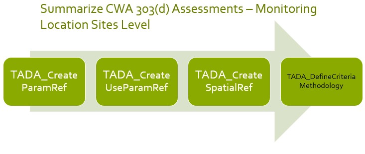
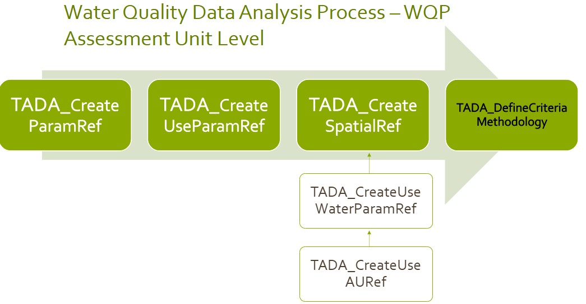

```{r setup, include = F}
library(knitr)

knitr::opts_chunk$set(
  echo = TRUE,
  warning = FALSE,
  message = FALSE,
  eval = T,
  dev.args = list(bg = "transparent")
)
```

# Welcome!

Thank you for your interest in Tools for Automated Data Analysis (TADA).
TADA is an open-source tool set built in the R programming language. The
EPATADA R Package is still under development. New functionality is added
weekly, and sometimes we need to make bug fixes in response to user
feedback. We appreciate your feedback, patience, and interest in these
helpful tools. If you are interested in contributing to TADA
development, more information is available
[here](https://usepa.github.io/EPATADA/articles/CONTRIBUTING.html). We
welcome collaboration with external partners!

## Install and Load the EPATADA R Package

First, install and load the remotes package specifying the repo. This is
needed before installing EPATADA because it is only available on GitHub
(not CRAN).

```{r install_remotes, results = 'hide', eval = F}
install.packages("remotes")
# Load the remotes library
library(remotes)
```

Next, install and load TADA using the remotes package. TADA R Package
dependencies will also be downloaded automatically from CRAN with the
TADA install. You may be prompted in the console to update dependency
packages that have more recent versions available. If you see this
prompt, it is recommended to update all of them (enter 1 into the
console).

```{r install_TADA, eval = F, results = 'hide'}
remotes::install_github("USEPA/EPATADA",
  ref = "develop",
  dependencies = TRUE
)

remotes::install_github("USEPA/rExpertQuery")
```

```{r install_TADA_dev, eval = T, include = F}
remotes::install_github("USEPA/EPATADA",
  ref = "869-incorporate-function-to-read-in-criteria-table-from-tada_communityhub",
  dependencies = TRUE
)
```

Finally, use the **library()** function to load the TADA R Package into
your R session.

```{r library, results = 'hide'}
library(rExpertQuery)
library(EPATADA)
```

**Help pages**

All EPATADA R package functions have their own individual help pages,
listed in the Package index on the
[Reference](https://usepa.github.io/EPATADA/reference/index.html) tab of
the GitHub website. Users can also access the help page for a given
function in R or RStudio using the following format (example below):
`?[name of TADA function]`

```{r help_pages, eval = F}
# Access help page for TADA_CreateAUMLCrosswalk
?TADA_CreateAUMLCrosswalk
```

# Module 3 Functions in TADA

Disclaimer: The EPATADA Module 3 functions were designed to: (1) assist
users with associating Water Quality Portal monitoring locations with
assessment units and designated uses from ATTAINS and (2) compare Water
Quality Portal results with numeric water quality criteria. EPATADA
functions do not constitute current EPA policy or regulatory
requirements. Organizations may choose to use EPATADA as a a tool in
their decision making processes. Use of EPATADA is not required.

# Introduction to TADA Module 3

This [RMarkdown](https://yihui.org/rmarkdown/) document walks users
through how to create WQP and ATTAINS crosswalks that are needed to
define and capture organization specific water quality analysis criteria
and methodologies. This is a continuation of an example TADA workflow
which began with ExampleMod2Workflow.Rmd.

Specifically, this vignette provides an overview of three functions that
can assist users with:

-   Creating a crosswalk (reference table) between ATTAINS parameter
    names, WQP/TADA characteristic names, and TADA comparable data
    identifiers.

-   Creating a crosswalk (reference table) of all unique combinations of
    ATTAINS uses and parameters applicable to your analysis needs.

-   Define and summarize your spatial level of analysis for uses and
    parameters to locations (monitoring locations or assessment units)
    and capture any unique site-specific WQS criteria.

These functions are designed to be flexible so users from states,
tribes, or territories can input organization-specific information and
link its information from ATTAINS. While TADA functions can help
generate these crosswalks and fill in some values, users must review and
modify the tables generated in each step to ensure accuracy. The TADA
team has also incorporated national recommended Clean Water Act (CWA)
EPA 304(a) numeric criteria for optional use in Module 3 functions that
has been filled out and reviewed by the TADA team. This allows users to
analyze their data against the EPA 304(a) criteria; and to easily
compare results when when using EPA 304(a) criteria vs. their own state
or tribe's criteria.

# Getting Started

First, we will load example reference tables (crosswalks) created for
TADA workflow example purposes. These are (1) a ML to AU crosswalk and
(2) a Uses to AU crosswalk. If you would like to learn how these
reference tables were created, see the ExampleMod2Workflow vignette.

```{r load-data}
# import example data set, example AUML crosswalk and example uses to AU crosswalk.
# extract ATTAINS_crosswalk data frame from the list
utils::data(Data_MT_AUMLRef)
MT_AU_MLRef <- Data_MT_AUMLRef$ATTAINS_crosswalk
utils::data(Data_MT_AU_UsesRef)
MT_AU_UsesRef <- Data_MT_AU_UsesRef
```

## Get WQP Monitoring Data in Montana Using TADA_DataRetrieval()

Let's start with an example data frame that has already been through the
data cleaning, wrangling, harmonization, handling of censored data,
removal of suspect results, and other important TADA Module 1 functions.
This process should be completed by users before utilizing Module 2 or 3
functions, so we will go through some minimal cleaning with an example
data set from Montana. Get bacteria and pH data from Missoula County,
Montana.

```{r tada-data, eval = F}
# get MT data
tada.MT <- TADA_DataRetrieval(
  startDate = "2020-01-01",
  endDate = "2022-12-31",
  statecode = "MT",
  characteristicName = c(
    "Escherichia",
    "Escherichia coli",
    "pH"
  ),
  countycode = "Missoula County",
  ask = FALSE
)

# clean up data set (minimal)
tada.MT.clean <- tada.MT |>
  TADA_RunKeyFlagFunctions() |>
  TADA_SimpleCensoredMethods() |>
  TADA_HarmonizeSynonyms()

# remove intermediate objects
rm(tada.MT)
```

This example data set can be loaded from the EPATADA package: 

```{r load_example_data}
utils::data("Data_MT_MissoulaCounty", package = "EPATADA")

tada.MT.clean <- Data_MT_MissoulaCounty
```

This example will focus only on Montana. The remainder of this vignette
will walk through how to fill out two crosswalk tables
(TADA_ParametersForAnalysis and TADA_UsesForAnalysis) that are needed
before we can start assigning applicable criteria and methodologies
information for this specific ATTAINS organization (MTDEQ).

# ATTAINS Domains and Allowable Values

A crosswalk between TADA characteristics and ATTAINS parameters is
needed before we can integrate information from these two data sets.
Before creating the TADA/WQP CharacteristicName and ATTAINS parameter
crosswalk table (TADA_ParametersForAnalysis), let's review all the
unique TADA.ComparableDataIdentifiers (characteristic, fraction and
speciation combinations) in the example data. How many results are
available for each within the example data set?

```{r comparabledataID-counts}
# create table with counts of TADA.ComparableDataIdentifiers
TADA_FieldValuesTable(tada.MT.clean, field = "TADA.ComparableDataIdentifier")
```

In this vignette, we will crosswalk each of these
TADA.ComparableDataIdentifiers to ATTAINS parameter names. ATTAINS has
multiple domains, including the parameter names domain, that have
allowable values. Using the R package rExpertQuery, which provides
functions for downloading tidy data from the ATTAINS public web services
(<https://github.com/USEPA/rExpertQuery>), we can review all ATTAINS
domains (see example below).

```{r ATTAINS-params}
# return ATTAINS parameter domain values
TADA_TableExport(rExpertQuery::EQ_DomainValues("param_name"))
```

In the next section, we will review which parameters have been listed in
ATTAINS in the past for a specific organization. In order to select a
specific organization in the TADA_ParametersForAnalysis() function, we
need to identify the organization id used in ATTAINS. The organization
id for Montana is "MTDEQ".

```{r ATTAINS-orgs}
# return ATTAINS organization domain values
TADA_TableExport(rExpertQuery::EQ_DomainValues("org_id"))
```

# TADA_ParametersForAnalysis() Basics

ATTAINS Parameter Names are more general than the TADA Comparable Data
Identifiers. Therefore, we recommend users provide a crosswalk between
each TADA.ComparableDataIdentifier and ATTAINS.ParameterName.
TADA_ParametersForAnalysis() creates a template which includes all
TADA.ComparableDataIdentifiers from the TADA data frame and contains a
blank column, "ATTAINS.ParameterName" for users to input the
corresponding ATTAINS parameter name.

TADA_ParametersForAnalysis() includes an argument input 'auto_assign' to
assist users in finding an alias name between TADA Characteristic Names
to ATTAINS Parameter Name, if one is found. It is important to note that
even with these exact matches, there are additional complexities related
to fraction, speciation and units that may be unique to your
organization. For example, some organizations may consider Total
Nitrogen, Nitrate/Nitrite, and Ammonia all to match the ATTAINS
parameter "Nitrogen", while others may consider only some
fraction/speciation combinations analogous to the ATTAINS parameter
"Nitrogen".

Setting "excel = TRUE" in TADA_ParametersForAnalysis tells the function
to create an Excel spreadsheet of the reference table for review and
editing. The excel output includes logic to help a user select ATTAINS
parameter names that have been used in the past by the selected
organization. If users do not want to work in Excel, they can use "excel
= FALSE" to return a data frame. The data frame can be edited directly
in R if desired, although there are no TADA-specific functions designed
to facilitate this.

When using TADA_ParametersForAnalysis(), users should specify the
organization(s) of interest in the "org_id" argument. This ensures that
the correct number of rows will be created in the reference table. When
"excel = TRUE", specifying the organization(s) also creates a separate
tab in the Excel file which contains the parameter names used in prior
assessment cycles by the specified ATTAINS organization(s). This will
allow users to decide whether to continue to use the same ATTAINS
parameter names from prior assessments that their organizations(s) have
used in the past, or to use other valid parameter names from the entire
ATTAINS domain list.

Keep in mind that only parameter names previously entered in ATTAINS by
the selected organization(s) will be returned. Many organization only
input parameters that are causes in ATTAINS. This means that
TADA_ParametersForAnalysis() may not return all parameters required by
an organization's assessment methodology if some parameters have never
been listed as a cause. If there is not a suitable ATTAINS parameter
name to match a TADA.ComparableDataIdentifier, users should contact the
ATTAINS team (attains\@epa.gov) for assistance.

For our first example, we will specify Montana's organization identifier
("MTDEQ") as our ATTAINS organization identifier of interest. By
default, auto_assign = "None" which will not populate any entries for
the ATTAINS.ParameterName column, and users will need to manually fill
this crosswalk out.

```{r auto_assign-none}
# create TADA parameter reference table for specified organization
MT.ParamRef.None <- TADA_ParametersForAnalysis(
  tada.MT.clean,
  org_id = c("MTDEQ"),
  auto_assign = "None",
  excel = FALSE
  # uncomment to run the excel file
  # excel = TRUE, overwrite = TRUE
)

TADA_TableExport(MT.ParamRef.None)
```

### Auto_assign Options

Now, let's see what happens we we use auto_assign = 'All' to
autopopulate characteristic alias matches. The auto assignment will
create exact matches based on the entire list of allowable ATTAINS
parameters. This means that parameter names your organization has not
previously record in ATTAINS may be included in the assignments.

```{r auto_assign-All}
# create TADA parameter reference table for specified organization
MT.ParamRef.All <- TADA_ParametersForAnalysis(
  tada.MT.clean,
  org_id = c("MTDEQ"),
  auto_assign = "All",
  excel = FALSE
  # excel = TRUE, overwrite = TRUE
)

TADA_TableExport(MT.ParamRef.All)
```

Another option is to set auto_assign = 'Org'. This limits the
characteristic alias matches to return only ATTAINS.ParameterNames that
an organization has used in the past.

```{r auto_assign-Org}
# create TADA parameter reference table for specified organization
MT.ParamRef.Org <- TADA_ParametersForAnalysis(
  tada.MT.clean,
  org_id = c("MTDEQ"),
  auto_assign = "Org",
  excel = FALSE
  # uncomment excel = TRUE, overwrite = TRUE to run the excel file
  # excel = TRUE, overwrite = TRUE
)

TADA_TableExport(MT.ParamRef.Org)
```

### Manual Parameter Crosswalk

The code chunk below demonstrates how the parameter reference table can
be modified in R.

```{r Manually-Create-ParamRef}
# only run the code chunks below if you make edits to the excel file. Please note you must open and save the excel file at least once to reflect all Excel formula based values.

# downloads_path <- file.path(Sys.getenv("USERPROFILE"), "Downloads", "myfileRef.xlsx")
# ParamRef <- openxlsx::read.xlsx(downloads_path, sheet = "CreateParamRef")

# MT.ParamRef_Excel <- TADA_ParametersForAnalysis(
#   Data_NCTC,
#   org_id = c("MTDEQ"),
#   paramRef = ParamRef,
#   excel = TRUE, overwrite = TRUE
#   )

MT.ParamRef.manual <- MT.ParamRef.None |>
  dplyr::mutate(ATTAINS.ParameterName = dplyr::case_when(
    grepl("PH_NONE_NONE_NONE", TADA.ComparableDataIdentifier) ~ "PH",
    grepl("ESCHERICHIA COLI", TADA.ComparableDataIdentifier) ~ "ESCHERICHIA COLI (E. COLI)"
  )) |>
  dplyr::bind_rows(data.frame(TADA.ComparableDataIdentifier = "PH_NONE_NONE_NONE", ATTAINS.ParameterName = "PH, HIGH", ATTAINS.OrganizationIdentifier = "MTDEQ"))

TADA_TableExport(MT.ParamRef.manual)
```

### Provide a User Supplied paramRef

Once modifications are complete, we can re-run
TADA_ParametersForAnalysis using the modified parameter reference table
as the input for "paramRef". This will update the
ATTAINS.FlagParameterName column in the parameter reference table (see
example below). This column provides information about whether or not
the organization specified in the "ATTAINS.OrganizationIdentifier"
column has listed this parameter as a cause in prior assessment cycles.
It also flags rows where the TADA.ComparableDataIdentifier as not been
assigned an ATTAINS parameter name.

```{r User-Supplied-ParamRef}
MT.ParamRef.user.supplied <- TADA_ParametersForAnalysis(
  tada.MT.clean,
  org_id = c("MTDEQ"),
  paramRef = MT.ParamRef.manual,
  excel = FALSE
  # uncomment excel = TRUE, overwrite = TRUE to run the excel file
  # excel = TRUE, overwrite = TRUE
)

TADA_TableExport(MT.ParamRef.user.supplied)
```

### Review, Save and Re-Use paramRef

Once the parameter reference table has been reviewed and modified, it
can be saved and reused for analysis of future TADA data frames. This
process is useful to help identify if new WQP characteristics (or new
fraction/speciations) are being queried in your most up to date WQP
query and to allow you to review how to handle these new additions.

If new WQP characteristics (or new fraction/speciations) do show up,
your user supplied 'paramRef' is prioritized over the 'auto_assign'
argument inputs. The auto_assign option will allow you to fill in any
remaining blank ATTAINS.ParameterName that you have not filled in but
will not replace any cross walk that you have defined in your user
supplied crosswalk. In our case, since each unique
TADA.ComparableDataIdentifier was cross walked to an
ATTAINS.ParameterName in the user supplied 'MT.ParamRef_user_supplied,
this table will be the same.

```{r finalize-paramRef}
MT.ParamRef.Final <- TADA_ParametersForAnalysis(
  tada.MT.clean,
  org_id = c("MTDEQ"),
  paramRef = MT.ParamRef.user.supplied,
  auto_assign = "All",
  excel = FALSE
  # uncomment excel = TRUE, overwrite = TRUE to run the excel file
  # excel = TRUE, overwrite = TRUE
)

# Test if the two data frames are same or not.
identical(MT.ParamRef.Final[1:4], MT.ParamRef.user.supplied[1:4])

TADA_TableExport(MT.ParamRef.Final)
```

Remove intermediate variable, we will keep only the crosswalk tables
that are relevant for the remaining workflow.

```{r remove-intermediate-variables}
rm(MT.ParamRef.All, MT.ParamRef.manual, MT.ParamRef.None, MT.ParamRef.Org, MT.ParamRef.user.supplied)
```

# TADA_UsesForAnalysis() Basics

Users will review the output of this function and select which
ATTAINS.UseName(s) and associated ATTAINS.ParameterName(s), for your
specified ATTAINS organization(s), are applicable for analysis. Later in
the analysis process, users will define the criteria and methodologies
that are applicable to each ATTAINS use name and parameter name marked
as “Include.” If an ATTAINS.UseName is not applicable for that given
ATTAINS.ParameterName, select “Exclude.” Deleting the row is allowed,
but we recommend labeling it as “Exclude” to document that it has been
reviewed. If an ATTAINS.UseName needs to be added for an
ATTAINS.ParameterName, append an additional row to capture this.

For any remaining ATTAINS parameter name(s) that are not included by an
organization in prior assessment cycles, they will not have any
associated prior use names. In this case, users must manually assign the
appropriate ATTAINS.UseName under the column 'ATTAINS.UseName'. They may
need to add additional rows if the parameter applies to multiples uses.
Alternatively, users can choose to use the 'auto_assign' to assign all
unique ATTAINS.UseName by ATTAINS.OrganizationName to any
ATTAINS.ParameterName missing a use name associated with it.

We will start off with the simple use case in which TADA users can run
this function with just the TADA dataframe, paramRef input and org_id
input.

#### Manual assignment of new ATTAINS parameter names to ATTAINS use names

In the example below, we can see "PH" and "ESCHERICHIA COLI (E. COLI)"
as the ATTAINS.ParameterNames that were assessed in prior assessment
cycles for MTDEQ (see ATTAINS.FlagUseName column in NCTC_usesRef). "PH,
HIGH" was not listed in ATTAINS for MTDEQ in the prior assessment cycle,
but was included as a parameter name MTDEQ would like to assess for in
this current assessment cycle. Thus, the ATTAINS.UseName is left blank
for "PH, HIGH".

```{r usesRef-Manual}
MT.UsesRef.manual <- TADA_UsesForAnalysis(
  tada.MT.clean,
  org_id = c("MTDEQ"),
  paramRef = MT.ParamRef.Final,
  usesRef = NULL,
  AU_UsesRef = NULL,
  AUMLRef = NULL,
  auto_assign = FALSE,
  excel = FALSE
  # uncomment excel = TRUE, overwrite = TRUE to run the excel file
  # excel = TRUE, overwrite = TRUE
)

TADA_TableExport(MT.UsesRef.manual)
```

If desired, a user can manually assign "PH, HIGH" to any applicable uses
(disclaimer: this is for demonstration purposes only and does not
reflect MTDEQ's criteria and assessment process).

```{r usesRef-Manual-Update}
add.data <- data.frame(
  "ATTAINS.OrganizationIdentifier" = "MTDEQ",
  "ATTAINS.ParameterName" = rep("PH, HIGH", 2),
  "ATTAINS.UseName" = c(
    "Aquatic Life",
    "Agriculture"
  )
)

UsesRef <- MT.UsesRef.manual |>
  dplyr::left_join(add.data, by = c("ATTAINS.OrganizationIdentifier", "ATTAINS.ParameterName"), keep = FALSE) |>
  dplyr::mutate(ATTAINS.UseName = dplyr::coalesce(ATTAINS.UseName.x, ATTAINS.UseName.y)) |>
  dplyr::select(-c(ATTAINS.UseName.x, ATTAINS.UseName.y)) |>
  dplyr::mutate(IncludeOrExclude = "Include")
```

The output of UsesRef will not reflect changes to the
ATTAINS.FlagUseName column. To do so, we need to re run
TADA_UsesForAnalysis() with usesRef = add_data as an argument input.

```{r usesRef-Manual-Update2}
# PH will now reflect the changes
MT.UsesRef.manual.Update <- TADA_UsesForAnalysis(
  tada.MT.clean,
  org_id = c("MTDEQ"),
  paramRef = MT.ParamRef.Final,
  usesRef = UsesRef, # Edits were made to usesRef, updates flag column
  AU_UsesRef = NULL,
  AUMLRef = NULL,
  auto_assign = FALSE,
  excel = FALSE
  # uncomment excel = TRUE, overwrite = TRUE to run the excel file
  # excel = TRUE, overwrite = TRUE
)

TADA_TableExport(MT.UsesRef.manual.Update)
```

#### Auto_assign assignment of new ATTAINS parameter names to ATTAINS use names

Alternatively, we can choose to assign all unique use names that was
submitted in prior ATTAINS assessment cycles, by your organization to
those ATTAINS.ParameterName without any associated ATTAINS.UseName.
Users will need to review this assignment carefully, choose include or
exclude appropriately, and include additional rows as needed if there
are more ATTAINS.UseName applicable for that ATTAINS.ParameterName that
was not captured by the auto_assign method.

```{r usesRef-auto}
MT.UsesRef.auto <- TADA_UsesForAnalysis(
  tada.MT.clean,
  org_id = c("MTDEQ"),
  paramRef = MT.ParamRef.Final,
  usesRef = NULL,
  AU_UsesRef = NULL,
  AUMLRef = NULL,
  auto_assign = TRUE, # specifies auto_assign to those ATTAINS.ParameterName without any associated ATTAINS.UseName
  excel = FALSE
  # uncomment excel = TRUE, overwrite = TRUE to run the excel file
  # excel = TRUE, overwrite = TRUE
)
TADA_TableExport(MT.UsesRef.auto)
```

# **Advanced: Deep Dive into `TADA_UsesForAnalysis()`**

Users may have their own set of use names to associate with parameter
names or may have completed an AU to uses crosswalk in prior TADA
workflow. We will go through an in-depth use case and go through four
options to help users with associating use names with parameter names
which are prioritized as follows:

1.  **User supplied usesRef** An optional crosswalk. This will contain
    the completed crosswalk for ATTAINS.UseName(s) that are associated
    with ATTAINS.ParameterName(s).

    -   All uses and parameters in this crosswalk will be returned in
        the output. No rows are removed.

    -   For any parameters in your paramRef (required input) that could
        not be cross walked to a use name, if auto_assign = FALSE then
        the ATTAINS.UseName value will be left blank. If auto_assign =
        TRUE, then all unique use names from either your AU_UsesRef or
        from prior ATTAINS assessment cycles will be returned (see
        option 2 and 4 below).

2.  **User supplied AU_UsesRef** An optional crosswalk. This user
    supplied table will contain the most up-to-date use names by
    assessment unit determined by the TADA user. Users can filter down
    the water types or assessment units of interest in this crosswalk.

    -   For any use names already present in ATTAINS, only those prior
        parameter and use combinations will be returned from prior
        assessment cycles filtered by any water types found in this
        reference table.

    -   If AU_UsesRef includes modified or new use names (i.e., not
        currently found in ATTAINS), TADA attempts to join those new use
        name by water type to prior assessment cycles for your org.
        Next, it will associate and return those parameters with the new
        use names found in your reference table by those water types.

    -   For any parameters in your paramRef (required input) that could
        not be cross walked to a use name, if auto_assign = FALSE then
        the ATTAINS.UseName value will be left blank. If auto_assign =
        TRUE, then all unique use names found in your AU_UsesRef will be
        assigned to that ATTAINS.ParameterName.

3.  **User supplied AUMLRef** An optional crosswalk.

    -   If users do not provide an AU_UsesRef input along with this
        crosswalk, TADA will run **`TADA_AssignUsesToAU()`** and assign
        uses to those AU with default values from ATTAINS. In this
        scenario all uses will come from prior ATTAINS assessments,
        filtered by the use names associated with these assessment
        unit's water types.

    -   If users provide both an AU_UsesRef and an AUMLRef, this
        function will filter the AU_UsesRef by the AUs found in the
        AUMLRef.

    -   The output of this function will then run similarly to option 2
        using the AU_UsesRef that has been modified accordingly from
        above.

4.  **From Prior ATTAINS assessment cycles**: Pulls in all prior ATTAINS
    use names that have been associated with any parameter names
    (ATTAINS.ParameterName) found in your paramRef crosswalk for the
    specified ATTAINS organization. Data is retrieved from prior ATTAINS
    assessment cycles via ATTAINS ExpertQuery web services. This is the
    same as the basic use case under 'TADA_UsesForAnalysis() Basics'
    section of this vignette.

#### Option 1: User supplied usesRef

Users can choose to supply their own UsesRef as an argument input. Users
who have gone through the workflow of reviewing a parameters to uses
crosswalk can save this file and reuse it by supplying it as a usesRef
input. If your organization has made significant changes to the names of
the uses in the current cycle (cannot be retrieved from the prior
ATTAINS assessment cycle) or if there are just additional use names that
were unable to be retrieved from the prior assessment cycle, users can
provide these updates here.

(Note: TADA functions leverages the ATTAINS assessment profiles which
will not reflect any submitted use name changes to ATTAINS until the
next assessment cycle is approved. In addition, it may not be possible
to retrieve every use and parameter name combination from ATTAINS as it
is dependent on what information each organization has submitted to
ATTAINS.)

In this example, let's use a filled out criteria table for MTDEQ and
extract the use and parameters from the crosswalk. TADA has created the
TADACommunityHub in which TADA users can submit, share and maintain
user-contributed criteria and methodologies templates to support
reproducible and efficient analyses. We will use
**`TADA_LoadCriteriaFile()`** to pull in this criteria table from the
TADACommunityHub GitHub repository.

We can see that MTDEQ has additional rows of uses associated with E.
Coli that was unable to be retrieved from ATTAINS. We also see PH was
not found in the user supplied UsesRef table. We will assume MTDEQ has
forgotten to include PH in their table and showcase the importance of
considering all readily available data from your WQP data retrieval that
you may need to consider for analysis.

```{r usesRef-User-Supplied}
# Load the example MTDEQ criteria table
criteria_table <- TADA_LoadCriteriaFile(org_id = "MTDEQ")

# extract the parameter and uses from this table
user.supplied.MT.data <- dplyr::select(criteria_table, ATTAINS.OrganizationIdentifier, TADA.ComparableDataIdentifier, TADA.CharacteristicName, ATTAINS.ParameterName, ATTAINS.UseName)

# run TADA_UsesForAnalysis and filter the table to ATTAINS.ParameterName(s) found in your paramRef arg input.
MT.UsesRef.manual.user.supplied <- TADA_UsesForAnalysis(
  tada.MT.clean,
  org_id = c("MTDEQ"),
  paramRef = MT.ParamRef.Final,
  usesRef = user.supplied.MT.data,
  AU_UsesRef = NULL,
  AUMLRef = NULL,
  auto_assign = FALSE,
  excel = FALSE
  # uncomment excel = TRUE, overwrite = TRUE to run the excel file
  # excel = TRUE, overwrite = TRUE
)

TADA_TableExport(MT.UsesRef.manual.user.supplied)
```

#### Option 2: User has completed a Uses to AU crosswalk

Now, if you’ve assigned uses to AUs (see ExampleMod2Workflow.Rmd), pass
that table as the AU_UsesRef. In this scenario, use names for your
analysis will be populated from your defined uses in AU_UsesRef rather
than prior ATTAINS cycles (Note: if all use names defined in your
AU_UsesRef come from prior use names in ATTAINS then it will be still
come from ATTAINS as the source.)

If your AU_UsesRef contains any use name not currently found in ATTAINS
for your defined org_id(s) then this use name will get assigned to each
unique ATTAINS.ParameterName. For use names that are already found in
ATTAINS, the associated ATTAINS.ParameterName will be filtered if they
are only associated with certain ATTAINS.UseName in prior assessment
cycles.

Note: In the MT.UsesRef.auto example, all use names are found in
prior ATTAINS assessment cycles for MTDEQ, so the tables should be
identical to MT.UsesRef.with.AU_UsesRef.

```{r usesRef-with-AU_UsesRef}
# uses will come from the user supplied reference table produced in ExampleMod2Workflow.Rmd
utils::data(Data_MT_AU_UsesRef)

MT.UsesRef.manual.AU_UsesRef <- TADA_UsesForAnalysis(
  tada.MT.clean,
  org_id = c("MTDEQ"),
  paramRef = MT.ParamRef.Final,
  usesRef = NULL,
  AU_UsesRef = Data_MT_AU_UsesRef, # uses will be sourced here
  AUMLRef = NULL,
  auto_assign = FALSE,
  excel = FALSE
  # excel = TRUE, overwrite = TRUE
)

TADA_TableExport(MT.UsesRef.manual.AU_UsesRef)
```

Now, lets show the output when we turn auto_assign = TRUE

```{r usesRef-auto-AU_UsesRef}
MT.UsesRef.auto.AU_UsesRef <- TADA_UsesForAnalysis(
  tada.MT.clean,
  org_id = c("MTDEQ"),
  paramRef = MT.ParamRef.Final,
  usesRef = NULL,
  AU_UsesRef = Data_MT_AU_UsesRef, # uses will be sourced here.
  AUMLRef = NULL,
  auto_assign = TRUE, # turn auto_assign on
  excel = FALSE
  # excel = TRUE, overwrite = TRUE
)

TADA_TableExport(MT.UsesRef.auto.AU_UsesRef)
```

#### Option 3A: User has completed an AU to ML crosswalk but not AU to Uses

While it is recommended for users who have created an AU to ML crosswalk
to run **`TADA_AssignUsesToAU`** to create the AU_UsesRef crosswalk, it
is not a requirement to do so. In this scenario users can provide the
AUMLRef crosswalk to filter only use names that may be associated with
those assessment units in your data frame of interest.

Let's go ahead and pull in our AUMLRef crosswalk created in
TADAModule2.Rmd vignette. We will compare the output of
**`TADA_UsesForAnalysis`** for assessment units for MTDEQ for the case
in which water type is 'LAKE, FRESHWATER' versus 'RIVER'.

```{r retrieve-AUMLRef}
# This AUMLRef will come from the user supplied reference table produced in TADAModule2.Rmd
utils::data(Data_MT_AUMLRef)

AUMLRef.MT <- Data_MT_AUMLRef$ATTAINS_crosswalk

# pulls in a single assessment unit that is a lake
AUMLRef.MT76F007_010 <- dplyr::filter(AUMLRef.MT, ATTAINS.AssessmentUnitIdentifier == "MT76F007_010")

# pulls in a single assessment unit that is a river
AUMLRef.MT76M004_070 <- dplyr::filter(AUMLRef.MT, ATTAINS.AssessmentUnitIdentifier == "MT76M004_070")
```

Now, let's compare the assignments of uses and parameters in these two
scenarios.

Question: What differences do we see between the two outputs for 'LAKE,
FRESHWATER' versus 'RIVER'?

```{r usesRef-with-AUMLRef-lake}
MT.UsesRef.manual.MT76F007_010 <- TADA_UsesForAnalysis(
  tada.MT.clean,
  org_id = c("MTDEQ"),
  paramRef = MT.ParamRef.Final,
  usesRef = NULL,
  AU_UsesRef = NULL,
  AUMLRef = AUMLRef.MT76F007_010, # select appropriate crosswalk
  auto_assign = FALSE,
  excel = FALSE
  # excel = TRUE, overwrite = TRUE
)

TADA_TableExport(MT.UsesRef.manual.MT76F007_010)
```

```{r usesRef-with-AUMLRef-river}
MT.UsesRef.manual.MT76M004_070 <- TADA_UsesForAnalysis(
  tada.MT.clean,
  org_id = c("MTDEQ"),
  paramRef = MT.ParamRef.Final,
  usesRef = NULL,
  AU_UsesRef = NULL,
  AUMLRef = AUMLRef.MT76M004_070, # select appropriate crosswalk
  auto_assign = FALSE,
  excel = FALSE
  # excel = TRUE, overwrite = TRUE
)

TADA_TableExport(MT.UsesRef.manual.MT76M004_070)
```

What do we see with auto_assign for this lake assessment unit?

```{r usesRef-autoassign-AUMLRef-lake}
MT.UsesRef.auto.MT76F007_010 <- TADA_UsesForAnalysis(
  tada.MT.clean,
  org_id = c("MTDEQ"),
  paramRef = MT.ParamRef.Final,
  usesRef = NULL,
  AU_UsesRef = NULL,
  AUMLRef = AUMLRef.MT76F007_010, # select appropriate crosswalk
  auto_assign = TRUE,
  excel = FALSE
  # excel = TRUE, overwrite = TRUE
)

TADA_TableExport(MT.UsesRef.auto.MT76F007_010)
```

#### Option 3B: Both AUMLRef and AU_UsesRef are provided

Now let's supply both an AUMLRef and an AU_UsesRef. We will use the
filtered AUMLRef as our input along with the full AU_UsesRef defined
earlier.

```{r usesRef-with-AUMLRef-and-AU_UsesRef-river}
MT.UsesRef.manual.3B <- TADA_UsesForAnalysis(
  tada.MT.clean,
  org_id = c("MTDEQ"),
  paramRef = MT.ParamRef.Final,
  usesRef = NULL,
  AU_UsesRef = Data_MT_AU_UsesRef, # define AU_UsesRef
  AUMLRef = AUMLRef.MT76F007_010, # select appropriate crosswalk
  auto_assign = FALSE,
  excel = FALSE
  # excel = TRUE, overwrite = TRUE
)

TADA_TableExport(MT.UsesRef.manual.3B)
```

#### Review, Save and Re-Use usesRef

Once the uses to parameter reference table has been reviewed and
modified, it can be saved and reused for analysis of future TADA data
frames. This process is useful to help identify if any new WQP
characteristics (or new fraction/speciations) are being queried in your
most up to date WQP query and to allow you to review how to handle
assigning ATTAINS uses to these new additions.

If new WQP characteristics (or new fraction/speciations) do show up,
your user supplied 'usesRef' is prioritized in the 'auto_assign'
argument inputs. Thus, the auto_assign option will allow you to fill in
any remaining blank ATTAINS.UseName to an ATTAINS.ParameterName that you
have not filled in but will not replace any cross walk that you have
defined in your user supplied crosswalk.

```{r finalize-usesRef}
MT.UsesRef.Final <- TADA_UsesForAnalysis(
  tada.MT.clean,
  org_id = c("MTDEQ"),
  paramRef = MT.ParamRef.Final,
  usesRef = MT.UsesRef.manual.user.supplied,
  AU_UsesRef = NULL,
  AUMLRef = NULL,
  auto_assign = TRUE,
  excel = FALSE
  # uncomment excel = TRUE, overwrite = TRUE to run the excel file
  # excel = TRUE, overwrite = TRUE
)

# Test if the two data frames are same or not.
identical(MT.UsesRef.Final[, 1:5], MT.UsesRef.manual.user.supplied[, 1:5])

TADA_TableExport(MT.UsesRef.Final)
```

remove intermediate variable, keep only the crosswalk table that we will
continue to use in the workflow.

```{r remove-intermediate-variables-useParam}
rm(MT.UsesRef.auto, user.supplied.MT.data, MT.UsesRef.manual, MT.UsesRef.manual.Update)
```

# TADA_MLSummary(): Create and Define Spatial Reference Tables

We can define your WQP data set on either an assessment unit level
summary or monitoring location sites level. Please refer to EPATADA
Module 2 for more information on the geospatial functions to assist with
assessment unit and monitoring location overlay.

The general workflow of running module 3 functions for CWA water quality
data analysis is shown below.





## Define Spatial Summary by Monitoring Location (ML)

Let's start off with a ML summary of MTDEQ data frame. By default, we
will only display rows for parameters and uses for a ML if it contains
data collected for that TADA.CharacteristicName in your WQP data query.
If you would like to display all information even for sites with no WQP
data, please choose displayNA = TRUE

```{r ML_Summary}
MT.MLSummaryRef.ML <- TADA_MLSummary(
  .data = tada.MT.clean,
  usesRef = MT.UsesRef.Final,
  org_id = "MTDEQ",
  displayNA = TRUE,
  excel = FALSE
  # excel = TRUE, overwrite = TRUE
)

TADA_TableExport(MT.MLSummaryRef.ML)
```

## Define Spatial Summary by Monitoring Location (AU)

Now let's compare this to the AU level of summary. To provide the ML to
AU level of summary, this requires an AUML crosswalk and an AU_UsesRef,
we recommend you to review the ExampleMod2Workflow vignette for more in
depth information on this crosswalk. We will load these example
reference tables into this vignette.

We now have all assignments of ATTAINS Uses, ATTAINS Parameters, and WQP
Monitoring Location Sites to each AU defined. Users can do a final
review to ensure all assignments are correct.

Note: By default, we will only display rows for parameters and uses for
a ML if it contains data collected for that TADA.CharacteristicName in
your WQP data query. If you would like to display all information even
for sites with no WQP data, please choose displayNA = TRUE

```{r AU_Summary, eval = FALSE}
# Load the dataset
utils::data("Data_MT_AU_UsesRef_Water", package = "EPATADA")

MT.MLSummaryRef.AU <- TADA_MLSummary(
  .data = tada.MT.clean,
  usesRef = MT.UsesRef.Final,
  AU_UsesRef = Data_MT_AU_UsesRef_Water, # uses will come from the user supplied reference table produced in ExampleMod2Workflow.Rmd
  AUMLRef = MT_AU_MLRef,
  org_id = "MTDEQ",
  displayNA = FALSE,
  excel = FALSE
  # excel = TRUE, overwrite = TRUE
)

TADA_TableExport(MT.MLSummaryRef.AU)
```

## Assign site-specific spatial criteria

We can apply any unique spatial criteria on a monitoring location sites
level. This view allows us to determine whether there are certain sites
that needs a unique site-specific criteria, certain water types, or
certain combination of characteristics that have site-specific criteria.
Let's go through an example of how a user may modify this table.

```{r apply-site-specific-criteria, eval = FALSE}
MT.MLSummaryRef.AU2 <- MT.MLSummaryRef.AU |>
  dplyr::mutate(
    UniqueSpatialCriteria = dplyr::case_when(
      MonitoringLocationIdentifier == "MTVOLWQM_WQX-CLEARWATERR_1" ~ "Example Site Specific"
    )
  )

TADA_TableExport(MT.MLSummaryRef.AU2)
```

Compare the nrow for each of the ML versus AU level of summary. The AU
level of summary is further filtered down by the AU to ML crosswalk, the
use to AU crosswalk, and the use to parameter crosswalk based on what
TADA.ComparableDataIdentifier has been collected at those sites and
taking into consideration of what parameter(s) and use(s) have been
assessed for each assessment unit. (Note: Would users find it useful to
still include a parameter and use for a site even if the site does not
contain that TADA.ComparableDataIdentifier - the ATTAINS.ParameterName?
This could be included in the final summary table and labeled as NA or
insufficient data.)

```{r compare-AU-versus-ML-Summary, eval = FALSE}
nrow(MT.MLSummaryRef.AU)
nrow(MT.MLSummaryRef.ML)
```

# TADA DefineCriteriaMethodology()

Now, lets get to generating the criteria and methodology file for MTDEQ
to fill out. We will showcase how this table will be generated for the
first time using the recommended step-by-step workflow and showcase how
a user can go about updating their criteria and methodology file as
needed.

First, let's show how our step-by-step process all come together. Users
will need to fill out this template that is generated. It is highly
recommended to export this to the excel spreadsheet to show the
allowable values and easy interface for inputs to the table.

```{r step-by-step-output}
MT.CriteriaMethods <- TADA_DefineCriteriaMethodology(
  .data = tada.MT.clean,
  org_id = "MTDEQ",
  MLSummaryRef = MT.MLSummaryRef.ML,
  excel = FALSE
  # excel = TRUE, overwrite = TRUE
)

TADA_TableExport(MT.CriteriaMethods)
```

Now, if MTDEQ, already has a filled out/partially filled out criteria
methods table, let's provide this as an argument input. criteria_table
is an example of a criteria table that has been filled out by a few R8
states and tribes.

Note: Whenever a criteriaMethods argument input value is provided, users
will be warned if there are additional WQP characteristics (or
TADA.ComparableDataIdentifier - see argument input uniqueDataId =
TRUE/FALSE in the R documentation for more information) that are not
captured in their user supplied table. Thus, auto_assign defaults to
TRUE even if it is specified as FALSE.

```{r user-supplied-output}
MT.CriteriaMethods.user.supplied <- TADA_DefineCriteriaMethodology(
  .data = tada.MT.clean,
  org_id = "MTDEQ",
  MLSummaryRef = NULL,
  criteriaMethods = criteria_table,
  excel = FALSE
  # excel = TRUE, overwrite = TRUE
)

TADA_TableExport(MT.CriteriaMethods.user.supplied)
```

You can append EPA304(a) recommended standards by specifying "USEPA" as
part of org_id (if there is one found for a TADA.CharacteristicName)

```{r append-epa304a-recommended-standards}
MT.CriteriaMethods.user.supplied2 <- TADA_DefineCriteriaMethodology(
  .data = tada.MT.clean,
  org_id = c("MTDEQ", "USEPA"),
  MLSummaryRef = NULL,
  criteriaMethods = criteria_table,
  displayUniqueId = TRUE,
  excel = FALSE
  # excel = TRUE, overwrite = TRUE
)

TADA_TableExport(MT.CriteriaMethods.user.supplied2)
```

### Review, Save and Re-Use Criteria and Methodology Table

Once the criteria and methodology table has been reviewed and modified,
it can be saved and reused for analysis of future TADA data frames. This
process is useful to help identify if any new WQP characteristics (or
new fraction/speciations) are being queried in your most up to date WQP
query and to allow you to determine if an assessment magnitude value
should be developed.

For our example, we will use MT.CriteriaMethods_User_Supplied2 and fill
in the remaining blank PH magnitude values with a range between 6.5 and
8.5 as MTDEQ criteria of interest.

```{r finalize-criteria-table}
# We will fill in PH magnitude values for this example
MT.CriteriaMethods.Final <- MT.CriteriaMethods.user.supplied2 |>
  dplyr::mutate(MagnitudeValueLower = dplyr::case_when(
    grepl("PH_NONE_NONE_NONE", TADA.ComparableDataIdentifier) & ATTAINS.OrganizationIdentifier == "MTDEQ" ~ 6.5,
    TRUE ~ MagnitudeValueLower
  )) |>
  dplyr::mutate(MagnitudeValueUpper = dplyr::case_when(
    grepl("PH_NONE_NONE_NONE", TADA.ComparableDataIdentifier) & ATTAINS.OrganizationIdentifier == "MTDEQ" ~ 8.5,
    TRUE ~ MagnitudeValueUpper
  ))

TADA_TableExport(MT.CriteriaMethods.Final)
```

We will supply this final crosswalk table to be reused and validated.

```{r re-use-criteria-table}
MT.CriteriaMethods.Final2 <- TADA_DefineCriteriaMethodology(
  .data = tada.MT.clean,
  org_id = "MTDEQ",
  MLSummaryRef = NULL,
  criteriaMethods = MT.CriteriaMethods.Final,
  displayUniqueId = TRUE,
  excel = FALSE
  # excel = TRUE, overwrite = TRUE
)

TADA_TableExport(MT.CriteriaMethods.Final2)
```
