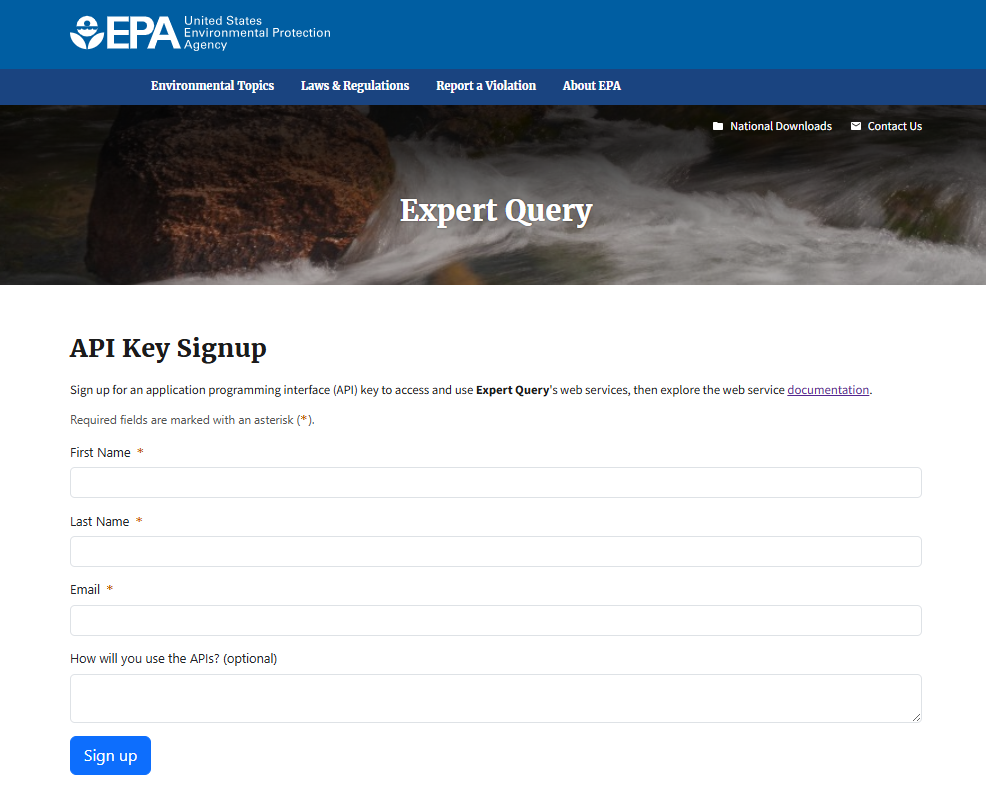

```{r setup, include = F}
library(knitr)

knitr::opts_chunk$set(
  echo = TRUE,
  warning = FALSE,
  message = FALSE,
  eval = T,
  dev.args = list(bg = "transparent")
)
```

# Overview and Setup

**Welcome!**

Thank you for your interest in Tools for Automated Data Analysis (TADA).
TADA is an open-source tool set built in the R programming language.
This [RMarkdown](https://bookdown.org/yihui/rmarkdown/) document walks
users through how to download the TADA R package from GitHub, access and
parameterize several important functions, and create basic
visualizations with a sample data set.

**Note:** TADA is still under development. New functionality is added
weekly, and sometimes we need to make bug fixes in response to tester
and user feedback. We appreciate your feedback, patience, and interest
in these helpful tools.

If you are interested in contributing to TADA development, more
information is available at:

[Contributing](https://usepa.github.io/EPATADA/articles/CONTRIBUTING.html)

We welcome collaboration with external partners.

## Geospatial Functions in TADA

This example Module 2 workflow focuses on the following tasks:

A)  **Creating a ML/AU Crosswalk**: Use **`TADA_CreateAUMLCrosswalk`**
    to establish a crosswalk between ATTAINS assessment units and WQP
    monitoring locations.

B)  **Map Review**: Utilize **`TADA_ViewATTAINS`** to review assessment
    units and monitoring locations on a map, ensuring accuracy and
    completeness.

C)  **Submitting the Crosswalk**: Employ
    **`TADA_UpdateATTAINSAUMLCrosswalk`** to submit an up-to-date
    assessment unit/WQP monitoring location crosswalk to ATTAINS.

D)  **Assigning Uses**: Use **`TADA_AssignUsesToAU`** to assign specific
    uses to the assessment units.

**A Note About ATTAINS:**

The Assessment, Total Maximum Daily Load (TMDL) Tracking and
Implementation System ([ATTAINS](https://www.epa.gov/waterdata/attains))
is an online platform that organizes and combines each state and
participating tribe's Clean Water Act reporting data into a single data
repository. The geospatial component of ATTAINS includes spatial
representations of each entity's surface water assessment units as well
as their assigned designated uses, their most recent EPA reporting
category (i.e., their impairment status), their impaired designated
uses, and the parameter(s) causing the impairment.

Within an assessment unit, the criteria or thresholds used to assess
water quality typically remain the same and all water features are
assessed as one entity (although there are some exceptions, for example
if a single assessment unit crosses multiple ecoregions). Depending on
the state or tribe, these assessment units can be a specific point or
series of points along a waterbody such as a river or lake, a river
reach (line), an entire waterbody such as a river or lake (polygon), or
even an entire watershed. In other words, assessment units can take the
form of point, line, and area (polygon) features, or some combination of
all of them. Moreover, it is possible that some assessment units are not
geospatially referenced at all, meaning they are not captured in the
ATTAINS geospatial database.

## Install and Load the EPATADA R Package

First, install and load the remotes package specifying the repo. This is
needed before installing EPATADA because it is only available on GitHub
(not CRAN).

```{r install_remotes, results = 'hide', eval = F}
install.packages("remotes")
# Load the remotes library
library(remotes)
```

Next, install and load TADA using the remotes package. TADA R Package
dependencies will also be downloaded automatically from CRAN with the
TADA install. You may be prompted in the console to update dependency
packages that have more recent versions available. If you see this
prompt, it is recommended to update all of them (enter 1 into the
console).

```{r install_TADA, eval = F, results = 'hide'}
remotes::install_github("USEPA/EPATADA",
  ref = "develop",
  dependencies = TRUE
)
```

Finally, use the **library()** function to load the TADA R Package into
your R session.

```{r library, results = 'hide'}
library(EPATADA)
```

**Help pages**

All EPATADA R package functions have their own individual help pages,
listed in the Package index on the
[Reference](https://usepa.github.io/EPATADA/reference/index.html) tab of
the GitHub website. Users can also access the help page for a given
function in R or RStudio using the following format (example below):
`?[name of TADA function]`

```{r help_pages, eval = F}
# Access help page for TADA_CreateAUMLCrosswalk
?TADA_CreateAUMLCrosswalk
```

## Module 1 Prerequisites

Get bacteria and pH data from Missoula County, Montana. This example is
included in the EPATADA R package, and can be loaded into your R
environment like this:

```{r load_WQP_data_dev, include = F, eval = T}
# Load the example dataset
# tada.MT.clean should be the same as this example data
utils::data("Data_MT_MissoulaCounty", package = "EPATADA")
```

```{r load_WQP_data_user, eval = F}
tada.MT.clean <- TADA_DataRetrieval(
  startDate = "2020-01-01",
  endDate = "2022-12-31",
  statecode = "MT",
  characteristicName = c("Escherichia", "Escherichia coli", "pH"),
  countycode = "Missoula County",
  ask = FALSE
) |>
  TADA_RunKeyFlagFunctions() |>
  TADA_SimpleCensoredMethods() |>
  TADA_HarmonizeSynonyms()
```

Rename the example data to tada.MT.clean:

```{r rename}
# Assign it to tada.MT.clean
tada.MT.clean <- Data_MT_MissoulaCounty

# Optionally, remove the original dataset from the environment
rm(Data_MT_MissoulaCounty)

# Generate a table
TADA_TableExport(tada.MT.clean)
```

## Expert Query API Key

Some aspects of the Module 2 workflow depend on ATTAINS data imported
via Expert Query web services. While public, Expert Query web services
require an API key, a unique identifier used to authenticate access to
the Expert Query API. The EPATADA package contains a default API key for
Expert Query, so users who do not have their own API key can still use
these functions.

However, Expert Query API keys are rate limited, meaning that if many
users are all accessing Expert Query data using the same key at the same
time, server failures from too many requests may occur. Best practice is
for each EPATADA user is to obtain their own, individual API key by
requesting one here: [API Key Signup
Form](https://owapps.epa.gov/expertquery/api-key-signup)



If you have your own API key, uncomment the code below and assign your
API key to the "api_key" variable. Otherwise, the default EPATADA
package key will be used.

```{r api_key}

# api_key <- "paste your key here"

# is user does not provide key, set api_key as NULL
if (!exists("api_key")) {
  api_key <- NULL
}
```

# Step A: Discover ML/AU Matches

The **`TADA_CreateAUMLCrosswalk`** function efficiently creates a
crosswalk between ATTAINS assessment units and WQP monitoring locations.
It uses three prioritized data sources:

1.  **User-Supplied Crosswalk:** An optional crosswalk provided by the
    user (e.g., see example **`user.supplied.cw`** in next code chunk).

2.  **ATTAINS Crosswalk:** Utilizes **`TADA_GetATTAINSAUMLCrosswalk`**
    to incorporate crosswalk information stored by participating
    organizations in ATTAINS. There may not be an ATTAINS crosswalk
    available for all organizations as storing this information in
    ATTAINS is optional for states and some tribes are still in the
    process of developing their crosswalks.

3.  **ATTAINS Catchments/Geospatial Join:** Employs
    **`TADA_CreateATTAINSAUMLCrosswalk`** to connect monitoring
    locations to assessment units using ATTAINS catchments through a
    geospatial join. This function converts WQP monitoring locations
    into a geospatial sf object and associates them with their
    intersecting NHDPlus high resolution catchments containing
    [entity-defined assessment units in
    ATTAINS](https://www.epa.gov/waterdata/integrated-reporting-georeferencing-pilot-report).

**Process**

-   The function prioritizes these sources in the order listed. It
    automatically attempts to assign unassigned monitoring locations
    using the next available data source. For example, if any monitoring
    locations remain unassigned after checking the user-supplied
    crosswalk, the function will check the ATTAINS crosswalk, then the
    geospatial join, as needed.

-   This entire process is automated within
    **`TADA_CreateAUMLCrosswalk`**, so users do not need to run each
    step individually, though they have the option to do so if desired.

-   To make this function run more efficiently, the default is to not
    return catchments from the ATTAINS geospatial service for matches
    found in the user-supplied crosswalk or ATTAINS crosswalk (#1 or #2
    above). If the user does want to return ATTAINS geospatial service
    catchments for matches from the user-supplied or ATTAINS crosswalks,
    they can set fill_ATTAINS_catch = TRUE. This will return the
    catchments, but increases function run time significantly. ATTAINS
    catchments are always returned for `TADA_CreateATTAINSAUMLCrosswalk`
    assessed WQP monitoring locations.

## Create An Example User-Supplied Crosswalk

Get existing data from ATTAINS using `TADA_GetATTAINSAUMLCrosswalk` and
subset a few rows to create an example user-supplied ATTAINS Assessment
Unit and WQP Monitoring Location crosswalk for demonstration purposes.
If you have your own crosswalk, this step can be skipped.

```{r demo.user, results = 'hide', eval = F}
# review valid ATTAINS org IDs
ATTAINS_orgs <- rExpertQuery::EQ_DomainValues("org_id")

# get crosswalk from ATTAINS
attains.existing.MT <- TADA_GetATTAINSAUMLCrosswalk(org_id = "MTDEQ",
  api_key = api_key)

# clean existing crosswalk from ATTAINS to make sure WQP monitoring location IDs pulled from ATTAINS are WQP compatible (adds org ID if missing)
clean.existing.attains.MT <- TADA_UpdateATTAINSAUMLCrosswalk(org_id = "MTDEQ",
  api_key = api_key)

# create example user supplied crosswalk (select a few Monitoring Locations from the tada df to use in the example for demonstration purposes)
user.supplied.cw <- clean.existing.attains.MT |>
  dplyr::select(
    ATTAINS.AssessmentUnitIdentifier,
    ATTAINS.MonitoringLocationIdentifier,
    ATTAINS.WaterType
  ) |>
  dplyr::filter(ATTAINS.MonitoringLocationIdentifier %in% c(
    "MDEQ_WQ_WQX-C04CKFKR05", "MDEQ_WQ_WQX-C04KNDYC01", "MDEQ_WQ_WQX-C04KNDYC02",
    "MDEQ_WQ_WQX-C04KNDYC04", "MDEQ_WQ_WQX-C04KNDYC54"
  )) |>
  dplyr::rename(
    AssessmentUnitIdentifier = ATTAINS.AssessmentUnitIdentifier,
    MonitoringLocationIdentifier = ATTAINS.MonitoringLocationIdentifier,
    WaterType = ATTAINS.WaterType
  ) |>
  # Add an example new assessment unit for demonstration purposes
  dplyr::bind_rows(c(
    AssessmentUnitIdentifier = "NEW:EX_MDEQ_WQ_WQX",
    MonitoringLocationIdentifier = "NARS_WQX-NWC_MT-10184",
    WaterType = "LAKE, FRESHWATER"
  ))

rm(attains.existing.MT, clean.existing.attains.MT, ATTAINS_orgs)
```

## Run `TADA_CreateAUMLCrosswalk`

```{r useexampledata_dev, eval = T, include = F}
# this should be the same as MT.AUMLRef
utils::data("Data_MT_AUMLRef", package = "EPATADA")
MT.AUMLRef <- Data_MT_AUMLRef

rm(Data_MT_AUMLRef)
```

```{r TADA_CreateAUMLCrosswalk, eval = F}
# make AU assignments for unassigned MLs
MT.AUMLRef <- TADA_CreateAUMLCrosswalk(
  tada.MT.clean,
  au_ref = user.supplied.cw,
  org_id = "MTDEQ",
  fill_ATTAINS_catch = TRUE,
  return_nearest = TRUE,
  batch_upload = TRUE,
  api_key = api_key
)
```

```{r TADA_CreateAUMLCrosswalk_table}
# extract ATTAINS_crosswalk data frame from the list and show table
TADA_TableExport(MT.AUMLRef$ATTAINS_crosswalk)
```

#### **Advanced: Deep Dive into `TADA_CreateATTAINSAUMLCrosswalk()`**

`TADA_CreateAUMLCrosswalk()` automatically runs
`TADA_CreateATTAINSAUMLCrosswalk` (see #3 under step A above). This
function pulls in ATTAINS data from the EPA's ATTAINS Assessment
Geospatial Service and links it to TADA-pulled Water Quality Portal
observations. For the function to work properly, the input dataframe
must have - at a minimum - WQP observation coordinates in
"LongitudeMeasure" and "LatitudeMeasure" columns and a
"HorizontalCoordinateReferenceSystemDatumName" column.

By default, `TADA_CreateATTAINSAUMLCrosswalk()` returns a dataframe with
ATTAINS-linked Water Quality Portal entries. Users have the added option
of returning the intersecting ATTAINS geospatial shapefile objects with
their ATTAINS-linked Water Quality Portal dataframe. If
`return_sf = TRUE`, the function returns a list containing the dataframe
and shapefile objects named `ATTAINS_catchments`, `ATTAINS_lines`,
`ATTAINS_points`, and `ATTAINS_polygons`. Note, if any of these
shapefile objects are empty, this indicates that there are no ATTAINS
objects of that type intersecting any WQP-linked ATTAINS catchment.

Regardless of the user's decision on returning the ATTAINS shapefile
objects, `TADA_CreateATTAINSAUMLCrosswalk()` always returns a dataframe
(or dataframes if `fill_ATTAINS_catch = TRUE`, see section **Filling in
missing ATTAINS assessment units**) containing the original TADA WQP
dataframe, plus new columns representing the ATTAINS assessment unit(s)
that fall within the same NHDPlus HiRes catchment as them. This means
that it is possible for a single TADA WQP observation to have multiple
ATTAINS assessment units linked to it. If the user would like to link
all of these features, set `return_nearest = FALSE`. In these instances
of multiple assessment units in the same catchment, the returned
dataframe will have more than one row of data for each WQP observation.
Such WQP observations can be identified using the
`ResultIdentifier`column (i.e., multiple rows with the same
`ResultIdentifier` value are the same observation).

To only return a single ATTAINS assessment unit, set
`return_nearest = TRUE`. This will return only the closest assessment
unit to the WQP observation in instances where a catchment contains more
than one assessment unit.

`TADA_CreateATTAINSAUMLCrosswalk` also runs `TADA_MakeSpatial()` within
it to convert any Water Quality Portal (WQP)-style dataframe with
latitude/longitude data into a geospatial shapefile object. The user
supplies a WQP dataframe and the coordinate reference system that they
want the spatial object to be in [the default is CRS 4326 (WGS 84)]. For
the function to work properly, the input dataframe must have - at a
minimum - WQP observation coordinates in "LongitudeMeasure" and
"LatitudeMeasure" and a "HorizontalCoordinateReferenceSystemDatumName"
column.

Let's run `TADA_MakeSpatial()` to make the water quality data spatial.

```{r makespatial}
# Adds epsg and geometry column at end, uses default CRS WGS84 (4326)
TADA_spatial <- TADA_MakeSpatial(.data = tada.MT.clean, crs = 4326)
```

This new spatial object is identical to the original TADA dataframe, but
now includes a "geometry" column that allows for mapping and additional
geospatial capabilities. Enter `?TADA_MakeSpatial` into the console to
review another example of this function in use and additional
information.

Now we can review the monitoring locations on a map:

```{r mapMLs}
leaflet::leaflet() |>
  leaflet::addProviderTiles("Esri.WorldTopoMap",
    group = "World topo",
    options = leaflet::providerTileOptions(
      updateWhenZooming = FALSE,
      updateWhenIdle = TRUE
    )
  ) |>
  leaflet::clearShapes() |>
  EPATADA:::addMapReset() |>
  leaflet::addLegend(
    position = "bottomright",
    colors = "black",
    labels = "Water Quality Observation(s)",
    opacity = 1
  ) |>
  leaflet::addCircleMarkers(
    data = TADA_spatial,
    color = "grey", fillColor = "black",
    fillOpacity = 0.8, stroke = TRUE, weight = 1.5, radius = 6,
    popup = paste0(
      "Site ID: ",
      TADA_spatial$MonitoringLocationIdentifier,
      "<br> Site Name: ",
      TADA_spatial$MonitoringLocationName
    )
  )
```

Using either our original `tada.MT.clean` *or* the geospatial version
`TADA_spatial`, we can pull in the ATTAINS catchment features that
intersect our observations:

```{r create_ATTAINS_crosswalk_df, eval = FALSE}
TADA_with_ATTAINS <- TADA_CreateATTAINSAUMLCrosswalk(
  .data = tada.MT.clean,
  return_sf = FALSE,
  return_nearest = FALSE
)

# Can also be performed on the spatial data:
# TADA_with_ATTAINS <- TADA_CreateATTAINSAUMLCrosswalk(.data = TADA_spatial, return_sf = FALSE, return_nearest = TRUE)
```

This new `TADA_with_ATTAINS` object is a modification of the original
TADA Water Quality Portal dataframe that now has additional columns
associated with the ATTAINS assessment unit(s) that lie in the same NHD
HiRes catchment as them (these columns are prefixed with "ATTAINS").
Moreover, because our `TADA_with_ATTAINS` object contains more rows than
the original TADA dataframe, we can deduce that some Water Quality
Portal observations fall within an NHD catchment that contains more than
one ATTAINS assessment unit.

```{r create_ATTAINS_crosswalk_list, eval = FALSE}
TADA_with_ATTAINS_list <- TADA_CreateATTAINSAUMLCrosswalk(
  .data = tada.MT.clean,
  return_sf = TRUE,
  return_nearest = TRUE
)

# return only the closest ATTAINS AU for observations within a catchment with multiple AUs
# TADA_with_ATTAINS_list <- TADA_CreateATTAINSAUMLCrosswalk(.data = TADA_spatial, return_sf = TRUE, return_nearest = TRUE)
```

If we set `return_sf = TRUE` as done to create the
`TADA_with_ATTAINS_list` object above, we also now have all the raw
intersecting ATTAINS features associated with these ATTAINS catchment
observations stored in a list along with the TADA dataframe.

**Arguments for `TADA_CreateATTAINSAUMLCrosswalk()`**

-   `.data`: Your input TADA-style Water Quality Portal data.

-   `return_nearest`: If TRUE, returns only the nearest ATTAINS feature
    to each WQP observation.

-   `return_sf`: If TRUE, returns spatial data in addition to tabular
    data.

# Step B: Review MLs/AUs on a Map

The **`TADA_ViewATTAINS()`** function creates a map that visually
represents the monitoring locations and assessment units. When the param
ref_icons is equal to TRUE, the results from the three different
crosswalk sources are shown using distinct circle marker icons:

-   **User-Supplied Crosswalk**: Monitoring locations derived from a
    user-supplied reference are indicated by a user icon.

-   **ATTAINS Crosswalk**: Locations that match with the crosswalk
    downloaded from ATTAINS are marked with a circle that contains a
    check mark.

-   **ATTAINS Catchments/Geospatial Join**: Matches found by joining
    monitoring locations with ATTAINS catchments in
    `TADA_CreateATTAINSAUMLCrosswalk()` when `return_sf = TRUE` are
    shown as solid fill circle markers.

Additionally, when a user clicks on any circle marker, a pop-up window
appears displaying the assessment unit crosswalk source for that
particular monitoring location.

Alternately, users can set ref_icons equal to FALSE to display all
monitoring locations as plain circle markers regardless of the crosswalk
source.

Let's view the data associated with MT.AUMLRef!

```{r view.map}
TADA_ViewATTAINS(MT.AUMLRef, ref_icons = TRUE)
```

Enter `?TADA_ViewATTAINS` into the console to review another example of
this function in use and additional information.

# Step C: Upload ML/AU crosswalk to ATTAINS

The **`TADA_UpdateATTAINSAUMLCrosswalk`** function generates an output
that can be batch uploaded to ATTAINS, enabling the creation or updating
of Monitoring Location Identifiers within ATTAINS Assessment Unit
profiles.

**Workflow Example:**

1.  **Access the Element**:\
    Begin by accessing the **`ATTAINS_batchupload`** element from the
    list generated by the **`TADA_CreateAUMLCrosswalk`** function (e.g.
    MT.AUMLRef).

2.  **Review and Modify**:\
    Review the **`ATTAINS_batchupload`** element and make any necessary
    modifications.

3.  **Execute the Function**:\
    Execute **`TADA_UpdateATTAINSAUMLCrosswalk`**. This process adds new
    links to WQP site pages, preparing the data for upload to ATTAINS.

4.  **Choose Update Option**:\
    When running **`TADA_UpdateATTAINSAUMLCrosswalk()`**, with the
    `attains_replace` function input users have the option to:

    -   **Overwrite**: Replace all existing records.

    -   **Append**: Add new Monitoring Location Identifiers to the
        current records.

For more detailed instructions, enter `?TADA_UpdateATTAINSAUMLCrosswalk`
into the console.

```{r add.links, eval = F}
batch.upload.MT <- MT.AUMLRef$ATTAINS_batchupload |>
  TADA_UpdateATTAINSAUMLCrosswalk( # selected attains_replace = TRUE because all matches currently in ATTAINS are included in this new crosswalk
    attains_replace = TRUE,
    batch_upload = TRUE,
    wqp_data_links = "add",
    # ml ids have already  been corrected if needed
    update_mlid = FALSE,
    org_id = "MTDEQ",
    api_key = api_key
  )
```

# Step D: Assign Uses to AUs

After mapping the WQP monitoring locations (MLs) to ATTAINS assessment
units (AUs), we will use the `TADA_AssignUsesToAU` function to assign
specific uses to these assessment units. Additionally, we will
demonstrate how to automatically assign uses to the new assessment unit,
`NEW:EX_MDEQ_WQ_WQX` with the water type "LAKE, FRESHWATER," that was
created in step A, which is not yet present in ATTAINS.

```{r get.MLAURef}
# extract ATTAINS_crosswalk data frame from the list
Final.MT.AUMLRef <- MT.AUMLRef$ATTAINS_crosswalk

# this is the same final output we got above from TADA_CreateAUMLCrosswalk
TADA_TableExport(Final.MT.AUMLRef)
```

Now, we will assign uses to each unique assessment unit (AU) in our
finalized monitoring location to assessment unit crosswalk (e.g.,
`Final.MT.AUMLRef`). The process of assigning uses to AUs follows these
prioritized steps:

1.  User-Supplied Crosswalk (Optional): Utilize a crosswalk provided by
    the user that maps specific uses to assessment units.

2.  Existing Uses from ATTAINS: Import existing uses for assessment
    units as defined by ATTAINS organizations.

```{r assign.use.to.AU, include = F, eval = T}
# use example data, this should be the same as MT.UseAURef
utils::data("Data_MT_AU_UsesRef", package = "EPATADA")
MT.UseAURef <- Data_MT_AU_UsesRef
rm(Data_MT_AU_UsesRef)
```

```{r TADA_AssignUsesToAU, eval = F}
MT.UseAURef <- TADA_AssignUsesToAU(
  AUMLRef = Final.MT.AUMLRef,
  org_id = "MTDEQ",
  api_key = api_key
)
```

```{r TADA_AssignUsesToAU_table}
TADA_TableExport(MT.UseAURef)
```

#### **Advanced: Assigning Uses to New AUs**

For any new assessment unit (AU), users must determine how to assign the
appropriate uses. The **`TADA_AssignUsesToWaterType`** function is
designed to assist with this process. It imports combinations of water
types and use names associated with the specified organization from
ATTAINS. By doing so, it automatically assigns uses to new assessment
units based on their water type, thereby streamlining the integration of
new AUs into existing frameworks.

For more information on how to customize this function to suit your
needs, enter **`?TADA_AssignUsesToWaterType`** into the R console.

```{r assign.use.to.new.AU.with.waterUseRef_dev, include = F, eval = T}
# use example data, this should be the same as MT.UseAURef_with_WaterUseRef
utils::data("Data_MT_AU_UsesRef_Water", package = "EPATADA")
MT.UseAURef_with_WaterUseRef <- Data_MT_AU_UsesRef_Water
rm(Data_MT_AU_UsesRef_Water)
```

```{r assign.use.to.new.AU.with.waterUseRef_user, eval = FALSE}
MT.UseAURef_with_WaterUseRef <-
  TADA_AssignUsesToAU(
    waterUseRef = TADA_AssignUsesToWaterType(org_id = "MTDEQ"),
    AUMLRef = Final.MT.AUMLRef,
    org_id = "MTDEQ",
    api_key = api_key
  )
```

```{r watertypetable}
TADA_TableExport(MT.UseAURef_with_WaterUseRef)
```

Users also have the option to manually assign use names to new AUs if
they prefer not to use the TADA_AssignUsesToWaterType function. This
approach allows for greater flexibility and customization when
integrating new AUs into existing frameworks.

```{r assign.use.to.new.AU.manual}
MT.UseAURef_manual <- MT.UseAURef |>
  dplyr::left_join(
    data.frame(
      ATTAINS.UseName = c("Aquatic Life", "Drinking Water"),
      ATTAINS.AssessmentUnitIdentifier = c("NEW:EX_MDEQ_WQ_WQX", "NEW:EX_MDEQ_WQ_WQX")
    ),
    by = ("ATTAINS.AssessmentUnitIdentifier")
  ) |>
  dplyr::mutate(ATTAINS.UseName = dplyr::coalesce(ATTAINS.UseName.x, ATTAINS.UseName.y)) |>
  dplyr::select(-ATTAINS.UseName.x, -ATTAINS.UseName.y)

TADA_TableExport(MT.UseAURef_manual)
```

# Summary

In conclusion, this example TADA Module 2 workflow significantly
enhances the ability to maintain up-to-date information on WQP
Monitoring Locations and the uses being assessed at various ATTAINS
Assessment Units. By systematically guiding users through the creation
of crosswalks, map reviews, data submission, and use assignments, this
workflow supports efficient data management and improves
reproducibility.
