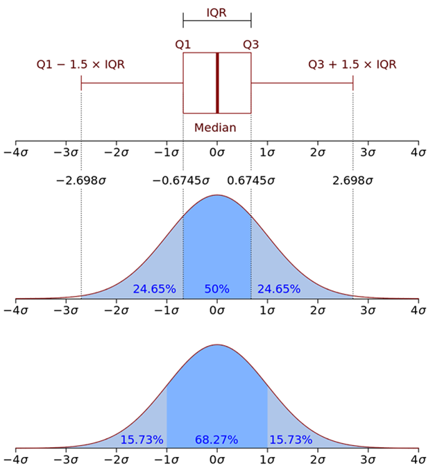

## TADA Leverages the Water Quality eXchange (WQX) QAQC Service

This is a overview of the the WQX Quality Assurance and Quality Control
(QAQC) data submission service, and how TADA leverages that service to
flag potentially invalid data in the Water Quality Portal (WQP). It will
cover: 1) an overview of all available WQX QAQC tests, 2) which of these
WQX validation tests are also available in TADA for testing WQP outbound
data, 3) how to interpret and provide feedback on the validation tables
referenced by WQX and TADA for this QAQC service.

## Background

The WQX philosophy for QAQC is that users submit only QAQC'd data and
utilize WQX fields to ensure the data is of "documented quality". The
WQX team has historically hosted data quality working groups aimed at
creating best practices and required data elements for WQX 3.0 for
specific parameter groups such as nutrients, metals and biological data.
These resources have supported users to submit data of documented
quality. This approach has been broadly successful, but because it is
not an enforceable approach it has allowed for data of varying quality
to be shared. In response, the WQX team released a QAQC service in 2012
to test data submissions, and help improve the quality of data that gets
into the WQP. However the new WQX services will not flag or fix data
historical that is already in the WQP. Therefore, the TADA R package
leverages the WQX QAQC Validation tables in the R package to make these
same tests available on WQP outbound data using R.

## Available Tests

Tests available in both WQX Web for data submissions & the TADA R
Package for use with data retrieved from the WQP:

-   Tests that Leverage the WQX Validation Table

    -   Flag invalid characteristic and unit combinations (e.g., flag
        data if mg/L or °C was used for pH; flag if units were left
        blank, NA, None, etc. but are required for the characteristic)

        -   See TADA Function:
            [InvalidResultUnit()](https://usepa.github.io/TADA/reference/InvalidResultUnit.html)

    -   Flag data without methods, with uncommon methods, or with
        invalid methods for the characteristic. This is contingent on
        the activity type since some activity types don't require
        methods.

        -   See TADA Function:
            [InvalidMethod()](https://usepa.github.io/TADA/reference/InvalidMethod.html)

    -   Flag data with invalid characteristic and fraction cominations

        -   See TADA Function:
            [InvalidFraction()](https://usepa.github.io/TADA/reference/InvalidFraction.html)

    -   Flag data with invalid characteristic and speciation combination

        -   See TADA Function:
            [InvalidSpeciation()](https://usepa.github.io/TADA/reference/InvalidSpeciation.html)

    -   Flag results that do not have an approved QAPP and/or do not
        include a QAPP attachment

        -   See TADA Function:
            [QAPPDocAvailable()](https://usepa.github.io/TADA/reference/QAPPDocAvailable.html)

        -   See TADA Function:
            [QAPPapproved()](https://usepa.github.io/TADA/reference/QAPPapproved.html)

    -   Flag results above or below national thresholds using the
        Interquartile Range (IQR) method. The IQR method is defined as
        the difference between the 75% percentile and the 25% percentile
        of your dataset.

        -   Upper Threshold= 75th Percentile + 1.5 \* (75th percentile -
            25th percentile)

            -   See TADA Function:
                [AboveNationalWQXUpperThreshold()](https://usepa.github.io/TADA/reference/AboveNationalWQXUpperThreshold.html)

        -   Lower Threshold= 25th Percentile - 1.5 \* (75th percentile -
            25th percentile)

            -   See TADA Function:
                [BelowNationalWQXLowerThreshold()](https://usepa.github.io/TADA/reference/BelowNationalWQXLowerThreshold.html)

[{width="428"
height="467"}](https://en.wikipedia.org/wiki/Interquartile_range)

Additional tests only available in WQX Web (for now):

-   Location

    -   Flag data where accuracy of lat/long is less than three three
        decimal degrees (e.g., 38.88°, -77.00°)

    -   Flag data where the lat/long assigned to monitoring sites is NOT
        in the state and country included in metadata

    -   Flag if monitoring locations nearby each other are likely the
        same. If they are, then provide user an option to use the
        existing monitoring location instead of creating a new one.

## Providing Feedback on Validation Tables

All WQX Domain Tables are available
[HERE](https://www.epa.gov/waterdata/storage-and-retrieval-and-water-quality-exchange-domain-services-and-downloads).
TADA leverages many of the WQX domain tables.

-   [QAQCCharacteristicValidation
    (ZIP)](https://cdx.epa.gov/wqx/download/DomainValues/QAQCCharacteristicValidation_CSV.zip) \|
    ([XML](https://cdx.epa.gov/wqx/download/DomainValues/QAQCCharacteristicValidation.zip)) 
    \|
    ([CSV)](https://cdx.epa.gov/wqx/download/DomainValues/QAQCCharacteristicValidation.CSV)

    -   Both WQX and TADA leverage the table above to flag invalid and
        uncommon results. See relevant TADA functions:

        -   [AboveNationalWQXUpperThreshold()](https://usepa.github.io/TADA/reference/AboveNationalWQXUpperThreshold.html)

        -   [BelowNationalWQXLowerThreshold()](https://usepa.github.io/TADA/reference/BelowNationalWQXLowerThreshold.html)

        -   [InvalidResultUnit()](https://usepa.github.io/TADA/reference/InvalidResultUnit.html)

        -   [InvalidMethod()](https://usepa.github.io/TADA/reference/InvalidMethod.html)

        -   [InvalidFraction()](https://usepa.github.io/TADA/reference/InvalidFraction.html)

        -   [InvalidSpeciation()](https://usepa.github.io/TADA/reference/InvalidSpeciation.html)

-   [MeasureUnit
    (ZIP)](https://cdx.epa.gov/wqx/download/DomainValues/MeasureUnit_CSV.zip) \|
    ([XML](https://cdx.epa.gov/wqx/download/DomainValues/MeasureUnit.zip))\| [(CSV)](https://cdx.epa.gov/wqx/download/DomainValues/MeasureUnit.CSV)

    -   Both WQX and TADA leverage the table above to convert all data
        for each unique characteristic to a consistent unit, so that
        results can then we assessed against the WQX upper and lower
        thresholds in the validataion table. Target units for each
        charactersitic are included in the MeasureUnit domain table.
        TADA leverages this table to convert all data for each unique
        characteristic to a consistent target unit. See relevant TADA
        functions:

    -   See TADA Function:
        [TADA_ConvertResultUnits()](https://usepa.github.io/TADA/reference/ConvertResultUnits.html)

All TADA Reference and Validation Tables are also available in the R
Package [HERE](https://github.com/USEPA/TADA/tree/develop/inst/extdata).
TADA pulls the WQX Validation Table and other domain tables into TADA
and updates them automatically whenever changes are made

-   https://github.com/USEPA/TADA/blob/develop/inst/extdata/WQXcharValRef.csv

-   https://github.com/USEPA/TADA/blob/develop/inst/extdata/WQXunitRef.csv

WQX and TADA users can review and provide feedback on the validation
table and/or target units assigned, and provide feedback by emailing the
WQX helpdesk (WQX\@epa.gov).
