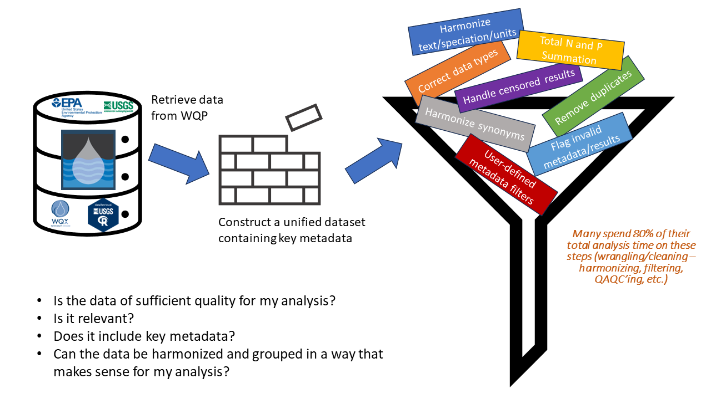

```{r setup, include=FALSE}
knitr::opts_chunk$set(echo = FALSE)
```

# DRAFT WORKSHOP PRESENTATION

## (5 mins) Introduction

This workshop showcases how to integrate several R Packages developed by the U.S. Environmental Protection Agency (EPA) and the U.S. Geological Survey (USGS) to create efficient and reproducible workflows that support water quality programs and research. For example, performing watershed or waterbody level analyses such as Clean Water Act Assessments.

## Intended audience

Water Quality eXchange (WQX) and Water Quality Portal (WQP) community, Clean Water Act (CWA) Assessment community (EPA, States and Tribal Nations), water quality and geospatial data analysts/researchers, EPA/USGS and other federal agencies.

## Agenda

This workshop demonstrates potential uses (beyond their original collection purpose) for publicly available water quality data from Water Quality Portal (WQP). To start, participants will learn how to use EPA’s Tools for Automated Data Analysis (TADA) R Package to retrieve, wrangle, harmonize, quality check, visualize and analyze WQP data from multiple organizations.

## Agenda

Next, we will showcase how to bring in other web services and libraries for easy integration of additional hydrologic data including USGS continuous sensor data (using the NLDI via DR?) and geospatial data (using StreamCat). We then plan to touch briefly on packages that can assist with building statistical models. Finally, we will demonstrate an example workflow for analyzing water quality by Assessment Units, which are state or tribal nation defined watershed or waterbody areas used for CWA assessments and reporting water quality conditions to EPA and the public.

## Packages

-   EPA: EPATADA, StreamCatTools, spsurvey, spmodel, SSN2

-   USGS: dataRetrieval/NLDI, nhdplusTools, hydroloom

-   Fundamental geospatial packages: sf, terra, leaflet and tmap

# (30 mins) Retrieving and Preparing Data for Analysis

# (15 mins) Leveraging the EPATADA R Package for WQP Discovery and Cleaning

Let's dive into Green Bay, WI!

## Install and load EPATADA

Install and load the remotes package.

```{r, eval = F}
if(!"remotes"%in%installed.packages()){
install.packages("remotes")
}

library(remotes)
```

Install and load the [EPATADA R Package](https://github.com/USEPA/EPATADA) from GitHub.

```{r, eval = F}
remotes::install_github("USEPA/EPATADA", 
                        ref = "develop", 
                        dependencies = TRUE, 
                        force = TRUE)

library(EPATADA)
```

```{r, include = F, eval = T}
library(devtools)
load_all()
```

It's go time! Let's time our process.

```{r}
# Record start time
start.time <- Sys.time()
```

## Intro to TADA Module 1: Water Quality Portal Data Discovery and Cleaning

This is an abbreviated introduction to key TADA Module 1 WQP Data Discovery and Cleaning functions. Additional functions and a more detailed example workflow is available [here](https://usepa.github.io/EPATADA/articles/TADAModule1.html).

## Retrieve data from the WQP

In this example, we will first use EPA's How's My Waterway (HMW) application to find an applicable Hydrologic Unit Code (HUC) for our area of interest - the [Fox River, Green Bay, WI](https://mywaterway.epa.gov/community/040302040405/monitoring). Next, let's query the WQP using the identified HUC, state abbreviation, and a date range. In this example, we'll start by pulling all data available in the WQP for this HUC 12 in Wisconsin for the last 5 years.

WATERSHED: City of Green Bay-Fox River (040302040405)

```{r}
GreenBay_FoxRiver <- TADA_DataRetrieval(
  statecode = "WI",
  startDate = "2015-01-01",
  endDate = "2024-12-30",
  huc = c("040302040405"),
  applyautoclean = TRUE
)
```

## Wrangle

Now, let's use EPATADA functions to review, visualize, and whittle the returned WQP data down to include only results that are applicable to our water quality analysis and area of interest.



## Flag and remove duplicate results from a single organization

```{r}
GreenBay_FoxRiver <- TADA_FindPotentialDuplicatesSingleOrg(GreenBay_FoxRiver)

GreenBay_FoxRiver <- dplyr::filter(GreenBay_FoxRiver, TADA.SingleOrgDup.Flag == "Unique")
```

## Autoclean

```{r}
GreenBay_FoxRiver <- TADA_AutoClean(GreenBay_FoxRiver)
```

## Handle censored results

```{r}
GreenBay_FoxRiver <- TADA_SimpleCensoredMethods(GreenBay_FoxRiver, nd_method = "multiplier", nd_multiplier = 0.5, od_method = "as-is", od_multiplier = "null")
```

## Flag and remove duplicates from multiple organizations

Two organizations sometimes submit the same exact data to WQP.

```{r}
GreenBay_FoxRiver <- TADA_FindPotentialDuplicatesMultipleOrgs(GreenBay_FoxRiver)

GreenBay_FoxRiver <- dplyr::filter(GreenBay_FoxRiver, TADA.ResultSelectedMultipleOrgs == "Y")
```

## Filter out any remaining irrelevant data, NA's and empty columns

```{r}
unique(GreenBay_FoxRiver$TADA.ResultMeasureValueDataTypes.Flag)

sum(is.na(GreenBay_FoxRiver$TADA.ResultMeasureValue))

GreenBay_FoxRiver = TADA_AutoFilter(GreenBay_FoxRiver)

unique(GreenBay_FoxRiver$TADA.ResultMeasureValueDataTypes.Flag)

sum(is.na(GreenBay_FoxRiver$TADA.ResultMeasureValue))
# CM note for team discussion: Should results with NA units be dealt with now as well within TADA_AutoFilter?

sum(is.na(GreenBay_FoxRiver$TADA.LattitudeMeasure))
```

## Flag and remove QAQC samples and suspect results

```{r}
GreenBay_FoxRiver <- TADA_RunKeyFlagFunctions(GreenBay_FoxRiver, clean = TRUE)
```

## Flag results above and below threshold, but do not remove them

```{r}
GreenBay_FoxRiver <- TADA_FlagAboveThreshold(GreenBay_FoxRiver, clean = FALSE, flaggedonly = FALSE)

GreenBay_FoxRiver <- TADA_FlagBelowThreshold(GreenBay_FoxRiver, clean = FALSE, flaggedonly = FALSE)
```

## Harmonize synonyms across characteristic, fraction, and speciation

```{r}
GreenBay_FoxRiver <- TADA_HarmonizeSynonyms(GreenBay_FoxRiver)
```

## Calculate Total N and Total P from various species and fractions

```{r}
GreenBay_FoxRiver <- TADA_CalculateTotalNP(GreenBay_FoxRiver, daily_agg = "max")
```

## Review unique characteristic, fraction, and species combinations

```{r}
GreenBay_FoxRiver_Counts <- TADA_FieldValuesTable(GreenBay_FoxRiver, field = "TADA.ComparableDataIdentifier")

DT::datatable(GreenBay_FoxRiver_Counts, fillContainer = TRUE)
```

## Filter to focus on frequently monitored characteristics in example data

```{r}
GreenBay_FoxRiver_Subset <- GreenBay_FoxRiver %>%
  dplyr::filter(TADA.ComparableDataIdentifier %in%
      c("SPECIFIC CONDUCTANCE_NA_NA_US/CM", 
      "PH_NA_NA_NA", 
      "TOTAL NITROGEN, MIXED FORMS_UNFILTERED_AS N_MG/L",
      "TOTAL PHOSPHORUS, MIXED FORMS_UNFILTERED_AS P_UG/L",
      "DISSOLVED OXYGEN (DO)_NA_NA_MG/L"))
```

## Review organizations for subset

```{r}
# Create pie of results by organization
TADA_FieldValuesPie(GreenBay_FoxRiver_Subset, field = "OrganizationFormalName")
```

## EPATADA Visualizations

## Generate stats table

```{r}
GreenBay_FoxRiver_Subset_Stats <- TADA_Stats(GreenBay_FoxRiver_Subset)

DT::datatable(GreenBay_FoxRiver_Subset_Stats, fillContainer = TRUE)
```

## Generate scatterplot

```{r}
TADA_TwoCharacteristicScatterplot(GreenBay_FoxRiver_Subset, id_cols = "TADA.ComparableDataIdentifier",  groups = c("TOTAL PHOSPHORUS, MIXED FORMS_UNFILTERED_AS P_UG/L", "TOTAL NITROGEN, MIXED FORMS_UNFILTERED_AS N_MG/L"))
```

## Generate map

```{r}
TADA_OverviewMap(GreenBay_FoxRiver)

GreenBay_FoxRiver = TADA_FlagCoordinates(GreenBay_FoxRiver, clean_outsideUSA = "change sign", clean_imprecise = FALSE)
```

## (15 mins) Ingestion of additional hydrologic data using NLDI and Streamcat

## Combine additional data with WQP data

Placeholder for integration of other data sources (presenter TBD)

1.  USGS continuous sensor data
2.  StreamCat

# (5 mins) Example Use Case 1: Building Statistical Models

placeholder for spsurvey, spmodel, SSN2 slides (Michael)

# (30 mins) Example Use Case 2: Clean Water Act (CWA) Section 303(d) Assessments Part A

TADA_MakeSpatial(), TADA_GetATTAINS(), TADA_ViewATTAINS()

## TADA Module 2: Geospatial Functions

Additional functions and a more detailed example workflow is available here: <https://usepa.github.io/EPATADA/articles/TADAModule2.html>

## CWA Assessment Process

We do not have time to cover the full process today. Let's focus on geospatial aspects!

[Integrated Reporting Memoranda under CWA Sections 303(d), 305(b) and 314](https://www.epa.gov/tmdl/Integrated%20Reporting%20Guidance%20under%20CWA%20Sections%20303%28d%29%2C%20305%28b%29%20and%20314).

## What are Assessment Units?

Geospatial areas for analysis. Let's assign data to those units!

CWA assessment determinations are made by assessment unit, meaning the entire assessment unit is assessed as either meeting or not meeting water quality standards (i.e., thresholds or criteria) for all designated uses.

## How are assessment units delineated?

Assessment units are typically delineated by using watershed-oriented collections of stream reaches, often broken down by physical features like waterfalls, bridge crossings, or changes in land use, to analyze water quality impairments within a specific area, ensuring data homogeneity and spatial clarity within the assessment unit.

-   Existing Assessment Units are available from ATTAINS geospatial services

## Associating ATTAINS Assessment Units with WQP Monitoring Locations

One of the first steps in the CWA assessment process is to define Assessment Units and associate data with them. A major source for water quality data is the WQP.

## Associating ATTAINS Assessment Units with WQP Monitoring Locations

-   Assessment Units: state or tribal waterbody geospatial features
    -   These may be lines, areas or points
-   Water Quality Portal Monitoring Locations
    -   These are points

## TADA_GetATTAINS()

-   Automates matching of WQP monitoring locations with ATTAINS assessment units that fall within (intersect) the same NHDPlus catchment ([details](https://usepa.github.io/EPATADA/articles/TADAModule2.html))
-   The function uses high resolution NHDPlus catchments by default because 80% of state submitted assessment units in ATTAINS were developed based on high res NHD; users can select med-res if applicable to their use case

```{r}
# WQP_withATTAINSonly <- TADA_GetATTAINS(GreenBay_FoxRiver, fill_catchments = FALSE, return_sf = TRUE)
```

## Challenges with Automated Approach

-   Certain NHDPlus high res catchments overlap multiple ATTAINS assessment units (state submitted hydrography) which means the sites are assigned to both AUs in the current functions. Another challenge is that the WQP sites are not always accurate (imprecise coordinates). WQP location metadata may also be helpful for matching/QAQC'ing waterbody names with ATTAINS waterbody names instead of relying solely on the lat/long and geospatial/mapping information. Users must manually review associations for accuracy.

## Using all available data from the WQP

Finally, some waterbodies have data available in the WQP or from other sources, but there are no existing Assessment Units in ATTAINS for them. In the next section, we will share a way to create AU's using NHDPlus high resolution catchments.

# Example Use Case 2: Clean Water Act (CWA) Section 303(d) Assessments Part B

nhdplusTools, TADA::fetchNHD(), TADA_GetATTAINS(), TADA_ViewATTAINS()

## Creating new AUs to assess additional areas (leveraging USGS's nhdplusTools and TADA geospatial functions)

TADA has included a way to do this using TADA_GetATTAINS() fill_catchments function input. This is included for exploratory purposes only. In theory, states and tribal nations could use the high res catchments as new assessment unit polygons to assess additional areas where there is WQP data but no Assessment Unit yet in ATTAINS, but that process is outside of TADA.

## Creating new AUs to assess additional areas

For WQP monitoring sites that DO NOT overlap an existing ATTAINS feature (neither ATTAINS NHDPlus high res catchment snap shot or state submitted points/lines/polys), there is nothing to use from ATTAINS because these are areas where there is WQP data but no ATTAINS Assessment Unit yet.

## Creating new AUs to assess additional areas

For these, we implemented a solution using NHDPlusTools to pull in either NHDPlus high res or med res catchments (user can choose, but high res is the default) and match those with the WQP sites & create new IDs (essentially creating new AUs that are the catchments that intersect these WQP sites).

```{r}
# WQP_withATTAINSandNHDPluscatchments <- TADA_GetATTAINS(GreenBay_FoxRiver, fill_catchments = TRUE, return_sf = TRUE)
```

# (15 mins) Visualizing Water Quality Issues

-   Placeholder: Now that we have data assigned to watershed/waterbodies (Assessment Units). Let's showcase how to visualize water quality issues for a few characteristics of interest on a map and in figures using available packages.

# (5 mins) Conclusion

```{r}
end.time <- Sys.time()

end.time - start.time
```

## Contribute

Note: TADA is still under development. New functionality is added weekly, and sometimes we need to make bug fixes in response to tester and user feedback. We appreciate your feedback, patience, and interest in these helpful tools.

If you are interested in contributing to TADA development, more information is available at:

<https://usepa.github.io/EPATADA/articles/CONTRIBUTING.html>

We welcome collaboration with external partners.

Contribute to EPATADA in a way that helps elevate work you have already done, broadens the user base of the package, or improves the resource for all!

## Thank you to our workshop contributors!

-   EPA: Cristina Mullin (mullin.cristina\@epa.gov), Marc Weber, Hillary Marler, Kenny Wong, Michael Dumelle, Shelly Thawley

-   USGS: Dave Blodgett

## Thank you for your attention!
